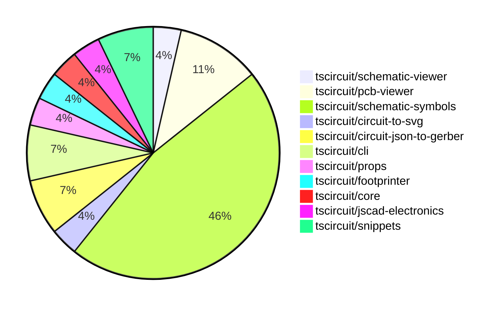

# contribution-tracker

Generates weekly contribution overviews for tscircuit contributors. Check out all
the [contribution overviews here](./contribution-overviews/)

* All PRs in the tscircuit org are scanned/summarized via Claude Haiku
* Claude classifies each Diff/PR as a Major, Minor or Tiny contribution
* All the PRs, summaries, and classifications are organized into charts and tables

The current week is shown below. There are 3 major sections:

* [Contributor Overview](#contributor-overview)
* [PRs by Repository](#prs-by-repository)
* [PRs by Contributor](#changes-by-contributor)

## Current Week

<!-- START_CURRENT_WEEK -->

# Contribution Overview 2024-09-28

## PRs by Repository

## Contributor Overview

| Contributor | 🐳 Major | 🐙 Minor | 🐌 Tiny |
|-------------|-------|-------|-------|
| DhairyaMajmudar | 1 | 0 | 0 |
| anas-sarkez | 5 | 4 | 0 |
| ShiboSoftwareDev | 2 | 2 | 0 |
| seveibar | 4 | 0 | 0 |
| abhijitxy | 1 | 0 | 0 |
| Timer00 | 1 | 1 | 0 |
| imrishabh18 | 0 | 3 | 0 |
| Abse2001 | 1 | 1 | 0 |
| Complexlity | 0 | 1 | 1 |

## Changes by Repository

### [tscircuit/schematic-viewer](https://github.com/tscircuit/schematic-viewer)

| PR # | Impact | Contributor | Description |
|------|--------|-------------|-------------|
| [#64](https://github.com/tscircuit/schematic-viewer/pull/64) | 🐳 Major | DhairyaMajmudar | Replaced the types in core.ts files with those exported from the `circuit-json` package. |

### [tscircuit/pcb-viewer](https://github.com/tscircuit/pcb-viewer)

| PR # | Impact | Contributor | Description |
|------|--------|-------------|-------------|
| [#61](https://github.com/tscircuit/pcb-viewer/pull/61) | 🐳 Major | anas-sarkez | Added hotkeys for all layers |
| [#67](https://github.com/tscircuit/pcb-viewer/pull/67) | 🐙 Minor | anas-sarkez | The change ensures that the hotkey functionality in the ToolbarOverlay component only works when the mouse is over the container. |
| [#65](https://github.com/tscircuit/pcb-viewer/pull/65) | 🐙 Minor | anas-sarkez | Replace the deprecated imports from "circuit-json" with the new ones. |

### [tscircuit/schematic-symbols](https://github.com/tscircuit/schematic-symbols)

| PR # | Impact | Contributor | Description |
|------|--------|-------------|-------------|
| [#85](https://github.com/tscircuit/schematic-symbols/pull/85) | 🐳 Major | anas-sarkez | Added a JSON definition and SVG image for a tunnel diode component. |
| [#82](https://github.com/tscircuit/schematic-symbols/pull/82) | 🐳 Major | anas-sarkez | Added an avalanche diode symbol and its JSON representation. |
| [#80](https://github.com/tscircuit/schematic-symbols/pull/80) | 🐳 Major | anas-sarkez | Added a new 'varactor diode' component with paths and text elements. |
| [#75](https://github.com/tscircuit/schematic-symbols/pull/75) | 🐳 Major | anas-sarkez | Added a new Schottky diode symbol. |
| [#72](https://github.com/tscircuit/schematic-symbols/pull/72) | 🐳 Major | seveibar | Introduce a new symbol for a photodiode and make bun run generate interactive |
| [#74](https://github.com/tscircuit/schematic-symbols/pull/74) | 🐳 Major | Timer00 | Introduce a new component, a DC voltmeter, with its SVG representation and associated JSON data. |
| [#21](https://github.com/tscircuit/schematic-symbols/pull/21) | 🐳 Major | Abse2001 | Added push_button_normally_open_momentary horz & vert symbols |
| [#81](https://github.com/tscircuit/schematic-symbols/pull/81) | 🐙 Minor | anas-sarkez | Added a new zener diode symbol. |
| [#76](https://github.com/tscircuit/schematic-symbols/pull/76) | 🐙 Minor | Timer00 | Add a formatting step to the symbol adding instructions. |
| [#86](https://github.com/tscircuit/schematic-symbols/pull/86) | 🐙 Minor | imrishabh18 | Added reference point indicators for the left and right ports of the box resistor symbol. |
| [#73](https://github.com/tscircuit/schematic-symbols/pull/73) | 🐙 Minor | imrishabh18 | Fixes the lockfile to prevent it from becoming frozen. |
| [#22](https://github.com/tscircuit/schematic-symbols/pull/22) | 🐙 Minor | imrishabh18 | Add port reference blocks for the capacitor symbol in the capacitor.json file and the capacitor.svg file. |
| [#23](https://github.com/tscircuit/schematic-symbols/pull/23) | 🐙 Minor | Abse2001 | Fixed the positioning of the ref and value text labels for various components so they will always grow away from the symbols. |

### [tscircuit/circuit-to-svg](https://github.com/tscircuit/circuit-to-svg)

| PR # | Impact | Contributor | Description |
|------|--------|-------------|-------------|
| [#80](https://github.com/tscircuit/circuit-to-svg/pull/80) | 🐙 Minor | anas-sarkez | Removed the regular expressions used to clean the text in the SVG object creation functions. |

### [tscircuit/circuit-json-to-gerber](https://github.com/tscircuit/circuit-json-to-gerber)

| PR # | Impact | Contributor | Description |
|------|--------|-------------|-------------|
| [#11](https://github.com/tscircuit/circuit-json-to-gerber/pull/11) | 🐳 Major | ShiboSoftwareDev | Implemented pcb_hole support in Excellon drill and soldermask, and updated the repository to use circuit-json. |
| [#9](https://github.com/tscircuit/circuit-json-to-gerber/pull/9) | 🐳 Major | ShiboSoftwareDev | Fixed gerber units to work with jlcpcb and pcbway |

### [tscircuit/cli](https://github.com/tscircuit/cli)

| PR # | Impact | Contributor | Description |
|------|--------|-------------|-------------|
| [#213](https://github.com/tscircuit/cli/pull/213) | 🐙 Minor | ShiboSoftwareDev | Fixed the z-index issue in the popover content component. |
| [#212](https://github.com/tscircuit/cli/pull/212) | 🐙 Minor | ShiboSoftwareDev | Fixed filepath bug in various parts of the codebase. |

### [tscircuit/props](https://github.com/tscircuit/props)

| PR # | Impact | Contributor | Description |
|------|--------|-------------|-------------|
| [#55](https://github.com/tscircuit/props/pull/55) | 🐳 Major | seveibar | Update the `schematicPinDefinitions.ts` file to introduce a new `SchematicPortArrangement` interface that combines the previous `SchematicPortArrangementWithSizes`, `SchematicPortArrangementWithSides`, and `SchematicPortArrangementWithPinCounts` types. |

### [tscircuit/footprinter](https://github.com/tscircuit/footprinter)

| PR # | Impact | Contributor | Description |
|------|--------|-------------|-------------|
| [#47](https://github.com/tscircuit/footprinter/pull/47) | 🐳 Major | seveibar | Create an axial footprint and add circuitJson function |

### [tscircuit/core](https://github.com/tscircuit/core)

| PR # | Impact | Contributor | Description |
|------|--------|-------------|-------------|
| [#130](https://github.com/tscircuit/core/pull/130) | 🐳 Major | seveibar | Add error handling when there's a missing footprint for a port in the PCB trace. |

### [tscircuit/jscad-electronics](https://github.com/tscircuit/jscad-electronics)

| PR # | Impact | Contributor | Description |
|------|--------|-------------|-------------|
| [#45](https://github.com/tscircuit/jscad-electronics/pull/45) | 🐳 Major | abhijitxy | Fix the positioning of the BGA (Ball Grid Array) component on the side |

### [tscircuit/snippets](https://github.com/tscircuit/snippets)

| PR # | Impact | Contributor | Description |
|------|--------|-------------|-------------|
| [#6](https://github.com/tscircuit/snippets/pull/6) | 🐙 Minor | Complexlity | Remove package-lock.json file |
| [#4](https://github.com/tscircuit/snippets/pull/4) | 🐌 Tiny | Complexlity | Update the favicon to match the one used on the tscircuits website. |

## Changes by Contributor

### [DhairyaMajmudar](https://github.com/DhairyaMajmudar)

| PR # | Impact | Description |
|------|--------|-------------|
| [#64](https://github.com/tscircuit/schematic-viewer/pull/64) | 🐳 Major | Replaced the types in core.ts files with those exported from the `circuit-json` package. |

### [anas-sarkez](https://github.com/anas-sarkez)

| PR # | Impact | Description |
|------|--------|-------------|
| [#61](https://github.com/tscircuit/pcb-viewer/pull/61) | 🐳 Major | Added hotkeys for all layers |
| [#85](https://github.com/tscircuit/schematic-symbols/pull/85) | 🐳 Major | Added a JSON definition and SVG image for a tunnel diode component. |
| [#82](https://github.com/tscircuit/schematic-symbols/pull/82) | 🐳 Major | Added an avalanche diode symbol and its JSON representation. |
| [#80](https://github.com/tscircuit/schematic-symbols/pull/80) | 🐳 Major | Added a new 'varactor diode' component with paths and text elements. |
| [#75](https://github.com/tscircuit/schematic-symbols/pull/75) | 🐳 Major | Added a new Schottky diode symbol. |
| [#67](https://github.com/tscircuit/pcb-viewer/pull/67) | 🐙 Minor | The change ensures that the hotkey functionality in the ToolbarOverlay component only works when the mouse is over the container. |
| [#65](https://github.com/tscircuit/pcb-viewer/pull/65) | 🐙 Minor | Replace the deprecated imports from "circuit-json" with the new ones. |
| [#80](https://github.com/tscircuit/circuit-to-svg/pull/80) | 🐙 Minor | Removed the regular expressions used to clean the text in the SVG object creation functions. |
| [#81](https://github.com/tscircuit/schematic-symbols/pull/81) | 🐙 Minor | Added a new zener diode symbol. |

### [ShiboSoftwareDev](https://github.com/ShiboSoftwareDev)

| PR # | Impact | Description |
|------|--------|-------------|
| [#11](https://github.com/tscircuit/circuit-json-to-gerber/pull/11) | 🐳 Major | Implemented pcb_hole support in Excellon drill and soldermask, and updated the repository to use circuit-json. |
| [#9](https://github.com/tscircuit/circuit-json-to-gerber/pull/9) | 🐳 Major | Fixed gerber units to work with jlcpcb and pcbway |
| [#213](https://github.com/tscircuit/cli/pull/213) | 🐙 Minor | Fixed the z-index issue in the popover content component. |
| [#212](https://github.com/tscircuit/cli/pull/212) | 🐙 Minor | Fixed filepath bug in various parts of the codebase. |

### [seveibar](https://github.com/seveibar)

| PR # | Impact | Description |
|------|--------|-------------|
| [#55](https://github.com/tscircuit/props/pull/55) | 🐳 Major | Update the `schematicPinDefinitions.ts` file to introduce a new `SchematicPortArrangement` interface that combines the previous `SchematicPortArrangementWithSizes`, `SchematicPortArrangementWithSides`, and `SchematicPortArrangementWithPinCounts` types. |
| [#47](https://github.com/tscircuit/footprinter/pull/47) | 🐳 Major | Create an axial footprint and add circuitJson function |
| [#130](https://github.com/tscircuit/core/pull/130) | 🐳 Major | Add error handling when there's a missing footprint for a port in the PCB trace. |
| [#72](https://github.com/tscircuit/schematic-symbols/pull/72) | 🐳 Major | Introduce a new symbol for a photodiode and make bun run generate interactive |

### [abhijitxy](https://github.com/abhijitxy)

| PR # | Impact | Description |
|------|--------|-------------|
| [#45](https://github.com/tscircuit/jscad-electronics/pull/45) | 🐳 Major | Fix the positioning of the BGA (Ball Grid Array) component on the side |

### [Timer00](https://github.com/Timer00)

| PR # | Impact | Description |
|------|--------|-------------|
| [#74](https://github.com/tscircuit/schematic-symbols/pull/74) | 🐳 Major | Introduce a new component, a DC voltmeter, with its SVG representation and associated JSON data. |
| [#76](https://github.com/tscircuit/schematic-symbols/pull/76) | 🐙 Minor | Add a formatting step to the symbol adding instructions. |

### [imrishabh18](https://github.com/imrishabh18)

| PR # | Impact | Description |
|------|--------|-------------|
| [#86](https://github.com/tscircuit/schematic-symbols/pull/86) | 🐙 Minor | Added reference point indicators for the left and right ports of the box resistor symbol. |
| [#73](https://github.com/tscircuit/schematic-symbols/pull/73) | 🐙 Minor | Fixes the lockfile to prevent it from becoming frozen. |
| [#22](https://github.com/tscircuit/schematic-symbols/pull/22) | 🐙 Minor | Add port reference blocks for the capacitor symbol in the capacitor.json file and the capacitor.svg file. |

### [Abse2001](https://github.com/Abse2001)

| PR # | Impact | Description |
|------|--------|-------------|
| [#21](https://github.com/tscircuit/schematic-symbols/pull/21) | 🐳 Major | Added push_button_normally_open_momentary horz & vert symbols |
| [#23](https://github.com/tscircuit/schematic-symbols/pull/23) | 🐙 Minor | Fixed the positioning of the ref and value text labels for various components so they will always grow away from the symbols. |

### [Complexlity](https://github.com/Complexlity)

| PR # | Impact | Description |
|------|--------|-------------|
| [#6](https://github.com/tscircuit/snippets/pull/6) | 🐙 Minor | Remove package-lock.json file |
| [#4](https://github.com/tscircuit/snippets/pull/4) | 🐌 Tiny | Update the favicon to match the one used on the tscircuits website. |

<!-- END_CURRENT_WEEK -->
