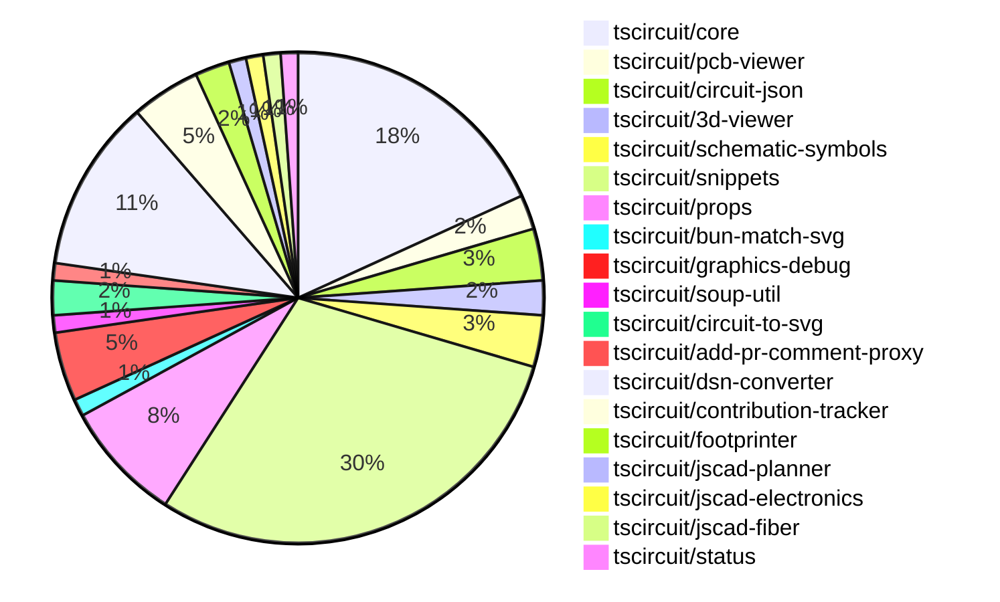

# contribution-tracker

Generates weekly contribution overviews for tscircuit contributors. Check out all
the [contribution overviews here](./contribution-overviews/)

* All PRs in the tscircuit org are scanned/summarized via Claude Haiku
* Claude classifies each Diff/PR as a Major, Minor or Tiny contribution
* All the PRs, summaries, and classifications are organized into charts and tables

The current week is shown below. There are 3 major sections:

* [Contributor Overview](#contributor-overview)
* [PRs by Repository](#prs-by-repository)
* [PRs by Contributor](#changes-by-contributor)

## Current Week

<!-- START_CURRENT_WEEK -->

# Contribution Overview 2024-11-20

## PRs by Repository

## Contributor Overview

| Contributor | 🐳 Major | 🐙 Minor | 🐌 Tiny | ⭐ |
|-------------|-------|-------|-------|-------|
| [ShiboSoftwareDev](#ShiboSoftwareDev) | 5 | 12 | 2 | ⭐⭐⭐ |
| [imrishabh18](#imrishabh18) | 4 | 14 | 0 | ⭐⭐⭐ |
| [seveibar](#seveibar) | 3 | 8 | 1 | ⭐⭐ |
| [Abse2001](#Abse2001) | 1 | 11 | 1 | ⭐⭐ |
| [anas-sarkez](#anas-sarkez) | 2 | 9 | 0 | ⭐⭐ |
| [RohittCodes](#RohittCodes) | 0 | 6 | 0 | ⭐⭐ |
| [Anshgrover23](#Anshgrover23) | 0 | 4 | 0 | ⭐ |
| [mrudulpatil18](#mrudulpatil18) | 0 | 3 | 0 | ⭐ |
| [hunxjunedo](#hunxjunedo) | 0 | 1 | 0 |  |
| [kom-senapati](#kom-senapati) | 0 | 0 | 0 |  |

## Review Table

| Contributor | Reviews Received | Approvals | Rejections | Changes Requested | PRs Opened | PRs Closed | Issues Created |
|-------------|------------------|-----------|------------|-------------------|------------|------------|----------------|n| [Abse2001](https://github.com/Abse2001) | 16 | 12 | 5 | 2 | 13 | 13 | undefined |
| [ShiboSoftwareDev](https://github.com/ShiboSoftwareDev) | 25 | 18 | 17 | 2 | 29 | 27 | undefined |
| [seveibar](https://github.com/seveibar) | 0 | 0 | 0 | 0 | 13 | 12 | undefined |
| [imrishabh18](https://github.com/imrishabh18) | 10 | 5 | 5 | 2 | 20 | 18 | undefined |
| [anas-sarkez](https://github.com/anas-sarkez) | 31 | 12 | 5 | 4 | 11 | 11 | undefined |
| [Anshgrover23](https://github.com/Anshgrover23) | 9 | 3 | 5 | 4 | 8 | 6 | undefined |
| [mrudulpatil18](https://github.com/mrudulpatil18) | 5 | 4 | 0 | 1 | 4 | 3 | undefined |
| [kom-senapati](https://github.com/kom-senapati) | 2 | 1 | 0 | 1 | 1 | 1 | undefined |
| [melmathari](https://github.com/melmathari) | 8 | 1 | 3 | 2 | 5 | 4 | undefined |
| [hunxjunedo](https://github.com/hunxjunedo) | 2 | 1 | 1 | 0 | 1 | 1 | undefined |
| [RohittCodes](https://github.com/RohittCodes) | 52 | 7 | 2 | 10 | 9 | 7 | undefined |
| [vishwamartur](https://github.com/vishwamartur) | 1 | 0 | 1 | 1 | 1 | 1 | undefined |

## Changes by Repository

### [tscircuit/core](https://github.com/tscircuit/core)

| PR # | Impact | Contributor | Description |
|------|--------|-------------|-------------|
| [#342](https://github.com/tscircuit/core/pull/342) | 🐳 Major | Abse2001 | Fixed manufacturer Part Number should go below refdes for four-sided pin layouts, handled three pin layouts, and added tests for it. |
| [#336](https://github.com/tscircuit/core/pull/336) | 🐳 Major | seveibar | Changes the default format for async autorouting from SimpleRouteJson to CircuitJson, and includes additional fixes and testing for the async autorouter in production usage. |
| [#362](https://github.com/tscircuit/core/pull/362) | 🐳 Major | anas-sarkez | Implemented a new event `renderable:renderLifecycle:anyEvent` to make it easier to listen to renderable events |
| [#367](https://github.com/tscircuit/core/pull/367) | 🐙 Minor | Abse2001 | The pull request fixes a USB-C GND & VBUS route issue by adding a new snapshot file for the repro test case. |
| [#351](https://github.com/tscircuit/core/pull/351) | 🐙 Minor | Abse2001 | Added `pin_count` and `gender` properties to the `<pinheader />` component. |
| [#339](https://github.com/tscircuit/core/pull/339) | 🐙 Minor | Abse2001 | Implemented the `getInheritedProperty` method on the `PrimitiveComponent` class to fetch inherited properties from the component hierarchy. |
| [#368](https://github.com/tscircuit/core/pull/368) | 🐙 Minor | ShiboSoftwareDev | Fixes a bug where rectangular SMT pads were not correctly displayed when the component was rotated 90 degrees. |
| [#364](https://github.com/tscircuit/core/pull/364) | 🐙 Minor | ShiboSoftwareDev | Adds support for the "rotated_rect" shape in the SmtPad component. |
| [#357](https://github.com/tscircuit/core/pull/357) | 🐙 Minor | seveibar | Adds a function to get the client origin and uses it to add a cache-bust query parameter to the URL of CAD models. |
| [#349](https://github.com/tscircuit/core/pull/349) | 🐙 Minor | imrishabh18 | Add a new crystal component |
| [#350](https://github.com/tscircuit/core/pull/350) | 🐙 Minor | imrishabh18 | Add "circuit-to-svg" as a dev dependency to reduce bundle size |
| [#333](https://github.com/tscircuit/core/pull/333) | 🐙 Minor | imrishabh18 | Adds caching for the PCB trace route to improve performance on re-rendering. |
| [#358](https://github.com/tscircuit/core/pull/358) | 🐙 Minor | anas-sarkez | Updated footprinter dependency to get newest footprints |
| [#352](https://github.com/tscircuit/core/pull/352) | 🐙 Minor | anas-sarkez | Implemented `getCurrentRenderPhase` and `getRenderGraph` methods for debugging |
| [#338](https://github.com/tscircuit/core/pull/338) | 🐙 Minor | anas-sarkez | Added support for tracing obstacles around schematic_box elements. |
| [#363](https://github.com/tscircuit/core/pull/363) | 🐙 Minor | Anshgrover23 | Fixes the bundle-size.yml workflow to run on pull requests from forks. |

### [tscircuit/pcb-viewer](https://github.com/tscircuit/pcb-viewer)

| PR # | Impact | Contributor | Description |
|------|--------|-------------|-------------|
| [#83](https://github.com/tscircuit/pcb-viewer/pull/83) | 🐙 Minor | Abse2001 | Fixed type error where a string or undefined value was being assigned to a parameter expecting a string. |
| [#82](https://github.com/tscircuit/pcb-viewer/pull/82) | 🐙 Minor | ShiboSoftwareDev | Added a biome format script to the package.json file. |

### [tscircuit/circuit-json](https://github.com/tscircuit/circuit-json)

| PR # | Impact | Contributor | Description |
|------|--------|-------------|-------------|
| [#82](https://github.com/tscircuit/circuit-json/pull/82) | 🐳 Major | ShiboSoftwareDev | Introduces a new shape called "rotated_rect" for SMT pads on the PCB. |
| [#84](https://github.com/tscircuit/circuit-json/pull/84) | 🐙 Minor | Abse2001 | Added an optional `gender` field to the `source_simple_pin_header` type. |
| [#83](https://github.com/tscircuit/circuit-json/pull/83) | 🐙 Minor | Abse2001 | Implemented a new source component called `source_simple_pin_header`. |

### [tscircuit/3d-viewer](https://github.com/tscircuit/3d-viewer)

| PR # | Impact | Contributor | Description |
|------|--------|-------------|-------------|
| [#47](https://github.com/tscircuit/3d-viewer/pull/47) | 🐙 Minor | Abse2001 | Fixes a misalignment issue in the 3D viewer components. |
| [#46](https://github.com/tscircuit/3d-viewer/pull/46) | 🐙 Minor | Abse2001 | Updates the jscad-electronics dependency to version 0.0.22 to use the sot235 in snippet for the or gate. |

### [tscircuit/schematic-symbols](https://github.com/tscircuit/schematic-symbols)

| PR # | Impact | Contributor | Description |
|------|--------|-------------|-------------|
| [#215](https://github.com/tscircuit/schematic-symbols/pull/215) | 🐙 Minor | Abse2001 | Improved the normally open and closed push button symbols by updating the coordinates and adding additional circles. |
| [#212](https://github.com/tscircuit/schematic-symbols/pull/212) | 🐙 Minor | Abse2001 | Create approximateBezier function to improve 'C' case handling and add new symbol capacitor_polarized |
| [#211](https://github.com/tscircuit/schematic-symbols/pull/211) | 🐙 Minor | hunxjunedo | Fixes the positioning of text and graphical elements in several electronic symbol files. |

### [tscircuit/snippets](https://github.com/tscircuit/snippets)

| PR # | Impact | Contributor | Description |
|------|--------|-------------|-------------|
| [#294](https://github.com/tscircuit/snippets/pull/294) | 🐳 Major | ShiboSoftwareDev | The pull request adds a comparison of the bundle size between the current PR branch and the main branch. |
| [#291](https://github.com/tscircuit/snippets/pull/291) | 🐳 Major | ShiboSoftwareDev | Adds a GitHub Actions workflow to generate a bundle size report for pull requests. |
| [#252](https://github.com/tscircuit/snippets/pull/252) | 🐳 Major | seveibar | Reverts a previous change that caused a regression where every snippet has red underlines until the user modifies it. |
| [#280](https://github.com/tscircuit/snippets/pull/280) | 🐙 Minor | Abse2001 | Implement Capacitor BOM Search |
| [#282](https://github.com/tscircuit/snippets/pull/282) | 🐙 Minor | ShiboSoftwareDev | Implemented a new feature to generate a Bill of Materials (BOM) for pin headers in the JLC Parts Engine. |
| [#277](https://github.com/tscircuit/snippets/pull/277) | 🐙 Minor | ShiboSoftwareDev | Adds a new ErrorFallback component to display error messages in the 3D viewer |
| [#267](https://github.com/tscircuit/snippets/pull/267) | 🐙 Minor | ShiboSoftwareDev | Adds a spinner to the run button when the code is running. |
| [#257](https://github.com/tscircuit/snippets/pull/257) | 🐙 Minor | ShiboSoftwareDev | Adds a dropdown menu to the "Insert" button in the Code Editor Header, with an option to insert a footprint. |
| [#264](https://github.com/tscircuit/snippets/pull/264) | 🐙 Minor | seveibar | Improve the keying for the circuit JSON object to ensure better uniqueness. |
| [#263](https://github.com/tscircuit/snippets/pull/263) | 🐙 Minor | seveibar | Update Core, enabling cloud autorouting |
| [#242](https://github.com/tscircuit/snippets/pull/242) | 🐙 Minor | seveibar | Adds a new route to redirect the `/playground` path to the editor with the `blank-circuit-board` template. |
| [#254](https://github.com/tscircuit/snippets/pull/254) | 🐙 Minor | seveibar | Adds a GitHub link with star count to the landing page |
| [#303](https://github.com/tscircuit/snippets/pull/303) | 🐙 Minor | imrishabh18 | Adds a new development login page to the application. |
| [#298](https://github.com/tscircuit/snippets/pull/298) | 🐙 Minor | imrishabh18 | Fix the `invalid_code_token` issue when not using `localhost` for the OAuth callback. |
| [#287](https://github.com/tscircuit/snippets/pull/287) | 🐙 Minor | anas-sarkez | Fixed responsiveness issue in EditorNav component |
| [#302](https://github.com/tscircuit/snippets/pull/302) | 🐙 Minor | Anshgrover23 | Fixes a regular expression issue to properly import names with dashes in the package name. |
| [#285](https://github.com/tscircuit/snippets/pull/285) | 🐙 Minor | RohittCodes | Adds a fullscreen toggle button to the preview content component. |
| [#245](https://github.com/tscircuit/snippets/pull/245) | 🐙 Minor | RohittCodes | Removes the deletion of `template` search parameter to make it persist during navigation. |
| [#202](https://github.com/tscircuit/snippets/pull/202) | 🐙 Minor | RohittCodes | Introduces a feature to remove the star from snippets. |
| [#270](https://github.com/tscircuit/snippets/pull/270) | 🐙 Minor | RohittCodes | Fixes the exact cursor position in the code editor without affecting the code or its types. |
| [#268](https://github.com/tscircuit/snippets/pull/268) | 🐙 Minor | RohittCodes | Fixes an issue where `manualEditsFileContent` was not being initialized with the `manual_edit_json` when the page loaded, causing `hasUnsavedChanges` to always be true and displaying the "Unsaved Changes" message. |
| [#248](https://github.com/tscircuit/snippets/pull/248) | 🐙 Minor | RohittCodes | Implements an update function for the `manual_edits_json` field in the `snippets` database schema and the corresponding UI components. |
| [#236](https://github.com/tscircuit/snippets/pull/236) | 🐙 Minor | mrudulpatil18 | Update the link for iframe embedding of snippets to use the `/preview` endpoint. |
| [#306](https://github.com/tscircuit/snippets/pull/306) | 🐌 Tiny | ShiboSoftwareDev | Updates the `@tscircuit/3d-viewer` dependency from version `0.0.43` to `0.0.44`. |
| [#304](https://github.com/tscircuit/snippets/pull/304) | 🐌 Tiny | ShiboSoftwareDev | Removed an extra workflow file `.github/workflows/bundle-size.yml`. |
| [#258](https://github.com/tscircuit/snippets/pull/258) | 🐌 Tiny | seveibar | Skips parts engine test on CI. |

### [tscircuit/props](https://github.com/tscircuit/props)

| PR # | Impact | Contributor | Description |
|------|--------|-------------|-------------|
| [#104](https://github.com/tscircuit/props/pull/104) | 🐙 Minor | ShiboSoftwareDev | Add support for rotated_rect SMT pad type |
| [#105](https://github.com/tscircuit/props/pull/105) | 🐙 Minor | seveibar | Adds "sequential-trace" and "subcircuit" autorouter presets. |
| [#103](https://github.com/tscircuit/props/pull/103) | 🐙 Minor | seveibar | Adds an `autorouter` property to the `SubcircuitGroupProps` interface, which can be set to an `AutorouterConfig` object, the literal strings "auto", "auto-local", or "auto-cloud". |
| [#106](https://github.com/tscircuit/props/pull/106) | 🐙 Minor | imrishabh18 | Adds the crystal component to the library's export. |
| [#102](https://github.com/tscircuit/props/pull/102) | 🐙 Minor | imrishabh18 | Exports the `PcbRouteCache` interface to make it accessible for other modules. |
| [#101](https://github.com/tscircuit/props/pull/101) | 🐙 Minor | imrishabh18 | Add `pcbRouteCache` property to `SubcircuitGroupProps` interface |
| [#108](https://github.com/tscircuit/props/pull/108) | 🐌 Tiny | Abse2001 | Change the default gender of the pin header to "male" in the `pinHeaderProps` type. |

### [tscircuit/bun-match-svg](https://github.com/tscircuit/bun-match-svg)

| PR # | Impact | Contributor | Description |
|------|--------|-------------|-------------|
| [#4](https://github.com/tscircuit/bun-match-svg/pull/4) | 🐳 Major | ShiboSoftwareDev | Implemented a CLI tool that initializes the project in other repositories by creating an example test, a preload file, and a bunfig.toml file. |

### [tscircuit/graphics-debug](https://github.com/tscircuit/graphics-debug)

| PR # | Impact | Contributor | Description |
|------|--------|-------------|-------------|
| [#10](https://github.com/tscircuit/graphics-debug/pull/10) | 🐳 Major | ShiboSoftwareDev | Introduce a table that lists all graphics objects and highlights them when hovering over the table entries. |
| [#9](https://github.com/tscircuit/graphics-debug/pull/9) | 🐙 Minor | ShiboSoftwareDev | Adds error handling to the `getSvgsFromLogString` function and displays the error message on the UI. |
| [#8](https://github.com/tscircuit/graphics-debug/pull/8) | 🐙 Minor | mrudulpatil18 | Fixes the issue with crosshair visibility on the website by adding a custom `SVGRenderer` component to handle SVGs generated with script correctly. |
| [#7](https://github.com/tscircuit/graphics-debug/pull/7) | 🐙 Minor | mrudulpatil18 | Adds a "See Example" button to load sample graphics data in the input element for visualization |

### [tscircuit/soup-util](https://github.com/tscircuit/soup-util)

| PR # | Impact | Contributor | Description |
|------|--------|-------------|-------------|
| [#25](https://github.com/tscircuit/soup-util/pull/25) | 🐙 Minor | ShiboSoftwareDev | Updated the `circuit-json` dependency to version `0.0.106`. |

### [tscircuit/circuit-to-svg](https://github.com/tscircuit/circuit-to-svg)

| PR # | Impact | Contributor | Description |
|------|--------|-------------|-------------|
| [#137](https://github.com/tscircuit/circuit-to-svg/pull/137) | 🐙 Minor | ShiboSoftwareDev | Rotate the rectangles representing SMT pads counter-clockwise instead of clockwise. |
| [#136](https://github.com/tscircuit/circuit-to-svg/pull/136) | 🐙 Minor | ShiboSoftwareDev | Adds support for rendering rotated rectangular SMT pads in the PCB SVG conversion process. |

### [tscircuit/add-pr-comment-proxy](https://github.com/tscircuit/add-pr-comment-proxy)

| PR # | Impact | Contributor | Description |
|------|--------|-------------|-------------|
| [#6](https://github.com/tscircuit/add-pr-comment-proxy/pull/6) | 🐳 Major | seveibar | Ports the project to Vercel, a hosting platform for Next.js applications. |

### [tscircuit/dsn-converter](https://github.com/tscircuit/dsn-converter)

| PR # | Impact | Contributor | Description |
|------|--------|-------------|-------------|
| [#32](https://github.com/tscircuit/dsn-converter/pull/32) | 🐳 Major | imrishabh18 | Converts `pcb_trace` and `source_net` to a network of `dsn`. |
| [#29](https://github.com/tscircuit/dsn-converter/pull/29) | 🐳 Major | imrishabh18 | Grouping the components and images together like in the KiCAD DSN file format |
| [#28](https://github.com/tscircuit/dsn-converter/pull/28) | 🐳 Major | imrishabh18 | Fix the DSN file format for plated holes and their net connections. |
| [#26](https://github.com/tscircuit/dsn-converter/pull/26) | 🐙 Minor | seveibar | Adjusts the scale factor for converting DSN session to circuit JSON. |
| [#35](https://github.com/tscircuit/dsn-converter/pull/35) | 🐙 Minor | imrishabh18 | Fix the trace ID generation to ensure unique IDs for traces. |
| [#34](https://github.com/tscircuit/dsn-converter/pull/34) | 🐙 Minor | imrishabh18 | Add a GitHub Actions workflow to automatically format the code using the Biome formatter. |
| [#33](https://github.com/tscircuit/dsn-converter/pull/33) | 🐙 Minor | imrishabh18 | Added a test to check the motor driver DSN format and fixed the parseDsnJson function for conversion. |
| [#31](https://github.com/tscircuit/dsn-converter/pull/31) | 🐙 Minor | imrishabh18 | Adds support for converting "simple_chip" components from circuit-json format to DSN format. |
| [#30](https://github.com/tscircuit/dsn-converter/pull/30) | 🐙 Minor | imrishabh18 | Plated holes for the components are grouped together and images are added only once, similar to the KiCAD format. |
| [#27](https://github.com/tscircuit/dsn-converter/pull/27) | 🐙 Minor | imrishabh18 | Fixes a scaling issue in the session by adjusting the conversion factor between circuit JSON and DSN session spaces. |

### [tscircuit/contribution-tracker](https://github.com/tscircuit/contribution-tracker)

| PR # | Impact | Contributor | Description |
|------|--------|-------------|-------------|
| [#12](https://github.com/tscircuit/contribution-tracker/pull/12) | 🐳 Major | imrishabh18 | Reverts the previous "Fix review table" pull request. |
| [#8](https://github.com/tscircuit/contribution-tracker/pull/8) | 🐙 Minor | anas-sarkez | Adds a new column "Issues Created" to the Reviews Table in the generated Markdown document. |
| [#11](https://github.com/tscircuit/contribution-tracker/pull/11) | 🐙 Minor | Anshgrover23 | Fixes issues #7 and #9 in the review table, including visual improvements. |
| [#6](https://github.com/tscircuit/contribution-tracker/pull/6) | 🟣 | kom-senapati |  |

### [tscircuit/footprinter](https://github.com/tscircuit/footprinter)

| PR # | Impact | Contributor | Description |
|------|--------|-------------|-------------|
| [#86](https://github.com/tscircuit/footprinter/pull/86) | 🐳 Major | anas-sarkez | Refactor Stampboard and Stampreceiver functions to have separate pin for each smd pad and hole. |
| [#83](https://github.com/tscircuit/footprinter/pull/83) | 🐙 Minor | anas-sarkez | Refactor all footprinter functions by updating their scheme, all footprints now have a default value of num_pins. |

### [tscircuit/jscad-planner](https://github.com/tscircuit/jscad-planner)

| PR # | Impact | Contributor | Description |
|------|--------|-------------|-------------|
| [#4](https://github.com/tscircuit/jscad-planner/pull/4) | 🐙 Minor | anas-sarkez | Added `hull` and `hullChain` operations with their types and tests |

### [tscircuit/jscad-electronics](https://github.com/tscircuit/jscad-electronics)

| PR # | Impact | Contributor | Description |
|------|--------|-------------|-------------|
| [#81](https://github.com/tscircuit/jscad-electronics/pull/81) | 🐙 Minor | anas-sarkez | Implemented the `SOT235` (SOT-23-5) 3D component and added an example for the Footprinter3d component. |

### [tscircuit/jscad-fiber](https://github.com/tscircuit/jscad-fiber)

| PR # | Impact | Contributor | Description |
|------|--------|-------------|-------------|
| [#91](https://github.com/tscircuit/jscad-fiber/pull/91) | 🐙 Minor | anas-sarkez | Adds an ExampleWrapper component with code toggle functionality to the examples |

### [tscircuit/status](https://github.com/tscircuit/status)

| PR # | Impact | Contributor | Description |
|------|--------|-------------|-------------|
| [#3](https://github.com/tscircuit/status/pull/3) | 🐙 Minor | Anshgrover23 | Fix issue where bars in the service chart were getting cut off |

## Changes by Contributor

### [Abse2001](https://github.com/Abse2001)

| PR # | Impact | Description |
|------|--------|-------------|
| [#342](https://github.com/tscircuit/core/pull/342) | 🐳 Major | Fixed manufacturer Part Number should go below refdes for four-sided pin layouts, handled three pin layouts, and added tests for it. |
| [#83](https://github.com/tscircuit/pcb-viewer/pull/83) | 🐙 Minor | Fixed type error where a string or undefined value was being assigned to a parameter expecting a string. |
| [#84](https://github.com/tscircuit/circuit-json/pull/84) | 🐙 Minor | Added an optional `gender` field to the `source_simple_pin_header` type. |
| [#83](https://github.com/tscircuit/circuit-json/pull/83) | 🐙 Minor | Implemented a new source component called `source_simple_pin_header`. |
| [#47](https://github.com/tscircuit/3d-viewer/pull/47) | 🐙 Minor | Fixes a misalignment issue in the 3D viewer components. |
| [#46](https://github.com/tscircuit/3d-viewer/pull/46) | 🐙 Minor | Updates the jscad-electronics dependency to version 0.0.22 to use the sot235 in snippet for the or gate. |
| [#367](https://github.com/tscircuit/core/pull/367) | 🐙 Minor | The pull request fixes a USB-C GND & VBUS route issue by adding a new snapshot file for the repro test case. |
| [#351](https://github.com/tscircuit/core/pull/351) | 🐙 Minor | Added `pin_count` and `gender` properties to the `<pinheader />` component. |
| [#339](https://github.com/tscircuit/core/pull/339) | 🐙 Minor | Implemented the `getInheritedProperty` method on the `PrimitiveComponent` class to fetch inherited properties from the component hierarchy. |
| [#215](https://github.com/tscircuit/schematic-symbols/pull/215) | 🐙 Minor | Improved the normally open and closed push button symbols by updating the coordinates and adding additional circles. |
| [#212](https://github.com/tscircuit/schematic-symbols/pull/212) | 🐙 Minor | Create approximateBezier function to improve 'C' case handling and add new symbol capacitor_polarized |
| [#280](https://github.com/tscircuit/snippets/pull/280) | 🐙 Minor | Implement Capacitor BOM Search |
| [#108](https://github.com/tscircuit/props/pull/108) | 🐌 Tiny | Change the default gender of the pin header to "male" in the `pinHeaderProps` type. |

### [ShiboSoftwareDev](https://github.com/ShiboSoftwareDev)

| PR # | Impact | Description |
|------|--------|-------------|
| [#82](https://github.com/tscircuit/circuit-json/pull/82) | 🐳 Major | Introduces a new shape called "rotated_rect" for SMT pads on the PCB. |
| [#4](https://github.com/tscircuit/bun-match-svg/pull/4) | 🐳 Major | Implemented a CLI tool that initializes the project in other repositories by creating an example test, a preload file, and a bunfig.toml file. |
| [#294](https://github.com/tscircuit/snippets/pull/294) | 🐳 Major | The pull request adds a comparison of the bundle size between the current PR branch and the main branch. |
| [#291](https://github.com/tscircuit/snippets/pull/291) | 🐳 Major | Adds a GitHub Actions workflow to generate a bundle size report for pull requests. |
| [#10](https://github.com/tscircuit/graphics-debug/pull/10) | 🐳 Major | Introduce a table that lists all graphics objects and highlights them when hovering over the table entries. |
| [#82](https://github.com/tscircuit/pcb-viewer/pull/82) | 🐙 Minor | Added a biome format script to the package.json file. |
| [#25](https://github.com/tscircuit/soup-util/pull/25) | 🐙 Minor | Updated the `circuit-json` dependency to version `0.0.106`. |
| [#104](https://github.com/tscircuit/props/pull/104) | 🐙 Minor | Add support for rotated_rect SMT pad type |
| [#368](https://github.com/tscircuit/core/pull/368) | 🐙 Minor | Fixes a bug where rectangular SMT pads were not correctly displayed when the component was rotated 90 degrees. |
| [#364](https://github.com/tscircuit/core/pull/364) | 🐙 Minor | Adds support for the "rotated_rect" shape in the SmtPad component. |
| [#137](https://github.com/tscircuit/circuit-to-svg/pull/137) | 🐙 Minor | Rotate the rectangles representing SMT pads counter-clockwise instead of clockwise. |
| [#136](https://github.com/tscircuit/circuit-to-svg/pull/136) | 🐙 Minor | Adds support for rendering rotated rectangular SMT pads in the PCB SVG conversion process. |
| [#282](https://github.com/tscircuit/snippets/pull/282) | 🐙 Minor | Implemented a new feature to generate a Bill of Materials (BOM) for pin headers in the JLC Parts Engine. |
| [#277](https://github.com/tscircuit/snippets/pull/277) | 🐙 Minor | Adds a new ErrorFallback component to display error messages in the 3D viewer |
| [#267](https://github.com/tscircuit/snippets/pull/267) | 🐙 Minor | Adds a spinner to the run button when the code is running. |
| [#257](https://github.com/tscircuit/snippets/pull/257) | 🐙 Minor | Adds a dropdown menu to the "Insert" button in the Code Editor Header, with an option to insert a footprint. |
| [#9](https://github.com/tscircuit/graphics-debug/pull/9) | 🐙 Minor | Adds error handling to the `getSvgsFromLogString` function and displays the error message on the UI. |
| [#306](https://github.com/tscircuit/snippets/pull/306) | 🐌 Tiny | Updates the `@tscircuit/3d-viewer` dependency from version `0.0.43` to `0.0.44`. |
| [#304](https://github.com/tscircuit/snippets/pull/304) | 🐌 Tiny | Removed an extra workflow file `.github/workflows/bundle-size.yml`. |

### [seveibar](https://github.com/seveibar)

| PR # | Impact | Description |
|------|--------|-------------|
| [#336](https://github.com/tscircuit/core/pull/336) | 🐳 Major | Changes the default format for async autorouting from SimpleRouteJson to CircuitJson, and includes additional fixes and testing for the async autorouter in production usage. |
| [#252](https://github.com/tscircuit/snippets/pull/252) | 🐳 Major | Reverts a previous change that caused a regression where every snippet has red underlines until the user modifies it. |
| [#6](https://github.com/tscircuit/add-pr-comment-proxy/pull/6) | 🐳 Major | Ports the project to Vercel, a hosting platform for Next.js applications. |
| [#105](https://github.com/tscircuit/props/pull/105) | 🐙 Minor | Adds "sequential-trace" and "subcircuit" autorouter presets. |
| [#103](https://github.com/tscircuit/props/pull/103) | 🐙 Minor | Adds an `autorouter` property to the `SubcircuitGroupProps` interface, which can be set to an `AutorouterConfig` object, the literal strings "auto", "auto-local", or "auto-cloud". |
| [#357](https://github.com/tscircuit/core/pull/357) | 🐙 Minor | Adds a function to get the client origin and uses it to add a cache-bust query parameter to the URL of CAD models. |
| [#26](https://github.com/tscircuit/dsn-converter/pull/26) | 🐙 Minor | Adjusts the scale factor for converting DSN session to circuit JSON. |
| [#264](https://github.com/tscircuit/snippets/pull/264) | 🐙 Minor | Improve the keying for the circuit JSON object to ensure better uniqueness. |
| [#263](https://github.com/tscircuit/snippets/pull/263) | 🐙 Minor | Update Core, enabling cloud autorouting |
| [#242](https://github.com/tscircuit/snippets/pull/242) | 🐙 Minor | Adds a new route to redirect the `/playground` path to the editor with the `blank-circuit-board` template. |
| [#254](https://github.com/tscircuit/snippets/pull/254) | 🐙 Minor | Adds a GitHub link with star count to the landing page |
| [#258](https://github.com/tscircuit/snippets/pull/258) | 🐌 Tiny | Skips parts engine test on CI. |

### [imrishabh18](https://github.com/imrishabh18)

| PR # | Impact | Description |
|------|--------|-------------|
| [#12](https://github.com/tscircuit/contribution-tracker/pull/12) | 🐳 Major | Reverts the previous "Fix review table" pull request. |
| [#32](https://github.com/tscircuit/dsn-converter/pull/32) | 🐳 Major | Converts `pcb_trace` and `source_net` to a network of `dsn`. |
| [#29](https://github.com/tscircuit/dsn-converter/pull/29) | 🐳 Major | Grouping the components and images together like in the KiCAD DSN file format |
| [#28](https://github.com/tscircuit/dsn-converter/pull/28) | 🐳 Major | Fix the DSN file format for plated holes and their net connections. |
| [#106](https://github.com/tscircuit/props/pull/106) | 🐙 Minor | Adds the crystal component to the library's export. |
| [#102](https://github.com/tscircuit/props/pull/102) | 🐙 Minor | Exports the `PcbRouteCache` interface to make it accessible for other modules. |
| [#101](https://github.com/tscircuit/props/pull/101) | 🐙 Minor | Add `pcbRouteCache` property to `SubcircuitGroupProps` interface |
| [#349](https://github.com/tscircuit/core/pull/349) | 🐙 Minor | Add a new crystal component |
| [#350](https://github.com/tscircuit/core/pull/350) | 🐙 Minor | Add "circuit-to-svg" as a dev dependency to reduce bundle size |
| [#333](https://github.com/tscircuit/core/pull/333) | 🐙 Minor | Adds caching for the PCB trace route to improve performance on re-rendering. |
| [#35](https://github.com/tscircuit/dsn-converter/pull/35) | 🐙 Minor | Fix the trace ID generation to ensure unique IDs for traces. |
| [#34](https://github.com/tscircuit/dsn-converter/pull/34) | 🐙 Minor | Add a GitHub Actions workflow to automatically format the code using the Biome formatter. |
| [#33](https://github.com/tscircuit/dsn-converter/pull/33) | 🐙 Minor | Added a test to check the motor driver DSN format and fixed the parseDsnJson function for conversion. |
| [#31](https://github.com/tscircuit/dsn-converter/pull/31) | 🐙 Minor | Adds support for converting "simple_chip" components from circuit-json format to DSN format. |
| [#30](https://github.com/tscircuit/dsn-converter/pull/30) | 🐙 Minor | Plated holes for the components are grouped together and images are added only once, similar to the KiCAD format. |
| [#27](https://github.com/tscircuit/dsn-converter/pull/27) | 🐙 Minor | Fixes a scaling issue in the session by adjusting the conversion factor between circuit JSON and DSN session spaces. |
| [#303](https://github.com/tscircuit/snippets/pull/303) | 🐙 Minor | Adds a new development login page to the application. |
| [#298](https://github.com/tscircuit/snippets/pull/298) | 🐙 Minor | Fix the `invalid_code_token` issue when not using `localhost` for the OAuth callback. |

### [anas-sarkez](https://github.com/anas-sarkez)

| PR # | Impact | Description |
|------|--------|-------------|
| [#86](https://github.com/tscircuit/footprinter/pull/86) | 🐳 Major | Refactor Stampboard and Stampreceiver functions to have separate pin for each smd pad and hole. |
| [#362](https://github.com/tscircuit/core/pull/362) | 🐳 Major | Implemented a new event `renderable:renderLifecycle:anyEvent` to make it easier to listen to renderable events |
| [#83](https://github.com/tscircuit/footprinter/pull/83) | 🐙 Minor | Refactor all footprinter functions by updating their scheme, all footprints now have a default value of num_pins. |
| [#4](https://github.com/tscircuit/jscad-planner/pull/4) | 🐙 Minor | Added `hull` and `hullChain` operations with their types and tests |
| [#358](https://github.com/tscircuit/core/pull/358) | 🐙 Minor | Updated footprinter dependency to get newest footprints |
| [#352](https://github.com/tscircuit/core/pull/352) | 🐙 Minor | Implemented `getCurrentRenderPhase` and `getRenderGraph` methods for debugging |
| [#338](https://github.com/tscircuit/core/pull/338) | 🐙 Minor | Added support for tracing obstacles around schematic_box elements. |
| [#81](https://github.com/tscircuit/jscad-electronics/pull/81) | 🐙 Minor | Implemented the `SOT235` (SOT-23-5) 3D component and added an example for the Footprinter3d component. |
| [#91](https://github.com/tscircuit/jscad-fiber/pull/91) | 🐙 Minor | Adds an ExampleWrapper component with code toggle functionality to the examples |
| [#8](https://github.com/tscircuit/contribution-tracker/pull/8) | 🐙 Minor | Adds a new column "Issues Created" to the Reviews Table in the generated Markdown document. |
| [#287](https://github.com/tscircuit/snippets/pull/287) | 🐙 Minor | Fixed responsiveness issue in EditorNav component |

### [Anshgrover23](https://github.com/Anshgrover23)

| PR # | Impact | Description |
|------|--------|-------------|
| [#363](https://github.com/tscircuit/core/pull/363) | 🐙 Minor | Fixes the bundle-size.yml workflow to run on pull requests from forks. |
| [#11](https://github.com/tscircuit/contribution-tracker/pull/11) | 🐙 Minor | Fixes issues #7 and #9 in the review table, including visual improvements. |
| [#302](https://github.com/tscircuit/snippets/pull/302) | 🐙 Minor | Fixes a regular expression issue to properly import names with dashes in the package name. |
| [#3](https://github.com/tscircuit/status/pull/3) | 🐙 Minor | Fix issue where bars in the service chart were getting cut off |

### [kom-senapati](https://github.com/kom-senapati)

| PR # | Impact | Description |
|------|--------|-------------|
| [#6](https://github.com/tscircuit/contribution-tracker/pull/6) | 🟣 |  |

### [hunxjunedo](https://github.com/hunxjunedo)

| PR # | Impact | Description |
|------|--------|-------------|
| [#211](https://github.com/tscircuit/schematic-symbols/pull/211) | 🐙 Minor | Fixes the positioning of text and graphical elements in several electronic symbol files. |

### [RohittCodes](https://github.com/RohittCodes)

| PR # | Impact | Description |
|------|--------|-------------|
| [#285](https://github.com/tscircuit/snippets/pull/285) | 🐙 Minor | Adds a fullscreen toggle button to the preview content component. |
| [#245](https://github.com/tscircuit/snippets/pull/245) | 🐙 Minor | Removes the deletion of `template` search parameter to make it persist during navigation. |
| [#202](https://github.com/tscircuit/snippets/pull/202) | 🐙 Minor | Introduces a feature to remove the star from snippets. |
| [#270](https://github.com/tscircuit/snippets/pull/270) | 🐙 Minor | Fixes the exact cursor position in the code editor without affecting the code or its types. |
| [#268](https://github.com/tscircuit/snippets/pull/268) | 🐙 Minor | Fixes an issue where `manualEditsFileContent` was not being initialized with the `manual_edit_json` when the page loaded, causing `hasUnsavedChanges` to always be true and displaying the "Unsaved Changes" message. |
| [#248](https://github.com/tscircuit/snippets/pull/248) | 🐙 Minor | Implements an update function for the `manual_edits_json` field in the `snippets` database schema and the corresponding UI components. |

### [mrudulpatil18](https://github.com/mrudulpatil18)

| PR # | Impact | Description |
|------|--------|-------------|
| [#236](https://github.com/tscircuit/snippets/pull/236) | 🐙 Minor | Update the link for iframe embedding of snippets to use the `/preview` endpoint. |
| [#8](https://github.com/tscircuit/graphics-debug/pull/8) | 🐙 Minor | Fixes the issue with crosshair visibility on the website by adding a custom `SVGRenderer` component to handle SVGs generated with script correctly. |
| [#7](https://github.com/tscircuit/graphics-debug/pull/7) | 🐙 Minor | Adds a "See Example" button to load sample graphics data in the input element for visualization |

<!-- END_CURRENT_WEEK -->
