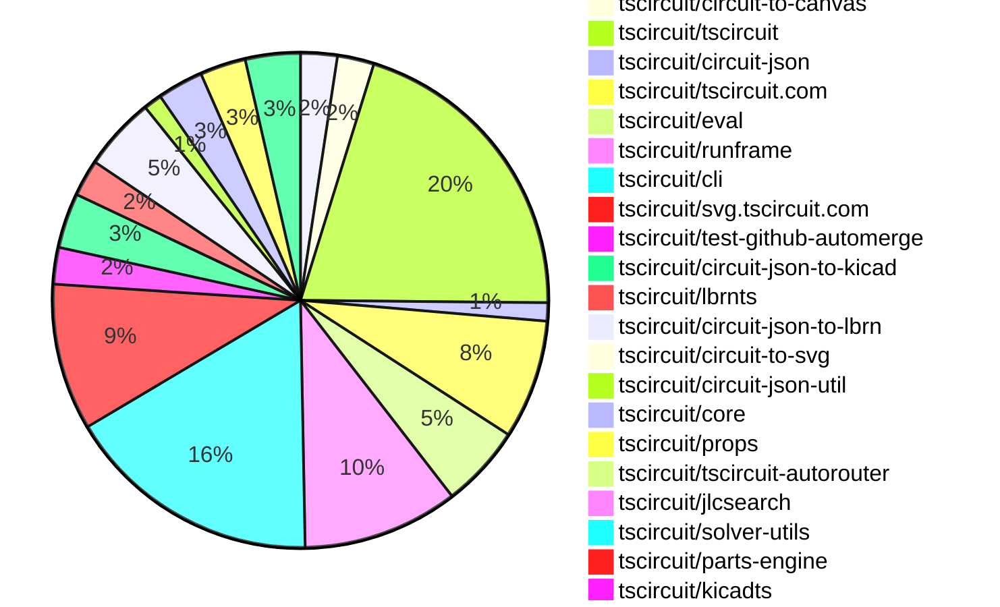

# contribution tracker

[contributions.tscircuit.com](https://contributions.tscircuit.com) ・ [tscircuit.com](https://tscircuit.com) ・ [Contribution Overviews](./contribution-overviews/) ・ [Changelogs](./changelogs/)

Generates weekly contribution overviews for tscircuit contributors. Check out all
the [contribution overviews here](./contribution-overviews/)
You can find AI-generated monthly changelogs in the [changelogs directory](./changelogs/)

- All PRs in the tscircuit org are scanned/summarized via an LLM
- The LLM classifies each Diff/PR as into a set of attributes for scoring
- All the PRs, summaries, and classifications are organized into charts and tables for [the website](https://contributions.tscircuit.com)

> Want to run locally? See the [Development Section](#development)

The current week is shown below. There are 4 major sections:

- [Contributor Overview](#contributor-overview)
- [PRs by Repository](#prs-by-repository)
- [PRs by Contributor](#changes-by-contributor)
- [Scoring & Sponsorship System](#scoring--sponsorship-system)

## Current Week

<!-- START_CURRENT_WEEK -->

# Contribution Overview 2026-01-21

The current week is shown below. There are 3 major sections:

- [Contributor Overview](#contributor-overview)
- [PRs by Repository](#prs-by-repository)
- [PRs by Contributor](#changes-by-contributor)
- [Scoring & Sponsorship Details](/docs/sponsorship-calculation-explanation.md)

## PRs by Repository



## Contributor Overview

| Contributor | 🐳 Major | 🐙 Minor | 🐌 Tiny | ⭐ | Discussion Contributions |
|-------------|---------|---------|---------|-----|--------------------------|
| [seveibar](#seveibar) | 1 | 8 | 4 | ⭐⭐ | 0🔹 0🔶 0💎 |
| [AnasSarkiz](#AnasSarkiz) | 1 | 5 | 5 | ⭐⭐ | 0🔹 0🔶 0💎 |
| [ShiboSoftwareDev](#ShiboSoftwareDev) | 2 | 1 | 2 | ⭐⭐ | 0🔹 0🔶 0💎 |
| [tscircuitbot](#tscircuitbot) | 0 | 0 | 125 | ⭐⭐ | 0🔹 0🔶 0💎 |
| [imrishabh18](#imrishabh18) | 1 | 2 | 3 | ⭐⭐ | 0🔹 0🔶 0💎 |
| [techmannih](#techmannih) | 0 | 3 | 0 | ⭐ | 0🔹 0🔶 0💎 |
| [Abse2001](#Abse2001) | 0 | 3 | 0 | ⭐ | 0🔹 0🔶 0💎 |
| [0hmX](#0hmX) | 2 | 0 | 0 | ⭐ | 0🔹 0🔶 0💎 |
| [MustafaMulla29](#MustafaMulla29) | 2 | 0 | 0 | ⭐ | 0🔹 0🔶 0💎 |
| [Ayushjhawar8](#Ayushjhawar8) | 0 | 1 | 1 |  | 0🔹 0🔶 0💎 |
| [Heinrich-XIAO](#Heinrich-XIAO) | 0 | 0 | 1 |  | 0🔹 0🔶 0💎 |

> Note: AI evaluates PRs and assigns 1-3 star ratings automatically. 4 and 5 star ratings require manual staff review.

### Discussion Contribution Legend

- 🔹 Normal Comments: Basic participation with minimal effort
- 🔶 Great Informative Comments: Thoughtful participation that adds value
- 💎 Incredible Comments: Exceptional participation with high-quality content

## Review Table

[reviews-received-hover]: ## "Number of reviews received for PRs for this contributor"
[approvals-received-hover]: ## "Number of approvals received for PRs this contributor authored"
[rejections-received-hover]: ## "Number of rejections received for PRs this contributor authored"
[prs-opened-hover]: ## "Number of PRs opened by this contributor"
[issues-created-hover]: ## "Number of issues created by this contributor"

| Contributor | Reviews Received | Approvals Received | Rejections Received | Approvals | Rejections | PRs Opened | PRs Merged | Issues Created |
|---|---|---|---|---|---|---|---|---|
| [tscircuitbot](#tscircuitbot) | 1 | 0 | 0 | 0 | 0 | 139 | 125 | 0 |
| [Abse2001](#Abse2001) | 4 | 3 | 0 | 2 | 0 | 3 | 3 | 0 |
| [ShiboSoftwareDev](#ShiboSoftwareDev) | 5 | 5 | 0 | 3 | 0 | 5 | 5 | 0 |
| [shehaban](#shehaban) | 3 | 0 | 1 | 0 | 0 | 2 | 0 | 0 |
| [techmannih](#techmannih) | 7 | 4 | 1 | 1 | 1 | 5 | 3 | 0 |
| [imrishabh18](#imrishabh18) | 3 | 3 | 0 | 3 | 2 | 8 | 6 | 0 |
| [seveibar](#seveibar) | 1 | 1 | 0 | 15 | 2 | 17 | 13 | 0 |
| [0hmX](#0hmX) | 4 | 2 | 0 | 0 | 0 | 3 | 2 | 0 |
| [bimakw](#bimakw) | 3 | 0 | 0 | 0 | 0 | 2 | 0 | 0 |
| [nailoo](#nailoo) | 11 | 1 | 3 | 0 | 0 | 2 | 0 | 0 |
| [Ayushjhawar8](#Ayushjhawar8) | 2 | 2 | 0 | 0 | 0 | 4 | 2 | 0 |
| [Heinrich-XIAO](#Heinrich-XIAO) | 1 | 1 | 0 | 0 | 0 | 1 | 1 | 0 |
| [CodisRedding](#CodisRedding) | 1 | 0 | 0 | 0 | 0 | 1 | 0 | 0 |
| [MustafaMulla29](#MustafaMulla29) | 2 | 1 | 0 | 0 | 0 | 2 | 2 | 0 |
| [AnasSarkiz](#AnasSarkiz) | 2 | 2 | 0 | 1 | 0 | 11 | 11 | 0 |

## Changes by Repository

### [tscircuit/pcb-viewer](https://github.com/tscircuit/pcb-viewer)

| PR # | Impact | Rating | Contributor | Description |
|------|--------|--------|-------------|-------------|
| [#616](https://github.com/tscircuit/pcb-viewer/pull/616) | 🐙 Minor | ⭐⭐ | Abse2001 | Adds support for rendering multiple boards within a single panel, ensuring independent drawing and correct order, along with test fixtures for validation. |
| [#618](https://github.com/tscircuit/pcb-viewer/pull/618) | 🐙 Minor | ⭐⭐ | Abse2001 | Fixes the issue where panel outlines are not rendering in the PCB viewer. |

<details>
<summary>🐌 Tiny Contributions (2)</summary>

| PR # | Impact | Contributor | Description |
|------|--------|-------------|-------------|
| [#619](https://github.com/tscircuit/pcb-viewer/pull/619) | 🐌 Tiny | tscircuitbot | Automated package update |
| [#617](https://github.com/tscircuit/pcb-viewer/pull/617) | 🐌 Tiny | tscircuitbot | Automated package update |

</details>

### [tscircuit/circuit-to-canvas](https://github.com/tscircuit/circuit-to-canvas)

| PR # | Impact | Rating | Contributor | Description |
|------|--------|--------|-------------|-------------|
| [#128](https://github.com/tscircuit/circuit-to-canvas/pull/128) | 🐙 Minor | ⭐⭐ | Abse2001 | Adds support for drawing pcb_panel elements and integrates them into the render pipeline ahead of the board outline, establishing a correct panel  board  copper draw order for accurate visualization of panelized PCB layouts. |
| [#126](https://github.com/tscircuit/circuit-to-canvas/pull/126) | 🐙 Minor | ⭐⭐ | techmannih | Fixes text rendering to support multi-line text input in PCB silkscreen drawings. |

<details>
<summary>🐌 Tiny Contributions (2)</summary>

| PR # | Impact | Contributor | Description |
|------|--------|-------------|-------------|
| [#127](https://github.com/tscircuit/circuit-to-canvas/pull/127) | 🐌 Tiny | tscircuitbot | Updates the package version from 0.0.54 to 0.0.55 in package.json |
| [#129](https://github.com/tscircuit/circuit-to-canvas/pull/129) | 🐌 Tiny | tscircuitbot | Automated package update |

</details>

### [tscircuit/tscircuit](https://github.com/tscircuit/tscircuit)


<details>
<summary>🐌 Tiny Contributions (34)</summary>

| PR # | Impact | Contributor | Description |
|------|--------|-------------|-------------|
| [#1943](https://github.com/tscircuit/tscircuit/pull/1943) | 🐌 Tiny | tscircuitbot | Automated package update |
| [#1942](https://github.com/tscircuit/tscircuit/pull/1942) | 🐌 Tiny | tscircuitbot | Automated package update |
| [#1932](https://github.com/tscircuit/tscircuit/pull/1932) | 🐌 Tiny | tscircuitbot | Updates the tscircuitcli package to version 0.1.786 |
| [#1934](https://github.com/tscircuit/tscircuit/pull/1934) | 🐌 Tiny | tscircuitbot | Updates the tscircuitcli package from version 0.1.786 to 0.1.787 and the tscircuitrunframe package from version 0.0.1502 to 0.0.1503 in package.json |
| [#1926](https://github.com/tscircuit/tscircuit/pull/1926) | 🐌 Tiny | tscircuitbot | Updates the tscircuitcli package to version 0.1.783 in package.json |
| [#1918](https://github.com/tscircuit/tscircuit/pull/1918) | 🐌 Tiny | tscircuitbot | Updates the tscircuitcli package to version 0.1.779 |
| [#1917](https://github.com/tscircuit/tscircuit/pull/1917) | 🐌 Tiny | tscircuitbot | Automated package update |
| [#1921](https://github.com/tscircuit/tscircuit/pull/1921) | 🐌 Tiny | tscircuitbot | Automated package update |
| [#1940](https://github.com/tscircuit/tscircuit/pull/1940) | 🐌 Tiny | tscircuitbot | Updates the tscircuitcli package to version 0.1.790 in package.json |
| [#1922](https://github.com/tscircuit/tscircuit/pull/1922) | 🐌 Tiny | tscircuitbot | Automated package update |
| [#1928](https://github.com/tscircuit/tscircuit/pull/1928) | 🐌 Tiny | tscircuitbot | Updates the tscircuitcli package to version 0.1.784 in the package.json file. |
| [#1938](https://github.com/tscircuit/tscircuit/pull/1938) | 🐌 Tiny | tscircuitbot | Updates the tscircuitcli package from version 0.1.788 to 0.1.789 and the tscircuitrunframe package from version 0.0.1503 to 0.0.1504 in package.json |
| [#1915](https://github.com/tscircuit/tscircuit/pull/1915) | 🐌 Tiny | tscircuitbot | Updates the package version from 0.0.1171 to 0.0.1172 in package.json |
| [#1925](https://github.com/tscircuit/tscircuit/pull/1925) | 🐌 Tiny | tscircuitbot | Automated package update |
| [#1910](https://github.com/tscircuit/tscircuit/pull/1910) | 🐌 Tiny | tscircuitbot | Updates the tscircuitcli package from version 0.1.774 to 0.1.775 and the tscircuitrunframe package from version 0.0.1497 to 0.0.1498 in package.json |
| [#1920](https://github.com/tscircuit/tscircuit/pull/1920) | 🐌 Tiny | tscircuitbot | Updates the tscircuitcli package to version 0.1.780 |
| [#1924](https://github.com/tscircuit/tscircuit/pull/1924) | 🐌 Tiny | tscircuitbot | Updates the tscircuitcli package from version 0.1.781 to 0.1.782 and the tscircuitrunframe package from version 0.0.1500 to 0.0.1501 in package.json |
| [#1935](https://github.com/tscircuit/tscircuit/pull/1935) | 🐌 Tiny | tscircuitbot | Automated package update |
| [#1931](https://github.com/tscircuit/tscircuit/pull/1931) | 🐌 Tiny | tscircuitbot | Automated package update |
| [#1923](https://github.com/tscircuit/tscircuit/pull/1923) | 🐌 Tiny | tscircuitbot | Automated package update |
| [#1912](https://github.com/tscircuit/tscircuit/pull/1912) | 🐌 Tiny | tscircuitbot | Automated package update |
| [#1929](https://github.com/tscircuit/tscircuit/pull/1929) | 🐌 Tiny | tscircuitbot | Automated package update |
| [#1939](https://github.com/tscircuit/tscircuit/pull/1939) | 🐌 Tiny | tscircuitbot | Automated package update |
| [#1919](https://github.com/tscircuit/tscircuit/pull/1919) | 🐌 Tiny | tscircuitbot | Automated package update |
| [#1911](https://github.com/tscircuit/tscircuit/pull/1911) | 🐌 Tiny | tscircuitbot | Automated package update |
| [#1913](https://github.com/tscircuit/tscircuit/pull/1913) | 🐌 Tiny | tscircuitbot | Automated package update |
| [#1914](https://github.com/tscircuit/tscircuit/pull/1914) | 🐌 Tiny | tscircuitbot | Automated package update |
| [#1933](https://github.com/tscircuit/tscircuit/pull/1933) | 🐌 Tiny | tscircuitbot | Automated package update |
| [#1927](https://github.com/tscircuit/tscircuit/pull/1927) | 🐌 Tiny | tscircuitbot | Automated package update |
| [#1937](https://github.com/tscircuit/tscircuit/pull/1937) | 🐌 Tiny | tscircuitbot | Automated package update |
| [#1941](https://github.com/tscircuit/tscircuit/pull/1941) | 🐌 Tiny | tscircuitbot | Automated package update |
| [#1936](https://github.com/tscircuit/tscircuit/pull/1936) | 🐌 Tiny | tscircuitbot | Automated package update |
| [#1930](https://github.com/tscircuit/tscircuit/pull/1930) | 🐌 Tiny | tscircuitbot | Automated package update |
| [#1916](https://github.com/tscircuit/tscircuit/pull/1916) | 🐌 Tiny | tscircuitbot | Updates the tscircuitcli package to version 0.1.778 |

</details>

### [tscircuit/circuit-json](https://github.com/tscircuit/circuit-json)

| PR # | Impact | Rating | Contributor | Description |
|------|--------|--------|-------------|-------------|
| [#416](https://github.com/tscircuit/circuit-json/pull/416) | 🐙 Minor | ⭐⭐ | techmannih | Adds an optional display_name field to the SourceComponentBase interface and schema, allowing for more descriptive identification of source components. |

<details>
<summary>🐌 Tiny Contributions (1)</summary>

| PR # | Impact | Contributor | Description |
|------|--------|-------------|-------------|
| [#417](https://github.com/tscircuit/circuit-json/pull/417) | 🐌 Tiny | tscircuitbot | Automated package update |

</details>

### [tscircuit/tscircuit.com](https://github.com/tscircuit/tscircuit.com)


<details>
<summary>🐌 Tiny Contributions (13)</summary>

| PR # | Impact | Contributor | Description |
|------|--------|-------------|-------------|
| [#2532](https://github.com/tscircuit/tscircuit.com/pull/2532) | 🐌 Tiny | tscircuitbot | Updates the tscircuitrunframe package from version 0.0.1505 to 0.0.1506 |
| [#2531](https://github.com/tscircuit/tscircuit.com/pull/2531) | 🐌 Tiny | tscircuitbot | Automated package update for tscircuiteval from version 0.0.597 to 0.0.598 |
| [#2530](https://github.com/tscircuit/tscircuit.com/pull/2530) | 🐌 Tiny | tscircuitbot | Updates the tscircuitrunframe package from version 0.0.1504 to 0.0.1505 |
| [#2520](https://github.com/tscircuit/tscircuit.com/pull/2520) | 🐌 Tiny | tscircuitbot | Updates the tscircuitrunframe package from version 0.0.1497 to 0.0.1498 |
| [#2528](https://github.com/tscircuit/tscircuit.com/pull/2528) | 🐌 Tiny | tscircuitbot | Updates the tscircuitrunframe package from version 0.0.1502 to 0.0.1503 |
| [#2526](https://github.com/tscircuit/tscircuit.com/pull/2526) | 🐌 Tiny | tscircuitbot | Updates the tscircuiteval package from version 0.0.596 to 0.0.597 |
| [#2522](https://github.com/tscircuit/tscircuit.com/pull/2522) | 🐌 Tiny | tscircuitbot | Updates the tscircuitrunframe package from version 0.0.1498 to 0.0.1499 |
| [#2529](https://github.com/tscircuit/tscircuit.com/pull/2529) | 🐌 Tiny | tscircuitbot | Updates the tscircuitrunframe package from version 0.0.1503 to 0.0.1504 |
| [#2525](https://github.com/tscircuit/tscircuit.com/pull/2525) | 🐌 Tiny | tscircuitbot | Automated package update |
| [#2524](https://github.com/tscircuit/tscircuit.com/pull/2524) | 🐌 Tiny | tscircuitbot | Automated package update |
| [#2527](https://github.com/tscircuit/tscircuit.com/pull/2527) | 🐌 Tiny | tscircuitbot | Updates the tscircuitrunframe package from version 0.0.1501 to 0.0.1502 |
| [#2521](https://github.com/tscircuit/tscircuit.com/pull/2521) | 🐌 Tiny | tscircuitbot | Automated package update |
| [#2523](https://github.com/tscircuit/tscircuit.com/pull/2523) | 🐌 Tiny | tscircuitbot | Updates the tscircuitrunframe package from version 0.0.1499 to 0.0.1500 |

</details>

### [tscircuit/eval](https://github.com/tscircuit/eval)


<details>
<summary>🐌 Tiny Contributions (9)</summary>

| PR # | Impact | Contributor | Description |
|------|--------|-------------|-------------|
| [#1902](https://github.com/tscircuit/eval/pull/1902) | 🐌 Tiny | tscircuitbot | Automated package update |
| [#1901](https://github.com/tscircuit/eval/pull/1901) | 🐌 Tiny | tscircuitbot | Automated package update |
| [#1893](https://github.com/tscircuit/eval/pull/1893) | 🐌 Tiny | tscircuitbot | Updates the version of the tscircuitcore package from 0.0.978 to 0.0.979 in package.json |
| [#1897](https://github.com/tscircuit/eval/pull/1897) | 🐌 Tiny | tscircuitbot | Updates the version of the tscircuitcore package from 0.0.980 to 0.0.981 in package.json |
| [#1898](https://github.com/tscircuit/eval/pull/1898) | 🐌 Tiny | tscircuitbot | Automated package update |
| [#1894](https://github.com/tscircuit/eval/pull/1894) | 🐌 Tiny | tscircuitbot | Automated package update |
| [#1895](https://github.com/tscircuit/eval/pull/1895) | 🐌 Tiny | tscircuitbot | Automated package update |
| [#1891](https://github.com/tscircuit/eval/pull/1891) | 🐌 Tiny | tscircuitbot | Automated package update |
| [#1890](https://github.com/tscircuit/eval/pull/1890) | 🐌 Tiny | tscircuitbot | Automated package update |

</details>

### [tscircuit/runframe](https://github.com/tscircuit/runframe)


<details>
<summary>🐌 Tiny Contributions (17)</summary>

| PR # | Impact | Contributor | Description |
|------|--------|-------------|-------------|
| [#2388](https://github.com/tscircuit/runframe/pull/2388) | 🐌 Tiny | tscircuitbot | Automated package update |
| [#2387](https://github.com/tscircuit/runframe/pull/2387) | 🐌 Tiny | tscircuitbot | Updates the tscircuiteval package to version 0.0.598 in the package.json file. |
| [#2385](https://github.com/tscircuit/runframe/pull/2385) | 🐌 Tiny | tscircuitbot | Updates the circuit-json-to-kicad package version from 0.0.35 to 0.0.37 in package.json |
| [#2382](https://github.com/tscircuit/runframe/pull/2382) | 🐌 Tiny | tscircuitbot | Updates the circuit-json-to-kicad package version from 0.0.34 to 0.0.35 in package.json |
| [#2380](https://github.com/tscircuit/runframe/pull/2380) | 🐌 Tiny | tscircuitbot | Automated package update |
| [#2379](https://github.com/tscircuit/runframe/pull/2379) | 🐌 Tiny | tscircuitbot | Updates the tscircuitpcb-viewer package from version 1.11.319 to 1.11.320 |
| [#2378](https://github.com/tscircuit/runframe/pull/2378) | 🐌 Tiny | tscircuitbot | Automated package update |
| [#2377](https://github.com/tscircuit/runframe/pull/2377) | 🐌 Tiny | tscircuitbot | Updates the tscircuiteval package from version 0.0.596 to 0.0.597 in the package.json file. |
| [#2372](https://github.com/tscircuit/runframe/pull/2372) | 🐌 Tiny | tscircuitbot | Automated package update |
| [#2383](https://github.com/tscircuit/runframe/pull/2383) | 🐌 Tiny | tscircuitbot | Automated package update |
| [#2376](https://github.com/tscircuit/runframe/pull/2376) | 🐌 Tiny | tscircuitbot | Automated package update |
| [#2375](https://github.com/tscircuit/runframe/pull/2375) | 🐌 Tiny | tscircuitbot | Updates the tscircuiteval package from version 0.0.595 to 0.0.596 in the package.json file. |
| [#2374](https://github.com/tscircuit/runframe/pull/2374) | 🐌 Tiny | tscircuitbot | Automated package update |
| [#2373](https://github.com/tscircuit/runframe/pull/2373) | 🐌 Tiny | tscircuitbot | Updates the tscircuitpcb-viewer package from version 1.11.317 to 1.11.319 |
| [#2371](https://github.com/tscircuit/runframe/pull/2371) | 🐌 Tiny | tscircuitbot | Updates the tscircuiteval package version from 0.0.594 to 0.0.595 in package.json |
| [#2370](https://github.com/tscircuit/runframe/pull/2370) | 🐌 Tiny | tscircuitbot | Automated package update |
| [#2369](https://github.com/tscircuit/runframe/pull/2369) | 🐌 Tiny | Heinrich-XIAO | Adds https:github.comtscircuittscircuit.comissues2519 |

</details>

### [tscircuit/cli](https://github.com/tscircuit/cli)

| PR # | Impact | Rating | Contributor | Description |
|------|--------|--------|-------------|-------------|
| [#1684](https://github.com/tscircuit/cli/pull/1684) | 🐳 Major | ⭐⭐⭐ | imrishabh18 | Adds concurrency support for building circuit files using Node.js worker threads, allowing multiple files to be processed in parallel, improving build performance. |
| [#1713](https://github.com/tscircuit/cli/pull/1713) | 🐙 Minor | ⭐⭐ | seveibar | Changes the component instantiation in KiCad library conversion to use a fixed reference name REF instead of component-specific names, ensuring consistent naming in generated circuit JSON and footprints. |
| [#1690](https://github.com/tscircuit/cli/pull/1690) | 🐙 Minor | ⭐⭐ | seveibar | Allows KiCad PCM generation to use a custom deployment URL so generated PCM repository and package download URLs can point to non-default deployments. |
| [#1688](https://github.com/tscircuit/cli/pull/1688) | 🐙 Minor | ⭐⭐ | seveibar | Adds functionality to verify the contents of a generated ZIP file in the KiCad PCM assets build process. |
| [#1675](https://github.com/tscircuit/cli/pull/1675) | 🐙 Minor | ⭐⭐ | imrishabh18 | Fixes infinite recursion of prebuildCommand when buildCommand is executed with the --ci flag |

<details>
<summary>🐌 Tiny Contributions (23)</summary>

| PR # | Impact | Contributor | Description |
|------|--------|-------------|-------------|
| [#1718](https://github.com/tscircuit/cli/pull/1718) | 🐌 Tiny | tscircuitbot | Updates the tscircuitrunframe package from version 0.0.1504 to 0.0.1505 |
| [#1681](https://github.com/tscircuit/cli/pull/1681) | 🐌 Tiny | tscircuitbot | Automated package update |
| [#1693](https://github.com/tscircuit/cli/pull/1693) | 🐌 Tiny | tscircuitbot | Updates the tscircuitrunframe package from version 0.0.1500 to 0.0.1501 |
| [#1704](https://github.com/tscircuit/cli/pull/1704) | 🐌 Tiny | tscircuitbot | Updates the tscircuitrunframe package from version 0.0.1502 to 0.0.1503 |
| [#1679](https://github.com/tscircuit/cli/pull/1679) | 🐌 Tiny | tscircuitbot | Automated package update |
| [#1680](https://github.com/tscircuit/cli/pull/1680) | 🐌 Tiny | tscircuitbot | Updates the tscircuitrunframe package from version 0.0.1498 to 0.0.1499 |
| [#1678](https://github.com/tscircuit/cli/pull/1678) | 🐌 Tiny | tscircuitbot | Updates the tscircuitrunframe package from version 0.0.1497 to 0.0.1498 |
| [#1702](https://github.com/tscircuit/cli/pull/1702) | 🐌 Tiny | tscircuitbot | Automated package update |
| [#1687](https://github.com/tscircuit/cli/pull/1687) | 🐌 Tiny | tscircuitbot | Automated package update |
| [#1714](https://github.com/tscircuit/cli/pull/1714) | 🐌 Tiny | tscircuitbot | Updates the tscircuitrunframe package from version 0.0.1503 to 0.0.1504 |
| [#1689](https://github.com/tscircuit/cli/pull/1689) | 🐌 Tiny | tscircuitbot | Automated package update |
| [#1717](https://github.com/tscircuit/cli/pull/1717) | 🐌 Tiny | tscircuitbot | Automated package update |
| [#1697](https://github.com/tscircuit/cli/pull/1697) | 🐌 Tiny | tscircuitbot | Updates the tscircuitrunframe package from version 0.0.1501 to 0.0.1502 |
| [#1683](https://github.com/tscircuit/cli/pull/1683) | 🐌 Tiny | tscircuitbot | Automated package update |
| [#1685](https://github.com/tscircuit/cli/pull/1685) | 🐌 Tiny | tscircuitbot | Automated package update |
| [#1711](https://github.com/tscircuit/cli/pull/1711) | 🐌 Tiny | tscircuitbot | Automated package update |
| [#1695](https://github.com/tscircuit/cli/pull/1695) | 🐌 Tiny | tscircuitbot | Automated package update |
| [#1698](https://github.com/tscircuit/cli/pull/1698) | 🐌 Tiny | tscircuitbot | Automated package update |
| [#1682](https://github.com/tscircuit/cli/pull/1682) | 🐌 Tiny | tscircuitbot | Automated package update |
| [#1710](https://github.com/tscircuit/cli/pull/1710) | 🐌 Tiny | seveibar | Synchronizes the JSON schema with the TypeScript configuration definition, adding a new cloud flag and enforcing compile-time checks to prevent schema mismatches. |
| [#1700](https://github.com/tscircuit/cli/pull/1700) | 🐌 Tiny | imrishabh18 | Changes the method of fetching the latest version of the tscircuit package from cdnjs to npmjs. |
| [#1686](https://github.com/tscircuit/cli/pull/1686) | 🐌 Tiny | imrishabh18 | Fixes the entrypoint worker file for the published package by ensuring the correct file is used based on the environment (development or production). |
| [#1691](https://github.com/tscircuit/cli/pull/1691) | 🐌 Tiny | imrishabh18 | Adds console logs to indicate the progress of various steps in the KiCad PCM build process. |

</details>

### [tscircuit/svg.tscircuit.com](https://github.com/tscircuit/svg.tscircuit.com)


<details>
<summary>🐌 Tiny Contributions (16)</summary>

| PR # | Impact | Contributor | Description |
|------|--------|-------------|-------------|
| [#868](https://github.com/tscircuit/svg.tscircuit.com/pull/868) | 🐌 Tiny | tscircuitbot | Automated package update |
| [#860](https://github.com/tscircuit/svg.tscircuit.com/pull/860) | 🐌 Tiny | tscircuitbot | Updates the tscircuit package version from 0.0.1176 to 0.0.1177 in package.json |
| [#863](https://github.com/tscircuit/svg.tscircuit.com/pull/863) | 🐌 Tiny | tscircuitbot | Updates the tscircuit package version from 0.0.1180 to 0.0.1181 in package.json |
| [#866](https://github.com/tscircuit/svg.tscircuit.com/pull/866) | 🐌 Tiny | tscircuitbot | Updates the tscircuit package from version 0.0.1183 to 0.0.1184 in package.json |
| [#853](https://github.com/tscircuit/svg.tscircuit.com/pull/853) | 🐌 Tiny | tscircuitbot | Updates the tscircuit package version from 0.0.1168 to 0.0.1170 in package.json |
| [#855](https://github.com/tscircuit/svg.tscircuit.com/pull/855) | 🐌 Tiny | tscircuitbot | Updates the tscircuit package from version 0.0.1171 to 0.0.1172 in package.json |
| [#857](https://github.com/tscircuit/svg.tscircuit.com/pull/857) | 🐌 Tiny | tscircuitbot | Updates the tscircuit package version from 0.0.1173 to 0.0.1174 in package.json |
| [#861](https://github.com/tscircuit/svg.tscircuit.com/pull/861) | 🐌 Tiny | tscircuitbot | Updates the tscircuit package from version 0.0.1177 to 0.0.1178 in package.json |
| [#867](https://github.com/tscircuit/svg.tscircuit.com/pull/867) | 🐌 Tiny | tscircuitbot | Updates the tscircuit package version from 0.0.1184 to 0.0.1185 in package.json |
| [#854](https://github.com/tscircuit/svg.tscircuit.com/pull/854) | 🐌 Tiny | tscircuitbot | Updates the tscircuit package version from 0.0.1170 to 0.0.1171 in package.json |
| [#858](https://github.com/tscircuit/svg.tscircuit.com/pull/858) | 🐌 Tiny | tscircuitbot | Updates the tscircuit package from version 0.0.1174 to 0.0.1175 in package.json |
| [#865](https://github.com/tscircuit/svg.tscircuit.com/pull/865) | 🐌 Tiny | tscircuitbot | Automated package update |
| [#862](https://github.com/tscircuit/svg.tscircuit.com/pull/862) | 🐌 Tiny | tscircuitbot | Updates the tscircuit package version from 0.0.1178 to 0.0.1180 in package.json |
| [#864](https://github.com/tscircuit/svg.tscircuit.com/pull/864) | 🐌 Tiny | tscircuitbot | Updates the tscircuit package version from 0.0.1181 to 0.0.1182 in package.json |
| [#859](https://github.com/tscircuit/svg.tscircuit.com/pull/859) | 🐌 Tiny | tscircuitbot | Updates the tscircuit package from version 0.0.1175 to 0.0.1176 in package.json |
| [#856](https://github.com/tscircuit/svg.tscircuit.com/pull/856) | 🐌 Tiny | tscircuitbot | Updates the tscircuit package version from 0.0.1172 to 0.0.1173 in package.json |

</details>

### [tscircuit/test-github-automerge](https://github.com/tscircuit/test-github-automerge)


<details>
<summary>🐌 Tiny Contributions (4)</summary>

| PR # | Impact | Contributor | Description |
|------|--------|-------------|-------------|
| [#11](https://github.com/tscircuit/test-github-automerge/pull/11) | 🐌 Tiny | tscircuitbot | Updates the tscircuitcircuit-json-util package from version 0.0.75 to 0.0.76 in the development dependencies. |
| [#13](https://github.com/tscircuit/test-github-automerge/pull/13) | 🐌 Tiny | tscircuitbot | Updates the tscircuitcircuit-json-util package from version 0.0.76 to 0.0.77 in the development dependencies. |
| [#14](https://github.com/tscircuit/test-github-automerge/pull/14) | 🐌 Tiny | tscircuitbot | Updates the tscircuitcircuit-json-util package from version 0.0.76 to 0.0.77 in the project dependencies. |
| [#12](https://github.com/tscircuit/test-github-automerge/pull/12) | 🐌 Tiny | tscircuitbot | Updates the tscircuitcircuit-json-util package from version 0.0.75 to 0.0.76 |

</details>

### [tscircuit/circuit-json-to-kicad](https://github.com/tscircuit/circuit-json-to-kicad)

| PR # | Impact | Rating | Contributor | Description |
|------|--------|--------|-------------|-------------|
| [#56](https://github.com/tscircuit/circuit-json-to-kicad/pull/56) | 🐳 Major | ⭐⭐⭐ | MustafaMulla29 | Adds support for including metadata in kicad_mod files, allowing for enhanced component properties and attributes. |

<details>
<summary>🐌 Tiny Contributions (5)</summary>

| PR # | Impact | Contributor | Description |
|------|--------|-------------|-------------|
| [#57](https://github.com/tscircuit/circuit-json-to-kicad/pull/57) | 🐌 Tiny | tscircuitbot | Automated package update |
| [#55](https://github.com/tscircuit/circuit-json-to-kicad/pull/55) | 🐌 Tiny | tscircuitbot | Automated package update |
| [#54](https://github.com/tscircuit/circuit-json-to-kicad/pull/54) | 🐌 Tiny | tscircuitbot | Automated package update |
| [#53](https://github.com/tscircuit/circuit-json-to-kicad/pull/53) | 🐌 Tiny | seveibar | Ensure generated .kicad_mod footprints include KiCad-like defaults (descrtags, properties, embedded fonts, and attr) so library output matches real KiCad expectations. Ensure silkscreen text that matches a component name is emitted as a KiCad reference text element so referencevalue text are handled consistently. |
| [#52](https://github.com/tscircuit/circuit-json-to-kicad/pull/52) | 🐌 Tiny | seveibar | Standardizes generated 3D model references in KiCad footprint modules to use project-relative paths instead of KIPRJMOD URIs, ensuring compatibility with projects expecting repository-relative locations. |

</details>

### [tscircuit/lbrnts](https://github.com/tscircuit/lbrnts)

| PR # | Impact | Rating | Contributor | Description |
|------|--------|--------|-------------|-------------|
| [#25](https://github.com/tscircuit/lbrnts/pull/25) | 🐙 Minor | ⭐⭐ | AnasSarkiz | Fixes LightBurn incompatibility by exporting crossHatch property as numeric values (10) instead of string values (truefalse) in XML. |
| [#23](https://github.com/tscircuit/lbrnts/pull/23) | 🐙 Minor | ⭐⭐ | AnasSarkiz | Standardizes ShapeGroup XML output by wrapping child shapes in a Children element to comply with LightBurn requirements while maintaining backward compatibility. |

<details>
<summary>🐌 Tiny Contributions (2)</summary>

| PR # | Impact | Contributor | Description |
|------|--------|-------------|-------------|
| [#24](https://github.com/tscircuit/lbrnts/pull/24) | 🐌 Tiny | tscircuitbot | Updates the package version from 0.0.13 to 0.0.14 in package.json |
| [#26](https://github.com/tscircuit/lbrnts/pull/26) | 🐌 Tiny | tscircuitbot | Automated package update to version 0.0.15 |

</details>

### [tscircuit/circuit-json-to-lbrn](https://github.com/tscircuit/circuit-json-to-lbrn)

| PR # | Impact | Rating | Contributor | Description |
|------|--------|--------|-------------|-------------|
| [#99](https://github.com/tscircuit/circuit-json-to-lbrn/pull/99) | 🐙 Minor | ⭐⭐ | seveibar | Fixes example05 by updating the lbrnts dependency and correcting the copper fill conversion logic in the test. |
| [#103](https://github.com/tscircuit/circuit-json-to-lbrn/pull/103) | 🐙 Minor | ⭐⭐ | AnasSarkiz | Fixes SVG preview handling by awaiting the async conversion of circuit JSON to LBRN format, ensuring correct rendering of LightBurn projects. |

<details>
<summary>🐌 Tiny Contributions (6)</summary>

| PR # | Impact | Contributor | Description |
|------|--------|-------------|-------------|
| [#106](https://github.com/tscircuit/circuit-json-to-lbrn/pull/106) | 🐌 Tiny | tscircuitbot | Automated package update |
| [#104](https://github.com/tscircuit/circuit-json-to-lbrn/pull/104) | 🐌 Tiny | tscircuitbot | Automated package update |
| [#100](https://github.com/tscircuit/circuit-json-to-lbrn/pull/100) | 🐌 Tiny | tscircuitbot | Automated package update |
| [#102](https://github.com/tscircuit/circuit-json-to-lbrn/pull/102) | 🐌 Tiny | tscircuitbot | Automated package update |
| [#101](https://github.com/tscircuit/circuit-json-to-lbrn/pull/101) | 🐌 Tiny | AnasSarkiz | Adds a CODEOWNERS file designating AnasSarkiz as the code owner for all files in the repository |
| [#105](https://github.com/tscircuit/circuit-json-to-lbrn/pull/105) | 🐌 Tiny | AnasSarkiz | Updates the lbrnts dependency to version 0.0.15 to resolve a configuration issue with crossHatch. |

</details>

### [tscircuit/circuit-to-svg](https://github.com/tscircuit/circuit-to-svg)

| PR # | Impact | Rating | Contributor | Description |
|------|--------|--------|-------------|-------------|
| [#487](https://github.com/tscircuit/circuit-to-svg/pull/487) | 🐙 Minor | ⭐⭐ | techmannih | Adds support for using the display_name property of schematic components in SVG rendering, allowing for more descriptive labels in the generated output. |

### [tscircuit/circuit-json-util](https://github.com/tscircuit/circuit-json-util)

| PR # | Impact | Rating | Contributor | Description |
|------|--------|--------|-------------|-------------|
| [#75](https://github.com/tscircuit/circuit-json-util/pull/75) | 🐳 Major | ⭐⭐⭐ | ShiboSoftwareDev | Refactored the buildSubtree function to recursively include child subcircuits when querying by subcircuit_id, ensuring complete subtree extraction for hierarchical circuit structures. Added subcircuit_ids and source_board_id options for enhanced flexibility. Included comprehensive tests validating nested subcircuit handling with real-world repro data. This enables proper isolation and manipulation of complex subcircuits, a critical feature for advanced circuit analysis workflows. |

<details>
<summary>🐌 Tiny Contributions (1)</summary>

| PR # | Impact | Contributor | Description |
|------|--------|-------------|-------------|
| [#74](https://github.com/tscircuit/circuit-json-util/pull/74) | 🐌 Tiny | ShiboSoftwareDev | Add GitHub Actions workflow to check code formatting on pushes and PRs to main branch and format entire codebase using Biome formatter, adding trailing commas, fixing indentation, and improving readability. |

</details>

### [tscircuit/core](https://github.com/tscircuit/core)

| PR # | Impact | Rating | Contributor | Description |
|------|--------|--------|-------------|-------------|
| [#1849](https://github.com/tscircuit/core/pull/1849) | 🐳 Major | ⭐⭐⭐ | ShiboSoftwareDev | Introduces isolated Design Rule Checks (DRC) for individual boards within multi-board panels or subcircuits, ensuring precise error isolation and reporting. |
| [#1846](https://github.com/tscircuit/core/pull/1846) | 🐳 Major | ⭐⭐⭐ | 0hmX | Updates the autorouter dependency to version 0.0.264, introducing uniform port point distribution and a trace width solver. |
| [#1847](https://github.com/tscircuit/core/pull/1847) | 🐙 Minor | ⭐⭐ | ShiboSoftwareDev | Fixes outline translation calculation for boards with custom outlines to ensure correct centering for all board types, not just those in panels. |

<details>
<summary>🐌 Tiny Contributions (2)</summary>

| PR # | Impact | Contributor | Description |
|------|--------|-------------|-------------|
| [#1851](https://github.com/tscircuit/core/pull/1851) | 🐌 Tiny | ShiboSoftwareDev | Adds a warning for users when manual board positioning is used in automatic panel layouts, indicating that the manual coordinates will be ignored. |
| [#1853](https://github.com/tscircuit/core/pull/1853) | 🐌 Tiny | seveibar | Updates the tscircuitprops dependency to version 0.0.448 to support kicadFootprintMetadata. |

</details>

### [tscircuit/props](https://github.com/tscircuit/props)

| PR # | Impact | Rating | Contributor | Description |
|------|--------|--------|-------------|-------------|
| [#559](https://github.com/tscircuit/props/pull/559) | 🐳 Major | ⭐⭐⭐ | seveibar | Add a structured schema and TypeScript interfaces to capture KiCad footprint metadata, allowing components to include richer footprint information for export and round-trip workflows. |
| [#558](https://github.com/tscircuit/props/pull/558) | 🐙 Minor | ⭐⭐ | seveibar | Add an optional datasheetUrl field to common component props so components can reference an external datasheet URL. |
| [#556](https://github.com/tscircuit/props/pull/556) | 🐙 Minor | ⭐⭐ | seveibar | Adds an availableJumperTypes option to the autorouter configuration, allowing users to restrict jumper footprint choices, and regenerates documentation to reflect this change. |
| [#555](https://github.com/tscircuit/props/pull/555) | 🐙 Minor | ⭐⭐ | seveibar | Add an optional displayName property to the CommonComponentProps interface and update related documentation and validation schemas accordingly. |
| [#557](https://github.com/tscircuit/props/pull/557) | 🐙 Minor | ⭐⭐ | seveibar | Allows copperpour  to accept an explicit polygon outline so copper pours can follow boardshape outlines similar to the board outline field and support more precise pour geometry. |

### [tscircuit/tscircuit-autorouter](https://github.com/tscircuit/tscircuit-autorouter)

| PR # | Impact | Rating | Contributor | Description |
|------|--------|--------|-------------|-------------|
| [#547](https://github.com/tscircuit/tscircuit-autorouter/pull/547) | 🐳 Major | ⭐⭐⭐ | 0hmX | Modifies the TraceWidthSolver to adjust trace widths based on nominal widths specified in connections, enhancing routing accuracy. |

### [tscircuit/jlcsearch](https://github.com/tscircuit/jlcsearch)

| PR # | Impact | Rating | Contributor | Description |
|------|--------|--------|-------------|-------------|
| [#115](https://github.com/tscircuit/jlcsearch/pull/115) | 🐙 Minor | ⭐⭐ | Ayushjhawar8 | Fixes the potentiometer data query to include all potentiometer-related subcategories instead of only those in the Resistors category. |

### [tscircuit/solver-utils](https://github.com/tscircuit/solver-utils)


<details>
<summary>🐌 Tiny Contributions (1)</summary>

| PR # | Impact | Contributor | Description |
|------|--------|-------------|-------------|
| [#17](https://github.com/tscircuit/solver-utils/pull/17) | 🐌 Tiny | Ayushjhawar8 | Refactors the solver name retrieval in various components to use the getSolverName() method for consistency in error messages and file downloads. |

</details>

### [tscircuit/parts-engine](https://github.com/tscircuit/parts-engine)

| PR # | Impact | Rating | Contributor | Description |
|------|--------|--------|-------------|-------------|
| [#18](https://github.com/tscircuit/parts-engine/pull/18) | 🐙 Minor | ⭐⭐ | imrishabh18 | Prevents HTTP requests when insufficient details are provided for source components, specifically when jlcpcbPackage or footprinterString are missing. |

### [tscircuit/kicadts](https://github.com/tscircuit/kicadts)

| PR # | Impact | Rating | Contributor | Description |
|------|--------|--------|-------------|-------------|
| [#23](https://github.com/tscircuit/kicadts/pull/23) | 🐳 Major | ⭐⭐⭐ | MustafaMulla29 | Adds new classes to handle metadata for footprint version, generator, and generator version in kicad_mod files. |

### [tscircuit/pcbburn.com](https://github.com/tscircuit/pcbburn.com)

| PR # | Impact | Rating | Contributor | Description |
|------|--------|--------|-------------|-------------|
| [#43](https://github.com/tscircuit/pcbburn.com/pull/43) | 🐳 Major | ⭐⭐⭐ | AnasSarkiz | Adds reusable UI components for loading states, including Skeleton and Spinner, and replaces static image and video elements on the landing page with new loading-aware components. |
| [#41](https://github.com/tscircuit/pcbburn.com/pull/41) | 🐙 Minor | ⭐⭐ | AnasSarkiz | Adds support for copper cut fill functionality in PCB burn operations with configurable margin controls. |
| [#42](https://github.com/tscircuit/pcbburn.com/pull/42) | 🐙 Minor | ⭐⭐ | AnasSarkiz | Fixes useNavigate Router context errors in React Cosmos workspace fixtures by wrapping components in a Router context. |

<details>
<summary>🐌 Tiny Contributions (3)</summary>

| PR # | Impact | Contributor | Description |
|------|--------|-------------|-------------|
| [#40](https://github.com/tscircuit/pcbburn.com/pull/40) | 🐌 Tiny | AnasSarkiz | Updates the version of the circuit-json-to-lbrn dependency from 0.0.47 to 0.0.48 in package.json |
| [#39](https://github.com/tscircuit/pcbburn.com/pull/39) | 🐌 Tiny | AnasSarkiz | Designates AnasSarkiz as the code owner for the entire repository, ensuring that they are responsible for code reviews and approvals. |
| [#38](https://github.com/tscircuit/pcbburn.com/pull/38) | 🐌 Tiny | AnasSarkiz | Fixes the LBRN SVG preview rendering issue by awaiting the async convertCircuitJsonToLbrn function, ensuring correct SVG generation instead of a blank canvas. |

</details>

## Changes by Contributor

### [Abse2001](https://github.com/Abse2001)

| PRs # | Impact | Rating | Description |
|------|--------|--------|-------------|
| [#616](https://github.com/tscircuit/pcb-viewer/pull/616) | 🐙 Minor | ⭐⭐ | Adds support for rendering multiple boards within a single panel, ensuring independent drawing and correct order, along with test fixtures for validation. |
| [#618](https://github.com/tscircuit/pcb-viewer/pull/618) | 🐙 Minor | ⭐⭐ | Fixes the issue where panel outlines are not rendering in the PCB viewer. |
| [#128](https://github.com/tscircuit/circuit-to-canvas/pull/128) | 🐙 Minor | ⭐⭐ | Adds support for drawing pcb_panel elements and integrates them into the render pipeline ahead of the board outline, establishing a correct panel  board  copper draw order for accurate visualization of panelized PCB layouts. |

### [tscircuitbot](https://github.com/tscircuitbot)


<details>
<summary>🐌 Tiny Contributions (125)</summary>

| PR # | Impact | Description |
|------|--------|-------------|
| [#619](https://github.com/tscircuit/pcb-viewer/pull/619) | 🐌 Tiny | Automated package update |
| [#617](https://github.com/tscircuit/pcb-viewer/pull/617) | 🐌 Tiny | Automated package update |
| [#1943](https://github.com/tscircuit/tscircuit/pull/1943) | 🐌 Tiny | Automated package update |
| [#1942](https://github.com/tscircuit/tscircuit/pull/1942) | 🐌 Tiny | Automated package update |
| [#1932](https://github.com/tscircuit/tscircuit/pull/1932) | 🐌 Tiny | Updates the tscircuitcli package to version 0.1.786 |
| [#1934](https://github.com/tscircuit/tscircuit/pull/1934) | 🐌 Tiny | Updates the tscircuitcli package from version 0.1.786 to 0.1.787 and the tscircuitrunframe package from version 0.0.1502 to 0.0.1503 in package.json |
| [#1926](https://github.com/tscircuit/tscircuit/pull/1926) | 🐌 Tiny | Updates the tscircuitcli package to version 0.1.783 in package.json |
| [#1918](https://github.com/tscircuit/tscircuit/pull/1918) | 🐌 Tiny | Updates the tscircuitcli package to version 0.1.779 |
| [#1917](https://github.com/tscircuit/tscircuit/pull/1917) | 🐌 Tiny | Automated package update |
| [#1921](https://github.com/tscircuit/tscircuit/pull/1921) | 🐌 Tiny | Automated package update |
| [#1940](https://github.com/tscircuit/tscircuit/pull/1940) | 🐌 Tiny | Updates the tscircuitcli package to version 0.1.790 in package.json |
| [#1922](https://github.com/tscircuit/tscircuit/pull/1922) | 🐌 Tiny | Automated package update |
| [#1928](https://github.com/tscircuit/tscircuit/pull/1928) | 🐌 Tiny | Updates the tscircuitcli package to version 0.1.784 in the package.json file. |
| [#1938](https://github.com/tscircuit/tscircuit/pull/1938) | 🐌 Tiny | Updates the tscircuitcli package from version 0.1.788 to 0.1.789 and the tscircuitrunframe package from version 0.0.1503 to 0.0.1504 in package.json |
| [#1915](https://github.com/tscircuit/tscircuit/pull/1915) | 🐌 Tiny | Updates the package version from 0.0.1171 to 0.0.1172 in package.json |
| [#1925](https://github.com/tscircuit/tscircuit/pull/1925) | 🐌 Tiny | Automated package update |
| [#1910](https://github.com/tscircuit/tscircuit/pull/1910) | 🐌 Tiny | Updates the tscircuitcli package from version 0.1.774 to 0.1.775 and the tscircuitrunframe package from version 0.0.1497 to 0.0.1498 in package.json |
| [#1920](https://github.com/tscircuit/tscircuit/pull/1920) | 🐌 Tiny | Updates the tscircuitcli package to version 0.1.780 |
| [#1924](https://github.com/tscircuit/tscircuit/pull/1924) | 🐌 Tiny | Updates the tscircuitcli package from version 0.1.781 to 0.1.782 and the tscircuitrunframe package from version 0.0.1500 to 0.0.1501 in package.json |
| [#1935](https://github.com/tscircuit/tscircuit/pull/1935) | 🐌 Tiny | Automated package update |
| [#1931](https://github.com/tscircuit/tscircuit/pull/1931) | 🐌 Tiny | Automated package update |
| [#1923](https://github.com/tscircuit/tscircuit/pull/1923) | 🐌 Tiny | Automated package update |
| [#1912](https://github.com/tscircuit/tscircuit/pull/1912) | 🐌 Tiny | Automated package update |
| [#1929](https://github.com/tscircuit/tscircuit/pull/1929) | 🐌 Tiny | Automated package update |
| [#1939](https://github.com/tscircuit/tscircuit/pull/1939) | 🐌 Tiny | Automated package update |
| [#1919](https://github.com/tscircuit/tscircuit/pull/1919) | 🐌 Tiny | Automated package update |
| [#1911](https://github.com/tscircuit/tscircuit/pull/1911) | 🐌 Tiny | Automated package update |
| [#1913](https://github.com/tscircuit/tscircuit/pull/1913) | 🐌 Tiny | Automated package update |
| [#1914](https://github.com/tscircuit/tscircuit/pull/1914) | 🐌 Tiny | Automated package update |
| [#1933](https://github.com/tscircuit/tscircuit/pull/1933) | 🐌 Tiny | Automated package update |
| [#1927](https://github.com/tscircuit/tscircuit/pull/1927) | 🐌 Tiny | Automated package update |
| [#1937](https://github.com/tscircuit/tscircuit/pull/1937) | 🐌 Tiny | Automated package update |
| [#1941](https://github.com/tscircuit/tscircuit/pull/1941) | 🐌 Tiny | Automated package update |
| [#1936](https://github.com/tscircuit/tscircuit/pull/1936) | 🐌 Tiny | Automated package update |
| [#1930](https://github.com/tscircuit/tscircuit/pull/1930) | 🐌 Tiny | Automated package update |
| [#1916](https://github.com/tscircuit/tscircuit/pull/1916) | 🐌 Tiny | Updates the tscircuitcli package to version 0.1.778 |
| [#417](https://github.com/tscircuit/circuit-json/pull/417) | 🐌 Tiny | Automated package update |
| [#2532](https://github.com/tscircuit/tscircuit.com/pull/2532) | 🐌 Tiny | Updates the tscircuitrunframe package from version 0.0.1505 to 0.0.1506 |
| [#2531](https://github.com/tscircuit/tscircuit.com/pull/2531) | 🐌 Tiny | Automated package update for tscircuiteval from version 0.0.597 to 0.0.598 |
| [#2530](https://github.com/tscircuit/tscircuit.com/pull/2530) | 🐌 Tiny | Updates the tscircuitrunframe package from version 0.0.1504 to 0.0.1505 |
| [#2520](https://github.com/tscircuit/tscircuit.com/pull/2520) | 🐌 Tiny | Updates the tscircuitrunframe package from version 0.0.1497 to 0.0.1498 |
| [#2528](https://github.com/tscircuit/tscircuit.com/pull/2528) | 🐌 Tiny | Updates the tscircuitrunframe package from version 0.0.1502 to 0.0.1503 |
| [#2526](https://github.com/tscircuit/tscircuit.com/pull/2526) | 🐌 Tiny | Updates the tscircuiteval package from version 0.0.596 to 0.0.597 |
| [#2522](https://github.com/tscircuit/tscircuit.com/pull/2522) | 🐌 Tiny | Updates the tscircuitrunframe package from version 0.0.1498 to 0.0.1499 |
| [#2529](https://github.com/tscircuit/tscircuit.com/pull/2529) | 🐌 Tiny | Updates the tscircuitrunframe package from version 0.0.1503 to 0.0.1504 |
| [#2525](https://github.com/tscircuit/tscircuit.com/pull/2525) | 🐌 Tiny | Automated package update |
| [#2524](https://github.com/tscircuit/tscircuit.com/pull/2524) | 🐌 Tiny | Automated package update |
| [#2527](https://github.com/tscircuit/tscircuit.com/pull/2527) | 🐌 Tiny | Updates the tscircuitrunframe package from version 0.0.1501 to 0.0.1502 |
| [#2521](https://github.com/tscircuit/tscircuit.com/pull/2521) | 🐌 Tiny | Automated package update |
| [#2523](https://github.com/tscircuit/tscircuit.com/pull/2523) | 🐌 Tiny | Updates the tscircuitrunframe package from version 0.0.1499 to 0.0.1500 |
| [#1902](https://github.com/tscircuit/eval/pull/1902) | 🐌 Tiny | Automated package update |
| [#1901](https://github.com/tscircuit/eval/pull/1901) | 🐌 Tiny | Automated package update |
| [#1893](https://github.com/tscircuit/eval/pull/1893) | 🐌 Tiny | Updates the version of the tscircuitcore package from 0.0.978 to 0.0.979 in package.json |
| [#1897](https://github.com/tscircuit/eval/pull/1897) | 🐌 Tiny | Updates the version of the tscircuitcore package from 0.0.980 to 0.0.981 in package.json |
| [#1898](https://github.com/tscircuit/eval/pull/1898) | 🐌 Tiny | Automated package update |
| [#1894](https://github.com/tscircuit/eval/pull/1894) | 🐌 Tiny | Automated package update |
| [#1895](https://github.com/tscircuit/eval/pull/1895) | 🐌 Tiny | Automated package update |
| [#1891](https://github.com/tscircuit/eval/pull/1891) | 🐌 Tiny | Automated package update |
| [#1890](https://github.com/tscircuit/eval/pull/1890) | 🐌 Tiny | Automated package update |
| [#2388](https://github.com/tscircuit/runframe/pull/2388) | 🐌 Tiny | Automated package update |
| [#2387](https://github.com/tscircuit/runframe/pull/2387) | 🐌 Tiny | Updates the tscircuiteval package to version 0.0.598 in the package.json file. |
| [#2385](https://github.com/tscircuit/runframe/pull/2385) | 🐌 Tiny | Updates the circuit-json-to-kicad package version from 0.0.35 to 0.0.37 in package.json |
| [#2382](https://github.com/tscircuit/runframe/pull/2382) | 🐌 Tiny | Updates the circuit-json-to-kicad package version from 0.0.34 to 0.0.35 in package.json |
| [#2380](https://github.com/tscircuit/runframe/pull/2380) | 🐌 Tiny | Automated package update |
| [#2379](https://github.com/tscircuit/runframe/pull/2379) | 🐌 Tiny | Updates the tscircuitpcb-viewer package from version 1.11.319 to 1.11.320 |
| [#2378](https://github.com/tscircuit/runframe/pull/2378) | 🐌 Tiny | Automated package update |
| [#2377](https://github.com/tscircuit/runframe/pull/2377) | 🐌 Tiny | Updates the tscircuiteval package from version 0.0.596 to 0.0.597 in the package.json file. |
| [#2372](https://github.com/tscircuit/runframe/pull/2372) | 🐌 Tiny | Automated package update |
| [#2383](https://github.com/tscircuit/runframe/pull/2383) | 🐌 Tiny | Automated package update |
| [#2376](https://github.com/tscircuit/runframe/pull/2376) | 🐌 Tiny | Automated package update |
| [#2375](https://github.com/tscircuit/runframe/pull/2375) | 🐌 Tiny | Updates the tscircuiteval package from version 0.0.595 to 0.0.596 in the package.json file. |
| [#2374](https://github.com/tscircuit/runframe/pull/2374) | 🐌 Tiny | Automated package update |
| [#2373](https://github.com/tscircuit/runframe/pull/2373) | 🐌 Tiny | Updates the tscircuitpcb-viewer package from version 1.11.317 to 1.11.319 |
| [#2371](https://github.com/tscircuit/runframe/pull/2371) | 🐌 Tiny | Updates the tscircuiteval package version from 0.0.594 to 0.0.595 in package.json |
| [#2370](https://github.com/tscircuit/runframe/pull/2370) | 🐌 Tiny | Automated package update |
| [#1718](https://github.com/tscircuit/cli/pull/1718) | 🐌 Tiny | Updates the tscircuitrunframe package from version 0.0.1504 to 0.0.1505 |
| [#1681](https://github.com/tscircuit/cli/pull/1681) | 🐌 Tiny | Automated package update |
| [#1693](https://github.com/tscircuit/cli/pull/1693) | 🐌 Tiny | Updates the tscircuitrunframe package from version 0.0.1500 to 0.0.1501 |
| [#1704](https://github.com/tscircuit/cli/pull/1704) | 🐌 Tiny | Updates the tscircuitrunframe package from version 0.0.1502 to 0.0.1503 |
| [#1679](https://github.com/tscircuit/cli/pull/1679) | 🐌 Tiny | Automated package update |
| [#1680](https://github.com/tscircuit/cli/pull/1680) | 🐌 Tiny | Updates the tscircuitrunframe package from version 0.0.1498 to 0.0.1499 |
| [#1678](https://github.com/tscircuit/cli/pull/1678) | 🐌 Tiny | Updates the tscircuitrunframe package from version 0.0.1497 to 0.0.1498 |
| [#1702](https://github.com/tscircuit/cli/pull/1702) | 🐌 Tiny | Automated package update |
| [#1687](https://github.com/tscircuit/cli/pull/1687) | 🐌 Tiny | Automated package update |
| [#1714](https://github.com/tscircuit/cli/pull/1714) | 🐌 Tiny | Updates the tscircuitrunframe package from version 0.0.1503 to 0.0.1504 |
| [#1689](https://github.com/tscircuit/cli/pull/1689) | 🐌 Tiny | Automated package update |
| [#1717](https://github.com/tscircuit/cli/pull/1717) | 🐌 Tiny | Automated package update |
| [#1697](https://github.com/tscircuit/cli/pull/1697) | 🐌 Tiny | Updates the tscircuitrunframe package from version 0.0.1501 to 0.0.1502 |
| [#1683](https://github.com/tscircuit/cli/pull/1683) | 🐌 Tiny | Automated package update |
| [#1685](https://github.com/tscircuit/cli/pull/1685) | 🐌 Tiny | Automated package update |
| [#1711](https://github.com/tscircuit/cli/pull/1711) | 🐌 Tiny | Automated package update |
| [#1695](https://github.com/tscircuit/cli/pull/1695) | 🐌 Tiny | Automated package update |
| [#1698](https://github.com/tscircuit/cli/pull/1698) | 🐌 Tiny | Automated package update |
| [#1682](https://github.com/tscircuit/cli/pull/1682) | 🐌 Tiny | Automated package update |
| [#868](https://github.com/tscircuit/svg.tscircuit.com/pull/868) | 🐌 Tiny | Automated package update |
| [#860](https://github.com/tscircuit/svg.tscircuit.com/pull/860) | 🐌 Tiny | Updates the tscircuit package version from 0.0.1176 to 0.0.1177 in package.json |
| [#863](https://github.com/tscircuit/svg.tscircuit.com/pull/863) | 🐌 Tiny | Updates the tscircuit package version from 0.0.1180 to 0.0.1181 in package.json |
| [#866](https://github.com/tscircuit/svg.tscircuit.com/pull/866) | 🐌 Tiny | Updates the tscircuit package from version 0.0.1183 to 0.0.1184 in package.json |
| [#853](https://github.com/tscircuit/svg.tscircuit.com/pull/853) | 🐌 Tiny | Updates the tscircuit package version from 0.0.1168 to 0.0.1170 in package.json |
| [#855](https://github.com/tscircuit/svg.tscircuit.com/pull/855) | 🐌 Tiny | Updates the tscircuit package from version 0.0.1171 to 0.0.1172 in package.json |
| [#857](https://github.com/tscircuit/svg.tscircuit.com/pull/857) | 🐌 Tiny | Updates the tscircuit package version from 0.0.1173 to 0.0.1174 in package.json |
| [#861](https://github.com/tscircuit/svg.tscircuit.com/pull/861) | 🐌 Tiny | Updates the tscircuit package from version 0.0.1177 to 0.0.1178 in package.json |
| [#867](https://github.com/tscircuit/svg.tscircuit.com/pull/867) | 🐌 Tiny | Updates the tscircuit package version from 0.0.1184 to 0.0.1185 in package.json |
| [#854](https://github.com/tscircuit/svg.tscircuit.com/pull/854) | 🐌 Tiny | Updates the tscircuit package version from 0.0.1170 to 0.0.1171 in package.json |
| [#858](https://github.com/tscircuit/svg.tscircuit.com/pull/858) | 🐌 Tiny | Updates the tscircuit package from version 0.0.1174 to 0.0.1175 in package.json |
| [#865](https://github.com/tscircuit/svg.tscircuit.com/pull/865) | 🐌 Tiny | Automated package update |
| [#862](https://github.com/tscircuit/svg.tscircuit.com/pull/862) | 🐌 Tiny | Updates the tscircuit package version from 0.0.1178 to 0.0.1180 in package.json |
| [#864](https://github.com/tscircuit/svg.tscircuit.com/pull/864) | 🐌 Tiny | Updates the tscircuit package version from 0.0.1181 to 0.0.1182 in package.json |
| [#859](https://github.com/tscircuit/svg.tscircuit.com/pull/859) | 🐌 Tiny | Updates the tscircuit package from version 0.0.1175 to 0.0.1176 in package.json |
| [#856](https://github.com/tscircuit/svg.tscircuit.com/pull/856) | 🐌 Tiny | Updates the tscircuit package version from 0.0.1172 to 0.0.1173 in package.json |
| [#11](https://github.com/tscircuit/test-github-automerge/pull/11) | 🐌 Tiny | Updates the tscircuitcircuit-json-util package from version 0.0.75 to 0.0.76 in the development dependencies. |
| [#13](https://github.com/tscircuit/test-github-automerge/pull/13) | 🐌 Tiny | Updates the tscircuitcircuit-json-util package from version 0.0.76 to 0.0.77 in the development dependencies. |
| [#14](https://github.com/tscircuit/test-github-automerge/pull/14) | 🐌 Tiny | Updates the tscircuitcircuit-json-util package from version 0.0.76 to 0.0.77 in the project dependencies. |
| [#12](https://github.com/tscircuit/test-github-automerge/pull/12) | 🐌 Tiny | Updates the tscircuitcircuit-json-util package from version 0.0.75 to 0.0.76 |
| [#57](https://github.com/tscircuit/circuit-json-to-kicad/pull/57) | 🐌 Tiny | Automated package update |
| [#55](https://github.com/tscircuit/circuit-json-to-kicad/pull/55) | 🐌 Tiny | Automated package update |
| [#54](https://github.com/tscircuit/circuit-json-to-kicad/pull/54) | 🐌 Tiny | Automated package update |
| [#127](https://github.com/tscircuit/circuit-to-canvas/pull/127) | 🐌 Tiny | Updates the package version from 0.0.54 to 0.0.55 in package.json |
| [#129](https://github.com/tscircuit/circuit-to-canvas/pull/129) | 🐌 Tiny | Automated package update |
| [#24](https://github.com/tscircuit/lbrnts/pull/24) | 🐌 Tiny | Updates the package version from 0.0.13 to 0.0.14 in package.json |
| [#26](https://github.com/tscircuit/lbrnts/pull/26) | 🐌 Tiny | Automated package update to version 0.0.15 |
| [#106](https://github.com/tscircuit/circuit-json-to-lbrn/pull/106) | 🐌 Tiny | Automated package update |
| [#104](https://github.com/tscircuit/circuit-json-to-lbrn/pull/104) | 🐌 Tiny | Automated package update |
| [#100](https://github.com/tscircuit/circuit-json-to-lbrn/pull/100) | 🐌 Tiny | Automated package update |
| [#102](https://github.com/tscircuit/circuit-json-to-lbrn/pull/102) | 🐌 Tiny | Automated package update |

</details>

### [techmannih](https://github.com/techmannih)

| PRs # | Impact | Rating | Description |
|------|--------|--------|-------------|
| [#416](https://github.com/tscircuit/circuit-json/pull/416) | 🐙 Minor | ⭐⭐ | Adds an optional display_name field to the SourceComponentBase interface and schema, allowing for more descriptive identification of source components. |
| [#487](https://github.com/tscircuit/circuit-to-svg/pull/487) | 🐙 Minor | ⭐⭐ | Adds support for using the display_name property of schematic components in SVG rendering, allowing for more descriptive labels in the generated output. |
| [#126](https://github.com/tscircuit/circuit-to-canvas/pull/126) | 🐙 Minor | ⭐⭐ | Fixes text rendering to support multi-line text input in PCB silkscreen drawings. |

### [ShiboSoftwareDev](https://github.com/ShiboSoftwareDev)

| PRs # | Impact | Rating | Description |
|------|--------|--------|-------------|
| [#75](https://github.com/tscircuit/circuit-json-util/pull/75) | 🐳 Major | ⭐⭐⭐ | Refactored the buildSubtree function to recursively include child subcircuits when querying by subcircuit_id, ensuring complete subtree extraction for hierarchical circuit structures. Added subcircuit_ids and source_board_id options for enhanced flexibility. Included comprehensive tests validating nested subcircuit handling with real-world repro data. This enables proper isolation and manipulation of complex subcircuits, a critical feature for advanced circuit analysis workflows. |
| [#1849](https://github.com/tscircuit/core/pull/1849) | 🐳 Major | ⭐⭐⭐ | Introduces isolated Design Rule Checks (DRC) for individual boards within multi-board panels or subcircuits, ensuring precise error isolation and reporting. |
| [#1847](https://github.com/tscircuit/core/pull/1847) | 🐙 Minor | ⭐⭐ | Fixes outline translation calculation for boards with custom outlines to ensure correct centering for all board types, not just those in panels. |

<details>
<summary>🐌 Tiny Contributions (2)</summary>

| PR # | Impact | Description |
|------|--------|-------------|
| [#74](https://github.com/tscircuit/circuit-json-util/pull/74) | 🐌 Tiny | Add GitHub Actions workflow to check code formatting on pushes and PRs to main branch and format entire codebase using Biome formatter, adding trailing commas, fixing indentation, and improving readability. |
| [#1851](https://github.com/tscircuit/core/pull/1851) | 🐌 Tiny | Adds a warning for users when manual board positioning is used in automatic panel layouts, indicating that the manual coordinates will be ignored. |

</details>

### [seveibar](https://github.com/seveibar)

| PRs # | Impact | Rating | Description |
|------|--------|--------|-------------|
| [#559](https://github.com/tscircuit/props/pull/559) | 🐳 Major | ⭐⭐⭐ | Add a structured schema and TypeScript interfaces to capture KiCad footprint metadata, allowing components to include richer footprint information for export and round-trip workflows. |
| [#558](https://github.com/tscircuit/props/pull/558) | 🐙 Minor | ⭐⭐ | Add an optional datasheetUrl field to common component props so components can reference an external datasheet URL. |
| [#556](https://github.com/tscircuit/props/pull/556) | 🐙 Minor | ⭐⭐ | Adds an availableJumperTypes option to the autorouter configuration, allowing users to restrict jumper footprint choices, and regenerates documentation to reflect this change. |
| [#555](https://github.com/tscircuit/props/pull/555) | 🐙 Minor | ⭐⭐ | Add an optional displayName property to the CommonComponentProps interface and update related documentation and validation schemas accordingly. |
| [#557](https://github.com/tscircuit/props/pull/557) | 🐙 Minor | ⭐⭐ | Allows copperpour  to accept an explicit polygon outline so copper pours can follow boardshape outlines similar to the board outline field and support more precise pour geometry. |
| [#1713](https://github.com/tscircuit/cli/pull/1713) | 🐙 Minor | ⭐⭐ | Changes the component instantiation in KiCad library conversion to use a fixed reference name REF instead of component-specific names, ensuring consistent naming in generated circuit JSON and footprints. |
| [#1690](https://github.com/tscircuit/cli/pull/1690) | 🐙 Minor | ⭐⭐ | Allows KiCad PCM generation to use a custom deployment URL so generated PCM repository and package download URLs can point to non-default deployments. |
| [#1688](https://github.com/tscircuit/cli/pull/1688) | 🐙 Minor | ⭐⭐ | Adds functionality to verify the contents of a generated ZIP file in the KiCad PCM assets build process. |
| [#99](https://github.com/tscircuit/circuit-json-to-lbrn/pull/99) | 🐙 Minor | ⭐⭐ | Fixes example05 by updating the lbrnts dependency and correcting the copper fill conversion logic in the test. |

<details>
<summary>🐌 Tiny Contributions (4)</summary>

| PR # | Impact | Description |
|------|--------|-------------|
| [#1853](https://github.com/tscircuit/core/pull/1853) | 🐌 Tiny | Updates the tscircuitprops dependency to version 0.0.448 to support kicadFootprintMetadata. |
| [#1710](https://github.com/tscircuit/cli/pull/1710) | 🐌 Tiny | Synchronizes the JSON schema with the TypeScript configuration definition, adding a new cloud flag and enforcing compile-time checks to prevent schema mismatches. |
| [#53](https://github.com/tscircuit/circuit-json-to-kicad/pull/53) | 🐌 Tiny | Ensure generated .kicad_mod footprints include KiCad-like defaults (descrtags, properties, embedded fonts, and attr) so library output matches real KiCad expectations. Ensure silkscreen text that matches a component name is emitted as a KiCad reference text element so referencevalue text are handled consistently. |
| [#52](https://github.com/tscircuit/circuit-json-to-kicad/pull/52) | 🐌 Tiny | Standardizes generated 3D model references in KiCad footprint modules to use project-relative paths instead of KIPRJMOD URIs, ensuring compatibility with projects expecting repository-relative locations. |

</details>

### [0hmX](https://github.com/0hmX)

| PRs # | Impact | Rating | Description |
|------|--------|--------|-------------|
| [#1846](https://github.com/tscircuit/core/pull/1846) | 🐳 Major | ⭐⭐⭐ | Updates the autorouter dependency to version 0.0.264, introducing uniform port point distribution and a trace width solver. |
| [#547](https://github.com/tscircuit/tscircuit-autorouter/pull/547) | 🐳 Major | ⭐⭐⭐ | Modifies the TraceWidthSolver to adjust trace widths based on nominal widths specified in connections, enhancing routing accuracy. |

### [Ayushjhawar8](https://github.com/Ayushjhawar8)

| PRs # | Impact | Rating | Description |
|------|--------|--------|-------------|
| [#115](https://github.com/tscircuit/jlcsearch/pull/115) | 🐙 Minor | ⭐⭐ | Fixes the potentiometer data query to include all potentiometer-related subcategories instead of only those in the Resistors category. |

<details>
<summary>🐌 Tiny Contributions (1)</summary>

| PR # | Impact | Description |
|------|--------|-------------|
| [#17](https://github.com/tscircuit/solver-utils/pull/17) | 🐌 Tiny | Refactors the solver name retrieval in various components to use the getSolverName() method for consistency in error messages and file downloads. |

</details>

### [Heinrich-XIAO](https://github.com/Heinrich-XIAO)


<details>
<summary>🐌 Tiny Contributions (1)</summary>

| PR # | Impact | Description |
|------|--------|-------------|
| [#2369](https://github.com/tscircuit/runframe/pull/2369) | 🐌 Tiny | Adds https:github.comtscircuittscircuit.comissues2519 |

</details>

### [imrishabh18](https://github.com/imrishabh18)

| PRs # | Impact | Rating | Description |
|------|--------|--------|-------------|
| [#1684](https://github.com/tscircuit/cli/pull/1684) | 🐳 Major | ⭐⭐⭐ | Adds concurrency support for building circuit files using Node.js worker threads, allowing multiple files to be processed in parallel, improving build performance. |
| [#1675](https://github.com/tscircuit/cli/pull/1675) | 🐙 Minor | ⭐⭐ | Fixes infinite recursion of prebuildCommand when buildCommand is executed with the --ci flag |
| [#18](https://github.com/tscircuit/parts-engine/pull/18) | 🐙 Minor | ⭐⭐ | Prevents HTTP requests when insufficient details are provided for source components, specifically when jlcpcbPackage or footprinterString are missing. |

<details>
<summary>🐌 Tiny Contributions (3)</summary>

| PR # | Impact | Description |
|------|--------|-------------|
| [#1700](https://github.com/tscircuit/cli/pull/1700) | 🐌 Tiny | Changes the method of fetching the latest version of the tscircuit package from cdnjs to npmjs. |
| [#1686](https://github.com/tscircuit/cli/pull/1686) | 🐌 Tiny | Fixes the entrypoint worker file for the published package by ensuring the correct file is used based on the environment (development or production). |
| [#1691](https://github.com/tscircuit/cli/pull/1691) | 🐌 Tiny | Adds console logs to indicate the progress of various steps in the KiCad PCM build process. |

</details>

### [MustafaMulla29](https://github.com/MustafaMulla29)

| PRs # | Impact | Rating | Description |
|------|--------|--------|-------------|
| [#23](https://github.com/tscircuit/kicadts/pull/23) | 🐳 Major | ⭐⭐⭐ | Adds new classes to handle metadata for footprint version, generator, and generator version in kicad_mod files. |
| [#56](https://github.com/tscircuit/circuit-json-to-kicad/pull/56) | 🐳 Major | ⭐⭐⭐ | Adds support for including metadata in kicad_mod files, allowing for enhanced component properties and attributes. |

### [AnasSarkiz](https://github.com/AnasSarkiz)

| PRs # | Impact | Rating | Description |
|------|--------|--------|-------------|
| [#43](https://github.com/tscircuit/pcbburn.com/pull/43) | 🐳 Major | ⭐⭐⭐ | Adds reusable UI components for loading states, including Skeleton and Spinner, and replaces static image and video elements on the landing page with new loading-aware components. |
| [#25](https://github.com/tscircuit/lbrnts/pull/25) | 🐙 Minor | ⭐⭐ | Fixes LightBurn incompatibility by exporting crossHatch property as numeric values (10) instead of string values (truefalse) in XML. |
| [#23](https://github.com/tscircuit/lbrnts/pull/23) | 🐙 Minor | ⭐⭐ | Standardizes ShapeGroup XML output by wrapping child shapes in a Children element to comply with LightBurn requirements while maintaining backward compatibility. |
| [#103](https://github.com/tscircuit/circuit-json-to-lbrn/pull/103) | 🐙 Minor | ⭐⭐ | Fixes SVG preview handling by awaiting the async conversion of circuit JSON to LBRN format, ensuring correct rendering of LightBurn projects. |
| [#41](https://github.com/tscircuit/pcbburn.com/pull/41) | 🐙 Minor | ⭐⭐ | Adds support for copper cut fill functionality in PCB burn operations with configurable margin controls. |
| [#42](https://github.com/tscircuit/pcbburn.com/pull/42) | 🐙 Minor | ⭐⭐ | Fixes useNavigate Router context errors in React Cosmos workspace fixtures by wrapping components in a Router context. |

<details>
<summary>🐌 Tiny Contributions (5)</summary>

| PR # | Impact | Description |
|------|--------|-------------|
| [#101](https://github.com/tscircuit/circuit-json-to-lbrn/pull/101) | 🐌 Tiny | Adds a CODEOWNERS file designating AnasSarkiz as the code owner for all files in the repository |
| [#105](https://github.com/tscircuit/circuit-json-to-lbrn/pull/105) | 🐌 Tiny | Updates the lbrnts dependency to version 0.0.15 to resolve a configuration issue with crossHatch. |
| [#40](https://github.com/tscircuit/pcbburn.com/pull/40) | 🐌 Tiny | Updates the version of the circuit-json-to-lbrn dependency from 0.0.47 to 0.0.48 in package.json |
| [#39](https://github.com/tscircuit/pcbburn.com/pull/39) | 🐌 Tiny | Designates AnasSarkiz as the code owner for the entire repository, ensuring that they are responsible for code reviews and approvals. |
| [#38](https://github.com/tscircuit/pcbburn.com/pull/38) | 🐌 Tiny | Fixes the LBRN SVG preview rendering issue by awaiting the async convertCircuitJsonToLbrn function, ensuring correct SVG generation instead of a blank canvas. |

</details>

## Repository Owners

| Repository | Codeowners |
|------------|------------|
| [builder](https://github.com/tscircuit/builder/blob/main/.github/CODEOWNERS) | [seveibar](https://github.com/seveibar)
| [pcb-viewer](https://github.com/tscircuit/pcb-viewer/blob/main/.github/CODEOWNERS) | [seveibar](https://github.com/seveibar), [ShiboSoftwareDev](https://github.com/ShiboSoftwareDev)
| [footprints-old](https://github.com/tscircuit/footprints-old/blob/main/.github/CODEOWNERS) | [seveibar](https://github.com/seveibar)
| [footprinter](https://github.com/tscircuit/footprinter/blob/main/.github/CODEOWNERS) | [seveibar](https://github.com/seveibar), [techmannih](https://github.com/techmannih)
| [3d-viewer](https://github.com/tscircuit/3d-viewer/blob/main/.github/CODEOWNERS) | [ShiboSoftwareDev](https://github.com/ShiboSoftwareDev)
| [winterspec](https://github.com/tscircuit/winterspec/blob/main/.github/CODEOWNERS) | [seveibar](https://github.com/seveibar), [ShiboSoftwareDev](https://github.com/ShiboSoftwareDev)
| [jscad-electronics](https://github.com/tscircuit/jscad-electronics/blob/main/.github/CODEOWNERS) | [seveibar](https://github.com/seveibar), [techmannih](https://github.com/techmannih), [ShiboSoftwareDev](https://github.com/ShiboSoftwareDev), [anas-sarkez](https://github.com/anas-sarkez)
| [circuit-to-svg](https://github.com/tscircuit/circuit-to-svg/blob/main/.github/CODEOWNERS) | [imrishabh18](https://github.com/imrishabh18)
| [schematic-symbols](https://github.com/tscircuit/schematic-symbols/blob/main/.github/CODEOWNERS) | [seveibar](https://github.com/seveibar), [imrishabh18](https://github.com/imrishabh18), [techmannih](https://github.com/techmannih)
| [circuit-json-to-gerber](https://github.com/tscircuit/circuit-json-to-gerber/blob/main/.github/CODEOWNERS) | [seveibar](https://github.com/seveibar), [ShiboSoftwareDev](https://github.com/ShiboSoftwareDev)
| [tscircuit.com](https://github.com/tscircuit/tscircuit.com/blob/main/.github/CODEOWNERS) | [seveibar](https://github.com/seveibar), [imrishabh18](https://github.com/imrishabh18)
| [issue-roulette](https://github.com/tscircuit/issue-roulette/blob/main/.github/CODEOWNERS) | [Anshgrover23](https://github.com/Anshgrover23)
| [sparkfun-boards](https://github.com/tscircuit/sparkfun-boards/blob/main/.github/CODEOWNERS) | [ShiboSoftwareDev](https://github.com/ShiboSoftwareDev), [Abse2001](https://github.com/Abse2001), [MustafaMulla29](https://github.com/MustafaMulla29), [Anshgrover23](https://github.com/Anshgrover23), [techmannih](https://github.com/techmannih)
| [schematic-corpus](https://github.com/tscircuit/schematic-corpus/blob/main/.github/CODEOWNERS) | [Abse2001](https://github.com/Abse2001)
| [copper-pour-solver](https://github.com/tscircuit/copper-pour-solver/blob/main/.github/CODEOWNERS) | [seveibar](https://github.com/seveibar), [ShiboSoftwareDev](https://github.com/ShiboSoftwareDev)
| [common](https://github.com/tscircuit/common/blob/main/.github/CODEOWNERS) | [seveibar](https://github.com/seveibar), [Abse2001](https://github.com/Abse2001)
| [circuit-json-to-lbrn](https://github.com/tscircuit/circuit-json-to-lbrn/blob/main/.github/CODEOWNERS) | [AnasSarkiz](https://github.com/AnasSarkiz)
| [pcbburn.com](https://github.com/tscircuit/pcbburn.com/blob/main/.github/CODEOWNERS) | [AnasSarkiz](https://github.com/AnasSarkiz)

## Repositories by Owner

| User | Repo |
|------|------|
| [seveibar](https://github.com/seveibar) | [builder](https://github.com/tscircuit/builder/blob/main/.github/CODEOWNERS) |
|  | [pcb-viewer](https://github.com/tscircuit/pcb-viewer/blob/main/.github/CODEOWNERS) |
|  | [footprints-old](https://github.com/tscircuit/footprints-old/blob/main/.github/CODEOWNERS) |
|  | [footprinter](https://github.com/tscircuit/footprinter/blob/main/.github/CODEOWNERS) |
|  | [winterspec](https://github.com/tscircuit/winterspec/blob/main/.github/CODEOWNERS) |
|  | [jscad-electronics](https://github.com/tscircuit/jscad-electronics/blob/main/.github/CODEOWNERS) |
|  | [schematic-symbols](https://github.com/tscircuit/schematic-symbols/blob/main/.github/CODEOWNERS) |
|  | [circuit-json-to-gerber](https://github.com/tscircuit/circuit-json-to-gerber/blob/main/.github/CODEOWNERS) |
|  | [tscircuit.com](https://github.com/tscircuit/tscircuit.com/blob/main/.github/CODEOWNERS) |
|  | [copper-pour-solver](https://github.com/tscircuit/copper-pour-solver/blob/main/.github/CODEOWNERS) |
|  | [common](https://github.com/tscircuit/common/blob/main/.github/CODEOWNERS) |
| [ShiboSoftwareDev](https://github.com/ShiboSoftwareDev) | [pcb-viewer](https://github.com/tscircuit/pcb-viewer/blob/main/.github/CODEOWNERS) |
|  | [3d-viewer](https://github.com/tscircuit/3d-viewer/blob/main/.github/CODEOWNERS) |
|  | [winterspec](https://github.com/tscircuit/winterspec/blob/main/.github/CODEOWNERS) |
|  | [jscad-electronics](https://github.com/tscircuit/jscad-electronics/blob/main/.github/CODEOWNERS) |
|  | [circuit-json-to-gerber](https://github.com/tscircuit/circuit-json-to-gerber/blob/main/.github/CODEOWNERS) |
|  | [sparkfun-boards](https://github.com/tscircuit/sparkfun-boards/blob/main/.github/CODEOWNERS) |
|  | [copper-pour-solver](https://github.com/tscircuit/copper-pour-solver/blob/main/.github/CODEOWNERS) |
| [techmannih](https://github.com/techmannih) | [footprinter](https://github.com/tscircuit/footprinter/blob/main/.github/CODEOWNERS) |
|  | [jscad-electronics](https://github.com/tscircuit/jscad-electronics/blob/main/.github/CODEOWNERS) |
|  | [schematic-symbols](https://github.com/tscircuit/schematic-symbols/blob/main/.github/CODEOWNERS) |
|  | [sparkfun-boards](https://github.com/tscircuit/sparkfun-boards/blob/main/.github/CODEOWNERS) |
| [anas-sarkez](https://github.com/anas-sarkez) | [jscad-electronics](https://github.com/tscircuit/jscad-electronics/blob/main/.github/CODEOWNERS) |
| [imrishabh18](https://github.com/imrishabh18) | [circuit-to-svg](https://github.com/tscircuit/circuit-to-svg/blob/main/.github/CODEOWNERS) |
|  | [schematic-symbols](https://github.com/tscircuit/schematic-symbols/blob/main/.github/CODEOWNERS) |
|  | [tscircuit.com](https://github.com/tscircuit/tscircuit.com/blob/main/.github/CODEOWNERS) |
| [Anshgrover23](https://github.com/Anshgrover23) | [issue-roulette](https://github.com/tscircuit/issue-roulette/blob/main/.github/CODEOWNERS) |
|  | [sparkfun-boards](https://github.com/tscircuit/sparkfun-boards/blob/main/.github/CODEOWNERS) |
| [Abse2001](https://github.com/Abse2001) | [sparkfun-boards](https://github.com/tscircuit/sparkfun-boards/blob/main/.github/CODEOWNERS) |
|  | [schematic-corpus](https://github.com/tscircuit/schematic-corpus/blob/main/.github/CODEOWNERS) |
|  | [common](https://github.com/tscircuit/common/blob/main/.github/CODEOWNERS) |
| [MustafaMulla29](https://github.com/MustafaMulla29) | [sparkfun-boards](https://github.com/tscircuit/sparkfun-boards/blob/main/.github/CODEOWNERS) |
| [AnasSarkiz](https://github.com/AnasSarkiz) | [circuit-json-to-lbrn](https://github.com/tscircuit/circuit-json-to-lbrn/blob/main/.github/CODEOWNERS) |
|  | [pcbburn.com](https://github.com/tscircuit/pcbburn.com/blob/main/.github/CODEOWNERS) |


<!-- END_CURRENT_WEEK -->


## Development

### Prerequisites

- [Bun](https://bun.sh/) runtime
- `.env` file with required API keys:
  ```
  GITHUB_TOKEN=your_github_token
  OPENAI_API_KEY=your_openai_api_key
  DISCORD_TOKEN=your_discord_token (optional, for Discord integration)
  SLACK_BOT_TOKEN=your_slack_token (optional, for Slack integration)
  ```

### Available Scripts

#### Core Generation Scripts

- `bun run generate:weekly` - Generate current week's contribution overview
- `bun run generate:monthly` - Generate current month's contribution overview
- `bun run generate:changelog` - Generate monthly changelog from PRs

#### Analysis & Testing

- `bun run analyze-pr` - Analyze a single PR (interactive prompt)
- `bun run test:github` - Test GitHub API integration

#### Notifications & Sync

- `bun run notifications:issues` - Send notifications for new issues
- `bun run notifications:pr` - Send notifications for new PRs
- `bun run sync:discord` - Sync contributor roles with Discord

#### Data Export

- `bun run export:sponsorship` - Generate sponsorship data CSV

#### Development

- `bun run dev` - Start development server for web UI
- `bun run build` - Build for production
- `bun run format` - Format code with Biome

### Usage Examples

```bash
# Generate this week's contribution overview
bun run generate:weekly

# Generate current month's overview
bun run generate:monthly

# Analyze a specific PR
bun run analyze-pr

# Test your GitHub token setup
bun run test:github
```
