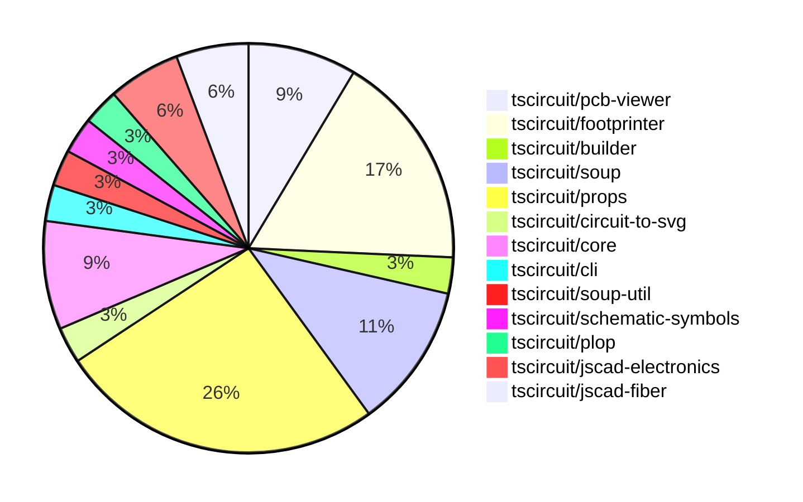

# contribution-tracker

Generates weekly contribution overviews for tscircuit contributors. Check out all
the [contribution overviews here](./contribution-overviews/)

* All PRs in the tscircuit org are scanned/summarized via Claude Haiku
* Claude classifies each Diff/PR as a Major, Minor or Tiny contribution
* All the PRs, summaries, and classifications are organized into charts and tables

The current week is shown below. There are 3 major sections:

* [Contributor Overview](#contributor-overview)
* [PRs by Repository](#prs-by-repository)
* [PRs by Contributor](#changes-by-contributor)

## Current Week

<!-- START_CURRENT_WEEK -->

# Contribution Overview 2024-08-24

## PRs by Repository

## Contributor Overview

| Contributor | 🐳 Major | 🐙 Minor | 🐌 Tiny |
|-------------|-------|-------|-------|
| ShiboSoftwareDev | 2 | 4 | 0 |
| imrishabh18 | 3 | 2 | 0 |
| seveibar | 6 | 8 | 0 |
| anas-sarkez | 2 | 3 | 0 |
| abhijitxy | 4 | 0 | 0 |

## Changes by Repository

### [tscircuit/pcb-viewer](https://github.com/tscircuit/pcb-viewer)

| PR # | Impact | Contributor | Description |
|------|--------|-------------|-------------|
| [#43](https://github.com/tscircuit/pcb-viewer/pull/43) | 🐳 Major | ShiboSoftwareDev | Added support for custom PCB board outlines and added several example stories showcasing different board shapes. |
| [#42](https://github.com/tscircuit/pcb-viewer/pull/42) | 🐳 Major | imrishabh18 | Render the polygon trace inside the Trace component. |
| [#40](https://github.com/tscircuit/pcb-viewer/pull/40) | 🐳 Major | imrishabh18 | Added support for trace-hint on plated-holes. |

### [tscircuit/footprinter](https://github.com/tscircuit/footprinter)

| PR # | Impact | Contributor | Description |
|------|--------|-------------|-------------|
| [#19](https://github.com/tscircuit/footprinter/pull/19) | 🐳 Major | ShiboSoftwareDev | Added two new footprints, ms-012 and ms-013, to the library. |
| [#24](https://github.com/tscircuit/footprinter/pull/24) | 🐳 Major | anas-sarkez | Added a new component, SOT723, to the project. |
| [#23](https://github.com/tscircuit/footprinter/pull/23) | 🐳 Major | anas-sarkez | Added support for the SOT563 package and a corresponding test case. |
| [#25](https://github.com/tscircuit/footprinter/pull/25) | 🐙 Minor | anas-sarkez | Fixed silkscreen issue of some components |
| [#21](https://github.com/tscircuit/footprinter/pull/21) | 🐙 Minor | anas-sarkez | Added more test cases for a BGA footprint |
| [#20](https://github.com/tscircuit/footprinter/pull/20) | 🐙 Minor | anas-sarkez | Added missing tests and snapshots for various footprint types. |

### [tscircuit/builder](https://github.com/tscircuit/builder)

| PR # | Impact | Contributor | Description |
|------|--------|-------------|-------------|
| [#105](https://github.com/tscircuit/builder/pull/105) | 🐙 Minor | ShiboSoftwareDev | Added optional `outline` prop to `board-builder` component. |

### [tscircuit/soup](https://github.com/tscircuit/soup)

| PR # | Impact | Contributor | Description |
|------|--------|-------------|-------------|
| [#29](https://github.com/tscircuit/soup/pull/29) | 🐙 Minor | ShiboSoftwareDev | Make `pcb_board_id` and `route_thickness_mode` optional in the PCB board and trace models. |
| [#28](https://github.com/tscircuit/soup/pull/28) | 🐙 Minor | ShiboSoftwareDev | Added a new optional property "outline" of type array of points to the PCB board definition. |
| [#31](https://github.com/tscircuit/soup/pull/31) | 🐙 Minor | imrishabh18 | Change the default mode for `trace` to `constant` |
| [#30](https://github.com/tscircuit/soup/pull/30) | 🐙 Minor | seveibar | Add support for pin_styles in the schematic_component type |

### [tscircuit/props](https://github.com/tscircuit/props)

| PR # | Impact | Contributor | Description |
|------|--------|-------------|-------------|
| [#32](https://github.com/tscircuit/props/pull/32) | 🐳 Major | seveibar | This pull request refactors the project by splitting the code into multiple files, separates the props from Zod, and adds a type check to ensure parity. |
| [#31](https://github.com/tscircuit/props/pull/31) | 🐳 Major | seveibar | Add testing and template for new structure |
| [#30](https://github.com/tscircuit/props/pull/30) | 🐳 Major | seveibar | Revert build system to use --dts, add `schPinStyle` and other schematic box improvements, add support for camelCase route hint points. |
| [#25](https://github.com/tscircuit/props/pull/25) | 🐙 Minor | ShiboSoftwareDev | Added an optional `outline` property to the `boardProps` type. |
| [#34](https://github.com/tscircuit/props/pull/34) | 🐙 Minor | imrishabh18 | Add symbol name as prop to the CommonComponentProps type |
| [#33](https://github.com/tscircuit/props/pull/33) | 🐙 Minor | seveibar | Remove the `"auto"` option for some parameters in the `chip.ts` file. |
| [#29](https://github.com/tscircuit/props/pull/29) | 🐙 Minor | seveibar | Update the formatbot workflow to not run against forks |
| [#24](https://github.com/tscircuit/props/pull/24) | 🐙 Minor | seveibar | Change the `pinLabels` type in the `chipProps` interface to accept both numbers and strings, fixing a React parsing issue. |
| [#22](https://github.com/tscircuit/props/pull/22) | 🐙 Minor | seveibar | Make the `for` property of `<tracehint>` optional to support new syntax where the `<tracehint>` is nested inside a `<trace>` element. |

### [tscircuit/circuit-to-svg](https://github.com/tscircuit/circuit-to-svg)

| PR # | Impact | Contributor | Description |
|------|--------|-------------|-------------|
| [#25](https://github.com/tscircuit/circuit-to-svg/pull/25) | 🐳 Major | imrishabh18 | Integrate schematic symbols and fix an issue with the `rotateSymbol` function |

### [tscircuit/core](https://github.com/tscircuit/core)

| PR # | Impact | Contributor | Description |
|------|--------|-------------|-------------|
| [#10](https://github.com/tscircuit/core/pull/10) | 🐳 Major | seveibar | Introduce a new normal component called "Chip" with various implementation details. |
| [#6](https://github.com/tscircuit/core/pull/6) | 🐳 Major | seveibar | Implement trace routing with support for trace hints. |
| [#4](https://github.com/tscircuit/core/pull/4) | 🟣 | seveibar |  |

### [tscircuit/cli](https://github.com/tscircuit/cli)

| PR # | Impact | Contributor | Description |
|------|--------|-------------|-------------|
| [#130](https://github.com/tscircuit/cli/pull/130) | 🐙 Minor | seveibar | Update the `flip_y_axis` option in the `export-gerbers.ts` file to set it to `false` instead of `true`. |

### [tscircuit/soup-util](https://github.com/tscircuit/soup-util)

| PR # | Impact | Contributor | Description |
|------|--------|-------------|-------------|
| [#9](https://github.com/tscircuit/soup-util/pull/9) | 🐙 Minor | seveibar | Add a `validateInserts` option to the `su` function to allow creating a soup utility with validation turned on. |

### [tscircuit/schematic-symbols](https://github.com/tscircuit/schematic-symbols)

| PR # | Impact | Contributor | Description |
|------|--------|-------------|-------------|
| [#10](https://github.com/tscircuit/schematic-symbols/pull/10) | 🐳 Major | seveibar | Introduce `getInnerSvg` function to export the inner SVG content without the surrounding `<svg>` tag. |

### [tscircuit/plop](https://github.com/tscircuit/plop)

| PR # | Impact | Contributor | Description |
|------|--------|-------------|-------------|
| [#4](https://github.com/tscircuit/plop/pull/4) | 🐙 Minor | seveibar | Update formatbot to not run against forks |

### [tscircuit/jscad-electronics](https://github.com/tscircuit/jscad-electronics)

| PR # | Impact | Contributor | Description |
|------|--------|-------------|-------------|
| [#16](https://github.com/tscircuit/jscad-electronics/pull/16) | 🐳 Major | abhijitxy | Implement a BGA (Ball Grid Array) component with configurable parameters and support for missing balls. |
| [#14](https://github.com/tscircuit/jscad-electronics/pull/14) | 🐳 Major | abhijitxy | Implement a new component for the SOT-23-3P package |

### [tscircuit/jscad-fiber](https://github.com/tscircuit/jscad-fiber)

| PR # | Impact | Contributor | Description |
|------|--------|-------------|-------------|
| [#73](https://github.com/tscircuit/jscad-fiber/pull/73) | 🐳 Major | abhijitxy | Introduce a function to convert degrees to radians for rotation operations. |
| [#72](https://github.com/tscircuit/jscad-fiber/pull/72) | 🐳 Major | abhijitxy | Implemented support for rotating components using string inputs in addition to numeric values. |

## Changes by Contributor

### [ShiboSoftwareDev](https://github.com/ShiboSoftwareDev)

| PR # | Impact | Description |
|------|--------|-------------|
| [#43](https://github.com/tscircuit/pcb-viewer/pull/43) | 🐳 Major | Added support for custom PCB board outlines and added several example stories showcasing different board shapes. |
| [#19](https://github.com/tscircuit/footprinter/pull/19) | 🐳 Major | Added two new footprints, ms-012 and ms-013, to the library. |
| [#105](https://github.com/tscircuit/builder/pull/105) | 🐙 Minor | Added optional `outline` prop to `board-builder` component. |
| [#29](https://github.com/tscircuit/soup/pull/29) | 🐙 Minor | Make `pcb_board_id` and `route_thickness_mode` optional in the PCB board and trace models. |
| [#28](https://github.com/tscircuit/soup/pull/28) | 🐙 Minor | Added a new optional property "outline" of type array of points to the PCB board definition. |
| [#25](https://github.com/tscircuit/props/pull/25) | 🐙 Minor | Added an optional `outline` property to the `boardProps` type. |

### [imrishabh18](https://github.com/imrishabh18)

| PR # | Impact | Description |
|------|--------|-------------|
| [#42](https://github.com/tscircuit/pcb-viewer/pull/42) | 🐳 Major | Render the polygon trace inside the Trace component. |
| [#40](https://github.com/tscircuit/pcb-viewer/pull/40) | 🐳 Major | Added support for trace-hint on plated-holes. |
| [#25](https://github.com/tscircuit/circuit-to-svg/pull/25) | 🐳 Major | Integrate schematic symbols and fix an issue with the `rotateSymbol` function |
| [#31](https://github.com/tscircuit/soup/pull/31) | 🐙 Minor | Change the default mode for `trace` to `constant` |
| [#34](https://github.com/tscircuit/props/pull/34) | 🐙 Minor | Add symbol name as prop to the CommonComponentProps type |

### [seveibar](https://github.com/seveibar)

| PR # | Impact | Description |
|------|--------|-------------|
| [#32](https://github.com/tscircuit/props/pull/32) | 🐳 Major | This pull request refactors the project by splitting the code into multiple files, separates the props from Zod, and adds a type check to ensure parity. |
| [#31](https://github.com/tscircuit/props/pull/31) | 🐳 Major | Add testing and template for new structure |
| [#30](https://github.com/tscircuit/props/pull/30) | 🐳 Major | Revert build system to use --dts, add `schPinStyle` and other schematic box improvements, add support for camelCase route hint points. |
| [#10](https://github.com/tscircuit/core/pull/10) | 🐳 Major | Introduce a new normal component called "Chip" with various implementation details. |
| [#6](https://github.com/tscircuit/core/pull/6) | 🐳 Major | Implement trace routing with support for trace hints. |
| [#130](https://github.com/tscircuit/cli/pull/130) | 🐙 Minor | Update the `flip_y_axis` option in the `export-gerbers.ts` file to set it to `false` instead of `true`. |
| [#30](https://github.com/tscircuit/soup/pull/30) | 🐙 Minor | Add support for pin_styles in the schematic_component type |
| [#9](https://github.com/tscircuit/soup-util/pull/9) | 🐙 Minor | Add a `validateInserts` option to the `su` function to allow creating a soup utility with validation turned on. |
| [#33](https://github.com/tscircuit/props/pull/33) | 🐙 Minor | Remove the `"auto"` option for some parameters in the `chip.ts` file. |
| [#29](https://github.com/tscircuit/props/pull/29) | 🐙 Minor | Update the formatbot workflow to not run against forks |
| [#24](https://github.com/tscircuit/props/pull/24) | 🐙 Minor | Change the `pinLabels` type in the `chipProps` interface to accept both numbers and strings, fixing a React parsing issue. |
| [#22](https://github.com/tscircuit/props/pull/22) | 🐙 Minor | Make the `for` property of `<tracehint>` optional to support new syntax where the `<tracehint>` is nested inside a `<trace>` element. |
| [#4](https://github.com/tscircuit/core/pull/4) | 🟣 |  |
| [#10](https://github.com/tscircuit/schematic-symbols/pull/10) | 🐳 Major | Introduce `getInnerSvg` function to export the inner SVG content without the surrounding `<svg>` tag. |
| [#4](https://github.com/tscircuit/plop/pull/4) | 🐙 Minor | Update formatbot to not run against forks |

### [anas-sarkez](https://github.com/anas-sarkez)

| PR # | Impact | Description |
|------|--------|-------------|
| [#24](https://github.com/tscircuit/footprinter/pull/24) | 🐳 Major | Added a new component, SOT723, to the project. |
| [#23](https://github.com/tscircuit/footprinter/pull/23) | 🐳 Major | Added support for the SOT563 package and a corresponding test case. |
| [#25](https://github.com/tscircuit/footprinter/pull/25) | 🐙 Minor | Fixed silkscreen issue of some components |
| [#21](https://github.com/tscircuit/footprinter/pull/21) | 🐙 Minor | Added more test cases for a BGA footprint |
| [#20](https://github.com/tscircuit/footprinter/pull/20) | 🐙 Minor | Added missing tests and snapshots for various footprint types. |

### [abhijitxy](https://github.com/abhijitxy)

| PR # | Impact | Description |
|------|--------|-------------|
| [#16](https://github.com/tscircuit/jscad-electronics/pull/16) | 🐳 Major | Implement a BGA (Ball Grid Array) component with configurable parameters and support for missing balls. |
| [#14](https://github.com/tscircuit/jscad-electronics/pull/14) | 🐳 Major | Implement a new component for the SOT-23-3P package |
| [#73](https://github.com/tscircuit/jscad-fiber/pull/73) | 🐳 Major | Introduce a function to convert degrees to radians for rotation operations. |
| [#72](https://github.com/tscircuit/jscad-fiber/pull/72) | 🐳 Major | Implemented support for rotating components using string inputs in addition to numeric values. |

<!-- END_CURRENT_WEEK -->
