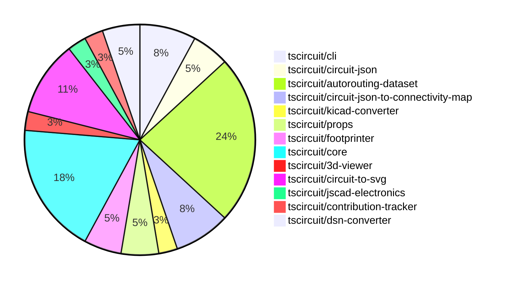

# contribution-tracker

Generates weekly contribution overviews for tscircuit contributors. Check out all
the [contribution overviews here](./contribution-overviews/)

* All PRs in the tscircuit org are scanned/summarized via Claude Haiku
* Claude classifies each Diff/PR as a Major, Minor or Tiny contribution
* All the PRs, summaries, and classifications are organized into charts and tables

The current week is shown below. There are 3 major sections:

* [Contributor Overview](#contributor-overview)
* [PRs by Repository](#prs-by-repository)
* [PRs by Contributor](#changes-by-contributor)

## Current Week

<!-- START_CURRENT_WEEK -->

# Contribution Overview 2024-09-14

## PRs by Repository

## Contributor Overview

| Contributor | 🐳 Major | 🐙 Minor | 🐌 Tiny |
|-------------|-------|-------|-------|
| seveibar | 18 | 8 | 0 |
| anas-sarkez | 0 | 1 | 0 |
| ShiboSoftwareDev | 3 | 1 | 0 |
| abhijitxy | 1 | 0 | 0 |
| tscircuitbot | 1 | 0 | 0 |
| imrishabh18 | 3 | 1 | 0 |

## Changes by Repository

### [tscircuit/cli](https://github.com/tscircuit/cli)

| PR # | Impact | Contributor | Description |
|------|--------|-------------|-------------|
| [#188](https://github.com/tscircuit/cli/pull/188) | 🐳 Major | seveibar | Adds support for exporting KiCad PCB files from the example project. |
| [#185](https://github.com/tscircuit/cli/pull/185) | 🐳 Major | seveibar | Fix Gerber exporting and add tests for Gerber export |
| [#179](https://github.com/tscircuit/cli/pull/179) | 🐳 Major | seveibar | Changes the routing of the macrokeypad project |

### [tscircuit/circuit-json](https://github.com/tscircuit/circuit-json)

| PR # | Impact | Contributor | Description |
|------|--------|-------------|-------------|
| [#46](https://github.com/tscircuit/circuit-json/pull/46) | 🐳 Major | seveibar | Updating naming convention, switching to bun, and switching from AnySoupElement to AnyCircuitElement with deprecated comments |
| [#44](https://github.com/tscircuit/circuit-json/pull/44) | 🐙 Minor | seveibar | Add correctly named fabrication note/path ids |

### [tscircuit/autorouting-dataset](https://github.com/tscircuit/autorouting-dataset)

| PR # | Impact | Contributor | Description |
|------|--------|-------------|-------------|
| [#74](https://github.com/tscircuit/autorouting-dataset/pull/74) | 🐳 Major | seveibar | Fix a dependency breaking the algo build. |
| [#73](https://github.com/tscircuit/autorouting-dataset/pull/73) | 🐳 Major | seveibar | Introduce a GitHub Action to run performance benchmarks on the autorouting algorithms and commit the benchmark results to the repository. |
| [#72](https://github.com/tscircuit/autorouting-dataset/pull/72) | 🐳 Major | seveibar | Finish implementation of goal box optimization for the GeneralizedAstarAutorouter, including preprocessing connections to use alternative goal boxes and postprocessing the solve results to add solved traces to the PcbConnectivityMap. |
| [#71](https://github.com/tscircuit/autorouting-dataset/pull/71) | 🐳 Major | seveibar | The pull request introduces a feature for computing goal boxes, finding optimal starting and ending points, and loading them into the input for the best alternative. |
| [#69](https://github.com/tscircuit/autorouting-dataset/pull/69) | 🐳 Major | seveibar | Introduce alternative goal box functions for the solver-utils module. |
| [#66](https://github.com/tscircuit/autorouting-dataset/pull/66) | 🐳 Major | seveibar | Add vias for PCB trace routes |
| [#78](https://github.com/tscircuit/autorouting-dataset/pull/78) | 🐙 Minor | seveibar | Move `minTraceWidth` from `GeneralizedAstar` and `MultilayerIjump` to `SimpleRouteJson`. |
| [#77](https://github.com/tscircuit/autorouting-dataset/pull/77) | 🐙 Minor | seveibar | Add an optional `minTraceWidth` parameter to the `GeneralizedAstar` and `MultilayerIjump` classes. |
| [#67](https://github.com/tscircuit/autorouting-dataset/pull/67) | 🐙 Minor | seveibar | Add a snapshot for Keyboard Sample 7 against multilayer autorouter (preparation for Route to Neighbor Strategy) |

### [tscircuit/circuit-json-to-connectivity-map](https://github.com/tscircuit/circuit-json-to-connectivity-map)

| PR # | Impact | Contributor | Description |
|------|--------|-------------|-------------|
| [#5](https://github.com/tscircuit/circuit-json-to-connectivity-map/pull/5) | 🐳 Major | seveibar | Add support for empty PCB connectivity map initialization |
| [#4](https://github.com/tscircuit/circuit-json-to-connectivity-map/pull/4) | 🐳 Major | seveibar | Add methods to support adding connections to an existing connectivity map and merge existing nets |
| [#3](https://github.com/tscircuit/circuit-json-to-connectivity-map/pull/3) | 🐳 Major | seveibar | Implement a PCB Connectivity Map to determine what traces a port is physically connected to. |

### [tscircuit/kicad-converter](https://github.com/tscircuit/kicad-converter)

| PR # | Impact | Contributor | Description |
|------|--------|-------------|-------------|
| [#2](https://github.com/tscircuit/kicad-converter/pull/2) | 🐳 Major | seveibar | Add new test for converting circuit JSON to KiCad PCB |

### [tscircuit/props](https://github.com/tscircuit/props)

| PR # | Impact | Contributor | Description |
|------|--------|-------------|-------------|
| [#51](https://github.com/tscircuit/props/pull/51) | 🐙 Minor | seveibar | Add a new `defaultTraceWidth` prop to the `board` and `group` components. |
| [#50](https://github.com/tscircuit/props/pull/50) | 🟣 | seveibar | Add key as an optional parameter for trace props |

### [tscircuit/footprinter](https://github.com/tscircuit/footprinter)

| PR # | Impact | Contributor | Description |
|------|--------|-------------|-------------|
| [#36](https://github.com/tscircuit/footprinter/pull/36) | 🐳 Major | seveibar | Add a GitHub Action workflow to automatically format code with the Biome formatter. |
| [#37](https://github.com/tscircuit/footprinter/pull/37) | 🐙 Minor | anas-sarkez | Updated the `circuit-to-svg` dependency and the associated SVG output. |

### [tscircuit/core](https://github.com/tscircuit/core)

| PR # | Impact | Contributor | Description |
|------|--------|-------------|-------------|
| [#91](https://github.com/tscircuit/core/pull/91) | 🐳 Major | seveibar | Adds support for `minTraceWidth` in the `SimpleRouteJson` interface and updates the `Trace` component to use this new property. |
| [#90](https://github.com/tscircuit/core/pull/90) | 🐳 Major | seveibar | Possible fix for traces switching layers accidentally, cleanup trace code, and add test for 9 key keyboard. |
| [#89](https://github.com/tscircuit/core/pull/89) | 🐳 Major | seveibar | Enable goalbox optimization in the PCB routing algorithm |
| [#92](https://github.com/tscircuit/core/pull/92) | 🐳 Major | ShiboSoftwareDev | The pull request adds support for a board outline in the `Board` component. |
| [#95](https://github.com/tscircuit/core/pull/95) | 🐙 Minor | seveibar | Fix null pcb_component_id by looking at PrimitiveContainer |
| [#94](https://github.com/tscircuit/core/pull/94) | 🐙 Minor | seveibar | Fix bounds calculation for PCB components with null widths |
| [#86](https://github.com/tscircuit/core/pull/86) | 🐙 Minor | seveibar | Upgrade the "@tscircuit/infgrid-ijump-astar" package to version 0.0.17 |

### [tscircuit/3d-viewer](https://github.com/tscircuit/3d-viewer)

| PR # | Impact | Contributor | Description |
|------|--------|-------------|-------------|
| [#17](https://github.com/tscircuit/3d-viewer/pull/17) | 🐳 Major | ShiboSoftwareDev | Implemented board outline functionality with the ability to create custom board shapes. |

### [tscircuit/circuit-to-svg](https://github.com/tscircuit/circuit-to-svg)

| PR # | Impact | Contributor | Description |
|------|--------|-------------|-------------|
| [#73](https://github.com/tscircuit/circuit-to-svg/pull/73) | 🐳 Major | ShiboSoftwareDev | Introduces a feature to draw PCB boards as rectangular or outlined shapes. |
| [#70](https://github.com/tscircuit/circuit-to-svg/pull/70) | 🐳 Major | imrishabh18 | Introduce a new feature to create SVG objects for PCB vias. |
| [#69](https://github.com/tscircuit/circuit-to-svg/pull/69) | 🐙 Minor | ShiboSoftwareDev | Implemented colored fabrication note path and text |
| [#71](https://github.com/tscircuit/circuit-to-svg/pull/71) | 🐙 Minor | imrishabh18 | Update the deprecated name `AnySoupElement` to `AnyCircuitElement` in the `soupToSvg` and `pcbSoupToSvg` functions. |

### [tscircuit/jscad-electronics](https://github.com/tscircuit/jscad-electronics)

| PR # | Impact | Contributor | Description |
|------|--------|-------------|-------------|
| [#35](https://github.com/tscircuit/jscad-electronics/pull/35) | 🐳 Major | abhijitxy | Add a new component `SOT-723` and an example for it. |

### [tscircuit/contribution-tracker](https://github.com/tscircuit/contribution-tracker)

| PR # | Impact | Contributor | Description |
|------|--------|-------------|-------------|
| [#3](https://github.com/tscircuit/contribution-tracker/pull/3) | 🐳 Major | tscircuitbot | Add pagination to the `getRepos` function to handle the case where the number of repositories exceeds the API's per-page limit. |

### [tscircuit/dsn-converter](https://github.com/tscircuit/dsn-converter)

| PR # | Impact | Contributor | Description |
|------|--------|-------------|-------------|
| [#3](https://github.com/tscircuit/dsn-converter/pull/3) | 🐳 Major | imrishabh18 | Introduce a new function `dsnPcbToCircuitJson` that converts a DSN PCB format to a Circuit JSON format. |
| [#2](https://github.com/tscircuit/dsn-converter/pull/2) | 🐳 Major | imrishabh18 | The pull request adds the ability to convert S-expressions to JSON. |

## Changes by Contributor

### [seveibar](https://github.com/seveibar)

| PR # | Impact | Description |
|------|--------|-------------|
| [#188](https://github.com/tscircuit/cli/pull/188) | 🐳 Major | Adds support for exporting KiCad PCB files from the example project. |
| [#185](https://github.com/tscircuit/cli/pull/185) | 🐳 Major | Fix Gerber exporting and add tests for Gerber export |
| [#179](https://github.com/tscircuit/cli/pull/179) | 🐳 Major | Changes the routing of the macrokeypad project |
| [#46](https://github.com/tscircuit/circuit-json/pull/46) | 🐳 Major | Updating naming convention, switching to bun, and switching from AnySoupElement to AnyCircuitElement with deprecated comments |
| [#74](https://github.com/tscircuit/autorouting-dataset/pull/74) | 🐳 Major | Fix a dependency breaking the algo build. |
| [#73](https://github.com/tscircuit/autorouting-dataset/pull/73) | 🐳 Major | Introduce a GitHub Action to run performance benchmarks on the autorouting algorithms and commit the benchmark results to the repository. |
| [#72](https://github.com/tscircuit/autorouting-dataset/pull/72) | 🐳 Major | Finish implementation of goal box optimization for the GeneralizedAstarAutorouter, including preprocessing connections to use alternative goal boxes and postprocessing the solve results to add solved traces to the PcbConnectivityMap. |
| [#71](https://github.com/tscircuit/autorouting-dataset/pull/71) | 🐳 Major | The pull request introduces a feature for computing goal boxes, finding optimal starting and ending points, and loading them into the input for the best alternative. |
| [#69](https://github.com/tscircuit/autorouting-dataset/pull/69) | 🐳 Major | Introduce alternative goal box functions for the solver-utils module. |
| [#66](https://github.com/tscircuit/autorouting-dataset/pull/66) | 🐳 Major | Add vias for PCB trace routes |
| [#5](https://github.com/tscircuit/circuit-json-to-connectivity-map/pull/5) | 🐳 Major | Add support for empty PCB connectivity map initialization |
| [#4](https://github.com/tscircuit/circuit-json-to-connectivity-map/pull/4) | 🐳 Major | Add methods to support adding connections to an existing connectivity map and merge existing nets |
| [#3](https://github.com/tscircuit/circuit-json-to-connectivity-map/pull/3) | 🐳 Major | Implement a PCB Connectivity Map to determine what traces a port is physically connected to. |
| [#2](https://github.com/tscircuit/kicad-converter/pull/2) | 🐳 Major | Add new test for converting circuit JSON to KiCad PCB |
| [#44](https://github.com/tscircuit/circuit-json/pull/44) | 🐙 Minor | Add correctly named fabrication note/path ids |
| [#51](https://github.com/tscircuit/props/pull/51) | 🐙 Minor | Add a new `defaultTraceWidth` prop to the `board` and `group` components. |
| [#50](https://github.com/tscircuit/props/pull/50) | 🟣 | Add key as an optional parameter for trace props |
| [#36](https://github.com/tscircuit/footprinter/pull/36) | 🐳 Major | Add a GitHub Action workflow to automatically format code with the Biome formatter. |
| [#91](https://github.com/tscircuit/core/pull/91) | 🐳 Major | Adds support for `minTraceWidth` in the `SimpleRouteJson` interface and updates the `Trace` component to use this new property. |
| [#90](https://github.com/tscircuit/core/pull/90) | 🐳 Major | Possible fix for traces switching layers accidentally, cleanup trace code, and add test for 9 key keyboard. |
| [#89](https://github.com/tscircuit/core/pull/89) | 🐳 Major | Enable goalbox optimization in the PCB routing algorithm |
| [#95](https://github.com/tscircuit/core/pull/95) | 🐙 Minor | Fix null pcb_component_id by looking at PrimitiveContainer |
| [#94](https://github.com/tscircuit/core/pull/94) | 🐙 Minor | Fix bounds calculation for PCB components with null widths |
| [#86](https://github.com/tscircuit/core/pull/86) | 🐙 Minor | Upgrade the "@tscircuit/infgrid-ijump-astar" package to version 0.0.17 |
| [#78](https://github.com/tscircuit/autorouting-dataset/pull/78) | 🐙 Minor | Move `minTraceWidth` from `GeneralizedAstar` and `MultilayerIjump` to `SimpleRouteJson`. |
| [#77](https://github.com/tscircuit/autorouting-dataset/pull/77) | 🐙 Minor | Add an optional `minTraceWidth` parameter to the `GeneralizedAstar` and `MultilayerIjump` classes. |
| [#67](https://github.com/tscircuit/autorouting-dataset/pull/67) | 🐙 Minor | Add a snapshot for Keyboard Sample 7 against multilayer autorouter (preparation for Route to Neighbor Strategy) |

### [anas-sarkez](https://github.com/anas-sarkez)

| PR # | Impact | Description |
|------|--------|-------------|
| [#37](https://github.com/tscircuit/footprinter/pull/37) | 🐙 Minor | Updated the `circuit-to-svg` dependency and the associated SVG output. |

### [ShiboSoftwareDev](https://github.com/ShiboSoftwareDev)

| PR # | Impact | Description |
|------|--------|-------------|
| [#17](https://github.com/tscircuit/3d-viewer/pull/17) | 🐳 Major | Implemented board outline functionality with the ability to create custom board shapes. |
| [#92](https://github.com/tscircuit/core/pull/92) | 🐳 Major | The pull request adds support for a board outline in the `Board` component. |
| [#73](https://github.com/tscircuit/circuit-to-svg/pull/73) | 🐳 Major | Introduces a feature to draw PCB boards as rectangular or outlined shapes. |
| [#69](https://github.com/tscircuit/circuit-to-svg/pull/69) | 🐙 Minor | Implemented colored fabrication note path and text |

### [abhijitxy](https://github.com/abhijitxy)

| PR # | Impact | Description |
|------|--------|-------------|
| [#35](https://github.com/tscircuit/jscad-electronics/pull/35) | 🐳 Major | Add a new component `SOT-723` and an example for it. |

### [tscircuitbot](https://github.com/tscircuitbot)

| PR # | Impact | Description |
|------|--------|-------------|
| [#3](https://github.com/tscircuit/contribution-tracker/pull/3) | 🐳 Major | Add pagination to the `getRepos` function to handle the case where the number of repositories exceeds the API's per-page limit. |

### [imrishabh18](https://github.com/imrishabh18)

| PR # | Impact | Description |
|------|--------|-------------|
| [#70](https://github.com/tscircuit/circuit-to-svg/pull/70) | 🐳 Major | Introduce a new feature to create SVG objects for PCB vias. |
| [#3](https://github.com/tscircuit/dsn-converter/pull/3) | 🐳 Major | Introduce a new function `dsnPcbToCircuitJson` that converts a DSN PCB format to a Circuit JSON format. |
| [#2](https://github.com/tscircuit/dsn-converter/pull/2) | 🐳 Major | The pull request adds the ability to convert S-expressions to JSON. |
| [#71](https://github.com/tscircuit/circuit-to-svg/pull/71) | 🐙 Minor | Update the deprecated name `AnySoupElement` to `AnyCircuitElement` in the `soupToSvg` and `pcbSoupToSvg` functions. |

<!-- END_CURRENT_WEEK -->
