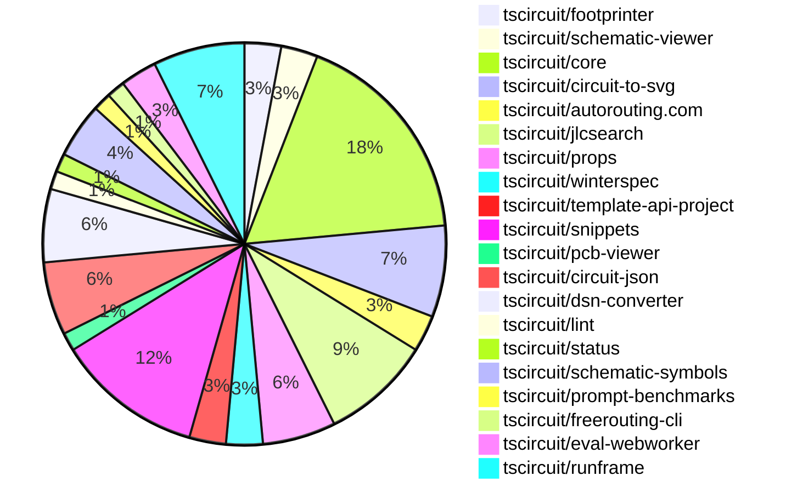

# contribution-tracker

Generates weekly contribution overviews for tscircuit contributors. Check out all
the [contribution overviews here](./contribution-overviews/)

* All PRs in the tscircuit org are scanned/summarized via Claude Haiku
* Claude classifies each Diff/PR as a Major, Minor or Tiny contribution
* All the PRs, summaries, and classifications are organized into charts and tables

The current week is shown below. There are 3 major sections:

* [Contributor Overview](#contributor-overview)
* [PRs by Repository](#prs-by-repository)
* [PRs by Contributor](#changes-by-contributor)

## Current Week

<!-- START_CURRENT_WEEK -->

# Contribution Overview 2024-12-18

## PRs by Repository

## Contributor Overview

| Contributor | 🐳 Major | 🐙 Minor | 🐌 Tiny | ⭐ | Issues Created |
|-------------|---------|---------|---------|-----|----------------|
| [seveibar](#seveibar) | 6 | 11 | 0 | 👑 | 66 |
| [imrishabh18](#imrishabh18) | 0 | 13 | 1 | ⭐⭐⭐ | 15 |
| [ShiboSoftwareDev](#ShiboSoftwareDev) | 2 | 2 | 0 | ⭐⭐⭐ | 8 |
| [devin-ai-integration[bot]](#devin-ai-integration[bot]) | 1 | 7 | 0 | ⭐⭐ | 0 |
| [Abse2001](#Abse2001) | 0 | 6 | 0 | ⭐⭐ | 5 |
| [techmannih](#techmannih) | 0 | 8 | 0 | ⭐⭐ | 0 |
| [AnasSarkiz](#AnasSarkiz) | 1 | 3 | 0 | ⭐ | 0 |
| [Anshgrover23](#Anshgrover23) | 2 | 1 | 0 | ⭐ | 3 |
| [rohittcodes](#rohittcodes) | 0 | 3 | 0 | ⭐ | 3 |

## Review Table

[reviews-received-hover]: ## "Number of reviews received for PRs for this contributor"
[approvals-received-hover]: ## "Number of approvals received for PRs this contributor authored"
[rejections-received-hover]: ## "Number of rejections received for PRs this contributor authored"
[prs-opened-hover]: ## "Number of PRs opened by this contributor"
[issues-created-hover]: ## "Number of issues created by this contributor"
[bountied-issues-hover]: ## "Number of issues this contributor created with a bounty"
[bountied-issue-$-hover]: ## "Total bounty amount placed on issues authored by this contributor"

| Contributor | Reviews Received | Approvals Received | Rejections Received | PRs Opened | PRs Merged | Issues Created | Bountied Issues | Bountied Issue $ |
|---|---|---|---|---|---|---|---|---|
| [AnasSarkiz](#AnasSarkiz) | 8 | 4 | 0 | 4 | 4 | 0 | 0 | 0 |
| [seveibar](#seveibar) | 1 | 1 | 0 | 18 | 17 | 66 | 25 | 557 |
| [ShiboSoftwareDev](#ShiboSoftwareDev) | 11 | 7 | 1 | 7 | 5 | 8 | 4 | 195 |
| [Abse2001](#Abse2001) | 25 | 7 | 1 | 7 | 6 | 5 | 2 | 20 |
| [devin-ai-integration[bot]](#devin-ai-integration[bot]) | 10 | 6 | 3 | 16 | 8 | 0 | 0 | 0 |
| [techmannih](#techmannih) | 27 | 11 | 10 | 14 | 8 | 0 | 0 | 0 |
| [Anshgrover23](#Anshgrover23) | 38 | 3 | 8 | 7 | 3 | 3 | 0 | 0 |
| [rohittcodes](#rohittcodes) | 6 | 4 | 0 | 4 | 3 | 3 | 2 | 20 |
| [imrishabh18](#imrishabh18) | 11 | 6 | 0 | 17 | 14 | 15 | 5 | 90 |
| [Niharika0104](#Niharika0104) | 2 | 0 | 1 | 1 | 0 | 1 | 0 | 0 |
| [DrSensor](#DrSensor) | 0 | 0 | 0 | 1 | 0 | 0 | 0 | 0 |

## Changes by Repository

### [tscircuit/footprinter](https://github.com/tscircuit/footprinter)

| PR # | Impact | Contributor | Description |
|------|--------|-------------|-------------|
| [#98](https://github.com/tscircuit/footprinter/pull/98) | 🐳 Major | AnasSarkiz | Introduced a new footprint type called `breakoutheaders` to generate PCB footprints for breakout headers. |
| [#100](https://github.com/tscircuit/footprinter/pull/100) | 🐙 Minor | devin-ai-integration[bot] | Update DIP footprint inner/outer diameter ratio to match recommended 1.5mm outer diameter. |

### [tscircuit/schematic-viewer](https://github.com/tscircuit/schematic-viewer)

| PR # | Impact | Contributor | Description |
|------|--------|-------------|-------------|
| [#73](https://github.com/tscircuit/schematic-viewer/pull/73) | 🐳 Major | seveibar | Introduces drag'n'drop editing functionality for the circuit components. |
| [#74](https://github.com/tscircuit/schematic-viewer/pull/74) | 🐙 Minor | AnasSarkiz | Updated core and circuit-to-svg packages to fix the position of the reference designator inside the schematic component group |

### [tscircuit/core](https://github.com/tscircuit/core)

| PR # | Impact | Contributor | Description |
|------|--------|-------------|-------------|
| [#439](https://github.com/tscircuit/core/pull/439) | 🐳 Major | seveibar | Adds a new function `applyEditEventsToManualEditsFile` to handle updates to schematic component locations in a `manual_edit_file`. |
| [#443](https://github.com/tscircuit/core/pull/443) | 🐙 Minor | AnasSarkiz | Changed the value of `schematic_component_id` of `component_name_text` to fix an issue. |
| [#448](https://github.com/tscircuit/core/pull/448) | 🐙 Minor | seveibar | This pull request adds a new markdown file `RENDERING_RULES_AND_GUIDELINES.md` that provides guidelines and explanations for rendering rules in the codebase. |
| [#447](https://github.com/tscircuit/core/pull/447) | 🐙 Minor | seveibar | Fixes the schematic component position for group offsets (for symbols). |
| [#436](https://github.com/tscircuit/core/pull/436) | 🐙 Minor | seveibar | Rename "eval_error" event to "external:evalError". |
| [#444](https://github.com/tscircuit/core/pull/444) | 🐙 Minor | Abse2001 | Adds CCW rotation property to SilkscreenText component |
| [#424](https://github.com/tscircuit/core/pull/424) | 🐙 Minor | techmannih | Set up continuous branch release with pkg-pr-new |
| [#428](https://github.com/tscircuit/core/pull/428) | 🐙 Minor | techmannih | Adds a new silkscreen line component to the library. |
| [#452](https://github.com/tscircuit/core/pull/452) | 🐙 Minor | ShiboSoftwareDev | Update the `schematic-symbols` and `circuit-to-svg` dependencies in the project. |
| [#449](https://github.com/tscircuit/core/pull/449) | 🐙 Minor | imrishabh18 | Adds a test case to check the transform for connected resistor and capacitor inside a group. |
| [#430](https://github.com/tscircuit/core/pull/430) | 🐙 Minor | imrishabh18 | Add a new event type "eval_error" for webworker |
| [#437](https://github.com/tscircuit/core/pull/437) | 🐌 Tiny | imrishabh18 | Updates the lockfile to publish the package |

### [tscircuit/circuit-to-svg](https://github.com/tscircuit/circuit-to-svg)

| PR # | Impact | Contributor | Description |
|------|--------|-------------|-------------|
| [#153](https://github.com/tscircuit/circuit-to-svg/pull/153) | 🐙 Minor | AnasSarkiz | Added the `sch_componet_name` and `MPN` to the `createSvgObjectsFromSchematicComponentWithBox` function. |
| [#151](https://github.com/tscircuit/circuit-to-svg/pull/151) | 🐙 Minor | seveibar | Add support for computing schematic transform and placing it on the SVG as a `data-real-to-screen-transform` attribute. |
| [#150](https://github.com/tscircuit/circuit-to-svg/pull/150) | 🐙 Minor | seveibar | Add "data-circuit-json-type" and "data-schematic-trace-id" properties to SVG objects representing schematic traces. |
| [#156](https://github.com/tscircuit/circuit-to-svg/pull/156) | 🐙 Minor | ShiboSoftwareDev | Update the `@tscircuit/core` dependency to version `0.0.239`. |
| [#155](https://github.com/tscircuit/circuit-to-svg/pull/155) | 🟣 | ShiboSoftwareDev | Fixes the symbol text position to adjust for large schematic symbols |

### [tscircuit/autorouting.com](https://github.com/tscircuit/autorouting.com)

| PR # | Impact | Contributor | Description |
|------|--------|-------------|-------------|
| [#4](https://github.com/tscircuit/autorouting.com/pull/4) | 🐳 Major | seveibar |  |
| [#2](https://github.com/tscircuit/autorouting.com/pull/2) | 🐳 Major | seveibar | Introduces a complete overhaul of the codebase in preparation for API, Datasets and Autorouters Tab |

### [tscircuit/jlcsearch](https://github.com/tscircuit/jlcsearch)

| PR # | Impact | Contributor | Description |
|------|--------|-------------|-------------|
| [#5](https://github.com/tscircuit/jlcsearch/pull/5) | 🐳 Major | seveibar | Adds LED driver table and API endpoint |
| [#3](https://github.com/tscircuit/jlcsearch/pull/3) | 🐳 Major | seveibar | Add workflows for formatting, type checking, and testing Bun projects. |
| [#12](https://github.com/tscircuit/jlcsearch/pull/12) | 🐳 Major | Anshgrover23 | Adds a new MOSFET-related table and associated data models to the application. |
| [#4](https://github.com/tscircuit/jlcsearch/pull/4) | 🐳 Major | devin-ai-integration[bot] |  |
| [#11](https://github.com/tscircuit/jlcsearch/pull/11) | 🐙 Minor | devin-ai-integration[bot] | Adds search functionality to the components/list route, allowing users to search for components by description, manufacturer, or LCSC part number. |
| [#6](https://github.com/tscircuit/jlcsearch/pull/6) | 🐙 Minor | devin-ai-integration[bot] |  |

### [tscircuit/props](https://github.com/tscircuit/props)

| PR # | Impact | Contributor | Description |
|------|--------|-------------|-------------|
| [#121](https://github.com/tscircuit/props/pull/121) | 🐙 Minor | seveibar | Fixes the export of manual edit events and improves the consistency of the edit event type property. |
| [#124](https://github.com/tscircuit/props/pull/124) | 🐙 Minor | devin-ai-integration[bot] | Rename `manual_edit_file` to `manual_edits_file` for consistency with the interface name `ManualEditsFile`. |
| [#122](https://github.com/tscircuit/props/pull/122) | 🐙 Minor | devin-ai-integration[bot] | Add TypeScript interface definition for ManualEditsFile to match existing Zod schema |
| [#119](https://github.com/tscircuit/props/pull/119) | 🐙 Minor | techmannih | Add resonator component with props and validation |

### [tscircuit/winterspec](https://github.com/tscircuit/winterspec)

| PR # | Impact | Contributor | Description |
|------|--------|-------------|-------------|
| [#25](https://github.com/tscircuit/winterspec/pull/25) | 🐙 Minor | seveibar | Ports the CLI to use the Commander library, adds a lot of debug logging, and avoids using bundleRequire when running in the Bun environment. |
| [#24](https://github.com/tscircuit/winterspec/pull/24) | 🐙 Minor | seveibar | This pull request adds exports for new middleware functions in the `src/middleware/index.ts` file, including `withCtxError` and `withRequestLogging`. |

### [tscircuit/template-api-project](https://github.com/tscircuit/template-api-project)

| PR # | Impact | Contributor | Description |
|------|--------|-------------|-------------|
| [#3](https://github.com/tscircuit/template-api-project/pull/3) | 🐙 Minor | seveibar |  |
| [#2](https://github.com/tscircuit/template-api-project/pull/2) | 🐙 Minor | seveibar | Adds the `@electric-sql/pglite` and `kysely-pglite` packages for development and updates the `pgstrap` dependency to a newer version. |

### [tscircuit/snippets](https://github.com/tscircuit/snippets)

| PR # | Impact | Contributor | Description |
|------|--------|-------------|-------------|
| [#416](https://github.com/tscircuit/snippets/pull/416) | 🐙 Minor | seveibar | Reverts a previous change that caused a bug where an error was shown on every snippet. |
| [#406](https://github.com/tscircuit/snippets/pull/406) | 🐙 Minor | rohittcodes | Adds a new dialog component that allows users to update the description of a code snippet. |
| [#386](https://github.com/tscircuit/snippets/pull/386) | 🐙 Minor | rohittcodes | The pull request adds a check to determine if manual edits have been imported and displays an error button if they haven't, allowing the user to manually import them. |
| [#398](https://github.com/tscircuit/snippets/pull/398) | 🐙 Minor | devin-ai-integration[bot] | Adds a new template for creating a USB-C powered LED flashlight circuit with a push button control. |
| [#407](https://github.com/tscircuit/snippets/pull/407) | 🐙 Minor | techmannih | Update the blinking LED circuit template to change the board size and adjust the pin connections of the 555 timer. |
| [#343](https://github.com/tscircuit/snippets/pull/343) | 🐙 Minor | techmannih | Adds a new template for a blinking LED board. |
| [#413](https://github.com/tscircuit/snippets/pull/413) | 🐙 Minor | imrishabh18 | Fix the issue where the manual edit template was not getting imported, causing an error due to an empty string. |
| [#393](https://github.com/tscircuit/snippets/pull/393) | 🐙 Minor | imrishabh18 | Update the version of the `@tscircuit/pcb-viewer` package from `1.10.16` to `1.10.22`. |

### [tscircuit/pcb-viewer](https://github.com/tscircuit/pcb-viewer)

| PR # | Impact | Contributor | Description |
|------|--------|-------------|-------------|
| [#99](https://github.com/tscircuit/pcb-viewer/pull/99) | 🐙 Minor | Abse2001 | Implemented silkscreen text rotation and added a Storybook test for it. |

### [tscircuit/circuit-json](https://github.com/tscircuit/circuit-json)

| PR # | Impact | Contributor | Description |
|------|--------|-------------|-------------|
| [#102](https://github.com/tscircuit/circuit-json/pull/102) | 🐳 Major | Anshgrover23 | Implemented a new circuit element called "source_simple_resonator". |
| [#101](https://github.com/tscircuit/circuit-json/pull/101) | 🐙 Minor | Abse2001 | Added an optional `ccw_rotation` property to the `pcb_silkscreen_text` type. |
| [#108](https://github.com/tscircuit/circuit-json/pull/108) | 🐙 Minor | Anshgrover23 | Add a linting script to the CI workflow that checks for camelCase properties in Zod object schemas and non-snake_case enum values. |
| [#100](https://github.com/tscircuit/circuit-json/pull/100) | 🐙 Minor | rohittcodes | Adds support for parsing the "KΩ" and "KV" SI unit symbols |

### [tscircuit/dsn-converter](https://github.com/tscircuit/dsn-converter)

| PR # | Impact | Contributor | Description |
|------|--------|-------------|-------------|
| [#72](https://github.com/tscircuit/dsn-converter/pull/72) | 🐙 Minor | Abse2001 | Improved the support of Via and Pin DSN formats |
| [#71](https://github.com/tscircuit/dsn-converter/pull/71) | 🐙 Minor | Abse2001 | Introduces a change to handle errors in `processPin` and `processVis` functions more gracefully by throwing warnings instead of errors. |
| [#74](https://github.com/tscircuit/dsn-converter/pull/74) | 🐙 Minor | imrishabh18 | Fixes a bug where duplicate plated holes with the same pin number were being added to the image. |
| [#73](https://github.com/tscircuit/dsn-converter/pull/73) | 🐙 Minor | imrishabh18 | Fixes the `source_trace` linkage in the Dsn session converter to properly connect the `source_trace` with the extracted `pcb_traces` from the generated conversion. |

### [tscircuit/lint](https://github.com/tscircuit/lint)

| PR # | Impact | Contributor | Description |
|------|--------|-------------|-------------|
| [#1](https://github.com/tscircuit/lint/pull/1) | 🐙 Minor | Abse2001 | This pull request introduces a new ESLint plugin for TSCircuit projects, which includes two custom rules: "banned-words" and "two-params". |

### [tscircuit/status](https://github.com/tscircuit/status)

| PR # | Impact | Contributor | Description |
|------|--------|-------------|-------------|
| [#5](https://github.com/tscircuit/status/pull/5) | 🐙 Minor | devin-ai-integration[bot] | Improve timestamp sorting and add detailed timestamps to tooltips for status bars |

### [tscircuit/schematic-symbols](https://github.com/tscircuit/schematic-symbols)

| PR # | Impact | Contributor | Description |
|------|--------|-------------|-------------|
| [#227](https://github.com/tscircuit/schematic-symbols/pull/227) | 🐙 Minor | techmannih | Fixes the text anchor positions for the component reference and value in the capacitor-right symbol. |
| [#229](https://github.com/tscircuit/schematic-symbols/pull/229) | 🐙 Minor | techmannih | Add a new DPDT (double-pole, double-throw) switch symbol. |
| [#228](https://github.com/tscircuit/schematic-symbols/pull/228) | 🐙 Minor | techmannih | Fixes the anchors on the resonator by adjusting the y-coordinates of the points in the JSON file. |

### [tscircuit/prompt-benchmarks](https://github.com/tscircuit/prompt-benchmarks)

| PR # | Impact | Contributor | Description |
|------|--------|-------------|-------------|
| [#12](https://github.com/tscircuit/prompt-benchmarks/pull/12) | 🐳 Major | ShiboSoftwareDev | Refactored the `evalite` benchmark to use a new `CircuitScorer` and improve the code organization. |

### [tscircuit/freerouting-cli](https://github.com/tscircuit/freerouting-cli)

| PR # | Impact | Contributor | Description |
|------|--------|-------------|-------------|
| [#5](https://github.com/tscircuit/freerouting-cli/pull/5) | 🐳 Major | ShiboSoftwareDev | Adds tests for the freerouting CLI and routing functionality, including the use of Docker for a local server. |

### [tscircuit/eval-webworker](https://github.com/tscircuit/eval-webworker)

| PR # | Impact | Contributor | Description |
|------|--------|-------------|-------------|
| [#42](https://github.com/tscircuit/eval-webworker/pull/42) | 🐙 Minor | imrishabh18 | Reverts the emission of error worker cleanup. |
| [#33](https://github.com/tscircuit/eval-webworker/pull/33) | 🐙 Minor | imrishabh18 | Adds the ability to emit error events from the web worker. |

### [tscircuit/runframe](https://github.com/tscircuit/runframe)

| PR # | Impact | Contributor | Description |
|------|--------|-------------|-------------|
| [#46](https://github.com/tscircuit/runframe/pull/46) | 🐙 Minor | imrishabh18 | Reverted the unnecessary changes made to the `tailwind.config` file, which was causing issues with including the library components. |
| [#43](https://github.com/tscircuit/runframe/pull/43) | 🐙 Minor | imrishabh18 | Fixes a tailwind dark mode issue by removing the CDN, updating the tailwind config, and generating the CSS through a build script. |
| [#45](https://github.com/tscircuit/runframe/pull/45) | 🐙 Minor | imrishabh18 | Workflow update to add the generated style CSS files to git |
| [#44](https://github.com/tscircuit/runframe/pull/44) | 🐙 Minor | imrishabh18 | Update the version of the package from 0.0.1 to 0.0.12. |
| [#19](https://github.com/tscircuit/runframe/pull/19) | 🐙 Minor | imrishabh18 | Adds error handling to the RunFrame component, displaying the error message in the tab. |

## Changes by Contributor

### [AnasSarkiz](https://github.com/AnasSarkiz)

| PR # | Impact | Description |
|------|--------|-------------|
| [#98](https://github.com/tscircuit/footprinter/pull/98) | 🐳 Major | Introduced a new footprint type called `breakoutheaders` to generate PCB footprints for breakout headers. |
| [#74](https://github.com/tscircuit/schematic-viewer/pull/74) | 🐙 Minor | Updated core and circuit-to-svg packages to fix the position of the reference designator inside the schematic component group |
| [#443](https://github.com/tscircuit/core/pull/443) | 🐙 Minor | Changed the value of `schematic_component_id` of `component_name_text` to fix an issue. |
| [#153](https://github.com/tscircuit/circuit-to-svg/pull/153) | 🐙 Minor | Added the `sch_componet_name` and `MPN` to the `createSvgObjectsFromSchematicComponentWithBox` function. |

### [seveibar](https://github.com/seveibar)

| PR # | Impact | Description |
|------|--------|-------------|
| [#73](https://github.com/tscircuit/schematic-viewer/pull/73) | 🐳 Major | Introduces drag'n'drop editing functionality for the circuit components. |
| [#439](https://github.com/tscircuit/core/pull/439) | 🐳 Major | Adds a new function `applyEditEventsToManualEditsFile` to handle updates to schematic component locations in a `manual_edit_file`. |
| [#4](https://github.com/tscircuit/autorouting.com/pull/4) | 🐳 Major |  |
| [#2](https://github.com/tscircuit/autorouting.com/pull/2) | 🐳 Major | Introduces a complete overhaul of the codebase in preparation for API, Datasets and Autorouters Tab |
| [#5](https://github.com/tscircuit/jlcsearch/pull/5) | 🐳 Major | Adds LED driver table and API endpoint |
| [#3](https://github.com/tscircuit/jlcsearch/pull/3) | 🐳 Major | Add workflows for formatting, type checking, and testing Bun projects. |
| [#121](https://github.com/tscircuit/props/pull/121) | 🐙 Minor | Fixes the export of manual edit events and improves the consistency of the edit event type property. |
| [#25](https://github.com/tscircuit/winterspec/pull/25) | 🐙 Minor | Ports the CLI to use the Commander library, adds a lot of debug logging, and avoids using bundleRequire when running in the Bun environment. |
| [#24](https://github.com/tscircuit/winterspec/pull/24) | 🐙 Minor | This pull request adds exports for new middleware functions in the `src/middleware/index.ts` file, including `withCtxError` and `withRequestLogging`. |
| [#448](https://github.com/tscircuit/core/pull/448) | 🐙 Minor | This pull request adds a new markdown file `RENDERING_RULES_AND_GUIDELINES.md` that provides guidelines and explanations for rendering rules in the codebase. |
| [#447](https://github.com/tscircuit/core/pull/447) | 🐙 Minor | Fixes the schematic component position for group offsets (for symbols). |
| [#436](https://github.com/tscircuit/core/pull/436) | 🐙 Minor | Rename "eval_error" event to "external:evalError". |
| [#151](https://github.com/tscircuit/circuit-to-svg/pull/151) | 🐙 Minor | Add support for computing schematic transform and placing it on the SVG as a `data-real-to-screen-transform` attribute. |
| [#150](https://github.com/tscircuit/circuit-to-svg/pull/150) | 🐙 Minor | Add "data-circuit-json-type" and "data-schematic-trace-id" properties to SVG objects representing schematic traces. |
| [#3](https://github.com/tscircuit/template-api-project/pull/3) | 🐙 Minor |  |
| [#2](https://github.com/tscircuit/template-api-project/pull/2) | 🐙 Minor | Adds the `@electric-sql/pglite` and `kysely-pglite` packages for development and updates the `pgstrap` dependency to a newer version. |
| [#416](https://github.com/tscircuit/snippets/pull/416) | 🐙 Minor | Reverts a previous change that caused a bug where an error was shown on every snippet. |

### [Abse2001](https://github.com/Abse2001)

| PR # | Impact | Description |
|------|--------|-------------|
| [#99](https://github.com/tscircuit/pcb-viewer/pull/99) | 🐙 Minor | Implemented silkscreen text rotation and added a Storybook test for it. |
| [#101](https://github.com/tscircuit/circuit-json/pull/101) | 🐙 Minor | Added an optional `ccw_rotation` property to the `pcb_silkscreen_text` type. |
| [#444](https://github.com/tscircuit/core/pull/444) | 🐙 Minor | Adds CCW rotation property to SilkscreenText component |
| [#72](https://github.com/tscircuit/dsn-converter/pull/72) | 🐙 Minor | Improved the support of Via and Pin DSN formats |
| [#71](https://github.com/tscircuit/dsn-converter/pull/71) | 🐙 Minor | Introduces a change to handle errors in `processPin` and `processVis` functions more gracefully by throwing warnings instead of errors. |
| [#1](https://github.com/tscircuit/lint/pull/1) | 🐙 Minor | This pull request introduces a new ESLint plugin for TSCircuit projects, which includes two custom rules: "banned-words" and "two-params". |

### [Anshgrover23](https://github.com/Anshgrover23)

| PR # | Impact | Description |
|------|--------|-------------|
| [#102](https://github.com/tscircuit/circuit-json/pull/102) | 🐳 Major | Implemented a new circuit element called "source_simple_resonator". |
| [#12](https://github.com/tscircuit/jlcsearch/pull/12) | 🐳 Major | Adds a new MOSFET-related table and associated data models to the application. |
| [#108](https://github.com/tscircuit/circuit-json/pull/108) | 🐙 Minor | Add a linting script to the CI workflow that checks for camelCase properties in Zod object schemas and non-snake_case enum values. |

### [rohittcodes](https://github.com/rohittcodes)

| PR # | Impact | Description |
|------|--------|-------------|
| [#100](https://github.com/tscircuit/circuit-json/pull/100) | 🐙 Minor | Adds support for parsing the "KΩ" and "KV" SI unit symbols |
| [#406](https://github.com/tscircuit/snippets/pull/406) | 🐙 Minor | Adds a new dialog component that allows users to update the description of a code snippet. |
| [#386](https://github.com/tscircuit/snippets/pull/386) | 🐙 Minor | The pull request adds a check to determine if manual edits have been imported and displays an error button if they haven't, allowing the user to manually import them. |

### [devin-ai-integration[bot]](https://github.com/devin-ai-integration[bot])

| PR # | Impact | Description |
|------|--------|-------------|
| [#4](https://github.com/tscircuit/jlcsearch/pull/4) | 🐳 Major |  |
| [#124](https://github.com/tscircuit/props/pull/124) | 🐙 Minor | Rename `manual_edit_file` to `manual_edits_file` for consistency with the interface name `ManualEditsFile`. |
| [#122](https://github.com/tscircuit/props/pull/122) | 🐙 Minor | Add TypeScript interface definition for ManualEditsFile to match existing Zod schema |
| [#100](https://github.com/tscircuit/footprinter/pull/100) | 🐙 Minor | Update DIP footprint inner/outer diameter ratio to match recommended 1.5mm outer diameter. |
| [#398](https://github.com/tscircuit/snippets/pull/398) | 🐙 Minor | Adds a new template for creating a USB-C powered LED flashlight circuit with a push button control. |
| [#11](https://github.com/tscircuit/jlcsearch/pull/11) | 🐙 Minor | Adds search functionality to the components/list route, allowing users to search for components by description, manufacturer, or LCSC part number. |
| [#6](https://github.com/tscircuit/jlcsearch/pull/6) | 🐙 Minor |  |
| [#5](https://github.com/tscircuit/status/pull/5) | 🐙 Minor | Improve timestamp sorting and add detailed timestamps to tooltips for status bars |

### [techmannih](https://github.com/techmannih)

| PR # | Impact | Description |
|------|--------|-------------|
| [#119](https://github.com/tscircuit/props/pull/119) | 🐙 Minor | Add resonator component with props and validation |
| [#424](https://github.com/tscircuit/core/pull/424) | 🐙 Minor | Set up continuous branch release with pkg-pr-new |
| [#428](https://github.com/tscircuit/core/pull/428) | 🐙 Minor | Adds a new silkscreen line component to the library. |
| [#227](https://github.com/tscircuit/schematic-symbols/pull/227) | 🐙 Minor | Fixes the text anchor positions for the component reference and value in the capacitor-right symbol. |
| [#229](https://github.com/tscircuit/schematic-symbols/pull/229) | 🐙 Minor | Add a new DPDT (double-pole, double-throw) switch symbol. |
| [#228](https://github.com/tscircuit/schematic-symbols/pull/228) | 🐙 Minor | Fixes the anchors on the resonator by adjusting the y-coordinates of the points in the JSON file. |
| [#407](https://github.com/tscircuit/snippets/pull/407) | 🐙 Minor | Update the blinking LED circuit template to change the board size and adjust the pin connections of the 555 timer. |
| [#343](https://github.com/tscircuit/snippets/pull/343) | 🐙 Minor | Adds a new template for a blinking LED board. |

### [ShiboSoftwareDev](https://github.com/ShiboSoftwareDev)

| PR # | Impact | Description |
|------|--------|-------------|
| [#452](https://github.com/tscircuit/core/pull/452) | 🐙 Minor | Update the `schematic-symbols` and `circuit-to-svg` dependencies in the project. |
| [#156](https://github.com/tscircuit/circuit-to-svg/pull/156) | 🐙 Minor | Update the `@tscircuit/core` dependency to version `0.0.239`. |
| [#155](https://github.com/tscircuit/circuit-to-svg/pull/155) | 🟣 | Fixes the symbol text position to adjust for large schematic symbols |
| [#12](https://github.com/tscircuit/prompt-benchmarks/pull/12) | 🐳 Major | Refactored the `evalite` benchmark to use a new `CircuitScorer` and improve the code organization. |
| [#5](https://github.com/tscircuit/freerouting-cli/pull/5) | 🐳 Major | Adds tests for the freerouting CLI and routing functionality, including the use of Docker for a local server. |

### [imrishabh18](https://github.com/imrishabh18)

| PR # | Impact | Description |
|------|--------|-------------|
| [#449](https://github.com/tscircuit/core/pull/449) | 🐙 Minor | Adds a test case to check the transform for connected resistor and capacitor inside a group. |
| [#430](https://github.com/tscircuit/core/pull/430) | 🐙 Minor | Add a new event type "eval_error" for webworker |
| [#74](https://github.com/tscircuit/dsn-converter/pull/74) | 🐙 Minor | Fixes a bug where duplicate plated holes with the same pin number were being added to the image. |
| [#73](https://github.com/tscircuit/dsn-converter/pull/73) | 🐙 Minor | Fixes the `source_trace` linkage in the Dsn session converter to properly connect the `source_trace` with the extracted `pcb_traces` from the generated conversion. |
| [#413](https://github.com/tscircuit/snippets/pull/413) | 🐙 Minor | Fix the issue where the manual edit template was not getting imported, causing an error due to an empty string. |
| [#393](https://github.com/tscircuit/snippets/pull/393) | 🐙 Minor | Update the version of the `@tscircuit/pcb-viewer` package from `1.10.16` to `1.10.22`. |
| [#42](https://github.com/tscircuit/eval-webworker/pull/42) | 🐙 Minor | Reverts the emission of error worker cleanup. |
| [#33](https://github.com/tscircuit/eval-webworker/pull/33) | 🐙 Minor | Adds the ability to emit error events from the web worker. |
| [#46](https://github.com/tscircuit/runframe/pull/46) | 🐙 Minor | Reverted the unnecessary changes made to the `tailwind.config` file, which was causing issues with including the library components. |
| [#43](https://github.com/tscircuit/runframe/pull/43) | 🐙 Minor | Fixes a tailwind dark mode issue by removing the CDN, updating the tailwind config, and generating the CSS through a build script. |
| [#45](https://github.com/tscircuit/runframe/pull/45) | 🐙 Minor | Workflow update to add the generated style CSS files to git |
| [#44](https://github.com/tscircuit/runframe/pull/44) | 🐙 Minor | Update the version of the package from 0.0.1 to 0.0.12. |
| [#19](https://github.com/tscircuit/runframe/pull/19) | 🐙 Minor | Adds error handling to the RunFrame component, displaying the error message in the tab. |
| [#437](https://github.com/tscircuit/core/pull/437) | 🐌 Tiny | Updates the lockfile to publish the package |

<!-- END_CURRENT_WEEK -->
