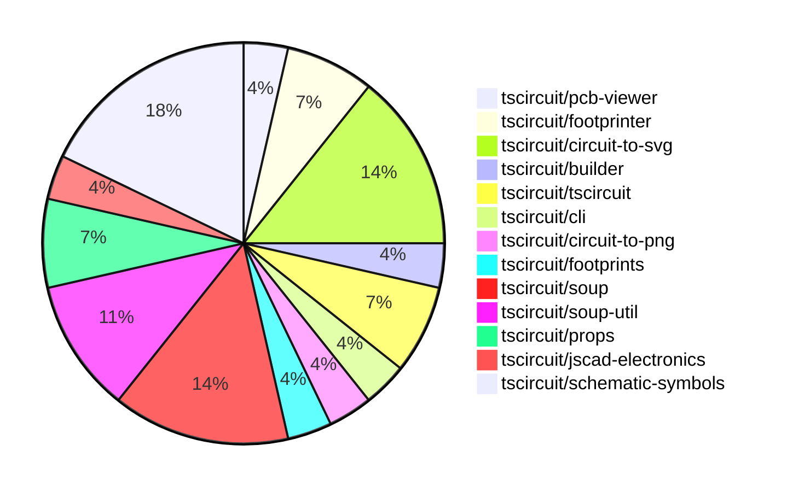

# contribution-tracker

Generates weekly contribution overviews for tscircuit contributors. Check out all
the [contribution overviews here](./contribution-overviews/)

* All PRs in the tscircuit org are scanned/summarized via Claude Haiku
* Claude classifies each Diff/PR as a Major, Minor or Tiny contribution
* All the PRs, summaries, and classifications are organized into charts and tables

The current week is shown below. There are 3 major sections:

* [Contributor Overview](#contributor-overview)
* [PRs by Repository](#prs-by-repository)
* [PRs by Contributor](#changes-by-contributor)

## Current Week

<!-- START_CURRENT_WEEK -->

# Contribution Overview 2024-08-17

## PRs by Repository

## Contributor Overview

| Contributor | 🐳 Major | 🐙 Minor | 🐌 Tiny |
|-------------|-------|-------|-------|
| imrishabh18 | 3 | 6 | 2 |
| seveibar | 10 | 6 | 0 |
| abhijitxy | 1 | 0 | 0 |

## Changes by Repository

### [tscircuit/pcb-viewer](https://github.com/tscircuit/pcb-viewer)

| PR # | Impact | Contributor | Description |
|------|--------|-------------|-------------|
| [#37](https://github.com/tscircuit/pcb-viewer/pull/37) | 🐳 Major | imrishabh18 | Adds the "bulge" in the trace by using the `getExpandedStroke` function to generate the polygon points and render the trace as a path. |

### [tscircuit/footprinter](https://github.com/tscircuit/footprinter)

| PR # | Impact | Contributor | Description |
|------|--------|-------------|-------------|
| [#17](https://github.com/tscircuit/footprinter/pull/17) | 🐳 Major | imrishabh18 | Add a new dependency 'circuit-to-svg' and update the tests to use it to generate SVG images of the circuit |
| [#15](https://github.com/tscircuit/footprinter/pull/15) | 🐳 Major | abhijitxy | Add SOT23 package definition |

### [tscircuit/circuit-to-svg](https://github.com/tscircuit/circuit-to-svg)

| PR # | Impact | Contributor | Description |
|------|--------|-------------|-------------|
| [#21](https://github.com/tscircuit/circuit-to-svg/pull/21) | 🐳 Major | imrishabh18 | The pull request adds the `svgson` library and introduces a new way of generating SVG content from the PCB soup elements. |
| [#24](https://github.com/tscircuit/circuit-to-svg/pull/24) | 🐙 Minor | imrishabh18 | Add a white background to the SVG element. |
| [#23](https://github.com/tscircuit/circuit-to-svg/pull/23) | 🐙 Minor | imrishabh18 | Refactor function names from `pcbSoupToSvg` to `circuitJsonToPcbSvg` and `soupToSvg` to `circuitJsonToSchematicSvg`. |
| [#22](https://github.com/tscircuit/circuit-to-svg/pull/22) | 🐌 Tiny | imrishabh18 | Fix a typo in the `pcb-soup-to-svg.ts` file. |

### [tscircuit/builder](https://github.com/tscircuit/builder)

| PR # | Impact | Contributor | Description |
|------|--------|-------------|-------------|
| [#103](https://github.com/tscircuit/builder/pull/103) | 🐙 Minor | imrishabh18 | Added `circuit-to-png` as a devDependency |

### [tscircuit/tscircuit](https://github.com/tscircuit/tscircuit)

| PR # | Impact | Contributor | Description |
|------|--------|-------------|-------------|
| [#351](https://github.com/tscircuit/tscircuit/pull/351) | 🐙 Minor | imrishabh18 | Automatically update package version using Renovate bot |
| [#349](https://github.com/tscircuit/tscircuit/pull/349) | 🐙 Minor | imrishabh18 | Update the version of the "@tscircuit/builder" dependency in the package.json file. |

### [tscircuit/cli](https://github.com/tscircuit/cli)

| PR # | Impact | Contributor | Description |
|------|--------|-------------|-------------|
| [#124](https://github.com/tscircuit/cli/pull/124) | 🐙 Minor | imrishabh18 | Introduce dynamic import for `circuitToPng` function in the `render.ts` file. |

### [tscircuit/circuit-to-png](https://github.com/tscircuit/circuit-to-png)

| PR # | Impact | Contributor | Description |
|------|--------|-------------|-------------|
| [#13](https://github.com/tscircuit/circuit-to-png/pull/13) | 🐌 Tiny | imrishabh18 | Removing the unused `@resvg/resvg-wasm` package from the dependencies. |

### [tscircuit/footprints](https://github.com/tscircuit/footprints)

| PR # | Impact | Contributor | Description |
|------|--------|-------------|-------------|
| [#3](https://github.com/tscircuit/footprints/pull/3) | 🐳 Major | seveibar | This pull request appears to be a large cleanup and update of the repository, including switching to the Bun runtime, fixing type issues, adding new workflows, and fixing a published types error. |

### [tscircuit/soup](https://github.com/tscircuit/soup)

| PR # | Impact | Contributor | Description |
|------|--------|-------------|-------------|
| [#27](https://github.com/tscircuit/soup/pull/27) | 🐳 Major | seveibar | Introduce a new formatbot workflow that has special behavior for forks (only checks without autofix) |
| [#23](https://github.com/tscircuit/soup/pull/23) | 🐙 Minor | seveibar | Add a new property called "route_thickness_mode" to the PCB trace schema, which can be either "constant" or "interpolated", with the default being "interpolated". Also, add a new optional property called "should_round_corners". |
| [#24](https://github.com/tscircuit/soup/pull/24) | 🐙 Minor | seveibar | Add an optional `symbol_name` field to schematic components. |
| [#22](https://github.com/tscircuit/soup/pull/22) | 🐙 Minor | seveibar | Add `pcb_board_id` field to the `pcb_board` object |

### [tscircuit/soup-util](https://github.com/tscircuit/soup-util)

| PR # | Impact | Contributor | Description |
|------|--------|-------------|-------------|
| [#8](https://github.com/tscircuit/soup-util/pull/8) | 🐳 Major | seveibar | Add the `update` method to the `su` object. |
| [#7](https://github.com/tscircuit/soup-util/pull/7) | 🐳 Major | seveibar | Add a delete method to the `su` API to remove elements from the soup. |
| [#6](https://github.com/tscircuit/soup-util/pull/6) | 🐳 Major | seveibar | Add support for `insert` method and `toArray` method to the `SoupUtilObjects` type. |

### [tscircuit/props](https://github.com/tscircuit/props)

| PR # | Impact | Contributor | Description |
|------|--------|-------------|-------------|
| [#21](https://github.com/tscircuit/props/pull/21) | 🐳 Major | seveibar | Avoid parsing `portRef` reference to prevent losing the reference. |
| [#20](https://github.com/tscircuit/props/pull/20) | 🐳 Major | seveibar | Improve published types, add support for port references that use a function |

### [tscircuit/jscad-electronics](https://github.com/tscircuit/jscad-electronics)

| PR # | Impact | Contributor | Description |
|------|--------|-------------|-------------|
| [#13](https://github.com/tscircuit/jscad-electronics/pull/13) | 🐳 Major | seveibar | Implement TSSOP (Thin Shrink Small Outline Package) component |

### [tscircuit/schematic-symbols](https://github.com/tscircuit/schematic-symbols)

| PR # | Impact | Contributor | Description |
|------|--------|-------------|-------------|
| [#7](https://github.com/tscircuit/schematic-symbols/pull/7) | 🐳 Major | seveibar | Add formatcheck and typecheck GitHub workflows, run format, and add formatbot. |
| [#4](https://github.com/tscircuit/schematic-symbols/pull/4) | 🐳 Major | seveibar | Initial release of the project, including adding a Vercel build script, fixing type errors, and publishing the first version (0.0.1). |
| [#9](https://github.com/tscircuit/schematic-symbols/pull/9) | 🐙 Minor | seveibar | Fix coordinates for the diode and LED symbols. |
| [#6](https://github.com/tscircuit/schematic-symbols/pull/6) | 🐙 Minor | seveibar | Include some computed fields to make it easier to use symbols |
| [#5](https://github.com/tscircuit/schematic-symbols/pull/5) | 🐙 Minor | seveibar | Add type exports for drawing-related types |

## Changes by Contributor

### [imrishabh18](https://github.com/imrishabh18)

| PR # | Impact | Description |
|------|--------|-------------|
| [#37](https://github.com/tscircuit/pcb-viewer/pull/37) | 🐳 Major | Adds the "bulge" in the trace by using the `getExpandedStroke` function to generate the polygon points and render the trace as a path. |
| [#17](https://github.com/tscircuit/footprinter/pull/17) | 🐳 Major | Add a new dependency 'circuit-to-svg' and update the tests to use it to generate SVG images of the circuit |
| [#21](https://github.com/tscircuit/circuit-to-svg/pull/21) | 🐳 Major | The pull request adds the `svgson` library and introduces a new way of generating SVG content from the PCB soup elements. |
| [#103](https://github.com/tscircuit/builder/pull/103) | 🐙 Minor | Added `circuit-to-png` as a devDependency |
| [#351](https://github.com/tscircuit/tscircuit/pull/351) | 🐙 Minor | Automatically update package version using Renovate bot |
| [#349](https://github.com/tscircuit/tscircuit/pull/349) | 🐙 Minor | Update the version of the "@tscircuit/builder" dependency in the package.json file. |
| [#124](https://github.com/tscircuit/cli/pull/124) | 🐙 Minor | Introduce dynamic import for `circuitToPng` function in the `render.ts` file. |
| [#24](https://github.com/tscircuit/circuit-to-svg/pull/24) | 🐙 Minor | Add a white background to the SVG element. |
| [#23](https://github.com/tscircuit/circuit-to-svg/pull/23) | 🐙 Minor | Refactor function names from `pcbSoupToSvg` to `circuitJsonToPcbSvg` and `soupToSvg` to `circuitJsonToSchematicSvg`. |
| [#22](https://github.com/tscircuit/circuit-to-svg/pull/22) | 🐌 Tiny | Fix a typo in the `pcb-soup-to-svg.ts` file. |
| [#13](https://github.com/tscircuit/circuit-to-png/pull/13) | 🐌 Tiny | Removing the unused `@resvg/resvg-wasm` package from the dependencies. |

### [seveibar](https://github.com/seveibar)

| PR # | Impact | Description |
|------|--------|-------------|
| [#3](https://github.com/tscircuit/footprints/pull/3) | 🐳 Major | This pull request appears to be a large cleanup and update of the repository, including switching to the Bun runtime, fixing type issues, adding new workflows, and fixing a published types error. |
| [#27](https://github.com/tscircuit/soup/pull/27) | 🐳 Major | Introduce a new formatbot workflow that has special behavior for forks (only checks without autofix) |
| [#8](https://github.com/tscircuit/soup-util/pull/8) | 🐳 Major | Add the `update` method to the `su` object. |
| [#7](https://github.com/tscircuit/soup-util/pull/7) | 🐳 Major | Add a delete method to the `su` API to remove elements from the soup. |
| [#6](https://github.com/tscircuit/soup-util/pull/6) | 🐳 Major | Add support for `insert` method and `toArray` method to the `SoupUtilObjects` type. |
| [#21](https://github.com/tscircuit/props/pull/21) | 🐳 Major | Avoid parsing `portRef` reference to prevent losing the reference. |
| [#20](https://github.com/tscircuit/props/pull/20) | 🐳 Major | Improve published types, add support for port references that use a function |
| [#13](https://github.com/tscircuit/jscad-electronics/pull/13) | 🐳 Major | Implement TSSOP (Thin Shrink Small Outline Package) component |
| [#7](https://github.com/tscircuit/schematic-symbols/pull/7) | 🐳 Major | Add formatcheck and typecheck GitHub workflows, run format, and add formatbot. |
| [#4](https://github.com/tscircuit/schematic-symbols/pull/4) | 🐳 Major | Initial release of the project, including adding a Vercel build script, fixing type errors, and publishing the first version (0.0.1). |
| [#23](https://github.com/tscircuit/soup/pull/23) | 🐙 Minor | Add a new property called "route_thickness_mode" to the PCB trace schema, which can be either "constant" or "interpolated", with the default being "interpolated". Also, add a new optional property called "should_round_corners". |
| [#24](https://github.com/tscircuit/soup/pull/24) | 🐙 Minor | Add an optional `symbol_name` field to schematic components. |
| [#22](https://github.com/tscircuit/soup/pull/22) | 🐙 Minor | Add `pcb_board_id` field to the `pcb_board` object |
| [#9](https://github.com/tscircuit/schematic-symbols/pull/9) | 🐙 Minor | Fix coordinates for the diode and LED symbols. |
| [#6](https://github.com/tscircuit/schematic-symbols/pull/6) | 🐙 Minor | Include some computed fields to make it easier to use symbols |
| [#5](https://github.com/tscircuit/schematic-symbols/pull/5) | 🐙 Minor | Add type exports for drawing-related types |

### [abhijitxy](https://github.com/abhijitxy)

| PR # | Impact | Description |
|------|--------|-------------|
| [#15](https://github.com/tscircuit/footprinter/pull/15) | 🐳 Major | Add SOT23 package definition |

<!-- END_CURRENT_WEEK -->
