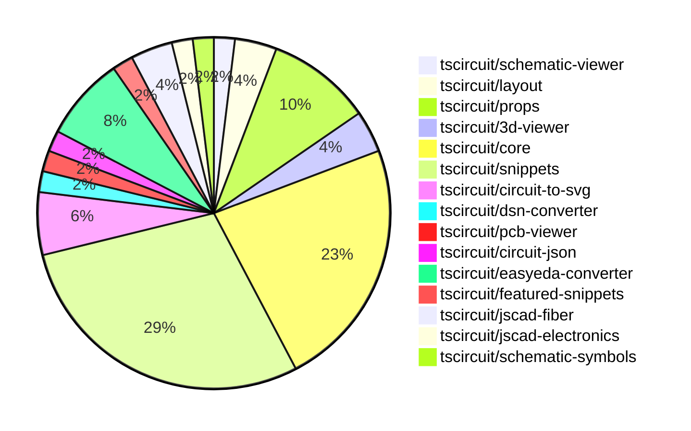

# contribution-tracker

Generates weekly contribution overviews for tscircuit contributors. Check out all
the [contribution overviews here](./contribution-overviews/)

* All PRs in the tscircuit org are scanned/summarized via Claude Haiku
* Claude classifies each Diff/PR as a Major, Minor or Tiny contribution
* All the PRs, summaries, and classifications are organized into charts and tables

The current week is shown below. There are 3 major sections:

* [Contributor Overview](#contributor-overview)
* [PRs by Repository](#prs-by-repository)
* [PRs by Contributor](#changes-by-contributor)

## Current Week

<!-- START_CURRENT_WEEK -->

# Contribution Overview 2024-10-30

## PRs by Repository

## Contributor Overview

| Contributor | 🐳 Major | 🐙 Minor | 🐌 Tiny | ⭐ |
|-------------|-------|-------|-------|-------|
| [seveibar](#seveibar) | 7 | 17 | 1 | 👑 |
| [imrishabh18](#imrishabh18) | 0 | 11 | 1 | ⭐⭐ |
| [anas-sarkez](#anas-sarkez) | 1 | 2 | 0 | ⭐ |
| [andrii-balitskyi](#andrii-balitskyi) | 0 | 3 | 0 | ⭐ |
| [mrudulpatil18](#mrudulpatil18) | 1 | 1 | 0 | ⭐ |
| [tscircuitbot](#tscircuitbot) | 0 | 2 | 0 | ⭐ |
| [ShiboSoftwareDev](#ShiboSoftwareDev) | 0 | 2 | 0 | ⭐ |
| [aman1376](#aman1376) | 1 | 0 | 0 | ⭐ |
| [Satvik1769](#Satvik1769) | 0 | 1 | 0 |  |
| [SufyaanKhateeb](#SufyaanKhateeb) | 0 | 1 | 0 |  |

## Changes by Repository

### [tscircuit/schematic-viewer](https://github.com/tscircuit/schematic-viewer)

| PR # | Impact | Contributor | Description |
|------|--------|-------------|-------------|
| [#71](https://github.com/tscircuit/schematic-viewer/pull/71) | 🐙 Minor | imrishabh18 | The change fixes the issue where the drag sensitivity was not constant throughout the viewport, by transforming the mouse movement to world space. |

### [tscircuit/layout](https://github.com/tscircuit/layout)

| PR # | Impact | Contributor | Description |
|------|--------|-------------|-------------|
| [#4](https://github.com/tscircuit/layout/pull/4) | 🐙 Minor | imrishabh18 | Fixes types in the `manual-layout-pcb.ts` file. |
| [#3](https://github.com/tscircuit/layout/pull/3) | 🐙 Minor | imrishabh18 | Refactor to use circuit-json library instead of @tscircuit/soup |

### [tscircuit/props](https://github.com/tscircuit/props)

| PR # | Impact | Contributor | Description |
|------|--------|-------------|-------------|
| [#70](https://github.com/tscircuit/props/pull/70) | 🐙 Minor | imrishabh18 | Manual edits added as props to the `BoardProps` and `SubcircuitGroupProps` interfaces. |
| [#72](https://github.com/tscircuit/props/pull/72) | 🐙 Minor | seveibar | Introduces a new `headerProps` type and exports it from the library. |
| [#76](https://github.com/tscircuit/props/pull/76) | 🐙 Minor | tscircuitbot | Rename `headerProps` to `pinHeaderProps` and add `pinHeader.pinLabels` |
| [#74](https://github.com/tscircuit/props/pull/74) | 🐙 Minor | tscircuitbot | Add parameters `holeDiameter` and `platedDiameter` to the `header` component. |
| [#68](https://github.com/tscircuit/props/pull/68) | 🐌 Tiny | seveibar | Adds a link to the latest version of the generated props overview in the markdown file. |

### [tscircuit/3d-viewer](https://github.com/tscircuit/3d-viewer)

| PR # | Impact | Contributor | Description |
|------|--------|-------------|-------------|
| [#29](https://github.com/tscircuit/3d-viewer/pull/29) | 🐙 Minor | imrishabh18 | Update "@tscircuit/core" dependency from version 0.0.97 to 0.0.136 |
| [#32](https://github.com/tscircuit/3d-viewer/pull/32) | 🐙 Minor | ShiboSoftwareDev | Fixes the rotation of 3D models in the CAD viewer component. |

### [tscircuit/core](https://github.com/tscircuit/core)

| PR # | Impact | Contributor | Description |
|------|--------|-------------|-------------|
| [#236](https://github.com/tscircuit/core/pull/236) | 🐳 Major | seveibar | The pull request introduces improvements to the schematic box rendering, including automatically computing the schematic box dimensions for components other than chips and removing ghost code. |
| [#235](https://github.com/tscircuit/core/pull/235) | 🐳 Major | seveibar | Adds support for pinheaders and implied footprint strings. |
| [#214](https://github.com/tscircuit/core/pull/214) | 🐳 Major | seveibar | Introduce new hooks `useChip`, `useResistor`, and `useCapacitor`, and fix the `useChip` hook with test cases for all three hooks. |
| [#212](https://github.com/tscircuit/core/pull/212) | 🐳 Major | seveibar | Improved types for `createUseComponent` and `useComponent` to better support pin labels in the native format. |
| [#229](https://github.com/tscircuit/core/pull/229) | 🐙 Minor | imrishabh18 | Adds the pin number as an alias for portHints in the NormalComponent class. |
| [#224](https://github.com/tscircuit/core/pull/224) | 🐙 Minor | imrishabh18 | Adds support for manual edits to the PCB layout in the `PrimitiveComponent` class. |
| [#238](https://github.com/tscircuit/core/pull/238) | 🐙 Minor | seveibar | Refactor the computation of the schematic box dimensions to simplify and improve the code. |
| [#227](https://github.com/tscircuit/core/pull/227) | 🐙 Minor | seveibar | Fix the bounds calculation not updating the center of the PCB component. |
| [#223](https://github.com/tscircuit/core/pull/223) | 🐙 Minor | seveibar | Enable removing path loops in the Trace component. |
| [#218](https://github.com/tscircuit/core/pull/218) | 🐙 Minor | seveibar | Modify the error handling behavior when net islands fail to route, instead of throwing a fatal error, it will now render a more detailed error message. |
| [#217](https://github.com/tscircuit/core/pull/217) | 🐙 Minor | seveibar | Introduce a new hook called `useDiode` that creates a reusable React component for a diode. |
| [#228](https://github.com/tscircuit/core/pull/228) | 🐌 Tiny | imrishabh18 | Updates the lockfile to include the latest dependencies. |

### [tscircuit/snippets](https://github.com/tscircuit/snippets)

| PR # | Impact | Contributor | Description |
|------|--------|-------------|-------------|
| [#150](https://github.com/tscircuit/snippets/pull/150) | 🐳 Major | seveibar | Move Toast to Bottom Right, Fix Sticky Preview, Improve Dropdown Color for CodeEditor files, Add FS Map from CDN to fix some type issues |
| [#121](https://github.com/tscircuit/snippets/pull/121) | 🐳 Major | mrudulpatil18 | Fixes the command palette search functionality by rewriting the search logic and using Fuzzy search to filter the possible commands. |
| [#164](https://github.com/tscircuit/snippets/pull/164) | 🐙 Minor | imrishabh18 | Fix the overflow issue on the View Snippet page. |
| [#159](https://github.com/tscircuit/snippets/pull/159) | 🐙 Minor | imrishabh18 | Remove button in the view page |
| [#143](https://github.com/tscircuit/snippets/pull/143) | 🐙 Minor | imrishabh18 | Adds support for manual edits in the CodeEditor component by introducing a `manualEditsJson` prop and updating the handling of the "manual-edits.json" file. |
| [#141](https://github.com/tscircuit/snippets/pull/141) | 🐙 Minor | imrishabh18 | Fix a bug related to updating the current file in the CodeEditor component. |
| [#162](https://github.com/tscircuit/snippets/pull/162) | 🐙 Minor | seveibar | Refactors the manual edits file handling to use one-way dataflow and allows passing manual edits as props. |
| [#155](https://github.com/tscircuit/snippets/pull/155) | 🐙 Minor | seveibar | Disable automatic closing bracket insertion in the code editor. |
| [#154](https://github.com/tscircuit/snippets/pull/154) | 🐙 Minor | seveibar | Fixed a bug where clicking "go to definition" would remove dashes from import names. |
| [#149](https://github.com/tscircuit/snippets/pull/149) | 🐙 Minor | seveibar | Fix createUseComponent types, Improve toast position, sticky preview, improve code editor header filename select box color |
| [#147](https://github.com/tscircuit/snippets/pull/147) | 🐙 Minor | seveibar | Updates the easyeda package to version 0.0.62 to fix ESP32 import, improve the Schematic Viewer Height, and add a Sticky Preview. |
| [#167](https://github.com/tscircuit/snippets/pull/167) | 🐙 Minor | ShiboSoftwareDev | The pull request fixes a bug where the cmd+click tooltip appears on all tsci imports, instead of only on the specific import being hovered over. |
| [#163](https://github.com/tscircuit/snippets/pull/163) | 🐙 Minor | Satvik1769 | Add a warning to the user before navigating away from the page if there are unsaved changes. |
| [#137](https://github.com/tscircuit/snippets/pull/137) | 🐙 Minor | mrudulpatil18 | Adds snippet type to the URL for copy URL functionality. |
| [#144](https://github.com/tscircuit/snippets/pull/144) | 🐙 Minor | SufyaanKhateeb | Fix the profile page header to say "My Profile" when the current user is viewing their profile and fix the "My Profile" link in the footer to show up only when logged in. |

### [tscircuit/circuit-to-svg](https://github.com/tscircuit/circuit-to-svg)

| PR # | Impact | Contributor | Description |
|------|--------|-------------|-------------|
| [#104](https://github.com/tscircuit/circuit-to-svg/pull/104) | 🐳 Major | seveibar | Major refactor to all schematic objects, using absolute coordinates, breaking up functions, and fixing offsets. |
| [#105](https://github.com/tscircuit/circuit-to-svg/pull/105) | 🐙 Minor | seveibar | Updates the core library version from 0.0.147 to 0.0.148. |
| [#103](https://github.com/tscircuit/circuit-to-svg/pull/103) | 🐙 Minor | seveibar | Fix schematic component rendering to use standard props instead of non-standard ones. |

### [tscircuit/dsn-converter](https://github.com/tscircuit/dsn-converter)

| PR # | Impact | Contributor | Description |
|------|--------|-------------|-------------|
| [#8](https://github.com/tscircuit/dsn-converter/pull/8) | 🐳 Major | seveibar |  |

### [tscircuit/pcb-viewer](https://github.com/tscircuit/pcb-viewer)

| PR # | Impact | Contributor | Description |
|------|--------|-------------|-------------|
| [#79](https://github.com/tscircuit/pcb-viewer/pull/79) | 🐙 Minor | seveibar | Standardizes the use of a centralized z-index map for various UI components. |

### [tscircuit/circuit-json](https://github.com/tscircuit/circuit-json)

| PR # | Impact | Contributor | Description |
|------|--------|-------------|-------------|
| [#67](https://github.com/tscircuit/circuit-json/pull/67) | 🐙 Minor | seveibar | Improves SI unit parsing by handling the case where the unit is written as "uF" instead of "µF". |

### [tscircuit/easyeda-converter](https://github.com/tscircuit/easyeda-converter)

| PR # | Impact | Contributor | Description |
|------|--------|-------------|-------------|
| [#89](https://github.com/tscircuit/easyeda-converter/pull/89) | 🐙 Minor | seveibar | Normalizes the pin labels in the EasyEDA JSON file to preserve the original pin numbers. |
| [#94](https://github.com/tscircuit/easyeda-converter/pull/94) | 🐙 Minor | andrii-balitskyi | Correctly parse right-facing (end) pins from raw EasyEDA JSON |
| [#93](https://github.com/tscircuit/easyeda-converter/pull/93) | 🐙 Minor | andrii-balitskyi | Sort pin labels in ascending order |
| [#91](https://github.com/tscircuit/easyeda-converter/pull/91) | 🐙 Minor | andrii-balitskyi | Include duplicate pin name in pin label array, remove pinNames from component template |

### [tscircuit/featured-snippets](https://github.com/tscircuit/featured-snippets)

| PR # | Impact | Contributor | Description |
|------|--------|-------------|-------------|
| [#2](https://github.com/tscircuit/featured-snippets/pull/2) | 🐙 Minor | seveibar | Adds a new feature to export file content to help with building prompts. |

### [tscircuit/jscad-fiber](https://github.com/tscircuit/jscad-fiber)

| PR # | Impact | Contributor | Description |
|------|--------|-------------|-------------|
| [#86](https://github.com/tscircuit/jscad-fiber/pull/86) | 🐳 Major | anas-sarkez | Refactored the `createHostConfig` function to support array-based subtraction of React elements, improving handling of mapped arrays and error checking. |
| [#87](https://github.com/tscircuit/jscad-fiber/pull/87) | 🐙 Minor | anas-sarkez | Fixed type errors in the `createInstance` function calls. |

### [tscircuit/jscad-electronics](https://github.com/tscircuit/jscad-electronics)

| PR # | Impact | Contributor | Description |
|------|--------|-------------|-------------|
| [#77](https://github.com/tscircuit/jscad-electronics/pull/77) | 🐙 Minor | anas-sarkez | Supported a different color for capacitors and updated dependencies |

### [tscircuit/schematic-symbols](https://github.com/tscircuit/schematic-symbols)

| PR # | Impact | Contributor | Description |
|------|--------|-------------|-------------|
| [#187](https://github.com/tscircuit/schematic-symbols/pull/187) | 🐳 Major | aman1376 | Adds a new SVG file and JSON data for an illuminated push button that is normally open. |

## Changes by Contributor

### [imrishabh18](https://github.com/imrishabh18)

| PR # | Impact | Description |
|------|--------|-------------|
| [#71](https://github.com/tscircuit/schematic-viewer/pull/71) | 🐙 Minor | The change fixes the issue where the drag sensitivity was not constant throughout the viewport, by transforming the mouse movement to world space. |
| [#4](https://github.com/tscircuit/layout/pull/4) | 🐙 Minor | Fixes types in the `manual-layout-pcb.ts` file. |
| [#3](https://github.com/tscircuit/layout/pull/3) | 🐙 Minor | Refactor to use circuit-json library instead of @tscircuit/soup |
| [#70](https://github.com/tscircuit/props/pull/70) | 🐙 Minor | Manual edits added as props to the `BoardProps` and `SubcircuitGroupProps` interfaces. |
| [#29](https://github.com/tscircuit/3d-viewer/pull/29) | 🐙 Minor | Update "@tscircuit/core" dependency from version 0.0.97 to 0.0.136 |
| [#229](https://github.com/tscircuit/core/pull/229) | 🐙 Minor | Adds the pin number as an alias for portHints in the NormalComponent class. |
| [#224](https://github.com/tscircuit/core/pull/224) | 🐙 Minor | Adds support for manual edits to the PCB layout in the `PrimitiveComponent` class. |
| [#164](https://github.com/tscircuit/snippets/pull/164) | 🐙 Minor | Fix the overflow issue on the View Snippet page. |
| [#159](https://github.com/tscircuit/snippets/pull/159) | 🐙 Minor | Remove button in the view page |
| [#143](https://github.com/tscircuit/snippets/pull/143) | 🐙 Minor | Adds support for manual edits in the CodeEditor component by introducing a `manualEditsJson` prop and updating the handling of the "manual-edits.json" file. |
| [#141](https://github.com/tscircuit/snippets/pull/141) | 🐙 Minor | Fix a bug related to updating the current file in the CodeEditor component. |
| [#228](https://github.com/tscircuit/core/pull/228) | 🐌 Tiny | Updates the lockfile to include the latest dependencies. |

### [seveibar](https://github.com/seveibar)

| PR # | Impact | Description |
|------|--------|-------------|
| [#236](https://github.com/tscircuit/core/pull/236) | 🐳 Major | The pull request introduces improvements to the schematic box rendering, including automatically computing the schematic box dimensions for components other than chips and removing ghost code. |
| [#235](https://github.com/tscircuit/core/pull/235) | 🐳 Major | Adds support for pinheaders and implied footprint strings. |
| [#214](https://github.com/tscircuit/core/pull/214) | 🐳 Major | Introduce new hooks `useChip`, `useResistor`, and `useCapacitor`, and fix the `useChip` hook with test cases for all three hooks. |
| [#212](https://github.com/tscircuit/core/pull/212) | 🐳 Major | Improved types for `createUseComponent` and `useComponent` to better support pin labels in the native format. |
| [#104](https://github.com/tscircuit/circuit-to-svg/pull/104) | 🐳 Major | Major refactor to all schematic objects, using absolute coordinates, breaking up functions, and fixing offsets. |
| [#8](https://github.com/tscircuit/dsn-converter/pull/8) | 🐳 Major |  |
| [#150](https://github.com/tscircuit/snippets/pull/150) | 🐳 Major | Move Toast to Bottom Right, Fix Sticky Preview, Improve Dropdown Color for CodeEditor files, Add FS Map from CDN to fix some type issues |
| [#79](https://github.com/tscircuit/pcb-viewer/pull/79) | 🐙 Minor | Standardizes the use of a centralized z-index map for various UI components. |
| [#67](https://github.com/tscircuit/circuit-json/pull/67) | 🐙 Minor | Improves SI unit parsing by handling the case where the unit is written as "uF" instead of "µF". |
| [#72](https://github.com/tscircuit/props/pull/72) | 🐙 Minor | Introduces a new `headerProps` type and exports it from the library. |
| [#89](https://github.com/tscircuit/easyeda-converter/pull/89) | 🐙 Minor | Normalizes the pin labels in the EasyEDA JSON file to preserve the original pin numbers. |
| [#238](https://github.com/tscircuit/core/pull/238) | 🐙 Minor | Refactor the computation of the schematic box dimensions to simplify and improve the code. |
| [#227](https://github.com/tscircuit/core/pull/227) | 🐙 Minor | Fix the bounds calculation not updating the center of the PCB component. |
| [#223](https://github.com/tscircuit/core/pull/223) | 🐙 Minor | Enable removing path loops in the Trace component. |
| [#218](https://github.com/tscircuit/core/pull/218) | 🐙 Minor | Modify the error handling behavior when net islands fail to route, instead of throwing a fatal error, it will now render a more detailed error message. |
| [#217](https://github.com/tscircuit/core/pull/217) | 🐙 Minor | Introduce a new hook called `useDiode` that creates a reusable React component for a diode. |
| [#105](https://github.com/tscircuit/circuit-to-svg/pull/105) | 🐙 Minor | Updates the core library version from 0.0.147 to 0.0.148. |
| [#103](https://github.com/tscircuit/circuit-to-svg/pull/103) | 🐙 Minor | Fix schematic component rendering to use standard props instead of non-standard ones. |
| [#162](https://github.com/tscircuit/snippets/pull/162) | 🐙 Minor | Refactors the manual edits file handling to use one-way dataflow and allows passing manual edits as props. |
| [#155](https://github.com/tscircuit/snippets/pull/155) | 🐙 Minor | Disable automatic closing bracket insertion in the code editor. |
| [#154](https://github.com/tscircuit/snippets/pull/154) | 🐙 Minor | Fixed a bug where clicking "go to definition" would remove dashes from import names. |
| [#149](https://github.com/tscircuit/snippets/pull/149) | 🐙 Minor | Fix createUseComponent types, Improve toast position, sticky preview, improve code editor header filename select box color |
| [#147](https://github.com/tscircuit/snippets/pull/147) | 🐙 Minor | Updates the easyeda package to version 0.0.62 to fix ESP32 import, improve the Schematic Viewer Height, and add a Sticky Preview. |
| [#2](https://github.com/tscircuit/featured-snippets/pull/2) | 🐙 Minor | Adds a new feature to export file content to help with building prompts. |
| [#68](https://github.com/tscircuit/props/pull/68) | 🐌 Tiny | Adds a link to the latest version of the generated props overview in the markdown file. |

### [tscircuitbot](https://github.com/tscircuitbot)

| PR # | Impact | Description |
|------|--------|-------------|
| [#76](https://github.com/tscircuit/props/pull/76) | 🐙 Minor | Rename `headerProps` to `pinHeaderProps` and add `pinHeader.pinLabels` |
| [#74](https://github.com/tscircuit/props/pull/74) | 🐙 Minor | Add parameters `holeDiameter` and `platedDiameter` to the `header` component. |

### [andrii-balitskyi](https://github.com/andrii-balitskyi)

| PR # | Impact | Description |
|------|--------|-------------|
| [#94](https://github.com/tscircuit/easyeda-converter/pull/94) | 🐙 Minor | Correctly parse right-facing (end) pins from raw EasyEDA JSON |
| [#93](https://github.com/tscircuit/easyeda-converter/pull/93) | 🐙 Minor | Sort pin labels in ascending order |
| [#91](https://github.com/tscircuit/easyeda-converter/pull/91) | 🐙 Minor | Include duplicate pin name in pin label array, remove pinNames from component template |

### [ShiboSoftwareDev](https://github.com/ShiboSoftwareDev)

| PR # | Impact | Description |
|------|--------|-------------|
| [#32](https://github.com/tscircuit/3d-viewer/pull/32) | 🐙 Minor | Fixes the rotation of 3D models in the CAD viewer component. |
| [#167](https://github.com/tscircuit/snippets/pull/167) | 🐙 Minor | The pull request fixes a bug where the cmd+click tooltip appears on all tsci imports, instead of only on the specific import being hovered over. |

### [anas-sarkez](https://github.com/anas-sarkez)

| PR # | Impact | Description |
|------|--------|-------------|
| [#86](https://github.com/tscircuit/jscad-fiber/pull/86) | 🐳 Major | Refactored the `createHostConfig` function to support array-based subtraction of React elements, improving handling of mapped arrays and error checking. |
| [#77](https://github.com/tscircuit/jscad-electronics/pull/77) | 🐙 Minor | Supported a different color for capacitors and updated dependencies |
| [#87](https://github.com/tscircuit/jscad-fiber/pull/87) | 🐙 Minor | Fixed type errors in the `createInstance` function calls. |

### [aman1376](https://github.com/aman1376)

| PR # | Impact | Description |
|------|--------|-------------|
| [#187](https://github.com/tscircuit/schematic-symbols/pull/187) | 🐳 Major | Adds a new SVG file and JSON data for an illuminated push button that is normally open. |

### [Satvik1769](https://github.com/Satvik1769)

| PR # | Impact | Description |
|------|--------|-------------|
| [#163](https://github.com/tscircuit/snippets/pull/163) | 🐙 Minor | Add a warning to the user before navigating away from the page if there are unsaved changes. |

### [mrudulpatil18](https://github.com/mrudulpatil18)

| PR # | Impact | Description |
|------|--------|-------------|
| [#121](https://github.com/tscircuit/snippets/pull/121) | 🐳 Major | Fixes the command palette search functionality by rewriting the search logic and using Fuzzy search to filter the possible commands. |
| [#137](https://github.com/tscircuit/snippets/pull/137) | 🐙 Minor | Adds snippet type to the URL for copy URL functionality. |

### [SufyaanKhateeb](https://github.com/SufyaanKhateeb)

| PR # | Impact | Description |
|------|--------|-------------|
| [#144](https://github.com/tscircuit/snippets/pull/144) | 🐙 Minor | Fix the profile page header to say "My Profile" when the current user is viewing their profile and fix the "My Profile" link in the footer to show up only when logged in. |

<!-- END_CURRENT_WEEK -->
