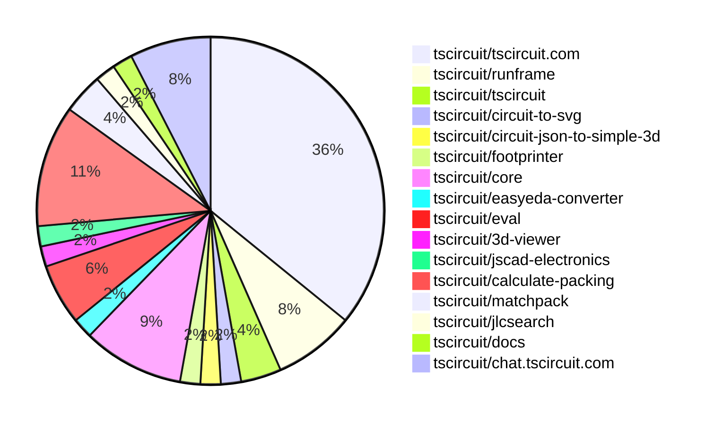
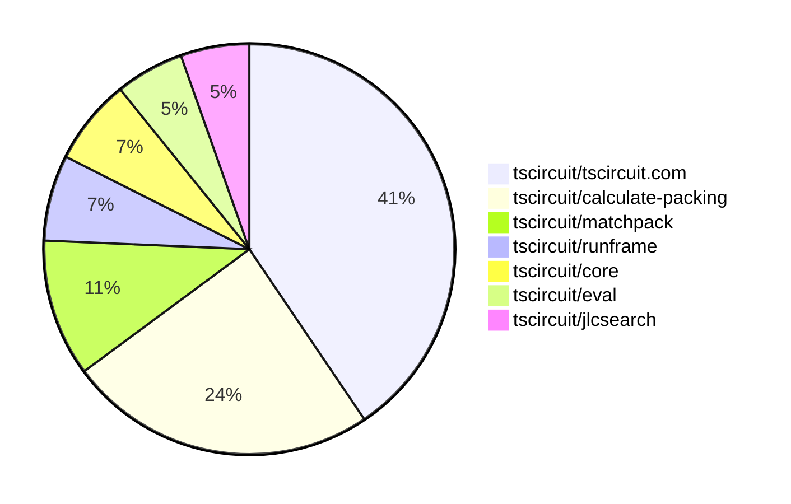

# contribution-tracker

[contributions.tscircuit.com](https://contributions.tscircuit.com) ・ [tscircuit.com](https://tscircuit.com) ・ [Contribution Overviews](./contribution-overviews/) ・ [Changelogs](./changelogs/)

Generates weekly contribution overviews for tscircuit contributors. Check out all
the [contribution overviews here](./contribution-overviews/)
You can find AI-generated monthly changelogs in the [changelogs directory](./changelogs/).

- All PRs in the tscircuit org are scanned/summarized via an LLM
- The LLM classifies each Diff/PR as into a set of attributes for scoring
- All the PRs, summaries, and classifications are organized into charts and tables for [the website](https://contributions.tscircuit.com)

> Want to run locally? See the [Development Section](#development)

The current week is shown below. There are 3 major sections:

- [Contributor Overview](#contributor-overview)
- [PRs by Repository](#prs-by-repository)
- [PRs by Contributor](#changes-by-contributor)

## Current Week

<!-- START_CURRENT_WEEK -->

# Contribution Overview 2025-08-20

## PRs by Repository



## Contributor Overview

| Contributor | 🐳 Major | 🐙 Minor | 🐌 Tiny | ⭐ | Score | Discussion Contributions |
|-------------|---------|---------|---------|-----|----------------|--------------------------|
| [seveibar](#seveibar) | 6 | 0 | 4 | ⭐⭐⭐ | 43 | 0🔹 0🔶 0💎 |
| [ArnavK-09](#ArnavK-09) | 1 | 4 | 8 | ⭐⭐ | 20.5 | 0🔹 0🔶 0💎 |
| [abimaelmartell](#abimaelmartell) | 1 | 2 | 9 | ⭐⭐ | 20 | 0🔹 0🔶 0💎 |
| [imrishabh18](#imrishabh18) | 1 | 1 | 12 | ⭐⭐ | 17 | 0🔹 0🔶 0💎 |
| [techmannih](#techmannih) | 0 | 1 | 1 | ⭐ | 5 | 0🔹 0🔶 0💎 |
| [pxlpal](#pxlpal) | 0 | 1 | 1 | ⭐ | 4 | 0🔹 0🔶 0💎 |

### Discussion Contribution Legend

- 🔹 Normal Comments: Basic participation with minimal effort
- 🔶 Great Informative Comments: Thoughtful participation that adds value
- 💎 Incredible Comments: Exceptional participation with high-quality content

## Review Table

[reviews-received-hover]: ## "Number of reviews received for PRs for this contributor"
[approvals-received-hover]: ## "Number of approvals received for PRs this contributor authored"
[rejections-received-hover]: ## "Number of rejections received for PRs this contributor authored"
[prs-opened-hover]: ## "Number of PRs opened by this contributor"
[issues-created-hover]: ## "Number of issues created by this contributor"
[bountied-issues-hover]: ## "Number of issues this contributor created with a bounty"
[bountied-issue-$-hover]: ## "Total bounty amount placed on issues authored by this contributor"

| Contributor | Reviews Received | Approvals Received | Rejections Received | Approvals | Rejections | PRs Opened | PRs Merged | Score | Issues Created | Bountied Issues | Bountied Issue $ |
|---|---|---|---|---|---|---|---|---|---|---|---|
| [abimaelmartell](#abimaelmartell) | 10 | 8 | 0 | 3 | 0 | 14 | 12 | 20 | 0 | 0 | 0 |
| [seveibar](#seveibar) | 0 | 0 | 0 | 30 | 3 | 12 | 10 | 43 | 0 | 0 | 0 |
| [pxlpal](#pxlpal) | 6 | 3 | 1 | 0 | 0 | 4 | 2 | 4 | 0 | 0 | 0 |
| [techmannih](#techmannih) | 12 | 2 | 1 | 0 | 0 | 5 | 2 | 5 | 0 | 0 | 0 |
| [graphite-app[bot]](#graphite-app[bot]) | 0 | 0 | 0 | 0 | 0 | 0 | 0 | 0 | 0 | 0 | 0 |
| [ArnavK-09](#ArnavK-09) | 19 | 14 | 0 | 1 | 0 | 14 | 13 | 20.5 | 0 | 0 | 0 |
| [imrishabh18](#imrishabh18) | 15 | 8 | 1 | 1 | 0 | 20 | 14 | 17 | 0 | 0 | 0 |
| [tscircuitbot](#tscircuitbot) | 0 | 0 | 0 | 0 | 0 | 10 | 0 | 0 | 0 | 0 | 0 |
| [copilot-pull-request-reviewer[bot]](#copilot-pull-request-reviewer[bot]) | 0 | 0 | 0 | 0 | 0 | 0 | 0 | 0 | 0 | 0 | 0 |

## Top 7 Repositories by Contribution Points



## Changes by Repository

### [tscircuit/tscircuit.com](https://github.com/tscircuit/tscircuit.com)

| PR # | Impact | Rating | Contributor | Description |
|------|--------|--------|-------------|-------------|
| [#1593](https://github.com/tscircuit/tscircuit.com/pull/1593) | 🐳 Major | ⭐⭐⭐ | abimaelmartell | Eliminates duplicate API requests for package release data by standardizing the use of a shared hook across components. |
| [#1608](https://github.com/tscircuit/tscircuit.com/pull/1608) | 🐳 Major | ⭐⭐⭐ | ArnavK-09 | Fixes image previews not loading by synchronizing the images route and updating the image source URL to include the package release SHA. |
| [#1601](https://github.com/tscircuit/tscircuit.com/pull/1601) | 🐙 Minor | ⭐⭐ | abimaelmartell | Fixes a race condition that occurs when loading files, ensuring that the loading state accurately reflects the status of file fetching. |
| [#1603](https://github.com/tscircuit/tscircuit.com/pull/1603) | 🐙 Minor | ⭐⭐ | ArnavK-09 | Fixes the path resolution for the main component and selected component in the CodeEditor, ensuring correct file selection based on URL parameters. |
| [#1606](https://github.com/tscircuit/tscircuit.com/pull/1606) | 🐙 Minor | ⭐⭐ | ArnavK-09 | Fixes the resolution of hidden files and addresses a bug in the folder selection process. |
| [#1600](https://github.com/tscircuit/tscircuit.com/pull/1600) | 🐙 Minor | ⭐⭐ | ArnavK-09 | Fixes intermittent file loading issues in the file management system |
| [#1596](https://github.com/tscircuit/tscircuit.com/pull/1596) | 🐙 Minor | ⭐⭐ | imrishabh18 | Hides the fileMenu next to the Run button in the editor interface, streamlining the user experience. |

<details>
<summary>🐌 Tiny Contributions (12)</summary>

| PR # | Impact | Contributor | Description |
|------|--------|-------------|-------------|
| [#1610](https://github.com/tscircuit/tscircuit.com/pull/1610) | 🐌 Tiny | abimaelmartell | Removes redundant requests for package data by consolidating hooks to fetch current package information. |
| [#1609](https://github.com/tscircuit/tscircuit.com/pull/1609) | 🐌 Tiny | abimaelmartell | Updates API URL references from registry-api.tscircuit.com to api.tscircuit.com in various files. |
| [#1595](https://github.com/tscircuit/tscircuit.com/pull/1595) | 🐌 Tiny | abimaelmartell | Switches the package_fileslist API to use GET with query parameters, updating client hooks and components accordingly, and adjusting registry utilities and tests to reflect this change. |
| [#1594](https://github.com/tscircuit/tscircuit.com/pull/1594) | 🐌 Tiny | abimaelmartell | Avoids unnecessary calls to fetch the LICENSE file by checking for its existence in the release files first, thus optimizing the data fetching process. |
| [#1592](https://github.com/tscircuit/tscircuit.com/pull/1592) | 🐌 Tiny | abimaelmartell | Changes the package_filesget endpoint to use GET with query parameters, updates client hooks and scripts accordingly, and aligns tests with the new GET behavior. |
| [#1607](https://github.com/tscircuit/tscircuit.com/pull/1607) | 🐌 Tiny | ArnavK-09 | Add draggablefalse to various components to prevent unwanted dragging, apply select-none class to improve text selection behavior, replace custom spinner with Loader2 icon for consistency, update search input attributes for better accessibility, and fix package image URL path in search component. |
| [#1602](https://github.com/tscircuit/tscircuit.com/pull/1602) | 🐌 Tiny | ArnavK-09 | Fixes loading issues in RunFrame by updating the runframe dependency to version 0.0.827 |
| [#1599](https://github.com/tscircuit/tscircuit.com/pull/1599) | 🐌 Tiny | ArnavK-09 | Fixes the base URL for the registry API and improves logging for package loading operations in the autoload dev packages functionality. |
| [#1604](https://github.com/tscircuit/tscircuit.com/pull/1604) | 🐌 Tiny | ArnavK-09 | Updates loading indicators in the datasheet and quickstart pages to use a new Loader2 component with adjusted styling. |
| [#1598](https://github.com/tscircuit/tscircuit.com/pull/1598) | 🐌 Tiny | ArnavK-09 | Fixes layout issues in the CmdKMenu component by adjusting Tailwind CSS classes for better responsiveness and visual alignment. |
| [#1605](https://github.com/tscircuit/tscircuit.com/pull/1605) | 🐌 Tiny | imrishabh18 | Hides rename and delete actions in the file tree for packages not owned by the current user, and renames the file modification flag to canModifyFiles. |
| [#1597](https://github.com/tscircuit/tscircuit.com/pull/1597) | 🐌 Tiny | imrishabh18 | Fixes the GitHub repository selector dropdown styling to ensure it matches the trigger width and stays aligned, while wrapping repository options in CommandList for consistent styling and behavior. |

</details>

### [tscircuit/runframe](https://github.com/tscircuit/runframe)

| PR # | Impact | Rating | Contributor | Description |
|------|--------|--------|-------------|-------------|
| [#1026](https://github.com/tscircuit/runframe/pull/1026) | 🐙 Minor | ⭐⭐ | abimaelmartell | Fixes a timing issue in standalone mode by ensuring that the DOM is fully loaded before rendering components. |

<details>
<summary>🐌 Tiny Contributions (3)</summary>

| PR # | Impact | Contributor | Description |
|------|--------|-------------|-------------|
| [#1020](https://github.com/tscircuit/runframe/pull/1020) | 🐌 Tiny | ArnavK-09 | https:runframe-git-a18-tscircuit.vercel.app?fixtureId7B22path223A22examples2Fexample23-files-loading-skeleton.fixture.tsx227D |
| [#1022](https://github.com/tscircuit/runframe/pull/1022) | 🐌 Tiny | imrishabh18 | Enables the fetch proxy for web workers in standalone bundles by adding a new optional property to the RunFrameProps interface and updating relevant components to utilize this property. |
| [#1018](https://github.com/tscircuit/runframe/pull/1018) | 🐌 Tiny | imrishabh18 | Adds an option to control the visibility of the file menu in the RunFrame component based on the showFileMenu prop. |

</details>

### [tscircuit/tscircuit](https://github.com/tscircuit/tscircuit)


<details>
<summary>🐌 Tiny Contributions (2)</summary>

| PR # | Impact | Contributor | Description |
|------|--------|-------------|-------------|
| [#741](https://github.com/tscircuit/tscircuit/pull/741) | 🐌 Tiny | abimaelmartell | Removes the CDN fetch for webworker.min.js and replaces it with a local dependency from minicssgrid. |
| [#740](https://github.com/tscircuit/tscircuit/pull/740) | 🐌 Tiny | abimaelmartell | Adds minicssgrid as a dependency to resolve a blocking issue with dependency updates in the core. |

</details>

### [tscircuit/circuit-to-svg](https://github.com/tscircuit/circuit-to-svg)


<details>
<summary>🐌 Tiny Contributions (1)</summary>

| PR # | Impact | Contributor | Description |
|------|--------|-------------|-------------|
| [#296](https://github.com/tscircuit/circuit-to-svg/pull/296) | 🐌 Tiny | abimaelmartell | Fixes the output directory for Vercel deployment from cosmos-export to examplescosmos-export |

</details>

### [tscircuit/circuit-json-to-simple-3d](https://github.com/tscircuit/circuit-json-to-simple-3d)


<details>
<summary>🐌 Tiny Contributions (1)</summary>

| PR # | Impact | Contributor | Description |
|------|--------|-------------|-------------|
| [#12](https://github.com/tscircuit/circuit-json-to-simple-3d/pull/12) | 🐌 Tiny | abimaelmartell | Adds functionality to render PCB components without requiring a PCB board, allowing for standalone component visualization. |

</details>

### [tscircuit/footprinter](https://github.com/tscircuit/footprinter)

| PR # | Impact | Rating | Contributor | Description |
|------|--------|--------|-------------|-------------|
| [#364](https://github.com/tscircuit/footprinter/pull/364) | 🐙 Minor | ⭐⭐ | techmannih | Fixes string parser to ignore empty or invalid segments when parsing footprint strings, enhancing robustness in handling input data. |

### [tscircuit/core](https://github.com/tscircuit/core)


<details>
<summary>🐌 Tiny Contributions (5)</summary>

| PR # | Impact | Contributor | Description |
|------|--------|-------------|-------------|
| [#1170](https://github.com/tscircuit/core/pull/1170) | 🐌 Tiny | techmannih | Handles worker self.location.origin in getClientOrigin and adds tests verifying origin selection in browser and worker contexts |
| [#1172](https://github.com/tscircuit/core/pull/1172) | 🐌 Tiny | pxlpal | Changes the display of capacitance in the schematic symbol to use the raw string value instead of formatting it, allowing for more accurate representation of user-defined capacitance values. |
| [#1171](https://github.com/tscircuit/core/pull/1171) | 🐌 Tiny | seveibar | Updates the tscircuitmatchpack dependency to version 0.0.9 and the calculate-packing dependency to version 0.0.28 in the project. |
| [#1168](https://github.com/tscircuit/core/pull/1168) | 🐌 Tiny | imrishabh18 | Calculates the size of a schematic group based on its components when dimensions are not explicitly provided, ensuring proper layout in the absence of predefined sizes. |
| [#1166](https://github.com/tscircuit/core/pull/1166) | 🐌 Tiny | imrishabh18 | Adds support for grouping in grid layout and refactors the layout method for improved readability and functionality. |

</details>

### [tscircuit/easyeda-converter](https://github.com/tscircuit/easyeda-converter)

| PR # | Impact | Rating | Contributor | Description |
|------|--------|--------|-------------|-------------|
| [#312](https://github.com/tscircuit/easyeda-converter/pull/312) | 🐙 Minor | ⭐⭐ | pxlpal | Fixes CAD rotation issues when converting EasyEDA models to circuit JSON format, ensuring correct orientation based on Z rotation values. |

### [tscircuit/eval](https://github.com/tscircuit/eval)

| PR # | Impact | Rating | Contributor | Description |
|------|--------|--------|-------------|-------------|
| [#855](https://github.com/tscircuit/eval/pull/855) | 🐙 Minor | ⭐⭐ | ArnavK-09 | Fixes the prioritization of default exports over named exports in component rendering. |

<details>
<summary>🐌 Tiny Contributions (2)</summary>

| PR # | Impact | Contributor | Description |
|------|--------|-------------|-------------|
| [#866](https://github.com/tscircuit/eval/pull/866) | 🐌 Tiny | seveibar | Updates the test matrix for more stable test runs, refactors test files into directories, and updates the core library version to v0.0.640. |
| [#853](https://github.com/tscircuit/eval/pull/853) | 🐌 Tiny | imrishabh18 | Adds a fetch proxy to the web worker, allowing fetch requests to be routed through the main thread, which is useful in restricted environments where worker fetch requests are blocked. |

</details>

### [tscircuit/3d-viewer](https://github.com/tscircuit/3d-viewer)


<details>
<summary>🐌 Tiny Contributions (1)</summary>

| PR # | Impact | Contributor | Description |
|------|--------|-------------|-------------|
| [#421](https://github.com/tscircuit/3d-viewer/pull/421) | 🐌 Tiny | ArnavK-09 | Updates the circuit-json dependency to version 0.0.232 to resolve polyfill errors. |

</details>

### [tscircuit/jscad-electronics](https://github.com/tscircuit/jscad-electronics)


<details>
<summary>🐌 Tiny Contributions (1)</summary>

| PR # | Impact | Contributor | Description |
|------|--------|-------------|-------------|
| [#107](https://github.com/tscircuit/jscad-electronics/pull/107) | 🐌 Tiny | ArnavK-09 | Updates dependencies in package.json and fixes type casting in BGA component. |

</details>

### [tscircuit/calculate-packing](https://github.com/tscircuit/calculate-packing)

| PR # | Impact | Rating | Contributor | Description |
|------|--------|--------|-------------|-------------|
| [#28](https://github.com/tscircuit/calculate-packing/pull/28) | 🐳 Major | ⭐⭐⭐ | seveibar | Fixes overlap detection for packed components by introducing an epsilon value, ensuring proper alignment of voltage regulator caps. |
| [#27](https://github.com/tscircuit/calculate-packing/pull/27) | 🐳 Major | ⭐⭐⭐ | seveibar | Pad to Pad vs Pad to Center Optimization !image(https:github.comuser-attachmentsassetsb3306b25-1e3b-49af-a415-0db9c248ba3d) |
| [#26](https://github.com/tscircuit/calculate-packing/pull/26) | 🐳 Major | ⭐⭐⭐ | seveibar | This pull request introduces a new approach to generating outlines for packed components, addressing issues with invalid outline generation. It includes a new utility function for combining bounds and enhances the stability of the outline construction process. Additionally, a debugging component is added to visualize the outlines and component arrangements, allowing for better testing and validation of the outline generation logic. |
| [#23](https://github.com/tscircuit/calculate-packing/pull/23) | 🐳 Major | ⭐⭐⭐ | seveibar | pack placement strategy wip pack solver 2 single component pack solver init add packsolver2 test with error remove stroke widths that were making things less visible, add test identifying insideoutside of outline for componentToPlace using poitnInOutline always show pads of outline segment while being solved switch PackSolver2 as the default for PackDebugger improve pointInOutline to match segment style. Improve normal calculation fix normal segment placement placeholder for viable outline segment computation add largest rect insideoutside bounds solver add largest rect outside outline solver improve visual and fix last-minute offset when irls is solved |

<details>
<summary>🐌 Tiny Contributions (2)</summary>

| PR # | Impact | Contributor | Description |
|------|--------|-------------|-------------|
| [#25](https://github.com/tscircuit/calculate-packing/pull/25) | 🐌 Tiny | seveibar | Adds getConstructorParams method to PackSolver2 and modifies it in SingleComponentPackSolver to return an object instead of an array. |
| [#24](https://github.com/tscircuit/calculate-packing/pull/24) | 🐌 Tiny | seveibar | Adds PackSolver2 to the exports in the index file, making it available for use in other modules. |

</details>

### [tscircuit/matchpack](https://github.com/tscircuit/matchpack)

| PR # | Impact | Rating | Contributor | Description |
|------|--------|--------|-------------|-------------|
| [#10](https://github.com/tscircuit/matchpack/pull/10) | 🐳 Major | ⭐⭐⭐ | seveibar | Adds a new PasteInput page for parsing InputProblem data and fixes rotation offsets not loading properly from PackSolver2. |
| [#9](https://github.com/tscircuit/matchpack/pull/9) | 🐳 Major | ⭐⭐⭐ | seveibar | Fixes issues with the outline missing packed components and resolves problems in the PackSolver2 implementation. |

### [tscircuit/jlcsearch](https://github.com/tscircuit/jlcsearch)

| PR # | Impact | Rating | Contributor | Description |
|------|--------|--------|-------------|-------------|
| [#80](https://github.com/tscircuit/jlcsearch/pull/80) | 🐳 Major | ⭐⭐⭐ | imrishabh18 | Add a new derived table for FPC connectors, expose a route for listing and filtering FPC connectors, and document the new category. |

### [tscircuit/docs](https://github.com/tscircuit/docs)


<details>
<summary>🐌 Tiny Contributions (1)</summary>

| PR # | Impact | Contributor | Description |
|------|--------|-------------|-------------|
| [#113](https://github.com/tscircuit/docs/pull/113) | 🐌 Tiny | imrishabh18 | Changes the CDN URL for loading the tscircuit library from jsDelivr to Cloudflares CDN. |

</details>

### [tscircuit/chat.tscircuit.com](https://github.com/tscircuit/chat.tscircuit.com)


<details>
<summary>🐌 Tiny Contributions (4)</summary>

| PR # | Impact | Contributor | Description |
|------|--------|-------------|-------------|
| [#26](https://github.com/tscircuit/chat.tscircuit.com/pull/26) | 🐌 Tiny | imrishabh18 | Increases the maximum duration for processing requests from 60 seconds to 300 seconds to accommodate longer processing times for the GPT 5 model. |
| [#25](https://github.com/tscircuit/chat.tscircuit.com/pull/25) | 🐌 Tiny | imrishabh18 | Changes the AI model used for title generation from gpt-5 to gpt-5-mini and adds gpt-5-mini as a new model for general assistance. |
| [#24](https://github.com/tscircuit/chat.tscircuit.com/pull/24) | 🐌 Tiny | imrishabh18 | Implements improved error handling in the chat API and sets the temperature parameter to a default value of 1 for GPT-5. |
| [#23](https://github.com/tscircuit/chat.tscircuit.com/pull/23) | 🐌 Tiny | imrishabh18 | Changes the default chat model to gpt-5 and adds gpt-5 as a new model for general assistance. |

</details>

## Changes by Contributor

### [abimaelmartell](https://github.com/abimaelmartell)

| PRs # | Impact | Rating | Description |
|------|--------|--------|-------------|
| [#1593](https://github.com/tscircuit/tscircuit.com/pull/1593) | 🐳 Major | ⭐⭐⭐ | Eliminates duplicate API requests for package release data by standardizing the use of a shared hook across components. |
| [#1601](https://github.com/tscircuit/tscircuit.com/pull/1601) | 🐙 Minor | ⭐⭐ | Fixes a race condition that occurs when loading files, ensuring that the loading state accurately reflects the status of file fetching. |
| [#1026](https://github.com/tscircuit/runframe/pull/1026) | 🐙 Minor | ⭐⭐ | Fixes a timing issue in standalone mode by ensuring that the DOM is fully loaded before rendering components. |

<details>
<summary>🐌 Tiny Contributions (9)</summary>

| PR # | Impact | Description |
|------|--------|-------------|
| [#741](https://github.com/tscircuit/tscircuit/pull/741) | 🐌 Tiny | Removes the CDN fetch for webworker.min.js and replaces it with a local dependency from minicssgrid. |
| [#740](https://github.com/tscircuit/tscircuit/pull/740) | 🐌 Tiny | Adds minicssgrid as a dependency to resolve a blocking issue with dependency updates in the core. |
| [#296](https://github.com/tscircuit/circuit-to-svg/pull/296) | 🐌 Tiny | Fixes the output directory for Vercel deployment from cosmos-export to examplescosmos-export |
| [#1610](https://github.com/tscircuit/tscircuit.com/pull/1610) | 🐌 Tiny | Removes redundant requests for package data by consolidating hooks to fetch current package information. |
| [#1609](https://github.com/tscircuit/tscircuit.com/pull/1609) | 🐌 Tiny | Updates API URL references from registry-api.tscircuit.com to api.tscircuit.com in various files. |
| [#1595](https://github.com/tscircuit/tscircuit.com/pull/1595) | 🐌 Tiny | Switches the package_fileslist API to use GET with query parameters, updating client hooks and components accordingly, and adjusting registry utilities and tests to reflect this change. |
| [#1594](https://github.com/tscircuit/tscircuit.com/pull/1594) | 🐌 Tiny | Avoids unnecessary calls to fetch the LICENSE file by checking for its existence in the release files first, thus optimizing the data fetching process. |
| [#1592](https://github.com/tscircuit/tscircuit.com/pull/1592) | 🐌 Tiny | Changes the package_filesget endpoint to use GET with query parameters, updates client hooks and scripts accordingly, and aligns tests with the new GET behavior. |
| [#12](https://github.com/tscircuit/circuit-json-to-simple-3d/pull/12) | 🐌 Tiny | Adds functionality to render PCB components without requiring a PCB board, allowing for standalone component visualization. |

</details>

### [techmannih](https://github.com/techmannih)

| PRs # | Impact | Rating | Description |
|------|--------|--------|-------------|
| [#364](https://github.com/tscircuit/footprinter/pull/364) | 🐙 Minor | ⭐⭐ | Fixes string parser to ignore empty or invalid segments when parsing footprint strings, enhancing robustness in handling input data. |

<details>
<summary>🐌 Tiny Contributions (1)</summary>

| PR # | Impact | Description |
|------|--------|-------------|
| [#1170](https://github.com/tscircuit/core/pull/1170) | 🐌 Tiny | Handles worker self.location.origin in getClientOrigin and adds tests verifying origin selection in browser and worker contexts |

</details>

### [pxlpal](https://github.com/pxlpal)

| PRs # | Impact | Rating | Description |
|------|--------|--------|-------------|
| [#312](https://github.com/tscircuit/easyeda-converter/pull/312) | 🐙 Minor | ⭐⭐ | Fixes CAD rotation issues when converting EasyEDA models to circuit JSON format, ensuring correct orientation based on Z rotation values. |

<details>
<summary>🐌 Tiny Contributions (1)</summary>

| PR # | Impact | Description |
|------|--------|-------------|
| [#1172](https://github.com/tscircuit/core/pull/1172) | 🐌 Tiny | Changes the display of capacitance in the schematic symbol to use the raw string value instead of formatting it, allowing for more accurate representation of user-defined capacitance values. |

</details>

### [ArnavK-09](https://github.com/ArnavK-09)

| PRs # | Impact | Rating | Description |
|------|--------|--------|-------------|
| [#1608](https://github.com/tscircuit/tscircuit.com/pull/1608) | 🐳 Major | ⭐⭐⭐ | Fixes image previews not loading by synchronizing the images route and updating the image source URL to include the package release SHA. |
| [#1603](https://github.com/tscircuit/tscircuit.com/pull/1603) | 🐙 Minor | ⭐⭐ | Fixes the path resolution for the main component and selected component in the CodeEditor, ensuring correct file selection based on URL parameters. |
| [#1606](https://github.com/tscircuit/tscircuit.com/pull/1606) | 🐙 Minor | ⭐⭐ | Fixes the resolution of hidden files and addresses a bug in the folder selection process. |
| [#1600](https://github.com/tscircuit/tscircuit.com/pull/1600) | 🐙 Minor | ⭐⭐ | Fixes intermittent file loading issues in the file management system |
| [#855](https://github.com/tscircuit/eval/pull/855) | 🐙 Minor | ⭐⭐ | Fixes the prioritization of default exports over named exports in component rendering. |

<details>
<summary>🐌 Tiny Contributions (8)</summary>

| PR # | Impact | Description |
|------|--------|-------------|
| [#421](https://github.com/tscircuit/3d-viewer/pull/421) | 🐌 Tiny | Updates the circuit-json dependency to version 0.0.232 to resolve polyfill errors. |
| [#107](https://github.com/tscircuit/jscad-electronics/pull/107) | 🐌 Tiny | Updates dependencies in package.json and fixes type casting in BGA component. |
| [#1607](https://github.com/tscircuit/tscircuit.com/pull/1607) | 🐌 Tiny | Add draggablefalse to various components to prevent unwanted dragging, apply select-none class to improve text selection behavior, replace custom spinner with Loader2 icon for consistency, update search input attributes for better accessibility, and fix package image URL path in search component. |
| [#1602](https://github.com/tscircuit/tscircuit.com/pull/1602) | 🐌 Tiny | Fixes loading issues in RunFrame by updating the runframe dependency to version 0.0.827 |
| [#1599](https://github.com/tscircuit/tscircuit.com/pull/1599) | 🐌 Tiny | Fixes the base URL for the registry API and improves logging for package loading operations in the autoload dev packages functionality. |
| [#1604](https://github.com/tscircuit/tscircuit.com/pull/1604) | 🐌 Tiny | Updates loading indicators in the datasheet and quickstart pages to use a new Loader2 component with adjusted styling. |
| [#1598](https://github.com/tscircuit/tscircuit.com/pull/1598) | 🐌 Tiny | Fixes layout issues in the CmdKMenu component by adjusting Tailwind CSS classes for better responsiveness and visual alignment. |
| [#1020](https://github.com/tscircuit/runframe/pull/1020) | 🐌 Tiny | https:runframe-git-a18-tscircuit.vercel.app?fixtureId7B22path223A22examples2Fexample23-files-loading-skeleton.fixture.tsx227D |

</details>

### [seveibar](https://github.com/seveibar)

| PRs # | Impact | Rating | Description |
|------|--------|--------|-------------|
| [#28](https://github.com/tscircuit/calculate-packing/pull/28) | 🐳 Major | ⭐⭐⭐ | Fixes overlap detection for packed components by introducing an epsilon value, ensuring proper alignment of voltage regulator caps. |
| [#27](https://github.com/tscircuit/calculate-packing/pull/27) | 🐳 Major | ⭐⭐⭐ | Pad to Pad vs Pad to Center Optimization !image(https:github.comuser-attachmentsassetsb3306b25-1e3b-49af-a415-0db9c248ba3d) |
| [#26](https://github.com/tscircuit/calculate-packing/pull/26) | 🐳 Major | ⭐⭐⭐ | This pull request introduces a new approach to generating outlines for packed components, addressing issues with invalid outline generation. It includes a new utility function for combining bounds and enhances the stability of the outline construction process. Additionally, a debugging component is added to visualize the outlines and component arrangements, allowing for better testing and validation of the outline generation logic. |
| [#23](https://github.com/tscircuit/calculate-packing/pull/23) | 🐳 Major | ⭐⭐⭐ | pack placement strategy wip pack solver 2 single component pack solver init add packsolver2 test with error remove stroke widths that were making things less visible, add test identifying insideoutside of outline for componentToPlace using poitnInOutline always show pads of outline segment while being solved switch PackSolver2 as the default for PackDebugger improve pointInOutline to match segment style. Improve normal calculation fix normal segment placement placeholder for viable outline segment computation add largest rect insideoutside bounds solver add largest rect outside outline solver improve visual and fix last-minute offset when irls is solved |
| [#10](https://github.com/tscircuit/matchpack/pull/10) | 🐳 Major | ⭐⭐⭐ | Adds a new PasteInput page for parsing InputProblem data and fixes rotation offsets not loading properly from PackSolver2. |
| [#9](https://github.com/tscircuit/matchpack/pull/9) | 🐳 Major | ⭐⭐⭐ | Fixes issues with the outline missing packed components and resolves problems in the PackSolver2 implementation. |

<details>
<summary>🐌 Tiny Contributions (4)</summary>

| PR # | Impact | Description |
|------|--------|-------------|
| [#1171](https://github.com/tscircuit/core/pull/1171) | 🐌 Tiny | Updates the tscircuitmatchpack dependency to version 0.0.9 and the calculate-packing dependency to version 0.0.28 in the project. |
| [#866](https://github.com/tscircuit/eval/pull/866) | 🐌 Tiny | Updates the test matrix for more stable test runs, refactors test files into directories, and updates the core library version to v0.0.640. |
| [#25](https://github.com/tscircuit/calculate-packing/pull/25) | 🐌 Tiny | Adds getConstructorParams method to PackSolver2 and modifies it in SingleComponentPackSolver to return an object instead of an array. |
| [#24](https://github.com/tscircuit/calculate-packing/pull/24) | 🐌 Tiny | Adds PackSolver2 to the exports in the index file, making it available for use in other modules. |

</details>

### [imrishabh18](https://github.com/imrishabh18)

| PRs # | Impact | Rating | Description |
|------|--------|--------|-------------|
| [#80](https://github.com/tscircuit/jlcsearch/pull/80) | 🐳 Major | ⭐⭐⭐ | Add a new derived table for FPC connectors, expose a route for listing and filtering FPC connectors, and document the new category. |
| [#1596](https://github.com/tscircuit/tscircuit.com/pull/1596) | 🐙 Minor | ⭐⭐ | Hides the fileMenu next to the Run button in the editor interface, streamlining the user experience. |

<details>
<summary>🐌 Tiny Contributions (12)</summary>

| PR # | Impact | Description |
|------|--------|-------------|
| [#1168](https://github.com/tscircuit/core/pull/1168) | 🐌 Tiny | Calculates the size of a schematic group based on its components when dimensions are not explicitly provided, ensuring proper layout in the absence of predefined sizes. |
| [#1166](https://github.com/tscircuit/core/pull/1166) | 🐌 Tiny | Adds support for grouping in grid layout and refactors the layout method for improved readability and functionality. |
| [#1605](https://github.com/tscircuit/tscircuit.com/pull/1605) | 🐌 Tiny | Hides rename and delete actions in the file tree for packages not owned by the current user, and renames the file modification flag to canModifyFiles. |
| [#1597](https://github.com/tscircuit/tscircuit.com/pull/1597) | 🐌 Tiny | Fixes the GitHub repository selector dropdown styling to ensure it matches the trigger width and stays aligned, while wrapping repository options in CommandList for consistent styling and behavior. |
| [#853](https://github.com/tscircuit/eval/pull/853) | 🐌 Tiny | Adds a fetch proxy to the web worker, allowing fetch requests to be routed through the main thread, which is useful in restricted environments where worker fetch requests are blocked. |
| [#1022](https://github.com/tscircuit/runframe/pull/1022) | 🐌 Tiny | Enables the fetch proxy for web workers in standalone bundles by adding a new optional property to the RunFrameProps interface and updating relevant components to utilize this property. |
| [#1018](https://github.com/tscircuit/runframe/pull/1018) | 🐌 Tiny | Adds an option to control the visibility of the file menu in the RunFrame component based on the showFileMenu prop. |
| [#113](https://github.com/tscircuit/docs/pull/113) | 🐌 Tiny | Changes the CDN URL for loading the tscircuit library from jsDelivr to Cloudflares CDN. |
| [#26](https://github.com/tscircuit/chat.tscircuit.com/pull/26) | 🐌 Tiny | Increases the maximum duration for processing requests from 60 seconds to 300 seconds to accommodate longer processing times for the GPT 5 model. |
| [#25](https://github.com/tscircuit/chat.tscircuit.com/pull/25) | 🐌 Tiny | Changes the AI model used for title generation from gpt-5 to gpt-5-mini and adds gpt-5-mini as a new model for general assistance. |
| [#24](https://github.com/tscircuit/chat.tscircuit.com/pull/24) | 🐌 Tiny | Implements improved error handling in the chat API and sets the temperature parameter to a default value of 1 for GPT-5. |
| [#23](https://github.com/tscircuit/chat.tscircuit.com/pull/23) | 🐌 Tiny | Changes the default chat model to gpt-5 and adds gpt-5 as a new model for general assistance. |

</details>

## Repository Owners

| Repository | Codeowners |
|------------|------------|
| [builder](https://github.com/tscircuit/builder/blob/main/.github/CODEOWNERS) | [seveibar](https://github.com/seveibar)
| [pcb-viewer](https://github.com/tscircuit/pcb-viewer/blob/main/.github/CODEOWNERS) | [seveibar](https://github.com/seveibar), [ShiboSoftwareDev](https://github.com/ShiboSoftwareDev)
| [footprints-old](https://github.com/tscircuit/footprints-old/blob/main/.github/CODEOWNERS) | [seveibar](https://github.com/seveibar)
| [footprinter](https://github.com/tscircuit/footprinter/blob/main/.github/CODEOWNERS) | [seveibar](https://github.com/seveibar), [techmannih](https://github.com/techmannih)
| [3d-viewer](https://github.com/tscircuit/3d-viewer/blob/main/.github/CODEOWNERS) | [ShiboSoftwareDev](https://github.com/ShiboSoftwareDev)
| [winterspec](https://github.com/tscircuit/winterspec/blob/main/.github/CODEOWNERS) | [seveibar](https://github.com/seveibar), [ShiboSoftwareDev](https://github.com/ShiboSoftwareDev)
| [jscad-electronics](https://github.com/tscircuit/jscad-electronics/blob/main/.github/CODEOWNERS) | [seveibar](https://github.com/seveibar), [abhijitxy](https://github.com/abhijitxy), [anas-sarkez](https://github.com/anas-sarkez)
| [circuit-to-svg](https://github.com/tscircuit/circuit-to-svg/blob/main/.github/CODEOWNERS) | [imrishabh18](https://github.com/imrishabh18)
| [schematic-symbols](https://github.com/tscircuit/schematic-symbols/blob/main/.github/CODEOWNERS) | [seveibar](https://github.com/seveibar), [imrishabh18](https://github.com/imrishabh18), [techmannih](https://github.com/techmannih)
| [circuit-json-to-gerber](https://github.com/tscircuit/circuit-json-to-gerber/blob/main/.github/CODEOWNERS) | [seveibar](https://github.com/seveibar), [ShiboSoftwareDev](https://github.com/ShiboSoftwareDev)
| [tscircuit.com](https://github.com/tscircuit/tscircuit.com/blob/main/.github/CODEOWNERS) | [seveibar](https://github.com/seveibar), [imrishabh18](https://github.com/imrishabh18)
| [cli](https://github.com/tscircuit/cli/blob/main/.github/CODEOWNERS) | [seveibar](https://github.com/seveibar), [imrishabh18](https://github.com/imrishabh18), [ArnavK-09](https://github.com/ArnavK-09)
| [issue-roulette](https://github.com/tscircuit/issue-roulette/blob/main/.github/CODEOWNERS) | [Anshgrover23](https://github.com/Anshgrover23)
| [sparkfun-boards](https://github.com/tscircuit/sparkfun-boards/blob/main/.github/CODEOWNERS) | [ShiboSoftwareDev](https://github.com/ShiboSoftwareDev), [Abse2001](https://github.com/Abse2001), [MustafaMulla29](https://github.com/MustafaMulla29), [Anshgrover23](https://github.com/Anshgrover23), [techmannih](https://github.com/techmannih)
| [schematic-corpus](https://github.com/tscircuit/schematic-corpus/blob/main/.github/CODEOWNERS) | [Abse2001](https://github.com/Abse2001)

## Repositories by Owner

| User | Repo |
|------|------|
| [seveibar](https://github.com/seveibar) | [builder](https://github.com/tscircuit/builder/blob/main/.github/CODEOWNERS) |
|  | [pcb-viewer](https://github.com/tscircuit/pcb-viewer/blob/main/.github/CODEOWNERS) |
|  | [footprints-old](https://github.com/tscircuit/footprints-old/blob/main/.github/CODEOWNERS) |
|  | [footprinter](https://github.com/tscircuit/footprinter/blob/main/.github/CODEOWNERS) |
|  | [winterspec](https://github.com/tscircuit/winterspec/blob/main/.github/CODEOWNERS) |
|  | [jscad-electronics](https://github.com/tscircuit/jscad-electronics/blob/main/.github/CODEOWNERS) |
|  | [schematic-symbols](https://github.com/tscircuit/schematic-symbols/blob/main/.github/CODEOWNERS) |
|  | [circuit-json-to-gerber](https://github.com/tscircuit/circuit-json-to-gerber/blob/main/.github/CODEOWNERS) |
|  | [tscircuit.com](https://github.com/tscircuit/tscircuit.com/blob/main/.github/CODEOWNERS) |
|  | [cli](https://github.com/tscircuit/cli/blob/main/.github/CODEOWNERS) |
| [ShiboSoftwareDev](https://github.com/ShiboSoftwareDev) | [pcb-viewer](https://github.com/tscircuit/pcb-viewer/blob/main/.github/CODEOWNERS) |
|  | [3d-viewer](https://github.com/tscircuit/3d-viewer/blob/main/.github/CODEOWNERS) |
|  | [winterspec](https://github.com/tscircuit/winterspec/blob/main/.github/CODEOWNERS) |
|  | [circuit-json-to-gerber](https://github.com/tscircuit/circuit-json-to-gerber/blob/main/.github/CODEOWNERS) |
|  | [sparkfun-boards](https://github.com/tscircuit/sparkfun-boards/blob/main/.github/CODEOWNERS) |
| [techmannih](https://github.com/techmannih) | [footprinter](https://github.com/tscircuit/footprinter/blob/main/.github/CODEOWNERS) |
|  | [schematic-symbols](https://github.com/tscircuit/schematic-symbols/blob/main/.github/CODEOWNERS) |
|  | [sparkfun-boards](https://github.com/tscircuit/sparkfun-boards/blob/main/.github/CODEOWNERS) |
| [abhijitxy](https://github.com/abhijitxy) | [jscad-electronics](https://github.com/tscircuit/jscad-electronics/blob/main/.github/CODEOWNERS) |
| [anas-sarkez](https://github.com/anas-sarkez) | [jscad-electronics](https://github.com/tscircuit/jscad-electronics/blob/main/.github/CODEOWNERS) |
| [imrishabh18](https://github.com/imrishabh18) | [circuit-to-svg](https://github.com/tscircuit/circuit-to-svg/blob/main/.github/CODEOWNERS) |
|  | [schematic-symbols](https://github.com/tscircuit/schematic-symbols/blob/main/.github/CODEOWNERS) |
|  | [tscircuit.com](https://github.com/tscircuit/tscircuit.com/blob/main/.github/CODEOWNERS) |
|  | [cli](https://github.com/tscircuit/cli/blob/main/.github/CODEOWNERS) |
| [ArnavK-09](https://github.com/ArnavK-09) | [cli](https://github.com/tscircuit/cli/blob/main/.github/CODEOWNERS) |
| [Anshgrover23](https://github.com/Anshgrover23) | [issue-roulette](https://github.com/tscircuit/issue-roulette/blob/main/.github/CODEOWNERS) |
|  | [sparkfun-boards](https://github.com/tscircuit/sparkfun-boards/blob/main/.github/CODEOWNERS) |
| [Abse2001](https://github.com/Abse2001) | [sparkfun-boards](https://github.com/tscircuit/sparkfun-boards/blob/main/.github/CODEOWNERS) |
|  | [schematic-corpus](https://github.com/tscircuit/schematic-corpus/blob/main/.github/CODEOWNERS) |
| [MustafaMulla29](https://github.com/MustafaMulla29) | [sparkfun-boards](https://github.com/tscircuit/sparkfun-boards/blob/main/.github/CODEOWNERS) |


<!-- END_CURRENT_WEEK -->


## Development

### Prerequisites

- [Bun](https://bun.sh/) runtime
- `.env` file with required API keys:
  ```
  GITHUB_TOKEN=your_github_token
  OPENAI_API_KEY=your_openai_api_key
  DISCORD_TOKEN=your_discord_token (optional, for Discord integration)
  SLACK_BOT_TOKEN=your_slack_token (optional, for Slack integration)
  ```

### Available Scripts

#### Core Generation Scripts

- `bun run generate:weekly` - Generate current week's contribution overview
- `bun run generate:monthly` - Generate current month's contribution overview
- `bun run generate:changelog` - Generate monthly changelog from PRs

#### Analysis & Testing

- `bun run analyze-pr` - Analyze a single PR (interactive prompt)
- `bun run test:github` - Test GitHub API integration

#### Notifications & Sync

- `bun run notifications:issues` - Send notifications for new issues
- `bun run notifications:pr` - Send notifications for new PRs
- `bun run sync:discord` - Sync contributor roles with Discord

#### Data Export

- `bun run export:sponsorship` - Generate sponsorship data CSV

#### Development

- `bun run dev` - Start development server for web UI
- `bun run build` - Build for production
- `bun run format` - Format code with Biome

### Usage Examples

```bash
# Generate this week's contribution overview
bun run generate:weekly

# Generate current month's overview
bun run generate:monthly

# Analyze a specific PR
bun run analyze-pr

# Test your GitHub token setup
bun run test:github
```
