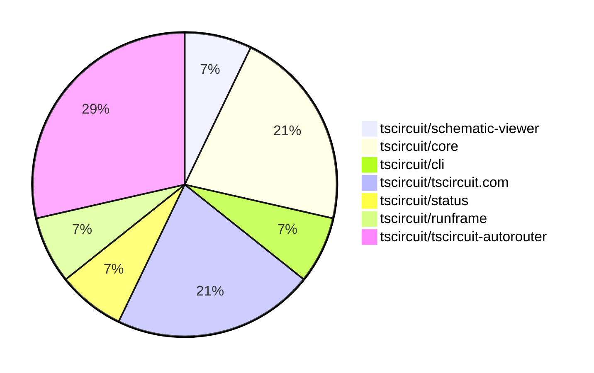

# contribution-tracker

Generates weekly contribution overviews for tscircuit contributors. Check out all
the [contribution overviews here](./contribution-overviews/)

* All PRs in the tscircuit org are scanned/summarized via Claude Haiku
* Claude classifies each Diff/PR as a Major, Minor or Tiny contribution
* All the PRs, summaries, and classifications are organized into charts and tables

The current week is shown below. There are 3 major sections:

* [Contributor Overview](#contributor-overview)
* [PRs by Repository](#prs-by-repository)
* [PRs by Contributor](#changes-by-contributor)

## Current Week

<!-- START_CURRENT_WEEK -->

# Contribution Overview 2025-04-30

## PRs by Repository

## Contributor Overview

| Contributor | 🐳 Major | 🐙 Minor | 🐌 Tiny | ⭐ | Issues Created | Discussion Contributions |
|-------------|---------|---------|---------|-----|----------------|--------------------------|
| [seveibar](#seveibar) | 3 | 0 | 0 | ⭐⭐ | 10 | 0🔹 0🔶 0💎 |
| [imrishabh18](#imrishabh18) | 0 | 4 | 0 | ⭐⭐ | 1 | 0🔹 0🔶 0💎 |
| [ShiboSoftwareDev](#ShiboSoftwareDev) | 0 | 3 | 0 | ⭐⭐ | 3 | 0🔹 0🔶 0💎 |
| [mohan-bee](#mohan-bee) | 0 | 2 | 0 | ⭐ | 3 | 0🔹 0🔶 0💎 |
| [ricohageman](#ricohageman) | 1 | 0 | 0 | ⭐ | 0 | 0🔹 0🔶 0💎 |

### Discussion Contribution Legend

- 🔹 Participating: Basic participation with minimal effort
- 🔶 Very Active: Thoughtful participation that adds value
- 💎 Extremely Active: Exceptional participation with high-quality content

## Review Table

[reviews-received-hover]: ## "Number of reviews received for PRs for this contributor"
[approvals-received-hover]: ## "Number of approvals received for PRs this contributor authored"
[rejections-received-hover]: ## "Number of rejections received for PRs this contributor authored"
[prs-opened-hover]: ## "Number of PRs opened by this contributor"
[issues-created-hover]: ## "Number of issues created by this contributor"
[bountied-issues-hover]: ## "Number of issues this contributor created with a bounty"
[bountied-issue-$-hover]: ## "Total bounty amount placed on issues authored by this contributor"

| Contributor | Reviews Received | Approvals Received | Rejections Received | Approvals | Rejections | PRs Opened | PRs Merged | Issues Created | Bountied Issues | Bountied Issue $ |
|---|---|---|---|---|---|---|---|---|---|---|
| [ShiboSoftwareDev](#ShiboSoftwareDev) | 12 | 4 | 0 | 0 | 0 | 9 | 4 | 3 | 2 | 80 |
| [seveibar](#seveibar) | 0 | 0 | 0 | 6 | 0 | 4 | 3 | 10 | 8 | 260 |
| [imrishabh18](#imrishabh18) | 2 | 1 | 0 | 3 | 1 | 4 | 4 | 1 | 1 | 5 |
| [mohan-bee](#mohan-bee) | 6 | 4 | 1 | 0 | 0 | 4 | 2 | 3 | 0 | 0 |
| [dhvll](#dhvll) | 0 | 0 | 0 | 0 | 0 | 1 | 0 | 0 | 0 | 0 |
| [graphite-app[bot]](#graphite-app[bot]) | 0 | 0 | 0 | 0 | 0 | 0 | 0 | 0 | 0 | 0 |
| [tscircuitbot](#tscircuitbot) | 0 | 0 | 0 | 0 | 0 | 6 | 0 | 0 | 0 | 0 |
| [ricohageman](#ricohageman) | 0 | 0 | 0 | 0 | 0 | 1 | 1 | 0 | 0 | 0 |

## Changes by Repository

### [tscircuit/schematic-viewer](https://github.com/tscircuit/schematic-viewer)

| PR # | Impact | Contributor | Description | Milestone Aligned |
|------|--------|-------------|-------------|-------------------|
| [#86](https://github.com/tscircuit/schematic-viewer/pull/86) | 🐙 Minor | ShiboSoftwareDev | Adds transparent background for customization in the SchematicViewer component. | ✅ |

### [tscircuit/core](https://github.com/tscircuit/core)

| PR # | Impact | Contributor | Description | Milestone Aligned |
|------|--------|-------------|-------------|-------------------|
| [#769](https://github.com/tscircuit/core/pull/769) | 🐙 Minor | ShiboSoftwareDev | Introduced a smoke test to verify the generated distribution after building the project. | ✅ |
| [#766](https://github.com/tscircuit/core/pull/766) | 🐙 Minor | ShiboSoftwareDev | Fixed double schematic traces | ✅ |
| [#768](https://github.com/tscircuit/core/pull/768) | 🐙 Minor | imrishabh18 | Revert a previous change that fixed double schematic traces. | ❌ |

### [tscircuit/cli](https://github.com/tscircuit/cli)

| PR # | Impact | Contributor | Description | Milestone Aligned |
|------|--------|-------------|-------------|-------------------|
| [#185](https://github.com/tscircuit/cli/pull/185) | 🟣 | ShiboSoftwareDev | The pull request introduces a new function `addPackage` that handles the installation of a tscircuit component package, including handling different package name formats, ensuring the `.npmrc` file is configured, and using the appropriate package manager. It also adds event handling for `INSTALL_PACKAGE` events, triggering the `handleInstallPackage` function to install the package. | ❌ |

### [tscircuit/tscircuit.com](https://github.com/tscircuit/tscircuit.com)

| PR # | Impact | Contributor | Description | Milestone Aligned |
|------|--------|-------------|-------------|-------------------|
| [#995](https://github.com/tscircuit/tscircuit.com/pull/995) | 🐙 Minor | imrishabh18 | Refactor the build-status component to display the status of each step instead of the overall status. | ✅ |
| [#993](https://github.com/tscircuit/tscircuit.com/pull/993) | 🐙 Minor | imrishabh18 | Adds a new test case to check if the `circuit_json_build_error` field is returned correctly when it exists. | ❌ |
| [#987](https://github.com/tscircuit/tscircuit.com/pull/987) | 🐙 Minor | mohan-bee | Added a tooltip to the fork and star buttons if the user is not logged in. | ✅ |

### [tscircuit/status](https://github.com/tscircuit/status)

| PR # | Impact | Contributor | Description | Milestone Aligned |
|------|--------|-------------|-------------|-------------------|
| [#20](https://github.com/tscircuit/status/pull/20) | 🐙 Minor | imrishabh18 | Add status check for compile.tscircuit.com | ✅ |

### [tscircuit/runframe](https://github.com/tscircuit/runframe)

| PR # | Impact | Contributor | Description | Milestone Aligned |
|------|--------|-------------|-------------|-------------------|
| [#523](https://github.com/tscircuit/runframe/pull/523) | 🐙 Minor | mohan-bee | Use a globally stored tip in PreviewEmptyState to prevent re-renders from changing content | ✅ |

### [tscircuit/tscircuit-autorouter](https://github.com/tscircuit/tscircuit-autorouter)

| PR # | Impact | Contributor | Description | Milestone Aligned |
|------|--------|-------------|-------------|-------------------|
| [#107](https://github.com/tscircuit/tscircuit-autorouter/pull/107) | 🐳 Major | ricohageman | The pull request optimizes the pathing solver by reusing the nodeEdgeMap, reducing the runtime of the keyboard5 use case from 8.39s to 3.72s (-55%). | ✅ |
| [#109](https://github.com/tscircuit/tscircuit-autorouter/pull/109) | 🐳 Major | seveibar | Capacity Pathing split into 2 stages, integrate new HD PolyLine, ledmatrix4 working again, add failing case for new HD Polyline, % time spent per stage. Add stats for pathingOptimizer. Display stats in autorouting debugger. | ✅ |
| [#108](https://github.com/tscircuit/tscircuit-autorouter/pull/108) | 🐳 Major | seveibar | Introduce a new MultiHead Polyline Solver with better/faster initial via possibilities generation. | ✅ |
| [#106](https://github.com/tscircuit/tscircuit-autorouter/pull/106) | 🐳 Major | seveibar | Adds a new component, "ViaPossibilitiesDebugger", that visualizes the via possibilities for a given "NodeWithPortPoints". | ✅ |

## Changes by Contributor

### [ShiboSoftwareDev](https://github.com/ShiboSoftwareDev)

| PR # | Impact | Description | Milestone Aligned |
|------|--------|-------------|-------------------|
| [#86](https://github.com/tscircuit/schematic-viewer/pull/86) | 🐙 Minor | Adds transparent background for customization in the SchematicViewer component. | ✅ |
| [#769](https://github.com/tscircuit/core/pull/769) | 🐙 Minor | Introduced a smoke test to verify the generated distribution after building the project. | ✅ |
| [#766](https://github.com/tscircuit/core/pull/766) | 🐙 Minor | Fixed double schematic traces | ✅ |
| [#185](https://github.com/tscircuit/cli/pull/185) | 🟣 | The pull request introduces a new function `addPackage` that handles the installation of a tscircuit component package, including handling different package name formats, ensuring the `.npmrc` file is configured, and using the appropriate package manager. It also adds event handling for `INSTALL_PACKAGE` events, triggering the `handleInstallPackage` function to install the package. | ❌ |

### [imrishabh18](https://github.com/imrishabh18)

| PR # | Impact | Description | Milestone Aligned |
|------|--------|-------------|-------------------|
| [#768](https://github.com/tscircuit/core/pull/768) | 🐙 Minor | Revert a previous change that fixed double schematic traces. | ❌ |
| [#995](https://github.com/tscircuit/tscircuit.com/pull/995) | 🐙 Minor | Refactor the build-status component to display the status of each step instead of the overall status. | ✅ |
| [#993](https://github.com/tscircuit/tscircuit.com/pull/993) | 🐙 Minor | Adds a new test case to check if the `circuit_json_build_error` field is returned correctly when it exists. | ❌ |
| [#20](https://github.com/tscircuit/status/pull/20) | 🐙 Minor | Add status check for compile.tscircuit.com | ✅ |

### [mohan-bee](https://github.com/mohan-bee)

| PR # | Impact | Description | Milestone Aligned |
|------|--------|-------------|-------------------|
| [#987](https://github.com/tscircuit/tscircuit.com/pull/987) | 🐙 Minor | Added a tooltip to the fork and star buttons if the user is not logged in. | ✅ |
| [#523](https://github.com/tscircuit/runframe/pull/523) | 🐙 Minor | Use a globally stored tip in PreviewEmptyState to prevent re-renders from changing content | ✅ |

### [ricohageman](https://github.com/ricohageman)

| PR # | Impact | Description | Milestone Aligned |
|------|--------|-------------|-------------------|
| [#107](https://github.com/tscircuit/tscircuit-autorouter/pull/107) | 🐳 Major | The pull request optimizes the pathing solver by reusing the nodeEdgeMap, reducing the runtime of the keyboard5 use case from 8.39s to 3.72s (-55%). | ✅ |

### [seveibar](https://github.com/seveibar)

| PR # | Impact | Description | Milestone Aligned |
|------|--------|-------------|-------------------|
| [#109](https://github.com/tscircuit/tscircuit-autorouter/pull/109) | 🐳 Major | Capacity Pathing split into 2 stages, integrate new HD PolyLine, ledmatrix4 working again, add failing case for new HD Polyline, % time spent per stage. Add stats for pathingOptimizer. Display stats in autorouting debugger. | ✅ |
| [#108](https://github.com/tscircuit/tscircuit-autorouter/pull/108) | 🐳 Major | Introduce a new MultiHead Polyline Solver with better/faster initial via possibilities generation. | ✅ |
| [#106](https://github.com/tscircuit/tscircuit-autorouter/pull/106) | 🐳 Major | Adds a new component, "ViaPossibilitiesDebugger", that visualizes the via possibilities for a given "NodeWithPortPoints". | ✅ |

<!-- END_CURRENT_WEEK -->
