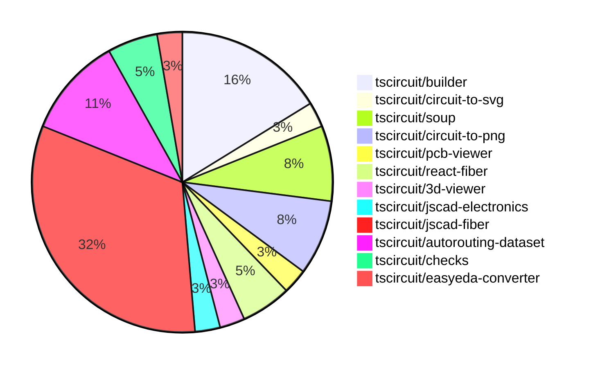

# contribution-tracker

Generates weekly contribution overviews for tscircuit contributors. Check out all
the [contribution overviews here](./contribution-overviews/)

* All PRs in the tscircuit org are scanned/summarized via Claude Haiku
* Claude classifies each Diff/PR as a Major, Minor or Tiny contribution
* All the PRs, summaries, and classifications are organized into charts and tables

The current week is shown below. There are 3 major sections:

* [Contributor Overview](#contributor-overview)
* [PRs by Repository](#prs-by-repository)
* [PRs by Contributor](#changes-by-contributor)

## Current Week

<!-- START_CURRENT_WEEK -->

# Contribution Overview 2024-07-27

## PRs by Repository

## Contributor Overview

| Contributor | 🐳 Major | 🐙 Minor | 🐌 Tiny |
|-------------|-------|-------|-------|
| imrishabh18 | 6 | 4 | 1 |
| seveibar | 9 | 4 | 0 |
| abhijitxy | 2 | 0 | 0 |
| andrii-balitskyi | 1 | 0 | 0 |
| Slaviiiii | 4 | 5 | 0 |
| r-bt | 1 | 0 | 0 |

## Changes by Repository

### [tscircuit/builder](https://github.com/tscircuit/builder)

| PR # | Impact | Contributor | Description |
|------|--------|-------------|-------------|
| [#94](https://github.com/tscircuit/builder/pull/94) | 🐳 Major | imrishabh18 | Add a new `trace_width` option to the `net` builder |
| [#93](https://github.com/tscircuit/builder/pull/93) | 🐳 Major | imrishabh18 | Fix the directory URL generation for the PCB and schematic snapshot output. |
| [#90](https://github.com/tscircuit/builder/pull/90) | 🐳 Major | imrishabh18 | Added PCB snapshot functionality to the test fixture. |
| [#89](https://github.com/tscircuit/builder/pull/89) | 🐳 Major | imrishabh18 | Added a new function `writeSchematicSnapshotPng` to capture and save schematic snapshots as PNG files. |
| [#88](https://github.com/tscircuit/builder/pull/88) | 🐳 Major | imrishabh18 | Add port IDs to the generated PCB trace routes. |
| [#92](https://github.com/tscircuit/builder/pull/92) | 🐙 Minor | imrishabh18 | Add a suffix to the snapshot file name to distinguish between PCB and schematic snapshots. |

### [tscircuit/circuit-to-svg](https://github.com/tscircuit/circuit-to-svg)

| PR # | Impact | Contributor | Description |
|------|--------|-------------|-------------|
| [#11](https://github.com/tscircuit/circuit-to-svg/pull/11) | 🐳 Major | imrishabh18 | Adds transformation matrix functionality and updates the README to provide more details about the library. |

### [tscircuit/soup](https://github.com/tscircuit/soup)

| PR # | Impact | Contributor | Description |
|------|--------|-------------|-------------|
| [#15](https://github.com/tscircuit/soup/pull/15) | 🐳 Major | abhijitxy | Introduce a new `simple_chip` type in the `tscircuit/soup` library. |
| [#17](https://github.com/tscircuit/soup/pull/17) | 🐙 Minor | imrishabh18 | Add a `trace_width` option to `SourceNet` |
| [#16](https://github.com/tscircuit/soup/pull/16) | 🐙 Minor | seveibar | Add a GitHub Actions workflow to format the code using @biomejs/biome |

### [tscircuit/circuit-to-png](https://github.com/tscircuit/circuit-to-png)

| PR # | Impact | Contributor | Description |
|------|--------|-------------|-------------|
| [#11](https://github.com/tscircuit/circuit-to-png/pull/11) | 🐙 Minor | imrishabh18 | The pull request adds `@tscircuit/soup` as a peer dependency to the project. |
| [#10](https://github.com/tscircuit/circuit-to-png/pull/10) | 🐙 Minor | imrishabh18 | Add missing version field in package.json |
| [#9](https://github.com/tscircuit/circuit-to-png/pull/9) | 🐌 Tiny | imrishabh18 | Update the lock file to the latest version |

### [tscircuit/pcb-viewer](https://github.com/tscircuit/pcb-viewer)

| PR # | Impact | Contributor | Description |
|------|--------|-------------|-------------|
| [#31](https://github.com/tscircuit/pcb-viewer/pull/31) | 🐳 Major | seveibar | Introduce a rats nest toggle feature and allow setting the initial state of the PCBViewer component. |

### [tscircuit/react-fiber](https://github.com/tscircuit/react-fiber)

| PR # | Impact | Contributor | Description |
|------|--------|-------------|-------------|
| [#15](https://github.com/tscircuit/react-fiber/pull/15) | 🐳 Major | seveibar | Fixes broken types and build, and adds a new `useChildrenSoup` hook to handle rendering children into circuit JSON (soup). |
| [#14](https://github.com/tscircuit/react-fiber/pull/14) | 🐳 Major | abhijitxy | Translate "chip" into "bug" throughout the codebase. |

### [tscircuit/3d-viewer](https://github.com/tscircuit/3d-viewer)

| PR # | Impact | Contributor | Description |
|------|--------|-------------|-------------|
| [#10](https://github.com/tscircuit/3d-viewer/pull/10) | 🐳 Major | seveibar | Adds the ability to render jscad plans from `cad_component` in the CadViewer component. |

### [tscircuit/jscad-electronics](https://github.com/tscircuit/jscad-electronics)

| PR # | Impact | Contributor | Description |
|------|--------|-------------|-------------|
| [#12](https://github.com/tscircuit/jscad-electronics/pull/12) | 🐳 Major | seveibar | Introduce the `SmdChipLead` component, which represents a curved lead for an SMD chip. |

### [tscircuit/jscad-fiber](https://github.com/tscircuit/jscad-fiber)

| PR # | Impact | Contributor | Description |
|------|--------|-------------|-------------|
| [#52](https://github.com/tscircuit/jscad-fiber/pull/52) | 🐳 Major | seveibar | Introduce a hook for rendering elements to jscad plan |
| [#44](https://github.com/tscircuit/jscad-fiber/pull/44) | 🐳 Major | Slaviiiii | Implement hull and hull chain fixtures |
| [#41](https://github.com/tscircuit/jscad-fiber/pull/41) | 🐳 Major | Slaviiiii | Introduce a new Circle component to the library. |
| [#43](https://github.com/tscircuit/jscad-fiber/pull/43) | 🐳 Major | Slaviiiii | Add a new rectangle shape component to the library. |
| [#39](https://github.com/tscircuit/jscad-fiber/pull/39) | 🐳 Major | Slaviiiii | Change the `rotate` component to accept either `rotation` or `angles` props, with the `angles` prop as the default. |
| [#40](https://github.com/tscircuit/jscad-fiber/pull/40) | 🐳 Major | r-bt | Allow component props to be updated |
| [#51](https://github.com/tscircuit/jscad-fiber/pull/51) | 🐙 Minor | seveibar | Add export for converting JSCAD to Three.js geometry |
| [#56](https://github.com/tscircuit/jscad-fiber/pull/56) | 🐙 Minor | Slaviiiii | Wrap the `ExtrudeHelical` component with `withColorProp` and `withOffsetProp` to add support for `color` and `center` props. |
| [#57](https://github.com/tscircuit/jscad-fiber/pull/57) | 🐙 Minor | Slaviiiii | Wrap `ExtrudeLinear` component with `withColorProp` and `withOffsetProp` higher-order components to add color and offset properties. |
| [#54](https://github.com/tscircuit/jscad-fiber/pull/54) | 🐙 Minor | Slaviiiii | Add positioning to rounded cuboid |
| [#53](https://github.com/tscircuit/jscad-fiber/pull/53) | 🐙 Minor | Slaviiiii | Add color support to the Sphere component |
| [#42](https://github.com/tscircuit/jscad-fiber/pull/42) | 🐙 Minor | Slaviiiii | Updating the add-circle workflow to restore lock files and commit changes |

### [tscircuit/autorouting-dataset](https://github.com/tscircuit/autorouting-dataset)

| PR # | Impact | Contributor | Description |
|------|--------|-------------|-------------|
| [#13](https://github.com/tscircuit/autorouting-dataset/pull/13) | 🐳 Major | seveibar |  |
| [#11](https://github.com/tscircuit/autorouting-dataset/pull/11) | 🐳 Major | seveibar | Add a new "solve" endpoint to the dev server that allows sending a problem soup and receiving a solution soup, and add a test for this endpoint. |
| [#6](https://github.com/tscircuit/autorouting-dataset/pull/6) | 🐳 Major | seveibar | Update the `isValidSolution` function to accept `SimplifiedPcbTrace[]` as a solution type, and modify the `generateDistantSingleTraceProblem` function to generate a problem with a larger board size. |
| [#7](https://github.com/tscircuit/autorouting-dataset/pull/7) | 🐙 Minor | seveibar | Add a simple Python-based autorouting algorithm, a Flask server to run it, and instructions for running a non-Typescript solver. |

### [tscircuit/checks](https://github.com/tscircuit/checks)

| PR # | Impact | Contributor | Description |
|------|--------|-------------|-------------|
| [#12](https://github.com/tscircuit/checks/pull/12) | 🐳 Major | seveibar | Fixes port association failure when the trace width causes the trace to overlap with the pads. |
| [#11](https://github.com/tscircuit/checks/pull/11) | 🐙 Minor | seveibar | This pull request improves error messages to use selectors instead of IDs for better readability. |

### [tscircuit/easyeda-converter](https://github.com/tscircuit/easyeda-converter)

| PR # | Impact | Contributor | Description |
|------|--------|-------------|-------------|
| [#37](https://github.com/tscircuit/easyeda-converter/pull/37) | 🐳 Major | andrii-balitskyi | Normalize manufacturer part numbers by replacing invalid symbols with underscores and prepending "A_" if the part number starts with a number. |

## Changes by Contributor

### [imrishabh18](https://github.com/imrishabh18)

| PR # | Impact | Description |
|------|--------|-------------|
| [#94](https://github.com/tscircuit/builder/pull/94) | 🐳 Major | Add a new `trace_width` option to the `net` builder |
| [#93](https://github.com/tscircuit/builder/pull/93) | 🐳 Major | Fix the directory URL generation for the PCB and schematic snapshot output. |
| [#90](https://github.com/tscircuit/builder/pull/90) | 🐳 Major | Added PCB snapshot functionality to the test fixture. |
| [#89](https://github.com/tscircuit/builder/pull/89) | 🐳 Major | Added a new function `writeSchematicSnapshotPng` to capture and save schematic snapshots as PNG files. |
| [#88](https://github.com/tscircuit/builder/pull/88) | 🐳 Major | Add port IDs to the generated PCB trace routes. |
| [#11](https://github.com/tscircuit/circuit-to-svg/pull/11) | 🐳 Major | Adds transformation matrix functionality and updates the README to provide more details about the library. |
| [#92](https://github.com/tscircuit/builder/pull/92) | 🐙 Minor | Add a suffix to the snapshot file name to distinguish between PCB and schematic snapshots. |
| [#17](https://github.com/tscircuit/soup/pull/17) | 🐙 Minor | Add a `trace_width` option to `SourceNet` |
| [#11](https://github.com/tscircuit/circuit-to-png/pull/11) | 🐙 Minor | The pull request adds `@tscircuit/soup` as a peer dependency to the project. |
| [#10](https://github.com/tscircuit/circuit-to-png/pull/10) | 🐙 Minor | Add missing version field in package.json |
| [#9](https://github.com/tscircuit/circuit-to-png/pull/9) | 🐌 Tiny | Update the lock file to the latest version |

### [seveibar](https://github.com/seveibar)

| PR # | Impact | Description |
|------|--------|-------------|
| [#31](https://github.com/tscircuit/pcb-viewer/pull/31) | 🐳 Major | Introduce a rats nest toggle feature and allow setting the initial state of the PCBViewer component. |
| [#15](https://github.com/tscircuit/react-fiber/pull/15) | 🐳 Major | Fixes broken types and build, and adds a new `useChildrenSoup` hook to handle rendering children into circuit JSON (soup). |
| [#10](https://github.com/tscircuit/3d-viewer/pull/10) | 🐳 Major | Adds the ability to render jscad plans from `cad_component` in the CadViewer component. |
| [#12](https://github.com/tscircuit/jscad-electronics/pull/12) | 🐳 Major | Introduce the `SmdChipLead` component, which represents a curved lead for an SMD chip. |
| [#52](https://github.com/tscircuit/jscad-fiber/pull/52) | 🐳 Major | Introduce a hook for rendering elements to jscad plan |
| [#13](https://github.com/tscircuit/autorouting-dataset/pull/13) | 🐳 Major |  |
| [#11](https://github.com/tscircuit/autorouting-dataset/pull/11) | 🐳 Major | Add a new "solve" endpoint to the dev server that allows sending a problem soup and receiving a solution soup, and add a test for this endpoint. |
| [#6](https://github.com/tscircuit/autorouting-dataset/pull/6) | 🐳 Major | Update the `isValidSolution` function to accept `SimplifiedPcbTrace[]` as a solution type, and modify the `generateDistantSingleTraceProblem` function to generate a problem with a larger board size. |
| [#12](https://github.com/tscircuit/checks/pull/12) | 🐳 Major | Fixes port association failure when the trace width causes the trace to overlap with the pads. |
| [#16](https://github.com/tscircuit/soup/pull/16) | 🐙 Minor | Add a GitHub Actions workflow to format the code using @biomejs/biome |
| [#51](https://github.com/tscircuit/jscad-fiber/pull/51) | 🐙 Minor | Add export for converting JSCAD to Three.js geometry |
| [#7](https://github.com/tscircuit/autorouting-dataset/pull/7) | 🐙 Minor | Add a simple Python-based autorouting algorithm, a Flask server to run it, and instructions for running a non-Typescript solver. |
| [#11](https://github.com/tscircuit/checks/pull/11) | 🐙 Minor | This pull request improves error messages to use selectors instead of IDs for better readability. |

### [abhijitxy](https://github.com/abhijitxy)

| PR # | Impact | Description |
|------|--------|-------------|
| [#14](https://github.com/tscircuit/react-fiber/pull/14) | 🐳 Major | Translate "chip" into "bug" throughout the codebase. |
| [#15](https://github.com/tscircuit/soup/pull/15) | 🐳 Major | Introduce a new `simple_chip` type in the `tscircuit/soup` library. |

### [andrii-balitskyi](https://github.com/andrii-balitskyi)

| PR # | Impact | Description |
|------|--------|-------------|
| [#37](https://github.com/tscircuit/easyeda-converter/pull/37) | 🐳 Major | Normalize manufacturer part numbers by replacing invalid symbols with underscores and prepending "A_" if the part number starts with a number. |

### [Slaviiiii](https://github.com/Slaviiiii)

| PR # | Impact | Description |
|------|--------|-------------|
| [#44](https://github.com/tscircuit/jscad-fiber/pull/44) | 🐳 Major | Implement hull and hull chain fixtures |
| [#41](https://github.com/tscircuit/jscad-fiber/pull/41) | 🐳 Major | Introduce a new Circle component to the library. |
| [#43](https://github.com/tscircuit/jscad-fiber/pull/43) | 🐳 Major | Add a new rectangle shape component to the library. |
| [#39](https://github.com/tscircuit/jscad-fiber/pull/39) | 🐳 Major | Change the `rotate` component to accept either `rotation` or `angles` props, with the `angles` prop as the default. |
| [#56](https://github.com/tscircuit/jscad-fiber/pull/56) | 🐙 Minor | Wrap the `ExtrudeHelical` component with `withColorProp` and `withOffsetProp` to add support for `color` and `center` props. |
| [#57](https://github.com/tscircuit/jscad-fiber/pull/57) | 🐙 Minor | Wrap `ExtrudeLinear` component with `withColorProp` and `withOffsetProp` higher-order components to add color and offset properties. |
| [#54](https://github.com/tscircuit/jscad-fiber/pull/54) | 🐙 Minor | Add positioning to rounded cuboid |
| [#53](https://github.com/tscircuit/jscad-fiber/pull/53) | 🐙 Minor | Add color support to the Sphere component |
| [#42](https://github.com/tscircuit/jscad-fiber/pull/42) | 🐙 Minor | Updating the add-circle workflow to restore lock files and commit changes |

### [r-bt](https://github.com/r-bt)

| PR # | Impact | Description |
|------|--------|-------------|
| [#40](https://github.com/tscircuit/jscad-fiber/pull/40) | 🐳 Major | Allow component props to be updated |

<!-- END_CURRENT_WEEK -->
