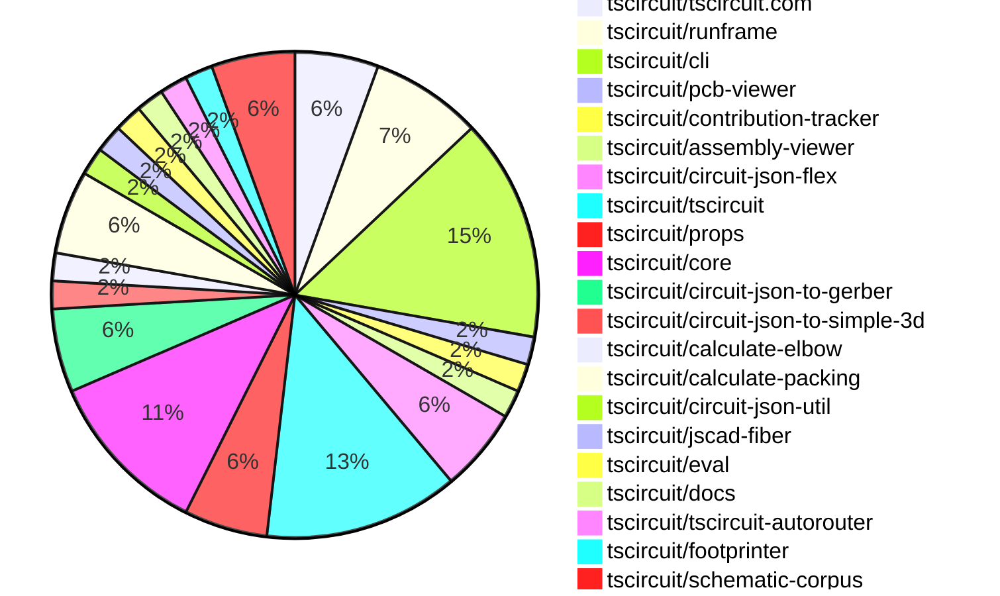
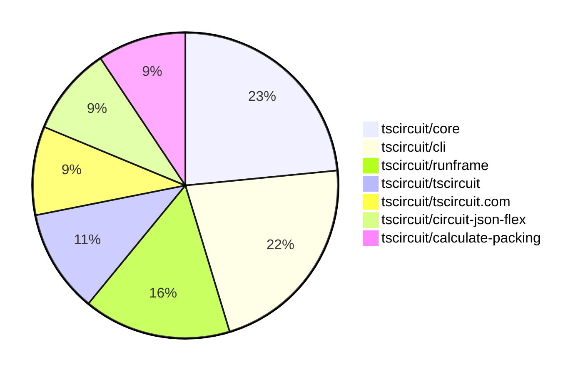

# contribution-tracker

[contributions.tscircuit.com](https://contributions.tscircuit.com) ・ [tscircuit.com](https://tscircuit.com) ・ [Contribution Overviews](./contribution-overviews/) ・ [Changelogs](./changelogs/)

Generates weekly contribution overviews for tscircuit contributors. Check out all
the [contribution overviews here](./contribution-overviews/)
You can find AI-generated monthly changelogs in the [changelogs directory](./changelogs/).

- All PRs in the tscircuit org are scanned/summarized via an LLM
- The LLM classifies each Diff/PR as into a set of attributes for scoring
- All the PRs, summaries, and classifications are organized into charts and tables for [the website](https://contributions.tscircuit.com)

> Want to run locally? See the [Development Section](#development)

The current week is shown below. There are 3 major sections:

- [Contributor Overview](#contributor-overview)
- [PRs by Repository](#prs-by-repository)
- [PRs by Contributor](#changes-by-contributor)

## Current Week

<!-- START_CURRENT_WEEK -->

# Contribution Overview 2025-07-23

## PRs by Repository



## Contributor Overview

| Contributor | 🐳 Major | 🐙 Minor | 🐌 Tiny | ⭐ | Issues Created | Discussion Contributions |
|-------------|---------|---------|---------|-----|----------------|--------------------------|
| [seveibar](#seveibar) | 6 | 0 | 15 | 👑 | 0 | 0🔹 0🔶 0💎 |
| [ArnavK-09](#ArnavK-09) | 4 | 0 | 7 | ⭐⭐ | 0 | 0🔹 0🔶 0💎 |
| [imrishabh18](#imrishabh18) | 1 | 0 | 13 | ⭐⭐ | 0 | 0🔹 0🔶 0💎 |
| [Abse2001](#Abse2001) | 0 | 0 | 3 | ⭐ | 0 | 0🔹 0🔶 0💎 |
| [abimaelmartell](#abimaelmartell) | 1 | 0 | 0 | ⭐ | 0 | 0🔹 0🔶 0💎 |
| [MustafaMulla29](#MustafaMulla29) | 0 | 0 | 3 |  | 0 | 0🔹 0🔶 0💎 |
| [techmannih](#techmannih) | 0 | 0 | 1 |  | 0 | 0🔹 0🔶 0💎 |

### Discussion Contribution Legend

- 🔹 Normal Comments: Basic participation with minimal effort
- 🔶 Great Informative Comments: Thoughtful participation that adds value
- 💎 Incredible Comments: Exceptional participation with high-quality content

## Review Table

[reviews-received-hover]: ## "Number of reviews received for PRs for this contributor"
[approvals-received-hover]: ## "Number of approvals received for PRs this contributor authored"
[rejections-received-hover]: ## "Number of rejections received for PRs this contributor authored"
[prs-opened-hover]: ## "Number of PRs opened by this contributor"
[issues-created-hover]: ## "Number of issues created by this contributor"
[bountied-issues-hover]: ## "Number of issues this contributor created with a bounty"
[bountied-issue-$-hover]: ## "Total bounty amount placed on issues authored by this contributor"

| Contributor | Reviews Received | Approvals Received | Rejections Received | Approvals | Rejections | PRs Opened | PRs Merged | Score | Issues Created | Bountied Issues | Bountied Issue $ |
|---|---|---|---|---|---|---|---|---|---|---|---|
| [ArnavK-09](#ArnavK-09) | 13 | 11 | 0 | 0 | 0 | 12 | 12 | 22 | 0 | 0 | 0 |
| [seveibar](#seveibar) | 9 | 0 | 0 | 24 | 1 | 25 | 21 | 51 | 0 | 0 | 0 |
| [imrishabh18](#imrishabh18) | 12 | 6 | 1 | 0 | 0 | 17 | 14 | 14.5 | 0 | 0 | 0 |
| [cursor[bot]](#cursor[bot]) | 0 | 0 | 0 | 0 | 0 | 0 | 0 | 0 | 0 | 0 | 0 |
| [Abse2001](#Abse2001) | 4 | 4 | 0 | 3 | 0 | 4 | 3 | 5.5 | 0 | 0 | 0 |
| [techmannih](#techmannih) | 4 | 2 | 0 | 0 | 0 | 1 | 1 | 1 | 0 | 0 | 0 |
| [graphite-app[bot]](#graphite-app[bot]) | 0 | 0 | 0 | 0 | 0 | 0 | 0 | 0 | 0 | 0 | 0 |
| [ShiboSoftwareDev](#ShiboSoftwareDev) | 0 | 0 | 0 | 1 | 0 | 0 | 0 | 0 | 0 | 0 | 0 |
| [abimaelmartell](#abimaelmartell) | 1 | 1 | 0 | 0 | 0 | 2 | 1 | 4 | 0 | 0 | 0 |
| [andrii-balitskyi](#andrii-balitskyi) | 2 | 0 | 0 | 0 | 0 | 1 | 0 | 0 | 0 | 0 | 0 |
| [tscircuitbot](#tscircuitbot) | 0 | 0 | 0 | 0 | 0 | 12 | 0 | 0 | 0 | 0 | 0 |
| [MustafaMulla29](#MustafaMulla29) | 4 | 4 | 0 | 0 | 0 | 3 | 3 | 3 | 0 | 0 | 0 |

## Top 7 Repositories by Contribution Points



## Changes by Repository

### [tscircuit/tscircuit.com](https://github.com/tscircuit/tscircuit.com)

| PR # | Impact | Rating | Contributor | Description |
|------|--------|--------|-------------|-------------|
| [#1501](https://github.com/tscircuit/tscircuit.com/pull/1501) | 🐳 Major | ⭐⭐⭐ | ArnavK-09 | Adds functionality to rename files within the file sidebar, preserving folder structure and validating new filenames. |

<details>
<summary>🐌 Tiny Contributions (2)</summary>

| PR # | Impact | Contributor | Description |
|------|--------|-------------|-------------|
| [#1503](https://github.com/tscircuit/tscircuit.com/pull/1503) | 🐌 Tiny | imrishabh18 | Add the packages marked and react-error-boundary (required by runframe) |
| [#1502](https://github.com/tscircuit/tscircuit.com/pull/1502) | 🐌 Tiny | Abse2001 | Moves dotenv configuration from the entry point to vite.config for better environment variable management. |

</details>

### [tscircuit/runframe](https://github.com/tscircuit/runframe)

| PR # | Impact | Rating | Contributor | Description |
|------|--------|--------|-------------|-------------|
| [#914](https://github.com/tscircuit/runframe/pull/914) | 🐳 Major | ⭐⭐⭐ | ArnavK-09 | Adds utilities for converting Uint8Array to base64 and for encoding file maps, enabling the sharing of multiple files in error reports. |
| [#898](https://github.com/tscircuit/runframe/pull/898) | 🐳 Major | ⭐⭐⭐ | ArnavK-09 | img width1847 height988 altimage srchttps:github.comuser-attachmentsassetse09727d3-52dc-413d-a701-0d41b629438a  https:github.comuser-attachmentsassets7139446f-7066-4594-8b9c-f40db8ac0acd |

<details>
<summary>🐌 Tiny Contributions (2)</summary>

| PR # | Impact | Contributor | Description |
|------|--------|-------------|-------------|
| [#908](https://github.com/tscircuit/runframe/pull/908) | 🐌 Tiny | ArnavK-09 | Fixes placeholder text in FileSelectorCombobox and refactors state variable names for clarity in file selection logic. |
| [#915](https://github.com/tscircuit/runframe/pull/915) | 🐌 Tiny | imrishabh18 | Adds utilities for encoding file maps and enhances issue reporting links in the RunFrame preview components. |

</details>

### [tscircuit/cli](https://github.com/tscircuit/cli)

| PR # | Impact | Rating | Contributor | Description |
|------|--------|--------|-------------|-------------|
| [#294](https://github.com/tscircuit/cli/pull/294) | 🐳 Major | ⭐⭐⭐ | ArnavK-09 | Add recursive search for entrypoints in child directories with depth limit, improve validation for project directory and file paths, add constants for allowed entrypoint names and search limits, better error handling and validation messages, remove unused saveProjectConfig import, support listing all files in root dir where cmd ran |
| [#298](https://github.com/tscircuit/cli/pull/298) | 🐳 Major | ⭐⭐⭐ | seveibar | Extends the tsci search command to query the JLC search API and display star counts for registry results, while removing the interactive selection part of the search command. |

<details>
<summary>🐌 Tiny Contributions (6)</summary>

| PR # | Impact | Contributor | Description |
|------|--------|-------------|-------------|
| [#293](https://github.com/tscircuit/cli/pull/293) | 🐌 Tiny | ArnavK-09 | Updates the tscircuitrunframe dependency to version 0.0.722 to resolve development command issues. |
| [#292](https://github.com/tscircuit/cli/pull/292) | 🐌 Tiny | ArnavK-09 | Replaces hardcoded entrypoint path with dynamic retrieval using getEntrypoint function in the development command. |
| [#291](https://github.com/tscircuit/cli/pull/291) | 🐌 Tiny | ArnavK-09 | Updates the version of the runframe and other dependencies in the project. |
| [#297](https://github.com/tscircuit/cli/pull/297) | 🐌 Tiny | seveibar | Fixes the production outage by importing tscircuit dependencies from userland during the build process, ensuring that the correct version is utilized and preventing build failures. |
| [#296](https://github.com/tscircuit/cli/pull/296) | 🐌 Tiny | seveibar | Add explicit script for bun build to reduce bundling issue and dont bundle typescript |
| [#295](https://github.com/tscircuit/cli/pull/295) | 🐌 Tiny | Abse2001 | Makes the tscircuit dependency optional to resolve version mismatch issues in the project. |

</details>

### [tscircuit/pcb-viewer](https://github.com/tscircuit/pcb-viewer)


<details>
<summary>🐌 Tiny Contributions (1)</summary>

| PR # | Impact | Contributor | Description |
|------|--------|-------------|-------------|
| [#348](https://github.com/tscircuit/pcb-viewer/pull/348) | 🐌 Tiny | ArnavK-09 | Adds react, react-dom, react-reconciler, and react-reconciler-18 as external dependencies in the build configuration. |

</details>

### [tscircuit/contribution-tracker](https://github.com/tscircuit/contribution-tracker)


<details>
<summary>🐌 Tiny Contributions (1)</summary>

| PR # | Impact | Contributor | Description |
|------|--------|-------------|-------------|
| [#205](https://github.com/tscircuit/contribution-tracker/pull/205) | 🐌 Tiny | ArnavK-09 | Clarify that PR assessment descriptions should use plain text only without any hyperlinks or image links to maintain consistency in output format. |

</details>

### [tscircuit/assembly-viewer](https://github.com/tscircuit/assembly-viewer)


<details>
<summary>🐌 Tiny Contributions (1)</summary>

| PR # | Impact | Contributor | Description |
|------|--------|-------------|-------------|
| [#6](https://github.com/tscircuit/assembly-viewer/pull/6) | 🐌 Tiny | ArnavK-09 | Changes the background color of the AssemblyViewer component from F5F1ED to FFFFFF |

</details>

### [tscircuit/circuit-json-flex](https://github.com/tscircuit/circuit-json-flex)

| PR # | Impact | Rating | Contributor | Description |
|------|--------|--------|-------------|-------------|
| [#2](https://github.com/tscircuit/circuit-json-flex/pull/2) | 🐳 Major | ⭐⭐⭐ | imrishabh18 | Introduces a layout function that arranges PCB components using a flex-box algorithm, allowing for dynamic positioning within a specified container. |

<details>
<summary>🐌 Tiny Contributions (2)</summary>

| PR # | Impact | Contributor | Description |
|------|--------|-------------|-------------|
| [#4](https://github.com/tscircuit/circuit-json-flex/pull/4) | 🐌 Tiny | imrishabh18 | Adds a build script in npm for releasing the project using tsup-node. |
| [#3](https://github.com/tscircuit/circuit-json-flex/pull/3) | 🐌 Tiny | imrishabh18 | Adds support for subcircuit groups in the layout of circuit JSON, allowing for better organization and rendering of PCB components within groups. |

</details>

### [tscircuit/tscircuit](https://github.com/tscircuit/tscircuit)


<details>
<summary>🐌 Tiny Contributions (7)</summary>

| PR # | Impact | Contributor | Description |
|------|--------|-------------|-------------|
| [#718](https://github.com/tscircuit/tscircuit/pull/718) | 🐌 Tiny | imrishabh18 | Updates the versions of core and props dependencies in package.json |
| [#714](https://github.com/tscircuit/tscircuit/pull/714) | 🐌 Tiny | imrishabh18 | Updates the tscircuitcore dependency version from 0.0.574 to 0.0.576 in package.json |
| [#721](https://github.com/tscircuit/tscircuit/pull/721) | 🐌 Tiny | seveibar | Updates the CLI dependency to version 0.1.187 to resolve an outage caused by a userland import issue. |
| [#720](https://github.com/tscircuit/tscircuit/pull/720) | 🐌 Tiny | seveibar | Fixes libonly package generation and adds jscad-fiber and jscad-planner dependencies to the project. |
| [#719](https://github.com/tscircuit/tscircuit/pull/719) | 🐌 Tiny | seveibar | Adds a new workflow to publish a libonly version of the package, creating a separate package.json for it. |
| [#717](https://github.com/tscircuit/tscircuit/pull/717) | 🐌 Tiny | seveibar | Locks the project to a single version of react-reconciler and updates related packages in package.json |
| [#715](https://github.com/tscircuit/tscircuit/pull/715) | 🐌 Tiny | Abse2001 | Updates the tscircuitcli dependency version from 0.1.179 to 0.1.185 in package.json and adds yalc. and .yalc to .gitignore. |

</details>

### [tscircuit/props](https://github.com/tscircuit/props)


<details>
<summary>🐌 Tiny Contributions (3)</summary>

| PR # | Impact | Contributor | Description |
|------|--------|-------------|-------------|
| [#333](https://github.com/tscircuit/props/pull/333) | 🐌 Tiny | imrishabh18 | Adds new justifyContent values (space-between, space-around, space-evenly) to the layout configuration for improved layout options. |
| [#332](https://github.com/tscircuit/props/pull/332) | 🐌 Tiny | seveibar | Adds new layout properties for packing strategy in layout configuration. |
| [#331](https://github.com/tscircuit/props/pull/331) | 🐌 Tiny | seveibar | Summary add area options and square sizing to subcircuitGroupProps move board dimension properties into subcircuitGroupProps simplify BoardProps and update generated docs  Testing bun test testsboard.test.ts bun test testsstampboard.test.ts bun test tests |

</details>

### [tscircuit/core](https://github.com/tscircuit/core)

| PR # | Impact | Rating | Contributor | Description |
|------|--------|--------|-------------|-------------|
| [#1094](https://github.com/tscircuit/core/pull/1094) | 🐳 Major | ⭐⭐⭐ | seveibar | Enhances the error message for unsupported components by providing a link to documentation and hints for users. |
| [#1087](https://github.com/tscircuit/core/pull/1087) | 🐳 Major | ⭐⭐⭐ | seveibar | Adds PCB packing functionality by implementing calculate-packing and updating properties for layout implementation. |
| [#1092](https://github.com/tscircuit/core/pull/1092) | 🐳 Major | ⭐⭐⭐ | abimaelmartell | Fixes incorrect junction placement on schematic traces due to floating-point precision issues in intersection detection logic. |

<details>
<summary>🐌 Tiny Contributions (3)</summary>

| PR # | Impact | Contributor | Description |
|------|--------|-------------|-------------|
| [#1091](https://github.com/tscircuit/core/pull/1091) | 🐌 Tiny | imrishabh18 | Adds support for flex layout within the board component, allowing for dynamic arrangement of child components based on specified justifyContent properties. |
| [#1088](https://github.com/tscircuit/core/pull/1088) | 🐌 Tiny | imrishabh18 | Adds support for a new PCB layout mode called flex in the Group component, allowing for flexible layout configurations. |
| [#1085](https://github.com/tscircuit/core/pull/1085) | 🐌 Tiny | imrishabh18 | Allows the width and height of the pcb_group to be specified as props, enabling more flexible layout configurations. |

</details>

### [tscircuit/circuit-json-to-gerber](https://github.com/tscircuit/circuit-json-to-gerber)


<details>
<summary>🐌 Tiny Contributions (3)</summary>

| PR # | Impact | Contributor | Description |
|------|--------|-------------|-------------|
| [#50](https://github.com/tscircuit/circuit-json-to-gerber/pull/50) | 🐌 Tiny | imrishabh18 | Moves circuit-json from dependencies to devDependencies in package.json |
| [#47](https://github.com/tscircuit/circuit-json-to-gerber/pull/47) | 🐌 Tiny | imrishabh18 | Adds a Renovate configuration file to automate dependency updates and manage package versions. |
| [#46](https://github.com/tscircuit/circuit-json-to-gerber/pull/46) | 🐌 Tiny | imrishabh18 | Updates the version of the circuit-json dependency from a wildcard to a specific version (0.0.220) in package.json |

</details>

### [tscircuit/circuit-json-to-simple-3d](https://github.com/tscircuit/circuit-json-to-simple-3d)

| PR # | Impact | Rating | Contributor | Description |
|------|--------|--------|-------------|-------------|
| [#7](https://github.com/tscircuit/circuit-json-to-simple-3d/pull/7) | 🐳 Major | ⭐⭐⭐ | seveibar | Integrates 3D model support into the rendering process for circuit designs, allowing for the inclusion of CAD models in the 3D SVG output. |

### [tscircuit/calculate-elbow](https://github.com/tscircuit/calculate-elbow)

| PR # | Impact | Rating | Contributor | Description |
|------|--------|--------|-------------|-------------|
| [#4](https://github.com/tscircuit/calculate-elbow/pull/4) | 🐳 Major | ⭐⭐⭐ | seveibar | Fixes elbow calculation for x- to y cases when the start point is right and above the destination by overshooting, and adds a test for this scenario. |

### [tscircuit/calculate-packing](https://github.com/tscircuit/calculate-packing)

| PR # | Impact | Rating | Contributor | Description |
|------|--------|--------|-------------|-------------|
| [#3](https://github.com/tscircuit/calculate-packing/pull/3) | 🐳 Major | ⭐⭐⭐ | seveibar | Fixes the issue where candidate components are not being invalidated based on the minGap distance during rotation calculations. |

<details>
<summary>🐌 Tiny Contributions (2)</summary>

| PR # | Impact | Contributor | Description |
|------|--------|-------------|-------------|
| [#4](https://github.com/tscircuit/calculate-packing/pull/4) | 🐌 Tiny | seveibar | Adds support for specifying available rotation degrees for components, allowing for more flexible placement during packing. |
| [#2](https://github.com/tscircuit/calculate-packing/pull/2) | 🐌 Tiny | seveibar | No description provided |

</details>

### [tscircuit/circuit-json-util](https://github.com/tscircuit/circuit-json-util)


<details>
<summary>🐌 Tiny Contributions (1)</summary>

| PR # | Impact | Contributor | Description |
|------|--------|-------------|-------------|
| [#40](https://github.com/tscircuit/circuit-json-util/pull/40) | 🐌 Tiny | seveibar | Adds a utility function to reposition PCB components and their children within the circuit JSON structure. |

</details>

### [tscircuit/jscad-fiber](https://github.com/tscircuit/jscad-fiber)


<details>
<summary>🐌 Tiny Contributions (1)</summary>

| PR # | Impact | Contributor | Description |
|------|--------|-------------|-------------|
| [#111](https://github.com/tscircuit/jscad-fiber/pull/111) | 🐌 Tiny | seveibar | Adds optional peer dependencies for three libraries, allowing for more flexible usage without enforcing their installation. |

</details>

### [tscircuit/eval](https://github.com/tscircuit/eval)


<details>
<summary>🐌 Tiny Contributions (1)</summary>

| PR # | Impact | Contributor | Description |
|------|--------|-------------|-------------|
| [#726](https://github.com/tscircuit/eval/pull/726) | 🐌 Tiny | seveibar | Updates the jscad-fiber dependency to version 0.0.82, adding more optional dependencies for enhanced functionality. |

</details>

### [tscircuit/docs](https://github.com/tscircuit/docs)


<details>
<summary>🐌 Tiny Contributions (1)</summary>

| PR # | Impact | Contributor | Description |
|------|--------|-------------|-------------|
| [#104](https://github.com/tscircuit/docs/pull/104) | 🐌 Tiny | seveibar | Documents the jlcsearch.tscircuit.com API in the Web APIs section. |

</details>

### [tscircuit/tscircuit-autorouter](https://github.com/tscircuit/tscircuit-autorouter)


<details>
<summary>🐌 Tiny Contributions (1)</summary>

| PR # | Impact | Contributor | Description |
|------|--------|-------------|-------------|
| [#217](https://github.com/tscircuit/tscircuit-autorouter/pull/217) | 🐌 Tiny | seveibar | Moves the convertSrjToGraphicsObject function into lib utilities, exports it from the package index, and updates imports in solver and tests. |

</details>

### [tscircuit/footprinter](https://github.com/tscircuit/footprinter)


<details>
<summary>🐌 Tiny Contributions (1)</summary>

| PR # | Impact | Contributor | Description |
|------|--------|-------------|-------------|
| [#322](https://github.com/tscircuit/footprinter/pull/322) | 🐌 Tiny | techmannih | Introduces a new footprint variant for the JST-SH connector, allowing for better integration of this component in PCB designs. |

</details>

### [tscircuit/schematic-corpus](https://github.com/tscircuit/schematic-corpus)


<details>
<summary>🐌 Tiny Contributions (3)</summary>

| PR # | Impact | Contributor | Description |
|------|--------|-------------|-------------|
| [#107](https://github.com/tscircuit/schematic-corpus/pull/107) | 🐌 Tiny | MustafaMulla29 | Adds a new circuit design (design69) to enhance the matchAdapt algorithm functionality. |
| [#106](https://github.com/tscircuit/schematic-corpus/pull/106) | 🐌 Tiny | MustafaMulla29 | Adds a new circuit design (design68) to enhance the matchAdapt algorithm functionality. |
| [#108](https://github.com/tscircuit/schematic-corpus/pull/108) | 🐌 Tiny | MustafaMulla29 | Adds a new design (design70) to enhance the matchAdapt algorithm functionality. |

</details>

## Changes by Contributor

### [ArnavK-09](https://github.com/ArnavK-09)

| PRs # | Impact | Rating | Description |
|------|--------|--------|-------------|
| [#1501](https://github.com/tscircuit/tscircuit.com/pull/1501) | 🐳 Major | ⭐⭐⭐ | Adds functionality to rename files within the file sidebar, preserving folder structure and validating new filenames. |
| [#914](https://github.com/tscircuit/runframe/pull/914) | 🐳 Major | ⭐⭐⭐ | Adds utilities for converting Uint8Array to base64 and for encoding file maps, enabling the sharing of multiple files in error reports. |
| [#898](https://github.com/tscircuit/runframe/pull/898) | 🐳 Major | ⭐⭐⭐ | img width1847 height988 altimage srchttps:github.comuser-attachmentsassetse09727d3-52dc-413d-a701-0d41b629438a  https:github.comuser-attachmentsassets7139446f-7066-4594-8b9c-f40db8ac0acd |
| [#294](https://github.com/tscircuit/cli/pull/294) | 🐳 Major | ⭐⭐⭐ | Add recursive search for entrypoints in child directories with depth limit, improve validation for project directory and file paths, add constants for allowed entrypoint names and search limits, better error handling and validation messages, remove unused saveProjectConfig import, support listing all files in root dir where cmd ran |

<details>
<summary>🐌 Tiny Contributions (7)</summary>

| PR # | Impact | Description |
|------|--------|-------------|
| [#348](https://github.com/tscircuit/pcb-viewer/pull/348) | 🐌 Tiny | Adds react, react-dom, react-reconciler, and react-reconciler-18 as external dependencies in the build configuration. |
| [#205](https://github.com/tscircuit/contribution-tracker/pull/205) | 🐌 Tiny | Clarify that PR assessment descriptions should use plain text only without any hyperlinks or image links to maintain consistency in output format. |
| [#908](https://github.com/tscircuit/runframe/pull/908) | 🐌 Tiny | Fixes placeholder text in FileSelectorCombobox and refactors state variable names for clarity in file selection logic. |
| [#293](https://github.com/tscircuit/cli/pull/293) | 🐌 Tiny | Updates the tscircuitrunframe dependency to version 0.0.722 to resolve development command issues. |
| [#292](https://github.com/tscircuit/cli/pull/292) | 🐌 Tiny | Replaces hardcoded entrypoint path with dynamic retrieval using getEntrypoint function in the development command. |
| [#291](https://github.com/tscircuit/cli/pull/291) | 🐌 Tiny | Updates the version of the runframe and other dependencies in the project. |
| [#6](https://github.com/tscircuit/assembly-viewer/pull/6) | 🐌 Tiny | Changes the background color of the AssemblyViewer component from F5F1ED to FFFFFF |

</details>

### [imrishabh18](https://github.com/imrishabh18)

| PRs # | Impact | Rating | Description |
|------|--------|--------|-------------|
| [#2](https://github.com/tscircuit/circuit-json-flex/pull/2) | 🐳 Major | ⭐⭐⭐ | Introduces a layout function that arranges PCB components using a flex-box algorithm, allowing for dynamic positioning within a specified container. |

<details>
<summary>🐌 Tiny Contributions (13)</summary>

| PR # | Impact | Description |
|------|--------|-------------|
| [#718](https://github.com/tscircuit/tscircuit/pull/718) | 🐌 Tiny | Updates the versions of core and props dependencies in package.json |
| [#714](https://github.com/tscircuit/tscircuit/pull/714) | 🐌 Tiny | Updates the tscircuitcore dependency version from 0.0.574 to 0.0.576 in package.json |
| [#333](https://github.com/tscircuit/props/pull/333) | 🐌 Tiny | Adds new justifyContent values (space-between, space-around, space-evenly) to the layout configuration for improved layout options. |
| [#1091](https://github.com/tscircuit/core/pull/1091) | 🐌 Tiny | Adds support for flex layout within the board component, allowing for dynamic arrangement of child components based on specified justifyContent properties. |
| [#1088](https://github.com/tscircuit/core/pull/1088) | 🐌 Tiny | Adds support for a new PCB layout mode called flex in the Group component, allowing for flexible layout configurations. |
| [#1085](https://github.com/tscircuit/core/pull/1085) | 🐌 Tiny | Allows the width and height of the pcb_group to be specified as props, enabling more flexible layout configurations. |
| [#50](https://github.com/tscircuit/circuit-json-to-gerber/pull/50) | 🐌 Tiny | Moves circuit-json from dependencies to devDependencies in package.json |
| [#47](https://github.com/tscircuit/circuit-json-to-gerber/pull/47) | 🐌 Tiny | Adds a Renovate configuration file to automate dependency updates and manage package versions. |
| [#46](https://github.com/tscircuit/circuit-json-to-gerber/pull/46) | 🐌 Tiny | Updates the version of the circuit-json dependency from a wildcard to a specific version (0.0.220) in package.json |
| [#1503](https://github.com/tscircuit/tscircuit.com/pull/1503) | 🐌 Tiny | Add the packages marked and react-error-boundary (required by runframe) |
| [#915](https://github.com/tscircuit/runframe/pull/915) | 🐌 Tiny | Adds utilities for encoding file maps and enhances issue reporting links in the RunFrame preview components. |
| [#4](https://github.com/tscircuit/circuit-json-flex/pull/4) | 🐌 Tiny | Adds a build script in npm for releasing the project using tsup-node. |
| [#3](https://github.com/tscircuit/circuit-json-flex/pull/3) | 🐌 Tiny | Adds support for subcircuit groups in the layout of circuit JSON, allowing for better organization and rendering of PCB components within groups. |

</details>

### [seveibar](https://github.com/seveibar)

| PRs # | Impact | Rating | Description |
|------|--------|--------|-------------|
| [#1094](https://github.com/tscircuit/core/pull/1094) | 🐳 Major | ⭐⭐⭐ | Enhances the error message for unsupported components by providing a link to documentation and hints for users. |
| [#1087](https://github.com/tscircuit/core/pull/1087) | 🐳 Major | ⭐⭐⭐ | Adds PCB packing functionality by implementing calculate-packing and updating properties for layout implementation. |
| [#298](https://github.com/tscircuit/cli/pull/298) | 🐳 Major | ⭐⭐⭐ | Extends the tsci search command to query the JLC search API and display star counts for registry results, while removing the interactive selection part of the search command. |
| [#7](https://github.com/tscircuit/circuit-json-to-simple-3d/pull/7) | 🐳 Major | ⭐⭐⭐ | Integrates 3D model support into the rendering process for circuit designs, allowing for the inclusion of CAD models in the 3D SVG output. |
| [#4](https://github.com/tscircuit/calculate-elbow/pull/4) | 🐳 Major | ⭐⭐⭐ | Fixes elbow calculation for x- to y cases when the start point is right and above the destination by overshooting, and adds a test for this scenario. |
| [#3](https://github.com/tscircuit/calculate-packing/pull/3) | 🐳 Major | ⭐⭐⭐ | Fixes the issue where candidate components are not being invalidated based on the minGap distance during rotation calculations. |

<details>
<summary>🐌 Tiny Contributions (15)</summary>

| PR # | Impact | Description |
|------|--------|-------------|
| [#721](https://github.com/tscircuit/tscircuit/pull/721) | 🐌 Tiny | Updates the CLI dependency to version 0.1.187 to resolve an outage caused by a userland import issue. |
| [#720](https://github.com/tscircuit/tscircuit/pull/720) | 🐌 Tiny | Fixes libonly package generation and adds jscad-fiber and jscad-planner dependencies to the project. |
| [#719](https://github.com/tscircuit/tscircuit/pull/719) | 🐌 Tiny | Adds a new workflow to publish a libonly version of the package, creating a separate package.json for it. |
| [#717](https://github.com/tscircuit/tscircuit/pull/717) | 🐌 Tiny | Locks the project to a single version of react-reconciler and updates related packages in package.json |
| [#40](https://github.com/tscircuit/circuit-json-util/pull/40) | 🐌 Tiny | Adds a utility function to reposition PCB components and their children within the circuit JSON structure. |
| [#332](https://github.com/tscircuit/props/pull/332) | 🐌 Tiny | Adds new layout properties for packing strategy in layout configuration. |
| [#331](https://github.com/tscircuit/props/pull/331) | 🐌 Tiny | Summary add area options and square sizing to subcircuitGroupProps move board dimension properties into subcircuitGroupProps simplify BoardProps and update generated docs  Testing bun test testsboard.test.ts bun test testsstampboard.test.ts bun test tests |
| [#111](https://github.com/tscircuit/jscad-fiber/pull/111) | 🐌 Tiny | Adds optional peer dependencies for three libraries, allowing for more flexible usage without enforcing their installation. |
| [#726](https://github.com/tscircuit/eval/pull/726) | 🐌 Tiny | Updates the jscad-fiber dependency to version 0.0.82, adding more optional dependencies for enhanced functionality. |
| [#297](https://github.com/tscircuit/cli/pull/297) | 🐌 Tiny | Fixes the production outage by importing tscircuit dependencies from userland during the build process, ensuring that the correct version is utilized and preventing build failures. |
| [#296](https://github.com/tscircuit/cli/pull/296) | 🐌 Tiny | Add explicit script for bun build to reduce bundling issue and dont bundle typescript |
| [#104](https://github.com/tscircuit/docs/pull/104) | 🐌 Tiny | Documents the jlcsearch.tscircuit.com API in the Web APIs section. |
| [#217](https://github.com/tscircuit/tscircuit-autorouter/pull/217) | 🐌 Tiny | Moves the convertSrjToGraphicsObject function into lib utilities, exports it from the package index, and updates imports in solver and tests. |
| [#4](https://github.com/tscircuit/calculate-packing/pull/4) | 🐌 Tiny | Adds support for specifying available rotation degrees for components, allowing for more flexible placement during packing. |
| [#2](https://github.com/tscircuit/calculate-packing/pull/2) | 🐌 Tiny | No description provided |

</details>

### [Abse2001](https://github.com/Abse2001)


<details>
<summary>🐌 Tiny Contributions (3)</summary>

| PR # | Impact | Description |
|------|--------|-------------|
| [#715](https://github.com/tscircuit/tscircuit/pull/715) | 🐌 Tiny | Updates the tscircuitcli dependency version from 0.1.179 to 0.1.185 in package.json and adds yalc. and .yalc to .gitignore. |
| [#1502](https://github.com/tscircuit/tscircuit.com/pull/1502) | 🐌 Tiny | Moves dotenv configuration from the entry point to vite.config for better environment variable management. |
| [#295](https://github.com/tscircuit/cli/pull/295) | 🐌 Tiny | Makes the tscircuit dependency optional to resolve version mismatch issues in the project. |

</details>

### [techmannih](https://github.com/techmannih)


<details>
<summary>🐌 Tiny Contributions (1)</summary>

| PR # | Impact | Description |
|------|--------|-------------|
| [#322](https://github.com/tscircuit/footprinter/pull/322) | 🐌 Tiny | Introduces a new footprint variant for the JST-SH connector, allowing for better integration of this component in PCB designs. |

</details>

### [abimaelmartell](https://github.com/abimaelmartell)

| PRs # | Impact | Rating | Description |
|------|--------|--------|-------------|
| [#1092](https://github.com/tscircuit/core/pull/1092) | 🐳 Major | ⭐⭐⭐ | Fixes incorrect junction placement on schematic traces due to floating-point precision issues in intersection detection logic. |

### [MustafaMulla29](https://github.com/MustafaMulla29)


<details>
<summary>🐌 Tiny Contributions (3)</summary>

| PR # | Impact | Description |
|------|--------|-------------|
| [#107](https://github.com/tscircuit/schematic-corpus/pull/107) | 🐌 Tiny | Adds a new circuit design (design69) to enhance the matchAdapt algorithm functionality. |
| [#106](https://github.com/tscircuit/schematic-corpus/pull/106) | 🐌 Tiny | Adds a new circuit design (design68) to enhance the matchAdapt algorithm functionality. |
| [#108](https://github.com/tscircuit/schematic-corpus/pull/108) | 🐌 Tiny | Adds a new design (design70) to enhance the matchAdapt algorithm functionality. |

</details>

## Repository Owners

| Repository | Codeowners |
|------------|------------|
| [cli](https://github.com/tscircuit/cli/blob/main/.github/CODEOWNERS) | [ArnavK-09](https://github.com/ArnavK-09), [seveibar](https://github.com/seveibar) |
| [tscircuit.com](https://github.com/tscircuit/tscircuit.com/blob/main/.github/CODEOWNERS) | [imrishabh18](https://github.com/imrishabh18) |
| [footprinter](https://github.com/tscircuit/footprinter/blob/main/.github/CODEOWNERS) | [techmannih](https://github.com/techmannih) |

## Repos by Owner

| User | Repo |
|------|------|
| [ArnavK-09](https://github.com/ArnavK-09) | [cli](https://github.com/tscircuit/cli/blob/main/.github/CODEOWNERS) |
| [seveibar](https://github.com/seveibar) | [cli](https://github.com/tscircuit/cli/blob/main/.github/CODEOWNERS) |
| [imrishabh18](https://github.com/imrishabh18) | [tscircuit.com](https://github.com/tscircuit/tscircuit.com/blob/main/.github/CODEOWNERS) |
| [techmannih](https://github.com/techmannih) | [footprinter](https://github.com/tscircuit/footprinter/blob/main/.github/CODEOWNERS) |


<!-- END_CURRENT_WEEK -->


## Development

### Prerequisites

- [Bun](https://bun.sh/) runtime
- `.env` file with required API keys:
  ```
  GITHUB_TOKEN=your_github_token
  OPENAI_API_KEY=your_openai_api_key
  DISCORD_TOKEN=your_discord_token (optional, for Discord integration)
  SLACK_BOT_TOKEN=your_slack_token (optional, for Slack integration)
  ```

### Available Scripts

#### Core Generation Scripts

- `bun run generate:weekly` - Generate current week's contribution overview
- `bun run generate:monthly` - Generate current month's contribution overview
- `bun run generate:changelog` - Generate monthly changelog from PRs

#### Analysis & Testing

- `bun run analyze-pr` - Analyze a single PR (interactive prompt)
- `bun run test:github` - Test GitHub API integration

#### Notifications & Sync

- `bun run notifications:issues` - Send notifications for new issues
- `bun run notifications:pr` - Send notifications for new PRs
- `bun run sync:discord` - Sync contributor roles with Discord

#### Data Export

- `bun run export:sponsorship` - Generate sponsorship data CSV

#### Development

- `bun run dev` - Start development server for web UI
- `bun run build` - Build for production
- `bun run format` - Format code with Biome

### Usage Examples

```bash
# Generate this week's contribution overview
bun run generate:weekly

# Generate current month's overview
bun run generate:monthly

# Analyze a specific PR
bun run analyze-pr

# Test your GitHub token setup
bun run test:github
```
