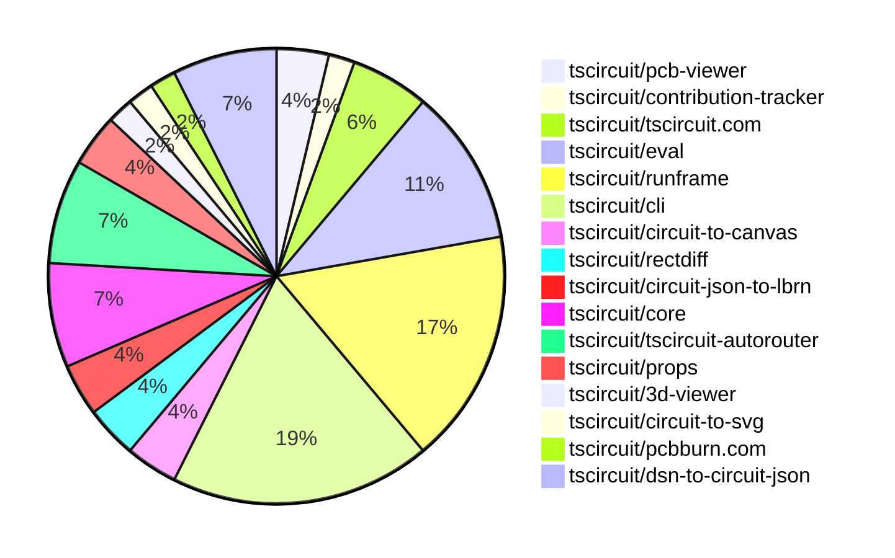
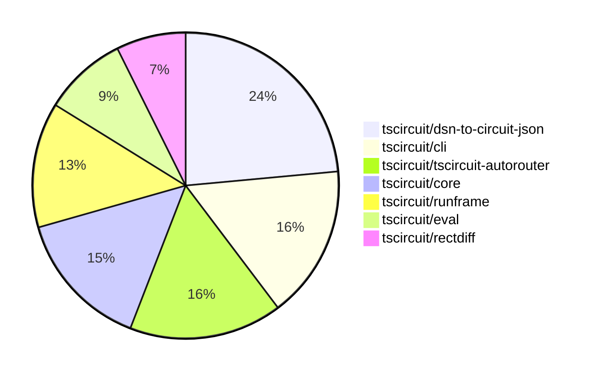

# contribution tracker

[contributions.tscircuit.com](https://contributions.tscircuit.com) ・ [tscircuit.com](https://tscircuit.com) ・ [Contribution Overviews](./contribution-overviews/) ・ [Changelogs](./changelogs/)

Generates weekly contribution overviews for tscircuit contributors. Check out all
the [contribution overviews here](./contribution-overviews/)
You can find AI-generated monthly changelogs in the [changelogs directory](./changelogs/)

- All PRs in the tscircuit org are scanned/summarized via an LLM
- The LLM classifies each Diff/PR as into a set of attributes for scoring
- All the PRs, summaries, and classifications are organized into charts and tables for [the website](https://contributions.tscircuit.com)

> Want to run locally? See the [Development Section](#development)

The current week is shown below. There are 4 major sections:

- [Contributor Overview](#contributor-overview)
- [PRs by Repository](#prs-by-repository)
- [PRs by Contributor](#changes-by-contributor)
- [Scoring & Sponsorship System](#scoring--sponsorship-system)

## Current Week

<!-- START_CURRENT_WEEK -->

# Contribution Overview 2025-12-24

The current week is shown below. There are 4 major sections:

- [Contributor Overview](#contributor-overview)
- [PRs by Repository](#prs-by-repository)
- [PRs by Contributor](#changes-by-contributor)
- [Scoring & Sponsorship System](#scoring--sponsorship-system)

## PRs by Repository



## Contributor Overview

| Contributor | 🐳 Major | 🐙 Minor | 🐌 Tiny | ⭐ | Score | Discussion Contributions |
|-------------|---------|---------|---------|-----|----------------|--------------------------|
| [imrishabh18](#imrishabh18) | 4 | 0 | 0 | ⭐⭐ | 17 | 0🔹 0🔶 0💎 |
| [tscircuitbot](#tscircuitbot) | 0 | 0 | 30 | ⭐⭐ | 13.5 | 0🔹 0🔶 0💎 |
| [seveibar](#seveibar) | 2 | 2 | 0 | ⭐⭐ | 13 | 0🔹 0🔶 0💎 |
| [ShiboSoftwareDev](#ShiboSoftwareDev) | 1 | 3 | 0 | ⭐⭐ | 13 | 0🔹 0🔶 0💎 |
| [techmannih](#techmannih) | 1 | 2 | 0 | ⭐ | 8 | 0🔹 0🔶 0💎 |
| [0hmX](#0hmX) | 1 | 0 | 1 | ⭐ | 5 | 0🔹 0🔶 0💎 |
| [AnasSarkiz](#AnasSarkiz) | 1 | 0 | 1 | ⭐ | 5 | 0🔹 0🔶 0💎 |
| [ArnavK-09](#ArnavK-09) | 0 | 1 | 1 |  | 2.5 | 0🔹 0🔶 0💎 |
| [rushabhcodes](#rushabhcodes) | 0 | 1 | 0 |  | 2 | 0🔹 0🔶 0💎 |
| [Ayushjhawar8](#Ayushjhawar8) | 0 | 0 | 1 |  | 2 | 0🔹 0🔶 0💎 |
| [MustafaMulla29](#MustafaMulla29) | 0 | 1 | 0 |  | 2 | 0🔹 0🔶 0💎 |

> Note: AI evaluates PRs and assigns 1-3 star ratings automatically. 4 and 5 star ratings require manual staff review.

### Discussion Contribution Legend

- 🔹 Normal Comments: Basic participation with minimal effort
- 🔶 Great Informative Comments: Thoughtful participation that adds value
- 💎 Incredible Comments: Exceptional participation with high-quality content

## Review Table

[reviews-received-hover]: ## "Number of reviews received for PRs for this contributor"
[approvals-received-hover]: ## "Number of approvals received for PRs this contributor authored"
[rejections-received-hover]: ## "Number of rejections received for PRs this contributor authored"
[prs-opened-hover]: ## "Number of PRs opened by this contributor"
[issues-created-hover]: ## "Number of issues created by this contributor"
[bountied-issues-hover]: ## "Number of issues this contributor created with a bounty"
[bountied-issue-$-hover]: ## "Total bounty amount placed on issues authored by this contributor"

| Contributor | Reviews Received | Approvals Received | Rejections Received | Approvals | Rejections | PRs Opened | PRs Merged | Score | Issues Created | Bountied Issues | Bountied Issue $ |
|---|---|---|---|---|---|---|---|---|---|---|---|
| [Ayushjhawar8](#Ayushjhawar8) | 4 | 1 | 2 | 0 | 0 | 3 | 1 | 2 | 0 | 0 | 0 |
| [imrishabh18](#imrishabh18) | 0 | 0 | 0 | 4 | 2 | 4 | 4 | 17 | 0 | 0 | 0 |
| [seveibar](#seveibar) | 1 | 0 | 0 | 12 | 1 | 7 | 4 | 13 | 0 | 0 | 0 |
| [ArnavK-09](#ArnavK-09) | 3 | 3 | 0 | 0 | 0 | 3 | 3 | 2.5 | 0 | 0 | 0 |
| [ShiboSoftwareDev](#ShiboSoftwareDev) | 6 | 4 | 1 | 3 | 0 | 4 | 4 | 13 | 0 | 0 | 0 |
| [Abse2001](#Abse2001) | 0 | 0 | 0 | 2 | 0 | 0 | 0 | 0 | 0 | 0 | 0 |
| [tscircuitbot](#tscircuitbot) | 0 | 0 | 0 | 0 | 0 | 37 | 30 | 13.5 | 0 | 0 | 0 |
| [rushabhcodes](#rushabhcodes) | 3 | 3 | 0 | 0 | 0 | 1 | 1 | 2 | 0 | 0 | 0 |
| [techmannih](#techmannih) | 5 | 3 | 0 | 0 | 0 | 3 | 3 | 8 | 0 | 0 | 0 |
| [MustafaMulla29](#MustafaMulla29) | 3 | 1 | 0 | 0 | 0 | 2 | 1 | 2 | 0 | 0 | 0 |
| [0hmX](#0hmX) | 4 | 2 | 0 | 0 | 1 | 3 | 2 | 5 | 0 | 0 | 0 |
| [AnasSarkiz](#AnasSarkiz) | 5 | 4 | 1 | 0 | 0 | 3 | 2 | 5 | 0 | 0 | 0 |

## Top 7 Repositories by Contribution Points



## Scoring & Sponsorship System

### Overview

PRs are analyzed by AI and assigned a **star rating (1-3 stars)**. 4 and 5 star ratings can only be manually assigned by staff. Weekly scores use `2^(starRating - 1)` per PR (capped at 12 PRs per rating), plus review/discussion points.

### Weekly Score → Star String

| Score Range | Star String | Count Value |
|------------|-------------|-------------|
| 0-3 | (empty) | 0 stars |
| 4-10 | ⭐ | 1 star |
| 11-30 | ⭐⭐ | 2 stars |
| 31-50 | ⭐⭐⭐ | 3 stars |
| 51-75 | 👑 | 1 crown |
| 76-100 | 👑👑 | 2 crowns |
| 101+ | 👑👑👑 | 3 crowns |

> Crowns count as 3 stars for sponsorship.

### Monthly Sponsorship Calculation

The sponsorship system calculates monthly payments based on your **weekly star counts** over the complete weeks in that month (typically 4-5 weeks, Wednesday-Tuesday format).

**Step 1: Collect Weekly Stars**
- All complete weeks in the month are analyzed
- Each week's star string is converted to a numeric count (⭐ = 1 star, ⭐⭐⭐ = 3 stars)
- Example: `[2, 2, 2, 1, 0]` means 2 stars in week 1, 2 stars in week 2, etc.

**Step 2: Calculate Metrics**
- **Median stars**: The median value of all weekly star counts
- **Min stars**: The minimum weekly star count
- **Max stars**: The maximum weekly star count
- **High score**: The maximum raw weekly score (0-100+ range from the scoring table) from any week in the month

**Step 3: Determine Base Amount**
The sponsorship amount is calculated based on these metrics (checked in order):

| Condition | Base Amount |
|-----------|-------------|
| `minStarCount >= 3` | **$700** |
| `medianStars >= 3` | **$550** |
| `medianStars >= 2.5` | **$400** |
| `medianStars >= 2` | **$250** |
| `medianStars >= 1.5` | **$120** |
| `medianStars >= 1` | **$75** |
| `maxStarCount >= 2` | **$45** |
| `maxStarCount >= 1` | **$30** |
| `highScore >= 3` (and all stars = 0) | **$10** |

| Maintainer Level | Monthly Bonus |
|------------------|---------------|
| Level 1 | **$200** |
| Level 2 | **$350** |
| Level 3 | **$500** |
| Level 4 | **$850** |
| Level 5 | **$1300** |
| Level 6 | **$2000** |

**Final Amount** = Base Amount + Maintainer Bonus

## Changes by Repository

### [tscircuit/pcb-viewer](https://github.com/tscircuit/pcb-viewer)

| PR # | Impact | Rating | Contributor | Description |
|------|--------|--------|-------------|-------------|
| [#565](https://github.com/tscircuit/pcb-viewer/pull/565) | 🐙 Minor | ⭐⭐ | ArnavK-09 | Adds support for displaying offsets between group anchors when a group is positioned relative to another group using the relative_to_pcb_group position mode. |

<details>
<summary>🐌 Tiny Contributions (1)</summary>

| PR # | Impact | Contributor | Description |
|------|--------|-------------|-------------|
| [#567](https://github.com/tscircuit/pcb-viewer/pull/567) | 🐌 Tiny | tscircuitbot | Automated package update |

</details>

### [tscircuit/contribution-tracker](https://github.com/tscircuit/contribution-tracker)


<details>
<summary>🐌 Tiny Contributions (1)</summary>

| PR # | Impact | Contributor | Description |
|------|--------|-------------|-------------|
| [#287](https://github.com/tscircuit/contribution-tracker/pull/287) | 🐌 Tiny | ArnavK-09 | Changes the title of the repository from contribution-tracker to contribution tracker. |

</details>

### [tscircuit/tscircuit.com](https://github.com/tscircuit/tscircuit.com)


<details>
<summary>🐌 Tiny Contributions (3)</summary>

| PR # | Impact | Contributor | Description |
|------|--------|-------------|-------------|
| [#2333](https://github.com/tscircuit/tscircuit.com/pull/2333) | 🐌 Tiny | tscircuitbot | Automated package update |
| [#2328](https://github.com/tscircuit/tscircuit.com/pull/2328) | 🐌 Tiny | tscircuitbot | Automated package update |
| [#2330](https://github.com/tscircuit/tscircuit.com/pull/2330) | 🐌 Tiny | tscircuitbot | Automated package update |

</details>

### [tscircuit/eval](https://github.com/tscircuit/eval)


<details>
<summary>🐌 Tiny Contributions (6)</summary>

| PR # | Impact | Contributor | Description |
|------|--------|-------------|-------------|
| [#1785](https://github.com/tscircuit/eval/pull/1785) | 🐌 Tiny | tscircuitbot | Automated package update to version 0.0.559 |
| [#1784](https://github.com/tscircuit/eval/pull/1784) | 🐌 Tiny | tscircuitbot | Automated package update |
| [#1778](https://github.com/tscircuit/eval/pull/1778) | 🐌 Tiny | tscircuitbot | Automated package update |
| [#1779](https://github.com/tscircuit/eval/pull/1779) | 🐌 Tiny | tscircuitbot | Automated package update |
| [#1782](https://github.com/tscircuit/eval/pull/1782) | 🐌 Tiny | tscircuitbot | Automated package update |
| [#1781](https://github.com/tscircuit/eval/pull/1781) | 🐌 Tiny | tscircuitbot | Updates the version of the tscircuitcore package from 0.0.942 to 0.0.943 in package.json |

</details>

### [tscircuit/runframe](https://github.com/tscircuit/runframe)


<details>
<summary>🐌 Tiny Contributions (9)</summary>

| PR # | Impact | Contributor | Description |
|------|--------|-------------|-------------|
| [#2220](https://github.com/tscircuit/runframe/pull/2220) | 🐌 Tiny | tscircuitbot | Automated package update |
| [#2219](https://github.com/tscircuit/runframe/pull/2219) | 🐌 Tiny | tscircuitbot | Updates the tscircuiteval package to version 0.0.559 in the package.json file. |
| [#2212](https://github.com/tscircuit/runframe/pull/2212) | 🐌 Tiny | tscircuitbot | Updates the tscircuiteval package to version 0.0.557 in the package.json file. |
| [#2217](https://github.com/tscircuit/runframe/pull/2217) | 🐌 Tiny | tscircuitbot | Updates the tscircuitpcb-viewer package from version 1.11.294 to 1.11.295 |
| [#2215](https://github.com/tscircuit/runframe/pull/2215) | 🐌 Tiny | tscircuitbot | Automated package update |
| [#2218](https://github.com/tscircuit/runframe/pull/2218) | 🐌 Tiny | tscircuitbot | Automated package update |
| [#2216](https://github.com/tscircuit/runframe/pull/2216) | 🐌 Tiny | tscircuitbot | Updates the tscircuit3d-viewer package to version 0.0.480 in package.json |
| [#2214](https://github.com/tscircuit/runframe/pull/2214) | 🐌 Tiny | tscircuitbot | Updates the tscircuiteval package to version 0.0.558 |
| [#2213](https://github.com/tscircuit/runframe/pull/2213) | 🐌 Tiny | tscircuitbot | Automated package update |

</details>

### [tscircuit/cli](https://github.com/tscircuit/cli)

| PR # | Impact | Rating | Contributor | Description |
|------|--------|--------|-------------|-------------|
| [#1488](https://github.com/tscircuit/cli/pull/1488) | 🐙 Minor | ⭐⭐ | MustafaMulla29 | Adds a new command line option to generate a GLTF file from the preview entrypoint during the build process. |

<details>
<summary>🐌 Tiny Contributions (9)</summary>

| PR # | Impact | Contributor | Description |
|------|--------|-------------|-------------|
| [#1495](https://github.com/tscircuit/cli/pull/1495) | 🐌 Tiny | tscircuitbot | Automated package update |
| [#1494](https://github.com/tscircuit/cli/pull/1494) | 🐌 Tiny | tscircuitbot | Automated package update |
| [#1491](https://github.com/tscircuit/cli/pull/1491) | 🐌 Tiny | tscircuitbot | Automated package update |
| [#1486](https://github.com/tscircuit/cli/pull/1486) | 🐌 Tiny | tscircuitbot | Updates the tscircuitrunframe package from version 0.0.1442 to 0.0.1443 |
| [#1492](https://github.com/tscircuit/cli/pull/1492) | 🐌 Tiny | tscircuitbot | Updates the tscircuitrunframe package to version 0.0.1444 in the package.json file. |
| [#1489](https://github.com/tscircuit/cli/pull/1489) | 🐌 Tiny | tscircuitbot | Updates the package version from v0.1.691 to v0.1.692 in package.json |
| [#1493](https://github.com/tscircuit/cli/pull/1493) | 🐌 Tiny | tscircuitbot | Automated package update |
| [#1487](https://github.com/tscircuit/cli/pull/1487) | 🐌 Tiny | tscircuitbot | Automated package update |
| [#1490](https://github.com/tscircuit/cli/pull/1490) | 🐌 Tiny | Ayushjhawar8 | Updates the bun-test workflow to exclude version bump branches from triggering tests. |

</details>

### [tscircuit/circuit-to-canvas](https://github.com/tscircuit/circuit-to-canvas)

| PR # | Impact | Rating | Contributor | Description |
|------|--------|--------|-------------|-------------|
| [#71](https://github.com/tscircuit/circuit-to-canvas/pull/71) | 🐙 Minor | ⭐⭐ | techmannih | Adds support for drawing PCB plated holes with polygon pads, including various hole shapes such as circle, oval, and pill. |

<details>
<summary>🐌 Tiny Contributions (1)</summary>

| PR # | Impact | Contributor | Description |
|------|--------|-------------|-------------|
| [#73](https://github.com/tscircuit/circuit-to-canvas/pull/73) | 🐌 Tiny | tscircuitbot | Updates the package version from 0.0.28 to 0.0.29 in package.json |

</details>

### [tscircuit/rectdiff](https://github.com/tscircuit/rectdiff)

| PR # | Impact | Rating | Contributor | Description |
|------|--------|--------|-------------|-------------|
| [#44](https://github.com/tscircuit/rectdiff/pull/44) | 🐳 Major | ⭐⭐⭐ | 0hmX | Replaces the n2 collision detection with rbush for faster area lookups in the RectDiffGridSolverPipeline. |

<details>
<summary>🐌 Tiny Contributions (1)</summary>

| PR # | Impact | Contributor | Description |
|------|--------|-------------|-------------|
| [#45](https://github.com/tscircuit/rectdiff/pull/45) | 🐌 Tiny | tscircuitbot | Automated package update |

</details>

### [tscircuit/circuit-json-to-lbrn](https://github.com/tscircuit/circuit-json-to-lbrn)

| PR # | Impact | Rating | Contributor | Description |
|------|--------|--------|-------------|-------------|
| [#56](https://github.com/tscircuit/circuit-json-to-lbrn/pull/56) | 🐳 Major | ⭐⭐⭐ | AnasSarkiz | Adds customizable laser profile settings for copper and board cutting operations, allowing users to specify speed, number of passes, frequency, and pulse width for laser cutting. |

<details>
<summary>🐌 Tiny Contributions (1)</summary>

| PR # | Impact | Contributor | Description |
|------|--------|-------------|-------------|
| [#57](https://github.com/tscircuit/circuit-json-to-lbrn/pull/57) | 🐌 Tiny | tscircuitbot | Automated package update |

</details>

### [tscircuit/core](https://github.com/tscircuit/core)

| PR # | Impact | Rating | Contributor | Description |
|------|--------|--------|-------------|-------------|
| [#1789](https://github.com/tscircuit/core/pull/1789) | 🐳 Major | ⭐⭐⭐ | seveibar | Adjusts the autorouter to generate fewer obstacles for rotated pads, improving routing efficiency. |
| [#1795](https://github.com/tscircuit/core/pull/1795) | 🐙 Minor | ⭐⭐ | ShiboSoftwareDev | Add currentsource  component for modeling DC and AC current sources in circuit simulations |
| [#1783](https://github.com/tscircuit/core/pull/1783) | 🐙 Minor | ⭐⭐ | ShiboSoftwareDev | This change allows fabricationnote...  components to be correctly positioned when their parent board  is arranged on a panel . |
| [#1793](https://github.com/tscircuit/core/pull/1793) | 🐙 Minor | ⭐⭐ | techmannih | Fixes the issue where the silkscreen rectangle does not rotate in accordance with the chips rotation on the PCB layout. |

### [tscircuit/tscircuit-autorouter](https://github.com/tscircuit/tscircuit-autorouter)

| PR # | Impact | Rating | Contributor | Description |
|------|--------|--------|-------------|-------------|
| [#440](https://github.com/tscircuit/tscircuit-autorouter/pull/440) | 🐳 Major | ⭐⭐⭐ | seveibar | add trace keepout solver point hash based method for determining subpaths |
| [#444](https://github.com/tscircuit/tscircuit-autorouter/pull/444) | 🐳 Major | ⭐⭐⭐ | ShiboSoftwareDev | Introduces a new solver to handle single intra-node routes requiring a layer transition, fixing failures and optimizing solutions in the autorouting pipeline. |
| [#442](https://github.com/tscircuit/tscircuit-autorouter/pull/442) | 🐙 Minor | ⭐⭐ | seveibar | Implements getConstructorParams method for four pipeline solvers to enable consistent reconstruction of pipeline instances without errors from BaseSolver. |

<details>
<summary>🐌 Tiny Contributions (1)</summary>

| PR # | Impact | Contributor | Description |
|------|--------|-------------|-------------|
| [#445](https://github.com/tscircuit/tscircuit-autorouter/pull/445) | 🐌 Tiny | 0hmX | WIP WIP |

</details>

### [tscircuit/props](https://github.com/tscircuit/props)

| PR # | Impact | Rating | Contributor | Description |
|------|--------|--------|-------------|-------------|
| [#545](https://github.com/tscircuit/props/pull/545) | 🐙 Minor | ⭐⭐ | seveibar | Adds a new autorouter preset named tscircuit_beta to the autorouter configuration, allowing it to be selected via props and validated by the schema, while keeping documentation and type artifacts in sync with runtime validations. |
| [#546](https://github.com/tscircuit/props/pull/546) | 🐙 Minor | ⭐⭐ | ShiboSoftwareDev | Adds a new CurrentSource component with properties for current, frequency, peak-to-peak current, wave shape, phase, duty cycle, and connections. |

### [tscircuit/3d-viewer](https://github.com/tscircuit/3d-viewer)

| PR # | Impact | Rating | Contributor | Description |
|------|--------|--------|-------------|-------------|
| [#632](https://github.com/tscircuit/3d-viewer/pull/632) | 🐙 Minor | ⭐⭐ | rushabhcodes | Adds a shared opacity constant for faux boards and propagates the isFaux flag through relevant components and rendering functions to ensure consistent rendering of faux PCB boards with partial transparency. |

### [tscircuit/circuit-to-svg](https://github.com/tscircuit/circuit-to-svg)

| PR # | Impact | Rating | Contributor | Description |
|------|--------|--------|-------------|-------------|
| [#463](https://github.com/tscircuit/circuit-to-svg/pull/463) | 🐳 Major | ⭐⭐⭐ | techmannih | Adds support for counter-clockwise text rotation in PCB note and fabrication note dimensions, allowing for better text placement in SVG rendering. |

### [tscircuit/pcbburn.com](https://github.com/tscircuit/pcbburn.com)


<details>
<summary>🐌 Tiny Contributions (1)</summary>

| PR # | Impact | Contributor | Description |
|------|--------|-------------|-------------|
| [#1](https://github.com/tscircuit/pcbburn.com/pull/1) | 🐌 Tiny | AnasSarkiz | Establishes the complete foundation for pcbburn.com, a tscircuit-powered PCB design and burning platform, by implementing modern web technologies and development tooling, creating a scalable codebase ready for advanced circuit design features. |

</details>

### [tscircuit/dsn-to-circuit-json](https://github.com/tscircuit/dsn-to-circuit-json)

| PR # | Impact | Rating | Contributor | Description |
|------|--------|--------|-------------|-------------|
| [#19](https://github.com/tscircuit/dsn-to-circuit-json/pull/19) | 🐳 Major | ⭐⭐⭐ | imrishabh18 | Changes the intersection logic to utilize the actual geometric shape of pads (circle, polygon, or box) instead of a bounding rectangle, improving accuracy in wire connections. |
| [#17](https://github.com/tscircuit/dsn-to-circuit-json/pull/17) | 🐳 Major | ⭐⭐⭐ | imrishabh18 | Refactors the intersection logic of pads and traces to utilize the Flatten.js library for improved geometric calculations and representation. |
| [#16](https://github.com/tscircuit/dsn-to-circuit-json/pull/16) | 🐳 Major | ⭐⭐⭐ | imrishabh18 | Add visualization for Spectra SES wires, enabling graphical representation of wire paths in the circuit design. |
| [#18](https://github.com/tscircuit/dsn-to-circuit-json/pull/18) | 🐳 Major | ⭐⭐⭐ | imrishabh18 | Adds polygon shape visualization for padstack in the PCB design rendering process. |

## Changes by Contributor

### [ArnavK-09](https://github.com/ArnavK-09)

| PRs # | Impact | Rating | Description |
|------|--------|--------|-------------|
| [#565](https://github.com/tscircuit/pcb-viewer/pull/565) | 🐙 Minor | ⭐⭐ | Adds support for displaying offsets between group anchors when a group is positioned relative to another group using the relative_to_pcb_group position mode. |

<details>
<summary>🐌 Tiny Contributions (1)</summary>

| PR # | Impact | Description |
|------|--------|-------------|
| [#287](https://github.com/tscircuit/contribution-tracker/pull/287) | 🐌 Tiny | Changes the title of the repository from contribution-tracker to contribution tracker. |

</details>

### [tscircuitbot](https://github.com/tscircuitbot)


<details>
<summary>🐌 Tiny Contributions (30)</summary>

| PR # | Impact | Description |
|------|--------|-------------|
| [#567](https://github.com/tscircuit/pcb-viewer/pull/567) | 🐌 Tiny | Automated package update |
| [#2333](https://github.com/tscircuit/tscircuit.com/pull/2333) | 🐌 Tiny | Automated package update |
| [#2328](https://github.com/tscircuit/tscircuit.com/pull/2328) | 🐌 Tiny | Automated package update |
| [#2330](https://github.com/tscircuit/tscircuit.com/pull/2330) | 🐌 Tiny | Automated package update |
| [#1785](https://github.com/tscircuit/eval/pull/1785) | 🐌 Tiny | Automated package update to version 0.0.559 |
| [#1784](https://github.com/tscircuit/eval/pull/1784) | 🐌 Tiny | Automated package update |
| [#1778](https://github.com/tscircuit/eval/pull/1778) | 🐌 Tiny | Automated package update |
| [#1779](https://github.com/tscircuit/eval/pull/1779) | 🐌 Tiny | Automated package update |
| [#1782](https://github.com/tscircuit/eval/pull/1782) | 🐌 Tiny | Automated package update |
| [#1781](https://github.com/tscircuit/eval/pull/1781) | 🐌 Tiny | Updates the version of the tscircuitcore package from 0.0.942 to 0.0.943 in package.json |
| [#2220](https://github.com/tscircuit/runframe/pull/2220) | 🐌 Tiny | Automated package update |
| [#2219](https://github.com/tscircuit/runframe/pull/2219) | 🐌 Tiny | Updates the tscircuiteval package to version 0.0.559 in the package.json file. |
| [#2212](https://github.com/tscircuit/runframe/pull/2212) | 🐌 Tiny | Updates the tscircuiteval package to version 0.0.557 in the package.json file. |
| [#2217](https://github.com/tscircuit/runframe/pull/2217) | 🐌 Tiny | Updates the tscircuitpcb-viewer package from version 1.11.294 to 1.11.295 |
| [#2215](https://github.com/tscircuit/runframe/pull/2215) | 🐌 Tiny | Automated package update |
| [#2218](https://github.com/tscircuit/runframe/pull/2218) | 🐌 Tiny | Automated package update |
| [#2216](https://github.com/tscircuit/runframe/pull/2216) | 🐌 Tiny | Updates the tscircuit3d-viewer package to version 0.0.480 in package.json |
| [#2214](https://github.com/tscircuit/runframe/pull/2214) | 🐌 Tiny | Updates the tscircuiteval package to version 0.0.558 |
| [#2213](https://github.com/tscircuit/runframe/pull/2213) | 🐌 Tiny | Automated package update |
| [#1495](https://github.com/tscircuit/cli/pull/1495) | 🐌 Tiny | Automated package update |
| [#1494](https://github.com/tscircuit/cli/pull/1494) | 🐌 Tiny | Automated package update |
| [#1491](https://github.com/tscircuit/cli/pull/1491) | 🐌 Tiny | Automated package update |
| [#1486](https://github.com/tscircuit/cli/pull/1486) | 🐌 Tiny | Updates the tscircuitrunframe package from version 0.0.1442 to 0.0.1443 |
| [#1492](https://github.com/tscircuit/cli/pull/1492) | 🐌 Tiny | Updates the tscircuitrunframe package to version 0.0.1444 in the package.json file. |
| [#1489](https://github.com/tscircuit/cli/pull/1489) | 🐌 Tiny | Updates the package version from v0.1.691 to v0.1.692 in package.json |
| [#1493](https://github.com/tscircuit/cli/pull/1493) | 🐌 Tiny | Automated package update |
| [#1487](https://github.com/tscircuit/cli/pull/1487) | 🐌 Tiny | Automated package update |
| [#73](https://github.com/tscircuit/circuit-to-canvas/pull/73) | 🐌 Tiny | Updates the package version from 0.0.28 to 0.0.29 in package.json |
| [#45](https://github.com/tscircuit/rectdiff/pull/45) | 🐌 Tiny | Automated package update |
| [#57](https://github.com/tscircuit/circuit-json-to-lbrn/pull/57) | 🐌 Tiny | Automated package update |

</details>

### [seveibar](https://github.com/seveibar)

| PRs # | Impact | Rating | Description |
|------|--------|--------|-------------|
| [#1789](https://github.com/tscircuit/core/pull/1789) | 🐳 Major | ⭐⭐⭐ | Adjusts the autorouter to generate fewer obstacles for rotated pads, improving routing efficiency. |
| [#440](https://github.com/tscircuit/tscircuit-autorouter/pull/440) | 🐳 Major | ⭐⭐⭐ | add trace keepout solver point hash based method for determining subpaths |
| [#545](https://github.com/tscircuit/props/pull/545) | 🐙 Minor | ⭐⭐ | Adds a new autorouter preset named tscircuit_beta to the autorouter configuration, allowing it to be selected via props and validated by the schema, while keeping documentation and type artifacts in sync with runtime validations. |
| [#442](https://github.com/tscircuit/tscircuit-autorouter/pull/442) | 🐙 Minor | ⭐⭐ | Implements getConstructorParams method for four pipeline solvers to enable consistent reconstruction of pipeline instances without errors from BaseSolver. |

### [ShiboSoftwareDev](https://github.com/ShiboSoftwareDev)

| PRs # | Impact | Rating | Description |
|------|--------|--------|-------------|
| [#444](https://github.com/tscircuit/tscircuit-autorouter/pull/444) | 🐳 Major | ⭐⭐⭐ | Introduces a new solver to handle single intra-node routes requiring a layer transition, fixing failures and optimizing solutions in the autorouting pipeline. |
| [#546](https://github.com/tscircuit/props/pull/546) | 🐙 Minor | ⭐⭐ | Adds a new CurrentSource component with properties for current, frequency, peak-to-peak current, wave shape, phase, duty cycle, and connections. |
| [#1795](https://github.com/tscircuit/core/pull/1795) | 🐙 Minor | ⭐⭐ | Add currentsource  component for modeling DC and AC current sources in circuit simulations |
| [#1783](https://github.com/tscircuit/core/pull/1783) | 🐙 Minor | ⭐⭐ | This change allows fabricationnote...  components to be correctly positioned when their parent board  is arranged on a panel . |

### [rushabhcodes](https://github.com/rushabhcodes)

| PRs # | Impact | Rating | Description |
|------|--------|--------|-------------|
| [#632](https://github.com/tscircuit/3d-viewer/pull/632) | 🐙 Minor | ⭐⭐ | Adds a shared opacity constant for faux boards and propagates the isFaux flag through relevant components and rendering functions to ensure consistent rendering of faux PCB boards with partial transparency. |

### [techmannih](https://github.com/techmannih)

| PRs # | Impact | Rating | Description |
|------|--------|--------|-------------|
| [#463](https://github.com/tscircuit/circuit-to-svg/pull/463) | 🐳 Major | ⭐⭐⭐ | Adds support for counter-clockwise text rotation in PCB note and fabrication note dimensions, allowing for better text placement in SVG rendering. |
| [#1793](https://github.com/tscircuit/core/pull/1793) | 🐙 Minor | ⭐⭐ | Fixes the issue where the silkscreen rectangle does not rotate in accordance with the chips rotation on the PCB layout. |
| [#71](https://github.com/tscircuit/circuit-to-canvas/pull/71) | 🐙 Minor | ⭐⭐ | Adds support for drawing PCB plated holes with polygon pads, including various hole shapes such as circle, oval, and pill. |

### [Ayushjhawar8](https://github.com/Ayushjhawar8)


<details>
<summary>🐌 Tiny Contributions (1)</summary>

| PR # | Impact | Description |
|------|--------|-------------|
| [#1490](https://github.com/tscircuit/cli/pull/1490) | 🐌 Tiny | Updates the bun-test workflow to exclude version bump branches from triggering tests. |

</details>

### [MustafaMulla29](https://github.com/MustafaMulla29)

| PRs # | Impact | Rating | Description |
|------|--------|--------|-------------|
| [#1488](https://github.com/tscircuit/cli/pull/1488) | 🐙 Minor | ⭐⭐ | Adds a new command line option to generate a GLTF file from the preview entrypoint during the build process. |

### [0hmX](https://github.com/0hmX)

| PRs # | Impact | Rating | Description |
|------|--------|--------|-------------|
| [#44](https://github.com/tscircuit/rectdiff/pull/44) | 🐳 Major | ⭐⭐⭐ | Replaces the n2 collision detection with rbush for faster area lookups in the RectDiffGridSolverPipeline. |

<details>
<summary>🐌 Tiny Contributions (1)</summary>

| PR # | Impact | Description |
|------|--------|-------------|
| [#445](https://github.com/tscircuit/tscircuit-autorouter/pull/445) | 🐌 Tiny | WIP WIP |

</details>

### [AnasSarkiz](https://github.com/AnasSarkiz)

| PRs # | Impact | Rating | Description |
|------|--------|--------|-------------|
| [#56](https://github.com/tscircuit/circuit-json-to-lbrn/pull/56) | 🐳 Major | ⭐⭐⭐ | Adds customizable laser profile settings for copper and board cutting operations, allowing users to specify speed, number of passes, frequency, and pulse width for laser cutting. |

<details>
<summary>🐌 Tiny Contributions (1)</summary>

| PR # | Impact | Description |
|------|--------|-------------|
| [#1](https://github.com/tscircuit/pcbburn.com/pull/1) | 🐌 Tiny | Establishes the complete foundation for pcbburn.com, a tscircuit-powered PCB design and burning platform, by implementing modern web technologies and development tooling, creating a scalable codebase ready for advanced circuit design features. |

</details>

### [imrishabh18](https://github.com/imrishabh18)

| PRs # | Impact | Rating | Description |
|------|--------|--------|-------------|
| [#19](https://github.com/tscircuit/dsn-to-circuit-json/pull/19) | 🐳 Major | ⭐⭐⭐ | Changes the intersection logic to utilize the actual geometric shape of pads (circle, polygon, or box) instead of a bounding rectangle, improving accuracy in wire connections. |
| [#17](https://github.com/tscircuit/dsn-to-circuit-json/pull/17) | 🐳 Major | ⭐⭐⭐ | Refactors the intersection logic of pads and traces to utilize the Flatten.js library for improved geometric calculations and representation. |
| [#16](https://github.com/tscircuit/dsn-to-circuit-json/pull/16) | 🐳 Major | ⭐⭐⭐ | Add visualization for Spectra SES wires, enabling graphical representation of wire paths in the circuit design. |
| [#18](https://github.com/tscircuit/dsn-to-circuit-json/pull/18) | 🐳 Major | ⭐⭐⭐ | Adds polygon shape visualization for padstack in the PCB design rendering process. |

## Repository Owners

| Repository | Codeowners |
|------------|------------|
| [builder](https://github.com/tscircuit/builder/blob/main/.github/CODEOWNERS) | [seveibar](https://github.com/seveibar)
| [pcb-viewer](https://github.com/tscircuit/pcb-viewer/blob/main/.github/CODEOWNERS) | [seveibar](https://github.com/seveibar), [ShiboSoftwareDev](https://github.com/ShiboSoftwareDev)
| [footprints-old](https://github.com/tscircuit/footprints-old/blob/main/.github/CODEOWNERS) | [seveibar](https://github.com/seveibar)
| [footprinter](https://github.com/tscircuit/footprinter/blob/main/.github/CODEOWNERS) | [seveibar](https://github.com/seveibar), [techmannih](https://github.com/techmannih)
| [3d-viewer](https://github.com/tscircuit/3d-viewer/blob/main/.github/CODEOWNERS) | [ShiboSoftwareDev](https://github.com/ShiboSoftwareDev)
| [winterspec](https://github.com/tscircuit/winterspec/blob/main/.github/CODEOWNERS) | [seveibar](https://github.com/seveibar), [ShiboSoftwareDev](https://github.com/ShiboSoftwareDev)
| [jscad-electronics](https://github.com/tscircuit/jscad-electronics/blob/main/.github/CODEOWNERS) | [seveibar](https://github.com/seveibar), [techmannih](https://github.com/techmannih), [ShiboSoftwareDev](https://github.com/ShiboSoftwareDev), [anas-sarkez](https://github.com/anas-sarkez)
| [circuit-to-svg](https://github.com/tscircuit/circuit-to-svg/blob/main/.github/CODEOWNERS) | [imrishabh18](https://github.com/imrishabh18)
| [schematic-symbols](https://github.com/tscircuit/schematic-symbols/blob/main/.github/CODEOWNERS) | [seveibar](https://github.com/seveibar), [imrishabh18](https://github.com/imrishabh18), [techmannih](https://github.com/techmannih)
| [circuit-json-to-gerber](https://github.com/tscircuit/circuit-json-to-gerber/blob/main/.github/CODEOWNERS) | [seveibar](https://github.com/seveibar), [ShiboSoftwareDev](https://github.com/ShiboSoftwareDev)
| [tscircuit.com](https://github.com/tscircuit/tscircuit.com/blob/main/.github/CODEOWNERS) | [seveibar](https://github.com/seveibar), [imrishabh18](https://github.com/imrishabh18)
| [issue-roulette](https://github.com/tscircuit/issue-roulette/blob/main/.github/CODEOWNERS) | [Anshgrover23](https://github.com/Anshgrover23)
| [sparkfun-boards](https://github.com/tscircuit/sparkfun-boards/blob/main/.github/CODEOWNERS) | [ShiboSoftwareDev](https://github.com/ShiboSoftwareDev), [Abse2001](https://github.com/Abse2001), [MustafaMulla29](https://github.com/MustafaMulla29), [Anshgrover23](https://github.com/Anshgrover23), [techmannih](https://github.com/techmannih)
| [schematic-corpus](https://github.com/tscircuit/schematic-corpus/blob/main/.github/CODEOWNERS) | [Abse2001](https://github.com/Abse2001)
| [copper-pour-solver](https://github.com/tscircuit/copper-pour-solver/blob/main/.github/CODEOWNERS) | [seveibar](https://github.com/seveibar), [ShiboSoftwareDev](https://github.com/ShiboSoftwareDev)
| [common](https://github.com/tscircuit/common/blob/main/.github/CODEOWNERS) | [seveibar](https://github.com/seveibar), [Abse2001](https://github.com/Abse2001)

## Repositories by Owner

| User | Repo |
|------|------|
| [seveibar](https://github.com/seveibar) | [builder](https://github.com/tscircuit/builder/blob/main/.github/CODEOWNERS) |
|  | [pcb-viewer](https://github.com/tscircuit/pcb-viewer/blob/main/.github/CODEOWNERS) |
|  | [footprints-old](https://github.com/tscircuit/footprints-old/blob/main/.github/CODEOWNERS) |
|  | [footprinter](https://github.com/tscircuit/footprinter/blob/main/.github/CODEOWNERS) |
|  | [winterspec](https://github.com/tscircuit/winterspec/blob/main/.github/CODEOWNERS) |
|  | [jscad-electronics](https://github.com/tscircuit/jscad-electronics/blob/main/.github/CODEOWNERS) |
|  | [schematic-symbols](https://github.com/tscircuit/schematic-symbols/blob/main/.github/CODEOWNERS) |
|  | [circuit-json-to-gerber](https://github.com/tscircuit/circuit-json-to-gerber/blob/main/.github/CODEOWNERS) |
|  | [tscircuit.com](https://github.com/tscircuit/tscircuit.com/blob/main/.github/CODEOWNERS) |
|  | [copper-pour-solver](https://github.com/tscircuit/copper-pour-solver/blob/main/.github/CODEOWNERS) |
|  | [common](https://github.com/tscircuit/common/blob/main/.github/CODEOWNERS) |
| [ShiboSoftwareDev](https://github.com/ShiboSoftwareDev) | [pcb-viewer](https://github.com/tscircuit/pcb-viewer/blob/main/.github/CODEOWNERS) |
|  | [3d-viewer](https://github.com/tscircuit/3d-viewer/blob/main/.github/CODEOWNERS) |
|  | [winterspec](https://github.com/tscircuit/winterspec/blob/main/.github/CODEOWNERS) |
|  | [jscad-electronics](https://github.com/tscircuit/jscad-electronics/blob/main/.github/CODEOWNERS) |
|  | [circuit-json-to-gerber](https://github.com/tscircuit/circuit-json-to-gerber/blob/main/.github/CODEOWNERS) |
|  | [sparkfun-boards](https://github.com/tscircuit/sparkfun-boards/blob/main/.github/CODEOWNERS) |
|  | [copper-pour-solver](https://github.com/tscircuit/copper-pour-solver/blob/main/.github/CODEOWNERS) |
| [techmannih](https://github.com/techmannih) | [footprinter](https://github.com/tscircuit/footprinter/blob/main/.github/CODEOWNERS) |
|  | [jscad-electronics](https://github.com/tscircuit/jscad-electronics/blob/main/.github/CODEOWNERS) |
|  | [schematic-symbols](https://github.com/tscircuit/schematic-symbols/blob/main/.github/CODEOWNERS) |
|  | [sparkfun-boards](https://github.com/tscircuit/sparkfun-boards/blob/main/.github/CODEOWNERS) |
| [anas-sarkez](https://github.com/anas-sarkez) | [jscad-electronics](https://github.com/tscircuit/jscad-electronics/blob/main/.github/CODEOWNERS) |
| [imrishabh18](https://github.com/imrishabh18) | [circuit-to-svg](https://github.com/tscircuit/circuit-to-svg/blob/main/.github/CODEOWNERS) |
|  | [schematic-symbols](https://github.com/tscircuit/schematic-symbols/blob/main/.github/CODEOWNERS) |
|  | [tscircuit.com](https://github.com/tscircuit/tscircuit.com/blob/main/.github/CODEOWNERS) |
| [Anshgrover23](https://github.com/Anshgrover23) | [issue-roulette](https://github.com/tscircuit/issue-roulette/blob/main/.github/CODEOWNERS) |
|  | [sparkfun-boards](https://github.com/tscircuit/sparkfun-boards/blob/main/.github/CODEOWNERS) |
| [Abse2001](https://github.com/Abse2001) | [sparkfun-boards](https://github.com/tscircuit/sparkfun-boards/blob/main/.github/CODEOWNERS) |
|  | [schematic-corpus](https://github.com/tscircuit/schematic-corpus/blob/main/.github/CODEOWNERS) |
|  | [common](https://github.com/tscircuit/common/blob/main/.github/CODEOWNERS) |
| [MustafaMulla29](https://github.com/MustafaMulla29) | [sparkfun-boards](https://github.com/tscircuit/sparkfun-boards/blob/main/.github/CODEOWNERS) |


<!-- END_CURRENT_WEEK -->


## Development

### Prerequisites

- [Bun](https://bun.sh/) runtime
- `.env` file with required API keys:
  ```
  GITHUB_TOKEN=your_github_token
  OPENAI_API_KEY=your_openai_api_key
  DISCORD_TOKEN=your_discord_token (optional, for Discord integration)
  SLACK_BOT_TOKEN=your_slack_token (optional, for Slack integration)
  ```

### Available Scripts

#### Core Generation Scripts

- `bun run generate:weekly` - Generate current week's contribution overview
- `bun run generate:monthly` - Generate current month's contribution overview
- `bun run generate:changelog` - Generate monthly changelog from PRs

#### Analysis & Testing

- `bun run analyze-pr` - Analyze a single PR (interactive prompt)
- `bun run test:github` - Test GitHub API integration

#### Notifications & Sync

- `bun run notifications:issues` - Send notifications for new issues
- `bun run notifications:pr` - Send notifications for new PRs
- `bun run sync:discord` - Sync contributor roles with Discord

#### Data Export

- `bun run export:sponsorship` - Generate sponsorship data CSV

#### Development

- `bun run dev` - Start development server for web UI
- `bun run build` - Build for production
- `bun run format` - Format code with Biome

### Usage Examples

```bash
# Generate this week's contribution overview
bun run generate:weekly

# Generate current month's overview
bun run generate:monthly

# Analyze a specific PR
bun run analyze-pr

# Test your GitHub token setup
bun run test:github
```
