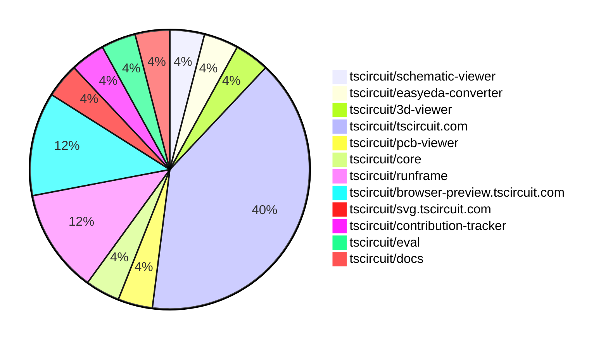

# contribution-tracker

Generates weekly contribution overviews for tscircuit contributors. Check out all
the [contribution overviews here](./contribution-overviews/)

* All PRs in the tscircuit org are scanned/summarized via Claude Haiku
* Claude classifies each Diff/PR as a Major, Minor or Tiny contribution
* All the PRs, summaries, and classifications are organized into charts and tables

The current week is shown below. There are 3 major sections:

* [Contributor Overview](#contributor-overview)
* [PRs by Repository](#prs-by-repository)
* [PRs by Contributor](#changes-by-contributor)

## Current Week

<!-- START_CURRENT_WEEK -->

# Contribution Overview 2025-04-02

## PRs by Repository

## Contributor Overview

| Contributor | 🐳 Major | 🐙 Minor | 🐌 Tiny | ⭐ | Issues Created | Discussion Contributions |
|-------------|---------|---------|---------|-----|----------------|--------------------------|
| [imrishabh18](#imrishabh18) | 2 | 9 | 2 | ⭐⭐⭐ | 7 | 0🔹 0🔶 0💎 |
| [seveibar](#seveibar) | 1 | 1 | 0 | ⭐⭐ | 24 | 3🔹 3🔶 0💎 |
| [MustafaMulla29](#MustafaMulla29) | 0 | 2 | 1 | ⭐ | 1 | 0🔹 0🔶 0💎 |
| [Ayushjhawar8](#Ayushjhawar8) | 0 | 3 | 0 | ⭐ | 0 | 0🔹 0🔶 0💎 |
| [ArnavK-09](#ArnavK-09) | 0 | 1 | 0 |  | 0 | 0🔹 0🔶 0💎 |
| [Rishikesh63](#Rishikesh63) | 0 | 1 | 0 |  | 0 | 0🔹 0🔶 0💎 |
| [gurjeetsinghvirdee](#gurjeetsinghvirdee) | 0 | 0 | 0 | ⭐ | 0 | 0🔹 2🔶 0💎 |
| [Anshgrover23](#Anshgrover23) | 0 | 0 | 0 |  | 0 | 1🔹 0🔶 0💎 |

### Discussion Contribution Legend

- 🔹 Participating: Basic participation with minimal effort
- 🔶 Very Active: Thoughtful participation that adds value
- 💎 Extremely Active: Exceptional participation with high-quality content

## Review Table

[reviews-received-hover]: ## "Number of reviews received for PRs for this contributor"
[approvals-received-hover]: ## "Number of approvals received for PRs this contributor authored"
[rejections-received-hover]: ## "Number of rejections received for PRs this contributor authored"
[prs-opened-hover]: ## "Number of PRs opened by this contributor"
[issues-created-hover]: ## "Number of issues created by this contributor"
[bountied-issues-hover]: ## "Number of issues this contributor created with a bounty"
[bountied-issue-$-hover]: ## "Total bounty amount placed on issues authored by this contributor"

| Contributor | Reviews Received | Approvals Received | Rejections Received | Approvals | Rejections | PRs Opened | PRs Merged | Issues Created | Bountied Issues | Bountied Issue $ |
|---|---|---|---|---|---|---|---|---|---|---|
| [Ayushjhawar8](#Ayushjhawar8) | 3 | 3 | 0 | 0 | 0 | 4 | 3 | 0 | 0 | 0 |
| [seveibar](#seveibar) | 0 | 0 | 0 | 12 | 1 | 3 | 2 | 24 | 16 | 294 |
| [oldbear26](#oldbear26) | 0 | 0 | 0 | 0 | 0 | 1 | 0 | 0 | 0 | 0 |
| [imrishabh18](#imrishabh18) | 16 | 4 | 0 | 1 | 0 | 17 | 15 | 7 | 3 | 12 |
| [ArnavK-09](#ArnavK-09) | 1 | 1 | 0 | 0 | 0 | 2 | 1 | 0 | 0 | 0 |
| [dhvll](#dhvll) | 1 | 0 | 1 | 0 | 0 | 1 | 0 | 0 | 0 | 0 |
| [MustafaMulla29](#MustafaMulla29) | 5 | 4 | 0 | 0 | 1 | 3 | 3 | 1 | 0 | 0 |
| [Rishikesh63](#Rishikesh63) | 1 | 1 | 0 | 0 | 0 | 1 | 1 | 0 | 0 | 0 |
| [Priyanshuthapliyal2005](#Priyanshuthapliyal2005) | 0 | 0 | 0 | 0 | 0 | 1 | 0 | 0 | 0 | 0 |
| [tscircuitbot](#tscircuitbot) | 0 | 0 | 0 | 0 | 0 | 2 | 0 | 0 | 0 | 0 |
| [aliraza556](#aliraza556) | 0 | 0 | 0 | 0 | 0 | 1 | 0 | 0 | 0 | 0 |
| [jyoti-ranjan-jena](#jyoti-ranjan-jena) | 1 | 0 | 0 | 0 | 0 | 1 | 0 | 0 | 0 | 0 |
| [gurjeetsinghvirdee](#gurjeetsinghvirdee) | 1 | 0 | 1 | 0 | 0 | 1 | 0 | 0 | 0 | 0 |
| [Anshgrover23](#Anshgrover23) | 0 | 0 | 0 | 0 | 0 | 0 | 0 | 0 | 0 | 0 |

## Changes by Repository

### [tscircuit/schematic-viewer](https://github.com/tscircuit/schematic-viewer)

| PR # | Impact | Contributor | Description | Milestone Aligned |
|------|--------|-------------|-------------|-------------------|
| [#79](https://github.com/tscircuit/schematic-viewer/pull/79) | 🐙 Minor | Ayushjhawar8 | Add click-to-interact feature to the schematic viewer | ✅ |

### [tscircuit/easyeda-converter](https://github.com/tscircuit/easyeda-converter)

| PR # | Impact | Contributor | Description | Milestone Aligned |
|------|--------|-------------|-------------|-------------------|
| [#182](https://github.com/tscircuit/easyeda-converter/pull/182) | 🐙 Minor | Ayushjhawar8 | Fix issue with importing from JLCPCB | ✅ |

### [tscircuit/3d-viewer](https://github.com/tscircuit/3d-viewer)

| PR # | Impact | Contributor | Description | Milestone Aligned |
|------|--------|-------------|-------------|-------------------|
| [#233](https://github.com/tscircuit/3d-viewer/pull/233) | 🐙 Minor | Ayushjhawar8 | Add a click to interact feature to the 3D viewer. | ✅ |

### [tscircuit/tscircuit.com](https://github.com/tscircuit/tscircuit.com)

| PR # | Impact | Contributor | Description | Milestone Aligned |
|------|--------|-------------|-------------|-------------------|
| [#790](https://github.com/tscircuit/tscircuit.com/pull/790) | 🐳 Major | seveibar | Many improvements to the View Package Page, including launching it as the main view package page | ✅ |
| [#791](https://github.com/tscircuit/tscircuit.com/pull/791) | 🐳 Major | imrishabh18 | The change ports the autoload fetching functionality from `/snippets` to `/packages`. | ❌ |
| [#806](https://github.com/tscircuit/tscircuit.com/pull/806) | 🐙 Minor | imrishabh18 | Fix the name format being passed on the /packages/create endpoint. | ❌ |
| [#802](https://github.com/tscircuit/tscircuit.com/pull/802) | 🐙 Minor | imrishabh18 | Add image preview for 3D view in mobile sidebar | ✅ |
| [#796](https://github.com/tscircuit/tscircuit.com/pull/796) | 🐙 Minor | imrishabh18 | Add a 3D view preview image to the package preview section. | ✅ |
| [#795](https://github.com/tscircuit/tscircuit.com/pull/795) | 🐙 Minor | imrishabh18 | Hides lockfiles and config files from the file view of the package page. | ❌ |
| [#794](https://github.com/tscircuit/tscircuit.com/pull/794) | 🐙 Minor | imrishabh18 | This pull request updates the fake `/list` endpoint to omit the `content_text` field from the response, and adds a new feature to fetch the `content_text` for each file individually. | ❌ |
| [#792](https://github.com/tscircuit/tscircuit.com/pull/792) | 🐙 Minor | imrishabh18 | Update the `useCurrentPackageId` hook to fetch the package ID from the URL or the package name. | ✅ |
| [#804](https://github.com/tscircuit/tscircuit.com/pull/804) | 🐙 Minor | MustafaMulla29 | Don't show schematic/pcb/3d view buttons if they aren't available for a package | ✅ |
| [#798](https://github.com/tscircuit/tscircuit.com/pull/798) | 🐙 Minor | Rishikesh63 | Add a page title to the dashboard page | ✅ |

### [tscircuit/pcb-viewer](https://github.com/tscircuit/pcb-viewer)

| PR # | Impact | Contributor | Description | Milestone Aligned |
|------|--------|-------------|-------------|-------------------|
| [#218](https://github.com/tscircuit/pcb-viewer/pull/218) | 🐙 Minor | seveibar | Remove transform animation and other buggy props, remove @tscircuit/core automatic rendering of children | ❌ |

### [tscircuit/core](https://github.com/tscircuit/core)

| PR # | Impact | Contributor | Description | Milestone Aligned |
|------|--------|-------------|-------------|-------------------|
| [#724](https://github.com/tscircuit/core/pull/724) | 🐳 Major | imrishabh18 | Adds a check to ensure that components with the same name within a subcircuit have unique names. | ✅ |

### [tscircuit/runframe](https://github.com/tscircuit/runframe)

| PR # | Impact | Contributor | Description | Milestone Aligned |
|------|--------|-------------|-------------|-------------------|
| [#425](https://github.com/tscircuit/runframe/pull/425) | 🐙 Minor | imrishabh18 | Add UI update for the initial order screen, including a category selection dropdown, estimated cost display, and updated button behavior. | ✅ |
| [#422](https://github.com/tscircuit/runframe/pull/422) | 🟣 | imrishabh18 | Add a CliOrderDialog wrapper to make the OrderDialog component reusable in both places. | ✅ |
| [#419](https://github.com/tscircuit/runframe/pull/419) | 🐙 Minor | imrishabh18 | Adds react-query for polling the fake to update order step | ❌ |

### [tscircuit/browser-preview.tscircuit.com](https://github.com/tscircuit/browser-preview.tscircuit.com)

| PR # | Impact | Contributor | Description | Milestone Aligned |
|------|--------|-------------|-------------|-------------------|
| [#20](https://github.com/tscircuit/browser-preview.tscircuit.com/pull/20) | 🐙 Minor | imrishabh18 | Replace the custom render handling with a default import. | ✅ |
| [#18](https://github.com/tscircuit/browser-preview.tscircuit.com/pull/18) | 🐌 Tiny | imrishabh18 | Update the version of the "@tscircuit/eval" dependency | ✅ |
| [#11](https://github.com/tscircuit/browser-preview.tscircuit.com/pull/11) | 🟣 | imrishabh18 | Update package dependencies and add Renovate configuration | ❌ |

### [tscircuit/svg.tscircuit.com](https://github.com/tscircuit/svg.tscircuit.com)

| PR # | Impact | Contributor | Description | Milestone Aligned |
|------|--------|-------------|-------------|-------------------|
| [#123](https://github.com/tscircuit/svg.tscircuit.com/pull/123) | 🐌 Tiny | imrishabh18 | Update the version of the `@tscircuit/eval` dependency | ✅ |

### [tscircuit/contribution-tracker](https://github.com/tscircuit/contribution-tracker)

| PR # | Impact | Contributor | Description | Milestone Aligned |
|------|--------|-------------|-------------|-------------------|
| [#111](https://github.com/tscircuit/contribution-tracker/pull/111) | 🐙 Minor | ArnavK-09 | Change the contributor score display from a dash to a star representation. | ✅ |

### [tscircuit/eval](https://github.com/tscircuit/eval)

| PR # | Impact | Contributor | Description | Milestone Aligned |
|------|--------|-------------|-------------|-------------------|
| [#185](https://github.com/tscircuit/eval/pull/185) | 🐙 Minor | MustafaMulla29 | Fixed the eval error for the nine keyboard used in the docs | ✅ |

### [tscircuit/docs](https://github.com/tscircuit/docs)

| PR # | Impact | Contributor | Description | Milestone Aligned |
|------|--------|-------------|-------------|-------------------|
| [#28](https://github.com/tscircuit/docs/pull/28) | 🐌 Tiny | MustafaMulla29 | Updated the screenshots in the "quickstart CLI" doc to match the new, colorful output | ✅ |

## Changes by Contributor

### [Ayushjhawar8](https://github.com/Ayushjhawar8)

| PR # | Impact | Description | Milestone Aligned |
|------|--------|-------------|-------------------|
| [#79](https://github.com/tscircuit/schematic-viewer/pull/79) | 🐙 Minor | Add click-to-interact feature to the schematic viewer | ✅ |
| [#182](https://github.com/tscircuit/easyeda-converter/pull/182) | 🐙 Minor | Fix issue with importing from JLCPCB | ✅ |
| [#233](https://github.com/tscircuit/3d-viewer/pull/233) | 🐙 Minor | Add a click to interact feature to the 3D viewer. | ✅ |

### [seveibar](https://github.com/seveibar)

| PR # | Impact | Description | Milestone Aligned |
|------|--------|-------------|-------------------|
| [#790](https://github.com/tscircuit/tscircuit.com/pull/790) | 🐳 Major | Many improvements to the View Package Page, including launching it as the main view package page | ✅ |
| [#218](https://github.com/tscircuit/pcb-viewer/pull/218) | 🐙 Minor | Remove transform animation and other buggy props, remove @tscircuit/core automatic rendering of children | ❌ |

### [imrishabh18](https://github.com/imrishabh18)

| PR # | Impact | Description | Milestone Aligned |
|------|--------|-------------|-------------------|
| [#724](https://github.com/tscircuit/core/pull/724) | 🐳 Major | Adds a check to ensure that components with the same name within a subcircuit have unique names. | ✅ |
| [#791](https://github.com/tscircuit/tscircuit.com/pull/791) | 🐳 Major | The change ports the autoload fetching functionality from `/snippets` to `/packages`. | ❌ |
| [#806](https://github.com/tscircuit/tscircuit.com/pull/806) | 🐙 Minor | Fix the name format being passed on the /packages/create endpoint. | ❌ |
| [#802](https://github.com/tscircuit/tscircuit.com/pull/802) | 🐙 Minor | Add image preview for 3D view in mobile sidebar | ✅ |
| [#796](https://github.com/tscircuit/tscircuit.com/pull/796) | 🐙 Minor | Add a 3D view preview image to the package preview section. | ✅ |
| [#795](https://github.com/tscircuit/tscircuit.com/pull/795) | 🐙 Minor | Hides lockfiles and config files from the file view of the package page. | ❌ |
| [#794](https://github.com/tscircuit/tscircuit.com/pull/794) | 🐙 Minor | This pull request updates the fake `/list` endpoint to omit the `content_text` field from the response, and adds a new feature to fetch the `content_text` for each file individually. | ❌ |
| [#792](https://github.com/tscircuit/tscircuit.com/pull/792) | 🐙 Minor | Update the `useCurrentPackageId` hook to fetch the package ID from the URL or the package name. | ✅ |
| [#425](https://github.com/tscircuit/runframe/pull/425) | 🐙 Minor | Add UI update for the initial order screen, including a category selection dropdown, estimated cost display, and updated button behavior. | ✅ |
| [#422](https://github.com/tscircuit/runframe/pull/422) | 🟣 | Add a CliOrderDialog wrapper to make the OrderDialog component reusable in both places. | ✅ |
| [#419](https://github.com/tscircuit/runframe/pull/419) | 🐙 Minor | Adds react-query for polling the fake to update order step | ❌ |
| [#20](https://github.com/tscircuit/browser-preview.tscircuit.com/pull/20) | 🐙 Minor | Replace the custom render handling with a default import. | ✅ |
| [#123](https://github.com/tscircuit/svg.tscircuit.com/pull/123) | 🐌 Tiny | Update the version of the `@tscircuit/eval` dependency | ✅ |
| [#18](https://github.com/tscircuit/browser-preview.tscircuit.com/pull/18) | 🐌 Tiny | Update the version of the "@tscircuit/eval" dependency | ✅ |
| [#11](https://github.com/tscircuit/browser-preview.tscircuit.com/pull/11) | 🟣 | Update package dependencies and add Renovate configuration | ❌ |

### [ArnavK-09](https://github.com/ArnavK-09)

| PR # | Impact | Description | Milestone Aligned |
|------|--------|-------------|-------------------|
| [#111](https://github.com/tscircuit/contribution-tracker/pull/111) | 🐙 Minor | Change the contributor score display from a dash to a star representation. | ✅ |

### [MustafaMulla29](https://github.com/MustafaMulla29)

| PR # | Impact | Description | Milestone Aligned |
|------|--------|-------------|-------------------|
| [#804](https://github.com/tscircuit/tscircuit.com/pull/804) | 🐙 Minor | Don't show schematic/pcb/3d view buttons if they aren't available for a package | ✅ |
| [#185](https://github.com/tscircuit/eval/pull/185) | 🐙 Minor | Fixed the eval error for the nine keyboard used in the docs | ✅ |
| [#28](https://github.com/tscircuit/docs/pull/28) | 🐌 Tiny | Updated the screenshots in the "quickstart CLI" doc to match the new, colorful output | ✅ |

### [Rishikesh63](https://github.com/Rishikesh63)

| PR # | Impact | Description | Milestone Aligned |
|------|--------|-------------|-------------------|
| [#798](https://github.com/tscircuit/tscircuit.com/pull/798) | 🐙 Minor | Add a page title to the dashboard page | ✅ |

<!-- END_CURRENT_WEEK -->
