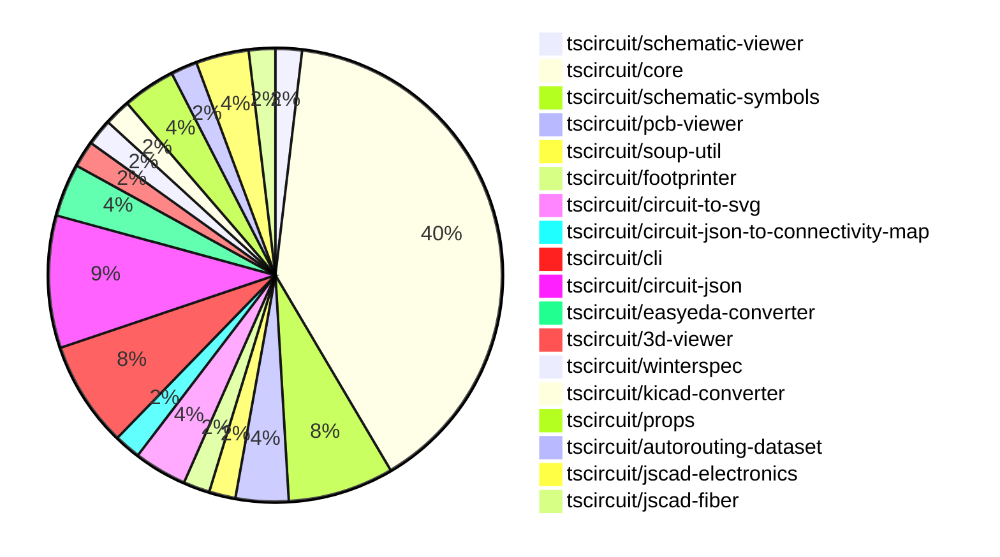

# contribution-tracker

Generates weekly contribution overviews for tscircuit contributors. Check out all
the [contribution overviews here](./contribution-overviews/)

* All PRs in the tscircuit org are scanned/summarized via Claude Haiku
* Claude classifies each Diff/PR as a Major, Minor or Tiny contribution
* All the PRs, summaries, and classifications are organized into charts and tables

The current week is shown below. There are 3 major sections:

* [Contributor Overview](#contributor-overview)
* [PRs by Repository](#prs-by-repository)
* [PRs by Contributor](#changes-by-contributor)

## Current Week

<!-- START_CURRENT_WEEK -->

# Contribution Overview 2024-09-21

## PRs by Repository

## Contributor Overview

| Contributor | 🐳 Major | 🐙 Minor | 🐌 Tiny |
|-------------|-------|-------|-------|
| imrishabh18 | 3 | 3 | 2 |
| ShiboSoftwareDev | 5 | 1 | 0 |
| seveibar | 21 | 14 | 0 |
| andrii-balitskyi | 1 | 0 | 0 |
| abhijitxy | 2 | 1 | 0 |

## Changes by Repository

### [tscircuit/schematic-viewer](https://github.com/tscircuit/schematic-viewer)

| PR # | Impact | Contributor | Description |
|------|--------|-------------|-------------|
| [#62](https://github.com/tscircuit/schematic-viewer/pull/62) | 🐳 Major | imrishabh18 | Update dependencies, including a major version update for the "circuit-json" package. |

### [tscircuit/core](https://github.com/tscircuit/core)

| PR # | Impact | Contributor | Description |
|------|--------|-------------|-------------|
| [#127](https://github.com/tscircuit/core/pull/127) | 🐳 Major | imrishabh18 | Fix the `getSchematicSymbol` method to use the correct key for the `symbols` object. |
| [#110](https://github.com/tscircuit/core/pull/110) | 🐳 Major | ShiboSoftwareDev | The pull request updates the code to use the `circuit-json` library instead of `@tscircuit/soup` and adds a `pcb_trace_id` property to the `via` component. |
| [#123](https://github.com/tscircuit/core/pull/123) | 🐳 Major | seveibar | Refactor component names in the code |
| [#121](https://github.com/tscircuit/core/pull/121) | 🐳 Major | seveibar | Fix the issue of CAD components rendering at the wrong position in 3D. |
| [#114](https://github.com/tscircuit/core/pull/114) | 🐳 Major | seveibar | Allow chips to not have SMT pads or any ports defined. |
| [#113](https://github.com/tscircuit/core/pull/113) | 🐳 Major | seveibar | Add support for `cadModel.rotationOffset` to allow for custom rotation of the CAD model in the circuit layout. |
| [#112](https://github.com/tscircuit/core/pull/112) | 🐳 Major | seveibar | Fix bad flipping to bottom layer when footprint has constraints |
| [#111](https://github.com/tscircuit/core/pull/111) | 🐳 Major | seveibar | Adds support for rotation of 3D CAD components on the PCB. |
| [#108](https://github.com/tscircuit/core/pull/108) | 🐳 Major | seveibar | Add support for flipping primitive components to the bottom layer |
| [#105](https://github.com/tscircuit/core/pull/105) | 🐳 Major | seveibar | Offset the 3D model based on the board thickness |
| [#104](https://github.com/tscircuit/core/pull/104) | 🐳 Major | seveibar | Fix the issue of 3D model always being at (0, 0) by updating the `_getPcbCircuitJsonBounds()` method to use the PCB component's center and dimensions. |
| [#103](https://github.com/tscircuit/core/pull/103) | 🐳 Major | seveibar | Introduce initial implementation of CAD model rendering for PCB components. |
| [#102](https://github.com/tscircuit/core/pull/102) | 🐳 Major | seveibar | Fix routing through holes (holes not recognized as obstacles) |
| [#99](https://github.com/tscircuit/core/pull/99) | 🐳 Major | seveibar | Add support for correct pin positions for schematic box |
| [#119](https://github.com/tscircuit/core/pull/119) | 🐙 Minor | imrishabh18 | Fix Schematic capacitor & resistor symbol |
| [#122](https://github.com/tscircuit/core/pull/122) | 🐙 Minor | seveibar | Manually add a `componentName` property to each component. |
| [#120](https://github.com/tscircuit/core/pull/120) | 🐙 Minor | seveibar | Update the circuit JSON, removing the `convert-units` dependency |
| [#117](https://github.com/tscircuit/core/pull/117) | 🐙 Minor | seveibar | Use the last route point for the `end_pcb_port_id` instead of the first route point. |
| [#116](https://github.com/tscircuit/core/pull/116) | 🐙 Minor | seveibar | Fix the start and end PCB port ID for traces with wire route type. |
| [#97](https://github.com/tscircuit/core/pull/97) | 🐙 Minor | seveibar | Exclude pure TypeScript files from the bundle output |
| [#125](https://github.com/tscircuit/core/pull/125) | 🐌 Tiny | imrishabh18 | Updates the lockfile to the latest versions of dependencies. |

### [tscircuit/schematic-symbols](https://github.com/tscircuit/schematic-symbols)

| PR # | Impact | Contributor | Description |
|------|--------|-------------|-------------|
| [#14](https://github.com/tscircuit/schematic-symbols/pull/14) | 🐳 Major | imrishabh18 | Introduced a new electrical component - the Capacitor, both in horizontal and vertical orientations. |
| [#19](https://github.com/tscircuit/schematic-symbols/pull/19) | 🐙 Minor | imrishabh18 | Refactor the project by reorganizing and renaming certain files and directories. |
| [#17](https://github.com/tscircuit/schematic-symbols/pull/17) | 🐙 Minor | imrishabh18 | Added reference and value text to the capacitor symbol. |
| [#15](https://github.com/tscircuit/schematic-symbols/pull/15) | 🐌 Tiny | imrishabh18 | Fix typecheck issue in the normalize-svg.test.ts file. |

### [tscircuit/pcb-viewer](https://github.com/tscircuit/pcb-viewer)

| PR # | Impact | Contributor | Description |
|------|--------|-------------|-------------|
| [#63](https://github.com/tscircuit/pcb-viewer/pull/63) | 🐳 Major | ShiboSoftwareDev | The change allows the `pcb_via` to be highlighted as part of a connectivity map. |
| [#62](https://github.com/tscircuit/pcb-viewer/pull/62) | 🐳 Major | seveibar | Refactoring to deprecate builder and @tscircuit/soup, add hole test, and add keyboard test. |

### [tscircuit/soup-util](https://github.com/tscircuit/soup-util)

| PR # | Impact | Contributor | Description |
|------|--------|-------------|-------------|
| [#16](https://github.com/tscircuit/soup-util/pull/16) | 🐳 Major | ShiboSoftwareDev | Replaced `@tscircuit/soup` with `circuit-json` and refactored tests from `ava` to `bun:test`. |

### [tscircuit/footprinter](https://github.com/tscircuit/footprinter)

| PR # | Impact | Contributor | Description |
|------|--------|-------------|-------------|
| [#40](https://github.com/tscircuit/footprinter/pull/40) | 🐳 Major | ShiboSoftwareDev | The pull request changes the return type of the `bga`, `cap`, `dfn`, `diode`, and `dip` functions to return an object with `circuitJson` and `parameters` properties instead of just the `circuitJson` array. |

### [tscircuit/circuit-to-svg](https://github.com/tscircuit/circuit-to-svg)

| PR # | Impact | Contributor | Description |
|------|--------|-------------|-------------|
| [#78](https://github.com/tscircuit/circuit-to-svg/pull/78) | 🐳 Major | ShiboSoftwareDev | Moved the imports from `@tscircuit/soup` to `circuit-json` throughout the codebase. |
| [#76](https://github.com/tscircuit/circuit-to-svg/pull/76) | 🐳 Major | seveibar | Reorganize source directory structure to better separate stories, PCB, and schematic functions, and add a basic schematic snapshot test. |

### [tscircuit/circuit-json-to-connectivity-map](https://github.com/tscircuit/circuit-json-to-connectivity-map)

| PR # | Impact | Contributor | Description |
|------|--------|-------------|-------------|
| [#6](https://github.com/tscircuit/circuit-json-to-connectivity-map/pull/6) | 🐙 Minor | ShiboSoftwareDev | Updated the imports to use `circuit-json` instead of `@tscircuit/soup`. |

### [tscircuit/cli](https://github.com/tscircuit/cli)

| PR # | Impact | Contributor | Description |
|------|--------|-------------|-------------|
| [#203](https://github.com/tscircuit/cli/pull/203) | 🐳 Major | seveibar | Update the macrokeypad example with keyswitches working properly and the latest PCB viewer |
| [#202](https://github.com/tscircuit/cli/pull/202) | 🐳 Major | seveibar | Update 3D viewer, core, and PCB viewer. Add switches to keyboard example. |
| [#209](https://github.com/tscircuit/cli/pull/209) | 🐙 Minor | seveibar | Add a GitHub Actions workflow to run tests on Windows |
| [#193](https://github.com/tscircuit/cli/pull/193) | 🐙 Minor | seveibar | Remove the `@tscircuit/builder` dependency and disable the BOM export feature. |

### [tscircuit/circuit-json](https://github.com/tscircuit/circuit-json)

| PR # | Impact | Contributor | Description |
|------|--------|-------------|-------------|
| [#54](https://github.com/tscircuit/circuit-json/pull/54) | 🐳 Major | seveibar | Remove the `convert-units` dependency and implement custom unit conversion logic. |
| [#51](https://github.com/tscircuit/circuit-json/pull/51) | 🐙 Minor | seveibar | Add support for `pcb_trace.route_order_index` field |
| [#53](https://github.com/tscircuit/circuit-json/pull/53) | 🐙 Minor | seveibar | Add new properties `thickness` and `num_layers` to the `PcbBoard` type. |
| [#52](https://github.com/tscircuit/circuit-json/pull/52) | 🐙 Minor | seveibar | Add the `is_mirrored` field to the `PcbSilkscreenText` type. |
| [#50](https://github.com/tscircuit/circuit-json/pull/50) | 🐙 Minor | seveibar | Add an optional `pcb_trace_id` field to the `PcbViaParams` and `PcbVia` types. |

### [tscircuit/easyeda-converter](https://github.com/tscircuit/easyeda-converter)

| PR # | Impact | Contributor | Description |
|------|--------|-------------|-------------|
| [#41](https://github.com/tscircuit/easyeda-converter/pull/41) | 🐳 Major | seveibar | Improve type names and typing in the code |
| [#40](https://github.com/tscircuit/easyeda-converter/pull/40) | 🐳 Major | andrii-balitskyi | Fix parsing `ARC` package detail shape |

### [tscircuit/3d-viewer](https://github.com/tscircuit/3d-viewer)

| PR # | Impact | Contributor | Description |
|------|--------|-------------|-------------|
| [#21](https://github.com/tscircuit/3d-viewer/pull/21) | 🐳 Major | seveibar | Fixed the issue where the board width and height were swapped, and removed the `@tscircuit/builder` dependency. |

### [tscircuit/winterspec](https://github.com/tscircuit/winterspec)

| PR # | Impact | Contributor | Description |
|------|--------|-------------|-------------|
| [#9](https://github.com/tscircuit/winterspec/pull/9) | 🐳 Major | seveibar | Fix a bug in input validation for `commonParams` when `jsonBody` is not provided. |

### [tscircuit/kicad-converter](https://github.com/tscircuit/kicad-converter)

| PR # | Impact | Contributor | Description |
|------|--------|-------------|-------------|
| [#10](https://github.com/tscircuit/kicad-converter/pull/10) | 🐳 Major | seveibar | Add support for net IDs in the generated KiCad PCB |

### [tscircuit/props](https://github.com/tscircuit/props)

| PR # | Impact | Contributor | Description |
|------|--------|-------------|-------------|
| [#53](https://github.com/tscircuit/props/pull/53) | 🐙 Minor | seveibar | Add `originalLayer` property to `FootprintProps` interface and refactor related code. |
| [#52](https://github.com/tscircuit/props/pull/52) | 🐙 Minor | seveibar | Add export for `cadModel` module |

### [tscircuit/autorouting-dataset](https://github.com/tscircuit/autorouting-dataset)

| PR # | Impact | Contributor | Description |
|------|--------|-------------|-------------|
| [#79](https://github.com/tscircuit/autorouting-dataset/pull/79) | 🐙 Minor | seveibar | Adds support for `pcb_hole` with `hole_shape` as "circle" when deriving obstacles. |

### [tscircuit/jscad-electronics](https://github.com/tscircuit/jscad-electronics)

| PR # | Impact | Contributor | Description |
|------|--------|-------------|-------------|
| [#40](https://github.com/tscircuit/jscad-electronics/pull/40) | 🐳 Major | abhijitxy | Implemented QFP80 component |
| [#38](https://github.com/tscircuit/jscad-electronics/pull/38) | 🐳 Major | abhijitxy | Implemented the BGA100 component |

### [tscircuit/jscad-fiber](https://github.com/tscircuit/jscad-fiber)

| PR # | Impact | Contributor | Description |
|------|--------|-------------|-------------|
| [#75](https://github.com/tscircuit/jscad-fiber/pull/75) | 🐙 Minor | abhijitxy | Add a new `showGrid` prop to the `JsCadFixture` component to control the visibility of the grid in the 3D scene. |

## Changes by Contributor

### [imrishabh18](https://github.com/imrishabh18)

| PR # | Impact | Description |
|------|--------|-------------|
| [#62](https://github.com/tscircuit/schematic-viewer/pull/62) | 🐳 Major | Update dependencies, including a major version update for the "circuit-json" package. |
| [#127](https://github.com/tscircuit/core/pull/127) | 🐳 Major | Fix the `getSchematicSymbol` method to use the correct key for the `symbols` object. |
| [#14](https://github.com/tscircuit/schematic-symbols/pull/14) | 🐳 Major | Introduced a new electrical component - the Capacitor, both in horizontal and vertical orientations. |
| [#119](https://github.com/tscircuit/core/pull/119) | 🐙 Minor | Fix Schematic capacitor & resistor symbol |
| [#19](https://github.com/tscircuit/schematic-symbols/pull/19) | 🐙 Minor | Refactor the project by reorganizing and renaming certain files and directories. |
| [#17](https://github.com/tscircuit/schematic-symbols/pull/17) | 🐙 Minor | Added reference and value text to the capacitor symbol. |
| [#125](https://github.com/tscircuit/core/pull/125) | 🐌 Tiny | Updates the lockfile to the latest versions of dependencies. |
| [#15](https://github.com/tscircuit/schematic-symbols/pull/15) | 🐌 Tiny | Fix typecheck issue in the normalize-svg.test.ts file. |

### [ShiboSoftwareDev](https://github.com/ShiboSoftwareDev)

| PR # | Impact | Description |
|------|--------|-------------|
| [#63](https://github.com/tscircuit/pcb-viewer/pull/63) | 🐳 Major | The change allows the `pcb_via` to be highlighted as part of a connectivity map. |
| [#16](https://github.com/tscircuit/soup-util/pull/16) | 🐳 Major | Replaced `@tscircuit/soup` with `circuit-json` and refactored tests from `ava` to `bun:test`. |
| [#40](https://github.com/tscircuit/footprinter/pull/40) | 🐳 Major | The pull request changes the return type of the `bga`, `cap`, `dfn`, `diode`, and `dip` functions to return an object with `circuitJson` and `parameters` properties instead of just the `circuitJson` array. |
| [#110](https://github.com/tscircuit/core/pull/110) | 🐳 Major | The pull request updates the code to use the `circuit-json` library instead of `@tscircuit/soup` and adds a `pcb_trace_id` property to the `via` component. |
| [#78](https://github.com/tscircuit/circuit-to-svg/pull/78) | 🐳 Major | Moved the imports from `@tscircuit/soup` to `circuit-json` throughout the codebase. |
| [#6](https://github.com/tscircuit/circuit-json-to-connectivity-map/pull/6) | 🐙 Minor | Updated the imports to use `circuit-json` instead of `@tscircuit/soup`. |

### [seveibar](https://github.com/seveibar)

| PR # | Impact | Description |
|------|--------|-------------|
| [#62](https://github.com/tscircuit/pcb-viewer/pull/62) | 🐳 Major | Refactoring to deprecate builder and @tscircuit/soup, add hole test, and add keyboard test. |
| [#203](https://github.com/tscircuit/cli/pull/203) | 🐳 Major | Update the macrokeypad example with keyswitches working properly and the latest PCB viewer |
| [#202](https://github.com/tscircuit/cli/pull/202) | 🐳 Major | Update 3D viewer, core, and PCB viewer. Add switches to keyboard example. |
| [#54](https://github.com/tscircuit/circuit-json/pull/54) | 🐳 Major | Remove the `convert-units` dependency and implement custom unit conversion logic. |
| [#41](https://github.com/tscircuit/easyeda-converter/pull/41) | 🐳 Major | Improve type names and typing in the code |
| [#21](https://github.com/tscircuit/3d-viewer/pull/21) | 🐳 Major | Fixed the issue where the board width and height were swapped, and removed the `@tscircuit/builder` dependency. |
| [#9](https://github.com/tscircuit/winterspec/pull/9) | 🐳 Major | Fix a bug in input validation for `commonParams` when `jsonBody` is not provided. |
| [#123](https://github.com/tscircuit/core/pull/123) | 🐳 Major | Refactor component names in the code |
| [#121](https://github.com/tscircuit/core/pull/121) | 🐳 Major | Fix the issue of CAD components rendering at the wrong position in 3D. |
| [#114](https://github.com/tscircuit/core/pull/114) | 🐳 Major | Allow chips to not have SMT pads or any ports defined. |
| [#113](https://github.com/tscircuit/core/pull/113) | 🐳 Major | Add support for `cadModel.rotationOffset` to allow for custom rotation of the CAD model in the circuit layout. |
| [#112](https://github.com/tscircuit/core/pull/112) | 🐳 Major | Fix bad flipping to bottom layer when footprint has constraints |
| [#111](https://github.com/tscircuit/core/pull/111) | 🐳 Major | Adds support for rotation of 3D CAD components on the PCB. |
| [#108](https://github.com/tscircuit/core/pull/108) | 🐳 Major | Add support for flipping primitive components to the bottom layer |
| [#105](https://github.com/tscircuit/core/pull/105) | 🐳 Major | Offset the 3D model based on the board thickness |
| [#104](https://github.com/tscircuit/core/pull/104) | 🐳 Major | Fix the issue of 3D model always being at (0, 0) by updating the `_getPcbCircuitJsonBounds()` method to use the PCB component's center and dimensions. |
| [#103](https://github.com/tscircuit/core/pull/103) | 🐳 Major | Introduce initial implementation of CAD model rendering for PCB components. |
| [#102](https://github.com/tscircuit/core/pull/102) | 🐳 Major | Fix routing through holes (holes not recognized as obstacles) |
| [#99](https://github.com/tscircuit/core/pull/99) | 🐳 Major | Add support for correct pin positions for schematic box |
| [#76](https://github.com/tscircuit/circuit-to-svg/pull/76) | 🐳 Major | Reorganize source directory structure to better separate stories, PCB, and schematic functions, and add a basic schematic snapshot test. |
| [#10](https://github.com/tscircuit/kicad-converter/pull/10) | 🐳 Major | Add support for net IDs in the generated KiCad PCB |
| [#209](https://github.com/tscircuit/cli/pull/209) | 🐙 Minor | Add a GitHub Actions workflow to run tests on Windows |
| [#193](https://github.com/tscircuit/cli/pull/193) | 🐙 Minor | Remove the `@tscircuit/builder` dependency and disable the BOM export feature. |
| [#51](https://github.com/tscircuit/circuit-json/pull/51) | 🐙 Minor | Add support for `pcb_trace.route_order_index` field |
| [#53](https://github.com/tscircuit/circuit-json/pull/53) | 🐙 Minor | Add new properties `thickness` and `num_layers` to the `PcbBoard` type. |
| [#52](https://github.com/tscircuit/circuit-json/pull/52) | 🐙 Minor | Add the `is_mirrored` field to the `PcbSilkscreenText` type. |
| [#50](https://github.com/tscircuit/circuit-json/pull/50) | 🐙 Minor | Add an optional `pcb_trace_id` field to the `PcbViaParams` and `PcbVia` types. |
| [#53](https://github.com/tscircuit/props/pull/53) | 🐙 Minor | Add `originalLayer` property to `FootprintProps` interface and refactor related code. |
| [#52](https://github.com/tscircuit/props/pull/52) | 🐙 Minor | Add export for `cadModel` module |
| [#122](https://github.com/tscircuit/core/pull/122) | 🐙 Minor | Manually add a `componentName` property to each component. |
| [#120](https://github.com/tscircuit/core/pull/120) | 🐙 Minor | Update the circuit JSON, removing the `convert-units` dependency |
| [#117](https://github.com/tscircuit/core/pull/117) | 🐙 Minor | Use the last route point for the `end_pcb_port_id` instead of the first route point. |
| [#116](https://github.com/tscircuit/core/pull/116) | 🐙 Minor | Fix the start and end PCB port ID for traces with wire route type. |
| [#97](https://github.com/tscircuit/core/pull/97) | 🐙 Minor | Exclude pure TypeScript files from the bundle output |
| [#79](https://github.com/tscircuit/autorouting-dataset/pull/79) | 🐙 Minor | Adds support for `pcb_hole` with `hole_shape` as "circle" when deriving obstacles. |

### [andrii-balitskyi](https://github.com/andrii-balitskyi)

| PR # | Impact | Description |
|------|--------|-------------|
| [#40](https://github.com/tscircuit/easyeda-converter/pull/40) | 🐳 Major | Fix parsing `ARC` package detail shape |

### [abhijitxy](https://github.com/abhijitxy)

| PR # | Impact | Description |
|------|--------|-------------|
| [#40](https://github.com/tscircuit/jscad-electronics/pull/40) | 🐳 Major | Implemented QFP80 component |
| [#38](https://github.com/tscircuit/jscad-electronics/pull/38) | 🐳 Major | Implemented the BGA100 component |
| [#75](https://github.com/tscircuit/jscad-fiber/pull/75) | 🐙 Minor | Add a new `showGrid` prop to the `JsCadFixture` component to control the visibility of the grid in the 3D scene. |

<!-- END_CURRENT_WEEK -->
