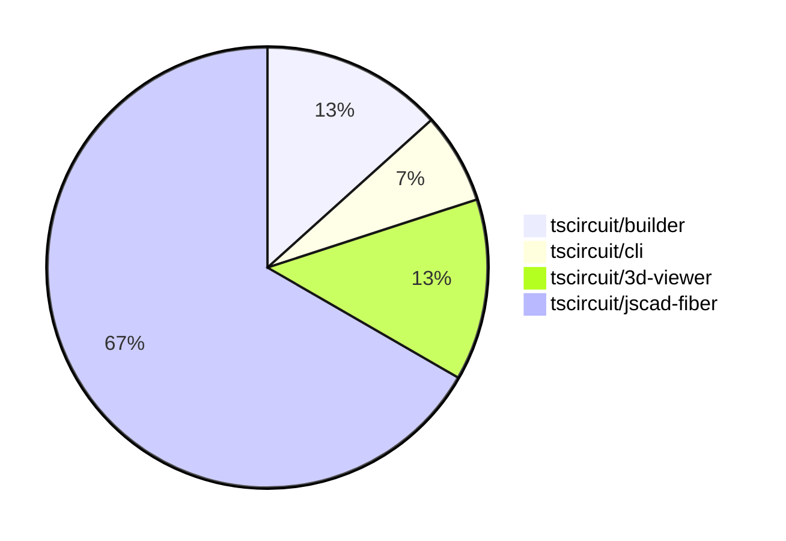

# contribution-tracker

Generates weekly contribution overviews for tscircuit contributors. Check out all
the [contribution overviews here](./contribution-overviews/)

* All PRs in the tscircuit org are scanned/summarized via Claude Haiku
* Claude classifies each Diff/PR as a Major, Minor or Tiny contribution
* All the PRs, summaries, and classifications are organized into charts and tables

The current week is shown below. There are 3 major sections:

* [Contributor Overview](#contributor-overview)
* [PRs by Repository](#prs-by-repository)
* [PRs by Contributor](#changes-by-contributor)

## Current Week

<!-- START_CURRENT_WEEK -->

# Contribution Overview 2024-08-03

## PRs by Repository

## Contributor Overview

| Contributor | 🐳 Major | 🐙 Minor | 🐌 Tiny |
|-------------|-------|-------|-------|
| seveibar | 0 | 1 | 0 |
| imrishabh18 | 3 | 1 | 0 |
| Slaviiiii | 3 | 7 | 0 |

## Changes by Repository

### [tscircuit/builder](https://github.com/tscircuit/builder)

| PR # | Impact | Contributor | Description |
|------|--------|-------------|-------------|
| [#95](https://github.com/tscircuit/builder/pull/95) | 🐳 Major | imrishabh18 | Fix the issue of not centering the component when only one position prop is provided. |
| [#96](https://github.com/tscircuit/builder/pull/96) | 🐙 Minor | seveibar | Add code owners for the repository |

### [tscircuit/cli](https://github.com/tscircuit/cli)

| PR # | Impact | Contributor | Description |
|------|--------|-------------|-------------|
| [#117](https://github.com/tscircuit/cli/pull/117) | 🐳 Major | imrishabh18 | Add a debug button to the menu |

### [tscircuit/3d-viewer](https://github.com/tscircuit/3d-viewer)

| PR # | Impact | Contributor | Description |
|------|--------|-------------|-------------|
| [#11](https://github.com/tscircuit/3d-viewer/pull/11) | 🐳 Major | imrishabh18 | Added better error handling for bad URLs in the useGlobalObjLoader hook. |
| [#12](https://github.com/tscircuit/3d-viewer/pull/12) | 🐙 Minor | imrishabh18 | Fix the overlap issue of the top left cube in the 3D scene. |

### [tscircuit/jscad-fiber](https://github.com/tscircuit/jscad-fiber)

| PR # | Impact | Contributor | Description |
|------|--------|-------------|-------------|
| [#61](https://github.com/tscircuit/jscad-fiber/pull/61) | 🐳 Major | Slaviiiii | Wrap the `RoundedCuboid` component with a color wrapper to allow setting the color of the cuboid. |
| [#60](https://github.com/tscircuit/jscad-fiber/pull/60) | 🐳 Major | Slaviiiii | Wrap the `Cube` component with `withColorProp` and `withOffsetProp` higher-order components to add support for `color` and `center` props. |
| [#58](https://github.com/tscircuit/jscad-fiber/pull/58) | 🐳 Major | Slaviiiii | Wrap `ExtrudeRectangular` component with `withColorProp` and `withOffsetProp` HOCs to add color and offset functionality. |
| [#64](https://github.com/tscircuit/jscad-fiber/pull/64) | 🐙 Minor | Slaviiiii | Wrap `CylinderElliptic` component with `withColorProp` and `withOffsetProp` wrappers |
| [#65](https://github.com/tscircuit/jscad-fiber/pull/65) | 🐙 Minor | Slaviiiii | Wrap the `Ellipsoid` component with `withColorProp` and `withOffsetProp` to add color and center properties. |
| [#63](https://github.com/tscircuit/jscad-fiber/pull/63) | 🐙 Minor | Slaviiiii | Adds color and center properties to the RoundedCylinder component, wrapping it with higher-order components. |
| [#62](https://github.com/tscircuit/jscad-fiber/pull/62) | 🐙 Minor | Slaviiiii | Add color and center offset options to the Cylinder component. |
| [#59](https://github.com/tscircuit/jscad-fiber/pull/59) | 🐙 Minor | Slaviiiii | Wrap ExtrudeRotate component with `withColorProp` and `withOffsetProp` wrappers |
| [#56](https://github.com/tscircuit/jscad-fiber/pull/56) | 🐙 Minor | Slaviiiii | Wrap the ExtrudeHelical component with withColorProp and withOffsetProp wrapper functions to add color and offset properties. |
| [#57](https://github.com/tscircuit/jscad-fiber/pull/57) | 🐙 Minor | Slaviiiii | Wrap the `ExtrudeLinear` component with higher-order components to add support for color and offset properties. |

## Changes by Contributor

### [seveibar](https://github.com/seveibar)

| PR # | Impact | Description |
|------|--------|-------------|
| [#96](https://github.com/tscircuit/builder/pull/96) | 🐙 Minor | Add code owners for the repository |

### [imrishabh18](https://github.com/imrishabh18)

| PR # | Impact | Description |
|------|--------|-------------|
| [#95](https://github.com/tscircuit/builder/pull/95) | 🐳 Major | Fix the issue of not centering the component when only one position prop is provided. |
| [#117](https://github.com/tscircuit/cli/pull/117) | 🐳 Major | Add a debug button to the menu |
| [#11](https://github.com/tscircuit/3d-viewer/pull/11) | 🐳 Major | Added better error handling for bad URLs in the useGlobalObjLoader hook. |
| [#12](https://github.com/tscircuit/3d-viewer/pull/12) | 🐙 Minor | Fix the overlap issue of the top left cube in the 3D scene. |

### [Slaviiiii](https://github.com/Slaviiiii)

| PR # | Impact | Description |
|------|--------|-------------|
| [#61](https://github.com/tscircuit/jscad-fiber/pull/61) | 🐳 Major | Wrap the `RoundedCuboid` component with a color wrapper to allow setting the color of the cuboid. |
| [#60](https://github.com/tscircuit/jscad-fiber/pull/60) | 🐳 Major | Wrap the `Cube` component with `withColorProp` and `withOffsetProp` higher-order components to add support for `color` and `center` props. |
| [#58](https://github.com/tscircuit/jscad-fiber/pull/58) | 🐳 Major | Wrap `ExtrudeRectangular` component with `withColorProp` and `withOffsetProp` HOCs to add color and offset functionality. |
| [#64](https://github.com/tscircuit/jscad-fiber/pull/64) | 🐙 Minor | Wrap `CylinderElliptic` component with `withColorProp` and `withOffsetProp` wrappers |
| [#65](https://github.com/tscircuit/jscad-fiber/pull/65) | 🐙 Minor | Wrap the `Ellipsoid` component with `withColorProp` and `withOffsetProp` to add color and center properties. |
| [#63](https://github.com/tscircuit/jscad-fiber/pull/63) | 🐙 Minor | Adds color and center properties to the RoundedCylinder component, wrapping it with higher-order components. |
| [#62](https://github.com/tscircuit/jscad-fiber/pull/62) | 🐙 Minor | Add color and center offset options to the Cylinder component. |
| [#59](https://github.com/tscircuit/jscad-fiber/pull/59) | 🐙 Minor | Wrap ExtrudeRotate component with `withColorProp` and `withOffsetProp` wrappers |
| [#56](https://github.com/tscircuit/jscad-fiber/pull/56) | 🐙 Minor | Wrap the ExtrudeHelical component with withColorProp and withOffsetProp wrapper functions to add color and offset properties. |
| [#57](https://github.com/tscircuit/jscad-fiber/pull/57) | 🐙 Minor | Wrap the `ExtrudeLinear` component with higher-order components to add support for color and offset properties. |

<!-- END_CURRENT_WEEK -->
