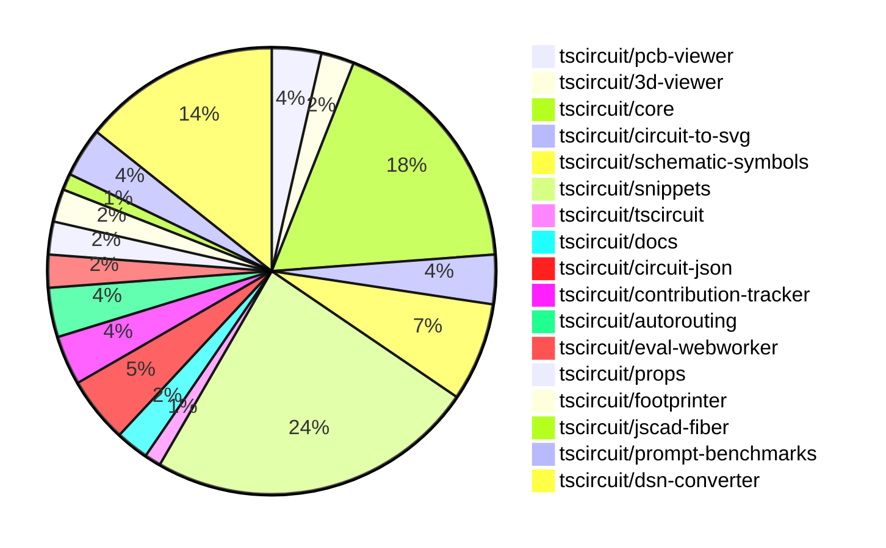

# contribution-tracker

Generates weekly contribution overviews for tscircuit contributors. Check out all
the [contribution overviews here](./contribution-overviews/)

* All PRs in the tscircuit org are scanned/summarized via Claude Haiku
* Claude classifies each Diff/PR as a Major, Minor or Tiny contribution
* All the PRs, summaries, and classifications are organized into charts and tables

The current week is shown below. There are 3 major sections:

* [Contributor Overview](#contributor-overview)
* [PRs by Repository](#prs-by-repository)
* [PRs by Contributor](#changes-by-contributor)

## Current Week

<!-- START_CURRENT_WEEK -->

# Contribution Overview 2024-12-04

## PRs by Repository

## Contributor Overview

| Contributor | 🐳 Major | 🐙 Minor | 🐌 Tiny | ⭐ | Issues Created |
|-------------|---------|---------|---------|-----|----------------|
| [imrishabh18](#imrishabh18) | 5 | 13 | 2 | 👑 | 13 |
| [seveibar](#seveibar) | 4 | 10 | 1 | 👑 | 78 |
| [ShiboSoftwareDev](#ShiboSoftwareDev) | 1 | 9 | 3 | ⭐⭐⭐ | 7 |
| [Abse2001](#Abse2001) | 0 | 9 | 1 | ⭐⭐ | 6 |
| [AnasSarkiz](#AnasSarkiz) | 3 | 4 | 0 | ⭐⭐ | 3 |
| [Anshgrover23](#Anshgrover23) | 1 | 5 | 0 | ⭐⭐ | 1 |
| [RohittCodes](#RohittCodes) | 2 | 3 | 0 | ⭐⭐ | 2 |
| [devin-ai-integration[bot]](#devin-ai-integration[bot]) | 0 | 2 | 0 | ⭐ | 0 |
| [techmannih](#techmannih) | 0 | 2 | 0 | ⭐ | 1 |
| [samyakshah3008](#samyakshah3008) | 0 | 1 | 1 |  | 2 |
| [ni9999](#ni9999) | 0 | 1 | 0 |  | 0 |
| [mrudulpatil18](#mrudulpatil18) | 0 | 1 | 0 |  | 0 |

## Review Table

[reviews-received-hover]: ## "Number of reviews received for PRs for this contributor"
[approvals-received-hover]: ## "Number of approvals received for PRs this contributor authored"
[rejections-received-hover]: ## "Number of rejections received for PRs this contributor authored"
[prs-opened-hover]: ## "Number of PRs opened by this contributor"
[issues-created-hover]: ## "Number of issues created by this contributor"
[bountied-issues-hover]: ## "Number of issues this contributor created with a bounty"
[bountied-issue-$-hover]: ## "Total bounty amount placed on issues authored by this contributor"

| Contributor | Reviews Received | Approvals Received | Rejections Received | PRs Opened | PRs Merged | Issues Created | Bountied Issues | Bountied Issue $ |
|---|---|---|---|---|---|---|---|---|
| [Abse2001](#Abse2001) | 17 | 10 | 1 | 10 | 10 | 6 | 3 | 57 |
| [seveibar](#seveibar) | 0 | 0 | 0 | 21 | 15 | 78 | 49 | 1300 |
| [samyakshah3008](#samyakshah3008) | 7 | 2 | 1 | 2 | 2 | 2 | 1 | 1 |
| [imrishabh18](#imrishabh18) | 5 | 2 | 0 | 23 | 20 | 13 | 6 | 85 |
| [devin-ai-integration[bot]](#devin-ai-integration[bot]) | 7 | 3 | 4 | 8 | 2 | 0 | 0 | 0 |
| [AnasSarkiz](#AnasSarkiz) | 27 | 7 | 3 | 9 | 7 | 3 | 0 | 0 |
| [techmannih](#techmannih) | 6 | 2 | 1 | 4 | 2 | 1 | 0 | 0 |
| [ShiboSoftwareDev](#ShiboSoftwareDev) | 16 | 10 | 3 | 14 | 13 | 7 | 3 | 70 |
| [UdaykiranRegimudi](#UdaykiranRegimudi) | 2 | 0 | 2 | 1 | 0 | 0 | 0 | 0 |
| [RohittCodes](#RohittCodes) | 28 | 6 | 9 | 8 | 5 | 2 | 1 | 5 |
| [divanshu-go](#divanshu-go) | 3 | 0 | 1 | 1 | 0 | 0 | 0 | 0 |
| [Anshgrover23](#Anshgrover23) | 20 | 8 | 2 | 7 | 6 | 1 | 0 | 0 |
| [ni9999](#ni9999) | 5 | 1 | 2 | 1 | 1 | 0 | 0 | 0 |
| [mrudulpatil18](#mrudulpatil18) | 1 | 1 | 0 | 1 | 1 | 0 | 0 | 0 |
| [aybanda](#aybanda) | 5 | 0 | 1 | 1 | 0 | 0 | 0 | 0 |

## Changes by Repository

### [tscircuit/pcb-viewer](https://github.com/tscircuit/pcb-viewer)

| PR # | Impact | Contributor | Description |
|------|--------|-------------|-------------|
| [#88](https://github.com/tscircuit/pcb-viewer/pull/88) | 🐙 Minor | Abse2001 | Fixed the text rotation of the `ElementOverlayBox` component. |
| [#86](https://github.com/tscircuit/pcb-viewer/pull/86) | 🐙 Minor | Abse2001 | Fixes the rotation of PCB pads, and updates the ElementOverlayBox to follow the PCB parent rotation. |
| [#90](https://github.com/tscircuit/pcb-viewer/pull/90) | 🐌 Tiny | Abse2001 | Removed unwanted textShadow from the ElementOverlayBox component. |

### [tscircuit/3d-viewer](https://github.com/tscircuit/3d-viewer)

| PR # | Impact | Contributor | Description |
|------|--------|-------------|-------------|
| [#52](https://github.com/tscircuit/3d-viewer/pull/52) | 🐙 Minor | Abse2001 | Refactors the `CadViewer` component to handle hovering over 3D components more robustly, improving the tooltip behavior. |
| [#53](https://github.com/tscircuit/3d-viewer/pull/53) | 🐙 Minor | seveibar | Updates dependencies and adds a Renovate configuration file. |

### [tscircuit/core](https://github.com/tscircuit/core)

| PR # | Impact | Contributor | Description |
|------|--------|-------------|-------------|
| [#409](https://github.com/tscircuit/core/pull/409) | 🐳 Major | AnasSarkiz | Implemented a new `pcbDisabled` option in the `Circuit.ts` file to disable all PCB elements. |
| [#397](https://github.com/tscircuit/core/pull/397) | 🐳 Major | AnasSarkiz | Adds automatic schematic net labeling for passive-chip for complex traces. |
| [#396](https://github.com/tscircuit/core/pull/396) | 🐙 Minor | Abse2001 | Fixing JSX type module for React 19 types |
| [#381](https://github.com/tscircuit/core/pull/381) | 🐙 Minor | Abse2001 | Adds a new prop `schDisplayLabel` to the `<trace />` component and a test case for it. |
| [#415](https://github.com/tscircuit/core/pull/415) | 🐙 Minor | seveibar | Update the version of the `circuit-json` dependency from `0.0.108` to `0.0.114`. |
| [#414](https://github.com/tscircuit/core/pull/414) | 🐙 Minor | seveibar | Adds a condition to only output size reports if the `package.json` file was changed. |
| [#391](https://github.com/tscircuit/core/pull/391) | 🐙 Minor | seveibar | Improves the error message for missing footprint errors by using the component's string representation instead of just the name. |
| [#395](https://github.com/tscircuit/core/pull/395) | 🐙 Minor | ShiboSoftwareDev | Updated dependencies in the project |
| [#393](https://github.com/tscircuit/core/pull/393) | 🐙 Minor | ShiboSoftwareDev | Update dependencies for the project |
| [#407](https://github.com/tscircuit/core/pull/407) | 🐙 Minor | imrishabh18 | Calculates the size of the components before rendering the trace. |
| [#406](https://github.com/tscircuit/core/pull/406) | 🐙 Minor | imrishabh18 | Reverts the fix for passing the rendered circuit JSON to the autorouter. |
| [#405](https://github.com/tscircuit/core/pull/405) | 🐙 Minor | imrishabh18 | Fix the issue where the width and height of the rendered circuit JSON were not being passed to the autorouter. |
| [#400](https://github.com/tscircuit/core/pull/400) | 🐙 Minor | imrishabh18 | Fix missing oval shape in the PCB render |
| [#401](https://github.com/tscircuit/core/pull/401) | 🐌 Tiny | ShiboSoftwareDev | Updates the dependency "@tscircuit/infgrid-ijump-astar" to version 0.0.26 |
| [#394](https://github.com/tscircuit/core/pull/394) | 🐌 Tiny | ShiboSoftwareDev | Updated the version of the `@tscircuit/footprinter` dependency from `0.0.91` to `0.0.92`. |

### [tscircuit/circuit-to-svg](https://github.com/tscircuit/circuit-to-svg)

| PR # | Impact | Contributor | Description |
|------|--------|-------------|-------------|
| [#144](https://github.com/tscircuit/circuit-to-svg/pull/144) | 🐙 Minor | Abse2001 | Adds a function to create symbols using `schematic_net_label.symbol_name`. |
| [#142](https://github.com/tscircuit/circuit-to-svg/pull/142) | 🐙 Minor | AnasSarkiz | Adds metadata attributes and a `<g>` wrapper for draggable schematic components in the SVG representation. |
| [#143](https://github.com/tscircuit/circuit-to-svg/pull/143) | 🐙 Minor | ShiboSoftwareDev | Update dependencies to newer versions |

### [tscircuit/schematic-symbols](https://github.com/tscircuit/schematic-symbols)

| PR # | Impact | Contributor | Description |
|------|--------|-------------|-------------|
| [#221](https://github.com/tscircuit/schematic-symbols/pull/221) | 🐙 Minor | Abse2001 | Added new symbols for boxresistor in different orientations (down, left, right, up) and fixed the anchor position of the text. |
| [#219](https://github.com/tscircuit/schematic-symbols/pull/219) | 🐙 Minor | Abse2001 | Adjusted the coordinates of the REF and VAL text elements for the capacitor symbol. |
| [#217](https://github.com/tscircuit/schematic-symbols/pull/217) | 🐙 Minor | AnasSarkiz | Added inductor icons for left, down, right, and up directions instead of just horizontal and vertical. |
| [#223](https://github.com/tscircuit/schematic-symbols/pull/223) | 🐙 Minor | Anshgrover23 | Adds a GitHub Actions workflow to validate Bun snapshots. |
| [#222](https://github.com/tscircuit/schematic-symbols/pull/222) | 🐙 Minor | Anshgrover23 | Adds a script to validate the existence of SVG snapshots for all symbols, and a pre-commit hook to run the validation before committing. |
| [#210](https://github.com/tscircuit/schematic-symbols/pull/210) | 🐙 Minor | ni9999 | Adds a new 4-pin crystal symbol |

### [tscircuit/snippets](https://github.com/tscircuit/snippets)

| PR # | Impact | Contributor | Description |
|------|--------|-------------|-------------|
| [#269](https://github.com/tscircuit/snippets/pull/269) | 🐳 Major | RohittCodes | Refactored the `manual_edit_json` template ingestion into the database and added manual JSON validation and Playwright tests. |
| [#327](https://github.com/tscircuit/snippets/pull/327) | 🐳 Major | RohittCodes | Expands the preview content to the full height of the screen or container, with a minimum height of 300px. |
| [#356](https://github.com/tscircuit/snippets/pull/356) | 🐙 Minor | Abse2001 | Fixes React 19 types by updating the "@tscircuit/core" dependency. |
| [#363](https://github.com/tscircuit/snippets/pull/363) | 🐙 Minor | seveibar | Reduces the number of retries for Playwright tests in CI environments and disables the ability to manually edit code snippets in the sidebar. |
| [#358](https://github.com/tscircuit/snippets/pull/358) | 🐙 Minor | seveibar | Update the `dsn-converter` dependency to version `^0.0.38` and add it to the autoupdate list in `renovate.json`. |
| [#355](https://github.com/tscircuit/snippets/pull/355) | 🐙 Minor | seveibar | Adds a new dialog component to view TypeScript files in the code editor. |
| [#339](https://github.com/tscircuit/snippets/pull/339) | 🐙 Minor | ShiboSoftwareDev | Automatically runs the code whenever the user enters any editor. |
| [#373](https://github.com/tscircuit/snippets/pull/373) | 🐙 Minor | imrishabh18 | Reverts a previous update to the `@tscircuit/core` dependency from `0.0.223` to `0.0.221`. |
| [#372](https://github.com/tscircuit/snippets/pull/372) | 🐙 Minor | imrishabh18 | Update the "@tscircuit/core" dependency to version 0.0.223 |
| [#365](https://github.com/tscircuit/snippets/pull/365) | 🐙 Minor | Anshgrover23 | Split the `footprint-dialog.spec.ts` file into multiple files for better organization and maintainability. |
| [#351](https://github.com/tscircuit/snippets/pull/351) | 🐙 Minor | Anshgrover23 | Fixes the regular expression to support underscores in package names. |
| [#307](https://github.com/tscircuit/snippets/pull/307) | 🐙 Minor | RohittCodes | Refactor the search links to handle different use cases (open in new tab or current tab) based on the current location. |
| [#297](https://github.com/tscircuit/snippets/pull/297) | 🐙 Minor | RohittCodes | Introduces a finally block and a timeout to the rename snippet feature. |
| [#341](https://github.com/tscircuit/snippets/pull/341) | 🐙 Minor | RohittCodes | Increase the timeout for Playwright tests from 5 minutes to 10 minutes. |
| [#350](https://github.com/tscircuit/snippets/pull/350) | 🐙 Minor | techmannih | Add retries for flaky test |
| [#338](https://github.com/tscircuit/snippets/pull/338) | 🐙 Minor | techmannih | Fixes the issue where multiple cursors are triggered when `ctrl+click` is used. |
| [#330](https://github.com/tscircuit/snippets/pull/330) | 🐙 Minor | mrudulpatil18 | Added a static skeleton page with fixed data. |
| [#357](https://github.com/tscircuit/snippets/pull/357) | 🐌 Tiny | seveibar | Update Playwright snapshots |
| [#375](https://github.com/tscircuit/snippets/pull/375) | 🐌 Tiny | imrishabh18 | Update the version of the `@tscircuit/core` dependency from `0.0.223` to `0.0.225`. |
| [#369](https://github.com/tscircuit/snippets/pull/369) | 🐌 Tiny | imrishabh18 | Update the version of the `dsn-converter` dependency from `0.0.39` to `0.0.41`. |

### [tscircuit/tscircuit](https://github.com/tscircuit/tscircuit)

| PR # | Impact | Contributor | Description |
|------|--------|-------------|-------------|
| [#484](https://github.com/tscircuit/tscircuit/pull/484) | 🐙 Minor | samyakshah3008 | The pull request enhances the README file with additional sections and information, and also adds a contributing guide. |

### [tscircuit/docs](https://github.com/tscircuit/docs)

| PR # | Impact | Contributor | Description |
|------|--------|-------------|-------------|
| [#43](https://github.com/tscircuit/docs/pull/43) | 🐳 Major | AnasSarkiz | Added a new tutorial for creating a development board using the ESP32-D0WD microcontroller with essential supporting components. |
| [#49](https://github.com/tscircuit/docs/pull/49) | 🐌 Tiny | samyakshah3008 | Fixes the incorrect LinkedIn URL in the footer socials |

### [tscircuit/circuit-json](https://github.com/tscircuit/circuit-json)

| PR # | Impact | Contributor | Description |
|------|--------|-------------|-------------|
| [#85](https://github.com/tscircuit/circuit-json/pull/85) | 🐳 Major | seveibar | Introduce a new schematic element called "schematic_voltage_probe" that can be used to measure voltage on a schematic trace. |
| [#89](https://github.com/tscircuit/circuit-json/pull/89) | 🐙 Minor | seveibar | Adds information about base units and element prefixes used in the project. |
| [#86](https://github.com/tscircuit/circuit-json/pull/86) | 🐙 Minor | seveibar | Adds readme generation and improves the documentation for the Circuit JSON specification. |
| [#88](https://github.com/tscircuit/circuit-json/pull/88) | 🐙 Minor | devin-ai-integration[bot] | Adds a new error type for conflicts between manual edits and explicit PCB coordinates. |

### [tscircuit/contribution-tracker](https://github.com/tscircuit/contribution-tracker)

| PR # | Impact | Contributor | Description |
|------|--------|-------------|-------------|
| [#22](https://github.com/tscircuit/contribution-tracker/pull/22) | 🐳 Major | seveibar | Break up files, fix all type issues, refactor types, add support for JSON generation, fix Claude caching, and fix column titles. |
| [#17](https://github.com/tscircuit/contribution-tracker/pull/17) | 🐳 Major | Anshgrover23 | Adds functionality to detect the number of issues created that have a bounty. |
| [#20](https://github.com/tscircuit/contribution-tracker/pull/20) | 🐙 Minor | Anshgrover23 | The pull request adds the bountied issue amount as a star factor, which affects the contributor's score. |

### [tscircuit/autorouting](https://github.com/tscircuit/autorouting)

| PR # | Impact | Contributor | Description |
|------|--------|-------------|-------------|
| [#98](https://github.com/tscircuit/autorouting/pull/98) | 🐳 Major | seveibar | The pull request changes the deployment from Vercel to Fly.io because Vercel does not support Bun runtime. |
| [#100](https://github.com/tscircuit/autorouting/pull/100) | 🐙 Minor | ShiboSoftwareDev | Add support for creating obstacles over rotated rectangles in the circuit JSON. |
| [#95](https://github.com/tscircuit/autorouting/pull/95) | 🐌 Tiny | ShiboSoftwareDev | Update packages |

### [tscircuit/eval-webworker](https://github.com/tscircuit/eval-webworker)

| PR # | Impact | Contributor | Description |
|------|--------|-------------|-------------|
| [#13](https://github.com/tscircuit/eval-webworker/pull/13) | 🐳 Major | seveibar | The pull request adds a new method `executeWithFsMap` to the `CircuitWebWorker` interface and its implementation, allowing the execution of code with a virtual filesystem. It also adds a new test case that demonstrates the usage of the virtual filesystem. |
| [#20](https://github.com/tscircuit/eval-webworker/pull/20) | 🐙 Minor | seveibar | Adds the usage of `fsmap` to execute code using a virtual filesystem, which is useful when you have multiple files or components. |

### [tscircuit/props](https://github.com/tscircuit/props)

| PR # | Impact | Contributor | Description |
|------|--------|-------------|-------------|
| [#113](https://github.com/tscircuit/props/pull/113) | 🐙 Minor | devin-ai-integration[bot] | Adds a new prop `pinVariant` to the `crystal` component, which supports `2pin` and `4pin` variants. |
| [#111](https://github.com/tscircuit/props/pull/111) | 🐙 Minor | ShiboSoftwareDev | The pull request changes the build to use the ECMAScript module (ESM) format. |

### [tscircuit/footprinter](https://github.com/tscircuit/footprinter)

| PR # | Impact | Contributor | Description |
|------|--------|-------------|-------------|
| [#92](https://github.com/tscircuit/footprinter/pull/92) | 🐙 Minor | AnasSarkiz | Added default values for `top` and `bottom` properties in `stampboard` and `stampreceiver` components. |
| [#94](https://github.com/tscircuit/footprinter/pull/94) | 🐙 Minor | ShiboSoftwareDev | Updated to use circuit-json instead of @tscircuit/soup |

### [tscircuit/jscad-fiber](https://github.com/tscircuit/jscad-fiber)

| PR # | Impact | Contributor | Description |
|------|--------|-------------|-------------|
| [#95](https://github.com/tscircuit/jscad-fiber/pull/95) | 🐙 Minor | AnasSarkiz | Improves the usage documentation by adding examples of each component in the README. |

### [tscircuit/prompt-benchmarks](https://github.com/tscircuit/prompt-benchmarks)

| PR # | Impact | Contributor | Description |
|------|--------|-------------|-------------|
| [#9](https://github.com/tscircuit/prompt-benchmarks/pull/9) | 🐳 Major | ShiboSoftwareDev | Adds a new benchmarking tool called "evalite" to the project. |
| [#10](https://github.com/tscircuit/prompt-benchmarks/pull/10) | 🐙 Minor | ShiboSoftwareDev | Updated the `evalite` benchmark and added a new `format` script. |
| [#8](https://github.com/tscircuit/prompt-benchmarks/pull/8) | 🐙 Minor | ShiboSoftwareDev | The pull request updates the benchmark tests by adding new circuit design problems and corresponding evaluation logic. |

### [tscircuit/dsn-converter](https://github.com/tscircuit/dsn-converter)

| PR # | Impact | Contributor | Description |
|------|--------|-------------|-------------|
| [#58](https://github.com/tscircuit/dsn-converter/pull/58) | 🐳 Major | imrishabh18 | Fixes an issue with parsing pin numbers in a DSN file, handling various formats including scientific notation. |
| [#53](https://github.com/tscircuit/dsn-converter/pull/53) | 🐳 Major | imrishabh18 | Refactor the plated-holes and smtpads processing in the convert-circuit-json-to-dsn-json module. |
| [#52](https://github.com/tscircuit/dsn-converter/pull/52) | 🐳 Major | imrishabh18 | Refactor the code to create padstacks for both SMT pads and plated holes, using separate functions for different shapes. |
| [#47](https://github.com/tscircuit/dsn-converter/pull/47) | 🐳 Major | imrishabh18 | Adds support for pill-shaped plated holes in the PCB design. |
| [#46](https://github.com/tscircuit/dsn-converter/pull/46) | 🐳 Major | imrishabh18 | Fixes the issue of handling different sized plated holes in the PCB design process. |
| [#60](https://github.com/tscircuit/dsn-converter/pull/60) | 🐙 Minor | imrishabh18 | Fix to derive pin numbers from source_port for plated_hole's in circuit-json-to-dsn-json conversion. |
| [#59](https://github.com/tscircuit/dsn-converter/pull/59) | 🐙 Minor | imrishabh18 | The pull request fixes an issue by setting default width and height for the `<group/>` subcircuit to 100mm, ensuring a safe board size. |
| [#57](https://github.com/tscircuit/dsn-converter/pull/57) | 🐙 Minor | imrishabh18 | Fix to get the unconnected pads as well in the nets list |
| [#56](https://github.com/tscircuit/dsn-converter/pull/56) | 🐙 Minor | imrishabh18 | Refactor the code to use the `soup-util` library for finding circuit elements. |
| [#55](https://github.com/tscircuit/dsn-converter/pull/55) | 🐙 Minor | imrishabh18 | Fixes the port numbers to match the correct order in the circuit elements. |
| [#51](https://github.com/tscircuit/dsn-converter/pull/51) | 🐙 Minor | imrishabh18 | Fix rotation and footprint naming for components in the PCB design process. |
| [#49](https://github.com/tscircuit/dsn-converter/pull/49) | 🐙 Minor | imrishabh18 | Fix the position of pads in the generated DSN file. |

## Changes by Contributor

### [Abse2001](https://github.com/Abse2001)

| PR # | Impact | Description |
|------|--------|-------------|
| [#88](https://github.com/tscircuit/pcb-viewer/pull/88) | 🐙 Minor | Fixed the text rotation of the `ElementOverlayBox` component. |
| [#86](https://github.com/tscircuit/pcb-viewer/pull/86) | 🐙 Minor | Fixes the rotation of PCB pads, and updates the ElementOverlayBox to follow the PCB parent rotation. |
| [#52](https://github.com/tscircuit/3d-viewer/pull/52) | 🐙 Minor | Refactors the `CadViewer` component to handle hovering over 3D components more robustly, improving the tooltip behavior. |
| [#396](https://github.com/tscircuit/core/pull/396) | 🐙 Minor | Fixing JSX type module for React 19 types |
| [#381](https://github.com/tscircuit/core/pull/381) | 🐙 Minor | Adds a new prop `schDisplayLabel` to the `<trace />` component and a test case for it. |
| [#144](https://github.com/tscircuit/circuit-to-svg/pull/144) | 🐙 Minor | Adds a function to create symbols using `schematic_net_label.symbol_name`. |
| [#221](https://github.com/tscircuit/schematic-symbols/pull/221) | 🐙 Minor | Added new symbols for boxresistor in different orientations (down, left, right, up) and fixed the anchor position of the text. |
| [#219](https://github.com/tscircuit/schematic-symbols/pull/219) | 🐙 Minor | Adjusted the coordinates of the REF and VAL text elements for the capacitor symbol. |
| [#356](https://github.com/tscircuit/snippets/pull/356) | 🐙 Minor | Fixes React 19 types by updating the "@tscircuit/core" dependency. |
| [#90](https://github.com/tscircuit/pcb-viewer/pull/90) | 🐌 Tiny | Removed unwanted textShadow from the ElementOverlayBox component. |

### [samyakshah3008](https://github.com/samyakshah3008)

| PR # | Impact | Description |
|------|--------|-------------|
| [#484](https://github.com/tscircuit/tscircuit/pull/484) | 🐙 Minor | The pull request enhances the README file with additional sections and information, and also adds a contributing guide. |
| [#49](https://github.com/tscircuit/docs/pull/49) | 🐌 Tiny | Fixes the incorrect LinkedIn URL in the footer socials |

### [seveibar](https://github.com/seveibar)

| PR # | Impact | Description |
|------|--------|-------------|
| [#85](https://github.com/tscircuit/circuit-json/pull/85) | 🐳 Major | Introduce a new schematic element called "schematic_voltage_probe" that can be used to measure voltage on a schematic trace. |
| [#22](https://github.com/tscircuit/contribution-tracker/pull/22) | 🐳 Major | Break up files, fix all type issues, refactor types, add support for JSON generation, fix Claude caching, and fix column titles. |
| [#98](https://github.com/tscircuit/autorouting/pull/98) | 🐳 Major | The pull request changes the deployment from Vercel to Fly.io because Vercel does not support Bun runtime. |
| [#13](https://github.com/tscircuit/eval-webworker/pull/13) | 🐳 Major | The pull request adds a new method `executeWithFsMap` to the `CircuitWebWorker` interface and its implementation, allowing the execution of code with a virtual filesystem. It also adds a new test case that demonstrates the usage of the virtual filesystem. |
| [#89](https://github.com/tscircuit/circuit-json/pull/89) | 🐙 Minor | Adds information about base units and element prefixes used in the project. |
| [#86](https://github.com/tscircuit/circuit-json/pull/86) | 🐙 Minor | Adds readme generation and improves the documentation for the Circuit JSON specification. |
| [#53](https://github.com/tscircuit/3d-viewer/pull/53) | 🐙 Minor | Updates dependencies and adds a Renovate configuration file. |
| [#415](https://github.com/tscircuit/core/pull/415) | 🐙 Minor | Update the version of the `circuit-json` dependency from `0.0.108` to `0.0.114`. |
| [#414](https://github.com/tscircuit/core/pull/414) | 🐙 Minor | Adds a condition to only output size reports if the `package.json` file was changed. |
| [#391](https://github.com/tscircuit/core/pull/391) | 🐙 Minor | Improves the error message for missing footprint errors by using the component's string representation instead of just the name. |
| [#363](https://github.com/tscircuit/snippets/pull/363) | 🐙 Minor | Reduces the number of retries for Playwright tests in CI environments and disables the ability to manually edit code snippets in the sidebar. |
| [#358](https://github.com/tscircuit/snippets/pull/358) | 🐙 Minor | Update the `dsn-converter` dependency to version `^0.0.38` and add it to the autoupdate list in `renovate.json`. |
| [#355](https://github.com/tscircuit/snippets/pull/355) | 🐙 Minor | Adds a new dialog component to view TypeScript files in the code editor. |
| [#20](https://github.com/tscircuit/eval-webworker/pull/20) | 🐙 Minor | Adds the usage of `fsmap` to execute code using a virtual filesystem, which is useful when you have multiple files or components. |
| [#357](https://github.com/tscircuit/snippets/pull/357) | 🐌 Tiny | Update Playwright snapshots |

### [devin-ai-integration[bot]](https://github.com/devin-ai-integration[bot])

| PR # | Impact | Description |
|------|--------|-------------|
| [#88](https://github.com/tscircuit/circuit-json/pull/88) | 🐙 Minor | Adds a new error type for conflicts between manual edits and explicit PCB coordinates. |
| [#113](https://github.com/tscircuit/props/pull/113) | 🐙 Minor | Adds a new prop `pinVariant` to the `crystal` component, which supports `2pin` and `4pin` variants. |

### [AnasSarkiz](https://github.com/AnasSarkiz)

| PR # | Impact | Description |
|------|--------|-------------|
| [#43](https://github.com/tscircuit/docs/pull/43) | 🐳 Major | Added a new tutorial for creating a development board using the ESP32-D0WD microcontroller with essential supporting components. |
| [#409](https://github.com/tscircuit/core/pull/409) | 🐳 Major | Implemented a new `pcbDisabled` option in the `Circuit.ts` file to disable all PCB elements. |
| [#397](https://github.com/tscircuit/core/pull/397) | 🐳 Major | Adds automatic schematic net labeling for passive-chip for complex traces. |
| [#92](https://github.com/tscircuit/footprinter/pull/92) | 🐙 Minor | Added default values for `top` and `bottom` properties in `stampboard` and `stampreceiver` components. |
| [#95](https://github.com/tscircuit/jscad-fiber/pull/95) | 🐙 Minor | Improves the usage documentation by adding examples of each component in the README. |
| [#142](https://github.com/tscircuit/circuit-to-svg/pull/142) | 🐙 Minor | Adds metadata attributes and a `<g>` wrapper for draggable schematic components in the SVG representation. |
| [#217](https://github.com/tscircuit/schematic-symbols/pull/217) | 🐙 Minor | Added inductor icons for left, down, right, and up directions instead of just horizontal and vertical. |

### [ShiboSoftwareDev](https://github.com/ShiboSoftwareDev)

| PR # | Impact | Description |
|------|--------|-------------|
| [#9](https://github.com/tscircuit/prompt-benchmarks/pull/9) | 🐳 Major | Adds a new benchmarking tool called "evalite" to the project. |
| [#111](https://github.com/tscircuit/props/pull/111) | 🐙 Minor | The pull request changes the build to use the ECMAScript module (ESM) format. |
| [#94](https://github.com/tscircuit/footprinter/pull/94) | 🐙 Minor | Updated to use circuit-json instead of @tscircuit/soup |
| [#395](https://github.com/tscircuit/core/pull/395) | 🐙 Minor | Updated dependencies in the project |
| [#393](https://github.com/tscircuit/core/pull/393) | 🐙 Minor | Update dependencies for the project |
| [#143](https://github.com/tscircuit/circuit-to-svg/pull/143) | 🐙 Minor | Update dependencies to newer versions |
| [#100](https://github.com/tscircuit/autorouting/pull/100) | 🐙 Minor | Add support for creating obstacles over rotated rectangles in the circuit JSON. |
| [#339](https://github.com/tscircuit/snippets/pull/339) | 🐙 Minor | Automatically runs the code whenever the user enters any editor. |
| [#10](https://github.com/tscircuit/prompt-benchmarks/pull/10) | 🐙 Minor | Updated the `evalite` benchmark and added a new `format` script. |
| [#8](https://github.com/tscircuit/prompt-benchmarks/pull/8) | 🐙 Minor | The pull request updates the benchmark tests by adding new circuit design problems and corresponding evaluation logic. |
| [#401](https://github.com/tscircuit/core/pull/401) | 🐌 Tiny | Updates the dependency "@tscircuit/infgrid-ijump-astar" to version 0.0.26 |
| [#394](https://github.com/tscircuit/core/pull/394) | 🐌 Tiny | Updated the version of the `@tscircuit/footprinter` dependency from `0.0.91` to `0.0.92`. |
| [#95](https://github.com/tscircuit/autorouting/pull/95) | 🐌 Tiny | Update packages |

### [imrishabh18](https://github.com/imrishabh18)

| PR # | Impact | Description |
|------|--------|-------------|
| [#58](https://github.com/tscircuit/dsn-converter/pull/58) | 🐳 Major | Fixes an issue with parsing pin numbers in a DSN file, handling various formats including scientific notation. |
| [#53](https://github.com/tscircuit/dsn-converter/pull/53) | 🐳 Major | Refactor the plated-holes and smtpads processing in the convert-circuit-json-to-dsn-json module. |
| [#52](https://github.com/tscircuit/dsn-converter/pull/52) | 🐳 Major | Refactor the code to create padstacks for both SMT pads and plated holes, using separate functions for different shapes. |
| [#47](https://github.com/tscircuit/dsn-converter/pull/47) | 🐳 Major | Adds support for pill-shaped plated holes in the PCB design. |
| [#46](https://github.com/tscircuit/dsn-converter/pull/46) | 🐳 Major | Fixes the issue of handling different sized plated holes in the PCB design process. |
| [#407](https://github.com/tscircuit/core/pull/407) | 🐙 Minor | Calculates the size of the components before rendering the trace. |
| [#406](https://github.com/tscircuit/core/pull/406) | 🐙 Minor | Reverts the fix for passing the rendered circuit JSON to the autorouter. |
| [#405](https://github.com/tscircuit/core/pull/405) | 🐙 Minor | Fix the issue where the width and height of the rendered circuit JSON were not being passed to the autorouter. |
| [#400](https://github.com/tscircuit/core/pull/400) | 🐙 Minor | Fix missing oval shape in the PCB render |
| [#60](https://github.com/tscircuit/dsn-converter/pull/60) | 🐙 Minor | Fix to derive pin numbers from source_port for plated_hole's in circuit-json-to-dsn-json conversion. |
| [#59](https://github.com/tscircuit/dsn-converter/pull/59) | 🐙 Minor | The pull request fixes an issue by setting default width and height for the `<group/>` subcircuit to 100mm, ensuring a safe board size. |
| [#57](https://github.com/tscircuit/dsn-converter/pull/57) | 🐙 Minor | Fix to get the unconnected pads as well in the nets list |
| [#56](https://github.com/tscircuit/dsn-converter/pull/56) | 🐙 Minor | Refactor the code to use the `soup-util` library for finding circuit elements. |
| [#55](https://github.com/tscircuit/dsn-converter/pull/55) | 🐙 Minor | Fixes the port numbers to match the correct order in the circuit elements. |
| [#51](https://github.com/tscircuit/dsn-converter/pull/51) | 🐙 Minor | Fix rotation and footprint naming for components in the PCB design process. |
| [#49](https://github.com/tscircuit/dsn-converter/pull/49) | 🐙 Minor | Fix the position of pads in the generated DSN file. |
| [#373](https://github.com/tscircuit/snippets/pull/373) | 🐙 Minor | Reverts a previous update to the `@tscircuit/core` dependency from `0.0.223` to `0.0.221`. |
| [#372](https://github.com/tscircuit/snippets/pull/372) | 🐙 Minor | Update the "@tscircuit/core" dependency to version 0.0.223 |
| [#375](https://github.com/tscircuit/snippets/pull/375) | 🐌 Tiny | Update the version of the `@tscircuit/core` dependency from `0.0.223` to `0.0.225`. |
| [#369](https://github.com/tscircuit/snippets/pull/369) | 🐌 Tiny | Update the version of the `dsn-converter` dependency from `0.0.39` to `0.0.41`. |

### [Anshgrover23](https://github.com/Anshgrover23)

| PR # | Impact | Description |
|------|--------|-------------|
| [#17](https://github.com/tscircuit/contribution-tracker/pull/17) | 🐳 Major | Adds functionality to detect the number of issues created that have a bounty. |
| [#20](https://github.com/tscircuit/contribution-tracker/pull/20) | 🐙 Minor | The pull request adds the bountied issue amount as a star factor, which affects the contributor's score. |
| [#223](https://github.com/tscircuit/schematic-symbols/pull/223) | 🐙 Minor | Adds a GitHub Actions workflow to validate Bun snapshots. |
| [#222](https://github.com/tscircuit/schematic-symbols/pull/222) | 🐙 Minor | Adds a script to validate the existence of SVG snapshots for all symbols, and a pre-commit hook to run the validation before committing. |
| [#365](https://github.com/tscircuit/snippets/pull/365) | 🐙 Minor | Split the `footprint-dialog.spec.ts` file into multiple files for better organization and maintainability. |
| [#351](https://github.com/tscircuit/snippets/pull/351) | 🐙 Minor | Fixes the regular expression to support underscores in package names. |

### [ni9999](https://github.com/ni9999)

| PR # | Impact | Description |
|------|--------|-------------|
| [#210](https://github.com/tscircuit/schematic-symbols/pull/210) | 🐙 Minor | Adds a new 4-pin crystal symbol |

### [RohittCodes](https://github.com/RohittCodes)

| PR # | Impact | Description |
|------|--------|-------------|
| [#269](https://github.com/tscircuit/snippets/pull/269) | 🐳 Major | Refactored the `manual_edit_json` template ingestion into the database and added manual JSON validation and Playwright tests. |
| [#327](https://github.com/tscircuit/snippets/pull/327) | 🐳 Major | Expands the preview content to the full height of the screen or container, with a minimum height of 300px. |
| [#307](https://github.com/tscircuit/snippets/pull/307) | 🐙 Minor | Refactor the search links to handle different use cases (open in new tab or current tab) based on the current location. |
| [#297](https://github.com/tscircuit/snippets/pull/297) | 🐙 Minor | Introduces a finally block and a timeout to the rename snippet feature. |
| [#341](https://github.com/tscircuit/snippets/pull/341) | 🐙 Minor | Increase the timeout for Playwright tests from 5 minutes to 10 minutes. |

### [techmannih](https://github.com/techmannih)

| PR # | Impact | Description |
|------|--------|-------------|
| [#350](https://github.com/tscircuit/snippets/pull/350) | 🐙 Minor | Add retries for flaky test |
| [#338](https://github.com/tscircuit/snippets/pull/338) | 🐙 Minor | Fixes the issue where multiple cursors are triggered when `ctrl+click` is used. |

### [mrudulpatil18](https://github.com/mrudulpatil18)

| PR # | Impact | Description |
|------|--------|-------------|
| [#330](https://github.com/tscircuit/snippets/pull/330) | 🐙 Minor | Added a static skeleton page with fixed data. |

<!-- END_CURRENT_WEEK -->
