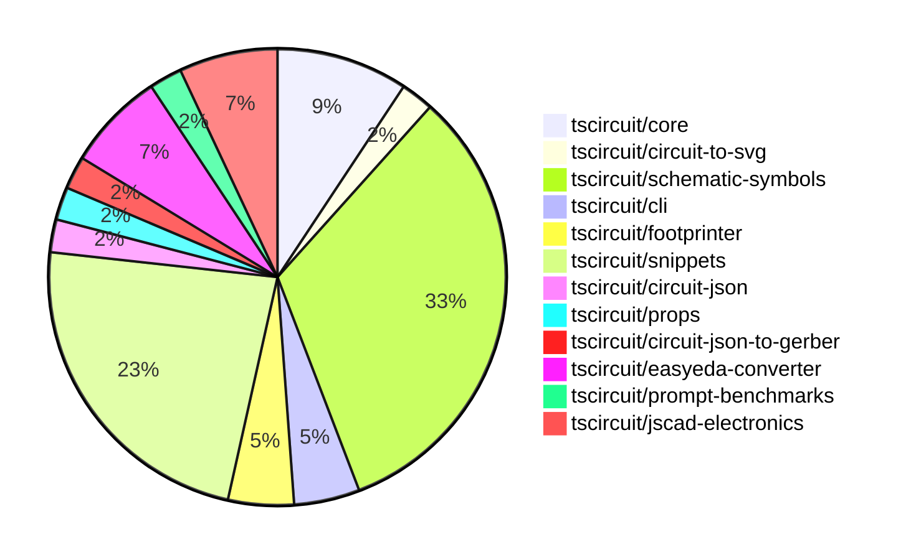

# contribution-tracker

Generates weekly contribution overviews for tscircuit contributors. Check out all
the [contribution overviews here](./contribution-overviews/)

* All PRs in the tscircuit org are scanned/summarized via Claude Haiku
* Claude classifies each Diff/PR as a Major, Minor or Tiny contribution
* All the PRs, summaries, and classifications are organized into charts and tables

The current week is shown below. There are 3 major sections:

* [Contributor Overview](#contributor-overview)
* [PRs by Repository](#prs-by-repository)
* [PRs by Contributor](#changes-by-contributor)

## Current Week

<!-- START_CURRENT_WEEK -->

# Contribution Overview 2024-10-05

## PRs by Repository

## Contributor Overview

| Contributor | 🐳 Major | 🐙 Minor | 🐌 Tiny |
|-------------|-------|-------|-------|
| imrishabh18 | 3 | 2 | 0 |
| DhairyaMajmudar | 3 | 1 | 0 |
| ShiboSoftwareDev | 4 | 0 | 0 |
| seveibar | 9 | 2 | 1 |
| andrii-balitskyi | 1 | 0 | 0 |
| anas-sarkez | 1 | 1 | 0 |
| aman1376 | 4 | 0 | 0 |
| 0xkafkaa | 4 | 0 | 0 |
| Timer00 | 1 | 0 | 0 |
| bbland1 | 3 | 1 | 0 |
| PALLAVIKHEDLE | 1 | 0 | 0 |

## Changes by Repository

### [tscircuit/core](https://github.com/tscircuit/core)

| PR # | Impact | Contributor | Description |
|------|--------|-------------|-------------|
| [#139](https://github.com/tscircuit/core/pull/139) | 🐳 Major | imrishabh18 | Fix the chip placement in the schematic by updating the calculation of the schematic box dimensions. |
| [#138](https://github.com/tscircuit/core/pull/138) | 🐳 Major | ShiboSoftwareDev | Inherit the `_setPositionFromLayout` behavior from `pcb_smt_pad` to `pcb_solder_paste`. |
| [#136](https://github.com/tscircuit/core/pull/136) | 🟣 | ShiboSoftwareDev | New component `pcb_solder_paste` created from `smtpads`. |
| [#137](https://github.com/tscircuit/core/pull/137) | 🐳 Major | seveibar | Improve invalid prop error handling by throwing a custom `InvalidProps` error with a detailed message. |

### [tscircuit/circuit-to-svg](https://github.com/tscircuit/circuit-to-svg)

| PR # | Impact | Contributor | Description |
|------|--------|-------------|-------------|
| [#82](https://github.com/tscircuit/circuit-to-svg/pull/82) | 🐳 Major | imrishabh18 | Fixes an issue with the placement of chip ports in the schematic SVG. |

### [tscircuit/schematic-symbols](https://github.com/tscircuit/schematic-symbols)

| PR # | Impact | Contributor | Description |
|------|--------|-------------|-------------|
| [#135](https://github.com/tscircuit/schematic-symbols/pull/135) | 🐳 Major | imrishabh18 | Adding support for cubic bezier curve in the `svgPathToPoints` function. |
| [#152](https://github.com/tscircuit/schematic-symbols/pull/152) | 🐳 Major | aman1376 | Add a new SVG file and JSON data for a P-Channel D-MOSFET Transistor symbol. |
| [#150](https://github.com/tscircuit/schematic-symbols/pull/150) | 🐳 Major | aman1376 | Add new JSON file for an NJFET transistor symbol |
| [#149](https://github.com/tscircuit/schematic-symbols/pull/149) | 🐳 Major | aman1376 | Add a new P-JFET transistor symbol and its JSON representation. |
| [#130](https://github.com/tscircuit/schematic-symbols/pull/130) | 🐳 Major | aman1376 | Introduce a new TypeScript type `BaseSymbolName` that represents the base symbol names, generated from a set of symbol names. |
| [#145](https://github.com/tscircuit/schematic-symbols/pull/145) | 🐳 Major | 0xkafkaa | Add a new SVG image and JSON data for a crystal symbol. |
| [#146](https://github.com/tscircuit/schematic-symbols/pull/146) | 🐳 Major | 0xkafkaa | Add a new feature for a resonator |
| [#137](https://github.com/tscircuit/schematic-symbols/pull/137) | 🐳 Major | 0xkafkaa | Add a step recovery diode component to the project. |
| [#133](https://github.com/tscircuit/schematic-symbols/pull/133) | 🐳 Major | 0xkafkaa | Adds a new Gunn diode symbol and JSON file. |
| [#136](https://github.com/tscircuit/schematic-symbols/pull/136) | 🐳 Major | Timer00 | Add snapshot tests for SVG symbols |
| [#132](https://github.com/tscircuit/schematic-symbols/pull/132) | 🐳 Major | bbland1 | Fixes the center point of the diamond element in the silicon_controlled_rectifier symbol |
| [#110](https://github.com/tscircuit/schematic-symbols/pull/110) | 🐳 Major | bbland1 | Add a diac SVG and TypeScript file. |
| [#111](https://github.com/tscircuit/schematic-symbols/pull/111) | 🐳 Major | bbland1 | Create an SVG and TypeScript representation of a unijunction transistor symbol. |
| [#131](https://github.com/tscircuit/schematic-symbols/pull/131) | 🐙 Minor | bbland1 | Fixing the position of the reference ({REF}) text in the diac symbol |

### [tscircuit/cli](https://github.com/tscircuit/cli)

| PR # | Impact | Contributor | Description |
|------|--------|-------------|-------------|
| [#215](https://github.com/tscircuit/cli/pull/215) | 🐳 Major | DhairyaMajmudar | Refactoring files for better using TypeScript types by removing `any` keywords and replacing suitable types and removing unused imports. |
| [#226](https://github.com/tscircuit/cli/pull/226) | 🐙 Minor | imrishabh18 | Update the `circuit-to-svg` dependency to the latest version. |

### [tscircuit/footprinter](https://github.com/tscircuit/footprinter)

| PR # | Impact | Contributor | Description |
|------|--------|-------------|-------------|
| [#48](https://github.com/tscircuit/footprinter/pull/48) | 🐳 Major | DhairyaMajmudar | Adding SOT363 circuit |
| [#55](https://github.com/tscircuit/footprinter/pull/55) | 🐙 Minor | imrishabh18 | Update the `@tscircuit/mm` dependency to the latest version without the `lodash` dependency. |

### [tscircuit/snippets](https://github.com/tscircuit/snippets)

| PR # | Impact | Contributor | Description |
|------|--------|-------------|-------------|
| [#10](https://github.com/tscircuit/snippets/pull/10) | 🐳 Major | DhairyaMajmudar | Adding functionality to the cross button to hide the Onboarding Tips section. |
| [#35](https://github.com/tscircuit/snippets/pull/35) | 🐳 Major | seveibar | Revert changes to the new button hover behavior in the HeaderDropdown component. |
| [#36](https://github.com/tscircuit/snippets/pull/36) | 🐳 Major | seveibar | Introduce a fake API switch to the application |
| [#32](https://github.com/tscircuit/snippets/pull/32) | 🐳 Major | seveibar | Adds a dialog to import JLCPCB components, with an API endpoint to generate TypeScript snippets from JLCPCB part numbers. |
| [#23](https://github.com/tscircuit/snippets/pull/23) | 🐳 Major | seveibar | Introduce AI chat improvements and link improvements |
| [#12](https://github.com/tscircuit/snippets/pull/12) | 🐳 Major | seveibar | Adds registry compatibility, login functionality, and new database schema for sessions, login pages, and accounts. |
| [#33](https://github.com/tscircuit/snippets/pull/33) | 🐳 Major | PALLAVIKHEDLE | Introduce a new button hover behavior, where hovering on the 'New' button shows a dropdown, and clicking the button navigates to the '/editor' page. |
| [#28](https://github.com/tscircuit/snippets/pull/28) | 🐙 Minor | DhairyaMajmudar | Adds strict camelCase naming convention rules to the biome.json file. |
| [#21](https://github.com/tscircuit/snippets/pull/21) | 🐙 Minor | seveibar | Add an empty state for the AI chat interface and display the account balance in the header. |
| [#13](https://github.com/tscircuit/snippets/pull/13) | 🐙 Minor | seveibar | Format the repository, add Vercel rewrites, and make minor fixes. |

### [tscircuit/circuit-json](https://github.com/tscircuit/circuit-json)

| PR # | Impact | Contributor | Description |
|------|--------|-------------|-------------|
| [#56](https://github.com/tscircuit/circuit-json/pull/56) | 🐳 Major | ShiboSoftwareDev | Introduce a new component `pcb_solder_paste` for defining solder paste on the PCB. |

### [tscircuit/props](https://github.com/tscircuit/props)

| PR # | Impact | Contributor | Description |
|------|--------|-------------|-------------|
| [#56](https://github.com/tscircuit/props/pull/56) | 🐳 Major | ShiboSoftwareDev | Introduce a new component called "solderpaste" with support for rectangular and circular shapes. |

### [tscircuit/circuit-json-to-gerber](https://github.com/tscircuit/circuit-json-to-gerber)

| PR # | Impact | Contributor | Description |
|------|--------|-------------|-------------|
| [#18](https://github.com/tscircuit/circuit-json-to-gerber/pull/18) | 🐳 Major | ShiboSoftwareDev | Implemented pcb_solder_paste support in the gerber conversion process. |

### [tscircuit/easyeda-converter](https://github.com/tscircuit/easyeda-converter)

| PR # | Impact | Contributor | Description |
|------|--------|-------------|-------------|
| [#46](https://github.com/tscircuit/easyeda-converter/pull/46) | 🐳 Major | seveibar | Convert the project to use ECMAScript Modules (ESM) instead of CommonJS. |
| [#45](https://github.com/tscircuit/easyeda-converter/pull/45) | 🐳 Major | seveibar | Updated the README with more usage details, migrated to `circuit-json` and `@tscircuit/soup-util` libraries, and removed the `builder` dependency. |
| [#44](https://github.com/tscircuit/easyeda-converter/pull/44) | 🐳 Major | andrii-balitskyi | Fix build and add typecheck workflow |

### [tscircuit/prompt-benchmarks](https://github.com/tscircuit/prompt-benchmarks)

| PR # | Impact | Contributor | Description |
|------|--------|-------------|-------------|
| [#2](https://github.com/tscircuit/prompt-benchmarks/pull/2) | 🐳 Major | seveibar | Adds support for running generated code and testing with a threshold acceptance criteria |

### [tscircuit/jscad-electronics](https://github.com/tscircuit/jscad-electronics)

| PR # | Impact | Contributor | Description |
|------|--------|-------------|-------------|
| [#58](https://github.com/tscircuit/jscad-electronics/pull/58) | 🐳 Major | anas-sarkez | Fixed the footprints of the SOT-23, SOT-563, and SOT-723 models to match their specifications. |
| [#60](https://github.com/tscircuit/jscad-electronics/pull/60) | 🐙 Minor | anas-sarkez | Added the `showGrid` property to all test examples in the project. |
| [#61](https://github.com/tscircuit/jscad-electronics/pull/61) | 🐌 Tiny | seveibar | Create a CODEOWNERS file to specify code ownership |

## Changes by Contributor

### [imrishabh18](https://github.com/imrishabh18)

| PR # | Impact | Description |
|------|--------|-------------|
| [#139](https://github.com/tscircuit/core/pull/139) | 🐳 Major | Fix the chip placement in the schematic by updating the calculation of the schematic box dimensions. |
| [#82](https://github.com/tscircuit/circuit-to-svg/pull/82) | 🐳 Major | Fixes an issue with the placement of chip ports in the schematic SVG. |
| [#135](https://github.com/tscircuit/schematic-symbols/pull/135) | 🐳 Major | Adding support for cubic bezier curve in the `svgPathToPoints` function. |
| [#226](https://github.com/tscircuit/cli/pull/226) | 🐙 Minor | Update the `circuit-to-svg` dependency to the latest version. |
| [#55](https://github.com/tscircuit/footprinter/pull/55) | 🐙 Minor | Update the `@tscircuit/mm` dependency to the latest version without the `lodash` dependency. |

### [DhairyaMajmudar](https://github.com/DhairyaMajmudar)

| PR # | Impact | Description |
|------|--------|-------------|
| [#215](https://github.com/tscircuit/cli/pull/215) | 🐳 Major | Refactoring files for better using TypeScript types by removing `any` keywords and replacing suitable types and removing unused imports. |
| [#48](https://github.com/tscircuit/footprinter/pull/48) | 🐳 Major | Adding SOT363 circuit |
| [#10](https://github.com/tscircuit/snippets/pull/10) | 🐳 Major | Adding functionality to the cross button to hide the Onboarding Tips section. |
| [#28](https://github.com/tscircuit/snippets/pull/28) | 🐙 Minor | Adds strict camelCase naming convention rules to the biome.json file. |

### [ShiboSoftwareDev](https://github.com/ShiboSoftwareDev)

| PR # | Impact | Description |
|------|--------|-------------|
| [#56](https://github.com/tscircuit/circuit-json/pull/56) | 🐳 Major | Introduce a new component `pcb_solder_paste` for defining solder paste on the PCB. |
| [#56](https://github.com/tscircuit/props/pull/56) | 🐳 Major | Introduce a new component called "solderpaste" with support for rectangular and circular shapes. |
| [#138](https://github.com/tscircuit/core/pull/138) | 🐳 Major | Inherit the `_setPositionFromLayout` behavior from `pcb_smt_pad` to `pcb_solder_paste`. |
| [#136](https://github.com/tscircuit/core/pull/136) | 🟣 | New component `pcb_solder_paste` created from `smtpads`. |
| [#18](https://github.com/tscircuit/circuit-json-to-gerber/pull/18) | 🐳 Major | Implemented pcb_solder_paste support in the gerber conversion process. |

### [seveibar](https://github.com/seveibar)

| PR # | Impact | Description |
|------|--------|-------------|
| [#46](https://github.com/tscircuit/easyeda-converter/pull/46) | 🐳 Major | Convert the project to use ECMAScript Modules (ESM) instead of CommonJS. |
| [#45](https://github.com/tscircuit/easyeda-converter/pull/45) | 🐳 Major | Updated the README with more usage details, migrated to `circuit-json` and `@tscircuit/soup-util` libraries, and removed the `builder` dependency. |
| [#137](https://github.com/tscircuit/core/pull/137) | 🐳 Major | Improve invalid prop error handling by throwing a custom `InvalidProps` error with a detailed message. |
| [#35](https://github.com/tscircuit/snippets/pull/35) | 🐳 Major | Revert changes to the new button hover behavior in the HeaderDropdown component. |
| [#36](https://github.com/tscircuit/snippets/pull/36) | 🐳 Major | Introduce a fake API switch to the application |
| [#32](https://github.com/tscircuit/snippets/pull/32) | 🐳 Major | Adds a dialog to import JLCPCB components, with an API endpoint to generate TypeScript snippets from JLCPCB part numbers. |
| [#23](https://github.com/tscircuit/snippets/pull/23) | 🐳 Major | Introduce AI chat improvements and link improvements |
| [#12](https://github.com/tscircuit/snippets/pull/12) | 🐳 Major | Adds registry compatibility, login functionality, and new database schema for sessions, login pages, and accounts. |
| [#2](https://github.com/tscircuit/prompt-benchmarks/pull/2) | 🐳 Major | Adds support for running generated code and testing with a threshold acceptance criteria |
| [#21](https://github.com/tscircuit/snippets/pull/21) | 🐙 Minor | Add an empty state for the AI chat interface and display the account balance in the header. |
| [#13](https://github.com/tscircuit/snippets/pull/13) | 🐙 Minor | Format the repository, add Vercel rewrites, and make minor fixes. |
| [#61](https://github.com/tscircuit/jscad-electronics/pull/61) | 🐌 Tiny | Create a CODEOWNERS file to specify code ownership |

### [andrii-balitskyi](https://github.com/andrii-balitskyi)

| PR # | Impact | Description |
|------|--------|-------------|
| [#44](https://github.com/tscircuit/easyeda-converter/pull/44) | 🐳 Major | Fix build and add typecheck workflow |

### [anas-sarkez](https://github.com/anas-sarkez)

| PR # | Impact | Description |
|------|--------|-------------|
| [#58](https://github.com/tscircuit/jscad-electronics/pull/58) | 🐳 Major | Fixed the footprints of the SOT-23, SOT-563, and SOT-723 models to match their specifications. |
| [#60](https://github.com/tscircuit/jscad-electronics/pull/60) | 🐙 Minor | Added the `showGrid` property to all test examples in the project. |

### [aman1376](https://github.com/aman1376)

| PR # | Impact | Description |
|------|--------|-------------|
| [#152](https://github.com/tscircuit/schematic-symbols/pull/152) | 🐳 Major | Add a new SVG file and JSON data for a P-Channel D-MOSFET Transistor symbol. |
| [#150](https://github.com/tscircuit/schematic-symbols/pull/150) | 🐳 Major | Add new JSON file for an NJFET transistor symbol |
| [#149](https://github.com/tscircuit/schematic-symbols/pull/149) | 🐳 Major | Add a new P-JFET transistor symbol and its JSON representation. |
| [#130](https://github.com/tscircuit/schematic-symbols/pull/130) | 🐳 Major | Introduce a new TypeScript type `BaseSymbolName` that represents the base symbol names, generated from a set of symbol names. |

### [0xkafkaa](https://github.com/0xkafkaa)

| PR # | Impact | Description |
|------|--------|-------------|
| [#145](https://github.com/tscircuit/schematic-symbols/pull/145) | 🐳 Major | Add a new SVG image and JSON data for a crystal symbol. |
| [#146](https://github.com/tscircuit/schematic-symbols/pull/146) | 🐳 Major | Add a new feature for a resonator |
| [#137](https://github.com/tscircuit/schematic-symbols/pull/137) | 🐳 Major | Add a step recovery diode component to the project. |
| [#133](https://github.com/tscircuit/schematic-symbols/pull/133) | 🐳 Major | Adds a new Gunn diode symbol and JSON file. |

### [Timer00](https://github.com/Timer00)

| PR # | Impact | Description |
|------|--------|-------------|
| [#136](https://github.com/tscircuit/schematic-symbols/pull/136) | 🐳 Major | Add snapshot tests for SVG symbols |

### [bbland1](https://github.com/bbland1)

| PR # | Impact | Description |
|------|--------|-------------|
| [#132](https://github.com/tscircuit/schematic-symbols/pull/132) | 🐳 Major | Fixes the center point of the diamond element in the silicon_controlled_rectifier symbol |
| [#110](https://github.com/tscircuit/schematic-symbols/pull/110) | 🐳 Major | Add a diac SVG and TypeScript file. |
| [#111](https://github.com/tscircuit/schematic-symbols/pull/111) | 🐳 Major | Create an SVG and TypeScript representation of a unijunction transistor symbol. |
| [#131](https://github.com/tscircuit/schematic-symbols/pull/131) | 🐙 Minor | Fixing the position of the reference ({REF}) text in the diac symbol |

### [PALLAVIKHEDLE](https://github.com/PALLAVIKHEDLE)

| PR # | Impact | Description |
|------|--------|-------------|
| [#33](https://github.com/tscircuit/snippets/pull/33) | 🐳 Major | Introduce a new button hover behavior, where hovering on the 'New' button shows a dropdown, and clicking the button navigates to the '/editor' page. |

<!-- END_CURRENT_WEEK -->
