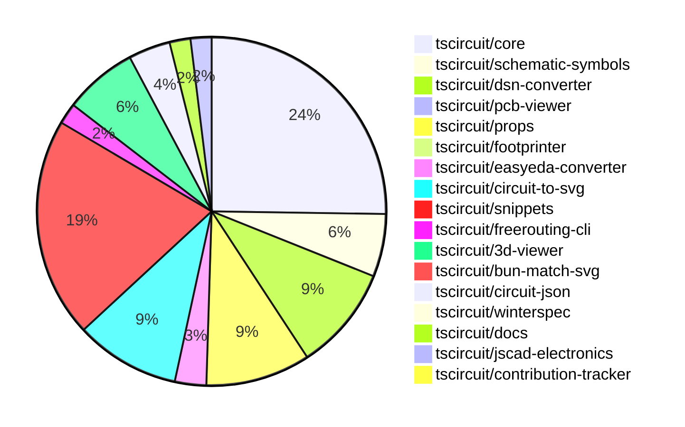

# contribution-tracker

Generates weekly contribution overviews for tscircuit contributors. Check out all
the [contribution overviews here](./contribution-overviews/)

* All PRs in the tscircuit org are scanned/summarized via Claude Haiku
* Claude classifies each Diff/PR as a Major, Minor or Tiny contribution
* All the PRs, summaries, and classifications are organized into charts and tables

The current week is shown below. There are 3 major sections:

* [Contributor Overview](#contributor-overview)
* [PRs by Repository](#prs-by-repository)
* [PRs by Contributor](#changes-by-contributor)

## Current Week

<!-- START_CURRENT_WEEK -->

# Contribution Overview 2024-11-13

## PRs by Repository

## Contributor Overview

| Contributor | 🐳 Major | 🐙 Minor | 🐌 Tiny | ⭐ |
|-------------|-------|-------|-------|-------|
| [seveibar](#seveibar) | 8 | 39 | 0 | 👑👑👑 |
| [imrishabh18](#imrishabh18) | 2 | 20 | 0 | ⭐⭐⭐ |
| [anas-sarkez](#anas-sarkez) | 5 | 7 | 2 | ⭐⭐⭐ |
| [ShiboSoftwareDev](#ShiboSoftwareDev) | 3 | 5 | 1 | ⭐⭐ |
| [mrudulpatil18](#mrudulpatil18) | 1 | 3 | 0 | ⭐ |
| [Abse2001](#Abse2001) | 0 | 4 | 0 | ⭐ |
| [RohittCodes](#RohittCodes) | 1 | 2 | 0 | ⭐ |
| [kom-senapati](#kom-senapati) | 0 | 2 | 0 | ⭐ |
| [DhairyaMajmudar](#DhairyaMajmudar) | 0 | 1 | 0 |  |
| [Anshgrover23](#Anshgrover23) | 0 | 1 | 0 |  |
| [andrii-balitskyi](#andrii-balitskyi) | 0 | 0 | 1 |  |

## Review Table

| Contributor | Reviews Received | Approvals | Rejections | Changes Requested | PRs Opened | PRs Closed |
|-------------|------------------|-----------|------------|-------------------|------------|------------|
| [seveibar](https://github.com/seveibar) | 1 | 0 | 16 | 0 | 52 | 52 |
| [ShiboSoftwareDev](https://github.com/ShiboSoftwareDev) | 12 | 9 | 4 | 0 | 10 | 9 |
| [imrishabh18](https://github.com/imrishabh18) | 20 | 13 | 6 | 3 | 24 | 23 |
| [tscircuitbot](https://github.com/tscircuitbot) | 0 | 0 | 0 | 0 | 1 | 1 |
| [anas-sarkez](https://github.com/anas-sarkez) | 33 | 14 | 14 | 3 | 16 | 14 |
| [DhairyaMajmudar](https://github.com/DhairyaMajmudar) | 17 | 1 | 1 | 9 | 6 | 4 |
| [mrudulpatil18](https://github.com/mrudulpatil18) | 7 | 5 | 0 | 1 | 4 | 4 |
| [Abse2001](https://github.com/Abse2001) | 8 | 4 | 5 | 0 | 6 | 5 |
| [vishwamartur](https://github.com/vishwamartur) | 7 | 0 | 1 | 4 | 4 | 2 |
| [developerfred](https://github.com/developerfred) | 0 | 0 | 0 | 0 | 2 | 1 |
| [andrii-balitskyi](https://github.com/andrii-balitskyi) | 1 | 1 | 0 | 0 | 1 | 1 |
| [Anshgrover23](https://github.com/Anshgrover23) | 2 | 1 | 0 | 1 | 3 | 1 |
| [kom-senapati](https://github.com/kom-senapati) | 6 | 2 | 0 | 2 | 2 | 2 |
| [AkashJana18](https://github.com/AkashJana18) | 2 | 0 | 1 | 1 | 1 | 0 |
| [ni9999](https://github.com/ni9999) | 2 | 0 | 3 | 1 | 1 | 0 |
| [hunxjunedo](https://github.com/hunxjunedo) | 1 | 0 | 0 | 0 | 2 | 1 |
| [Niharika0104](https://github.com/Niharika0104) | 1 | 0 | 2 | 0 | 1 | 0 |
| [RohittCodes](https://github.com/RohittCodes) | 40 | 7 | 1 | 6 | 6 | 3 |

## Changes by Repository

### [tscircuit/core](https://github.com/tscircuit/core)

| PR # | Impact | Contributor | Description |
|------|--------|-------------|-------------|
| [#336](https://github.com/tscircuit/core/pull/336) | 🐳 Major | seveibar | Change the default format for async autorouting from `SimpleRouteJson` to `CircuitJson`, and implement fixes and testing for the async autorouter for production usage. |
| [#316](https://github.com/tscircuit/core/pull/316) | 🐳 Major | seveibar | Fixes the subcircuit refdes selection issue by improving the `selectAll` and `selectOne` methods in the `PrimitiveComponent` class. |
| [#309](https://github.com/tscircuit/core/pull/309) | 🐳 Major | seveibar | Fixes the type inference for pin number types in the `createUseComponent` hooks. |
| [#297](https://github.com/tscircuit/core/pull/297) | 🐳 Major | seveibar | The change fixes a complex issue with crossings in schematic trace rendering. |
| [#300](https://github.com/tscircuit/core/pull/300) | 🐳 Major | imrishabh18 | Adds a new component called "Potentiometer" to the project. |
| [#334](https://github.com/tscircuit/core/pull/334) | 🐙 Minor | seveibar | Adds a GitHub workflow to automatically close stale issues and pull requests. |
| [#326](https://github.com/tscircuit/core/pull/326) | 🐙 Minor | seveibar | Allow disabling trace rendering inside of subcircuits |
| [#323](https://github.com/tscircuit/core/pull/323) | 🐙 Minor | seveibar | Adds write permissions to the "pull-requests" section in the GitHub Actions workflow for bundle size reporting. |
| [#305](https://github.com/tscircuit/core/pull/305) | 🐙 Minor | seveibar | Updates the schematic symbols with capacitor directions |
| [#303](https://github.com/tscircuit/core/pull/303) | 🐙 Minor | seveibar | Add directional symbol names to the PrimitiveComponent class. |
| [#299](https://github.com/tscircuit/core/pull/299) | 🐙 Minor | seveibar | Fix a bug in the simplified overshot check for creating schematic trace crossing segments. |
| [#296](https://github.com/tscircuit/core/pull/296) | 🐙 Minor | seveibar | Fix the facing direction of the net label |
| [#292](https://github.com/tscircuit/core/pull/292) | 🐙 Minor | seveibar | Allow the `schPortArrangement` property to accept string values, in addition to numbers, for pin labels. |
| [#315](https://github.com/tscircuit/core/pull/315) | 🐙 Minor | ShiboSoftwareDev | Fixed an issue where non-port elements were being added as ports for custom footprints. |
| [#314](https://github.com/tscircuit/core/pull/314) | 🐙 Minor | ShiboSoftwareDev | Fixed the rendering of the battery symbol. |
| [#333](https://github.com/tscircuit/core/pull/333) | 🐙 Minor | imrishabh18 | Adds caching of the PCB trace route to improve rendering performance. |
| [#295](https://github.com/tscircuit/core/pull/295) | 🐙 Minor | imrishabh18 | Fixes the width of the pin header by adding padding only when the label is present. |
| [#294](https://github.com/tscircuit/core/pull/294) | 🐙 Minor | imrishabh18 | Adds a new `facingDirection` prop to the `PinHeader` component, which determines the arrangement of pins. |
| [#319](https://github.com/tscircuit/core/pull/319) | 🐙 Minor | Abse2001 | Introduce a new `<pushbutton />` component. |
| [#335](https://github.com/tscircuit/core/pull/335) | 🐙 Minor | anas-sarkez | Resolved an issue where pin labels for the PinHeader component were not being drawn in SVG. |
| [#325](https://github.com/tscircuit/core/pull/325) | 🐙 Minor | anas-sarkez | Modify the position of manufacturer part number and name label in the Chip, Jumper, and PinHeader components. |
| [#322](https://github.com/tscircuit/core/pull/322) | 🐙 Minor | anas-sarkez | Refactors the trace to not get passed to the chip manufacturer part number and name, and converts the manufacturer labels to schematic text. |
| [#253](https://github.com/tscircuit/core/pull/253) | 🐙 Minor | DhairyaMajmudar | Adds error handling for missing footprint in the `NormalComponent` class. |
| [#330](https://github.com/tscircuit/core/pull/330) | 🐌 Tiny | anas-sarkez | Updates the bun lockfile. |
| [#329](https://github.com/tscircuit/core/pull/329) | 🐌 Tiny | anas-sarkez | Updated the package dependency lockfile |
| [#242](https://github.com/tscircuit/core/pull/242) | 🐌 Tiny | andrii-balitskyi | Adds a test for the `useDiode` hook to ensure it creates diode components with the correct props and traces. |

### [tscircuit/schematic-symbols](https://github.com/tscircuit/schematic-symbols)

| PR # | Impact | Contributor | Description |
|------|--------|-------------|-------------|
| [#204](https://github.com/tscircuit/schematic-symbols/pull/204) | 🐳 Major | seveibar | The change flips the Y-coordinates in the exported SVG symbols to make the Y-axis positive upwards. |
| [#198](https://github.com/tscircuit/schematic-symbols/pull/198) | 🐳 Major | anas-sarkez | Implemented flipSymbolOverYAxis and flipSymbolOverXAxis functions to modify LED arrows directions |
| [#195](https://github.com/tscircuit/schematic-symbols/pull/195) | 🐳 Major | anas-sarkez | Replaces the "led_horz" and "led_vert" symbols with new symbols for "led_up", "led_right", "led_down", and "led_left". |
| [#206](https://github.com/tscircuit/schematic-symbols/pull/206) | 🐙 Minor | seveibar | Move the `modifySymbol` function from the `scripts/lib/modify-symbol` directory to the `drawing` directory for export. |
| [#199](https://github.com/tscircuit/schematic-symbols/pull/199) | 🐙 Minor | seveibar | Adds capacitor symbols in different directions (down, left, right, up) |
| [#197](https://github.com/tscircuit/schematic-symbols/pull/197) | 🐙 Minor | imrishabh18 | Fix the position of the potentiometer labels in the horizontal and vertical symbol variants. |

### [tscircuit/dsn-converter](https://github.com/tscircuit/dsn-converter)

| PR # | Impact | Contributor | Description |
|------|--------|-------------|-------------|
| [#24](https://github.com/tscircuit/dsn-converter/pull/24) | 🐳 Major | seveibar | This pull request introduces a feature to convert Circuit JSON to DSN session format, including the conversion of circuit elements like source components, source traces, and source nets. |
| [#21](https://github.com/tscircuit/dsn-converter/pull/21) | 🐳 Major | seveibar | Fixes the parsing of DSN session data and adds support for converting wiring paths to PCB traces. |
| [#20](https://github.com/tscircuit/dsn-converter/pull/20) | 🐳 Major | seveibar | Introduces initial support for parsing DSN session data and converting it to circuit JSON. |
| [#26](https://github.com/tscircuit/dsn-converter/pull/26) | 🐙 Minor | seveibar | Adjusts the scale factor for converting a DSN session to a Circuit JSON. |
| [#25](https://github.com/tscircuit/dsn-converter/pull/25) | 🐙 Minor | seveibar | Fixes issues with the session JSON file by updating the .gitignore to include the file and making changes to the code to handle the file correctly. |
| [#22](https://github.com/tscircuit/dsn-converter/pull/22) | 🐙 Minor | seveibar | Adds support for stringifying DSN sessions. |
| [#23](https://github.com/tscircuit/dsn-converter/pull/23) | 🐙 Minor | imrishabh18 | Restore the processing of PCB traces in the circuit JSON to DSN JSON conversion process. |
| [#19](https://github.com/tscircuit/dsn-converter/pull/19) | 🐙 Minor | imrishabh18 | Adds support for plated holes and rotation on SMT pads in the DSN-PCB conversion process. |
| [#18](https://github.com/tscircuit/dsn-converter/pull/18) | 🐙 Minor | imrishabh18 | Removes the unnecessary processing of traces in the PCB conversion process. |
| [#16](https://github.com/tscircuit/dsn-converter/pull/16) | 🐙 Minor | imrishabh18 | Converts circuit JSON to DSN file format |

### [tscircuit/pcb-viewer](https://github.com/tscircuit/pcb-viewer)

| PR # | Impact | Contributor | Description |
|------|--------|-------------|-------------|
| [#81](https://github.com/tscircuit/pcb-viewer/pull/81) | 🐙 Minor | seveibar | Update the README with details on the usage of the `circuitJson` prop and additional details on the PCBViewer component |

### [tscircuit/props](https://github.com/tscircuit/props)

| PR # | Impact | Contributor | Description |
|------|--------|-------------|-------------|
| [#96](https://github.com/tscircuit/props/pull/96) | 🐳 Major | imrishabh18 | Add a new `potentiometer` component with `maxResistance` prop |
| [#103](https://github.com/tscircuit/props/pull/103) | 🐙 Minor | seveibar | Adds an `autorouter` prop to the `SubcircuitGroupProps` interface, allowing for configuration of the autorouter. |
| [#99](https://github.com/tscircuit/props/pull/99) | 🐙 Minor | seveibar | Introduce a new `NonSubcircuitGroupProps` interface to handle group props without the `subcircuit` property, and update the `groupProps` validation to use a discriminated union for better type handling. |
| [#98](https://github.com/tscircuit/props/pull/98) | 🐙 Minor | seveibar | This pull request removes the requirement for the `subcircuit: true` boolean property on subcircuits. |
| [#97](https://github.com/tscircuit/props/pull/97) | 🐙 Minor | seveibar | Adds a new file `subcircuit.ts` that defines the `SubcircuitProps` type and exports it. |
| [#92](https://github.com/tscircuit/props/pull/92) | 🐙 Minor | seveibar | Allow strings and numbers to be defined together for pinLabels, and improve `expectTypesMatch` errors. |
| [#102](https://github.com/tscircuit/props/pull/102) | 🐙 Minor | imrishabh18 | Exports the `PcbRouteCache` interface for use in the build. |
| [#101](https://github.com/tscircuit/props/pull/101) | 🐙 Minor | imrishabh18 | Adds a new property `pcbRouteCache` to the `SubcircuitGroupProps` interface, which includes `pcbTraces` (an array of `PcbTrace` objects) and a `cacheKey` string. |
| [#100](https://github.com/tscircuit/props/pull/100) | 🐙 Minor | imrishabh18 | Add a new component for a crystal in the circuit library |
| [#93](https://github.com/tscircuit/props/pull/93) | 🐙 Minor | imrishabh18 | Adds a new property 'facingDirection' to the 'PinHeaderProps' interface to allow controlling the direction the pin header is facing. |

### [tscircuit/footprinter](https://github.com/tscircuit/footprinter)

| PR # | Impact | Contributor | Description |
|------|--------|-------------|-------------|
| [#81](https://github.com/tscircuit/footprinter/pull/81) | 🐙 Minor | seveibar | Adds a new test case for a custom thermalpad with specific dimensions. |

### [tscircuit/easyeda-converter](https://github.com/tscircuit/easyeda-converter)

| PR # | Impact | Contributor | Description |
|------|--------|-------------|-------------|
| [#112](https://github.com/tscircuit/easyeda-converter/pull/112) | 🐙 Minor | seveibar | Ensures that short part numbers are correctly fetched from EasyEDA. |
| [#108](https://github.com/tscircuit/easyeda-converter/pull/108) | 🐙 Minor | seveibar | Add `manufacturerPartNumber` prop to the `convert-to-typescript-component` package |
| [#107](https://github.com/tscircuit/easyeda-converter/pull/107) | 🐙 Minor | seveibar | Changes the part supplier from LCSC to JLCPCB. |

### [tscircuit/circuit-to-svg](https://github.com/tscircuit/circuit-to-svg)

| PR # | Impact | Contributor | Description |
|------|--------|-------------|-------------|
| [#130](https://github.com/tscircuit/circuit-to-svg/pull/130) | 🐙 Minor | seveibar | Fixes outline scaling for stroke sizes and improves hovering over traces. |
| [#129](https://github.com/tscircuit/circuit-to-svg/pull/129) | 🐙 Minor | seveibar | Fix pin number text getting offset with large bounds |
| [#127](https://github.com/tscircuit/circuit-to-svg/pull/127) | 🐙 Minor | seveibar | Move the "circuit-json" and "schematic-symbols" packages from "dependencies" to "peerDependencies". |
| [#126](https://github.com/tscircuit/circuit-to-svg/pull/126) | 🐙 Minor | seveibar | Fix grid not appearing at boundaries, fix traces not being used in bounds calculation |
| [#124](https://github.com/tscircuit/circuit-to-svg/pull/124) | 🐙 Minor | seveibar | Change the trace color on hover and make the paths rounded. |
| [#121](https://github.com/tscircuit/circuit-to-svg/pull/121) | 🐙 Minor | seveibar | Reverts a previous fix that adjusted the top and bottom anchor position for net labels. |
| [#120](https://github.com/tscircuit/circuit-to-svg/pull/120) | 🐙 Minor | imrishabh18 | Fixed the top and bottom anchor position for the schematic net label. |
| [#134](https://github.com/tscircuit/circuit-to-svg/pull/134) | 🐙 Minor | anas-sarkez | Render pin labels for the PinHeader component in SVG |
| [#133](https://github.com/tscircuit/circuit-to-svg/pull/133) | 🐙 Minor | anas-sarkez | Removed the drawing of the manufacturer part numbers in the SVG output. |
| [#132](https://github.com/tscircuit/circuit-to-svg/pull/132) | 🐙 Minor | anas-sarkez | Implemented a function to create SVG text objects for schematic text elements. |

### [tscircuit/snippets](https://github.com/tscircuit/snippets)

| PR # | Impact | Contributor | Description |
|------|--------|-------------|-------------|
| [#246](https://github.com/tscircuit/snippets/pull/246) | 🐳 Major | ShiboSoftwareDev | Adds a new feature to insert chip components in the code editor. |
| [#179](https://github.com/tscircuit/snippets/pull/179) | 🐳 Major | mrudulpatil18 | Added a /preview route to allow previewing the `<PreviewContent>` component and modified the sidebar to allow copying embed code for this route. |
| [#237](https://github.com/tscircuit/snippets/pull/237) | 🐳 Major | RohittCodes | Implements route for image PCB and schematic SVGs, includes Playwright and Bun tests. |
| [#242](https://github.com/tscircuit/snippets/pull/242) | 🐙 Minor | seveibar | Change the `/playground` route to redirect to the editor with the `blank-circuit-board` template. |
| [#258](https://github.com/tscircuit/snippets/pull/258) | 🐙 Minor | seveibar | The pull request skips the parts engine test on the CI (Continuous Integration) environment. |
| [#254](https://github.com/tscircuit/snippets/pull/254) | 🐙 Minor | seveibar | Adds a GitHub link with the number of stars to the landing page |
| [#252](https://github.com/tscircuit/snippets/pull/252) | 🐙 Minor | seveibar | Reverts a previous change that caused a regression in the code editor. |
| [#240](https://github.com/tscircuit/snippets/pull/240) | 🐙 Minor | seveibar | Update renovate settings to include circuit-json and group all dependency updates together |
| [#220](https://github.com/tscircuit/snippets/pull/220) | 🐙 Minor | seveibar | Update core and circuit-to-svg packages to fix capacitor rotation issues |
| [#213](https://github.com/tscircuit/snippets/pull/213) | 🐙 Minor | seveibar | Improve PCBView reloading by using a unique key based on the circuitJsonKey. |
| [#196](https://github.com/tscircuit/snippets/pull/196) | 🐙 Minor | seveibar | The pull request adds support for asynchronous circuit rendering and opens BOM links in a new tab. |
| [#257](https://github.com/tscircuit/snippets/pull/257) | 🐙 Minor | ShiboSoftwareDev | Adds a dropdown menu to the "Insert" button in the code editor header, providing an option to insert a footprint. |
| [#235](https://github.com/tscircuit/snippets/pull/235) | 🐙 Minor | imrishabh18 | Updates the version of the "@tscircuit/3d-viewer" package to fix a 3D view issue. |
| [#208](https://github.com/tscircuit/snippets/pull/208) | 🐙 Minor | imrishabh18 | Adds a new feature to download the DSN file for the circuit. |
| [#236](https://github.com/tscircuit/snippets/pull/236) | 🐙 Minor | mrudulpatil18 | Update the iframe embed link to use the `/preview` endpoint and add a toast notification when the code is copied. |
| [#206](https://github.com/tscircuit/snippets/pull/206) | 🐙 Minor | mrudulpatil18 |  |
| [#247](https://github.com/tscircuit/snippets/pull/247) | 🐙 Minor | Abse2001 | Fixed a bug where the 3D capacitor color didn't change when using cap footprints. |
| [#218](https://github.com/tscircuit/snippets/pull/218) | 🐙 Minor | kom-senapati | Adds a utility function to get the React TypeScript syntax error message and uses it in the `use-run-tsx` hook. |
| [#250](https://github.com/tscircuit/snippets/pull/250) | 🐙 Minor | RohittCodes | Fixes an issue where the cursor position is reset to the beginning of the file after updating the content of the editor. |
| [#182](https://github.com/tscircuit/snippets/pull/182) | 🐙 Minor | RohittCodes | Refactors the search text component to handle errors with initial xs and md devices that were hidden. |
| [#233](https://github.com/tscircuit/snippets/pull/233) | 🐙 Minor | Anshgrover23 | Fixes an issue where hovering over circuit traces does not change the color. |

### [tscircuit/freerouting-cli](https://github.com/tscircuit/freerouting-cli)

| PR # | Impact | Contributor | Description |
|------|--------|-------------|-------------|
| [#3](https://github.com/tscircuit/freerouting-cli/pull/3) | 🐙 Minor | seveibar | Adds a command to start a local freerouting server using Docker. |
| [#2](https://github.com/tscircuit/freerouting-cli/pull/2) | 🐙 Minor | seveibar | Fixes various issues, including adding a biome dependency and fixing configuration commands. |

### [tscircuit/3d-viewer](https://github.com/tscircuit/3d-viewer)

| PR # | Impact | Contributor | Description |
|------|--------|-------------|-------------|
| [#44](https://github.com/tscircuit/3d-viewer/pull/44) | 🐳 Major | ShiboSoftwareDev | This pull request allows plated holes to be either horizontal or vertical. |
| [#38](https://github.com/tscircuit/3d-viewer/pull/38) | 🐳 Major | anas-sarkez | Adds support for pill-shaped board cutout (holes) in the 3D viewer. |
| [#40](https://github.com/tscircuit/3d-viewer/pull/40) | 🐙 Minor | imrishabh18 | Reverts a previous update to the fiber version that was breaking the 3D viewer |
| [#37](https://github.com/tscircuit/3d-viewer/pull/37) | 🐙 Minor | mrudulpatil18 | Positions the hover label below the pointer and updates its position frame by frame to prevent it from drifting away when the camera view changes. |
| [#42](https://github.com/tscircuit/3d-viewer/pull/42) | 🐙 Minor | Abse2001 | Updates the lockfile to resolve an issue with the previous version |
| [#41](https://github.com/tscircuit/3d-viewer/pull/41) | 🐙 Minor | Abse2001 | Updating the `jscad-electronics` dependency to version `0.0.21` to fix an issue where the 3D capacitor color was not changing in snippets. |
| [#39](https://github.com/tscircuit/3d-viewer/pull/39) | 🐙 Minor | anas-sarkez | Update dependencies to the latest versions |

### [tscircuit/bun-match-svg](https://github.com/tscircuit/bun-match-svg)

| PR # | Impact | Contributor | Description |
|------|--------|-------------|-------------|
| [#4](https://github.com/tscircuit/bun-match-svg/pull/4) | 🐳 Major | ShiboSoftwareDev | Implements a CLI tool that initializes the project in other repositories by creating an example test, setting up automatic preloading, and installing the necessary dependency. |

### [tscircuit/circuit-json](https://github.com/tscircuit/circuit-json)

| PR # | Impact | Contributor | Description |
|------|--------|-------------|-------------|
| [#82](https://github.com/tscircuit/circuit-json/pull/82) | 🐙 Minor | ShiboSoftwareDev | Introduces a new "rotated_rect" shape for SMT pads in the PCB module. |
| [#81](https://github.com/tscircuit/circuit-json/pull/81) | 🐙 Minor | imrishabh18 | Adds a new source component for a simple crystal |
| [#80](https://github.com/tscircuit/circuit-json/pull/80) | 🐙 Minor | imrishabh18 | Adds a new source component, the potentiometer, to the circuit element and source component types. |
| [#79](https://github.com/tscircuit/circuit-json/pull/79) | 🐙 Minor | imrishabh18 | Adds a new source component, `source_simple_potentiometer`, to the codebase. |

### [tscircuit/winterspec](https://github.com/tscircuit/winterspec)

| PR # | Impact | Contributor | Description |
|------|--------|-------------|-------------|
| [#22](https://github.com/tscircuit/winterspec/pull/22) | 🐙 Minor | ShiboSoftwareDev | The pull request exports common middleware functions from the `src/middleware` directory, including `http-exceptions`, `with-default-exception-handling`, `with-logger`, and `with-cors`, along with testing for the `with-cors` middleware. |

### [tscircuit/docs](https://github.com/tscircuit/docs)

| PR # | Impact | Contributor | Description |
|------|--------|-------------|-------------|
| [#37](https://github.com/tscircuit/docs/pull/37) | 🐙 Minor | imrishabh18 | Add documentation for motor driver circuit |
| [#38](https://github.com/tscircuit/docs/pull/38) | 🐌 Tiny | ShiboSoftwareDev | Fix a typo in the "pushbutton-led-circuit.mdx" tutorial. |

### [tscircuit/jscad-electronics](https://github.com/tscircuit/jscad-electronics)

| PR # | Impact | Contributor | Description |
|------|--------|-------------|-------------|
| [#79](https://github.com/tscircuit/jscad-electronics/pull/79) | 🐳 Major | anas-sarkez | Implemented a 3D StampBoard component with optional inner holes and an example usage in the `stampboard.example.tsx` file. |
| [#78](https://github.com/tscircuit/jscad-electronics/pull/78) | 🐳 Major | anas-sarkez | Refactors the QFN 3D element, adds a new QFN Footprinter3d example, and introduces utility functions for calculating pin positions and pin map. |

### [tscircuit/contribution-tracker](https://github.com/tscircuit/contribution-tracker)

| PR # | Impact | Contributor | Description |
|------|--------|-------------|-------------|
| [#6](https://github.com/tscircuit/contribution-tracker/pull/6) | 🐙 Minor | kom-senapati | Adds a new "Review Table" section to the contribution overview, displaying various metrics for each contributor. |

## Changes by Contributor

### [seveibar](https://github.com/seveibar)

| PR # | Impact | Description |
|------|--------|-------------|
| [#336](https://github.com/tscircuit/core/pull/336) | 🐳 Major | Change the default format for async autorouting from `SimpleRouteJson` to `CircuitJson`, and implement fixes and testing for the async autorouter for production usage. |
| [#316](https://github.com/tscircuit/core/pull/316) | 🐳 Major | Fixes the subcircuit refdes selection issue by improving the `selectAll` and `selectOne` methods in the `PrimitiveComponent` class. |
| [#309](https://github.com/tscircuit/core/pull/309) | 🐳 Major | Fixes the type inference for pin number types in the `createUseComponent` hooks. |
| [#297](https://github.com/tscircuit/core/pull/297) | 🐳 Major | The change fixes a complex issue with crossings in schematic trace rendering. |
| [#204](https://github.com/tscircuit/schematic-symbols/pull/204) | 🐳 Major | The change flips the Y-coordinates in the exported SVG symbols to make the Y-axis positive upwards. |
| [#24](https://github.com/tscircuit/dsn-converter/pull/24) | 🐳 Major | This pull request introduces a feature to convert Circuit JSON to DSN session format, including the conversion of circuit elements like source components, source traces, and source nets. |
| [#21](https://github.com/tscircuit/dsn-converter/pull/21) | 🐳 Major | Fixes the parsing of DSN session data and adds support for converting wiring paths to PCB traces. |
| [#20](https://github.com/tscircuit/dsn-converter/pull/20) | 🐳 Major | Introduces initial support for parsing DSN session data and converting it to circuit JSON. |
| [#81](https://github.com/tscircuit/pcb-viewer/pull/81) | 🐙 Minor | Update the README with details on the usage of the `circuitJson` prop and additional details on the PCBViewer component |
| [#103](https://github.com/tscircuit/props/pull/103) | 🐙 Minor | Adds an `autorouter` prop to the `SubcircuitGroupProps` interface, allowing for configuration of the autorouter. |
| [#99](https://github.com/tscircuit/props/pull/99) | 🐙 Minor | Introduce a new `NonSubcircuitGroupProps` interface to handle group props without the `subcircuit` property, and update the `groupProps` validation to use a discriminated union for better type handling. |
| [#98](https://github.com/tscircuit/props/pull/98) | 🐙 Minor | This pull request removes the requirement for the `subcircuit: true` boolean property on subcircuits. |
| [#97](https://github.com/tscircuit/props/pull/97) | 🐙 Minor | Adds a new file `subcircuit.ts` that defines the `SubcircuitProps` type and exports it. |
| [#92](https://github.com/tscircuit/props/pull/92) | 🐙 Minor | Allow strings and numbers to be defined together for pinLabels, and improve `expectTypesMatch` errors. |
| [#81](https://github.com/tscircuit/footprinter/pull/81) | 🐙 Minor | Adds a new test case for a custom thermalpad with specific dimensions. |
| [#112](https://github.com/tscircuit/easyeda-converter/pull/112) | 🐙 Minor | Ensures that short part numbers are correctly fetched from EasyEDA. |
| [#108](https://github.com/tscircuit/easyeda-converter/pull/108) | 🐙 Minor | Add `manufacturerPartNumber` prop to the `convert-to-typescript-component` package |
| [#107](https://github.com/tscircuit/easyeda-converter/pull/107) | 🐙 Minor | Changes the part supplier from LCSC to JLCPCB. |
| [#334](https://github.com/tscircuit/core/pull/334) | 🐙 Minor | Adds a GitHub workflow to automatically close stale issues and pull requests. |
| [#326](https://github.com/tscircuit/core/pull/326) | 🐙 Minor | Allow disabling trace rendering inside of subcircuits |
| [#323](https://github.com/tscircuit/core/pull/323) | 🐙 Minor | Adds write permissions to the "pull-requests" section in the GitHub Actions workflow for bundle size reporting. |
| [#305](https://github.com/tscircuit/core/pull/305) | 🐙 Minor | Updates the schematic symbols with capacitor directions |
| [#303](https://github.com/tscircuit/core/pull/303) | 🐙 Minor | Add directional symbol names to the PrimitiveComponent class. |
| [#299](https://github.com/tscircuit/core/pull/299) | 🐙 Minor | Fix a bug in the simplified overshot check for creating schematic trace crossing segments. |
| [#296](https://github.com/tscircuit/core/pull/296) | 🐙 Minor | Fix the facing direction of the net label |
| [#292](https://github.com/tscircuit/core/pull/292) | 🐙 Minor | Allow the `schPortArrangement` property to accept string values, in addition to numbers, for pin labels. |
| [#130](https://github.com/tscircuit/circuit-to-svg/pull/130) | 🐙 Minor | Fixes outline scaling for stroke sizes and improves hovering over traces. |
| [#129](https://github.com/tscircuit/circuit-to-svg/pull/129) | 🐙 Minor | Fix pin number text getting offset with large bounds |
| [#127](https://github.com/tscircuit/circuit-to-svg/pull/127) | 🐙 Minor | Move the "circuit-json" and "schematic-symbols" packages from "dependencies" to "peerDependencies". |
| [#126](https://github.com/tscircuit/circuit-to-svg/pull/126) | 🐙 Minor | Fix grid not appearing at boundaries, fix traces not being used in bounds calculation |
| [#124](https://github.com/tscircuit/circuit-to-svg/pull/124) | 🐙 Minor | Change the trace color on hover and make the paths rounded. |
| [#121](https://github.com/tscircuit/circuit-to-svg/pull/121) | 🐙 Minor | Reverts a previous fix that adjusted the top and bottom anchor position for net labels. |
| [#206](https://github.com/tscircuit/schematic-symbols/pull/206) | 🐙 Minor | Move the `modifySymbol` function from the `scripts/lib/modify-symbol` directory to the `drawing` directory for export. |
| [#199](https://github.com/tscircuit/schematic-symbols/pull/199) | 🐙 Minor | Adds capacitor symbols in different directions (down, left, right, up) |
| [#26](https://github.com/tscircuit/dsn-converter/pull/26) | 🐙 Minor | Adjusts the scale factor for converting a DSN session to a Circuit JSON. |
| [#25](https://github.com/tscircuit/dsn-converter/pull/25) | 🐙 Minor | Fixes issues with the session JSON file by updating the .gitignore to include the file and making changes to the code to handle the file correctly. |
| [#22](https://github.com/tscircuit/dsn-converter/pull/22) | 🐙 Minor | Adds support for stringifying DSN sessions. |
| [#242](https://github.com/tscircuit/snippets/pull/242) | 🐙 Minor | Change the `/playground` route to redirect to the editor with the `blank-circuit-board` template. |
| [#258](https://github.com/tscircuit/snippets/pull/258) | 🐙 Minor | The pull request skips the parts engine test on the CI (Continuous Integration) environment. |
| [#254](https://github.com/tscircuit/snippets/pull/254) | 🐙 Minor | Adds a GitHub link with the number of stars to the landing page |
| [#252](https://github.com/tscircuit/snippets/pull/252) | 🐙 Minor | Reverts a previous change that caused a regression in the code editor. |
| [#240](https://github.com/tscircuit/snippets/pull/240) | 🐙 Minor | Update renovate settings to include circuit-json and group all dependency updates together |
| [#220](https://github.com/tscircuit/snippets/pull/220) | 🐙 Minor | Update core and circuit-to-svg packages to fix capacitor rotation issues |
| [#213](https://github.com/tscircuit/snippets/pull/213) | 🐙 Minor | Improve PCBView reloading by using a unique key based on the circuitJsonKey. |
| [#196](https://github.com/tscircuit/snippets/pull/196) | 🐙 Minor | The pull request adds support for asynchronous circuit rendering and opens BOM links in a new tab. |
| [#3](https://github.com/tscircuit/freerouting-cli/pull/3) | 🐙 Minor | Adds a command to start a local freerouting server using Docker. |
| [#2](https://github.com/tscircuit/freerouting-cli/pull/2) | 🐙 Minor | Fixes various issues, including adding a biome dependency and fixing configuration commands. |

### [ShiboSoftwareDev](https://github.com/ShiboSoftwareDev)

| PR # | Impact | Description |
|------|--------|-------------|
| [#44](https://github.com/tscircuit/3d-viewer/pull/44) | 🐳 Major | This pull request allows plated holes to be either horizontal or vertical. |
| [#4](https://github.com/tscircuit/bun-match-svg/pull/4) | 🐳 Major | Implements a CLI tool that initializes the project in other repositories by creating an example test, setting up automatic preloading, and installing the necessary dependency. |
| [#246](https://github.com/tscircuit/snippets/pull/246) | 🐳 Major | Adds a new feature to insert chip components in the code editor. |
| [#82](https://github.com/tscircuit/circuit-json/pull/82) | 🐙 Minor | Introduces a new "rotated_rect" shape for SMT pads in the PCB module. |
| [#22](https://github.com/tscircuit/winterspec/pull/22) | 🐙 Minor | The pull request exports common middleware functions from the `src/middleware` directory, including `http-exceptions`, `with-default-exception-handling`, `with-logger`, and `with-cors`, along with testing for the `with-cors` middleware. |
| [#315](https://github.com/tscircuit/core/pull/315) | 🐙 Minor | Fixed an issue where non-port elements were being added as ports for custom footprints. |
| [#314](https://github.com/tscircuit/core/pull/314) | 🐙 Minor | Fixed the rendering of the battery symbol. |
| [#257](https://github.com/tscircuit/snippets/pull/257) | 🐙 Minor | Adds a dropdown menu to the "Insert" button in the code editor header, providing an option to insert a footprint. |
| [#38](https://github.com/tscircuit/docs/pull/38) | 🐌 Tiny | Fix a typo in the "pushbutton-led-circuit.mdx" tutorial. |

### [imrishabh18](https://github.com/imrishabh18)

| PR # | Impact | Description |
|------|--------|-------------|
| [#96](https://github.com/tscircuit/props/pull/96) | 🐳 Major | Add a new `potentiometer` component with `maxResistance` prop |
| [#300](https://github.com/tscircuit/core/pull/300) | 🐳 Major | Adds a new component called "Potentiometer" to the project. |
| [#81](https://github.com/tscircuit/circuit-json/pull/81) | 🐙 Minor | Adds a new source component for a simple crystal |
| [#80](https://github.com/tscircuit/circuit-json/pull/80) | 🐙 Minor | Adds a new source component, the potentiometer, to the circuit element and source component types. |
| [#79](https://github.com/tscircuit/circuit-json/pull/79) | 🐙 Minor | Adds a new source component, `source_simple_potentiometer`, to the codebase. |
| [#37](https://github.com/tscircuit/docs/pull/37) | 🐙 Minor | Add documentation for motor driver circuit |
| [#102](https://github.com/tscircuit/props/pull/102) | 🐙 Minor | Exports the `PcbRouteCache` interface for use in the build. |
| [#101](https://github.com/tscircuit/props/pull/101) | 🐙 Minor | Adds a new property `pcbRouteCache` to the `SubcircuitGroupProps` interface, which includes `pcbTraces` (an array of `PcbTrace` objects) and a `cacheKey` string. |
| [#100](https://github.com/tscircuit/props/pull/100) | 🐙 Minor | Add a new component for a crystal in the circuit library |
| [#93](https://github.com/tscircuit/props/pull/93) | 🐙 Minor | Adds a new property 'facingDirection' to the 'PinHeaderProps' interface to allow controlling the direction the pin header is facing. |
| [#40](https://github.com/tscircuit/3d-viewer/pull/40) | 🐙 Minor | Reverts a previous update to the fiber version that was breaking the 3D viewer |
| [#333](https://github.com/tscircuit/core/pull/333) | 🐙 Minor | Adds caching of the PCB trace route to improve rendering performance. |
| [#295](https://github.com/tscircuit/core/pull/295) | 🐙 Minor | Fixes the width of the pin header by adding padding only when the label is present. |
| [#294](https://github.com/tscircuit/core/pull/294) | 🐙 Minor | Adds a new `facingDirection` prop to the `PinHeader` component, which determines the arrangement of pins. |
| [#120](https://github.com/tscircuit/circuit-to-svg/pull/120) | 🐙 Minor | Fixed the top and bottom anchor position for the schematic net label. |
| [#197](https://github.com/tscircuit/schematic-symbols/pull/197) | 🐙 Minor | Fix the position of the potentiometer labels in the horizontal and vertical symbol variants. |
| [#23](https://github.com/tscircuit/dsn-converter/pull/23) | 🐙 Minor | Restore the processing of PCB traces in the circuit JSON to DSN JSON conversion process. |
| [#19](https://github.com/tscircuit/dsn-converter/pull/19) | 🐙 Minor | Adds support for plated holes and rotation on SMT pads in the DSN-PCB conversion process. |
| [#18](https://github.com/tscircuit/dsn-converter/pull/18) | 🐙 Minor | Removes the unnecessary processing of traces in the PCB conversion process. |
| [#16](https://github.com/tscircuit/dsn-converter/pull/16) | 🐙 Minor | Converts circuit JSON to DSN file format |
| [#235](https://github.com/tscircuit/snippets/pull/235) | 🐙 Minor | Updates the version of the "@tscircuit/3d-viewer" package to fix a 3D view issue. |
| [#208](https://github.com/tscircuit/snippets/pull/208) | 🐙 Minor | Adds a new feature to download the DSN file for the circuit. |

### [mrudulpatil18](https://github.com/mrudulpatil18)

| PR # | Impact | Description |
|------|--------|-------------|
| [#179](https://github.com/tscircuit/snippets/pull/179) | 🐳 Major | Added a /preview route to allow previewing the `<PreviewContent>` component and modified the sidebar to allow copying embed code for this route. |
| [#37](https://github.com/tscircuit/3d-viewer/pull/37) | 🐙 Minor | Positions the hover label below the pointer and updates its position frame by frame to prevent it from drifting away when the camera view changes. |
| [#236](https://github.com/tscircuit/snippets/pull/236) | 🐙 Minor | Update the iframe embed link to use the `/preview` endpoint and add a toast notification when the code is copied. |
| [#206](https://github.com/tscircuit/snippets/pull/206) | 🐙 Minor |  |

### [Abse2001](https://github.com/Abse2001)

| PR # | Impact | Description |
|------|--------|-------------|
| [#42](https://github.com/tscircuit/3d-viewer/pull/42) | 🐙 Minor | Updates the lockfile to resolve an issue with the previous version |
| [#41](https://github.com/tscircuit/3d-viewer/pull/41) | 🐙 Minor | Updating the `jscad-electronics` dependency to version `0.0.21` to fix an issue where the 3D capacitor color was not changing in snippets. |
| [#319](https://github.com/tscircuit/core/pull/319) | 🐙 Minor | Introduce a new `<pushbutton />` component. |
| [#247](https://github.com/tscircuit/snippets/pull/247) | 🐙 Minor | Fixed a bug where the 3D capacitor color didn't change when using cap footprints. |

### [anas-sarkez](https://github.com/anas-sarkez)

| PR # | Impact | Description |
|------|--------|-------------|
| [#38](https://github.com/tscircuit/3d-viewer/pull/38) | 🐳 Major | Adds support for pill-shaped board cutout (holes) in the 3D viewer. |
| [#79](https://github.com/tscircuit/jscad-electronics/pull/79) | 🐳 Major | Implemented a 3D StampBoard component with optional inner holes and an example usage in the `stampboard.example.tsx` file. |
| [#78](https://github.com/tscircuit/jscad-electronics/pull/78) | 🐳 Major | Refactors the QFN 3D element, adds a new QFN Footprinter3d example, and introduces utility functions for calculating pin positions and pin map. |
| [#198](https://github.com/tscircuit/schematic-symbols/pull/198) | 🐳 Major | Implemented flipSymbolOverYAxis and flipSymbolOverXAxis functions to modify LED arrows directions |
| [#195](https://github.com/tscircuit/schematic-symbols/pull/195) | 🐳 Major | Replaces the "led_horz" and "led_vert" symbols with new symbols for "led_up", "led_right", "led_down", and "led_left". |
| [#39](https://github.com/tscircuit/3d-viewer/pull/39) | 🐙 Minor | Update dependencies to the latest versions |
| [#335](https://github.com/tscircuit/core/pull/335) | 🐙 Minor | Resolved an issue where pin labels for the PinHeader component were not being drawn in SVG. |
| [#325](https://github.com/tscircuit/core/pull/325) | 🐙 Minor | Modify the position of manufacturer part number and name label in the Chip, Jumper, and PinHeader components. |
| [#322](https://github.com/tscircuit/core/pull/322) | 🐙 Minor | Refactors the trace to not get passed to the chip manufacturer part number and name, and converts the manufacturer labels to schematic text. |
| [#134](https://github.com/tscircuit/circuit-to-svg/pull/134) | 🐙 Minor | Render pin labels for the PinHeader component in SVG |
| [#133](https://github.com/tscircuit/circuit-to-svg/pull/133) | 🐙 Minor | Removed the drawing of the manufacturer part numbers in the SVG output. |
| [#132](https://github.com/tscircuit/circuit-to-svg/pull/132) | 🐙 Minor | Implemented a function to create SVG text objects for schematic text elements. |
| [#330](https://github.com/tscircuit/core/pull/330) | 🐌 Tiny | Updates the bun lockfile. |
| [#329](https://github.com/tscircuit/core/pull/329) | 🐌 Tiny | Updated the package dependency lockfile |

### [DhairyaMajmudar](https://github.com/DhairyaMajmudar)

| PR # | Impact | Description |
|------|--------|-------------|
| [#253](https://github.com/tscircuit/core/pull/253) | 🐙 Minor | Adds error handling for missing footprint in the `NormalComponent` class. |

### [andrii-balitskyi](https://github.com/andrii-balitskyi)

| PR # | Impact | Description |
|------|--------|-------------|
| [#242](https://github.com/tscircuit/core/pull/242) | 🐌 Tiny | Adds a test for the `useDiode` hook to ensure it creates diode components with the correct props and traces. |

### [kom-senapati](https://github.com/kom-senapati)

| PR # | Impact | Description |
|------|--------|-------------|
| [#6](https://github.com/tscircuit/contribution-tracker/pull/6) | 🐙 Minor | Adds a new "Review Table" section to the contribution overview, displaying various metrics for each contributor. |
| [#218](https://github.com/tscircuit/snippets/pull/218) | 🐙 Minor | Adds a utility function to get the React TypeScript syntax error message and uses it in the `use-run-tsx` hook. |

### [RohittCodes](https://github.com/RohittCodes)

| PR # | Impact | Description |
|------|--------|-------------|
| [#237](https://github.com/tscircuit/snippets/pull/237) | 🐳 Major | Implements route for image PCB and schematic SVGs, includes Playwright and Bun tests. |
| [#250](https://github.com/tscircuit/snippets/pull/250) | 🐙 Minor | Fixes an issue where the cursor position is reset to the beginning of the file after updating the content of the editor. |
| [#182](https://github.com/tscircuit/snippets/pull/182) | 🐙 Minor | Refactors the search text component to handle errors with initial xs and md devices that were hidden. |

### [Anshgrover23](https://github.com/Anshgrover23)

| PR # | Impact | Description |
|------|--------|-------------|
| [#233](https://github.com/tscircuit/snippets/pull/233) | 🐙 Minor | Fixes an issue where hovering over circuit traces does not change the color. |

<!-- END_CURRENT_WEEK -->
