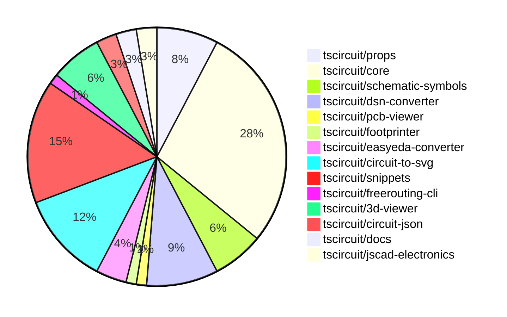

# contribution-tracker

Generates weekly contribution overviews for tscircuit contributors. Check out all
the [contribution overviews here](./contribution-overviews/)

* All PRs in the tscircuit org are scanned/summarized via Claude Haiku
* Claude classifies each Diff/PR as a Major, Minor or Tiny contribution
* All the PRs, summaries, and classifications are organized into charts and tables

The current week is shown below. There are 3 major sections:

* [Contributor Overview](#contributor-overview)
* [PRs by Repository](#prs-by-repository)
* [PRs by Contributor](#changes-by-contributor)

## Current Week

<!-- START_CURRENT_WEEK -->

# Contribution Overview 2024-11-13

## PRs by Repository

## Contributor Overview

| Contributor | 🐳 Major | 🐙 Minor | 🐌 Tiny | ⭐ |
|-------------|-------|-------|-------|-------|
| [seveibar](#seveibar) | 5 | 29 | 1 | 👑👑 |
| [imrishabh18](#imrishabh18) | 3 | 14 | 0 | ⭐⭐⭐ |
| [anas-sarkez](#anas-sarkez) | 3 | 7 | 2 | ⭐⭐ |
| [Abse2001](#Abse2001) | 0 | 3 | 1 | ⭐ |
| [ShiboSoftwareDev](#ShiboSoftwareDev) | 0 | 2 | 1 | ⭐ |
| [mrudulpatil18](#mrudulpatil18) | 0 | 2 | 0 | ⭐ |
| [DhairyaMajmudar](#DhairyaMajmudar) | 0 | 1 | 0 |  |
| [Anshgrover23](#Anshgrover23) | 0 | 1 | 0 |  |
| [kom-senapati](#kom-senapati) | 0 | 1 | 0 |  |
| [RohittCodes](#RohittCodes) | 0 | 1 | 0 |  |
| [andrii-balitskyi](#andrii-balitskyi) | 0 | 0 | 1 |  |

## Changes by Repository

### [tscircuit/props](https://github.com/tscircuit/props)

| PR # | Impact | Contributor | Description |
|------|--------|-------------|-------------|
| [#92](https://github.com/tscircuit/props/pull/92) | 🐳 Major | seveibar | Allow strings and numbers to be defined together for pinLabels, and improve `expectTypesMatch` errors |
| [#99](https://github.com/tscircuit/props/pull/99) | 🐙 Minor | seveibar | Allow group prop discrimination to fix parsing issues. |
| [#98](https://github.com/tscircuit/props/pull/98) | 🐙 Minor | seveibar | The change removes the requirement for the `subcircuit: true` boolean property on subcircuits. |
| [#97](https://github.com/tscircuit/props/pull/97) | 🐙 Minor | seveibar | Add subcircuit file |
| [#96](https://github.com/tscircuit/props/pull/96) | 🐙 Minor | imrishabh18 | Introduces a new component called "potentiometer" with a "maxResistance" property. |
| [#93](https://github.com/tscircuit/props/pull/93) | 🐙 Minor | imrishabh18 | Adds a `facingDirection` prop to the `PinHeader` component to allow configuring the direction the header is facing. |

### [tscircuit/core](https://github.com/tscircuit/core)

| PR # | Impact | Contributor | Description |
|------|--------|-------------|-------------|
| [#316](https://github.com/tscircuit/core/pull/316) | 🐳 Major | seveibar | Fixes the issue of Subcircuit Refdes Selection by introducing a new `getSelectableDescendants` method in the `PrimitiveComponent` class, which ensures that components within a subcircuit are accessible during the selection process. |
| [#297](https://github.com/tscircuit/core/pull/297) | 🐳 Major | seveibar | Fixes an issue with complex crossings in schematic traces. |
| [#300](https://github.com/tscircuit/core/pull/300) | 🐳 Major | imrishabh18 | Adds a new component called "Potentiometer" to the library. |
| [#326](https://github.com/tscircuit/core/pull/326) | 🐙 Minor | seveibar | Adds the ability to disable trace rendering inside of subcircuits. |
| [#323](https://github.com/tscircuit/core/pull/323) | 🐙 Minor | seveibar | Adds write permissions to the bundle-size GitHub Actions workflow for pull requests. |
| [#309](https://github.com/tscircuit/core/pull/309) | 🐙 Minor | seveibar | Fixes the type inference for pin numbers in the `createUseComponent` hooks. |
| [#303](https://github.com/tscircuit/core/pull/303) | 🐙 Minor | seveibar | Adds directional symbol names (up, down, left, right) for the primitive component. |
| [#299](https://github.com/tscircuit/core/pull/299) | 🐙 Minor | seveibar | Fix the simplified overshot check in the `create-schematic-trace-crossing-segments.ts` file. |
| [#296](https://github.com/tscircuit/core/pull/296) | 🐙 Minor | seveibar | Fixes the facing direction of the net label in the Port component. |
| [#292](https://github.com/tscircuit/core/pull/292) | 🐙 Minor | seveibar | The pull request adds the ability to accept string values for the `schPortArrangement` property, allowing it to handle both numerical pin numbers and string-based pin labels. |
| [#295](https://github.com/tscircuit/core/pull/295) | 🐙 Minor | imrishabh18 | Fixes the width of the pin header by adding padding only when the label is present. |
| [#294](https://github.com/tscircuit/core/pull/294) | 🐙 Minor | imrishabh18 | Adds a new `facingDirection` prop to the `PinHeader` component, allowing control over the pin arrangement. |
| [#315](https://github.com/tscircuit/core/pull/315) | 🐙 Minor | ShiboSoftwareDev | Fixed an issue where non-port elements were being added as ports for custom footprints. |
| [#314](https://github.com/tscircuit/core/pull/314) | 🐙 Minor | ShiboSoftwareDev | Fixed the rendering of the battery symbol by modifying the initPorts method. |
| [#319](https://github.com/tscircuit/core/pull/319) | 🐙 Minor | Abse2001 | Introduces a new `<pushbutton />` component to the library. |
| [#325](https://github.com/tscircuit/core/pull/325) | 🐙 Minor | anas-sarkez | Modify the position of the manufacturer part number and name label based on the schematic port arrangement. |
| [#322](https://github.com/tscircuit/core/pull/322) | 🐙 Minor | anas-sarkez | The pull request refactors the trace component to handle schematic text components as obstacles, preventing them from being passed to the chip manufacturer part number and name. |
| [#253](https://github.com/tscircuit/core/pull/253) | 🐙 Minor | DhairyaMajmudar | Adds error handling for missing footprints in the NormalComponent class. |
| [#305](https://github.com/tscircuit/core/pull/305) | 🐌 Tiny | seveibar | Update the schematic-symbols dependency to version 0.0.98. |
| [#330](https://github.com/tscircuit/core/pull/330) | 🐌 Tiny | anas-sarkez | Updated the bun lockfile |
| [#329](https://github.com/tscircuit/core/pull/329) | 🐌 Tiny | anas-sarkez | Updated the project's lock file to ensure dependencies are up-to-date. |
| [#242](https://github.com/tscircuit/core/pull/242) | 🐌 Tiny | andrii-balitskyi | Adds a test for the `useDiode` hook, which was already added in a previous pull request. |

### [tscircuit/schematic-symbols](https://github.com/tscircuit/schematic-symbols)

| PR # | Impact | Contributor | Description |
|------|--------|-------------|-------------|
| [#204](https://github.com/tscircuit/schematic-symbols/pull/204) | 🐳 Major | seveibar | The pull request flips the Y coordinates in the "getSvg" function, making the Y-axis positive in the exported symbols. |
| [#198](https://github.com/tscircuit/schematic-symbols/pull/198) | 🐳 Major | anas-sarkez | Implemented flipSymbolOverYAxis and flipSymbolOverXAxis functions to modify LED arrows directions |
| [#199](https://github.com/tscircuit/schematic-symbols/pull/199) | 🐙 Minor | seveibar | Adds capacitor symbols in four different orientations (down, left, right, up). |
| [#197](https://github.com/tscircuit/schematic-symbols/pull/197) | 🐙 Minor | imrishabh18 | Fix the position of the potentiometer label to be at the top and bottom of the component. |
| [#195](https://github.com/tscircuit/schematic-symbols/pull/195) | 🐙 Minor | anas-sarkez | The pull request changes the LED symbol from having "horz" and "vert" variants to having "up", "right", "left", and "down" variants. |

### [tscircuit/dsn-converter](https://github.com/tscircuit/dsn-converter)

| PR # | Impact | Contributor | Description |
|------|--------|-------------|-------------|
| [#20](https://github.com/tscircuit/dsn-converter/pull/20) | 🐳 Major | seveibar | Adds initial support for parsing DSN session files and converting them to circuit JSON format. |
| [#16](https://github.com/tscircuit/dsn-converter/pull/16) | 🐳 Major | imrishabh18 | Convert circuit JSON to DSN file |
| [#22](https://github.com/tscircuit/dsn-converter/pull/22) | 🐙 Minor | seveibar | Adds support for stringifying DSN sessions, which allows converting a DSN session object to a DSN string representation. |
| [#21](https://github.com/tscircuit/dsn-converter/pull/21) | 🐙 Minor | seveibar | Fix Session Parsing |
| [#23](https://github.com/tscircuit/dsn-converter/pull/23) | 🐙 Minor | imrishabh18 | Adds back the processing of traces in the circuit-json-to-dsn-json conversion process. |
| [#19](https://github.com/tscircuit/dsn-converter/pull/19) | 🐙 Minor | imrishabh18 | Adds support for plated holes and rotation on SMT pads in the PCB conversion process. |
| [#18](https://github.com/tscircuit/dsn-converter/pull/18) | 🐙 Minor | imrishabh18 | Removes the processing of PCB traces, as the autorouter will handle it. |

### [tscircuit/pcb-viewer](https://github.com/tscircuit/pcb-viewer)

| PR # | Impact | Contributor | Description |
|------|--------|-------------|-------------|
| [#81](https://github.com/tscircuit/pcb-viewer/pull/81) | 🐙 Minor | seveibar | Updates the README with details on using the `circuitJson` prop and additional details on the PCBViewer component's features. |

### [tscircuit/footprinter](https://github.com/tscircuit/footprinter)

| PR # | Impact | Contributor | Description |
|------|--------|-------------|-------------|
| [#81](https://github.com/tscircuit/footprinter/pull/81) | 🐙 Minor | seveibar | Adds a new example for a custom thermal pad with dimensions. |

### [tscircuit/easyeda-converter](https://github.com/tscircuit/easyeda-converter)

| PR # | Impact | Contributor | Description |
|------|--------|-------------|-------------|
| [#112](https://github.com/tscircuit/easyeda-converter/pull/112) | 🐙 Minor | seveibar | Ensures that short part numbers are correctly fetched from the EasyEDA API. |
| [#108](https://github.com/tscircuit/easyeda-converter/pull/108) | 🐙 Minor | seveibar | Add `manufacturerPartNumber` prop to the `soupTypescriptComponentTemplate` function and the component. |
| [#107](https://github.com/tscircuit/easyeda-converter/pull/107) | 🐙 Minor | seveibar | Change the supplier part numbers to use JLCPCB instead of LCSC. |

### [tscircuit/circuit-to-svg](https://github.com/tscircuit/circuit-to-svg)

| PR # | Impact | Contributor | Description |
|------|--------|-------------|-------------|
| [#130](https://github.com/tscircuit/circuit-to-svg/pull/130) | 🐙 Minor | seveibar | Fixes the scaling of the outline for traces and improves the hovering experience over traces. |
| [#129](https://github.com/tscircuit/circuit-to-svg/pull/129) | 🐙 Minor | seveibar | Fixes an issue where the pin number text gets offset with large bounds. |
| [#127](https://github.com/tscircuit/circuit-to-svg/pull/127) | 🐙 Minor | seveibar | Move 'circuit-json' and 'schematic-symbols' dependencies to peer dependencies |
| [#126](https://github.com/tscircuit/circuit-to-svg/pull/126) | 🐙 Minor | seveibar | Fix grid not appearing at boundaries, fix traces not being used in bounds calculation |
| [#124](https://github.com/tscircuit/circuit-to-svg/pull/124) | 🐙 Minor | seveibar | Change the trace color on hover and make the paths rounded. |
| [#121](https://github.com/tscircuit/circuit-to-svg/pull/121) | 🐙 Minor | seveibar | Reverts a previous fix that adjusted the top and bottom anchor position for net labels. |
| [#120](https://github.com/tscircuit/circuit-to-svg/pull/120) | 🐙 Minor | imrishabh18 | Fixes the top and bottom anchor position for the SVG net label object. |
| [#133](https://github.com/tscircuit/circuit-to-svg/pull/133) | 🐙 Minor | anas-sarkez | Removed the drawing of manufacturer part numbers in the circuit-to-svg code. |
| [#132](https://github.com/tscircuit/circuit-to-svg/pull/132) | 🐙 Minor | anas-sarkez | Implemented a function to create SVG schematic text. |

### [tscircuit/snippets](https://github.com/tscircuit/snippets)

| PR # | Impact | Contributor | Description |
|------|--------|-------------|-------------|
| [#240](https://github.com/tscircuit/snippets/pull/240) | 🐙 Minor | seveibar | Updates the Renovate configuration to include the `circuit-json` package in the list of excluded packages and group all dependency updates together. |
| [#220](https://github.com/tscircuit/snippets/pull/220) | 🐙 Minor | seveibar | Update the versions of the `@tscircuit/core` and `circuit-to-svg` packages to fix capacitor rotation issues. |
| [#213](https://github.com/tscircuit/snippets/pull/213) | 🐙 Minor | seveibar | Improve the reloading of the PCB view component by generating a unique key for the PCB viewer based on the circuitJsonKey, instead of using the tsxRunTriggerCount. |
| [#196](https://github.com/tscircuit/snippets/pull/196) | 🐙 Minor | seveibar | Adds support for async circuit rendering and opens BOM links in a new tab. |
| [#235](https://github.com/tscircuit/snippets/pull/235) | 🐙 Minor | imrishabh18 | Fixes a 3D view issue by updating the version of the `@tscircuit/3d-viewer` dependency. |
| [#208](https://github.com/tscircuit/snippets/pull/208) | 🐙 Minor | imrishabh18 | Adds a new feature to download the DSN file from the circuit JSON data. |
| [#247](https://github.com/tscircuit/snippets/pull/247) | 🐙 Minor | Abse2001 | Fixed the issue where the 3D capacitor color doesn't change when using cap footprints. |
| [#233](https://github.com/tscircuit/snippets/pull/233) | 🐙 Minor | Anshgrover23 | Fix the issue where hovering over traces does not change the color. |
| [#218](https://github.com/tscircuit/snippets/pull/218) | 🐙 Minor | kom-senapati | Adds a utility function to get the React TypeScript syntax error message and uses it in the `use-run-tsx` hook to display the error message. |
| [#179](https://github.com/tscircuit/snippets/pull/179) | 🐙 Minor | mrudulpatil18 | Added a new /preview route and a preview page to view the `<PreviewContent>` component, and modified the sidebar to allow copying embed code based on this route. |
| [#206](https://github.com/tscircuit/snippets/pull/206) | 🐙 Minor | mrudulpatil18 |  |
| [#182](https://github.com/tscircuit/snippets/pull/182) | 🐙 Minor | RohittCodes | Refactor search text component to fix issues with initial xs and md devices in Playwright tests. |

### [tscircuit/freerouting-cli](https://github.com/tscircuit/freerouting-cli)

| PR # | Impact | Contributor | Description |
|------|--------|-------------|-------------|
| [#2](https://github.com/tscircuit/freerouting-cli/pull/2) | 🐙 Minor | seveibar | Adds support for setting the API base URL, improves error handling, and fixes various issues with the config commands. |

### [tscircuit/3d-viewer](https://github.com/tscircuit/3d-viewer)

| PR # | Impact | Contributor | Description |
|------|--------|-------------|-------------|
| [#40](https://github.com/tscircuit/3d-viewer/pull/40) | 🐳 Major | imrishabh18 | Reverts the update to the fiber version, which was breaking the 3D viewer. |
| [#41](https://github.com/tscircuit/3d-viewer/pull/41) | 🐙 Minor | Abse2001 | Updating the `jscad-electronics` dependency to version `0.0.21` to fix an issue with the 3D capacitor color not changing in snippets. |
| [#39](https://github.com/tscircuit/3d-viewer/pull/39) | 🐙 Minor | anas-sarkez | Update dependencies for the project |
| [#38](https://github.com/tscircuit/3d-viewer/pull/38) | 🐙 Minor | anas-sarkez | The pull request adds support for rendering pill-shaped board cutouts (holes) in the 3D viewer. |
| [#42](https://github.com/tscircuit/3d-viewer/pull/42) | 🐌 Tiny | Abse2001 | Updates the project's dependency lockfile |

### [tscircuit/circuit-json](https://github.com/tscircuit/circuit-json)

| PR # | Impact | Contributor | Description |
|------|--------|-------------|-------------|
| [#80](https://github.com/tscircuit/circuit-json/pull/80) | 🐙 Minor | imrishabh18 | Adds the `source_simple_potentiometer` component to the `any_circuit_element` and `any_source_component` types. |
| [#79](https://github.com/tscircuit/circuit-json/pull/79) | 🐙 Minor | imrishabh18 | Adds a new source component called "source_simple_potentiometer" with a maximum resistance property. |

### [tscircuit/docs](https://github.com/tscircuit/docs)

| PR # | Impact | Contributor | Description |
|------|--------|-------------|-------------|
| [#37](https://github.com/tscircuit/docs/pull/37) | 🐙 Minor | imrishabh18 | Adds documentation for the motor driver circuit |
| [#38](https://github.com/tscircuit/docs/pull/38) | 🐌 Tiny | ShiboSoftwareDev | Fixes a typo in the "pushbutton-led-circuit.mdx" tutorial document. |

### [tscircuit/jscad-electronics](https://github.com/tscircuit/jscad-electronics)

| PR # | Impact | Contributor | Description |
|------|--------|-------------|-------------|
| [#79](https://github.com/tscircuit/jscad-electronics/pull/79) | 🐳 Major | anas-sarkez | Implemented a 3D StampBoard component with customizable dimensions, including optional inner holes. |
| [#78](https://github.com/tscircuit/jscad-electronics/pull/78) | 🐳 Major | anas-sarkez | Refactor QFN 3D element and added QFN Footprinter3d example |

## Changes by Contributor

### [seveibar](https://github.com/seveibar)

| PR # | Impact | Description |
|------|--------|-------------|
| [#92](https://github.com/tscircuit/props/pull/92) | 🐳 Major | Allow strings and numbers to be defined together for pinLabels, and improve `expectTypesMatch` errors |
| [#316](https://github.com/tscircuit/core/pull/316) | 🐳 Major | Fixes the issue of Subcircuit Refdes Selection by introducing a new `getSelectableDescendants` method in the `PrimitiveComponent` class, which ensures that components within a subcircuit are accessible during the selection process. |
| [#297](https://github.com/tscircuit/core/pull/297) | 🐳 Major | Fixes an issue with complex crossings in schematic traces. |
| [#204](https://github.com/tscircuit/schematic-symbols/pull/204) | 🐳 Major | The pull request flips the Y coordinates in the "getSvg" function, making the Y-axis positive in the exported symbols. |
| [#20](https://github.com/tscircuit/dsn-converter/pull/20) | 🐳 Major | Adds initial support for parsing DSN session files and converting them to circuit JSON format. |
| [#81](https://github.com/tscircuit/pcb-viewer/pull/81) | 🐙 Minor | Updates the README with details on using the `circuitJson` prop and additional details on the PCBViewer component's features. |
| [#99](https://github.com/tscircuit/props/pull/99) | 🐙 Minor | Allow group prop discrimination to fix parsing issues. |
| [#98](https://github.com/tscircuit/props/pull/98) | 🐙 Minor | The change removes the requirement for the `subcircuit: true` boolean property on subcircuits. |
| [#97](https://github.com/tscircuit/props/pull/97) | 🐙 Minor | Add subcircuit file |
| [#81](https://github.com/tscircuit/footprinter/pull/81) | 🐙 Minor | Adds a new example for a custom thermal pad with dimensions. |
| [#112](https://github.com/tscircuit/easyeda-converter/pull/112) | 🐙 Minor | Ensures that short part numbers are correctly fetched from the EasyEDA API. |
| [#108](https://github.com/tscircuit/easyeda-converter/pull/108) | 🐙 Minor | Add `manufacturerPartNumber` prop to the `soupTypescriptComponentTemplate` function and the component. |
| [#107](https://github.com/tscircuit/easyeda-converter/pull/107) | 🐙 Minor | Change the supplier part numbers to use JLCPCB instead of LCSC. |
| [#326](https://github.com/tscircuit/core/pull/326) | 🐙 Minor | Adds the ability to disable trace rendering inside of subcircuits. |
| [#323](https://github.com/tscircuit/core/pull/323) | 🐙 Minor | Adds write permissions to the bundle-size GitHub Actions workflow for pull requests. |
| [#309](https://github.com/tscircuit/core/pull/309) | 🐙 Minor | Fixes the type inference for pin numbers in the `createUseComponent` hooks. |
| [#303](https://github.com/tscircuit/core/pull/303) | 🐙 Minor | Adds directional symbol names (up, down, left, right) for the primitive component. |
| [#299](https://github.com/tscircuit/core/pull/299) | 🐙 Minor | Fix the simplified overshot check in the `create-schematic-trace-crossing-segments.ts` file. |
| [#296](https://github.com/tscircuit/core/pull/296) | 🐙 Minor | Fixes the facing direction of the net label in the Port component. |
| [#292](https://github.com/tscircuit/core/pull/292) | 🐙 Minor | The pull request adds the ability to accept string values for the `schPortArrangement` property, allowing it to handle both numerical pin numbers and string-based pin labels. |
| [#130](https://github.com/tscircuit/circuit-to-svg/pull/130) | 🐙 Minor | Fixes the scaling of the outline for traces and improves the hovering experience over traces. |
| [#129](https://github.com/tscircuit/circuit-to-svg/pull/129) | 🐙 Minor | Fixes an issue where the pin number text gets offset with large bounds. |
| [#127](https://github.com/tscircuit/circuit-to-svg/pull/127) | 🐙 Minor | Move 'circuit-json' and 'schematic-symbols' dependencies to peer dependencies |
| [#126](https://github.com/tscircuit/circuit-to-svg/pull/126) | 🐙 Minor | Fix grid not appearing at boundaries, fix traces not being used in bounds calculation |
| [#124](https://github.com/tscircuit/circuit-to-svg/pull/124) | 🐙 Minor | Change the trace color on hover and make the paths rounded. |
| [#121](https://github.com/tscircuit/circuit-to-svg/pull/121) | 🐙 Minor | Reverts a previous fix that adjusted the top and bottom anchor position for net labels. |
| [#199](https://github.com/tscircuit/schematic-symbols/pull/199) | 🐙 Minor | Adds capacitor symbols in four different orientations (down, left, right, up). |
| [#22](https://github.com/tscircuit/dsn-converter/pull/22) | 🐙 Minor | Adds support for stringifying DSN sessions, which allows converting a DSN session object to a DSN string representation. |
| [#21](https://github.com/tscircuit/dsn-converter/pull/21) | 🐙 Minor | Fix Session Parsing |
| [#240](https://github.com/tscircuit/snippets/pull/240) | 🐙 Minor | Updates the Renovate configuration to include the `circuit-json` package in the list of excluded packages and group all dependency updates together. |
| [#220](https://github.com/tscircuit/snippets/pull/220) | 🐙 Minor | Update the versions of the `@tscircuit/core` and `circuit-to-svg` packages to fix capacitor rotation issues. |
| [#213](https://github.com/tscircuit/snippets/pull/213) | 🐙 Minor | Improve the reloading of the PCB view component by generating a unique key for the PCB viewer based on the circuitJsonKey, instead of using the tsxRunTriggerCount. |
| [#196](https://github.com/tscircuit/snippets/pull/196) | 🐙 Minor | Adds support for async circuit rendering and opens BOM links in a new tab. |
| [#2](https://github.com/tscircuit/freerouting-cli/pull/2) | 🐙 Minor | Adds support for setting the API base URL, improves error handling, and fixes various issues with the config commands. |
| [#305](https://github.com/tscircuit/core/pull/305) | 🐌 Tiny | Update the schematic-symbols dependency to version 0.0.98. |

### [imrishabh18](https://github.com/imrishabh18)

| PR # | Impact | Description |
|------|--------|-------------|
| [#40](https://github.com/tscircuit/3d-viewer/pull/40) | 🐳 Major | Reverts the update to the fiber version, which was breaking the 3D viewer. |
| [#300](https://github.com/tscircuit/core/pull/300) | 🐳 Major | Adds a new component called "Potentiometer" to the library. |
| [#16](https://github.com/tscircuit/dsn-converter/pull/16) | 🐳 Major | Convert circuit JSON to DSN file |
| [#80](https://github.com/tscircuit/circuit-json/pull/80) | 🐙 Minor | Adds the `source_simple_potentiometer` component to the `any_circuit_element` and `any_source_component` types. |
| [#79](https://github.com/tscircuit/circuit-json/pull/79) | 🐙 Minor | Adds a new source component called "source_simple_potentiometer" with a maximum resistance property. |
| [#37](https://github.com/tscircuit/docs/pull/37) | 🐙 Minor | Adds documentation for the motor driver circuit |
| [#96](https://github.com/tscircuit/props/pull/96) | 🐙 Minor | Introduces a new component called "potentiometer" with a "maxResistance" property. |
| [#93](https://github.com/tscircuit/props/pull/93) | 🐙 Minor | Adds a `facingDirection` prop to the `PinHeader` component to allow configuring the direction the header is facing. |
| [#295](https://github.com/tscircuit/core/pull/295) | 🐙 Minor | Fixes the width of the pin header by adding padding only when the label is present. |
| [#294](https://github.com/tscircuit/core/pull/294) | 🐙 Minor | Adds a new `facingDirection` prop to the `PinHeader` component, allowing control over the pin arrangement. |
| [#120](https://github.com/tscircuit/circuit-to-svg/pull/120) | 🐙 Minor | Fixes the top and bottom anchor position for the SVG net label object. |
| [#197](https://github.com/tscircuit/schematic-symbols/pull/197) | 🐙 Minor | Fix the position of the potentiometer label to be at the top and bottom of the component. |
| [#23](https://github.com/tscircuit/dsn-converter/pull/23) | 🐙 Minor | Adds back the processing of traces in the circuit-json-to-dsn-json conversion process. |
| [#19](https://github.com/tscircuit/dsn-converter/pull/19) | 🐙 Minor | Adds support for plated holes and rotation on SMT pads in the PCB conversion process. |
| [#18](https://github.com/tscircuit/dsn-converter/pull/18) | 🐙 Minor | Removes the processing of PCB traces, as the autorouter will handle it. |
| [#235](https://github.com/tscircuit/snippets/pull/235) | 🐙 Minor | Fixes a 3D view issue by updating the version of the `@tscircuit/3d-viewer` dependency. |
| [#208](https://github.com/tscircuit/snippets/pull/208) | 🐙 Minor | Adds a new feature to download the DSN file from the circuit JSON data. |

### [ShiboSoftwareDev](https://github.com/ShiboSoftwareDev)

| PR # | Impact | Description |
|------|--------|-------------|
| [#315](https://github.com/tscircuit/core/pull/315) | 🐙 Minor | Fixed an issue where non-port elements were being added as ports for custom footprints. |
| [#314](https://github.com/tscircuit/core/pull/314) | 🐙 Minor | Fixed the rendering of the battery symbol by modifying the initPorts method. |
| [#38](https://github.com/tscircuit/docs/pull/38) | 🐌 Tiny | Fixes a typo in the "pushbutton-led-circuit.mdx" tutorial document. |

### [Abse2001](https://github.com/Abse2001)

| PR # | Impact | Description |
|------|--------|-------------|
| [#41](https://github.com/tscircuit/3d-viewer/pull/41) | 🐙 Minor | Updating the `jscad-electronics` dependency to version `0.0.21` to fix an issue with the 3D capacitor color not changing in snippets. |
| [#319](https://github.com/tscircuit/core/pull/319) | 🐙 Minor | Introduces a new `<pushbutton />` component to the library. |
| [#247](https://github.com/tscircuit/snippets/pull/247) | 🐙 Minor | Fixed the issue where the 3D capacitor color doesn't change when using cap footprints. |
| [#42](https://github.com/tscircuit/3d-viewer/pull/42) | 🐌 Tiny | Updates the project's dependency lockfile |

### [anas-sarkez](https://github.com/anas-sarkez)

| PR # | Impact | Description |
|------|--------|-------------|
| [#79](https://github.com/tscircuit/jscad-electronics/pull/79) | 🐳 Major | Implemented a 3D StampBoard component with customizable dimensions, including optional inner holes. |
| [#78](https://github.com/tscircuit/jscad-electronics/pull/78) | 🐳 Major | Refactor QFN 3D element and added QFN Footprinter3d example |
| [#198](https://github.com/tscircuit/schematic-symbols/pull/198) | 🐳 Major | Implemented flipSymbolOverYAxis and flipSymbolOverXAxis functions to modify LED arrows directions |
| [#39](https://github.com/tscircuit/3d-viewer/pull/39) | 🐙 Minor | Update dependencies for the project |
| [#38](https://github.com/tscircuit/3d-viewer/pull/38) | 🐙 Minor | The pull request adds support for rendering pill-shaped board cutouts (holes) in the 3D viewer. |
| [#325](https://github.com/tscircuit/core/pull/325) | 🐙 Minor | Modify the position of the manufacturer part number and name label based on the schematic port arrangement. |
| [#322](https://github.com/tscircuit/core/pull/322) | 🐙 Minor | The pull request refactors the trace component to handle schematic text components as obstacles, preventing them from being passed to the chip manufacturer part number and name. |
| [#133](https://github.com/tscircuit/circuit-to-svg/pull/133) | 🐙 Minor | Removed the drawing of manufacturer part numbers in the circuit-to-svg code. |
| [#132](https://github.com/tscircuit/circuit-to-svg/pull/132) | 🐙 Minor | Implemented a function to create SVG schematic text. |
| [#195](https://github.com/tscircuit/schematic-symbols/pull/195) | 🐙 Minor | The pull request changes the LED symbol from having "horz" and "vert" variants to having "up", "right", "left", and "down" variants. |
| [#330](https://github.com/tscircuit/core/pull/330) | 🐌 Tiny | Updated the bun lockfile |
| [#329](https://github.com/tscircuit/core/pull/329) | 🐌 Tiny | Updated the project's lock file to ensure dependencies are up-to-date. |

### [DhairyaMajmudar](https://github.com/DhairyaMajmudar)

| PR # | Impact | Description |
|------|--------|-------------|
| [#253](https://github.com/tscircuit/core/pull/253) | 🐙 Minor | Adds error handling for missing footprints in the NormalComponent class. |

### [andrii-balitskyi](https://github.com/andrii-balitskyi)

| PR # | Impact | Description |
|------|--------|-------------|
| [#242](https://github.com/tscircuit/core/pull/242) | 🐌 Tiny | Adds a test for the `useDiode` hook, which was already added in a previous pull request. |

### [Anshgrover23](https://github.com/Anshgrover23)

| PR # | Impact | Description |
|------|--------|-------------|
| [#233](https://github.com/tscircuit/snippets/pull/233) | 🐙 Minor | Fix the issue where hovering over traces does not change the color. |

### [kom-senapati](https://github.com/kom-senapati)

| PR # | Impact | Description |
|------|--------|-------------|
| [#218](https://github.com/tscircuit/snippets/pull/218) | 🐙 Minor | Adds a utility function to get the React TypeScript syntax error message and uses it in the `use-run-tsx` hook to display the error message. |

### [mrudulpatil18](https://github.com/mrudulpatil18)

| PR # | Impact | Description |
|------|--------|-------------|
| [#179](https://github.com/tscircuit/snippets/pull/179) | 🐙 Minor | Added a new /preview route and a preview page to view the `<PreviewContent>` component, and modified the sidebar to allow copying embed code based on this route. |
| [#206](https://github.com/tscircuit/snippets/pull/206) | 🐙 Minor |  |

### [RohittCodes](https://github.com/RohittCodes)

| PR # | Impact | Description |
|------|--------|-------------|
| [#182](https://github.com/tscircuit/snippets/pull/182) | 🐙 Minor | Refactor search text component to fix issues with initial xs and md devices in Playwright tests. |

<!-- END_CURRENT_WEEK -->
