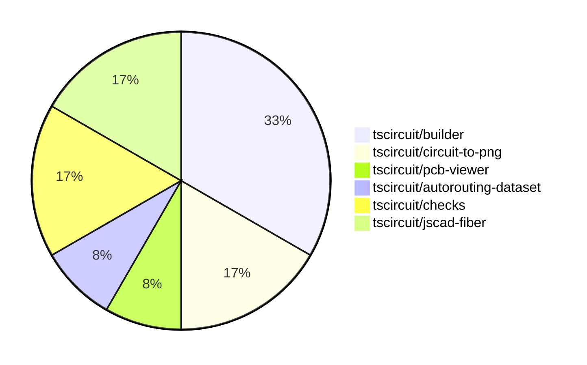

# contribution-tracker

Generates weekly contribution overviews for tscircuit contributors. Check out all
the [contribution overviews here](./contribution-overviews/)

* All PRs in the tscircuit org are scanned/summarized via Claude Haiku
* Claude classifies each Diff/PR as a Major, Minor or Tiny contribution
* All the PRs, summaries, and classifications are organized into charts and tables

The current week is shown below. There are 3 major sections:

* [Contributor Overview](#contributor-overview)
* [PRs by Repository](#prs-by-repository)
* [PRs by Contributor](#changes-by-contributor)

## Current Week

<!-- START_CURRENT_WEEK -->

# Contribution Overview 2024-07-27

## PRs by Repository

## Contributor Overview

| Contributor | 🐳 Major | 🐙 Minor | 🐌 Tiny |
|-------------|-------|-------|-------|
| imrishabh18 | 3 | 3 | 0 |
| seveibar | 4 | 0 | 0 |
| r-bt | 1 | 0 | 0 |
| Slaviiiii | 1 | 0 | 0 |

## Changes by Repository

### [tscircuit/builder](https://github.com/tscircuit/builder)

| PR # | Impact | Contributor | Description |
|------|--------|-------------|-------------|
| [#90](https://github.com/tscircuit/builder/pull/90) | 🐳 Major | imrishabh18 | Adds the ability to take a PCB snapshot and save it as an image file. |
| [#89](https://github.com/tscircuit/builder/pull/89) | 🐳 Major | imrishabh18 | Added a feature to write schematic snapshots as PNG files. |
| [#88](https://github.com/tscircuit/builder/pull/88) | 🐳 Major | imrishabh18 | Adds port IDs to the PCB trace route. |
| [#92](https://github.com/tscircuit/builder/pull/92) | 🐙 Minor | imrishabh18 | Add a suffix to the snapshot file names to differentiate between PCB and schematic snapshots. |

### [tscircuit/circuit-to-png](https://github.com/tscircuit/circuit-to-png)

| PR # | Impact | Contributor | Description |
|------|--------|-------------|-------------|
| [#10](https://github.com/tscircuit/circuit-to-png/pull/10) | 🐙 Minor | imrishabh18 | Add missing version field in package.json |
| [#9](https://github.com/tscircuit/circuit-to-png/pull/9) | 🐙 Minor | imrishabh18 | Fixes the latest lock file |

### [tscircuit/pcb-viewer](https://github.com/tscircuit/pcb-viewer)

| PR # | Impact | Contributor | Description |
|------|--------|-------------|-------------|
| [#31](https://github.com/tscircuit/pcb-viewer/pull/31) | 🐳 Major | seveibar | Introduce a rats nest toggle and allow setting the initial state of the PCBViewer component. |

### [tscircuit/autorouting-dataset](https://github.com/tscircuit/autorouting-dataset)

| PR # | Impact | Contributor | Description |
|------|--------|-------------|-------------|
| [#6](https://github.com/tscircuit/autorouting-dataset/pull/6) | 🐳 Major | seveibar | Add the `distance` prop to the `SingleTraceCircuit` component and update the `isValidSolution` function to handle the new `SimplifiedPcbTrace` type. |

### [tscircuit/checks](https://github.com/tscircuit/checks)

| PR # | Impact | Contributor | Description |
|------|--------|-------------|-------------|
| [#12](https://github.com/tscircuit/checks/pull/12) | 🐳 Major | seveibar | Fix port association failure when traceWidth makes them overlap |
| [#11](https://github.com/tscircuit/checks/pull/11) | 🐳 Major | seveibar | Improve the readability of error messages in the `check-each-pcb-port-connected` function by using selectors instead of IDs. |

### [tscircuit/jscad-fiber](https://github.com/tscircuit/jscad-fiber)

| PR # | Impact | Contributor | Description |
|------|--------|-------------|-------------|
| [#40](https://github.com/tscircuit/jscad-fiber/pull/40) | 🐳 Major | r-bt | Allow component props to be updated |
| [#39](https://github.com/tscircuit/jscad-fiber/pull/39) | 🐳 Major | Slaviiiii | Update the `Rotate` component to accept either `rotation` or `angles` props |

## Changes by Contributor

### [imrishabh18](https://github.com/imrishabh18)

| PR # | Impact | Description |
|------|--------|-------------|
| [#90](https://github.com/tscircuit/builder/pull/90) | 🐳 Major | Adds the ability to take a PCB snapshot and save it as an image file. |
| [#89](https://github.com/tscircuit/builder/pull/89) | 🐳 Major | Added a feature to write schematic snapshots as PNG files. |
| [#88](https://github.com/tscircuit/builder/pull/88) | 🐳 Major | Adds port IDs to the PCB trace route. |
| [#92](https://github.com/tscircuit/builder/pull/92) | 🐙 Minor | Add a suffix to the snapshot file names to differentiate between PCB and schematic snapshots. |
| [#10](https://github.com/tscircuit/circuit-to-png/pull/10) | 🐙 Minor | Add missing version field in package.json |
| [#9](https://github.com/tscircuit/circuit-to-png/pull/9) | 🐙 Minor | Fixes the latest lock file |

### [seveibar](https://github.com/seveibar)

| PR # | Impact | Description |
|------|--------|-------------|
| [#31](https://github.com/tscircuit/pcb-viewer/pull/31) | 🐳 Major | Introduce a rats nest toggle and allow setting the initial state of the PCBViewer component. |
| [#6](https://github.com/tscircuit/autorouting-dataset/pull/6) | 🐳 Major | Add the `distance` prop to the `SingleTraceCircuit` component and update the `isValidSolution` function to handle the new `SimplifiedPcbTrace` type. |
| [#12](https://github.com/tscircuit/checks/pull/12) | 🐳 Major | Fix port association failure when traceWidth makes them overlap |
| [#11](https://github.com/tscircuit/checks/pull/11) | 🐳 Major | Improve the readability of error messages in the `check-each-pcb-port-connected` function by using selectors instead of IDs. |

### [r-bt](https://github.com/r-bt)

| PR # | Impact | Description |
|------|--------|-------------|
| [#40](https://github.com/tscircuit/jscad-fiber/pull/40) | 🐳 Major | Allow component props to be updated |

### [Slaviiiii](https://github.com/Slaviiiii)

| PR # | Impact | Description |
|------|--------|-------------|
| [#39](https://github.com/tscircuit/jscad-fiber/pull/39) | 🐳 Major | Update the `Rotate` component to accept either `rotation` or `angles` props |

<!-- END_CURRENT_WEEK -->
