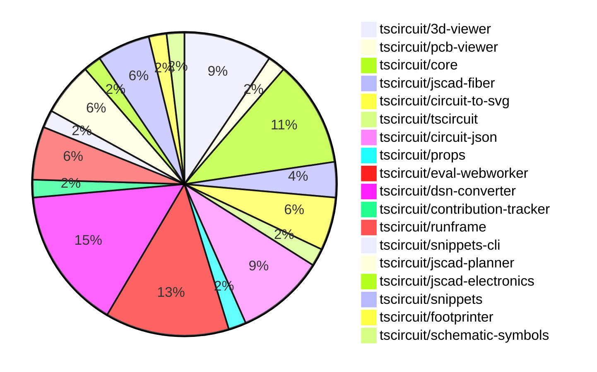

# contribution-tracker

Generates weekly contribution overviews for tscircuit contributors. Check out all
the [contribution overviews here](./contribution-overviews/)

* All PRs in the tscircuit org are scanned/summarized via Claude Haiku
* Claude classifies each Diff/PR as a Major, Minor or Tiny contribution
* All the PRs, summaries, and classifications are organized into charts and tables

The current week is shown below. There are 3 major sections:

* [Contributor Overview](#contributor-overview)
* [PRs by Repository](#prs-by-repository)
* [PRs by Contributor](#changes-by-contributor)

## Current Week

<!-- START_CURRENT_WEEK -->

# Contribution Overview 2024-12-11

## PRs by Repository

## Contributor Overview

| Contributor | 🐳 Major | 🐙 Minor | 🐌 Tiny | ⭐ | Issues Created |
|-------------|---------|---------|---------|-----|----------------|
| [seveibar](#seveibar) | 5 | 20 | 2 | 👑👑 | 56 |
| [imrishabh18](#imrishabh18) | 1 | 5 | 0 | ⭐⭐ | 10 |
| [Abse2001](#Abse2001) | 1 | 4 | 0 | ⭐⭐ | 4 |
| [ShiboSoftwareDev](#ShiboSoftwareDev) | 0 | 1 | 0 | ⭐⭐ | 5 |
| [AnasSarkiz](#AnasSarkiz) | 2 | 3 | 0 | ⭐⭐ | 2 |
| [devin-ai-integration[bot]](#devin-ai-integration[bot]) | 0 | 5 | 0 | ⭐ | 0 |
| [samyakshah3008](#samyakshah3008) | 0 | 1 | 0 |  | 0 |
| [techmannih](#techmannih) | 0 | 1 | 0 |  | 0 |
| [ni9999](#ni9999) | 0 | 1 | 0 |  | 0 |
| [Anshgrover23](#Anshgrover23) | 0 | 1 | 0 |  | 0 |

## Review Table

[reviews-received-hover]: ## "Number of reviews received for PRs for this contributor"
[approvals-received-hover]: ## "Number of approvals received for PRs this contributor authored"
[rejections-received-hover]: ## "Number of rejections received for PRs this contributor authored"
[prs-opened-hover]: ## "Number of PRs opened by this contributor"
[issues-created-hover]: ## "Number of issues created by this contributor"
[bountied-issues-hover]: ## "Number of issues this contributor created with a bounty"
[bountied-issue-$-hover]: ## "Total bounty amount placed on issues authored by this contributor"

| Contributor | Reviews Received | Approvals Received | Rejections Received | PRs Opened | PRs Merged | Issues Created | Bountied Issues | Bountied Issue $ |
|---|---|---|---|---|---|---|---|---|
| [Abse2001](#Abse2001) | 11 | 5 | 1 | 5 | 5 | 4 | 3 | 40 |
| [Bhavyajain21](#Bhavyajain21) | 0 | 0 | 0 | 1 | 0 | 0 | 0 | 0 |
| [samyakshah3008](#samyakshah3008) | 6 | 1 | 1 | 1 | 1 | 0 | 0 | 0 |
| [ShiboSoftwareDev](#ShiboSoftwareDev) | 3 | 1 | 0 | 3 | 1 | 5 | 2 | 75 |
| [devin-ai-integration[bot]](#devin-ai-integration[bot]) | 12 | 5 | 7 | 15 | 5 | 0 | 0 | 0 |
| [imrishabh18](#imrishabh18) | 3 | 1 | 0 | 8 | 6 | 10 | 5 | 40 |
| [seveibar](#seveibar) | 4 | 1 | 0 | 27 | 27 | 56 | 24 | 450 |
| [AnasSarkiz](#AnasSarkiz) | 13 | 4 | 1 | 5 | 5 | 2 | 0 | 0 |
| [techmannih](#techmannih) | 6 | 1 | 1 | 2 | 1 | 0 | 0 | 0 |
| [ni9999](#ni9999) | 5 | 1 | 2 | 1 | 1 | 0 | 0 | 0 |
| [RohittCodes](#RohittCodes) | 2 | 0 | 0 | 1 | 0 | 1 | 1 | 5 |
| [Anshgrover23](#Anshgrover23) | 3 | 1 | 1 | 2 | 1 | 0 | 0 | 0 |

## Changes by Repository

### [tscircuit/3d-viewer](https://github.com/tscircuit/3d-viewer)

| PR # | Impact | Contributor | Description |
|------|--------|-------------|-------------|
| [#67](https://github.com/tscircuit/3d-viewer/pull/67) | 🐳 Major | Abse2001 | Adds support for rendering silkscreen text on the PCB |
| [#64](https://github.com/tscircuit/3d-viewer/pull/64) | 🐳 Major | seveibar | Introduces error boundaries for components and fixes an issue with the jscad-fiber library. |
| [#68](https://github.com/tscircuit/3d-viewer/pull/68) | 🐙 Minor | devin-ai-integration[bot] | Prevent accidental text selection in tooltips when clicking in the 3D viewer. |
| [#69](https://github.com/tscircuit/3d-viewer/pull/69) | 🐙 Minor | seveibar | Adds support for Vercel building by removing the package lock file and updating dependencies. |
| [#62](https://github.com/tscircuit/3d-viewer/pull/62) | 🐙 Minor | techmannih | Add typechecking and formatting workflow |

### [tscircuit/pcb-viewer](https://github.com/tscircuit/pcb-viewer)

| PR # | Impact | Contributor | Description |
|------|--------|-------------|-------------|
| [#95](https://github.com/tscircuit/pcb-viewer/pull/95) | 🐙 Minor | Abse2001 | Fixes a bug where the overlay for pads would not correctly display the rotation of the pad. |

### [tscircuit/core](https://github.com/tscircuit/core)

| PR # | Impact | Contributor | Description |
|------|--------|-------------|-------------|
| [#422](https://github.com/tscircuit/core/pull/422) | 🐙 Minor | Abse2001 | Adds a new function `createDownwardNetLabelGroundSymbol` to create a downward-facing GND/ground symbol for a schematic net label. |
| [#419](https://github.com/tscircuit/core/pull/419) | 🐙 Minor | seveibar | Throws a better error when a component has both manual placement and explicit coordinates (`pcbX`/`pcbY`). |
| [#414](https://github.com/tscircuit/core/pull/414) | 🐙 Minor | seveibar | Skips the bundle size report if the `package.json` file was not changed in the pull request. |
| [#409](https://github.com/tscircuit/core/pull/409) | 🐙 Minor | AnasSarkiz | Implemented a new `pcbDisabled` option in the `Circuit.ts` class to disable all PCB elements. |
| [#397](https://github.com/tscircuit/core/pull/397) | 🐙 Minor | AnasSarkiz | Adds automatic schematic net labeling for complex traces between passive components and chips. |
| [#415](https://github.com/tscircuit/core/pull/415) | 🐌 Tiny | seveibar | Update the version of the "circuit-json" dependency from 0.0.108 to 0.0.114. |

### [tscircuit/jscad-fiber](https://github.com/tscircuit/jscad-fiber)

| PR # | Impact | Contributor | Description |
|------|--------|-------------|-------------|
| [#99](https://github.com/tscircuit/jscad-fiber/pull/99) | 🐙 Minor | Abse2001 | Fixes React 19 types in the project. |
| [#97](https://github.com/tscircuit/jscad-fiber/pull/97) | 🐙 Minor | seveibar | Adds a new test component for jscad-planner and unnests children in the create-host-config file. |

### [tscircuit/circuit-to-svg](https://github.com/tscircuit/circuit-to-svg)

| PR # | Impact | Contributor | Description |
|------|--------|-------------|-------------|
| [#148](https://github.com/tscircuit/circuit-to-svg/pull/148) | 🐳 Major | AnasSarkiz | Introduces a new feature to convert a circuit JSON representation into an assembly SVG diagram. |
| [#147](https://github.com/tscircuit/circuit-to-svg/pull/147) | 🐳 Major | AnasSarkiz | Introduces a new function `createSvgObjectsFromSchVoltageProbe` to create SVG objects for a schematic voltage probe. |
| [#149](https://github.com/tscircuit/circuit-to-svg/pull/149) | 🐙 Minor | Abse2001 | Adds support for displaying the GND symbol in the schematic net label. |

### [tscircuit/tscircuit](https://github.com/tscircuit/tscircuit)

| PR # | Impact | Contributor | Description |
|------|--------|-------------|-------------|
| [#484](https://github.com/tscircuit/tscircuit/pull/484) | 🐙 Minor | samyakshah3008 | The pull request enhances the README file of the tscircuit project, including adding a table of contents, an introduction to the project, example circuits, getting started information, and a contributing guide. |

### [tscircuit/circuit-json](https://github.com/tscircuit/circuit-json)

| PR # | Impact | Contributor | Description |
|------|--------|-------------|-------------|
| [#94](https://github.com/tscircuit/circuit-json/pull/94) | 🐳 Major | imrishabh18 | Introduces a new `pcb_group` type to define a group of components on a printed circuit board. |
| [#97](https://github.com/tscircuit/circuit-json/pull/97) | 🐙 Minor | ShiboSoftwareDev | The pull request fixes issues in the script used for generating documentation, including fixing the search for interfaces instead of types, fixing the generation of source docs on Windows, and fixing the missing closing comment tag for the table of contents. |
| [#96](https://github.com/tscircuit/circuit-json/pull/96) | 🐙 Minor | devin-ai-integration[bot] | Add CircuitJson type export representing array of circuit elements |
| [#88](https://github.com/tscircuit/circuit-json/pull/88) | 🐙 Minor | devin-ai-integration[bot] | Adds a new error type for conflicts between manual edits and explicit PCB coordinates. |
| [#89](https://github.com/tscircuit/circuit-json/pull/89) | 🐌 Tiny | seveibar | Updates the README.md file to add information about base units and element prefixes used in the project. |

### [tscircuit/props](https://github.com/tscircuit/props)

| PR # | Impact | Contributor | Description |
|------|--------|-------------|-------------|
| [#113](https://github.com/tscircuit/props/pull/113) | 🐙 Minor | devin-ai-integration[bot] | Adds a new `pinVariant` prop to the `crystal` component to support 2-pin and 4-pin variants. |

### [tscircuit/eval-webworker](https://github.com/tscircuit/eval-webworker)

| PR # | Impact | Contributor | Description |
|------|--------|-------------|-------------|
| [#26](https://github.com/tscircuit/eval-webworker/pull/26) | 🐙 Minor | devin-ai-integration[bot] | Adds type declarations for the blob-url module to resolve type errors when importing from '@tscircuit/eval-webworker/blob-url'. |
| [#28](https://github.com/tscircuit/eval-webworker/pull/28) | 🐙 Minor | seveibar | Refactors the build script to separate the building of the library and the webworker into two distinct tasks. |
| [#27](https://github.com/tscircuit/eval-webworker/pull/27) | 🐙 Minor | seveibar | Add verbose mode logging to the circuit web worker. |
| [#25](https://github.com/tscircuit/eval-webworker/pull/25) | 🐙 Minor | seveibar | Add `{ type: "module" }` to worker import |
| [#24](https://github.com/tscircuit/eval-webworker/pull/24) | 🐙 Minor | seveibar | Adds a script to build a blob URL from the packaged web worker code, and updates the build script to generate the blob URL. |
| [#20](https://github.com/tscircuit/eval-webworker/pull/20) | 🐙 Minor | seveibar | Add usage of `fsmap` to execute code using a virtual filesystem. |
| [#13](https://github.com/tscircuit/eval-webworker/pull/13) | 🐙 Minor | seveibar | Add a new method `executeWithFsMap` to the `CircuitWebWorker` interface and implement it in the `webWorker` object, allowing the execution of code with a virtual file system. |

### [tscircuit/dsn-converter](https://github.com/tscircuit/dsn-converter)

| PR # | Impact | Contributor | Description |
|------|--------|-------------|-------------|
| [#68](https://github.com/tscircuit/dsn-converter/pull/68) | 🐳 Major | seveibar | Remove Y Axis Flip in DSN PCB Conversion, Merge Dsn Session into Dsn PCB, Minor Refactoring, Lots of Debug statements, Include vias in DSN stringification, Improve Circuit Json to DSN PCB conversion for traces/vias |
| [#63](https://github.com/tscircuit/dsn-converter/pull/63) | 🐙 Minor | imrishabh18 | Fix trace width used in freerouting to be less than component width. |
| [#62](https://github.com/tscircuit/dsn-converter/pull/62) | 🐙 Minor | imrishabh18 | Fixes an issue with hover traces by updating the trace IDs to maintain proper linkage and ensuring that the sessionElements array is correctly populated. |
| [#60](https://github.com/tscircuit/dsn-converter/pull/60) | 🐙 Minor | imrishabh18 | Fixes a bug where the pin number for plated holes was not being derived from the source_port correctly. |
| [#59](https://github.com/tscircuit/dsn-converter/pull/59) | 🐙 Minor | imrishabh18 | Add default width and height for group subcircuit. |
| [#58](https://github.com/tscircuit/dsn-converter/pull/58) | 🐙 Minor | imrishabh18 | Fixes handling of pin numbers that are not integers (e.g., scientific notation) in the `processPin` function. |
| [#67](https://github.com/tscircuit/dsn-converter/pull/67) | 🐙 Minor | seveibar | Adds an assertion for smtpad layers check and fixes smtpads being on the top layer only. |
| [#66](https://github.com/tscircuit/dsn-converter/pull/66) | 🐙 Minor | seveibar | Add debug utils and a test that shows issues with converting to DSN PCB |

### [tscircuit/contribution-tracker](https://github.com/tscircuit/contribution-tracker)

| PR # | Impact | Contributor | Description |
|------|--------|-------------|-------------|
| [#22](https://github.com/tscircuit/contribution-tracker/pull/22) | 🐳 Major | seveibar | Refactor types, add support for json generation, fix claude caching, fix column titles |

### [tscircuit/runframe](https://github.com/tscircuit/runframe)

| PR # | Impact | Contributor | Description |
|------|--------|-------------|-------------|
| [#9](https://github.com/tscircuit/runframe/pull/9) | 🐳 Major | seveibar | Introduces the `RunFrameWithApi` component that integrates the `RunFrame` component with a backend API for file management. |
| [#14](https://github.com/tscircuit/runframe/pull/14) | 🐙 Minor | seveibar | Improves entrypoint guessing logic and fixes related build issues. |
| [#3](https://github.com/tscircuit/runframe/pull/3) | 🐙 Minor | seveibar | Add GitHub Actions workflows for format checking, type checking, and publishing to npm |

### [tscircuit/snippets-cli](https://github.com/tscircuit/snippets-cli)

| PR # | Impact | Contributor | Description |
|------|--------|-------------|-------------|
| [#6](https://github.com/tscircuit/snippets-cli/pull/6) | 🐳 Major | seveibar | Add GitHub Actions workflows for format checking, type checking, and publishing to NPM |

### [tscircuit/jscad-planner](https://github.com/tscircuit/jscad-planner)

| PR # | Impact | Contributor | Description |
|------|--------|-------------|-------------|
| [#7](https://github.com/tscircuit/jscad-planner/pull/7) | 🐙 Minor | seveibar | Adds support for automatically executing single-element arrays as JscadOperation |
| [#6](https://github.com/tscircuit/jscad-planner/pull/6) | 🐙 Minor | seveibar | Adds a specific error message when an array is passed in for execution. |
| [#5](https://github.com/tscircuit/jscad-planner/pull/5) | 🐙 Minor | seveibar | Improves the error message when an operation has an undefined type. |

### [tscircuit/jscad-electronics](https://github.com/tscircuit/jscad-electronics)

| PR # | Impact | Contributor | Description |
|------|--------|-------------|-------------|
| [#82](https://github.com/tscircuit/jscad-electronics/pull/82) | 🐙 Minor | seveibar | Update the code to use the JsCadView component instead of the deprecated JsCadFixture component. |

### [tscircuit/snippets](https://github.com/tscircuit/snippets)

| PR # | Impact | Contributor | Description |
|------|--------|-------------|-------------|
| [#385](https://github.com/tscircuit/snippets/pull/385) | 🐙 Minor | seveibar | Update the version of the `@tscircuit/3d-viewer` and `jscad-electronics` packages |
| [#363](https://github.com/tscircuit/snippets/pull/363) | 🐙 Minor | seveibar | Reduces the number of retries for Playwright tests in CI environments and disables the ability to manually edit snippet content in the sidebar. |
| [#365](https://github.com/tscircuit/snippets/pull/365) | 🐙 Minor | Anshgrover23 | Split the footprint-dialog.spec.ts file into multiple files for better organization and maintainability. |

### [tscircuit/footprinter](https://github.com/tscircuit/footprinter)

| PR # | Impact | Contributor | Description |
|------|--------|-------------|-------------|
| [#96](https://github.com/tscircuit/footprinter/pull/96) | 🐙 Minor | AnasSarkiz | The pull request adds support for height parameters to the `stampboard` and `stampreceiver` functions, allowing for more customization of the generated circuit elements. |

### [tscircuit/schematic-symbols](https://github.com/tscircuit/schematic-symbols)

| PR # | Impact | Contributor | Description |
|------|--------|-------------|-------------|
| [#210](https://github.com/tscircuit/schematic-symbols/pull/210) | 🐙 Minor | ni9999 | Adds a new 4-pin crystal symbol |

## Changes by Contributor

### [Abse2001](https://github.com/Abse2001)

| PR # | Impact | Description |
|------|--------|-------------|
| [#67](https://github.com/tscircuit/3d-viewer/pull/67) | 🐳 Major | Adds support for rendering silkscreen text on the PCB |
| [#95](https://github.com/tscircuit/pcb-viewer/pull/95) | 🐙 Minor | Fixes a bug where the overlay for pads would not correctly display the rotation of the pad. |
| [#422](https://github.com/tscircuit/core/pull/422) | 🐙 Minor | Adds a new function `createDownwardNetLabelGroundSymbol` to create a downward-facing GND/ground symbol for a schematic net label. |
| [#99](https://github.com/tscircuit/jscad-fiber/pull/99) | 🐙 Minor | Fixes React 19 types in the project. |
| [#149](https://github.com/tscircuit/circuit-to-svg/pull/149) | 🐙 Minor | Adds support for displaying the GND symbol in the schematic net label. |

### [samyakshah3008](https://github.com/samyakshah3008)

| PR # | Impact | Description |
|------|--------|-------------|
| [#484](https://github.com/tscircuit/tscircuit/pull/484) | 🐙 Minor | The pull request enhances the README file of the tscircuit project, including adding a table of contents, an introduction to the project, example circuits, getting started information, and a contributing guide. |

### [ShiboSoftwareDev](https://github.com/ShiboSoftwareDev)

| PR # | Impact | Description |
|------|--------|-------------|
| [#97](https://github.com/tscircuit/circuit-json/pull/97) | 🐙 Minor | The pull request fixes issues in the script used for generating documentation, including fixing the search for interfaces instead of types, fixing the generation of source docs on Windows, and fixing the missing closing comment tag for the table of contents. |

### [devin-ai-integration[bot]](https://github.com/devin-ai-integration[bot])

| PR # | Impact | Description |
|------|--------|-------------|
| [#96](https://github.com/tscircuit/circuit-json/pull/96) | 🐙 Minor | Add CircuitJson type export representing array of circuit elements |
| [#88](https://github.com/tscircuit/circuit-json/pull/88) | 🐙 Minor | Adds a new error type for conflicts between manual edits and explicit PCB coordinates. |
| [#113](https://github.com/tscircuit/props/pull/113) | 🐙 Minor | Adds a new `pinVariant` prop to the `crystal` component to support 2-pin and 4-pin variants. |
| [#68](https://github.com/tscircuit/3d-viewer/pull/68) | 🐙 Minor | Prevent accidental text selection in tooltips when clicking in the 3D viewer. |
| [#26](https://github.com/tscircuit/eval-webworker/pull/26) | 🐙 Minor | Adds type declarations for the blob-url module to resolve type errors when importing from '@tscircuit/eval-webworker/blob-url'. |

### [imrishabh18](https://github.com/imrishabh18)

| PR # | Impact | Description |
|------|--------|-------------|
| [#94](https://github.com/tscircuit/circuit-json/pull/94) | 🐳 Major | Introduces a new `pcb_group` type to define a group of components on a printed circuit board. |
| [#63](https://github.com/tscircuit/dsn-converter/pull/63) | 🐙 Minor | Fix trace width used in freerouting to be less than component width. |
| [#62](https://github.com/tscircuit/dsn-converter/pull/62) | 🐙 Minor | Fixes an issue with hover traces by updating the trace IDs to maintain proper linkage and ensuring that the sessionElements array is correctly populated. |
| [#60](https://github.com/tscircuit/dsn-converter/pull/60) | 🐙 Minor | Fixes a bug where the pin number for plated holes was not being derived from the source_port correctly. |
| [#59](https://github.com/tscircuit/dsn-converter/pull/59) | 🐙 Minor | Add default width and height for group subcircuit. |
| [#58](https://github.com/tscircuit/dsn-converter/pull/58) | 🐙 Minor | Fixes handling of pin numbers that are not integers (e.g., scientific notation) in the `processPin` function. |

### [seveibar](https://github.com/seveibar)

| PR # | Impact | Description |
|------|--------|-------------|
| [#64](https://github.com/tscircuit/3d-viewer/pull/64) | 🐳 Major | Introduces error boundaries for components and fixes an issue with the jscad-fiber library. |
| [#22](https://github.com/tscircuit/contribution-tracker/pull/22) | 🐳 Major | Refactor types, add support for json generation, fix claude caching, fix column titles |
| [#68](https://github.com/tscircuit/dsn-converter/pull/68) | 🐳 Major | Remove Y Axis Flip in DSN PCB Conversion, Merge Dsn Session into Dsn PCB, Minor Refactoring, Lots of Debug statements, Include vias in DSN stringification, Improve Circuit Json to DSN PCB conversion for traces/vias |
| [#9](https://github.com/tscircuit/runframe/pull/9) | 🐳 Major | Introduces the `RunFrameWithApi` component that integrates the `RunFrame` component with a backend API for file management. |
| [#6](https://github.com/tscircuit/snippets-cli/pull/6) | 🐳 Major | Add GitHub Actions workflows for format checking, type checking, and publishing to NPM |
| [#69](https://github.com/tscircuit/3d-viewer/pull/69) | 🐙 Minor | Adds support for Vercel building by removing the package lock file and updating dependencies. |
| [#7](https://github.com/tscircuit/jscad-planner/pull/7) | 🐙 Minor | Adds support for automatically executing single-element arrays as JscadOperation |
| [#6](https://github.com/tscircuit/jscad-planner/pull/6) | 🐙 Minor | Adds a specific error message when an array is passed in for execution. |
| [#5](https://github.com/tscircuit/jscad-planner/pull/5) | 🐙 Minor | Improves the error message when an operation has an undefined type. |
| [#419](https://github.com/tscircuit/core/pull/419) | 🐙 Minor | Throws a better error when a component has both manual placement and explicit coordinates (`pcbX`/`pcbY`). |
| [#414](https://github.com/tscircuit/core/pull/414) | 🐙 Minor | Skips the bundle size report if the `package.json` file was not changed in the pull request. |
| [#82](https://github.com/tscircuit/jscad-electronics/pull/82) | 🐙 Minor | Update the code to use the JsCadView component instead of the deprecated JsCadFixture component. |
| [#97](https://github.com/tscircuit/jscad-fiber/pull/97) | 🐙 Minor | Adds a new test component for jscad-planner and unnests children in the create-host-config file. |
| [#67](https://github.com/tscircuit/dsn-converter/pull/67) | 🐙 Minor | Adds an assertion for smtpad layers check and fixes smtpads being on the top layer only. |
| [#66](https://github.com/tscircuit/dsn-converter/pull/66) | 🐙 Minor | Add debug utils and a test that shows issues with converting to DSN PCB |
| [#385](https://github.com/tscircuit/snippets/pull/385) | 🐙 Minor | Update the version of the `@tscircuit/3d-viewer` and `jscad-electronics` packages |
| [#363](https://github.com/tscircuit/snippets/pull/363) | 🐙 Minor | Reduces the number of retries for Playwright tests in CI environments and disables the ability to manually edit snippet content in the sidebar. |
| [#28](https://github.com/tscircuit/eval-webworker/pull/28) | 🐙 Minor | Refactors the build script to separate the building of the library and the webworker into two distinct tasks. |
| [#27](https://github.com/tscircuit/eval-webworker/pull/27) | 🐙 Minor | Add verbose mode logging to the circuit web worker. |
| [#25](https://github.com/tscircuit/eval-webworker/pull/25) | 🐙 Minor | Add `{ type: "module" }` to worker import |
| [#24](https://github.com/tscircuit/eval-webworker/pull/24) | 🐙 Minor | Adds a script to build a blob URL from the packaged web worker code, and updates the build script to generate the blob URL. |
| [#20](https://github.com/tscircuit/eval-webworker/pull/20) | 🐙 Minor | Add usage of `fsmap` to execute code using a virtual filesystem. |
| [#13](https://github.com/tscircuit/eval-webworker/pull/13) | 🐙 Minor | Add a new method `executeWithFsMap` to the `CircuitWebWorker` interface and implement it in the `webWorker` object, allowing the execution of code with a virtual file system. |
| [#14](https://github.com/tscircuit/runframe/pull/14) | 🐙 Minor | Improves entrypoint guessing logic and fixes related build issues. |
| [#3](https://github.com/tscircuit/runframe/pull/3) | 🐙 Minor | Add GitHub Actions workflows for format checking, type checking, and publishing to npm |
| [#89](https://github.com/tscircuit/circuit-json/pull/89) | 🐌 Tiny | Updates the README.md file to add information about base units and element prefixes used in the project. |
| [#415](https://github.com/tscircuit/core/pull/415) | 🐌 Tiny | Update the version of the "circuit-json" dependency from 0.0.108 to 0.0.114. |

### [AnasSarkiz](https://github.com/AnasSarkiz)

| PR # | Impact | Description |
|------|--------|-------------|
| [#148](https://github.com/tscircuit/circuit-to-svg/pull/148) | 🐳 Major | Introduces a new feature to convert a circuit JSON representation into an assembly SVG diagram. |
| [#147](https://github.com/tscircuit/circuit-to-svg/pull/147) | 🐳 Major | Introduces a new function `createSvgObjectsFromSchVoltageProbe` to create SVG objects for a schematic voltage probe. |
| [#96](https://github.com/tscircuit/footprinter/pull/96) | 🐙 Minor | The pull request adds support for height parameters to the `stampboard` and `stampreceiver` functions, allowing for more customization of the generated circuit elements. |
| [#409](https://github.com/tscircuit/core/pull/409) | 🐙 Minor | Implemented a new `pcbDisabled` option in the `Circuit.ts` class to disable all PCB elements. |
| [#397](https://github.com/tscircuit/core/pull/397) | 🐙 Minor | Adds automatic schematic net labeling for complex traces between passive components and chips. |

### [techmannih](https://github.com/techmannih)

| PR # | Impact | Description |
|------|--------|-------------|
| [#62](https://github.com/tscircuit/3d-viewer/pull/62) | 🐙 Minor | Add typechecking and formatting workflow |

### [ni9999](https://github.com/ni9999)

| PR # | Impact | Description |
|------|--------|-------------|
| [#210](https://github.com/tscircuit/schematic-symbols/pull/210) | 🐙 Minor | Adds a new 4-pin crystal symbol |

### [Anshgrover23](https://github.com/Anshgrover23)

| PR # | Impact | Description |
|------|--------|-------------|
| [#365](https://github.com/tscircuit/snippets/pull/365) | 🐙 Minor | Split the footprint-dialog.spec.ts file into multiple files for better organization and maintainability. |

<!-- END_CURRENT_WEEK -->
