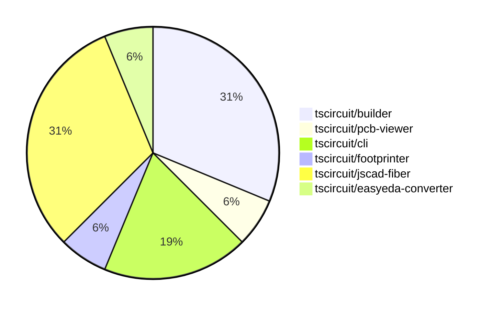

# contribution-tracker

Generates weekly contribution overviews for tscircuit contributors. Check out all
the [contribution overviews here](./contribution-overviews/)

* All PRs in the tscircuit org are scanned/summarized via Claude Haiku
* Claude classifies each Diff/PR as a Major, Minor or Tiny contribution
* All the PRs, summaries, and classifications are organized into charts and tables

The current week is shown below. There are 3 major sections:

* [Contributor Overview](#contributor-overview)
* [PRs by Repository](#prs-by-repository)
* [PRs by Contributor](#changes-by-contributor)

## Current Week

<!-- START_CURRENT_WEEK -->

# Contribution Overview 2024-07-13

## PRs by Repository

## Contributor Overview

| Contributor | 🐳 Major | 🐙 Minor | 🐌 Tiny |
|-------------|-------|-------|-------|
| seveibar | 7 | 4 | 0 |
| andrii-balitskyi | 1 | 1 | 0 |
| Slaviiiii | 3 | 0 | 0 |

## Changes by Repository

### [tscircuit/builder](https://github.com/tscircuit/builder)

| PR # | Impact | Contributor | Description |
|------|--------|-------------|-------------|
| [#74](https://github.com/tscircuit/builder/pull/74) | 🐳 Major | seveibar | Fix issue where failure to connect routes doesn't show an error that routes failed to connect |
| [#72](https://github.com/tscircuit/builder/pull/72) | 🐳 Major | seveibar | Fix default plated hole construction when there's no outer width or hole width |
| [#71](https://github.com/tscircuit/builder/pull/71) | 🐳 Major | seveibar | Fix default plated hole construction when there's no outer width or hole width |
| [#73](https://github.com/tscircuit/builder/pull/73) | 🐙 Minor | seveibar | Fix bad usage of `convert` function in `plated-hole-builder.ts` |
| [#70](https://github.com/tscircuit/builder/pull/70) | 🐙 Minor | seveibar | Upgrade the `@tscircuit/footprinter` dependency to version `0.0.44`. |

### [tscircuit/pcb-viewer](https://github.com/tscircuit/pcb-viewer)

| PR # | Impact | Contributor | Description |
|------|--------|-------------|-------------|
| [#25](https://github.com/tscircuit/pcb-viewer/pull/25) | 🐳 Major | seveibar | Fix port aliases not appearing for smtpads and plated holes for most components |

### [tscircuit/cli](https://github.com/tscircuit/cli)

| PR # | Impact | Contributor | Description |
|------|--------|-------------|-------------|
| [#99](https://github.com/tscircuit/cli/pull/99) | 🐳 Major | seveibar | Fix "over dragging" issue, add debug logging, fix LEVEL_NOT_FOUND error messages |
| [#98](https://github.com/tscircuit/cli/pull/98) | 🐙 Minor | seveibar | Add --no-cleanup flag to keep temporary entrypoints around |
| [#100](https://github.com/tscircuit/cli/pull/100) | 🐙 Minor | andrii-balitskyi | Improve 401 error messages by providing a more informative message and exiting the process with a non-zero status code. |

### [tscircuit/footprinter](https://github.com/tscircuit/footprinter)

| PR # | Impact | Contributor | Description |
|------|--------|-------------|-------------|
| [#11](https://github.com/tscircuit/footprinter/pull/11) | 🐳 Major | seveibar | Add a new `pinrow` function and a new `biome.json` configuration |

### [tscircuit/jscad-fiber](https://github.com/tscircuit/jscad-fiber)

| PR # | Impact | Contributor | Description |
|------|--------|-------------|-------------|
| [#16](https://github.com/tscircuit/jscad-fiber/pull/16) | 🐳 Major | seveibar | Introduce test and release workflows, fix exports, and add build system |
| [#19](https://github.com/tscircuit/jscad-fiber/pull/19) | 🐳 Major | Slaviiiii | Update functions and shapes |
| [#12](https://github.com/tscircuit/jscad-fiber/pull/12) | 🐳 Major | Slaviiiii | Adds support for three new extrusion types: helical, rectangular, and rotational, as well as a Project component. |
| [#15](https://github.com/tscircuit/jscad-fiber/pull/15) | 🐳 Major | Slaviiiii | Adds support for geometry colorization in the JSCAD fixture component. |
| [#20](https://github.com/tscircuit/jscad-fiber/pull/20) | 🐙 Minor | seveibar | Fix gh-pages not deploying by updating the predeploy script to build the cosmos-export instead of the library. |

### [tscircuit/easyeda-converter](https://github.com/tscircuit/easyeda-converter)

| PR # | Impact | Contributor | Description |
|------|--------|-------------|-------------|
| [#23](https://github.com/tscircuit/easyeda-converter/pull/23) | 🐳 Major | andrii-balitskyi | Add support for parsing RECT package detail shape |

## Changes by Contributor

### [seveibar](https://github.com/seveibar)

| PR # | Impact | Description |
|------|--------|-------------|
| [#74](https://github.com/tscircuit/builder/pull/74) | 🐳 Major | Fix issue where failure to connect routes doesn't show an error that routes failed to connect |
| [#72](https://github.com/tscircuit/builder/pull/72) | 🐳 Major | Fix default plated hole construction when there's no outer width or hole width |
| [#71](https://github.com/tscircuit/builder/pull/71) | 🐳 Major | Fix default plated hole construction when there's no outer width or hole width |
| [#25](https://github.com/tscircuit/pcb-viewer/pull/25) | 🐳 Major | Fix port aliases not appearing for smtpads and plated holes for most components |
| [#99](https://github.com/tscircuit/cli/pull/99) | 🐳 Major | Fix "over dragging" issue, add debug logging, fix LEVEL_NOT_FOUND error messages |
| [#11](https://github.com/tscircuit/footprinter/pull/11) | 🐳 Major | Add a new `pinrow` function and a new `biome.json` configuration |
| [#16](https://github.com/tscircuit/jscad-fiber/pull/16) | 🐳 Major | Introduce test and release workflows, fix exports, and add build system |
| [#73](https://github.com/tscircuit/builder/pull/73) | 🐙 Minor | Fix bad usage of `convert` function in `plated-hole-builder.ts` |
| [#70](https://github.com/tscircuit/builder/pull/70) | 🐙 Minor | Upgrade the `@tscircuit/footprinter` dependency to version `0.0.44`. |
| [#98](https://github.com/tscircuit/cli/pull/98) | 🐙 Minor | Add --no-cleanup flag to keep temporary entrypoints around |
| [#20](https://github.com/tscircuit/jscad-fiber/pull/20) | 🐙 Minor | Fix gh-pages not deploying by updating the predeploy script to build the cosmos-export instead of the library. |

### [andrii-balitskyi](https://github.com/andrii-balitskyi)

| PR # | Impact | Description |
|------|--------|-------------|
| [#23](https://github.com/tscircuit/easyeda-converter/pull/23) | 🐳 Major | Add support for parsing RECT package detail shape |
| [#100](https://github.com/tscircuit/cli/pull/100) | 🐙 Minor | Improve 401 error messages by providing a more informative message and exiting the process with a non-zero status code. |

### [Slaviiiii](https://github.com/Slaviiiii)

| PR # | Impact | Description |
|------|--------|-------------|
| [#19](https://github.com/tscircuit/jscad-fiber/pull/19) | 🐳 Major | Update functions and shapes |
| [#12](https://github.com/tscircuit/jscad-fiber/pull/12) | 🐳 Major | Adds support for three new extrusion types: helical, rectangular, and rotational, as well as a Project component. |
| [#15](https://github.com/tscircuit/jscad-fiber/pull/15) | 🐳 Major | Adds support for geometry colorization in the JSCAD fixture component. |

<!-- END_CURRENT_WEEK -->
