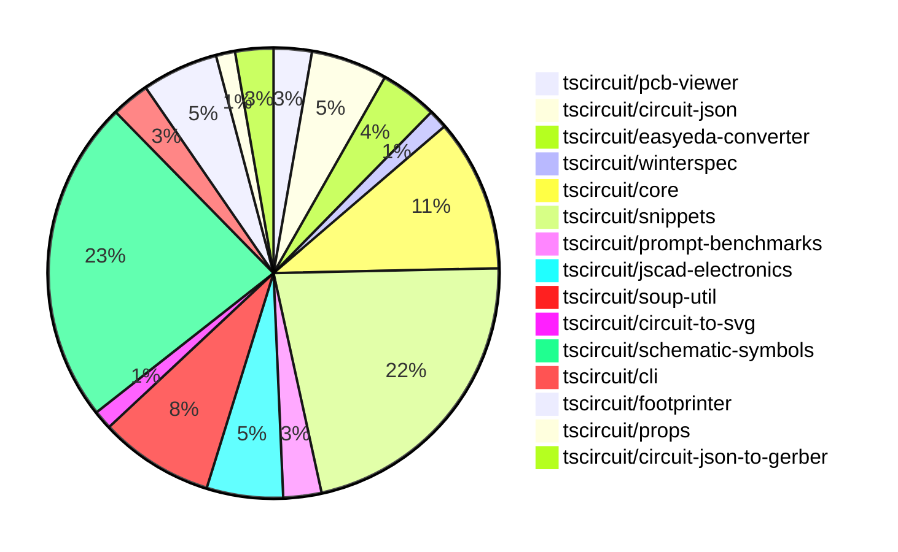

# contribution-tracker

Generates weekly contribution overviews for tscircuit contributors. Check out all
the [contribution overviews here](./contribution-overviews/)

* All PRs in the tscircuit org are scanned/summarized via Claude Haiku
* Claude classifies each Diff/PR as a Major, Minor or Tiny contribution
* All the PRs, summaries, and classifications are organized into charts and tables

The current week is shown below. There are 3 major sections:

* [Contributor Overview](#contributor-overview)
* [PRs by Repository](#prs-by-repository)
* [PRs by Contributor](#changes-by-contributor)

## Current Week

<!-- START_CURRENT_WEEK -->

# Contribution Overview 2024-10-05

## PRs by Repository

## Contributor Overview

| Contributor | 🐳 Major | 🐙 Minor | 🐌 Tiny |
|-------------|-------|-------|-------|
| seveibar | 20 | 3 | 0 |
| imrishabh18 | 5 | 8 | 2 |
| DhairyaMajmudar | 3 | 2 | 0 |
| anas-sarkez | 3 | 3 | 0 |
| ShiboSoftwareDev | 4 | 2 | 0 |
| andrii-balitskyi | 1 | 0 | 0 |
| aman1376 | 6 | 0 | 0 |
| Complexlity | 1 | 0 | 0 |
| 0xkafkaa | 4 | 0 | 0 |
| Timer00 | 1 | 0 | 0 |
| bbland1 | 3 | 1 | 0 |
| PALLAVIKHEDLE | 1 | 0 | 0 |

## Changes by Repository

### [tscircuit/pcb-viewer](https://github.com/tscircuit/pcb-viewer)

| PR # | Impact | Contributor | Description |
|------|--------|-------------|-------------|
| [#71](https://github.com/tscircuit/pcb-viewer/pull/71) | 🐳 Major | seveibar | Reverts the previous change that broke the bounds computation for the PCB viewer. |
| [#70](https://github.com/tscircuit/pcb-viewer/pull/70) | 🐳 Major | seveibar | Convert children rendering to core |

### [tscircuit/circuit-json](https://github.com/tscircuit/circuit-json)

| PR # | Impact | Contributor | Description |
|------|--------|-------------|-------------|
| [#55](https://github.com/tscircuit/circuit-json/pull/55) | 🐳 Major | seveibar | Add a GitHub workflow to run tests for the Bun runtime. |
| [#56](https://github.com/tscircuit/circuit-json/pull/56) | 🐳 Major | ShiboSoftwareDev | Add a new component `pcb_solder_paste` to the PCB library. |
| [#58](https://github.com/tscircuit/circuit-json/pull/58) | 🐙 Minor | imrishabh18 | Add a new optional field `display_value` of type `string` to the `SourceComponentBase` type. |
| [#57](https://github.com/tscircuit/circuit-json/pull/57) | 🐙 Minor | anas-sarkez | Add mil unit and format script |

### [tscircuit/easyeda-converter](https://github.com/tscircuit/easyeda-converter)

| PR # | Impact | Contributor | Description |
|------|--------|-------------|-------------|
| [#46](https://github.com/tscircuit/easyeda-converter/pull/46) | 🐳 Major | seveibar | Convert the project to use ESM (ECMAScript modules) instead of CommonJS. |
| [#45](https://github.com/tscircuit/easyeda-converter/pull/45) | 🐳 Major | seveibar | Update the README with more usage details, migrate to using circuit-json and @tscircuit/soup-util libraries, and remove the builder dependency. |
| [#44](https://github.com/tscircuit/easyeda-converter/pull/44) | 🐳 Major | andrii-balitskyi | Fix build and add typecheck workflow |

### [tscircuit/winterspec](https://github.com/tscircuit/winterspec)

| PR # | Impact | Contributor | Description |
|------|--------|-------------|-------------|
| [#12](https://github.com/tscircuit/winterspec/pull/12) | 🐳 Major | seveibar | Fix issue with loading routes directory and update test fixtures |

### [tscircuit/core](https://github.com/tscircuit/core)

| PR # | Impact | Contributor | Description |
|------|--------|-------------|-------------|
| [#149](https://github.com/tscircuit/core/pull/149) | 🐳 Major | seveibar | Introduce the `useRenderedCircuit` hook and set up a hook testing system |
| [#137](https://github.com/tscircuit/core/pull/137) | 🐳 Major | seveibar | Improve the handling of invalid prop errors by adding a custom `InvalidProps` error class that provides a more detailed and user-friendly error message. |
| [#151](https://github.com/tscircuit/core/pull/151) | 🐳 Major | imrishabh18 | Adds a new primitive component called "Via" to the library. |
| [#139](https://github.com/tscircuit/core/pull/139) | 🐳 Major | imrishabh18 | Fix chip placement issue by updating the logic for calculating the dimensions of the schematic box. |
| [#136](https://github.com/tscircuit/core/pull/136) | 🐳 Major | ShiboSoftwareDev | Create a new `pcb_solder_paste` component from the existing `smtpads` component. |
| [#143](https://github.com/tscircuit/core/pull/143) | 🐙 Minor | imrishabh18 | Update the `@tscircuit/soup-util` dependency to a smaller bundle size |
| [#141](https://github.com/tscircuit/core/pull/141) | 🐙 Minor | imrishabh18 | Updates the footprinter dependency version without using lodash. |
| [#138](https://github.com/tscircuit/core/pull/138) | 🐙 Minor | ShiboSoftwareDev | Inherit the `_setPositionFromLayout` behavior from `pcb_smt_pad` to `pcb_solder_paste`. |

### [tscircuit/snippets](https://github.com/tscircuit/snippets)

| PR # | Impact | Contributor | Description |
|------|--------|-------------|-------------|
| [#48](https://github.com/tscircuit/snippets/pull/48) | 🐳 Major | seveibar | Import Runner Part 1 and fix dashboard always loading from hardcoded "seveibar/" |
| [#45](https://github.com/tscircuit/snippets/pull/45) | 🐳 Major | seveibar | Modify the `useSaveSnippet` hook to support saving the DTS (Definition Type Script) content to the database. |
| [#42](https://github.com/tscircuit/snippets/pull/42) | 🐳 Major | seveibar | Adds a new field `compiled_js` to the snippet schema and supports updating/creating snippets with compiled JavaScript. |
| [#40](https://github.com/tscircuit/snippets/pull/40) | 🐳 Major | seveibar | Add database seeding, fix view snippets page, and load TypeScript types for imported snippets. |
| [#39](https://github.com/tscircuit/snippets/pull/39) | 🐳 Major | seveibar | Introduce a TypeScript-aware code editor with features like autocomplete, linting, and hover functionality. |
| [#36](https://github.com/tscircuit/snippets/pull/36) | 🐳 Major | seveibar | Adds a feature to switch between a fake API and a real API for the snippets application. |
| [#32](https://github.com/tscircuit/snippets/pull/32) | 🐳 Major | seveibar | Add a dialog to import JLCPCB components and generate a code snippet from them. |
| [#23](https://github.com/tscircuit/snippets/pull/23) | 🐳 Major | seveibar | Introduce AI chat improvements, including bug fixes and enhancements, and improve the handling of links in the interface. |
| [#21](https://github.com/tscircuit/snippets/pull/21) | 🐳 Major | seveibar | Add an empty state for the AI chat interface and display the user's account balance in the header. |
| [#12](https://github.com/tscircuit/snippets/pull/12) | 🐳 Major | seveibar | Adds new entities (sessions, login pages, accounts) to the database schema and updates the database client with corresponding CRUD operations. |
| [#37](https://github.com/tscircuit/snippets/pull/37) | 🐳 Major | DhairyaMajmudar | Responsify the home page and fix the footer HTML structure |
| [#33](https://github.com/tscircuit/snippets/pull/33) | 🐳 Major | PALLAVIKHEDLE | Modify the 'New' button to show a dropdown on hover and navigate to the '/editor' page on click. |
| [#35](https://github.com/tscircuit/snippets/pull/35) | 🐙 Minor | seveibar | Reverts the "new button hover changes" by removing the hover effect and click navigation from the dropdown menu trigger button. |
| [#13](https://github.com/tscircuit/snippets/pull/13) | 🐙 Minor | seveibar | Formatting the repo, adding Vercel rewrites, and making minor fixes. |
| [#28](https://github.com/tscircuit/snippets/pull/28) | 🐙 Minor | DhairyaMajmudar | Adds rules for enforcing camelCase naming convention in the biome.json file. |
| [#10](https://github.com/tscircuit/snippets/pull/10) | 🐙 Minor | DhairyaMajmudar | The pull request adds functionality to the "Onboarding Tips" section, allowing the user to hide it by clicking on the cross button. |

### [tscircuit/prompt-benchmarks](https://github.com/tscircuit/prompt-benchmarks)

| PR # | Impact | Contributor | Description |
|------|--------|-------------|-------------|
| [#3](https://github.com/tscircuit/prompt-benchmarks/pull/3) | 🐳 Major | seveibar | Introduces a new function `safeCompileDts` that safely compiles TypeScript code to a .d.ts file using a virtual file system. |
| [#2](https://github.com/tscircuit/prompt-benchmarks/pull/2) | 🐳 Major | seveibar | Introduce a feature to support running generated code and testing with threshold acceptance. |

### [tscircuit/jscad-electronics](https://github.com/tscircuit/jscad-electronics)

| PR # | Impact | Contributor | Description |
|------|--------|-------------|-------------|
| [#62](https://github.com/tscircuit/jscad-electronics/pull/62) | 🐳 Major | anas-sarkez | Updated the soup dependency to circuit-json |
| [#58](https://github.com/tscircuit/jscad-electronics/pull/58) | 🐳 Major | anas-sarkez | Fixed the dimensions and positions of the leads in the SOT-23, SOT-563, and SOT-723 component models to match their respective footprints. |
| [#61](https://github.com/tscircuit/jscad-electronics/pull/61) | 🐙 Minor | seveibar | Add CODEOWNERS file to specify code owners for the project |
| [#60](https://github.com/tscircuit/jscad-electronics/pull/60) | 🐙 Minor | anas-sarkez | Added a `showGrid` property to the `JsCadFixture` component in all test examples. |

### [tscircuit/soup-util](https://github.com/tscircuit/soup-util)

| PR # | Impact | Contributor | Description |
|------|--------|-------------|-------------|
| [#20](https://github.com/tscircuit/soup-util/pull/20) | 🐳 Major | imrishabh18 | Ports the `findBoundsAndCenter` function from the `builder` repository to this repository. |
| [#22](https://github.com/tscircuit/soup-util/pull/22) | 🐙 Minor | imrishabh18 | Revert the previous change that exported a function. |
| [#21](https://github.com/tscircuit/soup-util/pull/21) | 🐙 Minor | imrishabh18 | Export the function `find-bounds-and-center` from the library. |
| [#18](https://github.com/tscircuit/soup-util/pull/18) | 🐙 Minor | imrishabh18 | Update the `circuit-json` dependency to version `0.0.85`. |
| [#19](https://github.com/tscircuit/soup-util/pull/19) | 🐌 Tiny | imrishabh18 | Update the lock file to ensure dependencies are consistently installed. |
| [#17](https://github.com/tscircuit/soup-util/pull/17) | 🐌 Tiny | imrishabh18 | Removes an unused dependency from the project. |

### [tscircuit/circuit-to-svg](https://github.com/tscircuit/circuit-to-svg)

| PR # | Impact | Contributor | Description |
|------|--------|-------------|-------------|
| [#82](https://github.com/tscircuit/circuit-to-svg/pull/82) | 🐳 Major | imrishabh18 | Fix chip port placement in the schematic SVG conversion process. |

### [tscircuit/schematic-symbols](https://github.com/tscircuit/schematic-symbols)

| PR # | Impact | Contributor | Description |
|------|--------|-------------|-------------|
| [#135](https://github.com/tscircuit/schematic-symbols/pull/135) | 🐳 Major | imrishabh18 | Adding support for cubic bezier curve in the `svgPathToPoints` function. |
| [#154](https://github.com/tscircuit/schematic-symbols/pull/154) | 🐳 Major | aman1376 | Add a new p-channel E-MOSFET transistor symbol in JSON and SVG formats. |
| [#151](https://github.com/tscircuit/schematic-symbols/pull/151) | 🐳 Major | aman1376 | Add a new n-channel MOSFET transistor symbol |
| [#152](https://github.com/tscircuit/schematic-symbols/pull/152) | 🐳 Major | aman1376 | Add a new P-channel DMOSFET transistor symbol. |
| [#150](https://github.com/tscircuit/schematic-symbols/pull/150) | 🐳 Major | aman1376 | Add a new N-JFET transistor symbol to the project. |
| [#149](https://github.com/tscircuit/schematic-symbols/pull/149) | 🐳 Major | aman1376 | Add a PJFET transistor symbol and configuration |
| [#130](https://github.com/tscircuit/schematic-symbols/pull/130) | 🐳 Major | aman1376 | Introduce a new feature to generate a TypeScript type for base symbol names. |
| [#102](https://github.com/tscircuit/schematic-symbols/pull/102) | 🐳 Major | Complexlity | Modify the `generate` function to add a `Primitive` type for the `texts` property in the generated TypeScript file. |
| [#145](https://github.com/tscircuit/schematic-symbols/pull/145) | 🐳 Major | 0xkafkaa | Add a new SVG symbol for a crystal component |
| [#146](https://github.com/tscircuit/schematic-symbols/pull/146) | 🐳 Major | 0xkafkaa | Add a new resonator feature with various paths and text elements. |
| [#137](https://github.com/tscircuit/schematic-symbols/pull/137) | 🐳 Major | 0xkafkaa | Add a new component called "step_recovery_diode" to the project. |
| [#133](https://github.com/tscircuit/schematic-symbols/pull/133) | 🐳 Major | 0xkafkaa | Adds a new SVG file and a JSON file for a Gunn diode symbol. |
| [#136](https://github.com/tscircuit/schematic-symbols/pull/136) | 🐳 Major | Timer00 | Add snapshot testing for SVG symbols using the `bun-match-svg` library |
| [#132](https://github.com/tscircuit/schematic-symbols/pull/132) | 🐳 Major | bbland1 | Fixes an issue with the center diamond not being centered for some symbols |
| [#110](https://github.com/tscircuit/schematic-symbols/pull/110) | 🐳 Major | bbland1 | Add diac SVG and TypeScript files |
| [#111](https://github.com/tscircuit/schematic-symbols/pull/111) | 🐳 Major | bbland1 | Add SVG and TypeScript definition for a unijunction transistor symbol |
| [#131](https://github.com/tscircuit/schematic-symbols/pull/131) | 🐙 Minor | bbland1 | Fixing the reference point (REF) in the diac symbol. |

### [tscircuit/cli](https://github.com/tscircuit/cli)

| PR # | Impact | Contributor | Description |
|------|--------|-------------|-------------|
| [#215](https://github.com/tscircuit/cli/pull/215) | 🐳 Major | DhairyaMajmudar | Refactored files to use better TypeScript types by removing `any` keywords and replacing them with suitable types, and removing unused imports. |
| [#226](https://github.com/tscircuit/cli/pull/226) | 🐙 Minor | imrishabh18 | Update the `circuit-to-svg` dependency to the latest version. |

### [tscircuit/footprinter](https://github.com/tscircuit/footprinter)

| PR # | Impact | Contributor | Description |
|------|--------|-------------|-------------|
| [#48](https://github.com/tscircuit/footprinter/pull/48) | 🐳 Major | DhairyaMajmudar | Adding SOT363 circuit |
| [#56](https://github.com/tscircuit/footprinter/pull/56) | 🐳 Major | anas-sarkez | Migrate from AVA to Bun test framework |
| [#55](https://github.com/tscircuit/footprinter/pull/55) | 🐙 Minor | imrishabh18 | Update the `@tscircuit/mm` dependency to the latest version, without requiring `lodash`. |
| [#58](https://github.com/tscircuit/footprinter/pull/58) | 🐙 Minor | anas-sarkez | Modified test files and added preload |

### [tscircuit/props](https://github.com/tscircuit/props)

| PR # | Impact | Contributor | Description |
|------|--------|-------------|-------------|
| [#56](https://github.com/tscircuit/props/pull/56) | 🐳 Major | ShiboSoftwareDev | Introduce a new component called "solderpaste" that supports both rectangular and circular solder paste designs. |

### [tscircuit/circuit-json-to-gerber](https://github.com/tscircuit/circuit-json-to-gerber)

| PR # | Impact | Contributor | Description |
|------|--------|-------------|-------------|
| [#18](https://github.com/tscircuit/circuit-json-to-gerber/pull/18) | 🐳 Major | ShiboSoftwareDev | Implemented support for PCB solder paste layer in the Gerber converter |
| [#19](https://github.com/tscircuit/circuit-json-to-gerber/pull/19) | 🐙 Minor | ShiboSoftwareDev | Fixed excellon-drill snapshot test |

## Changes by Contributor

### [seveibar](https://github.com/seveibar)

| PR # | Impact | Description |
|------|--------|-------------|
| [#71](https://github.com/tscircuit/pcb-viewer/pull/71) | 🐳 Major | Reverts the previous change that broke the bounds computation for the PCB viewer. |
| [#70](https://github.com/tscircuit/pcb-viewer/pull/70) | 🐳 Major | Convert children rendering to core |
| [#55](https://github.com/tscircuit/circuit-json/pull/55) | 🐳 Major | Add a GitHub workflow to run tests for the Bun runtime. |
| [#46](https://github.com/tscircuit/easyeda-converter/pull/46) | 🐳 Major | Convert the project to use ESM (ECMAScript modules) instead of CommonJS. |
| [#45](https://github.com/tscircuit/easyeda-converter/pull/45) | 🐳 Major | Update the README with more usage details, migrate to using circuit-json and @tscircuit/soup-util libraries, and remove the builder dependency. |
| [#12](https://github.com/tscircuit/winterspec/pull/12) | 🐳 Major | Fix issue with loading routes directory and update test fixtures |
| [#149](https://github.com/tscircuit/core/pull/149) | 🐳 Major | Introduce the `useRenderedCircuit` hook and set up a hook testing system |
| [#137](https://github.com/tscircuit/core/pull/137) | 🐳 Major | Improve the handling of invalid prop errors by adding a custom `InvalidProps` error class that provides a more detailed and user-friendly error message. |
| [#48](https://github.com/tscircuit/snippets/pull/48) | 🐳 Major | Import Runner Part 1 and fix dashboard always loading from hardcoded "seveibar/" |
| [#45](https://github.com/tscircuit/snippets/pull/45) | 🐳 Major | Modify the `useSaveSnippet` hook to support saving the DTS (Definition Type Script) content to the database. |
| [#42](https://github.com/tscircuit/snippets/pull/42) | 🐳 Major | Adds a new field `compiled_js` to the snippet schema and supports updating/creating snippets with compiled JavaScript. |
| [#40](https://github.com/tscircuit/snippets/pull/40) | 🐳 Major | Add database seeding, fix view snippets page, and load TypeScript types for imported snippets. |
| [#39](https://github.com/tscircuit/snippets/pull/39) | 🐳 Major | Introduce a TypeScript-aware code editor with features like autocomplete, linting, and hover functionality. |
| [#36](https://github.com/tscircuit/snippets/pull/36) | 🐳 Major | Adds a feature to switch between a fake API and a real API for the snippets application. |
| [#32](https://github.com/tscircuit/snippets/pull/32) | 🐳 Major | Add a dialog to import JLCPCB components and generate a code snippet from them. |
| [#23](https://github.com/tscircuit/snippets/pull/23) | 🐳 Major | Introduce AI chat improvements, including bug fixes and enhancements, and improve the handling of links in the interface. |
| [#21](https://github.com/tscircuit/snippets/pull/21) | 🐳 Major | Add an empty state for the AI chat interface and display the user's account balance in the header. |
| [#12](https://github.com/tscircuit/snippets/pull/12) | 🐳 Major | Adds new entities (sessions, login pages, accounts) to the database schema and updates the database client with corresponding CRUD operations. |
| [#3](https://github.com/tscircuit/prompt-benchmarks/pull/3) | 🐳 Major | Introduces a new function `safeCompileDts` that safely compiles TypeScript code to a .d.ts file using a virtual file system. |
| [#2](https://github.com/tscircuit/prompt-benchmarks/pull/2) | 🐳 Major | Introduce a feature to support running generated code and testing with threshold acceptance. |
| [#61](https://github.com/tscircuit/jscad-electronics/pull/61) | 🐙 Minor | Add CODEOWNERS file to specify code owners for the project |
| [#35](https://github.com/tscircuit/snippets/pull/35) | 🐙 Minor | Reverts the "new button hover changes" by removing the hover effect and click navigation from the dropdown menu trigger button. |
| [#13](https://github.com/tscircuit/snippets/pull/13) | 🐙 Minor | Formatting the repo, adding Vercel rewrites, and making minor fixes. |

### [imrishabh18](https://github.com/imrishabh18)

| PR # | Impact | Description |
|------|--------|-------------|
| [#20](https://github.com/tscircuit/soup-util/pull/20) | 🐳 Major | Ports the `findBoundsAndCenter` function from the `builder` repository to this repository. |
| [#151](https://github.com/tscircuit/core/pull/151) | 🐳 Major | Adds a new primitive component called "Via" to the library. |
| [#139](https://github.com/tscircuit/core/pull/139) | 🐳 Major | Fix chip placement issue by updating the logic for calculating the dimensions of the schematic box. |
| [#82](https://github.com/tscircuit/circuit-to-svg/pull/82) | 🐳 Major | Fix chip port placement in the schematic SVG conversion process. |
| [#135](https://github.com/tscircuit/schematic-symbols/pull/135) | 🐳 Major | Adding support for cubic bezier curve in the `svgPathToPoints` function. |
| [#226](https://github.com/tscircuit/cli/pull/226) | 🐙 Minor | Update the `circuit-to-svg` dependency to the latest version. |
| [#58](https://github.com/tscircuit/circuit-json/pull/58) | 🐙 Minor | Add a new optional field `display_value` of type `string` to the `SourceComponentBase` type. |
| [#22](https://github.com/tscircuit/soup-util/pull/22) | 🐙 Minor | Revert the previous change that exported a function. |
| [#21](https://github.com/tscircuit/soup-util/pull/21) | 🐙 Minor | Export the function `find-bounds-and-center` from the library. |
| [#18](https://github.com/tscircuit/soup-util/pull/18) | 🐙 Minor | Update the `circuit-json` dependency to version `0.0.85`. |
| [#55](https://github.com/tscircuit/footprinter/pull/55) | 🐙 Minor | Update the `@tscircuit/mm` dependency to the latest version, without requiring `lodash`. |
| [#143](https://github.com/tscircuit/core/pull/143) | 🐙 Minor | Update the `@tscircuit/soup-util` dependency to a smaller bundle size |
| [#141](https://github.com/tscircuit/core/pull/141) | 🐙 Minor | Updates the footprinter dependency version without using lodash. |
| [#19](https://github.com/tscircuit/soup-util/pull/19) | 🐌 Tiny | Update the lock file to ensure dependencies are consistently installed. |
| [#17](https://github.com/tscircuit/soup-util/pull/17) | 🐌 Tiny | Removes an unused dependency from the project. |

### [DhairyaMajmudar](https://github.com/DhairyaMajmudar)

| PR # | Impact | Description |
|------|--------|-------------|
| [#215](https://github.com/tscircuit/cli/pull/215) | 🐳 Major | Refactored files to use better TypeScript types by removing `any` keywords and replacing them with suitable types, and removing unused imports. |
| [#48](https://github.com/tscircuit/footprinter/pull/48) | 🐳 Major | Adding SOT363 circuit |
| [#37](https://github.com/tscircuit/snippets/pull/37) | 🐳 Major | Responsify the home page and fix the footer HTML structure |
| [#28](https://github.com/tscircuit/snippets/pull/28) | 🐙 Minor | Adds rules for enforcing camelCase naming convention in the biome.json file. |
| [#10](https://github.com/tscircuit/snippets/pull/10) | 🐙 Minor | The pull request adds functionality to the "Onboarding Tips" section, allowing the user to hide it by clicking on the cross button. |

### [anas-sarkez](https://github.com/anas-sarkez)

| PR # | Impact | Description |
|------|--------|-------------|
| [#56](https://github.com/tscircuit/footprinter/pull/56) | 🐳 Major | Migrate from AVA to Bun test framework |
| [#62](https://github.com/tscircuit/jscad-electronics/pull/62) | 🐳 Major | Updated the soup dependency to circuit-json |
| [#58](https://github.com/tscircuit/jscad-electronics/pull/58) | 🐳 Major | Fixed the dimensions and positions of the leads in the SOT-23, SOT-563, and SOT-723 component models to match their respective footprints. |
| [#57](https://github.com/tscircuit/circuit-json/pull/57) | 🐙 Minor | Add mil unit and format script |
| [#58](https://github.com/tscircuit/footprinter/pull/58) | 🐙 Minor | Modified test files and added preload |
| [#60](https://github.com/tscircuit/jscad-electronics/pull/60) | 🐙 Minor | Added a `showGrid` property to the `JsCadFixture` component in all test examples. |

### [ShiboSoftwareDev](https://github.com/ShiboSoftwareDev)

| PR # | Impact | Description |
|------|--------|-------------|
| [#56](https://github.com/tscircuit/circuit-json/pull/56) | 🐳 Major | Add a new component `pcb_solder_paste` to the PCB library. |
| [#56](https://github.com/tscircuit/props/pull/56) | 🐳 Major | Introduce a new component called "solderpaste" that supports both rectangular and circular solder paste designs. |
| [#136](https://github.com/tscircuit/core/pull/136) | 🐳 Major | Create a new `pcb_solder_paste` component from the existing `smtpads` component. |
| [#18](https://github.com/tscircuit/circuit-json-to-gerber/pull/18) | 🐳 Major | Implemented support for PCB solder paste layer in the Gerber converter |
| [#138](https://github.com/tscircuit/core/pull/138) | 🐙 Minor | Inherit the `_setPositionFromLayout` behavior from `pcb_smt_pad` to `pcb_solder_paste`. |
| [#19](https://github.com/tscircuit/circuit-json-to-gerber/pull/19) | 🐙 Minor | Fixed excellon-drill snapshot test |

### [andrii-balitskyi](https://github.com/andrii-balitskyi)

| PR # | Impact | Description |
|------|--------|-------------|
| [#44](https://github.com/tscircuit/easyeda-converter/pull/44) | 🐳 Major | Fix build and add typecheck workflow |

### [aman1376](https://github.com/aman1376)

| PR # | Impact | Description |
|------|--------|-------------|
| [#154](https://github.com/tscircuit/schematic-symbols/pull/154) | 🐳 Major | Add a new p-channel E-MOSFET transistor symbol in JSON and SVG formats. |
| [#151](https://github.com/tscircuit/schematic-symbols/pull/151) | 🐳 Major | Add a new n-channel MOSFET transistor symbol |
| [#152](https://github.com/tscircuit/schematic-symbols/pull/152) | 🐳 Major | Add a new P-channel DMOSFET transistor symbol. |
| [#150](https://github.com/tscircuit/schematic-symbols/pull/150) | 🐳 Major | Add a new N-JFET transistor symbol to the project. |
| [#149](https://github.com/tscircuit/schematic-symbols/pull/149) | 🐳 Major | Add a PJFET transistor symbol and configuration |
| [#130](https://github.com/tscircuit/schematic-symbols/pull/130) | 🐳 Major | Introduce a new feature to generate a TypeScript type for base symbol names. |

### [Complexlity](https://github.com/Complexlity)

| PR # | Impact | Description |
|------|--------|-------------|
| [#102](https://github.com/tscircuit/schematic-symbols/pull/102) | 🐳 Major | Modify the `generate` function to add a `Primitive` type for the `texts` property in the generated TypeScript file. |

### [0xkafkaa](https://github.com/0xkafkaa)

| PR # | Impact | Description |
|------|--------|-------------|
| [#145](https://github.com/tscircuit/schematic-symbols/pull/145) | 🐳 Major | Add a new SVG symbol for a crystal component |
| [#146](https://github.com/tscircuit/schematic-symbols/pull/146) | 🐳 Major | Add a new resonator feature with various paths and text elements. |
| [#137](https://github.com/tscircuit/schematic-symbols/pull/137) | 🐳 Major | Add a new component called "step_recovery_diode" to the project. |
| [#133](https://github.com/tscircuit/schematic-symbols/pull/133) | 🐳 Major | Adds a new SVG file and a JSON file for a Gunn diode symbol. |

### [Timer00](https://github.com/Timer00)

| PR # | Impact | Description |
|------|--------|-------------|
| [#136](https://github.com/tscircuit/schematic-symbols/pull/136) | 🐳 Major | Add snapshot testing for SVG symbols using the `bun-match-svg` library |

### [bbland1](https://github.com/bbland1)

| PR # | Impact | Description |
|------|--------|-------------|
| [#132](https://github.com/tscircuit/schematic-symbols/pull/132) | 🐳 Major | Fixes an issue with the center diamond not being centered for some symbols |
| [#110](https://github.com/tscircuit/schematic-symbols/pull/110) | 🐳 Major | Add diac SVG and TypeScript files |
| [#111](https://github.com/tscircuit/schematic-symbols/pull/111) | 🐳 Major | Add SVG and TypeScript definition for a unijunction transistor symbol |
| [#131](https://github.com/tscircuit/schematic-symbols/pull/131) | 🐙 Minor | Fixing the reference point (REF) in the diac symbol. |

### [PALLAVIKHEDLE](https://github.com/PALLAVIKHEDLE)

| PR # | Impact | Description |
|------|--------|-------------|
| [#33](https://github.com/tscircuit/snippets/pull/33) | 🐳 Major | Modify the 'New' button to show a dropdown on hover and navigate to the '/editor' page on click. |

<!-- END_CURRENT_WEEK -->
