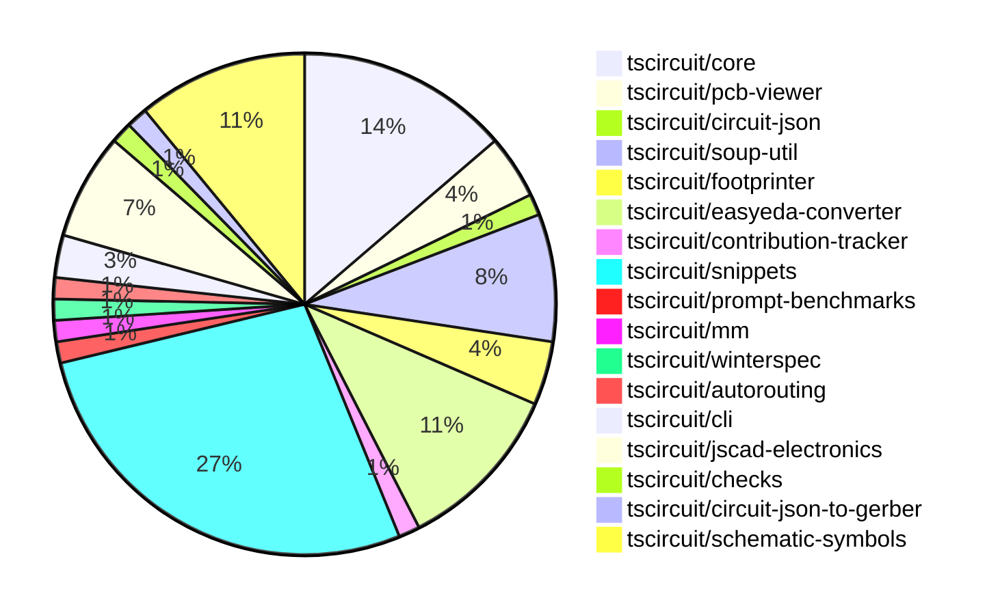

# contribution-tracker

Generates weekly contribution overviews for tscircuit contributors. Check out all
the [contribution overviews here](./contribution-overviews/)

* All PRs in the tscircuit org are scanned/summarized via Claude Haiku
* Claude classifies each Diff/PR as a Major, Minor or Tiny contribution
* All the PRs, summaries, and classifications are organized into charts and tables

The current week is shown below. There are 3 major sections:

* [Contributor Overview](#contributor-overview)
* [PRs by Repository](#prs-by-repository)
* [PRs by Contributor](#changes-by-contributor)

## Current Week

<!-- START_CURRENT_WEEK -->

# Contribution Overview 2024-10-09

## PRs by Repository

## Contributor Overview

| Contributor | 🐳 Major | 🐙 Minor | 🐌 Tiny | ⭐ |
|-------------|-------|-------|-------|-------|
| [seveibar](#seveibar) | 14 | 21 | 3 | 👑👑👑 |
| [imrishabh18](#imrishabh18) | 1 | 8 | 3 | ⭐⭐ |
| [andrii-balitskyi](#andrii-balitskyi) | 2 | 2 | 0 | ⭐⭐ |
| [anas-sarkez](#anas-sarkez) | 2 | 2 | 0 | ⭐⭐ |
| [mrudulpatil18](#mrudulpatil18) | 0 | 4 | 0 | ⭐ |
| [aman1376](#aman1376) | 1 | 1 | 0 | ⭐ |
| [ni9999](#ni9999) | 0 | 2 | 0 | ⭐ |
| [MandeepPaul](#MandeepPaul) | 1 | 0 | 0 | ⭐ |
| [ShiboSoftwareDev](#ShiboSoftwareDev) | 0 | 1 | 1 |  |
| [qalbun-salim](#qalbun-salim) | 0 | 1 | 0 |  |
| [anugcodes](#anugcodes) | 0 | 1 | 0 |  |
| [0SlowPoke0](#0SlowPoke0) | 0 | 1 | 0 |  |
| [Abse2001](#Abse2001) | 0 | 1 | 0 |  |

## Changes by Repository

### [tscircuit/core](https://github.com/tscircuit/core)

| PR # | Impact | Contributor | Description |
|------|--------|-------------|-------------|
| [#151](https://github.com/tscircuit/core/pull/151) | 🐳 Major | imrishabh18 | Adds a new "Via" component to the project. |
| [#157](https://github.com/tscircuit/core/pull/157) | 🐳 Major | seveibar | The change introduces a new utility function `createUseComponent` that simplifies the creation of React components with dynamic props and traces. |
| [#155](https://github.com/tscircuit/core/pull/155) | 🐙 Minor | imrishabh18 | Add new aliases "left" and "right" to the ports of Capacitor and Resistor components. |
| [#153](https://github.com/tscircuit/core/pull/153) | 🐙 Minor | imrishabh18 | Added new components for silkscreen circle and rectangle to the circuit library. |
| [#165](https://github.com/tscircuit/core/pull/165) | 🐙 Minor | seveibar | Fixes a trace layer issue for explicitly defined SmtPads. |
| [#163](https://github.com/tscircuit/core/pull/163) | 🐙 Minor | seveibar | Fix the rotation of a part based on the layer it is on, and prevent the layer being undefined. |
| [#161](https://github.com/tscircuit/core/pull/161) | 🐙 Minor | seveibar | Add support for `cadModel.positionOffset` to adjust the position of the CAD model in the circuit. |
| [#159](https://github.com/tscircuit/core/pull/159) | 🐙 Minor | seveibar | Adds support for creating `pcb_hole` components from the soup data |
| [#158](https://github.com/tscircuit/core/pull/158) | 🐙 Minor | seveibar | Export `createUseComponent` function from `lib/hooks/create-use-component`. |
| [#166](https://github.com/tscircuit/core/pull/166) | 🐌 Tiny | seveibar | Update the version of the `@tscircuit/footprinter` dependency from `^0.0.70` to `^0.0.71`. |

### [tscircuit/pcb-viewer](https://github.com/tscircuit/pcb-viewer)

| PR # | Impact | Contributor | Description |
|------|--------|-------------|-------------|
| [#71](https://github.com/tscircuit/pcb-viewer/pull/71) | 🐳 Major | seveibar | Revert a previous change that broke the PCB viewer's bounds computation. |
| [#74](https://github.com/tscircuit/pcb-viewer/pull/74) | 🐙 Minor | imrishabh18 | Refactor/remove builder |
| [#73](https://github.com/tscircuit/pcb-viewer/pull/73) | 🐙 Minor | imrishabh18 | Refactor to remove the builder library and use the `useRenderedCircuit` hook from `@tscircuit/core` instead. |

### [tscircuit/circuit-json](https://github.com/tscircuit/circuit-json)

| PR # | Impact | Contributor | Description |
|------|--------|-------------|-------------|
| [#58](https://github.com/tscircuit/circuit-json/pull/58) | 🐙 Minor | imrishabh18 | Adds an optional `display_value` field to the `SourceComponentBase` type. |

### [tscircuit/soup-util](https://github.com/tscircuit/soup-util)

| PR # | Impact | Contributor | Description |
|------|--------|-------------|-------------|
| [#22](https://github.com/tscircuit/soup-util/pull/22) | 🐙 Minor | imrishabh18 | Reverts the change that exported the "find-bounds-and-center" function. |
| [#21](https://github.com/tscircuit/soup-util/pull/21) | 🐙 Minor | imrishabh18 | Exports the `find-bounds-and-center` function from the library. |
| [#20](https://github.com/tscircuit/soup-util/pull/20) | 🐙 Minor | imrishabh18 | Ports the `findBoundsAndCenter` function from the `builder` repository to this repository. |
| [#23](https://github.com/tscircuit/soup-util/pull/23) | 🐌 Tiny | imrishabh18 | Fix type error in code by adding type annotations |
| [#19](https://github.com/tscircuit/soup-util/pull/19) | 🐌 Tiny | imrishabh18 | Updates the lock file to ensure consistent dependencies across environments. |
| [#18](https://github.com/tscircuit/soup-util/pull/18) | 🐌 Tiny | imrishabh18 | Upgrades the `circuit-json` dependency to the latest version. |

### [tscircuit/footprinter](https://github.com/tscircuit/footprinter)

| PR # | Impact | Contributor | Description |
|------|--------|-------------|-------------|
| [#63](https://github.com/tscircuit/footprinter/pull/63) | 🐳 Major | seveibar | Remove the `bun` dependency, which was causing a massive increase in bundle size. |
| [#61](https://github.com/tscircuit/footprinter/pull/61) | 🐙 Minor | seveibar | Adds error handling for invalid footprint function names, including when they are passed as a string. |
| [#62](https://github.com/tscircuit/footprinter/pull/62) | 🐙 Minor | anas-sarkez | Modifies and fixes the default value of `qfp` according to the data sheet. |

### [tscircuit/easyeda-converter](https://github.com/tscircuit/easyeda-converter)

| PR # | Impact | Contributor | Description |
|------|--------|-------------|-------------|
| [#64](https://github.com/tscircuit/easyeda-converter/pull/64) | 🐳 Major | seveibar | Adds support for parsing and handling "PATH" shapes in the SingleLetterShapeSchema |
| [#60](https://github.com/tscircuit/easyeda-converter/pull/60) | 🐳 Major | seveibar | Introduces a new footprint tsx generation mechanism for more stable units and adds support for `<hole />`. |
| [#59](https://github.com/tscircuit/easyeda-converter/pull/59) | 🐳 Major | seveibar | Fix Hole Creation, Add snapshot testing |
| [#56](https://github.com/tscircuit/easyeda-converter/pull/56) | 🐳 Major | seveibar | Adds a benchmark script to convert EasyEDA JSON to various formats and write the results to a file. |
| [#62](https://github.com/tscircuit/easyeda-converter/pull/62) | 🐙 Minor | seveibar | Fix PCB component offset and add checks for large dimensions in test |
| [#61](https://github.com/tscircuit/easyeda-converter/pull/61) | 🐙 Minor | seveibar | Removes the scaling by -1 on the y-axis, which prevents the double flip of the y-axis. |
| [#49](https://github.com/tscircuit/easyeda-converter/pull/49) | 🐙 Minor | andrii-balitskyi | The pull request accounts for string/number values for the `number` property in the `PadSchema` and the `pinNumber` property in the `PinShapeOutputSchema`. |
| [#54](https://github.com/tscircuit/easyeda-converter/pull/54) | 🐌 Tiny | seveibar | Imports the `createUseComponent` function from the `@tscircuit/core` package instead of the `tscircuit` package. |

### [tscircuit/contribution-tracker](https://github.com/tscircuit/contribution-tracker)

| PR # | Impact | Contributor | Description |
|------|--------|-------------|-------------|
| [#4](https://github.com/tscircuit/contribution-tracker/pull/4) | 🐳 Major | seveibar | Adds support for nicknames, a star system, and better sorting to the project. |

### [tscircuit/snippets](https://github.com/tscircuit/snippets)

| PR # | Impact | Contributor | Description |
|------|--------|-------------|-------------|
| [#61](https://github.com/tscircuit/snippets/pull/61) | 🐳 Major | seveibar | Adds a delete snippet functionality, including a delete button in the editor navigation and a confirmation dialog. |
| [#54](https://github.com/tscircuit/snippets/pull/54) | 🐳 Major | seveibar | Introduces a new "Import Snippet Dialog" feature, including a search endpoint and initial implementation. |
| [#53](https://github.com/tscircuit/snippets/pull/53) | 🐳 Major | seveibar | This pull request adds the core to runtime, a format button, a 404 snippet page, and minor fixes. |
| [#52](https://github.com/tscircuit/snippets/pull/52) | 🐳 Major | seveibar | Implements anonymous user editing, improves the code editor and AI page for empty states, and fixes a critical bug where the code editor was not scrollable. |
| [#48](https://github.com/tscircuit/snippets/pull/48) | 🐳 Major | seveibar | Adds the ability to construct circuits from compiled TypeScript code, including support for different circuit types (board, footprint, package, model). Also fixes an issue where the dashboard always loads from a hardcoded URL. |
| [#69](https://github.com/tscircuit/snippets/pull/69) | 🐳 Major | andrii-balitskyi | Introduce a new `/orders/{order_id}` page to display detailed information about a specific order. |
| [#46](https://github.com/tscircuit/snippets/pull/46) | 🐳 Major | andrii-balitskyi | Adds initial ordering API and UI functionality, including DB resources and methods for orders and order files, as well as new endpoints and pages. |
| [#67](https://github.com/tscircuit/snippets/pull/67) | 🐙 Minor | seveibar | Fixes an issue with importing modules on the first run of the application. |
| [#66](https://github.com/tscircuit/snippets/pull/66) | 🐙 Minor | seveibar | Update the core dependency to fix a bun dependency issue and routing issue. |
| [#65](https://github.com/tscircuit/snippets/pull/65) | 🐙 Minor | seveibar | Footprinter Fixes, Import Caching for runtime imports |
| [#63](https://github.com/tscircuit/snippets/pull/63) | 🐙 Minor | seveibar | Update the easyeda dependency to version 0.0.48 to fix an issue with importing diode. |
| [#62](https://github.com/tscircuit/snippets/pull/62) | 🐙 Minor | seveibar | Adds replication in the seed data and fixes recursive importing in the `useRunTsx` hook. |
| [#58](https://github.com/tscircuit/snippets/pull/58) | 🐙 Minor | seveibar | Fix the issue with the early hook return in the AI page test |
| [#57](https://github.com/tscircuit/snippets/pull/57) | 🐙 Minor | seveibar | Adds a rename functionality to the EditorNav component, allowing users to rename a code snippet. |
| [#56](https://github.com/tscircuit/snippets/pull/56) | 🐙 Minor | seveibar | Adds Playwright visual regression testing, including a workflow to update snapshots, and updates dependencies. |
| [#51](https://github.com/tscircuit/snippets/pull/51) | 🐙 Minor | seveibar | Fix code editor scrolling overflow and support exporting hooks |
| [#50](https://github.com/tscircuit/snippets/pull/50) | 🐙 Minor | seveibar | Refactor for explicit runs and fix importing |
| [#45](https://github.com/tscircuit/snippets/pull/45) | 🐙 Minor | seveibar | Save DTS content to the database when saving a snippet |
| [#43](https://github.com/tscircuit/snippets/pull/43) | 🐙 Minor | mrudulpatil18 | Persist the visibility of onboarding tips in the global store. |
| [#49](https://github.com/tscircuit/snippets/pull/49) | 🐙 Minor | Abse2001 | Implemented a download function for the circuitJson download button. |

### [tscircuit/prompt-benchmarks](https://github.com/tscircuit/prompt-benchmarks)

| PR # | Impact | Contributor | Description |
|------|--------|-------------|-------------|
| [#3](https://github.com/tscircuit/prompt-benchmarks/pull/3) | 🐳 Major | seveibar | Adds a new function `safeCompileDts` to safely compile TypeScript code to a declaration file (`.d.ts`) using a virtual file system. |

### [tscircuit/mm](https://github.com/tscircuit/mm)

| PR # | Impact | Contributor | Description |
|------|--------|-------------|-------------|
| [#5](https://github.com/tscircuit/mm/pull/5) | 🐙 Minor | seveibar | Add a new function `mil2mm` to convert mil to mm. |

### [tscircuit/winterspec](https://github.com/tscircuit/winterspec)

| PR # | Impact | Contributor | Description |
|------|--------|-------------|-------------|
| [#12](https://github.com/tscircuit/winterspec/pull/12) | 🐙 Minor | seveibar | Fix the issue where the routes directory was not being loaded correctly in the smoke test. |

### [tscircuit/autorouting](https://github.com/tscircuit/autorouting)

| PR # | Impact | Contributor | Description |
|------|--------|-------------|-------------|
| [#81](https://github.com/tscircuit/autorouting/pull/81) | 🐌 Tiny | seveibar | Update dependencies types |

### [tscircuit/cli](https://github.com/tscircuit/cli)

| PR # | Impact | Contributor | Description |
|------|--------|-------------|-------------|
| [#210](https://github.com/tscircuit/cli/pull/210) | 🐙 Minor | andrii-balitskyi | Adds a new command `gen jlcpcb <jlcpcbPartNumberOrUrl>` to generate JLCPCB-specific files. |
| [#217](https://github.com/tscircuit/cli/pull/217) | 🐙 Minor | qalbun-salim | Add `export pnp_csv` command to export Plug n Play CSV file from an example file |

### [tscircuit/jscad-electronics](https://github.com/tscircuit/jscad-electronics)

| PR # | Impact | Contributor | Description |
|------|--------|-------------|-------------|
| [#67](https://github.com/tscircuit/jscad-electronics/pull/67) | 🐳 Major | anas-sarkez | Implementing a USB-A female connector component with customizable dimensions and colors. |
| [#65](https://github.com/tscircuit/jscad-electronics/pull/65) | 🐳 Major | anas-sarkez | Refactor QFP component to support customizable pitch, lead width, and body dimensions, and add QFP 128 3D footprint. |
| [#64](https://github.com/tscircuit/jscad-electronics/pull/64) | 🐙 Minor | anas-sarkez | Added a new example for a DIP16 wide footprint and fixed the length calculation of the DIP model. |
| [#66](https://github.com/tscircuit/jscad-electronics/pull/66) | 🐙 Minor | ni9999 | Adds a new component `AxialCapacitor` that can be used to render an axial capacitor in either a vertical or horizontal orientation. |
| [#59](https://github.com/tscircuit/jscad-electronics/pull/59) | 🐙 Minor | ni9999 | Added a new component called `AxialLed` to the project, which renders an axial LED with customizable pitch. |

### [tscircuit/checks](https://github.com/tscircuit/checks)

| PR # | Impact | Contributor | Description |
|------|--------|-------------|-------------|
| [#17](https://github.com/tscircuit/checks/pull/17) | 🐙 Minor | ShiboSoftwareDev | The pull request refactors the code to use the "circuit-json" library instead of the "@tscircuit/soup" library. |

### [tscircuit/circuit-json-to-gerber](https://github.com/tscircuit/circuit-json-to-gerber)

| PR # | Impact | Contributor | Description |
|------|--------|-------------|-------------|
| [#20](https://github.com/tscircuit/circuit-json-to-gerber/pull/20) | 🐌 Tiny | ShiboSoftwareDev | Added a CODEOWNERS file to specify code owners for the repository. |

### [tscircuit/schematic-symbols](https://github.com/tscircuit/schematic-symbols)

| PR # | Impact | Contributor | Description |
|------|--------|-------------|-------------|
| [#168](https://github.com/tscircuit/schematic-symbols/pull/168) | 🐳 Major | aman1376 | Adds a new n-channel enhancement MOSFET transistor symbol and JSON data. |
| [#169](https://github.com/tscircuit/schematic-symbols/pull/169) | 🐳 Major | MandeepPaul | Introduces a new Mushroom Head Normally Open Momentary component |
| [#158](https://github.com/tscircuit/schematic-symbols/pull/158) | 🐙 Minor | aman1376 | Adds a new SPST switch symbol. |
| [#166](https://github.com/tscircuit/schematic-symbols/pull/166) | 🐙 Minor | mrudulpatil18 | Adds a count of unique symbols available in the schematic symbols repository and a GitHub stars badge to the header. |
| [#161](https://github.com/tscircuit/schematic-symbols/pull/161) | 🐙 Minor | mrudulpatil18 | Added a new PNP bipolar transistor symbol with updated SVG and generated JSON files. |
| [#156](https://github.com/tscircuit/schematic-symbols/pull/156) | 🐙 Minor | mrudulpatil18 | Add a new SVG image for an NPN bipolar transistor symbol. |
| [#160](https://github.com/tscircuit/schematic-symbols/pull/160) | 🐙 Minor | anugcodes | Added an SPDT (Single Pole Double Throw) switch to the project. |
| [#157](https://github.com/tscircuit/schematic-symbols/pull/157) | 🐙 Minor | 0SlowPoke0 | Adds a new symbol for a filled diode. |

## Changes by Contributor

### [imrishabh18](https://github.com/imrishabh18)

| PR # | Impact | Description |
|------|--------|-------------|
| [#151](https://github.com/tscircuit/core/pull/151) | 🐳 Major | Adds a new "Via" component to the project. |
| [#74](https://github.com/tscircuit/pcb-viewer/pull/74) | 🐙 Minor | Refactor/remove builder |
| [#73](https://github.com/tscircuit/pcb-viewer/pull/73) | 🐙 Minor | Refactor to remove the builder library and use the `useRenderedCircuit` hook from `@tscircuit/core` instead. |
| [#58](https://github.com/tscircuit/circuit-json/pull/58) | 🐙 Minor | Adds an optional `display_value` field to the `SourceComponentBase` type. |
| [#22](https://github.com/tscircuit/soup-util/pull/22) | 🐙 Minor | Reverts the change that exported the "find-bounds-and-center" function. |
| [#21](https://github.com/tscircuit/soup-util/pull/21) | 🐙 Minor | Exports the `find-bounds-and-center` function from the library. |
| [#20](https://github.com/tscircuit/soup-util/pull/20) | 🐙 Minor | Ports the `findBoundsAndCenter` function from the `builder` repository to this repository. |
| [#155](https://github.com/tscircuit/core/pull/155) | 🐙 Minor | Add new aliases "left" and "right" to the ports of Capacitor and Resistor components. |
| [#153](https://github.com/tscircuit/core/pull/153) | 🐙 Minor | Added new components for silkscreen circle and rectangle to the circuit library. |
| [#23](https://github.com/tscircuit/soup-util/pull/23) | 🐌 Tiny | Fix type error in code by adding type annotations |
| [#19](https://github.com/tscircuit/soup-util/pull/19) | 🐌 Tiny | Updates the lock file to ensure consistent dependencies across environments. |
| [#18](https://github.com/tscircuit/soup-util/pull/18) | 🐌 Tiny | Upgrades the `circuit-json` dependency to the latest version. |

### [seveibar](https://github.com/seveibar)

| PR # | Impact | Description |
|------|--------|-------------|
| [#71](https://github.com/tscircuit/pcb-viewer/pull/71) | 🐳 Major | Revert a previous change that broke the PCB viewer's bounds computation. |
| [#63](https://github.com/tscircuit/footprinter/pull/63) | 🐳 Major | Remove the `bun` dependency, which was causing a massive increase in bundle size. |
| [#64](https://github.com/tscircuit/easyeda-converter/pull/64) | 🐳 Major | Adds support for parsing and handling "PATH" shapes in the SingleLetterShapeSchema |
| [#60](https://github.com/tscircuit/easyeda-converter/pull/60) | 🐳 Major | Introduces a new footprint tsx generation mechanism for more stable units and adds support for `<hole />`. |
| [#59](https://github.com/tscircuit/easyeda-converter/pull/59) | 🐳 Major | Fix Hole Creation, Add snapshot testing |
| [#56](https://github.com/tscircuit/easyeda-converter/pull/56) | 🐳 Major | Adds a benchmark script to convert EasyEDA JSON to various formats and write the results to a file. |
| [#157](https://github.com/tscircuit/core/pull/157) | 🐳 Major | The change introduces a new utility function `createUseComponent` that simplifies the creation of React components with dynamic props and traces. |
| [#4](https://github.com/tscircuit/contribution-tracker/pull/4) | 🐳 Major | Adds support for nicknames, a star system, and better sorting to the project. |
| [#61](https://github.com/tscircuit/snippets/pull/61) | 🐳 Major | Adds a delete snippet functionality, including a delete button in the editor navigation and a confirmation dialog. |
| [#54](https://github.com/tscircuit/snippets/pull/54) | 🐳 Major | Introduces a new "Import Snippet Dialog" feature, including a search endpoint and initial implementation. |
| [#53](https://github.com/tscircuit/snippets/pull/53) | 🐳 Major | This pull request adds the core to runtime, a format button, a 404 snippet page, and minor fixes. |
| [#52](https://github.com/tscircuit/snippets/pull/52) | 🐳 Major | Implements anonymous user editing, improves the code editor and AI page for empty states, and fixes a critical bug where the code editor was not scrollable. |
| [#48](https://github.com/tscircuit/snippets/pull/48) | 🐳 Major | Adds the ability to construct circuits from compiled TypeScript code, including support for different circuit types (board, footprint, package, model). Also fixes an issue where the dashboard always loads from a hardcoded URL. |
| [#3](https://github.com/tscircuit/prompt-benchmarks/pull/3) | 🐳 Major | Adds a new function `safeCompileDts` to safely compile TypeScript code to a declaration file (`.d.ts`) using a virtual file system. |
| [#5](https://github.com/tscircuit/mm/pull/5) | 🐙 Minor | Add a new function `mil2mm` to convert mil to mm. |
| [#61](https://github.com/tscircuit/footprinter/pull/61) | 🐙 Minor | Adds error handling for invalid footprint function names, including when they are passed as a string. |
| [#62](https://github.com/tscircuit/easyeda-converter/pull/62) | 🐙 Minor | Fix PCB component offset and add checks for large dimensions in test |
| [#61](https://github.com/tscircuit/easyeda-converter/pull/61) | 🐙 Minor | Removes the scaling by -1 on the y-axis, which prevents the double flip of the y-axis. |
| [#12](https://github.com/tscircuit/winterspec/pull/12) | 🐙 Minor | Fix the issue where the routes directory was not being loaded correctly in the smoke test. |
| [#165](https://github.com/tscircuit/core/pull/165) | 🐙 Minor | Fixes a trace layer issue for explicitly defined SmtPads. |
| [#163](https://github.com/tscircuit/core/pull/163) | 🐙 Minor | Fix the rotation of a part based on the layer it is on, and prevent the layer being undefined. |
| [#161](https://github.com/tscircuit/core/pull/161) | 🐙 Minor | Add support for `cadModel.positionOffset` to adjust the position of the CAD model in the circuit. |
| [#159](https://github.com/tscircuit/core/pull/159) | 🐙 Minor | Adds support for creating `pcb_hole` components from the soup data |
| [#158](https://github.com/tscircuit/core/pull/158) | 🐙 Minor | Export `createUseComponent` function from `lib/hooks/create-use-component`. |
| [#67](https://github.com/tscircuit/snippets/pull/67) | 🐙 Minor | Fixes an issue with importing modules on the first run of the application. |
| [#66](https://github.com/tscircuit/snippets/pull/66) | 🐙 Minor | Update the core dependency to fix a bun dependency issue and routing issue. |
| [#65](https://github.com/tscircuit/snippets/pull/65) | 🐙 Minor | Footprinter Fixes, Import Caching for runtime imports |
| [#63](https://github.com/tscircuit/snippets/pull/63) | 🐙 Minor | Update the easyeda dependency to version 0.0.48 to fix an issue with importing diode. |
| [#62](https://github.com/tscircuit/snippets/pull/62) | 🐙 Minor | Adds replication in the seed data and fixes recursive importing in the `useRunTsx` hook. |
| [#58](https://github.com/tscircuit/snippets/pull/58) | 🐙 Minor | Fix the issue with the early hook return in the AI page test |
| [#57](https://github.com/tscircuit/snippets/pull/57) | 🐙 Minor | Adds a rename functionality to the EditorNav component, allowing users to rename a code snippet. |
| [#56](https://github.com/tscircuit/snippets/pull/56) | 🐙 Minor | Adds Playwright visual regression testing, including a workflow to update snapshots, and updates dependencies. |
| [#51](https://github.com/tscircuit/snippets/pull/51) | 🐙 Minor | Fix code editor scrolling overflow and support exporting hooks |
| [#50](https://github.com/tscircuit/snippets/pull/50) | 🐙 Minor | Refactor for explicit runs and fix importing |
| [#45](https://github.com/tscircuit/snippets/pull/45) | 🐙 Minor | Save DTS content to the database when saving a snippet |
| [#54](https://github.com/tscircuit/easyeda-converter/pull/54) | 🐌 Tiny | Imports the `createUseComponent` function from the `@tscircuit/core` package instead of the `tscircuit` package. |
| [#166](https://github.com/tscircuit/core/pull/166) | 🐌 Tiny | Update the version of the `@tscircuit/footprinter` dependency from `^0.0.70` to `^0.0.71`. |
| [#81](https://github.com/tscircuit/autorouting/pull/81) | 🐌 Tiny | Update dependencies types |

### [andrii-balitskyi](https://github.com/andrii-balitskyi)

| PR # | Impact | Description |
|------|--------|-------------|
| [#69](https://github.com/tscircuit/snippets/pull/69) | 🐳 Major | Introduce a new `/orders/{order_id}` page to display detailed information about a specific order. |
| [#46](https://github.com/tscircuit/snippets/pull/46) | 🐳 Major | Adds initial ordering API and UI functionality, including DB resources and methods for orders and order files, as well as new endpoints and pages. |
| [#210](https://github.com/tscircuit/cli/pull/210) | 🐙 Minor | Adds a new command `gen jlcpcb <jlcpcbPartNumberOrUrl>` to generate JLCPCB-specific files. |
| [#49](https://github.com/tscircuit/easyeda-converter/pull/49) | 🐙 Minor | The pull request accounts for string/number values for the `number` property in the `PadSchema` and the `pinNumber` property in the `PinShapeOutputSchema`. |

### [qalbun-salim](https://github.com/qalbun-salim)

| PR # | Impact | Description |
|------|--------|-------------|
| [#217](https://github.com/tscircuit/cli/pull/217) | 🐙 Minor | Add `export pnp_csv` command to export Plug n Play CSV file from an example file |

### [anas-sarkez](https://github.com/anas-sarkez)

| PR # | Impact | Description |
|------|--------|-------------|
| [#67](https://github.com/tscircuit/jscad-electronics/pull/67) | 🐳 Major | Implementing a USB-A female connector component with customizable dimensions and colors. |
| [#65](https://github.com/tscircuit/jscad-electronics/pull/65) | 🐳 Major | Refactor QFP component to support customizable pitch, lead width, and body dimensions, and add QFP 128 3D footprint. |
| [#62](https://github.com/tscircuit/footprinter/pull/62) | 🐙 Minor | Modifies and fixes the default value of `qfp` according to the data sheet. |
| [#64](https://github.com/tscircuit/jscad-electronics/pull/64) | 🐙 Minor | Added a new example for a DIP16 wide footprint and fixed the length calculation of the DIP model. |

### [ni9999](https://github.com/ni9999)

| PR # | Impact | Description |
|------|--------|-------------|
| [#66](https://github.com/tscircuit/jscad-electronics/pull/66) | 🐙 Minor | Adds a new component `AxialCapacitor` that can be used to render an axial capacitor in either a vertical or horizontal orientation. |
| [#59](https://github.com/tscircuit/jscad-electronics/pull/59) | 🐙 Minor | Added a new component called `AxialLed` to the project, which renders an axial LED with customizable pitch. |

### [ShiboSoftwareDev](https://github.com/ShiboSoftwareDev)

| PR # | Impact | Description |
|------|--------|-------------|
| [#17](https://github.com/tscircuit/checks/pull/17) | 🐙 Minor | The pull request refactors the code to use the "circuit-json" library instead of the "@tscircuit/soup" library. |
| [#20](https://github.com/tscircuit/circuit-json-to-gerber/pull/20) | 🐌 Tiny | Added a CODEOWNERS file to specify code owners for the repository. |

### [aman1376](https://github.com/aman1376)

| PR # | Impact | Description |
|------|--------|-------------|
| [#168](https://github.com/tscircuit/schematic-symbols/pull/168) | 🐳 Major | Adds a new n-channel enhancement MOSFET transistor symbol and JSON data. |
| [#158](https://github.com/tscircuit/schematic-symbols/pull/158) | 🐙 Minor | Adds a new SPST switch symbol. |

### [MandeepPaul](https://github.com/MandeepPaul)

| PR # | Impact | Description |
|------|--------|-------------|
| [#169](https://github.com/tscircuit/schematic-symbols/pull/169) | 🐳 Major | Introduces a new Mushroom Head Normally Open Momentary component |

### [mrudulpatil18](https://github.com/mrudulpatil18)

| PR # | Impact | Description |
|------|--------|-------------|
| [#166](https://github.com/tscircuit/schematic-symbols/pull/166) | 🐙 Minor | Adds a count of unique symbols available in the schematic symbols repository and a GitHub stars badge to the header. |
| [#161](https://github.com/tscircuit/schematic-symbols/pull/161) | 🐙 Minor | Added a new PNP bipolar transistor symbol with updated SVG and generated JSON files. |
| [#156](https://github.com/tscircuit/schematic-symbols/pull/156) | 🐙 Minor | Add a new SVG image for an NPN bipolar transistor symbol. |
| [#43](https://github.com/tscircuit/snippets/pull/43) | 🐙 Minor | Persist the visibility of onboarding tips in the global store. |

### [anugcodes](https://github.com/anugcodes)

| PR # | Impact | Description |
|------|--------|-------------|
| [#160](https://github.com/tscircuit/schematic-symbols/pull/160) | 🐙 Minor | Added an SPDT (Single Pole Double Throw) switch to the project. |

### [0SlowPoke0](https://github.com/0SlowPoke0)

| PR # | Impact | Description |
|------|--------|-------------|
| [#157](https://github.com/tscircuit/schematic-symbols/pull/157) | 🐙 Minor | Adds a new symbol for a filled diode. |

### [Abse2001](https://github.com/Abse2001)

| PR # | Impact | Description |
|------|--------|-------------|
| [#49](https://github.com/tscircuit/snippets/pull/49) | 🐙 Minor | Implemented a download function for the circuitJson download button. |

<!-- END_CURRENT_WEEK -->
