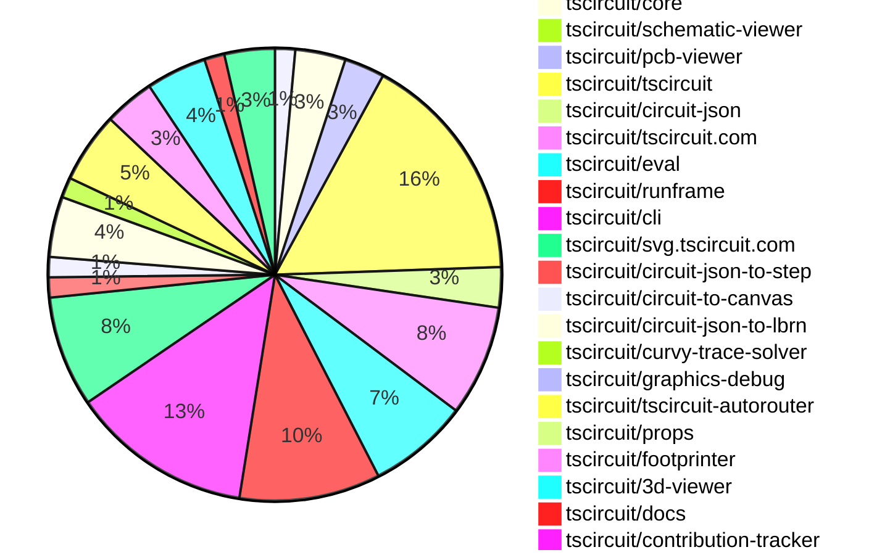

# contribution tracker

[contributions.tscircuit.com](https://contributions.tscircuit.com) ・ [tscircuit.com](https://tscircuit.com) ・ [Contribution Overviews](./contribution-overviews/) ・ [Changelogs](./changelogs/)

Generates weekly contribution overviews for tscircuit contributors. Check out all
the [contribution overviews here](./contribution-overviews/)
You can find AI-generated monthly changelogs in the [changelogs directory](./changelogs/)

- All PRs in the tscircuit org are scanned/summarized via an LLM
- The LLM classifies each Diff/PR as into a set of attributes for scoring
- All the PRs, summaries, and classifications are organized into charts and tables for [the website](https://contributions.tscircuit.com)

> Want to run locally? See the [Development Section](#development)

The current week is shown below. There are 4 major sections:

- [Contributor Overview](#contributor-overview)
- [PRs by Repository](#prs-by-repository)
- [PRs by Contributor](#changes-by-contributor)
- [Scoring & Sponsorship System](#scoring--sponsorship-system)

## Current Week

<!-- START_CURRENT_WEEK -->

# Contribution Overview 2026-01-14

The current week is shown below. There are 3 major sections:

- [Contributor Overview](#contributor-overview)
- [PRs by Repository](#prs-by-repository)
- [PRs by Contributor](#changes-by-contributor)
- [Scoring & Sponsorship Details](/docs/sponsorship-calculation-explanation.md)

## PRs by Repository



## Contributor Overview

| Contributor | 🐳 Major | 🐙 Minor | 🐌 Tiny | ⭐ | Discussion Contributions |
|-------------|---------|---------|---------|-----|--------------------------|
| [techmannih](#techmannih) | 3 | 4 | 2 | ⭐⭐ | 0🔹 0🔶 0💎 |
| [seveibar](#seveibar) | 5 | 2 | 1 | ⭐⭐ | 0🔹 0🔶 0💎 |
| [0hmX](#0hmX) | 4 | 0 | 0 | ⭐⭐ | 0🔹 0🔶 0💎 |
| [AnasSarkiz](#AnasSarkiz) | 2 | 3 | 2 | ⭐⭐ | 0🔹 0🔶 0💎 |
| [rushabhcodes](#rushabhcodes) | 2 | 0 | 1 | ⭐⭐ | 0🔹 0🔶 0💎 |
| [tscircuitbot](#tscircuitbot) | 0 | 0 | 85 | ⭐⭐ | 0🔹 0🔶 0💎 |
| [ShiboSoftwareDev](#ShiboSoftwareDev) | 0 | 5 | 1 | ⭐⭐ | 0🔹 0🔶 0💎 |
| [imrishabh18](#imrishabh18) | 1 | 2 | 2 | ⭐⭐ | 0🔹 0🔶 0💎 |
| [Ayushjhawar8](#Ayushjhawar8) | 1 | 1 | 3 | ⭐ | 0🔹 0🔶 0💎 |
| [ArnavK-09](#ArnavK-09) | 1 | 2 | 2 | ⭐ | 0🔹 0🔶 0💎 |
| [MustafaMulla29](#MustafaMulla29) | 1 | 1 | 1 | ⭐ | 0🔹 0🔶 0💎 |
| [Abse2001](#Abse2001) | 0 | 1 | 0 | ⭐ | 0🔹 0🔶 0💎 |
| [Heinrich-XIAO](#Heinrich-XIAO) | 0 | 0 | 1 |  | 0🔹 0🔶 0💎 |
| [Sahil-Gupta584](#Sahil-Gupta584) | 0 | 0 | 1 |  | 0🔹 0🔶 0💎 |

> Note: AI evaluates PRs and assigns 1-3 star ratings automatically. 4 and 5 star ratings require manual staff review.

### Discussion Contribution Legend

- 🔹 Normal Comments: Basic participation with minimal effort
- 🔶 Great Informative Comments: Thoughtful participation that adds value
- 💎 Incredible Comments: Exceptional participation with high-quality content

## Review Table

[reviews-received-hover]: ## "Number of reviews received for PRs for this contributor"
[approvals-received-hover]: ## "Number of approvals received for PRs this contributor authored"
[rejections-received-hover]: ## "Number of rejections received for PRs this contributor authored"
[prs-opened-hover]: ## "Number of PRs opened by this contributor"
[issues-created-hover]: ## "Number of issues created by this contributor"

| Contributor | Reviews Received | Approvals Received | Rejections Received | Approvals | Rejections | PRs Opened | PRs Merged | Issues Created |
|---|---|---|---|---|---|---|---|---|
| [MustafaMulla29](#MustafaMulla29) | 2 | 2 | 0 | 0 | 0 | 3 | 3 | 0 |
| [bimakw](#bimakw) | 2 | 1 | 1 | 0 | 0 | 3 | 0 | 0 |
| [rushabhcodes](#rushabhcodes) | 21 | 4 | 4 | 1 | 5 | 6 | 3 | 0 |
| [tscircuitbot](#tscircuitbot) | 0 | 0 | 0 | 0 | 0 | 114 | 85 | 0 |
| [Ayushjhawar8](#Ayushjhawar8) | 16 | 4 | 3 | 0 | 0 | 10 | 5 | 0 |
| [seveibar](#seveibar) | 0 | 0 | 0 | 33 | 9 | 11 | 8 | 0 |
| [techmannih](#techmannih) | 14 | 9 | 2 | 2 | 0 | 11 | 9 | 0 |
| [SolariSystems](#SolariSystems) | 0 | 0 | 0 | 0 | 0 | 1 | 0 | 0 |
| [ShiboSoftwareDev](#ShiboSoftwareDev) | 10 | 7 | 0 | 2 | 0 | 8 | 7 | 0 |
| [gokseniin](#gokseniin) | 1 | 0 | 0 | 0 | 0 | 1 | 0 | 0 |
| [Abse2001](#Abse2001) | 1 | 1 | 0 | 5 | 0 | 1 | 1 | 0 |
| [Kesavaraja67](#Kesavaraja67) | 2 | 0 | 1 | 0 | 0 | 1 | 0 | 0 |
| [imrishabh18](#imrishabh18) | 6 | 3 | 1 | 2 | 4 | 9 | 5 | 0 |
| [Heinrich-XIAO](#Heinrich-XIAO) | 4 | 2 | 1 | 0 | 0 | 4 | 1 | 0 |
| [ArnavK-09](#ArnavK-09) | 7 | 4 | 1 | 0 | 0 | 6 | 5 | 0 |
| [Sahil-Gupta584](#Sahil-Gupta584) | 3 | 1 | 0 | 0 | 0 | 1 | 1 | 0 |
| [0hmX](#0hmX) | 6 | 4 | 0 | 0 | 0 | 7 | 4 | 0 |
| [GhostDragonAlpha](#GhostDragonAlpha) | 0 | 0 | 0 | 0 | 0 | 3 | 0 | 0 |
| [giajoe24](#giajoe24) | 2 | 0 | 2 | 0 | 0 | 2 | 0 | 0 |
| [krapcys1-maker](#krapcys1-maker) | 2 | 0 | 2 | 0 | 0 | 2 | 0 | 0 |
| [AnasSarkiz](#AnasSarkiz) | 3 | 3 | 0 | 0 | 0 | 8 | 7 | 0 |

## Changes by Repository

### [tscircuit/circuit-to-svg](https://github.com/tscircuit/circuit-to-svg)

| PR # | Impact | Rating | Contributor | Description |
|------|--------|--------|-------------|-------------|
| [#479](https://github.com/tscircuit/circuit-to-svg/pull/479) | 🐳 Major | ⭐⭐⭐ | MustafaMulla29 | Adds support for rendering schematic paths in SVG format by implementing a new function to create SVG objects from schematic path data. |
| [#481](https://github.com/tscircuit/circuit-to-svg/pull/481) | 🐳 Major | ⭐⭐⭐ | techmannih | Implemented soldermask_margin_left, soldermask_margin_top, soldermask_margin_right, and soldermask_margin_bottom for rect and rotated_rect SMT pads, allowing for positive and negative margin values to control soldermask coverage. |

### [tscircuit/core](https://github.com/tscircuit/core)

| PR # | Impact | Rating | Contributor | Description |
|------|--------|--------|-------------|-------------|
| [#1833](https://github.com/tscircuit/core/pull/1833) | 🐳 Major | ⭐⭐⭐ | seveibar | Updates the autorouter to accept an effort level parameter and adjusts the size of 1206x4 jumpers to match the 3612 metric. |
| [#1834](https://github.com/tscircuit/core/pull/1834) | 🐳 Major | ⭐⭐⭐ | seveibar | Updates the autorouting algorithm to relax the port point rip threshold, potentially improving routing efficiency in complex circuits. |
| [#1835](https://github.com/tscircuit/core/pull/1835) | 🐙 Minor | ⭐⭐ | MustafaMulla29 | Adds support for the schematicpath  element in the schematic rendering system, allowing for the definition of paths with specified points and fill properties. |
| [#1836](https://github.com/tscircuit/core/pull/1836) | 🐙 Minor | ⭐⭐ | ShiboSoftwareDev | Fixes positioning issues of child and grandchild groups in PCB designs during panel auto-layout operations by updating their coordinates when the parent board moves. |

<details>
<summary>🐌 Tiny Contributions (1)</summary>

| PR # | Impact | Contributor | Description |
|------|--------|-------------|-------------|
| [#1832](https://github.com/tscircuit/core/pull/1832) | 🐌 Tiny | ShiboSoftwareDev | Updates the tscircuitcircuit-json-util dependency to version 0.0.75 in package.json |

</details>

### [tscircuit/schematic-viewer](https://github.com/tscircuit/schematic-viewer)


<details>
<summary>🐌 Tiny Contributions (1)</summary>

| PR # | Impact | Contributor | Description |
|------|--------|-------------|-------------|
| [#158](https://github.com/tscircuit/schematic-viewer/pull/158) | 🐌 Tiny | MustafaMulla29 | Updates the tscircuit dependency to version 0.0.1149 to enable schematic_path rendering functionality. |

</details>

### [tscircuit/pcb-viewer](https://github.com/tscircuit/pcb-viewer)

| PR # | Impact | Rating | Contributor | Description |
|------|--------|--------|-------------|-------------|
| [#609](https://github.com/tscircuit/pcb-viewer/pull/609) | 🐙 Minor | ⭐⭐ | Ayushjhawar8 | Fixes the issue where the d key hotkey triggers while typing in input fields, preventing unintended actions. |

<details>
<summary>🐌 Tiny Contributions (3)</summary>

| PR # | Impact | Contributor | Description |
|------|--------|-------------|-------------|
| [#610](https://github.com/tscircuit/pcb-viewer/pull/610) | 🐌 Tiny | tscircuitbot | Automated package update |
| [#608](https://github.com/tscircuit/pcb-viewer/pull/608) | 🐌 Tiny | tscircuitbot | Automated package update to version 1.11.315 |
| [#607](https://github.com/tscircuit/pcb-viewer/pull/607) | 🐌 Tiny | techmannih | Adds a new fixture for asymmetric soldermask margins for rectangular and rotated rectangular SMT pads in the PCB viewer. |

</details>

### [tscircuit/tscircuit](https://github.com/tscircuit/tscircuit)


<details>
<summary>🐌 Tiny Contributions (23)</summary>

| PR # | Impact | Contributor | Description |
|------|--------|-------------|-------------|
| [#1867](https://github.com/tscircuit/tscircuit/pull/1867) | 🐌 Tiny | tscircuitbot | Updates the package version from 0.0.1150 to 0.0.1151 in package.json |
| [#1866](https://github.com/tscircuit/tscircuit/pull/1866) | 🐌 Tiny | tscircuitbot | Automated package update |
| [#1864](https://github.com/tscircuit/tscircuit/pull/1864) | 🐌 Tiny | tscircuitbot | Automated package update |
| [#1865](https://github.com/tscircuit/tscircuit/pull/1865) | 🐌 Tiny | tscircuitbot | Automated package update |
| [#1862](https://github.com/tscircuit/tscircuit/pull/1862) | 🐌 Tiny | tscircuitbot | Automated package update |
| [#1863](https://github.com/tscircuit/tscircuit/pull/1863) | 🐌 Tiny | tscircuitbot | Automated package update |
| [#1849](https://github.com/tscircuit/tscircuit/pull/1849) | 🐌 Tiny | tscircuitbot | Updates the package version from 0.0.1141 to 0.0.1142 in package.json |
| [#1853](https://github.com/tscircuit/tscircuit/pull/1853) | 🐌 Tiny | tscircuitbot | Automated package update |
| [#1857](https://github.com/tscircuit/tscircuit/pull/1857) | 🐌 Tiny | tscircuitbot | Automated package update |
| [#1848](https://github.com/tscircuit/tscircuit/pull/1848) | 🐌 Tiny | tscircuitbot | Updates the tscircuitcli package to version 0.1.748 in the package.json file. |
| [#1852](https://github.com/tscircuit/tscircuit/pull/1852) | 🐌 Tiny | tscircuitbot | Automated package update |
| [#1854](https://github.com/tscircuit/tscircuit/pull/1854) | 🐌 Tiny | tscircuitbot | Updates the tscircuitcli package to version 0.1.751 in the package.json file. |
| [#1858](https://github.com/tscircuit/tscircuit/pull/1858) | 🐌 Tiny | tscircuitbot | Updates the tscircuitcli package to version 0.1.753 |
| [#1860](https://github.com/tscircuit/tscircuit/pull/1860) | 🐌 Tiny | tscircuitbot | Updates the tscircuitcli package from version 0.1.753 to 0.1.754 |
| [#1850](https://github.com/tscircuit/tscircuit/pull/1850) | 🐌 Tiny | tscircuitbot | Updates the tscircuitcli package to version 0.1.749 in the package.json file. |
| [#1861](https://github.com/tscircuit/tscircuit/pull/1861) | 🐌 Tiny | tscircuitbot | Automated package update |
| [#1859](https://github.com/tscircuit/tscircuit/pull/1859) | 🐌 Tiny | tscircuitbot | Updates the package version from 0.0.1146 to 0.0.1147 in package.json |
| [#1856](https://github.com/tscircuit/tscircuit/pull/1856) | 🐌 Tiny | tscircuitbot | Automated package update |
| [#1855](https://github.com/tscircuit/tscircuit/pull/1855) | 🐌 Tiny | tscircuitbot | Automated package update |
| [#1844](https://github.com/tscircuit/tscircuit/pull/1844) | 🐌 Tiny | tscircuitbot | Updates the tscircuitcli package and other dependencies to their latest versions. |
| [#1847](https://github.com/tscircuit/tscircuit/pull/1847) | 🐌 Tiny | tscircuitbot | Automated package update |
| [#1845](https://github.com/tscircuit/tscircuit/pull/1845) | 🐌 Tiny | tscircuitbot | Automated package update |
| [#1846](https://github.com/tscircuit/tscircuit/pull/1846) | 🐌 Tiny | tscircuitbot | Automated package update |

</details>

### [tscircuit/circuit-json](https://github.com/tscircuit/circuit-json)

| PR # | Impact | Rating | Contributor | Description |
|------|--------|--------|-------------|-------------|
| [#413](https://github.com/tscircuit/circuit-json/pull/413) | 🐳 Major | ⭐⭐⭐ | techmannih | Refactors soldermask properties in the pcb_smtpad to use individual margin properties instead of a single margin and dimensions. |
| [#410](https://github.com/tscircuit/circuit-json/pull/410) | 🐳 Major | ⭐⭐⭐ | techmannih | Adds soldermask_center_offset, soldermask_width, and soldermask_height properties to rectangular pads in the PCB design schema. |

<details>
<summary>🐌 Tiny Contributions (2)</summary>

| PR # | Impact | Contributor | Description |
|------|--------|-------------|-------------|
| [#414](https://github.com/tscircuit/circuit-json/pull/414) | 🐌 Tiny | tscircuitbot | Automated package update |
| [#411](https://github.com/tscircuit/circuit-json/pull/411) | 🐌 Tiny | tscircuitbot | Updates the package version from v0.0.354 to v0.0.355 in package.json |

</details>

### [tscircuit/tscircuit.com](https://github.com/tscircuit/tscircuit.com)

| PR # | Impact | Rating | Contributor | Description |
|------|--------|--------|-------------|-------------|
| [#2471](https://github.com/tscircuit/tscircuit.com/pull/2471) | 🐳 Major | ⭐⭐⭐ | ArnavK-09 | Refactors the Release Details Page to improve the structure and functionality, including the addition of new components for displaying installation commands and build logs. |
| [#2472](https://github.com/tscircuit/tscircuit.com/pull/2472) | 🐳 Major | ⭐⭐⭐ | imrishabh18 | Invalidates the cached queries for packageRelease and packageBuild after a rebuild operation to ensure fresh data is fetched. |
| [#2476](https://github.com/tscircuit/tscircuit.com/pull/2476) | 🐙 Minor | ⭐⭐ | seveibar | Add a new API endpoint to retrieve a packages preview circuit JSON based on configuration, replacing hardcoded paths in the frontend with a dynamic approach that respects the packages configuration file. |
| [#2492](https://github.com/tscircuit/tscircuit.com/pull/2492) | 🐙 Minor | ⭐⭐ | ArnavK-09 | Filters the trending packages displayed on the home page to only include those with valid CAD preview images, improving the user experience by preventing broken image links. |

<details>
<summary>🐌 Tiny Contributions (7)</summary>

| PR # | Impact | Contributor | Description |
|------|--------|-------------|-------------|
| [#2485](https://github.com/tscircuit/tscircuit.com/pull/2485) | 🐌 Tiny | tscircuitbot | Automated package update |
| [#2479](https://github.com/tscircuit/tscircuit.com/pull/2479) | 🐌 Tiny | tscircuitbot | Automated package update |
| [#2483](https://github.com/tscircuit/tscircuit.com/pull/2483) | 🐌 Tiny | tscircuitbot | Automated package update |
| [#2477](https://github.com/tscircuit/tscircuit.com/pull/2477) | 🐌 Tiny | tscircuitbot | Automated package update to version 0.0.187 |
| [#2481](https://github.com/tscircuit/tscircuit.com/pull/2481) | 🐌 Tiny | tscircuitbot | Updates the tscircuiteval package to version 0.0.587 in package.json |
| [#2474](https://github.com/tscircuit/tscircuit.com/pull/2474) | 🐌 Tiny | tscircuitbot | Updates the tscircuiteval package from version 0.0.584 to 0.0.585 |
| [#2491](https://github.com/tscircuit/tscircuit.com/pull/2491) | 🐌 Tiny | ArnavK-09 | Fixes overflow issues in card and skeleton components on the dashboard, organization profile, and user profile pages. |

</details>

### [tscircuit/eval](https://github.com/tscircuit/eval)


<details>
<summary>🐌 Tiny Contributions (10)</summary>

| PR # | Impact | Contributor | Description |
|------|--------|-------------|-------------|
| [#1871](https://github.com/tscircuit/eval/pull/1871) | 🐌 Tiny | tscircuitbot | Automated package update |
| [#1870](https://github.com/tscircuit/eval/pull/1870) | 🐌 Tiny | tscircuitbot | Updates the version of the tscircuitcore package from 0.0.971 to 0.0.972 in package.json |
| [#1868](https://github.com/tscircuit/eval/pull/1868) | 🐌 Tiny | tscircuitbot | Automated package update |
| [#1861](https://github.com/tscircuit/eval/pull/1861) | 🐌 Tiny | tscircuitbot | Updates package dependencies to their latest versions in package.json |
| [#1867](https://github.com/tscircuit/eval/pull/1867) | 🐌 Tiny | tscircuitbot | Automated package update |
| [#1865](https://github.com/tscircuit/eval/pull/1865) | 🐌 Tiny | tscircuitbot | Automated package update |
| [#1864](https://github.com/tscircuit/eval/pull/1864) | 🐌 Tiny | tscircuitbot | Automated package update |
| [#1862](https://github.com/tscircuit/eval/pull/1862) | 🐌 Tiny | tscircuitbot | Automated package update |
| [#1860](https://github.com/tscircuit/eval/pull/1860) | 🐌 Tiny | tscircuitbot | Automated package update |
| [#1859](https://github.com/tscircuit/eval/pull/1859) | 🐌 Tiny | tscircuitbot | Automated package update |

</details>

### [tscircuit/runframe](https://github.com/tscircuit/runframe)

| PR # | Impact | Rating | Contributor | Description |
|------|--------|--------|-------------|-------------|
| [#2337](https://github.com/tscircuit/runframe/pull/2337) | 🐙 Minor | ⭐⭐ | ArnavK-09 | Disables the schematic view in the CircuitJsonPreview component when PCB panels are present in the circuit JSON. |

<details>
<summary>🐌 Tiny Contributions (13)</summary>

| PR # | Impact | Contributor | Description |
|------|--------|-------------|-------------|
| [#2338](https://github.com/tscircuit/runframe/pull/2338) | 🐌 Tiny | tscircuitbot | Automated package update |
| [#2334](https://github.com/tscircuit/runframe/pull/2334) | 🐌 Tiny | tscircuitbot | Automated package update |
| [#2330](https://github.com/tscircuit/runframe/pull/2330) | 🐌 Tiny | tscircuitbot | Updates the tscircuiteval package to version 0.0.589 in the package.json file. |
| [#2333](https://github.com/tscircuit/runframe/pull/2333) | 🐌 Tiny | tscircuitbot | Updates the tscircuitschematic-viewer package to version 2.0.52 in package.json |
| [#2331](https://github.com/tscircuit/runframe/pull/2331) | 🐌 Tiny | tscircuitbot | Automated package update |
| [#2325](https://github.com/tscircuit/runframe/pull/2325) | 🐌 Tiny | tscircuitbot | Automated package update |
| [#2319](https://github.com/tscircuit/runframe/pull/2319) | 🐌 Tiny | tscircuitbot | Updates the tscircuiteval package to version 0.0.586 in the package.json file. |
| [#2324](https://github.com/tscircuit/runframe/pull/2324) | 🐌 Tiny | tscircuitbot | Updates the tscircuiteval package to version 0.0.588 in the package.json file. |
| [#2321](https://github.com/tscircuit/runframe/pull/2321) | 🐌 Tiny | tscircuitbot | Updates the tscircuiteval package to version 0.0.587 in the package.json file. |
| [#2320](https://github.com/tscircuit/runframe/pull/2320) | 🐌 Tiny | tscircuitbot | Automated package update |
| [#2322](https://github.com/tscircuit/runframe/pull/2322) | 🐌 Tiny | tscircuitbot | Automated package update |
| [#2316](https://github.com/tscircuit/runframe/pull/2316) | 🐌 Tiny | tscircuitbot | Updates the tscircuiteval package to version 0.0.585 in package.json |
| [#2317](https://github.com/tscircuit/runframe/pull/2317) | 🐌 Tiny | tscircuitbot | Automated package update |

</details>

### [tscircuit/cli](https://github.com/tscircuit/cli)

| PR # | Impact | Rating | Contributor | Description |
|------|--------|--------|-------------|-------------|
| [#1623](https://github.com/tscircuit/cli/pull/1623) | 🐙 Minor | ⭐⭐ | seveibar | Adds a Bun plugin to register static asset loaders for STEP and other file types, preventing them from being parsed as TypeScript and ensuring correct resolution during CLI execution. |
| [#1629](https://github.com/tscircuit/cli/pull/1629) | 🐙 Minor | ⭐⭐ | imrishabh18 | Updates the clone functionality to correctly handle binary package files by utilizing a dedicated download endpoint instead of assuming text content. |
| [#1628](https://github.com/tscircuit/cli/pull/1628) | 🐙 Minor | ⭐⭐ | imrishabh18 | Fixes the issue where the clone command strips dist segments, causing files to be written to the package root instead of under dist. |

<details>
<summary>🐌 Tiny Contributions (15)</summary>

| PR # | Impact | Contributor | Description |
|------|--------|-------------|-------------|
| [#1637](https://github.com/tscircuit/cli/pull/1637) | 🐌 Tiny | tscircuitbot | Automated package update |
| [#1638](https://github.com/tscircuit/cli/pull/1638) | 🐌 Tiny | tscircuitbot | Automated package update |
| [#1635](https://github.com/tscircuit/cli/pull/1635) | 🐌 Tiny | tscircuitbot | Updates the tscircuitrunframe package from version 0.0.1482 to 0.0.1483 |
| [#1636](https://github.com/tscircuit/cli/pull/1636) | 🐌 Tiny | tscircuitbot | Automated package update |
| [#1633](https://github.com/tscircuit/cli/pull/1633) | 🐌 Tiny | tscircuitbot | Automated package update |
| [#1632](https://github.com/tscircuit/cli/pull/1632) | 🐌 Tiny | tscircuitbot | Updates the tscircuitrunframe package from version 0.0.1481 to 0.0.1482 |
| [#1631](https://github.com/tscircuit/cli/pull/1631) | 🐌 Tiny | tscircuitbot | Automated package update |
| [#1630](https://github.com/tscircuit/cli/pull/1630) | 🐌 Tiny | tscircuitbot | Automated package update |
| [#1625](https://github.com/tscircuit/cli/pull/1625) | 🐌 Tiny | tscircuitbot | Updates the tscircuitrunframe package from version 0.0.1480 to 0.0.1481 |
| [#1626](https://github.com/tscircuit/cli/pull/1626) | 🐌 Tiny | tscircuitbot | Automated package update |
| [#1624](https://github.com/tscircuit/cli/pull/1624) | 🐌 Tiny | tscircuitbot | Automated package update |
| [#1620](https://github.com/tscircuit/cli/pull/1620) | 🐌 Tiny | tscircuitbot | Updates the tscircuitrunframe package from version 0.0.1476 to 0.0.1480 |
| [#1609](https://github.com/tscircuit/cli/pull/1609) | 🐌 Tiny | Ayushjhawar8 | Adds tests to verify the execution of buildCommand and prebuildCommand when using the --ci flag in the tscircuit CLI. |
| [#1614](https://github.com/tscircuit/cli/pull/1614) | 🐌 Tiny | imrishabh18 | Removes stringification of error messages and utilizes native error formatting for better debugging information. |
| [#1617](https://github.com/tscircuit/cli/pull/1617) | 🐌 Tiny | imrishabh18 | Adds a configuration option to skip local installation of the tscircuit package, allowing the use of the latest version available in the cloud. |

</details>

### [tscircuit/svg.tscircuit.com](https://github.com/tscircuit/svg.tscircuit.com)


<details>
<summary>🐌 Tiny Contributions (11)</summary>

| PR # | Impact | Contributor | Description |
|------|--------|-------------|-------------|
| [#835](https://github.com/tscircuit/svg.tscircuit.com/pull/835) | 🐌 Tiny | tscircuitbot | Updates the tscircuit package version from 0.0.1150 to 0.0.1151 in package.json |
| [#834](https://github.com/tscircuit/svg.tscircuit.com/pull/834) | 🐌 Tiny | tscircuitbot | Updates the tscircuit package version from 0.0.1149 to 0.0.1150 in package.json |
| [#833](https://github.com/tscircuit/svg.tscircuit.com/pull/833) | 🐌 Tiny | tscircuitbot | Automated package update |
| [#832](https://github.com/tscircuit/svg.tscircuit.com/pull/832) | 🐌 Tiny | tscircuitbot | Updates the tscircuit package from version 0.0.1147 to 0.0.1148 in package.json |
| [#829](https://github.com/tscircuit/svg.tscircuit.com/pull/829) | 🐌 Tiny | tscircuitbot | Updates the tscircuit package version from 0.0.1144 to 0.0.1145 in package.json |
| [#827](https://github.com/tscircuit/svg.tscircuit.com/pull/827) | 🐌 Tiny | tscircuitbot | Updates the tscircuit package version from 0.0.1141 to 0.0.1142 in package.json |
| [#828](https://github.com/tscircuit/svg.tscircuit.com/pull/828) | 🐌 Tiny | tscircuitbot | Updates the tscircuit package version from 0.0.1142 to 0.0.1144 in package.json |
| [#830](https://github.com/tscircuit/svg.tscircuit.com/pull/830) | 🐌 Tiny | tscircuitbot | Automated package update |
| [#831](https://github.com/tscircuit/svg.tscircuit.com/pull/831) | 🐌 Tiny | tscircuitbot | Updates the tscircuit package from version 0.0.1146 to 0.0.1147 in package.json |
| [#825](https://github.com/tscircuit/svg.tscircuit.com/pull/825) | 🐌 Tiny | tscircuitbot | Updates the tscircuit package version from 0.0.1139 to 0.0.1140 in package.json |
| [#826](https://github.com/tscircuit/svg.tscircuit.com/pull/826) | 🐌 Tiny | tscircuitbot | Automated package update |

</details>

### [tscircuit/circuit-json-to-step](https://github.com/tscircuit/circuit-json-to-step)


<details>
<summary>🐌 Tiny Contributions (2)</summary>

| PR # | Impact | Contributor | Description |
|------|--------|-------------|-------------|
| [#44](https://github.com/tscircuit/circuit-json-to-step/pull/44) | 🐌 Tiny | tscircuitbot | Automated package update |
| [#43](https://github.com/tscircuit/circuit-json-to-step/pull/43) | 🐌 Tiny | Ayushjhawar8 | Moves tscircuitcircuit-json-util from dependencies to peerDependencies in package.json |

</details>

### [tscircuit/circuit-to-canvas](https://github.com/tscircuit/circuit-to-canvas)

| PR # | Impact | Rating | Contributor | Description |
|------|--------|--------|-------------|-------------|
| [#117](https://github.com/tscircuit/circuit-to-canvas/pull/117) | 🐙 Minor | ⭐⭐ | techmannih | Adds support for asymmetric soldermask margins for rectangular and rotated rectangular SMT pads in PCB designs. |

<details>
<summary>🐌 Tiny Contributions (1)</summary>

| PR # | Impact | Contributor | Description |
|------|--------|-------------|-------------|
| [#118](https://github.com/tscircuit/circuit-to-canvas/pull/118) | 🐌 Tiny | tscircuitbot | Updates the package version from 0.0.49 to 0.0.50 in package.json |

</details>

### [tscircuit/circuit-json-to-lbrn](https://github.com/tscircuit/circuit-json-to-lbrn)

| PR # | Impact | Rating | Contributor | Description |
|------|--------|--------|-------------|-------------|
| [#90](https://github.com/tscircuit/circuit-json-to-lbrn/pull/90) | 🐳 Major | ⭐⭐⭐ | AnasSarkiz | Adds a Soldermask Margin () input field to the conversion options in the site UI and exposes the existing solderMaskMarginPercent library option to end users, allowing percentage-based solder mask margin adjustments alongside the existing absolute (mm) margin option |
| [#88](https://github.com/tscircuit/circuit-json-to-lbrn/pull/88) | 🐙 Minor | ⭐⭐ | AnasSarkiz | Adds a solderMaskMarginPercent option for percentage-based solder mask margins that scale with PCB element dimensions, ensuring backward compatibility and clamping to prevent negative openings. |
| [#86](https://github.com/tscircuit/circuit-json-to-lbrn/pull/86) | 🐙 Minor | ⭐⭐ | AnasSarkiz | Summary Fixed critical bug where traces failed to merge with connected rectangular plated hole pads, causing separate shapes instead of continuous copper. Implemented by refactoring copper geometry handling to eliminate code duplication and ensure consistent net-connection behavior.  Changes New helper function: addCopperGeometryToNetOrProject() centralizes net-connected vs. unconnected copper geometry logic Refactored 10 handlers: All plated hole (4) and SMT pad (6) handlers now use standardized merging logic Bug resolution: Plated hole pads correctly merge with traces on same net instead of creating gapsoverlaps Test coverage: Added example04 test case demonstrating proper trace-pad continuity |

<details>
<summary>🐌 Tiny Contributions (3)</summary>

| PR # | Impact | Contributor | Description |
|------|--------|-------------|-------------|
| [#91](https://github.com/tscircuit/circuit-json-to-lbrn/pull/91) | 🐌 Tiny | tscircuitbot | Automated package update |
| [#89](https://github.com/tscircuit/circuit-json-to-lbrn/pull/89) | 🐌 Tiny | tscircuitbot | Automated package update |
| [#87](https://github.com/tscircuit/circuit-json-to-lbrn/pull/87) | 🐌 Tiny | tscircuitbot | Automated package update |

</details>

### [tscircuit/curvy-trace-solver](https://github.com/tscircuit/curvy-trace-solver)

| PR # | Impact | Rating | Contributor | Description |
|------|--------|--------|-------------|-------------|
| [#11](https://github.com/tscircuit/curvy-trace-solver/pull/11) | 🐳 Major | ⭐⭐⭐ | seveibar | angled trace solver 1 angled trace solver test and benchmark shape penalties and better corning |

<details>
<summary>🐌 Tiny Contributions (1)</summary>

| PR # | Impact | Contributor | Description |
|------|--------|-------------|-------------|
| [#12](https://github.com/tscircuit/curvy-trace-solver/pull/12) | 🐌 Tiny | tscircuitbot | Automated package update |

</details>

### [tscircuit/graphics-debug](https://github.com/tscircuit/graphics-debug)

| PR # | Impact | Rating | Contributor | Description |
|------|--------|--------|-------------|-------------|
| [#92](https://github.com/tscircuit/graphics-debug/pull/92) | 🐳 Major | ⭐⭐⭐ | Ayushjhawar8 | Adds a diagonal measurement label to the dimension tool, displaying the distance of diagonal measurements in the graphics interface. |

### [tscircuit/tscircuit-autorouter](https://github.com/tscircuit/tscircuit-autorouter)

| PR # | Impact | Rating | Contributor | Description |
|------|--------|--------|-------------|-------------|
| [#540](https://github.com/tscircuit/tscircuit-autorouter/pull/540) | 🐳 Major | ⭐⭐⭐ | seveibar | Adds minimum and maximum ripping power factor thresholds and tracks rip count in statistics for autorouting. |
| [#534](https://github.com/tscircuit/tscircuit-autorouter/pull/534) | 🐳 Major | ⭐⭐⭐ | seveibar | Updates jumper configurations and calculations for node failure probability in the autorouter, including adjustments to jumper sizes and counts. |
| [#542](https://github.com/tscircuit/tscircuit-autorouter/pull/542) | 🐳 Major | ⭐⭐⭐ | 0hmX | Exposes the old router functionality through the existing autorouting pipeline, allowing for improved routing capabilities without off-board routing cases. |
| [#543](https://github.com/tscircuit/tscircuit-autorouter/pull/543) | 🐳 Major | ⭐⭐⭐ | 0hmX | Optimizes port distribution logic by implementing a more efficient data structure for lookups and enhancing visualization features. |
| [#531](https://github.com/tscircuit/tscircuit-autorouter/pull/531) | 🐳 Major | ⭐⭐⭐ | 0hmX | Redistributes port points uniformly along the sides of nodes to optimize routing density and prevent congestion. |
| [#536](https://github.com/tscircuit/tscircuit-autorouter/pull/536) | 🐳 Major | ⭐⭐⭐ | 0hmX | Fixes autorouting behavior to prevent illegal cross-layer path interactions in the autorouter. |

<details>
<summary>🐌 Tiny Contributions (1)</summary>

| PR # | Impact | Contributor | Description |
|------|--------|-------------|-------------|
| [#539](https://github.com/tscircuit/tscircuit-autorouter/pull/539) | 🐌 Tiny | Ayushjhawar8 | Updates the graphics-debug dependency to version 0.0.77 in the package.json file. |

</details>

### [tscircuit/props](https://github.com/tscircuit/props)

| PR # | Impact | Rating | Contributor | Description |
|------|--------|--------|-------------|-------------|
| [#554](https://github.com/tscircuit/props/pull/554) | 🐙 Minor | ⭐⭐ | techmannih | Adds individual solder mask margin properties for rectangular and rotated rectangular surface mount pads, allowing for more precise control over solder mask dimensions. |

### [tscircuit/footprinter](https://github.com/tscircuit/footprinter)

| PR # | Impact | Rating | Contributor | Description |
|------|--------|--------|-------------|-------------|
| [#481](https://github.com/tscircuit/footprinter/pull/481) | 🐳 Major | ⭐⭐⭐ | rushabhcodes | Adds support for specifying USB connector position and type on mounted PCB modules, along with a test to verify SVG output. |
| [#477](https://github.com/tscircuit/footprinter/pull/477) | 🐳 Major | ⭐⭐⭐ | rushabhcodes | Adds a new mountedpcbmodule footprint generator with customizable pin and hole arrangements, and comprehensive automated tests for SVG output verification. |
| [#480](https://github.com/tscircuit/footprinter/pull/480) | 🐙 Minor | ⭐⭐ | techmannih | Adds support for resistor array naming conventions that use x instead of underscores, allowing for formats like 1206x4. |

<details>
<summary>🐌 Tiny Contributions (2)</summary>

| PR # | Impact | Contributor | Description |
|------|--------|-------------|-------------|
| [#479](https://github.com/tscircuit/footprinter/pull/479) | 🐌 Tiny | techmannih | Changes resistor array definitions to use numeric pad parameters for dimensions instead of strings. |
| [#478](https://github.com/tscircuit/footprinter/pull/478) | 🐌 Tiny | rushabhcodes | Refactors type definitions and improves code clarity by updating type imports, refining numeric constant usage, and cleaning up function logic across multiple helper files. |

</details>

### [tscircuit/3d-viewer](https://github.com/tscircuit/3d-viewer)

| PR # | Impact | Rating | Contributor | Description |
|------|--------|--------|-------------|-------------|
| [#652](https://github.com/tscircuit/3d-viewer/pull/652) | 🐙 Minor | ⭐⭐ | techmannih | Refactors the Manifold and JSCAD implementations to ensure shapes are rotated at the origin prior to being translated to their final positions, improving the accuracy of shape placements. |
| [#657](https://github.com/tscircuit/3d-viewer/pull/657) | 🐙 Minor | ⭐⭐ | ShiboSoftwareDev | Adds comprehensive support for the new rotated_pill_hole_with_rect_pad plated hole shape across all rendering engines and visualization layers. |
| [#658](https://github.com/tscircuit/3d-viewer/pull/658) | 🐙 Minor | ⭐⭐ | ShiboSoftwareDev | Fixes a bug where the barrel rotation of plated holes was incorrectly handled due to a copy-paste error in the code. |
| [#654](https://github.com/tscircuit/3d-viewer/pull/654) | 🐙 Minor | ⭐⭐ | ShiboSoftwareDev | Adds support for pill-shaped plated holes with rectangular pads, including validation logic and comprehensive test coverage. |
| [#651](https://github.com/tscircuit/3d-viewer/pull/651) | 🐙 Minor | ⭐⭐ | ShiboSoftwareDev | Adds support for oval hole elements in PCB design, allowing for oval-shaped holes to be created and rendered in the 3D viewer. |
| [#655](https://github.com/tscircuit/3d-viewer/pull/655) | 🐙 Minor | ⭐⭐ | Abse2001 | Fixes soldermask clearance issues for polygon-shaped pads by rendering their full outlines, ensuring accurate fabrication and visual fidelity. |

### [tscircuit/docs](https://github.com/tscircuit/docs)


<details>
<summary>🐌 Tiny Contributions (2)</summary>

| PR # | Impact | Contributor | Description |
|------|--------|-------------|-------------|
| [#407](https://github.com/tscircuit/docs/pull/407) | 🐌 Tiny | seveibar | Add a tutorial for building a Raspberry Pi HAT with a buzzer, including code testing playground and notes on autorouter. |
| [#404](https://github.com/tscircuit/docs/pull/404) | 🐌 Tiny | Sahil-Gupta584 | Fixes the ArduinoShield example by correcting component values and trace connections for better functionality. |

</details>

### [tscircuit/contribution-tracker](https://github.com/tscircuit/contribution-tracker)


<details>
<summary>🐌 Tiny Contributions (1)</summary>

| PR # | Impact | Contributor | Description |
|------|--------|-------------|-------------|
| [#294](https://github.com/tscircuit/contribution-tracker/pull/294) | 🐌 Tiny | Heinrich-XIAO | Adds a new reimbursement entry for a USB-B cable and associated import charges for the user Heinrich-XIAO. |

</details>

### [tscircuit/pcbburn.com](https://github.com/tscircuit/pcbburn.com)

| PR # | Impact | Rating | Contributor | Description |
|------|--------|--------|-------------|-------------|
| [#28](https://github.com/tscircuit/pcbburn.com/pull/28) | 🐳 Major | ⭐⭐⭐ | AnasSarkiz | Adds support for the solderMaskMarginPercent option, enabling percentage-based soldermask margin adjustments in PCB design settings. |
| [#30](https://github.com/tscircuit/pcbburn.com/pull/30) | 🐙 Minor | ⭐⭐ | AnasSarkiz | Fixes disruptive viewport resets in the SVG preview when interacting with the PCB burn settings panel, preserving user zoom and pan states during configuration changes. |

<details>
<summary>🐌 Tiny Contributions (3)</summary>

| PR # | Impact | Contributor | Description |
|------|--------|-------------|-------------|
| [#29](https://github.com/tscircuit/pcbburn.com/pull/29) | 🐌 Tiny | ArnavK-09 | Refactors UI components to improve mobile responsiveness and adjusts styling for better layout on mobile devices. |
| [#31](https://github.com/tscircuit/pcbburn.com/pull/31) | 🐌 Tiny | AnasSarkiz | Adds userSelect: none styles to SVG container divs, overlay info badges, and empty state elements in the PreviewCanvas component to prevent accidental text selection during pan and zoom interactions. |
| [#27](https://github.com/tscircuit/pcbburn.com/pull/27) | 🐌 Tiny | AnasSarkiz | Updates the version of the circuit-json-to-lbrn dependency from 0.0.39 to 0.0.40 in package.json |

</details>

## Changes by Contributor

### [MustafaMulla29](https://github.com/MustafaMulla29)

| PRs # | Impact | Rating | Description |
|------|--------|--------|-------------|
| [#479](https://github.com/tscircuit/circuit-to-svg/pull/479) | 🐳 Major | ⭐⭐⭐ | Adds support for rendering schematic paths in SVG format by implementing a new function to create SVG objects from schematic path data. |
| [#1835](https://github.com/tscircuit/core/pull/1835) | 🐙 Minor | ⭐⭐ | Adds support for the schematicpath  element in the schematic rendering system, allowing for the definition of paths with specified points and fill properties. |

<details>
<summary>🐌 Tiny Contributions (1)</summary>

| PR # | Impact | Description |
|------|--------|-------------|
| [#158](https://github.com/tscircuit/schematic-viewer/pull/158) | 🐌 Tiny | Updates the tscircuit dependency to version 0.0.1149 to enable schematic_path rendering functionality. |

</details>

### [tscircuitbot](https://github.com/tscircuitbot)


<details>
<summary>🐌 Tiny Contributions (85)</summary>

| PR # | Impact | Description |
|------|--------|-------------|
| [#610](https://github.com/tscircuit/pcb-viewer/pull/610) | 🐌 Tiny | Automated package update |
| [#608](https://github.com/tscircuit/pcb-viewer/pull/608) | 🐌 Tiny | Automated package update to version 1.11.315 |
| [#1867](https://github.com/tscircuit/tscircuit/pull/1867) | 🐌 Tiny | Updates the package version from 0.0.1150 to 0.0.1151 in package.json |
| [#1866](https://github.com/tscircuit/tscircuit/pull/1866) | 🐌 Tiny | Automated package update |
| [#1864](https://github.com/tscircuit/tscircuit/pull/1864) | 🐌 Tiny | Automated package update |
| [#1865](https://github.com/tscircuit/tscircuit/pull/1865) | 🐌 Tiny | Automated package update |
| [#1862](https://github.com/tscircuit/tscircuit/pull/1862) | 🐌 Tiny | Automated package update |
| [#1863](https://github.com/tscircuit/tscircuit/pull/1863) | 🐌 Tiny | Automated package update |
| [#1849](https://github.com/tscircuit/tscircuit/pull/1849) | 🐌 Tiny | Updates the package version from 0.0.1141 to 0.0.1142 in package.json |
| [#1853](https://github.com/tscircuit/tscircuit/pull/1853) | 🐌 Tiny | Automated package update |
| [#1857](https://github.com/tscircuit/tscircuit/pull/1857) | 🐌 Tiny | Automated package update |
| [#1848](https://github.com/tscircuit/tscircuit/pull/1848) | 🐌 Tiny | Updates the tscircuitcli package to version 0.1.748 in the package.json file. |
| [#1852](https://github.com/tscircuit/tscircuit/pull/1852) | 🐌 Tiny | Automated package update |
| [#1854](https://github.com/tscircuit/tscircuit/pull/1854) | 🐌 Tiny | Updates the tscircuitcli package to version 0.1.751 in the package.json file. |
| [#1858](https://github.com/tscircuit/tscircuit/pull/1858) | 🐌 Tiny | Updates the tscircuitcli package to version 0.1.753 |
| [#1860](https://github.com/tscircuit/tscircuit/pull/1860) | 🐌 Tiny | Updates the tscircuitcli package from version 0.1.753 to 0.1.754 |
| [#1850](https://github.com/tscircuit/tscircuit/pull/1850) | 🐌 Tiny | Updates the tscircuitcli package to version 0.1.749 in the package.json file. |
| [#1861](https://github.com/tscircuit/tscircuit/pull/1861) | 🐌 Tiny | Automated package update |
| [#1859](https://github.com/tscircuit/tscircuit/pull/1859) | 🐌 Tiny | Updates the package version from 0.0.1146 to 0.0.1147 in package.json |
| [#1856](https://github.com/tscircuit/tscircuit/pull/1856) | 🐌 Tiny | Automated package update |
| [#1855](https://github.com/tscircuit/tscircuit/pull/1855) | 🐌 Tiny | Automated package update |
| [#1844](https://github.com/tscircuit/tscircuit/pull/1844) | 🐌 Tiny | Updates the tscircuitcli package and other dependencies to their latest versions. |
| [#1847](https://github.com/tscircuit/tscircuit/pull/1847) | 🐌 Tiny | Automated package update |
| [#1845](https://github.com/tscircuit/tscircuit/pull/1845) | 🐌 Tiny | Automated package update |
| [#1846](https://github.com/tscircuit/tscircuit/pull/1846) | 🐌 Tiny | Automated package update |
| [#414](https://github.com/tscircuit/circuit-json/pull/414) | 🐌 Tiny | Automated package update |
| [#411](https://github.com/tscircuit/circuit-json/pull/411) | 🐌 Tiny | Updates the package version from v0.0.354 to v0.0.355 in package.json |
| [#2485](https://github.com/tscircuit/tscircuit.com/pull/2485) | 🐌 Tiny | Automated package update |
| [#2479](https://github.com/tscircuit/tscircuit.com/pull/2479) | 🐌 Tiny | Automated package update |
| [#2483](https://github.com/tscircuit/tscircuit.com/pull/2483) | 🐌 Tiny | Automated package update |
| [#2477](https://github.com/tscircuit/tscircuit.com/pull/2477) | 🐌 Tiny | Automated package update to version 0.0.187 |
| [#2481](https://github.com/tscircuit/tscircuit.com/pull/2481) | 🐌 Tiny | Updates the tscircuiteval package to version 0.0.587 in package.json |
| [#2474](https://github.com/tscircuit/tscircuit.com/pull/2474) | 🐌 Tiny | Updates the tscircuiteval package from version 0.0.584 to 0.0.585 |
| [#1871](https://github.com/tscircuit/eval/pull/1871) | 🐌 Tiny | Automated package update |
| [#1870](https://github.com/tscircuit/eval/pull/1870) | 🐌 Tiny | Updates the version of the tscircuitcore package from 0.0.971 to 0.0.972 in package.json |
| [#1868](https://github.com/tscircuit/eval/pull/1868) | 🐌 Tiny | Automated package update |
| [#1861](https://github.com/tscircuit/eval/pull/1861) | 🐌 Tiny | Updates package dependencies to their latest versions in package.json |
| [#1867](https://github.com/tscircuit/eval/pull/1867) | 🐌 Tiny | Automated package update |
| [#1865](https://github.com/tscircuit/eval/pull/1865) | 🐌 Tiny | Automated package update |
| [#1864](https://github.com/tscircuit/eval/pull/1864) | 🐌 Tiny | Automated package update |
| [#1862](https://github.com/tscircuit/eval/pull/1862) | 🐌 Tiny | Automated package update |
| [#1860](https://github.com/tscircuit/eval/pull/1860) | 🐌 Tiny | Automated package update |
| [#1859](https://github.com/tscircuit/eval/pull/1859) | 🐌 Tiny | Automated package update |
| [#2338](https://github.com/tscircuit/runframe/pull/2338) | 🐌 Tiny | Automated package update |
| [#2334](https://github.com/tscircuit/runframe/pull/2334) | 🐌 Tiny | Automated package update |
| [#2330](https://github.com/tscircuit/runframe/pull/2330) | 🐌 Tiny | Updates the tscircuiteval package to version 0.0.589 in the package.json file. |
| [#2333](https://github.com/tscircuit/runframe/pull/2333) | 🐌 Tiny | Updates the tscircuitschematic-viewer package to version 2.0.52 in package.json |
| [#2331](https://github.com/tscircuit/runframe/pull/2331) | 🐌 Tiny | Automated package update |
| [#2325](https://github.com/tscircuit/runframe/pull/2325) | 🐌 Tiny | Automated package update |
| [#2319](https://github.com/tscircuit/runframe/pull/2319) | 🐌 Tiny | Updates the tscircuiteval package to version 0.0.586 in the package.json file. |
| [#2324](https://github.com/tscircuit/runframe/pull/2324) | 🐌 Tiny | Updates the tscircuiteval package to version 0.0.588 in the package.json file. |
| [#2321](https://github.com/tscircuit/runframe/pull/2321) | 🐌 Tiny | Updates the tscircuiteval package to version 0.0.587 in the package.json file. |
| [#2320](https://github.com/tscircuit/runframe/pull/2320) | 🐌 Tiny | Automated package update |
| [#2322](https://github.com/tscircuit/runframe/pull/2322) | 🐌 Tiny | Automated package update |
| [#2316](https://github.com/tscircuit/runframe/pull/2316) | 🐌 Tiny | Updates the tscircuiteval package to version 0.0.585 in package.json |
| [#2317](https://github.com/tscircuit/runframe/pull/2317) | 🐌 Tiny | Automated package update |
| [#1637](https://github.com/tscircuit/cli/pull/1637) | 🐌 Tiny | Automated package update |
| [#1638](https://github.com/tscircuit/cli/pull/1638) | 🐌 Tiny | Automated package update |
| [#1635](https://github.com/tscircuit/cli/pull/1635) | 🐌 Tiny | Updates the tscircuitrunframe package from version 0.0.1482 to 0.0.1483 |
| [#1636](https://github.com/tscircuit/cli/pull/1636) | 🐌 Tiny | Automated package update |
| [#1633](https://github.com/tscircuit/cli/pull/1633) | 🐌 Tiny | Automated package update |
| [#1632](https://github.com/tscircuit/cli/pull/1632) | 🐌 Tiny | Updates the tscircuitrunframe package from version 0.0.1481 to 0.0.1482 |
| [#1631](https://github.com/tscircuit/cli/pull/1631) | 🐌 Tiny | Automated package update |
| [#1630](https://github.com/tscircuit/cli/pull/1630) | 🐌 Tiny | Automated package update |
| [#1625](https://github.com/tscircuit/cli/pull/1625) | 🐌 Tiny | Updates the tscircuitrunframe package from version 0.0.1480 to 0.0.1481 |
| [#1626](https://github.com/tscircuit/cli/pull/1626) | 🐌 Tiny | Automated package update |
| [#1624](https://github.com/tscircuit/cli/pull/1624) | 🐌 Tiny | Automated package update |
| [#1620](https://github.com/tscircuit/cli/pull/1620) | 🐌 Tiny | Updates the tscircuitrunframe package from version 0.0.1476 to 0.0.1480 |
| [#835](https://github.com/tscircuit/svg.tscircuit.com/pull/835) | 🐌 Tiny | Updates the tscircuit package version from 0.0.1150 to 0.0.1151 in package.json |
| [#834](https://github.com/tscircuit/svg.tscircuit.com/pull/834) | 🐌 Tiny | Updates the tscircuit package version from 0.0.1149 to 0.0.1150 in package.json |
| [#833](https://github.com/tscircuit/svg.tscircuit.com/pull/833) | 🐌 Tiny | Automated package update |
| [#832](https://github.com/tscircuit/svg.tscircuit.com/pull/832) | 🐌 Tiny | Updates the tscircuit package from version 0.0.1147 to 0.0.1148 in package.json |
| [#829](https://github.com/tscircuit/svg.tscircuit.com/pull/829) | 🐌 Tiny | Updates the tscircuit package version from 0.0.1144 to 0.0.1145 in package.json |
| [#827](https://github.com/tscircuit/svg.tscircuit.com/pull/827) | 🐌 Tiny | Updates the tscircuit package version from 0.0.1141 to 0.0.1142 in package.json |
| [#828](https://github.com/tscircuit/svg.tscircuit.com/pull/828) | 🐌 Tiny | Updates the tscircuit package version from 0.0.1142 to 0.0.1144 in package.json |
| [#830](https://github.com/tscircuit/svg.tscircuit.com/pull/830) | 🐌 Tiny | Automated package update |
| [#831](https://github.com/tscircuit/svg.tscircuit.com/pull/831) | 🐌 Tiny | Updates the tscircuit package from version 0.0.1146 to 0.0.1147 in package.json |
| [#825](https://github.com/tscircuit/svg.tscircuit.com/pull/825) | 🐌 Tiny | Updates the tscircuit package version from 0.0.1139 to 0.0.1140 in package.json |
| [#826](https://github.com/tscircuit/svg.tscircuit.com/pull/826) | 🐌 Tiny | Automated package update |
| [#44](https://github.com/tscircuit/circuit-json-to-step/pull/44) | 🐌 Tiny | Automated package update |
| [#118](https://github.com/tscircuit/circuit-to-canvas/pull/118) | 🐌 Tiny | Updates the package version from 0.0.49 to 0.0.50 in package.json |
| [#91](https://github.com/tscircuit/circuit-json-to-lbrn/pull/91) | 🐌 Tiny | Automated package update |
| [#89](https://github.com/tscircuit/circuit-json-to-lbrn/pull/89) | 🐌 Tiny | Automated package update |
| [#87](https://github.com/tscircuit/circuit-json-to-lbrn/pull/87) | 🐌 Tiny | Automated package update |
| [#12](https://github.com/tscircuit/curvy-trace-solver/pull/12) | 🐌 Tiny | Automated package update |

</details>

### [Ayushjhawar8](https://github.com/Ayushjhawar8)

| PRs # | Impact | Rating | Description |
|------|--------|--------|-------------|
| [#92](https://github.com/tscircuit/graphics-debug/pull/92) | 🐳 Major | ⭐⭐⭐ | Adds a diagonal measurement label to the dimension tool, displaying the distance of diagonal measurements in the graphics interface. |
| [#609](https://github.com/tscircuit/pcb-viewer/pull/609) | 🐙 Minor | ⭐⭐ | Fixes the issue where the d key hotkey triggers while typing in input fields, preventing unintended actions. |

<details>
<summary>🐌 Tiny Contributions (3)</summary>

| PR # | Impact | Description |
|------|--------|-------------|
| [#1609](https://github.com/tscircuit/cli/pull/1609) | 🐌 Tiny | Adds tests to verify the execution of buildCommand and prebuildCommand when using the --ci flag in the tscircuit CLI. |
| [#539](https://github.com/tscircuit/tscircuit-autorouter/pull/539) | 🐌 Tiny | Updates the graphics-debug dependency to version 0.0.77 in the package.json file. |
| [#43](https://github.com/tscircuit/circuit-json-to-step/pull/43) | 🐌 Tiny | Moves tscircuitcircuit-json-util from dependencies to peerDependencies in package.json |

</details>

### [techmannih](https://github.com/techmannih)

| PRs # | Impact | Rating | Description |
|------|--------|--------|-------------|
| [#413](https://github.com/tscircuit/circuit-json/pull/413) | 🐳 Major | ⭐⭐⭐ | Refactors soldermask properties in the pcb_smtpad to use individual margin properties instead of a single margin and dimensions. |
| [#410](https://github.com/tscircuit/circuit-json/pull/410) | 🐳 Major | ⭐⭐⭐ | Adds soldermask_center_offset, soldermask_width, and soldermask_height properties to rectangular pads in the PCB design schema. |
| [#481](https://github.com/tscircuit/circuit-to-svg/pull/481) | 🐳 Major | ⭐⭐⭐ | Implemented soldermask_margin_left, soldermask_margin_top, soldermask_margin_right, and soldermask_margin_bottom for rect and rotated_rect SMT pads, allowing for positive and negative margin values to control soldermask coverage. |
| [#554](https://github.com/tscircuit/props/pull/554) | 🐙 Minor | ⭐⭐ | Adds individual solder mask margin properties for rectangular and rotated rectangular surface mount pads, allowing for more precise control over solder mask dimensions. |
| [#480](https://github.com/tscircuit/footprinter/pull/480) | 🐙 Minor | ⭐⭐ | Adds support for resistor array naming conventions that use x instead of underscores, allowing for formats like 1206x4. |
| [#652](https://github.com/tscircuit/3d-viewer/pull/652) | 🐙 Minor | ⭐⭐ | Refactors the Manifold and JSCAD implementations to ensure shapes are rotated at the origin prior to being translated to their final positions, improving the accuracy of shape placements. |
| [#117](https://github.com/tscircuit/circuit-to-canvas/pull/117) | 🐙 Minor | ⭐⭐ | Adds support for asymmetric soldermask margins for rectangular and rotated rectangular SMT pads in PCB designs. |

<details>
<summary>🐌 Tiny Contributions (2)</summary>

| PR # | Impact | Description |
|------|--------|-------------|
| [#607](https://github.com/tscircuit/pcb-viewer/pull/607) | 🐌 Tiny | Adds a new fixture for asymmetric soldermask margins for rectangular and rotated rectangular SMT pads in the PCB viewer. |
| [#479](https://github.com/tscircuit/footprinter/pull/479) | 🐌 Tiny | Changes resistor array definitions to use numeric pad parameters for dimensions instead of strings. |

</details>

### [rushabhcodes](https://github.com/rushabhcodes)

| PRs # | Impact | Rating | Description |
|------|--------|--------|-------------|
| [#481](https://github.com/tscircuit/footprinter/pull/481) | 🐳 Major | ⭐⭐⭐ | Adds support for specifying USB connector position and type on mounted PCB modules, along with a test to verify SVG output. |
| [#477](https://github.com/tscircuit/footprinter/pull/477) | 🐳 Major | ⭐⭐⭐ | Adds a new mountedpcbmodule footprint generator with customizable pin and hole arrangements, and comprehensive automated tests for SVG output verification. |

<details>
<summary>🐌 Tiny Contributions (1)</summary>

| PR # | Impact | Description |
|------|--------|-------------|
| [#478](https://github.com/tscircuit/footprinter/pull/478) | 🐌 Tiny | Refactors type definitions and improves code clarity by updating type imports, refining numeric constant usage, and cleaning up function logic across multiple helper files. |

</details>

### [ShiboSoftwareDev](https://github.com/ShiboSoftwareDev)

| PRs # | Impact | Rating | Description |
|------|--------|--------|-------------|
| [#657](https://github.com/tscircuit/3d-viewer/pull/657) | 🐙 Minor | ⭐⭐ | Adds comprehensive support for the new rotated_pill_hole_with_rect_pad plated hole shape across all rendering engines and visualization layers. |
| [#658](https://github.com/tscircuit/3d-viewer/pull/658) | 🐙 Minor | ⭐⭐ | Fixes a bug where the barrel rotation of plated holes was incorrectly handled due to a copy-paste error in the code. |
| [#654](https://github.com/tscircuit/3d-viewer/pull/654) | 🐙 Minor | ⭐⭐ | Adds support for pill-shaped plated holes with rectangular pads, including validation logic and comprehensive test coverage. |
| [#651](https://github.com/tscircuit/3d-viewer/pull/651) | 🐙 Minor | ⭐⭐ | Adds support for oval hole elements in PCB design, allowing for oval-shaped holes to be created and rendered in the 3D viewer. |
| [#1836](https://github.com/tscircuit/core/pull/1836) | 🐙 Minor | ⭐⭐ | Fixes positioning issues of child and grandchild groups in PCB designs during panel auto-layout operations by updating their coordinates when the parent board moves. |

<details>
<summary>🐌 Tiny Contributions (1)</summary>

| PR # | Impact | Description |
|------|--------|-------------|
| [#1832](https://github.com/tscircuit/core/pull/1832) | 🐌 Tiny | Updates the tscircuitcircuit-json-util dependency to version 0.0.75 in package.json |

</details>

### [Abse2001](https://github.com/Abse2001)

| PRs # | Impact | Rating | Description |
|------|--------|--------|-------------|
| [#655](https://github.com/tscircuit/3d-viewer/pull/655) | 🐙 Minor | ⭐⭐ | Fixes soldermask clearance issues for polygon-shaped pads by rendering their full outlines, ensuring accurate fabrication and visual fidelity. |

### [seveibar](https://github.com/seveibar)

| PRs # | Impact | Rating | Description |
|------|--------|--------|-------------|
| [#1833](https://github.com/tscircuit/core/pull/1833) | 🐳 Major | ⭐⭐⭐ | Updates the autorouter to accept an effort level parameter and adjusts the size of 1206x4 jumpers to match the 3612 metric. |
| [#1834](https://github.com/tscircuit/core/pull/1834) | 🐳 Major | ⭐⭐⭐ | Updates the autorouting algorithm to relax the port point rip threshold, potentially improving routing efficiency in complex circuits. |
| [#540](https://github.com/tscircuit/tscircuit-autorouter/pull/540) | 🐳 Major | ⭐⭐⭐ | Adds minimum and maximum ripping power factor thresholds and tracks rip count in statistics for autorouting. |
| [#534](https://github.com/tscircuit/tscircuit-autorouter/pull/534) | 🐳 Major | ⭐⭐⭐ | Updates jumper configurations and calculations for node failure probability in the autorouter, including adjustments to jumper sizes and counts. |
| [#11](https://github.com/tscircuit/curvy-trace-solver/pull/11) | 🐳 Major | ⭐⭐⭐ | angled trace solver 1 angled trace solver test and benchmark shape penalties and better corning |
| [#2476](https://github.com/tscircuit/tscircuit.com/pull/2476) | 🐙 Minor | ⭐⭐ | Add a new API endpoint to retrieve a packages preview circuit JSON based on configuration, replacing hardcoded paths in the frontend with a dynamic approach that respects the packages configuration file. |
| [#1623](https://github.com/tscircuit/cli/pull/1623) | 🐙 Minor | ⭐⭐ | Adds a Bun plugin to register static asset loaders for STEP and other file types, preventing them from being parsed as TypeScript and ensuring correct resolution during CLI execution. |

<details>
<summary>🐌 Tiny Contributions (1)</summary>

| PR # | Impact | Description |
|------|--------|-------------|
| [#407](https://github.com/tscircuit/docs/pull/407) | 🐌 Tiny | Add a tutorial for building a Raspberry Pi HAT with a buzzer, including code testing playground and notes on autorouter. |

</details>

### [Heinrich-XIAO](https://github.com/Heinrich-XIAO)


<details>
<summary>🐌 Tiny Contributions (1)</summary>

| PR # | Impact | Description |
|------|--------|-------------|
| [#294](https://github.com/tscircuit/contribution-tracker/pull/294) | 🐌 Tiny | Adds a new reimbursement entry for a USB-B cable and associated import charges for the user Heinrich-XIAO. |

</details>

### [ArnavK-09](https://github.com/ArnavK-09)

| PRs # | Impact | Rating | Description |
|------|--------|--------|-------------|
| [#2471](https://github.com/tscircuit/tscircuit.com/pull/2471) | 🐳 Major | ⭐⭐⭐ | Refactors the Release Details Page to improve the structure and functionality, including the addition of new components for displaying installation commands and build logs. |
| [#2492](https://github.com/tscircuit/tscircuit.com/pull/2492) | 🐙 Minor | ⭐⭐ | Filters the trending packages displayed on the home page to only include those with valid CAD preview images, improving the user experience by preventing broken image links. |
| [#2337](https://github.com/tscircuit/runframe/pull/2337) | 🐙 Minor | ⭐⭐ | Disables the schematic view in the CircuitJsonPreview component when PCB panels are present in the circuit JSON. |

<details>
<summary>🐌 Tiny Contributions (2)</summary>

| PR # | Impact | Description |
|------|--------|-------------|
| [#2491](https://github.com/tscircuit/tscircuit.com/pull/2491) | 🐌 Tiny | Fixes overflow issues in card and skeleton components on the dashboard, organization profile, and user profile pages. |
| [#29](https://github.com/tscircuit/pcbburn.com/pull/29) | 🐌 Tiny | Refactors UI components to improve mobile responsiveness and adjusts styling for better layout on mobile devices. |

</details>

### [imrishabh18](https://github.com/imrishabh18)

| PRs # | Impact | Rating | Description |
|------|--------|--------|-------------|
| [#2472](https://github.com/tscircuit/tscircuit.com/pull/2472) | 🐳 Major | ⭐⭐⭐ | Invalidates the cached queries for packageRelease and packageBuild after a rebuild operation to ensure fresh data is fetched. |
| [#1629](https://github.com/tscircuit/cli/pull/1629) | 🐙 Minor | ⭐⭐ | Updates the clone functionality to correctly handle binary package files by utilizing a dedicated download endpoint instead of assuming text content. |
| [#1628](https://github.com/tscircuit/cli/pull/1628) | 🐙 Minor | ⭐⭐ | Fixes the issue where the clone command strips dist segments, causing files to be written to the package root instead of under dist. |

<details>
<summary>🐌 Tiny Contributions (2)</summary>

| PR # | Impact | Description |
|------|--------|-------------|
| [#1614](https://github.com/tscircuit/cli/pull/1614) | 🐌 Tiny | Removes stringification of error messages and utilizes native error formatting for better debugging information. |
| [#1617](https://github.com/tscircuit/cli/pull/1617) | 🐌 Tiny | Adds a configuration option to skip local installation of the tscircuit package, allowing the use of the latest version available in the cloud. |

</details>

### [Sahil-Gupta584](https://github.com/Sahil-Gupta584)


<details>
<summary>🐌 Tiny Contributions (1)</summary>

| PR # | Impact | Description |
|------|--------|-------------|
| [#404](https://github.com/tscircuit/docs/pull/404) | 🐌 Tiny | Fixes the ArduinoShield example by correcting component values and trace connections for better functionality. |

</details>

### [0hmX](https://github.com/0hmX)

| PRs # | Impact | Rating | Description |
|------|--------|--------|-------------|
| [#542](https://github.com/tscircuit/tscircuit-autorouter/pull/542) | 🐳 Major | ⭐⭐⭐ | Exposes the old router functionality through the existing autorouting pipeline, allowing for improved routing capabilities without off-board routing cases. |
| [#543](https://github.com/tscircuit/tscircuit-autorouter/pull/543) | 🐳 Major | ⭐⭐⭐ | Optimizes port distribution logic by implementing a more efficient data structure for lookups and enhancing visualization features. |
| [#531](https://github.com/tscircuit/tscircuit-autorouter/pull/531) | 🐳 Major | ⭐⭐⭐ | Redistributes port points uniformly along the sides of nodes to optimize routing density and prevent congestion. |
| [#536](https://github.com/tscircuit/tscircuit-autorouter/pull/536) | 🐳 Major | ⭐⭐⭐ | Fixes autorouting behavior to prevent illegal cross-layer path interactions in the autorouter. |

### [AnasSarkiz](https://github.com/AnasSarkiz)

| PRs # | Impact | Rating | Description |
|------|--------|--------|-------------|
| [#90](https://github.com/tscircuit/circuit-json-to-lbrn/pull/90) | 🐳 Major | ⭐⭐⭐ | Adds a Soldermask Margin () input field to the conversion options in the site UI and exposes the existing solderMaskMarginPercent library option to end users, allowing percentage-based solder mask margin adjustments alongside the existing absolute (mm) margin option |
| [#28](https://github.com/tscircuit/pcbburn.com/pull/28) | 🐳 Major | ⭐⭐⭐ | Adds support for the solderMaskMarginPercent option, enabling percentage-based soldermask margin adjustments in PCB design settings. |
| [#88](https://github.com/tscircuit/circuit-json-to-lbrn/pull/88) | 🐙 Minor | ⭐⭐ | Adds a solderMaskMarginPercent option for percentage-based solder mask margins that scale with PCB element dimensions, ensuring backward compatibility and clamping to prevent negative openings. |
| [#86](https://github.com/tscircuit/circuit-json-to-lbrn/pull/86) | 🐙 Minor | ⭐⭐ | Summary Fixed critical bug where traces failed to merge with connected rectangular plated hole pads, causing separate shapes instead of continuous copper. Implemented by refactoring copper geometry handling to eliminate code duplication and ensure consistent net-connection behavior.  Changes New helper function: addCopperGeometryToNetOrProject() centralizes net-connected vs. unconnected copper geometry logic Refactored 10 handlers: All plated hole (4) and SMT pad (6) handlers now use standardized merging logic Bug resolution: Plated hole pads correctly merge with traces on same net instead of creating gapsoverlaps Test coverage: Added example04 test case demonstrating proper trace-pad continuity |
| [#30](https://github.com/tscircuit/pcbburn.com/pull/30) | 🐙 Minor | ⭐⭐ | Fixes disruptive viewport resets in the SVG preview when interacting with the PCB burn settings panel, preserving user zoom and pan states during configuration changes. |

<details>
<summary>🐌 Tiny Contributions (2)</summary>

| PR # | Impact | Description |
|------|--------|-------------|
| [#31](https://github.com/tscircuit/pcbburn.com/pull/31) | 🐌 Tiny | Adds userSelect: none styles to SVG container divs, overlay info badges, and empty state elements in the PreviewCanvas component to prevent accidental text selection during pan and zoom interactions. |
| [#27](https://github.com/tscircuit/pcbburn.com/pull/27) | 🐌 Tiny | Updates the version of the circuit-json-to-lbrn dependency from 0.0.39 to 0.0.40 in package.json |

</details>

## Repository Owners

| Repository | Codeowners |
|------------|------------|
| [builder](https://github.com/tscircuit/builder/blob/main/.github/CODEOWNERS) | [seveibar](https://github.com/seveibar)
| [pcb-viewer](https://github.com/tscircuit/pcb-viewer/blob/main/.github/CODEOWNERS) | [seveibar](https://github.com/seveibar), [ShiboSoftwareDev](https://github.com/ShiboSoftwareDev)
| [footprints-old](https://github.com/tscircuit/footprints-old/blob/main/.github/CODEOWNERS) | [seveibar](https://github.com/seveibar)
| [footprinter](https://github.com/tscircuit/footprinter/blob/main/.github/CODEOWNERS) | [seveibar](https://github.com/seveibar), [techmannih](https://github.com/techmannih)
| [3d-viewer](https://github.com/tscircuit/3d-viewer/blob/main/.github/CODEOWNERS) | [ShiboSoftwareDev](https://github.com/ShiboSoftwareDev)
| [winterspec](https://github.com/tscircuit/winterspec/blob/main/.github/CODEOWNERS) | [seveibar](https://github.com/seveibar), [ShiboSoftwareDev](https://github.com/ShiboSoftwareDev)
| [jscad-electronics](https://github.com/tscircuit/jscad-electronics/blob/main/.github/CODEOWNERS) | [seveibar](https://github.com/seveibar), [techmannih](https://github.com/techmannih), [ShiboSoftwareDev](https://github.com/ShiboSoftwareDev), [anas-sarkez](https://github.com/anas-sarkez)
| [circuit-to-svg](https://github.com/tscircuit/circuit-to-svg/blob/main/.github/CODEOWNERS) | [imrishabh18](https://github.com/imrishabh18)
| [schematic-symbols](https://github.com/tscircuit/schematic-symbols/blob/main/.github/CODEOWNERS) | [seveibar](https://github.com/seveibar), [imrishabh18](https://github.com/imrishabh18), [techmannih](https://github.com/techmannih)
| [circuit-json-to-gerber](https://github.com/tscircuit/circuit-json-to-gerber/blob/main/.github/CODEOWNERS) | [seveibar](https://github.com/seveibar), [ShiboSoftwareDev](https://github.com/ShiboSoftwareDev)
| [tscircuit.com](https://github.com/tscircuit/tscircuit.com/blob/main/.github/CODEOWNERS) | [seveibar](https://github.com/seveibar), [imrishabh18](https://github.com/imrishabh18)
| [issue-roulette](https://github.com/tscircuit/issue-roulette/blob/main/.github/CODEOWNERS) | [Anshgrover23](https://github.com/Anshgrover23)
| [sparkfun-boards](https://github.com/tscircuit/sparkfun-boards/blob/main/.github/CODEOWNERS) | [ShiboSoftwareDev](https://github.com/ShiboSoftwareDev), [Abse2001](https://github.com/Abse2001), [MustafaMulla29](https://github.com/MustafaMulla29), [Anshgrover23](https://github.com/Anshgrover23), [techmannih](https://github.com/techmannih)
| [schematic-corpus](https://github.com/tscircuit/schematic-corpus/blob/main/.github/CODEOWNERS) | [Abse2001](https://github.com/Abse2001)
| [copper-pour-solver](https://github.com/tscircuit/copper-pour-solver/blob/main/.github/CODEOWNERS) | [seveibar](https://github.com/seveibar), [ShiboSoftwareDev](https://github.com/ShiboSoftwareDev)
| [common](https://github.com/tscircuit/common/blob/main/.github/CODEOWNERS) | [seveibar](https://github.com/seveibar), [Abse2001](https://github.com/Abse2001)

## Repositories by Owner

| User | Repo |
|------|------|
| [seveibar](https://github.com/seveibar) | [builder](https://github.com/tscircuit/builder/blob/main/.github/CODEOWNERS) |
|  | [pcb-viewer](https://github.com/tscircuit/pcb-viewer/blob/main/.github/CODEOWNERS) |
|  | [footprints-old](https://github.com/tscircuit/footprints-old/blob/main/.github/CODEOWNERS) |
|  | [footprinter](https://github.com/tscircuit/footprinter/blob/main/.github/CODEOWNERS) |
|  | [winterspec](https://github.com/tscircuit/winterspec/blob/main/.github/CODEOWNERS) |
|  | [jscad-electronics](https://github.com/tscircuit/jscad-electronics/blob/main/.github/CODEOWNERS) |
|  | [schematic-symbols](https://github.com/tscircuit/schematic-symbols/blob/main/.github/CODEOWNERS) |
|  | [circuit-json-to-gerber](https://github.com/tscircuit/circuit-json-to-gerber/blob/main/.github/CODEOWNERS) |
|  | [tscircuit.com](https://github.com/tscircuit/tscircuit.com/blob/main/.github/CODEOWNERS) |
|  | [copper-pour-solver](https://github.com/tscircuit/copper-pour-solver/blob/main/.github/CODEOWNERS) |
|  | [common](https://github.com/tscircuit/common/blob/main/.github/CODEOWNERS) |
| [ShiboSoftwareDev](https://github.com/ShiboSoftwareDev) | [pcb-viewer](https://github.com/tscircuit/pcb-viewer/blob/main/.github/CODEOWNERS) |
|  | [3d-viewer](https://github.com/tscircuit/3d-viewer/blob/main/.github/CODEOWNERS) |
|  | [winterspec](https://github.com/tscircuit/winterspec/blob/main/.github/CODEOWNERS) |
|  | [jscad-electronics](https://github.com/tscircuit/jscad-electronics/blob/main/.github/CODEOWNERS) |
|  | [circuit-json-to-gerber](https://github.com/tscircuit/circuit-json-to-gerber/blob/main/.github/CODEOWNERS) |
|  | [sparkfun-boards](https://github.com/tscircuit/sparkfun-boards/blob/main/.github/CODEOWNERS) |
|  | [copper-pour-solver](https://github.com/tscircuit/copper-pour-solver/blob/main/.github/CODEOWNERS) |
| [techmannih](https://github.com/techmannih) | [footprinter](https://github.com/tscircuit/footprinter/blob/main/.github/CODEOWNERS) |
|  | [jscad-electronics](https://github.com/tscircuit/jscad-electronics/blob/main/.github/CODEOWNERS) |
|  | [schematic-symbols](https://github.com/tscircuit/schematic-symbols/blob/main/.github/CODEOWNERS) |
|  | [sparkfun-boards](https://github.com/tscircuit/sparkfun-boards/blob/main/.github/CODEOWNERS) |
| [anas-sarkez](https://github.com/anas-sarkez) | [jscad-electronics](https://github.com/tscircuit/jscad-electronics/blob/main/.github/CODEOWNERS) |
| [imrishabh18](https://github.com/imrishabh18) | [circuit-to-svg](https://github.com/tscircuit/circuit-to-svg/blob/main/.github/CODEOWNERS) |
|  | [schematic-symbols](https://github.com/tscircuit/schematic-symbols/blob/main/.github/CODEOWNERS) |
|  | [tscircuit.com](https://github.com/tscircuit/tscircuit.com/blob/main/.github/CODEOWNERS) |
| [Anshgrover23](https://github.com/Anshgrover23) | [issue-roulette](https://github.com/tscircuit/issue-roulette/blob/main/.github/CODEOWNERS) |
|  | [sparkfun-boards](https://github.com/tscircuit/sparkfun-boards/blob/main/.github/CODEOWNERS) |
| [Abse2001](https://github.com/Abse2001) | [sparkfun-boards](https://github.com/tscircuit/sparkfun-boards/blob/main/.github/CODEOWNERS) |
|  | [schematic-corpus](https://github.com/tscircuit/schematic-corpus/blob/main/.github/CODEOWNERS) |
|  | [common](https://github.com/tscircuit/common/blob/main/.github/CODEOWNERS) |
| [MustafaMulla29](https://github.com/MustafaMulla29) | [sparkfun-boards](https://github.com/tscircuit/sparkfun-boards/blob/main/.github/CODEOWNERS) |


<!-- END_CURRENT_WEEK -->


## Development

### Prerequisites

- [Bun](https://bun.sh/) runtime
- `.env` file with required API keys:
  ```
  GITHUB_TOKEN=your_github_token
  OPENAI_API_KEY=your_openai_api_key
  DISCORD_TOKEN=your_discord_token (optional, for Discord integration)
  SLACK_BOT_TOKEN=your_slack_token (optional, for Slack integration)
  ```

### Available Scripts

#### Core Generation Scripts

- `bun run generate:weekly` - Generate current week's contribution overview
- `bun run generate:monthly` - Generate current month's contribution overview
- `bun run generate:changelog` - Generate monthly changelog from PRs

#### Analysis & Testing

- `bun run analyze-pr` - Analyze a single PR (interactive prompt)
- `bun run test:github` - Test GitHub API integration

#### Notifications & Sync

- `bun run notifications:issues` - Send notifications for new issues
- `bun run notifications:pr` - Send notifications for new PRs
- `bun run sync:discord` - Sync contributor roles with Discord

#### Data Export

- `bun run export:sponsorship` - Generate sponsorship data CSV

#### Development

- `bun run dev` - Start development server for web UI
- `bun run build` - Build for production
- `bun run format` - Format code with Biome

### Usage Examples

```bash
# Generate this week's contribution overview
bun run generate:weekly

# Generate current month's overview
bun run generate:monthly

# Analyze a specific PR
bun run analyze-pr

# Test your GitHub token setup
bun run test:github
```
