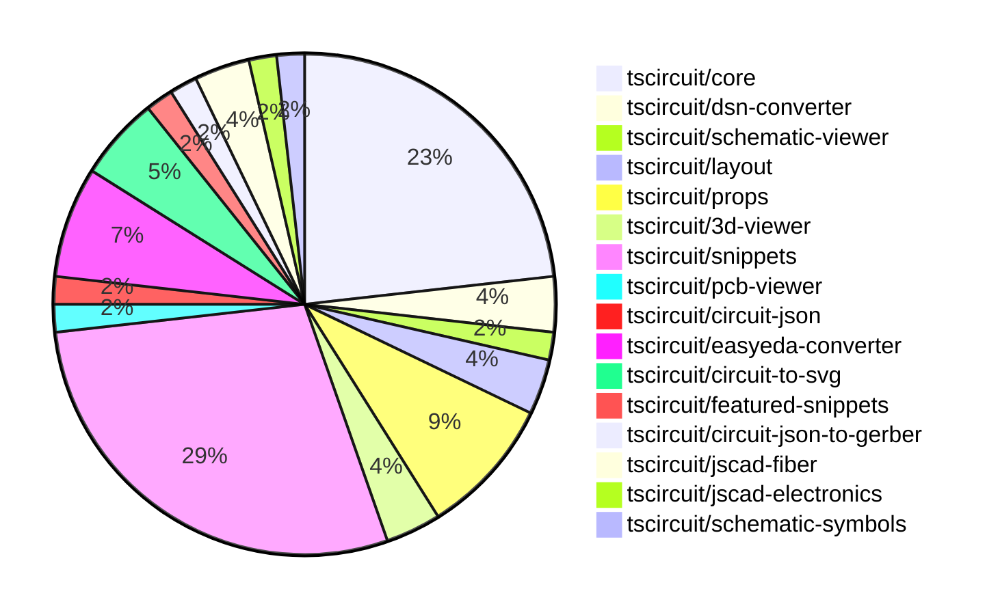

# contribution-tracker

Generates weekly contribution overviews for tscircuit contributors. Check out all
the [contribution overviews here](./contribution-overviews/)

* All PRs in the tscircuit org are scanned/summarized via Claude Haiku
* Claude classifies each Diff/PR as a Major, Minor or Tiny contribution
* All the PRs, summaries, and classifications are organized into charts and tables

The current week is shown below. There are 3 major sections:

* [Contributor Overview](#contributor-overview)
* [PRs by Repository](#prs-by-repository)
* [PRs by Contributor](#changes-by-contributor)

## Current Week

<!-- START_CURRENT_WEEK -->

# Contribution Overview 2024-10-30

## PRs by Repository

## Contributor Overview

| Contributor | 🐳 Major | 🐙 Minor | 🐌 Tiny | ⭐ |
|-------------|-------|-------|-------|-------|
| [seveibar](#seveibar) | 2 | 24 | 0 | 👑 |
| [imrishabh18](#imrishabh18) | 2 | 10 | 1 | ⭐⭐ |
| [ShiboSoftwareDev](#ShiboSoftwareDev) | 1 | 2 | 0 | ⭐ |
| [anas-sarkez](#anas-sarkez) | 1 | 2 | 0 | ⭐ |
| [andrii-balitskyi](#andrii-balitskyi) | 0 | 3 | 0 | ⭐ |
| [tscircuitbot](#tscircuitbot) | 0 | 2 | 0 | ⭐ |
| [aman1376](#aman1376) | 1 | 0 | 0 | ⭐ |
| [mrudulpatil18](#mrudulpatil18) | 0 | 2 | 0 | ⭐ |
| [Satvik1769](#Satvik1769) | 0 | 1 | 0 |  |
| [SufyaanKhateeb](#SufyaanKhateeb) | 0 | 1 | 0 |  |

## Changes by Repository

### [tscircuit/core](https://github.com/tscircuit/core)

| PR # | Impact | Contributor | Description |
|------|--------|-------------|-------------|
| [#224](https://github.com/tscircuit/core/pull/224) | 🐳 Major | imrishabh18 | Adds support for manual edits in the PrimitiveComponent class, allowing users to override the layout of circuit components. |
| [#214](https://github.com/tscircuit/core/pull/214) | 🐳 Major | seveibar | Introduce new hooks `useChip`, `useResistor`, and `useCapacitor` to create corresponding electronic components in a circuit. |
| [#229](https://github.com/tscircuit/core/pull/229) | 🐙 Minor | imrishabh18 | Add the pin number as an alias for portHints |
| [#239](https://github.com/tscircuit/core/pull/239) | 🐙 Minor | seveibar | Fix stub edges on schematic traces |
| [#238](https://github.com/tscircuit/core/pull/238) | 🐙 Minor | seveibar | Refactor the computation of the schematic box dimensions by removing the port stub logic and simplifying the code. |
| [#236](https://github.com/tscircuit/core/pull/236) | 🐙 Minor | seveibar | Improves the rendering of schematic boxes for components other than chips, and removes ghost code. |
| [#235](https://github.com/tscircuit/core/pull/235) | 🐙 Minor | seveibar | Adds support for pinheaders and implied footprint strings |
| [#227](https://github.com/tscircuit/core/pull/227) | 🐙 Minor | seveibar | Fix a bug where the center of the PCB component is not updating correctly when the bounds of the component change. |
| [#223](https://github.com/tscircuit/core/pull/223) | 🐙 Minor | seveibar | Enables removing path loops in the Trace component |
| [#218](https://github.com/tscircuit/core/pull/218) | 🐙 Minor | seveibar | Handles the case where net islands fail to route by providing a custom error message instead of throwing a fatal error. |
| [#217](https://github.com/tscircuit/core/pull/217) | 🐙 Minor | seveibar | Introduces a new hook called `useDiode` for creating diode components in the application. |
| [#212](https://github.com/tscircuit/core/pull/212) | 🐙 Minor | seveibar | Improves the types for the `createUseComponent` function and the `ComponentWithPins` type, allowing for more flexible handling of component pins. |
| [#228](https://github.com/tscircuit/core/pull/228) | 🐌 Tiny | imrishabh18 | Updates the lockfile |

### [tscircuit/dsn-converter](https://github.com/tscircuit/dsn-converter)

| PR # | Impact | Contributor | Description |
|------|--------|-------------|-------------|
| [#13](https://github.com/tscircuit/dsn-converter/pull/13) | 🐳 Major | imrishabh18 | Introduce a new feature to convert circuit JSON to DSN JSON and vice versa. |
| [#8](https://github.com/tscircuit/dsn-converter/pull/8) | 🐳 Major | seveibar | The pull request introduces a major refactor, improves code separation, adds tests, build, release, stringification, and README usage examples. |

### [tscircuit/schematic-viewer](https://github.com/tscircuit/schematic-viewer)

| PR # | Impact | Contributor | Description |
|------|--------|-------------|-------------|
| [#71](https://github.com/tscircuit/schematic-viewer/pull/71) | 🐙 Minor | imrishabh18 | Fix the drag sensitivity to be constant throughout the zooming and panning. |

### [tscircuit/layout](https://github.com/tscircuit/layout)

| PR # | Impact | Contributor | Description |
|------|--------|-------------|-------------|
| [#4](https://github.com/tscircuit/layout/pull/4) | 🐙 Minor | imrishabh18 | Fix types in the `manual-layout-pcb.ts` file |
| [#3](https://github.com/tscircuit/layout/pull/3) | 🐙 Minor | imrishabh18 | Refactors the code to use the "circuit-json" library instead of the "@tscircuit/soup" library. |

### [tscircuit/props](https://github.com/tscircuit/props)

| PR # | Impact | Contributor | Description |
|------|--------|-------------|-------------|
| [#70](https://github.com/tscircuit/props/pull/70) | 🐙 Minor | imrishabh18 | Added `manualEdits` as a prop to the `BoardProps` and `SubcircuitGroupProps` interfaces. |
| [#68](https://github.com/tscircuit/props/pull/68) | 🐙 Minor | seveibar | The pull request adds a GitHub Actions workflow to generate a props overview document and automatically commit the changes. |
| [#72](https://github.com/tscircuit/props/pull/72) | 🐙 Minor | seveibar | Introduce a new `headerProps` type for defining header component properties. |
| [#76](https://github.com/tscircuit/props/pull/76) | 🐙 Minor | tscircuitbot | Rename `headerProps` to `pinHeaderProps`, add `pinHeader.pinLabels` |
| [#74](https://github.com/tscircuit/props/pull/74) | 🐙 Minor | tscircuitbot | Add `holeDiameter` and `platedDiameter` parameters to the `header` component. |

### [tscircuit/3d-viewer](https://github.com/tscircuit/3d-viewer)

| PR # | Impact | Contributor | Description |
|------|--------|-------------|-------------|
| [#29](https://github.com/tscircuit/3d-viewer/pull/29) | 🐙 Minor | imrishabh18 | Update the `@tscircuit/core` dependency from version 0.0.97 to 0.0.136. |
| [#32](https://github.com/tscircuit/3d-viewer/pull/32) | 🐙 Minor | ShiboSoftwareDev | Fixes the rotation of 3D models in the CAD viewer by adding a new `rotationOffset` prop. |

### [tscircuit/snippets](https://github.com/tscircuit/snippets)

| PR # | Impact | Contributor | Description |
|------|--------|-------------|-------------|
| [#164](https://github.com/tscircuit/snippets/pull/164) | 🐙 Minor | imrishabh18 | Fix an overflow issue on the view snippet page. |
| [#159](https://github.com/tscircuit/snippets/pull/159) | 🐙 Minor | imrishabh18 | Remove the `CodeEditorHeader` component from the `CodeEditor` component when `showImportAndFormatButtons` is false. |
| [#143](https://github.com/tscircuit/snippets/pull/143) | 🐙 Minor | imrishabh18 | Update the position of the circuit on movement in the manual edits feature. |
| [#141](https://github.com/tscircuit/snippets/pull/141) | 🐙 Minor | imrishabh18 | Fix code to update current file changes |
| [#169](https://github.com/tscircuit/snippets/pull/169) | 🐙 Minor | seveibar | Updates dependencies (core and circuit-to-svg), swaps the schematic viewer to use the circuit-to-svg library with mouse controls. |
| [#162](https://github.com/tscircuit/snippets/pull/162) | 🐙 Minor | seveibar | Introduces manual edits functionality, refactors one-way dataflow, and updates dependencies. |
| [#155](https://github.com/tscircuit/snippets/pull/155) | 🐙 Minor | seveibar | Disables the automatic closing bracket insertion feature in the CodeEditor component. |
| [#154](https://github.com/tscircuit/snippets/pull/154) | 🐙 Minor | seveibar | Fix clicking "go to definition" removing dashes |
| [#150](https://github.com/tscircuit/snippets/pull/150) | 🐙 Minor | seveibar | Update Toast position, fix Sticky Preview, improve Dropdown color for CodeEditor files, and add FS Map from CDN to fix some type issues. |
| [#149](https://github.com/tscircuit/snippets/pull/149) | 🐙 Minor | seveibar | Fix createUseComponent types, Improve toast position, sticky preview, improve code editor header filename select box color |
| [#147](https://github.com/tscircuit/snippets/pull/147) | 🐙 Minor | seveibar | Update the easyeda dependency to version 0.0.62 to fix ESP32 import, improve the Schematic Viewer Height, and add a Sticky Preview feature. |
| [#167](https://github.com/tscircuit/snippets/pull/167) | 🐙 Minor | ShiboSoftwareDev | Fixes the issue where the cmd+click tooltip appears on all tsci imports in the code editor. |
| [#163](https://github.com/tscircuit/snippets/pull/163) | 🐙 Minor | Satvik1769 | Adds a hook to warn the user before leaving the page if there are unsaved changes. |
| [#121](https://github.com/tscircuit/snippets/pull/121) | 🐙 Minor | mrudulpatil18 | This pull request fixes the search filtering issue in the Command palette by rewriting the logic to use Fuzzy search to filter the possible commands. |
| [#137](https://github.com/tscircuit/snippets/pull/137) | 🐙 Minor | mrudulpatil18 | Adds a new parameter to the `encodeTextToUrlHash` function to include the snippet type in the URL. |
| [#144](https://github.com/tscircuit/snippets/pull/144) | 🐙 Minor | SufyaanKhateeb | Fix the profile page header to say "My Profile" when the current user is viewing their profile and fix the "My Profile" link in the footer to show up only when logged in. |

### [tscircuit/pcb-viewer](https://github.com/tscircuit/pcb-viewer)

| PR # | Impact | Contributor | Description |
|------|--------|-------------|-------------|
| [#79](https://github.com/tscircuit/pcb-viewer/pull/79) | 🐙 Minor | seveibar | Standardizes the use of a `zIndexMap` object to manage z-index values across different components in the application. |

### [tscircuit/circuit-json](https://github.com/tscircuit/circuit-json)

| PR # | Impact | Contributor | Description |
|------|--------|-------------|-------------|
| [#67](https://github.com/tscircuit/circuit-json/pull/67) | 🐙 Minor | seveibar | Improved parsing of SI units by handling the case of "uF" for micro-Farads. |

### [tscircuit/easyeda-converter](https://github.com/tscircuit/easyeda-converter)

| PR # | Impact | Contributor | Description |
|------|--------|-------------|-------------|
| [#89](https://github.com/tscircuit/easyeda-converter/pull/89) | 🐙 Minor | seveibar | Normalizes pin labels to preserve the original pin numbers. |
| [#94](https://github.com/tscircuit/easyeda-converter/pull/94) | 🐙 Minor | andrii-balitskyi | Correctly parses right-facing (end) pins from raw EasyEDA JSON |
| [#93](https://github.com/tscircuit/easyeda-converter/pull/93) | 🐙 Minor | andrii-balitskyi | Sort pin labels in ascending order |
| [#91](https://github.com/tscircuit/easyeda-converter/pull/91) | 🐙 Minor | andrii-balitskyi | Include duplicate pin name in pin label array and remove pinNames from component template |

### [tscircuit/circuit-to-svg](https://github.com/tscircuit/circuit-to-svg)

| PR # | Impact | Contributor | Description |
|------|--------|-------------|-------------|
| [#105](https://github.com/tscircuit/circuit-to-svg/pull/105) | 🐙 Minor | seveibar | Update the version of the "@tscircuit/core" dependency in the package.json file from 0.0.147 to 0.0.148. |
| [#104](https://github.com/tscircuit/circuit-to-svg/pull/104) | 🟣 | seveibar | Major refactor to all schematic objects, including using absolute coordinates, breaking up functions, and fixing offsets. |
| [#103](https://github.com/tscircuit/circuit-to-svg/pull/103) | 🐙 Minor | seveibar | Fixes schematic component rendering relying on non-standard props |

### [tscircuit/featured-snippets](https://github.com/tscircuit/featured-snippets)

| PR # | Impact | Contributor | Description |
|------|--------|-------------|-------------|
| [#2](https://github.com/tscircuit/featured-snippets/pull/2) | 🐙 Minor | seveibar | Exports file content to help with building prompts |

### [tscircuit/circuit-json-to-gerber](https://github.com/tscircuit/circuit-json-to-gerber)

| PR # | Impact | Contributor | Description |
|------|--------|-------------|-------------|
| [#27](https://github.com/tscircuit/circuit-json-to-gerber/pull/27) | 🐳 Major | ShiboSoftwareDev | Added support for silkscreen text |

### [tscircuit/jscad-fiber](https://github.com/tscircuit/jscad-fiber)

| PR # | Impact | Contributor | Description |
|------|--------|-------------|-------------|
| [#86](https://github.com/tscircuit/jscad-fiber/pull/86) | 🐳 Major | anas-sarkez | Refactored the `createHostConfig` function to support array-based subtraction of React elements, improving the handling of nested React elements and addressing type and structure errors. |
| [#87](https://github.com/tscircuit/jscad-fiber/pull/87) | 🐙 Minor | anas-sarkez | Fixed type errors in the `createInstance` function by casting the `child.type` to `string | ((props: any) => any)`. |

### [tscircuit/jscad-electronics](https://github.com/tscircuit/jscad-electronics)

| PR # | Impact | Contributor | Description |
|------|--------|-------------|-------------|
| [#77](https://github.com/tscircuit/jscad-electronics/pull/77) | 🐙 Minor | anas-sarkez | Supported a different color for capacitors with example and updated dependencies |

### [tscircuit/schematic-symbols](https://github.com/tscircuit/schematic-symbols)

| PR # | Impact | Contributor | Description |
|------|--------|-------------|-------------|
| [#187](https://github.com/tscircuit/schematic-symbols/pull/187) | 🐳 Major | aman1376 | Adds a new illuminated push button symbol with a normally open configuration. |

## Changes by Contributor

### [imrishabh18](https://github.com/imrishabh18)

| PR # | Impact | Description |
|------|--------|-------------|
| [#224](https://github.com/tscircuit/core/pull/224) | 🐳 Major | Adds support for manual edits in the PrimitiveComponent class, allowing users to override the layout of circuit components. |
| [#13](https://github.com/tscircuit/dsn-converter/pull/13) | 🐳 Major | Introduce a new feature to convert circuit JSON to DSN JSON and vice versa. |
| [#71](https://github.com/tscircuit/schematic-viewer/pull/71) | 🐙 Minor | Fix the drag sensitivity to be constant throughout the zooming and panning. |
| [#4](https://github.com/tscircuit/layout/pull/4) | 🐙 Minor | Fix types in the `manual-layout-pcb.ts` file |
| [#3](https://github.com/tscircuit/layout/pull/3) | 🐙 Minor | Refactors the code to use the "circuit-json" library instead of the "@tscircuit/soup" library. |
| [#70](https://github.com/tscircuit/props/pull/70) | 🐙 Minor | Added `manualEdits` as a prop to the `BoardProps` and `SubcircuitGroupProps` interfaces. |
| [#29](https://github.com/tscircuit/3d-viewer/pull/29) | 🐙 Minor | Update the `@tscircuit/core` dependency from version 0.0.97 to 0.0.136. |
| [#229](https://github.com/tscircuit/core/pull/229) | 🐙 Minor | Add the pin number as an alias for portHints |
| [#164](https://github.com/tscircuit/snippets/pull/164) | 🐙 Minor | Fix an overflow issue on the view snippet page. |
| [#159](https://github.com/tscircuit/snippets/pull/159) | 🐙 Minor | Remove the `CodeEditorHeader` component from the `CodeEditor` component when `showImportAndFormatButtons` is false. |
| [#143](https://github.com/tscircuit/snippets/pull/143) | 🐙 Minor | Update the position of the circuit on movement in the manual edits feature. |
| [#141](https://github.com/tscircuit/snippets/pull/141) | 🐙 Minor | Fix code to update current file changes |
| [#228](https://github.com/tscircuit/core/pull/228) | 🐌 Tiny | Updates the lockfile |

### [seveibar](https://github.com/seveibar)

| PR # | Impact | Description |
|------|--------|-------------|
| [#214](https://github.com/tscircuit/core/pull/214) | 🐳 Major | Introduce new hooks `useChip`, `useResistor`, and `useCapacitor` to create corresponding electronic components in a circuit. |
| [#79](https://github.com/tscircuit/pcb-viewer/pull/79) | 🐙 Minor | Standardizes the use of a `zIndexMap` object to manage z-index values across different components in the application. |
| [#67](https://github.com/tscircuit/circuit-json/pull/67) | 🐙 Minor | Improved parsing of SI units by handling the case of "uF" for micro-Farads. |
| [#68](https://github.com/tscircuit/props/pull/68) | 🐙 Minor | The pull request adds a GitHub Actions workflow to generate a props overview document and automatically commit the changes. |
| [#72](https://github.com/tscircuit/props/pull/72) | 🐙 Minor | Introduce a new `headerProps` type for defining header component properties. |
| [#89](https://github.com/tscircuit/easyeda-converter/pull/89) | 🐙 Minor | Normalizes pin labels to preserve the original pin numbers. |
| [#239](https://github.com/tscircuit/core/pull/239) | 🐙 Minor | Fix stub edges on schematic traces |
| [#238](https://github.com/tscircuit/core/pull/238) | 🐙 Minor | Refactor the computation of the schematic box dimensions by removing the port stub logic and simplifying the code. |
| [#236](https://github.com/tscircuit/core/pull/236) | 🐙 Minor | Improves the rendering of schematic boxes for components other than chips, and removes ghost code. |
| [#235](https://github.com/tscircuit/core/pull/235) | 🐙 Minor | Adds support for pinheaders and implied footprint strings |
| [#227](https://github.com/tscircuit/core/pull/227) | 🐙 Minor | Fix a bug where the center of the PCB component is not updating correctly when the bounds of the component change. |
| [#223](https://github.com/tscircuit/core/pull/223) | 🐙 Minor | Enables removing path loops in the Trace component |
| [#218](https://github.com/tscircuit/core/pull/218) | 🐙 Minor | Handles the case where net islands fail to route by providing a custom error message instead of throwing a fatal error. |
| [#217](https://github.com/tscircuit/core/pull/217) | 🐙 Minor | Introduces a new hook called `useDiode` for creating diode components in the application. |
| [#212](https://github.com/tscircuit/core/pull/212) | 🐙 Minor | Improves the types for the `createUseComponent` function and the `ComponentWithPins` type, allowing for more flexible handling of component pins. |
| [#105](https://github.com/tscircuit/circuit-to-svg/pull/105) | 🐙 Minor | Update the version of the "@tscircuit/core" dependency in the package.json file from 0.0.147 to 0.0.148. |
| [#104](https://github.com/tscircuit/circuit-to-svg/pull/104) | 🟣 | Major refactor to all schematic objects, including using absolute coordinates, breaking up functions, and fixing offsets. |
| [#8](https://github.com/tscircuit/dsn-converter/pull/8) | 🐳 Major | The pull request introduces a major refactor, improves code separation, adds tests, build, release, stringification, and README usage examples. |
| [#103](https://github.com/tscircuit/circuit-to-svg/pull/103) | 🐙 Minor | Fixes schematic component rendering relying on non-standard props |
| [#169](https://github.com/tscircuit/snippets/pull/169) | 🐙 Minor | Updates dependencies (core and circuit-to-svg), swaps the schematic viewer to use the circuit-to-svg library with mouse controls. |
| [#162](https://github.com/tscircuit/snippets/pull/162) | 🐙 Minor | Introduces manual edits functionality, refactors one-way dataflow, and updates dependencies. |
| [#155](https://github.com/tscircuit/snippets/pull/155) | 🐙 Minor | Disables the automatic closing bracket insertion feature in the CodeEditor component. |
| [#154](https://github.com/tscircuit/snippets/pull/154) | 🐙 Minor | Fix clicking "go to definition" removing dashes |
| [#150](https://github.com/tscircuit/snippets/pull/150) | 🐙 Minor | Update Toast position, fix Sticky Preview, improve Dropdown color for CodeEditor files, and add FS Map from CDN to fix some type issues. |
| [#149](https://github.com/tscircuit/snippets/pull/149) | 🐙 Minor | Fix createUseComponent types, Improve toast position, sticky preview, improve code editor header filename select box color |
| [#147](https://github.com/tscircuit/snippets/pull/147) | 🐙 Minor | Update the easyeda dependency to version 0.0.62 to fix ESP32 import, improve the Schematic Viewer Height, and add a Sticky Preview feature. |
| [#2](https://github.com/tscircuit/featured-snippets/pull/2) | 🐙 Minor | Exports file content to help with building prompts |

### [tscircuitbot](https://github.com/tscircuitbot)

| PR # | Impact | Description |
|------|--------|-------------|
| [#76](https://github.com/tscircuit/props/pull/76) | 🐙 Minor | Rename `headerProps` to `pinHeaderProps`, add `pinHeader.pinLabels` |
| [#74](https://github.com/tscircuit/props/pull/74) | 🐙 Minor | Add `holeDiameter` and `platedDiameter` parameters to the `header` component. |

### [andrii-balitskyi](https://github.com/andrii-balitskyi)

| PR # | Impact | Description |
|------|--------|-------------|
| [#94](https://github.com/tscircuit/easyeda-converter/pull/94) | 🐙 Minor | Correctly parses right-facing (end) pins from raw EasyEDA JSON |
| [#93](https://github.com/tscircuit/easyeda-converter/pull/93) | 🐙 Minor | Sort pin labels in ascending order |
| [#91](https://github.com/tscircuit/easyeda-converter/pull/91) | 🐙 Minor | Include duplicate pin name in pin label array and remove pinNames from component template |

### [ShiboSoftwareDev](https://github.com/ShiboSoftwareDev)

| PR # | Impact | Description |
|------|--------|-------------|
| [#27](https://github.com/tscircuit/circuit-json-to-gerber/pull/27) | 🐳 Major | Added support for silkscreen text |
| [#32](https://github.com/tscircuit/3d-viewer/pull/32) | 🐙 Minor | Fixes the rotation of 3D models in the CAD viewer by adding a new `rotationOffset` prop. |
| [#167](https://github.com/tscircuit/snippets/pull/167) | 🐙 Minor | Fixes the issue where the cmd+click tooltip appears on all tsci imports in the code editor. |

### [anas-sarkez](https://github.com/anas-sarkez)

| PR # | Impact | Description |
|------|--------|-------------|
| [#86](https://github.com/tscircuit/jscad-fiber/pull/86) | 🐳 Major | Refactored the `createHostConfig` function to support array-based subtraction of React elements, improving the handling of nested React elements and addressing type and structure errors. |
| [#77](https://github.com/tscircuit/jscad-electronics/pull/77) | 🐙 Minor | Supported a different color for capacitors with example and updated dependencies |
| [#87](https://github.com/tscircuit/jscad-fiber/pull/87) | 🐙 Minor | Fixed type errors in the `createInstance` function by casting the `child.type` to `string | ((props: any) => any)`. |

### [aman1376](https://github.com/aman1376)

| PR # | Impact | Description |
|------|--------|-------------|
| [#187](https://github.com/tscircuit/schematic-symbols/pull/187) | 🐳 Major | Adds a new illuminated push button symbol with a normally open configuration. |

### [Satvik1769](https://github.com/Satvik1769)

| PR # | Impact | Description |
|------|--------|-------------|
| [#163](https://github.com/tscircuit/snippets/pull/163) | 🐙 Minor | Adds a hook to warn the user before leaving the page if there are unsaved changes. |

### [mrudulpatil18](https://github.com/mrudulpatil18)

| PR # | Impact | Description |
|------|--------|-------------|
| [#121](https://github.com/tscircuit/snippets/pull/121) | 🐙 Minor | This pull request fixes the search filtering issue in the Command palette by rewriting the logic to use Fuzzy search to filter the possible commands. |
| [#137](https://github.com/tscircuit/snippets/pull/137) | 🐙 Minor | Adds a new parameter to the `encodeTextToUrlHash` function to include the snippet type in the URL. |

### [SufyaanKhateeb](https://github.com/SufyaanKhateeb)

| PR # | Impact | Description |
|------|--------|-------------|
| [#144](https://github.com/tscircuit/snippets/pull/144) | 🐙 Minor | Fix the profile page header to say "My Profile" when the current user is viewing their profile and fix the "My Profile" link in the footer to show up only when logged in. |

<!-- END_CURRENT_WEEK -->
