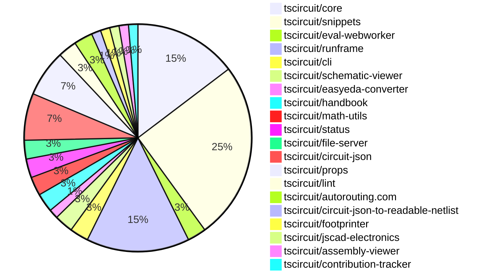

# contribution-tracker

Generates weekly contribution overviews for tscircuit contributors. Check out all
the [contribution overviews here](./contribution-overviews/)

* All PRs in the tscircuit org are scanned/summarized via Claude Haiku
* Claude classifies each Diff/PR as a Major, Minor or Tiny contribution
* All the PRs, summaries, and classifications are organized into charts and tables

The current week is shown below. There are 3 major sections:

* [Contributor Overview](#contributor-overview)
* [PRs by Repository](#prs-by-repository)
* [PRs by Contributor](#changes-by-contributor)

## Current Week

<!-- START_CURRENT_WEEK -->

# Contribution Overview 2024-12-25

## PRs by Repository

## Contributor Overview

| Contributor | 🐳 Major | 🐙 Minor | 🐌 Tiny | ⭐ | Issues Created |
|-------------|---------|---------|---------|-----|----------------|
| [seveibar](#seveibar) | 8 | 29 | 1 | 👑👑👑 | 66 |
| [Anshgrover23](#Anshgrover23) | 0 | 14 | 2 | ⭐⭐⭐ | 11 |
| [ShiboSoftwareDev](#ShiboSoftwareDev) | 1 | 2 | 0 | ⭐⭐⭐ | 14 |
| [Abse2001](#Abse2001) | 1 | 5 | 0 | ⭐⭐ | 3 |
| [devin-ai-integration[bot]](#devin-ai-integration[bot]) | 1 | 3 | 0 | ⭐ | 0 |
| [AnasSarkiz](#AnasSarkiz) | 0 | 3 | 0 | ⭐ | 4 |
| [imrishabh18](#imrishabh18) | 0 | 1 | 0 | ⭐ | 8 |
| [techmannih](#techmannih) | 0 | 3 | 0 | ⭐ | 2 |
| [karthik-nair-20](#karthik-nair-20) | 0 | 1 | 0 |  | 0 |

## Review Table

[reviews-received-hover]: ## "Number of reviews received for PRs for this contributor"
[approvals-received-hover]: ## "Number of approvals received for PRs this contributor authored"
[rejections-received-hover]: ## "Number of rejections received for PRs this contributor authored"
[prs-opened-hover]: ## "Number of PRs opened by this contributor"
[issues-created-hover]: ## "Number of issues created by this contributor"
[bountied-issues-hover]: ## "Number of issues this contributor created with a bounty"
[bountied-issue-$-hover]: ## "Total bounty amount placed on issues authored by this contributor"

| Contributor | Reviews Received | Approvals Received | Rejections Received | Approvals | Rejections | PRs Opened | PRs Merged | Issues Created | Bountied Issues | Bountied Issue $ |
|---|---|---|---|---|---|---|---|---|---|---|
| [seveibar](#seveibar) | 0 | 0 | 0 | 37 | 19 | 41 | 38 | 66 | 35 | 692 |
| [Abse2001](#Abse2001) | 13 | 6 | 0 | 2 | 0 | 7 | 6 | 3 | 3 | 32 |
| [devin-ai-integration[bot]](#devin-ai-integration[bot]) | 8 | 3 | 1 | 0 | 0 | 12 | 4 | 0 | 0 | 0 |
| [Anshgrover23](#Anshgrover23) | 70 | 18 | 15 | 0 | 4 | 24 | 16 | 11 | 1 | 4 |
| [techmannih](#techmannih) | 24 | 4 | 11 | 0 | 0 | 10 | 3 | 2 | 0 | 0 |
| [imrishabh18](#imrishabh18) | 2 | 1 | 0 | 0 | 2 | 2 | 1 | 8 | 3 | 20 |
| [ShiboSoftwareDev](#ShiboSoftwareDev) | 9 | 4 | 0 | 1 | 3 | 5 | 3 | 14 | 6 | 102 |
| [AnasSarkiz](#AnasSarkiz) | 4 | 4 | 0 | 0 | 0 | 3 | 3 | 4 | 2 | 20 |
| [DrSensor](#DrSensor) | 0 | 0 | 0 | 0 | 0 | 1 | 0 | 0 | 0 | 0 |
| [vishwamartur](#vishwamartur) | 1 | 0 | 1 | 0 | 0 | 1 | 0 | 0 | 0 | 0 |
| [abhijitxy](#abhijitxy) | 0 | 0 | 0 | 1 | 0 | 0 | 0 | 0 | 0 | 0 |
| [krushnarout](#krushnarout) | 0 | 0 | 0 | 0 | 0 | 1 | 0 | 0 | 0 | 0 |
| [karthik-nair-20](#karthik-nair-20) | 1 | 1 | 0 | 0 | 0 | 2 | 1 | 0 | 0 | 0 |

## Changes by Repository

### [tscircuit/core](https://github.com/tscircuit/core)

| PR # | Impact | Contributor | Description |
|------|--------|-------------|-------------|
| [#455](https://github.com/tscircuit/core/pull/455) | 🐳 Major | seveibar | Adds support for schematic manual placements in the circuit editor. |
| [#472](https://github.com/tscircuit/core/pull/472) | 🐳 Major | Abse2001 | Adds a new function `getTraceLength` to compute the total length of a PCB trace by summing the lengths of all wire segments and via connections, and a function `getMaxLengthFromConnectedCapacitors` to get the maximum trace length from connected capacitors. |
| [#475](https://github.com/tscircuit/core/pull/475) | 🐙 Minor | seveibar | Adds support for non-numeric pin labels in the schPinStyle prop, and introduces a new function getNumericSchPinStyle to handle the conversion of pin styles to use numeric pin numbers. |
| [#470](https://github.com/tscircuit/core/pull/470) | 🐙 Minor | seveibar | Improves the positioning of schematic components and text by using the global schematic position instead of the individual x and y props. |
| [#468](https://github.com/tscircuit/core/pull/468) | 🐙 Minor | seveibar | Improve error messages in the RootCircuit class to provide more context. |
| [#457](https://github.com/tscircuit/core/pull/457) | 🐙 Minor | seveibar | Adds support for sending the display name to the autorouting server and requires the display name to be provided. |
| [#456](https://github.com/tscircuit/core/pull/456) | 🐙 Minor | seveibar | Renames the `Circuit` class to `RootCircuit` throughout the codebase. |
| [#466](https://github.com/tscircuit/core/pull/466) | 🐙 Minor | Anshgrover23 | Adds the `display_value` property for resistors and capacitors to display the component values in the schematic. |
| [#442](https://github.com/tscircuit/core/pull/442) | 🐙 Minor | Anshgrover23 | Adds a new component called "resonator" with a default schematic and a schematic without ground. |
| [#459](https://github.com/tscircuit/core/pull/459) | 🐙 Minor | Anshgrover23 | Adds a Transistor component to the library. |
| [#458](https://github.com/tscircuit/core/pull/458) | 🐌 Tiny | seveibar | Adds a new export `Circuit` to provide backwards compatibility with the existing `RootCircuit`. |

### [tscircuit/snippets](https://github.com/tscircuit/snippets)

| PR # | Impact | Contributor | Description |
|------|--------|-------------|-------------|
| [#446](https://github.com/tscircuit/snippets/pull/446) | 🐳 Major | seveibar | Adds a new landing page for the tscircuit project, including various sections such as a FAQ and footer. |
| [#423](https://github.com/tscircuit/snippets/pull/423) | 🐳 Major | ShiboSoftwareDev | Autoload snippets from registry to development server |
| [#468](https://github.com/tscircuit/snippets/pull/468) | 🐙 Minor | seveibar | Improves the layout and presentation of the landing page's feature bullet points on mobile devices. |
| [#463](https://github.com/tscircuit/snippets/pull/463) | 🐙 Minor | seveibar | Fixes an issue where unsaved changes never go away, and adds tracking functionality using Vercel Analytics and PostHog. |
| [#454](https://github.com/tscircuit/snippets/pull/454) | 🐙 Minor | seveibar | Slows down the animation of the trending snippets carousel and adds a PCB view in the carousel items. |
| [#451](https://github.com/tscircuit/snippets/pull/451) | 🐙 Minor | seveibar | Adds a search component to the landing page header and improves the FAQ section with additional questions and answers. |
| [#442](https://github.com/tscircuit/snippets/pull/442) | 🐙 Minor | seveibar | Improve SEO by adding meta tags and keywords to the website's index.html file. |
| [#438](https://github.com/tscircuit/snippets/pull/438) | 🐙 Minor | seveibar | Add download for readable netlist |
| [#430](https://github.com/tscircuit/snippets/pull/430) | 🐙 Minor | seveibar | Add circuit name for better logs on autorouting server |
| [#458](https://github.com/tscircuit/snippets/pull/458) | 🐙 Minor | Anshgrover23 | Fixes Playwright tests by updating waits and clicks |
| [#452](https://github.com/tscircuit/snippets/pull/452) | 🐙 Minor | Anshgrover23 | Adds the display of the number of stars for each snippet on the user profile page. |
| [#434](https://github.com/tscircuit/snippets/pull/434) | 🐙 Minor | Anshgrover23 | Change the save button to a fork button when the current user is not the owner of the snippet. |
| [#431](https://github.com/tscircuit/snippets/pull/431) | 🐙 Minor | Anshgrover23 | Fix for playwright-tests failing due to various changes in the test suite |
| [#422](https://github.com/tscircuit/snippets/pull/422) | 🐙 Minor | Anshgrover23 | Add `waitforLoadState` to `view-snippet.spec.ts` test to ensure the page is fully loaded before taking screenshots. |
| [#439](https://github.com/tscircuit/snippets/pull/439) | 🐙 Minor | devin-ai-integration[bot] | Switches the chat icon in the header to the Discord logo, linking to the join page. |
| [#425](https://github.com/tscircuit/snippets/pull/425) | 🐙 Minor | karthik-nair-20 | Fix the alignment of the EditorNav component to the right side on responsive devices. |
| [#417](https://github.com/tscircuit/snippets/pull/417) | 🐙 Minor | imrishabh18 | Fixes the issue of throwing an error when importing an empty file for manual-edits. |
| [#472](https://github.com/tscircuit/snippets/pull/472) | 🐌 Tiny | Anshgrover23 | Adds Algora bounty badges to the project's README.md file. |
| [#448](https://github.com/tscircuit/snippets/pull/448) | 🐌 Tiny | Anshgrover23 | Updates snapshots of homePage test |

### [tscircuit/eval-webworker](https://github.com/tscircuit/eval-webworker)

| PR # | Impact | Contributor | Description |
|------|--------|-------------|-------------|
| [#55](https://github.com/tscircuit/eval-webworker/pull/55) | 🐳 Major | seveibar | Update the core library, fix types, and add support for naming the circuit. |
| [#54](https://github.com/tscircuit/eval-webworker/pull/54) | 🐙 Minor | seveibar | Exports additional types from the library |

### [tscircuit/runframe](https://github.com/tscircuit/runframe)

| PR # | Impact | Contributor | Description |
|------|--------|-------------|-------------|
| [#79](https://github.com/tscircuit/runframe/pull/79) | 🐳 Major | seveibar | Fixes issues related to re-rendering on entrypoint change and correct order of rendering vs. evaluation promises. |
| [#76](https://github.com/tscircuit/runframe/pull/76) | 🐳 Major | seveibar | Introduce a new CLI-specific `RunFrameForCli` component, load initial files via a new `loadInitialFiles` action, and use the `run-frame` build target as the default. |
| [#73](https://github.com/tscircuit/runframe/pull/73) | 🐳 Major | seveibar | Adds a save snippet button, formalizes events for syncing, and includes various improvements to the sync logic. |
| [#52](https://github.com/tscircuit/runframe/pull/52) | 🐳 Major | seveibar | Adds support for schematic drag'n'drop with filesystem syncing via `@tscircuit/file-server`. |
| [#84](https://github.com/tscircuit/runframe/pull/84) | 🐙 Minor | seveibar | Update the core and eval-webworker dependencies in the project's package.json file. |
| [#78](https://github.com/tscircuit/runframe/pull/78) | 🐙 Minor | seveibar | Fixes a bug where the entrypoint not triggering a re-render in the `RunFrame` component. |
| [#77](https://github.com/tscircuit/runframe/pull/77) | 🐙 Minor | seveibar | Adds logging for the selected entrypoint and loads initial files via a list. |
| [#75](https://github.com/tscircuit/runframe/pull/75) | 🐙 Minor | seveibar | Change the default static build target from `RunFrameWithApi` to `RunFrameForCli` in the main application. |
| [#60](https://github.com/tscircuit/runframe/pull/60) | 🐙 Minor | seveibar | Fix the `fsMap` component to handle `null` or `undefined` values correctly. |
| [#48](https://github.com/tscircuit/runframe/pull/48) | 🐙 Minor | seveibar | Adds a new prop `leftHeaderContent` to the `CircuitJsonPreview` and `RunFrame` components, allowing users to render custom content on the left side of the header. |
| [#65](https://github.com/tscircuit/runframe/pull/65) | 🐙 Minor | techmannih | Add assembly view to the circuit preview |

### [tscircuit/cli](https://github.com/tscircuit/cli)

| PR # | Impact | Contributor | Description |
|------|--------|-------------|-------------|
| [#10](https://github.com/tscircuit/cli/pull/10) | 🐳 Major | seveibar | Adds support for schematic drag and drop, dynamic loading of runframe, and events watcher on the CLI. |
| [#11](https://github.com/tscircuit/cli/pull/11) | 🐙 Minor | seveibar | Fix Module Import issue in cli build |

### [tscircuit/schematic-viewer](https://github.com/tscircuit/schematic-viewer)

| PR # | Impact | Contributor | Description |
|------|--------|-------------|-------------|
| [#76](https://github.com/tscircuit/schematic-viewer/pull/76) | 🐙 Minor | seveibar | The pull request fixes a bug related to updating the circuit JSON when computing the original center for an edit event. |
| [#75](https://github.com/tscircuit/schematic-viewer/pull/75) | 🐙 Minor | seveibar | Change tscircuit dependencies to peer deps to avoid dupes |

### [tscircuit/easyeda-converter](https://github.com/tscircuit/easyeda-converter)

| PR # | Impact | Contributor | Description |
|------|--------|-------------|-------------|
| [#141](https://github.com/tscircuit/easyeda-converter/pull/141) | 🐙 Minor | seveibar | Add instructions to the README for how to add a new part test |

### [tscircuit/handbook](https://github.com/tscircuit/handbook)

| PR # | Impact | Contributor | Description |
|------|--------|-------------|-------------|
| [#6](https://github.com/tscircuit/handbook/pull/6) | 🐙 Minor | seveibar | Create a new guide for learning Git |
| [#4](https://github.com/tscircuit/handbook/pull/4) | 🐙 Minor | Abse2001 | Added a tutorial for using yalc for local development. |

### [tscircuit/math-utils](https://github.com/tscircuit/math-utils)

| PR # | Impact | Contributor | Description |
|------|--------|-------------|-------------|
| [#3](https://github.com/tscircuit/math-utils/pull/3) | 🐙 Minor | seveibar | Adds more grid capabilities, including centering and configurable spacing. |
| [#2](https://github.com/tscircuit/math-utils/pull/2) | 🐙 Minor | seveibar | Adds support for a grid function |

### [tscircuit/status](https://github.com/tscircuit/status)

| PR # | Impact | Contributor | Description |
|------|--------|-------------|-------------|
| [#6](https://github.com/tscircuit/status/pull/6) | 🐙 Minor | seveibar | Only show outages longer than 15 minutes to prevent flaky health checks from listing. |
| [#8](https://github.com/tscircuit/status/pull/8) | 🐙 Minor | devin-ai-integration[bot] | Improve the display of outage durations by showing them in a more human-readable format. |

### [tscircuit/file-server](https://github.com/tscircuit/file-server)

| PR # | Impact | Contributor | Description |
|------|--------|-------------|-------------|
| [#3](https://github.com/tscircuit/file-server/pull/3) | 🐙 Minor | seveibar | Adds an admin index page with links to file and event management pages. |
| [#2](https://github.com/tscircuit/file-server/pull/2) | 🐙 Minor | seveibar | Adds a new `/events/reset` route to reset the events in the database. |

### [tscircuit/circuit-json](https://github.com/tscircuit/circuit-json)

| PR # | Impact | Contributor | Description |
|------|--------|-------------|-------------|
| [#114](https://github.com/tscircuit/circuit-json/pull/114) | 🐙 Minor | Abse2001 | Added a new optional field `max_decoupling_trace_length` to the `source_simple_capacitor` type. |
| [#113](https://github.com/tscircuit/circuit-json/pull/113) | 🐙 Minor | Abse2001 | Added `trace_length` and `max_length` properties to `pcb_trace` and `source_trace` types, respectively. |
| [#111](https://github.com/tscircuit/circuit-json/pull/111) | 🐙 Minor | Anshgrover23 | Add `display_resistance` and `display_capacitance` fields to the `zod` schema for `SourceSimpleResistor` and `SourceSimpleCapacitor` components. |
| [#103](https://github.com/tscircuit/circuit-json/pull/103) | 🐙 Minor | Anshgrover23 | Add a new "simple transistor" circuit element to the project. |
| [#105](https://github.com/tscircuit/circuit-json/pull/105) | 🐙 Minor | techmannih | Adds a new type of PCB plated hole, "circular_hole_with_rect_pad", to the PCB component model. |

### [tscircuit/props](https://github.com/tscircuit/props)

| PR # | Impact | Contributor | Description |
|------|--------|-------------|-------------|
| [#133](https://github.com/tscircuit/props/pull/133) | 🐳 Major | devin-ai-integration[bot] | Adds a new MOSFET component with props and comprehensive test suite. |
| [#139](https://github.com/tscircuit/props/pull/139) | 🐙 Minor | Abse2001 | Added `maxLength` prop to `Trace` component and `maxDecouplingTraceLength` prop to `Capacitor` component. |
| [#125](https://github.com/tscircuit/props/pull/125) | 🐙 Minor | Anshgrover23 | Adds a new `transistorProps` type and corresponding tests to the project. |
| [#131](https://github.com/tscircuit/props/pull/131) | 🐙 Minor | Anshgrover23 | Fix the `pinVariant` property in the `ResonatorProps` interface to accept a wider range of variants. |
| [#135](https://github.com/tscircuit/props/pull/135) | 🐙 Minor | devin-ai-integration[bot] | This pull request adds an automated script to generate documentation for manual edit events and files. |

### [tscircuit/lint](https://github.com/tscircuit/lint)

| PR # | Impact | Contributor | Description |
|------|--------|-------------|-------------|
| [#7](https://github.com/tscircuit/lint/pull/7) | 🐙 Minor | Abse2001 | Added a new dependency rule to enforce the TSCircuit dependency pattern in package.json files and a new rule to enforce the context-passing pattern for functions with two parameters. |
| [#5](https://github.com/tscircuit/lint/pull/5) | 🐙 Minor | techmannih | Adds a CLI script for the tscircuit-lint tool and updates the build process to use tsup instead of bun. |

### [tscircuit/autorouting.com](https://github.com/tscircuit/autorouting.com)

| PR # | Impact | Contributor | Description |
|------|--------|-------------|-------------|
| [#10](https://github.com/tscircuit/autorouting.com/pull/10) | 🐙 Minor | Anshgrover23 | Automatically retry sample uploads up to 3 times on failure |
| [#12](https://github.com/tscircuit/autorouting.com/pull/12) | 🐙 Minor | ShiboSoftwareDev | Removed the "force-dynamic" option from several pages, as dynamic routes cannot be prerendered. |

### [tscircuit/circuit-json-to-readable-netlist](https://github.com/tscircuit/circuit-json-to-readable-netlist)

| PR # | Impact | Contributor | Description |
|------|--------|-------------|-------------|
| [#3](https://github.com/tscircuit/circuit-json-to-readable-netlist/pull/3) | 🐙 Minor | Anshgrover23 | Add a "COMPONENTS" section to the netlist output, which lists the components in the circuit with their descriptions. |

### [tscircuit/footprinter](https://github.com/tscircuit/footprinter)

| PR # | Impact | Contributor | Description |
|------|--------|-------------|-------------|
| [#103](https://github.com/tscircuit/footprinter/pull/103) | 🐙 Minor | AnasSarkiz | Fixed imperial footprints of passive components |

### [tscircuit/jscad-electronics](https://github.com/tscircuit/jscad-electronics)

| PR # | Impact | Contributor | Description |
|------|--------|-------------|-------------|
| [#84](https://github.com/tscircuit/jscad-electronics/pull/84) | 🐙 Minor | AnasSarkiz | Added examples and 3D component definitions for various SMD passive components (A01005, A0201, A1206, A1210, A2010, A2512, and cap1206) |

### [tscircuit/assembly-viewer](https://github.com/tscircuit/assembly-viewer)

| PR # | Impact | Contributor | Description |
|------|--------|-------------|-------------|
| [#4](https://github.com/tscircuit/assembly-viewer/pull/4) | 🐙 Minor | AnasSarkiz | Added footprint prop to capacitors |

### [tscircuit/contribution-tracker](https://github.com/tscircuit/contribution-tracker)

| PR # | Impact | Contributor | Description |
|------|--------|-------------|-------------|
| [#27](https://github.com/tscircuit/contribution-tracker/pull/27) | 🐙 Minor | ShiboSoftwareDev | This pull request adds a feature to count approvals and rejections as tiny contribution points, with a maximum of 20 points across approvals and rejections. |

## Changes by Contributor

### [seveibar](https://github.com/seveibar)

| PR # | Impact | Description |
|------|--------|-------------|
| [#455](https://github.com/tscircuit/core/pull/455) | 🐳 Major | Adds support for schematic manual placements in the circuit editor. |
| [#446](https://github.com/tscircuit/snippets/pull/446) | 🐳 Major | Adds a new landing page for the tscircuit project, including various sections such as a FAQ and footer. |
| [#55](https://github.com/tscircuit/eval-webworker/pull/55) | 🐳 Major | Update the core library, fix types, and add support for naming the circuit. |
| [#79](https://github.com/tscircuit/runframe/pull/79) | 🐳 Major | Fixes issues related to re-rendering on entrypoint change and correct order of rendering vs. evaluation promises. |
| [#76](https://github.com/tscircuit/runframe/pull/76) | 🐳 Major | Introduce a new CLI-specific `RunFrameForCli` component, load initial files via a new `loadInitialFiles` action, and use the `run-frame` build target as the default. |
| [#73](https://github.com/tscircuit/runframe/pull/73) | 🐳 Major | Adds a save snippet button, formalizes events for syncing, and includes various improvements to the sync logic. |
| [#52](https://github.com/tscircuit/runframe/pull/52) | 🐳 Major | Adds support for schematic drag'n'drop with filesystem syncing via `@tscircuit/file-server`. |
| [#10](https://github.com/tscircuit/cli/pull/10) | 🐳 Major | Adds support for schematic drag and drop, dynamic loading of runframe, and events watcher on the CLI. |
| [#76](https://github.com/tscircuit/schematic-viewer/pull/76) | 🐙 Minor | The pull request fixes a bug related to updating the circuit JSON when computing the original center for an edit event. |
| [#75](https://github.com/tscircuit/schematic-viewer/pull/75) | 🐙 Minor | Change tscircuit dependencies to peer deps to avoid dupes |
| [#141](https://github.com/tscircuit/easyeda-converter/pull/141) | 🐙 Minor | Add instructions to the README for how to add a new part test |
| [#475](https://github.com/tscircuit/core/pull/475) | 🐙 Minor | Adds support for non-numeric pin labels in the schPinStyle prop, and introduces a new function getNumericSchPinStyle to handle the conversion of pin styles to use numeric pin numbers. |
| [#470](https://github.com/tscircuit/core/pull/470) | 🐙 Minor | Improves the positioning of schematic components and text by using the global schematic position instead of the individual x and y props. |
| [#468](https://github.com/tscircuit/core/pull/468) | 🐙 Minor | Improve error messages in the RootCircuit class to provide more context. |
| [#457](https://github.com/tscircuit/core/pull/457) | 🐙 Minor | Adds support for sending the display name to the autorouting server and requires the display name to be provided. |
| [#456](https://github.com/tscircuit/core/pull/456) | 🐙 Minor | Renames the `Circuit` class to `RootCircuit` throughout the codebase. |
| [#6](https://github.com/tscircuit/handbook/pull/6) | 🐙 Minor | Create a new guide for learning Git |
| [#3](https://github.com/tscircuit/math-utils/pull/3) | 🐙 Minor | Adds more grid capabilities, including centering and configurable spacing. |
| [#2](https://github.com/tscircuit/math-utils/pull/2) | 🐙 Minor | Adds support for a grid function |
| [#468](https://github.com/tscircuit/snippets/pull/468) | 🐙 Minor | Improves the layout and presentation of the landing page's feature bullet points on mobile devices. |
| [#463](https://github.com/tscircuit/snippets/pull/463) | 🐙 Minor | Fixes an issue where unsaved changes never go away, and adds tracking functionality using Vercel Analytics and PostHog. |
| [#454](https://github.com/tscircuit/snippets/pull/454) | 🐙 Minor | Slows down the animation of the trending snippets carousel and adds a PCB view in the carousel items. |
| [#451](https://github.com/tscircuit/snippets/pull/451) | 🐙 Minor | Adds a search component to the landing page header and improves the FAQ section with additional questions and answers. |
| [#442](https://github.com/tscircuit/snippets/pull/442) | 🐙 Minor | Improve SEO by adding meta tags and keywords to the website's index.html file. |
| [#438](https://github.com/tscircuit/snippets/pull/438) | 🐙 Minor | Add download for readable netlist |
| [#430](https://github.com/tscircuit/snippets/pull/430) | 🐙 Minor | Add circuit name for better logs on autorouting server |
| [#6](https://github.com/tscircuit/status/pull/6) | 🐙 Minor | Only show outages longer than 15 minutes to prevent flaky health checks from listing. |
| [#54](https://github.com/tscircuit/eval-webworker/pull/54) | 🐙 Minor | Exports additional types from the library |
| [#84](https://github.com/tscircuit/runframe/pull/84) | 🐙 Minor | Update the core and eval-webworker dependencies in the project's package.json file. |
| [#78](https://github.com/tscircuit/runframe/pull/78) | 🐙 Minor | Fixes a bug where the entrypoint not triggering a re-render in the `RunFrame` component. |
| [#77](https://github.com/tscircuit/runframe/pull/77) | 🐙 Minor | Adds logging for the selected entrypoint and loads initial files via a list. |
| [#75](https://github.com/tscircuit/runframe/pull/75) | 🐙 Minor | Change the default static build target from `RunFrameWithApi` to `RunFrameForCli` in the main application. |
| [#60](https://github.com/tscircuit/runframe/pull/60) | 🐙 Minor | Fix the `fsMap` component to handle `null` or `undefined` values correctly. |
| [#48](https://github.com/tscircuit/runframe/pull/48) | 🐙 Minor | Adds a new prop `leftHeaderContent` to the `CircuitJsonPreview` and `RunFrame` components, allowing users to render custom content on the left side of the header. |
| [#11](https://github.com/tscircuit/cli/pull/11) | 🐙 Minor | Fix Module Import issue in cli build |
| [#3](https://github.com/tscircuit/file-server/pull/3) | 🐙 Minor | Adds an admin index page with links to file and event management pages. |
| [#2](https://github.com/tscircuit/file-server/pull/2) | 🐙 Minor | Adds a new `/events/reset` route to reset the events in the database. |
| [#458](https://github.com/tscircuit/core/pull/458) | 🐌 Tiny | Adds a new export `Circuit` to provide backwards compatibility with the existing `RootCircuit`. |

### [Abse2001](https://github.com/Abse2001)

| PR # | Impact | Description |
|------|--------|-------------|
| [#472](https://github.com/tscircuit/core/pull/472) | 🐳 Major | Adds a new function `getTraceLength` to compute the total length of a PCB trace by summing the lengths of all wire segments and via connections, and a function `getMaxLengthFromConnectedCapacitors` to get the maximum trace length from connected capacitors. |
| [#114](https://github.com/tscircuit/circuit-json/pull/114) | 🐙 Minor | Added a new optional field `max_decoupling_trace_length` to the `source_simple_capacitor` type. |
| [#113](https://github.com/tscircuit/circuit-json/pull/113) | 🐙 Minor | Added `trace_length` and `max_length` properties to `pcb_trace` and `source_trace` types, respectively. |
| [#139](https://github.com/tscircuit/props/pull/139) | 🐙 Minor | Added `maxLength` prop to `Trace` component and `maxDecouplingTraceLength` prop to `Capacitor` component. |
| [#4](https://github.com/tscircuit/handbook/pull/4) | 🐙 Minor | Added a tutorial for using yalc for local development. |
| [#7](https://github.com/tscircuit/lint/pull/7) | 🐙 Minor | Added a new dependency rule to enforce the TSCircuit dependency pattern in package.json files and a new rule to enforce the context-passing pattern for functions with two parameters. |

### [Anshgrover23](https://github.com/Anshgrover23)

| PR # | Impact | Description |
|------|--------|-------------|
| [#111](https://github.com/tscircuit/circuit-json/pull/111) | 🐙 Minor | Add `display_resistance` and `display_capacitance` fields to the `zod` schema for `SourceSimpleResistor` and `SourceSimpleCapacitor` components. |
| [#103](https://github.com/tscircuit/circuit-json/pull/103) | 🐙 Minor | Add a new "simple transistor" circuit element to the project. |
| [#125](https://github.com/tscircuit/props/pull/125) | 🐙 Minor | Adds a new `transistorProps` type and corresponding tests to the project. |
| [#131](https://github.com/tscircuit/props/pull/131) | 🐙 Minor | Fix the `pinVariant` property in the `ResonatorProps` interface to accept a wider range of variants. |
| [#466](https://github.com/tscircuit/core/pull/466) | 🐙 Minor | Adds the `display_value` property for resistors and capacitors to display the component values in the schematic. |
| [#442](https://github.com/tscircuit/core/pull/442) | 🐙 Minor | Adds a new component called "resonator" with a default schematic and a schematic without ground. |
| [#459](https://github.com/tscircuit/core/pull/459) | 🐙 Minor | Adds a Transistor component to the library. |
| [#10](https://github.com/tscircuit/autorouting.com/pull/10) | 🐙 Minor | Automatically retry sample uploads up to 3 times on failure |
| [#458](https://github.com/tscircuit/snippets/pull/458) | 🐙 Minor | Fixes Playwright tests by updating waits and clicks |
| [#452](https://github.com/tscircuit/snippets/pull/452) | 🐙 Minor | Adds the display of the number of stars for each snippet on the user profile page. |
| [#434](https://github.com/tscircuit/snippets/pull/434) | 🐙 Minor | Change the save button to a fork button when the current user is not the owner of the snippet. |
| [#431](https://github.com/tscircuit/snippets/pull/431) | 🐙 Minor | Fix for playwright-tests failing due to various changes in the test suite |
| [#422](https://github.com/tscircuit/snippets/pull/422) | 🐙 Minor | Add `waitforLoadState` to `view-snippet.spec.ts` test to ensure the page is fully loaded before taking screenshots. |
| [#3](https://github.com/tscircuit/circuit-json-to-readable-netlist/pull/3) | 🐙 Minor | Add a "COMPONENTS" section to the netlist output, which lists the components in the circuit with their descriptions. |
| [#472](https://github.com/tscircuit/snippets/pull/472) | 🐌 Tiny | Adds Algora bounty badges to the project's README.md file. |
| [#448](https://github.com/tscircuit/snippets/pull/448) | 🐌 Tiny | Updates snapshots of homePage test |

### [techmannih](https://github.com/techmannih)

| PR # | Impact | Description |
|------|--------|-------------|
| [#105](https://github.com/tscircuit/circuit-json/pull/105) | 🐙 Minor | Adds a new type of PCB plated hole, "circular_hole_with_rect_pad", to the PCB component model. |
| [#65](https://github.com/tscircuit/runframe/pull/65) | 🐙 Minor | Add assembly view to the circuit preview |
| [#5](https://github.com/tscircuit/lint/pull/5) | 🐙 Minor | Adds a CLI script for the tscircuit-lint tool and updates the build process to use tsup instead of bun. |

### [devin-ai-integration[bot]](https://github.com/devin-ai-integration[bot])

| PR # | Impact | Description |
|------|--------|-------------|
| [#133](https://github.com/tscircuit/props/pull/133) | 🐳 Major | Adds a new MOSFET component with props and comprehensive test suite. |
| [#135](https://github.com/tscircuit/props/pull/135) | 🐙 Minor | This pull request adds an automated script to generate documentation for manual edit events and files. |
| [#439](https://github.com/tscircuit/snippets/pull/439) | 🐙 Minor | Switches the chat icon in the header to the Discord logo, linking to the join page. |
| [#8](https://github.com/tscircuit/status/pull/8) | 🐙 Minor | Improve the display of outage durations by showing them in a more human-readable format. |

### [AnasSarkiz](https://github.com/AnasSarkiz)

| PR # | Impact | Description |
|------|--------|-------------|
| [#103](https://github.com/tscircuit/footprinter/pull/103) | 🐙 Minor | Fixed imperial footprints of passive components |
| [#84](https://github.com/tscircuit/jscad-electronics/pull/84) | 🐙 Minor | Added examples and 3D component definitions for various SMD passive components (A01005, A0201, A1206, A1210, A2010, A2512, and cap1206) |
| [#4](https://github.com/tscircuit/assembly-viewer/pull/4) | 🐙 Minor | Added footprint prop to capacitors |

### [ShiboSoftwareDev](https://github.com/ShiboSoftwareDev)

| PR # | Impact | Description |
|------|--------|-------------|
| [#423](https://github.com/tscircuit/snippets/pull/423) | 🐳 Major | Autoload snippets from registry to development server |
| [#27](https://github.com/tscircuit/contribution-tracker/pull/27) | 🐙 Minor | This pull request adds a feature to count approvals and rejections as tiny contribution points, with a maximum of 20 points across approvals and rejections. |
| [#12](https://github.com/tscircuit/autorouting.com/pull/12) | 🐙 Minor | Removed the "force-dynamic" option from several pages, as dynamic routes cannot be prerendered. |

### [karthik-nair-20](https://github.com/karthik-nair-20)

| PR # | Impact | Description |
|------|--------|-------------|
| [#425](https://github.com/tscircuit/snippets/pull/425) | 🐙 Minor | Fix the alignment of the EditorNav component to the right side on responsive devices. |

### [imrishabh18](https://github.com/imrishabh18)

| PR # | Impact | Description |
|------|--------|-------------|
| [#417](https://github.com/tscircuit/snippets/pull/417) | 🐙 Minor | Fixes the issue of throwing an error when importing an empty file for manual-edits. |

<!-- END_CURRENT_WEEK -->
