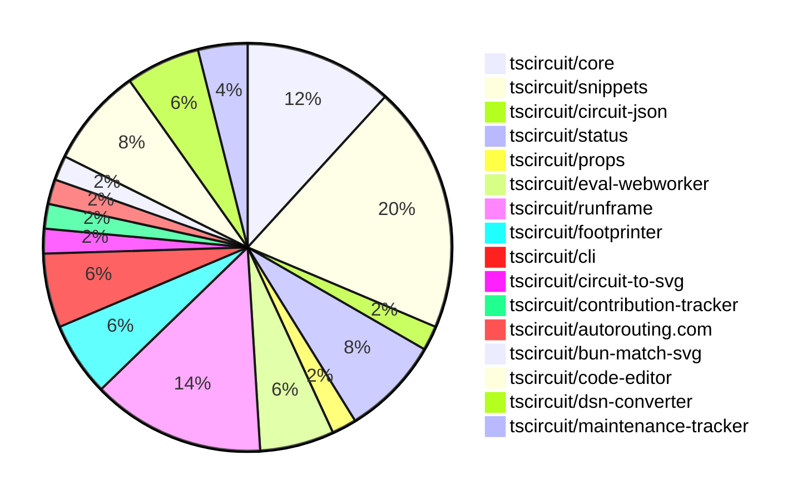

# contribution-tracker

Generates weekly contribution overviews for tscircuit contributors. Check out all
the [contribution overviews here](./contribution-overviews/)

* All PRs in the tscircuit org are scanned/summarized via Claude Haiku
* Claude classifies each Diff/PR as a Major, Minor or Tiny contribution
* All the PRs, summaries, and classifications are organized into charts and tables

The current week is shown below. There are 3 major sections:

* [Contributor Overview](#contributor-overview)
* [PRs by Repository](#prs-by-repository)
* [PRs by Contributor](#changes-by-contributor)

## Current Week

<!-- START_CURRENT_WEEK -->

# Contribution Overview 2025-01-15

## PRs by Repository

## Contributor Overview

| Contributor | 🐳 Major | 🐙 Minor | 🐌 Tiny | ⭐ | Issues Created |
|-------------|---------|---------|---------|-----|----------------|
| [seveibar](#seveibar) | 4 | 12 | 2 | 👑👑 | 67 |
| [imrishabh18](#imrishabh18) | 4 | 4 | 0 | ⭐⭐⭐ | 1 |
| [ShiboSoftwareDev](#ShiboSoftwareDev) | 0 | 5 | 1 | ⭐⭐⭐ | 13 |
| [Anshgrover23](#Anshgrover23) | 0 | 4 | 1 | ⭐⭐ | 2 |
| [kom-senapati](#kom-senapati) | 0 | 5 | 0 | ⭐ | 1 |
| [techmannih](#techmannih) | 0 | 4 | 0 | ⭐ | 0 |
| [Abse2001](#Abse2001) | 0 | 1 | 0 | ⭐ | 3 |
| [ArnavK-09](#ArnavK-09) | 0 | 1 | 0 |  | 2 |
| [Ayushjhawar8](#Ayushjhawar8) | 0 | 0 | 1 |  | 0 |

## Review Table

[reviews-received-hover]: ## "Number of reviews received for PRs for this contributor"
[approvals-received-hover]: ## "Number of approvals received for PRs this contributor authored"
[rejections-received-hover]: ## "Number of rejections received for PRs this contributor authored"
[prs-opened-hover]: ## "Number of PRs opened by this contributor"
[issues-created-hover]: ## "Number of issues created by this contributor"
[bountied-issues-hover]: ## "Number of issues this contributor created with a bounty"
[bountied-issue-$-hover]: ## "Total bounty amount placed on issues authored by this contributor"

| Contributor | Reviews Received | Approvals Received | Rejections Received | Approvals | Rejections | PRs Opened | PRs Merged | Issues Created | Bountied Issues | Bountied Issue $ |
|---|---|---|---|---|---|---|---|---|---|---|
| [kom-senapati](#kom-senapati) | 12 | 6 | 3 | 0 | 0 | 7 | 5 | 1 | 0 | 0 |
| [seveibar](#seveibar) | 3 | 1 | 0 | 22 | 15 | 24 | 19 | 67 | 51 | 898 |
| [imrishabh18](#imrishabh18) | 1 | 0 | 0 | 4 | 7 | 9 | 8 | 1 | 1 | 5 |
| [krushnarout](#krushnarout) | 8 | 0 | 1 | 0 | 0 | 1 | 0 | 0 | 0 | 0 |
| [techmannih](#techmannih) | 20 | 6 | 8 | 0 | 0 | 6 | 4 | 0 | 0 | 0 |
| [ShiboSoftwareDev](#ShiboSoftwareDev) | 8 | 3 | 0 | 4 | 1 | 7 | 6 | 13 | 7 | 85 |
| [Ayushjhawar8](#Ayushjhawar8) | 5 | 1 | 3 | 0 | 0 | 4 | 1 | 0 | 0 | 0 |
| [Anshgrover23](#Anshgrover23) | 17 | 7 | 4 | 0 | 5 | 8 | 6 | 2 | 1 | 10 |
| [Abse2001](#Abse2001) | 4 | 2 | 0 | 0 | 1 | 1 | 1 | 3 | 3 | 20 |
| [Saurabhsing21](#Saurabhsing21) | 9 | 2 | 4 | 0 | 0 | 1 | 0 | 0 | 0 | 0 |
| [ArnavK-09](#ArnavK-09) | 1 | 1 | 0 | 0 | 0 | 2 | 1 | 2 | 0 | 0 |
| [B-Mustafa](#B-Mustafa) | 2 | 0 | 2 | 0 | 0 | 1 | 0 | 0 | 0 | 0 |
| [yashksaini-coder](#yashksaini-coder) | 13 | 1 | 4 | 0 | 0 | 1 | 0 | 0 | 0 | 0 |

## Changes by Repository

### [tscircuit/core](https://github.com/tscircuit/core)

| PR # | Impact | Contributor | Description |
|------|--------|-------------|-------------|
| [#531](https://github.com/tscircuit/core/pull/531) | 🐳 Major | seveibar | Adds a benchmarking server with support for a LED matrix benchmark, and a website to visualize the benchmark results. |
| [#532](https://github.com/tscircuit/core/pull/532) | 🐳 Major | seveibar | Update the project to use React 19 and the latest version of `react-reconciler`. |
| [#523](https://github.com/tscircuit/core/pull/523) | 🐳 Major | seveibar | Fix for Contribution Board Infinite Loop Issue |
| [#533](https://github.com/tscircuit/core/pull/533) | 🐙 Minor | seveibar | Adds support for React 18 by using a separate "react-reconciler-18" package for React 18 compatibility. |
| [#527](https://github.com/tscircuit/core/pull/527) | 🐙 Minor | techmannih | Automatically add net labels when a chip-to-chip trace is created. |
| [#534](https://github.com/tscircuit/core/pull/534) | 🐌 Tiny | seveibar | Add MIT license to the project |

### [tscircuit/snippets](https://github.com/tscircuit/snippets)

| PR # | Impact | Contributor | Description |
|------|--------|-------------|-------------|
| [#586](https://github.com/tscircuit/snippets/pull/586) | 🐳 Major | seveibar | Integrates RunFrame (Use Webworker Beta) with some home page fixes |
| [#578](https://github.com/tscircuit/snippets/pull/578) | 🐙 Minor | seveibar | Set up a GitHub Actions workflow to publish a fake API to npm. |
| [#590](https://github.com/tscircuit/snippets/pull/590) | 🐙 Minor | ShiboSoftwareDev | Enables Terser minification in Vite's build configuration |
| [#585](https://github.com/tscircuit/snippets/pull/585) | 🐙 Minor | ShiboSoftwareDev | Updated the `FootprintDialog` component to use `getFootprintNamesByType()` to retrieve the list of normal footprint names. |
| [#552](https://github.com/tscircuit/snippets/pull/552) | 🐙 Minor | techmannih | Fixes an issue where fork errors were not being properly displayed to the user. |
| [#574](https://github.com/tscircuit/snippets/pull/574) | 🐙 Minor | techmannih | Improve error message for 3D model download when 3D viewer is not open. |
| [#571](https://github.com/tscircuit/snippets/pull/571) | 🐙 Minor | imrishabh18 | Reverts the update of the "@tscircuit/3d-viewer" dependency to version ^0.0.95 as it has broken the code editor page. |
| [#597](https://github.com/tscircuit/snippets/pull/597) | 🐙 Minor | Anshgrover23 | Fixes issues with the Editor and cmd-click snippet in the Playwright tests. |
| [#575](https://github.com/tscircuit/snippets/pull/575) | 🐙 Minor | Anshgrover23 | Fix the GLTF downloader to handle binary (GLB) and non-binary (GLTF) file formats. |
| [#583](https://github.com/tscircuit/snippets/pull/583) | 🐙 Minor | ArnavK-09 | Adds support for generating assembly image SVGs for code snippets. |

### [tscircuit/circuit-json](https://github.com/tscircuit/circuit-json)

| PR # | Impact | Contributor | Description |
|------|--------|-------------|-------------|
| [#121](https://github.com/tscircuit/circuit-json/pull/121) | 🐙 Minor | seveibar | Add subcircuit_id and pcb_group_id to pcb elements |

### [tscircuit/status](https://github.com/tscircuit/status)

| PR # | Impact | Contributor | Description |
|------|--------|-------------|-------------|
| [#16](https://github.com/tscircuit/status/pull/16) | 🐙 Minor | seveibar | Adds a health check for the Fly Registry API. |
| [#18](https://github.com/tscircuit/status/pull/18) | 🐙 Minor | kom-senapati | Fixes a bug in the `StatusGrid` component by handling the case where there are no service checks available, and adds a visual representation of missing data in the `UptimeGraph` component. |
| [#12](https://github.com/tscircuit/status/pull/12) | 🐙 Minor | kom-senapati | Modify the `UptimeGraph` component to use the last check in the `checks` array instead of the first check. |
| [#10](https://github.com/tscircuit/status/pull/10) | 🐙 Minor | kom-senapati | This PR introduces a status check for the "registry and bundling" endpoints, ensuring the health of the ESM, CJS, and NPM registry services. |

### [tscircuit/props](https://github.com/tscircuit/props)

| PR # | Impact | Contributor | Description |
|------|--------|-------------|-------------|
| [#146](https://github.com/tscircuit/props/pull/146) | 🐌 Tiny | seveibar | Add a `key` prop to the `BaseGroupProps` interface and the `baseGroupProps` object. |

### [tscircuit/eval-webworker](https://github.com/tscircuit/eval-webworker)

| PR # | Impact | Contributor | Description |
|------|--------|-------------|-------------|
| [#83](https://github.com/tscircuit/eval-webworker/pull/83) | 🟣 | seveibar | Dynamically load the webworker blob instead of using a hardcoded URL |
| [#78](https://github.com/tscircuit/eval-webworker/pull/78) | 🐙 Minor | seveibar | Update the code to use the CJS bundle registry URL instead of the snippets API for fetching imports. |
| [#81](https://github.com/tscircuit/eval-webworker/pull/81) | 🐙 Minor | Anshgrover23 | Add a `.kill()` function to terminate the web worker. |

### [tscircuit/runframe](https://github.com/tscircuit/runframe)

| PR # | Impact | Contributor | Description |
|------|--------|-------------|-------------|
| [#162](https://github.com/tscircuit/runframe/pull/162) | 🐙 Minor | seveibar | Update the code to properly use the CDN for the WebWorker URL, instead of relying on a local file. |
| [#159](https://github.com/tscircuit/runframe/pull/159) | 🐙 Minor | seveibar | Adds an empty state for the render log viewer and shows progress even when the render logs tab is not open. It also adds support for the `math-utils` import. |
| [#157](https://github.com/tscircuit/runframe/pull/157) | 🐙 Minor | seveibar | Adds an empty state for the render log viewer and shows progress even when not on the render log page. |
| [#154](https://github.com/tscircuit/runframe/pull/154) | 🐙 Minor | seveibar | Update the PCB Viewer to update whenever the circuit JSON changes, fix re-running without the run button |
| [#150](https://github.com/tscircuit/runframe/pull/150) | 🐙 Minor | seveibar | Adds a "Run" button to the CircuitJsonPreview component and tracks the running state of the code. |
| [#149](https://github.com/tscircuit/runframe/pull/149) | 🐙 Minor | seveibar | Adds a Tailwind prefix, improves the build system in development, and fixes minor spacing and Circuit JSON viewer issues. |
| [#139](https://github.com/tscircuit/runframe/pull/139) | 🐙 Minor | seveibar | This pull request adds a render timings bar to the render log view and allows sorting the render phases by duration or chronological order. |

### [tscircuit/footprinter](https://github.com/tscircuit/footprinter)

| PR # | Impact | Contributor | Description |
|------|--------|-------------|-------------|
| [#113](https://github.com/tscircuit/footprinter/pull/113) | 🐙 Minor | ShiboSoftwareDev | Adds a new function `getFootprintSizes` that returns the supported footprint sizes. |
| [#112](https://github.com/tscircuit/footprinter/pull/112) | 🐙 Minor | ShiboSoftwareDev | Changes the property names returned by the `getFootprintNamesByType` function from `passiveFootprints` and `normalFootprints` to `passiveFootprintNames` and `normalFootprintNames`. |
| [#111](https://github.com/tscircuit/footprinter/pull/111) | 🐙 Minor | ShiboSoftwareDev | Adds a new function `getFootprintNamesByType` that returns an object with two properties: `passiveFootprints` and `normalFootprints`, which contain the names of passive and normal footprints, respectively. |

### [tscircuit/cli](https://github.com/tscircuit/cli)

| PR # | Impact | Contributor | Description |
|------|--------|-------------|-------------|
| [#22](https://github.com/tscircuit/cli/pull/22) | 🐙 Minor | kom-senapati | Adds a simple test fixture for CLI and TSCI init test |
| [#25](https://github.com/tscircuit/cli/pull/25) | 🐙 Minor | Anshgrover23 | Adds an alias for the `tsci auth login` command, allowing users to simply use `tsci login` to authenticate with the tscircuit registry. |
| [#26](https://github.com/tscircuit/cli/pull/26) | 🐌 Tiny | ShiboSoftwareDev | Fixed the "dev" script in the `package.json` file to use the correct file path for the example directory. |

### [tscircuit/circuit-to-svg](https://github.com/tscircuit/circuit-to-svg)

| PR # | Impact | Contributor | Description |
|------|--------|-------------|-------------|
| [#161](https://github.com/tscircuit/circuit-to-svg/pull/161) | 🐙 Minor | techmannih | Fix the transparency of the label point in the schematic SVG objects. |

### [tscircuit/contribution-tracker](https://github.com/tscircuit/contribution-tracker)

| PR # | Impact | Contributor | Description |
|------|--------|-------------|-------------|
| [#36](https://github.com/tscircuit/contribution-tracker/pull/36) | 🐌 Tiny | Ayushjhawar8 | Update the terminology from "Approvals" to "Approval Sent" in the README.md file. |

### [tscircuit/autorouting.com](https://github.com/tscircuit/autorouting.com)

| PR # | Impact | Contributor | Description |
|------|--------|-------------|-------------|
| [#28](https://github.com/tscircuit/autorouting.com/pull/28) | 🐙 Minor | Abse2001 | Adds the `delete_file` and `update_file` sample endpoints, and includes a `package.json` file when downloading a dataset. |

### [tscircuit/bun-match-svg](https://github.com/tscircuit/bun-match-svg)

| PR # | Impact | Contributor | Description |
|------|--------|-------------|-------------|
| [#7](https://github.com/tscircuit/bun-match-svg/pull/7) | 🐙 Minor | kom-senapati | Fix the "init" command by not importing "bun-match-svg" inside the test file and not providing "example" as the argument to `toMatchSvgSnapshot`. |

### [tscircuit/code-editor](https://github.com/tscircuit/code-editor)

| PR # | Impact | Contributor | Description |
|------|--------|-------------|-------------|
| [#8](https://github.com/tscircuit/code-editor/pull/8) | 🐳 Major | imrishabh18 | Introduces a new code editor component with TypeScript language support, including a toolbar and the ability to load initial files. |
| [#7](https://github.com/tscircuit/code-editor/pull/7) | 🐳 Major | imrishabh18 | Implements state management, formats code using Prettier, and ports UI from snippets. |
| [#6](https://github.com/tscircuit/code-editor/pull/6) | 🐳 Major | imrishabh18 | Introduces a basic code editor component with Cosmos and Vite integration, along with Twind styling. |
| [#4](https://github.com/tscircuit/code-editor/pull/4) | 🐳 Major | imrishabh18 | This pull request sets up the basic project structure, including GitHub Actions workflows for building, testing, and type-checking the Bun application, as well as configuration files for Biome, Bun, and Tailwind CSS. |

### [tscircuit/dsn-converter](https://github.com/tscircuit/dsn-converter)

| PR # | Impact | Contributor | Description |
|------|--------|-------------|-------------|
| [#80](https://github.com/tscircuit/dsn-converter/pull/80) | 🐙 Minor | imrishabh18 | Fixes the naming of plated holes to include the source component ID. |
| [#79](https://github.com/tscircuit/dsn-converter/pull/79) | 🐙 Minor | imrishabh18 | Fix for trace linkage issue. |
| [#78](https://github.com/tscircuit/dsn-converter/pull/78) | 🐙 Minor | imrishabh18 | The pull request fixes an issue where subcircuits with the same component name were not being properly differentiated. |

### [tscircuit/maintenance-tracker](https://github.com/tscircuit/maintenance-tracker)

| PR # | Impact | Contributor | Description |
|------|--------|-------------|-------------|
| [#7](https://github.com/tscircuit/maintenance-tracker/pull/7) | 🐌 Tiny | Anshgrover23 | Updates the `bun.lock` file. |
| [#6](https://github.com/tscircuit/maintenance-tracker/pull/6) | 🟣 | Anshgrover23 |  |

## Changes by Contributor

### [seveibar](https://github.com/seveibar)

| PR # | Impact | Description |
|------|--------|-------------|
| [#531](https://github.com/tscircuit/core/pull/531) | 🐳 Major | Adds a benchmarking server with support for a LED matrix benchmark, and a website to visualize the benchmark results. |
| [#532](https://github.com/tscircuit/core/pull/532) | 🐳 Major | Update the project to use React 19 and the latest version of `react-reconciler`. |
| [#523](https://github.com/tscircuit/core/pull/523) | 🐳 Major | Fix for Contribution Board Infinite Loop Issue |
| [#586](https://github.com/tscircuit/snippets/pull/586) | 🐳 Major | Integrates RunFrame (Use Webworker Beta) with some home page fixes |
| [#121](https://github.com/tscircuit/circuit-json/pull/121) | 🐙 Minor | Add subcircuit_id and pcb_group_id to pcb elements |
| [#533](https://github.com/tscircuit/core/pull/533) | 🐙 Minor | Adds support for React 18 by using a separate "react-reconciler-18" package for React 18 compatibility. |
| [#578](https://github.com/tscircuit/snippets/pull/578) | 🐙 Minor | Set up a GitHub Actions workflow to publish a fake API to npm. |
| [#16](https://github.com/tscircuit/status/pull/16) | 🐙 Minor | Adds a health check for the Fly Registry API. |
| [#146](https://github.com/tscircuit/props/pull/146) | 🐌 Tiny | Add a `key` prop to the `BaseGroupProps` interface and the `baseGroupProps` object. |
| [#534](https://github.com/tscircuit/core/pull/534) | 🐌 Tiny | Add MIT license to the project |
| [#83](https://github.com/tscircuit/eval-webworker/pull/83) | 🟣 | Dynamically load the webworker blob instead of using a hardcoded URL |
| [#78](https://github.com/tscircuit/eval-webworker/pull/78) | 🐙 Minor | Update the code to use the CJS bundle registry URL instead of the snippets API for fetching imports. |
| [#162](https://github.com/tscircuit/runframe/pull/162) | 🐙 Minor | Update the code to properly use the CDN for the WebWorker URL, instead of relying on a local file. |
| [#159](https://github.com/tscircuit/runframe/pull/159) | 🐙 Minor | Adds an empty state for the render log viewer and shows progress even when the render logs tab is not open. It also adds support for the `math-utils` import. |
| [#157](https://github.com/tscircuit/runframe/pull/157) | 🐙 Minor | Adds an empty state for the render log viewer and shows progress even when not on the render log page. |
| [#154](https://github.com/tscircuit/runframe/pull/154) | 🐙 Minor | Update the PCB Viewer to update whenever the circuit JSON changes, fix re-running without the run button |
| [#150](https://github.com/tscircuit/runframe/pull/150) | 🐙 Minor | Adds a "Run" button to the CircuitJsonPreview component and tracks the running state of the code. |
| [#149](https://github.com/tscircuit/runframe/pull/149) | 🐙 Minor | Adds a Tailwind prefix, improves the build system in development, and fixes minor spacing and Circuit JSON viewer issues. |
| [#139](https://github.com/tscircuit/runframe/pull/139) | 🐙 Minor | This pull request adds a render timings bar to the render log view and allows sorting the render phases by duration or chronological order. |

### [ShiboSoftwareDev](https://github.com/ShiboSoftwareDev)

| PR # | Impact | Description |
|------|--------|-------------|
| [#113](https://github.com/tscircuit/footprinter/pull/113) | 🐙 Minor | Adds a new function `getFootprintSizes` that returns the supported footprint sizes. |
| [#112](https://github.com/tscircuit/footprinter/pull/112) | 🐙 Minor | Changes the property names returned by the `getFootprintNamesByType` function from `passiveFootprints` and `normalFootprints` to `passiveFootprintNames` and `normalFootprintNames`. |
| [#111](https://github.com/tscircuit/footprinter/pull/111) | 🐙 Minor | Adds a new function `getFootprintNamesByType` that returns an object with two properties: `passiveFootprints` and `normalFootprints`, which contain the names of passive and normal footprints, respectively. |
| [#590](https://github.com/tscircuit/snippets/pull/590) | 🐙 Minor | Enables Terser minification in Vite's build configuration |
| [#585](https://github.com/tscircuit/snippets/pull/585) | 🐙 Minor | Updated the `FootprintDialog` component to use `getFootprintNamesByType()` to retrieve the list of normal footprint names. |
| [#26](https://github.com/tscircuit/cli/pull/26) | 🐌 Tiny | Fixed the "dev" script in the `package.json` file to use the correct file path for the example directory. |

### [techmannih](https://github.com/techmannih)

| PR # | Impact | Description |
|------|--------|-------------|
| [#527](https://github.com/tscircuit/core/pull/527) | 🐙 Minor | Automatically add net labels when a chip-to-chip trace is created. |
| [#161](https://github.com/tscircuit/circuit-to-svg/pull/161) | 🐙 Minor | Fix the transparency of the label point in the schematic SVG objects. |
| [#552](https://github.com/tscircuit/snippets/pull/552) | 🐙 Minor | Fixes an issue where fork errors were not being properly displayed to the user. |
| [#574](https://github.com/tscircuit/snippets/pull/574) | 🐙 Minor | Improve error message for 3D model download when 3D viewer is not open. |

### [Ayushjhawar8](https://github.com/Ayushjhawar8)

| PR # | Impact | Description |
|------|--------|-------------|
| [#36](https://github.com/tscircuit/contribution-tracker/pull/36) | 🐌 Tiny | Update the terminology from "Approvals" to "Approval Sent" in the README.md file. |

### [Abse2001](https://github.com/Abse2001)

| PR # | Impact | Description |
|------|--------|-------------|
| [#28](https://github.com/tscircuit/autorouting.com/pull/28) | 🐙 Minor | Adds the `delete_file` and `update_file` sample endpoints, and includes a `package.json` file when downloading a dataset. |

### [kom-senapati](https://github.com/kom-senapati)

| PR # | Impact | Description |
|------|--------|-------------|
| [#7](https://github.com/tscircuit/bun-match-svg/pull/7) | 🐙 Minor | Fix the "init" command by not importing "bun-match-svg" inside the test file and not providing "example" as the argument to `toMatchSvgSnapshot`. |
| [#18](https://github.com/tscircuit/status/pull/18) | 🐙 Minor | Fixes a bug in the `StatusGrid` component by handling the case where there are no service checks available, and adds a visual representation of missing data in the `UptimeGraph` component. |
| [#12](https://github.com/tscircuit/status/pull/12) | 🐙 Minor | Modify the `UptimeGraph` component to use the last check in the `checks` array instead of the first check. |
| [#10](https://github.com/tscircuit/status/pull/10) | 🐙 Minor | This PR introduces a status check for the "registry and bundling" endpoints, ensuring the health of the ESM, CJS, and NPM registry services. |
| [#22](https://github.com/tscircuit/cli/pull/22) | 🐙 Minor | Adds a simple test fixture for CLI and TSCI init test |

### [imrishabh18](https://github.com/imrishabh18)

| PR # | Impact | Description |
|------|--------|-------------|
| [#8](https://github.com/tscircuit/code-editor/pull/8) | 🐳 Major | Introduces a new code editor component with TypeScript language support, including a toolbar and the ability to load initial files. |
| [#7](https://github.com/tscircuit/code-editor/pull/7) | 🐳 Major | Implements state management, formats code using Prettier, and ports UI from snippets. |
| [#6](https://github.com/tscircuit/code-editor/pull/6) | 🐳 Major | Introduces a basic code editor component with Cosmos and Vite integration, along with Twind styling. |
| [#4](https://github.com/tscircuit/code-editor/pull/4) | 🐳 Major | This pull request sets up the basic project structure, including GitHub Actions workflows for building, testing, and type-checking the Bun application, as well as configuration files for Biome, Bun, and Tailwind CSS. |
| [#80](https://github.com/tscircuit/dsn-converter/pull/80) | 🐙 Minor | Fixes the naming of plated holes to include the source component ID. |
| [#79](https://github.com/tscircuit/dsn-converter/pull/79) | 🐙 Minor | Fix for trace linkage issue. |
| [#78](https://github.com/tscircuit/dsn-converter/pull/78) | 🐙 Minor | The pull request fixes an issue where subcircuits with the same component name were not being properly differentiated. |
| [#571](https://github.com/tscircuit/snippets/pull/571) | 🐙 Minor | Reverts the update of the "@tscircuit/3d-viewer" dependency to version ^0.0.95 as it has broken the code editor page. |

### [Anshgrover23](https://github.com/Anshgrover23)

| PR # | Impact | Description |
|------|--------|-------------|
| [#597](https://github.com/tscircuit/snippets/pull/597) | 🐙 Minor | Fixes issues with the Editor and cmd-click snippet in the Playwright tests. |
| [#575](https://github.com/tscircuit/snippets/pull/575) | 🐙 Minor | Fix the GLTF downloader to handle binary (GLB) and non-binary (GLTF) file formats. |
| [#81](https://github.com/tscircuit/eval-webworker/pull/81) | 🐙 Minor | Add a `.kill()` function to terminate the web worker. |
| [#25](https://github.com/tscircuit/cli/pull/25) | 🐙 Minor | Adds an alias for the `tsci auth login` command, allowing users to simply use `tsci login` to authenticate with the tscircuit registry. |
| [#7](https://github.com/tscircuit/maintenance-tracker/pull/7) | 🐌 Tiny | Updates the `bun.lock` file. |
| [#6](https://github.com/tscircuit/maintenance-tracker/pull/6) | 🟣 |  |

### [ArnavK-09](https://github.com/ArnavK-09)

| PR # | Impact | Description |
|------|--------|-------------|
| [#583](https://github.com/tscircuit/snippets/pull/583) | 🐙 Minor | Adds support for generating assembly image SVGs for code snippets. |

<!-- END_CURRENT_WEEK -->
