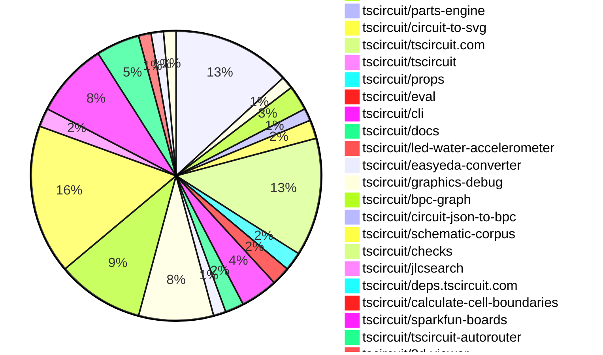
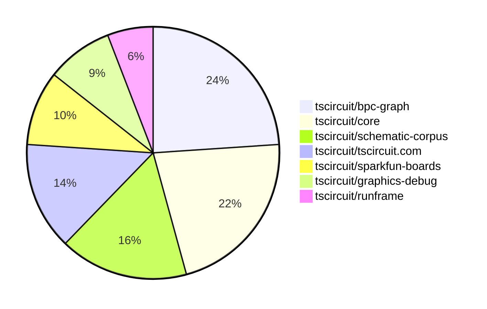

# contribution-tracker

[contributions.tscircuit.com](https://contributions.tscircuit.com) ・ [tscircuit.com](https://tscircuit.com) ・ [Contribution Overviews](./contribution-overviews/) ・ [Changelogs](./changelogs/)

Generates weekly contribution overviews for tscircuit contributors. Check out all
the [contribution overviews here](./contribution-overviews/)
You can find AI-generated monthly changelogs in the [changelogs directory](./changelogs/).

- All PRs in the tscircuit org are scanned/summarized via an LLM
- The LLM classifies each Diff/PR as into a set of attributes for scoring
- All the PRs, summaries, and classifications are organized into charts and tables for [the website](https://contributions.tscircuit.com)

## Getting Started

### Prerequisites

- [Bun](https://bun.sh/) runtime
- `.env` file with required API keys:
  ```
  GITHUB_TOKEN=your_github_token
  OPENAI_API_KEY=your_openai_api_key
  DISCORD_TOKEN=your_discord_token (optional, for Discord integration)
  SLACK_BOT_TOKEN=your_slack_token (optional, for Slack integration)
  ```

### Available Scripts

#### Core Generation Scripts

- `bun run generate:weekly` - Generate current week's contribution overview
- `bun run generate:monthly` - Generate current month's contribution overview
- `bun run generate:changelog` - Generate monthly changelog from PRs

#### Analysis & Testing

- `bun run analyze-pr` - Analyze a single PR (interactive prompt)
- `bun run test:github` - Test GitHub API integration

#### Notifications & Sync

- `bun run notifications:issues` - Send notifications for new issues
- `bun run notifications:pr` - Send notifications for new PRs
- `bun run sync:discord` - Sync contributor roles with Discord

#### Data Export

- `bun run export:sponsorship` - Generate sponsorship data CSV

#### Development

- `bun run dev` - Start development server for web UI
- `bun run build` - Build for production
- `bun run format` - Format code with Biome

### Usage Examples

```bash
# Generate this week's contribution overview
bun run generate:weekly

# Generate current month's overview
bun run generate:monthly

# Analyze a specific PR
bun run analyze-pr

# Test your GitHub token setup
bun run test:github
```

The current week is shown below. There are 3 major sections:

- [Contributor Overview](#contributor-overview)
- [PRs by Repository](#prs-by-repository)
- [PRs by Contributor](#changes-by-contributor)

## Current Week

<!-- START_CURRENT_WEEK -->

# Contribution Overview 2025-06-25

## PRs by Repository



## Contributor Overview

| Contributor | 🐳 Major | 🐙 Minor | 🐌 Tiny | ⭐ | Issues Created | Discussion Contributions |
|-------------|---------|---------|---------|-----|----------------|--------------------------|
| [seveibar](#seveibar) | 18 | 7 | 26 | ⭐⭐⭐ | 5 | 0🔹 0🔶 0💎 |
| [imrishabh18](#imrishabh18) | 4 | 2 | 15 | ⭐⭐ | 1 | 0🔹 0🔶 0💎 |
| [Anshgrover23](#Anshgrover23) | 2 | 1 | 18 | ⭐⭐ | 9 | 0🔹 0🔶 0💎 |
| [ShiboSoftwareDev](#ShiboSoftwareDev) | 2 | 1 | 8 | ⭐⭐ | 7 | 0🔹 0🔶 0💎 |
| [Abse2001](#Abse2001) | 2 | 0 | 9 | ⭐⭐ | 1 | 0🔹 0🔶 0💎 |
| [ArnavK-09](#ArnavK-09) | 2 | 3 | 10 | ⭐⭐ | 7 | 0🔹 0🔶 0💎 |
| [techmannih](#techmannih) | 0 | 2 | 12 | ⭐⭐ | 2 | 0🔹 0🔶 0💎 |
| [ricohageman](#ricohageman) | 1 | 0 | 0 |  | 0 | 0🔹 0🔶 0💎 |
| [MustafaMulla29](#MustafaMulla29) | 0 | 0 | 3 |  | 6 | 0🔹 0🔶 0💎 |
| [andrii-balitskyi](#andrii-balitskyi) | 0 | 0 | 1 |  | 0 | 0🔹 0🔶 0💎 |
| [tscircuitbot](#tscircuitbot) | 0 | 0 | 1 |  | 0 | 0🔹 0🔶 0💎 |

### Discussion Contribution Legend

- 🔹 Normal Comments: Basic participation with minimal effort
- 🔶 Great Informative Comments: Thoughtful participation that adds value
- 💎 Incredible Comments: Exceptional participation with high-quality content

## Review Table

[reviews-received-hover]: ## "Number of reviews received for PRs for this contributor"
[approvals-received-hover]: ## "Number of approvals received for PRs this contributor authored"
[rejections-received-hover]: ## "Number of rejections received for PRs this contributor authored"
[prs-opened-hover]: ## "Number of PRs opened by this contributor"
[issues-created-hover]: ## "Number of issues created by this contributor"
[bountied-issues-hover]: ## "Number of issues this contributor created with a bounty"
[bountied-issue-$-hover]: ## "Total bounty amount placed on issues authored by this contributor"

| Contributor | Reviews Received | Approvals Received | Rejections Received | Approvals | Rejections | PRs Opened | PRs Merged | Issues Created | Bountied Issues | Bountied Issue $ |
|---|---|---|---|---|---|---|---|---|---|---|
| [seveibar](#seveibar) | 6 | 1 | 0 | 41 | 4 | 66 | 51 | 5 | 2 | 50 |
| [imrishabh18](#imrishabh18) | 18 | 9 | 0 | 9 | 2 | 23 | 21 | 1 | 0 | 0 |
| [graphite-app[bot]](#graphite-app[bot]) | 0 | 0 | 0 | 0 | 0 | 0 | 0 | 0 | 0 | 0 |
| [techmannih](#techmannih) | 47 | 20 | 7 | 1 | 4 | 26 | 14 | 2 | 0 | 0 |
| [Anshgrover23](#Anshgrover23) | 30 | 21 | 4 | 3 | 6 | 25 | 21 | 9 | 0 | 0 |
| [ShiboSoftwareDev](#ShiboSoftwareDev) | 12 | 9 | 0 | 13 | 2 | 15 | 11 | 7 | 1 | 5 |
| [MustafaMulla29](#MustafaMulla29) | 8 | 3 | 4 | 0 | 0 | 7 | 3 | 6 | 0 | 0 |
| [ArnavK-09](#ArnavK-09) | 22 | 14 | 1 | 2 | 0 | 17 | 15 | 7 | 0 | 0 |
| [Abse2001](#Abse2001) | 5 | 3 | 1 | 13 | 0 | 13 | 11 | 1 | 0 | 0 |
| [andrii-balitskyi](#andrii-balitskyi) | 2 | 1 | 1 | 0 | 0 | 2 | 1 | 0 | 0 | 0 |
| [tscircuitbot](#tscircuitbot) | 0 | 0 | 0 | 0 | 0 | 32 | 1 | 0 | 0 | 0 |
| [ricohageman](#ricohageman) | 1 | 1 | 0 | 0 | 0 | 1 | 1 | 0 | 0 | 0 |
| [cursor[bot]](#cursor[bot]) | 0 | 0 | 0 | 0 | 0 | 0 | 0 | 0 | 0 | 0 |

## Top 7 Repositories by Contribution Points



## Changes by Repository

### [tscircuit/core](https://github.com/tscircuit/core)

| PR # | Impact | Contributor | Description | Milestone Aligned |
|------|--------|-------------|-------------|-------------------|
| [#1002](https://github.com/tscircuit/core/pull/1002) | 🐳 Major | imrishabh18 | Fixes autorouter bug where subcircuits could generate multiple traces between the same pins, causing redundant routing and potential errors. | ❌ |
| [#1016](https://github.com/tscircuit/core/pull/1016) | 🐳 Major | seveibar | Rewrites the schematic match-adapt layout algorithm to use BPC graphs, enabling more robust and flexible schematic auto-layout by matching and adapting to a corpus of known schematic graph patterns. | ❌ |
| [#1004](https://github.com/tscircuit/core/pull/1004) | 🐳 Major | seveibar | Fixes incorrect placement of schematic netlabel centers by computing their offset based on anchor side, ensuring accurate netlabel positioning in schematics. | ❌ |
| [#1003](https://github.com/tscircuit/core/pull/1003) | 🐳 Major | seveibar | Fixes incorrect assignment of net IDs to schematic net labels, ensuring that net labels reference the correct source net ID instead of the net name. | ❌ |
| [#976](https://github.com/tscircuit/core/pull/976) | 🐳 Major | seveibar | Net labels in schematics now automatically orient themselves based on the position of the connected port, improving label placement and readability. | ❌ |
| [#1008](https://github.com/tscircuit/core/pull/1008) | 🐳 Major | ShiboSoftwareDev | Fixes incorrect calculation of PCB board center when a custom outline is provided, ensuring the center is derived from the outline geometry rather than defaulting to origin or offsets. | ❌ |
| [#1000](https://github.com/tscircuit/core/pull/1000) | 🐳 Major | ShiboSoftwareDev | Adds support for generating PCB routing obstacles for rectangular, circular, and polygonal cutout components, ensuring autorouter avoids these regions. | ❌ |
| [#1015](https://github.com/tscircuit/core/pull/1015) | 🐙 Minor | seveibar | Maps the `schOrientation` property to schematic symbol rotation, removes outdated orientation tests, and adds comprehensive test coverage for polarized capacitor orientations with snapshot validation. | ❌ |

<details>
<summary>🐌 Tiny Contributions (11)</summary>

| PR # | Impact | Contributor | Description | Milestone Aligned |
|------|--------|-------------|-------------|-------------------|
| [#1013](https://github.com/tscircuit/core/pull/1013) | 🐌 Tiny | imrishabh18 | Pins the css-select dependency to version 5.1.0 to avoid breaking type errors introduced in newer versions. | ❌ |
| [#998](https://github.com/tscircuit/core/pull/998) | 🐌 Tiny | imrishabh18 | Adds automatic printing of project name, version, and URL to the PCB silkscreen when `printBoardInformationToSilkscreen` is enabled in the platform config. | ❌ |
| [#997](https://github.com/tscircuit/core/pull/997) | 🐌 Tiny | imrishabh18 | Adds a comprehensive skipped test that reproduces the bug where duplicate traces are generated between the same pins inside a subcircuit (see issue #693) | ❌ |
| [#992](https://github.com/tscircuit/core/pull/992) | 🐌 Tiny | imrishabh18 | Allows users to specify a custom schematic symbol name for <solderjumper /> components via the symbolName prop, falling back to the default naming if not provided. | ❌ |
| [#989](https://github.com/tscircuit/core/pull/989) | 🐌 Tiny | imrishabh18 | Adds support for a new `bridged` prop to the SolderJumper component, allowing all pins to be internally connected when set, and updates tests to cover this behavior. | ❌ |
| [#1005](https://github.com/tscircuit/core/pull/1005) | 🐌 Tiny | seveibar | Removes the placeholder 'TODO_REMOVE_THIS' from PrimitiveComponent name getter and ensures NormalComponent footprint generation uses a fallback name if needed, preventing placeholder names from leaking into user-facing outputs. | ❌ |
| [#995](https://github.com/tscircuit/core/pull/995) | 🐌 Tiny | Anshgrover23 | Adds a test to verify that the <Led/> component correctly creates traces for specified connections, ensuring that nets are properly assigned to pins and schematic snapshots are generated. | ❌ |
| [#999](https://github.com/tscircuit/core/pull/999) | 🐌 Tiny | ShiboSoftwareDev | Updates @tscircuit/footprinter dependency from ^0.0.182 to ^0.0.186 and updates test snapshots to reflect changes in floating point precision (e.g., 0.6000000000000001 to 0.6) in PCB component dimensions. No new features or bug fixes are introduced beyond dependency update and test maintenance. | ❌ |
| [#1014](https://github.com/tscircuit/core/pull/1014) | 🐌 Tiny | techmannih | Updates the schematic-symbols dependency and adds a test for testpoint components with netlabel connections in schematics, ensuring correct netlabel association and snapshot testing. | ❌ |
| [#1009](https://github.com/tscircuit/core/pull/1009) | 🐌 Tiny | MustafaMulla29 | Adds a comprehensive test that reproduces a bug involving jumper and netlabel connections, enabling easier diagnosis and future fixes. | ❌ |
| [#996](https://github.com/tscircuit/core/pull/996) | 🐌 Tiny | Abse2001 | Adds support for selectors of test points (TP) such as sel.TP1.pin1, enabling users to reference test point pins in selector expressions. | ❌ |

</details>

### [tscircuit/circuit-json-to-gerber](https://github.com/tscircuit/circuit-json-to-gerber)

| PR # | Impact | Contributor | Description | Milestone Aligned |
|------|--------|-------------|-------------|-------------------|
| [#45](https://github.com/tscircuit/circuit-json-to-gerber/pull/45) | 🐳 Major | imrishabh18 | Fixes incorrect alignment of silkscreen text in Gerber output by supporting additional anchor alignments and the `anchor_side` property, with added tests to verify correct behavior. | ❌ |

<details>
<summary>🐌 Tiny Contributions (1)</summary>

| PR # | Impact | Contributor | Description | Milestone Aligned |
|------|--------|-------------|-------------|-------------------|
| [#44](https://github.com/tscircuit/circuit-json-to-gerber/pull/44) | 🐌 Tiny | seveibar | Adds support for all nine text anchor alignments (top_left, top_center, top_right, center_left, center, center_right, bottom_left, bottom_center, bottom_right) in Gerber conversion for silkscreen text, and adds comprehensive test coverage for these anchors. | ❌ |

</details>

### [tscircuit/runframe](https://github.com/tscircuit/runframe)

| PR # | Impact | Contributor | Description | Milestone Aligned |
|------|--------|-------------|-------------|-------------------|
| [#830](https://github.com/tscircuit/runframe/pull/830) | 🐳 Major | imrishabh18 | Fixes RunFrame on tscircuit.com to always fetch and use the actual latest version of @tscircuit/eval, avoiding stale versions due to jsdelivr caching. | ❌ |
| [#824](https://github.com/tscircuit/runframe/pull/824) | 🐳 Major | ArnavK-09 | Fixes bug where the active tab in CircuitJsonPreview is lost when an error occurs, now restoring the last active tab after error is resolved (fixes #749) | ❌ |
| [#820](https://github.com/tscircuit/runframe/pull/820) | 🐙 Minor | ArnavK-09 | 

 | ❌ |

<details>
<summary>🐌 Tiny Contributions (1)</summary>

| PR # | Impact | Contributor | Description | Milestone Aligned |
|------|--------|-------------|-------------|-------------------|
| [#823](https://github.com/tscircuit/runframe/pull/823) | 🐌 Tiny | ArnavK-09 | # before / after


 | ❌ |

</details>

### [tscircuit/parts-engine](https://github.com/tscircuit/parts-engine)

| PR # | Impact | Contributor | Description | Milestone Aligned |
|------|--------|-------------|-------------|-------------------|
| [#9](https://github.com/tscircuit/parts-engine/pull/9) | 🐳 Major | imrishabh18 | Fixes bug where resistor and capacitor searches used absolute values instead of value+SI unit, ensuring correct part matching for user-specified units (e.g., 10kΩ vs 10000Ω). | ❌ |
| [#8](https://github.com/tscircuit/parts-engine/pull/8) | 🐙 Minor | Anshgrover23 | Fixes a bug where findPart would throw an error if the 'fuses' variable was undefined, by defaulting to an empty array before mapping. | ❌ |

### [tscircuit/circuit-to-svg](https://github.com/tscircuit/circuit-to-svg)

| PR # | Impact | Contributor | Description | Milestone Aligned |
|------|--------|-------------|-------------|-------------------|
| [#276](https://github.com/tscircuit/circuit-to-svg/pull/276) | 🐳 Major | seveibar | Removes overline styling from net labels and reduces font size for negated pin labels (those starting with 'N_'), improving schematic text rendering consistency and addressing issue #272. | ❌ |
| [#268](https://github.com/tscircuit/circuit-to-svg/pull/268) | 🐙 Minor | imrishabh18 | Adds support for newline characters (\n) in PCB silkscreen text by rendering each line as a separate <tspan> in the SVG output, and documents this capability. | ❌ |

<details>
<summary>🐌 Tiny Contributions (1)</summary>

| PR # | Impact | Contributor | Description | Milestone Aligned |
|------|--------|-------------|-------------|-------------------|
| [#270](https://github.com/tscircuit/circuit-to-svg/pull/270) | 🐌 Tiny | ShiboSoftwareDev | Adds rendering of pads, pins, and holes to the assembly SVG output, allowing users to visually identify all mounting and connection points in generated assembly diagrams. | ❌ |

</details>

### [tscircuit/tscircuit.com](https://github.com/tscircuit/tscircuit.com)

| PR # | Impact | Contributor | Description | Milestone Aligned |
|------|--------|-------------|-------------|-------------------|
| [#1388](https://github.com/tscircuit/tscircuit.com/pull/1388) | 🐳 Major | ArnavK-09 | Adds a global find and replace dialog (Ctrl+Shift+F) to the code editor, allowing users to search and replace text across all files with options for case sensitivity, whole word, and regex, similar to VSCode. | ❌ |
| [#1370](https://github.com/tscircuit/tscircuit.com/pull/1370) | 🐙 Minor | imrishabh18 | Fixes a bug where sorting packages on the dashboard would mutate the cached package list, potentially causing stale or incorrect data to be displayed elsewhere. | ❌ |
| [#1325](https://github.com/tscircuit/tscircuit.com/pull/1325) | 🐙 Minor | seveibar | Caches TypeScript standard library files in the browser using IndexedDB and loads them on CodeEditor mount, reducing load times for users. | ❌ |
| [#1381](https://github.com/tscircuit/tscircuit.com/pull/1381) | 🐙 Minor | ArnavK-09 | Prevents users from being redirected to a 404 error page when clicking file links before the package has finished loading on the View Package page. | ❌ |
| [#1378](https://github.com/tscircuit/tscircuit.com/pull/1378) | 🐙 Minor | ArnavK-09 | Completely redesigns the Cmd+K command menu with improved search, keyboard navigation, categorized options, and enhanced UI for faster access to packages, templates, and imports. | ❌ |

<details>
<summary>🐌 Tiny Contributions (14)</summary>

| PR # | Impact | Contributor | Description | Milestone Aligned |
|------|--------|-------------|-------------|-------------------|
| [#1394](https://github.com/tscircuit/tscircuit.com/pull/1394) | 🐌 Tiny | imrishabh18 | Updates the @tscircuit/runframe dependency from version ^0.0.647 to ^0.0.653. No other changes are included. | ❌ |
| [#1393](https://github.com/tscircuit/tscircuit.com/pull/1393) | 🐌 Tiny | imrishabh18 | Adds a tooltip to the AI autocomplete button in the code editor header, providing users with a description of its function. | ❌ |
| [#1371](https://github.com/tscircuit/tscircuit.com/pull/1371) | 🐌 Tiny | imrishabh18 | Sorts the list of user packages by most recently updated or created on the dashboard page, ensuring consistent ordering after fetch. | ❌ |
| [#1389](https://github.com/tscircuit/tscircuit.com/pull/1389) | 🐌 Tiny | Anshgrover23 | Updates the 'circuit-to-svg' dependency from version ^0.0.160 to ^0.0.163. No user-facing changes or new features are introduced; this is a maintenance dependency update only. | ❌ |
| [#1395](https://github.com/tscircuit/tscircuit.com/pull/1395) | 🐌 Tiny | techmannih | Updates the @tscircuit/footprinter package dependency from version ^0.0.176 to ^0.0.186. No user-facing changes or new features are introduced; this is a maintenance dependency update only. | ❌ |
| [#1387](https://github.com/tscircuit/tscircuit.com/pull/1387) | 🐌 Tiny | ArnavK-09 | Updates several dependencies in package.json to newer versions, including @tscircuit/core, @tscircuit/pcb-viewer, @tscircuit/props, @tscircuit/runframe, and circuit-json related packages. No new features or bug fixes are introduced. | ❌ |
| [#1382](https://github.com/tscircuit/tscircuit.com/pull/1382) | 🐌 Tiny | ArnavK-09 | Adds a native share option to package cards, allowing users to share package links via device-native sharing or clipboard fallback. | ❌ |
| [#1384](https://github.com/tscircuit/tscircuit.com/pull/1384) | 🐌 Tiny | ArnavK-09 | Limits the maximum height of the RunFrame and CodeEditor components to 98vh, preventing overflow and improving layout consistency; updates @tscircuit/runframe dependency to ^0.0.642. | ❌ |
| [#1383](https://github.com/tscircuit/tscircuit.com/pull/1383) | 🐌 Tiny | ArnavK-09 | Removes extra horizontal spacing from highlighted characters in the command menu for a more compact appearance. | ❌ |
| [#1379](https://github.com/tscircuit/tscircuit.com/pull/1379) | 🐌 Tiny | ArnavK-09 | Improves the responsiveness and layout of the package build details pages for better usability on mobile and small screens (fixes #1340). | ❌ |
| [#1374](https://github.com/tscircuit/tscircuit.com/pull/1374) | 🐌 Tiny | ArnavK-09 | Fixes bug where package settings dialog would not show for package owners if their GitHub account ID did not match the stored creator_account_id, by switching to username-based ownership check. | ❌ |
| [#1373](https://github.com/tscircuit/tscircuit.com/pull/1373) | 🐌 Tiny | ArnavK-09 | Restricts the ability to generate or re-generate AI reviews to only the package owner, preventing other authenticated users from accessing this functionality. | ❌ |
| [#1372](https://github.com/tscircuit/tscircuit.com/pull/1372) | 🐌 Tiny | ArnavK-09 | Adds a toggle button to the CodeEditorHeader allowing users to enable or disable a mock AI autocomplete feature in the code editor interface. | ❌ |
| [#1368](https://github.com/tscircuit/tscircuit.com/pull/1368) | 🐌 Tiny | andrii-balitskyi | Fixes bug where loading spinner was not shown immediately after requesting an AI review, ensuring local loading state is maintained during AI review requests. | ❌ |

</details>

### [tscircuit/tscircuit](https://github.com/tscircuit/tscircuit)


<details>
<summary>🐌 Tiny Contributions (1)</summary>

| PR # | Impact | Contributor | Description | Milestone Aligned |
|------|--------|-------------|-------------|-------------------|
| [#694](https://github.com/tscircuit/tscircuit/pull/694) | 🐌 Tiny | imrishabh18 | Updates @tscircuit/core from 0.0.520 to 0.0.526 and @tscircuit/eval from 0.0.239 to 0.0.240; no other changes. | ❌ |

</details>

### [tscircuit/props](https://github.com/tscircuit/props)

| PR # | Impact | Contributor | Description | Milestone Aligned |
|------|--------|-------------|-------------|-------------------|
| [#308](https://github.com/tscircuit/props/pull/308) | 🐙 Minor | seveibar | Adds an optional `pinAttributes` property to all component prop interfaces, allowing users to specify per-pin attributes with type safety, and propagates pin label generics for improved type inference across components. | ❌ |

<details>
<summary>🐌 Tiny Contributions (2)</summary>

| PR # | Impact | Contributor | Description | Milestone Aligned |
|------|--------|-------------|-------------|-------------------|
| [#307](https://github.com/tscircuit/props/pull/307) | 🐌 Tiny | imrishabh18 | Adds optional board information fields (projectName, version, url, printBoardInformationToSilkscreen) to PlatformConfig and documents them in the README, allowing users to specify and optionally print board metadata on silkscreen. | ❌ |
| [#304](https://github.com/tscircuit/props/pull/304) | 🐌 Tiny | Anshgrover23 | Adds an optional 'connections' property to the LED component, allowing users to specify pin connections for LEDs in a structured way. | ❌ |

</details>

### [tscircuit/eval](https://github.com/tscircuit/eval)


<details>
<summary>🐌 Tiny Contributions (3)</summary>

| PR # | Impact | Contributor | Description | Milestone Aligned |
|------|--------|-------------|-------------|-------------------|
| [#624](https://github.com/tscircuit/eval/pull/624) | 🐌 Tiny | imrishabh18 | Updates @tscircuit/parts-engine dependency to ^0.0.8 and expands the test to check that all board components (resistor and capacitor) have defined and non-empty JLCPCB supplier part numbers, improving Bill of Materials generation reliability. | ❌ |
| [#608](https://github.com/tscircuit/eval/pull/608) | 🐌 Tiny | imrishabh18 | Updates the @tscircuit/core dependency from version ^0.0.510 to ^0.0.526. No other changes are included. | ❌ |
| [#619](https://github.com/tscircuit/eval/pull/619) | 🐌 Tiny | tscircuitbot | Automated update of @tscircuit/core to v0.0.532. Also updates schematic-symbols to v0.0.165. No user-facing changes or new features are introduced; this is a routine dependency update. | ❌ |

</details>

### [tscircuit/cli](https://github.com/tscircuit/cli)

| PR # | Impact | Contributor | Description | Milestone Aligned |
|------|--------|-------------|-------------|-------------------|
| [#253](https://github.com/tscircuit/cli/pull/253) | 🐙 Minor | seveibar | Ensures the CLI uses the user's installed version of tscircuit as a peer dependency instead of bundling its own versions of core/eval, preventing version mismatches and reducing bundle size. | ❌ |

<details>
<summary>🐌 Tiny Contributions (5)</summary>

| PR # | Impact | Contributor | Description | Milestone Aligned |
|------|--------|-------------|-------------|-------------------|
| [#252](https://github.com/tscircuit/cli/pull/252) | 🐌 Tiny | imrishabh18 | Updates @tscircuit/eval from 0.0.238 to 0.0.240 and tscircuit from 0.0.505 to 0.0.510 in package.json; no other changes. | ❌ |
| [#255](https://github.com/tscircuit/cli/pull/255) | 🐌 Tiny | Anshgrover23 | Updates the versions of the 'circuit-to-svg' and '@tscircuit/runframe' dependencies in package.json; no user-facing features or bugfixes are introduced. | ❌ |
| [#251](https://github.com/tscircuit/cli/pull/251) | 🐌 Tiny | ShiboSoftwareDev | Updates the generated GitHub Actions workflows to use Node.js version 22 for all jobs. | ❌ |
| [#250](https://github.com/tscircuit/cli/pull/250) | 🐌 Tiny | ShiboSoftwareDev | Adds a --ignore-errors flag to the build command, allowing builds to continue even if circuitJson errors are present. | ❌ |
| [#254](https://github.com/tscircuit/cli/pull/254) | 🐌 Tiny | ArnavK-09 | Updates several dependencies, including @tscircuit/circuit-json-util, @tscircuit/props, and @tscircuit/simple-3d-svg, to newer versions; no functional or user-facing changes are introduced beyond dependency updates. | ❌ |

</details>

### [tscircuit/docs](https://github.com/tscircuit/docs)


<details>
<summary>🐌 Tiny Contributions (3)</summary>

| PR # | Impact | Contributor | Description | Milestone Aligned |
|------|--------|-------------|-------------|-------------------|
| [#93](https://github.com/tscircuit/docs/pull/93) | 🐌 Tiny | imrishabh18 | Embed demonstration videos showing manual edit features in the schematic and PCB viewer guides, replacing placeholder notes with YouTube video embeds. | ❌ |
| [#94](https://github.com/tscircuit/docs/pull/94) | 🐌 Tiny | seveibar | Documents the `schOrientation` property for schematic elements, explaining its usage and valid values in the layout property guide and capacitor documentation, enabling users to control the orientation of polarized capacitors in schematics. | ❌ |
| [#92](https://github.com/tscircuit/docs/pull/92) | 🐌 Tiny | seveibar | Documents how to group and use typed net selectors with the `sel.net` API in the tscircuit/docs guides, providing a new example for users. | ❌ |

</details>

### [tscircuit/led-water-accelerometer](https://github.com/tscircuit/led-water-accelerometer)


<details>
<summary>🐌 Tiny Contributions (1)</summary>

| PR # | Impact | Contributor | Description | Milestone Aligned |
|------|--------|-------------|-------------|-------------------|
| [#3](https://github.com/tscircuit/led-water-accelerometer/pull/3) | 🐌 Tiny | imrishabh18 | Adds three mounting holes to the PCB and connects the Pico VBUS pin to the V5 net, improving mechanical stability and ensuring proper power distribution to the LED matrix. | ❌ |

</details>

### [tscircuit/easyeda-converter](https://github.com/tscircuit/easyeda-converter)

| PR # | Impact | Contributor | Description | Milestone Aligned |
|------|--------|-------------|-------------|-------------------|
| [#269](https://github.com/tscircuit/easyeda-converter/pull/269) | 🐳 Major | seveibar | ## Summary
- add `ViaSchema` to support VIA shapes in packages
- convert VIA elements to pcb_via
- add test for part C46497 which includes VIA
- add snapshot test for pcb vias

## Testing
- `bun test tests/parse-tests/parse-c46497.test.ts`
- `BUN_UPDATE_SNAPSHOTS=1 bun test tests/convert-to-soup-tests/c46497.test.ts`
 | ❌ |

<details>
<summary>🐌 Tiny Contributions (1)</summary>

| PR # | Impact | Contributor | Description | Milestone Aligned |
|------|--------|-------------|-------------|-------------------|
| [#270](https://github.com/tscircuit/easyeda-converter/pull/270) | 🐌 Tiny | seveibar | Adds support for converting vias to TSX in generateFootprintTsx, enabling components with vias to be correctly converted and exported as TypeScript components. Includes a test for a component (C46497) with vias. | ❌ |

</details>

### [tscircuit/graphics-debug](https://github.com/tscircuit/graphics-debug)

| PR # | Impact | Contributor | Description | Milestone Aligned |
|------|--------|-------------|-------------|-------------------|
| [#65](https://github.com/tscircuit/graphics-debug/pull/65) | 🐳 Major | seveibar | Fixes Y offset calculation in graphics grid creation so that rows are rendered in the correct order (not reversed), and updates tests to match the new orientation. | ❌ |
| [#59](https://github.com/tscircuit/graphics-debug/pull/59) | 🐙 Minor | seveibar | Accurately computes text bounds and scales font sizes in graphics rendering, ensuring text is properly sized and positioned according to transform matrices and anchor settings; adds tests for new text sizing logic. | ❌ |

<details>
<summary>🐌 Tiny Contributions (10)</summary>

| PR # | Impact | Contributor | Description | Milestone Aligned |
|------|--------|-------------|-------------|-------------------|
| [#68](https://github.com/tscircuit/graphics-debug/pull/68) | 🐌 Tiny | seveibar | Adds an option to display titles above each graphic when stacking graphics horizontally using stackGraphicsHorizontally, updates documentation, and adds a snapshot test for this feature. | ❌ |
| [#67](https://github.com/tscircuit/graphics-debug/pull/67) | 🐌 Tiny | seveibar | Changes the default value of the includeTextLabels option in getSvgFromGraphicsObject to false, so text labels are not included in SVG output unless explicitly requested. | ❌ |
| [#64](https://github.com/tscircuit/graphics-debug/pull/64) | 🐌 Tiny | seveibar | Aligns rectangle label text to the top of rectangles, increases label size by 3x, updates test expectations for label size, and bumps @types/bun dependency version. | ❌ |
| [#66](https://github.com/tscircuit/graphics-debug/pull/66) | 🐌 Tiny | seveibar | Allows users to customize the SVG width and height generated by getSvgFromGraphicsObject via new svgWidth and svgHeight parameters, with corresponding test coverage. | ❌ |
| [#63](https://github.com/tscircuit/graphics-debug/pull/63) | 🐌 Tiny | seveibar | Dynamically scales the font size of rectangle labels in SVG output based on rectangle dimensions, improving label readability for varying rectangle sizes. | ❌ |
| [#62](https://github.com/tscircuit/graphics-debug/pull/62) | 🐌 Tiny | seveibar | Adds support for specifying gaps (absolute or as a fraction of cell width) between cells in createGraphicsGrid, allowing more flexible grid layouts. | ❌ |
| [#61](https://github.com/tscircuit/graphics-debug/pull/61) | 🐌 Tiny | seveibar | Adds a createGraphicsGrid method to arrange multiple graphics objects in a grid layout, with tests and export updates. | ❌ |
| [#60](https://github.com/tscircuit/graphics-debug/pull/60) | 🐌 Tiny | seveibar | Adds stackGraphicsHorizontally and stackGraphicsVertically utilities to allow users to combine multiple graphics objects by translation, exports these helpers from the library, documents their usage in the README, and adds tests for the new stacking utilities. | ❌ |
| [#58](https://github.com/tscircuit/graphics-debug/pull/58) | 🐌 Tiny | seveibar | Adds support for text objects in graphics: users can now include, render, and interact with text elements in SVG, canvas, and interactive graphics components. This includes new data types, rendering logic, filtering, merging, translation, and snapshot tests for text objects. | ❌ |
| [#57](https://github.com/tscircuit/graphics-debug/pull/57) | 🐌 Tiny | seveibar | Adds a mergeGraphics utility function to combine two GraphicsObject instances, exports it from the library, documents its usage in the README, and provides tests for the new function. | ❌ |

</details>

### [tscircuit/bpc-graph](https://github.com/tscircuit/bpc-graph)

| PR # | Impact | Contributor | Description | Milestone Aligned |
|------|--------|-------------|-------------|-------------------|
| [#20](https://github.com/tscircuit/bpc-graph/pull/20) | 🐳 Major | seveibar | Adds example tests and documentation for computing Weisfeiler-Leman graph distance between BPC graphs, and introduces a utility to render flat BPC graphs as graphics objects for visualization. | ❌ |
| [#18](https://github.com/tscircuit/bpc-graph/pull/18) | 🐳 Major | seveibar | Fixes incorrect assignment of positions to floating boxes in BPC graphs and adds a visual example to the README, ensuring floating boxes are positioned based on network connections rather than defaulting to origin or averaging, and documents the behavior with a new test and image. | ❌ |
| [#12](https://github.com/tscircuit/bpc-graph/pull/12) | 🐳 Major | seveibar | Introduces partitioning and renetworking functions to enable heuristic graph cuts, improves flat BPC graph node edge creation for better WL Distance scoring, and adds comprehensive tests for subgraph extraction and merging. | ❌ |
| [#11](https://github.com/tscircuit/bpc-graph/pull/11) | 🐳 Major | seveibar | Adds subgraph partitioning and re-networking utilities to enable partitioning BPC graphs by box sides, including new helpers for conditional network splitting, merging, and matching subgraphs to a schematic corpus. Includes comprehensive tests and integration with schematic layout workflows. | ❌ |
| [#10](https://github.com/tscircuit/bpc-graph/pull/10) | 🐳 Major | seveibar | Adds utilities to extract, merge, and analyze connectivity of individual box sides in a BpcGraph, including detection of isolated or connected box sides, with comprehensive tests. | ❌ |
| [#9](https://github.com/tscircuit/bpc-graph/pull/9) | 🐳 Major | seveibar | Fixes bugs in net adaptation logic for BPC graphs and adds comprehensive snapshot-based tests to verify correct adaptation between schematic designs. | ❌ |
| [#8](https://github.com/tscircuit/bpc-graph/pull/8) | 🐳 Major | seveibar | - **page tweaking**
- **more work on improving graphics representation for the matching/distance debugging**
- **more visualization for matching**
- **setup for simple edit operations setup** | ❌ |
| [#7](https://github.com/tscircuit/bpc-graph/pull/7) | 🐳 Major | seveibar | - **Operation Costs, Solve for Graph Transform with A*, heuristic matching function (#2)**
- **v0.0.7**
- **rewrite test input to make a color change more reasonable**
- **v0.0.8**
- **feat: add corpus matcher page**
- **fix corpus matching page**
- **tailwind loading**
- **add mouse hover**
- **corpus match with hovering**
- **remove other bpc matching page**
- **add match button**
- **add preview for texxt area**
- **v0.0.9**
- **add "adapted match" display on the corpus match page**
- **add ignoreTopMatch, possibly fix adaptation**
- **fix ignore top match logic**
- **introduce placeholder test**
- **repro infinite load bug**
- **v0.0.10**
- **Match-Adapt against Corpus (#5)**
- **v0.0.11**
- **Flat BPC Graph (#6)**
- **working on adjacency matrix**
- **add getComparisonGraphics and start eigenvec comparison suite**
- **get comparison svg working**
- **flat bpc construction**
- **adjacency matrix**
- **more readable matrices** | ❌ |
| [#6](https://github.com/tscircuit/bpc-graph/pull/6) | 🐳 Major | seveibar | Refactors the network similarity algorithm to use a new 'flat BPC graph' type, renames and reorganizes related modules, and updates all usages and tests to the new structure and API. | ❌ |
| [#5](https://github.com/tscircuit/bpc-graph/pull/5) | 🐳 Major | seveibar | Adds a new corpus matcher page and implements an A*-based graph transformation algorithm with heuristic matching, enabling users to match and adapt schematic graphs against a reference corpus, with interactive UI features and extensive logging for debugging and analysis. | ❌ |
| [#13](https://github.com/tscircuit/bpc-graph/pull/13) | 🐙 Minor | seveibar | Adds comprehensive API documentation and usage examples to the README, and introduces snapshot-based example tests for key BPC graph utilities. | ❌ |

<details>
<summary>🐌 Tiny Contributions (3)</summary>

| PR # | Impact | Contributor | Description | Milestone Aligned |
|------|--------|-------------|-------------|-------------------|
| [#19](https://github.com/tscircuit/bpc-graph/pull/19) | 🐌 Tiny | seveibar | Adds a usage example and visual snapshot for mergeBoxSideSubgraphs in the README and test suite, demonstrating how to merge two subgraphs and the resulting output. | ❌ |
| [#17](https://github.com/tscircuit/bpc-graph/pull/17) | 🐌 Tiny | seveibar | This PR updates the README with a more comprehensive and realistic example for the `renetworkWithCondition` function, improves the clarity and structure of documentation, enhances test coverage for net adaptation and box side subgraphs, and makes minor improvements to the graphics rendering code for BPC graphs. | ❌ |
| [#4](https://github.com/tscircuit/bpc-graph/pull/4) | 🐌 Tiny | seveibar | Adds a new page that allows users to compare a BPC graph against a schematic corpus using a similarity metric. | ❌ |

</details>

### [tscircuit/circuit-json-to-bpc](https://github.com/tscircuit/circuit-json-to-bpc)

| PR # | Impact | Contributor | Description | Milestone Aligned |
|------|--------|-------------|-------------|-------------------|
| [#2](https://github.com/tscircuit/circuit-json-to-bpc/pull/2) | 🐳 Major | seveibar | Converts schematic net labels in circuit JSON to boxes with pins in the BPC graph, enabling net labels to be represented as physical connection points in downstream tools. Updates dependencies and adds a test for this conversion. | ❌ |

### [tscircuit/schematic-corpus](https://github.com/tscircuit/schematic-corpus)

| PR # | Impact | Contributor | Description | Milestone Aligned |
|------|--------|-------------|-------------|-------------------|
| [#36](https://github.com/tscircuit/schematic-corpus/pull/36) | 🐳 Major | Anshgrover23 | Adds a new schematic and PCB design (design029) featuring a 9-pin header, two LEDs, and two resistors to the schematic-corpus repository. | ❌ |
| [#15](https://github.com/tscircuit/schematic-corpus/pull/15) | 🐳 Major | Abse2001 | Adds a new schematic and PCB design (design014) featuring a switch (SW1) with labeled BOOT0 and V3_3 nets to the schematic-corpus repository. | ❌ |
| [#37](https://github.com/tscircuit/schematic-corpus/pull/37) | 🐙 Minor | seveibar | Adds a new interactive gallery website for browsing schematic designs and their BPC graph representations, including build scripts, SVG virtual file system, and improved preview features. | ❌ |

<details>
<summary>🐌 Tiny Contributions (21)</summary>

| PR # | Impact | Contributor | Description | Milestone Aligned |
|------|--------|-------------|-------------|-------------------|
| [#25](https://github.com/tscircuit/schematic-corpus/pull/25) | 🐌 Tiny | seveibar | Generates and saves SVG graphics for each BPC (Box Pin Color) graph in the schematic corpus, alongside the existing BPC JSON output. | ❌ |
| [#11](https://github.com/tscircuit/schematic-corpus/pull/11) | 🐌 Tiny | seveibar | Updates dependencies to support BPC generation with netlabels by bumping 'circuit-json-to-bpc' and 'tscircuit' versions, and adds '@types/bun' to TypeScript config. | ❌ |
| [#34](https://github.com/tscircuit/schematic-corpus/pull/34) | 🐌 Tiny | Anshgrover23 | Adds a new schematic design (design026) featuring a jumper (U1), two capacitors (C6, C16), and netlabels for V3_3 and GND, to the schematic-corpus repository. | ❌ |
| [#32](https://github.com/tscircuit/schematic-corpus/pull/32) | 🐌 Tiny | Anshgrover23 | Adds a new schematic and PCB design (design024) featuring a 10-pin jumper (JP12) with labeled net connections (D8, D9, D10, COPI, CIPO, SCK, GND, AREF, A4, A5) to the schematic-corpus repository. | ❌ |
| [#24](https://github.com/tscircuit/schematic-corpus/pull/24) | 🐌 Tiny | Anshgrover23 | Adds a new schematic design (design022) featuring a power net, solder jumper, resistor, and LED to the schematic-corpus repository. | ❌ |
| [#22](https://github.com/tscircuit/schematic-corpus/pull/22) | 🐌 Tiny | Anshgrover23 | Adds a new schematic and PCB design (design021) featuring a pinrow8 jumper and labeled nets (VIN, GND, V5, VDD, N_RESET) to the schematic-corpus repository. | ❌ |
| [#10](https://github.com/tscircuit/schematic-corpus/pull/10) | 🐌 Tiny | Anshgrover23 | Adds a new example circuit design (design 18) to the schematic-corpus repository, featuring a 4-pin jumper with labeled nets and a netlabel for GND. | ❌ |
| [#35](https://github.com/tscircuit/schematic-corpus/pull/35) | 🐌 Tiny | techmannih | Adds a new schematic design (design028) to the schematic-corpus repository, featuring a simple board with a chip and labeled nets for V5 and GND. | ❌ |
| [#33](https://github.com/tscircuit/schematic-corpus/pull/33) | 🐌 Tiny | techmannih | Adds a new schematic design (design027) to the schematic-corpus repository, featuring a board with a pinrow8 jumper and labeled nets for VIN, GND, V5, V3_3, VCC, and N_RESET. | ❌ |
| [#31](https://github.com/tscircuit/schematic-corpus/pull/31) | 🐌 Tiny | techmannih | Updates the schematic for design025 by adding a third pin to U1 and relabeling/repositioning netlabels to VCC, COPI, and GND, improving schematic clarity and accuracy. | ❌ |
| [#27](https://github.com/tscircuit/schematic-corpus/pull/27) | 🐌 Tiny | techmannih | Adds a new schematic design (design025) to the schematic-corpus repository, featuring a simple board with a chip (U1) and two netlabels (A6, A7) connected to its pins. | ❌ |
| [#26](https://github.com/tscircuit/schematic-corpus/pull/26) | 🐌 Tiny | techmannih | Adds a new schematic design (design023) featuring a 10mm x 10mm board with a 10k resistor and a red LED, including VCC and GND netlabels, to the schematic-corpus repository. | ❌ |
| [#21](https://github.com/tscircuit/schematic-corpus/pull/21) | 🐌 Tiny | techmannih | Adds a new schematic design (design020) to the schematic-corpus repository, featuring a 4-pin chip with labeled nets for SCL, SDA, V3_3, and GND. | ❌ |
| [#20](https://github.com/tscircuit/schematic-corpus/pull/20) | 🐌 Tiny | Abse2001 | Adds a new schematic design (design019) featuring a 16-pin chip with labeled net connections to the schematic-corpus repository. | ❌ |
| [#19](https://github.com/tscircuit/schematic-corpus/pull/19) | 🐌 Tiny | Abse2001 | Adds a new schematic design (design017) with expanded netlabels and pin mapping for a 12-pin device in the schematic-corpus repository. | ❌ |
| [#18](https://github.com/tscircuit/schematic-corpus/pull/18) | 🐌 Tiny | Abse2001 | Adds a new schematic design (design017) to the schematic-corpus repository, featuring a single chip with labeled nets for V3_3, SCL, SDA, and GND. | ❌ |
| [#17](https://github.com/tscircuit/schematic-corpus/pull/17) | 🐌 Tiny | Abse2001 | Adds a new schematic design (design016) to the schematic-corpus repository, featuring a 9-pin chip with labeled SDIO and power nets. | ❌ |
| [#16](https://github.com/tscircuit/schematic-corpus/pull/16) | 🐌 Tiny | Abse2001 | Adds a new schematic design (design015) to the schematic-corpus repository, featuring a switch, capacitor, resistor, and labeled nets (V3_3, RESET, GND). | ❌ |
| [#14](https://github.com/tscircuit/schematic-corpus/pull/14) | 🐌 Tiny | Abse2001 | Adds a new schematic design (design013) featuring two diodes and labeled nets (V_USB, VIN, V_BATT) to the schematic-corpus repository. | ❌ |
| [#13](https://github.com/tscircuit/schematic-corpus/pull/13) | 🐌 Tiny | Abse2001 | Adds a new schematic design (design012) featuring four 0.1uF capacitors with specific manual placements and netlabels for V3_3 and GND, to the schematic-corpus repository. | ❌ |
| [#12](https://github.com/tscircuit/schematic-corpus/pull/12) | 🐌 Tiny | Abse2001 | Adds a new 32.768kHz crystal oscillator circuit design (design011) with two 15pF capacitors and ground netlabels to the schematic-corpus repository. | ❌ |

</details>

### [tscircuit/checks](https://github.com/tscircuit/checks)


<details>
<summary>🐌 Tiny Contributions (1)</summary>

| PR # | Impact | Contributor | Description | Milestone Aligned |
|------|--------|-------------|-------------|-------------------|
| [#52](https://github.com/tscircuit/checks/pull/52) | 🐌 Tiny | seveibar | Adds a new runAllChecks utility function that executes all PCB checks on tscircuit code, exports it, and provides a unit test for validation. Also adds tscircuit as a dev dependency. | ❌ |

</details>

### [tscircuit/jlcsearch](https://github.com/tscircuit/jlcsearch)


<details>
<summary>🐌 Tiny Contributions (3)</summary>

| PR # | Impact | Contributor | Description | Milestone Aligned |
|------|--------|-------------|-------------|-------------------|
| [#62](https://github.com/tscircuit/jlcsearch/pull/62) | 🐌 Tiny | seveibar | Adds a measurement filter dropdown and backend filtering logic to the Gas Sensors page, allowing users to filter sensors by the type of gas or compound they measure. | ❌ |
| [#61](https://github.com/tscircuit/jlcsearch/pull/61) | 🐌 Tiny | seveibar | Adds gas sensor measurement capability flags and exposes them via a new /gas_sensors/list API and page, allowing users to filter and view which gases each sensor can detect. | ❌ |
| [#60](https://github.com/tscircuit/jlcsearch/pull/60) | 🐌 Tiny | seveibar | Adds a searchable Boost DC-DC converter listing page and API endpoint, including database modeling, filtering, and tests, accessible from the site index. | ❌ |

</details>

### [tscircuit/deps.tscircuit.com](https://github.com/tscircuit/deps.tscircuit.com)


<details>
<summary>🐌 Tiny Contributions (1)</summary>

| PR # | Impact | Contributor | Description | Milestone Aligned |
|------|--------|-------------|-------------|-------------------|
| [#23](https://github.com/tscircuit/deps.tscircuit.com/pull/23) | 🐌 Tiny | seveibar | Adds @tscircuit/cli as a tracked downstream dependency, categorizes it as 'Downstream', and ensures it is recognized in the dependency graph and tests. | ❌ |

</details>

### [tscircuit/calculate-cell-boundaries](https://github.com/tscircuit/calculate-cell-boundaries)


<details>
<summary>🐌 Tiny Contributions (1)</summary>

| PR # | Impact | Contributor | Description | Milestone Aligned |
|------|--------|-------------|-------------|-------------------|
| [#7](https://github.com/tscircuit/calculate-cell-boundaries/pull/7) | 🐌 Tiny | seveibar | ## Summary
- move algorithm internals out of `claude` folder
- rename `types.ts` used inside the algorithm to `internalTypes.ts`
- update imports across the library
- rename example component to `cell-boundaries.tsx`

## Testing
- `bun test tests`

------
https://chatgpt.com/codex/tasks/task_b_685b1fae28dc832e87e86168ce78c1be | ❌ |

</details>

### [tscircuit/sparkfun-boards](https://github.com/tscircuit/sparkfun-boards)

| PR # | Impact | Contributor | Description | Milestone Aligned |
|------|--------|-------------|-------------|-------------------|
| [#18](https://github.com/tscircuit/sparkfun-boards/pull/18) | 🐳 Major | Anshgrover23 | Adds a new board definition, schematic, and footprint for the SparkFun Human Presence and Motion Sensor - STHS34PF80 (Qwiic), including symbol, layout, and snapshot. | ❌ |
| [#29](https://github.com/tscircuit/sparkfun-boards/pull/29) | 🐳 Major | Abse2001 | Introduces the SparkFun Transceiver Breakout - MAX3232 board, including schematic, PCB layout, symbols, footprints, and documentation. | ❌ |

<details>
<summary>🐌 Tiny Contributions (10)</summary>

| PR # | Impact | Contributor | Description | Milestone Aligned |
|------|--------|-------------|-------------|-------------------|
| [#33](https://github.com/tscircuit/sparkfun-boards/pull/33) | 🐌 Tiny | Anshgrover23 | Moves the JST04_1MM_RA jumper footprint definition into its own file and updates references to use the new import, with no functional changes for users. | ❌ |
| [#32](https://github.com/tscircuit/sparkfun-boards/pull/32) | 🐌 Tiny | Anshgrover23 | Adds 'snapshot' and related scripts to package.json, enabling users to run and update tscircuit snapshot tests via npm scripts. | ❌ |
| [#16](https://github.com/tscircuit/sparkfun-boards/pull/16) | 🐌 Tiny | Anshgrover23 | Adds a README file with a link to the official SparkFun product page for the SparkFun RFM69 Breakout (915MHz) board. | ❌ |
| [#24](https://github.com/tscircuit/sparkfun-boards/pull/24) | 🐌 Tiny | Anshgrover23 | No description provided | ❌ |
| [#30](https://github.com/tscircuit/sparkfun-boards/pull/30) | 🐌 Tiny | ShiboSoftwareDev | No description provided | ❌ |
| [#25](https://github.com/tscircuit/sparkfun-boards/pull/25) | 🐌 Tiny | ShiboSoftwareDev | Fixes CI workflows by updating Node.js to v22 and bumping tscircuit dependencies, ensuring snapshot verification works for user changes. | ❌ |
| [#31](https://github.com/tscircuit/sparkfun-boards/pull/31) | 🐌 Tiny | techmannih | Adds a README file with a link to the official SparkFun product page for the SparkFun USB to Serial Breakout - FT232RL board. | ❌ |
| [#12](https://github.com/tscircuit/sparkfun-boards/pull/12) | 🐌 Tiny | techmannih | Fixes and refactors the SparkFun USB-to-Serial Breakout (FT232RL) board by correcting pin labels, updating schematic connections, introducing a dedicated switch component with accurate footprint, and improving net assignments for more accurate board representation. | ❌ |
| [#37](https://github.com/tscircuit/sparkfun-boards/pull/37) | 🐌 Tiny | MustafaMulla29 | No description provided | ❌ |
| [#21](https://github.com/tscircuit/sparkfun-boards/pull/21) | 🐌 Tiny | MustafaMulla29 | No description provided | ❌ |

</details>

### [tscircuit/tscircuit-autorouter](https://github.com/tscircuit/tscircuit-autorouter)

| PR # | Impact | Contributor | Description | Milestone Aligned |
|------|--------|-------------|-------------|-------------------|
| [#180](https://github.com/tscircuit/tscircuit-autorouter/pull/180) | 🐳 Major | ricohageman | Fixes a caching bug in the autorouter where small rounding errors in delta values prevented proper cache hits in unravelMultiSectionSolver by rounding deltas to higher precision. | ❌ |

<details>
<summary>🐌 Tiny Contributions (6)</summary>

| PR # | Impact | Contributor | Description | Milestone Aligned |
|------|--------|-------------|-------------|-------------------|
| [#172](https://github.com/tscircuit/tscircuit-autorouter/pull/172) | 🐌 Tiny | Anshgrover23 | Adds new high-density nodeWithPortPoints fixtures and test cases to reproduce autorouting hypersolver bugs (see #134), enabling easier debugging and future fixes. | ❌ |
| [#171](https://github.com/tscircuit/tscircuit-autorouter/pull/171) | 🐌 Tiny | Anshgrover23 | Adds new high-density autorouting fixtures to reproduce and debug hyperdensity routing bugs (see #141), enabling easier diagnosis and future fixes. | ❌ |
| [#170](https://github.com/tscircuit/tscircuit-autorouter/pull/170) | 🐌 Tiny | Anshgrover23 | Updates biome.json to exclude all JSON files in examples/assets/ from code formatting, simplifying configuration and preventing unwanted formatting changes to example data files. | ❌ |
| [#165](https://github.com/tscircuit/tscircuit-autorouter/pull/165) | 🐌 Tiny | Anshgrover23 | Adds new test fixtures to reproduce hyperdensity solver bugs, enabling easier debugging and future fixes for issues like #163 in the autorouter's high-density scenarios. | ❌ |
| [#168](https://github.com/tscircuit/tscircuit-autorouter/pull/168) | 🐌 Tiny | Anshgrover23 | Adds a new high-density autorouter bug reproduction fixture and associated test data for case #167, enabling easier debugging and future fixes. | ❌ |
| [#177](https://github.com/tscircuit/tscircuit-autorouter/pull/177) | 🐌 Tiny | techmannih | Adds high-density test fixtures for nodes cn2776 and cn1722, providing new JSON assets and corresponding test files for use with HyperHighDensityDebugger (ref #162). | ❌ |

</details>

### [tscircuit/3d-viewer](https://github.com/tscircuit/3d-viewer)

| PR # | Impact | Contributor | Description | Milestone Aligned |
|------|--------|-------------|-------------|-------------------|
| [#364](https://github.com/tscircuit/3d-viewer/pull/364) | 🐙 Minor | ShiboSoftwareDev | Fixes a bug where the 3D viewer would fail or hang when attempting to render a board with zero width, height, or insufficient outline points by gracefully handling empty boards and rendering only components if present. | ❌ |

<details>
<summary>🐌 Tiny Contributions (1)</summary>

| PR # | Impact | Contributor | Description | Milestone Aligned |
|------|--------|-------------|-------------|-------------------|
| [#365](https://github.com/tscircuit/3d-viewer/pull/365) | 🐌 Tiny | ShiboSoftwareDev | Allows users to define circuit boards using JSX children in the Manifold 3D engine, enabling more flexible and React-style board definitions. | ❌ |

</details>

### [tscircuit/footprinter](https://github.com/tscircuit/footprinter)

| PR # | Impact | Contributor | Description | Milestone Aligned |
|------|--------|-------------|-------------|-------------------|
| [#306](https://github.com/tscircuit/footprinter/pull/306) | 🐙 Minor | techmannih | Corrects the 1210 (3225 metric) passive component footprint dimensions to use taller and wider pads, fixing incorrect pad sizing in generated footprints (fixes #304). | ❌ |

<details>
<summary>🐌 Tiny Contributions (1)</summary>

| PR # | Impact | Contributor | Description | Milestone Aligned |
|------|--------|-------------|-------------|-------------------|
| [#307](https://github.com/tscircuit/footprinter/pull/307) | 🐌 Tiny | ShiboSoftwareDev | Adds a `nopinlabels` option to the `pinrow` footprint definition, allowing users to omit silkscreen pin labels when generating pin rows. | ❌ |

</details>

### [tscircuit/schematic-symbols](https://github.com/tscircuit/schematic-symbols)

| PR # | Impact | Contributor | Description | Milestone Aligned |
|------|--------|-------------|-------------|-------------------|
| [#315](https://github.com/tscircuit/schematic-symbols/pull/315) | 🐙 Minor | techmannih | Reduces the size of the testpoint schematic symbol for more compact schematic layouts. | ❌ |

<details>
<summary>🐌 Tiny Contributions (1)</summary>

| PR # | Impact | Contributor | Description | Milestone Aligned |
|------|--------|-------------|-------------|-------------------|
| [#316](https://github.com/tscircuit/schematic-symbols/pull/316) | 🐌 Tiny | techmannih | Introduces a new oriented 'not connected' schematic symbol with support for up, down, left, and right orientations. | ❌ |

</details>

## Changes by Contributor

### [imrishabh18](https://github.com/imrishabh18)

| PR # | Impact | Description | Milestone Aligned |
|------|--------|-------------|-------------------|
| [#1002](https://github.com/tscircuit/core/pull/1002) | 🐳 Major | Fixes autorouter bug where subcircuits could generate multiple traces between the same pins, causing redundant routing and potential errors. | ❌ |
| [#45](https://github.com/tscircuit/circuit-json-to-gerber/pull/45) | 🐳 Major | Fixes incorrect alignment of silkscreen text in Gerber output by supporting additional anchor alignments and the `anchor_side` property, with added tests to verify correct behavior. | ❌ |
| [#830](https://github.com/tscircuit/runframe/pull/830) | 🐳 Major | Fixes RunFrame on tscircuit.com to always fetch and use the actual latest version of @tscircuit/eval, avoiding stale versions due to jsdelivr caching. | ❌ |
| [#9](https://github.com/tscircuit/parts-engine/pull/9) | 🐳 Major | Fixes bug where resistor and capacitor searches used absolute values instead of value+SI unit, ensuring correct part matching for user-specified units (e.g., 10kΩ vs 10000Ω). | ❌ |
| [#268](https://github.com/tscircuit/circuit-to-svg/pull/268) | 🐙 Minor | Adds support for newline characters (\n) in PCB silkscreen text by rendering each line as a separate <tspan> in the SVG output, and documents this capability. | ❌ |
| [#1370](https://github.com/tscircuit/tscircuit.com/pull/1370) | 🐙 Minor | Fixes a bug where sorting packages on the dashboard would mutate the cached package list, potentially causing stale or incorrect data to be displayed elsewhere. | ❌ |

<details>
<summary>🐌 Tiny Contributions (15)</summary>

| PR # | Impact | Description | Milestone Aligned |
|------|--------|-------------|-------------------|
| [#694](https://github.com/tscircuit/tscircuit/pull/694) | 🐌 Tiny | Updates @tscircuit/core from 0.0.520 to 0.0.526 and @tscircuit/eval from 0.0.239 to 0.0.240; no other changes. | ❌ |
| [#307](https://github.com/tscircuit/props/pull/307) | 🐌 Tiny | Adds optional board information fields (projectName, version, url, printBoardInformationToSilkscreen) to PlatformConfig and documents them in the README, allowing users to specify and optionally print board metadata on silkscreen. | ❌ |
| [#1013](https://github.com/tscircuit/core/pull/1013) | 🐌 Tiny | Pins the css-select dependency to version 5.1.0 to avoid breaking type errors introduced in newer versions. | ❌ |
| [#998](https://github.com/tscircuit/core/pull/998) | 🐌 Tiny | Adds automatic printing of project name, version, and URL to the PCB silkscreen when `printBoardInformationToSilkscreen` is enabled in the platform config. | ❌ |
| [#997](https://github.com/tscircuit/core/pull/997) | 🐌 Tiny | Adds a comprehensive skipped test that reproduces the bug where duplicate traces are generated between the same pins inside a subcircuit (see issue #693) | ❌ |
| [#992](https://github.com/tscircuit/core/pull/992) | 🐌 Tiny | Allows users to specify a custom schematic symbol name for <solderjumper /> components via the symbolName prop, falling back to the default naming if not provided. | ❌ |
| [#989](https://github.com/tscircuit/core/pull/989) | 🐌 Tiny | Adds support for a new `bridged` prop to the SolderJumper component, allowing all pins to be internally connected when set, and updates tests to cover this behavior. | ❌ |
| [#1394](https://github.com/tscircuit/tscircuit.com/pull/1394) | 🐌 Tiny | Updates the @tscircuit/runframe dependency from version ^0.0.647 to ^0.0.653. No other changes are included. | ❌ |
| [#1393](https://github.com/tscircuit/tscircuit.com/pull/1393) | 🐌 Tiny | Adds a tooltip to the AI autocomplete button in the code editor header, providing users with a description of its function. | ❌ |
| [#1371](https://github.com/tscircuit/tscircuit.com/pull/1371) | 🐌 Tiny | Sorts the list of user packages by most recently updated or created on the dashboard page, ensuring consistent ordering after fetch. | ❌ |
| [#624](https://github.com/tscircuit/eval/pull/624) | 🐌 Tiny | Updates @tscircuit/parts-engine dependency to ^0.0.8 and expands the test to check that all board components (resistor and capacitor) have defined and non-empty JLCPCB supplier part numbers, improving Bill of Materials generation reliability. | ❌ |
| [#608](https://github.com/tscircuit/eval/pull/608) | 🐌 Tiny | Updates the @tscircuit/core dependency from version ^0.0.510 to ^0.0.526. No other changes are included. | ❌ |
| [#252](https://github.com/tscircuit/cli/pull/252) | 🐌 Tiny | Updates @tscircuit/eval from 0.0.238 to 0.0.240 and tscircuit from 0.0.505 to 0.0.510 in package.json; no other changes. | ❌ |
| [#93](https://github.com/tscircuit/docs/pull/93) | 🐌 Tiny | Embed demonstration videos showing manual edit features in the schematic and PCB viewer guides, replacing placeholder notes with YouTube video embeds. | ❌ |
| [#3](https://github.com/tscircuit/led-water-accelerometer/pull/3) | 🐌 Tiny | Adds three mounting holes to the PCB and connects the Pico VBUS pin to the V5 net, improving mechanical stability and ensuring proper power distribution to the LED matrix. | ❌ |

</details>

### [seveibar](https://github.com/seveibar)

| PR # | Impact | Description | Milestone Aligned |
|------|--------|-------------|-------------------|
| [#269](https://github.com/tscircuit/easyeda-converter/pull/269) | 🐳 Major | ## Summary
- add `ViaSchema` to support VIA shapes in packages
- convert VIA elements to pcb_via
- add test for part C46497 which includes VIA
- add snapshot test for pcb vias

## Testing
- `bun test tests/parse-tests/parse-c46497.test.ts`
- `BUN_UPDATE_SNAPSHOTS=1 bun test tests/convert-to-soup-tests/c46497.test.ts`
 | ❌ |
| [#1016](https://github.com/tscircuit/core/pull/1016) | 🐳 Major | Rewrites the schematic match-adapt layout algorithm to use BPC graphs, enabling more robust and flexible schematic auto-layout by matching and adapting to a corpus of known schematic graph patterns. | ❌ |
| [#1004](https://github.com/tscircuit/core/pull/1004) | 🐳 Major | Fixes incorrect placement of schematic netlabel centers by computing their offset based on anchor side, ensuring accurate netlabel positioning in schematics. | ❌ |
| [#1003](https://github.com/tscircuit/core/pull/1003) | 🐳 Major | Fixes incorrect assignment of net IDs to schematic net labels, ensuring that net labels reference the correct source net ID instead of the net name. | ❌ |
| [#976](https://github.com/tscircuit/core/pull/976) | 🐳 Major | Net labels in schematics now automatically orient themselves based on the position of the connected port, improving label placement and readability. | ❌ |
| [#276](https://github.com/tscircuit/circuit-to-svg/pull/276) | 🐳 Major | Removes overline styling from net labels and reduces font size for negated pin labels (those starting with 'N_'), improving schematic text rendering consistency and addressing issue #272. | ❌ |
| [#65](https://github.com/tscircuit/graphics-debug/pull/65) | 🐳 Major | Fixes Y offset calculation in graphics grid creation so that rows are rendered in the correct order (not reversed), and updates tests to match the new orientation. | ❌ |
| [#20](https://github.com/tscircuit/bpc-graph/pull/20) | 🐳 Major | Adds example tests and documentation for computing Weisfeiler-Leman graph distance between BPC graphs, and introduces a utility to render flat BPC graphs as graphics objects for visualization. | ❌ |
| [#18](https://github.com/tscircuit/bpc-graph/pull/18) | 🐳 Major | Fixes incorrect assignment of positions to floating boxes in BPC graphs and adds a visual example to the README, ensuring floating boxes are positioned based on network connections rather than defaulting to origin or averaging, and documents the behavior with a new test and image. | ❌ |
| [#12](https://github.com/tscircuit/bpc-graph/pull/12) | 🐳 Major | Introduces partitioning and renetworking functions to enable heuristic graph cuts, improves flat BPC graph node edge creation for better WL Distance scoring, and adds comprehensive tests for subgraph extraction and merging. | ❌ |
| [#11](https://github.com/tscircuit/bpc-graph/pull/11) | 🐳 Major | Adds subgraph partitioning and re-networking utilities to enable partitioning BPC graphs by box sides, including new helpers for conditional network splitting, merging, and matching subgraphs to a schematic corpus. Includes comprehensive tests and integration with schematic layout workflows. | ❌ |
| [#10](https://github.com/tscircuit/bpc-graph/pull/10) | 🐳 Major | Adds utilities to extract, merge, and analyze connectivity of individual box sides in a BpcGraph, including detection of isolated or connected box sides, with comprehensive tests. | ❌ |
| [#9](https://github.com/tscircuit/bpc-graph/pull/9) | 🐳 Major | Fixes bugs in net adaptation logic for BPC graphs and adds comprehensive snapshot-based tests to verify correct adaptation between schematic designs. | ❌ |
| [#8](https://github.com/tscircuit/bpc-graph/pull/8) | 🐳 Major | - **page tweaking**
- **more work on improving graphics representation for the matching/distance debugging**
- **more visualization for matching**
- **setup for simple edit operations setup** | ❌ |
| [#7](https://github.com/tscircuit/bpc-graph/pull/7) | 🐳 Major | - **Operation Costs, Solve for Graph Transform with A*, heuristic matching function (#2)**
- **v0.0.7**
- **rewrite test input to make a color change more reasonable**
- **v0.0.8**
- **feat: add corpus matcher page**
- **fix corpus matching page**
- **tailwind loading**
- **add mouse hover**
- **corpus match with hovering**
- **remove other bpc matching page**
- **add match button**
- **add preview for texxt area**
- **v0.0.9**
- **add "adapted match" display on the corpus match page**
- **add ignoreTopMatch, possibly fix adaptation**
- **fix ignore top match logic**
- **introduce placeholder test**
- **repro infinite load bug**
- **v0.0.10**
- **Match-Adapt against Corpus (#5)**
- **v0.0.11**
- **Flat BPC Graph (#6)**
- **working on adjacency matrix**
- **add getComparisonGraphics and start eigenvec comparison suite**
- **get comparison svg working**
- **flat bpc construction**
- **adjacency matrix**
- **more readable matrices** | ❌ |
| [#6](https://github.com/tscircuit/bpc-graph/pull/6) | 🐳 Major | Refactors the network similarity algorithm to use a new 'flat BPC graph' type, renames and reorganizes related modules, and updates all usages and tests to the new structure and API. | ❌ |
| [#5](https://github.com/tscircuit/bpc-graph/pull/5) | 🐳 Major | Adds a new corpus matcher page and implements an A*-based graph transformation algorithm with heuristic matching, enabling users to match and adapt schematic graphs against a reference corpus, with interactive UI features and extensive logging for debugging and analysis. | ❌ |
| [#2](https://github.com/tscircuit/circuit-json-to-bpc/pull/2) | 🐳 Major | Converts schematic net labels in circuit JSON to boxes with pins in the BPC graph, enabling net labels to be represented as physical connection points in downstream tools. Updates dependencies and adds a test for this conversion. | ❌ |
| [#308](https://github.com/tscircuit/props/pull/308) | 🐙 Minor | Adds an optional `pinAttributes` property to all component prop interfaces, allowing users to specify per-pin attributes with type safety, and propagates pin label generics for improved type inference across components. | ❌ |
| [#1015](https://github.com/tscircuit/core/pull/1015) | 🐙 Minor | Maps the `schOrientation` property to schematic symbol rotation, removes outdated orientation tests, and adds comprehensive test coverage for polarized capacitor orientations with snapshot validation. | ❌ |
| [#1325](https://github.com/tscircuit/tscircuit.com/pull/1325) | 🐙 Minor | Caches TypeScript standard library files in the browser using IndexedDB and loads them on CodeEditor mount, reducing load times for users. | ❌ |
| [#59](https://github.com/tscircuit/graphics-debug/pull/59) | 🐙 Minor | Accurately computes text bounds and scales font sizes in graphics rendering, ensuring text is properly sized and positioned according to transform matrices and anchor settings; adds tests for new text sizing logic. | ❌ |
| [#253](https://github.com/tscircuit/cli/pull/253) | 🐙 Minor | Ensures the CLI uses the user's installed version of tscircuit as a peer dependency instead of bundling its own versions of core/eval, preventing version mismatches and reducing bundle size. | ❌ |
| [#13](https://github.com/tscircuit/bpc-graph/pull/13) | 🐙 Minor | Adds comprehensive API documentation and usage examples to the README, and introduces snapshot-based example tests for key BPC graph utilities. | ❌ |
| [#37](https://github.com/tscircuit/schematic-corpus/pull/37) | 🐙 Minor | Adds a new interactive gallery website for browsing schematic designs and their BPC graph representations, including build scripts, SVG virtual file system, and improved preview features. | ❌ |

<details>
<summary>🐌 Tiny Contributions (26)</summary>

| PR # | Impact | Description | Milestone Aligned |
|------|--------|-------------|-------------------|
| [#270](https://github.com/tscircuit/easyeda-converter/pull/270) | 🐌 Tiny | Adds support for converting vias to TSX in generateFootprintTsx, enabling components with vias to be correctly converted and exported as TypeScript components. Includes a test for a component (C46497) with vias. | ❌ |
| [#1005](https://github.com/tscircuit/core/pull/1005) | 🐌 Tiny | Removes the placeholder 'TODO_REMOVE_THIS' from PrimitiveComponent name getter and ensures NormalComponent footprint generation uses a fallback name if needed, preventing placeholder names from leaking into user-facing outputs. | ❌ |
| [#52](https://github.com/tscircuit/checks/pull/52) | 🐌 Tiny | Adds a new runAllChecks utility function that executes all PCB checks on tscircuit code, exports it, and provides a unit test for validation. Also adds tscircuit as a dev dependency. | ❌ |
| [#44](https://github.com/tscircuit/circuit-json-to-gerber/pull/44) | 🐌 Tiny | Adds support for all nine text anchor alignments (top_left, top_center, top_right, center_left, center, center_right, bottom_left, bottom_center, bottom_right) in Gerber conversion for silkscreen text, and adds comprehensive test coverage for these anchors. | ❌ |
| [#62](https://github.com/tscircuit/jlcsearch/pull/62) | 🐌 Tiny | Adds a measurement filter dropdown and backend filtering logic to the Gas Sensors page, allowing users to filter sensors by the type of gas or compound they measure. | ❌ |
| [#61](https://github.com/tscircuit/jlcsearch/pull/61) | 🐌 Tiny | Adds gas sensor measurement capability flags and exposes them via a new /gas_sensors/list API and page, allowing users to filter and view which gases each sensor can detect. | ❌ |
| [#60](https://github.com/tscircuit/jlcsearch/pull/60) | 🐌 Tiny | Adds a searchable Boost DC-DC converter listing page and API endpoint, including database modeling, filtering, and tests, accessible from the site index. | ❌ |
| [#68](https://github.com/tscircuit/graphics-debug/pull/68) | 🐌 Tiny | Adds an option to display titles above each graphic when stacking graphics horizontally using stackGraphicsHorizontally, updates documentation, and adds a snapshot test for this feature. | ❌ |
| [#67](https://github.com/tscircuit/graphics-debug/pull/67) | 🐌 Tiny | Changes the default value of the includeTextLabels option in getSvgFromGraphicsObject to false, so text labels are not included in SVG output unless explicitly requested. | ❌ |
| [#64](https://github.com/tscircuit/graphics-debug/pull/64) | 🐌 Tiny | Aligns rectangle label text to the top of rectangles, increases label size by 3x, updates test expectations for label size, and bumps @types/bun dependency version. | ❌ |
| [#66](https://github.com/tscircuit/graphics-debug/pull/66) | 🐌 Tiny | Allows users to customize the SVG width and height generated by getSvgFromGraphicsObject via new svgWidth and svgHeight parameters, with corresponding test coverage. | ❌ |
| [#63](https://github.com/tscircuit/graphics-debug/pull/63) | 🐌 Tiny | Dynamically scales the font size of rectangle labels in SVG output based on rectangle dimensions, improving label readability for varying rectangle sizes. | ❌ |
| [#62](https://github.com/tscircuit/graphics-debug/pull/62) | 🐌 Tiny | Adds support for specifying gaps (absolute or as a fraction of cell width) between cells in createGraphicsGrid, allowing more flexible grid layouts. | ❌ |
| [#61](https://github.com/tscircuit/graphics-debug/pull/61) | 🐌 Tiny | Adds a createGraphicsGrid method to arrange multiple graphics objects in a grid layout, with tests and export updates. | ❌ |
| [#60](https://github.com/tscircuit/graphics-debug/pull/60) | 🐌 Tiny | Adds stackGraphicsHorizontally and stackGraphicsVertically utilities to allow users to combine multiple graphics objects by translation, exports these helpers from the library, documents their usage in the README, and adds tests for the new stacking utilities. | ❌ |
| [#58](https://github.com/tscircuit/graphics-debug/pull/58) | 🐌 Tiny | Adds support for text objects in graphics: users can now include, render, and interact with text elements in SVG, canvas, and interactive graphics components. This includes new data types, rendering logic, filtering, merging, translation, and snapshot tests for text objects. | ❌ |
| [#57](https://github.com/tscircuit/graphics-debug/pull/57) | 🐌 Tiny | Adds a mergeGraphics utility function to combine two GraphicsObject instances, exports it from the library, documents its usage in the README, and provides tests for the new function. | ❌ |
| [#94](https://github.com/tscircuit/docs/pull/94) | 🐌 Tiny | Documents the `schOrientation` property for schematic elements, explaining its usage and valid values in the layout property guide and capacitor documentation, enabling users to control the orientation of polarized capacitors in schematics. | ❌ |
| [#92](https://github.com/tscircuit/docs/pull/92) | 🐌 Tiny | Documents how to group and use typed net selectors with the `sel.net` API in the tscircuit/docs guides, providing a new example for users. | ❌ |
| [#19](https://github.com/tscircuit/bpc-graph/pull/19) | 🐌 Tiny | Adds a usage example and visual snapshot for mergeBoxSideSubgraphs in the README and test suite, demonstrating how to merge two subgraphs and the resulting output. | ❌ |
| [#17](https://github.com/tscircuit/bpc-graph/pull/17) | 🐌 Tiny | This PR updates the README with a more comprehensive and realistic example for the `renetworkWithCondition` function, improves the clarity and structure of documentation, enhances test coverage for net adaptation and box side subgraphs, and makes minor improvements to the graphics rendering code for BPC graphs. | ❌ |
| [#4](https://github.com/tscircuit/bpc-graph/pull/4) | 🐌 Tiny | Adds a new page that allows users to compare a BPC graph against a schematic corpus using a similarity metric. | ❌ |
| [#25](https://github.com/tscircuit/schematic-corpus/pull/25) | 🐌 Tiny | Generates and saves SVG graphics for each BPC (Box Pin Color) graph in the schematic corpus, alongside the existing BPC JSON output. | ❌ |
| [#11](https://github.com/tscircuit/schematic-corpus/pull/11) | 🐌 Tiny | Updates dependencies to support BPC generation with netlabels by bumping 'circuit-json-to-bpc' and 'tscircuit' versions, and adds '@types/bun' to TypeScript config. | ❌ |
| [#23](https://github.com/tscircuit/deps.tscircuit.com/pull/23) | 🐌 Tiny | Adds @tscircuit/cli as a tracked downstream dependency, categorizes it as 'Downstream', and ensures it is recognized in the dependency graph and tests. | ❌ |
| [#7](https://github.com/tscircuit/calculate-cell-boundaries/pull/7) | 🐌 Tiny | ## Summary
- move algorithm internals out of `claude` folder
- rename `types.ts` used inside the algorithm to `internalTypes.ts`
- update imports across the library
- rename example component to `cell-boundaries.tsx`

## Testing
- `bun test tests`

------
https://chatgpt.com/codex/tasks/task_b_685b1fae28dc832e87e86168ce78c1be | ❌ |

</details>

### [Anshgrover23](https://github.com/Anshgrover23)

| PR # | Impact | Description | Milestone Aligned |
|------|--------|-------------|-------------------|
| [#18](https://github.com/tscircuit/sparkfun-boards/pull/18) | 🐳 Major | Adds a new board definition, schematic, and footprint for the SparkFun Human Presence and Motion Sensor - STHS34PF80 (Qwiic), including symbol, layout, and snapshot. | ❌ |
| [#36](https://github.com/tscircuit/schematic-corpus/pull/36) | 🐳 Major | Adds a new schematic and PCB design (design029) featuring a 9-pin header, two LEDs, and two resistors to the schematic-corpus repository. | ❌ |
| [#8](https://github.com/tscircuit/parts-engine/pull/8) | 🐙 Minor | Fixes a bug where findPart would throw an error if the 'fuses' variable was undefined, by defaulting to an empty array before mapping. | ❌ |

<details>
<summary>🐌 Tiny Contributions (18)</summary>

| PR # | Impact | Description | Milestone Aligned |
|------|--------|-------------|-------------------|
| [#304](https://github.com/tscircuit/props/pull/304) | 🐌 Tiny | Adds an optional 'connections' property to the LED component, allowing users to specify pin connections for LEDs in a structured way. | ❌ |
| [#995](https://github.com/tscircuit/core/pull/995) | 🐌 Tiny | Adds a test to verify that the <Led/> component correctly creates traces for specified connections, ensuring that nets are properly assigned to pins and schematic snapshots are generated. | ❌ |
| [#1389](https://github.com/tscircuit/tscircuit.com/pull/1389) | 🐌 Tiny | Updates the 'circuit-to-svg' dependency from version ^0.0.160 to ^0.0.163. No user-facing changes or new features are introduced; this is a maintenance dependency update only. | ❌ |
| [#255](https://github.com/tscircuit/cli/pull/255) | 🐌 Tiny | Updates the versions of the 'circuit-to-svg' and '@tscircuit/runframe' dependencies in package.json; no user-facing features or bugfixes are introduced. | ❌ |
| [#172](https://github.com/tscircuit/tscircuit-autorouter/pull/172) | 🐌 Tiny | Adds new high-density nodeWithPortPoints fixtures and test cases to reproduce autorouting hypersolver bugs (see #134), enabling easier debugging and future fixes. | ❌ |
| [#171](https://github.com/tscircuit/tscircuit-autorouter/pull/171) | 🐌 Tiny | Adds new high-density autorouting fixtures to reproduce and debug hyperdensity routing bugs (see #141), enabling easier diagnosis and future fixes. | ❌ |
| [#170](https://github.com/tscircuit/tscircuit-autorouter/pull/170) | 🐌 Tiny | Updates biome.json to exclude all JSON files in examples/assets/ from code formatting, simplifying configuration and preventing unwanted formatting changes to example data files. | ❌ |
| [#165](https://github.com/tscircuit/tscircuit-autorouter/pull/165) | 🐌 Tiny | Adds new test fixtures to reproduce hyperdensity solver bugs, enabling easier debugging and future fixes for issues like #163 in the autorouter's high-density scenarios. | ❌ |
| [#168](https://github.com/tscircuit/tscircuit-autorouter/pull/168) | 🐌 Tiny | Adds a new high-density autorouter bug reproduction fixture and associated test data for case #167, enabling easier debugging and future fixes. | ❌ |
| [#33](https://github.com/tscircuit/sparkfun-boards/pull/33) | 🐌 Tiny | Moves the JST04_1MM_RA jumper footprint definition into its own file and updates references to use the new import, with no functional changes for users. | ❌ |
| [#32](https://github.com/tscircuit/sparkfun-boards/pull/32) | 🐌 Tiny | Adds 'snapshot' and related scripts to package.json, enabling users to run and update tscircuit snapshot tests via npm scripts. | ❌ |
| [#16](https://github.com/tscircuit/sparkfun-boards/pull/16) | 🐌 Tiny | Adds a README file with a link to the official SparkFun product page for the SparkFun RFM69 Breakout (915MHz) board. | ❌ |
| [#24](https://github.com/tscircuit/sparkfun-boards/pull/24) | 🐌 Tiny | No description provided | ❌ |
| [#34](https://github.com/tscircuit/schematic-corpus/pull/34) | 🐌 Tiny | Adds a new schematic design (design026) featuring a jumper (U1), two capacitors (C6, C16), and netlabels for V3_3 and GND, to the schematic-corpus repository. | ❌ |
| [#32](https://github.com/tscircuit/schematic-corpus/pull/32) | 🐌 Tiny | Adds a new schematic and PCB design (design024) featuring a 10-pin jumper (JP12) with labeled net connections (D8, D9, D10, COPI, CIPO, SCK, GND, AREF, A4, A5) to the schematic-corpus repository. | ❌ |
| [#24](https://github.com/tscircuit/schematic-corpus/pull/24) | 🐌 Tiny | Adds a new schematic design (design022) featuring a power net, solder jumper, resistor, and LED to the schematic-corpus repository. | ❌ |
| [#22](https://github.com/tscircuit/schematic-corpus/pull/22) | 🐌 Tiny | Adds a new schematic and PCB design (design021) featuring a pinrow8 jumper and labeled nets (VIN, GND, V5, VDD, N_RESET) to the schematic-corpus repository. | ❌ |
| [#10](https://github.com/tscircuit/schematic-corpus/pull/10) | 🐌 Tiny | Adds a new example circuit design (design 18) to the schematic-corpus repository, featuring a 4-pin jumper with labeled nets and a netlabel for GND. | ❌ |

</details>

### [ShiboSoftwareDev](https://github.com/ShiboSoftwareDev)

| PR # | Impact | Description | Milestone Aligned |
|------|--------|-------------|-------------------|
| [#1008](https://github.com/tscircuit/core/pull/1008) | 🐳 Major | Fixes incorrect calculation of PCB board center when a custom outline is provided, ensuring the center is derived from the outline geometry rather than defaulting to origin or offsets. | ❌ |
| [#1000](https://github.com/tscircuit/core/pull/1000) | 🐳 Major | Adds support for generating PCB routing obstacles for rectangular, circular, and polygonal cutout components, ensuring autorouter avoids these regions. | ❌ |
| [#364](https://github.com/tscircuit/3d-viewer/pull/364) | 🐙 Minor | Fixes a bug where the 3D viewer would fail or hang when attempting to render a board with zero width, height, or insufficient outline points by gracefully handling empty boards and rendering only components if present. | ❌ |

<details>
<summary>🐌 Tiny Contributions (8)</summary>

| PR # | Impact | Description | Milestone Aligned |
|------|--------|-------------|-------------------|
| [#307](https://github.com/tscircuit/footprinter/pull/307) | 🐌 Tiny | Adds a `nopinlabels` option to the `pinrow` footprint definition, allowing users to omit silkscreen pin labels when generating pin rows. | ❌ |
| [#365](https://github.com/tscircuit/3d-viewer/pull/365) | 🐌 Tiny | Allows users to define circuit boards using JSX children in the Manifold 3D engine, enabling more flexible and React-style board definitions. | ❌ |
| [#999](https://github.com/tscircuit/core/pull/999) | 🐌 Tiny | Updates @tscircuit/footprinter dependency from ^0.0.182 to ^0.0.186 and updates test snapshots to reflect changes in floating point precision (e.g., 0.6000000000000001 to 0.6) in PCB component dimensions. No new features or bug fixes are introduced beyond dependency update and test maintenance. | ❌ |
| [#270](https://github.com/tscircuit/circuit-to-svg/pull/270) | 🐌 Tiny | Adds rendering of pads, pins, and holes to the assembly SVG output, allowing users to visually identify all mounting and connection points in generated assembly diagrams. | ❌ |
| [#251](https://github.com/tscircuit/cli/pull/251) | 🐌 Tiny | Updates the generated GitHub Actions workflows to use Node.js version 22 for all jobs. | ❌ |
| [#250](https://github.com/tscircuit/cli/pull/250) | 🐌 Tiny | Adds a --ignore-errors flag to the build command, allowing builds to continue even if circuitJson errors are present. | ❌ |
| [#30](https://github.com/tscircuit/sparkfun-boards/pull/30) | 🐌 Tiny | No description provided | ❌ |
| [#25](https://github.com/tscircuit/sparkfun-boards/pull/25) | 🐌 Tiny | Fixes CI workflows by updating Node.js to v22 and bumping tscircuit dependencies, ensuring snapshot verification works for user changes. | ❌ |

</details>

### [techmannih](https://github.com/techmannih)

| PR # | Impact | Description | Milestone Aligned |
|------|--------|-------------|-------------------|
| [#306](https://github.com/tscircuit/footprinter/pull/306) | 🐙 Minor | Corrects the 1210 (3225 metric) passive component footprint dimensions to use taller and wider pads, fixing incorrect pad sizing in generated footprints (fixes #304). | ❌ |
| [#315](https://github.com/tscircuit/schematic-symbols/pull/315) | 🐙 Minor | Reduces the size of the testpoint schematic symbol for more compact schematic layouts. | ❌ |

<details>
<summary>🐌 Tiny Contributions (12)</summary>

| PR # | Impact | Description | Milestone Aligned |
|------|--------|-------------|-------------------|
| [#1014](https://github.com/tscircuit/core/pull/1014) | 🐌 Tiny | Updates the schematic-symbols dependency and adds a test for testpoint components with netlabel connections in schematics, ensuring correct netlabel association and snapshot testing. | ❌ |
| [#316](https://github.com/tscircuit/schematic-symbols/pull/316) | 🐌 Tiny | Introduces a new oriented 'not connected' schematic symbol with support for up, down, left, and right orientations. | ❌ |
| [#1395](https://github.com/tscircuit/tscircuit.com/pull/1395) | 🐌 Tiny | Updates the @tscircuit/footprinter package dependency from version ^0.0.176 to ^0.0.186. No user-facing changes or new features are introduced; this is a maintenance dependency update only. | ❌ |
| [#177](https://github.com/tscircuit/tscircuit-autorouter/pull/177) | 🐌 Tiny | Adds high-density test fixtures for nodes cn2776 and cn1722, providing new JSON assets and corresponding test files for use with HyperHighDensityDebugger (ref #162). | ❌ |
| [#31](https://github.com/tscircuit/sparkfun-boards/pull/31) | 🐌 Tiny | Adds a README file with a link to the official SparkFun product page for the SparkFun USB to Serial Breakout - FT232RL board. | ❌ |
| [#12](https://github.com/tscircuit/sparkfun-boards/pull/12) | 🐌 Tiny | Fixes and refactors the SparkFun USB-to-Serial Breakout (FT232RL) board by correcting pin labels, updating schematic connections, introducing a dedicated switch component with accurate footprint, and improving net assignments for more accurate board representation. | ❌ |
| [#35](https://github.com/tscircuit/schematic-corpus/pull/35) | 🐌 Tiny | Adds a new schematic design (design028) to the schematic-corpus repository, featuring a simple board with a chip and labeled nets for V5 and GND. | ❌ |
| [#33](https://github.com/tscircuit/schematic-corpus/pull/33) | 🐌 Tiny | Adds a new schematic design (design027) to the schematic-corpus repository, featuring a board with a pinrow8 jumper and labeled nets for VIN, GND, V5, V3_3, VCC, and N_RESET. | ❌ |
| [#31](https://github.com/tscircuit/schematic-corpus/pull/31) | 🐌 Tiny | Updates the schematic for design025 by adding a third pin to U1 and relabeling/repositioning netlabels to VCC, COPI, and GND, improving schematic clarity and accuracy. | ❌ |
| [#27](https://github.com/tscircuit/schematic-corpus/pull/27) | 🐌 Tiny | Adds a new schematic design (design025) to the schematic-corpus repository, featuring a simple board with a chip (U1) and two netlabels (A6, A7) connected to its pins. | ❌ |
| [#26](https://github.com/tscircuit/schematic-corpus/pull/26) | 🐌 Tiny | Adds a new schematic design (design023) featuring a 10mm x 10mm board with a 10k resistor and a red LED, including VCC and GND netlabels, to the schematic-corpus repository. | ❌ |
| [#21](https://github.com/tscircuit/schematic-corpus/pull/21) | 🐌 Tiny | Adds a new schematic design (design020) to the schematic-corpus repository, featuring a 4-pin chip with labeled nets for SCL, SDA, V3_3, and GND. | ❌ |

</details>

### [MustafaMulla29](https://github.com/MustafaMulla29)


<details>
<summary>🐌 Tiny Contributions (3)</summary>

| PR # | Impact | Description | Milestone Aligned |
|------|--------|-------------|-------------------|
| [#1009](https://github.com/tscircuit/core/pull/1009) | 🐌 Tiny | Adds a comprehensive test that reproduces a bug involving jumper and netlabel connections, enabling easier diagnosis and future fixes. | ❌ |
| [#37](https://github.com/tscircuit/sparkfun-boards/pull/37) | 🐌 Tiny | No description provided | ❌ |
| [#21](https://github.com/tscircuit/sparkfun-boards/pull/21) | 🐌 Tiny | No description provided | ❌ |

</details>

### [Abse2001](https://github.com/Abse2001)

| PR # | Impact | Description | Milestone Aligned |
|------|--------|-------------|-------------------|
| [#29](https://github.com/tscircuit/sparkfun-boards/pull/29) | 🐳 Major | Introduces the SparkFun Transceiver Breakout - MAX3232 board, including schematic, PCB layout, symbols, footprints, and documentation. | ❌ |
| [#15](https://github.com/tscircuit/schematic-corpus/pull/15) | 🐳 Major | Adds a new schematic and PCB design (design014) featuring a switch (SW1) with labeled BOOT0 and V3_3 nets to the schematic-corpus repository. | ❌ |

<details>
<summary>🐌 Tiny Contributions (9)</summary>

| PR # | Impact | Description | Milestone Aligned |
|------|--------|-------------|-------------------|
| [#996](https://github.com/tscircuit/core/pull/996) | 🐌 Tiny | Adds support for selectors of test points (TP) such as sel.TP1.pin1, enabling users to reference test point pins in selector expressions. | ❌ |
| [#20](https://github.com/tscircuit/schematic-corpus/pull/20) | 🐌 Tiny | Adds a new schematic design (design019) featuring a 16-pin chip with labeled net connections to the schematic-corpus repository. | ❌ |
| [#19](https://github.com/tscircuit/schematic-corpus/pull/19) | 🐌 Tiny | Adds a new schematic design (design017) with expanded netlabels and pin mapping for a 12-pin device in the schematic-corpus repository. | ❌ |
| [#18](https://github.com/tscircuit/schematic-corpus/pull/18) | 🐌 Tiny | Adds a new schematic design (design017) to the schematic-corpus repository, featuring a single chip with labeled nets for V3_3, SCL, SDA, and GND. | ❌ |
| [#17](https://github.com/tscircuit/schematic-corpus/pull/17) | 🐌 Tiny | Adds a new schematic design (design016) to the schematic-corpus repository, featuring a 9-pin chip with labeled SDIO and power nets. | ❌ |
| [#16](https://github.com/tscircuit/schematic-corpus/pull/16) | 🐌 Tiny | Adds a new schematic design (design015) to the schematic-corpus repository, featuring a switch, capacitor, resistor, and labeled nets (V3_3, RESET, GND). | ❌ |
| [#14](https://github.com/tscircuit/schematic-corpus/pull/14) | 🐌 Tiny | Adds a new schematic design (design013) featuring two diodes and labeled nets (V_USB, VIN, V_BATT) to the schematic-corpus repository. | ❌ |
| [#13](https://github.com/tscircuit/schematic-corpus/pull/13) | 🐌 Tiny | Adds a new schematic design (design012) featuring four 0.1uF capacitors with specific manual placements and netlabels for V3_3 and GND, to the schematic-corpus repository. | ❌ |
| [#12](https://github.com/tscircuit/schematic-corpus/pull/12) | 🐌 Tiny | Adds a new 32.768kHz crystal oscillator circuit design (design011) with two 15pF capacitors and ground netlabels to the schematic-corpus repository. | ❌ |

</details>

### [ArnavK-09](https://github.com/ArnavK-09)

| PR # | Impact | Description | Milestone Aligned |
|------|--------|-------------|-------------------|
| [#1388](https://github.com/tscircuit/tscircuit.com/pull/1388) | 🐳 Major | Adds a global find and replace dialog (Ctrl+Shift+F) to the code editor, allowing users to search and replace text across all files with options for case sensitivity, whole word, and regex, similar to VSCode. | ❌ |
| [#824](https://github.com/tscircuit/runframe/pull/824) | 🐳 Major | Fixes bug where the active tab in CircuitJsonPreview is lost when an error occurs, now restoring the last active tab after error is resolved (fixes #749) | ❌ |
| [#1381](https://github.com/tscircuit/tscircuit.com/pull/1381) | 🐙 Minor | Prevents users from being redirected to a 404 error page when clicking file links before the package has finished loading on the View Package page. | ❌ |
| [#1378](https://github.com/tscircuit/tscircuit.com/pull/1378) | 🐙 Minor | Completely redesigns the Cmd+K command menu with improved search, keyboard navigation, categorized options, and enhanced UI for faster access to packages, templates, and imports. | ❌ |
| [#820](https://github.com/tscircuit/runframe/pull/820) | 🐙 Minor | 

 | ❌ |

<details>
<summary>🐌 Tiny Contributions (10)</summary>

| PR # | Impact | Description | Milestone Aligned |
|------|--------|-------------|-------------------|
| [#1387](https://github.com/tscircuit/tscircuit.com/pull/1387) | 🐌 Tiny | Updates several dependencies in package.json to newer versions, including @tscircuit/core, @tscircuit/pcb-viewer, @tscircuit/props, @tscircuit/runframe, and circuit-json related packages. No new features or bug fixes are introduced. | ❌ |
| [#1382](https://github.com/tscircuit/tscircuit.com/pull/1382) | 🐌 Tiny | Adds a native share option to package cards, allowing users to share package links via device-native sharing or clipboard fallback. | ❌ |
| [#1384](https://github.com/tscircuit/tscircuit.com/pull/1384) | 🐌 Tiny | Limits the maximum height of the RunFrame and CodeEditor components to 98vh, preventing overflow and improving layout consistency; updates @tscircuit/runframe dependency to ^0.0.642. | ❌ |
| [#1383](https://github.com/tscircuit/tscircuit.com/pull/1383) | 🐌 Tiny | Removes extra horizontal spacing from highlighted characters in the command menu for a more compact appearance. | ❌ |
| [#1379](https://github.com/tscircuit/tscircuit.com/pull/1379) | 🐌 Tiny | Improves the responsiveness and layout of the package build details pages for better usability on mobile and small screens (fixes #1340). | ❌ |
| [#1374](https://github.com/tscircuit/tscircuit.com/pull/1374) | 🐌 Tiny | Fixes bug where package settings dialog would not show for package owners if their GitHub account ID did not match the stored creator_account_id, by switching to username-based ownership check. | ❌ |
| [#1373](https://github.com/tscircuit/tscircuit.com/pull/1373) | 🐌 Tiny | Restricts the ability to generate or re-generate AI reviews to only the package owner, preventing other authenticated users from accessing this functionality. | ❌ |
| [#1372](https://github.com/tscircuit/tscircuit.com/pull/1372) | 🐌 Tiny | Adds a toggle button to the CodeEditorHeader allowing users to enable or disable a mock AI autocomplete feature in the code editor interface. | ❌ |
| [#823](https://github.com/tscircuit/runframe/pull/823) | 🐌 Tiny | # before / after


 | ❌ |
| [#254](https://github.com/tscircuit/cli/pull/254) | 🐌 Tiny | Updates several dependencies, including @tscircuit/circuit-json-util, @tscircuit/props, and @tscircuit/simple-3d-svg, to newer versions; no functional or user-facing changes are introduced beyond dependency updates. | ❌ |

</details>

### [andrii-balitskyi](https://github.com/andrii-balitskyi)


<details>
<summary>🐌 Tiny Contributions (1)</summary>

| PR # | Impact | Description | Milestone Aligned |
|------|--------|-------------|-------------------|
| [#1368](https://github.com/tscircuit/tscircuit.com/pull/1368) | 🐌 Tiny | Fixes bug where loading spinner was not shown immediately after requesting an AI review, ensuring local loading state is maintained during AI review requests. | ❌ |

</details>

### [tscircuitbot](https://github.com/tscircuitbot)


<details>
<summary>🐌 Tiny Contributions (1)</summary>

| PR # | Impact | Description | Milestone Aligned |
|------|--------|-------------|-------------------|
| [#619](https://github.com/tscircuit/eval/pull/619) | 🐌 Tiny | Automated update of @tscircuit/core to v0.0.532. Also updates schematic-symbols to v0.0.165. No user-facing changes or new features are introduced; this is a routine dependency update. | ❌ |

</details>

### [ricohageman](https://github.com/ricohageman)

| PR # | Impact | Description | Milestone Aligned |
|------|--------|-------------|-------------------|
| [#180](https://github.com/tscircuit/tscircuit-autorouter/pull/180) | 🐳 Major | Fixes a caching bug in the autorouter where small rounding errors in delta values prevented proper cache hits in unravelMultiSectionSolver by rounding deltas to higher precision. | ❌ |

## Repository Owners

| Repository | Codeowners |
|------------|------------|
| [circuit-json-to-gerber](https://github.com/tscircuit/circuit-json-to-gerber/blob/main/.github/CODEOWNERS) | [seveibar](https://github.com/seveibar), [ShiboSoftwareDev](https://github.com/ShiboSoftwareDev) |
| [tscircuit.com](https://github.com/tscircuit/tscircuit.com/blob/main/.github/CODEOWNERS) | [seveibar](https://github.com/seveibar), [imrishabh18](https://github.com/imrishabh18) |
| [cli](https://github.com/tscircuit/cli/blob/main/.github/CODEOWNERS) | [seveibar](https://github.com/seveibar), [imrishabh18](https://github.com/imrishabh18), [ArnavK-09](https://github.com/ArnavK-09) |
| [circuit-to-svg](https://github.com/tscircuit/circuit-to-svg/blob/main/.github/CODEOWNERS) | [imrishabh18](https://github.com/imrishabh18) |
| [footprinter](https://github.com/tscircuit/footprinter/blob/main/.github/CODEOWNERS) | [techmannih](https://github.com/techmannih) |

## Repos by Owner

| User | Repo |
|------|------|
| [seveibar](https://github.com/seveibar) | [circuit-json-to-gerber](https://github.com/tscircuit/circuit-json-to-gerber/blob/main/.github/CODEOWNERS) |
|  | [tscircuit.com](https://github.com/tscircuit/tscircuit.com/blob/main/.github/CODEOWNERS) |
|  | [cli](https://github.com/tscircuit/cli/blob/main/.github/CODEOWNERS) |
| [imrishabh18](https://github.com/imrishabh18) | [circuit-to-svg](https://github.com/tscircuit/circuit-to-svg/blob/main/.github/CODEOWNERS) |
|  | [tscircuit.com](https://github.com/tscircuit/tscircuit.com/blob/main/.github/CODEOWNERS) |
|  | [cli](https://github.com/tscircuit/cli/blob/main/.github/CODEOWNERS) |
| [techmannih](https://github.com/techmannih) | [footprinter](https://github.com/tscircuit/footprinter/blob/main/.github/CODEOWNERS) |
| [ShiboSoftwareDev](https://github.com/ShiboSoftwareDev) | [circuit-json-to-gerber](https://github.com/tscircuit/circuit-json-to-gerber/blob/main/.github/CODEOWNERS) |
| [ArnavK-09](https://github.com/ArnavK-09) | [cli](https://github.com/tscircuit/cli/blob/main/.github/CODEOWNERS) |


<!-- END_CURRENT_WEEK -->
