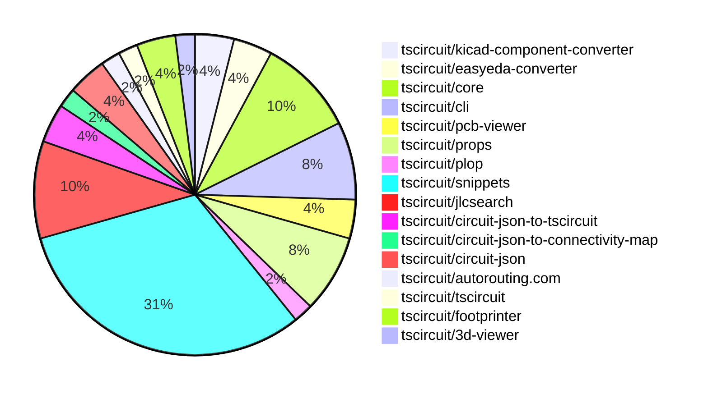

# contribution-tracker

Generates weekly contribution overviews for tscircuit contributors. Check out all
the [contribution overviews here](./contribution-overviews/)

* All PRs in the tscircuit org are scanned/summarized via Claude Haiku
* Claude classifies each Diff/PR as a Major, Minor or Tiny contribution
* All the PRs, summaries, and classifications are organized into charts and tables

The current week is shown below. There are 3 major sections:

* [Contributor Overview](#contributor-overview)
* [PRs by Repository](#prs-by-repository)
* [PRs by Contributor](#changes-by-contributor)

## Current Week

<!-- START_CURRENT_WEEK -->

# Contribution Overview 2025-01-01

## PRs by Repository

## Contributor Overview

| Contributor | 🐳 Major | 🐙 Minor | 🐌 Tiny | ⭐ | Issues Created |
|-------------|---------|---------|---------|-----|----------------|
| [seveibar](#seveibar) | 5 | 16 | 2 | 👑👑 | 47 |
| [Anshgrover23](#Anshgrover23) | 3 | 9 | 1 | ⭐⭐⭐ | 9 |
| [ShiboSoftwareDev](#ShiboSoftwareDev) | 0 | 5 | 0 | ⭐⭐ | 5 |
| [Abse2001](#Abse2001) | 1 | 2 | 1 | ⭐ | 2 |
| [DrSensor](#DrSensor) | 1 | 0 | 0 | ⭐ | 0 |
| [techmannih](#techmannih) | 0 | 2 | 0 | ⭐ | 1 |
| [devin-ai-integration[bot]](#devin-ai-integration[bot]) | 0 | 1 | 0 |  | 0 |
| [krushnarout](#krushnarout) | 0 | 1 | 0 |  | 0 |

## Review Table

[reviews-received-hover]: ## "Number of reviews received for PRs for this contributor"
[approvals-received-hover]: ## "Number of approvals received for PRs this contributor authored"
[rejections-received-hover]: ## "Number of rejections received for PRs this contributor authored"
[prs-opened-hover]: ## "Number of PRs opened by this contributor"
[issues-created-hover]: ## "Number of issues created by this contributor"
[bountied-issues-hover]: ## "Number of issues this contributor created with a bounty"
[bountied-issue-$-hover]: ## "Total bounty amount placed on issues authored by this contributor"

| Contributor | Reviews Received | Approvals Received | Rejections Received | Approvals | Rejections | PRs Opened | PRs Merged | Issues Created | Bountied Issues | Bountied Issue $ |
|---|---|---|---|---|---|---|---|---|---|---|
| [Abse2001](#Abse2001) | 27 | 4 | 0 | 0 | 0 | 5 | 4 | 2 | 0 | 0 |
| [seveibar](#seveibar) | 1 | 0 | 0 | 28 | 11 | 25 | 23 | 47 | 27 | 371 |
| [DrSensor](#DrSensor) | 1 | 1 | 0 | 0 | 0 | 1 | 1 | 0 | 0 | 0 |
| [Anshgrover23](#Anshgrover23) | 42 | 13 | 10 | 0 | 2 | 19 | 14 | 9 | 1 | 4 |
| [techmannih](#techmannih) | 5 | 2 | 1 | 0 | 0 | 6 | 2 | 1 | 0 | 0 |
| [ShiboSoftwareDev](#ShiboSoftwareDev) | 7 | 6 | 0 | 0 | 0 | 6 | 5 | 5 | 4 | 50 |
| [devin-ai-integration[bot]](#devin-ai-integration[bot]) | 3 | 1 | 2 | 0 | 0 | 3 | 1 | 0 | 0 | 0 |
| [oldbear26](#oldbear26) | 0 | 0 | 0 | 0 | 0 | 1 | 0 | 0 | 0 | 0 |
| [krushnarout](#krushnarout) | 1 | 1 | 0 | 0 | 0 | 2 | 1 | 0 | 0 | 0 |

## Changes by Repository

### [tscircuit/kicad-component-converter](https://github.com/tscircuit/kicad-component-converter)

| PR # | Impact | Contributor | Description |
|------|--------|-------------|-------------|
| [#110](https://github.com/tscircuit/kicad-component-converter/pull/110) | 🐳 Major | seveibar | Adds a web-based interface to convert Kicad Mod files into Circuit JSON or tscircuit code |
| [#112](https://github.com/tscircuit/kicad-component-converter/pull/112) | 🐙 Minor | seveibar | Allow opening tscircuit snippet |

### [tscircuit/easyeda-converter](https://github.com/tscircuit/easyeda-converter)

| PR # | Impact | Contributor | Description |
|------|--------|-------------|-------------|
| [#146](https://github.com/tscircuit/easyeda-converter/pull/146) | 🐳 Major | seveibar | Adds support for parsing silkscreen text in the EasyEDA JSON to TSCircuit Soup JSON conversion. |
| [#141](https://github.com/tscircuit/easyeda-converter/pull/141) | 🐙 Minor | seveibar | Add instructions to the README for adding a new part test |

### [tscircuit/core](https://github.com/tscircuit/core)

| PR # | Impact | Contributor | Description |
|------|--------|-------------|-------------|
| [#480](https://github.com/tscircuit/core/pull/480) | 🐳 Major | seveibar | Allow duplicate port hints for overlapping pcb primitive elements, fixing some KiCad conversion issues. |
| [#475](https://github.com/tscircuit/core/pull/475) | 🐙 Minor | seveibar | Adds support for non-numeric pin labels in the `schPinStyle` property, and introduces a new function `getNumericSchPinStyle` to handle the conversion of pin labels to numeric pin numbers. |
| [#479](https://github.com/tscircuit/core/pull/479) | 🐙 Minor | Abse2001 | Added a new function `getTraceDisplayName` to generate a display name for a trace based on the connected ports and nets. |
| [#478](https://github.com/tscircuit/core/pull/478) | 🐙 Minor | Anshgrover23 | Adds a new feature to check the `noSchematicRepresentation` property and early return if it is true, skipping the normal schematic rendering. |
| [#481](https://github.com/tscircuit/core/pull/481) | 🐙 Minor | ShiboSoftwareDev | Adds a new Mosfet component to the circuit library |

### [tscircuit/cli](https://github.com/tscircuit/cli)

| PR # | Impact | Contributor | Description |
|------|--------|-------------|-------------|
| [#12](https://github.com/tscircuit/cli/pull/12) | 🐳 Major | seveibar | Establishes CLI patterns, implements authentication to prepare for snippets sync |
| [#10](https://github.com/tscircuit/cli/pull/10) | 🐳 Major | seveibar | Adds support for drag-and-drop functionality in the schematic editor, including dynamic loading of the Runframe library and a watcher for file updates. |
| [#13](https://github.com/tscircuit/cli/pull/13) | 🐙 Minor | seveibar | This pull request adds a new "clone" command to the CLI, allowing users to quickly download snippets from the tscircuit registry. |
| [#11](https://github.com/tscircuit/cli/pull/11) | 🐙 Minor | seveibar | Fix Module Import issue in cli build |

### [tscircuit/pcb-viewer](https://github.com/tscircuit/pcb-viewer)

| PR # | Impact | Contributor | Description |
|------|--------|-------------|-------------|
| [#107](https://github.com/tscircuit/pcb-viewer/pull/107) | 🐙 Minor | seveibar | Switch to ESM module (drop CommonJS support) |
| [#101](https://github.com/tscircuit/pcb-viewer/pull/101) | 🐙 Minor | Abse2001 | Adds a trace length tooltip that is displayed when hovering over multiple traces, and handles the case when the trace length exceeds the maximum length. |

### [tscircuit/props](https://github.com/tscircuit/props)

| PR # | Impact | Contributor | Description |
|------|--------|-------------|-------------|
| [#144](https://github.com/tscircuit/props/pull/144) | 🐙 Minor | seveibar | Rename `pcbOffsetX` and `pcbOffsetY` properties to `outlineOffsetX` and `outlineOffsetY` respectively in the `boardProps` type. |
| [#141](https://github.com/tscircuit/props/pull/141) | 🐙 Minor | Anshgrover23 | Add a new `noSchematicRepresentation` property to the `chipProps` type and associated tests. |
| [#138](https://github.com/tscircuit/props/pull/138) | 🐙 Minor | ShiboSoftwareDev | Changes the `channelType` property in the `MosfetProps` interface and the `mosfetProps` object from `"nmos" | "pmos"` to `"n" | "p"`, and adds a new `mosfetMode` property with values `"enhancement" | "depletion"`. |
| [#143](https://github.com/tscircuit/props/pull/143) | 🐙 Minor | devin-ai-integration[bot] | Add `pcbOffsetX` and `pcbOffsetY` properties to the board component to allow offsetting the board's PCB position. |

### [tscircuit/plop](https://github.com/tscircuit/plop)

| PR # | Impact | Contributor | Description |
|------|--------|-------------|-------------|
| [#7](https://github.com/tscircuit/plop/pull/7) | 🐙 Minor | seveibar | Allow bot token for bypassing branch protection on version commit |

### [tscircuit/snippets](https://github.com/tscircuit/snippets)

| PR # | Impact | Contributor | Description |
|------|--------|-------------|-------------|
| [#484](https://github.com/tscircuit/snippets/pull/484) | 🐳 Major | Abse2001 | Adds an AI-driven auto-completion feature to the CodeEditor component. |
| [#493](https://github.com/tscircuit/snippets/pull/493) | 🐙 Minor | seveibar | Improve the search component, making it more responsive and user-friendly. |
| [#487](https://github.com/tscircuit/snippets/pull/487) | 🐙 Minor | seveibar | Reverting a previous fix for card misalignment |
| [#488](https://github.com/tscircuit/snippets/pull/488) | 🐙 Minor | seveibar | Fix the snippet type by checking the URL parameters and the template from the URL. |
| [#468](https://github.com/tscircuit/snippets/pull/468) | 🐙 Minor | seveibar | Improves the layout of the landing feature bullet points on mobile devices. |
| [#463](https://github.com/tscircuit/snippets/pull/463) | 🐙 Minor | seveibar | Adds analytics tracking and cookie consent component to the application. |
| [#492](https://github.com/tscircuit/snippets/pull/492) | 🐙 Minor | Anshgrover23 | Fixes the selector for the "Edit Description" menu item |
| [#490](https://github.com/tscircuit/snippets/pull/490) | 🐙 Minor | Anshgrover23 | Fixes all the tests and skips manual edits for now |
| [#482](https://github.com/tscircuit/snippets/pull/482) | 🐙 Minor | Anshgrover23 | Add a new feature to download KiCad PCB files from the circuit editor. |
| [#460](https://github.com/tscircuit/snippets/pull/460) | 🐙 Minor | Anshgrover23 | Fixes the search component by adding overflow-y-auto to the search results container to prevent the search results from overflowing the screen. |
| [#472](https://github.com/tscircuit/snippets/pull/472) | 🐙 Minor | Anshgrover23 | Add Algora bounty badges to the README.md file. |
| [#458](https://github.com/tscircuit/snippets/pull/458) | 🐙 Minor | Anshgrover23 | Fixes issues in the Playwright tests, including improvements to waiting for network requests, file dialog interactions, and star button functionality. |
| [#478](https://github.com/tscircuit/snippets/pull/478) | 🐙 Minor | techmannih | Fixes card misalignment by adding a `hover:shadow-lg transition-shadow duration-200 h-full` class to the card component. |
| [#475](https://github.com/tscircuit/snippets/pull/475) | 🐙 Minor | techmannih | Adds a new button to download the Assembly SVG for the circuit |
| [#465](https://github.com/tscircuit/snippets/pull/465) | 🐙 Minor | krushnarout | Adds a new "HeaderDropdown" component and displays it on the landing page when the user is logged in. |
| [#483](https://github.com/tscircuit/snippets/pull/483) | 🐌 Tiny | seveibar | Update the Discord link in the Header2 component |

### [tscircuit/jlcsearch](https://github.com/tscircuit/jlcsearch)

| PR # | Impact | Contributor | Description |
|------|--------|-------------|-------------|
| [#23](https://github.com/tscircuit/jlcsearch/pull/23) | 🐳 Major | Anshgrover23 | Adds a new derived table for LED Dot Matrix Display Modules and adds a new page for listing these components. |
| [#22](https://github.com/tscircuit/jlcsearch/pull/22) | 🐳 Major | Anshgrover23 | Adds OLED Display modules to the application, including a new derived table for storing OLED display information and a new route for listing OLED displays. |
| [#24](https://github.com/tscircuit/jlcsearch/pull/24) | 🐳 Major | Anshgrover23 | Adds a new derived table for LED Segment Display Modules, including various attributes such as package, positions, type, size, and color. |
| [#16](https://github.com/tscircuit/jlcsearch/pull/16) | 🐙 Minor | seveibar | Adds the Posthog analytics script to the application. |
| [#14](https://github.com/tscircuit/jlcsearch/pull/14) | 🟣 | Anshgrover23 |  |

### [tscircuit/circuit-json-to-tscircuit](https://github.com/tscircuit/circuit-json-to-tscircuit)

| PR # | Impact | Contributor | Description |
|------|--------|-------------|-------------|
| [#3](https://github.com/tscircuit/circuit-json-to-tscircuit/pull/3) | 🐙 Minor | seveibar | Adds more information to the README and removes empty lines from the output. |
| [#2](https://github.com/tscircuit/circuit-json-to-tscircuit/pull/2) | 🐙 Minor | seveibar | Adds initial workflow files for format checking, type checking, testing, and publishing to npm. |

### [tscircuit/circuit-json-to-connectivity-map](https://github.com/tscircuit/circuit-json-to-connectivity-map)

| PR # | Impact | Contributor | Description |
|------|--------|-------------|-------------|
| [#7](https://github.com/tscircuit/circuit-json-to-connectivity-map/pull/7) | 🐌 Tiny | seveibar | Update the version of the `@tscircuit/math-utils` dependency from `^0.0.4` to `^0.0.9`. |

### [tscircuit/circuit-json](https://github.com/tscircuit/circuit-json)

| PR # | Impact | Contributor | Description |
|------|--------|-------------|-------------|
| [#116](https://github.com/tscircuit/circuit-json/pull/116) | 🐙 Minor | ShiboSoftwareDev | Added support for the `simple_mosfet` component in the `any_circuit_element` and `any_source_component` types. |
| [#115](https://github.com/tscircuit/circuit-json/pull/115) | 🐌 Tiny | Abse2001 | Added an optional `display_name` field to the `SourceTrace` type. |

### [tscircuit/autorouting.com](https://github.com/tscircuit/autorouting.com)

| PR # | Impact | Contributor | Description |
|------|--------|-------------|-------------|
| [#13](https://github.com/tscircuit/autorouting.com/pull/13) | 🐙 Minor | Anshgrover23 | Add main logo animation |

### [tscircuit/tscircuit](https://github.com/tscircuit/tscircuit)

| PR # | Impact | Contributor | Description |
|------|--------|-------------|-------------|
| [#493](https://github.com/tscircuit/tscircuit/pull/493) | 🐌 Tiny | Anshgrover23 | Added Algora badges to the README.md file. |

### [tscircuit/footprinter](https://github.com/tscircuit/footprinter)

| PR # | Impact | Contributor | Description |
|------|--------|-------------|-------------|
| [#105](https://github.com/tscircuit/footprinter/pull/105) | 🐙 Minor | ShiboSoftwareDev | Change the parameter types for pushbutton from number to length. |
| [#104](https://github.com/tscircuit/footprinter/pull/104) | 🐙 Minor | ShiboSoftwareDev | Removed the `num_pins` property from the `axial` component definition, as it only has two pins. |

### [tscircuit/3d-viewer](https://github.com/tscircuit/3d-viewer)

| PR # | Impact | Contributor | Description |
|------|--------|-------------|-------------|
| [#96](https://github.com/tscircuit/3d-viewer/pull/96) | 🐳 Major | DrSensor | Add hooks for exporting to GLTF format |

## Changes by Contributor

### [seveibar](https://github.com/seveibar)

| PR # | Impact | Description |
|------|--------|-------------|
| [#110](https://github.com/tscircuit/kicad-component-converter/pull/110) | 🐳 Major | Adds a web-based interface to convert Kicad Mod files into Circuit JSON or tscircuit code |
| [#146](https://github.com/tscircuit/easyeda-converter/pull/146) | 🐳 Major | Adds support for parsing silkscreen text in the EasyEDA JSON to TSCircuit Soup JSON conversion. |
| [#480](https://github.com/tscircuit/core/pull/480) | 🐳 Major | Allow duplicate port hints for overlapping pcb primitive elements, fixing some KiCad conversion issues. |
| [#12](https://github.com/tscircuit/cli/pull/12) | 🐳 Major | Establishes CLI patterns, implements authentication to prepare for snippets sync |
| [#10](https://github.com/tscircuit/cli/pull/10) | 🐳 Major | Adds support for drag-and-drop functionality in the schematic editor, including dynamic loading of the Runframe library and a watcher for file updates. |
| [#107](https://github.com/tscircuit/pcb-viewer/pull/107) | 🐙 Minor | Switch to ESM module (drop CommonJS support) |
| [#144](https://github.com/tscircuit/props/pull/144) | 🐙 Minor | Rename `pcbOffsetX` and `pcbOffsetY` properties to `outlineOffsetX` and `outlineOffsetY` respectively in the `boardProps` type. |
| [#112](https://github.com/tscircuit/kicad-component-converter/pull/112) | 🐙 Minor | Allow opening tscircuit snippet |
| [#141](https://github.com/tscircuit/easyeda-converter/pull/141) | 🐙 Minor | Add instructions to the README for adding a new part test |
| [#475](https://github.com/tscircuit/core/pull/475) | 🐙 Minor | Adds support for non-numeric pin labels in the `schPinStyle` property, and introduces a new function `getNumericSchPinStyle` to handle the conversion of pin labels to numeric pin numbers. |
| [#7](https://github.com/tscircuit/plop/pull/7) | 🐙 Minor | Allow bot token for bypassing branch protection on version commit |
| [#493](https://github.com/tscircuit/snippets/pull/493) | 🐙 Minor | Improve the search component, making it more responsive and user-friendly. |
| [#487](https://github.com/tscircuit/snippets/pull/487) | 🐙 Minor | Reverting a previous fix for card misalignment |
| [#488](https://github.com/tscircuit/snippets/pull/488) | 🐙 Minor | Fix the snippet type by checking the URL parameters and the template from the URL. |
| [#468](https://github.com/tscircuit/snippets/pull/468) | 🐙 Minor | Improves the layout of the landing feature bullet points on mobile devices. |
| [#463](https://github.com/tscircuit/snippets/pull/463) | 🐙 Minor | Adds analytics tracking and cookie consent component to the application. |
| [#16](https://github.com/tscircuit/jlcsearch/pull/16) | 🐙 Minor | Adds the Posthog analytics script to the application. |
| [#13](https://github.com/tscircuit/cli/pull/13) | 🐙 Minor | This pull request adds a new "clone" command to the CLI, allowing users to quickly download snippets from the tscircuit registry. |
| [#11](https://github.com/tscircuit/cli/pull/11) | 🐙 Minor | Fix Module Import issue in cli build |
| [#3](https://github.com/tscircuit/circuit-json-to-tscircuit/pull/3) | 🐙 Minor | Adds more information to the README and removes empty lines from the output. |
| [#2](https://github.com/tscircuit/circuit-json-to-tscircuit/pull/2) | 🐙 Minor | Adds initial workflow files for format checking, type checking, testing, and publishing to npm. |
| [#7](https://github.com/tscircuit/circuit-json-to-connectivity-map/pull/7) | 🐌 Tiny | Update the version of the `@tscircuit/math-utils` dependency from `^0.0.4` to `^0.0.9`. |
| [#483](https://github.com/tscircuit/snippets/pull/483) | 🐌 Tiny | Update the Discord link in the Header2 component |

### [Abse2001](https://github.com/Abse2001)

| PR # | Impact | Description |
|------|--------|-------------|
| [#484](https://github.com/tscircuit/snippets/pull/484) | 🐳 Major | Adds an AI-driven auto-completion feature to the CodeEditor component. |
| [#101](https://github.com/tscircuit/pcb-viewer/pull/101) | 🐙 Minor | Adds a trace length tooltip that is displayed when hovering over multiple traces, and handles the case when the trace length exceeds the maximum length. |
| [#479](https://github.com/tscircuit/core/pull/479) | 🐙 Minor | Added a new function `getTraceDisplayName` to generate a display name for a trace based on the connected ports and nets. |
| [#115](https://github.com/tscircuit/circuit-json/pull/115) | 🐌 Tiny | Added an optional `display_name` field to the `SourceTrace` type. |

### [Anshgrover23](https://github.com/Anshgrover23)

| PR # | Impact | Description |
|------|--------|-------------|
| [#23](https://github.com/tscircuit/jlcsearch/pull/23) | 🐳 Major | Adds a new derived table for LED Dot Matrix Display Modules and adds a new page for listing these components. |
| [#22](https://github.com/tscircuit/jlcsearch/pull/22) | 🐳 Major | Adds OLED Display modules to the application, including a new derived table for storing OLED display information and a new route for listing OLED displays. |
| [#24](https://github.com/tscircuit/jlcsearch/pull/24) | 🐳 Major | Adds a new derived table for LED Segment Display Modules, including various attributes such as package, positions, type, size, and color. |
| [#141](https://github.com/tscircuit/props/pull/141) | 🐙 Minor | Add a new `noSchematicRepresentation` property to the `chipProps` type and associated tests. |
| [#478](https://github.com/tscircuit/core/pull/478) | 🐙 Minor | Adds a new feature to check the `noSchematicRepresentation` property and early return if it is true, skipping the normal schematic rendering. |
| [#13](https://github.com/tscircuit/autorouting.com/pull/13) | 🐙 Minor | Add main logo animation |
| [#492](https://github.com/tscircuit/snippets/pull/492) | 🐙 Minor | Fixes the selector for the "Edit Description" menu item |
| [#490](https://github.com/tscircuit/snippets/pull/490) | 🐙 Minor | Fixes all the tests and skips manual edits for now |
| [#482](https://github.com/tscircuit/snippets/pull/482) | 🐙 Minor | Add a new feature to download KiCad PCB files from the circuit editor. |
| [#460](https://github.com/tscircuit/snippets/pull/460) | 🐙 Minor | Fixes the search component by adding overflow-y-auto to the search results container to prevent the search results from overflowing the screen. |
| [#472](https://github.com/tscircuit/snippets/pull/472) | 🐙 Minor | Add Algora bounty badges to the README.md file. |
| [#458](https://github.com/tscircuit/snippets/pull/458) | 🐙 Minor | Fixes issues in the Playwright tests, including improvements to waiting for network requests, file dialog interactions, and star button functionality. |
| [#493](https://github.com/tscircuit/tscircuit/pull/493) | 🐌 Tiny | Added Algora badges to the README.md file. |
| [#14](https://github.com/tscircuit/jlcsearch/pull/14) | 🟣 |  |

### [ShiboSoftwareDev](https://github.com/ShiboSoftwareDev)

| PR # | Impact | Description |
|------|--------|-------------|
| [#116](https://github.com/tscircuit/circuit-json/pull/116) | 🐙 Minor | Added support for the `simple_mosfet` component in the `any_circuit_element` and `any_source_component` types. |
| [#138](https://github.com/tscircuit/props/pull/138) | 🐙 Minor | Changes the `channelType` property in the `MosfetProps` interface and the `mosfetProps` object from `"nmos" | "pmos"` to `"n" | "p"`, and adds a new `mosfetMode` property with values `"enhancement" | "depletion"`. |
| [#105](https://github.com/tscircuit/footprinter/pull/105) | 🐙 Minor | Change the parameter types for pushbutton from number to length. |
| [#104](https://github.com/tscircuit/footprinter/pull/104) | 🐙 Minor | Removed the `num_pins` property from the `axial` component definition, as it only has two pins. |
| [#481](https://github.com/tscircuit/core/pull/481) | 🐙 Minor | Adds a new Mosfet component to the circuit library |

### [devin-ai-integration[bot]](https://github.com/devin-ai-integration[bot])

| PR # | Impact | Description |
|------|--------|-------------|
| [#143](https://github.com/tscircuit/props/pull/143) | 🐙 Minor | Add `pcbOffsetX` and `pcbOffsetY` properties to the board component to allow offsetting the board's PCB position. |

### [DrSensor](https://github.com/DrSensor)

| PR # | Impact | Description |
|------|--------|-------------|
| [#96](https://github.com/tscircuit/3d-viewer/pull/96) | 🐳 Major | Add hooks for exporting to GLTF format |

### [techmannih](https://github.com/techmannih)

| PR # | Impact | Description |
|------|--------|-------------|
| [#478](https://github.com/tscircuit/snippets/pull/478) | 🐙 Minor | Fixes card misalignment by adding a `hover:shadow-lg transition-shadow duration-200 h-full` class to the card component. |
| [#475](https://github.com/tscircuit/snippets/pull/475) | 🐙 Minor | Adds a new button to download the Assembly SVG for the circuit |

### [krushnarout](https://github.com/krushnarout)

| PR # | Impact | Description |
|------|--------|-------------|
| [#465](https://github.com/tscircuit/snippets/pull/465) | 🐙 Minor | Adds a new "HeaderDropdown" component and displays it on the landing page when the user is logged in. |

<!-- END_CURRENT_WEEK -->
