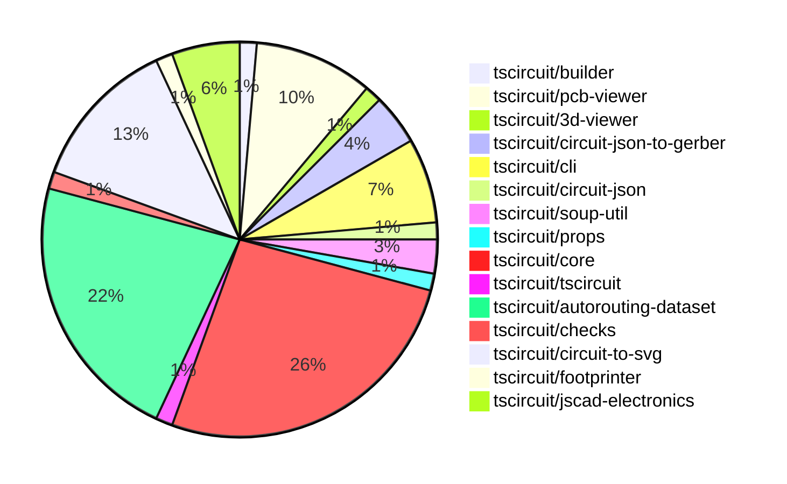

# contribution-tracker

Generates weekly contribution overviews for tscircuit contributors. Check out all
the [contribution overviews here](./contribution-overviews/)

* All PRs in the tscircuit org are scanned/summarized via Claude Haiku
* Claude classifies each Diff/PR as a Major, Minor or Tiny contribution
* All the PRs, summaries, and classifications are organized into charts and tables

The current week is shown below. There are 3 major sections:

* [Contributor Overview](#contributor-overview)
* [PRs by Repository](#prs-by-repository)
* [PRs by Contributor](#changes-by-contributor)

## Current Week

<!-- START_CURRENT_WEEK -->

# Contribution Overview 2024-09-07

## PRs by Repository

## Contributor Overview

| Contributor | 🐳 Major | 🐙 Minor | 🐌 Tiny |
|-------------|-------|-------|-------|
| ShiboSoftwareDev | 6 | 7 | 1 |
| seveibar | 33 | 11 | 0 |
| imrishabh18 | 4 | 1 | 0 |
| abhijitxy | 6 | 1 | 0 |
| tscircuitbot | 0 | 0 | 1 |

## Changes by Repository

### [tscircuit/builder](https://github.com/tscircuit/builder)

| PR # | Impact | Contributor | Description |
|------|--------|-------------|-------------|
| [#108](https://github.com/tscircuit/builder/pull/108) | 🐳 Major | ShiboSoftwareDev | Refactored gerber and excellon drill into circuit-json-to-gerber |

### [tscircuit/pcb-viewer](https://github.com/tscircuit/pcb-viewer)

| PR # | Impact | Contributor | Description |
|------|--------|-------------|-------------|
| [#57](https://github.com/tscircuit/pcb-viewer/pull/57) | 🐳 Major | ShiboSoftwareDev | Refactored the code to distinguish between PCB hole primitives and other primitives for highlighting. |
| [#56](https://github.com/tscircuit/pcb-viewer/pull/56) | 🐳 Major | ShiboSoftwareDev | Introduce a feature to highlight all connected ports/traces |
| [#51](https://github.com/tscircuit/pcb-viewer/pull/51) | 🐳 Major | seveibar | Adds hover highlight functionality to canvas elements, introducing a new `is_mouse_over` property to the `Primitive` type. |
| [#50](https://github.com/tscircuit/pcb-viewer/pull/50) | 🐳 Major | seveibar | Fix bad edit events being sent where `pcb_port_id` was null |
| [#48](https://github.com/tscircuit/pcb-viewer/pull/48) | 🐳 Major | imrishabh18 | Add a keepout example to the PCB viewer |
| [#60](https://github.com/tscircuit/pcb-viewer/pull/60) | 🐙 Minor | ShiboSoftwareDev | Improve the handling of the aperture layer in the Drawer component to work with multi-layer setups. |
| [#58](https://github.com/tscircuit/pcb-viewer/pull/58) | 🐌 Tiny | ShiboSoftwareDev | Reduced the z-index of the error overlay to 100, from the previous value of 1000. |

### [tscircuit/3d-viewer](https://github.com/tscircuit/3d-viewer)

| PR # | Impact | Contributor | Description |
|------|--------|-------------|-------------|
| [#17](https://github.com/tscircuit/3d-viewer/pull/17) | 🐳 Major | ShiboSoftwareDev | Implemented a function to create a 3D board geometry with an outline |

### [tscircuit/circuit-json-to-gerber](https://github.com/tscircuit/circuit-json-to-gerber)

| PR # | Impact | Contributor | Description |
|------|--------|-------------|-------------|
| [#8](https://github.com/tscircuit/circuit-json-to-gerber/pull/8) | 🐳 Major | ShiboSoftwareDev | Refactored repo layout and added tests for excellon drill |
| [#6](https://github.com/tscircuit/circuit-json-to-gerber/pull/6) | 🐳 Major | ShiboSoftwareDev | Add support for generating Excellon drill file output along with the Gerber output. |
| [#7](https://github.com/tscircuit/circuit-json-to-gerber/pull/7) | 🐙 Minor | ShiboSoftwareDev | Fixed the exports in the package.json file to use "main" instead of "module" |

### [tscircuit/cli](https://github.com/tscircuit/cli)

| PR # | Impact | Contributor | Description |
|------|--------|-------------|-------------|
| [#179](https://github.com/tscircuit/cli/pull/179) | 🐳 Major | seveibar | Update manual trace hints in the example project |
| [#163](https://github.com/tscircuit/cli/pull/163) | 🐳 Major | seveibar | The pull request edits the Event Pipeline documentation, adds debug logging, and fixes a bug where manual edits don't crash the browser. |
| [#175](https://github.com/tscircuit/cli/pull/175) | 🐙 Minor | ShiboSoftwareDev | Imports gerber functionality from the `circuit-json-to-gerber` package to be used by the `builder` module. |
| [#170](https://github.com/tscircuit/cli/pull/170) | 🐙 Minor | seveibar | Fix a bug in the PCB viewer that was causing a full content flash when updating. |
| [#161](https://github.com/tscircuit/cli/pull/161) | 🐙 Minor | abhijitxy | Fix the dropdown to appear above the circuit |

### [tscircuit/circuit-json](https://github.com/tscircuit/circuit-json)

| PR # | Impact | Contributor | Description |
|------|--------|-------------|-------------|
| [#45](https://github.com/tscircuit/circuit-json/pull/45) | 🐙 Minor | ShiboSoftwareDev | Added optional color property to fabrication note path and text components |

### [tscircuit/soup-util](https://github.com/tscircuit/soup-util)

| PR # | Impact | Contributor | Description |
|------|--------|-------------|-------------|
| [#13](https://github.com/tscircuit/soup-util/pull/13) | 🐙 Minor | ShiboSoftwareDev | Updated the `/soup` dependency to version `^0.0.69`. |
| [#14](https://github.com/tscircuit/soup-util/pull/14) | 🐙 Minor | seveibar | Add a build step before releasing the package. |

### [tscircuit/props](https://github.com/tscircuit/props)

| PR # | Impact | Contributor | Description |
|------|--------|-------------|-------------|
| [#48](https://github.com/tscircuit/props/pull/48) | 🐙 Minor | ShiboSoftwareDev | Added a new `color` prop to `FabricationNoteTextProps` and `FabricationNotePathProps` in the TypeScript codebase. |

### [tscircuit/core](https://github.com/tscircuit/core)

| PR # | Impact | Contributor | Description |
|------|--------|-------------|-------------|
| [#81](https://github.com/tscircuit/core/pull/81) | 🐳 Major | seveibar | Update the ijump algorithm to use a multilayer autorouter |
| [#80](https://github.com/tscircuit/core/pull/80) | 🐳 Major | seveibar | Fix the issue where the `pcb_port` layer did not match the `smtpad` layer. |
| [#79](https://github.com/tscircuit/core/pull/79) | 🐳 Major | seveibar | Implement routing disabled for subcircuits, fixes issue #7 |
| [#78](https://github.com/tscircuit/core/pull/78) | 🐳 Major | seveibar | Add support for fabrication note text and fabrication note path components. |
| [#76](https://github.com/tscircuit/core/pull/76) | 🐳 Major | seveibar | Add connectivity map for better obstacle exclusion |
| [#75](https://github.com/tscircuit/core/pull/75) | 🐳 Major | seveibar | Fix obstacle errors and get fixes for PCB via routing |
| [#74](https://github.com/tscircuit/core/pull/74) | 🐳 Major | seveibar | Fix to handle errors when tracing a PCB trace without blocking the render. |
| [#73](https://github.com/tscircuit/core/pull/73) | 🐳 Major | seveibar | Fix multilayer routing for traces with trace hints |
| [#71](https://github.com/tscircuit/core/pull/71) | 🐳 Major | seveibar | The pull request addresses issue #65 by introducing multilayer traces and vias, ensuring that traces routed inside Trace.ts are no longer always routed on the top layer. |
| [#67](https://github.com/tscircuit/core/pull/67) | 🐳 Major | seveibar | Introduce a new `PcbTraceHintRender` phase to render trace hints in the PCB view, and add functionality to create trace hints from manual trace hints and insert them into the database. |
| [#60](https://github.com/tscircuit/core/pull/60) | 🐳 Major | seveibar | The pull request fixes the manual trace hints functionality by adding the `isMatchingPathSelector` function to correctly filter the manual trace hints based on the PCB ports. |
| [#85](https://github.com/tscircuit/core/pull/85) | 🐙 Minor | ShiboSoftwareDev | Add support for fabrication note path/text color prop |
| [#86](https://github.com/tscircuit/core/pull/86) | 🐙 Minor | seveibar | Upgrade the `@tscircuit/infgrid-ijump-astar` dependency to version `0.0.17` |
| [#84](https://github.com/tscircuit/core/pull/84) | 🐙 Minor | seveibar | Adjusts the layer of the footprint to match the layer of the component if the footprint string is specified. |
| [#82](https://github.com/tscircuit/core/pull/82) | 🐙 Minor | seveibar | Fix a multilayer routing issue |
| [#59](https://github.com/tscircuit/core/pull/59) | 🟣 | seveibar | Fix missing port ids on smtpads and plated holes |
| [#48](https://github.com/tscircuit/core/pull/48) | 🐳 Major | imrishabh18 | Introduce a new PCB primitive component called "Keepout" which allows defining keepout areas on the PCB. |
| [#63](https://github.com/tscircuit/core/pull/63) | 🐳 Major | abhijitxy | Fix an issue with unsupported silkscreenpath feature |
| [#69](https://github.com/tscircuit/core/pull/69) | 🐌 Tiny | tscircuitbot | Remove a `console.log` statement from the `silkscreenpath.test.tsx` file. |

### [tscircuit/tscircuit](https://github.com/tscircuit/tscircuit)

| PR # | Impact | Contributor | Description |
|------|--------|-------------|-------------|
| [#389](https://github.com/tscircuit/tscircuit/pull/389) | 🐳 Major | seveibar | Add a smoke test to ensure the `tscircuit` package works before publishing. |

### [tscircuit/autorouting-dataset](https://github.com/tscircuit/autorouting-dataset)

| PR # | Impact | Contributor | Description |
|------|--------|-------------|-------------|
| [#63](https://github.com/tscircuit/autorouting-dataset/pull/63) | 🐳 Major | seveibar | Fix layerCount parameter being supplied in two places, fix layer reference error when computing obstacles |
| [#62](https://github.com/tscircuit/autorouting-dataset/pull/62) | 🐳 Major | seveibar | Improve the handling of obstacles when the layer changes by adding vias when the layer changes in the trace. |
| [#60](https://github.com/tscircuit/autorouting-dataset/pull/60) | 🐳 Major | seveibar | Implement multi-layer routing for the ijump autorouter. |
| [#59](https://github.com/tscircuit/autorouting-dataset/pull/59) | 🐳 Major | seveibar | Introduce a post-processing step to remove loops in the path generated by the A* algorithm. |
| [#58](https://github.com/tscircuit/autorouting-dataset/pull/58) | 🐳 Major | seveibar | Fix a major issue in the multi-margin autorouter to prevent accidental routing through pads. |
| [#57](https://github.com/tscircuit/autorouting-dataset/pull/57) | 🐳 Major | seveibar | Implement multi-margin functionality for the infinite-grid-ijump-astar algorithm. |
| [#56](https://github.com/tscircuit/autorouting-dataset/pull/56) | 🐳 Major | seveibar | Add SVG elements to render a PCB design with component outlines and pads |
| [#55](https://github.com/tscircuit/autorouting-dataset/pull/55) | 🐳 Major | seveibar | Fix duplicate traces being returned and add debug SVGs for snapshot algorithm development. |
| [#47](https://github.com/tscircuit/autorouting-dataset/pull/47) | 🐳 Major | seveibar | Add support for `pcb_via` becoming an obstacle, fix error handling and float number handling for diagonal traces. |
| [#44](https://github.com/tscircuit/autorouting-dataset/pull/44) | 🐳 Major | seveibar | Add layers to obstacles in the circuit layout |
| [#69](https://github.com/tscircuit/autorouting-dataset/pull/69) | 🐳 Major | seveibar | Introduce alternative goal box functions for connections in the solver-utils module. |
| [#66](https://github.com/tscircuit/autorouting-dataset/pull/66) | 🐳 Major | seveibar | Add vias for PCB trace routes. |
| [#67](https://github.com/tscircuit/autorouting-dataset/pull/67) | 🐙 Minor | seveibar | Adds a snapshot for the Keyboard Sample 7 against the multilayer autorouter, preparing for the Route to Neighbor Strategy. |
| [#64](https://github.com/tscircuit/autorouting-dataset/pull/64) | 🐙 Minor | seveibar | Introduce a `GOAL_RUSH_FACTOR` parameter to modify the heuristic function for the multilayer iJump algorithm. |
| [#51](https://github.com/tscircuit/autorouting-dataset/pull/51) | 🐙 Minor | seveibar | Add some default `connectedTo` IDs for obstacles |
| [#42](https://github.com/tscircuit/autorouting-dataset/pull/42) | 🐙 Minor | seveibar | Add a format check workflow using Bun |

### [tscircuit/checks](https://github.com/tscircuit/checks)

| PR # | Impact | Contributor | Description |
|------|--------|-------------|-------------|
| [#13](https://github.com/tscircuit/checks/pull/13) | 🐳 Major | seveibar | The pull request fixes an issue where the code was throwing errors if PCB traces overlapped, even if they were connected more distantly using a connectivity map. |

### [tscircuit/circuit-to-svg](https://github.com/tscircuit/circuit-to-svg)

| PR # | Impact | Contributor | Description |
|------|--------|-------------|-------------|
| [#64](https://github.com/tscircuit/circuit-to-svg/pull/64) | 🐳 Major | seveibar | Reorder the fabrication note elements to be displayed on top of the other PCB elements |
| [#63](https://github.com/tscircuit/circuit-to-svg/pull/63) | 🐳 Major | seveibar | Implement fabrication note path and text rendering |
| [#57](https://github.com/tscircuit/circuit-to-svg/pull/57) | 🐳 Major | seveibar | Introduces a new approach for rendering PCB traces with support for multi-layer traces. |
| [#55](https://github.com/tscircuit/circuit-to-svg/pull/55) | 🐳 Major | seveibar | Introduce snapshot tests for the PCB rendering functionality. |
| [#66](https://github.com/tscircuit/circuit-to-svg/pull/66) | 🐳 Major | imrishabh18 | Add support for pill-shaped plated holes in the PCB SVG rendering. |
| [#62](https://github.com/tscircuit/circuit-to-svg/pull/62) | 🐳 Major | imrishabh18 | Add support for rendering PCB silkscreen text in the SVG output. |
| [#65](https://github.com/tscircuit/circuit-to-svg/pull/65) | 🐙 Minor | seveibar | Fix the closing logic of the PCB fabrication note path |
| [#58](https://github.com/tscircuit/circuit-to-svg/pull/58) | 🐙 Minor | seveibar | The pull request modifies the `circuit-to-pcb-svg.ts` file to ensure that SMT pads on the bottom layer of the PCB are rendered in blue. |
| [#68](https://github.com/tscircuit/circuit-to-svg/pull/68) | 🐙 Minor | imrishabh18 | Adds an optional `width` and `height` parameter to the `circuitJsonToPcbSvg` function to allow for custom SVG dimensions. |

### [tscircuit/footprinter](https://github.com/tscircuit/footprinter)

| PR # | Impact | Contributor | Description |
|------|--------|-------------|-------------|
| [#35](https://github.com/tscircuit/footprinter/pull/35) | 🐳 Major | abhijitxy | Add SOD123 component |

### [tscircuit/jscad-electronics](https://github.com/tscircuit/jscad-electronics)

| PR # | Impact | Contributor | Description |
|------|--------|-------------|-------------|
| [#31](https://github.com/tscircuit/jscad-electronics/pull/31) | 🐳 Major | abhijitxy | Add a new TSSOP-20 component with configurable pin count and dimensions. |
| [#28](https://github.com/tscircuit/jscad-electronics/pull/28) | 🐳 Major | abhijitxy | Implemented the 3D model for the SOT-563 package. |
| [#26](https://github.com/tscircuit/jscad-electronics/pull/26) | 🐳 Major | abhijitxy | Added a new component `SOD123` and an example for it. |
| [#24](https://github.com/tscircuit/jscad-electronics/pull/24) | 🐳 Major | abhijitxy | Implemented the QFN (Quad Flat No Lead) component for a 3D model. |

## Changes by Contributor

### [ShiboSoftwareDev](https://github.com/ShiboSoftwareDev)

| PR # | Impact | Description |
|------|--------|-------------|
| [#108](https://github.com/tscircuit/builder/pull/108) | 🐳 Major | Refactored gerber and excellon drill into circuit-json-to-gerber |
| [#57](https://github.com/tscircuit/pcb-viewer/pull/57) | 🐳 Major | Refactored the code to distinguish between PCB hole primitives and other primitives for highlighting. |
| [#56](https://github.com/tscircuit/pcb-viewer/pull/56) | 🐳 Major | Introduce a feature to highlight all connected ports/traces |
| [#17](https://github.com/tscircuit/3d-viewer/pull/17) | 🐳 Major | Implemented a function to create a 3D board geometry with an outline |
| [#8](https://github.com/tscircuit/circuit-json-to-gerber/pull/8) | 🐳 Major | Refactored repo layout and added tests for excellon drill |
| [#6](https://github.com/tscircuit/circuit-json-to-gerber/pull/6) | 🐳 Major | Add support for generating Excellon drill file output along with the Gerber output. |
| [#60](https://github.com/tscircuit/pcb-viewer/pull/60) | 🐙 Minor | Improve the handling of the aperture layer in the Drawer component to work with multi-layer setups. |
| [#175](https://github.com/tscircuit/cli/pull/175) | 🐙 Minor | Imports gerber functionality from the `circuit-json-to-gerber` package to be used by the `builder` module. |
| [#45](https://github.com/tscircuit/circuit-json/pull/45) | 🐙 Minor | Added optional color property to fabrication note path and text components |
| [#13](https://github.com/tscircuit/soup-util/pull/13) | 🐙 Minor | Updated the `/soup` dependency to version `^0.0.69`. |
| [#48](https://github.com/tscircuit/props/pull/48) | 🐙 Minor | Added a new `color` prop to `FabricationNoteTextProps` and `FabricationNotePathProps` in the TypeScript codebase. |
| [#85](https://github.com/tscircuit/core/pull/85) | 🐙 Minor | Add support for fabrication note path/text color prop |
| [#7](https://github.com/tscircuit/circuit-json-to-gerber/pull/7) | 🐙 Minor | Fixed the exports in the package.json file to use "main" instead of "module" |
| [#58](https://github.com/tscircuit/pcb-viewer/pull/58) | 🐌 Tiny | Reduced the z-index of the error overlay to 100, from the previous value of 1000. |

### [seveibar](https://github.com/seveibar)

| PR # | Impact | Description |
|------|--------|-------------|
| [#51](https://github.com/tscircuit/pcb-viewer/pull/51) | 🐳 Major | Adds hover highlight functionality to canvas elements, introducing a new `is_mouse_over` property to the `Primitive` type. |
| [#50](https://github.com/tscircuit/pcb-viewer/pull/50) | 🐳 Major | Fix bad edit events being sent where `pcb_port_id` was null |
| [#389](https://github.com/tscircuit/tscircuit/pull/389) | 🐳 Major | Add a smoke test to ensure the `tscircuit` package works before publishing. |
| [#179](https://github.com/tscircuit/cli/pull/179) | 🐳 Major | Update manual trace hints in the example project |
| [#163](https://github.com/tscircuit/cli/pull/163) | 🐳 Major | The pull request edits the Event Pipeline documentation, adds debug logging, and fixes a bug where manual edits don't crash the browser. |
| [#81](https://github.com/tscircuit/core/pull/81) | 🐳 Major | Update the ijump algorithm to use a multilayer autorouter |
| [#80](https://github.com/tscircuit/core/pull/80) | 🐳 Major | Fix the issue where the `pcb_port` layer did not match the `smtpad` layer. |
| [#79](https://github.com/tscircuit/core/pull/79) | 🐳 Major | Implement routing disabled for subcircuits, fixes issue #7 |
| [#78](https://github.com/tscircuit/core/pull/78) | 🐳 Major | Add support for fabrication note text and fabrication note path components. |
| [#76](https://github.com/tscircuit/core/pull/76) | 🐳 Major | Add connectivity map for better obstacle exclusion |
| [#75](https://github.com/tscircuit/core/pull/75) | 🐳 Major | Fix obstacle errors and get fixes for PCB via routing |
| [#74](https://github.com/tscircuit/core/pull/74) | 🐳 Major | Fix to handle errors when tracing a PCB trace without blocking the render. |
| [#73](https://github.com/tscircuit/core/pull/73) | 🐳 Major | Fix multilayer routing for traces with trace hints |
| [#71](https://github.com/tscircuit/core/pull/71) | 🐳 Major | The pull request addresses issue #65 by introducing multilayer traces and vias, ensuring that traces routed inside Trace.ts are no longer always routed on the top layer. |
| [#67](https://github.com/tscircuit/core/pull/67) | 🐳 Major | Introduce a new `PcbTraceHintRender` phase to render trace hints in the PCB view, and add functionality to create trace hints from manual trace hints and insert them into the database. |
| [#60](https://github.com/tscircuit/core/pull/60) | 🐳 Major | The pull request fixes the manual trace hints functionality by adding the `isMatchingPathSelector` function to correctly filter the manual trace hints based on the PCB ports. |
| [#63](https://github.com/tscircuit/autorouting-dataset/pull/63) | 🐳 Major | Fix layerCount parameter being supplied in two places, fix layer reference error when computing obstacles |
| [#62](https://github.com/tscircuit/autorouting-dataset/pull/62) | 🐳 Major | Improve the handling of obstacles when the layer changes by adding vias when the layer changes in the trace. |
| [#60](https://github.com/tscircuit/autorouting-dataset/pull/60) | 🐳 Major | Implement multi-layer routing for the ijump autorouter. |
| [#59](https://github.com/tscircuit/autorouting-dataset/pull/59) | 🐳 Major | Introduce a post-processing step to remove loops in the path generated by the A* algorithm. |
| [#58](https://github.com/tscircuit/autorouting-dataset/pull/58) | 🐳 Major | Fix a major issue in the multi-margin autorouter to prevent accidental routing through pads. |
| [#57](https://github.com/tscircuit/autorouting-dataset/pull/57) | 🐳 Major | Implement multi-margin functionality for the infinite-grid-ijump-astar algorithm. |
| [#56](https://github.com/tscircuit/autorouting-dataset/pull/56) | 🐳 Major | Add SVG elements to render a PCB design with component outlines and pads |
| [#55](https://github.com/tscircuit/autorouting-dataset/pull/55) | 🐳 Major | Fix duplicate traces being returned and add debug SVGs for snapshot algorithm development. |
| [#47](https://github.com/tscircuit/autorouting-dataset/pull/47) | 🐳 Major | Add support for `pcb_via` becoming an obstacle, fix error handling and float number handling for diagonal traces. |
| [#44](https://github.com/tscircuit/autorouting-dataset/pull/44) | 🐳 Major | Add layers to obstacles in the circuit layout |
| [#13](https://github.com/tscircuit/checks/pull/13) | 🐳 Major | The pull request fixes an issue where the code was throwing errors if PCB traces overlapped, even if they were connected more distantly using a connectivity map. |
| [#170](https://github.com/tscircuit/cli/pull/170) | 🐙 Minor | Fix a bug in the PCB viewer that was causing a full content flash when updating. |
| [#14](https://github.com/tscircuit/soup-util/pull/14) | 🐙 Minor | Add a build step before releasing the package. |
| [#86](https://github.com/tscircuit/core/pull/86) | 🐙 Minor | Upgrade the `@tscircuit/infgrid-ijump-astar` dependency to version `0.0.17` |
| [#84](https://github.com/tscircuit/core/pull/84) | 🐙 Minor | Adjusts the layer of the footprint to match the layer of the component if the footprint string is specified. |
| [#82](https://github.com/tscircuit/core/pull/82) | 🐙 Minor | Fix a multilayer routing issue |
| [#59](https://github.com/tscircuit/core/pull/59) | 🟣 | Fix missing port ids on smtpads and plated holes |
| [#64](https://github.com/tscircuit/circuit-to-svg/pull/64) | 🐳 Major | Reorder the fabrication note elements to be displayed on top of the other PCB elements |
| [#63](https://github.com/tscircuit/circuit-to-svg/pull/63) | 🐳 Major | Implement fabrication note path and text rendering |
| [#57](https://github.com/tscircuit/circuit-to-svg/pull/57) | 🐳 Major | Introduces a new approach for rendering PCB traces with support for multi-layer traces. |
| [#55](https://github.com/tscircuit/circuit-to-svg/pull/55) | 🐳 Major | Introduce snapshot tests for the PCB rendering functionality. |
| [#69](https://github.com/tscircuit/autorouting-dataset/pull/69) | 🐳 Major | Introduce alternative goal box functions for connections in the solver-utils module. |
| [#66](https://github.com/tscircuit/autorouting-dataset/pull/66) | 🐳 Major | Add vias for PCB trace routes. |
| [#65](https://github.com/tscircuit/circuit-to-svg/pull/65) | 🐙 Minor | Fix the closing logic of the PCB fabrication note path |
| [#58](https://github.com/tscircuit/circuit-to-svg/pull/58) | 🐙 Minor | The pull request modifies the `circuit-to-pcb-svg.ts` file to ensure that SMT pads on the bottom layer of the PCB are rendered in blue. |
| [#67](https://github.com/tscircuit/autorouting-dataset/pull/67) | 🐙 Minor | Adds a snapshot for the Keyboard Sample 7 against the multilayer autorouter, preparing for the Route to Neighbor Strategy. |
| [#64](https://github.com/tscircuit/autorouting-dataset/pull/64) | 🐙 Minor | Introduce a `GOAL_RUSH_FACTOR` parameter to modify the heuristic function for the multilayer iJump algorithm. |
| [#51](https://github.com/tscircuit/autorouting-dataset/pull/51) | 🐙 Minor | Add some default `connectedTo` IDs for obstacles |
| [#42](https://github.com/tscircuit/autorouting-dataset/pull/42) | 🐙 Minor | Add a format check workflow using Bun |

### [imrishabh18](https://github.com/imrishabh18)

| PR # | Impact | Description |
|------|--------|-------------|
| [#48](https://github.com/tscircuit/pcb-viewer/pull/48) | 🐳 Major | Add a keepout example to the PCB viewer |
| [#48](https://github.com/tscircuit/core/pull/48) | 🐳 Major | Introduce a new PCB primitive component called "Keepout" which allows defining keepout areas on the PCB. |
| [#66](https://github.com/tscircuit/circuit-to-svg/pull/66) | 🐳 Major | Add support for pill-shaped plated holes in the PCB SVG rendering. |
| [#62](https://github.com/tscircuit/circuit-to-svg/pull/62) | 🐳 Major | Add support for rendering PCB silkscreen text in the SVG output. |
| [#68](https://github.com/tscircuit/circuit-to-svg/pull/68) | 🐙 Minor | Adds an optional `width` and `height` parameter to the `circuitJsonToPcbSvg` function to allow for custom SVG dimensions. |

### [abhijitxy](https://github.com/abhijitxy)

| PR # | Impact | Description |
|------|--------|-------------|
| [#35](https://github.com/tscircuit/footprinter/pull/35) | 🐳 Major | Add SOD123 component |
| [#63](https://github.com/tscircuit/core/pull/63) | 🐳 Major | Fix an issue with unsupported silkscreenpath feature |
| [#31](https://github.com/tscircuit/jscad-electronics/pull/31) | 🐳 Major | Add a new TSSOP-20 component with configurable pin count and dimensions. |
| [#28](https://github.com/tscircuit/jscad-electronics/pull/28) | 🐳 Major | Implemented the 3D model for the SOT-563 package. |
| [#26](https://github.com/tscircuit/jscad-electronics/pull/26) | 🐳 Major | Added a new component `SOD123` and an example for it. |
| [#24](https://github.com/tscircuit/jscad-electronics/pull/24) | 🐳 Major | Implemented the QFN (Quad Flat No Lead) component for a 3D model. |
| [#161](https://github.com/tscircuit/cli/pull/161) | 🐙 Minor | Fix the dropdown to appear above the circuit |

### [tscircuitbot](https://github.com/tscircuitbot)

| PR # | Impact | Description |
|------|--------|-------------|
| [#69](https://github.com/tscircuit/core/pull/69) | 🐌 Tiny | Remove a `console.log` statement from the `silkscreenpath.test.tsx` file. |

<!-- END_CURRENT_WEEK -->
