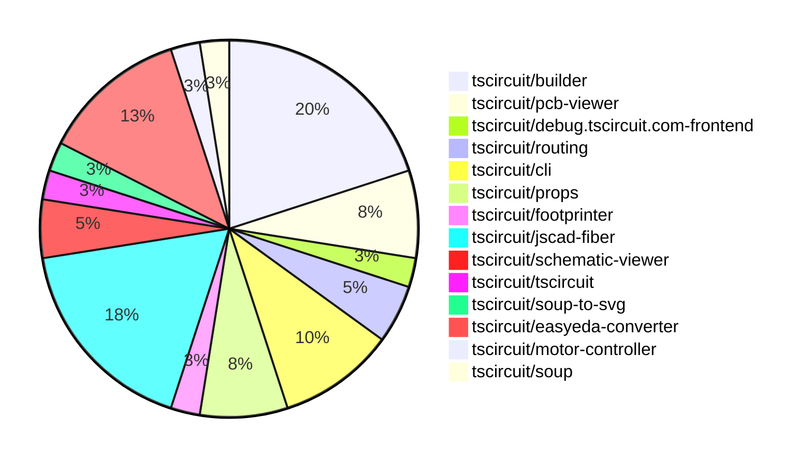

# contribution-tracker

Generates weekly contribution overviews for tscircuit contributors. Check out all
the [contribution overviews here](./contribution-overviews/)

* All PRs in the tscircuit org are scanned/summarized via Claude Haiku
* Claude classifies each Diff/PR as a Major, Minor or Tiny contribution
* All the PRs, summaries, and classifications are organized into charts and tables

The current week is shown below. There are 3 major sections:

* [Contributor Overview](#contributor-overview)
* [PRs by Repository](#prs-by-repository)
* [PRs by Contributor](#changes-by-contributor)

## Current Week

<!-- START_CURRENT_WEEK -->

# Contribution Overview 2024-07-13

## PRs by Repository

## Contributor Overview

| Contributor | 🐳 Major | 🐙 Minor | 🐌 Tiny |
|-------------|-------|-------|-------|
| seveibar | 12 | 10 | 0 |
| imrishabh18 | 2 | 1 | 0 |
| andrii-balitskyi | 4 | 3 | 0 |
| syedbarimanjan | 0 | 0 | 1 |
| Slaviiiii | 2 | 1 | 0 |
| r-bt | 1 | 0 | 1 |

## Changes by Repository

### [tscircuit/builder](https://github.com/tscircuit/builder)

| PR # | Impact | Contributor | Description |
|------|--------|-------------|-------------|
| [#75](https://github.com/tscircuit/builder/pull/75) | 🐳 Major | seveibar | Adds a new method `getFootprintPinLabels()` to the `FootprintBuilder` class to retrieve the pin labels of a footprint, and also makes some changes to the `BugBuilder` to handle cases where the footprint has no pins. |
| [#74](https://github.com/tscircuit/builder/pull/74) | 🐳 Major | seveibar | The pull request fixes an issue where failure to connect routes doesn't show an error that routes failed to connect. |
| [#78](https://github.com/tscircuit/builder/pull/78) | 🐙 Minor | seveibar | Add a development guide for the `@tscircuit/builder` library. |
| [#73](https://github.com/tscircuit/builder/pull/73) | 🐙 Minor | seveibar | Fix bad usage of `convert` function in `plated-hole-builder.ts` |
| [#72](https://github.com/tscircuit/builder/pull/72) | 🟣 | seveibar |  |
| [#71](https://github.com/tscircuit/builder/pull/71) | 🐳 Major | seveibar | Fix default plated hole construction when there's no outer width or hole width |
| [#70](https://github.com/tscircuit/builder/pull/70) | 🐙 Minor | seveibar | Upgrade Footprinter package to the latest version |
| [#77](https://github.com/tscircuit/builder/pull/77) | 🐙 Minor | imrishabh18 | Refactor the import of `Soup` from a local package to use the `@tscircuit/soup` package. |

### [tscircuit/pcb-viewer](https://github.com/tscircuit/pcb-viewer)

| PR # | Impact | Contributor | Description |
|------|--------|-------------|-------------|
| [#28](https://github.com/tscircuit/pcb-viewer/pull/28) | 🐳 Major | seveibar | Add an NPM build workflow and fix a build error in the `edit-events.ts` file. |
| [#25](https://github.com/tscircuit/pcb-viewer/pull/25) | 🐳 Major | seveibar | Fix port aliases not appearing for SMTPADS and plated holes for most components |
| [#26](https://github.com/tscircuit/pcb-viewer/pull/26) | 🐙 Minor | seveibar | Fixes a deprecated builder import by replacing it with the correct import from @tscircuit/soup. |

### [tscircuit/debug.tscircuit.com-frontend](https://github.com/tscircuit/debug.tscircuit.com-frontend)

| PR # | Impact | Contributor | Description |
|------|--------|-------------|-------------|
| [#134](https://github.com/tscircuit/debug.tscircuit.com-frontend/pull/134) | 🐳 Major | seveibar | Update the `builder` and `soup-util` dependencies to fix issues with blank schematics. |

### [tscircuit/routing](https://github.com/tscircuit/routing)

| PR # | Impact | Contributor | Description |
|------|--------|-------------|-------------|
| [#10](https://github.com/tscircuit/routing/pull/10) | 🐳 Major | seveibar | Automatically adjust the viewbox when the JSON text is pasted to ensure the entire board is visible. |
| [#11](https://github.com/tscircuit/routing/pull/11) | 🐙 Minor | seveibar | Add a landing page for the Storybook stories |

### [tscircuit/cli](https://github.com/tscircuit/cli)

| PR # | Impact | Contributor | Description |
|------|--------|-------------|-------------|
| [#99](https://github.com/tscircuit/cli/pull/99) | 🐳 Major | seveibar | Fix "over dragging" issue, add debug logging, fix LEVEL_NOT_FOUND error messages |
| [#102](https://github.com/tscircuit/cli/pull/102) | 🐳 Major | imrishabh18 | Fix an issue where localhost is interpreted as IPv6 instead of IPv4 by the axiosInstance package. |
| [#98](https://github.com/tscircuit/cli/pull/98) | 🐙 Minor | seveibar | Add a `--no-cleanup` flag to keep temporary entrypoints around for debugging purposes. |
| [#100](https://github.com/tscircuit/cli/pull/100) | 🐙 Minor | andrii-balitskyi | Improve 401 error messages by providing a more helpful error message when a 401 error occurs. |

### [tscircuit/props](https://github.com/tscircuit/props)

| PR # | Impact | Contributor | Description |
|------|--------|-------------|-------------|
| [#6](https://github.com/tscircuit/props/pull/6) | 🐳 Major | seveibar | Add formatter and format check, and add typecheck workflow. |
| [#8](https://github.com/tscircuit/props/pull/8) | 🐙 Minor | seveibar | Make `pinLabels` and `schPortArrangement` optional in the `bugProps` object. |
| [#7](https://github.com/tscircuit/props/pull/7) | 🐙 Minor | Slaviiiii | Change the property names `pcbCenterX` and `pcbCenterY` to `pcbX` and `pcbY` in the `boardProps` type. |

### [tscircuit/footprinter](https://github.com/tscircuit/footprinter)

| PR # | Impact | Contributor | Description |
|------|--------|-------------|-------------|
| [#11](https://github.com/tscircuit/footprinter/pull/11) | 🐳 Major | seveibar | Add a new `pinrow` function and a new `biome.json` configuration file. |

### [tscircuit/jscad-fiber](https://github.com/tscircuit/jscad-fiber)

| PR # | Impact | Contributor | Description |
|------|--------|-------------|-------------|
| [#16](https://github.com/tscircuit/jscad-fiber/pull/16) | 🐳 Major | seveibar | Add test and release workflows, fix exports, and add build system. |
| [#19](https://github.com/tscircuit/jscad-fiber/pull/19) | 🐳 Major | Slaviiiii | Update functions and shapes in the code |
| [#20](https://github.com/tscircuit/jscad-fiber/pull/20) | 🐙 Minor | seveibar | Fix the deployment of the gh-pages by updating the `predeploy` script to build the Cosmos instead of the library. |
| [#12](https://github.com/tscircuit/jscad-fiber/pull/12) | 🟣 | Slaviiiii | Introduces new extrusion-related components, including ExtrudeHelical, ExtrudeRectangular, and ExtrudeRotate. |
| [#15](https://github.com/tscircuit/jscad-fiber/pull/15) | 🐳 Major | Slaviiiii | Adds support for geometry colorization in the JSCAD fixture component. |
| [#22](https://github.com/tscircuit/jscad-fiber/pull/22) | 🐳 Major | r-bt | Adds support for rendering custom geometry using the `<custom>` component. |
| [#24](https://github.com/tscircuit/jscad-fiber/pull/24) | 🐌 Tiny | r-bt | Update the version in package.json to publish a new version on npm |

### [tscircuit/schematic-viewer](https://github.com/tscircuit/schematic-viewer)

| PR # | Impact | Contributor | Description |
|------|--------|-------------|-------------|
| [#41](https://github.com/tscircuit/schematic-viewer/pull/41) | 🐳 Major | seveibar | Add typecheck and Chromatic visual testing workflows to the project. |
| [#37](https://github.com/tscircuit/schematic-viewer/pull/37) | 🐙 Minor | seveibar | Modify the Renovate configuration to avoid creating too many pull requests and enable auto-merge for major, minor, and patch updates. |

### [tscircuit/tscircuit](https://github.com/tscircuit/tscircuit)

| PR # | Impact | Contributor | Description |
|------|--------|-------------|-------------|
| [#263](https://github.com/tscircuit/tscircuit/pull/263) | 🐙 Minor | seveibar | Add `soup-util` package to fix build errors. |

### [tscircuit/soup-to-svg](https://github.com/tscircuit/soup-to-svg)

| PR # | Impact | Contributor | Description |
|------|--------|-------------|-------------|
| [#2](https://github.com/tscircuit/soup-to-svg/pull/2) | 🐳 Major | imrishabh18 | Initialized the lib with build and type checking |

### [tscircuit/easyeda-converter](https://github.com/tscircuit/easyeda-converter)

| PR # | Impact | Contributor | Description |
|------|--------|-------------|-------------|
| [#28](https://github.com/tscircuit/easyeda-converter/pull/28) | 🐳 Major | andrii-balitskyi | Prefix numeric pin labels with `pin` |
| [#27](https://github.com/tscircuit/easyeda-converter/pull/27) | 🐳 Major | andrii-balitskyi | SOLIDREGION package detail shape should correctly handle negative coordinates |
| [#25](https://github.com/tscircuit/easyeda-converter/pull/25) | 🐳 Major | andrii-balitskyi | Use the normalized manufacturer part number as the TypeScript component name |
| [#23](https://github.com/tscircuit/easyeda-converter/pull/23) | 🐳 Major | andrii-balitskyi | Support parsing RECT package detail shape |
| [#26](https://github.com/tscircuit/easyeda-converter/pull/26) | 🐙 Minor | andrii-balitskyi | Export `normalizeManufacturerPartNumber` function |

### [tscircuit/motor-controller](https://github.com/tscircuit/motor-controller)

| PR # | Impact | Contributor | Description |
|------|--------|-------------|-------------|
| [#2](https://github.com/tscircuit/motor-controller/pull/2) | 🐙 Minor | andrii-balitskyi | Fix the formatting of the table in the README.md file |

### [tscircuit/soup](https://github.com/tscircuit/soup)

| PR # | Impact | Contributor | Description |
|------|--------|-------------|-------------|
| [#12](https://github.com/tscircuit/soup/pull/12) | 🐌 Tiny | syedbarimanjan | Rename the exported module from "cad_component_model" to "cad_component" |

## Changes by Contributor

### [seveibar](https://github.com/seveibar)

| PR # | Impact | Description |
|------|--------|-------------|
| [#75](https://github.com/tscircuit/builder/pull/75) | 🐳 Major | Adds a new method `getFootprintPinLabels()` to the `FootprintBuilder` class to retrieve the pin labels of a footprint, and also makes some changes to the `BugBuilder` to handle cases where the footprint has no pins. |
| [#74](https://github.com/tscircuit/builder/pull/74) | 🐳 Major | The pull request fixes an issue where failure to connect routes doesn't show an error that routes failed to connect. |
| [#28](https://github.com/tscircuit/pcb-viewer/pull/28) | 🐳 Major | Add an NPM build workflow and fix a build error in the `edit-events.ts` file. |
| [#25](https://github.com/tscircuit/pcb-viewer/pull/25) | 🐳 Major | Fix port aliases not appearing for SMTPADS and plated holes for most components |
| [#134](https://github.com/tscircuit/debug.tscircuit.com-frontend/pull/134) | 🐳 Major | Update the `builder` and `soup-util` dependencies to fix issues with blank schematics. |
| [#10](https://github.com/tscircuit/routing/pull/10) | 🐳 Major | Automatically adjust the viewbox when the JSON text is pasted to ensure the entire board is visible. |
| [#99](https://github.com/tscircuit/cli/pull/99) | 🐳 Major | Fix "over dragging" issue, add debug logging, fix LEVEL_NOT_FOUND error messages |
| [#6](https://github.com/tscircuit/props/pull/6) | 🐳 Major | Add formatter and format check, and add typecheck workflow. |
| [#11](https://github.com/tscircuit/footprinter/pull/11) | 🐳 Major | Add a new `pinrow` function and a new `biome.json` configuration file. |
| [#16](https://github.com/tscircuit/jscad-fiber/pull/16) | 🐳 Major | Add test and release workflows, fix exports, and add build system. |
| [#78](https://github.com/tscircuit/builder/pull/78) | 🐙 Minor | Add a development guide for the `@tscircuit/builder` library. |
| [#73](https://github.com/tscircuit/builder/pull/73) | 🐙 Minor | Fix bad usage of `convert` function in `plated-hole-builder.ts` |
| [#72](https://github.com/tscircuit/builder/pull/72) | 🟣 |  |
| [#71](https://github.com/tscircuit/builder/pull/71) | 🐳 Major | Fix default plated hole construction when there's no outer width or hole width |
| [#41](https://github.com/tscircuit/schematic-viewer/pull/41) | 🐳 Major | Add typecheck and Chromatic visual testing workflows to the project. |
| [#70](https://github.com/tscircuit/builder/pull/70) | 🐙 Minor | Upgrade Footprinter package to the latest version |
| [#37](https://github.com/tscircuit/schematic-viewer/pull/37) | 🐙 Minor | Modify the Renovate configuration to avoid creating too many pull requests and enable auto-merge for major, minor, and patch updates. |
| [#26](https://github.com/tscircuit/pcb-viewer/pull/26) | 🐙 Minor | Fixes a deprecated builder import by replacing it with the correct import from @tscircuit/soup. |
| [#11](https://github.com/tscircuit/routing/pull/11) | 🐙 Minor | Add a landing page for the Storybook stories |
| [#263](https://github.com/tscircuit/tscircuit/pull/263) | 🐙 Minor | Add `soup-util` package to fix build errors. |
| [#98](https://github.com/tscircuit/cli/pull/98) | 🐙 Minor | Add a `--no-cleanup` flag to keep temporary entrypoints around for debugging purposes. |
| [#8](https://github.com/tscircuit/props/pull/8) | 🐙 Minor | Make `pinLabels` and `schPortArrangement` optional in the `bugProps` object. |
| [#20](https://github.com/tscircuit/jscad-fiber/pull/20) | 🐙 Minor | Fix the deployment of the gh-pages by updating the `predeploy` script to build the Cosmos instead of the library. |

### [imrishabh18](https://github.com/imrishabh18)

| PR # | Impact | Description |
|------|--------|-------------|
| [#102](https://github.com/tscircuit/cli/pull/102) | 🐳 Major | Fix an issue where localhost is interpreted as IPv6 instead of IPv4 by the axiosInstance package. |
| [#2](https://github.com/tscircuit/soup-to-svg/pull/2) | 🐳 Major | Initialized the lib with build and type checking |
| [#77](https://github.com/tscircuit/builder/pull/77) | 🐙 Minor | Refactor the import of `Soup` from a local package to use the `@tscircuit/soup` package. |

### [andrii-balitskyi](https://github.com/andrii-balitskyi)

| PR # | Impact | Description |
|------|--------|-------------|
| [#28](https://github.com/tscircuit/easyeda-converter/pull/28) | 🐳 Major | Prefix numeric pin labels with `pin` |
| [#27](https://github.com/tscircuit/easyeda-converter/pull/27) | 🐳 Major | SOLIDREGION package detail shape should correctly handle negative coordinates |
| [#25](https://github.com/tscircuit/easyeda-converter/pull/25) | 🐳 Major | Use the normalized manufacturer part number as the TypeScript component name |
| [#23](https://github.com/tscircuit/easyeda-converter/pull/23) | 🐳 Major | Support parsing RECT package detail shape |
| [#100](https://github.com/tscircuit/cli/pull/100) | 🐙 Minor | Improve 401 error messages by providing a more helpful error message when a 401 error occurs. |
| [#26](https://github.com/tscircuit/easyeda-converter/pull/26) | 🐙 Minor | Export `normalizeManufacturerPartNumber` function |
| [#2](https://github.com/tscircuit/motor-controller/pull/2) | 🐙 Minor | Fix the formatting of the table in the README.md file |

### [syedbarimanjan](https://github.com/syedbarimanjan)

| PR # | Impact | Description |
|------|--------|-------------|
| [#12](https://github.com/tscircuit/soup/pull/12) | 🐌 Tiny | Rename the exported module from "cad_component_model" to "cad_component" |

### [Slaviiiii](https://github.com/Slaviiiii)

| PR # | Impact | Description |
|------|--------|-------------|
| [#19](https://github.com/tscircuit/jscad-fiber/pull/19) | 🐳 Major | Update functions and shapes in the code |
| [#7](https://github.com/tscircuit/props/pull/7) | 🐙 Minor | Change the property names `pcbCenterX` and `pcbCenterY` to `pcbX` and `pcbY` in the `boardProps` type. |
| [#12](https://github.com/tscircuit/jscad-fiber/pull/12) | 🟣 | Introduces new extrusion-related components, including ExtrudeHelical, ExtrudeRectangular, and ExtrudeRotate. |
| [#15](https://github.com/tscircuit/jscad-fiber/pull/15) | 🐳 Major | Adds support for geometry colorization in the JSCAD fixture component. |

### [r-bt](https://github.com/r-bt)

| PR # | Impact | Description |
|------|--------|-------------|
| [#22](https://github.com/tscircuit/jscad-fiber/pull/22) | 🐳 Major | Adds support for rendering custom geometry using the `<custom>` component. |
| [#24](https://github.com/tscircuit/jscad-fiber/pull/24) | 🐌 Tiny | Update the version in package.json to publish a new version on npm |

<!-- END_CURRENT_WEEK -->
