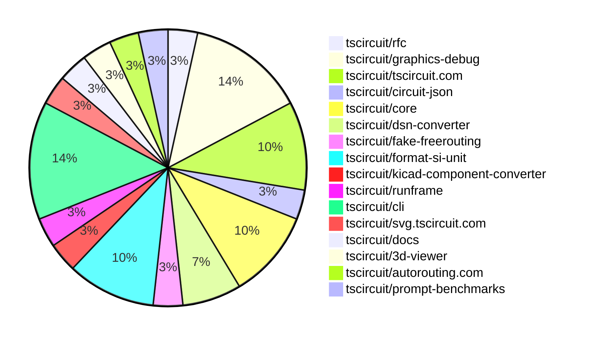

# contribution-tracker

Generates weekly contribution overviews for tscircuit contributors. Check out all
the [contribution overviews here](./contribution-overviews/)

* All PRs in the tscircuit org are scanned/summarized via Claude Haiku
* Claude classifies each Diff/PR as a Major, Minor or Tiny contribution
* All the PRs, summaries, and classifications are organized into charts and tables

The current week is shown below. There are 3 major sections:

* [Contributor Overview](#contributor-overview)
* [PRs by Repository](#prs-by-repository)
* [PRs by Contributor](#changes-by-contributor)

## Current Week

<!-- START_CURRENT_WEEK -->

# Contribution Overview 2025-01-29

## PRs by Repository

## Contributor Overview

| Contributor | 🐳 Major | 🐙 Minor | 🐌 Tiny | ⭐ | Issues Created |
|-------------|---------|---------|---------|-----|----------------|
| [seveibar](#seveibar) | 3 | 0 | 1 | ⭐⭐⭐ | 19 |
| [imrishabh18](#imrishabh18) | 1 | 11 | 0 | ⭐⭐ | 2 |
| [ArnavK-09](#ArnavK-09) | 0 | 4 | 2 | ⭐ | 0 |
| [ShiboSoftwareDev](#ShiboSoftwareDev) | 1 | 0 | 0 | ⭐ | 8 |
| [Anshgrover23](#Anshgrover23) | 0 | 2 | 0 | ⭐ | 2 |
| [Abse2001](#Abse2001) | 1 | 0 | 0 | ⭐ | 0 |
| [kom-senapati](#kom-senapati) | 0 | 2 | 0 | ⭐ | 1 |
| [krushnarout](#krushnarout) | 0 | 1 | 0 |  | 0 |

## Review Table

[reviews-received-hover]: ## "Number of reviews received for PRs for this contributor"
[approvals-received-hover]: ## "Number of approvals received for PRs this contributor authored"
[rejections-received-hover]: ## "Number of rejections received for PRs this contributor authored"
[prs-opened-hover]: ## "Number of PRs opened by this contributor"
[issues-created-hover]: ## "Number of issues created by this contributor"
[bountied-issues-hover]: ## "Number of issues this contributor created with a bounty"
[bountied-issue-$-hover]: ## "Total bounty amount placed on issues authored by this contributor"

| Contributor | Reviews Received | Approvals Received | Rejections Received | Approvals | Rejections | PRs Opened | PRs Merged | Issues Created | Bountied Issues | Bountied Issue $ |
|---|---|---|---|---|---|---|---|---|---|---|
| [seveibar](#seveibar) | 0 | 0 | 0 | 13 | 9 | 4 | 4 | 19 | 18 | 221 |
| [imrishabh18](#imrishabh18) | 1 | 1 | 0 | 2 | 1 | 14 | 12 | 2 | 1 | 5 |
| [Rishikesh63](#Rishikesh63) | 3 | 0 | 3 | 0 | 0 | 1 | 0 | 0 | 0 | 0 |
| [Anshgrover23](#Anshgrover23) | 7 | 2 | 4 | 1 | 4 | 3 | 2 | 2 | 1 | 10 |
| [ArnavK-09](#ArnavK-09) | 23 | 7 | 4 | 0 | 0 | 7 | 6 | 0 | 0 | 0 |
| [DrSensor](#DrSensor) | 0 | 0 | 0 | 0 | 0 | 1 | 0 | 3 | 0 | 0 |
| [ARYPROGRAMMER](#ARYPROGRAMMER) | 1 | 0 | 1 | 0 | 0 | 1 | 0 | 0 | 0 | 0 |
| [MustafaMulla29](#MustafaMulla29) | 2 | 1 | 1 | 0 | 0 | 2 | 0 | 0 | 0 | 0 |
| [ShiboSoftwareDev](#ShiboSoftwareDev) | 1 | 1 | 0 | 0 | 1 | 2 | 1 | 8 | 4 | 27 |
| [Abse2001](#Abse2001) | 1 | 1 | 0 | 0 | 0 | 1 | 1 | 0 | 0 | 0 |
| [krushnarout](#krushnarout) | 3 | 1 | 2 | 0 | 0 | 1 | 1 | 0 | 0 | 0 |
| [kom-senapati](#kom-senapati) | 2 | 2 | 0 | 0 | 0 | 2 | 2 | 1 | 0 | 0 |

## Changes by Repository

### [tscircuit/rfc](https://github.com/tscircuit/rfc)

| PR # | Impact | Contributor | Description |
|------|--------|-------------|-------------|
| [#5](https://github.com/tscircuit/rfc/pull/5) | 🐳 Major | seveibar | This PR introduces a RFC (Request for Comments) document that outlines the vision for the tscircuit v0.1 release, which focuses on enabling modern development practices for commercial electronics development. |

### [tscircuit/graphics-debug](https://github.com/tscircuit/graphics-debug)

| PR # | Impact | Contributor | Description |
|------|--------|-------------|-------------|
| [#19](https://github.com/tscircuit/graphics-debug/pull/19) | 🐳 Major | seveibar | Adds filtering by layer and step, adds x and y coordinates to point tooltip hover, and centers the interactive graphics around the objects. |
| [#18](https://github.com/tscircuit/graphics-debug/pull/18) | 🐳 Major | seveibar | Exports interactive React components, adds React Cosmos, adds more label, step, and layer support. |
| [#16](https://github.com/tscircuit/graphics-debug/pull/16) | 🐙 Minor | Anshgrover23 | Adds a GitHub badge to the landing page and includes an example graphics debug JSON file. |
| [#20](https://github.com/tscircuit/graphics-debug/pull/20) | 🐌 Tiny | seveibar | Fixes the center coordinates of a step in the example data for the interactive2-layer-and-step-filtering fixture. |

### [tscircuit/tscircuit.com](https://github.com/tscircuit/tscircuit.com)

| PR # | Impact | Contributor | Description |
|------|--------|-------------|-------------|
| [#627](https://github.com/tscircuit/tscircuit.com/pull/627) | 🐳 Major | imrishabh18 | Adds a fake-api for the packages, including tests for creating, deleting, and getting packages. |
| [#622](https://github.com/tscircuit/tscircuit.com/pull/622) | 🐙 Minor | imrishabh18 | Encode the search params to fix URL encoding issues. |
| [#624](https://github.com/tscircuit/tscircuit.com/pull/624) | 🐌 Tiny | ArnavK-09 | Updated the external actions used in the "bundle-size-analysis" workflow |

### [tscircuit/circuit-json](https://github.com/tscircuit/circuit-json)

| PR # | Impact | Contributor | Description |
|------|--------|-------------|-------------|
| [#126](https://github.com/tscircuit/circuit-json/pull/126) | 🐙 Minor | imrishabh18 | Fix a bug to handle negative numbers in the `convert-si-unit-to-number.ts` utility function. |

### [tscircuit/core](https://github.com/tscircuit/core)

| PR # | Impact | Contributor | Description |
|------|--------|-------------|-------------|
| [#592](https://github.com/tscircuit/core/pull/592) | 🐙 Minor | imrishabh18 | Update the format-si-unit dependency to version 0.0.3 |
| [#589](https://github.com/tscircuit/core/pull/589) | 🐙 Minor | imrishabh18 | Fix parsing of negative value PCB properties |
| [#588](https://github.com/tscircuit/core/pull/588) | 🐙 Minor | imrishabh18 | Fix the issue where the schematic x and y props were not using the parsed value in mm. |

### [tscircuit/dsn-converter](https://github.com/tscircuit/dsn-converter)

| PR # | Impact | Contributor | Description |
|------|--------|-------------|-------------|
| [#85](https://github.com/tscircuit/dsn-converter/pull/85) | 🐙 Minor | imrishabh18 | The change fixes the calculation of `trace_length` by using the `getTraceLength` function instead of calculating it based on the `width` property. |
| [#84](https://github.com/tscircuit/dsn-converter/pull/84) | 🐙 Minor | imrishabh18 | Adds the `trace_length` property to the `pcb_trace` object in the `dsn-json-to-circuit-json` module. |

### [tscircuit/fake-freerouting](https://github.com/tscircuit/fake-freerouting)

| PR # | Impact | Contributor | Description |
|------|--------|-------------|-------------|
| [#22](https://github.com/tscircuit/fake-freerouting/pull/22) | 🐙 Minor | imrishabh18 | The pull request fixes a issue where source traces with more than 3 connected ports are split into multiple traces to ensure proper handling. |

### [tscircuit/format-si-unit](https://github.com/tscircuit/format-si-unit)

| PR # | Impact | Contributor | Description |
|------|--------|-------------|-------------|
| [#4](https://github.com/tscircuit/format-si-unit/pull/4) | 🐙 Minor | imrishabh18 | Updates GitHub Actions workflow to use Bun instead of npm for installing dependencies and building the project. |
| [#3](https://github.com/tscircuit/format-si-unit/pull/3) | 🐙 Minor | imrishabh18 | Create a GitHub Actions workflow to publish the package to npm |
| [#2](https://github.com/tscircuit/format-si-unit/pull/2) | 🐙 Minor | imrishabh18 | Fixes a bug where the `formatSiUnit` function incorrectly converts 100 microfarads (100uF) to 0.1 instead of 100u. |

### [tscircuit/kicad-component-converter](https://github.com/tscircuit/kicad-component-converter)

| PR # | Impact | Contributor | Description |
|------|--------|-------------|-------------|
| [#118](https://github.com/tscircuit/kicad-component-converter/pull/118) | 🐙 Minor | ArnavK-09 | Fixes a bug where missing `mid` and `stroke` attributes in the `fp_arc_row` data would cause the conversion process to fail. |

### [tscircuit/runframe](https://github.com/tscircuit/runframe)

| PR # | Impact | Contributor | Description |
|------|--------|-------------|-------------|
| [#167](https://github.com/tscircuit/runframe/pull/167) | 🐙 Minor | ArnavK-09 | Fixes an import error message and allows to rerun if any worker error occurs. |

### [tscircuit/cli](https://github.com/tscircuit/cli)

| PR # | Impact | Contributor | Description |
|------|--------|-------------|-------------|
| [#32](https://github.com/tscircuit/cli/pull/32) | 🐙 Minor | ArnavK-09 | Automatically refreshes import types on file update. |
| [#37](https://github.com/tscircuit/cli/pull/37) | 🐙 Minor | krushnarout | The pull request fixes a bug by setting the default port for the development server to 3020. |
| [#45](https://github.com/tscircuit/cli/pull/45) | 🐙 Minor | kom-senapati | Fix issue with endpoint types in the CLI code. |
| [#42](https://github.com/tscircuit/cli/pull/42) | 🐙 Minor | kom-senapati | Fetch the GitHub username from the session token and store it in the CLI config. |

### [tscircuit/svg.tscircuit.com](https://github.com/tscircuit/svg.tscircuit.com)

| PR # | Impact | Contributor | Description |
|------|--------|-------------|-------------|
| [#6](https://github.com/tscircuit/svg.tscircuit.com/pull/6) | 🐙 Minor | ArnavK-09 | Adds an error handling mechanism that generates an SVG with red text when an error occurs during the execution or rendering of the user's code. |

### [tscircuit/docs](https://github.com/tscircuit/docs)

| PR # | Impact | Contributor | Description |
|------|--------|-------------|-------------|
| [#2](https://github.com/tscircuit/docs/pull/2) | 🐌 Tiny | ArnavK-09 |  |

### [tscircuit/3d-viewer](https://github.com/tscircuit/3d-viewer)

| PR # | Impact | Contributor | Description |
|------|--------|-------------|-------------|
| [#141](https://github.com/tscircuit/3d-viewer/pull/141) | 🐙 Minor | Anshgrover23 | Adds a new prop `autoRotateDisabled` to the `CadViewer` and `CadViewerContainer` components to disable the automatic rotation of the 3D viewer. |

### [tscircuit/autorouting.com](https://github.com/tscircuit/autorouting.com)

| PR # | Impact | Contributor | Description |
|------|--------|-------------|-------------|
| [#30](https://github.com/tscircuit/autorouting.com/pull/30) | 🐳 Major | Abse2001 | Introduces a new feature to run the local freerouting autorouter instead of using the remote server. |

### [tscircuit/prompt-benchmarks](https://github.com/tscircuit/prompt-benchmarks)

| PR # | Impact | Contributor | Description |
|------|--------|-------------|-------------|
| [#21](https://github.com/tscircuit/prompt-benchmarks/pull/21) | 🐳 Major | ShiboSoftwareDev | Adds a new set of circuit design problems to the benchmarks-evalite project. |

## Changes by Contributor

### [seveibar](https://github.com/seveibar)

| PR # | Impact | Description |
|------|--------|-------------|
| [#5](https://github.com/tscircuit/rfc/pull/5) | 🐳 Major | This PR introduces a RFC (Request for Comments) document that outlines the vision for the tscircuit v0.1 release, which focuses on enabling modern development practices for commercial electronics development. |
| [#19](https://github.com/tscircuit/graphics-debug/pull/19) | 🐳 Major | Adds filtering by layer and step, adds x and y coordinates to point tooltip hover, and centers the interactive graphics around the objects. |
| [#18](https://github.com/tscircuit/graphics-debug/pull/18) | 🐳 Major | Exports interactive React components, adds React Cosmos, adds more label, step, and layer support. |
| [#20](https://github.com/tscircuit/graphics-debug/pull/20) | 🐌 Tiny | Fixes the center coordinates of a step in the example data for the interactive2-layer-and-step-filtering fixture. |

### [imrishabh18](https://github.com/imrishabh18)

| PR # | Impact | Description |
|------|--------|-------------|
| [#627](https://github.com/tscircuit/tscircuit.com/pull/627) | 🐳 Major | Adds a fake-api for the packages, including tests for creating, deleting, and getting packages. |
| [#126](https://github.com/tscircuit/circuit-json/pull/126) | 🐙 Minor | Fix a bug to handle negative numbers in the `convert-si-unit-to-number.ts` utility function. |
| [#592](https://github.com/tscircuit/core/pull/592) | 🐙 Minor | Update the format-si-unit dependency to version 0.0.3 |
| [#589](https://github.com/tscircuit/core/pull/589) | 🐙 Minor | Fix parsing of negative value PCB properties |
| [#588](https://github.com/tscircuit/core/pull/588) | 🐙 Minor | Fix the issue where the schematic x and y props were not using the parsed value in mm. |
| [#85](https://github.com/tscircuit/dsn-converter/pull/85) | 🐙 Minor | The change fixes the calculation of `trace_length` by using the `getTraceLength` function instead of calculating it based on the `width` property. |
| [#84](https://github.com/tscircuit/dsn-converter/pull/84) | 🐙 Minor | Adds the `trace_length` property to the `pcb_trace` object in the `dsn-json-to-circuit-json` module. |
| [#622](https://github.com/tscircuit/tscircuit.com/pull/622) | 🐙 Minor | Encode the search params to fix URL encoding issues. |
| [#22](https://github.com/tscircuit/fake-freerouting/pull/22) | 🐙 Minor | The pull request fixes a issue where source traces with more than 3 connected ports are split into multiple traces to ensure proper handling. |
| [#4](https://github.com/tscircuit/format-si-unit/pull/4) | 🐙 Minor | Updates GitHub Actions workflow to use Bun instead of npm for installing dependencies and building the project. |
| [#3](https://github.com/tscircuit/format-si-unit/pull/3) | 🐙 Minor | Create a GitHub Actions workflow to publish the package to npm |
| [#2](https://github.com/tscircuit/format-si-unit/pull/2) | 🐙 Minor | Fixes a bug where the `formatSiUnit` function incorrectly converts 100 microfarads (100uF) to 0.1 instead of 100u. |

### [ArnavK-09](https://github.com/ArnavK-09)

| PR # | Impact | Description |
|------|--------|-------------|
| [#118](https://github.com/tscircuit/kicad-component-converter/pull/118) | 🐙 Minor | Fixes a bug where missing `mid` and `stroke` attributes in the `fp_arc_row` data would cause the conversion process to fail. |
| [#167](https://github.com/tscircuit/runframe/pull/167) | 🐙 Minor | Fixes an import error message and allows to rerun if any worker error occurs. |
| [#32](https://github.com/tscircuit/cli/pull/32) | 🐙 Minor | Automatically refreshes import types on file update. |
| [#6](https://github.com/tscircuit/svg.tscircuit.com/pull/6) | 🐙 Minor | Adds an error handling mechanism that generates an SVG with red text when an error occurs during the execution or rendering of the user's code. |
| [#624](https://github.com/tscircuit/tscircuit.com/pull/624) | 🐌 Tiny | Updated the external actions used in the "bundle-size-analysis" workflow |
| [#2](https://github.com/tscircuit/docs/pull/2) | 🐌 Tiny |  |

### [Anshgrover23](https://github.com/Anshgrover23)

| PR # | Impact | Description |
|------|--------|-------------|
| [#141](https://github.com/tscircuit/3d-viewer/pull/141) | 🐙 Minor | Adds a new prop `autoRotateDisabled` to the `CadViewer` and `CadViewerContainer` components to disable the automatic rotation of the 3D viewer. |
| [#16](https://github.com/tscircuit/graphics-debug/pull/16) | 🐙 Minor | Adds a GitHub badge to the landing page and includes an example graphics debug JSON file. |

### [Abse2001](https://github.com/Abse2001)

| PR # | Impact | Description |
|------|--------|-------------|
| [#30](https://github.com/tscircuit/autorouting.com/pull/30) | 🐳 Major | Introduces a new feature to run the local freerouting autorouter instead of using the remote server. |

### [ShiboSoftwareDev](https://github.com/ShiboSoftwareDev)

| PR # | Impact | Description |
|------|--------|-------------|
| [#21](https://github.com/tscircuit/prompt-benchmarks/pull/21) | 🐳 Major | Adds a new set of circuit design problems to the benchmarks-evalite project. |

### [krushnarout](https://github.com/krushnarout)

| PR # | Impact | Description |
|------|--------|-------------|
| [#37](https://github.com/tscircuit/cli/pull/37) | 🐙 Minor | The pull request fixes a bug by setting the default port for the development server to 3020. |

### [kom-senapati](https://github.com/kom-senapati)

| PR # | Impact | Description |
|------|--------|-------------|
| [#45](https://github.com/tscircuit/cli/pull/45) | 🐙 Minor | Fix issue with endpoint types in the CLI code. |
| [#42](https://github.com/tscircuit/cli/pull/42) | 🐙 Minor | Fetch the GitHub username from the session token and store it in the CLI config. |

<!-- END_CURRENT_WEEK -->
