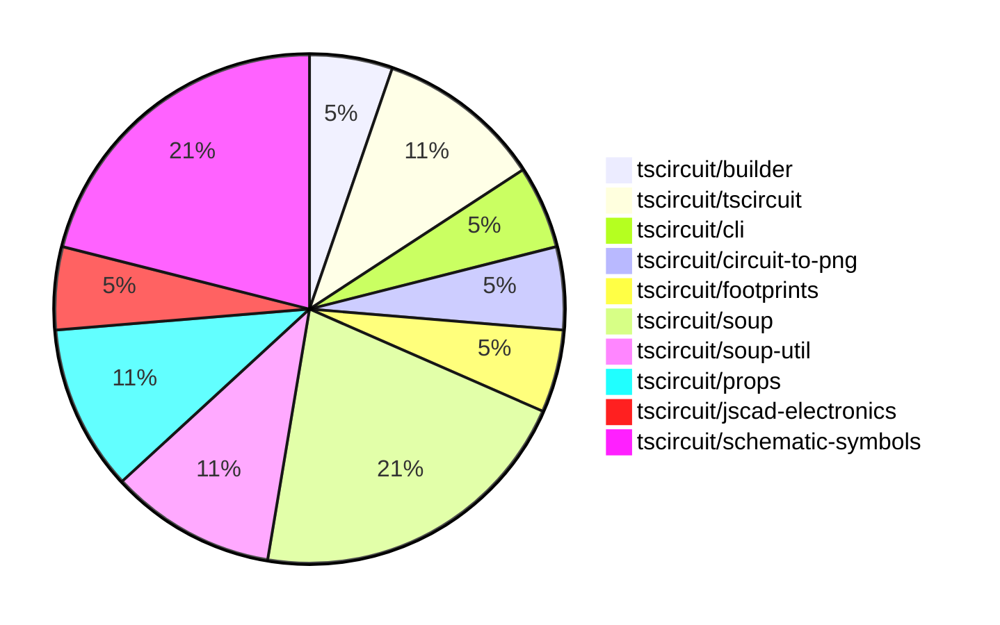

# contribution-tracker

Generates weekly contribution overviews for tscircuit contributors. Check out all
the [contribution overviews here](./contribution-overviews/)

* All PRs in the tscircuit org are scanned/summarized via Claude Haiku
* Claude classifies each Diff/PR as a Major, Minor or Tiny contribution
* All the PRs, summaries, and classifications are organized into charts and tables

The current week is shown below. There are 3 major sections:

* [Contributor Overview](#contributor-overview)
* [PRs by Repository](#prs-by-repository)
* [PRs by Contributor](#changes-by-contributor)

## Current Week

<!-- START_CURRENT_WEEK -->

# Contribution Overview 2024-08-17

## PRs by Repository

## Contributor Overview

| Contributor | 🐳 Major | 🐙 Minor | 🐌 Tiny |
|-------------|-------|-------|-------|
| imrishabh18 | 0 | 4 | 1 |
| seveibar | 8 | 6 | 0 |

## Changes by Repository

### [tscircuit/builder](https://github.com/tscircuit/builder)

| PR # | Impact | Contributor | Description |
|------|--------|-------------|-------------|
| [#103](https://github.com/tscircuit/builder/pull/103) | 🐙 Minor | imrishabh18 | Add "circuit-to-png" as a devDependency |

### [tscircuit/tscircuit](https://github.com/tscircuit/tscircuit)

| PR # | Impact | Contributor | Description |
|------|--------|-------------|-------------|
| [#351](https://github.com/tscircuit/tscircuit/pull/351) | 🐙 Minor | imrishabh18 | Automatically updates the package version by checking for updates daily and creating a pull request with the updated package.json and package-lock.json files. |
| [#349](https://github.com/tscircuit/tscircuit/pull/349) | 🐙 Minor | imrishabh18 | Update the '@tscircuit/builder' dependency from version 1.5.141 to 1.11.1. |

### [tscircuit/cli](https://github.com/tscircuit/cli)

| PR # | Impact | Contributor | Description |
|------|--------|-------------|-------------|
| [#124](https://github.com/tscircuit/cli/pull/124) | 🐙 Minor | imrishabh18 | Add dynamic import for `circuitToPng` function |

### [tscircuit/circuit-to-png](https://github.com/tscircuit/circuit-to-png)

| PR # | Impact | Contributor | Description |
|------|--------|-------------|-------------|
| [#13](https://github.com/tscircuit/circuit-to-png/pull/13) | 🐌 Tiny | imrishabh18 | Removing unused dependency `@resvg/resvg-wasm` from `package.json`. |

### [tscircuit/footprints](https://github.com/tscircuit/footprints)

| PR # | Impact | Contributor | Description |
|------|--------|-------------|-------------|
| [#3](https://github.com/tscircuit/footprints/pull/3) | 🐳 Major | seveibar | This pull request performs a huge repository cleanup, switches to the Bun runtime, fixes type issues, adds various workflows, and resolves a published types error. |

### [tscircuit/soup](https://github.com/tscircuit/soup)

| PR # | Impact | Contributor | Description |
|------|--------|-------------|-------------|
| [#27](https://github.com/tscircuit/soup/pull/27) | 🐳 Major | seveibar | Introduce a new formatbot workflow that has special behavior for forks, only checking without autofix. |
| [#23](https://github.com/tscircuit/soup/pull/23) | 🐙 Minor | seveibar | Add a new property `route_thickness_mode` to the `pcb_trace.ts` file, which can be either "constant" or "interpolated", and a new optional property `should_round_corners`. |
| [#24](https://github.com/tscircuit/soup/pull/24) | 🐙 Minor | seveibar | Add an optional `symbol_name` field to schematic components |
| [#22](https://github.com/tscircuit/soup/pull/22) | 🐙 Minor | seveibar | Add a new field `pcb_board_id` to the `pcb_board` object. |

### [tscircuit/soup-util](https://github.com/tscircuit/soup-util)

| PR # | Impact | Contributor | Description |
|------|--------|-------------|-------------|
| [#7](https://github.com/tscircuit/soup-util/pull/7) | 🐳 Major | seveibar | Add a `delete` method to the `su` library to remove elements from the soup. |
| [#6](https://github.com/tscircuit/soup-util/pull/6) | 🐳 Major | seveibar | Add support for `insert` and `toArray` methods to the `SoupUtilObjects` type. |

### [tscircuit/props](https://github.com/tscircuit/props)

| PR # | Impact | Contributor | Description |
|------|--------|-------------|-------------|
| [#20](https://github.com/tscircuit/props/pull/20) | 🐳 Major | seveibar | Improve published types and add support for port references that use a function |
| [#21](https://github.com/tscircuit/props/pull/21) | 🐙 Minor | seveibar | Avoid parsing `portRef` reference to prevent losing the reference. |

### [tscircuit/jscad-electronics](https://github.com/tscircuit/jscad-electronics)

| PR # | Impact | Contributor | Description |
|------|--------|-------------|-------------|
| [#13](https://github.com/tscircuit/jscad-electronics/pull/13) | 🐳 Major | seveibar | Implement tssop component |

### [tscircuit/schematic-symbols](https://github.com/tscircuit/schematic-symbols)

| PR # | Impact | Contributor | Description |
|------|--------|-------------|-------------|
| [#7](https://github.com/tscircuit/schematic-symbols/pull/7) | 🐳 Major | seveibar | Add format check and type check workflows, and a formatbot to automatically format code on pull requests. |
| [#4](https://github.com/tscircuit/schematic-symbols/pull/4) | 🐳 Major | seveibar | Initial Release |
| [#6](https://github.com/tscircuit/schematic-symbols/pull/6) | 🐙 Minor | seveibar | Add computed fields to the library to make it easier to use symbols. |
| [#5](https://github.com/tscircuit/schematic-symbols/pull/5) | 🐙 Minor | seveibar | Add type exports for various drawing primitives |

## Changes by Contributor

### [imrishabh18](https://github.com/imrishabh18)

| PR # | Impact | Description |
|------|--------|-------------|
| [#103](https://github.com/tscircuit/builder/pull/103) | 🐙 Minor | Add "circuit-to-png" as a devDependency |
| [#351](https://github.com/tscircuit/tscircuit/pull/351) | 🐙 Minor | Automatically updates the package version by checking for updates daily and creating a pull request with the updated package.json and package-lock.json files. |
| [#349](https://github.com/tscircuit/tscircuit/pull/349) | 🐙 Minor | Update the '@tscircuit/builder' dependency from version 1.5.141 to 1.11.1. |
| [#124](https://github.com/tscircuit/cli/pull/124) | 🐙 Minor | Add dynamic import for `circuitToPng` function |
| [#13](https://github.com/tscircuit/circuit-to-png/pull/13) | 🐌 Tiny | Removing unused dependency `@resvg/resvg-wasm` from `package.json`. |

### [seveibar](https://github.com/seveibar)

| PR # | Impact | Description |
|------|--------|-------------|
| [#3](https://github.com/tscircuit/footprints/pull/3) | 🐳 Major | This pull request performs a huge repository cleanup, switches to the Bun runtime, fixes type issues, adds various workflows, and resolves a published types error. |
| [#27](https://github.com/tscircuit/soup/pull/27) | 🐳 Major | Introduce a new formatbot workflow that has special behavior for forks, only checking without autofix. |
| [#7](https://github.com/tscircuit/soup-util/pull/7) | 🐳 Major | Add a `delete` method to the `su` library to remove elements from the soup. |
| [#6](https://github.com/tscircuit/soup-util/pull/6) | 🐳 Major | Add support for `insert` and `toArray` methods to the `SoupUtilObjects` type. |
| [#20](https://github.com/tscircuit/props/pull/20) | 🐳 Major | Improve published types and add support for port references that use a function |
| [#13](https://github.com/tscircuit/jscad-electronics/pull/13) | 🐳 Major | Implement tssop component |
| [#7](https://github.com/tscircuit/schematic-symbols/pull/7) | 🐳 Major | Add format check and type check workflows, and a formatbot to automatically format code on pull requests. |
| [#4](https://github.com/tscircuit/schematic-symbols/pull/4) | 🐳 Major | Initial Release |
| [#23](https://github.com/tscircuit/soup/pull/23) | 🐙 Minor | Add a new property `route_thickness_mode` to the `pcb_trace.ts` file, which can be either "constant" or "interpolated", and a new optional property `should_round_corners`. |
| [#24](https://github.com/tscircuit/soup/pull/24) | 🐙 Minor | Add an optional `symbol_name` field to schematic components |
| [#22](https://github.com/tscircuit/soup/pull/22) | 🐙 Minor | Add a new field `pcb_board_id` to the `pcb_board` object. |
| [#21](https://github.com/tscircuit/props/pull/21) | 🐙 Minor | Avoid parsing `portRef` reference to prevent losing the reference. |
| [#6](https://github.com/tscircuit/schematic-symbols/pull/6) | 🐙 Minor | Add computed fields to the library to make it easier to use symbols. |
| [#5](https://github.com/tscircuit/schematic-symbols/pull/5) | 🐙 Minor | Add type exports for various drawing primitives |

<!-- END_CURRENT_WEEK -->
