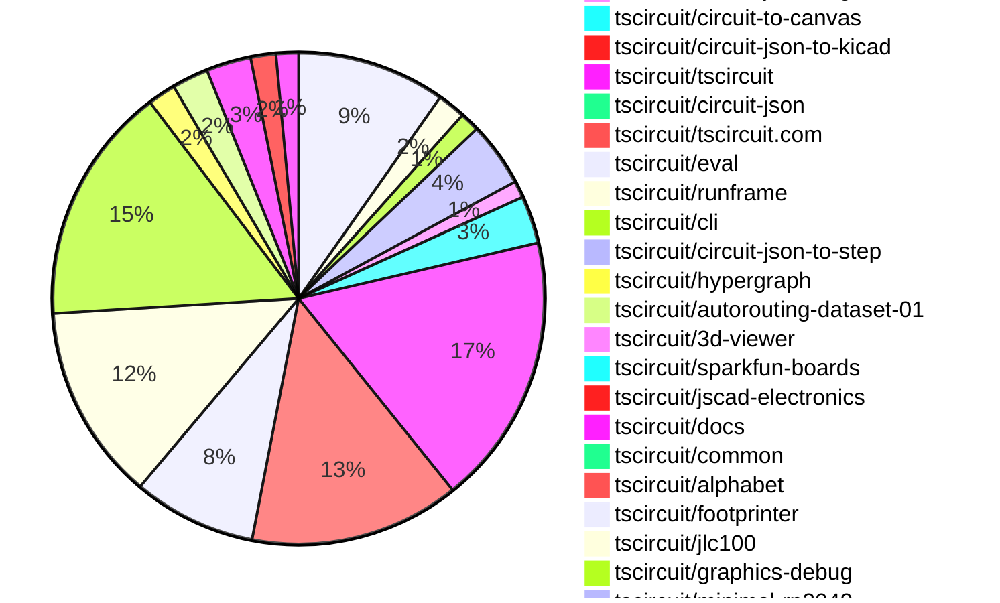

# contribution tracker

[contributions.tscircuit.com](https://contributions.tscircuit.com) ・ [tscircuit.com](https://tscircuit.com) ・ [Contribution Overviews](./contribution-overviews/) ・ [Changelogs](./changelogs/)

Generates weekly contribution overviews for tscircuit contributors. Check out all
the [contribution overviews here](./contribution-overviews/)
You can find AI-generated monthly changelogs in the [changelogs directory](./changelogs/)

- All PRs in the tscircuit org are scanned/summarized via an LLM
- The LLM classifies each Diff/PR as into a set of attributes for scoring
- All the PRs, summaries, and classifications are organized into charts and tables for [the website](https://contributions.tscircuit.com)

> Want to run locally? See the [Development Section](#development)

## Current Week

<!-- START_CURRENT_WEEK -->

# Contribution Overview 2026-02-10

The current week is shown below. There are 3 major sections:

- [Contributor Overview](#contributor-overview)
- [PRs by Repository](#prs-by-repository)
- [PRs by Contributor](#changes-by-contributor)
- [Scoring & Sponsorship Details](/docs/sponsorship-calculation-explanation.md)

## PRs by Repository



## Contributor Overview

| Contributor | 🐳 Major | 🐙 Minor | 🐌 Tiny | ⭐ | Discussion Contributions |
|-------------|---------|---------|---------|-----|--------------------------|
| [seveibar](#seveibar) | 6 | 13 | 12 | 👑 | 0🔹 0🔶 0💎 |
| [imrishabh18](#imrishabh18) | 3 | 11 | 9 | ⭐⭐⭐ | 0🔹 0🔶 0💎 |
| [ShiboSoftwareDev](#ShiboSoftwareDev) | 3 | 4 | 2 | ⭐⭐⭐ | 0🔹 0🔶 0💎 |
| [MustafaMulla29](#MustafaMulla29) | 3 | 6 | 11 | ⭐⭐⭐ | 0🔹 0🔶 0💎 |
| [techmannih](#techmannih) | 2 | 9 | 2 | ⭐⭐⭐ | 0🔹 0🔶 0💎 |
| [rushabhcodes](#rushabhcodes) | 4 | 4 | 4 | ⭐⭐⭐ | 0🔹 0🔶 0💎 |
| [Abse2001](#Abse2001) | 0 | 10 | 2 | ⭐⭐⭐ | 0🔹 0🔶 0💎 |
| [AnasSarkiz](#AnasSarkiz) | 4 | 2 | 8 | ⭐⭐⭐ | 0🔹 0🔶 0💎 |
| [ArnavK-09](#ArnavK-09) | 3 | 8 | 3 | ⭐⭐⭐ | 0🔹 0🔶 0💎 |
| [0hmX](#0hmX) | 4 | 2 | 4 | ⭐⭐ | 0🔹 0🔶 0💎 |
| [tscircuitbot](#tscircuitbot) | 0 | 0 | 413 | ⭐⭐ | 0🔹 0🔶 0💎 |
| [nailoo](#nailoo) | 0 | 4 | 3 | ⭐⭐ | 0🔹 0🔶 0💎 |
| [shehaban](#shehaban) | 0 | 2 | 0 | ⭐ | 0🔹 0🔶 0💎 |
| [Devesh36](#Devesh36) | 0 | 0 | 2 |  | 0🔹 0🔶 0💎 |
| [Heinrich-XIAO](#Heinrich-XIAO) | 0 | 0 | 2 |  | 0🔹 0🔶 0💎 |

> Note: AI evaluates PRs and assigns 1-3 star ratings automatically. 4 and 5 star ratings require manual staff review.

### Discussion Contribution Legend

- 🔹 Normal Comments: Basic participation with minimal effort
- 🔶 Great Informative Comments: Thoughtful participation that adds value
- 💎 Incredible Comments: Exceptional participation with high-quality content

## Review Table

[reviews-received-hover]: ## "Number of reviews received for PRs for this contributor"
[approvals-received-hover]: ## "Number of approvals received for PRs this contributor authored"
[rejections-received-hover]: ## "Number of rejections received for PRs this contributor authored"
[prs-opened-hover]: ## "Number of PRs opened by this contributor"
[issues-created-hover]: ## "Number of issues created by this contributor"

| Contributor | Reviews Received | Approvals Received | Rejections Received | Approvals | Rejections | PRs Opened | PRs Merged | Issues Created |
|---|---|---|---|---|---|---|---|---|
| [techmannih](#techmannih) | 22 | 14 | 1 | 6 | 4 | 17 | 13 | 0 |
| [Abse2001](#Abse2001) | 11 | 11 | 0 | 11 | 1 | 14 | 12 | 0 |
| [tscircuitbot](#tscircuitbot) | 0 | 0 | 0 | 0 | 0 | 459 | 421 | 0 |
| [makaiachildress-web](#makaiachildress-web) | 4 | 0 | 1 | 0 | 0 | 5 | 0 | 0 |
| [rushabhcodes](#rushabhcodes) | 48 | 16 | 6 | 8 | 7 | 18 | 12 | 0 |
| [ShiboSoftwareDev](#ShiboSoftwareDev) | 12 | 9 | 1 | 15 | 0 | 12 | 10 | 0 |
| [nailoo](#nailoo) | 14 | 10 | 1 | 1 | 1 | 9 | 7 | 0 |
| [imrishabh18](#imrishabh18) | 7 | 4 | 0 | 7 | 0 | 26 | 24 | 0 |
| [buildingvibes](#buildingvibes) | 13 | 0 | 2 | 0 | 0 | 25 | 0 | 0 |
| [Godzilla675](#Godzilla675) | 1 | 0 | 0 | 0 | 0 | 1 | 0 | 0 |
| [St34lthcole](#St34lthcole) | 2 | 0 | 0 | 0 | 0 | 7 | 0 | 0 |
| [MustafaMulla29](#MustafaMulla29) | 25 | 17 | 2 | 3 | 2 | 27 | 21 | 0 |
| [seveibar](#seveibar) | 10 | 0 | 0 | 57 | 16 | 35 | 31 | 0 |
| [Heinrich-XIAO](#Heinrich-XIAO) | 9 | 5 | 1 | 0 | 0 | 4 | 2 | 0 |
| [shehaban](#shehaban) | 13 | 7 | 3 | 0 | 0 | 5 | 2 | 0 |
| [janisag07](#janisag07) | 1 | 0 | 0 | 0 | 0 | 7 | 0 | 0 |
| [Harmatta](#Harmatta) | 0 | 0 | 0 | 0 | 0 | 1 | 0 | 0 |
| [Devesh36](#Devesh36) | 11 | 5 | 3 | 2 | 1 | 7 | 2 | 0 |
| [AnasSarkiz](#AnasSarkiz) | 13 | 6 | 3 | 0 | 0 | 16 | 14 | 0 |
| [agent-steven](#agent-steven) | 1 | 0 | 1 | 0 | 0 | 1 | 0 | 0 |
| [ArnavK-09](#ArnavK-09) | 14 | 7 | 1 | 2 | 0 | 15 | 14 | 0 |
| [bamontejano](#bamontejano) | 0 | 0 | 0 | 0 | 0 | 2 | 0 | 0 |
| [Rhan2020](#Rhan2020) | 0 | 0 | 0 | 0 | 0 | 1 | 0 | 0 |
| [blowmuffin](#blowmuffin) | 1 | 1 | 0 | 0 | 0 | 2 | 1 | 0 |
| [0hmX](#0hmX) | 6 | 2 | 0 | 2 | 0 | 13 | 11 | 0 |
| [alibader-alt](#alibader-alt) | 1 | 0 | 1 | 0 | 0 | 1 | 0 | 0 |
| [1234-ad](#1234-ad) | 1 | 0 | 1 | 0 | 0 | 1 | 0 | 0 |
| [omair445](#omair445) | 2 | 0 | 2 | 0 | 0 | 1 | 0 | 0 |
| [xiuqiang1995](#xiuqiang1995) | 1 | 0 | 1 | 0 | 0 | 1 | 0 | 0 |
| [SolariSystems](#SolariSystems) | 1 | 0 | 1 | 0 | 0 | 1 | 0 | 0 |

## Changes by Repository

### [tscircuit/svg.tscircuit.com](https://github.com/tscircuit/svg.tscircuit.com)

| PR # | Impact | Rating | Contributor | Description |
|------|--------|--------|-------------|-------------|
| [#978](https://github.com/tscircuit/svg.tscircuit.com/pull/978) | 🐳 Major | ⭐⭐⭐ | techmannih | Adds tests for PCB courtyard rendering, including support for circles, outlines, and rectangles in SVG format. |
| [#979](https://github.com/tscircuit/svg.tscircuit.com/pull/979) | 🐳 Major | ⭐⭐⭐ | techmannih | Adds support for rendering PCB courtyards in the SVG output by introducing a new parameter to control their visibility. |
| [#991](https://github.com/tscircuit/svg.tscircuit.com/pull/991) | 🐙 Minor | ⭐⭐ | seveibar | Fixes truncated SVG error messages by ensuring that only the leading Error: prefix is removed, preserving meaningful details in error messages containing colons. |
| [#976](https://github.com/tscircuit/svg.tscircuit.com/pull/976) | 🐙 Minor | ⭐⭐ | AnasSarkiz | Adds an end-to-end 3D PNG snapshot test that verifies STEP-based cadmodel support is fully functional in the 3D rendering pipeline. |

<details>
<summary>🐌 Tiny Contributions (49)</summary>

| PR # | Impact | Contributor | Description |
|------|--------|-------------|-------------|
| [#1019](https://github.com/tscircuit/svg.tscircuit.com/pull/1019) | 🐌 Tiny | tscircuitbot | Updates the tscircuit package version from 0.0.1329 to 0.0.1330 in package.json |
| [#1023](https://github.com/tscircuit/svg.tscircuit.com/pull/1023) | 🐌 Tiny | tscircuitbot | Updates the tscircuit package version from 0.0.1333 to 0.0.1334 in package.json |
| [#1022](https://github.com/tscircuit/svg.tscircuit.com/pull/1022) | 🐌 Tiny | tscircuitbot | Updates the tscircuit package version from 0.0.1332 to 0.0.1333 in package.json |
| [#1024](https://github.com/tscircuit/svg.tscircuit.com/pull/1024) | 🐌 Tiny | tscircuitbot | Updates the tscircuit package from version 0.0.1334 to 0.0.1335 in package.json |
| [#1018](https://github.com/tscircuit/svg.tscircuit.com/pull/1018) | 🐌 Tiny | tscircuitbot | Updates the tscircuit package version from 0.0.1328 to 0.0.1329 in package.json |
| [#1021](https://github.com/tscircuit/svg.tscircuit.com/pull/1021) | 🐌 Tiny | tscircuitbot | Updates the tscircuit package version from 0.0.1330 to 0.0.1332 in package.json |
| [#1017](https://github.com/tscircuit/svg.tscircuit.com/pull/1017) | 🐌 Tiny | tscircuitbot | Updates the tscircuit package version from 0.0.1327 to 0.0.1328 in package.json |
| [#1016](https://github.com/tscircuit/svg.tscircuit.com/pull/1016) | 🐌 Tiny | tscircuitbot | Automated package update |
| [#1015](https://github.com/tscircuit/svg.tscircuit.com/pull/1015) | 🐌 Tiny | tscircuitbot | Updates the tscircuit package version from 0.0.1325 to 0.0.1326 in package.json |
| [#1013](https://github.com/tscircuit/svg.tscircuit.com/pull/1013) | 🐌 Tiny | tscircuitbot | Updates the tscircuit package from version 0.0.1322 to 0.0.1323 in package.json |
| [#1011](https://github.com/tscircuit/svg.tscircuit.com/pull/1011) | 🐌 Tiny | tscircuitbot | Updates the tscircuit package version from 0.0.1320 to 0.0.1321 in package.json |
| [#1012](https://github.com/tscircuit/svg.tscircuit.com/pull/1012) | 🐌 Tiny | tscircuitbot | Updates the tscircuit package version from 0.0.1321 to 0.0.1322 in package.json |
| [#1014](https://github.com/tscircuit/svg.tscircuit.com/pull/1014) | 🐌 Tiny | tscircuitbot | Updates the tscircuit package version from 0.0.1323 to 0.0.1325 in package.json |
| [#1005](https://github.com/tscircuit/svg.tscircuit.com/pull/1005) | 🐌 Tiny | tscircuitbot | Updates the tscircuit package version from 0.0.1314 to 0.0.1315 in package.json |
| [#1010](https://github.com/tscircuit/svg.tscircuit.com/pull/1010) | 🐌 Tiny | tscircuitbot | Updates the tscircuit package version from 0.0.1319 to 0.0.1320 in package.json |
| [#1007](https://github.com/tscircuit/svg.tscircuit.com/pull/1007) | 🐌 Tiny | tscircuitbot | Updates the tscircuit package version from 0.0.1316 to 0.0.1317 in package.json |
| [#1006](https://github.com/tscircuit/svg.tscircuit.com/pull/1006) | 🐌 Tiny | tscircuitbot | Updates the tscircuit package version from 0.0.1315 to 0.0.1316 in package.json |
| [#1009](https://github.com/tscircuit/svg.tscircuit.com/pull/1009) | 🐌 Tiny | tscircuitbot | Updates the tscircuit package version from 0.0.1318 to 0.0.1319 in package.json |
| [#1008](https://github.com/tscircuit/svg.tscircuit.com/pull/1008) | 🐌 Tiny | tscircuitbot | Updates the tscircuit package version from 0.0.1317 to 0.0.1318 in package.json |
| [#998](https://github.com/tscircuit/svg.tscircuit.com/pull/998) | 🐌 Tiny | tscircuitbot | Updates the tscircuit package from version 0.0.1307 to 0.0.1308 in package.json |
| [#1003](https://github.com/tscircuit/svg.tscircuit.com/pull/1003) | 🐌 Tiny | tscircuitbot | Updates the tscircuit package version from 0.0.1312 to 0.0.1313 in package.json |
| [#1004](https://github.com/tscircuit/svg.tscircuit.com/pull/1004) | 🐌 Tiny | tscircuitbot | Updates the tscircuit package version from 0.0.1313 to 0.0.1314 in package.json |
| [#1001](https://github.com/tscircuit/svg.tscircuit.com/pull/1001) | 🐌 Tiny | tscircuitbot | Updates the tscircuit package version from 0.0.1310 to 0.0.1311 in package.json |
| [#1000](https://github.com/tscircuit/svg.tscircuit.com/pull/1000) | 🐌 Tiny | tscircuitbot | Updates the tscircuit package version from 0.0.1309 to 0.0.1310 in package.json |
| [#999](https://github.com/tscircuit/svg.tscircuit.com/pull/999) | 🐌 Tiny | tscircuitbot | Updates the tscircuit package version from 0.0.1308 to 0.0.1309 in package.json |
| [#1002](https://github.com/tscircuit/svg.tscircuit.com/pull/1002) | 🐌 Tiny | tscircuitbot | Updates the tscircuit package version from 0.0.1311 to 0.0.1312 in package.json |
| [#986](https://github.com/tscircuit/svg.tscircuit.com/pull/986) | 🐌 Tiny | tscircuitbot | Updates the tscircuit package version from 0.0.1296 to 0.0.1297 in package.json |
| [#995](https://github.com/tscircuit/svg.tscircuit.com/pull/995) | 🐌 Tiny | tscircuitbot | Updates the tscircuit package version from 0.0.1304 to 0.0.1305 in package.json |
| [#988](https://github.com/tscircuit/svg.tscircuit.com/pull/988) | 🐌 Tiny | tscircuitbot | Automated package update |
| [#985](https://github.com/tscircuit/svg.tscircuit.com/pull/985) | 🐌 Tiny | tscircuitbot | Updates the tscircuit package version from 0.0.1295 to 0.0.1296 in package.json |
| [#992](https://github.com/tscircuit/svg.tscircuit.com/pull/992) | 🐌 Tiny | tscircuitbot | Updates the tscircuit package version from 0.0.1301 to 0.0.1302 in package.json |
| [#990](https://github.com/tscircuit/svg.tscircuit.com/pull/990) | 🐌 Tiny | tscircuitbot | Updates the tscircuit package version from 0.0.1300 to 0.0.1301 in package.json |
| [#994](https://github.com/tscircuit/svg.tscircuit.com/pull/994) | 🐌 Tiny | tscircuitbot | Updates the tscircuit package version from 0.0.1303 to 0.0.1304 in package.json |
| [#989](https://github.com/tscircuit/svg.tscircuit.com/pull/989) | 🐌 Tiny | tscircuitbot | Updates the tscircuit package version from 0.0.1299 to 0.0.1300 in package.json |
| [#997](https://github.com/tscircuit/svg.tscircuit.com/pull/997) | 🐌 Tiny | tscircuitbot | Updates the tscircuit package version from 0.0.1306 to 0.0.1307 in package.json |
| [#996](https://github.com/tscircuit/svg.tscircuit.com/pull/996) | 🐌 Tiny | tscircuitbot | Updates the tscircuit package version from 0.0.1305 to 0.0.1306 in package.json |
| [#993](https://github.com/tscircuit/svg.tscircuit.com/pull/993) | 🐌 Tiny | tscircuitbot | Updates the tscircuit package from version 0.0.1302 to 0.0.1303 in package.json |
| [#987](https://github.com/tscircuit/svg.tscircuit.com/pull/987) | 🐌 Tiny | tscircuitbot | Updates the tscircuit package version from 0.0.1297 to 0.0.1298 in package.json |
| [#983](https://github.com/tscircuit/svg.tscircuit.com/pull/983) | 🐌 Tiny | tscircuitbot | Updates the tscircuit package version from 0.0.1293 to 0.0.1294 in package.json |
| [#984](https://github.com/tscircuit/svg.tscircuit.com/pull/984) | 🐌 Tiny | tscircuitbot | Updates the tscircuit package version from 0.0.1294 to 0.0.1295 in package.json |
| [#982](https://github.com/tscircuit/svg.tscircuit.com/pull/982) | 🐌 Tiny | tscircuitbot | Updates the tscircuit package from version 0.0.1292 to 0.0.1293 in package.json |
| [#980](https://github.com/tscircuit/svg.tscircuit.com/pull/980) | 🐌 Tiny | tscircuitbot | Updates the tscircuit package version from 0.0.1290 to 0.0.1291 in package.json |
| [#981](https://github.com/tscircuit/svg.tscircuit.com/pull/981) | 🐌 Tiny | tscircuitbot | Updates the tscircuit package version from 0.0.1291 to 0.0.1292 in package.json |
| [#971](https://github.com/tscircuit/svg.tscircuit.com/pull/971) | 🐌 Tiny | tscircuitbot | Updates the tscircuit package version from 0.0.1284 to 0.0.1285 in package.json |
| [#975](https://github.com/tscircuit/svg.tscircuit.com/pull/975) | 🐌 Tiny | tscircuitbot | Updates the tscircuit package version from 0.0.1288 to 0.0.1289 in package.json |
| [#974](https://github.com/tscircuit/svg.tscircuit.com/pull/974) | 🐌 Tiny | tscircuitbot | Updates the tscircuit package version from 0.0.1287 to 0.0.1288 in package.json |
| [#977](https://github.com/tscircuit/svg.tscircuit.com/pull/977) | 🐌 Tiny | tscircuitbot | Updates the tscircuit package version from 0.0.1289 to 0.0.1290 in package.json |
| [#973](https://github.com/tscircuit/svg.tscircuit.com/pull/973) | 🐌 Tiny | tscircuitbot | Updates the tscircuit package version from 0.0.1286 to 0.0.1287 in package.json |
| [#972](https://github.com/tscircuit/svg.tscircuit.com/pull/972) | 🐌 Tiny | tscircuitbot | Updates the tscircuit package version from 0.0.1285 to 0.0.1286 in package.json |

</details>

### [tscircuit/pcb-viewer](https://github.com/tscircuit/pcb-viewer)

| PR # | Impact | Rating | Contributor | Description |
|------|--------|--------|-------------|-------------|
| [#657](https://github.com/tscircuit/pcb-viewer/pull/657) | 🐳 Major | ⭐⭐⭐ | rushabhcodes | Adds a copy-to-clipboard feature for error messages in the ToolbarOverlay component and improves code organization by using unique error IDs for rendering. |
| [#666](https://github.com/tscircuit/pcb-viewer/pull/666) | 🐙 Minor | ⭐⭐ | techmannih | Adds support for rendering pcb_courtyard_outline elements in the PCB viewer. |
| [#664](https://github.com/tscircuit/pcb-viewer/pull/664) | 🐙 Minor | ⭐⭐ | Abse2001 | Adds explicit selection for top or bottom soldermask rendering in the canvas, allowing users to control which soldermask layer is displayed. |
| [#661](https://github.com/tscircuit/pcb-viewer/pull/661) | 🐙 Minor | ⭐⭐ | Abse2001 | Refactors the PCB layer rendering process by simplifying the soldermask pipeline, fixing the layer order, and enhancing support for multi-board layouts. |
| [#659](https://github.com/tscircuit/pcb-viewer/pull/659) | 🐙 Minor | ⭐⭐ | nailoo | Fixes rendering errors in the ErrorOverlay component when DRC errors are not displayed. |

<details>
<summary>🐌 Tiny Contributions (5)</summary>

| PR # | Impact | Contributor | Description |
|------|--------|-------------|-------------|
| [#667](https://github.com/tscircuit/pcb-viewer/pull/667) | 🐌 Tiny | tscircuitbot | Automated package update |
| [#663](https://github.com/tscircuit/pcb-viewer/pull/663) | 🐌 Tiny | tscircuitbot | Automated package update |
| [#665](https://github.com/tscircuit/pcb-viewer/pull/665) | 🐌 Tiny | tscircuitbot | Automated package update |
| [#662](https://github.com/tscircuit/pcb-viewer/pull/662) | 🐌 Tiny | tscircuitbot | Automated package update |
| [#660](https://github.com/tscircuit/pcb-viewer/pull/660) | 🐌 Tiny | tscircuitbot | Automated package update |

</details>

### [tscircuit/props](https://github.com/tscircuit/props)

| PR # | Impact | Rating | Contributor | Description |
|------|--------|--------|-------------|-------------|
| [#594](https://github.com/tscircuit/props/pull/594) | 🐙 Minor | ⭐⭐ | techmannih | Adds an optional property showAsTranslucent to the CAD model schema and interface, allowing models to be rendered with translucency. |
| [#596](https://github.com/tscircuit/props/pull/596) | 🐙 Minor | ⭐⭐ | imrishabh18 | Adds a connections property to the potentiometer component, allowing for enhanced connection management. |
| [#591](https://github.com/tscircuit/props/pull/591) | 🐙 Minor | ⭐⭐ | seveibar | Adds an allowOffBoard property to components to enable them to hang off the board, preventing DRC errors for components like USB ports or displays. |
| [#593](https://github.com/tscircuit/props/pull/593) | 🐙 Minor | ⭐⭐ | shehaban | Moves the portProps definition from core to tscircuitprops and extends the schema with additional layout and schematic-related properties. |

<details>
<summary>🐌 Tiny Contributions (3)</summary>

| PR # | Impact | Contributor | Description |
|------|--------|-------------|-------------|
| [#595](https://github.com/tscircuit/props/pull/595) | 🐌 Tiny | techmannih | Renames the property showAsTranslucent to showAsTranslucentModel in the CadModelBase interface and updates related tests accordingly |
| [#589](https://github.com/tscircuit/props/pull/589) | 🐌 Tiny | seveibar | Allows mountedboard  to accept a curated subset of chip-style props (footprint-related and common chip metadata) so mounted modules can carry pin labels, part numbers, and schematic pin arrangements. |
| [#590](https://github.com/tscircuit/props/pull/590) | 🐌 Tiny | seveibar | Add an optional schStemLength: number property to portProps in libcomponentsport.ts to control the visual stem length of port  in schematics. |

</details>

### [tscircuit/core](https://github.com/tscircuit/core)

| PR # | Impact | Rating | Contributor | Description |
|------|--------|--------|-------------|-------------|
| [#1937](https://github.com/tscircuit/core/pull/1937) | 🐳 Major | ⭐⭐⭐ | imrishabh18 | Fixes the issue where groups with explicit positioning disable auto layout for other unpositioned children in the schematic tree. |
| [#1928](https://github.com/tscircuit/core/pull/1928) | 🐳 Major | ⭐⭐⭐ | seveibar | Adds support for relative positioning of components on the PCB using calculated expressions based on other components positions. |
| [#1943](https://github.com/tscircuit/core/pull/1943) | 🐳 Major | ⭐⭐⭐ | ShiboSoftwareDev | Adds caching functionality for isolated subcircuits to improve rendering efficiency by reusing previously rendered circuit JSON based on prop hashes. |
| [#1919](https://github.com/tscircuit/core/pull/1919) | 🐳 Major | ⭐⭐⭐ | ShiboSoftwareDev | Creates database records for DRC connectivity by establishing internal connections between pins in the NormalComponent class. |
| [#1942](https://github.com/tscircuit/core/pull/1942) | 🐙 Minor | ⭐⭐ | techmannih | Adds support for the showAsTranslucentModel property in the CadModel component, allowing for translucent rendering of CAD models in the circuit. |
| [#1934](https://github.com/tscircuit/core/pull/1934) | 🐙 Minor | ⭐⭐ | techmannih | Adds a new property allowOffBoard to the chip component, allowing chips to be placed off the board without triggering DRC errors. |
| [#1944](https://github.com/tscircuit/core/pull/1944) | 🐙 Minor | ⭐⭐ | imrishabh18 | Fixes a bug where the explicit position of schematictext  causes the entire group to switch to relative layout, affecting layout behavior. |
| [#1939](https://github.com/tscircuit/core/pull/1939) | 🐙 Minor | ⭐⭐ | seveibar | Changes lowercase bound identifiers in calc expressions to camelCase for consistency and resolves mismatches in PCB placement calculations. |
| [#1929](https://github.com/tscircuit/core/pull/1929) | 🐙 Minor | ⭐⭐ | seveibar | Adds support for calculating PCB positions based on the positions of pins from referenced components, allowing for more dynamic placement of components on the PCB. |
| [#1931](https://github.com/tscircuit/core/pull/1931) | 🐙 Minor | ⭐⭐ | seveibar | Fixes support for pcbLeftEdgeX and other edge positioning properties in the NormalComponent class, ensuring proper error handling and calculations for PCB layout. |
| [#1935](https://github.com/tscircuit/core/pull/1935) | 🐙 Minor | ⭐⭐ | seveibar | Fixes incorrect positioning of pcb note dimensions that reference components via selector when components are positioned using calc-based edge anchors, ensuring accurate rendering after PCB layout. |
| [#1936](https://github.com/tscircuit/core/pull/1936) | 🐙 Minor | ⭐⭐ | seveibar | Fixes circular dependencies in the calculation of component placements in PCB layout. |
| [#1924](https://github.com/tscircuit/core/pull/1924) | 🐙 Minor | ⭐⭐ | seveibar | Adds support for configuring jumper types in the autorouter, allowing for more flexible routing options. |
| [#1920](https://github.com/tscircuit/core/pull/1920) | 🐙 Minor | ⭐⭐ | seveibar | Fixes errors caused by premature evaluation of pcbXpcbY calculations for chips before they are attached to a board, ensuring correct placement and avoiding creation errors. |
| [#1926](https://github.com/tscircuit/core/pull/1926) | 🐙 Minor | ⭐⭐ | ShiboSoftwareDev | Adds support for simulating an operational amplifier with a half-wave rectifier circuit using ngspice, including a comprehensive test for validation. |
| [#1925](https://github.com/tscircuit/core/pull/1925) | 🐙 Minor | ⭐⭐ | ShiboSoftwareDev | Refactors the rendering process of isolated subcircuits to utilize a synchronous runRenderCycle method, improving the handling of render phases and eliminating reliance on asynchronous effects. |
| [#1921](https://github.com/tscircuit/core/pull/1921) | 🐙 Minor | ⭐⭐ | ShiboSoftwareDev | Adds isolated rendering functionality for subcircuits, allowing them to render independently with caching enabled. |
| [#1938](https://github.com/tscircuit/core/pull/1938) | 🐙 Minor | ⭐⭐ | MustafaMulla29 | Adds support for schStemLength in Port component to define the length of the schematic line from the port to the component body. |
| [#1918](https://github.com/tscircuit/core/pull/1918) | 🐙 Minor | ⭐⭐ | MustafaMulla29 | Adds a new MountedBoard component that integrates with the existing Board component and manages PCB board entries for mounted configurations. |
| [#1922](https://github.com/tscircuit/core/pull/1922) | 🐙 Minor | ⭐⭐ | MustafaMulla29 | Modifies the _getBoard() function to recognize both Board and MountedBoard components, ensuring that components inside MountedBoard are associated correctly with it instead of the parent carrier board. |

<details>
<summary>🐌 Tiny Contributions (3)</summary>

| PR # | Impact | Contributor | Description |
|------|--------|-------------|-------------|
| [#1948](https://github.com/tscircuit/core/pull/1948) | 🐌 Tiny | imrishabh18 | Updates the version of the circuit-json-to-gltf dependency from 0.0.65 to 0.0.68 in package.json |
| [#1947](https://github.com/tscircuit/core/pull/1947) | 🐌 Tiny | seveibar | Updates error messages in the PCB port connection checks to provide more specific information about unconnected ports. |
| [#1940](https://github.com/tscircuit/core/pull/1940) | 🐌 Tiny | AnasSarkiz | Updates the circuit-json-to-gltf dependency to version 0.0.65 to support the step loader functionality. |

</details>

### [tscircuit/checks](https://github.com/tscircuit/checks)

| PR # | Impact | Rating | Contributor | Description |
|------|--------|--------|-------------|-------------|
| [#95](https://github.com/tscircuit/checks/pull/95) | 🐳 Major | ⭐⭐⭐ | seveibar | User-facing DRC messages now avoid exposing internal circuit-json IDs and provide actionable guidance for layout issues, enhancing clarity and usability for end users. |
| [#96](https://github.com/tscircuit/checks/pull/96) | 🐙 Minor | ⭐⭐ | techmannih | Allows PCB components to be explicitly marked as allowed off-board, bypassing out-of-board checks during validation. |
| [#97](https://github.com/tscircuit/checks/pull/97) | 🐙 Minor | ⭐⭐ | seveibar | Updates error messages for PCB port connectivity to use human-readable names derived from source components and ports instead of generic labels. |

### [tscircuit/schematic-symbols](https://github.com/tscircuit/schematic-symbols)

| PR # | Impact | Rating | Contributor | Description |
|------|--------|--------|-------------|-------------|
| [#398](https://github.com/tscircuit/schematic-symbols/pull/398) | 🐙 Minor | ⭐⭐ | techmannih | Fixes text anchor positions for REF and VAL labels in the polarized capacitor symbol to ensure correct rendering. |
| [#393](https://github.com/tscircuit/schematic-symbols/pull/393) | 🐙 Minor | ⭐⭐ | nailoo | Refines the coordinates and bounding box of the solderjumper2_bridged12 symbol for improved accuracy in schematic representation. |
| [#394](https://github.com/tscircuit/schematic-symbols/pull/394) | 🐙 Minor | ⭐⭐ | nailoo | Adjusts the coordinates of the solderjumper3_bridged12 symbol to correct its placement in the schematic. |
| [#392](https://github.com/tscircuit/schematic-symbols/pull/392) | 🐙 Minor | ⭐⭐ | nailoo | Adjusts the geometry of the solderjumper2 symbol and regenerates its representation in the schematic. |
| [#389](https://github.com/tscircuit/schematic-symbols/pull/389) | 🐙 Minor | ⭐⭐ | shehaban | Fixes visual bug where Op-Amp symbols were rendered with gaps between the component body and its leads by refining path coordinates in generated JSON assets. |

### [tscircuit/circuit-json-to-gltf](https://github.com/tscircuit/circuit-json-to-gltf)

| PR # | Impact | Rating | Contributor | Description |
|------|--------|--------|-------------|-------------|
| [#122](https://github.com/tscircuit/circuit-json-to-gltf/pull/122) | 🐙 Minor | ⭐⭐ | techmannih | Adds a test for rendering translucent CAD models in GLTF format, ensuring correct visual output. |
| [#117](https://github.com/tscircuit/circuit-json-to-gltf/pull/117) | 🐙 Minor | ⭐⭐ | rushabhcodes | Adds support for rendering a faux board when a circuit JSON lacks a pcb_board or pcb_panel entry, ensuring 3D scenes and GLTF exports always include a board-like geometry. |
| [#123](https://github.com/tscircuit/circuit-json-to-gltf/pull/123) | 🐙 Minor | ⭐⭐ | imrishabh18 | Changes the parameters for resolving the download endpoint to use projectBaseUrl and authHeaders instead of platformConfig. |
| [#121](https://github.com/tscircuit/circuit-json-to-gltf/pull/121) | 🐙 Minor | ⭐⭐ | imrishabh18 | Adds support for resolving relative paths for model URLs by utilizing a platform configuration object, enhancing the flexibility of model loading in various environments. |
| [#115](https://github.com/tscircuit/circuit-json-to-gltf/pull/115) | 🐙 Minor | ⭐⭐ | AnasSarkiz | Add a STEP file loader using occt-import-js to tessellate STEP geometry into triangle meshes and wire model_step_url through the full 3D conversion pipeline. |

<details>
<summary>🐌 Tiny Contributions (1)</summary>

| PR # | Impact | Contributor | Description |
|------|--------|-------------|-------------|
| [#124](https://github.com/tscircuit/circuit-json-to-gltf/pull/124) | 🐌 Tiny | imrishabh18 | Removes console.log statements from the fetchAsArrayBuffer and loadSTEP functions to clean up the codebase and improve performance. |

</details>

### [tscircuit/circuit-to-canvas](https://github.com/tscircuit/circuit-to-canvas)

| PR # | Impact | Rating | Contributor | Description |
|------|--------|--------|-------------|-------------|
| [#180](https://github.com/tscircuit/circuit-to-canvas/pull/180) | 🐙 Minor | ⭐⭐ | techmannih | Refactors the drawing of PCB silkscreen text by consolidating mirroring and knockout background logic into a shared drawText utility, improving code maintainability and functionality. |
| [#166](https://github.com/tscircuit/circuit-to-canvas/pull/166) | 🐙 Minor | ⭐⭐ | techmannih | Adds functionality to draw PCB courtyard outlines in the canvas rendering of circuit designs. |
| [#176](https://github.com/tscircuit/circuit-to-canvas/pull/176) | 🐙 Minor | ⭐⭐ | Abse2001 | Enables rendering of soldermask layers for PCB panels with proper cutouts and layer control, enhancing the visual representation of PCB designs. |
| [#178](https://github.com/tscircuit/circuit-to-canvas/pull/178) | 🐙 Minor | ⭐⭐ | Abse2001 | Refactors soldermask cutout and hole logic to centralize mask subtraction and eliminate dependency on ColorMap. |
| [#174](https://github.com/tscircuit/circuit-to-canvas/pull/174) | 🐙 Minor | ⭐⭐ | Abse2001 | Renders copper pours above board material and adds color options for copper pours in the drawing context. |
| [#172](https://github.com/tscircuit/circuit-to-canvas/pull/172) | 🐙 Minor | ⭐⭐ | Abse2001 | Adds full rendering support for soldermask over copper pours in PCB designs, allowing for accurate visual representation of soldermask layers in the canvas rendering. |
| [#167](https://github.com/tscircuit/circuit-to-canvas/pull/167) | 🐙 Minor | ⭐⭐ | Abse2001 | Adds a rendering mode for the bottom soldermask layer with explicit control over top and bottom soldermask visibility in the drawing options. |
| [#163](https://github.com/tscircuit/circuit-to-canvas/pull/163) | 🐙 Minor | ⭐⭐ | Abse2001 | Rewrites the PCB soldermask rendering pipeline to use true compositing semantics instead of color-overdraw simulation, allowing for accurate geometric openings and improved rendering order. |

<details>
<summary>🐌 Tiny Contributions (9)</summary>

| PR # | Impact | Contributor | Description |
|------|--------|-------------|-------------|
| [#181](https://github.com/tscircuit/circuit-to-canvas/pull/181) | 🐌 Tiny | tscircuitbot | Automated package update |
| [#177](https://github.com/tscircuit/circuit-to-canvas/pull/177) | 🐌 Tiny | tscircuitbot | Automated package update |
| [#179](https://github.com/tscircuit/circuit-to-canvas/pull/179) | 🐌 Tiny | tscircuitbot | Automated package update |
| [#173](https://github.com/tscircuit/circuit-to-canvas/pull/173) | 🐌 Tiny | tscircuitbot | Updates the package version from 0.0.75 to 0.0.76 in package.json |
| [#175](https://github.com/tscircuit/circuit-to-canvas/pull/175) | 🐌 Tiny | tscircuitbot | Automated package update |
| [#168](https://github.com/tscircuit/circuit-to-canvas/pull/168) | 🐌 Tiny | tscircuitbot | Automated package update |
| [#171](https://github.com/tscircuit/circuit-to-canvas/pull/171) | 🐌 Tiny | tscircuitbot | Automated package update |
| [#164](https://github.com/tscircuit/circuit-to-canvas/pull/164) | 🐌 Tiny | tscircuitbot | Automated package update |
| [#169](https://github.com/tscircuit/circuit-to-canvas/pull/169) | 🐌 Tiny | Abse2001 | Fixes typos in the drawSoldermaskTop and drawSoldermaskBottom options in the CircuitToCanvasDrawer interface and related tests. |

</details>

### [tscircuit/circuit-json-to-kicad](https://github.com/tscircuit/circuit-json-to-kicad)

| PR # | Impact | Rating | Contributor | Description |
|------|--------|--------|-------------|-------------|
| [#134](https://github.com/tscircuit/circuit-json-to-kicad/pull/134) | 🐙 Minor | ⭐⭐ | MustafaMulla29 | Adds support for applying kicadFootprintMetadata and kicadSymbolMetadata to enhance the generation of KiCad projects with component-specific metadata. |

<details>
<summary>🐌 Tiny Contributions (3)</summary>

| PR # | Impact | Contributor | Description |
|------|--------|-------------|-------------|
| [#132](https://github.com/tscircuit/circuit-json-to-kicad/pull/132) | 🐌 Tiny | techmannih | Add a test case for custom symbol pins in schematic conversion to ensure proper handling of schematic components and their connections. |
| [#135](https://github.com/tscircuit/circuit-json-to-kicad/pull/135) | 🐌 Tiny | tscircuitbot | Automated package update |
| [#133](https://github.com/tscircuit/circuit-json-to-kicad/pull/133) | 🐌 Tiny | tscircuitbot | Automated package update |

</details>

### [tscircuit/tscircuit](https://github.com/tscircuit/tscircuit)


<details>
<summary>🐌 Tiny Contributions (97)</summary>

| PR # | Impact | Contributor | Description |
|------|--------|-------------|-------------|
| [#2259](https://github.com/tscircuit/tscircuit/pull/2259) | 🐌 Tiny | tscircuitbot | Automated package update |
| [#2261](https://github.com/tscircuit/tscircuit/pull/2261) | 🐌 Tiny | tscircuitbot | Updates the tscircuitcli package to version 0.1.945 in package.json |
| [#2253](https://github.com/tscircuit/tscircuit/pull/2253) | 🐌 Tiny | tscircuitbot | Automated package update |
| [#2260](https://github.com/tscircuit/tscircuit/pull/2260) | 🐌 Tiny | tscircuitbot | Updates the package version from 0.0.1333 to 0.0.1334 in package.json |
| [#2254](https://github.com/tscircuit/tscircuit/pull/2254) | 🐌 Tiny | tscircuitbot | Automated package update |
| [#2250](https://github.com/tscircuit/tscircuit/pull/2250) | 🐌 Tiny | tscircuitbot | Automated package update |
| [#2252](https://github.com/tscircuit/tscircuit/pull/2252) | 🐌 Tiny | tscircuitbot | Automated package update |
| [#2255](https://github.com/tscircuit/tscircuit/pull/2255) | 🐌 Tiny | tscircuitbot | Automated package update |
| [#2257](https://github.com/tscircuit/tscircuit/pull/2257) | 🐌 Tiny | tscircuitbot | Updates the tscircuitcli package to version 0.1.943 in package.json |
| [#2262](https://github.com/tscircuit/tscircuit/pull/2262) | 🐌 Tiny | tscircuitbot | Updates the package version from 0.0.1334 to 0.0.1335 in package.json |
| [#2258](https://github.com/tscircuit/tscircuit/pull/2258) | 🐌 Tiny | tscircuitbot | Automated package update |
| [#2256](https://github.com/tscircuit/tscircuit/pull/2256) | 🐌 Tiny | tscircuitbot | Automated package update |
| [#2249](https://github.com/tscircuit/tscircuit/pull/2249) | 🐌 Tiny | tscircuitbot | Automated package update |
| [#2248](https://github.com/tscircuit/tscircuit/pull/2248) | 🐌 Tiny | tscircuitbot | Automated package update |
| [#2247](https://github.com/tscircuit/tscircuit/pull/2247) | 🐌 Tiny | tscircuitbot | Automated package update |
| [#2245](https://github.com/tscircuit/tscircuit/pull/2245) | 🐌 Tiny | tscircuitbot | Automated package update |
| [#2244](https://github.com/tscircuit/tscircuit/pull/2244) | 🐌 Tiny | tscircuitbot | Updates the version of the circuit-json-to-gltf package from 0.0.66 to 0.0.65 in package.json |
| [#2243](https://github.com/tscircuit/tscircuit/pull/2243) | 🐌 Tiny | tscircuitbot | Automated package update |
| [#2242](https://github.com/tscircuit/tscircuit/pull/2242) | 🐌 Tiny | tscircuitbot | Automated package update |
| [#2234](https://github.com/tscircuit/tscircuit/pull/2234) | 🐌 Tiny | tscircuitbot | Updates the tscircuitcli package from version 0.1.936 to 0.1.937 and the tscircuitrunframe package from version 0.0.1620 to 0.0.1621 in package.json |
| [#2238](https://github.com/tscircuit/tscircuit/pull/2238) | 🐌 Tiny | tscircuitbot | Automated package update |
| [#2232](https://github.com/tscircuit/tscircuit/pull/2232) | 🐌 Tiny | tscircuitbot | Updates the version of several packages including tscircuitcli, tscircuitcore, tscircuiteval, tscircuitprops, and tscircuitrunframe in package.json |
| [#2237](https://github.com/tscircuit/tscircuit/pull/2237) | 🐌 Tiny | tscircuitbot | Automated package update |
| [#2235](https://github.com/tscircuit/tscircuit/pull/2235) | 🐌 Tiny | tscircuitbot | Updates the package version from 0.0.1322 to 0.0.1323 in package.json |
| [#2230](https://github.com/tscircuit/tscircuit/pull/2230) | 🐌 Tiny | tscircuitbot | Automated package update |
| [#2239](https://github.com/tscircuit/tscircuit/pull/2239) | 🐌 Tiny | tscircuitbot | Automated package update |
| [#2233](https://github.com/tscircuit/tscircuit/pull/2233) | 🐌 Tiny | tscircuitbot | Automated package update |
| [#2231](https://github.com/tscircuit/tscircuit/pull/2231) | 🐌 Tiny | tscircuitbot | Automated package update |
| [#2224](https://github.com/tscircuit/tscircuit/pull/2224) | 🐌 Tiny | tscircuitbot | Updates the tscircuitcli package from version 0.1.931 to 0.1.932 and the tscircuitrunframe package from version 0.0.1616 to 0.0.1617 in package.json |
| [#2217](https://github.com/tscircuit/tscircuit/pull/2217) | 🐌 Tiny | tscircuitbot | Automated package update |
| [#2221](https://github.com/tscircuit/tscircuit/pull/2221) | 🐌 Tiny | tscircuitbot | Updates the package version from 0.0.1315 to 0.0.1316 in package.json |
| [#2220](https://github.com/tscircuit/tscircuit/pull/2220) | 🐌 Tiny | tscircuitbot | Updates the tscircuitcli package version from 0.1.929 to 0.1.930 |
| [#2225](https://github.com/tscircuit/tscircuit/pull/2225) | 🐌 Tiny | tscircuitbot | Automated package update |
| [#2229](https://github.com/tscircuit/tscircuit/pull/2229) | 🐌 Tiny | tscircuitbot | Updates the package version from 0.0.1319 to 0.0.1320 in package.json |
| [#2222](https://github.com/tscircuit/tscircuit/pull/2222) | 🐌 Tiny | tscircuitbot | Updates the tscircuitcli package from version 0.1.930 to 0.1.931 |
| [#2227](https://github.com/tscircuit/tscircuit/pull/2227) | 🐌 Tiny | tscircuitbot | Updates the package version from 0.0.1318 to 0.0.1319 in package.json |
| [#2226](https://github.com/tscircuit/tscircuit/pull/2226) | 🐌 Tiny | tscircuitbot | Updates the tscircuitcli package to version 0.1.933 in the package.json file |
| [#2223](https://github.com/tscircuit/tscircuit/pull/2223) | 🐌 Tiny | tscircuitbot | Automated package update |
| [#2228](https://github.com/tscircuit/tscircuit/pull/2228) | 🐌 Tiny | tscircuitbot | Automated package update |
| [#2218](https://github.com/tscircuit/tscircuit/pull/2218) | 🐌 Tiny | tscircuitbot | Automated package update |
| [#2207](https://github.com/tscircuit/tscircuit/pull/2207) | 🐌 Tiny | tscircuitbot | Automated package update |
| [#2215](https://github.com/tscircuit/tscircuit/pull/2215) | 🐌 Tiny | tscircuitbot | Automated package update |
| [#2204](https://github.com/tscircuit/tscircuit/pull/2204) | 🐌 Tiny | tscircuitbot | Automated package update |
| [#2212](https://github.com/tscircuit/tscircuit/pull/2212) | 🐌 Tiny | tscircuitbot | Automated package update |
| [#2216](https://github.com/tscircuit/tscircuit/pull/2216) | 🐌 Tiny | tscircuitbot | Automated package update |
| [#2214](https://github.com/tscircuit/tscircuit/pull/2214) | 🐌 Tiny | tscircuitbot | Automated package update |
| [#2213](https://github.com/tscircuit/tscircuit/pull/2213) | 🐌 Tiny | tscircuitbot | Automated package update |
| [#2202](https://github.com/tscircuit/tscircuit/pull/2202) | 🐌 Tiny | tscircuitbot | Automated package update |
| [#2205](https://github.com/tscircuit/tscircuit/pull/2205) | 🐌 Tiny | tscircuitbot | Automated package update |
| [#2210](https://github.com/tscircuit/tscircuit/pull/2210) | 🐌 Tiny | tscircuitbot | Updates the tscircuitcli package to version 0.1.926 in the package.json file |
| [#2209](https://github.com/tscircuit/tscircuit/pull/2209) | 🐌 Tiny | tscircuitbot | Automated package update |
| [#2208](https://github.com/tscircuit/tscircuit/pull/2208) | 🐌 Tiny | tscircuitbot | Automated package update |
| [#2203](https://github.com/tscircuit/tscircuit/pull/2203) | 🐌 Tiny | tscircuitbot | Automated package update |
| [#2206](https://github.com/tscircuit/tscircuit/pull/2206) | 🐌 Tiny | tscircuitbot | Updates the tscircuitcli package from version 0.1.924 to 0.1.925 and the tscircuitrunframe package from version 0.0.1610 to 0.0.1611 in package.json |
| [#2195](https://github.com/tscircuit/tscircuit/pull/2195) | 🐌 Tiny | tscircuitbot | Updates the package version from 0.0.1303 to 0.0.1304 in package.json |
| [#2198](https://github.com/tscircuit/tscircuit/pull/2198) | 🐌 Tiny | tscircuitbot | Updates the tscircuitcli package from version 0.1.920 to 0.1.921 and the tscircuitrunframe package from version 0.0.1606 to 0.0.1607 in package.json |
| [#2188](https://github.com/tscircuit/tscircuit/pull/2188) | 🐌 Tiny | tscircuitbot | Automated package update |
| [#2200](https://github.com/tscircuit/tscircuit/pull/2200) | 🐌 Tiny | tscircuitbot | Automated package update |
| [#2197](https://github.com/tscircuit/tscircuit/pull/2197) | 🐌 Tiny | tscircuitbot | Updates the package version from 0.0.1304 to 0.0.1305 in package.json |
| [#2194](https://github.com/tscircuit/tscircuit/pull/2194) | 🐌 Tiny | tscircuitbot | Updates the tscircuitcli package from version 0.1.918 to 0.1.919 and the tscircuitrunframe package from version 0.0.1604 to 0.0.1605 in the package.json file. |
| [#2196](https://github.com/tscircuit/tscircuit/pull/2196) | 🐌 Tiny | tscircuitbot | Automated package update |
| [#2187](https://github.com/tscircuit/tscircuit/pull/2187) | 🐌 Tiny | tscircuitbot | Automated package update |
| [#2180](https://github.com/tscircuit/tscircuit/pull/2180) | 🐌 Tiny | tscircuitbot | Automated package update |
| [#2178](https://github.com/tscircuit/tscircuit/pull/2178) | 🐌 Tiny | tscircuitbot | Automated package update |
| [#2189](https://github.com/tscircuit/tscircuit/pull/2189) | 🐌 Tiny | tscircuitbot | Updates the package version from 0.0.1300 to 0.0.1301 in package.json |
| [#2192](https://github.com/tscircuit/tscircuit/pull/2192) | 🐌 Tiny | tscircuitbot | Automated package update |
| [#2184](https://github.com/tscircuit/tscircuit/pull/2184) | 🐌 Tiny | tscircuitbot | Automated package update |
| [#2199](https://github.com/tscircuit/tscircuit/pull/2199) | 🐌 Tiny | tscircuitbot | Updates the package version from 0.0.1305 to 0.0.1306 in package.json |
| [#2191](https://github.com/tscircuit/tscircuit/pull/2191) | 🐌 Tiny | tscircuitbot | Automated package update |
| [#2190](https://github.com/tscircuit/tscircuit/pull/2190) | 🐌 Tiny | tscircuitbot | Updates the versions of several dependencies in the package.json file, including tscircuitcli, tscircuitcore, and tscircuiteval. |
| [#2186](https://github.com/tscircuit/tscircuit/pull/2186) | 🐌 Tiny | tscircuitbot | Automated package update |
| [#2179](https://github.com/tscircuit/tscircuit/pull/2179) | 🐌 Tiny | tscircuitbot | Automated package update |
| [#2193](https://github.com/tscircuit/tscircuit/pull/2193) | 🐌 Tiny | tscircuitbot | Automated package update |
| [#2201](https://github.com/tscircuit/tscircuit/pull/2201) | 🐌 Tiny | tscircuitbot | Automated package update |
| [#2185](https://github.com/tscircuit/tscircuit/pull/2185) | 🐌 Tiny | tscircuitbot | Updates the package version from 0.0.1298 to 0.0.1299 in package.json |
| [#2183](https://github.com/tscircuit/tscircuit/pull/2183) | 🐌 Tiny | tscircuitbot | Automated package update |
| [#2181](https://github.com/tscircuit/tscircuit/pull/2181) | 🐌 Tiny | tscircuitbot | Automated package update |
| [#2182](https://github.com/tscircuit/tscircuit/pull/2182) | 🐌 Tiny | tscircuitbot | Updates the tscircuitcli package to version 0.1.913 |
| [#2172](https://github.com/tscircuit/tscircuit/pull/2172) | 🐌 Tiny | tscircuitbot | Updates the tscircuitcli package from version 0.1.909 to 0.1.910 |
| [#2175](https://github.com/tscircuit/tscircuit/pull/2175) | 🐌 Tiny | tscircuitbot | Updates the tscircuitcli package from version 0.1.910 to 0.1.911 |
| [#2166](https://github.com/tscircuit/tscircuit/pull/2166) | 🐌 Tiny | tscircuitbot | Automated package update |
| [#2169](https://github.com/tscircuit/tscircuit/pull/2169) | 🐌 Tiny | tscircuitbot | Automated package update |
| [#2167](https://github.com/tscircuit/tscircuit/pull/2167) | 🐌 Tiny | tscircuitbot | Automated package update |
| [#2171](https://github.com/tscircuit/tscircuit/pull/2171) | 🐌 Tiny | tscircuitbot | Updates the package version from 0.0.1292 to 0.0.1293 in package.json |
| [#2170](https://github.com/tscircuit/tscircuit/pull/2170) | 🐌 Tiny | tscircuitbot | Automated package update |
| [#2176](https://github.com/tscircuit/tscircuit/pull/2176) | 🐌 Tiny | tscircuitbot | Automated package update |
| [#2173](https://github.com/tscircuit/tscircuit/pull/2173) | 🐌 Tiny | tscircuitbot | Automated package update |
| [#2168](https://github.com/tscircuit/tscircuit/pull/2168) | 🐌 Tiny | tscircuitbot | Updates the tscircuitcli package from version 0.1.907 to 0.1.908 and the tscircuitrunframe package from version 0.0.1595 to 0.0.1596. |
| [#2157](https://github.com/tscircuit/tscircuit/pull/2157) | 🐌 Tiny | tscircuitbot | Updates the tscircuitcli package from version 0.1.902 to 0.1.903 and the tscircuitrunframe package from version 0.0.1590 to 0.0.1591 in package.json |
| [#2159](https://github.com/tscircuit/tscircuit/pull/2159) | 🐌 Tiny | tscircuitbot | Automated package update |
| [#2165](https://github.com/tscircuit/tscircuit/pull/2165) | 🐌 Tiny | tscircuitbot | Automated package update |
| [#2158](https://github.com/tscircuit/tscircuit/pull/2158) | 🐌 Tiny | tscircuitbot | Automated package update |
| [#2161](https://github.com/tscircuit/tscircuit/pull/2161) | 🐌 Tiny | tscircuitbot | Automated package update |
| [#2156](https://github.com/tscircuit/tscircuit/pull/2156) | 🐌 Tiny | tscircuitbot | Automated package update |
| [#2251](https://github.com/tscircuit/tscircuit/pull/2251) | 🐌 Tiny | imrishabh18 | Updates the version of the circuit-json-to-gltf dependency from 0.0.65 to 0.0.67 in package.json |
| [#2241](https://github.com/tscircuit/tscircuit/pull/2241) | 🐌 Tiny | imrishabh18 | Updates the circuit-json-to-gltf dependency version from 0.0.65 to 0.0.66 in package.json |
| [#2236](https://github.com/tscircuit/tscircuit/pull/2236) | 🐌 Tiny | imrishabh18 | Updates the schematic-symbols dependency from version 0.0.208 to 0.0.215 in package.json |

</details>

### [tscircuit/circuit-json](https://github.com/tscircuit/circuit-json)

| PR # | Impact | Rating | Contributor | Description |
|------|--------|--------|-------------|-------------|
| [#469](https://github.com/tscircuit/circuit-json/pull/469) | 🐳 Major | ⭐⭐⭐ | seveibar | Adds a new model_asset field to the CAD component to simplify asset references, along with a new asset schema for validation. |
| [#464](https://github.com/tscircuit/circuit-json/pull/464) | 🐙 Minor | ⭐⭐ | seveibar | Adds an optional is_allowed_to_be_off_board field to the pcb_component schema and TypeScript interface, allowing components to indicate they may be placed off the PCB. |

<details>
<summary>🐌 Tiny Contributions (3)</summary>

| PR # | Impact | Contributor | Description |
|------|--------|-------------|-------------|
| [#468](https://github.com/tscircuit/circuit-json/pull/468) | 🐌 Tiny | tscircuitbot | Automated package update |
| [#465](https://github.com/tscircuit/circuit-json/pull/465) | 🐌 Tiny | tscircuitbot | Automated package update |
| [#467](https://github.com/tscircuit/circuit-json/pull/467) | 🐌 Tiny | seveibar | Removes incorrect documentation of most_frequently_referenced_by_name from SourceComponentBase and retains it in SourcePort, ensuring accurate schema representation and adding tests for its functionality. |

</details>

### [tscircuit/tscircuit.com](https://github.com/tscircuit/tscircuit.com)

| PR # | Impact | Rating | Contributor | Description |
|------|--------|--------|-------------|-------------|
| [#2707](https://github.com/tscircuit/tscircuit.com/pull/2707) | 🐳 Major | ⭐⭐⭐ | seveibar | Adds an analog simulation image and code example to the landing page, enhancing user guidance for analog simulations. |
| [#2727](https://github.com/tscircuit/tscircuit.com/pull/2727) | 🐳 Major | ⭐⭐⭐ | ArnavK-09 | Adds a component to display a list of circuit errors on the build page, allowing users to view and manage errors related to their circuit builds. |
| [#2721](https://github.com/tscircuit/tscircuit.com/pull/2721) | 🐳 Major | ⭐⭐⭐ | ArnavK-09 | Adds interactive breadcrumbs to the files view for improved directory navigation, allowing users to easily navigate back through directory levels. |
| [#2719](https://github.com/tscircuit/tscircuit.com/pull/2719) | 🐳 Major | ⭐⭐⭐ | ArnavK-09 | Changes the UI to implement organization search functionality instead of account search, updating related components and queries accordingly. |
| [#2702](https://github.com/tscircuit/tscircuit.com/pull/2702) | 🐙 Minor | ⭐⭐ | imrishabh18 | Modifies the file path to include dist when searching for files in external packages. |
| [#2698](https://github.com/tscircuit/tscircuit.com/pull/2698) | 🐙 Minor | ⭐⭐ | imrishabh18 | Normalizes CAD asset URLs in circuit JSON to correctly fetch assets from the package registry instead of treating them as same-package files. |
| [#2766](https://github.com/tscircuit/tscircuit.com/pull/2766) | 🐙 Minor | ⭐⭐ | ArnavK-09 | Adds a new handler for redirecting avatar requests based on username, returning the corresponding avatar URL if available. |
| [#2740](https://github.com/tscircuit/tscircuit.com/pull/2740) | 🐙 Minor | ⭐⭐ | ArnavK-09 | Fixes rendering issue by removing unnecessary condition for circuit file loading in BuildCircuitErrors component |
| [#2720](https://github.com/tscircuit/tscircuit.com/pull/2720) | 🐙 Minor | ⭐⭐ | ArnavK-09 | Replaces the manual check for the existence of circuit.json with a hook that determines if the circuit JSON is found and loading status. |
| [#2717](https://github.com/tscircuit/tscircuit.com/pull/2717) | 🐙 Minor | ⭐⭐ | ArnavK-09 | Modifies the organization search API to remove user permission checks and streamline the response structure. |

<details>
<summary>🐌 Tiny Contributions (65)</summary>

| PR # | Impact | Contributor | Description |
|------|--------|-------------|-------------|
| [#2782](https://github.com/tscircuit/tscircuit.com/pull/2782) | 🐌 Tiny | tscircuitbot | Updates the tscircuitrunframe package from version 0.0.1625 to 0.0.1626 |
| [#2780](https://github.com/tscircuit/tscircuit.com/pull/2780) | 🐌 Tiny | tscircuitbot | Automated package update |
| [#2779](https://github.com/tscircuit/tscircuit.com/pull/2779) | 🐌 Tiny | tscircuitbot | Updates the version of the tscircuitrunframe package from 0.0.1623 to 0.0.1624 and the tscircuitpcb-viewer package from 1.11.339 to 1.11.340 in package.json |
| [#2781](https://github.com/tscircuit/tscircuit.com/pull/2781) | 🐌 Tiny | tscircuitbot | Updates the tscircuitrunframe package from version 0.0.1624 to 0.0.1625 |
| [#2778](https://github.com/tscircuit/tscircuit.com/pull/2778) | 🐌 Tiny | tscircuitbot | Updates the tscircuitrunframe package from version 0.0.1622 to 0.0.1623 |
| [#2777](https://github.com/tscircuit/tscircuit.com/pull/2777) | 🐌 Tiny | tscircuitbot | Updates the tscircuiteval package to version 0.0.647 in the package.json file. |
| [#2770](https://github.com/tscircuit/tscircuit.com/pull/2770) | 🐌 Tiny | tscircuitbot | Updates the tscircuitrunframe package from version 0.0.1618 to 0.0.1619 |
| [#2769](https://github.com/tscircuit/tscircuit.com/pull/2769) | 🐌 Tiny | tscircuitbot | Automated package update |
| [#2771](https://github.com/tscircuit/tscircuit.com/pull/2771) | 🐌 Tiny | tscircuitbot | Updates the tscircuiteval package from version 0.0.644 to 0.0.645 |
| [#2776](https://github.com/tscircuit/tscircuit.com/pull/2776) | 🐌 Tiny | tscircuitbot | Updates the tscircuitrunframe package to version 0.0.1622 |
| [#2772](https://github.com/tscircuit/tscircuit.com/pull/2772) | 🐌 Tiny | tscircuitbot | Updates the tscircuitrunframe package to version 0.0.1620 |
| [#2773](https://github.com/tscircuit/tscircuit.com/pull/2773) | 🐌 Tiny | tscircuitbot | Updates the tscircuitrunframe package from version 0.0.1620 to 0.0.1621 |
| [#2775](https://github.com/tscircuit/tscircuit.com/pull/2775) | 🐌 Tiny | tscircuitbot | Automated package update |
| [#2763](https://github.com/tscircuit/tscircuit.com/pull/2763) | 🐌 Tiny | tscircuitbot | Updates the tscircuitrunframe package from version 0.0.1615 to 0.0.1616 |
| [#2765](https://github.com/tscircuit/tscircuit.com/pull/2765) | 🐌 Tiny | tscircuitbot | Updates the tscircuitrunframe package from version 0.0.1616 to 0.0.1617 |
| [#2768](https://github.com/tscircuit/tscircuit.com/pull/2768) | 🐌 Tiny | tscircuitbot | Automated package update |
| [#2751](https://github.com/tscircuit/tscircuit.com/pull/2751) | 🐌 Tiny | tscircuitbot | Updates the tscircuiteval package from version 0.0.639 to 0.0.640 |
| [#2757](https://github.com/tscircuit/tscircuit.com/pull/2757) | 🐌 Tiny | tscircuitbot | Updates the tscircuitrunframe package from version 0.0.1611 to 0.0.1612 |
| [#2759](https://github.com/tscircuit/tscircuit.com/pull/2759) | 🐌 Tiny | tscircuitbot | Updates the tscircuitrunframe package from version 0.0.1612 to 0.0.1613 |
| [#2755](https://github.com/tscircuit/tscircuit.com/pull/2755) | 🐌 Tiny | tscircuitbot | Updates the tscircuitrunframe package from version 0.0.1610 to 0.0.1611 |
| [#2754](https://github.com/tscircuit/tscircuit.com/pull/2754) | 🐌 Tiny | tscircuitbot | Updates the tscircuitrunframe package from version 0.0.1609 to 0.0.1610 |
| [#2752](https://github.com/tscircuit/tscircuit.com/pull/2752) | 🐌 Tiny | tscircuitbot | Updates the tscircuitrunframe package from version 0.0.1608 to 0.0.1609 |
| [#2753](https://github.com/tscircuit/tscircuit.com/pull/2753) | 🐌 Tiny | tscircuitbot | Updates the tscircuiteval package to version 0.0.641 in the package.json file |
| [#2761](https://github.com/tscircuit/tscircuit.com/pull/2761) | 🐌 Tiny | tscircuitbot | Automated package update |
| [#2760](https://github.com/tscircuit/tscircuit.com/pull/2760) | 🐌 Tiny | tscircuitbot | Automated package update |
| [#2758](https://github.com/tscircuit/tscircuit.com/pull/2758) | 🐌 Tiny | tscircuitbot | Automated package update |
| [#2756](https://github.com/tscircuit/tscircuit.com/pull/2756) | 🐌 Tiny | tscircuitbot | Automated package update |
| [#2742](https://github.com/tscircuit/tscircuit.com/pull/2742) | 🐌 Tiny | tscircuitbot | Updates the tscircuitrunframe package from version 0.0.1602 to 0.0.1603 |
| [#2737](https://github.com/tscircuit/tscircuit.com/pull/2737) | 🐌 Tiny | tscircuitbot | Updates the tscircuitrunframe package from version 0.0.1600 to 0.0.1601 |
| [#2735](https://github.com/tscircuit/tscircuit.com/pull/2735) | 🐌 Tiny | tscircuitbot | Updates the tscircuitrunframe package version from 0.0.1597 to 0.0.1600 in package.json |
| [#2750](https://github.com/tscircuit/tscircuit.com/pull/2750) | 🐌 Tiny | tscircuitbot | Updates the version of the tscircuitrunframe package from 0.0.1607 to 0.0.1608 in package.json |
| [#2741](https://github.com/tscircuit/tscircuit.com/pull/2741) | 🐌 Tiny | tscircuitbot | Automated package update |
| [#2739](https://github.com/tscircuit/tscircuit.com/pull/2739) | 🐌 Tiny | tscircuitbot | Updates the tscircuitrunframe package from version 0.0.1601 to 0.0.1602 |
| [#2731](https://github.com/tscircuit/tscircuit.com/pull/2731) | 🐌 Tiny | tscircuitbot | Automated package update |
| [#2729](https://github.com/tscircuit/tscircuit.com/pull/2729) | 🐌 Tiny | tscircuitbot | Automated package update |
| [#2734](https://github.com/tscircuit/tscircuit.com/pull/2734) | 🐌 Tiny | tscircuitbot | Automated package update |
| [#2746](https://github.com/tscircuit/tscircuit.com/pull/2746) | 🐌 Tiny | tscircuitbot | Updates the tscircuiteval package version from 0.0.638 to 0.0.639 in package.json |
| [#2747](https://github.com/tscircuit/tscircuit.com/pull/2747) | 🐌 Tiny | tscircuitbot | Updates the tscircuitrunframe package from version 0.0.1605 to 0.0.1606 |
| [#2736](https://github.com/tscircuit/tscircuit.com/pull/2736) | 🐌 Tiny | tscircuitbot | Automated package update |
| [#2749](https://github.com/tscircuit/tscircuit.com/pull/2749) | 🐌 Tiny | tscircuitbot | Automated package update |
| [#2738](https://github.com/tscircuit/tscircuit.com/pull/2738) | 🐌 Tiny | tscircuitbot | Updates the tscircuiteval package from version 0.0.635 to 0.0.636 |
| [#2744](https://github.com/tscircuit/tscircuit.com/pull/2744) | 🐌 Tiny | tscircuitbot | Updates the tscircuiteval package from version 0.0.637 to 0.0.638 |
| [#2745](https://github.com/tscircuit/tscircuit.com/pull/2745) | 🐌 Tiny | tscircuitbot | Automated package update |
| [#2726](https://github.com/tscircuit/tscircuit.com/pull/2726) | 🐌 Tiny | tscircuitbot | Updates the tscircuitrunframe package from version 0.0.1596 to 0.0.1597 |
| [#2725](https://github.com/tscircuit/tscircuit.com/pull/2725) | 🐌 Tiny | tscircuitbot | Updates the tscircuiteval package from version 0.0.630 to 0.0.631 |
| [#2715](https://github.com/tscircuit/tscircuit.com/pull/2715) | 🐌 Tiny | tscircuitbot | Automated package update |
| [#2723](https://github.com/tscircuit/tscircuit.com/pull/2723) | 🐌 Tiny | tscircuitbot | Updates the tscircuitrunframe package from version 0.0.1595 to 0.0.1596 |
| [#2714](https://github.com/tscircuit/tscircuit.com/pull/2714) | 🐌 Tiny | tscircuitbot | Updates the tscircuiteval package to version 0.0.629 in package.json |
| [#2718](https://github.com/tscircuit/tscircuit.com/pull/2718) | 🐌 Tiny | tscircuitbot | Automated package update to version 0.0.195 |
| [#2724](https://github.com/tscircuit/tscircuit.com/pull/2724) | 🐌 Tiny | tscircuitbot | Automated package update |
| [#2704](https://github.com/tscircuit/tscircuit.com/pull/2704) | 🐌 Tiny | tscircuitbot | Automated package update |
| [#2711](https://github.com/tscircuit/tscircuit.com/pull/2711) | 🐌 Tiny | tscircuitbot | Automated package update |
| [#2712](https://github.com/tscircuit/tscircuit.com/pull/2712) | 🐌 Tiny | tscircuitbot | Updates the tscircuitrunframe package from version 0.0.1593 to 0.0.1594 |
| [#2708](https://github.com/tscircuit/tscircuit.com/pull/2708) | 🐌 Tiny | tscircuitbot | Automated package update |
| [#2709](https://github.com/tscircuit/tscircuit.com/pull/2709) | 🐌 Tiny | tscircuitbot | Updates the tscircuitrunframe package from version 0.0.1592 to 0.0.1593 |
| [#2703](https://github.com/tscircuit/tscircuit.com/pull/2703) | 🐌 Tiny | tscircuitbot | Automated package update |
| [#2713](https://github.com/tscircuit/tscircuit.com/pull/2713) | 🐌 Tiny | imrishabh18 | Changes the log display to show stderr messages in red color for better visibility. |
| [#2706](https://github.com/tscircuit/tscircuit.com/pull/2706) | 🐌 Tiny | seveibar | Add KiCad image and fix optimized image to support PNGs |
| [#2705](https://github.com/tscircuit/tscircuit.com/pull/2705) | 🐌 Tiny | ShiboSoftwareDev | Updates the version of the circuit-json-to-gerber dependency from 0.0.46 to 0.0.47 in package.json |
| [#2767](https://github.com/tscircuit/tscircuit.com/pull/2767) | 🐌 Tiny | ArnavK-09 | Changes the avatar image source in the OrgCard component to a new URL format based on the organization handle. |
| [#2722](https://github.com/tscircuit/tscircuit.com/pull/2722) | 🐌 Tiny | ArnavK-09 | Makes the Analog Simulation section responsive by preventing its code block from overflowing on mobile. |
| [#2716](https://github.com/tscircuit/tscircuit.com/pull/2716) | 🐌 Tiny | ArnavK-09 | Removes a CSS transform property from the ReleaseDeploymentDetails component, potentially improving layout consistency. |
| [#2762](https://github.com/tscircuit/tscircuit.com/pull/2762) | 🐌 Tiny | Devesh36 | This pull request makes minor UI improvements to the KicadPcmCommand component and the sidebar releases section, focusing on visual consistency and alignment. The changes adjust class names and element structure to improve layout and styling. |
| [#2733](https://github.com/tscircuit/tscircuit.com/pull/2733) | 🐌 Tiny | Heinrich-XIAO | Fixes a duplicated trace issue by replacing the second instance of VBUS1 with VBUS2 in the USB-C LED flashlight template. |
| [#2732](https://github.com/tscircuit/tscircuit.com/pull/2732) | 🐌 Tiny | Heinrich-XIAO | Fixes the USB-C template by correcting power connections and component references in the schematic. |

</details>

### [tscircuit/eval](https://github.com/tscircuit/eval)

| PR # | Impact | Rating | Contributor | Description |
|------|--------|--------|-------------|-------------|
| [#2026](https://github.com/tscircuit/eval/pull/2026) | 🐙 Minor | ⭐⭐ | imrishabh18 | Removes the filesystem cache functionality and its associated wrapper from the parts engine, simplifying the caching mechanism to use a local cache engine instead. |

<details>
<summary>🐌 Tiny Contributions (43)</summary>

| PR # | Impact | Contributor | Description |
|------|--------|-------------|-------------|
| [#2072](https://github.com/tscircuit/eval/pull/2072) | 🐌 Tiny | tscircuitbot | Automated package update |
| [#2071](https://github.com/tscircuit/eval/pull/2071) | 🐌 Tiny | tscircuitbot | Updates the versions of the tscircuitcore and circuit-json-to-gltf packages in package.json |
| [#2069](https://github.com/tscircuit/eval/pull/2069) | 🐌 Tiny | tscircuitbot | Automated package update |
| [#2068](https://github.com/tscircuit/eval/pull/2068) | 🐌 Tiny | tscircuitbot | Updates the versions of several dependencies in the package.json file. |
| [#2066](https://github.com/tscircuit/eval/pull/2066) | 🐌 Tiny | tscircuitbot | Automated package update |
| [#2065](https://github.com/tscircuit/eval/pull/2065) | 🐌 Tiny | tscircuitbot | Automated package update |
| [#2063](https://github.com/tscircuit/eval/pull/2063) | 🐌 Tiny | tscircuitbot | Automated package update |
| [#2062](https://github.com/tscircuit/eval/pull/2062) | 🐌 Tiny | tscircuitbot | Updates the versions of several dependencies in the package.json file. |
| [#2060](https://github.com/tscircuit/eval/pull/2060) | 🐌 Tiny | tscircuitbot | Updates the package version from 0.0.643 to 0.0.644 in package.json |
| [#2059](https://github.com/tscircuit/eval/pull/2059) | 🐌 Tiny | tscircuitbot | Updates the version of the tscircuitcore package from 0.0.1038 to 0.0.1039 in package.json |
| [#2050](https://github.com/tscircuit/eval/pull/2050) | 🐌 Tiny | tscircuitbot | Updates package dependencies to their latest versions in package.json |
| [#2056](https://github.com/tscircuit/eval/pull/2056) | 🐌 Tiny | tscircuitbot | Updates the version of tscircuitcore from 0.0.1037 to 0.0.1038 and circuit-to-svg from 0.0.327 to 0.0.328 in package.json |
| [#2047](https://github.com/tscircuit/eval/pull/2047) | 🐌 Tiny | tscircuitbot | Updates the version of the tscircuitcore package from 0.0.1034 to 0.0.1035 in package.json |
| [#2057](https://github.com/tscircuit/eval/pull/2057) | 🐌 Tiny | tscircuitbot | Automated package update |
| [#2053](https://github.com/tscircuit/eval/pull/2053) | 🐌 Tiny | tscircuitbot | Automated package update |
| [#2054](https://github.com/tscircuit/eval/pull/2054) | 🐌 Tiny | tscircuitbot | Automated package update |
| [#2051](https://github.com/tscircuit/eval/pull/2051) | 🐌 Tiny | tscircuitbot | Automated package update |
| [#2048](https://github.com/tscircuit/eval/pull/2048) | 🐌 Tiny | tscircuitbot | Automated package update |
| [#2044](https://github.com/tscircuit/eval/pull/2044) | 🐌 Tiny | tscircuitbot | Updates the version of the tscircuitcore package from 0.0.1033 to 0.0.1034 in package.json |
| [#2042](https://github.com/tscircuit/eval/pull/2042) | 🐌 Tiny | tscircuitbot | Automated package update |
| [#2041](https://github.com/tscircuit/eval/pull/2041) | 🐌 Tiny | tscircuitbot | Updates the version of the tscircuitcore package from 0.0.1032 to 0.0.1033 in package.json |
| [#2038](https://github.com/tscircuit/eval/pull/2038) | 🐌 Tiny | tscircuitbot | Automated package update |
| [#2036](https://github.com/tscircuit/eval/pull/2036) | 🐌 Tiny | tscircuitbot | Automated package update |
| [#2032](https://github.com/tscircuit/eval/pull/2032) | 🐌 Tiny | tscircuitbot | Automated package update |
| [#2030](https://github.com/tscircuit/eval/pull/2030) | 🐌 Tiny | tscircuitbot | Automated package update |
| [#2029](https://github.com/tscircuit/eval/pull/2029) | 🐌 Tiny | tscircuitbot | Updates the version of the tscircuitcore package from 0.0.1028 to 0.0.1029 in package.json |
| [#2025](https://github.com/tscircuit/eval/pull/2025) | 🐌 Tiny | tscircuitbot | Automated package update |
| [#2024](https://github.com/tscircuit/eval/pull/2024) | 🐌 Tiny | tscircuitbot | Updates the versions of several dependencies in the package.json file. |
| [#2039](https://github.com/tscircuit/eval/pull/2039) | 🐌 Tiny | tscircuitbot | Automated package update |
| [#2035](https://github.com/tscircuit/eval/pull/2035) | 🐌 Tiny | tscircuitbot | Automated package update |
| [#2027](https://github.com/tscircuit/eval/pull/2027) | 🐌 Tiny | tscircuitbot | Automated package update |
| [#2045](https://github.com/tscircuit/eval/pull/2045) | 🐌 Tiny | tscircuitbot | Automated package update |
| [#2033](https://github.com/tscircuit/eval/pull/2033) | 🐌 Tiny | tscircuitbot | Automated package update |
| [#2022](https://github.com/tscircuit/eval/pull/2022) | 🐌 Tiny | tscircuitbot | Automated package update |
| [#2021](https://github.com/tscircuit/eval/pull/2021) | 🐌 Tiny | tscircuitbot | Automated package update |
| [#2019](https://github.com/tscircuit/eval/pull/2019) | 🐌 Tiny | tscircuitbot | Automated package update to version 0.0.630 |
| [#2018](https://github.com/tscircuit/eval/pull/2018) | 🐌 Tiny | tscircuitbot | Automated package update |
| [#2010](https://github.com/tscircuit/eval/pull/2010) | 🐌 Tiny | tscircuitbot | Automated package update |
| [#2009](https://github.com/tscircuit/eval/pull/2009) | 🐌 Tiny | tscircuitbot | Updates various package dependencies to their latest versions |
| [#2016](https://github.com/tscircuit/eval/pull/2016) | 🐌 Tiny | tscircuitbot | Automated package update |
| [#2015](https://github.com/tscircuit/eval/pull/2015) | 🐌 Tiny | tscircuitbot | Automated package update |
| [#2013](https://github.com/tscircuit/eval/pull/2013) | 🐌 Tiny | tscircuitbot | Automated package update |
| [#2012](https://github.com/tscircuit/eval/pull/2012) | 🐌 Tiny | tscircuitbot | Automated package update |

</details>

### [tscircuit/runframe](https://github.com/tscircuit/runframe)

| PR # | Impact | Rating | Contributor | Description |
|------|--------|--------|-------------|-------------|
| [#2655](https://github.com/tscircuit/runframe/pull/2655) | 🐙 Minor | ⭐⭐ | ArnavK-09 | Adds a sanitizeFileName utility function to clean up project names and updates file naming in the export process to ensure valid filenames. |
| [#2653](https://github.com/tscircuit/runframe/pull/2653) | 🐙 Minor | ⭐⭐ | ArnavK-09 | Fixes the issue of double specification in circuit or board extension by ensuring the project name is cleaned of specific extensions before export. |

<details>
<summary>🐌 Tiny Contributions (68)</summary>

| PR # | Impact | Contributor | Description |
|------|--------|-------------|-------------|
| [#2674](https://github.com/tscircuit/runframe/pull/2674) | 🐌 Tiny | tscircuitbot | Updates the circuit-json-to-kicad package version from 0.0.72 to 0.0.73 in package.json |
| [#2675](https://github.com/tscircuit/runframe/pull/2675) | 🐌 Tiny | tscircuitbot | Updates the package version from 0.0.1625 to 0.0.1626 in package.json |
| [#2672](https://github.com/tscircuit/runframe/pull/2672) | 🐌 Tiny | tscircuitbot | Automated package update |
| [#2671](https://github.com/tscircuit/runframe/pull/2671) | 🐌 Tiny | tscircuitbot | Updates the tscircuiteval package to version 0.0.648 in the package.json file. |
| [#2669](https://github.com/tscircuit/runframe/pull/2669) | 🐌 Tiny | tscircuitbot | Updates the tscircuitpcb-viewer package from version 1.11.339 to 1.11.340 |
| [#2670](https://github.com/tscircuit/runframe/pull/2670) | 🐌 Tiny | tscircuitbot | Automated package update |
| [#2668](https://github.com/tscircuit/runframe/pull/2668) | 🐌 Tiny | tscircuitbot | Automated package update |
| [#2667](https://github.com/tscircuit/runframe/pull/2667) | 🐌 Tiny | tscircuitbot | Updates the tscircuiteval package to version 0.0.647 in the package.json file. |
| [#2666](https://github.com/tscircuit/runframe/pull/2666) | 🐌 Tiny | tscircuitbot | Automated package update |
| [#2665](https://github.com/tscircuit/runframe/pull/2665) | 🐌 Tiny | tscircuitbot | Updates the tscircuiteval package to version 0.0.646 in the package.json file. |
| [#2664](https://github.com/tscircuit/runframe/pull/2664) | 🐌 Tiny | tscircuitbot | Automated package update |
| [#2662](https://github.com/tscircuit/runframe/pull/2662) | 🐌 Tiny | tscircuitbot | Automated package update |
| [#2661](https://github.com/tscircuit/runframe/pull/2661) | 🐌 Tiny | tscircuitbot | Updates the tscircuiteval package to version 0.0.645 in the package.json file. |
| [#2660](https://github.com/tscircuit/runframe/pull/2660) | 🐌 Tiny | tscircuitbot | Automated package update |
| [#2659](https://github.com/tscircuit/runframe/pull/2659) | 🐌 Tiny | tscircuitbot | Updates the tscircuiteval package to version 0.0.644 in the package.json file. |
| [#2657](https://github.com/tscircuit/runframe/pull/2657) | 🐌 Tiny | tscircuitbot | Updates the tscircuit3d-viewer package from version 0.0.514 to 0.0.516 |
| [#2658](https://github.com/tscircuit/runframe/pull/2658) | 🐌 Tiny | tscircuitbot | Automated package update |
| [#2656](https://github.com/tscircuit/runframe/pull/2656) | 🐌 Tiny | tscircuitbot | Automated package update |
| [#2654](https://github.com/tscircuit/runframe/pull/2654) | 🐌 Tiny | tscircuitbot | Automated package update |
| [#2645](https://github.com/tscircuit/runframe/pull/2645) | 🐌 Tiny | tscircuitbot | Updates the tscircuiteval package from version 0.0.641 to 0.0.642 |
| [#2640](https://github.com/tscircuit/runframe/pull/2640) | 🐌 Tiny | tscircuitbot | Updates the package version from 0.0.1608 to 0.0.1609 in package.json |
| [#2639](https://github.com/tscircuit/runframe/pull/2639) | 🐌 Tiny | tscircuitbot | Updates the tscircuiteval package from version 0.0.639 to 0.0.640 |
| [#2652](https://github.com/tscircuit/runframe/pull/2652) | 🐌 Tiny | tscircuitbot | Automated package update |
| [#2651](https://github.com/tscircuit/runframe/pull/2651) | 🐌 Tiny | tscircuitbot | Updates the tscircuitpcb-viewer package to version 1.11.339 |
| [#2647](https://github.com/tscircuit/runframe/pull/2647) | 🐌 Tiny | tscircuitbot | Updates the tscircuiteval package to version 0.0.643 in the package.json file. |
| [#2646](https://github.com/tscircuit/runframe/pull/2646) | 🐌 Tiny | tscircuitbot | Automated package update |
| [#2643](https://github.com/tscircuit/runframe/pull/2643) | 🐌 Tiny | tscircuitbot | Updates the tscircuit3d-viewer package from version 0.0.513 to 0.0.514 |
| [#2642](https://github.com/tscircuit/runframe/pull/2642) | 🐌 Tiny | tscircuitbot | Automated package update |
| [#2650](https://github.com/tscircuit/runframe/pull/2650) | 🐌 Tiny | tscircuitbot | Automated package update |
| [#2649](https://github.com/tscircuit/runframe/pull/2649) | 🐌 Tiny | tscircuitbot | Updates the tscircuitpcb-viewer package to version 1.11.338 |
| [#2641](https://github.com/tscircuit/runframe/pull/2641) | 🐌 Tiny | tscircuitbot | Updates the tscircuiteval package from version 0.0.640 to 0.0.641 |
| [#2648](https://github.com/tscircuit/runframe/pull/2648) | 🐌 Tiny | tscircuitbot | Updates the package version from v0.0.1612 to v0.0.1613 in package.json |
| [#2644](https://github.com/tscircuit/runframe/pull/2644) | 🐌 Tiny | tscircuitbot | Updates the package version from 0.0.1610 to 0.0.1611 in package.json |
| [#2636](https://github.com/tscircuit/runframe/pull/2636) | 🐌 Tiny | tscircuitbot | Automated package update |
| [#2635](https://github.com/tscircuit/runframe/pull/2635) | 🐌 Tiny | tscircuitbot | Updates the tscircuitpcb-viewer package from version 1.11.336 to 1.11.337 |
| [#2633](https://github.com/tscircuit/runframe/pull/2633) | 🐌 Tiny | tscircuitbot | Updates the package version from 0.0.1605 to 0.0.1606 in package.json |
| [#2631](https://github.com/tscircuit/runframe/pull/2631) | 🐌 Tiny | tscircuitbot | Updates the package version from 0.0.1603 to 0.0.1605 in package.json |
| [#2628](https://github.com/tscircuit/runframe/pull/2628) | 🐌 Tiny | tscircuitbot | Updates the tscircuitpcb-viewer package from version 1.11.335 to 1.11.336 |
| [#2627](https://github.com/tscircuit/runframe/pull/2627) | 🐌 Tiny | tscircuitbot | Automated package update |
| [#2626](https://github.com/tscircuit/runframe/pull/2626) | 🐌 Tiny | tscircuitbot | Updates the tscircuiteval package to version 0.0.637 in the package.json file. |
| [#2622](https://github.com/tscircuit/runframe/pull/2622) | 🐌 Tiny | tscircuitbot | Updates the tscircuiteval package from version 0.0.634 to 0.0.635 in the package.json file. |
| [#2621](https://github.com/tscircuit/runframe/pull/2621) | 🐌 Tiny | tscircuitbot | Automated package update |
| [#2619](https://github.com/tscircuit/runframe/pull/2619) | 🐌 Tiny | tscircuitbot | Updates the tscircuiteval package to version 0.0.633 in the package.json file. |
| [#2618](https://github.com/tscircuit/runframe/pull/2618) | 🐌 Tiny | tscircuitbot | Automated package update |
| [#2617](https://github.com/tscircuit/runframe/pull/2617) | 🐌 Tiny | tscircuitbot | Updates the tscircuiteval package to version 0.0.632 in the package.json file. |
| [#2638](https://github.com/tscircuit/runframe/pull/2638) | 🐌 Tiny | tscircuitbot | Automated package update |
| [#2637](https://github.com/tscircuit/runframe/pull/2637) | 🐌 Tiny | tscircuitbot | Updates the tscircuit3d-viewer package from version 0.0.512 to 0.0.513 |
| [#2632](https://github.com/tscircuit/runframe/pull/2632) | 🐌 Tiny | tscircuitbot | Updates the tscircuiteval package to version 0.0.639 in the package.json file |
| [#2625](https://github.com/tscircuit/runframe/pull/2625) | 🐌 Tiny | tscircuitbot | Automated package update |
| [#2623](https://github.com/tscircuit/runframe/pull/2623) | 🐌 Tiny | tscircuitbot | Automated package update |
| [#2630](https://github.com/tscircuit/runframe/pull/2630) | 🐌 Tiny | tscircuitbot | Updates the tscircuiteval package to version 0.0.638 in the package.json file |
| [#2620](https://github.com/tscircuit/runframe/pull/2620) | 🐌 Tiny | tscircuitbot | Updates the tscircuiteval package from version 0.0.633 to 0.0.634 |
| [#2624](https://github.com/tscircuit/runframe/pull/2624) | 🐌 Tiny | tscircuitbot | Updates the tscircuiteval package to version 0.0.636 in the package.json file. |
| [#2615](https://github.com/tscircuit/runframe/pull/2615) | 🐌 Tiny | tscircuitbot | Updates the tscircuiteval package from version 0.0.629 to 0.0.631 in the package.json file. |
| [#2614](https://github.com/tscircuit/runframe/pull/2614) | 🐌 Tiny | tscircuitbot | Automated package update |
| [#2613](https://github.com/tscircuit/runframe/pull/2613) | 🐌 Tiny | tscircuitbot | Updates the circuit-json-to-kicad package from version 0.0.71 to 0.0.72 in package.json |
| [#2616](https://github.com/tscircuit/runframe/pull/2616) | 🐌 Tiny | tscircuitbot | Automated package update |
| [#2611](https://github.com/tscircuit/runframe/pull/2611) | 🐌 Tiny | tscircuitbot | Automated package update |
| [#2610](https://github.com/tscircuit/runframe/pull/2610) | 🐌 Tiny | tscircuitbot | Updates the tscircuiteval package to version 0.0.629 in the package.json file. |
| [#2609](https://github.com/tscircuit/runframe/pull/2609) | 🐌 Tiny | tscircuitbot | Automated package update |
| [#2608](https://github.com/tscircuit/runframe/pull/2608) | 🐌 Tiny | tscircuitbot | Updates the tscircuiteval package to version 0.0.628 in the package.json file |
| [#2607](https://github.com/tscircuit/runframe/pull/2607) | 🐌 Tiny | tscircuitbot | Automated package update |
| [#2606](https://github.com/tscircuit/runframe/pull/2606) | 🐌 Tiny | tscircuitbot | Updates the tscircuiteval package to version 0.0.627 in the package.json file. |
| [#2605](https://github.com/tscircuit/runframe/pull/2605) | 🐌 Tiny | tscircuitbot | Automated package update |
| [#2604](https://github.com/tscircuit/runframe/pull/2604) | 🐌 Tiny | tscircuitbot | Updates the circuit-json-to-gerber package from version 0.0.46 to 0.0.47 in package.json |
| [#2603](https://github.com/tscircuit/runframe/pull/2603) | 🐌 Tiny | tscircuitbot | Automated package update |
| [#2602](https://github.com/tscircuit/runframe/pull/2602) | 🐌 Tiny | tscircuitbot | Updates the tscircuit3d-viewer package from version 0.0.511 to 0.0.512 |
| [#2663](https://github.com/tscircuit/runframe/pull/2663) | 🐌 Tiny | MustafaMulla29 | Updates the dependencies for circuit-json-to-step and stepts to their latest versions in package.json |

</details>

### [tscircuit/cli](https://github.com/tscircuit/cli)

| PR # | Impact | Rating | Contributor | Description |
|------|--------|--------|-------------|-------------|
| [#2038](https://github.com/tscircuit/cli/pull/2038) | 🐳 Major | ⭐⭐⭐ | imrishabh18 | Adds support for relative paths in circuit-json for GLTF conversion, enhancing the ability to reference local assets during the build process. |
| [#1771](https://github.com/tscircuit/cli/pull/1771) | 🐳 Major | ⭐⭐⭐ | imrishabh18 | Adds a local caching mechanism for the parts-engine, allowing for faster access and reduced computation by storing previously computed results in the filesystem. |
| [#2043](https://github.com/tscircuit/cli/pull/2043) | 🐙 Minor | ⭐⭐ | imrishabh18 | Fixes a bug where the authRegex was missing a capture group, causing failure to read the authToken correctly. |
| [#2009](https://github.com/tscircuit/cli/pull/2009) | 🐙 Minor | ⭐⭐ | imrishabh18 | Fixes type error in cloud when alwaysUseLatestTscircuitOnCloud is present in the config by ensuring tscircuit is not removed from the type array in tsconfig.json while being removed from dependencies in package.json. |
| [#2027](https://github.com/tscircuit/cli/pull/2027) | 🐙 Minor | ⭐⭐ | MustafaMulla29 | Adds a new kicadProject option to the build command, allowing users to generate KiCad project directories with a specified entry point. |
| [#2010](https://github.com/tscircuit/cli/pull/2010) | 🐙 Minor | ⭐⭐ | ArnavK-09 | Adds the package name to the RunFrame standalone index.html generation process, allowing for better identification of the package in the generated output. |
| [#2014](https://github.com/tscircuit/cli/pull/2014) | 🐙 Minor | ⭐⭐ | ArnavK-09 | Adds a viewport meta tag to the HTML file to improve responsive design on mobile devices |

<details>
<summary>🐌 Tiny Contributions (78)</summary>

| PR # | Impact | Contributor | Description |
|------|--------|-------------|-------------|
| [#2039](https://github.com/tscircuit/cli/pull/2039) | 🐌 Tiny | tscircuitbot | Automated package update |
| [#2036](https://github.com/tscircuit/cli/pull/2036) | 🐌 Tiny | tscircuitbot | Updates the tscircuitrunframe package from version 0.0.1624 to 0.0.1625 |
| [#2044](https://github.com/tscircuit/cli/pull/2044) | 🐌 Tiny | tscircuitbot | Updates the package version from v0.1.944 to v0.1.945 in package.json |
| [#2041](https://github.com/tscircuit/cli/pull/2041) | 🐌 Tiny | tscircuitbot | Updates the package version from v0.1.943 to v0.1.944 in package.json |
| [#2035](https://github.com/tscircuit/cli/pull/2035) | 🐌 Tiny | tscircuitbot | Updates the package version from v0.1.940 to v0.1.941 in package.json |
| [#2040](https://github.com/tscircuit/cli/pull/2040) | 🐌 Tiny | tscircuitbot | Updates the tscircuitrunframe package to version 0.0.1626 in the package.json file. |
| [#2037](https://github.com/tscircuit/cli/pull/2037) | 🐌 Tiny | tscircuitbot | Automated package update |
| [#2034](https://github.com/tscircuit/cli/pull/2034) | 🐌 Tiny | tscircuitbot | Updates the tscircuitrunframe package from version 0.0.1623 to 0.0.1624 |
| [#2033](https://github.com/tscircuit/cli/pull/2033) | 🐌 Tiny | tscircuitbot | Automated package update |
| [#2032](https://github.com/tscircuit/cli/pull/2032) | 🐌 Tiny | tscircuitbot | Updates the tscircuitrunframe package from version 0.0.1622 to 0.0.1623 |
| [#2030](https://github.com/tscircuit/cli/pull/2030) | 🐌 Tiny | tscircuitbot | Updates the package version from v0.1.938 to v0.1.939 in package.json |
| [#2029](https://github.com/tscircuit/cli/pull/2029) | 🐌 Tiny | tscircuitbot | Automated package update |
| [#2028](https://github.com/tscircuit/cli/pull/2028) | 🐌 Tiny | tscircuitbot | Automated package update for tscircuitrunframe from version 0.0.1621 to 0.0.1622 |
| [#2026](https://github.com/tscircuit/cli/pull/2026) | 🐌 Tiny | tscircuitbot | Automated package update |
| [#2025](https://github.com/tscircuit/cli/pull/2025) | 🐌 Tiny | tscircuitbot | Updates the tscircuitrunframe package to version 0.0.1621 in the package.json file. |
| [#2024](https://github.com/tscircuit/cli/pull/2024) | 🐌 Tiny | tscircuitbot | Updates the package version from 0.1.935 to 0.1.936 in package.json |
| [#2023](https://github.com/tscircuit/cli/pull/2023) | 🐌 Tiny | tscircuitbot | Updates the tscircuitrunframe package from version 0.0.1619 to 0.0.1620 |
| [#2022](https://github.com/tscircuit/cli/pull/2022) | 🐌 Tiny | tscircuitbot | Updates the package version from 0.1.934 to 0.1.935 in package.json |
| [#2021](https://github.com/tscircuit/cli/pull/2021) | 🐌 Tiny | tscircuitbot | Updates the tscircuitrunframe package from version 0.0.1618 to 0.0.1619 |
| [#2015](https://github.com/tscircuit/cli/pull/2015) | 🐌 Tiny | tscircuitbot | Automated package update |
| [#2012](https://github.com/tscircuit/cli/pull/2012) | 🐌 Tiny | tscircuitbot | Automated package update |
| [#2011](https://github.com/tscircuit/cli/pull/2011) | 🐌 Tiny | tscircuitbot | Updates the tscircuitrunframe package from version 0.0.1615 to 0.0.1616 |
| [#2020](https://github.com/tscircuit/cli/pull/2020) | 🐌 Tiny | tscircuitbot | Automated package update |
| [#2019](https://github.com/tscircuit/cli/pull/2019) | 🐌 Tiny | tscircuitbot | Updates the tscircuitrunframe package from version 0.0.1617 to 0.0.1618 |
| [#2018](https://github.com/tscircuit/cli/pull/2018) | 🐌 Tiny | tscircuitbot | Automated package update |
| [#2017](https://github.com/tscircuit/cli/pull/2017) | 🐌 Tiny | tscircuitbot | Automated package update |
| [#2016](https://github.com/tscircuit/cli/pull/2016) | 🐌 Tiny | tscircuitbot | Automated package update |
| [#2008](https://github.com/tscircuit/cli/pull/2008) | 🐌 Tiny | tscircuitbot | Automated package update |
| [#2003](https://github.com/tscircuit/cli/pull/2003) | 🐌 Tiny | tscircuitbot | Updates the tscircuitrunframe package from version 0.0.1611 to 0.0.1612 |
| [#1999](https://github.com/tscircuit/cli/pull/1999) | 🐌 Tiny | tscircuitbot | Updates the package version from v0.1.923 to v0.1.924 in package.json |
| [#2007](https://github.com/tscircuit/cli/pull/2007) | 🐌 Tiny | tscircuitbot | Updates the tscircuitrunframe package from version 0.0.1613 to 0.0.1615 |
| [#2006](https://github.com/tscircuit/cli/pull/2006) | 🐌 Tiny | tscircuitbot | Updates the package version from v0.1.926 to v0.1.927 in package.json |
| [#2005](https://github.com/tscircuit/cli/pull/2005) | 🐌 Tiny | tscircuitbot | Updates the tscircuitrunframe package from version 0.0.1612 to 0.0.1613 |
| [#2004](https://github.com/tscircuit/cli/pull/2004) | 🐌 Tiny | tscircuitbot | Automated package update |
| [#2001](https://github.com/tscircuit/cli/pull/2001) | 🐌 Tiny | tscircuitbot | Updates the tscircuitrunframe package from version 0.0.1610 to 0.0.1611 |
| [#1998](https://github.com/tscircuit/cli/pull/1998) | 🐌 Tiny | tscircuitbot | Updates the tscircuitrunframe package from version 0.0.1609 to 0.0.1610 |
| [#1997](https://github.com/tscircuit/cli/pull/1997) | 🐌 Tiny | tscircuitbot | Updates the package version from v0.1.922 to v0.1.923 in package.json |
| [#1996](https://github.com/tscircuit/cli/pull/1996) | 🐌 Tiny | tscircuitbot | Updates the tscircuitrunframe package from version 0.0.1608 to 0.0.1609 |
| [#2002](https://github.com/tscircuit/cli/pull/2002) | 🐌 Tiny | tscircuitbot | Automated package update |
| [#1984](https://github.com/tscircuit/cli/pull/1984) | 🐌 Tiny | tscircuitbot | Updates the tscircuitrunframe package from version 0.0.1602 to 0.0.1603 |
| [#1995](https://github.com/tscircuit/cli/pull/1995) | 🐌 Tiny | tscircuitbot | Automated package update |
| [#1992](https://github.com/tscircuit/cli/pull/1992) | 🐌 Tiny | tscircuitbot | Updates the tscircuitrunframe package from version 0.0.1606 to 0.0.1607 |
| [#1991](https://github.com/tscircuit/cli/pull/1991) | 🐌 Tiny | tscircuitbot | Updates the package version from v0.1.919 to v0.1.920 in package.json |
| [#1990](https://github.com/tscircuit/cli/pull/1990) | 🐌 Tiny | tscircuitbot | Updates the tscircuitrunframe package from version 0.0.1605 to 0.0.1606 |
| [#1989](https://github.com/tscircuit/cli/pull/1989) | 🐌 Tiny | tscircuitbot | Updates the package version from v0.1.917 to v0.1.919 in package.json |
| [#1988](https://github.com/tscircuit/cli/pull/1988) | 🐌 Tiny | tscircuitbot | Updates the tscircuitrunframe package from version 0.0.1604 to 0.0.1605 |
| [#1986](https://github.com/tscircuit/cli/pull/1986) | 🐌 Tiny | tscircuitbot | Updates the tscircuitrunframe package from version 0.0.1603 to 0.0.1604 |
| [#1985](https://github.com/tscircuit/cli/pull/1985) | 🐌 Tiny | tscircuitbot | Updates the package version from 0.1.916 to 0.1.917 in package.json |
| [#1983](https://github.com/tscircuit/cli/pull/1983) | 🐌 Tiny | tscircuitbot | Updates the package version from 0.1.915 to 0.1.916 in package.json |
| [#1982](https://github.com/tscircuit/cli/pull/1982) | 🐌 Tiny | tscircuitbot | Updates the tscircuitrunframe package from version 0.0.1601 to 0.0.1602 in the package.json file. |
| [#1981](https://github.com/tscircuit/cli/pull/1981) | 🐌 Tiny | tscircuitbot | Automated package update |
| [#1980](https://github.com/tscircuit/cli/pull/1980) | 🐌 Tiny | tscircuitbot | Updates the tscircuitrunframe package from version 0.0.1600 to 0.0.1601 |
| [#1978](https://github.com/tscircuit/cli/pull/1978) | 🐌 Tiny | tscircuitbot | Updates the tscircuitrunframe package from version 0.0.1598 to 0.0.1600 |
| [#1977](https://github.com/tscircuit/cli/pull/1977) | 🐌 Tiny | tscircuitbot | Automated package update |
| [#1976](https://github.com/tscircuit/cli/pull/1976) | 🐌 Tiny | tscircuitbot | Updates the package version from v0.1.911 to v0.1.912 in package.json |
| [#1975](https://github.com/tscircuit/cli/pull/1975) | 🐌 Tiny | tscircuitbot | Updates the tscircuitrunframe package from version 0.0.1597 to 0.0.1598 |
| [#1994](https://github.com/tscircuit/cli/pull/1994) | 🐌 Tiny | tscircuitbot | Updates the tscircuitrunframe package from version 0.0.1607 to 0.0.1608 |
| [#1979](https://github.com/tscircuit/cli/pull/1979) | 🐌 Tiny | tscircuitbot | Automated package update |
| [#1993](https://github.com/tscircuit/cli/pull/1993) | 🐌 Tiny | tscircuitbot | Automated package update |
| [#1974](https://github.com/tscircuit/cli/pull/1974) | 🐌 Tiny | tscircuitbot | Automated package update |
| [#1972](https://github.com/tscircuit/cli/pull/1972) | 🐌 Tiny | tscircuitbot | Automated package update |
| [#1970](https://github.com/tscircuit/cli/pull/1970) | 🐌 Tiny | tscircuitbot | Automated package update |
| [#1969](https://github.com/tscircuit/cli/pull/1969) | 🐌 Tiny | tscircuitbot | Updates the tscircuitrunframe package from version 0.0.1596 to 0.0.1597 |
| [#1967](https://github.com/tscircuit/cli/pull/1967) | 🐌 Tiny | tscircuitbot | Updates the tscircuitrunframe package from version 0.0.1595 to 0.0.1596 |
| [#1966](https://github.com/tscircuit/cli/pull/1966) | 🐌 Tiny | tscircuitbot | Updates the package version from v0.1.906 to v0.1.907 in package.json |
| [#1968](https://github.com/tscircuit/cli/pull/1968) | 🐌 Tiny | tscircuitbot | Updates the package version from v0.1.907 to v0.1.908 in package.json |
| [#1965](https://github.com/tscircuit/cli/pull/1965) | 🐌 Tiny | tscircuitbot | Updates the tscircuitrunframe package from version 0.0.1594 to 0.0.1595 |
| [#1963](https://github.com/tscircuit/cli/pull/1963) | 🐌 Tiny | tscircuitbot | Updates the tscircuitrunframe package from version 0.0.1593 to 0.0.1594 |
| [#1953](https://github.com/tscircuit/cli/pull/1953) | 🐌 Tiny | tscircuitbot | Updates the package version from 0.1.900 to 0.1.901 in package.json |
| [#1964](https://github.com/tscircuit/cli/pull/1964) | 🐌 Tiny | tscircuitbot | Updates the package version from v0.1.905 to v0.1.906 in package.json |
| [#1960](https://github.com/tscircuit/cli/pull/1960) | 🐌 Tiny | tscircuitbot | Updates the tscircuitrunframe package from version 0.0.1592 to 0.0.1593 |
| [#1959](https://github.com/tscircuit/cli/pull/1959) | 🐌 Tiny | tscircuitbot | Updates the package version from v0.1.903 to v0.1.904 in package.json |
| [#1958](https://github.com/tscircuit/cli/pull/1958) | 🐌 Tiny | tscircuitbot | Updates the tscircuitrunframe package from version 0.0.1591 to 0.0.1592 |
| [#1955](https://github.com/tscircuit/cli/pull/1955) | 🐌 Tiny | tscircuitbot | Updates the package version from 0.1.901 to 0.1.902 in package.json |
| [#1957](https://github.com/tscircuit/cli/pull/1957) | 🐌 Tiny | tscircuitbot | Automated package update |
| [#1973](https://github.com/tscircuit/cli/pull/1973) | 🐌 Tiny | imrishabh18 | Fixes TS2688 type error by ensuring tsconfig.json is present and tscircuit is listed as a dependency in package.json |
| [#1971](https://github.com/tscircuit/cli/pull/1971) | 🐌 Tiny | imrishabh18 | Fixes the issue of missing tsconfig.json which causes Rollup to throw type errors during cloud builds. |
| [#1954](https://github.com/tscircuit/cli/pull/1954) | 🐌 Tiny | MustafaMulla29 | Updates the circuit-json-to-kicad dependency version from 0.0.52 to 0.0.71 in package.json and adjusts the test cases accordingly. |

</details>

### [tscircuit/circuit-json-to-step](https://github.com/tscircuit/circuit-json-to-step)


<details>
<summary>🐌 Tiny Contributions (2)</summary>

| PR # | Impact | Contributor | Description |
|------|--------|-------------|-------------|
| [#55](https://github.com/tscircuit/circuit-json-to-step/pull/55) | 🐌 Tiny | tscircuitbot | Automated package update |
| [#54](https://github.com/tscircuit/circuit-json-to-step/pull/54) | 🐌 Tiny | MustafaMulla29 | Updates the stepts dependency version from 0.0.2 to 0.0.3 in package.json |

</details>

### [tscircuit/hypergraph](https://github.com/tscircuit/hypergraph)

| PR # | Impact | Rating | Contributor | Description |
|------|--------|--------|-------------|-------------|
| [#45](https://github.com/tscircuit/hypergraph/pull/45) | 🐳 Major | ⭐⭐⭐⭐ | AnasSarkiz | This pull request introduces a new topology and solver for vias in the circuit design. It includes new files for the via graph solver, a new PCB layout, and associated data structures for managing vias by net. |
| [#47](https://github.com/tscircuit/hypergraph/pull/47) | 🐳 Major | ⭐⭐⭐ | ShiboSoftwareDev | Adds a parallel benchmarking script for the ViaGraphSolver using dataset02, allowing for performance evaluation with configurable sample limits and concurrency settings. |
| [#39](https://github.com/tscircuit/hypergraph/pull/39) | 🐙 Minor | ⭐⭐ | 0hmX | Adds functionality to allow users to select specific routes for partial ripping instead of ripping all conflicting routes by default. |

<details>
<summary>🐌 Tiny Contributions (7)</summary>

| PR # | Impact | Contributor | Description |
|------|--------|-------------|-------------|
| [#52](https://github.com/tscircuit/hypergraph/pull/52) | 🐌 Tiny | tscircuitbot | Automated package update |
| [#50](https://github.com/tscircuit/hypergraph/pull/50) | 🐌 Tiny | tscircuitbot | Automated package update |
| [#48](https://github.com/tscircuit/hypergraph/pull/48) | 🐌 Tiny | tscircuitbot | Automated package update |
| [#46](https://github.com/tscircuit/hypergraph/pull/46) | 🐌 Tiny | tscircuitbot | Automated package update |
| [#44](https://github.com/tscircuit/hypergraph/pull/44) | 🐌 Tiny | tscircuitbot | Automated package update |
| [#51](https://github.com/tscircuit/hypergraph/pull/51) | 🐌 Tiny | AnasSarkiz | Changes the output path for the parsed via data to a specific directory structure instead of a default filename. |
| [#49](https://github.com/tscircuit/hypergraph/pull/49) | 🐌 Tiny | AnasSarkiz | Changes the output path for the generated SVG file from the root directory to a specific assets directory. |

</details>

### [tscircuit/autorouting-dataset-01](https://github.com/tscircuit/autorouting-dataset-01)

| PR # | Impact | Rating | Contributor | Description |
|------|--------|--------|-------------|-------------|
| [#58](https://github.com/tscircuit/autorouting-dataset-01/pull/58) | 🐳 Major | ⭐⭐⭐ | MustafaMulla29 | Adds functionality to bundle the autorouter and extract source code for HTML output, enhancing the usability of the autorouter in web environments. |
| [#52](https://github.com/tscircuit/autorouting-dataset-01/pull/52) | 🐳 Major | ⭐⭐⭐ | MustafaMulla29 | Adds a command-line interface (CLI) for benchmarking custom autorouters against a dataset, including auto-detection of solver exports and HTML result output. |
| [#53](https://github.com/tscircuit/autorouting-dataset-01/pull/53) | 🐙 Minor | ⭐⭐ | imrishabh18 | Adds a new property previewComponentPath to the tscircuit configuration file, allowing users to specify a path for a preview component. |

<details>
<summary>🐌 Tiny Contributions (10)</summary>

| PR # | Impact | Contributor | Description |
|------|--------|-------------|-------------|
| [#66](https://github.com/tscircuit/autorouting-dataset-01/pull/66) | 🐌 Tiny | tscircuitbot | Automated package update |
| [#64](https://github.com/tscircuit/autorouting-dataset-01/pull/64) | 🐌 Tiny | tscircuitbot | Automated package update |
| [#59](https://github.com/tscircuit/autorouting-dataset-01/pull/59) | 🐌 Tiny | tscircuitbot | Automated package update |
| [#55](https://github.com/tscircuit/autorouting-dataset-01/pull/55) | 🐌 Tiny | tscircuitbot | Automated package update |
| [#54](https://github.com/tscircuit/autorouting-dataset-01/pull/54) | 🐌 Tiny | tscircuitbot | Automated package update |
| [#57](https://github.com/tscircuit/autorouting-dataset-01/pull/57) | 🐌 Tiny | tscircuitbot | Automated package update |
| [#61](https://github.com/tscircuit/autorouting-dataset-01/pull/61) | 🐌 Tiny | MustafaMulla29 | Moves required packages from devDependencies to dependencies in package.json to ensure they are installed in production environments. |
| [#63](https://github.com/tscircuit/autorouting-dataset-01/pull/63) | 🐌 Tiny | MustafaMulla29 | Adds the tscircuitcircuit-json-util dependency to the project. |
| [#65](https://github.com/tscircuit/autorouting-dataset-01/pull/65) | 🐌 Tiny | 0hmX | Add a feature to keep writing while processing, so failures dont affect us and update biome version. |
| [#56](https://github.com/tscircuit/autorouting-dataset-01/pull/56) | 🐌 Tiny | 0hmX | Adds circuit001 to the includeBoardFiles in the configuration, allowing it to be included in the board files for the autorouting process. |

</details>

### [tscircuit/3d-viewer](https://github.com/tscircuit/3d-viewer)

| PR # | Impact | Rating | Contributor | Description |
|------|--------|--------|-------------|-------------|
| [#682](https://github.com/tscircuit/3d-viewer/pull/682) | 🐳 Major | ⭐⭐⭐ | rushabhcodes | Fixes z-offset calculation for CAD components to ensure accurate positioning relative to the PCB surface and adds a visual testing story for the zOffsetFromSurface property. |
| [#692](https://github.com/tscircuit/3d-viewer/pull/692) | 🐙 Minor | ⭐⭐ | rushabhcodes | Adds support for single-layer boards by updating texture creation logic and providing a Storybook example for visual demonstration. |
| [#688](https://github.com/tscircuit/3d-viewer/pull/688) | 🐙 Minor | ⭐⭐ | rushabhcodes | This pull request removes the explicit 3D geometry generation and rendering of SMT pads from the board building and visualization pipeline. Instead, SMT pads are now rendered as textures, simplifying the geometry processing and improving performance. |
| [#689](https://github.com/tscircuit/3d-viewer/pull/689) | 🐙 Minor | ⭐⭐ | Abse2001 | Fixes z-fighting issue in JSCAD combined textures with board geometry by adjusting polygon offset units and render order. |
| [#686](https://github.com/tscircuit/3d-viewer/pull/686) | 🐙 Minor | ⭐⭐ | Abse2001 | Replaces fragmented per-layer texture system with a unified combined board texture pipeline, centralizing texture generation and visibility control, while reducing scene complexity and improving performance. |

### [tscircuit/sparkfun-boards](https://github.com/tscircuit/sparkfun-boards)

| PR # | Impact | Rating | Contributor | Description |
|------|--------|--------|-------------|-------------|
| [#255](https://github.com/tscircuit/sparkfun-boards/pull/255) | 🐳 Major | ⭐⭐⭐ | rushabhcodes | Adds the SparkFun TRRS 3.5mm Jack Breakout board definition, including a new component for the PJ_320D_4A jack, a board circuit implementation, and documentation. |
| [#257](https://github.com/tscircuit/sparkfun-boards/pull/257) | 🐳 Major | ⭐⭐⭐ | rushabhcodes | Adds the SparkFun Electret Microphone Breakout board design, including schematic, layout, and component definitions for the microphone and op-amp. |

<details>
<summary>🐌 Tiny Contributions (1)</summary>

| PR # | Impact | Contributor | Description |
|------|--------|-------------|-------------|
| [#256](https://github.com/tscircuit/sparkfun-boards/pull/256) | 🐌 Tiny | rushabhcodes | This pull request updates the tscircuit dependency version in package.json. The change ensures that the project uses the latest features and bug fixes from the tscircuit library. |

</details>

### [tscircuit/jscad-electronics](https://github.com/tscircuit/jscad-electronics)

| PR # | Impact | Rating | Contributor | Description |
|------|--------|--------|-------------|-------------|
| [#270](https://github.com/tscircuit/jscad-electronics/pull/270) | 🐙 Minor | ⭐⭐ | rushabhcodes | Adds support for customizing the screen overlay dimensions and position in the MountedPcbModule component by introducing new props and footprint string parameters. |

<details>
<summary>🐌 Tiny Contributions (1)</summary>

| PR # | Impact | Contributor | Description |
|------|--------|-------------|-------------|
| [#269](https://github.com/tscircuit/jscad-electronics/pull/269) | 🐌 Tiny | rushabhcodes | Updates the tscircuitfootprinter development dependency in package.json to a newer version for compatibility and access to the latest features and fixes. |

</details>

### [tscircuit/docs](https://github.com/tscircuit/docs)

| PR # | Impact | Rating | Contributor | Description |
|------|--------|--------|-------------|-------------|
| [#443](https://github.com/tscircuit/docs/pull/443) | 🐙 Minor | ⭐⭐ | seveibar | Fixes rendering error in CircuitPreview example by replacing invalid JSX placeholder with a valid self-closing element. |
| [#441](https://github.com/tscircuit/docs/pull/441) | 🐙 Minor | ⭐⭐ | seveibar | Adds links to the SPICE simulation guide in the analogsimulation documentation to provide users with step-by-step examples and best practices. |

<details>
<summary>🐌 Tiny Contributions (14)</summary>

| PR # | Impact | Contributor | Description |
|------|--------|-------------|-------------|
| [#450](https://github.com/tscircuit/docs/pull/450) | 🐌 Tiny | rushabhcodes | Adds new documentation for the fiducial  element, providing an overview, usage example, and detailed property descriptions. |
| [#440](https://github.com/tscircuit/docs/pull/440) | 🐌 Tiny | nailoo | Disables the schematic view for the silkscreenrect element in the documentation. |
| [#439](https://github.com/tscircuit/docs/pull/439) | 🐌 Tiny | nailoo | Disables the schematic view for the silkscreentext element in the documentation, ensuring that users only see the PCB view. |
| [#448](https://github.com/tscircuit/docs/pull/448) | 🐌 Tiny | imrishabh18 | Adds documentation on how to render a pin label with a bar at the top in schematic view by prefixing the label with N_ in pinLabels. |
| [#449](https://github.com/tscircuit/docs/pull/449) | 🐌 Tiny | seveibar | Changes the casing of maxx to maxX in calculations to align with camelCase convention for component and board positioning in PCB design. |
| [#446](https://github.com/tscircuit/docs/pull/446) | 🐌 Tiny | seveibar | Replaces the Biscuit Board Laser Ablation guide with documentation for single-layer jumper routing using the auto_jumper autorouter preset. |
| [#447](https://github.com/tscircuit/docs/pull/447) | 🐌 Tiny | seveibar | Removes the Tips section from the Relative Positioning guide to streamline the document and avoid unnecessary guidance. |
| [#445](https://github.com/tscircuit/docs/pull/445) | 🐌 Tiny | seveibar | Adds a new guide for using calc-based PCB placement features, detailing component positioning relative to each other and board edges. |
| [#442](https://github.com/tscircuit/docs/pull/442) | 🐌 Tiny | ShiboSoftwareDev | Fixes incorrect inductor value in boost-converter example from 1mH to 1H |
| [#458](https://github.com/tscircuit/docs/pull/458) | 🐌 Tiny | MustafaMulla29 | Adds documentation for the --kicad-project flag and the kicadProjectEntrypointPath configuration option for KiCad project generation. |
| [#454](https://github.com/tscircuit/docs/pull/454) | 🐌 Tiny | MustafaMulla29 | Adds documentation for the port  element, detailing its usage and properties within schematic symbols. |
| [#437](https://github.com/tscircuit/docs/pull/437) | 🐌 Tiny | MustafaMulla29 | Adds documentation for installing tscircuit component libraries directly into KiCad using the Plugin and Content Manager (PCM) with cloud-hosted repository URLs. |
| [#438](https://github.com/tscircuit/docs/pull/438) | 🐌 Tiny | MustafaMulla29 | Updates the tsci build documentation to include all available options and modifies the configuration documentation to reflect new build output options. |
| [#452](https://github.com/tscircuit/docs/pull/452) | 🐌 Tiny | Devesh36 | Updates the documentation for the chip component to include the new allowOffBoard property, allowing components to be placed outside the PCB board boundary without triggering DRC errors. |

</details>

### [tscircuit/common](https://github.com/tscircuit/common)


<details>
<summary>🐌 Tiny Contributions (1)</summary>

| PR # | Impact | Contributor | Description |
|------|--------|-------------|-------------|
| [#69](https://github.com/tscircuit/common/pull/69) | 🐌 Tiny | rushabhcodes | Updates the tscircuit development dependency to version 0.0.1324 in package.json to ensure the latest features and bug fixes are utilized. |

</details>

### [tscircuit/alphabet](https://github.com/tscircuit/alphabet)


<details>
<summary>🐌 Tiny Contributions (1)</summary>

| PR # | Impact | Contributor | Description |
|------|--------|-------------|-------------|
| [#41](https://github.com/tscircuit/alphabet/pull/41) | 🐌 Tiny | Abse2001 | This PR refactors the SVG font pipeline to use DejaVu Sans Mono as the reference font and enforces strict monospace behavior across all glyphs. It replaces the previous Arial-based metric alignment, standardizes advance widths to ensure uniform character spacing, normalizes horizontal scaling, and improves baseline and descender consistency. Stroke weight and glyph positioning have been slightly refined for better visual balance, and snapshots were regenerated to reflect the updated metric system. |

</details>

### [tscircuit/footprinter](https://github.com/tscircuit/footprinter)


<details>
<summary>🐌 Tiny Contributions (2)</summary>

| PR # | Impact | Contributor | Description |
|------|--------|-------------|-------------|
| [#503](https://github.com/tscircuit/footprinter/pull/503) | 🐌 Tiny | nailoo | Fixes the footprint parameters for the SOD-123F package and adds a KiCad parity test to ensure consistency with the KiCad library. |
| [#505](https://github.com/tscircuit/footprinter/pull/505) | 🐌 Tiny | seveibar | Removes legacy support for _shnumber forms, making sh a boolean and preserving pin-count derivation from jstN_sh or num_pins parameter. |

</details>

### [tscircuit/jlc100](https://github.com/tscircuit/jlc100)

| PR # | Impact | Rating | Contributor | Description |
|------|--------|--------|-------------|-------------|
| [#4](https://github.com/tscircuit/jlc100/pull/4) | 🐙 Minor | ⭐⭐ | imrishabh18 | Adds a new configuration option previewComponentPath to the tscircuit configuration file, allowing users to specify a path for preview components. |

### [tscircuit/graphics-debug](https://github.com/tscircuit/graphics-debug)

| PR # | Impact | Rating | Contributor | Description |
|------|--------|--------|-------------|-------------|
| [#99](https://github.com/tscircuit/graphics-debug/pull/99) | 🐳 Major | ⭐⭐⭐ | seveibar | Adds support for standard and inline labels for arrows in the graphics rendering system. |
| [#98](https://github.com/tscircuit/graphics-debug/pull/98) | 🐳 Major | ⭐⭐⭐ | seveibar | Adds support for rendering infinite lines in the graphics component, including their properties and interactions. |

### [tscircuit/minimal-rp2040](https://github.com/tscircuit/minimal-rp2040)


<details>
<summary>🐌 Tiny Contributions (1)</summary>

| PR # | Impact | Contributor | Description |
|------|--------|-------------|-------------|
| [#3](https://github.com/tscircuit/minimal-rp2040/pull/3) | 🐌 Tiny | seveibar | Adds new components for a 2.4 SPI touchscreen display, MOSFET, and tactile buttons to the RP2040 display board. |

</details>

### [tscircuit/find-convex-regions](https://github.com/tscircuit/find-convex-regions)


<details>
<summary>🐌 Tiny Contributions (1)</summary>

| PR # | Impact | Contributor | Description |
|------|--------|-------------|-------------|
| [#1](https://github.com/tscircuit/find-convex-regions/pull/1) | 🐌 Tiny | seveibar | Adds a new React component for visualizing staggered jumpers in convex regions, including associated tests and fixtures. |

</details>

### [tscircuit/circuit-json-to-gerber](https://github.com/tscircuit/circuit-json-to-gerber)

| PR # | Impact | Rating | Contributor | Description |
|------|--------|--------|-------------|-------------|
| [#75](https://github.com/tscircuit/circuit-json-to-gerber/pull/75) | 🐙 Minor | ⭐⭐ | ShiboSoftwareDev | This pull request modifies the behavior of the Gerber command conversion process to skip rendering PCB board edges when a panel exists. This change is intended to improve the output of the Gerber files by ensuring that only the panel outline is rendered, avoiding potential overlaps or confusion in the output files. |

### [tscircuit/circuit-to-svg](https://github.com/tscircuit/circuit-to-svg)

| PR # | Impact | Rating | Contributor | Description |
|------|--------|--------|-------------|-------------|
| [#508](https://github.com/tscircuit/circuit-to-svg/pull/508) | 🐳 Major | ⭐⭐⭐ | MustafaMulla29 | Adds a drawPorts option to render port circles and labels for schematic ports in the SVG output, enhancing visual representation of unconnected ports. |

### [tscircuit/stepts](https://github.com/tscircuit/stepts)

| PR # | Impact | Rating | Contributor | Description |
|------|--------|--------|-------------|-------------|
| [#16](https://github.com/tscircuit/stepts/pull/16) | 🐙 Minor | ⭐⭐ | MustafaMulla29 | Fixes the issue of maximum call stack size exceeded during STEP export when handling circuits with many external STEP models by tracking maxId separately instead of using Math.max on a large array. |

### [tscircuit/tscircuit-autorouter](https://github.com/tscircuit/tscircuit-autorouter)

| PR # | Impact | Rating | Contributor | Description |
|------|--------|--------|-------------|-------------|
| [#563](https://github.com/tscircuit/tscircuit-autorouter/pull/563) | 🐳 Major | ⭐⭐⭐ | 0hmX | Refactor HgPortPointPathingSolverParams to use weights object and enable ripping options, adding good logging, center optimization, straight line deviation, Memory-Pf Heuristic Bias, Solver2-Style Ripping Loop, and board score calculation. |
| [#564](https://github.com/tscircuit/tscircuit-autorouter/pull/564) | 🐳 Major | ⭐⭐⭐ | 0hmX | Adds validation checks to ensure connection points are on the correct layer and at the center of the targeted pad. |
| [#566](https://github.com/tscircuit/tscircuit-autorouter/pull/566) | 🐳 Major | ⭐⭐⭐ | 0hmX | Adds error handling for invalid port points in SingleTransitionCrossingRouteSolver, ensuring only valid boundary points are processed. |
| [#557](https://github.com/tscircuit/tscircuit-autorouter/pull/557) | 🐳 Major | ⭐⭐⭐ | 0hmX | Implements partial ripping functionality in the autorouting algorithm, updates hyper graph, and removes unnecessary logging. |
| [#562](https://github.com/tscircuit/tscircuit-autorouter/pull/562) | 🐙 Minor | ⭐⭐ | 0hmX | Adds the display of the port point ID in the CapacityNodeEditor if it is available, enhancing the visibility of port information for users. |

<details>
<summary>🐌 Tiny Contributions (4)</summary>

| PR # | Impact | Contributor | Description |
|------|--------|-------------|-------------|
| [#561](https://github.com/tscircuit/tscircuit-autorouter/pull/561) | 🐌 Tiny | MustafaMulla29 | Adds a GitHub Action to post instructions for maintainers on how to run benchmarks on pull requests. |
| [#559](https://github.com/tscircuit/tscircuit-autorouter/pull/559) | 🐌 Tiny | MustafaMulla29 | Adds a GitHub Actions workflow for running autorouting benchmarks triggered by comments on pull requests. |
| [#565](https://github.com/tscircuit/tscircuit-autorouter/pull/565) | 🐌 Tiny | 0hmX | Increases the benchmark timeout from 30 minutes to 360 minutes in the GitHub Actions workflow configuration. |
| [#560](https://github.com/tscircuit/tscircuit-autorouter/pull/560) | 🐌 Tiny | 0hmX | Removes the old unused dataset, replaces it with a new dataset, and fixes the type. |

</details>

### [tscircuit/pcbburn.com](https://github.com/tscircuit/pcbburn.com)

| PR # | Impact | Rating | Contributor | Description |
|------|--------|--------|-------------|-------------|
| [#69](https://github.com/tscircuit/pcbburn.com/pull/69) | 🐳 Major | ⭐⭐⭐ | AnasSarkiz | Introduces a reusable ErrorBoundary component that catches unhandled render and lifecycle errors, prevents full-app crashes, displays a safe fallback UI, logs error information, and allows localized recovery via a reset action. |
| [#67](https://github.com/tscircuit/pcbburn.com/pull/67) | 🐳 Major | ⭐⭐⭐ | AnasSarkiz | Enforces strict number-only validation for input fields, blocking alphabetic characters and scientific notation while allowing decimals and conditional negatives, and removes native browser spinner controls for a cleaner UI. |
| [#65](https://github.com/tscircuit/pcbburn.com/pull/65) | 🐳 Major | ⭐⭐⭐ | AnasSarkiz | Removes the permanently disabled Generate LBRN button and provides explicit state feedback to improve user experience during LBRN generation. |

<details>
<summary>🐌 Tiny Contributions (5)</summary>

| PR # | Impact | Contributor | Description |
|------|--------|-------------|-------------|
| [#71](https://github.com/tscircuit/pcbburn.com/pull/71) | 🐌 Tiny | AnasSarkiz | Add SVG snapshot testing via bun-match-svg to ensure stable, regression-proof SVG output |
| [#68](https://github.com/tscircuit/pcbburn.com/pull/68) | 🐌 Tiny | AnasSarkiz | Updates the circuit-to-svg dependency version from 0.0.316 to 0.0.328 in package.json |
| [#72](https://github.com/tscircuit/pcbburn.com/pull/72) | 🐌 Tiny | AnasSarkiz | This pull request introduces tests for the functions convertCircuitJsonToPcbSvg and generateLightBurnSvg, enhancing the testing coverage of the project. It includes a new JSON file with example data for testing purposes and updates the package.json to include a new dependency, stack-svgs. |
| [#70](https://github.com/tscircuit/pcbburn.com/pull/70) | 🐌 Tiny | AnasSarkiz | Updates the circuitJson to LBRN converter to enforce explicit Q-pulse width across all LBRN laser operations by updating the dependency version. |
| [#66](https://github.com/tscircuit/pcbburn.com/pull/66) | 🐌 Tiny | AnasSarkiz | Removes non-functional anchor links in the footer and replaces them with non-interactive text to prevent SEO leakage from non-existent routes. |

</details>

## Changes by Contributor

### [techmannih](https://github.com/techmannih)

| PRs # | Impact | Rating | Description |
|------|--------|--------|-------------|
| [#978](https://github.com/tscircuit/svg.tscircuit.com/pull/978) | 🐳 Major | ⭐⭐⭐ | Adds tests for PCB courtyard rendering, including support for circles, outlines, and rectangles in SVG format. |
| [#979](https://github.com/tscircuit/svg.tscircuit.com/pull/979) | 🐳 Major | ⭐⭐⭐ | Adds support for rendering PCB courtyards in the SVG output by introducing a new parameter to control their visibility. |
| [#666](https://github.com/tscircuit/pcb-viewer/pull/666) | 🐙 Minor | ⭐⭐ | Adds support for rendering pcb_courtyard_outline elements in the PCB viewer. |
| [#594](https://github.com/tscircuit/props/pull/594) | 🐙 Minor | ⭐⭐ | Adds an optional property showAsTranslucent to the CAD model schema and interface, allowing models to be rendered with translucency. |
| [#1942](https://github.com/tscircuit/core/pull/1942) | 🐙 Minor | ⭐⭐ | Adds support for the showAsTranslucentModel property in the CadModel component, allowing for translucent rendering of CAD models in the circuit. |
| [#1934](https://github.com/tscircuit/core/pull/1934) | 🐙 Minor | ⭐⭐ | Adds a new property allowOffBoard to the chip component, allowing chips to be placed off the board without triggering DRC errors. |
| [#96](https://github.com/tscircuit/checks/pull/96) | 🐙 Minor | ⭐⭐ | Allows PCB components to be explicitly marked as allowed off-board, bypassing out-of-board checks during validation. |
| [#398](https://github.com/tscircuit/schematic-symbols/pull/398) | 🐙 Minor | ⭐⭐ | Fixes text anchor positions for REF and VAL labels in the polarized capacitor symbol to ensure correct rendering. |
| [#122](https://github.com/tscircuit/circuit-json-to-gltf/pull/122) | 🐙 Minor | ⭐⭐ | Adds a test for rendering translucent CAD models in GLTF format, ensuring correct visual output. |
| [#180](https://github.com/tscircuit/circuit-to-canvas/pull/180) | 🐙 Minor | ⭐⭐ | Refactors the drawing of PCB silkscreen text by consolidating mirroring and knockout background logic into a shared drawText utility, improving code maintainability and functionality. |
| [#166](https://github.com/tscircuit/circuit-to-canvas/pull/166) | 🐙 Minor | ⭐⭐ | Adds functionality to draw PCB courtyard outlines in the canvas rendering of circuit designs. |

<details>
<summary>🐌 Tiny Contributions (2)</summary>

| PR # | Impact | Description |
|------|--------|-------------|
| [#595](https://github.com/tscircuit/props/pull/595) | 🐌 Tiny | Renames the property showAsTranslucent to showAsTranslucentModel in the CadModelBase interface and updates related tests accordingly |
| [#132](https://github.com/tscircuit/circuit-json-to-kicad/pull/132) | 🐌 Tiny | Add a test case for custom symbol pins in schematic conversion to ensure proper handling of schematic components and their connections. |

</details>

### [tscircuitbot](https://github.com/tscircuitbot)


<details>
<summary>🐌 Tiny Contributions (413)</summary>

| PR # | Impact | Description |
|------|--------|-------------|
| [#667](https://github.com/tscircuit/pcb-viewer/pull/667) | 🐌 Tiny | Automated package update |
| [#663](https://github.com/tscircuit/pcb-viewer/pull/663) | 🐌 Tiny | Automated package update |
| [#665](https://github.com/tscircuit/pcb-viewer/pull/665) | 🐌 Tiny | Automated package update |
| [#662](https://github.com/tscircuit/pcb-viewer/pull/662) | 🐌 Tiny | Automated package update |
| [#660](https://github.com/tscircuit/pcb-viewer/pull/660) | 🐌 Tiny | Automated package update |
| [#2259](https://github.com/tscircuit/tscircuit/pull/2259) | 🐌 Tiny | Automated package update |
| [#2261](https://github.com/tscircuit/tscircuit/pull/2261) | 🐌 Tiny | Updates the tscircuitcli package to version 0.1.945 in package.json |
| [#2253](https://github.com/tscircuit/tscircuit/pull/2253) | 🐌 Tiny | Automated package update |
| [#2260](https://github.com/tscircuit/tscircuit/pull/2260) | 🐌 Tiny | Updates the package version from 0.0.1333 to 0.0.1334 in package.json |
| [#2254](https://github.com/tscircuit/tscircuit/pull/2254) | 🐌 Tiny | Automated package update |
| [#2250](https://github.com/tscircuit/tscircuit/pull/2250) | 🐌 Tiny | Automated package update |
| [#2252](https://github.com/tscircuit/tscircuit/pull/2252) | 🐌 Tiny | Automated package update |
| [#2255](https://github.com/tscircuit/tscircuit/pull/2255) | 🐌 Tiny | Automated package update |
| [#2257](https://github.com/tscircuit/tscircuit/pull/2257) | 🐌 Tiny | Updates the tscircuitcli package to version 0.1.943 in package.json |
| [#2262](https://github.com/tscircuit/tscircuit/pull/2262) | 🐌 Tiny | Updates the package version from 0.0.1334 to 0.0.1335 in package.json |
| [#2258](https://github.com/tscircuit/tscircuit/pull/2258) | 🐌 Tiny | Automated package update |
| [#2256](https://github.com/tscircuit/tscircuit/pull/2256) | 🐌 Tiny | Automated package update |
| [#2249](https://github.com/tscircuit/tscircuit/pull/2249) | 🐌 Tiny | Automated package update |
| [#2248](https://github.com/tscircuit/tscircuit/pull/2248) | 🐌 Tiny | Automated package update |
| [#2247](https://github.com/tscircuit/tscircuit/pull/2247) | 🐌 Tiny | Automated package update |
| [#2245](https://github.com/tscircuit/tscircuit/pull/2245) | 🐌 Tiny | Automated package update |
| [#2244](https://github.com/tscircuit/tscircuit/pull/2244) | 🐌 Tiny | Updates the version of the circuit-json-to-gltf package from 0.0.66 to 0.0.65 in package.json |
| [#2243](https://github.com/tscircuit/tscircuit/pull/2243) | 🐌 Tiny | Automated package update |
| [#2242](https://github.com/tscircuit/tscircuit/pull/2242) | 🐌 Tiny | Automated package update |
| [#2234](https://github.com/tscircuit/tscircuit/pull/2234) | 🐌 Tiny | Updates the tscircuitcli package from version 0.1.936 to 0.1.937 and the tscircuitrunframe package from version 0.0.1620 to 0.0.1621 in package.json |
| [#2238](https://github.com/tscircuit/tscircuit/pull/2238) | 🐌 Tiny | Automated package update |
| [#2232](https://github.com/tscircuit/tscircuit/pull/2232) | 🐌 Tiny | Updates the version of several packages including tscircuitcli, tscircuitcore, tscircuiteval, tscircuitprops, and tscircuitrunframe in package.json |
| [#2237](https://github.com/tscircuit/tscircuit/pull/2237) | 🐌 Tiny | Automated package update |
| [#2235](https://github.com/tscircuit/tscircuit/pull/2235) | 🐌 Tiny | Updates the package version from 0.0.1322 to 0.0.1323 in package.json |
| [#2230](https://github.com/tscircuit/tscircuit/pull/2230) | 🐌 Tiny | Automated package update |
| [#2239](https://github.com/tscircuit/tscircuit/pull/2239) | 🐌 Tiny | Automated package update |
| [#2233](https://github.com/tscircuit/tscircuit/pull/2233) | 🐌 Tiny | Automated package update |
| [#2231](https://github.com/tscircuit/tscircuit/pull/2231) | 🐌 Tiny | Automated package update |
| [#2224](https://github.com/tscircuit/tscircuit/pull/2224) | 🐌 Tiny | Updates the tscircuitcli package from version 0.1.931 to 0.1.932 and the tscircuitrunframe package from version 0.0.1616 to 0.0.1617 in package.json |
| [#2217](https://github.com/tscircuit/tscircuit/pull/2217) | 🐌 Tiny | Automated package update |
| [#2221](https://github.com/tscircuit/tscircuit/pull/2221) | 🐌 Tiny | Updates the package version from 0.0.1315 to 0.0.1316 in package.json |
| [#2220](https://github.com/tscircuit/tscircuit/pull/2220) | 🐌 Tiny | Updates the tscircuitcli package version from 0.1.929 to 0.1.930 |
| [#2225](https://github.com/tscircuit/tscircuit/pull/2225) | 🐌 Tiny | Automated package update |
| [#2229](https://github.com/tscircuit/tscircuit/pull/2229) | 🐌 Tiny | Updates the package version from 0.0.1319 to 0.0.1320 in package.json |
| [#2222](https://github.com/tscircuit/tscircuit/pull/2222) | 🐌 Tiny | Updates the tscircuitcli package from version 0.1.930 to 0.1.931 |
| [#2227](https://github.com/tscircuit/tscircuit/pull/2227) | 🐌 Tiny | Updates the package version from 0.0.1318 to 0.0.1319 in package.json |
| [#2226](https://github.com/tscircuit/tscircuit/pull/2226) | 🐌 Tiny | Updates the tscircuitcli package to version 0.1.933 in the package.json file |
| [#2223](https://github.com/tscircuit/tscircuit/pull/2223) | 🐌 Tiny | Automated package update |
| [#2228](https://github.com/tscircuit/tscircuit/pull/2228) | 🐌 Tiny | Automated package update |
| [#2218](https://github.com/tscircuit/tscircuit/pull/2218) | 🐌 Tiny | Automated package update |
| [#2207](https://github.com/tscircuit/tscircuit/pull/2207) | 🐌 Tiny | Automated package update |
| [#2215](https://github.com/tscircuit/tscircuit/pull/2215) | 🐌 Tiny | Automated package update |
| [#2204](https://github.com/tscircuit/tscircuit/pull/2204) | 🐌 Tiny | Automated package update |
| [#2212](https://github.com/tscircuit/tscircuit/pull/2212) | 🐌 Tiny | Automated package update |
| [#2216](https://github.com/tscircuit/tscircuit/pull/2216) | 🐌 Tiny | Automated package update |
| [#2214](https://github.com/tscircuit/tscircuit/pull/2214) | 🐌 Tiny | Automated package update |
| [#2213](https://github.com/tscircuit/tscircuit/pull/2213) | 🐌 Tiny | Automated package update |
| [#2202](https://github.com/tscircuit/tscircuit/pull/2202) | 🐌 Tiny | Automated package update |
| [#2205](https://github.com/tscircuit/tscircuit/pull/2205) | 🐌 Tiny | Automated package update |
| [#2210](https://github.com/tscircuit/tscircuit/pull/2210) | 🐌 Tiny | Updates the tscircuitcli package to version 0.1.926 in the package.json file |
| [#2209](https://github.com/tscircuit/tscircuit/pull/2209) | 🐌 Tiny | Automated package update |
| [#2208](https://github.com/tscircuit/tscircuit/pull/2208) | 🐌 Tiny | Automated package update |
| [#2203](https://github.com/tscircuit/tscircuit/pull/2203) | 🐌 Tiny | Automated package update |
| [#2206](https://github.com/tscircuit/tscircuit/pull/2206) | 🐌 Tiny | Updates the tscircuitcli package from version 0.1.924 to 0.1.925 and the tscircuitrunframe package from version 0.0.1610 to 0.0.1611 in package.json |
| [#2195](https://github.com/tscircuit/tscircuit/pull/2195) | 🐌 Tiny | Updates the package version from 0.0.1303 to 0.0.1304 in package.json |
| [#2198](https://github.com/tscircuit/tscircuit/pull/2198) | 🐌 Tiny | Updates the tscircuitcli package from version 0.1.920 to 0.1.921 and the tscircuitrunframe package from version 0.0.1606 to 0.0.1607 in package.json |
| [#2188](https://github.com/tscircuit/tscircuit/pull/2188) | 🐌 Tiny | Automated package update |
| [#2200](https://github.com/tscircuit/tscircuit/pull/2200) | 🐌 Tiny | Automated package update |
| [#2197](https://github.com/tscircuit/tscircuit/pull/2197) | 🐌 Tiny | Updates the package version from 0.0.1304 to 0.0.1305 in package.json |
| [#2194](https://github.com/tscircuit/tscircuit/pull/2194) | 🐌 Tiny | Updates the tscircuitcli package from version 0.1.918 to 0.1.919 and the tscircuitrunframe package from version 0.0.1604 to 0.0.1605 in the package.json file. |
| [#2196](https://github.com/tscircuit/tscircuit/pull/2196) | 🐌 Tiny | Automated package update |
| [#2187](https://github.com/tscircuit/tscircuit/pull/2187) | 🐌 Tiny | Automated package update |
| [#2180](https://github.com/tscircuit/tscircuit/pull/2180) | 🐌 Tiny | Automated package update |
| [#2178](https://github.com/tscircuit/tscircuit/pull/2178) | 🐌 Tiny | Automated package update |
| [#2189](https://github.com/tscircuit/tscircuit/pull/2189) | 🐌 Tiny | Updates the package version from 0.0.1300 to 0.0.1301 in package.json |
| [#2192](https://github.com/tscircuit/tscircuit/pull/2192) | 🐌 Tiny | Automated package update |
| [#2184](https://github.com/tscircuit/tscircuit/pull/2184) | 🐌 Tiny | Automated package update |
| [#2199](https://github.com/tscircuit/tscircuit/pull/2199) | 🐌 Tiny | Updates the package version from 0.0.1305 to 0.0.1306 in package.json |
| [#2191](https://github.com/tscircuit/tscircuit/pull/2191) | 🐌 Tiny | Automated package update |
| [#2190](https://github.com/tscircuit/tscircuit/pull/2190) | 🐌 Tiny | Updates the versions of several dependencies in the package.json file, including tscircuitcli, tscircuitcore, and tscircuiteval. |
| [#2186](https://github.com/tscircuit/tscircuit/pull/2186) | 🐌 Tiny | Automated package update |
| [#2179](https://github.com/tscircuit/tscircuit/pull/2179) | 🐌 Tiny | Automated package update |
| [#2193](https://github.com/tscircuit/tscircuit/pull/2193) | 🐌 Tiny | Automated package update |
| [#2201](https://github.com/tscircuit/tscircuit/pull/2201) | 🐌 Tiny | Automated package update |
| [#2185](https://github.com/tscircuit/tscircuit/pull/2185) | 🐌 Tiny | Updates the package version from 0.0.1298 to 0.0.1299 in package.json |
| [#2183](https://github.com/tscircuit/tscircuit/pull/2183) | 🐌 Tiny | Automated package update |
| [#2181](https://github.com/tscircuit/tscircuit/pull/2181) | 🐌 Tiny | Automated package update |
| [#2182](https://github.com/tscircuit/tscircuit/pull/2182) | 🐌 Tiny | Updates the tscircuitcli package to version 0.1.913 |
| [#2172](https://github.com/tscircuit/tscircuit/pull/2172) | 🐌 Tiny | Updates the tscircuitcli package from version 0.1.909 to 0.1.910 |
| [#2175](https://github.com/tscircuit/tscircuit/pull/2175) | 🐌 Tiny | Updates the tscircuitcli package from version 0.1.910 to 0.1.911 |
| [#2166](https://github.com/tscircuit/tscircuit/pull/2166) | 🐌 Tiny | Automated package update |
| [#2169](https://github.com/tscircuit/tscircuit/pull/2169) | 🐌 Tiny | Automated package update |
| [#2167](https://github.com/tscircuit/tscircuit/pull/2167) | 🐌 Tiny | Automated package update |
| [#2171](https://github.com/tscircuit/tscircuit/pull/2171) | 🐌 Tiny | Updates the package version from 0.0.1292 to 0.0.1293 in package.json |
| [#2170](https://github.com/tscircuit/tscircuit/pull/2170) | 🐌 Tiny | Automated package update |
| [#2176](https://github.com/tscircuit/tscircuit/pull/2176) | 🐌 Tiny | Automated package update |
| [#2173](https://github.com/tscircuit/tscircuit/pull/2173) | 🐌 Tiny | Automated package update |
| [#2168](https://github.com/tscircuit/tscircuit/pull/2168) | 🐌 Tiny | Updates the tscircuitcli package from version 0.1.907 to 0.1.908 and the tscircuitrunframe package from version 0.0.1595 to 0.0.1596. |
| [#2157](https://github.com/tscircuit/tscircuit/pull/2157) | 🐌 Tiny | Updates the tscircuitcli package from version 0.1.902 to 0.1.903 and the tscircuitrunframe package from version 0.0.1590 to 0.0.1591 in package.json |
| [#2159](https://github.com/tscircuit/tscircuit/pull/2159) | 🐌 Tiny | Automated package update |
| [#2165](https://github.com/tscircuit/tscircuit/pull/2165) | 🐌 Tiny | Automated package update |
| [#2158](https://github.com/tscircuit/tscircuit/pull/2158) | 🐌 Tiny | Automated package update |
| [#2161](https://github.com/tscircuit/tscircuit/pull/2161) | 🐌 Tiny | Automated package update |
| [#2156](https://github.com/tscircuit/tscircuit/pull/2156) | 🐌 Tiny | Automated package update |
| [#468](https://github.com/tscircuit/circuit-json/pull/468) | 🐌 Tiny | Automated package update |
| [#465](https://github.com/tscircuit/circuit-json/pull/465) | 🐌 Tiny | Automated package update |
| [#2782](https://github.com/tscircuit/tscircuit.com/pull/2782) | 🐌 Tiny | Updates the tscircuitrunframe package from version 0.0.1625 to 0.0.1626 |
| [#2780](https://github.com/tscircuit/tscircuit.com/pull/2780) | 🐌 Tiny | Automated package update |
| [#2779](https://github.com/tscircuit/tscircuit.com/pull/2779) | 🐌 Tiny | Updates the version of the tscircuitrunframe package from 0.0.1623 to 0.0.1624 and the tscircuitpcb-viewer package from 1.11.339 to 1.11.340 in package.json |
| [#2781](https://github.com/tscircuit/tscircuit.com/pull/2781) | 🐌 Tiny | Updates the tscircuitrunframe package from version 0.0.1624 to 0.0.1625 |
| [#2778](https://github.com/tscircuit/tscircuit.com/pull/2778) | 🐌 Tiny | Updates the tscircuitrunframe package from version 0.0.1622 to 0.0.1623 |
| [#2777](https://github.com/tscircuit/tscircuit.com/pull/2777) | 🐌 Tiny | Updates the tscircuiteval package to version 0.0.647 in the package.json file. |
| [#2770](https://github.com/tscircuit/tscircuit.com/pull/2770) | 🐌 Tiny | Updates the tscircuitrunframe package from version 0.0.1618 to 0.0.1619 |
| [#2769](https://github.com/tscircuit/tscircuit.com/pull/2769) | 🐌 Tiny | Automated package update |
| [#2771](https://github.com/tscircuit/tscircuit.com/pull/2771) | 🐌 Tiny | Updates the tscircuiteval package from version 0.0.644 to 0.0.645 |
| [#2776](https://github.com/tscircuit/tscircuit.com/pull/2776) | 🐌 Tiny | Updates the tscircuitrunframe package to version 0.0.1622 |
| [#2772](https://github.com/tscircuit/tscircuit.com/pull/2772) | 🐌 Tiny | Updates the tscircuitrunframe package to version 0.0.1620 |
| [#2773](https://github.com/tscircuit/tscircuit.com/pull/2773) | 🐌 Tiny | Updates the tscircuitrunframe package from version 0.0.1620 to 0.0.1621 |
| [#2775](https://github.com/tscircuit/tscircuit.com/pull/2775) | 🐌 Tiny | Automated package update |
| [#2763](https://github.com/tscircuit/tscircuit.com/pull/2763) | 🐌 Tiny | Updates the tscircuitrunframe package from version 0.0.1615 to 0.0.1616 |
| [#2765](https://github.com/tscircuit/tscircuit.com/pull/2765) | 🐌 Tiny | Updates the tscircuitrunframe package from version 0.0.1616 to 0.0.1617 |
| [#2768](https://github.com/tscircuit/tscircuit.com/pull/2768) | 🐌 Tiny | Automated package update |
| [#2751](https://github.com/tscircuit/tscircuit.com/pull/2751) | 🐌 Tiny | Updates the tscircuiteval package from version 0.0.639 to 0.0.640 |
| [#2757](https://github.com/tscircuit/tscircuit.com/pull/2757) | 🐌 Tiny | Updates the tscircuitrunframe package from version 0.0.1611 to 0.0.1612 |
| [#2759](https://github.com/tscircuit/tscircuit.com/pull/2759) | 🐌 Tiny | Updates the tscircuitrunframe package from version 0.0.1612 to 0.0.1613 |
| [#2755](https://github.com/tscircuit/tscircuit.com/pull/2755) | 🐌 Tiny | Updates the tscircuitrunframe package from version 0.0.1610 to 0.0.1611 |
| [#2754](https://github.com/tscircuit/tscircuit.com/pull/2754) | 🐌 Tiny | Updates the tscircuitrunframe package from version 0.0.1609 to 0.0.1610 |
| [#2752](https://github.com/tscircuit/tscircuit.com/pull/2752) | 🐌 Tiny | Updates the tscircuitrunframe package from version 0.0.1608 to 0.0.1609 |
| [#2753](https://github.com/tscircuit/tscircuit.com/pull/2753) | 🐌 Tiny | Updates the tscircuiteval package to version 0.0.641 in the package.json file |
| [#2761](https://github.com/tscircuit/tscircuit.com/pull/2761) | 🐌 Tiny | Automated package update |
| [#2760](https://github.com/tscircuit/tscircuit.com/pull/2760) | 🐌 Tiny | Automated package update |
| [#2758](https://github.com/tscircuit/tscircuit.com/pull/2758) | 🐌 Tiny | Automated package update |
| [#2756](https://github.com/tscircuit/tscircuit.com/pull/2756) | 🐌 Tiny | Automated package update |
| [#2742](https://github.com/tscircuit/tscircuit.com/pull/2742) | 🐌 Tiny | Updates the tscircuitrunframe package from version 0.0.1602 to 0.0.1603 |
| [#2737](https://github.com/tscircuit/tscircuit.com/pull/2737) | 🐌 Tiny | Updates the tscircuitrunframe package from version 0.0.1600 to 0.0.1601 |
| [#2735](https://github.com/tscircuit/tscircuit.com/pull/2735) | 🐌 Tiny | Updates the tscircuitrunframe package version from 0.0.1597 to 0.0.1600 in package.json |
| [#2750](https://github.com/tscircuit/tscircuit.com/pull/2750) | 🐌 Tiny | Updates the version of the tscircuitrunframe package from 0.0.1607 to 0.0.1608 in package.json |
| [#2741](https://github.com/tscircuit/tscircuit.com/pull/2741) | 🐌 Tiny | Automated package update |
| [#2739](https://github.com/tscircuit/tscircuit.com/pull/2739) | 🐌 Tiny | Updates the tscircuitrunframe package from version 0.0.1601 to 0.0.1602 |
| [#2731](https://github.com/tscircuit/tscircuit.com/pull/2731) | 🐌 Tiny | Automated package update |
| [#2729](https://github.com/tscircuit/tscircuit.com/pull/2729) | 🐌 Tiny | Automated package update |
| [#2734](https://github.com/tscircuit/tscircuit.com/pull/2734) | 🐌 Tiny | Automated package update |
| [#2746](https://github.com/tscircuit/tscircuit.com/pull/2746) | 🐌 Tiny | Updates the tscircuiteval package version from 0.0.638 to 0.0.639 in package.json |
| [#2747](https://github.com/tscircuit/tscircuit.com/pull/2747) | 🐌 Tiny | Updates the tscircuitrunframe package from version 0.0.1605 to 0.0.1606 |
| [#2736](https://github.com/tscircuit/tscircuit.com/pull/2736) | 🐌 Tiny | Automated package update |
| [#2749](https://github.com/tscircuit/tscircuit.com/pull/2749) | 🐌 Tiny | Automated package update |
| [#2738](https://github.com/tscircuit/tscircuit.com/pull/2738) | 🐌 Tiny | Updates the tscircuiteval package from version 0.0.635 to 0.0.636 |
| [#2744](https://github.com/tscircuit/tscircuit.com/pull/2744) | 🐌 Tiny | Updates the tscircuiteval package from version 0.0.637 to 0.0.638 |
| [#2745](https://github.com/tscircuit/tscircuit.com/pull/2745) | 🐌 Tiny | Automated package update |
| [#2726](https://github.com/tscircuit/tscircuit.com/pull/2726) | 🐌 Tiny | Updates the tscircuitrunframe package from version 0.0.1596 to 0.0.1597 |
| [#2725](https://github.com/tscircuit/tscircuit.com/pull/2725) | 🐌 Tiny | Updates the tscircuiteval package from version 0.0.630 to 0.0.631 |
| [#2715](https://github.com/tscircuit/tscircuit.com/pull/2715) | 🐌 Tiny | Automated package update |
| [#2723](https://github.com/tscircuit/tscircuit.com/pull/2723) | 🐌 Tiny | Updates the tscircuitrunframe package from version 0.0.1595 to 0.0.1596 |
| [#2714](https://github.com/tscircuit/tscircuit.com/pull/2714) | 🐌 Tiny | Updates the tscircuiteval package to version 0.0.629 in package.json |
| [#2718](https://github.com/tscircuit/tscircuit.com/pull/2718) | 🐌 Tiny | Automated package update to version 0.0.195 |
| [#2724](https://github.com/tscircuit/tscircuit.com/pull/2724) | 🐌 Tiny | Automated package update |
| [#2704](https://github.com/tscircuit/tscircuit.com/pull/2704) | 🐌 Tiny | Automated package update |
| [#2711](https://github.com/tscircuit/tscircuit.com/pull/2711) | 🐌 Tiny | Automated package update |
| [#2712](https://github.com/tscircuit/tscircuit.com/pull/2712) | 🐌 Tiny | Updates the tscircuitrunframe package from version 0.0.1593 to 0.0.1594 |
| [#2708](https://github.com/tscircuit/tscircuit.com/pull/2708) | 🐌 Tiny | Automated package update |
| [#2709](https://github.com/tscircuit/tscircuit.com/pull/2709) | 🐌 Tiny | Updates the tscircuitrunframe package from version 0.0.1592 to 0.0.1593 |
| [#2703](https://github.com/tscircuit/tscircuit.com/pull/2703) | 🐌 Tiny | Automated package update |
| [#2072](https://github.com/tscircuit/eval/pull/2072) | 🐌 Tiny | Automated package update |
| [#2071](https://github.com/tscircuit/eval/pull/2071) | 🐌 Tiny | Updates the versions of the tscircuitcore and circuit-json-to-gltf packages in package.json |
| [#2069](https://github.com/tscircuit/eval/pull/2069) | 🐌 Tiny | Automated package update |
| [#2068](https://github.com/tscircuit/eval/pull/2068) | 🐌 Tiny | Updates the versions of several dependencies in the package.json file. |
| [#2066](https://github.com/tscircuit/eval/pull/2066) | 🐌 Tiny | Automated package update |
| [#2065](https://github.com/tscircuit/eval/pull/2065) | 🐌 Tiny | Automated package update |
| [#2063](https://github.com/tscircuit/eval/pull/2063) | 🐌 Tiny | Automated package update |
| [#2062](https://github.com/tscircuit/eval/pull/2062) | 🐌 Tiny | Updates the versions of several dependencies in the package.json file. |
| [#2060](https://github.com/tscircuit/eval/pull/2060) | 🐌 Tiny | Updates the package version from 0.0.643 to 0.0.644 in package.json |
| [#2059](https://github.com/tscircuit/eval/pull/2059) | 🐌 Tiny | Updates the version of the tscircuitcore package from 0.0.1038 to 0.0.1039 in package.json |
| [#2050](https://github.com/tscircuit/eval/pull/2050) | 🐌 Tiny | Updates package dependencies to their latest versions in package.json |
| [#2056](https://github.com/tscircuit/eval/pull/2056) | 🐌 Tiny | Updates the version of tscircuitcore from 0.0.1037 to 0.0.1038 and circuit-to-svg from 0.0.327 to 0.0.328 in package.json |
| [#2047](https://github.com/tscircuit/eval/pull/2047) | 🐌 Tiny | Updates the version of the tscircuitcore package from 0.0.1034 to 0.0.1035 in package.json |
| [#2057](https://github.com/tscircuit/eval/pull/2057) | 🐌 Tiny | Automated package update |
| [#2053](https://github.com/tscircuit/eval/pull/2053) | 🐌 Tiny | Automated package update |
| [#2054](https://github.com/tscircuit/eval/pull/2054) | 🐌 Tiny | Automated package update |
| [#2051](https://github.com/tscircuit/eval/pull/2051) | 🐌 Tiny | Automated package update |
| [#2048](https://github.com/tscircuit/eval/pull/2048) | 🐌 Tiny | Automated package update |
| [#2044](https://github.com/tscircuit/eval/pull/2044) | 🐌 Tiny | Updates the version of the tscircuitcore package from 0.0.1033 to 0.0.1034 in package.json |
| [#2042](https://github.com/tscircuit/eval/pull/2042) | 🐌 Tiny | Automated package update |
| [#2041](https://github.com/tscircuit/eval/pull/2041) | 🐌 Tiny | Updates the version of the tscircuitcore package from 0.0.1032 to 0.0.1033 in package.json |
| [#2038](https://github.com/tscircuit/eval/pull/2038) | 🐌 Tiny | Automated package update |
| [#2036](https://github.com/tscircuit/eval/pull/2036) | 🐌 Tiny | Automated package update |
| [#2032](https://github.com/tscircuit/eval/pull/2032) | 🐌 Tiny | Automated package update |
| [#2030](https://github.com/tscircuit/eval/pull/2030) | 🐌 Tiny | Automated package update |
| [#2029](https://github.com/tscircuit/eval/pull/2029) | 🐌 Tiny | Updates the version of the tscircuitcore package from 0.0.1028 to 0.0.1029 in package.json |
| [#2025](https://github.com/tscircuit/eval/pull/2025) | 🐌 Tiny | Automated package update |
| [#2024](https://github.com/tscircuit/eval/pull/2024) | 🐌 Tiny | Updates the versions of several dependencies in the package.json file. |
| [#2039](https://github.com/tscircuit/eval/pull/2039) | 🐌 Tiny | Automated package update |
| [#2035](https://github.com/tscircuit/eval/pull/2035) | 🐌 Tiny | Automated package update |
| [#2027](https://github.com/tscircuit/eval/pull/2027) | 🐌 Tiny | Automated package update |
| [#2045](https://github.com/tscircuit/eval/pull/2045) | 🐌 Tiny | Automated package update |
| [#2033](https://github.com/tscircuit/eval/pull/2033) | 🐌 Tiny | Automated package update |
| [#2022](https://github.com/tscircuit/eval/pull/2022) | 🐌 Tiny | Automated package update |
| [#2021](https://github.com/tscircuit/eval/pull/2021) | 🐌 Tiny | Automated package update |
| [#2019](https://github.com/tscircuit/eval/pull/2019) | 🐌 Tiny | Automated package update to version 0.0.630 |
| [#2018](https://github.com/tscircuit/eval/pull/2018) | 🐌 Tiny | Automated package update |
| [#2010](https://github.com/tscircuit/eval/pull/2010) | 🐌 Tiny | Automated package update |
| [#2009](https://github.com/tscircuit/eval/pull/2009) | 🐌 Tiny | Updates various package dependencies to their latest versions |
| [#2016](https://github.com/tscircuit/eval/pull/2016) | 🐌 Tiny | Automated package update |
| [#2015](https://github.com/tscircuit/eval/pull/2015) | 🐌 Tiny | Automated package update |
| [#2013](https://github.com/tscircuit/eval/pull/2013) | 🐌 Tiny | Automated package update |
| [#2012](https://github.com/tscircuit/eval/pull/2012) | 🐌 Tiny | Automated package update |
| [#2674](https://github.com/tscircuit/runframe/pull/2674) | 🐌 Tiny | Updates the circuit-json-to-kicad package version from 0.0.72 to 0.0.73 in package.json |
| [#2675](https://github.com/tscircuit/runframe/pull/2675) | 🐌 Tiny | Updates the package version from 0.0.1625 to 0.0.1626 in package.json |
| [#2672](https://github.com/tscircuit/runframe/pull/2672) | 🐌 Tiny | Automated package update |
| [#2671](https://github.com/tscircuit/runframe/pull/2671) | 🐌 Tiny | Updates the tscircuiteval package to version 0.0.648 in the package.json file. |
| [#2669](https://github.com/tscircuit/runframe/pull/2669) | 🐌 Tiny | Updates the tscircuitpcb-viewer package from version 1.11.339 to 1.11.340 |
| [#2670](https://github.com/tscircuit/runframe/pull/2670) | 🐌 Tiny | Automated package update |
| [#2668](https://github.com/tscircuit/runframe/pull/2668) | 🐌 Tiny | Automated package update |
| [#2667](https://github.com/tscircuit/runframe/pull/2667) | 🐌 Tiny | Updates the tscircuiteval package to version 0.0.647 in the package.json file. |
| [#2666](https://github.com/tscircuit/runframe/pull/2666) | 🐌 Tiny | Automated package update |
| [#2665](https://github.com/tscircuit/runframe/pull/2665) | 🐌 Tiny | Updates the tscircuiteval package to version 0.0.646 in the package.json file. |
| [#2664](https://github.com/tscircuit/runframe/pull/2664) | 🐌 Tiny | Automated package update |
| [#2662](https://github.com/tscircuit/runframe/pull/2662) | 🐌 Tiny | Automated package update |
| [#2661](https://github.com/tscircuit/runframe/pull/2661) | 🐌 Tiny | Updates the tscircuiteval package to version 0.0.645 in the package.json file. |
| [#2660](https://github.com/tscircuit/runframe/pull/2660) | 🐌 Tiny | Automated package update |
| [#2659](https://github.com/tscircuit/runframe/pull/2659) | 🐌 Tiny | Updates the tscircuiteval package to version 0.0.644 in the package.json file. |
| [#2657](https://github.com/tscircuit/runframe/pull/2657) | 🐌 Tiny | Updates the tscircuit3d-viewer package from version 0.0.514 to 0.0.516 |
| [#2658](https://github.com/tscircuit/runframe/pull/2658) | 🐌 Tiny | Automated package update |
| [#2656](https://github.com/tscircuit/runframe/pull/2656) | 🐌 Tiny | Automated package update |
| [#2654](https://github.com/tscircuit/runframe/pull/2654) | 🐌 Tiny | Automated package update |
| [#2645](https://github.com/tscircuit/runframe/pull/2645) | 🐌 Tiny | Updates the tscircuiteval package from version 0.0.641 to 0.0.642 |
| [#2640](https://github.com/tscircuit/runframe/pull/2640) | 🐌 Tiny | Updates the package version from 0.0.1608 to 0.0.1609 in package.json |
| [#2639](https://github.com/tscircuit/runframe/pull/2639) | 🐌 Tiny | Updates the tscircuiteval package from version 0.0.639 to 0.0.640 |
| [#2652](https://github.com/tscircuit/runframe/pull/2652) | 🐌 Tiny | Automated package update |
| [#2651](https://github.com/tscircuit/runframe/pull/2651) | 🐌 Tiny | Updates the tscircuitpcb-viewer package to version 1.11.339 |
| [#2647](https://github.com/tscircuit/runframe/pull/2647) | 🐌 Tiny | Updates the tscircuiteval package to version 0.0.643 in the package.json file. |
| [#2646](https://github.com/tscircuit/runframe/pull/2646) | 🐌 Tiny | Automated package update |
| [#2643](https://github.com/tscircuit/runframe/pull/2643) | 🐌 Tiny | Updates the tscircuit3d-viewer package from version 0.0.513 to 0.0.514 |
| [#2642](https://github.com/tscircuit/runframe/pull/2642) | 🐌 Tiny | Automated package update |
| [#2650](https://github.com/tscircuit/runframe/pull/2650) | 🐌 Tiny | Automated package update |
| [#2649](https://github.com/tscircuit/runframe/pull/2649) | 🐌 Tiny | Updates the tscircuitpcb-viewer package to version 1.11.338 |
| [#2641](https://github.com/tscircuit/runframe/pull/2641) | 🐌 Tiny | Updates the tscircuiteval package from version 0.0.640 to 0.0.641 |
| [#2648](https://github.com/tscircuit/runframe/pull/2648) | 🐌 Tiny | Updates the package version from v0.0.1612 to v0.0.1613 in package.json |
| [#2644](https://github.com/tscircuit/runframe/pull/2644) | 🐌 Tiny | Updates the package version from 0.0.1610 to 0.0.1611 in package.json |
| [#2636](https://github.com/tscircuit/runframe/pull/2636) | 🐌 Tiny | Automated package update |
| [#2635](https://github.com/tscircuit/runframe/pull/2635) | 🐌 Tiny | Updates the tscircuitpcb-viewer package from version 1.11.336 to 1.11.337 |
| [#2633](https://github.com/tscircuit/runframe/pull/2633) | 🐌 Tiny | Updates the package version from 0.0.1605 to 0.0.1606 in package.json |
| [#2631](https://github.com/tscircuit/runframe/pull/2631) | 🐌 Tiny | Updates the package version from 0.0.1603 to 0.0.1605 in package.json |
| [#2628](https://github.com/tscircuit/runframe/pull/2628) | 🐌 Tiny | Updates the tscircuitpcb-viewer package from version 1.11.335 to 1.11.336 |
| [#2627](https://github.com/tscircuit/runframe/pull/2627) | 🐌 Tiny | Automated package update |
| [#2626](https://github.com/tscircuit/runframe/pull/2626) | 🐌 Tiny | Updates the tscircuiteval package to version 0.0.637 in the package.json file. |
| [#2622](https://github.com/tscircuit/runframe/pull/2622) | 🐌 Tiny | Updates the tscircuiteval package from version 0.0.634 to 0.0.635 in the package.json file. |
| [#2621](https://github.com/tscircuit/runframe/pull/2621) | 🐌 Tiny | Automated package update |
| [#2619](https://github.com/tscircuit/runframe/pull/2619) | 🐌 Tiny | Updates the tscircuiteval package to version 0.0.633 in the package.json file. |
| [#2618](https://github.com/tscircuit/runframe/pull/2618) | 🐌 Tiny | Automated package update |
| [#2617](https://github.com/tscircuit/runframe/pull/2617) | 🐌 Tiny | Updates the tscircuiteval package to version 0.0.632 in the package.json file. |
| [#2638](https://github.com/tscircuit/runframe/pull/2638) | 🐌 Tiny | Automated package update |
| [#2637](https://github.com/tscircuit/runframe/pull/2637) | 🐌 Tiny | Updates the tscircuit3d-viewer package from version 0.0.512 to 0.0.513 |
| [#2632](https://github.com/tscircuit/runframe/pull/2632) | 🐌 Tiny | Updates the tscircuiteval package to version 0.0.639 in the package.json file |
| [#2625](https://github.com/tscircuit/runframe/pull/2625) | 🐌 Tiny | Automated package update |
| [#2623](https://github.com/tscircuit/runframe/pull/2623) | 🐌 Tiny | Automated package update |
| [#2630](https://github.com/tscircuit/runframe/pull/2630) | 🐌 Tiny | Updates the tscircuiteval package to version 0.0.638 in the package.json file |
| [#2620](https://github.com/tscircuit/runframe/pull/2620) | 🐌 Tiny | Updates the tscircuiteval package from version 0.0.633 to 0.0.634 |
| [#2624](https://github.com/tscircuit/runframe/pull/2624) | 🐌 Tiny | Updates the tscircuiteval package to version 0.0.636 in the package.json file. |
| [#2615](https://github.com/tscircuit/runframe/pull/2615) | 🐌 Tiny | Updates the tscircuiteval package from version 0.0.629 to 0.0.631 in the package.json file. |
| [#2614](https://github.com/tscircuit/runframe/pull/2614) | 🐌 Tiny | Automated package update |
| [#2613](https://github.com/tscircuit/runframe/pull/2613) | 🐌 Tiny | Updates the circuit-json-to-kicad package from version 0.0.71 to 0.0.72 in package.json |
| [#2616](https://github.com/tscircuit/runframe/pull/2616) | 🐌 Tiny | Automated package update |
| [#2611](https://github.com/tscircuit/runframe/pull/2611) | 🐌 Tiny | Automated package update |
| [#2610](https://github.com/tscircuit/runframe/pull/2610) | 🐌 Tiny | Updates the tscircuiteval package to version 0.0.629 in the package.json file. |
| [#2609](https://github.com/tscircuit/runframe/pull/2609) | 🐌 Tiny | Automated package update |
| [#2608](https://github.com/tscircuit/runframe/pull/2608) | 🐌 Tiny | Updates the tscircuiteval package to version 0.0.628 in the package.json file |
| [#2607](https://github.com/tscircuit/runframe/pull/2607) | 🐌 Tiny | Automated package update |
| [#2606](https://github.com/tscircuit/runframe/pull/2606) | 🐌 Tiny | Updates the tscircuiteval package to version 0.0.627 in the package.json file. |
| [#2605](https://github.com/tscircuit/runframe/pull/2605) | 🐌 Tiny | Automated package update |
| [#2604](https://github.com/tscircuit/runframe/pull/2604) | 🐌 Tiny | Updates the circuit-json-to-gerber package from version 0.0.46 to 0.0.47 in package.json |
| [#2603](https://github.com/tscircuit/runframe/pull/2603) | 🐌 Tiny | Automated package update |
| [#2602](https://github.com/tscircuit/runframe/pull/2602) | 🐌 Tiny | Updates the tscircuit3d-viewer package from version 0.0.511 to 0.0.512 |
| [#2039](https://github.com/tscircuit/cli/pull/2039) | 🐌 Tiny | Automated package update |
| [#2036](https://github.com/tscircuit/cli/pull/2036) | 🐌 Tiny | Updates the tscircuitrunframe package from version 0.0.1624 to 0.0.1625 |
| [#2044](https://github.com/tscircuit/cli/pull/2044) | 🐌 Tiny | Updates the package version from v0.1.944 to v0.1.945 in package.json |
| [#2041](https://github.com/tscircuit/cli/pull/2041) | 🐌 Tiny | Updates the package version from v0.1.943 to v0.1.944 in package.json |
| [#2035](https://github.com/tscircuit/cli/pull/2035) | 🐌 Tiny | Updates the package version from v0.1.940 to v0.1.941 in package.json |
| [#2040](https://github.com/tscircuit/cli/pull/2040) | 🐌 Tiny | Updates the tscircuitrunframe package to version 0.0.1626 in the package.json file. |
| [#2037](https://github.com/tscircuit/cli/pull/2037) | 🐌 Tiny | Automated package update |
| [#2034](https://github.com/tscircuit/cli/pull/2034) | 🐌 Tiny | Updates the tscircuitrunframe package from version 0.0.1623 to 0.0.1624 |
| [#2033](https://github.com/tscircuit/cli/pull/2033) | 🐌 Tiny | Automated package update |
| [#2032](https://github.com/tscircuit/cli/pull/2032) | 🐌 Tiny | Updates the tscircuitrunframe package from version 0.0.1622 to 0.0.1623 |
| [#2030](https://github.com/tscircuit/cli/pull/2030) | 🐌 Tiny | Updates the package version from v0.1.938 to v0.1.939 in package.json |
| [#2029](https://github.com/tscircuit/cli/pull/2029) | 🐌 Tiny | Automated package update |
| [#2028](https://github.com/tscircuit/cli/pull/2028) | 🐌 Tiny | Automated package update for tscircuitrunframe from version 0.0.1621 to 0.0.1622 |
| [#2026](https://github.com/tscircuit/cli/pull/2026) | 🐌 Tiny | Automated package update |
| [#2025](https://github.com/tscircuit/cli/pull/2025) | 🐌 Tiny | Updates the tscircuitrunframe package to version 0.0.1621 in the package.json file. |
| [#2024](https://github.com/tscircuit/cli/pull/2024) | 🐌 Tiny | Updates the package version from 0.1.935 to 0.1.936 in package.json |
| [#2023](https://github.com/tscircuit/cli/pull/2023) | 🐌 Tiny | Updates the tscircuitrunframe package from version 0.0.1619 to 0.0.1620 |
| [#2022](https://github.com/tscircuit/cli/pull/2022) | 🐌 Tiny | Updates the package version from 0.1.934 to 0.1.935 in package.json |
| [#2021](https://github.com/tscircuit/cli/pull/2021) | 🐌 Tiny | Updates the tscircuitrunframe package from version 0.0.1618 to 0.0.1619 |
| [#2015](https://github.com/tscircuit/cli/pull/2015) | 🐌 Tiny | Automated package update |
| [#2012](https://github.com/tscircuit/cli/pull/2012) | 🐌 Tiny | Automated package update |
| [#2011](https://github.com/tscircuit/cli/pull/2011) | 🐌 Tiny | Updates the tscircuitrunframe package from version 0.0.1615 to 0.0.1616 |
| [#2020](https://github.com/tscircuit/cli/pull/2020) | 🐌 Tiny | Automated package update |
| [#2019](https://github.com/tscircuit/cli/pull/2019) | 🐌 Tiny | Updates the tscircuitrunframe package from version 0.0.1617 to 0.0.1618 |
| [#2018](https://github.com/tscircuit/cli/pull/2018) | 🐌 Tiny | Automated package update |
| [#2017](https://github.com/tscircuit/cli/pull/2017) | 🐌 Tiny | Automated package update |
| [#2016](https://github.com/tscircuit/cli/pull/2016) | 🐌 Tiny | Automated package update |
| [#2008](https://github.com/tscircuit/cli/pull/2008) | 🐌 Tiny | Automated package update |
| [#2003](https://github.com/tscircuit/cli/pull/2003) | 🐌 Tiny | Updates the tscircuitrunframe package from version 0.0.1611 to 0.0.1612 |
| [#1999](https://github.com/tscircuit/cli/pull/1999) | 🐌 Tiny | Updates the package version from v0.1.923 to v0.1.924 in package.json |
| [#2007](https://github.com/tscircuit/cli/pull/2007) | 🐌 Tiny | Updates the tscircuitrunframe package from version 0.0.1613 to 0.0.1615 |
| [#2006](https://github.com/tscircuit/cli/pull/2006) | 🐌 Tiny | Updates the package version from v0.1.926 to v0.1.927 in package.json |
| [#2005](https://github.com/tscircuit/cli/pull/2005) | 🐌 Tiny | Updates the tscircuitrunframe package from version 0.0.1612 to 0.0.1613 |
| [#2004](https://github.com/tscircuit/cli/pull/2004) | 🐌 Tiny | Automated package update |
| [#2001](https://github.com/tscircuit/cli/pull/2001) | 🐌 Tiny | Updates the tscircuitrunframe package from version 0.0.1610 to 0.0.1611 |
| [#1998](https://github.com/tscircuit/cli/pull/1998) | 🐌 Tiny | Updates the tscircuitrunframe package from version 0.0.1609 to 0.0.1610 |
| [#1997](https://github.com/tscircuit/cli/pull/1997) | 🐌 Tiny | Updates the package version from v0.1.922 to v0.1.923 in package.json |
| [#1996](https://github.com/tscircuit/cli/pull/1996) | 🐌 Tiny | Updates the tscircuitrunframe package from version 0.0.1608 to 0.0.1609 |
| [#2002](https://github.com/tscircuit/cli/pull/2002) | 🐌 Tiny | Automated package update |
| [#1984](https://github.com/tscircuit/cli/pull/1984) | 🐌 Tiny | Updates the tscircuitrunframe package from version 0.0.1602 to 0.0.1603 |
| [#1995](https://github.com/tscircuit/cli/pull/1995) | 🐌 Tiny | Automated package update |
| [#1992](https://github.com/tscircuit/cli/pull/1992) | 🐌 Tiny | Updates the tscircuitrunframe package from version 0.0.1606 to 0.0.1607 |
| [#1991](https://github.com/tscircuit/cli/pull/1991) | 🐌 Tiny | Updates the package version from v0.1.919 to v0.1.920 in package.json |
| [#1990](https://github.com/tscircuit/cli/pull/1990) | 🐌 Tiny | Updates the tscircuitrunframe package from version 0.0.1605 to 0.0.1606 |
| [#1989](https://github.com/tscircuit/cli/pull/1989) | 🐌 Tiny | Updates the package version from v0.1.917 to v0.1.919 in package.json |
| [#1988](https://github.com/tscircuit/cli/pull/1988) | 🐌 Tiny | Updates the tscircuitrunframe package from version 0.0.1604 to 0.0.1605 |
| [#1986](https://github.com/tscircuit/cli/pull/1986) | 🐌 Tiny | Updates the tscircuitrunframe package from version 0.0.1603 to 0.0.1604 |
| [#1985](https://github.com/tscircuit/cli/pull/1985) | 🐌 Tiny | Updates the package version from 0.1.916 to 0.1.917 in package.json |
| [#1983](https://github.com/tscircuit/cli/pull/1983) | 🐌 Tiny | Updates the package version from 0.1.915 to 0.1.916 in package.json |
| [#1982](https://github.com/tscircuit/cli/pull/1982) | 🐌 Tiny | Updates the tscircuitrunframe package from version 0.0.1601 to 0.0.1602 in the package.json file. |
| [#1981](https://github.com/tscircuit/cli/pull/1981) | 🐌 Tiny | Automated package update |
| [#1980](https://github.com/tscircuit/cli/pull/1980) | 🐌 Tiny | Updates the tscircuitrunframe package from version 0.0.1600 to 0.0.1601 |
| [#1978](https://github.com/tscircuit/cli/pull/1978) | 🐌 Tiny | Updates the tscircuitrunframe package from version 0.0.1598 to 0.0.1600 |
| [#1977](https://github.com/tscircuit/cli/pull/1977) | 🐌 Tiny | Automated package update |
| [#1976](https://github.com/tscircuit/cli/pull/1976) | 🐌 Tiny | Updates the package version from v0.1.911 to v0.1.912 in package.json |
| [#1975](https://github.com/tscircuit/cli/pull/1975) | 🐌 Tiny | Updates the tscircuitrunframe package from version 0.0.1597 to 0.0.1598 |
| [#1994](https://github.com/tscircuit/cli/pull/1994) | 🐌 Tiny | Updates the tscircuitrunframe package from version 0.0.1607 to 0.0.1608 |
| [#1979](https://github.com/tscircuit/cli/pull/1979) | 🐌 Tiny | Automated package update |
| [#1993](https://github.com/tscircuit/cli/pull/1993) | 🐌 Tiny | Automated package update |
| [#1974](https://github.com/tscircuit/cli/pull/1974) | 🐌 Tiny | Automated package update |
| [#1972](https://github.com/tscircuit/cli/pull/1972) | 🐌 Tiny | Automated package update |
| [#1970](https://github.com/tscircuit/cli/pull/1970) | 🐌 Tiny | Automated package update |
| [#1969](https://github.com/tscircuit/cli/pull/1969) | 🐌 Tiny | Updates the tscircuitrunframe package from version 0.0.1596 to 0.0.1597 |
| [#1967](https://github.com/tscircuit/cli/pull/1967) | 🐌 Tiny | Updates the tscircuitrunframe package from version 0.0.1595 to 0.0.1596 |
| [#1966](https://github.com/tscircuit/cli/pull/1966) | 🐌 Tiny | Updates the package version from v0.1.906 to v0.1.907 in package.json |
| [#1968](https://github.com/tscircuit/cli/pull/1968) | 🐌 Tiny | Updates the package version from v0.1.907 to v0.1.908 in package.json |
| [#1965](https://github.com/tscircuit/cli/pull/1965) | 🐌 Tiny | Updates the tscircuitrunframe package from version 0.0.1594 to 0.0.1595 |
| [#1963](https://github.com/tscircuit/cli/pull/1963) | 🐌 Tiny | Updates the tscircuitrunframe package from version 0.0.1593 to 0.0.1594 |
| [#1953](https://github.com/tscircuit/cli/pull/1953) | 🐌 Tiny | Updates the package version from 0.1.900 to 0.1.901 in package.json |
| [#1964](https://github.com/tscircuit/cli/pull/1964) | 🐌 Tiny | Updates the package version from v0.1.905 to v0.1.906 in package.json |
| [#1960](https://github.com/tscircuit/cli/pull/1960) | 🐌 Tiny | Updates the tscircuitrunframe package from version 0.0.1592 to 0.0.1593 |
| [#1959](https://github.com/tscircuit/cli/pull/1959) | 🐌 Tiny | Updates the package version from v0.1.903 to v0.1.904 in package.json |
| [#1958](https://github.com/tscircuit/cli/pull/1958) | 🐌 Tiny | Updates the tscircuitrunframe package from version 0.0.1591 to 0.0.1592 |
| [#1955](https://github.com/tscircuit/cli/pull/1955) | 🐌 Tiny | Updates the package version from 0.1.901 to 0.1.902 in package.json |
| [#1957](https://github.com/tscircuit/cli/pull/1957) | 🐌 Tiny | Automated package update |
| [#1019](https://github.com/tscircuit/svg.tscircuit.com/pull/1019) | 🐌 Tiny | Updates the tscircuit package version from 0.0.1329 to 0.0.1330 in package.json |
| [#1023](https://github.com/tscircuit/svg.tscircuit.com/pull/1023) | 🐌 Tiny | Updates the tscircuit package version from 0.0.1333 to 0.0.1334 in package.json |
| [#1022](https://github.com/tscircuit/svg.tscircuit.com/pull/1022) | 🐌 Tiny | Updates the tscircuit package version from 0.0.1332 to 0.0.1333 in package.json |
| [#1024](https://github.com/tscircuit/svg.tscircuit.com/pull/1024) | 🐌 Tiny | Updates the tscircuit package from version 0.0.1334 to 0.0.1335 in package.json |
| [#1018](https://github.com/tscircuit/svg.tscircuit.com/pull/1018) | 🐌 Tiny | Updates the tscircuit package version from 0.0.1328 to 0.0.1329 in package.json |
| [#1021](https://github.com/tscircuit/svg.tscircuit.com/pull/1021) | 🐌 Tiny | Updates the tscircuit package version from 0.0.1330 to 0.0.1332 in package.json |
| [#1017](https://github.com/tscircuit/svg.tscircuit.com/pull/1017) | 🐌 Tiny | Updates the tscircuit package version from 0.0.1327 to 0.0.1328 in package.json |
| [#1016](https://github.com/tscircuit/svg.tscircuit.com/pull/1016) | 🐌 Tiny | Automated package update |
| [#1015](https://github.com/tscircuit/svg.tscircuit.com/pull/1015) | 🐌 Tiny | Updates the tscircuit package version from 0.0.1325 to 0.0.1326 in package.json |
| [#1013](https://github.com/tscircuit/svg.tscircuit.com/pull/1013) | 🐌 Tiny | Updates the tscircuit package from version 0.0.1322 to 0.0.1323 in package.json |
| [#1011](https://github.com/tscircuit/svg.tscircuit.com/pull/1011) | 🐌 Tiny | Updates the tscircuit package version from 0.0.1320 to 0.0.1321 in package.json |
| [#1012](https://github.com/tscircuit/svg.tscircuit.com/pull/1012) | 🐌 Tiny | Updates the tscircuit package version from 0.0.1321 to 0.0.1322 in package.json |
| [#1014](https://github.com/tscircuit/svg.tscircuit.com/pull/1014) | 🐌 Tiny | Updates the tscircuit package version from 0.0.1323 to 0.0.1325 in package.json |
| [#1005](https://github.com/tscircuit/svg.tscircuit.com/pull/1005) | 🐌 Tiny | Updates the tscircuit package version from 0.0.1314 to 0.0.1315 in package.json |
| [#1010](https://github.com/tscircuit/svg.tscircuit.com/pull/1010) | 🐌 Tiny | Updates the tscircuit package version from 0.0.1319 to 0.0.1320 in package.json |
| [#1007](https://github.com/tscircuit/svg.tscircuit.com/pull/1007) | 🐌 Tiny | Updates the tscircuit package version from 0.0.1316 to 0.0.1317 in package.json |
| [#1006](https://github.com/tscircuit/svg.tscircuit.com/pull/1006) | 🐌 Tiny | Updates the tscircuit package version from 0.0.1315 to 0.0.1316 in package.json |
| [#1009](https://github.com/tscircuit/svg.tscircuit.com/pull/1009) | 🐌 Tiny | Updates the tscircuit package version from 0.0.1318 to 0.0.1319 in package.json |
| [#1008](https://github.com/tscircuit/svg.tscircuit.com/pull/1008) | 🐌 Tiny | Updates the tscircuit package version from 0.0.1317 to 0.0.1318 in package.json |
| [#998](https://github.com/tscircuit/svg.tscircuit.com/pull/998) | 🐌 Tiny | Updates the tscircuit package from version 0.0.1307 to 0.0.1308 in package.json |
| [#1003](https://github.com/tscircuit/svg.tscircuit.com/pull/1003) | 🐌 Tiny | Updates the tscircuit package version from 0.0.1312 to 0.0.1313 in package.json |
| [#1004](https://github.com/tscircuit/svg.tscircuit.com/pull/1004) | 🐌 Tiny | Updates the tscircuit package version from 0.0.1313 to 0.0.1314 in package.json |
| [#1001](https://github.com/tscircuit/svg.tscircuit.com/pull/1001) | 🐌 Tiny | Updates the tscircuit package version from 0.0.1310 to 0.0.1311 in package.json |
| [#1000](https://github.com/tscircuit/svg.tscircuit.com/pull/1000) | 🐌 Tiny | Updates the tscircuit package version from 0.0.1309 to 0.0.1310 in package.json |
| [#999](https://github.com/tscircuit/svg.tscircuit.com/pull/999) | 🐌 Tiny | Updates the tscircuit package version from 0.0.1308 to 0.0.1309 in package.json |
| [#1002](https://github.com/tscircuit/svg.tscircuit.com/pull/1002) | 🐌 Tiny | Updates the tscircuit package version from 0.0.1311 to 0.0.1312 in package.json |
| [#986](https://github.com/tscircuit/svg.tscircuit.com/pull/986) | 🐌 Tiny | Updates the tscircuit package version from 0.0.1296 to 0.0.1297 in package.json |
| [#995](https://github.com/tscircuit/svg.tscircuit.com/pull/995) | 🐌 Tiny | Updates the tscircuit package version from 0.0.1304 to 0.0.1305 in package.json |
| [#988](https://github.com/tscircuit/svg.tscircuit.com/pull/988) | 🐌 Tiny | Automated package update |
| [#985](https://github.com/tscircuit/svg.tscircuit.com/pull/985) | 🐌 Tiny | Updates the tscircuit package version from 0.0.1295 to 0.0.1296 in package.json |
| [#992](https://github.com/tscircuit/svg.tscircuit.com/pull/992) | 🐌 Tiny | Updates the tscircuit package version from 0.0.1301 to 0.0.1302 in package.json |
| [#990](https://github.com/tscircuit/svg.tscircuit.com/pull/990) | 🐌 Tiny | Updates the tscircuit package version from 0.0.1300 to 0.0.1301 in package.json |
| [#994](https://github.com/tscircuit/svg.tscircuit.com/pull/994) | 🐌 Tiny | Updates the tscircuit package version from 0.0.1303 to 0.0.1304 in package.json |
| [#989](https://github.com/tscircuit/svg.tscircuit.com/pull/989) | 🐌 Tiny | Updates the tscircuit package version from 0.0.1299 to 0.0.1300 in package.json |
| [#997](https://github.com/tscircuit/svg.tscircuit.com/pull/997) | 🐌 Tiny | Updates the tscircuit package version from 0.0.1306 to 0.0.1307 in package.json |
| [#996](https://github.com/tscircuit/svg.tscircuit.com/pull/996) | 🐌 Tiny | Updates the tscircuit package version from 0.0.1305 to 0.0.1306 in package.json |
| [#993](https://github.com/tscircuit/svg.tscircuit.com/pull/993) | 🐌 Tiny | Updates the tscircuit package from version 0.0.1302 to 0.0.1303 in package.json |
| [#987](https://github.com/tscircuit/svg.tscircuit.com/pull/987) | 🐌 Tiny | Updates the tscircuit package version from 0.0.1297 to 0.0.1298 in package.json |
| [#983](https://github.com/tscircuit/svg.tscircuit.com/pull/983) | 🐌 Tiny | Updates the tscircuit package version from 0.0.1293 to 0.0.1294 in package.json |
| [#984](https://github.com/tscircuit/svg.tscircuit.com/pull/984) | 🐌 Tiny | Updates the tscircuit package version from 0.0.1294 to 0.0.1295 in package.json |
| [#982](https://github.com/tscircuit/svg.tscircuit.com/pull/982) | 🐌 Tiny | Updates the tscircuit package from version 0.0.1292 to 0.0.1293 in package.json |
| [#980](https://github.com/tscircuit/svg.tscircuit.com/pull/980) | 🐌 Tiny | Updates the tscircuit package version from 0.0.1290 to 0.0.1291 in package.json |
| [#981](https://github.com/tscircuit/svg.tscircuit.com/pull/981) | 🐌 Tiny | Updates the tscircuit package version from 0.0.1291 to 0.0.1292 in package.json |
| [#971](https://github.com/tscircuit/svg.tscircuit.com/pull/971) | 🐌 Tiny | Updates the tscircuit package version from 0.0.1284 to 0.0.1285 in package.json |
| [#975](https://github.com/tscircuit/svg.tscircuit.com/pull/975) | 🐌 Tiny | Updates the tscircuit package version from 0.0.1288 to 0.0.1289 in package.json |
| [#974](https://github.com/tscircuit/svg.tscircuit.com/pull/974) | 🐌 Tiny | Updates the tscircuit package version from 0.0.1287 to 0.0.1288 in package.json |
| [#977](https://github.com/tscircuit/svg.tscircuit.com/pull/977) | 🐌 Tiny | Updates the tscircuit package version from 0.0.1289 to 0.0.1290 in package.json |
| [#973](https://github.com/tscircuit/svg.tscircuit.com/pull/973) | 🐌 Tiny | Updates the tscircuit package version from 0.0.1286 to 0.0.1287 in package.json |
| [#972](https://github.com/tscircuit/svg.tscircuit.com/pull/972) | 🐌 Tiny | Updates the tscircuit package version from 0.0.1285 to 0.0.1286 in package.json |
| [#55](https://github.com/tscircuit/circuit-json-to-step/pull/55) | 🐌 Tiny | Automated package update |
| [#135](https://github.com/tscircuit/circuit-json-to-kicad/pull/135) | 🐌 Tiny | Automated package update |
| [#133](https://github.com/tscircuit/circuit-json-to-kicad/pull/133) | 🐌 Tiny | Automated package update |
| [#181](https://github.com/tscircuit/circuit-to-canvas/pull/181) | 🐌 Tiny | Automated package update |
| [#177](https://github.com/tscircuit/circuit-to-canvas/pull/177) | 🐌 Tiny | Automated package update |
| [#179](https://github.com/tscircuit/circuit-to-canvas/pull/179) | 🐌 Tiny | Automated package update |
| [#173](https://github.com/tscircuit/circuit-to-canvas/pull/173) | 🐌 Tiny | Updates the package version from 0.0.75 to 0.0.76 in package.json |
| [#175](https://github.com/tscircuit/circuit-to-canvas/pull/175) | 🐌 Tiny | Automated package update |
| [#168](https://github.com/tscircuit/circuit-to-canvas/pull/168) | 🐌 Tiny | Automated package update |
| [#171](https://github.com/tscircuit/circuit-to-canvas/pull/171) | 🐌 Tiny | Automated package update |
| [#164](https://github.com/tscircuit/circuit-to-canvas/pull/164) | 🐌 Tiny | Automated package update |
| [#52](https://github.com/tscircuit/hypergraph/pull/52) | 🐌 Tiny | Automated package update |
| [#50](https://github.com/tscircuit/hypergraph/pull/50) | 🐌 Tiny | Automated package update |
| [#48](https://github.com/tscircuit/hypergraph/pull/48) | 🐌 Tiny | Automated package update |
| [#46](https://github.com/tscircuit/hypergraph/pull/46) | 🐌 Tiny | Automated package update |
| [#44](https://github.com/tscircuit/hypergraph/pull/44) | 🐌 Tiny | Automated package update |
| [#66](https://github.com/tscircuit/autorouting-dataset-01/pull/66) | 🐌 Tiny | Automated package update |
| [#64](https://github.com/tscircuit/autorouting-dataset-01/pull/64) | 🐌 Tiny | Automated package update |
| [#59](https://github.com/tscircuit/autorouting-dataset-01/pull/59) | 🐌 Tiny | Automated package update |
| [#55](https://github.com/tscircuit/autorouting-dataset-01/pull/55) | 🐌 Tiny | Automated package update |
| [#54](https://github.com/tscircuit/autorouting-dataset-01/pull/54) | 🐌 Tiny | Automated package update |
| [#57](https://github.com/tscircuit/autorouting-dataset-01/pull/57) | 🐌 Tiny | Automated package update |

</details>

### [rushabhcodes](https://github.com/rushabhcodes)

| PRs # | Impact | Rating | Description |
|------|--------|--------|-------------|
| [#657](https://github.com/tscircuit/pcb-viewer/pull/657) | 🐳 Major | ⭐⭐⭐ | Adds a copy-to-clipboard feature for error messages in the ToolbarOverlay component and improves code organization by using unique error IDs for rendering. |
| [#682](https://github.com/tscircuit/3d-viewer/pull/682) | 🐳 Major | ⭐⭐⭐ | Fixes z-offset calculation for CAD components to ensure accurate positioning relative to the PCB surface and adds a visual testing story for the zOffsetFromSurface property. |
| [#255](https://github.com/tscircuit/sparkfun-boards/pull/255) | 🐳 Major | ⭐⭐⭐ | Adds the SparkFun TRRS 3.5mm Jack Breakout board definition, including a new component for the PJ_320D_4A jack, a board circuit implementation, and documentation. |
| [#257](https://github.com/tscircuit/sparkfun-boards/pull/257) | 🐳 Major | ⭐⭐⭐ | Adds the SparkFun Electret Microphone Breakout board design, including schematic, layout, and component definitions for the microphone and op-amp. |
| [#692](https://github.com/tscircuit/3d-viewer/pull/692) | 🐙 Minor | ⭐⭐ | Adds support for single-layer boards by updating texture creation logic and providing a Storybook example for visual demonstration. |
| [#688](https://github.com/tscircuit/3d-viewer/pull/688) | 🐙 Minor | ⭐⭐ | This pull request removes the explicit 3D geometry generation and rendering of SMT pads from the board building and visualization pipeline. Instead, SMT pads are now rendered as textures, simplifying the geometry processing and improving performance. |
| [#270](https://github.com/tscircuit/jscad-electronics/pull/270) | 🐙 Minor | ⭐⭐ | Adds support for customizing the screen overlay dimensions and position in the MountedPcbModule component by introducing new props and footprint string parameters. |
| [#117](https://github.com/tscircuit/circuit-json-to-gltf/pull/117) | 🐙 Minor | ⭐⭐ | Adds support for rendering a faux board when a circuit JSON lacks a pcb_board or pcb_panel entry, ensuring 3D scenes and GLTF exports always include a board-like geometry. |

<details>
<summary>🐌 Tiny Contributions (4)</summary>

| PR # | Impact | Description |
|------|--------|-------------|
| [#269](https://github.com/tscircuit/jscad-electronics/pull/269) | 🐌 Tiny | Updates the tscircuitfootprinter development dependency in package.json to a newer version for compatibility and access to the latest features and fixes. |
| [#450](https://github.com/tscircuit/docs/pull/450) | 🐌 Tiny | Adds new documentation for the fiducial  element, providing an overview, usage example, and detailed property descriptions. |
| [#256](https://github.com/tscircuit/sparkfun-boards/pull/256) | 🐌 Tiny | This pull request updates the tscircuit dependency version in package.json. The change ensures that the project uses the latest features and bug fixes from the tscircuit library. |
| [#69](https://github.com/tscircuit/common/pull/69) | 🐌 Tiny | Updates the tscircuit development dependency to version 0.0.1324 in package.json to ensure the latest features and bug fixes are utilized. |

</details>

### [Abse2001](https://github.com/Abse2001)

| PRs # | Impact | Rating | Description |
|------|--------|--------|-------------|
| [#664](https://github.com/tscircuit/pcb-viewer/pull/664) | 🐙 Minor | ⭐⭐ | Adds explicit selection for top or bottom soldermask rendering in the canvas, allowing users to control which soldermask layer is displayed. |
| [#661](https://github.com/tscircuit/pcb-viewer/pull/661) | 🐙 Minor | ⭐⭐ | Refactors the PCB layer rendering process by simplifying the soldermask pipeline, fixing the layer order, and enhancing support for multi-board layouts. |
| [#689](https://github.com/tscircuit/3d-viewer/pull/689) | 🐙 Minor | ⭐⭐ | Fixes z-fighting issue in JSCAD combined textures with board geometry by adjusting polygon offset units and render order. |
| [#686](https://github.com/tscircuit/3d-viewer/pull/686) | 🐙 Minor | ⭐⭐ | Replaces fragmented per-layer texture system with a unified combined board texture pipeline, centralizing texture generation and visibility control, while reducing scene complexity and improving performance. |
| [#176](https://github.com/tscircuit/circuit-to-canvas/pull/176) | 🐙 Minor | ⭐⭐ | Enables rendering of soldermask layers for PCB panels with proper cutouts and layer control, enhancing the visual representation of PCB designs. |
| [#178](https://github.com/tscircuit/circuit-to-canvas/pull/178) | 🐙 Minor | ⭐⭐ | Refactors soldermask cutout and hole logic to centralize mask subtraction and eliminate dependency on ColorMap. |
| [#174](https://github.com/tscircuit/circuit-to-canvas/pull/174) | 🐙 Minor | ⭐⭐ | Renders copper pours above board material and adds color options for copper pours in the drawing context. |
| [#172](https://github.com/tscircuit/circuit-to-canvas/pull/172) | 🐙 Minor | ⭐⭐ | Adds full rendering support for soldermask over copper pours in PCB designs, allowing for accurate visual representation of soldermask layers in the canvas rendering. |
| [#167](https://github.com/tscircuit/circuit-to-canvas/pull/167) | 🐙 Minor | ⭐⭐ | Adds a rendering mode for the bottom soldermask layer with explicit control over top and bottom soldermask visibility in the drawing options. |
| [#163](https://github.com/tscircuit/circuit-to-canvas/pull/163) | 🐙 Minor | ⭐⭐ | Rewrites the PCB soldermask rendering pipeline to use true compositing semantics instead of color-overdraw simulation, allowing for accurate geometric openings and improved rendering order. |

<details>
<summary>🐌 Tiny Contributions (2)</summary>

| PR # | Impact | Description |
|------|--------|-------------|
| [#41](https://github.com/tscircuit/alphabet/pull/41) | 🐌 Tiny | This PR refactors the SVG font pipeline to use DejaVu Sans Mono as the reference font and enforces strict monospace behavior across all glyphs. It replaces the previous Arial-based metric alignment, standardizes advance widths to ensure uniform character spacing, normalizes horizontal scaling, and improves baseline and descender consistency. Stroke weight and glyph positioning have been slightly refined for better visual balance, and snapshots were regenerated to reflect the updated metric system. |
| [#169](https://github.com/tscircuit/circuit-to-canvas/pull/169) | 🐌 Tiny | Fixes typos in the drawSoldermaskTop and drawSoldermaskBottom options in the CircuitToCanvasDrawer interface and related tests. |

</details>

### [nailoo](https://github.com/nailoo)

| PRs # | Impact | Rating | Description |
|------|--------|--------|-------------|
| [#659](https://github.com/tscircuit/pcb-viewer/pull/659) | 🐙 Minor | ⭐⭐ | Fixes rendering errors in the ErrorOverlay component when DRC errors are not displayed. |
| [#393](https://github.com/tscircuit/schematic-symbols/pull/393) | 🐙 Minor | ⭐⭐ | Refines the coordinates and bounding box of the solderjumper2_bridged12 symbol for improved accuracy in schematic representation. |
| [#394](https://github.com/tscircuit/schematic-symbols/pull/394) | 🐙 Minor | ⭐⭐ | Adjusts the coordinates of the solderjumper3_bridged12 symbol to correct its placement in the schematic. |
| [#392](https://github.com/tscircuit/schematic-symbols/pull/392) | 🐙 Minor | ⭐⭐ | Adjusts the geometry of the solderjumper2 symbol and regenerates its representation in the schematic. |

<details>
<summary>🐌 Tiny Contributions (3)</summary>

| PR # | Impact | Description |
|------|--------|-------------|
| [#503](https://github.com/tscircuit/footprinter/pull/503) | 🐌 Tiny | Fixes the footprint parameters for the SOD-123F package and adds a KiCad parity test to ensure consistency with the KiCad library. |
| [#440](https://github.com/tscircuit/docs/pull/440) | 🐌 Tiny | Disables the schematic view for the silkscreenrect element in the documentation. |
| [#439](https://github.com/tscircuit/docs/pull/439) | 🐌 Tiny | Disables the schematic view for the silkscreentext element in the documentation, ensuring that users only see the PCB view. |

</details>

### [imrishabh18](https://github.com/imrishabh18)

| PRs # | Impact | Rating | Description |
|------|--------|--------|-------------|
| [#1937](https://github.com/tscircuit/core/pull/1937) | 🐳 Major | ⭐⭐⭐ | Fixes the issue where groups with explicit positioning disable auto layout for other unpositioned children in the schematic tree. |
| [#2038](https://github.com/tscircuit/cli/pull/2038) | 🐳 Major | ⭐⭐⭐ | Adds support for relative paths in circuit-json for GLTF conversion, enhancing the ability to reference local assets during the build process. |
| [#1771](https://github.com/tscircuit/cli/pull/1771) | 🐳 Major | ⭐⭐⭐ | Adds a local caching mechanism for the parts-engine, allowing for faster access and reduced computation by storing previously computed results in the filesystem. |
| [#596](https://github.com/tscircuit/props/pull/596) | 🐙 Minor | ⭐⭐ | Adds a connections property to the potentiometer component, allowing for enhanced connection management. |
| [#1944](https://github.com/tscircuit/core/pull/1944) | 🐙 Minor | ⭐⭐ | Fixes a bug where the explicit position of schematictext  causes the entire group to switch to relative layout, affecting layout behavior. |
| [#2702](https://github.com/tscircuit/tscircuit.com/pull/2702) | 🐙 Minor | ⭐⭐ | Modifies the file path to include dist when searching for files in external packages. |
| [#2698](https://github.com/tscircuit/tscircuit.com/pull/2698) | 🐙 Minor | ⭐⭐ | Normalizes CAD asset URLs in circuit JSON to correctly fetch assets from the package registry instead of treating them as same-package files. |
| [#2026](https://github.com/tscircuit/eval/pull/2026) | 🐙 Minor | ⭐⭐ | Removes the filesystem cache functionality and its associated wrapper from the parts engine, simplifying the caching mechanism to use a local cache engine instead. |
| [#2043](https://github.com/tscircuit/cli/pull/2043) | 🐙 Minor | ⭐⭐ | Fixes a bug where the authRegex was missing a capture group, causing failure to read the authToken correctly. |
| [#2009](https://github.com/tscircuit/cli/pull/2009) | 🐙 Minor | ⭐⭐ | Fixes type error in cloud when alwaysUseLatestTscircuitOnCloud is present in the config by ensuring tscircuit is not removed from the type array in tsconfig.json while being removed from dependencies in package.json. |
| [#123](https://github.com/tscircuit/circuit-json-to-gltf/pull/123) | 🐙 Minor | ⭐⭐ | Changes the parameters for resolving the download endpoint to use projectBaseUrl and authHeaders instead of platformConfig. |
| [#121](https://github.com/tscircuit/circuit-json-to-gltf/pull/121) | 🐙 Minor | ⭐⭐ | Adds support for resolving relative paths for model URLs by utilizing a platform configuration object, enhancing the flexibility of model loading in various environments. |
| [#53](https://github.com/tscircuit/autorouting-dataset-01/pull/53) | 🐙 Minor | ⭐⭐ | Adds a new property previewComponentPath to the tscircuit configuration file, allowing users to specify a path for a preview component. |
| [#4](https://github.com/tscircuit/jlc100/pull/4) | 🐙 Minor | ⭐⭐ | Adds a new configuration option previewComponentPath to the tscircuit configuration file, allowing users to specify a path for preview components. |

<details>
<summary>🐌 Tiny Contributions (9)</summary>

| PR # | Impact | Description |
|------|--------|-------------|
| [#2251](https://github.com/tscircuit/tscircuit/pull/2251) | 🐌 Tiny | Updates the version of the circuit-json-to-gltf dependency from 0.0.65 to 0.0.67 in package.json |
| [#2241](https://github.com/tscircuit/tscircuit/pull/2241) | 🐌 Tiny | Updates the circuit-json-to-gltf dependency version from 0.0.65 to 0.0.66 in package.json |
| [#2236](https://github.com/tscircuit/tscircuit/pull/2236) | 🐌 Tiny | Updates the schematic-symbols dependency from version 0.0.208 to 0.0.215 in package.json |
| [#1948](https://github.com/tscircuit/core/pull/1948) | 🐌 Tiny | Updates the version of the circuit-json-to-gltf dependency from 0.0.65 to 0.0.68 in package.json |
| [#2713](https://github.com/tscircuit/tscircuit.com/pull/2713) | 🐌 Tiny | Changes the log display to show stderr messages in red color for better visibility. |
| [#1973](https://github.com/tscircuit/cli/pull/1973) | 🐌 Tiny | Fixes TS2688 type error by ensuring tsconfig.json is present and tscircuit is listed as a dependency in package.json |
| [#1971](https://github.com/tscircuit/cli/pull/1971) | 🐌 Tiny | Fixes the issue of missing tsconfig.json which causes Rollup to throw type errors during cloud builds. |
| [#448](https://github.com/tscircuit/docs/pull/448) | 🐌 Tiny | Adds documentation on how to render a pin label with a bar at the top in schematic view by prefixing the label with N_ in pinLabels. |
| [#124](https://github.com/tscircuit/circuit-json-to-gltf/pull/124) | 🐌 Tiny | Removes console.log statements from the fetchAsArrayBuffer and loadSTEP functions to clean up the codebase and improve performance. |

</details>

### [seveibar](https://github.com/seveibar)

| PRs # | Impact | Rating | Description |
|------|--------|--------|-------------|
| [#469](https://github.com/tscircuit/circuit-json/pull/469) | 🐳 Major | ⭐⭐⭐ | Adds a new model_asset field to the CAD component to simplify asset references, along with a new asset schema for validation. |
| [#1928](https://github.com/tscircuit/core/pull/1928) | 🐳 Major | ⭐⭐⭐ | Adds support for relative positioning of components on the PCB using calculated expressions based on other components positions. |
| [#95](https://github.com/tscircuit/checks/pull/95) | 🐳 Major | ⭐⭐⭐ | User-facing DRC messages now avoid exposing internal circuit-json IDs and provide actionable guidance for layout issues, enhancing clarity and usability for end users. |
| [#2707](https://github.com/tscircuit/tscircuit.com/pull/2707) | 🐳 Major | ⭐⭐⭐ | Adds an analog simulation image and code example to the landing page, enhancing user guidance for analog simulations. |
| [#99](https://github.com/tscircuit/graphics-debug/pull/99) | 🐳 Major | ⭐⭐⭐ | Adds support for standard and inline labels for arrows in the graphics rendering system. |
| [#98](https://github.com/tscircuit/graphics-debug/pull/98) | 🐳 Major | ⭐⭐⭐ | Adds support for rendering infinite lines in the graphics component, including their properties and interactions. |
| [#464](https://github.com/tscircuit/circuit-json/pull/464) | 🐙 Minor | ⭐⭐ | Adds an optional is_allowed_to_be_off_board field to the pcb_component schema and TypeScript interface, allowing components to indicate they may be placed off the PCB. |
| [#591](https://github.com/tscircuit/props/pull/591) | 🐙 Minor | ⭐⭐ | Adds an allowOffBoard property to components to enable them to hang off the board, preventing DRC errors for components like USB ports or displays. |
| [#1939](https://github.com/tscircuit/core/pull/1939) | 🐙 Minor | ⭐⭐ | Changes lowercase bound identifiers in calc expressions to camelCase for consistency and resolves mismatches in PCB placement calculations. |
| [#1929](https://github.com/tscircuit/core/pull/1929) | 🐙 Minor | ⭐⭐ | Adds support for calculating PCB positions based on the positions of pins from referenced components, allowing for more dynamic placement of components on the PCB. |
| [#1931](https://github.com/tscircuit/core/pull/1931) | 🐙 Minor | ⭐⭐ | Fixes support for pcbLeftEdgeX and other edge positioning properties in the NormalComponent class, ensuring proper error handling and calculations for PCB layout. |
| [#1935](https://github.com/tscircuit/core/pull/1935) | 🐙 Minor | ⭐⭐ | Fixes incorrect positioning of pcb note dimensions that reference components via selector when components are positioned using calc-based edge anchors, ensuring accurate rendering after PCB layout. |
| [#1936](https://github.com/tscircuit/core/pull/1936) | 🐙 Minor | ⭐⭐ | Fixes circular dependencies in the calculation of component placements in PCB layout. |
| [#1924](https://github.com/tscircuit/core/pull/1924) | 🐙 Minor | ⭐⭐ | Adds support for configuring jumper types in the autorouter, allowing for more flexible routing options. |
| [#1920](https://github.com/tscircuit/core/pull/1920) | 🐙 Minor | ⭐⭐ | Fixes errors caused by premature evaluation of pcbXpcbY calculations for chips before they are attached to a board, ensuring correct placement and avoiding creation errors. |
| [#97](https://github.com/tscircuit/checks/pull/97) | 🐙 Minor | ⭐⭐ | Updates error messages for PCB port connectivity to use human-readable names derived from source components and ports instead of generic labels. |
| [#991](https://github.com/tscircuit/svg.tscircuit.com/pull/991) | 🐙 Minor | ⭐⭐ | Fixes truncated SVG error messages by ensuring that only the leading Error: prefix is removed, preserving meaningful details in error messages containing colons. |
| [#443](https://github.com/tscircuit/docs/pull/443) | 🐙 Minor | ⭐⭐ | Fixes rendering error in CircuitPreview example by replacing invalid JSX placeholder with a valid self-closing element. |
| [#441](https://github.com/tscircuit/docs/pull/441) | 🐙 Minor | ⭐⭐ | Adds links to the SPICE simulation guide in the analogsimulation documentation to provide users with step-by-step examples and best practices. |

<details>
<summary>🐌 Tiny Contributions (12)</summary>

| PR # | Impact | Description |
|------|--------|-------------|
| [#467](https://github.com/tscircuit/circuit-json/pull/467) | 🐌 Tiny | Removes incorrect documentation of most_frequently_referenced_by_name from SourceComponentBase and retains it in SourcePort, ensuring accurate schema representation and adding tests for its functionality. |
| [#589](https://github.com/tscircuit/props/pull/589) | 🐌 Tiny | Allows mountedboard  to accept a curated subset of chip-style props (footprint-related and common chip metadata) so mounted modules can carry pin labels, part numbers, and schematic pin arrangements. |
| [#590](https://github.com/tscircuit/props/pull/590) | 🐌 Tiny | Add an optional schStemLength: number property to portProps in libcomponentsport.ts to control the visual stem length of port  in schematics. |
| [#505](https://github.com/tscircuit/footprinter/pull/505) | 🐌 Tiny | Removes legacy support for _shnumber forms, making sh a boolean and preserving pin-count derivation from jstN_sh or num_pins parameter. |
| [#1947](https://github.com/tscircuit/core/pull/1947) | 🐌 Tiny | Updates error messages in the PCB port connection checks to provide more specific information about unconnected ports. |
| [#2706](https://github.com/tscircuit/tscircuit.com/pull/2706) | 🐌 Tiny | Add KiCad image and fix optimized image to support PNGs |
| [#449](https://github.com/tscircuit/docs/pull/449) | 🐌 Tiny | Changes the casing of maxx to maxX in calculations to align with camelCase convention for component and board positioning in PCB design. |
| [#446](https://github.com/tscircuit/docs/pull/446) | 🐌 Tiny | Replaces the Biscuit Board Laser Ablation guide with documentation for single-layer jumper routing using the auto_jumper autorouter preset. |
| [#447](https://github.com/tscircuit/docs/pull/447) | 🐌 Tiny | Removes the Tips section from the Relative Positioning guide to streamline the document and avoid unnecessary guidance. |
| [#445](https://github.com/tscircuit/docs/pull/445) | 🐌 Tiny | Adds a new guide for using calc-based PCB placement features, detailing component positioning relative to each other and board edges. |
| [#3](https://github.com/tscircuit/minimal-rp2040/pull/3) | 🐌 Tiny | Adds new components for a 2.4 SPI touchscreen display, MOSFET, and tactile buttons to the RP2040 display board. |
| [#1](https://github.com/tscircuit/find-convex-regions/pull/1) | 🐌 Tiny | Adds a new React component for visualizing staggered jumpers in convex regions, including associated tests and fixtures. |

</details>

### [shehaban](https://github.com/shehaban)

| PRs # | Impact | Rating | Description |
|------|--------|--------|-------------|
| [#593](https://github.com/tscircuit/props/pull/593) | 🐙 Minor | ⭐⭐ | Moves the portProps definition from core to tscircuitprops and extends the schema with additional layout and schematic-related properties. |
| [#389](https://github.com/tscircuit/schematic-symbols/pull/389) | 🐙 Minor | ⭐⭐ | Fixes visual bug where Op-Amp symbols were rendered with gaps between the component body and its leads by refining path coordinates in generated JSON assets. |

### [ShiboSoftwareDev](https://github.com/ShiboSoftwareDev)

| PRs # | Impact | Rating | Description |
|------|--------|--------|-------------|
| [#1943](https://github.com/tscircuit/core/pull/1943) | 🐳 Major | ⭐⭐⭐ | Adds caching functionality for isolated subcircuits to improve rendering efficiency by reusing previously rendered circuit JSON based on prop hashes. |
| [#1919](https://github.com/tscircuit/core/pull/1919) | 🐳 Major | ⭐⭐⭐ | Creates database records for DRC connectivity by establishing internal connections between pins in the NormalComponent class. |
| [#47](https://github.com/tscircuit/hypergraph/pull/47) | 🐳 Major | ⭐⭐⭐ | Adds a parallel benchmarking script for the ViaGraphSolver using dataset02, allowing for performance evaluation with configurable sample limits and concurrency settings. |
| [#1926](https://github.com/tscircuit/core/pull/1926) | 🐙 Minor | ⭐⭐ | Adds support for simulating an operational amplifier with a half-wave rectifier circuit using ngspice, including a comprehensive test for validation. |
| [#1925](https://github.com/tscircuit/core/pull/1925) | 🐙 Minor | ⭐⭐ | Refactors the rendering process of isolated subcircuits to utilize a synchronous runRenderCycle method, improving the handling of render phases and eliminating reliance on asynchronous effects. |
| [#1921](https://github.com/tscircuit/core/pull/1921) | 🐙 Minor | ⭐⭐ | Adds isolated rendering functionality for subcircuits, allowing them to render independently with caching enabled. |
| [#75](https://github.com/tscircuit/circuit-json-to-gerber/pull/75) | 🐙 Minor | ⭐⭐ | This pull request modifies the behavior of the Gerber command conversion process to skip rendering PCB board edges when a panel exists. This change is intended to improve the output of the Gerber files by ensuring that only the panel outline is rendered, avoiding potential overlaps or confusion in the output files. |

<details>
<summary>🐌 Tiny Contributions (2)</summary>

| PR # | Impact | Description |
|------|--------|-------------|
| [#2705](https://github.com/tscircuit/tscircuit.com/pull/2705) | 🐌 Tiny | Updates the version of the circuit-json-to-gerber dependency from 0.0.46 to 0.0.47 in package.json |
| [#442](https://github.com/tscircuit/docs/pull/442) | 🐌 Tiny | Fixes incorrect inductor value in boost-converter example from 1mH to 1H |

</details>

### [MustafaMulla29](https://github.com/MustafaMulla29)

| PRs # | Impact | Rating | Description |
|------|--------|--------|-------------|
| [#508](https://github.com/tscircuit/circuit-to-svg/pull/508) | 🐳 Major | ⭐⭐⭐ | Adds a drawPorts option to render port circles and labels for schematic ports in the SVG output, enhancing visual representation of unconnected ports. |
| [#58](https://github.com/tscircuit/autorouting-dataset-01/pull/58) | 🐳 Major | ⭐⭐⭐ | Adds functionality to bundle the autorouter and extract source code for HTML output, enhancing the usability of the autorouter in web environments. |
| [#52](https://github.com/tscircuit/autorouting-dataset-01/pull/52) | 🐳 Major | ⭐⭐⭐ | Adds a command-line interface (CLI) for benchmarking custom autorouters against a dataset, including auto-detection of solver exports and HTML result output. |
| [#1938](https://github.com/tscircuit/core/pull/1938) | 🐙 Minor | ⭐⭐ | Adds support for schStemLength in Port component to define the length of the schematic line from the port to the component body. |
| [#1918](https://github.com/tscircuit/core/pull/1918) | 🐙 Minor | ⭐⭐ | Adds a new MountedBoard component that integrates with the existing Board component and manages PCB board entries for mounted configurations. |
| [#1922](https://github.com/tscircuit/core/pull/1922) | 🐙 Minor | ⭐⭐ | Modifies the _getBoard() function to recognize both Board and MountedBoard components, ensuring that components inside MountedBoard are associated correctly with it instead of the parent carrier board. |
| [#2027](https://github.com/tscircuit/cli/pull/2027) | 🐙 Minor | ⭐⭐ | Adds a new kicadProject option to the build command, allowing users to generate KiCad project directories with a specified entry point. |
| [#134](https://github.com/tscircuit/circuit-json-to-kicad/pull/134) | 🐙 Minor | ⭐⭐ | Adds support for applying kicadFootprintMetadata and kicadSymbolMetadata to enhance the generation of KiCad projects with component-specific metadata. |
| [#16](https://github.com/tscircuit/stepts/pull/16) | 🐙 Minor | ⭐⭐ | Fixes the issue of maximum call stack size exceeded during STEP export when handling circuits with many external STEP models by tracking maxId separately instead of using Math.max on a large array. |

<details>
<summary>🐌 Tiny Contributions (11)</summary>

| PR # | Impact | Description |
|------|--------|-------------|
| [#2663](https://github.com/tscircuit/runframe/pull/2663) | 🐌 Tiny | Updates the dependencies for circuit-json-to-step and stepts to their latest versions in package.json |
| [#1954](https://github.com/tscircuit/cli/pull/1954) | 🐌 Tiny | Updates the circuit-json-to-kicad dependency version from 0.0.52 to 0.0.71 in package.json and adjusts the test cases accordingly. |
| [#458](https://github.com/tscircuit/docs/pull/458) | 🐌 Tiny | Adds documentation for the --kicad-project flag and the kicadProjectEntrypointPath configuration option for KiCad project generation. |
| [#454](https://github.com/tscircuit/docs/pull/454) | 🐌 Tiny | Adds documentation for the port  element, detailing its usage and properties within schematic symbols. |
| [#437](https://github.com/tscircuit/docs/pull/437) | 🐌 Tiny | Adds documentation for installing tscircuit component libraries directly into KiCad using the Plugin and Content Manager (PCM) with cloud-hosted repository URLs. |
| [#438](https://github.com/tscircuit/docs/pull/438) | 🐌 Tiny | Updates the tsci build documentation to include all available options and modifies the configuration documentation to reflect new build output options. |
| [#561](https://github.com/tscircuit/tscircuit-autorouter/pull/561) | 🐌 Tiny | Adds a GitHub Action to post instructions for maintainers on how to run benchmarks on pull requests. |
| [#559](https://github.com/tscircuit/tscircuit-autorouter/pull/559) | 🐌 Tiny | Adds a GitHub Actions workflow for running autorouting benchmarks triggered by comments on pull requests. |
| [#54](https://github.com/tscircuit/circuit-json-to-step/pull/54) | 🐌 Tiny | Updates the stepts dependency version from 0.0.2 to 0.0.3 in package.json |
| [#61](https://github.com/tscircuit/autorouting-dataset-01/pull/61) | 🐌 Tiny | Moves required packages from devDependencies to dependencies in package.json to ensure they are installed in production environments. |
| [#63](https://github.com/tscircuit/autorouting-dataset-01/pull/63) | 🐌 Tiny | Adds the tscircuitcircuit-json-util dependency to the project. |

</details>

### [AnasSarkiz](https://github.com/AnasSarkiz)

| PRs # | Impact | Rating | Description |
|------|--------|--------|-------------|
| [#45](https://github.com/tscircuit/hypergraph/pull/45) | 🐳 Major | ⭐⭐⭐⭐ | This pull request introduces a new topology and solver for vias in the circuit design. It includes new files for the via graph solver, a new PCB layout, and associated data structures for managing vias by net. |
| [#69](https://github.com/tscircuit/pcbburn.com/pull/69) | 🐳 Major | ⭐⭐⭐ | Introduces a reusable ErrorBoundary component that catches unhandled render and lifecycle errors, prevents full-app crashes, displays a safe fallback UI, logs error information, and allows localized recovery via a reset action. |
| [#67](https://github.com/tscircuit/pcbburn.com/pull/67) | 🐳 Major | ⭐⭐⭐ | Enforces strict number-only validation for input fields, blocking alphabetic characters and scientific notation while allowing decimals and conditional negatives, and removes native browser spinner controls for a cleaner UI. |
| [#65](https://github.com/tscircuit/pcbburn.com/pull/65) | 🐳 Major | ⭐⭐⭐ | Removes the permanently disabled Generate LBRN button and provides explicit state feedback to improve user experience during LBRN generation. |
| [#976](https://github.com/tscircuit/svg.tscircuit.com/pull/976) | 🐙 Minor | ⭐⭐ | Adds an end-to-end 3D PNG snapshot test that verifies STEP-based cadmodel support is fully functional in the 3D rendering pipeline. |
| [#115](https://github.com/tscircuit/circuit-json-to-gltf/pull/115) | 🐙 Minor | ⭐⭐ | Add a STEP file loader using occt-import-js to tessellate STEP geometry into triangle meshes and wire model_step_url through the full 3D conversion pipeline. |

<details>
<summary>🐌 Tiny Contributions (8)</summary>

| PR # | Impact | Description |
|------|--------|-------------|
| [#1940](https://github.com/tscircuit/core/pull/1940) | 🐌 Tiny | Updates the circuit-json-to-gltf dependency to version 0.0.65 to support the step loader functionality. |
| [#71](https://github.com/tscircuit/pcbburn.com/pull/71) | 🐌 Tiny | Add SVG snapshot testing via bun-match-svg to ensure stable, regression-proof SVG output |
| [#68](https://github.com/tscircuit/pcbburn.com/pull/68) | 🐌 Tiny | Updates the circuit-to-svg dependency version from 0.0.316 to 0.0.328 in package.json |
| [#72](https://github.com/tscircuit/pcbburn.com/pull/72) | 🐌 Tiny | This pull request introduces tests for the functions convertCircuitJsonToPcbSvg and generateLightBurnSvg, enhancing the testing coverage of the project. It includes a new JSON file with example data for testing purposes and updates the package.json to include a new dependency, stack-svgs. |
| [#70](https://github.com/tscircuit/pcbburn.com/pull/70) | 🐌 Tiny | Updates the circuitJson to LBRN converter to enforce explicit Q-pulse width across all LBRN laser operations by updating the dependency version. |
| [#66](https://github.com/tscircuit/pcbburn.com/pull/66) | 🐌 Tiny | Removes non-functional anchor links in the footer and replaces them with non-interactive text to prevent SEO leakage from non-existent routes. |
| [#51](https://github.com/tscircuit/hypergraph/pull/51) | 🐌 Tiny | Changes the output path for the parsed via data to a specific directory structure instead of a default filename. |
| [#49](https://github.com/tscircuit/hypergraph/pull/49) | 🐌 Tiny | Changes the output path for the generated SVG file from the root directory to a specific assets directory. |

</details>

### [ArnavK-09](https://github.com/ArnavK-09)

| PRs # | Impact | Rating | Description |
|------|--------|--------|-------------|
| [#2727](https://github.com/tscircuit/tscircuit.com/pull/2727) | 🐳 Major | ⭐⭐⭐ | Adds a component to display a list of circuit errors on the build page, allowing users to view and manage errors related to their circuit builds. |
| [#2721](https://github.com/tscircuit/tscircuit.com/pull/2721) | 🐳 Major | ⭐⭐⭐ | Adds interactive breadcrumbs to the files view for improved directory navigation, allowing users to easily navigate back through directory levels. |
| [#2719](https://github.com/tscircuit/tscircuit.com/pull/2719) | 🐳 Major | ⭐⭐⭐ | Changes the UI to implement organization search functionality instead of account search, updating related components and queries accordingly. |
| [#2766](https://github.com/tscircuit/tscircuit.com/pull/2766) | 🐙 Minor | ⭐⭐ | Adds a new handler for redirecting avatar requests based on username, returning the corresponding avatar URL if available. |
| [#2740](https://github.com/tscircuit/tscircuit.com/pull/2740) | 🐙 Minor | ⭐⭐ | Fixes rendering issue by removing unnecessary condition for circuit file loading in BuildCircuitErrors component |
| [#2720](https://github.com/tscircuit/tscircuit.com/pull/2720) | 🐙 Minor | ⭐⭐ | Replaces the manual check for the existence of circuit.json with a hook that determines if the circuit JSON is found and loading status. |
| [#2717](https://github.com/tscircuit/tscircuit.com/pull/2717) | 🐙 Minor | ⭐⭐ | Modifies the organization search API to remove user permission checks and streamline the response structure. |
| [#2655](https://github.com/tscircuit/runframe/pull/2655) | 🐙 Minor | ⭐⭐ | Adds a sanitizeFileName utility function to clean up project names and updates file naming in the export process to ensure valid filenames. |
| [#2653](https://github.com/tscircuit/runframe/pull/2653) | 🐙 Minor | ⭐⭐ | Fixes the issue of double specification in circuit or board extension by ensuring the project name is cleaned of specific extensions before export. |
| [#2010](https://github.com/tscircuit/cli/pull/2010) | 🐙 Minor | ⭐⭐ | Adds the package name to the RunFrame standalone index.html generation process, allowing for better identification of the package in the generated output. |
| [#2014](https://github.com/tscircuit/cli/pull/2014) | 🐙 Minor | ⭐⭐ | Adds a viewport meta tag to the HTML file to improve responsive design on mobile devices |

<details>
<summary>🐌 Tiny Contributions (3)</summary>

| PR # | Impact | Description |
|------|--------|-------------|
| [#2767](https://github.com/tscircuit/tscircuit.com/pull/2767) | 🐌 Tiny | Changes the avatar image source in the OrgCard component to a new URL format based on the organization handle. |
| [#2722](https://github.com/tscircuit/tscircuit.com/pull/2722) | 🐌 Tiny | Makes the Analog Simulation section responsive by preventing its code block from overflowing on mobile. |
| [#2716](https://github.com/tscircuit/tscircuit.com/pull/2716) | 🐌 Tiny | Removes a CSS transform property from the ReleaseDeploymentDetails component, potentially improving layout consistency. |

</details>

### [Devesh36](https://github.com/Devesh36)


<details>
<summary>🐌 Tiny Contributions (2)</summary>

| PR # | Impact | Description |
|------|--------|-------------|
| [#2762](https://github.com/tscircuit/tscircuit.com/pull/2762) | 🐌 Tiny | This pull request makes minor UI improvements to the KicadPcmCommand component and the sidebar releases section, focusing on visual consistency and alignment. The changes adjust class names and element structure to improve layout and styling. |
| [#452](https://github.com/tscircuit/docs/pull/452) | 🐌 Tiny | Updates the documentation for the chip component to include the new allowOffBoard property, allowing components to be placed outside the PCB board boundary without triggering DRC errors. |

</details>

### [Heinrich-XIAO](https://github.com/Heinrich-XIAO)


<details>
<summary>🐌 Tiny Contributions (2)</summary>

| PR # | Impact | Description |
|------|--------|-------------|
| [#2733](https://github.com/tscircuit/tscircuit.com/pull/2733) | 🐌 Tiny | Fixes a duplicated trace issue by replacing the second instance of VBUS1 with VBUS2 in the USB-C LED flashlight template. |
| [#2732](https://github.com/tscircuit/tscircuit.com/pull/2732) | 🐌 Tiny | Fixes the USB-C template by correcting power connections and component references in the schematic. |

</details>

### [0hmX](https://github.com/0hmX)

| PRs # | Impact | Rating | Description |
|------|--------|--------|-------------|
| [#563](https://github.com/tscircuit/tscircuit-autorouter/pull/563) | 🐳 Major | ⭐⭐⭐ | Refactor HgPortPointPathingSolverParams to use weights object and enable ripping options, adding good logging, center optimization, straight line deviation, Memory-Pf Heuristic Bias, Solver2-Style Ripping Loop, and board score calculation. |
| [#564](https://github.com/tscircuit/tscircuit-autorouter/pull/564) | 🐳 Major | ⭐⭐⭐ | Adds validation checks to ensure connection points are on the correct layer and at the center of the targeted pad. |
| [#566](https://github.com/tscircuit/tscircuit-autorouter/pull/566) | 🐳 Major | ⭐⭐⭐ | Adds error handling for invalid port points in SingleTransitionCrossingRouteSolver, ensuring only valid boundary points are processed. |
| [#557](https://github.com/tscircuit/tscircuit-autorouter/pull/557) | 🐳 Major | ⭐⭐⭐ | Implements partial ripping functionality in the autorouting algorithm, updates hyper graph, and removes unnecessary logging. |
| [#562](https://github.com/tscircuit/tscircuit-autorouter/pull/562) | 🐙 Minor | ⭐⭐ | Adds the display of the port point ID in the CapacityNodeEditor if it is available, enhancing the visibility of port information for users. |
| [#39](https://github.com/tscircuit/hypergraph/pull/39) | 🐙 Minor | ⭐⭐ | Adds functionality to allow users to select specific routes for partial ripping instead of ripping all conflicting routes by default. |

<details>
<summary>🐌 Tiny Contributions (4)</summary>

| PR # | Impact | Description |
|------|--------|-------------|
| [#565](https://github.com/tscircuit/tscircuit-autorouter/pull/565) | 🐌 Tiny | Increases the benchmark timeout from 30 minutes to 360 minutes in the GitHub Actions workflow configuration. |
| [#560](https://github.com/tscircuit/tscircuit-autorouter/pull/560) | 🐌 Tiny | Removes the old unused dataset, replaces it with a new dataset, and fixes the type. |
| [#65](https://github.com/tscircuit/autorouting-dataset-01/pull/65) | 🐌 Tiny | Add a feature to keep writing while processing, so failures dont affect us and update biome version. |
| [#56](https://github.com/tscircuit/autorouting-dataset-01/pull/56) | 🐌 Tiny | Adds circuit001 to the includeBoardFiles in the configuration, allowing it to be included in the board files for the autorouting process. |

</details>

## Repository Owners

| Repository | Codeowners |
|------------|------------|
| [builder](https://github.com/tscircuit/builder/blob/main/.github/CODEOWNERS) | [seveibar](https://github.com/seveibar)
| [pcb-viewer](https://github.com/tscircuit/pcb-viewer/blob/main/.github/CODEOWNERS) | [seveibar](https://github.com/seveibar), [ShiboSoftwareDev](https://github.com/ShiboSoftwareDev), [Abse2001](https://github.com/Abse2001)
| [footprints-old](https://github.com/tscircuit/footprints-old/blob/main/.github/CODEOWNERS) | [seveibar](https://github.com/seveibar)
| [footprinter](https://github.com/tscircuit/footprinter/blob/main/.github/CODEOWNERS) | [seveibar](https://github.com/seveibar), [techmannih](https://github.com/techmannih)
| [3d-viewer](https://github.com/tscircuit/3d-viewer/blob/main/.github/CODEOWNERS) | [ShiboSoftwareDev](https://github.com/ShiboSoftwareDev), [Abse2001](https://github.com/Abse2001)
| [winterspec](https://github.com/tscircuit/winterspec/blob/main/.github/CODEOWNERS) | [seveibar](https://github.com/seveibar), [ShiboSoftwareDev](https://github.com/ShiboSoftwareDev)
| [jscad-electronics](https://github.com/tscircuit/jscad-electronics/blob/main/.github/CODEOWNERS) | [seveibar](https://github.com/seveibar), [techmannih](https://github.com/techmannih), [ShiboSoftwareDev](https://github.com/ShiboSoftwareDev), [anas-sarkez](https://github.com/anas-sarkez)
| [circuit-to-svg](https://github.com/tscircuit/circuit-to-svg/blob/main/.github/CODEOWNERS) | [imrishabh18](https://github.com/imrishabh18)
| [schematic-symbols](https://github.com/tscircuit/schematic-symbols/blob/main/.github/CODEOWNERS) | [seveibar](https://github.com/seveibar), [imrishabh18](https://github.com/imrishabh18), [techmannih](https://github.com/techmannih)
| [circuit-json-to-gerber](https://github.com/tscircuit/circuit-json-to-gerber/blob/main/.github/CODEOWNERS) | [seveibar](https://github.com/seveibar), [ShiboSoftwareDev](https://github.com/ShiboSoftwareDev)
| [tscircuit.com](https://github.com/tscircuit/tscircuit.com/blob/main/.github/CODEOWNERS) | [seveibar](https://github.com/seveibar), [imrishabh18](https://github.com/imrishabh18)
| [issue-roulette](https://github.com/tscircuit/issue-roulette/blob/main/.github/CODEOWNERS) | [Anshgrover23](https://github.com/Anshgrover23)
| [sparkfun-boards](https://github.com/tscircuit/sparkfun-boards/blob/main/.github/CODEOWNERS) | [ShiboSoftwareDev](https://github.com/ShiboSoftwareDev), [Abse2001](https://github.com/Abse2001), [MustafaMulla29](https://github.com/MustafaMulla29), [Anshgrover23](https://github.com/Anshgrover23), [techmannih](https://github.com/techmannih)
| [schematic-corpus](https://github.com/tscircuit/schematic-corpus/blob/main/.github/CODEOWNERS) | [Abse2001](https://github.com/Abse2001)
| [copper-pour-solver](https://github.com/tscircuit/copper-pour-solver/blob/main/.github/CODEOWNERS) | [seveibar](https://github.com/seveibar), [ShiboSoftwareDev](https://github.com/ShiboSoftwareDev)
| [common](https://github.com/tscircuit/common/blob/main/.github/CODEOWNERS) | [seveibar](https://github.com/seveibar), [Abse2001](https://github.com/Abse2001)
| [circuit-to-canvas](https://github.com/tscircuit/circuit-to-canvas/blob/main/.github/CODEOWNERS) | [ShiboSoftwareDev](https://github.com/ShiboSoftwareDev), [Abse2001](https://github.com/Abse2001), [techmannih](https://github.com/techmannih)
| [circuit-json-to-lbrn](https://github.com/tscircuit/circuit-json-to-lbrn/blob/main/.github/CODEOWNERS) | [AnasSarkiz](https://github.com/AnasSarkiz)
| [pcbburn.com](https://github.com/tscircuit/pcbburn.com/blob/main/.github/CODEOWNERS) | [AnasSarkiz](https://github.com/AnasSarkiz)

## Repositories by Owner

| User | Repo |
|------|------|
| [seveibar](https://github.com/seveibar) | [builder](https://github.com/tscircuit/builder/blob/main/.github/CODEOWNERS) |
|  | [pcb-viewer](https://github.com/tscircuit/pcb-viewer/blob/main/.github/CODEOWNERS) |
|  | [footprints-old](https://github.com/tscircuit/footprints-old/blob/main/.github/CODEOWNERS) |
|  | [footprinter](https://github.com/tscircuit/footprinter/blob/main/.github/CODEOWNERS) |
|  | [winterspec](https://github.com/tscircuit/winterspec/blob/main/.github/CODEOWNERS) |
|  | [jscad-electronics](https://github.com/tscircuit/jscad-electronics/blob/main/.github/CODEOWNERS) |
|  | [schematic-symbols](https://github.com/tscircuit/schematic-symbols/blob/main/.github/CODEOWNERS) |
|  | [circuit-json-to-gerber](https://github.com/tscircuit/circuit-json-to-gerber/blob/main/.github/CODEOWNERS) |
|  | [tscircuit.com](https://github.com/tscircuit/tscircuit.com/blob/main/.github/CODEOWNERS) |
|  | [copper-pour-solver](https://github.com/tscircuit/copper-pour-solver/blob/main/.github/CODEOWNERS) |
|  | [common](https://github.com/tscircuit/common/blob/main/.github/CODEOWNERS) |
| [ShiboSoftwareDev](https://github.com/ShiboSoftwareDev) | [pcb-viewer](https://github.com/tscircuit/pcb-viewer/blob/main/.github/CODEOWNERS) |
|  | [3d-viewer](https://github.com/tscircuit/3d-viewer/blob/main/.github/CODEOWNERS) |
|  | [winterspec](https://github.com/tscircuit/winterspec/blob/main/.github/CODEOWNERS) |
|  | [jscad-electronics](https://github.com/tscircuit/jscad-electronics/blob/main/.github/CODEOWNERS) |
|  | [circuit-json-to-gerber](https://github.com/tscircuit/circuit-json-to-gerber/blob/main/.github/CODEOWNERS) |
|  | [sparkfun-boards](https://github.com/tscircuit/sparkfun-boards/blob/main/.github/CODEOWNERS) |
|  | [copper-pour-solver](https://github.com/tscircuit/copper-pour-solver/blob/main/.github/CODEOWNERS) |
|  | [circuit-to-canvas](https://github.com/tscircuit/circuit-to-canvas/blob/main/.github/CODEOWNERS) |
| [Abse2001](https://github.com/Abse2001) | [pcb-viewer](https://github.com/tscircuit/pcb-viewer/blob/main/.github/CODEOWNERS) |
|  | [3d-viewer](https://github.com/tscircuit/3d-viewer/blob/main/.github/CODEOWNERS) |
|  | [sparkfun-boards](https://github.com/tscircuit/sparkfun-boards/blob/main/.github/CODEOWNERS) |
|  | [schematic-corpus](https://github.com/tscircuit/schematic-corpus/blob/main/.github/CODEOWNERS) |
|  | [common](https://github.com/tscircuit/common/blob/main/.github/CODEOWNERS) |
|  | [circuit-to-canvas](https://github.com/tscircuit/circuit-to-canvas/blob/main/.github/CODEOWNERS) |
| [techmannih](https://github.com/techmannih) | [footprinter](https://github.com/tscircuit/footprinter/blob/main/.github/CODEOWNERS) |
|  | [jscad-electronics](https://github.com/tscircuit/jscad-electronics/blob/main/.github/CODEOWNERS) |
|  | [schematic-symbols](https://github.com/tscircuit/schematic-symbols/blob/main/.github/CODEOWNERS) |
|  | [sparkfun-boards](https://github.com/tscircuit/sparkfun-boards/blob/main/.github/CODEOWNERS) |
|  | [circuit-to-canvas](https://github.com/tscircuit/circuit-to-canvas/blob/main/.github/CODEOWNERS) |
| [anas-sarkez](https://github.com/anas-sarkez) | [jscad-electronics](https://github.com/tscircuit/jscad-electronics/blob/main/.github/CODEOWNERS) |
| [imrishabh18](https://github.com/imrishabh18) | [circuit-to-svg](https://github.com/tscircuit/circuit-to-svg/blob/main/.github/CODEOWNERS) |
|  | [schematic-symbols](https://github.com/tscircuit/schematic-symbols/blob/main/.github/CODEOWNERS) |
|  | [tscircuit.com](https://github.com/tscircuit/tscircuit.com/blob/main/.github/CODEOWNERS) |
| [Anshgrover23](https://github.com/Anshgrover23) | [issue-roulette](https://github.com/tscircuit/issue-roulette/blob/main/.github/CODEOWNERS) |
|  | [sparkfun-boards](https://github.com/tscircuit/sparkfun-boards/blob/main/.github/CODEOWNERS) |
| [MustafaMulla29](https://github.com/MustafaMulla29) | [sparkfun-boards](https://github.com/tscircuit/sparkfun-boards/blob/main/.github/CODEOWNERS) |
| [AnasSarkiz](https://github.com/AnasSarkiz) | [circuit-json-to-lbrn](https://github.com/tscircuit/circuit-json-to-lbrn/blob/main/.github/CODEOWNERS) |
|  | [pcbburn.com](https://github.com/tscircuit/pcbburn.com/blob/main/.github/CODEOWNERS) |


<!-- END_CURRENT_WEEK -->


## Development

### Prerequisites

- [Bun](https://bun.sh/) runtime
- `.env` file with required API keys:
  ```
  GITHUB_TOKEN=your_github_token
  OPENAI_API_KEY=your_openai_api_key
  DISCORD_TOKEN=your_discord_token (optional, for Discord integration)
  SLACK_BOT_TOKEN=your_slack_token (optional, for Slack integration)
  ```

### Available Scripts

#### Core Generation Scripts

- `bun run generate:weekly` - Generate current week's contribution overview
- `bun run generate:monthly` - Generate current month's contribution overview
- `bun run generate:changelog` - Generate monthly changelog from PRs

#### Analysis & Testing

- `bun run analyze-pr` - Analyze a single PR (interactive prompt)
- `bun run test:github` - Test GitHub API integration

#### Notifications & Sync

- `bun run notifications:issues` - Send notifications for new issues
- `bun run notifications:pr` - Send notifications for new PRs
- `bun run sync:discord` - Sync contributor roles with Discord

#### Data Export

- `bun run export:sponsorship` - Generate sponsorship data CSV

#### Development

- `bun run dev` - Start development server for web UI
- `bun run build` - Build for production
- `bun run format` - Format code with Biome

### Usage Examples

```bash
# Generate this week's contribution overview
bun run generate:weekly

# Generate current month's overview
bun run generate:monthly

# Analyze a specific PR
bun run analyze-pr

# Test your GitHub token setup
bun run test:github
```
