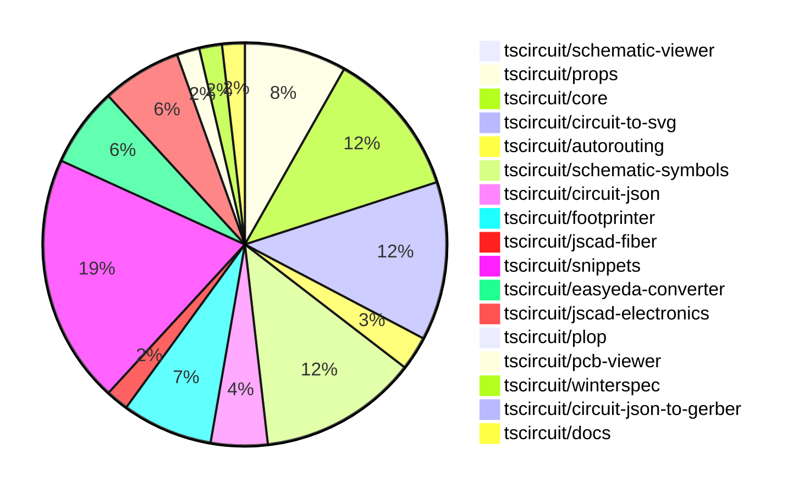

# contribution-tracker

Generates weekly contribution overviews for tscircuit contributors. Check out all
the [contribution overviews here](./contribution-overviews/)

* All PRs in the tscircuit org are scanned/summarized via Claude Haiku
* Claude classifies each Diff/PR as a Major, Minor or Tiny contribution
* All the PRs, summaries, and classifications are organized into charts and tables

The current week is shown below. There are 3 major sections:

* [Contributor Overview](#contributor-overview)
* [PRs by Repository](#prs-by-repository)
* [PRs by Contributor](#changes-by-contributor)

## Current Week

<!-- START_CURRENT_WEEK -->

# Contribution Overview 2024-10-16

## PRs by Repository

## Contributor Overview

| Contributor | 🐳 Major | 🐙 Minor | 🐌 Tiny | ⭐ |
|-------------|-------|-------|-------|-------|
| [seveibar](#seveibar) | 16 | 26 | 2 | 👑👑👑 |
| [imrishabh18](#imrishabh18) | 2 | 10 | 2 | ⭐⭐ |
| [anas-sarkez](#anas-sarkez) | 4 | 6 | 0 | ⭐⭐ |
| [andrii-balitskyi](#andrii-balitskyi) | 3 | 8 | 0 | ⭐⭐ |
| [Abse2001](#Abse2001) | 2 | 5 | 1 | ⭐⭐ |
| [Timer00](#Timer00) | 4 | 1 | 0 | ⭐⭐ |
| [aman1376](#aman1376) | 2 | 1 | 0 | ⭐ |
| [mrudulpatil18](#mrudulpatil18) | 2 | 1 | 0 | ⭐ |
| [ShiboSoftwareDev](#ShiboSoftwareDev) | 0 | 2 | 2 | ⭐ |
| [theajmalrazaq](#theajmalrazaq) | 0 | 3 | 0 | ⭐ |
| [sarthak-kumar-shailendra](#sarthak-kumar-shailendra) | 0 | 2 | 0 | ⭐ |
| [bbland1](#bbland1) | 1 | 0 | 0 | ⭐ |
| [anugcodes](#anugcodes) | 1 | 0 | 0 | ⭐ |
| [alex-marinov](#alex-marinov) | 0 | 1 | 0 |  |
| [kom-senapati](#kom-senapati) | 0 | 1 | 0 |  |
| [AlexVCS](#AlexVCS) | 0 | 0 | 1 |  |

## Changes by Repository

### [tscircuit/schematic-viewer](https://github.com/tscircuit/schematic-viewer)

| PR # | Impact | Contributor | Description |
|------|--------|-------------|-------------|
| [#65](https://github.com/tscircuit/schematic-viewer/pull/65) | 🐳 Major | imrishabh18 | Refactor the builder with core and update the schematic viewer (Work In Progress) |

### [tscircuit/props](https://github.com/tscircuit/props)

| PR # | Impact | Contributor | Description |
|------|--------|-------------|-------------|
| [#67](https://github.com/tscircuit/props/pull/67) | 🐳 Major | seveibar | This pull request adds a comprehensive overview of all the prop types available in the @tscircuit/props package, including detailed documentation and examples of how to use the corresponding zod validators. |
| [#63](https://github.com/tscircuit/props/pull/63) | 🐳 Major | seveibar | Introduces a new battery component with support for battery types, battery properties, and sets the default unit to mAh. |
| [#62](https://github.com/tscircuit/props/pull/62) | 🐙 Minor | imrishabh18 | Reverts changes to the `width` and `height` properties in the `commonLayoutProps` type and the `commonComponentProps` schema. |
| [#60](https://github.com/tscircuit/props/pull/60) | 🐙 Minor | imrishabh18 | Rename `width` and `height` props to `schWidth` and `schHeight` respectively, and add new `pcbWidth` and `pcbHeight` props. |
| [#58](https://github.com/tscircuit/props/pull/58) | 🐙 Minor | imrishabh18 | Add width and height properties to components |
| [#66](https://github.com/tscircuit/props/pull/66) | 🐙 Minor | seveibar | Add support for a new "pill" shape for plated holes |
| [#65](https://github.com/tscircuit/props/pull/65) | 🐙 Minor | seveibar | Adds support for the `schAutoLayoutEnabled` prop on the `<group />` component. |
| [#61](https://github.com/tscircuit/props/pull/61) | 🐙 Minor | seveibar | Revert the changes made in the previous pull request (tscircuit/props#60) that introduced `schWidth`, `schHeight`, `pcbWidth`, and `pcbHeight` props. |
| [#59](https://github.com/tscircuit/props/pull/59) | 🐌 Tiny | imrishabh18 | Updated the lockfile to the latest version. |

### [tscircuit/core](https://github.com/tscircuit/core)

| PR # | Impact | Contributor | Description |
|------|--------|-------------|-------------|
| [#200](https://github.com/tscircuit/core/pull/200) | 🐙 Minor | imrishabh18 | Adds ports as obstacles and enables routing to work |
| [#199](https://github.com/tscircuit/core/pull/199) | 🐙 Minor | imrishabh18 | Shifts the port positions on the edge of the chip to avoid overlap with the chip boundary. |
| [#187](https://github.com/tscircuit/core/pull/187) | 🟣 | imrishabh18 | Add support for `-size` suffix port arrangements in the `NormalComponent` class. |
| [#198](https://github.com/tscircuit/core/pull/198) | 🐳 Major | seveibar | Adds support for pill-shaped plated holes and provides more AI context for tscircuit react props |
| [#194](https://github.com/tscircuit/core/pull/194) | 🐳 Major | seveibar | Adds support for rendering schematic debug objects in the circuit visualization. |
| [#186](https://github.com/tscircuit/core/pull/186) | 🐳 Major | seveibar | Fix Schematic Ports using local instead of global positions |
| [#185](https://github.com/tscircuit/core/pull/185) | 🐳 Major | seveibar | Implemented schematic autolayout and fixed routing issues |
| [#177](https://github.com/tscircuit/core/pull/177) | 🐳 Major | seveibar | Introduces a new `<battery />` component. |
| [#176](https://github.com/tscircuit/core/pull/176) | 🐳 Major | seveibar | Fixes the issue with `pcbRotation={-90}` not properly rotating SMT pads and keepouts, and adds support for rotating keepouts. |
| [#196](https://github.com/tscircuit/core/pull/196) | 🐳 Major | Abse2001 | Implemented the `<Inductor/>` component |
| [#188](https://github.com/tscircuit/core/pull/188) | 🐙 Minor | seveibar | Update the circuit-to-svg dependency to fix an issue with pin number 0 not being recognized. |
| [#173](https://github.com/tscircuit/core/pull/173) | 🐙 Minor | seveibar | Adds support for shared pin labels, allowing multiple ports to have the same label. |
| [#182](https://github.com/tscircuit/core/pull/182) | 🐙 Minor | Abse2001 | Fixed the issue where `toMatchSchematicSnapshot` was not working for the Battery component. |

### [tscircuit/circuit-to-svg](https://github.com/tscircuit/circuit-to-svg)

| PR # | Impact | Contributor | Description |
|------|--------|-------------|-------------|
| [#96](https://github.com/tscircuit/circuit-to-svg/pull/96) | 🐳 Major | imrishabh18 | Refactor the code to use `transform` instead of `viewbox` for positioning SVG elements. |
| [#95](https://github.com/tscircuit/circuit-to-svg/pull/95) | 🐳 Major | seveibar | Refactor the schematic drawing code to use transform matrix instead of viewport and `flipY`, and introduce major type-safety improvements. |
| [#94](https://github.com/tscircuit/circuit-to-svg/pull/94) | 🐳 Major | seveibar | Introduces a new feature to add labeled grid to the schematic SVG output. |
| [#100](https://github.com/tscircuit/circuit-to-svg/pull/100) | 🐙 Minor | imrishabh18 | Fixing a bug in the port position caused by scaling with the negative Y direction |
| [#90](https://github.com/tscircuit/circuit-to-svg/pull/90) | 🐙 Minor | imrishabh18 | Reverts a change that caused the position of pins to break. |
| [#99](https://github.com/tscircuit/circuit-to-svg/pull/99) | 🐙 Minor | seveibar | Fix the schematic trace by adjusting the Y coordinates of the trace points. |
| [#98](https://github.com/tscircuit/circuit-to-svg/pull/98) | 🐙 Minor | seveibar | Fixes the calculation of the transformed coordinates for the debug objects, including rectangles and lines, to correctly handle the coordinate system flip. |
| [#97](https://github.com/tscircuit/circuit-to-svg/pull/97) | 🐙 Minor | seveibar | Fix schematic port handling of undefined `pinNumber` and finding pin number |
| [#93](https://github.com/tscircuit/circuit-to-svg/pull/93) | 🐙 Minor | seveibar | Adds support for drawing a grid and labeled points in the schematic SVG. |
| [#92](https://github.com/tscircuit/circuit-to-svg/pull/92) | 🐙 Minor | seveibar | The pull request adds support for drawing schematic debug objects, including rectangles and lines, to the schematic SVG conversion process. |
| [#88](https://github.com/tscircuit/circuit-to-svg/pull/88) | 🐙 Minor | seveibar | Fix schematic port using a relative position |
| [#87](https://github.com/tscircuit/circuit-to-svg/pull/87) | 🐙 Minor | seveibar | Fix silkscreen paths being erroneously closed, improving the appearance of pushbutton silkscreen. |
| [#89](https://github.com/tscircuit/circuit-to-svg/pull/89) | 🐙 Minor | Abse2001 | Updated the version of the "schematic-symbols" dependency from 0.0.79 to 0.0.90. |
| [#86](https://github.com/tscircuit/circuit-to-svg/pull/86) | 🐙 Minor | Abse2001 | Updated the schematic-symbols to fix the battery in core and formatted the code. |

### [tscircuit/autorouting](https://github.com/tscircuit/autorouting)

| PR # | Impact | Contributor | Description |
|------|--------|-------------|-------------|
| [#85](https://github.com/tscircuit/autorouting/pull/85) | 🐳 Major | seveibar | Switches the deployed application to use NextJS. |
| [#84](https://github.com/tscircuit/autorouting/pull/84) | 🐳 Major | seveibar | Allows pasting SimpleRouteJson on the homepage and converts it to the circuit-json format. |
| [#82](https://github.com/tscircuit/autorouting/pull/82) | 🐙 Minor | imrishabh18 | Removes the `builder` code from the `get-debug-svg.ts` file. |

### [tscircuit/schematic-symbols](https://github.com/tscircuit/schematic-symbols)

| PR # | Impact | Contributor | Description |
|------|--------|-------------|-------------|
| [#185](https://github.com/tscircuit/schematic-symbols/pull/185) | 🐳 Major | Abse2001 | Implemented SVG Arc support and added an inductor symbol. |
| [#176](https://github.com/tscircuit/schematic-symbols/pull/176) | 🐳 Major | aman1376 | Adds a new component called "light dependent resistor" to the project. |
| [#162](https://github.com/tscircuit/schematic-symbols/pull/162) | 🐳 Major | aman1376 | Adds a JSON file and an SVG file for a DPST switch symbol. |
| [#78](https://github.com/tscircuit/schematic-symbols/pull/78) | 🐳 Major | Timer00 | Introduces a new symbol for a wattmeter |
| [#95](https://github.com/tscircuit/schematic-symbols/pull/95) | 🐳 Major | Timer00 | Introduce a new symbol called 'varmeter' |
| [#97](https://github.com/tscircuit/schematic-symbols/pull/97) | 🐳 Major | Timer00 | Introduces a new symbol called "frequency_meter" |
| [#100](https://github.com/tscircuit/schematic-symbols/pull/100) | 🐳 Major | Timer00 | Introduce a new symbol called "tachometer" |
| [#167](https://github.com/tscircuit/schematic-symbols/pull/167) | 🐳 Major | anugcodes | Added a new symbol for the Darlington pair transistor. |
| [#184](https://github.com/tscircuit/schematic-symbols/pull/184) | 🐙 Minor | imrishabh18 | Updated the lockfile to fix a failing npm publish |
| [#172](https://github.com/tscircuit/schematic-symbols/pull/172) | 🐙 Minor | imrishabh18 | Fixes the calculation of the height for the SPDT switch and other components. |
| [#174](https://github.com/tscircuit/schematic-symbols/pull/174) | 🐙 Minor | Abse2001 | Added a new battery symbol to the project. |
| [#96](https://github.com/tscircuit/schematic-symbols/pull/96) | 🐙 Minor | Timer00 | Introduces a new symbol "watt_hour_meter" for a watt-hour meter. |
| [#153](https://github.com/tscircuit/schematic-symbols/pull/153) | 🐙 Minor | mrudulpatil18 | The pull request adds a rectifier diode symbol to the project. |
| [#183](https://github.com/tscircuit/schematic-symbols/pull/183) | 🐌 Tiny | imrishabh18 | Updates .gitignore to ignore .diff.png files |

### [tscircuit/circuit-json](https://github.com/tscircuit/circuit-json)

| PR # | Impact | Contributor | Description |
|------|--------|-------------|-------------|
| [#61](https://github.com/tscircuit/circuit-json/pull/61) | 🐳 Major | seveibar | Introduces a new `schematic_debug_object` feature, including types for rectangular and line-based debug objects. |
| [#64](https://github.com/tscircuit/circuit-json/pull/64) | 🐙 Minor | seveibar | Add useful meta information, true index, side of component, etc. to schematic_port |
| [#62](https://github.com/tscircuit/circuit-json/pull/62) | 🐙 Minor | seveibar | Adds a script to generate a documentation file for the schematic component types in the project. |
| [#59](https://github.com/tscircuit/circuit-json/pull/59) | 🐙 Minor | seveibar | Add a new circuit element called "simple_battery" to the codebase. |
| [#60](https://github.com/tscircuit/circuit-json/pull/60) | 🐙 Minor | Abse2001 | Added support for the `source_simple_inductor` component in the project. |

### [tscircuit/footprinter](https://github.com/tscircuit/footprinter)

| PR # | Impact | Contributor | Description |
|------|--------|-------------|-------------|
| [#67](https://github.com/tscircuit/footprinter/pull/67) | 🐳 Major | seveibar | Introduce a new feature to automatically generate a gallery page for SVG snapshots. |
| [#70](https://github.com/tscircuit/footprinter/pull/70) | 🐳 Major | anas-sarkez | Implemented a function to generate a stampreceiver footprint |
| [#68](https://github.com/tscircuit/footprinter/pull/68) | 🐳 Major | anas-sarkez | Implemented a new function called `stampboard` that generates a circuit JSON representation of a stampboard layout based on the provided parameters. |
| [#60](https://github.com/tscircuit/footprinter/pull/60) | 🐳 Major | bbland1 | Adds type definitions for the parameters returned by the `.json()` method in the footprinter library. |
| [#66](https://github.com/tscircuit/footprinter/pull/66) | 🐙 Minor | seveibar | Introduces a new pushbutton footprint and updates the circuit-to-svg library. |
| [#72](https://github.com/tscircuit/footprinter/pull/72) | 🐙 Minor | aman1376 | Adds a new component called "lqfp" to the project. |
| [#71](https://github.com/tscircuit/footprinter/pull/71) | 🐙 Minor | anas-sarkez | The pull request adds support for inner holes in stampboards and stampreceiver components, modifies the pad length and holes position accordingly. |
| [#69](https://github.com/tscircuit/footprinter/pull/69) | 🐙 Minor | anas-sarkez | Implement silkscreen reference for every component and added silkscreenRef function to helpers |

### [tscircuit/jscad-fiber](https://github.com/tscircuit/jscad-fiber)

| PR # | Impact | Contributor | Description |
|------|--------|-------------|-------------|
| [#84](https://github.com/tscircuit/jscad-fiber/pull/84) | 🐳 Major | seveibar | Implement the `subtract` operation in the JsCAD library, allowing the subtraction of one or more objects from another. |
| [#85](https://github.com/tscircuit/jscad-fiber/pull/85) | 🐙 Minor | alex-marinov | Adds support for <Translate /> to accept multiple children, resolving issue #83. |

### [tscircuit/snippets](https://github.com/tscircuit/snippets)

| PR # | Impact | Contributor | Description |
|------|--------|-------------|-------------|
| [#114](https://github.com/tscircuit/snippets/pull/114) | 🐳 Major | seveibar | Add files dialog to inspect build files |
| [#89](https://github.com/tscircuit/snippets/pull/89) | 🐳 Major | andrii-balitskyi | Add order preview feature with PCB, 3D, and JSON viewers. |
| [#82](https://github.com/tscircuit/snippets/pull/82) | 🐳 Major | andrii-balitskyi | Adds the ability to edit shipping information in the profile settings. |
| [#78](https://github.com/tscircuit/snippets/pull/78) | 🐳 Major | andrii-balitskyi | Adds a "Submit Order" button in the editor navigation bar and a "Create Order" dialog that allows users to place an order for the circuit board. |
| [#117](https://github.com/tscircuit/snippets/pull/117) | 🐳 Major | mrudulpatil18 | This pull request adds a command palette (CmdKMenu) to the application, which allows users to quickly access various actions such as searching for snippets, viewing recent snippets, creating new snippets from templates, and importing content. |
| [#77](https://github.com/tscircuit/snippets/pull/77) | 🐳 Major | mrudulpatil18 | Added a search component with a search bar, fetching search results from the `/snippets/search` endpoint, and displaying the results in a dropdown. |
| [#122](https://github.com/tscircuit/snippets/pull/122) | 🐙 Minor | seveibar | Add an endpoint to allow users to star a snippet |
| [#118](https://github.com/tscircuit/snippets/pull/118) | 🐙 Minor | seveibar | Fix broken search and cmd+click functionality in the code editor and dashboard pages. |
| [#115](https://github.com/tscircuit/snippets/pull/115) | 🐙 Minor | seveibar | Introduce cmd+click to open code snippets in the CodeEditor component. |
| [#108](https://github.com/tscircuit/snippets/pull/108) | 🐙 Minor | seveibar | Sort user's snippets by last created time |
| [#80](https://github.com/tscircuit/snippets/pull/80) | 🐙 Minor | seveibar | Fixes issues with JLCPCB imports, updates for shared pin label support, and fixes local development errors. |
| [#74](https://github.com/tscircuit/snippets/pull/74) | 🐙 Minor | seveibar | Updates the versions of `circuit-json-to-bom-csv`, `circuit-json-to-pnp-csv`, and `easyeda` dependencies. |
| [#124](https://github.com/tscircuit/snippets/pull/124) | 🐙 Minor | andrii-balitskyi | Fix the width of SearchableSelect options to be based on the trigger width |
| [#88](https://github.com/tscircuit/snippets/pull/88) | 🐙 Minor | andrii-balitskyi | Adds country and state as dropdown menus in the shipping information section. |
| [#68](https://github.com/tscircuit/snippets/pull/68) | 🐙 Minor | andrii-balitskyi | Adds tests for the order-related API endpoints, including creating, getting, listing, and updating orders, as well as uploading and getting order files. |
| [#95](https://github.com/tscircuit/snippets/pull/95) | 🐙 Minor | theajmalrazaq | Fixed the responsiveness of the quickstart page. |
| [#97](https://github.com/tscircuit/snippets/pull/97) | 🐙 Minor | theajmalrazaq | Added Playwright tests for AI Page and Quickstart Page, including viewports for different screen sizes. |
| [#85](https://github.com/tscircuit/snippets/pull/85) | 🐙 Minor | theajmalrazaq | Fixes the rendering of the search box in small views and improves the responsiveness of the dashboard. |
| [#86](https://github.com/tscircuit/snippets/pull/86) | 🐙 Minor | kom-senapati | Update the page title to include the snippet name and owner name in the format `tscircuit - <owner>/<package>`. |
| [#84](https://github.com/tscircuit/snippets/pull/84) | 🐌 Tiny | seveibar | Fix tab indent in the CodeEditor component. |
| [#96](https://github.com/tscircuit/snippets/pull/96) | 🐌 Tiny | Abse2001 | Updates the version of the "winterspec" dependency from 0.0.93 to 0.0.94. |
| [#110](https://github.com/tscircuit/snippets/pull/110) | 🐌 Tiny | AlexVCS | Adds a favicon to the website |

### [tscircuit/easyeda-converter](https://github.com/tscircuit/easyeda-converter)

| PR # | Impact | Contributor | Description |
|------|--------|-------------|-------------|
| [#74](https://github.com/tscircuit/easyeda-converter/pull/74) | 🐙 Minor | seveibar | The pull request fixes the C490691 import, adds a script for quickly adding tests for parts, and introduces the add test for part script and C490691 test. |
| [#71](https://github.com/tscircuit/easyeda-converter/pull/71) | 🐙 Minor | seveibar | Fixes an issue with Arc imports by improving the regular expression pattern used to extract arc data from the input string. |
| [#85](https://github.com/tscircuit/easyeda-converter/pull/85) | 🐙 Minor | andrii-balitskyi | The pull request converts string pin numbers to type number when converting to TSX. |
| [#83](https://github.com/tscircuit/easyeda-converter/pull/83) | 🐙 Minor | andrii-balitskyi | Converts oval-shaped pads with a hole radius to pill-shaped plated holes. |
| [#84](https://github.com/tscircuit/easyeda-converter/pull/84) | 🐙 Minor | andrii-balitskyi | Fix the calculation of the stroke width for tracks and arcs in the EasyEDA to TSCircuit converter. |
| [#78](https://github.com/tscircuit/easyeda-converter/pull/78) | 🐙 Minor | andrii-balitskyi | Adds support for `T~` text shapes and fixes a script that adds test for a part. |
| [#77](https://github.com/tscircuit/easyeda-converter/pull/77) | 🐙 Minor | andrii-balitskyi | Fix error message for the `convert` command to reflect the correct command option. |

### [tscircuit/jscad-electronics](https://github.com/tscircuit/jscad-electronics)

| PR # | Impact | Contributor | Description |
|------|--------|-------------|-------------|
| [#75](https://github.com/tscircuit/jscad-electronics/pull/75) | 🐳 Major | anas-sarkez | Implementing a new 3D model for a pin row component and refactoring the FootprintPlatedHole component to improve its implementation. |
| [#68](https://github.com/tscircuit/jscad-electronics/pull/68) | 🐳 Major | anas-sarkez | Implementing a new USB-C female port 3D component |
| [#70](https://github.com/tscircuit/jscad-electronics/pull/70) | 🐙 Minor | seveibar | Added anas as a codeowner for files matching the pattern `add+*` |
| [#76](https://github.com/tscircuit/jscad-electronics/pull/76) | 🐙 Minor | anas-sarkez | Added a new example for the 'pinrow6' footprinter3D component. |
| [#72](https://github.com/tscircuit/jscad-electronics/pull/72) | 🐙 Minor | anas-sarkez | Refactored the USB_C component to use Subtract for creating the curved metal casing instead of complex calculations. |
| [#71](https://github.com/tscircuit/jscad-electronics/pull/71) | 🐙 Minor | anas-sarkez | Updated jscad-fiber dependency and subtracted curve slice from smdLED sides |
| [#69](https://github.com/tscircuit/jscad-electronics/pull/69) | 🐙 Minor | anas-sarkez | Implementing SMD LED packages with different colors |

### [tscircuit/plop](https://github.com/tscircuit/plop)

| PR # | Impact | Contributor | Description |
|------|--------|-------------|-------------|
| [#5](https://github.com/tscircuit/plop/pull/5) | 🐙 Minor | seveibar | Adds support for checking the latest version of the @tscircuit/plop package and updating it if a newer version is available. Also adds support for remote template files. |

### [tscircuit/pcb-viewer](https://github.com/tscircuit/pcb-viewer)

| PR # | Impact | Contributor | Description |
|------|--------|-------------|-------------|
| [#76](https://github.com/tscircuit/pcb-viewer/pull/76) | 🐌 Tiny | seveibar | Format and fix silkscreen path story rendering |
| [#75](https://github.com/tscircuit/pcb-viewer/pull/75) | 🐌 Tiny | ShiboSoftwareDev | Added a CODEOWNERS file to specify the code owners for the repository. |

### [tscircuit/winterspec](https://github.com/tscircuit/winterspec)

| PR # | Impact | Contributor | Description |
|------|--------|-------------|-------------|
| [#17](https://github.com/tscircuit/winterspec/pull/17) | 🐙 Minor | ShiboSoftwareDev | Fix an esbuild bug that caused the application to not work on Windows systems. |
| [#18](https://github.com/tscircuit/winterspec/pull/18) | 🐌 Tiny | ShiboSoftwareDev | Update the `construct-manifest.ts` file to fix a path issue on Windows by replacing backslashes with forward slashes. |

### [tscircuit/circuit-json-to-gerber](https://github.com/tscircuit/circuit-json-to-gerber)

| PR # | Impact | Contributor | Description |
|------|--------|-------------|-------------|
| [#22](https://github.com/tscircuit/circuit-json-to-gerber/pull/22) | 🐙 Minor | ShiboSoftwareDev | Implemented the silkscreen path functionality in the Gerber conversion process. |

### [tscircuit/docs](https://github.com/tscircuit/docs)

| PR # | Impact | Contributor | Description |
|------|--------|-------------|-------------|
| [#29](https://github.com/tscircuit/docs/pull/29) | 🐙 Minor | sarthak-kumar-shailendra | Fixes the icon and URL for the 'Twitter/X' entry in the sidebar and footer of the application. |
| [#28](https://github.com/tscircuit/docs/pull/28) | 🐙 Minor | sarthak-kumar-shailendra | Update the Twitter logo to the new "X" icon |

## Changes by Contributor

### [imrishabh18](https://github.com/imrishabh18)

| PR # | Impact | Description |
|------|--------|-------------|
| [#65](https://github.com/tscircuit/schematic-viewer/pull/65) | 🐳 Major | Refactor the builder with core and update the schematic viewer (Work In Progress) |
| [#62](https://github.com/tscircuit/props/pull/62) | 🐙 Minor | Reverts changes to the `width` and `height` properties in the `commonLayoutProps` type and the `commonComponentProps` schema. |
| [#60](https://github.com/tscircuit/props/pull/60) | 🐙 Minor | Rename `width` and `height` props to `schWidth` and `schHeight` respectively, and add new `pcbWidth` and `pcbHeight` props. |
| [#58](https://github.com/tscircuit/props/pull/58) | 🐙 Minor | Add width and height properties to components |
| [#200](https://github.com/tscircuit/core/pull/200) | 🐙 Minor | Adds ports as obstacles and enables routing to work |
| [#199](https://github.com/tscircuit/core/pull/199) | 🐙 Minor | Shifts the port positions on the edge of the chip to avoid overlap with the chip boundary. |
| [#59](https://github.com/tscircuit/props/pull/59) | 🐌 Tiny | Updated the lockfile to the latest version. |
| [#187](https://github.com/tscircuit/core/pull/187) | 🟣 | Add support for `-size` suffix port arrangements in the `NormalComponent` class. |
| [#96](https://github.com/tscircuit/circuit-to-svg/pull/96) | 🐳 Major | Refactor the code to use `transform` instead of `viewbox` for positioning SVG elements. |
| [#100](https://github.com/tscircuit/circuit-to-svg/pull/100) | 🐙 Minor | Fixing a bug in the port position caused by scaling with the negative Y direction |
| [#90](https://github.com/tscircuit/circuit-to-svg/pull/90) | 🐙 Minor | Reverts a change that caused the position of pins to break. |
| [#82](https://github.com/tscircuit/autorouting/pull/82) | 🐙 Minor | Removes the `builder` code from the `get-debug-svg.ts` file. |
| [#184](https://github.com/tscircuit/schematic-symbols/pull/184) | 🐙 Minor | Updated the lockfile to fix a failing npm publish |
| [#172](https://github.com/tscircuit/schematic-symbols/pull/172) | 🐙 Minor | Fixes the calculation of the height for the SPDT switch and other components. |
| [#183](https://github.com/tscircuit/schematic-symbols/pull/183) | 🐌 Tiny | Updates .gitignore to ignore .diff.png files |

### [seveibar](https://github.com/seveibar)

| PR # | Impact | Description |
|------|--------|-------------|
| [#61](https://github.com/tscircuit/circuit-json/pull/61) | 🐳 Major | Introduces a new `schematic_debug_object` feature, including types for rectangular and line-based debug objects. |
| [#67](https://github.com/tscircuit/props/pull/67) | 🐳 Major | This pull request adds a comprehensive overview of all the prop types available in the @tscircuit/props package, including detailed documentation and examples of how to use the corresponding zod validators. |
| [#63](https://github.com/tscircuit/props/pull/63) | 🐳 Major | Introduces a new battery component with support for battery types, battery properties, and sets the default unit to mAh. |
| [#67](https://github.com/tscircuit/footprinter/pull/67) | 🐳 Major | Introduce a new feature to automatically generate a gallery page for SVG snapshots. |
| [#198](https://github.com/tscircuit/core/pull/198) | 🐳 Major | Adds support for pill-shaped plated holes and provides more AI context for tscircuit react props |
| [#194](https://github.com/tscircuit/core/pull/194) | 🐳 Major | Adds support for rendering schematic debug objects in the circuit visualization. |
| [#186](https://github.com/tscircuit/core/pull/186) | 🐳 Major | Fix Schematic Ports using local instead of global positions |
| [#185](https://github.com/tscircuit/core/pull/185) | 🐳 Major | Implemented schematic autolayout and fixed routing issues |
| [#177](https://github.com/tscircuit/core/pull/177) | 🐳 Major | Introduces a new `<battery />` component. |
| [#176](https://github.com/tscircuit/core/pull/176) | 🐳 Major | Fixes the issue with `pcbRotation={-90}` not properly rotating SMT pads and keepouts, and adds support for rotating keepouts. |
| [#84](https://github.com/tscircuit/jscad-fiber/pull/84) | 🐳 Major | Implement the `subtract` operation in the JsCAD library, allowing the subtraction of one or more objects from another. |
| [#95](https://github.com/tscircuit/circuit-to-svg/pull/95) | 🐳 Major | Refactor the schematic drawing code to use transform matrix instead of viewport and `flipY`, and introduce major type-safety improvements. |
| [#94](https://github.com/tscircuit/circuit-to-svg/pull/94) | 🐳 Major | Introduces a new feature to add labeled grid to the schematic SVG output. |
| [#85](https://github.com/tscircuit/autorouting/pull/85) | 🐳 Major | Switches the deployed application to use NextJS. |
| [#84](https://github.com/tscircuit/autorouting/pull/84) | 🐳 Major | Allows pasting SimpleRouteJson on the homepage and converts it to the circuit-json format. |
| [#114](https://github.com/tscircuit/snippets/pull/114) | 🐳 Major | Add files dialog to inspect build files |
| [#64](https://github.com/tscircuit/circuit-json/pull/64) | 🐙 Minor | Add useful meta information, true index, side of component, etc. to schematic_port |
| [#62](https://github.com/tscircuit/circuit-json/pull/62) | 🐙 Minor | Adds a script to generate a documentation file for the schematic component types in the project. |
| [#59](https://github.com/tscircuit/circuit-json/pull/59) | 🐙 Minor | Add a new circuit element called "simple_battery" to the codebase. |
| [#66](https://github.com/tscircuit/props/pull/66) | 🐙 Minor | Add support for a new "pill" shape for plated holes |
| [#65](https://github.com/tscircuit/props/pull/65) | 🐙 Minor | Adds support for the `schAutoLayoutEnabled` prop on the `<group />` component. |
| [#61](https://github.com/tscircuit/props/pull/61) | 🐙 Minor | Revert the changes made in the previous pull request (tscircuit/props#60) that introduced `schWidth`, `schHeight`, `pcbWidth`, and `pcbHeight` props. |
| [#66](https://github.com/tscircuit/footprinter/pull/66) | 🐙 Minor | Introduces a new pushbutton footprint and updates the circuit-to-svg library. |
| [#74](https://github.com/tscircuit/easyeda-converter/pull/74) | 🐙 Minor | The pull request fixes the C490691 import, adds a script for quickly adding tests for parts, and introduces the add test for part script and C490691 test. |
| [#71](https://github.com/tscircuit/easyeda-converter/pull/71) | 🐙 Minor | Fixes an issue with Arc imports by improving the regular expression pattern used to extract arc data from the input string. |
| [#188](https://github.com/tscircuit/core/pull/188) | 🐙 Minor | Update the circuit-to-svg dependency to fix an issue with pin number 0 not being recognized. |
| [#173](https://github.com/tscircuit/core/pull/173) | 🐙 Minor | Adds support for shared pin labels, allowing multiple ports to have the same label. |
| [#70](https://github.com/tscircuit/jscad-electronics/pull/70) | 🐙 Minor | Added anas as a codeowner for files matching the pattern `add+*` |
| [#5](https://github.com/tscircuit/plop/pull/5) | 🐙 Minor | Adds support for checking the latest version of the @tscircuit/plop package and updating it if a newer version is available. Also adds support for remote template files. |
| [#99](https://github.com/tscircuit/circuit-to-svg/pull/99) | 🐙 Minor | Fix the schematic trace by adjusting the Y coordinates of the trace points. |
| [#98](https://github.com/tscircuit/circuit-to-svg/pull/98) | 🐙 Minor | Fixes the calculation of the transformed coordinates for the debug objects, including rectangles and lines, to correctly handle the coordinate system flip. |
| [#97](https://github.com/tscircuit/circuit-to-svg/pull/97) | 🐙 Minor | Fix schematic port handling of undefined `pinNumber` and finding pin number |
| [#93](https://github.com/tscircuit/circuit-to-svg/pull/93) | 🐙 Minor | Adds support for drawing a grid and labeled points in the schematic SVG. |
| [#92](https://github.com/tscircuit/circuit-to-svg/pull/92) | 🐙 Minor | The pull request adds support for drawing schematic debug objects, including rectangles and lines, to the schematic SVG conversion process. |
| [#88](https://github.com/tscircuit/circuit-to-svg/pull/88) | 🐙 Minor | Fix schematic port using a relative position |
| [#87](https://github.com/tscircuit/circuit-to-svg/pull/87) | 🐙 Minor | Fix silkscreen paths being erroneously closed, improving the appearance of pushbutton silkscreen. |
| [#122](https://github.com/tscircuit/snippets/pull/122) | 🐙 Minor | Add an endpoint to allow users to star a snippet |
| [#118](https://github.com/tscircuit/snippets/pull/118) | 🐙 Minor | Fix broken search and cmd+click functionality in the code editor and dashboard pages. |
| [#115](https://github.com/tscircuit/snippets/pull/115) | 🐙 Minor | Introduce cmd+click to open code snippets in the CodeEditor component. |
| [#108](https://github.com/tscircuit/snippets/pull/108) | 🐙 Minor | Sort user's snippets by last created time |
| [#80](https://github.com/tscircuit/snippets/pull/80) | 🐙 Minor | Fixes issues with JLCPCB imports, updates for shared pin label support, and fixes local development errors. |
| [#74](https://github.com/tscircuit/snippets/pull/74) | 🐙 Minor | Updates the versions of `circuit-json-to-bom-csv`, `circuit-json-to-pnp-csv`, and `easyeda` dependencies. |
| [#76](https://github.com/tscircuit/pcb-viewer/pull/76) | 🐌 Tiny | Format and fix silkscreen path story rendering |
| [#84](https://github.com/tscircuit/snippets/pull/84) | 🐌 Tiny | Fix tab indent in the CodeEditor component. |

### [ShiboSoftwareDev](https://github.com/ShiboSoftwareDev)

| PR # | Impact | Description |
|------|--------|-------------|
| [#17](https://github.com/tscircuit/winterspec/pull/17) | 🐙 Minor | Fix an esbuild bug that caused the application to not work on Windows systems. |
| [#22](https://github.com/tscircuit/circuit-json-to-gerber/pull/22) | 🐙 Minor | Implemented the silkscreen path functionality in the Gerber conversion process. |
| [#75](https://github.com/tscircuit/pcb-viewer/pull/75) | 🐌 Tiny | Added a CODEOWNERS file to specify the code owners for the repository. |
| [#18](https://github.com/tscircuit/winterspec/pull/18) | 🐌 Tiny | Update the `construct-manifest.ts` file to fix a path issue on Windows by replacing backslashes with forward slashes. |

### [Abse2001](https://github.com/Abse2001)

| PR # | Impact | Description |
|------|--------|-------------|
| [#196](https://github.com/tscircuit/core/pull/196) | 🐳 Major | Implemented the `<Inductor/>` component |
| [#185](https://github.com/tscircuit/schematic-symbols/pull/185) | 🐳 Major | Implemented SVG Arc support and added an inductor symbol. |
| [#60](https://github.com/tscircuit/circuit-json/pull/60) | 🐙 Minor | Added support for the `source_simple_inductor` component in the project. |
| [#182](https://github.com/tscircuit/core/pull/182) | 🐙 Minor | Fixed the issue where `toMatchSchematicSnapshot` was not working for the Battery component. |
| [#89](https://github.com/tscircuit/circuit-to-svg/pull/89) | 🐙 Minor | Updated the version of the "schematic-symbols" dependency from 0.0.79 to 0.0.90. |
| [#86](https://github.com/tscircuit/circuit-to-svg/pull/86) | 🐙 Minor | Updated the schematic-symbols to fix the battery in core and formatted the code. |
| [#174](https://github.com/tscircuit/schematic-symbols/pull/174) | 🐙 Minor | Added a new battery symbol to the project. |
| [#96](https://github.com/tscircuit/snippets/pull/96) | 🐌 Tiny | Updates the version of the "winterspec" dependency from 0.0.93 to 0.0.94. |

### [sarthak-kumar-shailendra](https://github.com/sarthak-kumar-shailendra)

| PR # | Impact | Description |
|------|--------|-------------|
| [#29](https://github.com/tscircuit/docs/pull/29) | 🐙 Minor | Fixes the icon and URL for the 'Twitter/X' entry in the sidebar and footer of the application. |
| [#28](https://github.com/tscircuit/docs/pull/28) | 🐙 Minor | Update the Twitter logo to the new "X" icon |

### [aman1376](https://github.com/aman1376)

| PR # | Impact | Description |
|------|--------|-------------|
| [#176](https://github.com/tscircuit/schematic-symbols/pull/176) | 🐳 Major | Adds a new component called "light dependent resistor" to the project. |
| [#162](https://github.com/tscircuit/schematic-symbols/pull/162) | 🐳 Major | Adds a JSON file and an SVG file for a DPST switch symbol. |
| [#72](https://github.com/tscircuit/footprinter/pull/72) | 🐙 Minor | Adds a new component called "lqfp" to the project. |

### [anas-sarkez](https://github.com/anas-sarkez)

| PR # | Impact | Description |
|------|--------|-------------|
| [#70](https://github.com/tscircuit/footprinter/pull/70) | 🐳 Major | Implemented a function to generate a stampreceiver footprint |
| [#68](https://github.com/tscircuit/footprinter/pull/68) | 🐳 Major | Implemented a new function called `stampboard` that generates a circuit JSON representation of a stampboard layout based on the provided parameters. |
| [#75](https://github.com/tscircuit/jscad-electronics/pull/75) | 🐳 Major | Implementing a new 3D model for a pin row component and refactoring the FootprintPlatedHole component to improve its implementation. |
| [#68](https://github.com/tscircuit/jscad-electronics/pull/68) | 🐳 Major | Implementing a new USB-C female port 3D component |
| [#71](https://github.com/tscircuit/footprinter/pull/71) | 🐙 Minor | The pull request adds support for inner holes in stampboards and stampreceiver components, modifies the pad length and holes position accordingly. |
| [#69](https://github.com/tscircuit/footprinter/pull/69) | 🐙 Minor | Implement silkscreen reference for every component and added silkscreenRef function to helpers |
| [#76](https://github.com/tscircuit/jscad-electronics/pull/76) | 🐙 Minor | Added a new example for the 'pinrow6' footprinter3D component. |
| [#72](https://github.com/tscircuit/jscad-electronics/pull/72) | 🐙 Minor | Refactored the USB_C component to use Subtract for creating the curved metal casing instead of complex calculations. |
| [#71](https://github.com/tscircuit/jscad-electronics/pull/71) | 🐙 Minor | Updated jscad-fiber dependency and subtracted curve slice from smdLED sides |
| [#69](https://github.com/tscircuit/jscad-electronics/pull/69) | 🐙 Minor | Implementing SMD LED packages with different colors |

### [bbland1](https://github.com/bbland1)

| PR # | Impact | Description |
|------|--------|-------------|
| [#60](https://github.com/tscircuit/footprinter/pull/60) | 🐳 Major | Adds type definitions for the parameters returned by the `.json()` method in the footprinter library. |

### [andrii-balitskyi](https://github.com/andrii-balitskyi)

| PR # | Impact | Description |
|------|--------|-------------|
| [#89](https://github.com/tscircuit/snippets/pull/89) | 🐳 Major | Add order preview feature with PCB, 3D, and JSON viewers. |
| [#82](https://github.com/tscircuit/snippets/pull/82) | 🐳 Major | Adds the ability to edit shipping information in the profile settings. |
| [#78](https://github.com/tscircuit/snippets/pull/78) | 🐳 Major | Adds a "Submit Order" button in the editor navigation bar and a "Create Order" dialog that allows users to place an order for the circuit board. |
| [#85](https://github.com/tscircuit/easyeda-converter/pull/85) | 🐙 Minor | The pull request converts string pin numbers to type number when converting to TSX. |
| [#83](https://github.com/tscircuit/easyeda-converter/pull/83) | 🐙 Minor | Converts oval-shaped pads with a hole radius to pill-shaped plated holes. |
| [#84](https://github.com/tscircuit/easyeda-converter/pull/84) | 🐙 Minor | Fix the calculation of the stroke width for tracks and arcs in the EasyEDA to TSCircuit converter. |
| [#78](https://github.com/tscircuit/easyeda-converter/pull/78) | 🐙 Minor | Adds support for `T~` text shapes and fixes a script that adds test for a part. |
| [#77](https://github.com/tscircuit/easyeda-converter/pull/77) | 🐙 Minor | Fix error message for the `convert` command to reflect the correct command option. |
| [#124](https://github.com/tscircuit/snippets/pull/124) | 🐙 Minor | Fix the width of SearchableSelect options to be based on the trigger width |
| [#88](https://github.com/tscircuit/snippets/pull/88) | 🐙 Minor | Adds country and state as dropdown menus in the shipping information section. |
| [#68](https://github.com/tscircuit/snippets/pull/68) | 🐙 Minor | Adds tests for the order-related API endpoints, including creating, getting, listing, and updating orders, as well as uploading and getting order files. |

### [alex-marinov](https://github.com/alex-marinov)

| PR # | Impact | Description |
|------|--------|-------------|
| [#85](https://github.com/tscircuit/jscad-fiber/pull/85) | 🐙 Minor | Adds support for <Translate /> to accept multiple children, resolving issue #83. |

### [Timer00](https://github.com/Timer00)

| PR # | Impact | Description |
|------|--------|-------------|
| [#78](https://github.com/tscircuit/schematic-symbols/pull/78) | 🐳 Major | Introduces a new symbol for a wattmeter |
| [#95](https://github.com/tscircuit/schematic-symbols/pull/95) | 🐳 Major | Introduce a new symbol called 'varmeter' |
| [#97](https://github.com/tscircuit/schematic-symbols/pull/97) | 🐳 Major | Introduces a new symbol called "frequency_meter" |
| [#100](https://github.com/tscircuit/schematic-symbols/pull/100) | 🐳 Major | Introduce a new symbol called "tachometer" |
| [#96](https://github.com/tscircuit/schematic-symbols/pull/96) | 🐙 Minor | Introduces a new symbol "watt_hour_meter" for a watt-hour meter. |

### [mrudulpatil18](https://github.com/mrudulpatil18)

| PR # | Impact | Description |
|------|--------|-------------|
| [#117](https://github.com/tscircuit/snippets/pull/117) | 🐳 Major | This pull request adds a command palette (CmdKMenu) to the application, which allows users to quickly access various actions such as searching for snippets, viewing recent snippets, creating new snippets from templates, and importing content. |
| [#77](https://github.com/tscircuit/snippets/pull/77) | 🐳 Major | Added a search component with a search bar, fetching search results from the `/snippets/search` endpoint, and displaying the results in a dropdown. |
| [#153](https://github.com/tscircuit/schematic-symbols/pull/153) | 🐙 Minor | The pull request adds a rectifier diode symbol to the project. |

### [anugcodes](https://github.com/anugcodes)

| PR # | Impact | Description |
|------|--------|-------------|
| [#167](https://github.com/tscircuit/schematic-symbols/pull/167) | 🐳 Major | Added a new symbol for the Darlington pair transistor. |

### [AlexVCS](https://github.com/AlexVCS)

| PR # | Impact | Description |
|------|--------|-------------|
| [#110](https://github.com/tscircuit/snippets/pull/110) | 🐌 Tiny | Adds a favicon to the website |

### [theajmalrazaq](https://github.com/theajmalrazaq)

| PR # | Impact | Description |
|------|--------|-------------|
| [#95](https://github.com/tscircuit/snippets/pull/95) | 🐙 Minor | Fixed the responsiveness of the quickstart page. |
| [#97](https://github.com/tscircuit/snippets/pull/97) | 🐙 Minor | Added Playwright tests for AI Page and Quickstart Page, including viewports for different screen sizes. |
| [#85](https://github.com/tscircuit/snippets/pull/85) | 🐙 Minor | Fixes the rendering of the search box in small views and improves the responsiveness of the dashboard. |

### [kom-senapati](https://github.com/kom-senapati)

| PR # | Impact | Description |
|------|--------|-------------|
| [#86](https://github.com/tscircuit/snippets/pull/86) | 🐙 Minor | Update the page title to include the snippet name and owner name in the format `tscircuit - <owner>/<package>`. |

<!-- END_CURRENT_WEEK -->
