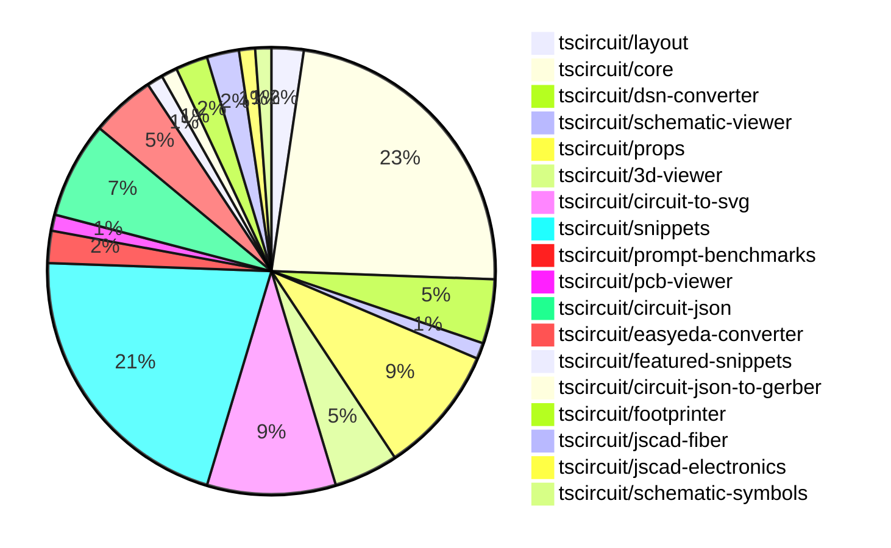

# contribution-tracker

Generates weekly contribution overviews for tscircuit contributors. Check out all
the [contribution overviews here](./contribution-overviews/)

* All PRs in the tscircuit org are scanned/summarized via Claude Haiku
* Claude classifies each Diff/PR as a Major, Minor or Tiny contribution
* All the PRs, summaries, and classifications are organized into charts and tables

The current week is shown below. There are 3 major sections:

* [Contributor Overview](#contributor-overview)
* [PRs by Repository](#prs-by-repository)
* [PRs by Contributor](#changes-by-contributor)

## Current Week

<!-- START_CURRENT_WEEK -->

# Contribution Overview 2024-10-30

## PRs by Repository

## Contributor Overview

| Contributor | 🐳 Major | 🐙 Minor | 🐌 Tiny | ⭐ |
|-------------|-------|-------|-------|-------|
| [seveibar](#seveibar) | 11 | 33 | 1 | 👑👑👑 |
| [imrishabh18](#imrishabh18) | 3 | 14 | 1 | ⭐⭐⭐ |
| [ShiboSoftwareDev](#ShiboSoftwareDev) | 1 | 6 | 0 | ⭐⭐ |
| [andrii-balitskyi](#andrii-balitskyi) | 0 | 5 | 0 | ⭐ |
| [anas-sarkez](#anas-sarkez) | 1 | 2 | 0 | ⭐ |
| [mrudulpatil18](#mrudulpatil18) | 1 | 2 | 0 | ⭐ |
| [tscircuitbot](#tscircuitbot) | 0 | 2 | 0 | ⭐ |
| [aman1376](#aman1376) | 0 | 1 | 0 |  |
| [Satvik1769](#Satvik1769) | 0 | 1 | 0 |  |
| [SufyaanKhateeb](#SufyaanKhateeb) | 0 | 1 | 0 |  |

## Changes by Repository

### [tscircuit/layout](https://github.com/tscircuit/layout)

| PR # | Impact | Contributor | Description |
|------|--------|-------------|-------------|
| [#3](https://github.com/tscircuit/layout/pull/3) | 🐳 Major | imrishabh18 | Refactor to use the `circuit-json` library instead of `@tscircuit/soup` |
| [#4](https://github.com/tscircuit/layout/pull/4) | 🐙 Minor | imrishabh18 | Fix types in manual-layout-pcb.ts file |

### [tscircuit/core](https://github.com/tscircuit/core)

| PR # | Impact | Contributor | Description |
|------|--------|-------------|-------------|
| [#245](https://github.com/tscircuit/core/pull/245) | 🐳 Major | imrishabh18 | Overrides the footprint ports when a port arrangement is present in the schematic. |
| [#257](https://github.com/tscircuit/core/pull/257) | 🐳 Major | seveibar | Implement source_trace.subcircuit_connectivity_map_key |
| [#252](https://github.com/tscircuit/core/pull/252) | 🐳 Major | seveibar | Adds `is_crossing` and splits schematic trace segments to enable the "trace hop" feature. |
| [#251](https://github.com/tscircuit/core/pull/251) | 🐳 Major | seveibar | Adds code to push schematic traces away from other traces to avoid overlap. |
| [#235](https://github.com/tscircuit/core/pull/235) | 🐳 Major | seveibar | Adds support for pinheaders and implied footprint strings |
| [#214](https://github.com/tscircuit/core/pull/214) | 🐳 Major | seveibar | Introduces `useChip`, `useResistor`, and `useCapacitor` hooks, which create component instances with the corresponding props and traces. |
| [#229](https://github.com/tscircuit/core/pull/229) | 🐙 Minor | imrishabh18 | Adds the pin number as an alias for portHints in the NormalComponent class. |
| [#224](https://github.com/tscircuit/core/pull/224) | 🐙 Minor | imrishabh18 | Add support for manual edits in the `PrimitiveComponent` class. |
| [#247](https://github.com/tscircuit/core/pull/247) | 🐙 Minor | seveibar | Add `display_pin_label` to schematic ports and `symbol_display_value` to schematic components. |
| [#239](https://github.com/tscircuit/core/pull/239) | 🐙 Minor | seveibar | Fix stub edges on schematic traces |
| [#238](https://github.com/tscircuit/core/pull/238) | 🐙 Minor | seveibar | Refactor the schematic box computation to improve the logic for determining the port positions. |
| [#236](https://github.com/tscircuit/core/pull/236) | 🐙 Minor | seveibar | This pull request improves the rendering of schematic boxes for components other than 'chip' and removes some ghost code. |
| [#227](https://github.com/tscircuit/core/pull/227) | 🐙 Minor | seveibar | Fix a bug where the center of a PCB component is not updated correctly when its bounds change. |
| [#223](https://github.com/tscircuit/core/pull/223) | 🐙 Minor | seveibar | Enable removing path loops in the Trace component |
| [#218](https://github.com/tscircuit/core/pull/218) | 🐙 Minor | seveibar | Handles the case where net islands fail to route by rendering an error instead of throwing a fatal error. |
| [#217](https://github.com/tscircuit/core/pull/217) | 🐙 Minor | seveibar | Introduces a new hook called `useDiode` for creating a diode component. |
| [#212](https://github.com/tscircuit/core/pull/212) | 🐙 Minor | seveibar | Improves the types for the `createUseComponent` function, allowing it to accept pin labels in the native format and providing better type inference for the resulting component. |
| [#244](https://github.com/tscircuit/core/pull/244) | 🐙 Minor | andrii-balitskyi | Adds a GitHub Actions workflow to automatically format code changes in pull requests. |
| [#243](https://github.com/tscircuit/core/pull/243) | 🐙 Minor | andrii-balitskyi | Adds a new useLed hook that creates an LED component with the specified properties. |
| [#228](https://github.com/tscircuit/core/pull/228) | 🐌 Tiny | imrishabh18 | Updates the lockfile (typically used for dependency management) |

### [tscircuit/dsn-converter](https://github.com/tscircuit/dsn-converter)

| PR # | Impact | Contributor | Description |
|------|--------|-------------|-------------|
| [#13](https://github.com/tscircuit/dsn-converter/pull/13) | 🐳 Major | imrishabh18 | Adds the functionality to convert circuit JSON to DSN JSON and vice versa. |
| [#8](https://github.com/tscircuit/dsn-converter/pull/8) | 🐳 Major | seveibar | This pull request introduces a major refactor of the library, improving code separation, adding tests, build, release, and stringification functionality, as well as extensive examples in the README. |
| [#15](https://github.com/tscircuit/dsn-converter/pull/15) | 🐙 Minor | imrishabh18 | Add support for the polygon shape in the padstacks. |
| [#14](https://github.com/tscircuit/dsn-converter/pull/14) | 🐙 Minor | seveibar | Update the README file with additional usage examples and documentation. |

### [tscircuit/schematic-viewer](https://github.com/tscircuit/schematic-viewer)

| PR # | Impact | Contributor | Description |
|------|--------|-------------|-------------|
| [#71](https://github.com/tscircuit/schematic-viewer/pull/71) | 🐙 Minor | imrishabh18 | Fixes the issue where the drag sensitivity was not constant throughout the zoom levels by transforming the mouse movement to world space. |

### [tscircuit/props](https://github.com/tscircuit/props)

| PR # | Impact | Contributor | Description |
|------|--------|-------------|-------------|
| [#80](https://github.com/tscircuit/props/pull/80) | 🐙 Minor | imrishabh18 | The pull request refactors the codebase by replacing the `@tscircuit/soup` dependency with `circuit-json`. |
| [#79](https://github.com/tscircuit/props/pull/79) | 🐙 Minor | imrishabh18 | Add support for string pins in the schematic pin definitions. |
| [#70](https://github.com/tscircuit/props/pull/70) | 🐙 Minor | imrishabh18 | Manual edits added as props to the Board and SubcircuitGroup components. |
| [#82](https://github.com/tscircuit/props/pull/82) | 🐙 Minor | seveibar | Change the `pinLabels` property in the `ChipProps` interface to accept readonly arrays of strings. |
| [#68](https://github.com/tscircuit/props/pull/68) | 🐙 Minor | seveibar | Generate a workflow for creating a props overview and making minor improvements to the props generation |
| [#72](https://github.com/tscircuit/props/pull/72) | 🐙 Minor | seveibar | Introduce new `headerProps` with common component properties, pin count, pitch, gender, silkscreen pin labels, and double row options. |
| [#76](https://github.com/tscircuit/props/pull/76) | 🐙 Minor | tscircuitbot | Rename `headerProps` to `pinHeaderProps`, add `pinHeader.pinLabels` |
| [#74](https://github.com/tscircuit/props/pull/74) | 🐙 Minor | tscircuitbot | Add `holeDiameter` and `platedDiameter` parameters to the `header` component. |

### [tscircuit/3d-viewer](https://github.com/tscircuit/3d-viewer)

| PR # | Impact | Contributor | Description |
|------|--------|-------------|-------------|
| [#29](https://github.com/tscircuit/3d-viewer/pull/29) | 🐙 Minor | imrishabh18 | Updates the "@tscircuit/core" dependency to version "0.0.136" |
| [#33](https://github.com/tscircuit/3d-viewer/pull/33) | 🐙 Minor | ShiboSoftwareDev | Adds a hover feature to the CAD viewer that highlights the hovered component and displays its reference designator. |
| [#34](https://github.com/tscircuit/3d-viewer/pull/34) | 🐙 Minor | ShiboSoftwareDev | Changed the highlight color of the 3D model from a mix of colors to a blue color. |
| [#32](https://github.com/tscircuit/3d-viewer/pull/32) | 🐙 Minor | ShiboSoftwareDev | Fixes the rotation of 3D models in the CAD viewer |

### [tscircuit/circuit-to-svg](https://github.com/tscircuit/circuit-to-svg)

| PR # | Impact | Contributor | Description |
|------|--------|-------------|-------------|
| [#110](https://github.com/tscircuit/circuit-to-svg/pull/110) | 🐳 Major | seveibar | Implement initial crossing trace logic in the `create-svg-objects-from-sch-trace.ts` file. |
| [#104](https://github.com/tscircuit/circuit-to-svg/pull/104) | 🐳 Major | seveibar | Major refactor to all schematic objects, including using absolute coordinates, breaking up functions, and fixing offsets. |
| [#106](https://github.com/tscircuit/circuit-to-svg/pull/106) | 🐙 Minor | imrishabh18 | Add support for rendering schematic net labels |
| [#109](https://github.com/tscircuit/circuit-to-svg/pull/109) | 🐙 Minor | seveibar | Fix schematic port label name, fix anchoring of bottom text on components, and update core library |
| [#108](https://github.com/tscircuit/circuit-to-svg/pull/108) | 🐙 Minor | seveibar | Switch to using `symbol_display_value` for symbol values instead of `display_value`, `capacitance`, or `resistance`. |
| [#107](https://github.com/tscircuit/circuit-to-svg/pull/107) | 🐙 Minor | seveibar | Add a CI workflow to check the formatting of the codebase using Biome |
| [#103](https://github.com/tscircuit/circuit-to-svg/pull/103) | 🐙 Minor | seveibar | Fix schematic component rendering relying on non-standard props |
| [#105](https://github.com/tscircuit/circuit-to-svg/pull/105) | 🐌 Tiny | seveibar | Update the version of the `@tscircuit/core` dependency from `0.0.147` to `0.0.148`. |

### [tscircuit/snippets](https://github.com/tscircuit/snippets)

| PR # | Impact | Contributor | Description |
|------|--------|-------------|-------------|
| [#169](https://github.com/tscircuit/snippets/pull/169) | 🐳 Major | seveibar | This pull request updates dependencies, including upgrading `@tscircuit/core` and `circuit-to-svg`, and replaces the schematic viewer with a new `CircuitToSvgWithMouseControl` component that uses the `circuit-to-svg` library and adds mouse control functionality. |
| [#162](https://github.com/tscircuit/snippets/pull/162) | 🐳 Major | seveibar | Introduces manual edits functionality, allows passing manual edits as props, and refactors the one-way dataflow for manual edits file. |
| [#121](https://github.com/tscircuit/snippets/pull/121) | 🐳 Major | mrudulpatil18 | Fixes the search filtering issue in the Command palette by rewriting the logic and using Fuzzy search to filter the possible commands. |
| [#164](https://github.com/tscircuit/snippets/pull/164) | 🐙 Minor | imrishabh18 | Fix the overflow issue on the view page of a snippet. |
| [#159](https://github.com/tscircuit/snippets/pull/159) | 🐙 Minor | imrishabh18 | Remove the button in the view page since it's not needed. |
| [#143](https://github.com/tscircuit/snippets/pull/143) | 🐙 Minor | imrishabh18 | Adds position update on movement in manual-edits and updates dependencies to the latest versions. |
| [#141](https://github.com/tscircuit/snippets/pull/141) | 🐙 Minor | imrishabh18 | Update the `useEffect` hook to include `currentFile` as a dependency to ensure the view is properly destroyed when the current file changes. |
| [#173](https://github.com/tscircuit/snippets/pull/173) | 🐙 Minor | seveibar | Update dependencies for `@tscircuit/core` and `circuit-to-svg` |
| [#155](https://github.com/tscircuit/snippets/pull/155) | 🐙 Minor | seveibar | Disables the automatic closing bracket insertion feature in the CodeEditor component. |
| [#154](https://github.com/tscircuit/snippets/pull/154) | 🐙 Minor | seveibar | Fix the regular expression pattern to correctly match symbols with dashes in the "go to definition" feature of the CodeEditor component. |
| [#150](https://github.com/tscircuit/snippets/pull/150) | 🐙 Minor | seveibar | Move Toast to Bottom Right, Fix Sticky Preview, Improve Dropdown Color for CodeEditor files, Add FS Map from CDN to fix some type issues |
| [#149](https://github.com/tscircuit/snippets/pull/149) | 🐙 Minor | seveibar | Fix createUseComponent types, Improve toast position, sticky preview, improve code editor header filename select box color |
| [#147](https://github.com/tscircuit/snippets/pull/147) | 🐙 Minor | seveibar | Update the `easyeda` package to version `0.0.62` to fix the ESP32 import, smaller file header, Schematic Viewer Height Improvement, and Sticky Preview. |
| [#167](https://github.com/tscircuit/snippets/pull/167) | 🐙 Minor | ShiboSoftwareDev | Fixes the issue where the cmd+click tooltip appears on all tsci imports. |
| [#170](https://github.com/tscircuit/snippets/pull/170) | 🐙 Minor | mrudulpatil18 | Added functionality to change the snippet type of a code snippet. |
| [#137](https://github.com/tscircuit/snippets/pull/137) | 🐙 Minor | mrudulpatil18 | Adds the snippet type to the URL for the copy-to-clipboard functionality. |
| [#163](https://github.com/tscircuit/snippets/pull/163) | 🐙 Minor | Satvik1769 | Adds a hook to warn the user when there are unsaved changes before the page is unloaded. |
| [#144](https://github.com/tscircuit/snippets/pull/144) | 🐙 Minor | SufyaanKhateeb | Fix for the profile page header and footer "My Profile" link to show up only when the current user is viewing their profile. |

### [tscircuit/prompt-benchmarks](https://github.com/tscircuit/prompt-benchmarks)

| PR # | Impact | Contributor | Description |
|------|--------|-------------|-------------|
| [#4](https://github.com/tscircuit/prompt-benchmarks/pull/4) | 🐳 Major | seveibar | Adds new prompt templates and sample data for creating circuit board and module components. |
| [#5](https://github.com/tscircuit/prompt-benchmarks/pull/5) | 🐙 Minor | seveibar | Integrates the tscircuit snippets feature to provide more comprehensive prompt generation for circuit board creation. |

### [tscircuit/pcb-viewer](https://github.com/tscircuit/pcb-viewer)

| PR # | Impact | Contributor | Description |
|------|--------|-------------|-------------|
| [#79](https://github.com/tscircuit/pcb-viewer/pull/79) | 🐙 Minor | seveibar | Standardize zIndexMap to a centralized location and update the z-index values for various overlays. |

### [tscircuit/circuit-json](https://github.com/tscircuit/circuit-json)

| PR # | Impact | Contributor | Description |
|------|--------|-------------|-------------|
| [#73](https://github.com/tscircuit/circuit-json/pull/73) | 🐙 Minor | seveibar | Add junctions to the SchematicTrace type |
| [#72](https://github.com/tscircuit/circuit-json/pull/72) | 🐙 Minor | seveibar | Add a new boolean property `is_crossing` to the `SchematicTraceEdge` interface and the `schematic_trace` Zod schema. |
| [#70](https://github.com/tscircuit/circuit-json/pull/70) | 🐙 Minor | seveibar | Fixes a bug in the `parseAndConvertSiUnit` function to handle unitless resistance values correctly. |
| [#69](https://github.com/tscircuit/circuit-json/pull/69) | 🐙 Minor | seveibar | Refactor the `schematic_component` type to use a zod-based type definition, and add a new `symbol_display_value` field. |
| [#68](https://github.com/tscircuit/circuit-json/pull/68) | 🐙 Minor | seveibar | Adds a new optional property `display_pin_label` to the `SchematicPort` interface and the corresponding Zod schema. |
| [#67](https://github.com/tscircuit/circuit-json/pull/67) | 🐙 Minor | seveibar | Improved SI unit parsing by using a more robust regex to extract the unit from the input string. |

### [tscircuit/easyeda-converter](https://github.com/tscircuit/easyeda-converter)

| PR # | Impact | Contributor | Description |
|------|--------|-------------|-------------|
| [#89](https://github.com/tscircuit/easyeda-converter/pull/89) | 🐙 Minor | seveibar | Normalize pin labels in the EasyEDA JSON to TSCircuit JSON conversion process. |
| [#94](https://github.com/tscircuit/easyeda-converter/pull/94) | 🐙 Minor | andrii-balitskyi | The pull request correctly parses right-facing (end) pins from raw EasyEDA JSON. |
| [#93](https://github.com/tscircuit/easyeda-converter/pull/93) | 🐙 Minor | andrii-balitskyi | Sort pin labels in alphabetical order |
| [#91](https://github.com/tscircuit/easyeda-converter/pull/91) | 🐙 Minor | andrii-balitskyi | Include duplicate pin name in pin label array, remove pinNames from component template |

### [tscircuit/featured-snippets](https://github.com/tscircuit/featured-snippets)

| PR # | Impact | Contributor | Description |
|------|--------|-------------|-------------|
| [#2](https://github.com/tscircuit/featured-snippets/pull/2) | 🐙 Minor | seveibar | Adds a feature to export file content to help with building prompts |

### [tscircuit/circuit-json-to-gerber](https://github.com/tscircuit/circuit-json-to-gerber)

| PR # | Impact | Contributor | Description |
|------|--------|-------------|-------------|
| [#27](https://github.com/tscircuit/circuit-json-to-gerber/pull/27) | 🐳 Major | ShiboSoftwareDev | Added support for silkscreen text |

### [tscircuit/footprinter](https://github.com/tscircuit/footprinter)

| PR # | Impact | Contributor | Description |
|------|--------|-------------|-------------|
| [#77](https://github.com/tscircuit/footprinter/pull/77) | 🐙 Minor | ShiboSoftwareDev | The `getFootprintNames` function is now a method of the `footprinter` object. |
| [#76](https://github.com/tscircuit/footprinter/pull/76) | 🐙 Minor | ShiboSoftwareDev | Adds a new method `getFootprintNames()` to the `Footprinter` interface to get an array of footprint names. |

### [tscircuit/jscad-fiber](https://github.com/tscircuit/jscad-fiber)

| PR # | Impact | Contributor | Description |
|------|--------|-------------|-------------|
| [#86](https://github.com/tscircuit/jscad-fiber/pull/86) | 🐳 Major | anas-sarkez | Refactors the `createHostConfig` function to improve handling of array-based subtraction of React elements, including flattening and validating nested elements, and enhancing error handling. |
| [#87](https://github.com/tscircuit/jscad-fiber/pull/87) | 🐙 Minor | anas-sarkez | Fixed type errors in the `createInstance` function calls. |

### [tscircuit/jscad-electronics](https://github.com/tscircuit/jscad-electronics)

| PR # | Impact | Contributor | Description |
|------|--------|-------------|-------------|
| [#77](https://github.com/tscircuit/jscad-electronics/pull/77) | 🐙 Minor | anas-sarkez | Supported a different color for capacitors with example and updated dependencies |

### [tscircuit/schematic-symbols](https://github.com/tscircuit/schematic-symbols)

| PR # | Impact | Contributor | Description |
|------|--------|-------------|-------------|
| [#187](https://github.com/tscircuit/schematic-symbols/pull/187) | 🐙 Minor | aman1376 | Adds a new SVG symbol file and JSON data for an illuminated push button in the normally open configuration. |

## Changes by Contributor

### [imrishabh18](https://github.com/imrishabh18)

| PR # | Impact | Description |
|------|--------|-------------|
| [#3](https://github.com/tscircuit/layout/pull/3) | 🐳 Major | Refactor to use the `circuit-json` library instead of `@tscircuit/soup` |
| [#245](https://github.com/tscircuit/core/pull/245) | 🐳 Major | Overrides the footprint ports when a port arrangement is present in the schematic. |
| [#13](https://github.com/tscircuit/dsn-converter/pull/13) | 🐳 Major | Adds the functionality to convert circuit JSON to DSN JSON and vice versa. |
| [#71](https://github.com/tscircuit/schematic-viewer/pull/71) | 🐙 Minor | Fixes the issue where the drag sensitivity was not constant throughout the zoom levels by transforming the mouse movement to world space. |
| [#4](https://github.com/tscircuit/layout/pull/4) | 🐙 Minor | Fix types in manual-layout-pcb.ts file |
| [#80](https://github.com/tscircuit/props/pull/80) | 🐙 Minor | The pull request refactors the codebase by replacing the `@tscircuit/soup` dependency with `circuit-json`. |
| [#79](https://github.com/tscircuit/props/pull/79) | 🐙 Minor | Add support for string pins in the schematic pin definitions. |
| [#70](https://github.com/tscircuit/props/pull/70) | 🐙 Minor | Manual edits added as props to the Board and SubcircuitGroup components. |
| [#29](https://github.com/tscircuit/3d-viewer/pull/29) | 🐙 Minor | Updates the "@tscircuit/core" dependency to version "0.0.136" |
| [#229](https://github.com/tscircuit/core/pull/229) | 🐙 Minor | Adds the pin number as an alias for portHints in the NormalComponent class. |
| [#224](https://github.com/tscircuit/core/pull/224) | 🐙 Minor | Add support for manual edits in the `PrimitiveComponent` class. |
| [#106](https://github.com/tscircuit/circuit-to-svg/pull/106) | 🐙 Minor | Add support for rendering schematic net labels |
| [#15](https://github.com/tscircuit/dsn-converter/pull/15) | 🐙 Minor | Add support for the polygon shape in the padstacks. |
| [#164](https://github.com/tscircuit/snippets/pull/164) | 🐙 Minor | Fix the overflow issue on the view page of a snippet. |
| [#159](https://github.com/tscircuit/snippets/pull/159) | 🐙 Minor | Remove the button in the view page since it's not needed. |
| [#143](https://github.com/tscircuit/snippets/pull/143) | 🐙 Minor | Adds position update on movement in manual-edits and updates dependencies to the latest versions. |
| [#141](https://github.com/tscircuit/snippets/pull/141) | 🐙 Minor | Update the `useEffect` hook to include `currentFile` as a dependency to ensure the view is properly destroyed when the current file changes. |
| [#228](https://github.com/tscircuit/core/pull/228) | 🐌 Tiny | Updates the lockfile (typically used for dependency management) |

### [seveibar](https://github.com/seveibar)

| PR # | Impact | Description |
|------|--------|-------------|
| [#257](https://github.com/tscircuit/core/pull/257) | 🐳 Major | Implement source_trace.subcircuit_connectivity_map_key |
| [#252](https://github.com/tscircuit/core/pull/252) | 🐳 Major | Adds `is_crossing` and splits schematic trace segments to enable the "trace hop" feature. |
| [#251](https://github.com/tscircuit/core/pull/251) | 🐳 Major | Adds code to push schematic traces away from other traces to avoid overlap. |
| [#235](https://github.com/tscircuit/core/pull/235) | 🐳 Major | Adds support for pinheaders and implied footprint strings |
| [#214](https://github.com/tscircuit/core/pull/214) | 🐳 Major | Introduces `useChip`, `useResistor`, and `useCapacitor` hooks, which create component instances with the corresponding props and traces. |
| [#110](https://github.com/tscircuit/circuit-to-svg/pull/110) | 🐳 Major | Implement initial crossing trace logic in the `create-svg-objects-from-sch-trace.ts` file. |
| [#104](https://github.com/tscircuit/circuit-to-svg/pull/104) | 🐳 Major | Major refactor to all schematic objects, including using absolute coordinates, breaking up functions, and fixing offsets. |
| [#8](https://github.com/tscircuit/dsn-converter/pull/8) | 🐳 Major | This pull request introduces a major refactor of the library, improving code separation, adding tests, build, release, and stringification functionality, as well as extensive examples in the README. |
| [#169](https://github.com/tscircuit/snippets/pull/169) | 🐳 Major | This pull request updates dependencies, including upgrading `@tscircuit/core` and `circuit-to-svg`, and replaces the schematic viewer with a new `CircuitToSvgWithMouseControl` component that uses the `circuit-to-svg` library and adds mouse control functionality. |
| [#162](https://github.com/tscircuit/snippets/pull/162) | 🐳 Major | Introduces manual edits functionality, allows passing manual edits as props, and refactors the one-way dataflow for manual edits file. |
| [#4](https://github.com/tscircuit/prompt-benchmarks/pull/4) | 🐳 Major | Adds new prompt templates and sample data for creating circuit board and module components. |
| [#79](https://github.com/tscircuit/pcb-viewer/pull/79) | 🐙 Minor | Standardize zIndexMap to a centralized location and update the z-index values for various overlays. |
| [#73](https://github.com/tscircuit/circuit-json/pull/73) | 🐙 Minor | Add junctions to the SchematicTrace type |
| [#72](https://github.com/tscircuit/circuit-json/pull/72) | 🐙 Minor | Add a new boolean property `is_crossing` to the `SchematicTraceEdge` interface and the `schematic_trace` Zod schema. |
| [#70](https://github.com/tscircuit/circuit-json/pull/70) | 🐙 Minor | Fixes a bug in the `parseAndConvertSiUnit` function to handle unitless resistance values correctly. |
| [#69](https://github.com/tscircuit/circuit-json/pull/69) | 🐙 Minor | Refactor the `schematic_component` type to use a zod-based type definition, and add a new `symbol_display_value` field. |
| [#68](https://github.com/tscircuit/circuit-json/pull/68) | 🐙 Minor | Adds a new optional property `display_pin_label` to the `SchematicPort` interface and the corresponding Zod schema. |
| [#67](https://github.com/tscircuit/circuit-json/pull/67) | 🐙 Minor | Improved SI unit parsing by using a more robust regex to extract the unit from the input string. |
| [#82](https://github.com/tscircuit/props/pull/82) | 🐙 Minor | Change the `pinLabels` property in the `ChipProps` interface to accept readonly arrays of strings. |
| [#68](https://github.com/tscircuit/props/pull/68) | 🐙 Minor | Generate a workflow for creating a props overview and making minor improvements to the props generation |
| [#72](https://github.com/tscircuit/props/pull/72) | 🐙 Minor | Introduce new `headerProps` with common component properties, pin count, pitch, gender, silkscreen pin labels, and double row options. |
| [#89](https://github.com/tscircuit/easyeda-converter/pull/89) | 🐙 Minor | Normalize pin labels in the EasyEDA JSON to TSCircuit JSON conversion process. |
| [#247](https://github.com/tscircuit/core/pull/247) | 🐙 Minor | Add `display_pin_label` to schematic ports and `symbol_display_value` to schematic components. |
| [#239](https://github.com/tscircuit/core/pull/239) | 🐙 Minor | Fix stub edges on schematic traces |
| [#238](https://github.com/tscircuit/core/pull/238) | 🐙 Minor | Refactor the schematic box computation to improve the logic for determining the port positions. |
| [#236](https://github.com/tscircuit/core/pull/236) | 🐙 Minor | This pull request improves the rendering of schematic boxes for components other than 'chip' and removes some ghost code. |
| [#227](https://github.com/tscircuit/core/pull/227) | 🐙 Minor | Fix a bug where the center of a PCB component is not updated correctly when its bounds change. |
| [#223](https://github.com/tscircuit/core/pull/223) | 🐙 Minor | Enable removing path loops in the Trace component |
| [#218](https://github.com/tscircuit/core/pull/218) | 🐙 Minor | Handles the case where net islands fail to route by rendering an error instead of throwing a fatal error. |
| [#217](https://github.com/tscircuit/core/pull/217) | 🐙 Minor | Introduces a new hook called `useDiode` for creating a diode component. |
| [#212](https://github.com/tscircuit/core/pull/212) | 🐙 Minor | Improves the types for the `createUseComponent` function, allowing it to accept pin labels in the native format and providing better type inference for the resulting component. |
| [#109](https://github.com/tscircuit/circuit-to-svg/pull/109) | 🐙 Minor | Fix schematic port label name, fix anchoring of bottom text on components, and update core library |
| [#108](https://github.com/tscircuit/circuit-to-svg/pull/108) | 🐙 Minor | Switch to using `symbol_display_value` for symbol values instead of `display_value`, `capacitance`, or `resistance`. |
| [#107](https://github.com/tscircuit/circuit-to-svg/pull/107) | 🐙 Minor | Add a CI workflow to check the formatting of the codebase using Biome |
| [#103](https://github.com/tscircuit/circuit-to-svg/pull/103) | 🐙 Minor | Fix schematic component rendering relying on non-standard props |
| [#14](https://github.com/tscircuit/dsn-converter/pull/14) | 🐙 Minor | Update the README file with additional usage examples and documentation. |
| [#173](https://github.com/tscircuit/snippets/pull/173) | 🐙 Minor | Update dependencies for `@tscircuit/core` and `circuit-to-svg` |
| [#155](https://github.com/tscircuit/snippets/pull/155) | 🐙 Minor | Disables the automatic closing bracket insertion feature in the CodeEditor component. |
| [#154](https://github.com/tscircuit/snippets/pull/154) | 🐙 Minor | Fix the regular expression pattern to correctly match symbols with dashes in the "go to definition" feature of the CodeEditor component. |
| [#150](https://github.com/tscircuit/snippets/pull/150) | 🐙 Minor | Move Toast to Bottom Right, Fix Sticky Preview, Improve Dropdown Color for CodeEditor files, Add FS Map from CDN to fix some type issues |
| [#149](https://github.com/tscircuit/snippets/pull/149) | 🐙 Minor | Fix createUseComponent types, Improve toast position, sticky preview, improve code editor header filename select box color |
| [#147](https://github.com/tscircuit/snippets/pull/147) | 🐙 Minor | Update the `easyeda` package to version `0.0.62` to fix the ESP32 import, smaller file header, Schematic Viewer Height Improvement, and Sticky Preview. |
| [#5](https://github.com/tscircuit/prompt-benchmarks/pull/5) | 🐙 Minor | Integrates the tscircuit snippets feature to provide more comprehensive prompt generation for circuit board creation. |
| [#2](https://github.com/tscircuit/featured-snippets/pull/2) | 🐙 Minor | Adds a feature to export file content to help with building prompts |
| [#105](https://github.com/tscircuit/circuit-to-svg/pull/105) | 🐌 Tiny | Update the version of the `@tscircuit/core` dependency from `0.0.147` to `0.0.148`. |

### [tscircuitbot](https://github.com/tscircuitbot)

| PR # | Impact | Description |
|------|--------|-------------|
| [#76](https://github.com/tscircuit/props/pull/76) | 🐙 Minor | Rename `headerProps` to `pinHeaderProps`, add `pinHeader.pinLabels` |
| [#74](https://github.com/tscircuit/props/pull/74) | 🐙 Minor | Add `holeDiameter` and `platedDiameter` parameters to the `header` component. |

### [ShiboSoftwareDev](https://github.com/ShiboSoftwareDev)

| PR # | Impact | Description |
|------|--------|-------------|
| [#27](https://github.com/tscircuit/circuit-json-to-gerber/pull/27) | 🐳 Major | Added support for silkscreen text |
| [#77](https://github.com/tscircuit/footprinter/pull/77) | 🐙 Minor | The `getFootprintNames` function is now a method of the `footprinter` object. |
| [#76](https://github.com/tscircuit/footprinter/pull/76) | 🐙 Minor | Adds a new method `getFootprintNames()` to the `Footprinter` interface to get an array of footprint names. |
| [#33](https://github.com/tscircuit/3d-viewer/pull/33) | 🐙 Minor | Adds a hover feature to the CAD viewer that highlights the hovered component and displays its reference designator. |
| [#34](https://github.com/tscircuit/3d-viewer/pull/34) | 🐙 Minor | Changed the highlight color of the 3D model from a mix of colors to a blue color. |
| [#32](https://github.com/tscircuit/3d-viewer/pull/32) | 🐙 Minor | Fixes the rotation of 3D models in the CAD viewer |
| [#167](https://github.com/tscircuit/snippets/pull/167) | 🐙 Minor | Fixes the issue where the cmd+click tooltip appears on all tsci imports. |

### [andrii-balitskyi](https://github.com/andrii-balitskyi)

| PR # | Impact | Description |
|------|--------|-------------|
| [#94](https://github.com/tscircuit/easyeda-converter/pull/94) | 🐙 Minor | The pull request correctly parses right-facing (end) pins from raw EasyEDA JSON. |
| [#93](https://github.com/tscircuit/easyeda-converter/pull/93) | 🐙 Minor | Sort pin labels in alphabetical order |
| [#91](https://github.com/tscircuit/easyeda-converter/pull/91) | 🐙 Minor | Include duplicate pin name in pin label array, remove pinNames from component template |
| [#244](https://github.com/tscircuit/core/pull/244) | 🐙 Minor | Adds a GitHub Actions workflow to automatically format code changes in pull requests. |
| [#243](https://github.com/tscircuit/core/pull/243) | 🐙 Minor | Adds a new useLed hook that creates an LED component with the specified properties. |

### [anas-sarkez](https://github.com/anas-sarkez)

| PR # | Impact | Description |
|------|--------|-------------|
| [#86](https://github.com/tscircuit/jscad-fiber/pull/86) | 🐳 Major | Refactors the `createHostConfig` function to improve handling of array-based subtraction of React elements, including flattening and validating nested elements, and enhancing error handling. |
| [#77](https://github.com/tscircuit/jscad-electronics/pull/77) | 🐙 Minor | Supported a different color for capacitors with example and updated dependencies |
| [#87](https://github.com/tscircuit/jscad-fiber/pull/87) | 🐙 Minor | Fixed type errors in the `createInstance` function calls. |

### [aman1376](https://github.com/aman1376)

| PR # | Impact | Description |
|------|--------|-------------|
| [#187](https://github.com/tscircuit/schematic-symbols/pull/187) | 🐙 Minor | Adds a new SVG symbol file and JSON data for an illuminated push button in the normally open configuration. |

### [mrudulpatil18](https://github.com/mrudulpatil18)

| PR # | Impact | Description |
|------|--------|-------------|
| [#121](https://github.com/tscircuit/snippets/pull/121) | 🐳 Major | Fixes the search filtering issue in the Command palette by rewriting the logic and using Fuzzy search to filter the possible commands. |
| [#170](https://github.com/tscircuit/snippets/pull/170) | 🐙 Minor | Added functionality to change the snippet type of a code snippet. |
| [#137](https://github.com/tscircuit/snippets/pull/137) | 🐙 Minor | Adds the snippet type to the URL for the copy-to-clipboard functionality. |

### [Satvik1769](https://github.com/Satvik1769)

| PR # | Impact | Description |
|------|--------|-------------|
| [#163](https://github.com/tscircuit/snippets/pull/163) | 🐙 Minor | Adds a hook to warn the user when there are unsaved changes before the page is unloaded. |

### [SufyaanKhateeb](https://github.com/SufyaanKhateeb)

| PR # | Impact | Description |
|------|--------|-------------|
| [#144](https://github.com/tscircuit/snippets/pull/144) | 🐙 Minor | Fix for the profile page header and footer "My Profile" link to show up only when the current user is viewing their profile. |

<!-- END_CURRENT_WEEK -->
