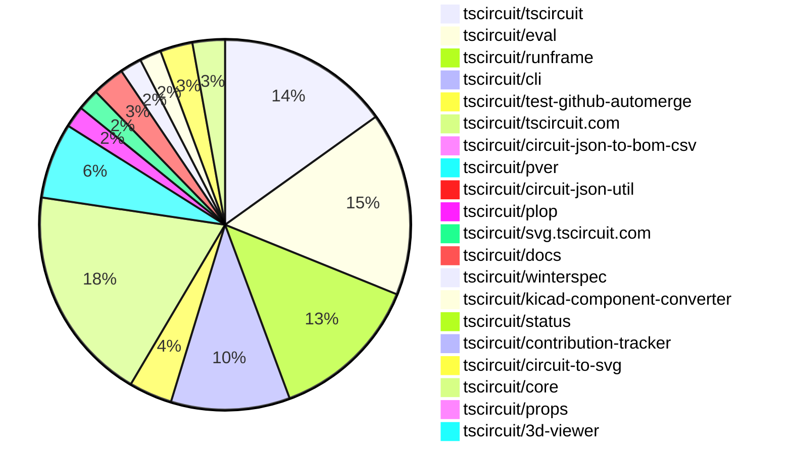
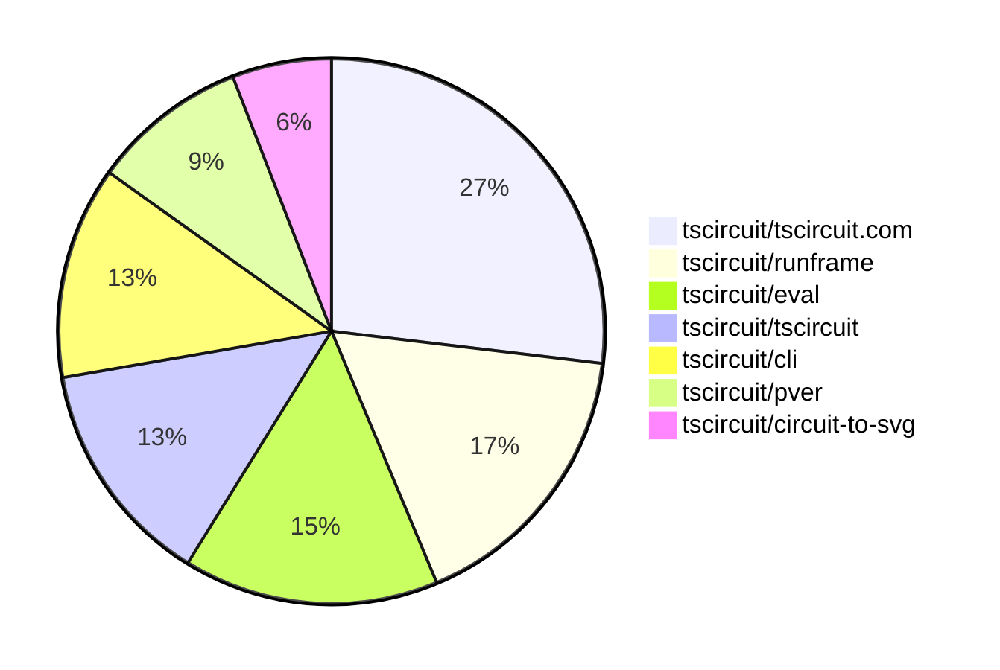

# contribution-tracker

[contributions.tscircuit.com](https://contributions.tscircuit.com) ・ [tscircuit.com](https://tscircuit.com) ・ [Contribution Overviews](./contribution-overviews/) ・ [Changelogs](./changelogs/)

Generates weekly contribution overviews for tscircuit contributors. Check out all
the [contribution overviews here](./contribution-overviews/)
You can find AI-generated monthly changelogs in the [changelogs directory](./changelogs/).

- All PRs in the tscircuit org are scanned/summarized via an LLM
- The LLM classifies each Diff/PR as into a set of attributes for scoring
- All the PRs, summaries, and classifications are organized into charts and tables for [the website](https://contributions.tscircuit.com)

> Want to run locally? See the [Development Section](#development)

The current week is shown below. There are 3 major sections:

- [Contributor Overview](#contributor-overview)
- [PRs by Repository](#prs-by-repository)
- [PRs by Contributor](#changes-by-contributor)

## Current Week

<!-- START_CURRENT_WEEK -->

# Contribution Overview 2025-09-24

## PRs by Repository



## Contributor Overview

| Contributor | 🐳 Major | 🐙 Minor | 🐌 Tiny | ⭐ | Score | Discussion Contributions |
|-------------|---------|---------|---------|-----|----------------|--------------------------|
| [seveibar](#seveibar) | 3 | 3 | 8 | ⭐⭐⭐ | 41 | 0🔹 0🔶 0💎 |
| [imrishabh18](#imrishabh18) | 1 | 2 | 32 | ⭐⭐ | 29.5 | 0🔹 0🔶 0💎 |
| [ArnavK-09](#ArnavK-09) | 1 | 3 | 10 | ⭐⭐ | 23 | 0🔹 0🔶 0💎 |
| [tscircuitbot](#tscircuitbot) | 0 | 0 | 30 | ⭐⭐ | 13 | 0🔹 0🔶 0💎 |
| [pxlpal](#pxlpal) | 3 | 0 | 0 | ⭐⭐ | 12 | 0🔹 0🔶 0💎 |
| [MustafaMulla29](#MustafaMulla29) | 0 | 2 | 6 | ⭐ | 10 | 0🔹 0🔶 0💎 |
| [nailoo](#nailoo) | 1 | 0 | 0 | ⭐ | 4 | 0🔹 0🔶 0💎 |
| [Asymtode712](#Asymtode712) | 0 | 1 | 2 | ⭐ | 3.5 | 0🔹 0🔶 0💎 |
| [Abse2001](#Abse2001) | 0 | 1 | 0 |  | 3 | 0🔹 0🔶 0💎 |
| [Newspicel](#Newspicel) | 0 | 0 | 2 |  | 2 | 0🔹 0🔶 0💎 |
| [baeoc](#baeoc) | 0 | 1 | 0 |  | 2 | 0🔹 0🔶 0💎 |

### Discussion Contribution Legend

- 🔹 Normal Comments: Basic participation with minimal effort
- 🔶 Great Informative Comments: Thoughtful participation that adds value
- 💎 Incredible Comments: Exceptional participation with high-quality content

## Review Table

[reviews-received-hover]: ## "Number of reviews received for PRs for this contributor"
[approvals-received-hover]: ## "Number of approvals received for PRs this contributor authored"
[rejections-received-hover]: ## "Number of rejections received for PRs this contributor authored"
[prs-opened-hover]: ## "Number of PRs opened by this contributor"
[issues-created-hover]: ## "Number of issues created by this contributor"
[bountied-issues-hover]: ## "Number of issues this contributor created with a bounty"
[bountied-issue-$-hover]: ## "Total bounty amount placed on issues authored by this contributor"

| Contributor | Reviews Received | Approvals Received | Rejections Received | Approvals | Rejections | PRs Opened | PRs Merged | Score | Issues Created | Bountied Issues | Bountied Issue $ |
|---|---|---|---|---|---|---|---|---|---|---|---|
| [tscircuitbot](#tscircuitbot) | 1 | 0 | 0 | 0 | 0 | 57 | 30 | 13 | 0 | 0 | 0 |
| [imrishabh18](#imrishabh18) | 3 | 2 | 0 | 6 | 1 | 36 | 35 | 29.5 | 0 | 0 | 0 |
| [naaa760](#naaa760) | 0 | 0 | 0 | 0 | 0 | 3 | 0 | 0 | 0 | 0 | 0 |
| [seveibar](#seveibar) | 8 | 1 | 0 | 31 | 9 | 23 | 16 | 41 | 0 | 0 | 0 |
| [MustafaMulla29](#MustafaMulla29) | 18 | 13 | 0 | 0 | 0 | 16 | 9 | 10 | 0 | 0 | 0 |
| [h30s](#h30s) | 8 | 0 | 0 | 0 | 0 | 4 | 0 | 0 | 0 | 0 | 0 |
| [Abse2001](#Abse2001) | 13 | 1 | 0 | 1 | 0 | 3 | 1 | 3 | 0 | 0 | 0 |
| [ArnavK-09](#ArnavK-09) | 22 | 14 | 1 | 3 | 0 | 18 | 14 | 23 | 0 | 0 | 0 |
| [Asymtode712](#Asymtode712) | 3 | 3 | 0 | 0 | 0 | 4 | 3 | 3.5 | 0 | 0 | 0 |
| [Omar8345](#Omar8345) | 0 | 0 | 0 | 0 | 0 | 2 | 0 | 0 | 0 | 0 | 0 |
| [0hmX](#0hmX) | 1 | 1 | 0 | 0 | 0 | 2 | 0 | 0 | 0 | 0 | 0 |
| [dhvll](#dhvll) | 1 | 0 | 0 | 0 | 0 | 1 | 0 | 0 | 0 | 0 | 0 |
| [ShiboSoftwareDev](#ShiboSoftwareDev) | 0 | 0 | 0 | 1 | 0 | 0 | 0 | 0 | 0 | 0 | 0 |
| [nailoo](#nailoo) | 4 | 1 | 2 | 0 | 0 | 4 | 1 | 4 | 0 | 0 | 0 |
| [saish9901](#saish9901) | 9 | 0 | 3 | 0 | 0 | 2 | 0 | 0 | 0 | 0 | 0 |
| [Newspicel](#Newspicel) | 2 | 2 | 0 | 0 | 0 | 2 | 2 | 2 | 0 | 0 | 0 |
| [baeoc](#baeoc) | 2 | 1 | 0 | 0 | 0 | 2 | 1 | 2 | 0 | 0 | 0 |
| [bitsbyritik](#bitsbyritik) | 0 | 0 | 0 | 0 | 0 | 1 | 0 | 0 | 0 | 0 | 0 |
| [Sahelisaha04](#Sahelisaha04) | 5 | 0 | 0 | 0 | 0 | 1 | 0 | 0 | 0 | 0 | 0 |
| [pxlpal](#pxlpal) | 6 | 3 | 0 | 0 | 0 | 3 | 3 | 12 | 0 | 0 | 0 |
| [HarshitPal25](#HarshitPal25) | 0 | 0 | 0 | 0 | 0 | 2 | 0 | 0 | 0 | 0 | 0 |
| [Harsh9485](#Harsh9485) | 1 | 0 | 1 | 0 | 0 | 1 | 0 | 0 | 0 | 0 | 0 |
| [1914Jegx](#1914Jegx) | 0 | 0 | 0 | 0 | 0 | 2 | 0 | 0 | 0 | 0 | 0 |
| [melmathari](#melmathari) | 1 | 0 | 1 | 0 | 0 | 2 | 0 | 0 | 0 | 0 | 0 |
| [zhyd1997](#zhyd1997) | 1 | 0 | 1 | 0 | 0 | 3 | 0 | 0 | 0 | 0 | 0 |
| [aybanda](#aybanda) | 1 | 0 | 1 | 0 | 0 | 1 | 0 | 0 | 0 | 0 | 0 |

## Top 7 Repositories by Contribution Points



## Changes by Repository

### [tscircuit/tscircuit](https://github.com/tscircuit/tscircuit)


<details>
<summary>🐌 Tiny Contributions (16)</summary>

| PR # | Impact | Contributor | Description |
|------|--------|-------------|-------------|
| [#828](https://github.com/tscircuit/tscircuit/pull/828) | 🐌 Tiny | tscircuitbot | Automated package update |
| [#826](https://github.com/tscircuit/tscircuit/pull/826) | 🐌 Tiny | tscircuitbot | Automated package update |
| [#827](https://github.com/tscircuit/tscircuit/pull/827) | 🐌 Tiny | tscircuitbot | Updates the package version from 0.0.676 to 0.0.677 in package.json |
| [#825](https://github.com/tscircuit/tscircuit/pull/825) | 🐌 Tiny | tscircuitbot | Automated package update |
| [#824](https://github.com/tscircuit/tscircuit/pull/824) | 🐌 Tiny | tscircuitbot | Automated package update |
| [#823](https://github.com/tscircuit/tscircuit/pull/823) | 🐌 Tiny | tscircuitbot | Updates the versions of several dependencies in the package.json file, including tscircuitcli, tscircuitcore, tscircuiteval, and tscircuitrunframe. |
| [#822](https://github.com/tscircuit/tscircuit/pull/822) | 🐌 Tiny | tscircuitbot | Updates the versions of several dependencies in the package.json file. |
| [#821](https://github.com/tscircuit/tscircuit/pull/821) | 🐌 Tiny | tscircuitbot | Automated package update |
| [#813](https://github.com/tscircuit/tscircuit/pull/813) | 🐌 Tiny | tscircuitbot | Automated package update |
| [#820](https://github.com/tscircuit/tscircuit/pull/820) | 🐌 Tiny | imrishabh18 | Skip the tests workflow when the pull request title indicates a version bump. |
| [#818](https://github.com/tscircuit/tscircuit/pull/818) | 🐌 Tiny | imrishabh18 | Updates the GitHub Actions workflow to include a pull request creation step and enable auto-merge for version bumps. |
| [#817](https://github.com/tscircuit/tscircuit/pull/817) | 🐌 Tiny | imrishabh18 | Passes the TSCIRCUIT_BOT_GITHUB_TOKEN to the bun-pver-release workflow to enable automatic version updates during releases. |
| [#816](https://github.com/tscircuit/tscircuit/pull/816) | 🐌 Tiny | imrishabh18 | Adds a GitHub workflow to update packages in upstream repositories and updates the kicad-component-converter dependency version in package.json. |
| [#806](https://github.com/tscircuit/tscircuit/pull/806) | 🐌 Tiny | imrishabh18 | Adds a GitHub workflow to automate the update of tscircuit packages to their latest versions when triggered. |
| [#809](https://github.com/tscircuit/tscircuit/pull/809) | 🐌 Tiny | seveibar | Run copy-core-versions script after updating core dependencies to ensure synchronization of core versions across the project. |
| [#808](https://github.com/tscircuit/tscircuit/pull/808) | 🐌 Tiny | MustafaMulla29 | Updates dependencies to their latest versions to ensure fixed offsets are applied correctly. |

</details>

### [tscircuit/eval](https://github.com/tscircuit/eval)

| PR # | Impact | Rating | Contributor | Description |
|------|--------|--------|-------------|-------------|
| [#1119](https://github.com/tscircuit/eval/pull/1119) | 🐙 Minor | ⭐⭐ | ArnavK-09 | Adds a parser for KiCad footprint files to convert them into circuit JSON format for use in the platform configuration. |

<details>
<summary>🐌 Tiny Contributions (16)</summary>

| PR # | Impact | Contributor | Description |
|------|--------|-------------|-------------|
| [#1135](https://github.com/tscircuit/eval/pull/1135) | 🐌 Tiny | tscircuitbot | Automated package update |
| [#1133](https://github.com/tscircuit/eval/pull/1133) | 🐌 Tiny | tscircuitbot | Automated package update |
| [#1131](https://github.com/tscircuit/eval/pull/1131) | 🐌 Tiny | tscircuitbot | Automated package update |
| [#1129](https://github.com/tscircuit/eval/pull/1129) | 🐌 Tiny | tscircuitbot | Automated package update |
| [#1127](https://github.com/tscircuit/eval/pull/1127) | 🐌 Tiny | tscircuitbot | Automated package update |
| [#1123](https://github.com/tscircuit/eval/pull/1123) | 🐌 Tiny | tscircuitbot | Automated update of tscircuitcore to v0.0.748. |
| [#1117](https://github.com/tscircuit/eval/pull/1117) | 🐌 Tiny | tscircuitbot | Automated update of tscircuitcore to v0.0.747. |
| [#1113](https://github.com/tscircuit/eval/pull/1113) | 🐌 Tiny | tscircuitbot | Automated update of tscircuitcore to v0.0.745. |
| [#1132](https://github.com/tscircuit/eval/pull/1132) | 🐌 Tiny | imrishabh18 | Skip the test workflows for pull requests that are solely version bump changes. |
| [#1130](https://github.com/tscircuit/eval/pull/1130) | 🐌 Tiny | imrishabh18 | Prevents the execution of individual matrix jobs for pull requests that are solely for version bumping, ensuring that unnecessary tests are skipped. |
| [#1128](https://github.com/tscircuit/eval/pull/1128) | 🐌 Tiny | imrishabh18 | Modifies GitHub Actions workflows to skip Playwright tests when the pull request title is chore: bump version. |
| [#1126](https://github.com/tscircuit/eval/pull/1126) | 🐌 Tiny | imrishabh18 | Removes the log-soup package from the project dependencies in the package.json file. |
| [#1125](https://github.com/tscircuit/eval/pull/1125) | 🐌 Tiny | imrishabh18 | Updates the package.json version to 0.0.343 and installs the latest pver version 0.0.41 in the GitHub workflow. |
| [#1124](https://github.com/tscircuit/eval/pull/1124) | 🐌 Tiny | imrishabh18 | Updates the GitHub workflow to create a pull request automatically when a version bump occurs, including enhancements for triggering updates in upstream repositories. |
| [#1120](https://github.com/tscircuit/eval/pull/1120) | 🐌 Tiny | imrishabh18 | Adds a GitHub token secret for the release workflow in the bun-pver-release.yml file |
| [#1134](https://github.com/tscircuit/eval/pull/1134) | 🐌 Tiny | seveibar | Removes the legacy auto-merge workflow as it is no longer needed with the adoption of built-in automerge functionality. |

</details>

### [tscircuit/runframe](https://github.com/tscircuit/runframe)

| PR # | Impact | Rating | Contributor | Description |
|------|--------|--------|-------------|-------------|
| [#1219](https://github.com/tscircuit/runframe/pull/1219) | 🐳 Major | ⭐⭐⭐ | pxlpal | Adds stock number information to the JLCPCB search results displayed in the import dialog, enhancing user visibility of component availability. |
| [#1171](https://github.com/tscircuit/runframe/pull/1171) | 🐳 Major | ⭐⭐⭐ | pxlpal | Add ImportComponentDialog2 and ImportComponentDialogForCli components for importing electronic components from various sources including tscircuit.com, JLCPCB, and KiCad. |

<details>
<summary>🐌 Tiny Contributions (12)</summary>

| PR # | Impact | Contributor | Description |
|------|--------|-------------|-------------|
| [#1249](https://github.com/tscircuit/runframe/pull/1249) | 🐌 Tiny | tscircuitbot | Updates the package version from 0.0.1010 to 0.0.1011 in package.json |
| [#1245](https://github.com/tscircuit/runframe/pull/1245) | 🐌 Tiny | tscircuitbot | Automated package update |
| [#1212](https://github.com/tscircuit/runframe/pull/1212) | 🐌 Tiny | tscircuitbot | Updates the tscircuit3d-viewer package to version 0.0.402 in package.json |
| [#1233](https://github.com/tscircuit/runframe/pull/1233) | 🐌 Tiny | imrishabh18 | This pull request updates the styles generated during the build process, ensuring that the latest styles are applied consistently across the application. |
| [#1232](https://github.com/tscircuit/runframe/pull/1232) | 🐌 Tiny | imrishabh18 | Changes the GitHub Actions workflow to use the --auto flag instead of --rebase for merging pull requests, allowing for automatic merging with squashing. |
| [#1230](https://github.com/tscircuit/runframe/pull/1230) | 🐌 Tiny | imrishabh18 | Updates the package version from 0.0.993 to 0.0.1004 in package.json |
| [#1229](https://github.com/tscircuit/runframe/pull/1229) | 🐌 Tiny | imrishabh18 | Automates version bumping and pull request creation in the GitHub workflow for package updates |
| [#1215](https://github.com/tscircuit/runframe/pull/1215) | 🐌 Tiny | imrishabh18 | Updates the version of the circuit-json-to-bom-csv dependency from 0.0.7 to 0.0.8 in package.json |
| [#1214](https://github.com/tscircuit/runframe/pull/1214) | 🐌 Tiny | imrishabh18 | Adds a GitHub workflow to update the CLI with the latest version of RunFrame upon pushing to the main branch. |
| [#1226](https://github.com/tscircuit/runframe/pull/1226) | 🐌 Tiny | MustafaMulla29 | Updates the version of the schematic-symbols dependency from 0.0.201 to 0.0.202 in package.json |
| [#1217](https://github.com/tscircuit/runframe/pull/1217) | 🐌 Tiny | ArnavK-09 | Adjusts the z-index of the DropdownMenuContent in the FileMenuLeftHeader component to ensure proper layering in the UI. |
| [#1248](https://github.com/tscircuit/runframe/pull/1248) | 🐌 Tiny | Newspicel | Updates the easyeda dependency to version 0.0.228 in the package.json file. |

</details>

### [tscircuit/cli](https://github.com/tscircuit/cli)

| PR # | Impact | Rating | Contributor | Description |
|------|--------|--------|-------------|-------------|
| [#372](https://github.com/tscircuit/cli/pull/372) | 🐳 Major | ⭐⭐⭐ | seveibar | Add a --preview-images flag to the build command that generates PCB, schematic, and 3D preview images and includes a regression test for the new workflow. |
| [#371](https://github.com/tscircuit/cli/pull/371) | 🐙 Minor | ⭐⭐ | seveibar | Adds a fallback in the build process to detect and build the main entrypoint when no circuit or board files exist, ensuring that index.tsx is built when it is the only entrypoint. |

<details>
<summary>🐌 Tiny Contributions (9)</summary>

| PR # | Impact | Contributor | Description |
|------|--------|-------------|-------------|
| [#378](https://github.com/tscircuit/cli/pull/378) | 🐌 Tiny | tscircuitbot | Automated package update |
| [#377](https://github.com/tscircuit/cli/pull/377) | 🐌 Tiny | tscircuitbot | Updates the tscircuitrunframe package from version 0.0.1010 to 0.0.1011 |
| [#376](https://github.com/tscircuit/cli/pull/376) | 🐌 Tiny | tscircuitbot | Automated package update |
| [#375](https://github.com/tscircuit/cli/pull/375) | 🐌 Tiny | tscircuitbot | Updates the tscircuitrunframe package to version 0.0.1010 in the package.json file. |
| [#370](https://github.com/tscircuit/cli/pull/370) | 🐌 Tiny | tscircuitbot | Updates the tscircuitrunframe package to version 0.0.993 in the package.json file. |
| [#369](https://github.com/tscircuit/cli/pull/369) | 🐌 Tiny | tscircuitbot | Updates the tscircuitrunframe package to version 0.0.992 in the package.json file |
| [#374](https://github.com/tscircuit/cli/pull/374) | 🐌 Tiny | imrishabh18 | Updates the GitHub Actions workflow to support multiple upstream repositories and modifies the release command to prevent pushing to the main branch. |
| [#373](https://github.com/tscircuit/cli/pull/373) | 🐌 Tiny | imrishabh18 | Updates GitHub workflows to automate version bumping and pull request creation. |
| [#368](https://github.com/tscircuit/cli/pull/368) | 🐌 Tiny | imrishabh18 | Adds a GitHub workflow to automate the update of tscircuit packages and trigger updates in the upstream repository. |

</details>

### [tscircuit/test-github-automerge](https://github.com/tscircuit/test-github-automerge)


<details>
<summary>🐌 Tiny Contributions (4)</summary>

| PR # | Impact | Contributor | Description |
|------|--------|-------------|-------------|
| [#5](https://github.com/tscircuit/test-github-automerge/pull/5) | 🐌 Tiny | tscircuitbot | Updates the tscircuitcircuit-json-util package from version 0.0.68 to 0.0.72 in the package.json file. |
| [#4](https://github.com/tscircuit/test-github-automerge/pull/4) | 🐌 Tiny | tscircuitbot | Updates the tscircuitcircuit-json-util package from version 0.0.68 to 0.0.72 in the package.json file. |
| [#3](https://github.com/tscircuit/test-github-automerge/pull/3) | 🐌 Tiny | tscircuitbot | Automated package update |
| [#2](https://github.com/tscircuit/test-github-automerge/pull/2) | 🐌 Tiny | tscircuitbot | Updates the tscircuitcircuit-json-util package from version 0.0.71 to 0.0.72 in the package.json file. |

</details>

### [tscircuit/tscircuit.com](https://github.com/tscircuit/tscircuit.com)

| PR # | Impact | Rating | Contributor | Description |
|------|--------|--------|-------------|-------------|
| [#1709](https://github.com/tscircuit/tscircuit.com/pull/1709) | 🐳 Major | ⭐⭐⭐ | imrishabh18 | Fetches the number of packages and members for organizations in the application, enhancing the OrganizationHeader component. |
| [#1713](https://github.com/tscircuit/tscircuit.com/pull/1713) | 🐳 Major | ⭐⭐⭐ | seveibar | Adds Helmet metadata management to the organization settings page and sets the document title to reflect the current organization when viewing settings |
| [#1725](https://github.com/tscircuit/tscircuit.com/pull/1725) | 🐳 Major | ⭐⭐⭐ | ArnavK-09 | Adds functionality to download a ZIP file of package files from the Package Releases Dashboard. |
| [#1730](https://github.com/tscircuit/tscircuit.com/pull/1730) | 🐙 Minor | ⭐⭐ | seveibar | Tracks API request failures for api.tscircuit.com by capturing failure events through PostHog when using React Query. |
| [#1721](https://github.com/tscircuit/tscircuit.com/pull/1721) | 🐙 Minor | ⭐⭐ | ArnavK-09 | Refactors the loading of package images by consolidating queries and correcting the display of loading skeletons. |
| [#1726](https://github.com/tscircuit/tscircuit.com/pull/1726) | 🐙 Minor | ⭐⭐ | baeoc | Prevents server-side rendering (SSR) crashes by ensuring PostHog initialization only occurs in a browser environment. |

<details>
<summary>🐌 Tiny Contributions (14)</summary>

| PR # | Impact | Contributor | Description |
|------|--------|-------------|-------------|
| [#1698](https://github.com/tscircuit/tscircuit.com/pull/1698) | 🐌 Tiny | imrishabh18 | Removes the old build page and associated unused components from the codebase, streamlining the application. |
| [#1714](https://github.com/tscircuit/tscircuit.com/pull/1714) | 🐌 Tiny | seveibar | Updates the landing page header logo to match the blue pill style used elsewhere and removes the unused CircuitBoard icon import from the header. |
| [#1711](https://github.com/tscircuit/tscircuit.com/pull/1711) | 🐌 Tiny | MustafaMulla29 | Updates the version of dependencies to fix offset issues in the application. |
| [#1724](https://github.com/tscircuit/tscircuit.com/pull/1724) | 🐌 Tiny | ArnavK-09 | Refactors the code to replace anchor tags with Link components for improved routing in the application. |
| [#1723](https://github.com/tscircuit/tscircuit.com/pull/1723) | 🐌 Tiny | ArnavK-09 | Fixes the positioning of action buttons for folders in the editor sidebar, ensuring they are correctly aligned and functional. |
| [#1720](https://github.com/tscircuit/tscircuit.com/pull/1720) | 🐌 Tiny | ArnavK-09 | Updated the layout of the Header component to improve responsiveness by removing unnecessary list items and adjusting button visibility based on screen size. |
| [#1715](https://github.com/tscircuit/tscircuit.com/pull/1715) | 🐌 Tiny | ArnavK-09 | Removes HTML response for package not found and throws an error instead. Updates organization filtering logic in the database client. |
| [#1708](https://github.com/tscircuit/tscircuit.com/pull/1708) | 🐌 Tiny | ArnavK-09 | Replaces PrefetchPageLink components with Link components from the wouter library across multiple files in the project. |
| [#1704](https://github.com/tscircuit/tscircuit.com/pull/1704) | 🐌 Tiny | ArnavK-09 | Adjusts padding in the sidebar button to enhance layout consistency. |
| [#1705](https://github.com/tscircuit/tscircuit.com/pull/1705) | 🐌 Tiny | ArnavK-09 | Disables the display of the account balance in the header login component for logged-in users. |
| [#1707](https://github.com/tscircuit/tscircuit.com/pull/1707) | 🐌 Tiny | ArnavK-09 | Hides the review button in the Package Releases Dashboard when the latest build status is error. |
| [#1706](https://github.com/tscircuit/tscircuit.com/pull/1706) | 🐌 Tiny | Asymtode712 | Updates the tscircuitrunframe dependency to version 0.0.993 in package.json |
| [#1702](https://github.com/tscircuit/tscircuit.com/pull/1702) | 🐌 Tiny | Asymtode712 | Updates the tscircuit3d-viewer dependency version from 0.0.391 to 0.0.402 in package.json and modifies the renovate.json configuration. |
| [#1727](https://github.com/tscircuit/tscircuit.com/pull/1727) | 🐌 Tiny | Newspicel | Bumps the Easyeda version to 0.0.228 to add POLYGON pad support and fix a bug with JLCPCB Part C2934569. |

</details>

### [tscircuit/circuit-json-to-bom-csv](https://github.com/tscircuit/circuit-json-to-bom-csv)

| PR # | Impact | Rating | Contributor | Description |
|------|--------|--------|-------------|-------------|
| [#7](https://github.com/tscircuit/circuit-json-to-bom-csv/pull/7) | 🐙 Minor | ⭐⭐ | imrishabh18 | Sets the comment and value columns to DNP when the do_not_place flag is true, and clears the supplier part number columns accordingly. |

### [tscircuit/pver](https://github.com/tscircuit/pver)

| PR # | Impact | Rating | Contributor | Description |
|------|--------|--------|-------------|-------------|
| [#4](https://github.com/tscircuit/pver/pull/4) | 🐳 Major | ⭐⭐⭐ | seveibar | Add support for --readme and --package-json options to increment version in README and package.json without publishing to npm |
| [#5](https://github.com/tscircuit/pver/pull/5) | 🐙 Minor | ⭐⭐ | imrishabh18 | Adds a new command line option to disable pushing to the main branch, overriding the existing push option. |

<details>
<summary>🐌 Tiny Contributions (5)</summary>

| PR # | Impact | Contributor | Description |
|------|--------|-------------|-------------|
| [#10](https://github.com/tscircuit/pver/pull/10) | 🐌 Tiny | imrishabh18 | Always syncs with remote main before pushing changes, ensuring the local branch is up-to-date with the remote branch. |
| [#9](https://github.com/tscircuit/pver/pull/9) | 🐌 Tiny | imrishabh18 | Prevents committing changes when the --no-push-main flag is used, ensuring that changes are only committed when pushing to the main branch. |
| [#8](https://github.com/tscircuit/pver/pull/8) | 🐌 Tiny | imrishabh18 | Fixes the condition for the --no-push-main flag to work correctly in the application context. |
| [#7](https://github.com/tscircuit/pver/pull/7) | 🐌 Tiny | imrishabh18 | Adds a new release method type no-push-main to the ReleaseMethod type definition in the app context. |
| [#6](https://github.com/tscircuit/pver/pull/6) | 🐌 Tiny | imrishabh18 | Restores the package-lock.json file to ensure consistent installations with npm ci. |

</details>

### [tscircuit/circuit-json-util](https://github.com/tscircuit/circuit-json-util)


<details>
<summary>🐌 Tiny Contributions (1)</summary>

| PR # | Impact | Contributor | Description |
|------|--------|-------------|-------------|
| [#69](https://github.com/tscircuit/circuit-json-util/pull/69) | 🐌 Tiny | imrishabh18 | Changes the upstream repository name in the GitHub Actions workflow configuration from pcb-viewer to test-github-automerge. |

</details>

### [tscircuit/plop](https://github.com/tscircuit/plop)


<details>
<summary>🐌 Tiny Contributions (2)</summary>

| PR # | Impact | Contributor | Description |
|------|--------|-------------|-------------|
| [#18](https://github.com/tscircuit/plop/pull/18) | 🐌 Tiny | imrishabh18 | Adds a conditional to skip CI tests for pull requests that are solely for version bumping. |
| [#17](https://github.com/tscircuit/plop/pull/17) | 🐌 Tiny | imrishabh18 | Adds a step to close existing pull requests authored by the bot if they start with chore: and introduces a list of upstream repositories for updates in the workflow. |

</details>

### [tscircuit/svg.tscircuit.com](https://github.com/tscircuit/svg.tscircuit.com)

| PR # | Impact | Rating | Contributor | Description |
|------|--------|--------|-------------|-------------|
| [#310](https://github.com/tscircuit/svg.tscircuit.com/pull/310) | 🐳 Major | ⭐⭐⭐ | pxlpal | Adds support for generating PNG assets from TSCircuit code or circuit JSON in addition to existing SVG functionality. |

<details>
<summary>🐌 Tiny Contributions (1)</summary>

| PR # | Impact | Contributor | Description |
|------|--------|-------------|-------------|
| [#318](https://github.com/tscircuit/svg.tscircuit.com/pull/318) | 🐌 Tiny | imrishabh18 | Adds a GitHub workflow to automate the update of tscircuit packages when triggered by another workflow. |

</details>

### [tscircuit/docs](https://github.com/tscircuit/docs)


<details>
<summary>🐌 Tiny Contributions (3)</summary>

| PR # | Impact | Contributor | Description |
|------|--------|-------------|-------------|
| [#162](https://github.com/tscircuit/docs/pull/162) | 🐌 Tiny | imrishabh18 | Adds documentation for the tscircuit package ecosystems auto-update workflow and introduces support for mermaid diagrams in documentation. |
| [#160](https://github.com/tscircuit/docs/pull/160) | 🐌 Tiny | seveibar | Add stalebot GitHub Actions workflow to automatically mark and close inactive issues and pull requests |
| [#159](https://github.com/tscircuit/docs/pull/159) | 🐌 Tiny | seveibar | Add circuit-json and props repositories to the project overview table with descriptions of their roles. |

</details>

### [tscircuit/winterspec](https://github.com/tscircuit/winterspec)

| PR # | Impact | Rating | Contributor | Description |
|------|--------|--------|-------------|-------------|
| [#43](https://github.com/tscircuit/winterspec/pull/43) | 🐙 Minor | ⭐⭐ | seveibar | Replaces persistent esbuild build context in startDevServer2 with one-off builds and a queued rebuild loop, ensuring esbuild service stops when the dev server shuts down and manifest regeneration is scheduled safely. |

<details>
<summary>🐌 Tiny Contributions (1)</summary>

| PR # | Impact | Contributor | Description |
|------|--------|-------------|-------------|
| [#42](https://github.com/tscircuit/winterspec/pull/42) | 🐌 Tiny | seveibar | Fixes a deadlock issue in the development server build process by serializing rebuilds with a mutex and mapping the winterspec package to local sources for type-checking without publishing artifacts. |

</details>

### [tscircuit/kicad-component-converter](https://github.com/tscircuit/kicad-component-converter)


<details>
<summary>🐌 Tiny Contributions (2)</summary>

| PR # | Impact | Contributor | Description |
|------|--------|-------------|-------------|
| [#141](https://github.com/tscircuit/kicad-component-converter/pull/141) | 🐌 Tiny | seveibar | Disables library bundling in the build process and updates the build scripts accordingly. |
| [#140](https://github.com/tscircuit/kicad-component-converter/pull/140) | 🐌 Tiny | ArnavK-09 | Fixes a typo in the import statement for the parseKicadModToCircuitJson function in the README file. |

</details>

### [tscircuit/status](https://github.com/tscircuit/status)


<details>
<summary>🐌 Tiny Contributions (1)</summary>

| PR # | Impact | Contributor | Description |
|------|--------|-------------|-------------|
| [#48](https://github.com/tscircuit/status/pull/48) | 🐌 Tiny | seveibar | Retries each health check once before reporting an error and logs retries and successes after multiple attempts for better visibility. |

</details>

### [tscircuit/contribution-tracker](https://github.com/tscircuit/contribution-tracker)

| PR # | Impact | Rating | Contributor | Description |
|------|--------|--------|-------------|-------------|
| [#225](https://github.com/tscircuit/contribution-tracker/pull/225) | 🐙 Minor | ⭐⭐ | MustafaMulla29 | Adds a list of users ineligible for sponsorship along with a function to check their eligibility, impacting the sponsorship calculation process. |

### [tscircuit/circuit-to-svg](https://github.com/tscircuit/circuit-to-svg)

| PR # | Impact | Rating | Contributor | Description |
|------|--------|--------|-------------|-------------|
| [#315](https://github.com/tscircuit/circuit-to-svg/pull/315) | 🐳 Major | ⭐⭐⭐ | nailoo | Adds support for rendering the soldermask layer in SVG output when the renderSolderMask option is enabled. |
| [#329](https://github.com/tscircuit/circuit-to-svg/pull/329) | 🐙 Minor | ⭐⭐ | MustafaMulla29 | Fixes the calculation of line endpoints for unconnected pins in the schematic rendering. |

<details>
<summary>🐌 Tiny Contributions (1)</summary>

| PR # | Impact | Contributor | Description |
|------|--------|-------------|-------------|
| [#331](https://github.com/tscircuit/circuit-to-svg/pull/331) | 🐌 Tiny | MustafaMulla29 | Updates the tscircuit dependency to version 0.0.671 to fix offset issues in circuit rendering. |

</details>

### [tscircuit/core](https://github.com/tscircuit/core)

| PR # | Impact | Rating | Contributor | Description |
|------|--------|--------|-------------|-------------|
| [#1408](https://github.com/tscircuit/core/pull/1408) | 🐙 Minor | ⭐⭐ | ArnavK-09 | Adds support for loading KiCad footprints from a specified URL, enhancing the component rendering process. |

<details>
<summary>🐌 Tiny Contributions (2)</summary>

| PR # | Impact | Contributor | Description |
|------|--------|-------------|-------------|
| [#1405](https://github.com/tscircuit/core/pull/1405) | 🐌 Tiny | MustafaMulla29 | Fixes offset issues in SVG rendering by updating the circuit-to-svg dependency version from 0.0.200 to 0.0.202 |
| [#1403](https://github.com/tscircuit/core/pull/1403) | 🐌 Tiny | MustafaMulla29 | Updates the schematic-symbols dependency to version 0.0.202 to resolve an offset issue. |

</details>

### [tscircuit/props](https://github.com/tscircuit/props)

| PR # | Impact | Rating | Contributor | Description |
|------|--------|--------|-------------|-------------|
| [#423](https://github.com/tscircuit/props/pull/423) | 🐙 Minor | ⭐⭐ | Abse2001 | Adds a new optional property connectsTo to the port properties, allowing for a string or an array of strings to define connections. |

### [tscircuit/3d-viewer](https://github.com/tscircuit/3d-viewer)

| PR # | Impact | Rating | Contributor | Description |
|------|--------|--------|-------------|-------------|
| [#503](https://github.com/tscircuit/3d-viewer/pull/503) | 🐙 Minor | ⭐⭐ | Asymtode712 | Fixes loading state issue of the Manifold module on subsequent renders by implementing a global cache for the initialized module. |

## Changes by Contributor

### [tscircuitbot](https://github.com/tscircuitbot)


<details>
<summary>🐌 Tiny Contributions (30)</summary>

| PR # | Impact | Description |
|------|--------|-------------|
| [#828](https://github.com/tscircuit/tscircuit/pull/828) | 🐌 Tiny | Automated package update |
| [#826](https://github.com/tscircuit/tscircuit/pull/826) | 🐌 Tiny | Automated package update |
| [#827](https://github.com/tscircuit/tscircuit/pull/827) | 🐌 Tiny | Updates the package version from 0.0.676 to 0.0.677 in package.json |
| [#825](https://github.com/tscircuit/tscircuit/pull/825) | 🐌 Tiny | Automated package update |
| [#824](https://github.com/tscircuit/tscircuit/pull/824) | 🐌 Tiny | Automated package update |
| [#823](https://github.com/tscircuit/tscircuit/pull/823) | 🐌 Tiny | Updates the versions of several dependencies in the package.json file, including tscircuitcli, tscircuitcore, tscircuiteval, and tscircuitrunframe. |
| [#822](https://github.com/tscircuit/tscircuit/pull/822) | 🐌 Tiny | Updates the versions of several dependencies in the package.json file. |
| [#821](https://github.com/tscircuit/tscircuit/pull/821) | 🐌 Tiny | Automated package update |
| [#813](https://github.com/tscircuit/tscircuit/pull/813) | 🐌 Tiny | Automated package update |
| [#1135](https://github.com/tscircuit/eval/pull/1135) | 🐌 Tiny | Automated package update |
| [#1133](https://github.com/tscircuit/eval/pull/1133) | 🐌 Tiny | Automated package update |
| [#1131](https://github.com/tscircuit/eval/pull/1131) | 🐌 Tiny | Automated package update |
| [#1129](https://github.com/tscircuit/eval/pull/1129) | 🐌 Tiny | Automated package update |
| [#1127](https://github.com/tscircuit/eval/pull/1127) | 🐌 Tiny | Automated package update |
| [#1123](https://github.com/tscircuit/eval/pull/1123) | 🐌 Tiny | Automated update of tscircuitcore to v0.0.748. |
| [#1117](https://github.com/tscircuit/eval/pull/1117) | 🐌 Tiny | Automated update of tscircuitcore to v0.0.747. |
| [#1113](https://github.com/tscircuit/eval/pull/1113) | 🐌 Tiny | Automated update of tscircuitcore to v0.0.745. |
| [#1249](https://github.com/tscircuit/runframe/pull/1249) | 🐌 Tiny | Updates the package version from 0.0.1010 to 0.0.1011 in package.json |
| [#1245](https://github.com/tscircuit/runframe/pull/1245) | 🐌 Tiny | Automated package update |
| [#1212](https://github.com/tscircuit/runframe/pull/1212) | 🐌 Tiny | Updates the tscircuit3d-viewer package to version 0.0.402 in package.json |
| [#378](https://github.com/tscircuit/cli/pull/378) | 🐌 Tiny | Automated package update |
| [#377](https://github.com/tscircuit/cli/pull/377) | 🐌 Tiny | Updates the tscircuitrunframe package from version 0.0.1010 to 0.0.1011 |
| [#376](https://github.com/tscircuit/cli/pull/376) | 🐌 Tiny | Automated package update |
| [#375](https://github.com/tscircuit/cli/pull/375) | 🐌 Tiny | Updates the tscircuitrunframe package to version 0.0.1010 in the package.json file. |
| [#370](https://github.com/tscircuit/cli/pull/370) | 🐌 Tiny | Updates the tscircuitrunframe package to version 0.0.993 in the package.json file. |
| [#369](https://github.com/tscircuit/cli/pull/369) | 🐌 Tiny | Updates the tscircuitrunframe package to version 0.0.992 in the package.json file |
| [#5](https://github.com/tscircuit/test-github-automerge/pull/5) | 🐌 Tiny | Updates the tscircuitcircuit-json-util package from version 0.0.68 to 0.0.72 in the package.json file. |
| [#4](https://github.com/tscircuit/test-github-automerge/pull/4) | 🐌 Tiny | Updates the tscircuitcircuit-json-util package from version 0.0.68 to 0.0.72 in the package.json file. |
| [#3](https://github.com/tscircuit/test-github-automerge/pull/3) | 🐌 Tiny | Automated package update |
| [#2](https://github.com/tscircuit/test-github-automerge/pull/2) | 🐌 Tiny | Updates the tscircuitcircuit-json-util package from version 0.0.71 to 0.0.72 in the package.json file. |

</details>

### [imrishabh18](https://github.com/imrishabh18)

| PRs # | Impact | Rating | Description |
|------|--------|--------|-------------|
| [#1709](https://github.com/tscircuit/tscircuit.com/pull/1709) | 🐳 Major | ⭐⭐⭐ | Fetches the number of packages and members for organizations in the application, enhancing the OrganizationHeader component. |
| [#7](https://github.com/tscircuit/circuit-json-to-bom-csv/pull/7) | 🐙 Minor | ⭐⭐ | Sets the comment and value columns to DNP when the do_not_place flag is true, and clears the supplier part number columns accordingly. |
| [#5](https://github.com/tscircuit/pver/pull/5) | 🐙 Minor | ⭐⭐ | Adds a new command line option to disable pushing to the main branch, overriding the existing push option. |

<details>
<summary>🐌 Tiny Contributions (32)</summary>

| PR # | Impact | Description |
|------|--------|-------------|
| [#820](https://github.com/tscircuit/tscircuit/pull/820) | 🐌 Tiny | Skip the tests workflow when the pull request title indicates a version bump. |
| [#818](https://github.com/tscircuit/tscircuit/pull/818) | 🐌 Tiny | Updates the GitHub Actions workflow to include a pull request creation step and enable auto-merge for version bumps. |
| [#817](https://github.com/tscircuit/tscircuit/pull/817) | 🐌 Tiny | Passes the TSCIRCUIT_BOT_GITHUB_TOKEN to the bun-pver-release workflow to enable automatic version updates during releases. |
| [#816](https://github.com/tscircuit/tscircuit/pull/816) | 🐌 Tiny | Adds a GitHub workflow to update packages in upstream repositories and updates the kicad-component-converter dependency version in package.json. |
| [#806](https://github.com/tscircuit/tscircuit/pull/806) | 🐌 Tiny | Adds a GitHub workflow to automate the update of tscircuit packages to their latest versions when triggered. |
| [#69](https://github.com/tscircuit/circuit-json-util/pull/69) | 🐌 Tiny | Changes the upstream repository name in the GitHub Actions workflow configuration from pcb-viewer to test-github-automerge. |
| [#18](https://github.com/tscircuit/plop/pull/18) | 🐌 Tiny | Adds a conditional to skip CI tests for pull requests that are solely for version bumping. |
| [#17](https://github.com/tscircuit/plop/pull/17) | 🐌 Tiny | Adds a step to close existing pull requests authored by the bot if they start with chore: and introduces a list of upstream repositories for updates in the workflow. |
| [#1698](https://github.com/tscircuit/tscircuit.com/pull/1698) | 🐌 Tiny | Removes the old build page and associated unused components from the codebase, streamlining the application. |
| [#1132](https://github.com/tscircuit/eval/pull/1132) | 🐌 Tiny | Skip the test workflows for pull requests that are solely version bump changes. |
| [#1130](https://github.com/tscircuit/eval/pull/1130) | 🐌 Tiny | Prevents the execution of individual matrix jobs for pull requests that are solely for version bumping, ensuring that unnecessary tests are skipped. |
| [#1128](https://github.com/tscircuit/eval/pull/1128) | 🐌 Tiny | Modifies GitHub Actions workflows to skip Playwright tests when the pull request title is chore: bump version. |
| [#1126](https://github.com/tscircuit/eval/pull/1126) | 🐌 Tiny | Removes the log-soup package from the project dependencies in the package.json file. |
| [#1125](https://github.com/tscircuit/eval/pull/1125) | 🐌 Tiny | Updates the package.json version to 0.0.343 and installs the latest pver version 0.0.41 in the GitHub workflow. |
| [#1124](https://github.com/tscircuit/eval/pull/1124) | 🐌 Tiny | Updates the GitHub workflow to create a pull request automatically when a version bump occurs, including enhancements for triggering updates in upstream repositories. |
| [#1120](https://github.com/tscircuit/eval/pull/1120) | 🐌 Tiny | Adds a GitHub token secret for the release workflow in the bun-pver-release.yml file |
| [#1233](https://github.com/tscircuit/runframe/pull/1233) | 🐌 Tiny | This pull request updates the styles generated during the build process, ensuring that the latest styles are applied consistently across the application. |
| [#1232](https://github.com/tscircuit/runframe/pull/1232) | 🐌 Tiny | Changes the GitHub Actions workflow to use the --auto flag instead of --rebase for merging pull requests, allowing for automatic merging with squashing. |
| [#1230](https://github.com/tscircuit/runframe/pull/1230) | 🐌 Tiny | Updates the package version from 0.0.993 to 0.0.1004 in package.json |
| [#1229](https://github.com/tscircuit/runframe/pull/1229) | 🐌 Tiny | Automates version bumping and pull request creation in the GitHub workflow for package updates |
| [#1215](https://github.com/tscircuit/runframe/pull/1215) | 🐌 Tiny | Updates the version of the circuit-json-to-bom-csv dependency from 0.0.7 to 0.0.8 in package.json |
| [#1214](https://github.com/tscircuit/runframe/pull/1214) | 🐌 Tiny | Adds a GitHub workflow to update the CLI with the latest version of RunFrame upon pushing to the main branch. |
| [#374](https://github.com/tscircuit/cli/pull/374) | 🐌 Tiny | Updates the GitHub Actions workflow to support multiple upstream repositories and modifies the release command to prevent pushing to the main branch. |
| [#373](https://github.com/tscircuit/cli/pull/373) | 🐌 Tiny | Updates GitHub workflows to automate version bumping and pull request creation. |
| [#368](https://github.com/tscircuit/cli/pull/368) | 🐌 Tiny | Adds a GitHub workflow to automate the update of tscircuit packages and trigger updates in the upstream repository. |
| [#10](https://github.com/tscircuit/pver/pull/10) | 🐌 Tiny | Always syncs with remote main before pushing changes, ensuring the local branch is up-to-date with the remote branch. |
| [#9](https://github.com/tscircuit/pver/pull/9) | 🐌 Tiny | Prevents committing changes when the --no-push-main flag is used, ensuring that changes are only committed when pushing to the main branch. |
| [#8](https://github.com/tscircuit/pver/pull/8) | 🐌 Tiny | Fixes the condition for the --no-push-main flag to work correctly in the application context. |
| [#7](https://github.com/tscircuit/pver/pull/7) | 🐌 Tiny | Adds a new release method type no-push-main to the ReleaseMethod type definition in the app context. |
| [#6](https://github.com/tscircuit/pver/pull/6) | 🐌 Tiny | Restores the package-lock.json file to ensure consistent installations with npm ci. |
| [#318](https://github.com/tscircuit/svg.tscircuit.com/pull/318) | 🐌 Tiny | Adds a GitHub workflow to automate the update of tscircuit packages when triggered by another workflow. |
| [#162](https://github.com/tscircuit/docs/pull/162) | 🐌 Tiny | Adds documentation for the tscircuit package ecosystems auto-update workflow and introduces support for mermaid diagrams in documentation. |

</details>

### [seveibar](https://github.com/seveibar)

| PRs # | Impact | Rating | Description |
|------|--------|--------|-------------|
| [#1713](https://github.com/tscircuit/tscircuit.com/pull/1713) | 🐳 Major | ⭐⭐⭐ | Adds Helmet metadata management to the organization settings page and sets the document title to reflect the current organization when viewing settings |
| [#372](https://github.com/tscircuit/cli/pull/372) | 🐳 Major | ⭐⭐⭐ | Add a --preview-images flag to the build command that generates PCB, schematic, and 3D preview images and includes a regression test for the new workflow. |
| [#4](https://github.com/tscircuit/pver/pull/4) | 🐳 Major | ⭐⭐⭐ | Add support for --readme and --package-json options to increment version in README and package.json without publishing to npm |
| [#43](https://github.com/tscircuit/winterspec/pull/43) | 🐙 Minor | ⭐⭐ | Replaces persistent esbuild build context in startDevServer2 with one-off builds and a queued rebuild loop, ensuring esbuild service stops when the dev server shuts down and manifest regeneration is scheduled safely. |
| [#1730](https://github.com/tscircuit/tscircuit.com/pull/1730) | 🐙 Minor | ⭐⭐ | Tracks API request failures for api.tscircuit.com by capturing failure events through PostHog when using React Query. |
| [#371](https://github.com/tscircuit/cli/pull/371) | 🐙 Minor | ⭐⭐ | Adds a fallback in the build process to detect and build the main entrypoint when no circuit or board files exist, ensuring that index.tsx is built when it is the only entrypoint. |

<details>
<summary>🐌 Tiny Contributions (8)</summary>

| PR # | Impact | Description |
|------|--------|-------------|
| [#809](https://github.com/tscircuit/tscircuit/pull/809) | 🐌 Tiny | Run copy-core-versions script after updating core dependencies to ensure synchronization of core versions across the project. |
| [#141](https://github.com/tscircuit/kicad-component-converter/pull/141) | 🐌 Tiny | Disables library bundling in the build process and updates the build scripts accordingly. |
| [#42](https://github.com/tscircuit/winterspec/pull/42) | 🐌 Tiny | Fixes a deadlock issue in the development server build process by serializing rebuilds with a mutex and mapping the winterspec package to local sources for type-checking without publishing artifacts. |
| [#1714](https://github.com/tscircuit/tscircuit.com/pull/1714) | 🐌 Tiny | Updates the landing page header logo to match the blue pill style used elsewhere and removes the unused CircuitBoard icon import from the header. |
| [#48](https://github.com/tscircuit/status/pull/48) | 🐌 Tiny | Retries each health check once before reporting an error and logs retries and successes after multiple attempts for better visibility. |
| [#1134](https://github.com/tscircuit/eval/pull/1134) | 🐌 Tiny | Removes the legacy auto-merge workflow as it is no longer needed with the adoption of built-in automerge functionality. |
| [#160](https://github.com/tscircuit/docs/pull/160) | 🐌 Tiny | Add stalebot GitHub Actions workflow to automatically mark and close inactive issues and pull requests |
| [#159](https://github.com/tscircuit/docs/pull/159) | 🐌 Tiny | Add circuit-json and props repositories to the project overview table with descriptions of their roles. |

</details>

### [MustafaMulla29](https://github.com/MustafaMulla29)

| PRs # | Impact | Rating | Description |
|------|--------|--------|-------------|
| [#225](https://github.com/tscircuit/contribution-tracker/pull/225) | 🐙 Minor | ⭐⭐ | Adds a list of users ineligible for sponsorship along with a function to check their eligibility, impacting the sponsorship calculation process. |
| [#329](https://github.com/tscircuit/circuit-to-svg/pull/329) | 🐙 Minor | ⭐⭐ | Fixes the calculation of line endpoints for unconnected pins in the schematic rendering. |

<details>
<summary>🐌 Tiny Contributions (6)</summary>

| PR # | Impact | Description |
|------|--------|-------------|
| [#808](https://github.com/tscircuit/tscircuit/pull/808) | 🐌 Tiny | Updates dependencies to their latest versions to ensure fixed offsets are applied correctly. |
| [#1405](https://github.com/tscircuit/core/pull/1405) | 🐌 Tiny | Fixes offset issues in SVG rendering by updating the circuit-to-svg dependency version from 0.0.200 to 0.0.202 |
| [#1403](https://github.com/tscircuit/core/pull/1403) | 🐌 Tiny | Updates the schematic-symbols dependency to version 0.0.202 to resolve an offset issue. |
| [#331](https://github.com/tscircuit/circuit-to-svg/pull/331) | 🐌 Tiny | Updates the tscircuit dependency to version 0.0.671 to fix offset issues in circuit rendering. |
| [#1711](https://github.com/tscircuit/tscircuit.com/pull/1711) | 🐌 Tiny | Updates the version of dependencies to fix offset issues in the application. |
| [#1226](https://github.com/tscircuit/runframe/pull/1226) | 🐌 Tiny | Updates the version of the schematic-symbols dependency from 0.0.201 to 0.0.202 in package.json |

</details>

### [Abse2001](https://github.com/Abse2001)

| PRs # | Impact | Rating | Description |
|------|--------|--------|-------------|
| [#423](https://github.com/tscircuit/props/pull/423) | 🐙 Minor | ⭐⭐ | Adds a new optional property connectsTo to the port properties, allowing for a string or an array of strings to define connections. |

### [ArnavK-09](https://github.com/ArnavK-09)

| PRs # | Impact | Rating | Description |
|------|--------|--------|-------------|
| [#1725](https://github.com/tscircuit/tscircuit.com/pull/1725) | 🐳 Major | ⭐⭐⭐ | Adds functionality to download a ZIP file of package files from the Package Releases Dashboard. |
| [#1408](https://github.com/tscircuit/core/pull/1408) | 🐙 Minor | ⭐⭐ | Adds support for loading KiCad footprints from a specified URL, enhancing the component rendering process. |
| [#1721](https://github.com/tscircuit/tscircuit.com/pull/1721) | 🐙 Minor | ⭐⭐ | Refactors the loading of package images by consolidating queries and correcting the display of loading skeletons. |
| [#1119](https://github.com/tscircuit/eval/pull/1119) | 🐙 Minor | ⭐⭐ | Adds a parser for KiCad footprint files to convert them into circuit JSON format for use in the platform configuration. |

<details>
<summary>🐌 Tiny Contributions (10)</summary>

| PR # | Impact | Description |
|------|--------|-------------|
| [#140](https://github.com/tscircuit/kicad-component-converter/pull/140) | 🐌 Tiny | Fixes a typo in the import statement for the parseKicadModToCircuitJson function in the README file. |
| [#1724](https://github.com/tscircuit/tscircuit.com/pull/1724) | 🐌 Tiny | Refactors the code to replace anchor tags with Link components for improved routing in the application. |
| [#1723](https://github.com/tscircuit/tscircuit.com/pull/1723) | 🐌 Tiny | Fixes the positioning of action buttons for folders in the editor sidebar, ensuring they are correctly aligned and functional. |
| [#1720](https://github.com/tscircuit/tscircuit.com/pull/1720) | 🐌 Tiny | Updated the layout of the Header component to improve responsiveness by removing unnecessary list items and adjusting button visibility based on screen size. |
| [#1715](https://github.com/tscircuit/tscircuit.com/pull/1715) | 🐌 Tiny | Removes HTML response for package not found and throws an error instead. Updates organization filtering logic in the database client. |
| [#1708](https://github.com/tscircuit/tscircuit.com/pull/1708) | 🐌 Tiny | Replaces PrefetchPageLink components with Link components from the wouter library across multiple files in the project. |
| [#1704](https://github.com/tscircuit/tscircuit.com/pull/1704) | 🐌 Tiny | Adjusts padding in the sidebar button to enhance layout consistency. |
| [#1705](https://github.com/tscircuit/tscircuit.com/pull/1705) | 🐌 Tiny | Disables the display of the account balance in the header login component for logged-in users. |
| [#1707](https://github.com/tscircuit/tscircuit.com/pull/1707) | 🐌 Tiny | Hides the review button in the Package Releases Dashboard when the latest build status is error. |
| [#1217](https://github.com/tscircuit/runframe/pull/1217) | 🐌 Tiny | Adjusts the z-index of the DropdownMenuContent in the FileMenuLeftHeader component to ensure proper layering in the UI. |

</details>

### [Asymtode712](https://github.com/Asymtode712)

| PRs # | Impact | Rating | Description |
|------|--------|--------|-------------|
| [#503](https://github.com/tscircuit/3d-viewer/pull/503) | 🐙 Minor | ⭐⭐ | Fixes loading state issue of the Manifold module on subsequent renders by implementing a global cache for the initialized module. |

<details>
<summary>🐌 Tiny Contributions (2)</summary>

| PR # | Impact | Description |
|------|--------|-------------|
| [#1706](https://github.com/tscircuit/tscircuit.com/pull/1706) | 🐌 Tiny | Updates the tscircuitrunframe dependency to version 0.0.993 in package.json |
| [#1702](https://github.com/tscircuit/tscircuit.com/pull/1702) | 🐌 Tiny | Updates the tscircuit3d-viewer dependency version from 0.0.391 to 0.0.402 in package.json and modifies the renovate.json configuration. |

</details>

### [nailoo](https://github.com/nailoo)

| PRs # | Impact | Rating | Description |
|------|--------|--------|-------------|
| [#315](https://github.com/tscircuit/circuit-to-svg/pull/315) | 🐳 Major | ⭐⭐⭐ | Adds support for rendering the soldermask layer in SVG output when the renderSolderMask option is enabled. |

### [Newspicel](https://github.com/Newspicel)


<details>
<summary>🐌 Tiny Contributions (2)</summary>

| PR # | Impact | Description |
|------|--------|-------------|
| [#1727](https://github.com/tscircuit/tscircuit.com/pull/1727) | 🐌 Tiny | Bumps the Easyeda version to 0.0.228 to add POLYGON pad support and fix a bug with JLCPCB Part C2934569. |
| [#1248](https://github.com/tscircuit/runframe/pull/1248) | 🐌 Tiny | Updates the easyeda dependency to version 0.0.228 in the package.json file. |

</details>

### [baeoc](https://github.com/baeoc)

| PRs # | Impact | Rating | Description |
|------|--------|--------|-------------|
| [#1726](https://github.com/tscircuit/tscircuit.com/pull/1726) | 🐙 Minor | ⭐⭐ | Prevents server-side rendering (SSR) crashes by ensuring PostHog initialization only occurs in a browser environment. |

### [pxlpal](https://github.com/pxlpal)

| PRs # | Impact | Rating | Description |
|------|--------|--------|-------------|
| [#1219](https://github.com/tscircuit/runframe/pull/1219) | 🐳 Major | ⭐⭐⭐ | Adds stock number information to the JLCPCB search results displayed in the import dialog, enhancing user visibility of component availability. |
| [#1171](https://github.com/tscircuit/runframe/pull/1171) | 🐳 Major | ⭐⭐⭐ | Add ImportComponentDialog2 and ImportComponentDialogForCli components for importing electronic components from various sources including tscircuit.com, JLCPCB, and KiCad. |
| [#310](https://github.com/tscircuit/svg.tscircuit.com/pull/310) | 🐳 Major | ⭐⭐⭐ | Adds support for generating PNG assets from TSCircuit code or circuit JSON in addition to existing SVG functionality. |

## Repository Owners

| Repository | Codeowners |
|------------|------------|
| [builder](https://github.com/tscircuit/builder/blob/main/.github/CODEOWNERS) | [seveibar](https://github.com/seveibar)
| [pcb-viewer](https://github.com/tscircuit/pcb-viewer/blob/main/.github/CODEOWNERS) | [seveibar](https://github.com/seveibar), [ShiboSoftwareDev](https://github.com/ShiboSoftwareDev)
| [footprints-old](https://github.com/tscircuit/footprints-old/blob/main/.github/CODEOWNERS) | [seveibar](https://github.com/seveibar)
| [footprinter](https://github.com/tscircuit/footprinter/blob/main/.github/CODEOWNERS) | [seveibar](https://github.com/seveibar), [techmannih](https://github.com/techmannih)
| [3d-viewer](https://github.com/tscircuit/3d-viewer/blob/main/.github/CODEOWNERS) | [ShiboSoftwareDev](https://github.com/ShiboSoftwareDev)
| [winterspec](https://github.com/tscircuit/winterspec/blob/main/.github/CODEOWNERS) | [seveibar](https://github.com/seveibar), [ShiboSoftwareDev](https://github.com/ShiboSoftwareDev)
| [jscad-electronics](https://github.com/tscircuit/jscad-electronics/blob/main/.github/CODEOWNERS) | [seveibar](https://github.com/seveibar), [abhijitxy](https://github.com/abhijitxy), [anas-sarkez](https://github.com/anas-sarkez)
| [circuit-to-svg](https://github.com/tscircuit/circuit-to-svg/blob/main/.github/CODEOWNERS) | [imrishabh18](https://github.com/imrishabh18)
| [schematic-symbols](https://github.com/tscircuit/schematic-symbols/blob/main/.github/CODEOWNERS) | [seveibar](https://github.com/seveibar), [imrishabh18](https://github.com/imrishabh18), [techmannih](https://github.com/techmannih)
| [circuit-json-to-gerber](https://github.com/tscircuit/circuit-json-to-gerber/blob/main/.github/CODEOWNERS) | [seveibar](https://github.com/seveibar), [ShiboSoftwareDev](https://github.com/ShiboSoftwareDev)
| [tscircuit.com](https://github.com/tscircuit/tscircuit.com/blob/main/.github/CODEOWNERS) | [seveibar](https://github.com/seveibar), [imrishabh18](https://github.com/imrishabh18)
| [cli](https://github.com/tscircuit/cli/blob/main/.github/CODEOWNERS) | [seveibar](https://github.com/seveibar), [imrishabh18](https://github.com/imrishabh18), [ArnavK-09](https://github.com/ArnavK-09)
| [issue-roulette](https://github.com/tscircuit/issue-roulette/blob/main/.github/CODEOWNERS) | [Anshgrover23](https://github.com/Anshgrover23)
| [sparkfun-boards](https://github.com/tscircuit/sparkfun-boards/blob/main/.github/CODEOWNERS) | [ShiboSoftwareDev](https://github.com/ShiboSoftwareDev), [Abse2001](https://github.com/Abse2001), [MustafaMulla29](https://github.com/MustafaMulla29), [Anshgrover23](https://github.com/Anshgrover23), [techmannih](https://github.com/techmannih)
| [schematic-corpus](https://github.com/tscircuit/schematic-corpus/blob/main/.github/CODEOWNERS) | [Abse2001](https://github.com/Abse2001)

## Repositories by Owner

| User | Repo |
|------|------|
| [seveibar](https://github.com/seveibar) | [builder](https://github.com/tscircuit/builder/blob/main/.github/CODEOWNERS) |
|  | [pcb-viewer](https://github.com/tscircuit/pcb-viewer/blob/main/.github/CODEOWNERS) |
|  | [footprints-old](https://github.com/tscircuit/footprints-old/blob/main/.github/CODEOWNERS) |
|  | [footprinter](https://github.com/tscircuit/footprinter/blob/main/.github/CODEOWNERS) |
|  | [winterspec](https://github.com/tscircuit/winterspec/blob/main/.github/CODEOWNERS) |
|  | [jscad-electronics](https://github.com/tscircuit/jscad-electronics/blob/main/.github/CODEOWNERS) |
|  | [schematic-symbols](https://github.com/tscircuit/schematic-symbols/blob/main/.github/CODEOWNERS) |
|  | [circuit-json-to-gerber](https://github.com/tscircuit/circuit-json-to-gerber/blob/main/.github/CODEOWNERS) |
|  | [tscircuit.com](https://github.com/tscircuit/tscircuit.com/blob/main/.github/CODEOWNERS) |
|  | [cli](https://github.com/tscircuit/cli/blob/main/.github/CODEOWNERS) |
| [ShiboSoftwareDev](https://github.com/ShiboSoftwareDev) | [pcb-viewer](https://github.com/tscircuit/pcb-viewer/blob/main/.github/CODEOWNERS) |
|  | [3d-viewer](https://github.com/tscircuit/3d-viewer/blob/main/.github/CODEOWNERS) |
|  | [winterspec](https://github.com/tscircuit/winterspec/blob/main/.github/CODEOWNERS) |
|  | [circuit-json-to-gerber](https://github.com/tscircuit/circuit-json-to-gerber/blob/main/.github/CODEOWNERS) |
|  | [sparkfun-boards](https://github.com/tscircuit/sparkfun-boards/blob/main/.github/CODEOWNERS) |
| [techmannih](https://github.com/techmannih) | [footprinter](https://github.com/tscircuit/footprinter/blob/main/.github/CODEOWNERS) |
|  | [schematic-symbols](https://github.com/tscircuit/schematic-symbols/blob/main/.github/CODEOWNERS) |
|  | [sparkfun-boards](https://github.com/tscircuit/sparkfun-boards/blob/main/.github/CODEOWNERS) |
| [abhijitxy](https://github.com/abhijitxy) | [jscad-electronics](https://github.com/tscircuit/jscad-electronics/blob/main/.github/CODEOWNERS) |
| [anas-sarkez](https://github.com/anas-sarkez) | [jscad-electronics](https://github.com/tscircuit/jscad-electronics/blob/main/.github/CODEOWNERS) |
| [imrishabh18](https://github.com/imrishabh18) | [circuit-to-svg](https://github.com/tscircuit/circuit-to-svg/blob/main/.github/CODEOWNERS) |
|  | [schematic-symbols](https://github.com/tscircuit/schematic-symbols/blob/main/.github/CODEOWNERS) |
|  | [tscircuit.com](https://github.com/tscircuit/tscircuit.com/blob/main/.github/CODEOWNERS) |
|  | [cli](https://github.com/tscircuit/cli/blob/main/.github/CODEOWNERS) |
| [ArnavK-09](https://github.com/ArnavK-09) | [cli](https://github.com/tscircuit/cli/blob/main/.github/CODEOWNERS) |
| [Anshgrover23](https://github.com/Anshgrover23) | [issue-roulette](https://github.com/tscircuit/issue-roulette/blob/main/.github/CODEOWNERS) |
|  | [sparkfun-boards](https://github.com/tscircuit/sparkfun-boards/blob/main/.github/CODEOWNERS) |
| [Abse2001](https://github.com/Abse2001) | [sparkfun-boards](https://github.com/tscircuit/sparkfun-boards/blob/main/.github/CODEOWNERS) |
|  | [schematic-corpus](https://github.com/tscircuit/schematic-corpus/blob/main/.github/CODEOWNERS) |
| [MustafaMulla29](https://github.com/MustafaMulla29) | [sparkfun-boards](https://github.com/tscircuit/sparkfun-boards/blob/main/.github/CODEOWNERS) |


<!-- END_CURRENT_WEEK -->


## Development

### Prerequisites

- [Bun](https://bun.sh/) runtime
- `.env` file with required API keys:
  ```
  GITHUB_TOKEN=your_github_token
  OPENAI_API_KEY=your_openai_api_key
  DISCORD_TOKEN=your_discord_token (optional, for Discord integration)
  SLACK_BOT_TOKEN=your_slack_token (optional, for Slack integration)
  ```

### Available Scripts

#### Core Generation Scripts

- `bun run generate:weekly` - Generate current week's contribution overview
- `bun run generate:monthly` - Generate current month's contribution overview
- `bun run generate:changelog` - Generate monthly changelog from PRs

#### Analysis & Testing

- `bun run analyze-pr` - Analyze a single PR (interactive prompt)
- `bun run test:github` - Test GitHub API integration

#### Notifications & Sync

- `bun run notifications:issues` - Send notifications for new issues
- `bun run notifications:pr` - Send notifications for new PRs
- `bun run sync:discord` - Sync contributor roles with Discord

#### Data Export

- `bun run export:sponsorship` - Generate sponsorship data CSV

#### Development

- `bun run dev` - Start development server for web UI
- `bun run build` - Build for production
- `bun run format` - Format code with Biome

### Usage Examples

```bash
# Generate this week's contribution overview
bun run generate:weekly

# Generate current month's overview
bun run generate:monthly

# Analyze a specific PR
bun run analyze-pr

# Test your GitHub token setup
bun run test:github
```
