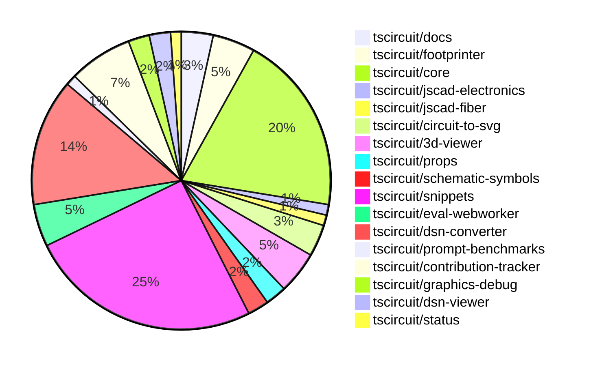

# contribution-tracker

Generates weekly contribution overviews for tscircuit contributors. Check out all
the [contribution overviews here](./contribution-overviews/)

* All PRs in the tscircuit org are scanned/summarized via Claude Haiku
* Claude classifies each Diff/PR as a Major, Minor or Tiny contribution
* All the PRs, summaries, and classifications are organized into charts and tables

The current week is shown below. There are 3 major sections:

* [Contributor Overview](#contributor-overview)
* [PRs by Repository](#prs-by-repository)
* [PRs by Contributor](#changes-by-contributor)

## Current Week

<!-- START_CURRENT_WEEK -->

# Contribution Overview 2024-11-27

## PRs by Repository

## Contributor Overview

| Contributor | 🐳 Major | 🐙 Minor | 🐌 Tiny | ⭐ | Issues Created |
|-------------|---------|---------|---------|-----|----------------|
| [ShiboSoftwareDev](#ShiboSoftwareDev) | 2 | 9 | 4 | ⭐⭐⭐ | 10 |
| [AnasSarkiz](#AnasSarkiz) | 4 | 9 | 0 | ⭐⭐⭐ | 5 |
| [seveibar](#seveibar) | 2 | 4 | 0 | ⭐⭐⭐ | 95 |
| [imrishabh18](#imrishabh18) | 2 | 11 | 0 | ⭐⭐⭐ | 12 |
| [Abse2001](#Abse2001) | 1 | 8 | 2 | ⭐⭐⭐ | 4 |
| [Anshgrover23](#Anshgrover23) | 1 | 9 | 0 | ⭐⭐ | 4 |
| [mrudulpatil18](#mrudulpatil18) | 1 | 7 | 0 | ⭐⭐ | 3 |
| [RohittCodes](#RohittCodes) | 0 | 5 | 0 | ⭐ | 1 |
| [divanshu-go](#divanshu-go) | 2 | 0 | 0 | ⭐ | 0 |
| [techmannih](#techmannih) | 0 | 2 | 0 | ⭐ | 1 |
| [Niharika0104](#Niharika0104) | 0 | 1 | 0 |  | 0 |

## Review Table

| Contributor | Reviews Received | Approvals | Rejections | Changes Requested | PRs Opened | PRs Closed | Issues Created | Bountied Issues | Bountied Issue $ |
|-------------|------------------|-----------|------------|-------------------|------------|------------|----------------|-----------------|------------------|
| [AnasSarkiz](https://github.com/AnasSarkiz) | 29 | 12 | 7 | 5 | 15 | 14 | 5 | 2 | 15 |
| [techmannih](https://github.com/techmannih) | 6 | 2 | 2 | 1 | 5 | 3 | 1 | 0 | 0 |
| [Niharika0104](https://github.com/Niharika0104) | 1 | 1 | 0 | 0 | 1 | 1 | 0 | 0 | 0 |
| [Abse2001](https://github.com/Abse2001) | 19 | 11 | 3 | 2 | 11 | 11 | 4 | 3 | 57 |
| [seveibar](https://github.com/seveibar) | 1 | 0 | 2 | 0 | 8 | 6 | 95 | 54 | 1,248 |
| [ShiboSoftwareDev](https://github.com/ShiboSoftwareDev) | 24 | 14 | 5 | 3 | 18 | 16 | 10 | 4 | 80 |
| [UdaykiranRegimudi](https://github.com/UdaykiranRegimudi) | 1 | 0 | 0 | 1 | 1 | 0 | 0 | 0 | 0 |
| [RohittCodes](https://github.com/RohittCodes) | 15 | 5 | 4 | 5 | 9 | 7 | 1 | 1 | 5 |
| [Anshgrover23](https://github.com/Anshgrover23) | 36 | 10 | 8 | 9 | 16 | 15 | 4 | 0 | 0 |
| [mrudulpatil18](https://github.com/mrudulpatil18) | 13 | 8 | 0 | 1 | 9 | 9 | 3 | 0 | 0 |
| [divanshu-go](https://github.com/divanshu-go) | 5 | 2 | 1 | 2 | 3 | 2 | 0 | 0 | 0 |
| [imrishabh18](https://github.com/imrishabh18) | 4 | 4 | 4 | 0 | 14 | 14 | 12 | 2 | 20 |
| [krushnarout](https://github.com/krushnarout) | 5 | 0 | 0 | 3 | 1 | 0 | 0 | 0 | 0 |

## Changes by Repository

### [tscircuit/docs](https://github.com/tscircuit/docs)

| PR # | Impact | Contributor | Description |
|------|--------|-------------|-------------|
| [#43](https://github.com/tscircuit/docs/pull/43) | 🐳 Major | AnasSarkiz | Added a new tutorial for the ESP32-D0WD development circuit, including all the necessary components and their connections. |
| [#40](https://github.com/tscircuit/docs/pull/40) | 🐙 Minor | Niharika0104 | Added a tutorial for creating an AND gate circuit using the XD74LS08 AND IC. |
| [#41](https://github.com/tscircuit/docs/pull/41) | 🐙 Minor | Abse2001 | Added a new tutorial for an OR gate circuit with multiple LEDs. |

### [tscircuit/footprinter](https://github.com/tscircuit/footprinter)

| PR # | Impact | Contributor | Description |
|------|--------|-------------|-------------|
| [#86](https://github.com/tscircuit/footprinter/pull/86) | 🐳 Major | AnasSarkiz | Refactor the Stampboard and Stampreceiver functions to separate the SMD pads and holes into individual pins. |
| [#92](https://github.com/tscircuit/footprinter/pull/92) | 🐙 Minor | AnasSarkiz | Added default values of 2 for `top` and `bottom` properties in `stampboard` and `stampreceiver` components. |
| [#87](https://github.com/tscircuit/footprinter/pull/87) | 🐙 Minor | AnasSarkiz | Rearranged the pin positions of the sot23-5 (sot235) component to match the data sheet in anti-clockwise order. |
| [#94](https://github.com/tscircuit/footprinter/pull/94) | 🐙 Minor | ShiboSoftwareDev | Updated the package to use "circuit-json" instead of "@tscircuit/soup" |

### [tscircuit/core](https://github.com/tscircuit/core)

| PR # | Impact | Contributor | Description |
|------|--------|-------------|-------------|
| [#362](https://github.com/tscircuit/core/pull/362) | 🐳 Major | AnasSarkiz | Implemented a new event `renderable:renderLifecycle:anyEvent` to make it easier to listen to renderable events. |
| [#373](https://github.com/tscircuit/core/pull/373) | 🐳 Major | seveibar | Introduce job autorouting mode |
| [#364](https://github.com/tscircuit/core/pull/364) | 🐳 Major | ShiboSoftwareDev | Adds support for the "rotated_rect" shape for SMT pads in the PCB rendering. |
| [#379](https://github.com/tscircuit/core/pull/379) | 🐙 Minor | AnasSarkiz | Removed schematic text logic from `Jumper.ts` |
| [#378](https://github.com/tscircuit/core/pull/378) | 🐙 Minor | AnasSarkiz | Moved the schematic text logic to the `SchematicComponentRenderWithSchematicBoxDimensions` component. |
| [#376](https://github.com/tscircuit/core/pull/376) | 🐙 Minor | AnasSarkiz | Adds support for `root.schematicDisabled` to skip rendering all schematic components. |
| [#358](https://github.com/tscircuit/core/pull/358) | 🐙 Minor | AnasSarkiz | Updated the `bun-match-svg` and `@tscircuit/footprinter` dependencies to their latest versions. |
| [#352](https://github.com/tscircuit/core/pull/352) | 🐙 Minor | AnasSarkiz | Implemented `getCurrentRenderPhase` and `getRenderGraph` methods for debugging |
| [#381](https://github.com/tscircuit/core/pull/381) | 🐙 Minor | Abse2001 | Adds a new prop `schDisplayLabel` to the `<trace />` component and includes a test for it. |
| [#374](https://github.com/tscircuit/core/pull/374) | 🐙 Minor | seveibar | Fix prod issues related to GET/POST request differences for autorouting job creation |
| [#393](https://github.com/tscircuit/core/pull/393) | 🐙 Minor | ShiboSoftwareDev | Update dependencies in the project |
| [#369](https://github.com/tscircuit/core/pull/369) | 🐙 Minor | ShiboSoftwareDev | Adds a test for verifying the correct rendering of SMT pads with 90-degree rotation on the PCB. |
| [#368](https://github.com/tscircuit/core/pull/368) | 🐙 Minor | ShiboSoftwareDev | Fixes the drawing of normal rectangular SMT pads when the rotation is 90 degrees. |
| [#355](https://github.com/tscircuit/core/pull/355) | 🐙 Minor | mrudulpatil18 | The pull request ensures that the name passed to the component takes precedence over the default name from the `useRedLed` hook, and it adds a test to verify this behavior. |
| [#363](https://github.com/tscircuit/core/pull/363) | 🐙 Minor | Anshgrover23 | Fixes the issue where the bundle-size.yml workflow doesn't run on pull requests from forks by using `pull_request_target` instead of `pull_request`. |
| [#367](https://github.com/tscircuit/core/pull/367) | 🐌 Tiny | Abse2001 | The pull request adds a PCB snapshot for a USB-C GND and VBUS route issue. |
| [#394](https://github.com/tscircuit/core/pull/394) | 🐌 Tiny | ShiboSoftwareDev | Updated the version of the `@tscircuit/footprinter` dependency from `^0.0.91` to `^0.0.92`. |

### [tscircuit/jscad-electronics](https://github.com/tscircuit/jscad-electronics)

| PR # | Impact | Contributor | Description |
|------|--------|-------------|-------------|
| [#81](https://github.com/tscircuit/jscad-electronics/pull/81) | 🐳 Major | AnasSarkiz | Implemented the `SOT235` (SOT-23-5) 3D component and added a Footprinter3d example for it. |

### [tscircuit/jscad-fiber](https://github.com/tscircuit/jscad-fiber)

| PR # | Impact | Contributor | Description |
|------|--------|-------------|-------------|
| [#95](https://github.com/tscircuit/jscad-fiber/pull/95) | 🐙 Minor | AnasSarkiz | Improve the usage documentation by adding examples of each component in the README. |

### [tscircuit/circuit-to-svg](https://github.com/tscircuit/circuit-to-svg)

| PR # | Impact | Contributor | Description |
|------|--------|-------------|-------------|
| [#140](https://github.com/tscircuit/circuit-to-svg/pull/140) | 🐳 Major | divanshu-go | Adds a GitHub workflow to report bundle and install size differences between the base branch and the pull request branch. |
| [#142](https://github.com/tscircuit/circuit-to-svg/pull/142) | 🐙 Minor | AnasSarkiz | Added metadata attributes and a `<g>` wrapper for draggable schematic components to enable better identification and drag-and-drop functionality. |
| [#143](https://github.com/tscircuit/circuit-to-svg/pull/143) | 🐙 Minor | ShiboSoftwareDev | Update dependencies to newer versions |

### [tscircuit/3d-viewer](https://github.com/tscircuit/3d-viewer)

| PR # | Impact | Contributor | Description |
|------|--------|-------------|-------------|
| [#52](https://github.com/tscircuit/3d-viewer/pull/52) | 🐳 Major | Abse2001 | Fixed a critical issue with tooltips popping up in the 3D viewer. |
| [#50](https://github.com/tscircuit/3d-viewer/pull/50) | 🐙 Minor | Abse2001 | Fixed the issue where the bottom trace between vias was not showing and added a test case to ensure it's working. |
| [#47](https://github.com/tscircuit/3d-viewer/pull/47) | 🐙 Minor | Abse2001 | Fixes a misalignment issue with the 3D viewer components by updating the tooltip position calculation. |
| [#46](https://github.com/tscircuit/3d-viewer/pull/46) | 🐌 Tiny | Abse2001 | Updates the version of the "jscad-electronics" dependency to 0.0.22 in the package.json file. |

### [tscircuit/props](https://github.com/tscircuit/props)

| PR # | Impact | Contributor | Description |
|------|--------|-------------|-------------|
| [#110](https://github.com/tscircuit/props/pull/110) | 🐙 Minor | Abse2001 | Added a new `schDisplayLabel` prop to the `trace` component. |
| [#109](https://github.com/tscircuit/props/pull/109) | 🐙 Minor | seveibar | Add `serverMode` property to `AutorouterConfig` interface and `autorouterConfig` validator. |

### [tscircuit/schematic-symbols](https://github.com/tscircuit/schematic-symbols)

| PR # | Impact | Contributor | Description |
|------|--------|-------------|-------------|
| [#221](https://github.com/tscircuit/schematic-symbols/pull/221) | 🐙 Minor | Abse2001 | Added new symbols for box resistors in different orientations (down, left, right, up) and fixed the anchor position of the text. |
| [#219](https://github.com/tscircuit/schematic-symbols/pull/219) | 🐙 Minor | Abse2001 | Adjusted the coordinates of the REF and VAL text elements for the capacitor symbol. |

### [tscircuit/snippets](https://github.com/tscircuit/snippets)

| PR # | Impact | Contributor | Description |
|------|--------|-------------|-------------|
| [#291](https://github.com/tscircuit/snippets/pull/291) | 🐳 Major | ShiboSoftwareDev | Adds a new GitHub Actions workflow to generate a bundle size report. |
| [#309](https://github.com/tscircuit/snippets/pull/309) | 🐙 Minor | Abse2001 | Update the `@tscircuit/core` package from version `0.0.206` to `0.0.208` to fix a rendering issue when `pcbRotation="90"`. |
| [#325](https://github.com/tscircuit/snippets/pull/325) | 🐙 Minor | seveibar | Update the core library version and fix the expand button |
| [#332](https://github.com/tscircuit/snippets/pull/332) | 🐙 Minor | ShiboSoftwareDev | Fixed test flakiness by using a deterministic port generation instead of random port selection. |
| [#311](https://github.com/tscircuit/snippets/pull/311) | 🐙 Minor | ShiboSoftwareDev | The pull request changes the bundle-size-analysis workflow to only run when the package.json or bun.lock files are modified. |
| [#294](https://github.com/tscircuit/snippets/pull/294) | 🐙 Minor | ShiboSoftwareDev | Updates the GitHub Actions workflow to build and compare the bundle sizes between the PR branch and the main branch. |
| [#330](https://github.com/tscircuit/snippets/pull/330) | 🐙 Minor | mrudulpatil18 | Added a static skeleton page with fixed data to mimic the normal components during loading. |
| [#318](https://github.com/tscircuit/snippets/pull/318) | 🐙 Minor | mrudulpatil18 | Adds a Playwright test for checking underlined imports, ctrl/cmd clickable imports, and takes a snapshot test. |
| [#351](https://github.com/tscircuit/snippets/pull/351) | 🐙 Minor | Anshgrover23 | Fixes the regular expression to support underscores in package names. |
| [#317](https://github.com/tscircuit/snippets/pull/317) | 🐙 Minor | Anshgrover23 | Fix the broken Cmd Click functionality for clicking on snippets |
| [#302](https://github.com/tscircuit/snippets/pull/302) | 🐙 Minor | Anshgrover23 | Fixes a regular expression to properly import package names with dashes. |
| [#303](https://github.com/tscircuit/snippets/pull/303) | 🐙 Minor | imrishabh18 | Adds a new "Dev Login" page that allows users to log in using their GitHub username. |
| [#298](https://github.com/tscircuit/snippets/pull/298) | 🐙 Minor | imrishabh18 | Fixes the `invalid_code_token` issue when not using `localhost` for the `next` parameter in the GitHub OAuth authorization URL. |
| [#350](https://github.com/tscircuit/snippets/pull/350) | 🐙 Minor | techmannih | Add retries for flaky test |
| [#338](https://github.com/tscircuit/snippets/pull/338) | 🐙 Minor | techmannih | Fix the issue of multiple cursors when Ctrl+Click is triggered. |
| [#327](https://github.com/tscircuit/snippets/pull/327) | 🐙 Minor | RohittCodes | Adds a new component `PcbViewerWithContainerHeight` that adjusts the height of the PCB viewer based on the container height and the screen height. |
| [#307](https://github.com/tscircuit/snippets/pull/307) | 🐙 Minor | RohittCodes | Refactors the search links to open in a new tab if the user is on the "/editor" or "/ai" routes, and opens in the current tab otherwise. |
| [#297](https://github.com/tscircuit/snippets/pull/297) | 🐙 Minor | RohittCodes | Added a timeout and a finally block to the rename snippet dialog. |
| [#341](https://github.com/tscircuit/snippets/pull/341) | 🐙 Minor | RohittCodes | Increase the timeout for Playwright tests from 5 minutes to 10 minutes. |
| [#285](https://github.com/tscircuit/snippets/pull/285) | 🐙 Minor | RohittCodes | Adds a full-screen toggle button to the preview content |
| [#306](https://github.com/tscircuit/snippets/pull/306) | 🐌 Tiny | ShiboSoftwareDev | Updated the `@tscircuit/3d-viewer` dependency from version `0.0.43` to `0.0.44`. |
| [#304](https://github.com/tscircuit/snippets/pull/304) | 🐌 Tiny | ShiboSoftwareDev | Cleaned up an extra workflow file by removing the `bundle-size.yml` file and renaming the `trigger-size-check.yml` file to `bundle-size-analysis.yml`. |

### [tscircuit/eval-webworker](https://github.com/tscircuit/eval-webworker)

| PR # | Impact | Contributor | Description |
|------|--------|-------------|-------------|
| [#5](https://github.com/tscircuit/eval-webworker/pull/5) | 🐳 Major | seveibar | Add workflows for format check, test, and type check. Fix test, and publish version 0.0.1. |
| [#6](https://github.com/tscircuit/eval-webworker/pull/6) | 🐳 Major | mrudulpatil18 | Adds a global event emitter to handle re-emission of events from the web worker API |
| [#10](https://github.com/tscircuit/eval-webworker/pull/10) | 🐙 Minor | mrudulpatil18 | Configure the build process to generate declaration files |
| [#8](https://github.com/tscircuit/eval-webworker/pull/8) | 🐙 Minor | mrudulpatil18 | Adds a build step before the release process to ensure the project is built correctly. |

### [tscircuit/dsn-converter](https://github.com/tscircuit/dsn-converter)

| PR # | Impact | Contributor | Description |
|------|--------|-------------|-------------|
| [#53](https://github.com/tscircuit/dsn-converter/pull/53) | 🐳 Major | imrishabh18 | Refactor the code to improve the handling of plated holes and SMT pads, and add tests for the Arduino Nano. |
| [#47](https://github.com/tscircuit/dsn-converter/pull/47) | 🐳 Major | imrishabh18 | This pull request adds support for pill-shaped plated holes in the circuit-json to dsn-json conversion process. |
| [#39](https://github.com/tscircuit/dsn-converter/pull/39) | 🐙 Minor | seveibar | Correctly size plated holes for homogenous components |
| [#52](https://github.com/tscircuit/dsn-converter/pull/52) | 🟣 | imrishabh18 | Refactor padstack name and padstack shape |
| [#51](https://github.com/tscircuit/dsn-converter/pull/51) | 🐙 Minor | imrishabh18 | Fixes the rotation and footprint naming of components in the PCB design process. |
| [#49](https://github.com/tscircuit/dsn-converter/pull/49) | 🐙 Minor | imrishabh18 | Fix the position of pads to be in the correct sequence. |
| [#46](https://github.com/tscircuit/dsn-converter/pull/46) | 🐙 Minor | imrishabh18 | Fix for handling different sized plated holes in the circuit-json-to-dsn-json conversion process. |
| [#45](https://github.com/tscircuit/dsn-converter/pull/45) | 🐙 Minor | imrishabh18 | The change refactors the way chip components are processed, removing the separate `processChips` function and instead processing them alongside other components and pads. |
| [#43](https://github.com/tscircuit/dsn-converter/pull/43) | 🐙 Minor | imrishabh18 | Removes hardcoded size of smtpads and uses the default trace width of circuit json |
| [#38](https://github.com/tscircuit/dsn-converter/pull/38) | 🐙 Minor | imrishabh18 | Adds `from_layer` and `to_layer` properties to the `convert-via-to-pcb-via.ts` function. |
| [#37](https://github.com/tscircuit/dsn-converter/pull/37) | 🐙 Minor | imrishabh18 | Add the via's and test to check the via's are present |
| [#36](https://github.com/tscircuit/dsn-converter/pull/36) | 🐙 Minor | imrishabh18 | Adds support for handling circular shapes in the DSN to circuit JSON conversion process. |

### [tscircuit/prompt-benchmarks](https://github.com/tscircuit/prompt-benchmarks)

| PR # | Impact | Contributor | Description |
|------|--------|-------------|-------------|
| [#8](https://github.com/tscircuit/prompt-benchmarks/pull/8) | 🐙 Minor | ShiboSoftwareDev | The pull request adds new benchmark problems for testing AI-generated circuit designs, including a 555 timer with a blinking LED, an LED driver circuit, an RC low-pass filter, and an astable multivibrator. |

### [tscircuit/contribution-tracker](https://github.com/tscircuit/contribution-tracker)

| PR # | Impact | Contributor | Description |
|------|--------|-------------|-------------|
| [#17](https://github.com/tscircuit/contribution-tracker/pull/17) | 🐳 Major | Anshgrover23 | Adds functionality to detect the number of issues created that have a bounty. |
| [#20](https://github.com/tscircuit/contribution-tracker/pull/20) | 🐙 Minor | Anshgrover23 | Adds the number of bountied issues as a star factor in the contributor table. |
| [#13](https://github.com/tscircuit/contribution-tracker/pull/13) | 🐙 Minor | Anshgrover23 | Fixes the review table in the generated Markdown by adding the "Issues Created" column. |
| [#11](https://github.com/tscircuit/contribution-tracker/pull/11) | 🐙 Minor | Anshgrover23 | Fixes the review table by adding "Issues Created" column and adjusting the table layout. |
| [#12](https://github.com/tscircuit/contribution-tracker/pull/12) | 🐙 Minor | imrishabh18 | Reverts the previous "Fix review table" pull request (tscircuit/contribution-tracker#11). |
| [#14](https://github.com/tscircuit/contribution-tracker/pull/14) | 🐌 Tiny | ShiboSoftwareDev | Fixed the formatting of the review table in the generated Markdown |

### [tscircuit/graphics-debug](https://github.com/tscircuit/graphics-debug)

| PR # | Impact | Contributor | Description |
|------|--------|-------------|-------------|
| [#8](https://github.com/tscircuit/graphics-debug/pull/8) | 🐙 Minor | mrudulpatil18 | Fixes the issue of crosshair visibility on the website by adding a custom `SVGRenderer` component to handle SVGs generated with script (for crosshair) correctly. |
| [#7](https://github.com/tscircuit/graphics-debug/pull/7) | 🐙 Minor | mrudulpatil18 | Adds a "See Example" button to load sample graphics data into the input element for visualization |

### [tscircuit/dsn-viewer](https://github.com/tscircuit/dsn-viewer)

| PR # | Impact | Contributor | Description |
|------|--------|-------------|-------------|
| [#7](https://github.com/tscircuit/dsn-viewer/pull/7) | 🐳 Major | divanshu-go | Adds support for multiple file uploads and handling of both DSN PCB and session files. |
| [#8](https://github.com/tscircuit/dsn-viewer/pull/8) | 🐙 Minor | Anshgrover23 | Sets up a basic playwright test for the project. |

### [tscircuit/status](https://github.com/tscircuit/status)

| PR # | Impact | Contributor | Description |
|------|--------|-------------|-------------|
| [#3](https://github.com/tscircuit/status/pull/3) | 🐙 Minor | Anshgrover23 | Fix bars getting cut off in the generated site. |

## Changes by Contributor

### [AnasSarkiz](https://github.com/AnasSarkiz)

| PR # | Impact | Description |
|------|--------|-------------|
| [#43](https://github.com/tscircuit/docs/pull/43) | 🐳 Major | Added a new tutorial for the ESP32-D0WD development circuit, including all the necessary components and their connections. |
| [#86](https://github.com/tscircuit/footprinter/pull/86) | 🐳 Major | Refactor the Stampboard and Stampreceiver functions to separate the SMD pads and holes into individual pins. |
| [#362](https://github.com/tscircuit/core/pull/362) | 🐳 Major | Implemented a new event `renderable:renderLifecycle:anyEvent` to make it easier to listen to renderable events. |
| [#81](https://github.com/tscircuit/jscad-electronics/pull/81) | 🐳 Major | Implemented the `SOT235` (SOT-23-5) 3D component and added a Footprinter3d example for it. |
| [#92](https://github.com/tscircuit/footprinter/pull/92) | 🐙 Minor | Added default values of 2 for `top` and `bottom` properties in `stampboard` and `stampreceiver` components. |
| [#87](https://github.com/tscircuit/footprinter/pull/87) | 🐙 Minor | Rearranged the pin positions of the sot23-5 (sot235) component to match the data sheet in anti-clockwise order. |
| [#379](https://github.com/tscircuit/core/pull/379) | 🐙 Minor | Removed schematic text logic from `Jumper.ts` |
| [#378](https://github.com/tscircuit/core/pull/378) | 🐙 Minor | Moved the schematic text logic to the `SchematicComponentRenderWithSchematicBoxDimensions` component. |
| [#376](https://github.com/tscircuit/core/pull/376) | 🐙 Minor | Adds support for `root.schematicDisabled` to skip rendering all schematic components. |
| [#358](https://github.com/tscircuit/core/pull/358) | 🐙 Minor | Updated the `bun-match-svg` and `@tscircuit/footprinter` dependencies to their latest versions. |
| [#352](https://github.com/tscircuit/core/pull/352) | 🐙 Minor | Implemented `getCurrentRenderPhase` and `getRenderGraph` methods for debugging |
| [#95](https://github.com/tscircuit/jscad-fiber/pull/95) | 🐙 Minor | Improve the usage documentation by adding examples of each component in the README. |
| [#142](https://github.com/tscircuit/circuit-to-svg/pull/142) | 🐙 Minor | Added metadata attributes and a `<g>` wrapper for draggable schematic components to enable better identification and drag-and-drop functionality. |

### [Niharika0104](https://github.com/Niharika0104)

| PR # | Impact | Description |
|------|--------|-------------|
| [#40](https://github.com/tscircuit/docs/pull/40) | 🐙 Minor | Added a tutorial for creating an AND gate circuit using the XD74LS08 AND IC. |

### [Abse2001](https://github.com/Abse2001)

| PR # | Impact | Description |
|------|--------|-------------|
| [#52](https://github.com/tscircuit/3d-viewer/pull/52) | 🐳 Major | Fixed a critical issue with tooltips popping up in the 3D viewer. |
| [#41](https://github.com/tscircuit/docs/pull/41) | 🐙 Minor | Added a new tutorial for an OR gate circuit with multiple LEDs. |
| [#110](https://github.com/tscircuit/props/pull/110) | 🐙 Minor | Added a new `schDisplayLabel` prop to the `trace` component. |
| [#50](https://github.com/tscircuit/3d-viewer/pull/50) | 🐙 Minor | Fixed the issue where the bottom trace between vias was not showing and added a test case to ensure it's working. |
| [#47](https://github.com/tscircuit/3d-viewer/pull/47) | 🐙 Minor | Fixes a misalignment issue with the 3D viewer components by updating the tooltip position calculation. |
| [#381](https://github.com/tscircuit/core/pull/381) | 🐙 Minor | Adds a new prop `schDisplayLabel` to the `<trace />` component and includes a test for it. |
| [#221](https://github.com/tscircuit/schematic-symbols/pull/221) | 🐙 Minor | Added new symbols for box resistors in different orientations (down, left, right, up) and fixed the anchor position of the text. |
| [#219](https://github.com/tscircuit/schematic-symbols/pull/219) | 🐙 Minor | Adjusted the coordinates of the REF and VAL text elements for the capacitor symbol. |
| [#309](https://github.com/tscircuit/snippets/pull/309) | 🐙 Minor | Update the `@tscircuit/core` package from version `0.0.206` to `0.0.208` to fix a rendering issue when `pcbRotation="90"`. |
| [#46](https://github.com/tscircuit/3d-viewer/pull/46) | 🐌 Tiny | Updates the version of the "jscad-electronics" dependency to 0.0.22 in the package.json file. |
| [#367](https://github.com/tscircuit/core/pull/367) | 🐌 Tiny | The pull request adds a PCB snapshot for a USB-C GND and VBUS route issue. |

### [seveibar](https://github.com/seveibar)

| PR # | Impact | Description |
|------|--------|-------------|
| [#373](https://github.com/tscircuit/core/pull/373) | 🐳 Major | Introduce job autorouting mode |
| [#5](https://github.com/tscircuit/eval-webworker/pull/5) | 🐳 Major | Add workflows for format check, test, and type check. Fix test, and publish version 0.0.1. |
| [#109](https://github.com/tscircuit/props/pull/109) | 🐙 Minor | Add `serverMode` property to `AutorouterConfig` interface and `autorouterConfig` validator. |
| [#374](https://github.com/tscircuit/core/pull/374) | 🐙 Minor | Fix prod issues related to GET/POST request differences for autorouting job creation |
| [#39](https://github.com/tscircuit/dsn-converter/pull/39) | 🐙 Minor | Correctly size plated holes for homogenous components |
| [#325](https://github.com/tscircuit/snippets/pull/325) | 🐙 Minor | Update the core library version and fix the expand button |

### [ShiboSoftwareDev](https://github.com/ShiboSoftwareDev)

| PR # | Impact | Description |
|------|--------|-------------|
| [#364](https://github.com/tscircuit/core/pull/364) | 🐳 Major | Adds support for the "rotated_rect" shape for SMT pads in the PCB rendering. |
| [#291](https://github.com/tscircuit/snippets/pull/291) | 🐳 Major | Adds a new GitHub Actions workflow to generate a bundle size report. |
| [#94](https://github.com/tscircuit/footprinter/pull/94) | 🐙 Minor | Updated the package to use "circuit-json" instead of "@tscircuit/soup" |
| [#393](https://github.com/tscircuit/core/pull/393) | 🐙 Minor | Update dependencies in the project |
| [#369](https://github.com/tscircuit/core/pull/369) | 🐙 Minor | Adds a test for verifying the correct rendering of SMT pads with 90-degree rotation on the PCB. |
| [#368](https://github.com/tscircuit/core/pull/368) | 🐙 Minor | Fixes the drawing of normal rectangular SMT pads when the rotation is 90 degrees. |
| [#143](https://github.com/tscircuit/circuit-to-svg/pull/143) | 🐙 Minor | Update dependencies to newer versions |
| [#332](https://github.com/tscircuit/snippets/pull/332) | 🐙 Minor | Fixed test flakiness by using a deterministic port generation instead of random port selection. |
| [#311](https://github.com/tscircuit/snippets/pull/311) | 🐙 Minor | The pull request changes the bundle-size-analysis workflow to only run when the package.json or bun.lock files are modified. |
| [#294](https://github.com/tscircuit/snippets/pull/294) | 🐙 Minor | Updates the GitHub Actions workflow to build and compare the bundle sizes between the PR branch and the main branch. |
| [#8](https://github.com/tscircuit/prompt-benchmarks/pull/8) | 🐙 Minor | The pull request adds new benchmark problems for testing AI-generated circuit designs, including a 555 timer with a blinking LED, an LED driver circuit, an RC low-pass filter, and an astable multivibrator. |
| [#394](https://github.com/tscircuit/core/pull/394) | 🐌 Tiny | Updated the version of the `@tscircuit/footprinter` dependency from `^0.0.91` to `^0.0.92`. |
| [#14](https://github.com/tscircuit/contribution-tracker/pull/14) | 🐌 Tiny | Fixed the formatting of the review table in the generated Markdown |
| [#306](https://github.com/tscircuit/snippets/pull/306) | 🐌 Tiny | Updated the `@tscircuit/3d-viewer` dependency from version `0.0.43` to `0.0.44`. |
| [#304](https://github.com/tscircuit/snippets/pull/304) | 🐌 Tiny | Cleaned up an extra workflow file by removing the `bundle-size.yml` file and renaming the `trigger-size-check.yml` file to `bundle-size-analysis.yml`. |

### [mrudulpatil18](https://github.com/mrudulpatil18)

| PR # | Impact | Description |
|------|--------|-------------|
| [#6](https://github.com/tscircuit/eval-webworker/pull/6) | 🐳 Major | Adds a global event emitter to handle re-emission of events from the web worker API |
| [#355](https://github.com/tscircuit/core/pull/355) | 🐙 Minor | The pull request ensures that the name passed to the component takes precedence over the default name from the `useRedLed` hook, and it adds a test to verify this behavior. |
| [#330](https://github.com/tscircuit/snippets/pull/330) | 🐙 Minor | Added a static skeleton page with fixed data to mimic the normal components during loading. |
| [#318](https://github.com/tscircuit/snippets/pull/318) | 🐙 Minor | Adds a Playwright test for checking underlined imports, ctrl/cmd clickable imports, and takes a snapshot test. |
| [#8](https://github.com/tscircuit/graphics-debug/pull/8) | 🐙 Minor | Fixes the issue of crosshair visibility on the website by adding a custom `SVGRenderer` component to handle SVGs generated with script (for crosshair) correctly. |
| [#7](https://github.com/tscircuit/graphics-debug/pull/7) | 🐙 Minor | Adds a "See Example" button to load sample graphics data into the input element for visualization |
| [#10](https://github.com/tscircuit/eval-webworker/pull/10) | 🐙 Minor | Configure the build process to generate declaration files |
| [#8](https://github.com/tscircuit/eval-webworker/pull/8) | 🐙 Minor | Adds a build step before the release process to ensure the project is built correctly. |

### [Anshgrover23](https://github.com/Anshgrover23)

| PR # | Impact | Description |
|------|--------|-------------|
| [#17](https://github.com/tscircuit/contribution-tracker/pull/17) | 🐳 Major | Adds functionality to detect the number of issues created that have a bounty. |
| [#363](https://github.com/tscircuit/core/pull/363) | 🐙 Minor | Fixes the issue where the bundle-size.yml workflow doesn't run on pull requests from forks by using `pull_request_target` instead of `pull_request`. |
| [#20](https://github.com/tscircuit/contribution-tracker/pull/20) | 🐙 Minor | Adds the number of bountied issues as a star factor in the contributor table. |
| [#13](https://github.com/tscircuit/contribution-tracker/pull/13) | 🐙 Minor | Fixes the review table in the generated Markdown by adding the "Issues Created" column. |
| [#11](https://github.com/tscircuit/contribution-tracker/pull/11) | 🐙 Minor | Fixes the review table by adding "Issues Created" column and adjusting the table layout. |
| [#351](https://github.com/tscircuit/snippets/pull/351) | 🐙 Minor | Fixes the regular expression to support underscores in package names. |
| [#317](https://github.com/tscircuit/snippets/pull/317) | 🐙 Minor | Fix the broken Cmd Click functionality for clicking on snippets |
| [#302](https://github.com/tscircuit/snippets/pull/302) | 🐙 Minor | Fixes a regular expression to properly import package names with dashes. |
| [#8](https://github.com/tscircuit/dsn-viewer/pull/8) | 🐙 Minor | Sets up a basic playwright test for the project. |
| [#3](https://github.com/tscircuit/status/pull/3) | 🐙 Minor | Fix bars getting cut off in the generated site. |

### [imrishabh18](https://github.com/imrishabh18)

| PR # | Impact | Description |
|------|--------|-------------|
| [#53](https://github.com/tscircuit/dsn-converter/pull/53) | 🐳 Major | Refactor the code to improve the handling of plated holes and SMT pads, and add tests for the Arduino Nano. |
| [#47](https://github.com/tscircuit/dsn-converter/pull/47) | 🐳 Major | This pull request adds support for pill-shaped plated holes in the circuit-json to dsn-json conversion process. |
| [#12](https://github.com/tscircuit/contribution-tracker/pull/12) | 🐙 Minor | Reverts the previous "Fix review table" pull request (tscircuit/contribution-tracker#11). |
| [#52](https://github.com/tscircuit/dsn-converter/pull/52) | 🟣 | Refactor padstack name and padstack shape |
| [#51](https://github.com/tscircuit/dsn-converter/pull/51) | 🐙 Minor | Fixes the rotation and footprint naming of components in the PCB design process. |
| [#49](https://github.com/tscircuit/dsn-converter/pull/49) | 🐙 Minor | Fix the position of pads to be in the correct sequence. |
| [#46](https://github.com/tscircuit/dsn-converter/pull/46) | 🐙 Minor | Fix for handling different sized plated holes in the circuit-json-to-dsn-json conversion process. |
| [#45](https://github.com/tscircuit/dsn-converter/pull/45) | 🐙 Minor | The change refactors the way chip components are processed, removing the separate `processChips` function and instead processing them alongside other components and pads. |
| [#43](https://github.com/tscircuit/dsn-converter/pull/43) | 🐙 Minor | Removes hardcoded size of smtpads and uses the default trace width of circuit json |
| [#38](https://github.com/tscircuit/dsn-converter/pull/38) | 🐙 Minor | Adds `from_layer` and `to_layer` properties to the `convert-via-to-pcb-via.ts` function. |
| [#37](https://github.com/tscircuit/dsn-converter/pull/37) | 🐙 Minor | Add the via's and test to check the via's are present |
| [#36](https://github.com/tscircuit/dsn-converter/pull/36) | 🐙 Minor | Adds support for handling circular shapes in the DSN to circuit JSON conversion process. |
| [#303](https://github.com/tscircuit/snippets/pull/303) | 🐙 Minor | Adds a new "Dev Login" page that allows users to log in using their GitHub username. |
| [#298](https://github.com/tscircuit/snippets/pull/298) | 🐙 Minor | Fixes the `invalid_code_token` issue when not using `localhost` for the `next` parameter in the GitHub OAuth authorization URL. |

### [divanshu-go](https://github.com/divanshu-go)

| PR # | Impact | Description |
|------|--------|-------------|
| [#140](https://github.com/tscircuit/circuit-to-svg/pull/140) | 🐳 Major | Adds a GitHub workflow to report bundle and install size differences between the base branch and the pull request branch. |
| [#7](https://github.com/tscircuit/dsn-viewer/pull/7) | 🐳 Major | Adds support for multiple file uploads and handling of both DSN PCB and session files. |

### [techmannih](https://github.com/techmannih)

| PR # | Impact | Description |
|------|--------|-------------|
| [#350](https://github.com/tscircuit/snippets/pull/350) | 🐙 Minor | Add retries for flaky test |
| [#338](https://github.com/tscircuit/snippets/pull/338) | 🐙 Minor | Fix the issue of multiple cursors when Ctrl+Click is triggered. |

### [RohittCodes](https://github.com/RohittCodes)

| PR # | Impact | Description |
|------|--------|-------------|
| [#327](https://github.com/tscircuit/snippets/pull/327) | 🐙 Minor | Adds a new component `PcbViewerWithContainerHeight` that adjusts the height of the PCB viewer based on the container height and the screen height. |
| [#307](https://github.com/tscircuit/snippets/pull/307) | 🐙 Minor | Refactors the search links to open in a new tab if the user is on the "/editor" or "/ai" routes, and opens in the current tab otherwise. |
| [#297](https://github.com/tscircuit/snippets/pull/297) | 🐙 Minor | Added a timeout and a finally block to the rename snippet dialog. |
| [#341](https://github.com/tscircuit/snippets/pull/341) | 🐙 Minor | Increase the timeout for Playwright tests from 5 minutes to 10 minutes. |
| [#285](https://github.com/tscircuit/snippets/pull/285) | 🐙 Minor | Adds a full-screen toggle button to the preview content |

<!-- END_CURRENT_WEEK -->
