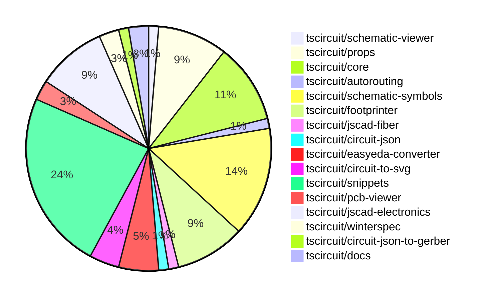

# contribution-tracker

Generates weekly contribution overviews for tscircuit contributors. Check out all
the [contribution overviews here](./contribution-overviews/)

* All PRs in the tscircuit org are scanned/summarized via Claude Haiku
* Claude classifies each Diff/PR as a Major, Minor or Tiny contribution
* All the PRs, summaries, and classifications are organized into charts and tables

The current week is shown below. There are 3 major sections:

* [Contributor Overview](#contributor-overview)
* [PRs by Repository](#prs-by-repository)
* [PRs by Contributor](#changes-by-contributor)

## Current Week

<!-- START_CURRENT_WEEK -->

# Contribution Overview 2024-10-16

## PRs by Repository

## Contributor Overview

| Contributor | 🐳 Major | 🐙 Minor | 🐌 Tiny | ⭐ |
|-------------|-------|-------|-------|-------|
| [seveibar](#seveibar) | 7 | 16 | 2 | 👑 |
| [anas-sarkez](#anas-sarkez) | 5 | 5 | 0 | ⭐⭐ |
| [andrii-balitskyi](#andrii-balitskyi) | 4 | 2 | 0 | ⭐⭐ |
| [Timer00](#Timer00) | 5 | 0 | 0 | ⭐⭐ |
| [imrishabh18](#imrishabh18) | 0 | 6 | 1 | ⭐⭐ |
| [aman1376](#aman1376) | 2 | 0 | 0 | ⭐ |
| [theajmalrazaq](#theajmalrazaq) | 1 | 2 | 0 | ⭐ |
| [ShiboSoftwareDev](#ShiboSoftwareDev) | 0 | 3 | 1 | ⭐ |
| [Abse2001](#Abse2001) | 0 | 3 | 1 | ⭐ |
| [mrudulpatil18](#mrudulpatil18) | 1 | 1 | 0 | ⭐ |
| [sarthak-kumar-shailendra](#sarthak-kumar-shailendra) | 0 | 2 | 0 | ⭐ |
| [bbland1](#bbland1) | 0 | 1 | 0 |  |
| [anugcodes](#anugcodes) | 0 | 1 | 0 |  |
| [kom-senapati](#kom-senapati) | 0 | 1 | 0 |  |
| [AlexVCS](#AlexVCS) | 0 | 0 | 1 |  |

## Changes by Repository

### [tscircuit/schematic-viewer](https://github.com/tscircuit/schematic-viewer)

| PR # | Impact | Contributor | Description |
|------|--------|-------------|-------------|
| [#65](https://github.com/tscircuit/schematic-viewer/pull/65) | 🟣 | imrishabh18 | Refactor the builder with core and update the schematic viewer (work in progress) |

### [tscircuit/props](https://github.com/tscircuit/props)

| PR # | Impact | Contributor | Description |
|------|--------|-------------|-------------|
| [#62](https://github.com/tscircuit/props/pull/62) | 🐙 Minor | imrishabh18 | Reverts changes to the `width` and `height` properties in the `commonLayoutProps` and `commonComponentProps` types. |
| [#60](https://github.com/tscircuit/props/pull/60) | 🐙 Minor | imrishabh18 | Replacing "width" and "height" properties with "schWidth", "schHeight", "pcbWidth", and "pcbHeight" properties in the "commonLayoutProps" interface and its related type. |
| [#58](https://github.com/tscircuit/props/pull/58) | 🐙 Minor | imrishabh18 | Add `width` and `height` properties to `commonComponentProps` and `commonLayoutProps` in the `layout.ts` file. |
| [#65](https://github.com/tscircuit/props/pull/65) | 🐙 Minor | seveibar | Add support for `schAutoLayoutEnabled` prop on `<group />` component |
| [#63](https://github.com/tscircuit/props/pull/63) | 🐙 Minor | seveibar | Add support for battery components, including battery capacity and battery pins. |
| [#61](https://github.com/tscircuit/props/pull/61) | 🐙 Minor | seveibar | Reverts the addition of "schWidth", "schHeight", "pcbWidth", and "pcbHeight" props and replaces them with "width" and "height" props. |
| [#59](https://github.com/tscircuit/props/pull/59) | 🐌 Tiny | imrishabh18 | Updated the project's lockfile |

### [tscircuit/core](https://github.com/tscircuit/core)

| PR # | Impact | Contributor | Description |
|------|--------|-------------|-------------|
| [#186](https://github.com/tscircuit/core/pull/186) | 🐳 Major | seveibar | This change fixes the use of local instead of global positions for schematic ports, which greatly simplifies computations inside the core and for rendering operations. |
| [#185](https://github.com/tscircuit/core/pull/185) | 🐳 Major | seveibar | Implements schematic autolayout and fixes routing issues |
| [#177](https://github.com/tscircuit/core/pull/177) | 🐳 Major | seveibar | Introduces a new `<battery />` component. |
| [#176](https://github.com/tscircuit/core/pull/176) | 🐳 Major | seveibar | Fix `pcbRotation={-90}` not rotating SMT pads and keepouts properly and add support for rotating keepouts. |
| [#173](https://github.com/tscircuit/core/pull/173) | 🐳 Major | seveibar | Adds support for shared pin labels in the NormalComponent class, allowing multiple ports to have the same primary label with additional aliases. |
| [#187](https://github.com/tscircuit/core/pull/187) | 🐙 Minor | imrishabh18 | Adds support for the `-size` suffix in port arrangements for the `NormalComponent` and `Chip` components. |
| [#188](https://github.com/tscircuit/core/pull/188) | 🐙 Minor | seveibar | Update the `circuit-to-svg` dependency to fix an issue where pin number 0 was not being recognized |
| [#182](https://github.com/tscircuit/core/pull/182) | 🐙 Minor | Abse2001 | Fixes the `toMatchSchematicSnapshot` not working issue in the `Battery` component. |

### [tscircuit/autorouting](https://github.com/tscircuit/autorouting)

| PR # | Impact | Contributor | Description |
|------|--------|-------------|-------------|
| [#82](https://github.com/tscircuit/autorouting/pull/82) | 🐙 Minor | imrishabh18 | The pull request refactors the code by removing a builder. |

### [tscircuit/schematic-symbols](https://github.com/tscircuit/schematic-symbols)

| PR # | Impact | Contributor | Description |
|------|--------|-------------|-------------|
| [#78](https://github.com/tscircuit/schematic-symbols/pull/78) | 🐳 Major | Timer00 | Introduces a new symbol for a wattmeter. |
| [#95](https://github.com/tscircuit/schematic-symbols/pull/95) | 🐳 Major | Timer00 | Introduce a new symbol called "varmeter" |
| [#96](https://github.com/tscircuit/schematic-symbols/pull/96) | 🐳 Major | Timer00 | Introduces a new symbol called "watt_hour_meter". |
| [#97](https://github.com/tscircuit/schematic-symbols/pull/97) | 🐳 Major | Timer00 | Introduces a new symbol called "frequency_meter" |
| [#100](https://github.com/tscircuit/schematic-symbols/pull/100) | 🐳 Major | Timer00 | Introduces a new symbol, the tachometer. |
| [#176](https://github.com/tscircuit/schematic-symbols/pull/176) | 🐳 Major | aman1376 | Adds a new component, a light-dependent resistor, with a detailed SVG image and JSON data. |
| [#162](https://github.com/tscircuit/schematic-symbols/pull/162) | 🐳 Major | aman1376 | This pull request adds a new JSON file `dpst_switch.json` and an SVG file `dpst_switch.svg` that define a double-pole, single-throw (DPST) switch symbol. |
| [#172](https://github.com/tscircuit/schematic-symbols/pull/172) | 🐙 Minor | imrishabh18 | Fixes the calculation of the height for various components (SPDT switch, box resistor, and capacitor). |
| [#174](https://github.com/tscircuit/schematic-symbols/pull/174) | 🐙 Minor | Abse2001 | Added a battery symbol |
| [#153](https://github.com/tscircuit/schematic-symbols/pull/153) | 🐙 Minor | mrudulpatil18 | Added a rectifier diode symbol to the project. |
| [#167](https://github.com/tscircuit/schematic-symbols/pull/167) | 🐙 Minor | anugcodes | Adds a new symbol for a Darlington pair transistor. |

### [tscircuit/footprinter](https://github.com/tscircuit/footprinter)

| PR # | Impact | Contributor | Description |
|------|--------|-------------|-------------|
| [#67](https://github.com/tscircuit/footprinter/pull/67) | 🐳 Major | seveibar | This pull request introduces an automatic gallery generation feature for SVG files. |
| [#71](https://github.com/tscircuit/footprinter/pull/71) | 🐳 Major | anas-sarkez | The pull request adds support for holes in the stampboard and modifies the pad length and holes position of the stampboard. |
| [#70](https://github.com/tscircuit/footprinter/pull/70) | 🐳 Major | anas-sarkez | Implemented a function to generate a stampreceiver footprint |
| [#68](https://github.com/tscircuit/footprinter/pull/68) | 🐳 Major | anas-sarkez | Implemented a stampboard footprint function |
| [#66](https://github.com/tscircuit/footprinter/pull/66) | 🐙 Minor | seveibar | Introduce a new pushbutton footprint and update the circuit-to-svg dependency |
| [#69](https://github.com/tscircuit/footprinter/pull/69) | 🐙 Minor | anas-sarkez | Implement silkscreen reference for every component and added silkscreenRef function to helpers |
| [#60](https://github.com/tscircuit/footprinter/pull/60) | 🐙 Minor | bbland1 | Adding type definitions for the parameters returned by the `.json()` method. |

### [tscircuit/jscad-fiber](https://github.com/tscircuit/jscad-fiber)

| PR # | Impact | Contributor | Description |
|------|--------|-------------|-------------|
| [#84](https://github.com/tscircuit/jscad-fiber/pull/84) | 🐳 Major | seveibar | Implement the `Subtract` component to perform boolean subtraction on child geometries. |

### [tscircuit/circuit-json](https://github.com/tscircuit/circuit-json)

| PR # | Impact | Contributor | Description |
|------|--------|-------------|-------------|
| [#59](https://github.com/tscircuit/circuit-json/pull/59) | 🐙 Minor | seveibar | Add a new circuit element type called "simple_battery" to the project. |

### [tscircuit/easyeda-converter](https://github.com/tscircuit/easyeda-converter)

| PR # | Impact | Contributor | Description |
|------|--------|-------------|-------------|
| [#74](https://github.com/tscircuit/easyeda-converter/pull/74) | 🐙 Minor | seveibar | The pull request fixes the C490691 import and adds a script for quickly adding tests for parts. |
| [#71](https://github.com/tscircuit/easyeda-converter/pull/71) | 🐙 Minor | seveibar | Fixes a bug in the Arc Imports by adding a regular expression to validate the arcData string. |
| [#78](https://github.com/tscircuit/easyeda-converter/pull/78) | 🐙 Minor | andrii-balitskyi | Adds support for `T~` text shapes and fixes a script issue. |
| [#77](https://github.com/tscircuit/easyeda-converter/pull/77) | 🐙 Minor | andrii-balitskyi | Fix error message in the `convert-easyeda-json-to-various-formats.ts` file to reflect the changed command option. |

### [tscircuit/circuit-to-svg](https://github.com/tscircuit/circuit-to-svg)

| PR # | Impact | Contributor | Description |
|------|--------|-------------|-------------|
| [#88](https://github.com/tscircuit/circuit-to-svg/pull/88) | 🐙 Minor | seveibar | Fix the schematic port using a relative position |
| [#87](https://github.com/tscircuit/circuit-to-svg/pull/87) | 🐙 Minor | seveibar | Fix silkscreen paths being erroneously closed. |
| [#86](https://github.com/tscircuit/circuit-to-svg/pull/86) | 🐙 Minor | Abse2001 | Updated the schematic symbols to fix the battery in the core and formatted the code. |

### [tscircuit/snippets](https://github.com/tscircuit/snippets)

| PR # | Impact | Contributor | Description |
|------|--------|-------------|-------------|
| [#88](https://github.com/tscircuit/snippets/pull/88) | 🐳 Major | andrii-balitskyi | Adds country and state dropdowns to the shipping information form. |
| [#115](https://github.com/tscircuit/snippets/pull/115) | 🐙 Minor | seveibar | Introduces the ability to open snippets by clicking on the import name with the Cmd/Ctrl key pressed. |
| [#114](https://github.com/tscircuit/snippets/pull/114) | 🐙 Minor | seveibar | Introduce a new "Files" dialog to inspect build files |
| [#108](https://github.com/tscircuit/snippets/pull/108) | 🐙 Minor | seveibar | Order My Snippets by last created time |
| [#84](https://github.com/tscircuit/snippets/pull/84) | 🐙 Minor | seveibar | Fix tab indent in the CodeEditor component |
| [#80](https://github.com/tscircuit/snippets/pull/80) | 🐙 Minor | seveibar | Fixes issues with JLCPCB imports, updates for shared pin label support, and fixes errors in local development to show JLCPCB import errors. |
| [#74](https://github.com/tscircuit/snippets/pull/74) | 🐙 Minor | seveibar | Fixes issues with downloading fabrication files in the application. |
| [#89](https://github.com/tscircuit/snippets/pull/89) | 🟣 | andrii-balitskyi |  |
| [#82](https://github.com/tscircuit/snippets/pull/82) | 🐳 Major | andrii-balitskyi | Allows editing shipping information in profile settings |
| [#68](https://github.com/tscircuit/snippets/pull/68) | 🐳 Major | andrii-balitskyi | Adds tests for the order management API endpoints, including creating, getting, listing, and updating orders, as well as uploading and getting order files. |
| [#78](https://github.com/tscircuit/snippets/pull/78) | 🐳 Major | andrii-balitskyi | Add a submit order button to the editor nav bar and a new dialog to create an order. |
| [#77](https://github.com/tscircuit/snippets/pull/77) | 🐳 Major | mrudulpatil18 | Adds a search component to the header, which allows users to search for code snippets and navigate to the editor view. |
| [#97](https://github.com/tscircuit/snippets/pull/97) | 🐳 Major | theajmalrazaq | Added Playwright tests for the AI, Dashboard, Home, and Quickstart pages, with viewport sizes of md, lg, and sm. |
| [#95](https://github.com/tscircuit/snippets/pull/95) | 🐙 Minor | theajmalrazaq | Fixed the responsiveness of the quickstart page. |
| [#85](https://github.com/tscircuit/snippets/pull/85) | 🐙 Minor | theajmalrazaq | Fixed the rendering of the search box in small views and improved the responsiveness of the dashboard. |
| [#86](https://github.com/tscircuit/snippets/pull/86) | 🐙 Minor | kom-senapati | Updates the page title to display the name of the snippet and the owner's name in the format `tscircuit - <owner>/<package>`. |
| [#96](https://github.com/tscircuit/snippets/pull/96) | 🐌 Tiny | Abse2001 | Updates the `winterspec` dependency to version `0.0.94`. |
| [#110](https://github.com/tscircuit/snippets/pull/110) | 🐌 Tiny | AlexVCS | Adds a favicon to the website. |

### [tscircuit/pcb-viewer](https://github.com/tscircuit/pcb-viewer)

| PR # | Impact | Contributor | Description |
|------|--------|-------------|-------------|
| [#76](https://github.com/tscircuit/pcb-viewer/pull/76) | 🐌 Tiny | seveibar | Formats and fixes minor issues with the silkscreen path story so that it renders correctly. |
| [#75](https://github.com/tscircuit/pcb-viewer/pull/75) | 🐌 Tiny | ShiboSoftwareDev | Adds a CODEOWNERS file to specify the owners of the repository. |

### [tscircuit/jscad-electronics](https://github.com/tscircuit/jscad-electronics)

| PR # | Impact | Contributor | Description |
|------|--------|-------------|-------------|
| [#75](https://github.com/tscircuit/jscad-electronics/pull/75) | 🐳 Major | anas-sarkez | Implementing Pin row 3D model and refactoring footprint plated holes |
| [#68](https://github.com/tscircuit/jscad-electronics/pull/68) | 🐳 Major | anas-sarkez | Implementing a 3D component for a USB-C female port. |
| [#76](https://github.com/tscircuit/jscad-electronics/pull/76) | 🐙 Minor | anas-sarkez | Added a new example for the "pin row 6" footprint to the Footprinter3D library. |
| [#72](https://github.com/tscircuit/jscad-electronics/pull/72) | 🐙 Minor | anas-sarkez | Refactor the USB_C component to use the Subtract operation for creating the curved metal casing. |
| [#71](https://github.com/tscircuit/jscad-electronics/pull/71) | 🐙 Minor | anas-sarkez | Updated jscad-fiber dependency and subtracted curve slice from smdLED sides |
| [#69](https://github.com/tscircuit/jscad-electronics/pull/69) | 🐙 Minor | anas-sarkez | Implementing SmdLED packages with different colors |
| [#70](https://github.com/tscircuit/jscad-electronics/pull/70) | 🐌 Tiny | seveibar | Add anas as codeowner |

### [tscircuit/winterspec](https://github.com/tscircuit/winterspec)

| PR # | Impact | Contributor | Description |
|------|--------|-------------|-------------|
| [#18](https://github.com/tscircuit/winterspec/pull/18) | 🐙 Minor | ShiboSoftwareDev | Update the construct-manifest.ts file to fix a path issue for Windows. |
| [#17](https://github.com/tscircuit/winterspec/pull/17) | 🐙 Minor | ShiboSoftwareDev | Fixes a bug in esbuild by modifying the file paths to always use Unix-based file paths, which is required for esbuild to work on Windows. |

### [tscircuit/circuit-json-to-gerber](https://github.com/tscircuit/circuit-json-to-gerber)

| PR # | Impact | Contributor | Description |
|------|--------|-------------|-------------|
| [#22](https://github.com/tscircuit/circuit-json-to-gerber/pull/22) | 🐙 Minor | ShiboSoftwareDev | Implemented the handling of silkscreen paths in the gerber conversion process. |

### [tscircuit/docs](https://github.com/tscircuit/docs)

| PR # | Impact | Contributor | Description |
|------|--------|-------------|-------------|
| [#29](https://github.com/tscircuit/docs/pull/29) | 🐙 Minor | sarthak-kumar-shailendra | Updates the icon and URL for the "Twitter/X" social media link in the sidebar and footer. |
| [#28](https://github.com/tscircuit/docs/pull/28) | 🐙 Minor | sarthak-kumar-shailendra | Update the Twitter logo to the new "X" icon |

## Changes by Contributor

### [imrishabh18](https://github.com/imrishabh18)

| PR # | Impact | Description |
|------|--------|-------------|
| [#65](https://github.com/tscircuit/schematic-viewer/pull/65) | 🟣 | Refactor the builder with core and update the schematic viewer (work in progress) |
| [#62](https://github.com/tscircuit/props/pull/62) | 🐙 Minor | Reverts changes to the `width` and `height` properties in the `commonLayoutProps` and `commonComponentProps` types. |
| [#60](https://github.com/tscircuit/props/pull/60) | 🐙 Minor | Replacing "width" and "height" properties with "schWidth", "schHeight", "pcbWidth", and "pcbHeight" properties in the "commonLayoutProps" interface and its related type. |
| [#58](https://github.com/tscircuit/props/pull/58) | 🐙 Minor | Add `width` and `height` properties to `commonComponentProps` and `commonLayoutProps` in the `layout.ts` file. |
| [#187](https://github.com/tscircuit/core/pull/187) | 🐙 Minor | Adds support for the `-size` suffix in port arrangements for the `NormalComponent` and `Chip` components. |
| [#82](https://github.com/tscircuit/autorouting/pull/82) | 🐙 Minor | The pull request refactors the code by removing a builder. |
| [#172](https://github.com/tscircuit/schematic-symbols/pull/172) | 🐙 Minor | Fixes the calculation of the height for various components (SPDT switch, box resistor, and capacitor). |
| [#59](https://github.com/tscircuit/props/pull/59) | 🐌 Tiny | Updated the project's lockfile |

### [seveibar](https://github.com/seveibar)

| PR # | Impact | Description |
|------|--------|-------------|
| [#67](https://github.com/tscircuit/footprinter/pull/67) | 🐳 Major | This pull request introduces an automatic gallery generation feature for SVG files. |
| [#186](https://github.com/tscircuit/core/pull/186) | 🐳 Major | This change fixes the use of local instead of global positions for schematic ports, which greatly simplifies computations inside the core and for rendering operations. |
| [#185](https://github.com/tscircuit/core/pull/185) | 🐳 Major | Implements schematic autolayout and fixes routing issues |
| [#177](https://github.com/tscircuit/core/pull/177) | 🐳 Major | Introduces a new `<battery />` component. |
| [#176](https://github.com/tscircuit/core/pull/176) | 🐳 Major | Fix `pcbRotation={-90}` not rotating SMT pads and keepouts properly and add support for rotating keepouts. |
| [#173](https://github.com/tscircuit/core/pull/173) | 🐳 Major | Adds support for shared pin labels in the NormalComponent class, allowing multiple ports to have the same primary label with additional aliases. |
| [#84](https://github.com/tscircuit/jscad-fiber/pull/84) | 🐳 Major | Implement the `Subtract` component to perform boolean subtraction on child geometries. |
| [#59](https://github.com/tscircuit/circuit-json/pull/59) | 🐙 Minor | Add a new circuit element type called "simple_battery" to the project. |
| [#65](https://github.com/tscircuit/props/pull/65) | 🐙 Minor | Add support for `schAutoLayoutEnabled` prop on `<group />` component |
| [#63](https://github.com/tscircuit/props/pull/63) | 🐙 Minor | Add support for battery components, including battery capacity and battery pins. |
| [#61](https://github.com/tscircuit/props/pull/61) | 🐙 Minor | Reverts the addition of "schWidth", "schHeight", "pcbWidth", and "pcbHeight" props and replaces them with "width" and "height" props. |
| [#66](https://github.com/tscircuit/footprinter/pull/66) | 🐙 Minor | Introduce a new pushbutton footprint and update the circuit-to-svg dependency |
| [#74](https://github.com/tscircuit/easyeda-converter/pull/74) | 🐙 Minor | The pull request fixes the C490691 import and adds a script for quickly adding tests for parts. |
| [#71](https://github.com/tscircuit/easyeda-converter/pull/71) | 🐙 Minor | Fixes a bug in the Arc Imports by adding a regular expression to validate the arcData string. |
| [#188](https://github.com/tscircuit/core/pull/188) | 🐙 Minor | Update the `circuit-to-svg` dependency to fix an issue where pin number 0 was not being recognized |
| [#88](https://github.com/tscircuit/circuit-to-svg/pull/88) | 🐙 Minor | Fix the schematic port using a relative position |
| [#87](https://github.com/tscircuit/circuit-to-svg/pull/87) | 🐙 Minor | Fix silkscreen paths being erroneously closed. |
| [#115](https://github.com/tscircuit/snippets/pull/115) | 🐙 Minor | Introduces the ability to open snippets by clicking on the import name with the Cmd/Ctrl key pressed. |
| [#114](https://github.com/tscircuit/snippets/pull/114) | 🐙 Minor | Introduce a new "Files" dialog to inspect build files |
| [#108](https://github.com/tscircuit/snippets/pull/108) | 🐙 Minor | Order My Snippets by last created time |
| [#84](https://github.com/tscircuit/snippets/pull/84) | 🐙 Minor | Fix tab indent in the CodeEditor component |
| [#80](https://github.com/tscircuit/snippets/pull/80) | 🐙 Minor | Fixes issues with JLCPCB imports, updates for shared pin label support, and fixes errors in local development to show JLCPCB import errors. |
| [#74](https://github.com/tscircuit/snippets/pull/74) | 🐙 Minor | Fixes issues with downloading fabrication files in the application. |
| [#76](https://github.com/tscircuit/pcb-viewer/pull/76) | 🐌 Tiny | Formats and fixes minor issues with the silkscreen path story so that it renders correctly. |
| [#70](https://github.com/tscircuit/jscad-electronics/pull/70) | 🐌 Tiny | Add anas as codeowner |

### [ShiboSoftwareDev](https://github.com/ShiboSoftwareDev)

| PR # | Impact | Description |
|------|--------|-------------|
| [#18](https://github.com/tscircuit/winterspec/pull/18) | 🐙 Minor | Update the construct-manifest.ts file to fix a path issue for Windows. |
| [#17](https://github.com/tscircuit/winterspec/pull/17) | 🐙 Minor | Fixes a bug in esbuild by modifying the file paths to always use Unix-based file paths, which is required for esbuild to work on Windows. |
| [#22](https://github.com/tscircuit/circuit-json-to-gerber/pull/22) | 🐙 Minor | Implemented the handling of silkscreen paths in the gerber conversion process. |
| [#75](https://github.com/tscircuit/pcb-viewer/pull/75) | 🐌 Tiny | Adds a CODEOWNERS file to specify the owners of the repository. |

### [sarthak-kumar-shailendra](https://github.com/sarthak-kumar-shailendra)

| PR # | Impact | Description |
|------|--------|-------------|
| [#29](https://github.com/tscircuit/docs/pull/29) | 🐙 Minor | Updates the icon and URL for the "Twitter/X" social media link in the sidebar and footer. |
| [#28](https://github.com/tscircuit/docs/pull/28) | 🐙 Minor | Update the Twitter logo to the new "X" icon |

### [anas-sarkez](https://github.com/anas-sarkez)

| PR # | Impact | Description |
|------|--------|-------------|
| [#71](https://github.com/tscircuit/footprinter/pull/71) | 🐳 Major | The pull request adds support for holes in the stampboard and modifies the pad length and holes position of the stampboard. |
| [#70](https://github.com/tscircuit/footprinter/pull/70) | 🐳 Major | Implemented a function to generate a stampreceiver footprint |
| [#68](https://github.com/tscircuit/footprinter/pull/68) | 🐳 Major | Implemented a stampboard footprint function |
| [#75](https://github.com/tscircuit/jscad-electronics/pull/75) | 🐳 Major | Implementing Pin row 3D model and refactoring footprint plated holes |
| [#68](https://github.com/tscircuit/jscad-electronics/pull/68) | 🐳 Major | Implementing a 3D component for a USB-C female port. |
| [#69](https://github.com/tscircuit/footprinter/pull/69) | 🐙 Minor | Implement silkscreen reference for every component and added silkscreenRef function to helpers |
| [#76](https://github.com/tscircuit/jscad-electronics/pull/76) | 🐙 Minor | Added a new example for the "pin row 6" footprint to the Footprinter3D library. |
| [#72](https://github.com/tscircuit/jscad-electronics/pull/72) | 🐙 Minor | Refactor the USB_C component to use the Subtract operation for creating the curved metal casing. |
| [#71](https://github.com/tscircuit/jscad-electronics/pull/71) | 🐙 Minor | Updated jscad-fiber dependency and subtracted curve slice from smdLED sides |
| [#69](https://github.com/tscircuit/jscad-electronics/pull/69) | 🐙 Minor | Implementing SmdLED packages with different colors |

### [bbland1](https://github.com/bbland1)

| PR # | Impact | Description |
|------|--------|-------------|
| [#60](https://github.com/tscircuit/footprinter/pull/60) | 🐙 Minor | Adding type definitions for the parameters returned by the `.json()` method. |

### [andrii-balitskyi](https://github.com/andrii-balitskyi)

| PR # | Impact | Description |
|------|--------|-------------|
| [#88](https://github.com/tscircuit/snippets/pull/88) | 🐳 Major | Adds country and state dropdowns to the shipping information form. |
| [#78](https://github.com/tscircuit/easyeda-converter/pull/78) | 🐙 Minor | Adds support for `T~` text shapes and fixes a script issue. |
| [#77](https://github.com/tscircuit/easyeda-converter/pull/77) | 🐙 Minor | Fix error message in the `convert-easyeda-json-to-various-formats.ts` file to reflect the changed command option. |
| [#89](https://github.com/tscircuit/snippets/pull/89) | 🟣 |  |
| [#82](https://github.com/tscircuit/snippets/pull/82) | 🐳 Major | Allows editing shipping information in profile settings |
| [#68](https://github.com/tscircuit/snippets/pull/68) | 🐳 Major | Adds tests for the order management API endpoints, including creating, getting, listing, and updating orders, as well as uploading and getting order files. |
| [#78](https://github.com/tscircuit/snippets/pull/78) | 🐳 Major | Add a submit order button to the editor nav bar and a new dialog to create an order. |

### [Abse2001](https://github.com/Abse2001)

| PR # | Impact | Description |
|------|--------|-------------|
| [#182](https://github.com/tscircuit/core/pull/182) | 🐙 Minor | Fixes the `toMatchSchematicSnapshot` not working issue in the `Battery` component. |
| [#86](https://github.com/tscircuit/circuit-to-svg/pull/86) | 🐙 Minor | Updated the schematic symbols to fix the battery in the core and formatted the code. |
| [#174](https://github.com/tscircuit/schematic-symbols/pull/174) | 🐙 Minor | Added a battery symbol |
| [#96](https://github.com/tscircuit/snippets/pull/96) | 🐌 Tiny | Updates the `winterspec` dependency to version `0.0.94`. |

### [Timer00](https://github.com/Timer00)

| PR # | Impact | Description |
|------|--------|-------------|
| [#78](https://github.com/tscircuit/schematic-symbols/pull/78) | 🐳 Major | Introduces a new symbol for a wattmeter. |
| [#95](https://github.com/tscircuit/schematic-symbols/pull/95) | 🐳 Major | Introduce a new symbol called "varmeter" |
| [#96](https://github.com/tscircuit/schematic-symbols/pull/96) | 🐳 Major | Introduces a new symbol called "watt_hour_meter". |
| [#97](https://github.com/tscircuit/schematic-symbols/pull/97) | 🐳 Major | Introduces a new symbol called "frequency_meter" |
| [#100](https://github.com/tscircuit/schematic-symbols/pull/100) | 🐳 Major | Introduces a new symbol, the tachometer. |

### [aman1376](https://github.com/aman1376)

| PR # | Impact | Description |
|------|--------|-------------|
| [#176](https://github.com/tscircuit/schematic-symbols/pull/176) | 🐳 Major | Adds a new component, a light-dependent resistor, with a detailed SVG image and JSON data. |
| [#162](https://github.com/tscircuit/schematic-symbols/pull/162) | 🐳 Major | This pull request adds a new JSON file `dpst_switch.json` and an SVG file `dpst_switch.svg` that define a double-pole, single-throw (DPST) switch symbol. |

### [mrudulpatil18](https://github.com/mrudulpatil18)

| PR # | Impact | Description |
|------|--------|-------------|
| [#77](https://github.com/tscircuit/snippets/pull/77) | 🐳 Major | Adds a search component to the header, which allows users to search for code snippets and navigate to the editor view. |
| [#153](https://github.com/tscircuit/schematic-symbols/pull/153) | 🐙 Minor | Added a rectifier diode symbol to the project. |

### [anugcodes](https://github.com/anugcodes)

| PR # | Impact | Description |
|------|--------|-------------|
| [#167](https://github.com/tscircuit/schematic-symbols/pull/167) | 🐙 Minor | Adds a new symbol for a Darlington pair transistor. |

### [AlexVCS](https://github.com/AlexVCS)

| PR # | Impact | Description |
|------|--------|-------------|
| [#110](https://github.com/tscircuit/snippets/pull/110) | 🐌 Tiny | Adds a favicon to the website. |

### [theajmalrazaq](https://github.com/theajmalrazaq)

| PR # | Impact | Description |
|------|--------|-------------|
| [#97](https://github.com/tscircuit/snippets/pull/97) | 🐳 Major | Added Playwright tests for the AI, Dashboard, Home, and Quickstart pages, with viewport sizes of md, lg, and sm. |
| [#95](https://github.com/tscircuit/snippets/pull/95) | 🐙 Minor | Fixed the responsiveness of the quickstart page. |
| [#85](https://github.com/tscircuit/snippets/pull/85) | 🐙 Minor | Fixed the rendering of the search box in small views and improved the responsiveness of the dashboard. |

### [kom-senapati](https://github.com/kom-senapati)

| PR # | Impact | Description |
|------|--------|-------------|
| [#86](https://github.com/tscircuit/snippets/pull/86) | 🐙 Minor | Updates the page title to display the name of the snippet and the owner's name in the format `tscircuit - <owner>/<package>`. |

<!-- END_CURRENT_WEEK -->
