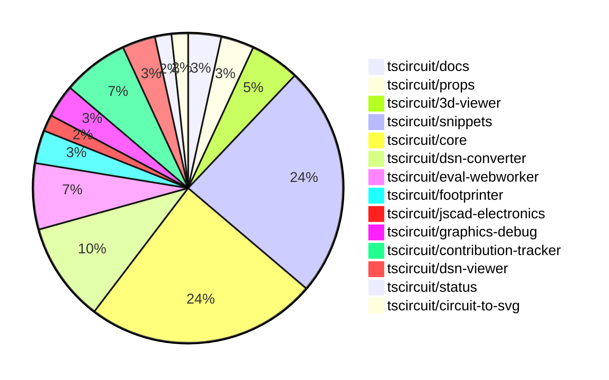

# contribution-tracker

Generates weekly contribution overviews for tscircuit contributors. Check out all
the [contribution overviews here](./contribution-overviews/)

* All PRs in the tscircuit org are scanned/summarized via Claude Haiku
* Claude classifies each Diff/PR as a Major, Minor or Tiny contribution
* All the PRs, summaries, and classifications are organized into charts and tables

The current week is shown below. There are 3 major sections:

* [Contributor Overview](#contributor-overview)
* [PRs by Repository](#prs-by-repository)
* [PRs by Contributor](#changes-by-contributor)

## Current Week

<!-- START_CURRENT_WEEK -->

# Contribution Overview 2024-11-27

## PRs by Repository

## Contributor Overview

| Contributor | 🐳 Major | 🐙 Minor | 🐌 Tiny | ⭐ | Issues Created |
|-------------|---------|---------|---------|-----|----------------|
| [AnasSarkiz](#AnasSarkiz) | 3 | 6 | 0 | ⭐⭐ |
| [ShiboSoftwareDev](#ShiboSoftwareDev) | 1 | 6 | 3 | ⭐⭐ |
| [imrishabh18](#imrishabh18) | 1 | 7 | 0 | ⭐⭐ |
| [mrudulpatil18](#mrudulpatil18) | 1 | 6 | 0 | ⭐⭐ |
| [Anshgrover23](#Anshgrover23) | 0 | 7 | 0 | ⭐⭐ |
| [Abse2001](#Abse2001) | 0 | 6 | 1 | ⭐⭐ |
| [seveibar](#seveibar) | 1 | 4 | 0 | ⭐⭐ |
| [divanshu-go](#divanshu-go) | 2 | 0 | 0 | ⭐ |
| [Niharika0104](#Niharika0104) | 0 | 1 | 0 |  |
| [RohittCodes](#RohittCodes) | 0 | 1 | 0 |  |

## Review Table

| Contributor | Reviews Received | Approvals | Rejections | Changes Requested | PRs Opened | PRs Closed | Issues created |
|-------------|------------------|-----------|------------|-------------------|------------|------------|----------------|
| [AnasSarkiz](https://github.com/AnasSarkiz) | 16 | 7 | 7 | 4 | 12 | 10 | 0 |
| [Niharika0104](https://github.com/Niharika0104) | 1 | 1 | 0 | 0 | 1 | 1 | 0 |
| [Abse2001](https://github.com/Abse2001) | 12 | 7 | 2 | 1 | 8 | 7 | 0 |
| [seveibar](https://github.com/seveibar) | 1 | 0 | 2 | 0 | 7 | 6 | 0 |
| [Anshgrover23](https://github.com/Anshgrover23) | 32 | 6 | 5 | 9 | 12 | 10 | 0 |
| [mrudulpatil18](https://github.com/mrudulpatil18) | 13 | 8 | 0 | 1 | 9 | 8 | 0 |
| [ShiboSoftwareDev](https://github.com/ShiboSoftwareDev) | 15 | 10 | 6 | 0 | 13 | 11 | 0 |
| [imrishabh18](https://github.com/imrishabh18) | 3 | 3 | 3 | 0 | 9 | 8 | 0 |
| [divanshu-go](https://github.com/divanshu-go) | 4 | 2 | 0 | 1 | 2 | 2 | 0 |
| [techmannih](https://github.com/techmannih) | 1 | 1 | 2 | 0 | 2 | 0 | 0 |
| [RohittCodes](https://github.com/RohittCodes) | 11 | 3 | 4 | 5 | 6 | 3 | 0 |
| [krushnarout](https://github.com/krushnarout) | 4 | 0 | 1 | 2 | 1 | 0 | 0 |

## Changes by Repository

### [tscircuit/docs](https://github.com/tscircuit/docs)

| PR # | Impact | Contributor | Description |
|------|--------|-------------|-------------|
| [#40](https://github.com/tscircuit/docs/pull/40) | 🐙 Minor | Niharika0104 | Added a tutorial for creating an AND gate circuit using the XD74LS08 AND chip. |
| [#41](https://github.com/tscircuit/docs/pull/41) | 🐙 Minor | Abse2001 | Added a new tutorial for an OR gate circuit with USB power, push buttons, and LEDs. |

### [tscircuit/props](https://github.com/tscircuit/props)

| PR # | Impact | Contributor | Description |
|------|--------|-------------|-------------|
| [#110](https://github.com/tscircuit/props/pull/110) | 🐙 Minor | Abse2001 | Added a new `schDisplayLabel` prop to the `trace` component. |
| [#109](https://github.com/tscircuit/props/pull/109) | 🐙 Minor | seveibar | Add a new `serverMode` property to the `AutorouterConfig` interface and the `autorouterConfig` Zod schema. |

### [tscircuit/3d-viewer](https://github.com/tscircuit/3d-viewer)

| PR # | Impact | Contributor | Description |
|------|--------|-------------|-------------|
| [#50](https://github.com/tscircuit/3d-viewer/pull/50) | 🐙 Minor | Abse2001 | Fixed the issue where the bottom trace between vias was not showing and added a test case for the fix. |
| [#47](https://github.com/tscircuit/3d-viewer/pull/47) | 🐙 Minor | Abse2001 | Fixed misaligned 3D viewer components |
| [#46](https://github.com/tscircuit/3d-viewer/pull/46) | 🐙 Minor | Abse2001 | Update the jscad-electronics dependency to version 0.0.22 |

### [tscircuit/snippets](https://github.com/tscircuit/snippets)

| PR # | Impact | Contributor | Description |
|------|--------|-------------|-------------|
| [#309](https://github.com/tscircuit/snippets/pull/309) | 🐙 Minor | Abse2001 | Updating the `@tscircuit/core` dependency from version `0.0.206` to `0.0.208` to fix an issue where components were not rendering when `pcbRotation="90"`. |
| [#325](https://github.com/tscircuit/snippets/pull/325) | 🐙 Minor | seveibar | Update core dependency and fix expand button |
| [#318](https://github.com/tscircuit/snippets/pull/318) | 🐙 Minor | mrudulpatil18 | Adds a Playwright test to check for underlined and clickable imports in the editor. |
| [#332](https://github.com/tscircuit/snippets/pull/332) | 🐙 Minor | ShiboSoftwareDev | Fixed test flakiness by using a deterministic port generation instead of a random one. |
| [#311](https://github.com/tscircuit/snippets/pull/311) | 🐙 Minor | ShiboSoftwareDev | The change ensures the bundle size analysis GitHub workflow only runs when the `package.json` file changes. |
| [#294](https://github.com/tscircuit/snippets/pull/294) | 🐙 Minor | ShiboSoftwareDev | Adds bundle analysis diff with main branch to the GitHub Actions workflow. |
| [#291](https://github.com/tscircuit/snippets/pull/291) | 🐙 Minor | ShiboSoftwareDev | Adds a GitHub Actions workflow to generate a bundle size report for pull requests. |
| [#317](https://github.com/tscircuit/snippets/pull/317) | 🐙 Minor | Anshgrover23 | Fixes the issue where Cmd Click was broken for clicking on snippets. |
| [#302](https://github.com/tscircuit/snippets/pull/302) | 🐙 Minor | Anshgrover23 | Fixes a regex to properly import names with dashes. |
| [#303](https://github.com/tscircuit/snippets/pull/303) | 🐙 Minor | imrishabh18 | Adds a new development login page to the application. |
| [#298](https://github.com/tscircuit/snippets/pull/298) | 🐙 Minor | imrishabh18 | Fixes the `invalid_code_token` issue when not using `localhost` for the GitHub OAuth flow. |
| [#285](https://github.com/tscircuit/snippets/pull/285) | 🐙 Minor | RohittCodes | Adds a fullscreen toggle button to the preview component |
| [#306](https://github.com/tscircuit/snippets/pull/306) | 🐌 Tiny | ShiboSoftwareDev | Updated the dependency for the 3d-viewer package from version 0.0.43 to 0.0.44 |
| [#304](https://github.com/tscircuit/snippets/pull/304) | 🐌 Tiny | ShiboSoftwareDev | Removed an unused GitHub workflow file. |

### [tscircuit/core](https://github.com/tscircuit/core)

| PR # | Impact | Contributor | Description |
|------|--------|-------------|-------------|
| [#373](https://github.com/tscircuit/core/pull/373) | 🐳 Major | seveibar |  |
| [#362](https://github.com/tscircuit/core/pull/362) | 🐳 Major | AnasSarkiz | Implemented a new event `renderable:renderLifecycle:anyEvent` to make it easier to listen to renderable events. |
| [#364](https://github.com/tscircuit/core/pull/364) | 🐳 Major | ShiboSoftwareDev | Adds support for rotated_rect shape in the SMT Pad component. |
| [#374](https://github.com/tscircuit/core/pull/374) | 🐙 Minor | seveibar | Fix prod issues related to GET/POST request differences for autorouting job creation |
| [#379](https://github.com/tscircuit/core/pull/379) | 🐙 Minor | AnasSarkiz | Removed schematic text logic from `Jumper.ts` |
| [#378](https://github.com/tscircuit/core/pull/378) | 🐙 Minor | AnasSarkiz | The pull request moves the schematic text logic to the `SchematicComponentRenderWithSchematicBoxDimensions` component. |
| [#376](https://github.com/tscircuit/core/pull/376) | 🐙 Minor | AnasSarkiz | Adds a `root.schematicDisabled` property to skip rendering all schematic components. |
| [#358](https://github.com/tscircuit/core/pull/358) | 🐙 Minor | AnasSarkiz | Updated the footprinter dependency to the newest version |
| [#352](https://github.com/tscircuit/core/pull/352) | 🐙 Minor | AnasSarkiz | Implemented `getCurrentRenderPhase` and `getRenderGraph` methods for debugging. |
| [#355](https://github.com/tscircuit/core/pull/355) | 🐙 Minor | mrudulpatil18 | The pull request ensures that the name passed to the component takes precedence over the default name from the hook, and it adds a test to verify the behavior. |
| [#369](https://github.com/tscircuit/core/pull/369) | 🐙 Minor | ShiboSoftwareDev | Adds a test to ensure that 90-degree rotated SMT pads are drawn correctly in the PCB. |
| [#368](https://github.com/tscircuit/core/pull/368) | 🐙 Minor | ShiboSoftwareDev | Fixes a bug where SMT pads were not drawn correctly when the component rotation was 90 degrees. |
| [#363](https://github.com/tscircuit/core/pull/363) | 🐙 Minor | Anshgrover23 | Changes the GitHub Actions workflow to use `pull_request_target` instead of `pull_request` to fix the issue where the bundle-size check doesn't run on pull requests from forks. |
| [#367](https://github.com/tscircuit/core/pull/367) | 🐌 Tiny | Abse2001 | Skips two tests related to remote autorouting functionality. |

### [tscircuit/dsn-converter](https://github.com/tscircuit/dsn-converter)

| PR # | Impact | Contributor | Description |
|------|--------|-------------|-------------|
| [#37](https://github.com/tscircuit/dsn-converter/pull/37) | 🐳 Major | imrishabh18 | Add the ability to process vias and associate them with wires in the DSN to Circuit JSON conversion. |
| [#39](https://github.com/tscircuit/dsn-converter/pull/39) | 🐙 Minor | seveibar | Correctly size plated holes for homogenous components |
| [#45](https://github.com/tscircuit/dsn-converter/pull/45) | 🐙 Minor | imrishabh18 | The change refactors the processing of chip components, removing the separate `processChips` function and instead processing them along with other components and pads. |
| [#43](https://github.com/tscircuit/dsn-converter/pull/43) | 🐙 Minor | imrishabh18 | Removes hardcoded size of smtpads and uses the default trace width of circuit json |
| [#38](https://github.com/tscircuit/dsn-converter/pull/38) | 🐙 Minor | imrishabh18 | Adds the `from_layer` and `to_layer` properties to the `convertViaToPcbVia` function's return object. |
| [#36](https://github.com/tscircuit/dsn-converter/pull/36) | 🐙 Minor | imrishabh18 | Adds support for converting circle-shaped padstacks to SMT pads in the PCB component conversion process. |

### [tscircuit/eval-webworker](https://github.com/tscircuit/eval-webworker)

| PR # | Impact | Contributor | Description |
|------|--------|-------------|-------------|
| [#5](https://github.com/tscircuit/eval-webworker/pull/5) | 🟣 | seveibar | Add Workflows, Fix Test, Publish v0.0.1 |
| [#6](https://github.com/tscircuit/eval-webworker/pull/6) | 🐳 Major | mrudulpatil18 | Introduces a global WebWorkerEventEmitter to handle event re-emission and updates the `on` method in the web worker API to allow listening to events. |
| [#10](https://github.com/tscircuit/eval-webworker/pull/10) | 🐙 Minor | mrudulpatil18 | Configure the build process to generate declaration files |
| [#8](https://github.com/tscircuit/eval-webworker/pull/8) | 🐙 Minor | mrudulpatil18 | Adds a build step to the release workflow before publishing to npm. |

### [tscircuit/footprinter](https://github.com/tscircuit/footprinter)

| PR # | Impact | Contributor | Description |
|------|--------|-------------|-------------|
| [#86](https://github.com/tscircuit/footprinter/pull/86) | 🐳 Major | AnasSarkiz | Refactor Stampboard and Stampreceiver functions to separate SMD pads and holes into individual pins. |
| [#87](https://github.com/tscircuit/footprinter/pull/87) | 🐙 Minor | AnasSarkiz | Rearranged the pins of the sot23-5 (sot235) component to match the data sheet in an anti-clockwise direction. |

### [tscircuit/jscad-electronics](https://github.com/tscircuit/jscad-electronics)

| PR # | Impact | Contributor | Description |
|------|--------|-------------|-------------|
| [#81](https://github.com/tscircuit/jscad-electronics/pull/81) | 🐳 Major | AnasSarkiz | Implemented the `SOT235` (SOT-23-5) 3D component and added a Footprinter3d example for it. |

### [tscircuit/graphics-debug](https://github.com/tscircuit/graphics-debug)

| PR # | Impact | Contributor | Description |
|------|--------|-------------|-------------|
| [#8](https://github.com/tscircuit/graphics-debug/pull/8) | 🐙 Minor | mrudulpatil18 | Fixes the issue of incorrect handling of CDATA from SVGs when using `dangerouslySetInnerHTML`, which causes crosshair visibility issues on the website. |
| [#7](https://github.com/tscircuit/graphics-debug/pull/7) | 🐙 Minor | mrudulpatil18 | Added a "See Example" button to load sample graphics data into the input element for visualization. |

### [tscircuit/contribution-tracker](https://github.com/tscircuit/contribution-tracker)

| PR # | Impact | Contributor | Description |
|------|--------|-------------|-------------|
| [#13](https://github.com/tscircuit/contribution-tracker/pull/13) | 🐙 Minor | Anshgrover23 | Fixes the review table in the generated Markdown |
| [#11](https://github.com/tscircuit/contribution-tracker/pull/11) | 🐙 Minor | Anshgrover23 | Fixes the review table by adding a new column for "Issues Created" and updating the table formatting. |
| [#12](https://github.com/tscircuit/contribution-tracker/pull/12) | 🐙 Minor | imrishabh18 | Reverts the "Fix review table" pull request. |
| [#14](https://github.com/tscircuit/contribution-tracker/pull/14) | 🐌 Tiny | ShiboSoftwareDev | Fixed the review table format by changing the capitalization of "Issues created" column header. |

### [tscircuit/dsn-viewer](https://github.com/tscircuit/dsn-viewer)

| PR # | Impact | Contributor | Description |
|------|--------|-------------|-------------|
| [#7](https://github.com/tscircuit/dsn-viewer/pull/7) | 🐳 Major | divanshu-go | Adds support for multiple file uploads and handles both DSN PCB and session files. |
| [#8](https://github.com/tscircuit/dsn-viewer/pull/8) | 🐙 Minor | Anshgrover23 | Set up a basic Playwright test for the DSN viewer application. |

### [tscircuit/status](https://github.com/tscircuit/status)

| PR # | Impact | Contributor | Description |
|------|--------|-------------|-------------|
| [#3](https://github.com/tscircuit/status/pull/3) | 🐙 Minor | Anshgrover23 | Fix for bars getting cut off in the UI |

### [tscircuit/circuit-to-svg](https://github.com/tscircuit/circuit-to-svg)

| PR # | Impact | Contributor | Description |
|------|--------|-------------|-------------|
| [#140](https://github.com/tscircuit/circuit-to-svg/pull/140) | 🐳 Major | divanshu-go | Adds a bundle size calculation workflow that compares the bundle and install size of the base branch and the pull request branch, and posts the results as a comment on the pull request. |

## Changes by Contributor

### [Niharika0104](https://github.com/Niharika0104)

| PR # | Impact | Description |
|------|--------|-------------|
| [#40](https://github.com/tscircuit/docs/pull/40) | 🐙 Minor | Added a tutorial for creating an AND gate circuit using the XD74LS08 AND chip. |

### [Abse2001](https://github.com/Abse2001)

| PR # | Impact | Description |
|------|--------|-------------|
| [#41](https://github.com/tscircuit/docs/pull/41) | 🐙 Minor | Added a new tutorial for an OR gate circuit with USB power, push buttons, and LEDs. |
| [#110](https://github.com/tscircuit/props/pull/110) | 🐙 Minor | Added a new `schDisplayLabel` prop to the `trace` component. |
| [#50](https://github.com/tscircuit/3d-viewer/pull/50) | 🐙 Minor | Fixed the issue where the bottom trace between vias was not showing and added a test case for the fix. |
| [#47](https://github.com/tscircuit/3d-viewer/pull/47) | 🐙 Minor | Fixed misaligned 3D viewer components |
| [#46](https://github.com/tscircuit/3d-viewer/pull/46) | 🐙 Minor | Update the jscad-electronics dependency to version 0.0.22 |
| [#309](https://github.com/tscircuit/snippets/pull/309) | 🐙 Minor | Updating the `@tscircuit/core` dependency from version `0.0.206` to `0.0.208` to fix an issue where components were not rendering when `pcbRotation="90"`. |
| [#367](https://github.com/tscircuit/core/pull/367) | 🐌 Tiny | Skips two tests related to remote autorouting functionality. |

### [seveibar](https://github.com/seveibar)

| PR # | Impact | Description |
|------|--------|-------------|
| [#373](https://github.com/tscircuit/core/pull/373) | 🐳 Major |  |
| [#109](https://github.com/tscircuit/props/pull/109) | 🐙 Minor | Add a new `serverMode` property to the `AutorouterConfig` interface and the `autorouterConfig` Zod schema. |
| [#374](https://github.com/tscircuit/core/pull/374) | 🐙 Minor | Fix prod issues related to GET/POST request differences for autorouting job creation |
| [#39](https://github.com/tscircuit/dsn-converter/pull/39) | 🐙 Minor | Correctly size plated holes for homogenous components |
| [#325](https://github.com/tscircuit/snippets/pull/325) | 🐙 Minor | Update core dependency and fix expand button |
| [#5](https://github.com/tscircuit/eval-webworker/pull/5) | 🟣 | Add Workflows, Fix Test, Publish v0.0.1 |

### [AnasSarkiz](https://github.com/AnasSarkiz)

| PR # | Impact | Description |
|------|--------|-------------|
| [#86](https://github.com/tscircuit/footprinter/pull/86) | 🐳 Major | Refactor Stampboard and Stampreceiver functions to separate SMD pads and holes into individual pins. |
| [#362](https://github.com/tscircuit/core/pull/362) | 🐳 Major | Implemented a new event `renderable:renderLifecycle:anyEvent` to make it easier to listen to renderable events. |
| [#81](https://github.com/tscircuit/jscad-electronics/pull/81) | 🐳 Major | Implemented the `SOT235` (SOT-23-5) 3D component and added a Footprinter3d example for it. |
| [#87](https://github.com/tscircuit/footprinter/pull/87) | 🐙 Minor | Rearranged the pins of the sot23-5 (sot235) component to match the data sheet in an anti-clockwise direction. |
| [#379](https://github.com/tscircuit/core/pull/379) | 🐙 Minor | Removed schematic text logic from `Jumper.ts` |
| [#378](https://github.com/tscircuit/core/pull/378) | 🐙 Minor | The pull request moves the schematic text logic to the `SchematicComponentRenderWithSchematicBoxDimensions` component. |
| [#376](https://github.com/tscircuit/core/pull/376) | 🐙 Minor | Adds a `root.schematicDisabled` property to skip rendering all schematic components. |
| [#358](https://github.com/tscircuit/core/pull/358) | 🐙 Minor | Updated the footprinter dependency to the newest version |
| [#352](https://github.com/tscircuit/core/pull/352) | 🐙 Minor | Implemented `getCurrentRenderPhase` and `getRenderGraph` methods for debugging. |

### [mrudulpatil18](https://github.com/mrudulpatil18)

| PR # | Impact | Description |
|------|--------|-------------|
| [#6](https://github.com/tscircuit/eval-webworker/pull/6) | 🐳 Major | Introduces a global WebWorkerEventEmitter to handle event re-emission and updates the `on` method in the web worker API to allow listening to events. |
| [#355](https://github.com/tscircuit/core/pull/355) | 🐙 Minor | The pull request ensures that the name passed to the component takes precedence over the default name from the hook, and it adds a test to verify the behavior. |
| [#318](https://github.com/tscircuit/snippets/pull/318) | 🐙 Minor | Adds a Playwright test to check for underlined and clickable imports in the editor. |
| [#8](https://github.com/tscircuit/graphics-debug/pull/8) | 🐙 Minor | Fixes the issue of incorrect handling of CDATA from SVGs when using `dangerouslySetInnerHTML`, which causes crosshair visibility issues on the website. |
| [#7](https://github.com/tscircuit/graphics-debug/pull/7) | 🐙 Minor | Added a "See Example" button to load sample graphics data into the input element for visualization. |
| [#10](https://github.com/tscircuit/eval-webworker/pull/10) | 🐙 Minor | Configure the build process to generate declaration files |
| [#8](https://github.com/tscircuit/eval-webworker/pull/8) | 🐙 Minor | Adds a build step to the release workflow before publishing to npm. |

### [ShiboSoftwareDev](https://github.com/ShiboSoftwareDev)

| PR # | Impact | Description |
|------|--------|-------------|
| [#364](https://github.com/tscircuit/core/pull/364) | 🐳 Major | Adds support for rotated_rect shape in the SMT Pad component. |
| [#369](https://github.com/tscircuit/core/pull/369) | 🐙 Minor | Adds a test to ensure that 90-degree rotated SMT pads are drawn correctly in the PCB. |
| [#368](https://github.com/tscircuit/core/pull/368) | 🐙 Minor | Fixes a bug where SMT pads were not drawn correctly when the component rotation was 90 degrees. |
| [#332](https://github.com/tscircuit/snippets/pull/332) | 🐙 Minor | Fixed test flakiness by using a deterministic port generation instead of a random one. |
| [#311](https://github.com/tscircuit/snippets/pull/311) | 🐙 Minor | The change ensures the bundle size analysis GitHub workflow only runs when the `package.json` file changes. |
| [#294](https://github.com/tscircuit/snippets/pull/294) | 🐙 Minor | Adds bundle analysis diff with main branch to the GitHub Actions workflow. |
| [#291](https://github.com/tscircuit/snippets/pull/291) | 🐙 Minor | Adds a GitHub Actions workflow to generate a bundle size report for pull requests. |
| [#14](https://github.com/tscircuit/contribution-tracker/pull/14) | 🐌 Tiny | Fixed the review table format by changing the capitalization of "Issues created" column header. |
| [#306](https://github.com/tscircuit/snippets/pull/306) | 🐌 Tiny | Updated the dependency for the 3d-viewer package from version 0.0.43 to 0.0.44 |
| [#304](https://github.com/tscircuit/snippets/pull/304) | 🐌 Tiny | Removed an unused GitHub workflow file. |

### [Anshgrover23](https://github.com/Anshgrover23)

| PR # | Impact | Description |
|------|--------|-------------|
| [#363](https://github.com/tscircuit/core/pull/363) | 🐙 Minor | Changes the GitHub Actions workflow to use `pull_request_target` instead of `pull_request` to fix the issue where the bundle-size check doesn't run on pull requests from forks. |
| [#13](https://github.com/tscircuit/contribution-tracker/pull/13) | 🐙 Minor | Fixes the review table in the generated Markdown |
| [#11](https://github.com/tscircuit/contribution-tracker/pull/11) | 🐙 Minor | Fixes the review table by adding a new column for "Issues Created" and updating the table formatting. |
| [#317](https://github.com/tscircuit/snippets/pull/317) | 🐙 Minor | Fixes the issue where Cmd Click was broken for clicking on snippets. |
| [#302](https://github.com/tscircuit/snippets/pull/302) | 🐙 Minor | Fixes a regex to properly import names with dashes. |
| [#8](https://github.com/tscircuit/dsn-viewer/pull/8) | 🐙 Minor | Set up a basic Playwright test for the DSN viewer application. |
| [#3](https://github.com/tscircuit/status/pull/3) | 🐙 Minor | Fix for bars getting cut off in the UI |

### [imrishabh18](https://github.com/imrishabh18)

| PR # | Impact | Description |
|------|--------|-------------|
| [#37](https://github.com/tscircuit/dsn-converter/pull/37) | 🐳 Major | Add the ability to process vias and associate them with wires in the DSN to Circuit JSON conversion. |
| [#12](https://github.com/tscircuit/contribution-tracker/pull/12) | 🐙 Minor | Reverts the "Fix review table" pull request. |
| [#45](https://github.com/tscircuit/dsn-converter/pull/45) | 🐙 Minor | The change refactors the processing of chip components, removing the separate `processChips` function and instead processing them along with other components and pads. |
| [#43](https://github.com/tscircuit/dsn-converter/pull/43) | 🐙 Minor | Removes hardcoded size of smtpads and uses the default trace width of circuit json |
| [#38](https://github.com/tscircuit/dsn-converter/pull/38) | 🐙 Minor | Adds the `from_layer` and `to_layer` properties to the `convertViaToPcbVia` function's return object. |
| [#36](https://github.com/tscircuit/dsn-converter/pull/36) | 🐙 Minor | Adds support for converting circle-shaped padstacks to SMT pads in the PCB component conversion process. |
| [#303](https://github.com/tscircuit/snippets/pull/303) | 🐙 Minor | Adds a new development login page to the application. |
| [#298](https://github.com/tscircuit/snippets/pull/298) | 🐙 Minor | Fixes the `invalid_code_token` issue when not using `localhost` for the GitHub OAuth flow. |

### [divanshu-go](https://github.com/divanshu-go)

| PR # | Impact | Description |
|------|--------|-------------|
| [#140](https://github.com/tscircuit/circuit-to-svg/pull/140) | 🐳 Major | Adds a bundle size calculation workflow that compares the bundle and install size of the base branch and the pull request branch, and posts the results as a comment on the pull request. |
| [#7](https://github.com/tscircuit/dsn-viewer/pull/7) | 🐳 Major | Adds support for multiple file uploads and handles both DSN PCB and session files. |

### [RohittCodes](https://github.com/RohittCodes)

| PR # | Impact | Description |
|------|--------|-------------|
| [#285](https://github.com/tscircuit/snippets/pull/285) | 🐙 Minor | Adds a fullscreen toggle button to the preview component |

<!-- END_CURRENT_WEEK -->
