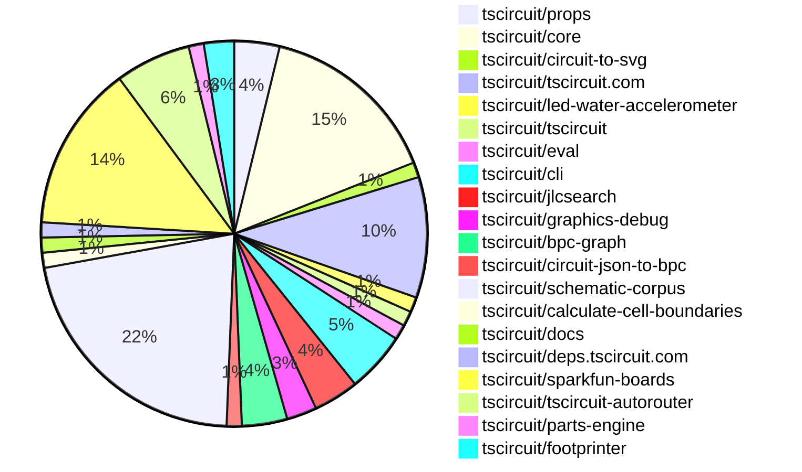

# contribution-tracker

Generates weekly contribution overviews for tscircuit contributors. Check out all
the [contribution overviews here](./contribution-overviews/)
You can find AI-generated monthly changelogs in the [changelogs directory](./changelogs/).

* All PRs in the tscircuit org are scanned/summarized via Claude Haiku
* Claude classifies each Diff/PR as a Major, Minor or Tiny contribution
* All the PRs, summaries, and classifications are organized into charts and tables

The current week is shown below. There are 3 major sections:

* [Contributor Overview](#contributor-overview)
* [PRs by Repository](#prs-by-repository)
* [PRs by Contributor](#changes-by-contributor)

## Current Week

<!-- START_CURRENT_WEEK -->

# Contribution Overview 2025-06-25

## PRs by Repository

## Contributor Overview

| Contributor | 🐳 Major | 🐙 Minor | 🐌 Tiny | ⭐ | Issues Created | Discussion Contributions |
|-------------|---------|---------|---------|-----|----------------|--------------------------|
| [seveibar](#seveibar) | 0 | 16 | 4 | ⭐⭐⭐ | 2 | 0🔹 0🔶 0💎 |
| [Anshgrover23](#Anshgrover23) | 1 | 11 | 4 | ⭐⭐⭐ | 6 | 0🔹 0🔶 0💎 |
| [Abse2001](#Abse2001) | 1 | 10 | 0 | ⭐⭐⭐ | 1 | 0🔹 0🔶 0💎 |
| [imrishabh18](#imrishabh18) | 0 | 9 | 3 | ⭐⭐ | 1 | 0🔹 0🔶 0💎 |
| [ShiboSoftwareDev](#ShiboSoftwareDev) | 0 | 4 | 3 | ⭐⭐ | 3 | 0🔹 0🔶 0💎 |
| [techmannih](#techmannih) | 0 | 5 | 1 | ⭐⭐ | 2 | 0🔹 0🔶 0💎 |
| [ArnavK-09](#ArnavK-09) | 1 | 4 | 0 | ⭐⭐ | 5 | 0🔹 0🔶 0💎 |
| [andrii-balitskyi](#andrii-balitskyi) | 0 | 1 | 0 |  | 0 | 0🔹 0🔶 0💎 |
| [MustafaMulla29](#MustafaMulla29) | 0 | 0 | 1 |  | 0 | 0🔹 0🔶 0💎 |

### Discussion Contribution Legend

- 🔹 Normal Comments: Basic participation with minimal effort
- 🔶 Great Informative Comments: Thoughtful participation that adds value
- 💎 Incredible Comments: Exceptional participation with high-quality content

## Review Table

[reviews-received-hover]: ## "Number of reviews received for PRs for this contributor"
[approvals-received-hover]: ## "Number of approvals received for PRs this contributor authored"
[rejections-received-hover]: ## "Number of rejections received for PRs this contributor authored"
[prs-opened-hover]: ## "Number of PRs opened by this contributor"
[issues-created-hover]: ## "Number of issues created by this contributor"
[bountied-issues-hover]: ## "Number of issues this contributor created with a bounty"
[bountied-issue-$-hover]: ## "Total bounty amount placed on issues authored by this contributor"

| Contributor | Reviews Received | Approvals Received | Rejections Received | Approvals | Rejections | PRs Opened | PRs Merged | Issues Created | Bountied Issues | Bountied Issue $ |
|---|---|---|---|---|---|---|---|---|---|---|
| [seveibar](#seveibar) | 3 | 0 | 0 | 23 | 2 | 24 | 20 | 2 | 0 | 0 |
| [imrishabh18](#imrishabh18) | 9 | 5 | 0 | 4 | 0 | 15 | 12 | 1 | 0 | 0 |
| [graphite-app[bot]](#graphite-app[bot]) | 0 | 0 | 0 | 0 | 0 | 0 | 0 | 0 | 0 | 0 |
| [techmannih](#techmannih) | 22 | 8 | 3 | 0 | 4 | 16 | 6 | 2 | 0 | 0 |
| [Anshgrover23](#Anshgrover23) | 23 | 15 | 3 | 1 | 4 | 17 | 16 | 6 | 0 | 0 |
| [ShiboSoftwareDev](#ShiboSoftwareDev) | 7 | 5 | 0 | 10 | 2 | 9 | 7 | 3 | 0 | 0 |
| [Abse2001](#Abse2001) | 5 | 3 | 1 | 7 | 0 | 13 | 11 | 1 | 0 | 0 |
| [ArnavK-09](#ArnavK-09) | 9 | 7 | 0 | 0 | 0 | 7 | 5 | 5 | 0 | 0 |
| [andrii-balitskyi](#andrii-balitskyi) | 2 | 1 | 1 | 0 | 0 | 2 | 1 | 0 | 0 | 0 |
| [tscircuitbot](#tscircuitbot) | 0 | 0 | 0 | 0 | 0 | 20 | 0 | 0 | 0 | 0 |
| [MustafaMulla29](#MustafaMulla29) | 6 | 1 | 4 | 0 | 0 | 6 | 1 | 0 | 0 | 0 |

## Changes by Repository

### [tscircuit/props](https://github.com/tscircuit/props)

| PR # | Impact | Contributor | Description | Milestone Aligned |
|------|--------|-------------|-------------|-------------------|
| [#307](https://github.com/tscircuit/props/pull/307) | 🐙 Minor | imrishabh18 | Enhancements to the PlatformConfig interface improve configurability and documentation for board information. | ❌ |
| [#308](https://github.com/tscircuit/props/pull/308) | 🐙 Minor | seveibar | Enhancements to component props with new optional attributes improve type safety and flexibility in component usage. | ❌ |
| [#304](https://github.com/tscircuit/props/pull/304) | 🐙 Minor | Anshgrover23 | Enhancing the LED component with a connections property improves its configurability and usability in circuit designs. | ❌ |

### [tscircuit/core](https://github.com/tscircuit/core)

| PR # | Impact | Contributor | Description | Milestone Aligned |
|------|--------|-------------|-------------|-------------------|
| [#1002](https://github.com/tscircuit/core/pull/1002) | 🐙 Minor | imrishabh18 | Enhancing the autorouting functionality to prevent multiple traces between the same pins in subcircuits improves circuit design integrity. | ❌ |
| [#997](https://github.com/tscircuit/core/pull/997) | 🐙 Minor | imrishabh18 | The addition of a test case to ensure that subcircuits do not generate duplicate traces enhances the reliability of the circuit design process. | ❌ |
| [#992](https://github.com/tscircuit/core/pull/992) | 🐙 Minor | imrishabh18 | Enhancements to the SolderJumper component improve its configurability by allowing the use of a custom symbol name. | ❌ |
| [#989](https://github.com/tscircuit/core/pull/989) | 🐙 Minor | imrishabh18 | Enhancement of the SolderJumper component to support a new bridged property, improving its functionality. | ❌ |
| [#1005](https://github.com/tscircuit/core/pull/1005) | 🐙 Minor | seveibar | Elimination of a placeholder enhances code clarity and ensures proper fallback naming in component generation. | ❌ |
| [#1004](https://github.com/tscircuit/core/pull/1004) | 🐙 Minor | seveibar | Enhancements to netlabel positioning improve schematic accuracy and usability. | ❌ |
| [#1003](https://github.com/tscircuit/core/pull/1003) | 🐙 Minor | seveibar | Fixes an issue with net IDs in schematic net labels, ensuring correct data is used. | ❌ |
| [#976](https://github.com/tscircuit/core/pull/976) | 🐙 Minor | seveibar | Enhancements to net label positioning improve schematic clarity and usability. | ❌ |
| [#1000](https://github.com/tscircuit/core/pull/1000) | 🐙 Minor | ShiboSoftwareDev | Enhancements to obstacle generation for cutout components improve the functionality of the circuit design tool. | ❌ |
| [#996](https://github.com/tscircuit/core/pull/996) | 🐙 Minor | Abse2001 | Enhancement of selector functionality by adding support for test point selectors, improving usability in circuit design. | ❌ |
| [#995](https://github.com/tscircuit/core/pull/995) | 🐌 Tiny | Anshgrover23 | Enhances testing capabilities for the LED component by adding a connections test, ensuring proper functionality. | ❌ |
| [#999](https://github.com/tscircuit/core/pull/999) | 🐌 Tiny | ShiboSoftwareDev | Updates the footprinter package version and adjusts test cases for consistency in height values. | ❌ |

### [tscircuit/circuit-to-svg](https://github.com/tscircuit/circuit-to-svg)

| PR # | Impact | Contributor | Description | Milestone Aligned |
|------|--------|-------------|-------------|-------------------|
| [#268](https://github.com/tscircuit/circuit-to-svg/pull/268) | 🐙 Minor | imrishabh18 | Enhancement of PCB silkscreen text rendering by supporting multi-line text through newline handling. | ❌ |

### [tscircuit/tscircuit.com](https://github.com/tscircuit/tscircuit.com)

| PR # | Impact | Contributor | Description | Milestone Aligned |
|------|--------|-------------|-------------|-------------------|
| [#1378](https://github.com/tscircuit/tscircuit.com/pull/1378) | 🐳 Major | ArnavK-09 | Revamping the Cmd+K menu enhances user experience by improving search functionality and interface design. | ❌ |
| [#1371](https://github.com/tscircuit/tscircuit.com/pull/1371) | 🐙 Minor | imrishabh18 | Enhances the dashboard by ensuring packages are sorted based on their update or creation date, improving user experience. | ❌ |
| [#1370](https://github.com/tscircuit/tscircuit.com/pull/1370) | 🐙 Minor | imrishabh18 | Enhancing the dashboard's package sorting functionality by preventing mutation of cached data improves data integrity and performance. | ❌ |
| [#1379](https://github.com/tscircuit/tscircuit.com/pull/1379) | 🐙 Minor | ArnavK-09 | Enhancements to responsiveness improve user experience on build pages. | ❌ |
| [#1374](https://github.com/tscircuit/tscircuit.com/pull/1374) | 🐙 Minor | ArnavK-09 | Enhancing user experience by ensuring the correct GitHub username is displayed in the settings dialog. | ❌ |
| [#1373](https://github.com/tscircuit/tscircuit.com/pull/1373) | 🐙 Minor | ArnavK-09 | Enhances security by limiting AI review generation to package owners, ensuring only authorized users can access this feature. | ❌ |
| [#1372](https://github.com/tscircuit/tscircuit.com/pull/1372) | 🐙 Minor | ArnavK-09 | Introducing a toggle button for AI autocomplete enhances user interaction and functionality within the Code Editor. | ❌ |
| [#1368](https://github.com/tscircuit/tscircuit.com/pull/1368) | 🐙 Minor | andrii-balitskyi | Enhancements to the AI review loading state improve user experience during review requests. | ❌ |

### [tscircuit/led-water-accelerometer](https://github.com/tscircuit/led-water-accelerometer)

| PR # | Impact | Contributor | Description | Milestone Aligned |
|------|--------|-------------|-------------|-------------------|
| [#3](https://github.com/tscircuit/led-water-accelerometer/pull/3) | 🐙 Minor | imrishabh18 | Enhancements to the PCB design by adding mounting holes and connecting the VBUS to the V5 net improve the overall functionality and usability of the circuit. | ❌ |

### [tscircuit/tscircuit](https://github.com/tscircuit/tscircuit)

| PR # | Impact | Contributor | Description | Milestone Aligned |
|------|--------|-------------|-------------|-------------------|
| [#694](https://github.com/tscircuit/tscircuit/pull/694) | 🐌 Tiny | imrishabh18 | Updates the core and eval packages to their latest versions, ensuring compatibility and potentially introducing minor improvements. | ❌ |

### [tscircuit/eval](https://github.com/tscircuit/eval)

| PR # | Impact | Contributor | Description | Milestone Aligned |
|------|--------|-------------|-------------|-------------------|
| [#608](https://github.com/tscircuit/eval/pull/608) | 🐌 Tiny | imrishabh18 | Updating the core dependency version enhances compatibility and potentially introduces new features or fixes. | ❌ |

### [tscircuit/cli](https://github.com/tscircuit/cli)

| PR # | Impact | Contributor | Description | Milestone Aligned |
|------|--------|-------------|-------------|-------------------|
| [#251](https://github.com/tscircuit/cli/pull/251) | 🐙 Minor | ShiboSoftwareDev | Updating the Node.js version in workflows enhances compatibility and performance for the project. | ❌ |
| [#250](https://github.com/tscircuit/cli/pull/250) | 🐙 Minor | ShiboSoftwareDev | Enhances the build command by allowing it to proceed despite circuitJson errors when the --ignore-errors flag is used. | ❌ |
| [#252](https://github.com/tscircuit/cli/pull/252) | 🐌 Tiny | imrishabh18 | Updating dependencies in package.json enhances the project's stability and ensures compatibility with the latest features. | ❌ |
| [#253](https://github.com/tscircuit/cli/pull/253) | 🐌 Tiny | seveibar | Refactoring the CLI to utilize peer dependencies enhances compatibility and reduces bundle size, improving overall performance. | ❌ |

### [tscircuit/jlcsearch](https://github.com/tscircuit/jlcsearch)

| PR # | Impact | Contributor | Description | Milestone Aligned |
|------|--------|-------------|-------------|-------------------|
| [#62](https://github.com/tscircuit/jlcsearch/pull/62) | 🐙 Minor | seveibar | Enhances the gas sensors functionality by introducing a measurement filter, improving user experience and data specificity. | ❌ |
| [#61](https://github.com/tscircuit/jlcsearch/pull/61) | 🐙 Minor | seveibar | Enhancements to gas sensor data handling and exposure of measurement capabilities. | ❌ |
| [#60](https://github.com/tscircuit/jlcsearch/pull/60) | 🐙 Minor | seveibar | The addition of a dedicated page for Boost DC-DC converters enhances the repository's functionality by providing users with a structured way to access and filter converter data. | ❌ |

### [tscircuit/graphics-debug](https://github.com/tscircuit/graphics-debug)

| PR # | Impact | Contributor | Description | Milestone Aligned |
|------|--------|-------------|-------------|-------------------|
| [#58](https://github.com/tscircuit/graphics-debug/pull/58) | 🐙 Minor | seveibar | Enhancing the graphics library by introducing text rendering capabilities significantly improves its functionality and usability. | ❌ |
| [#57](https://github.com/tscircuit/graphics-debug/pull/57) | 🐙 Minor | seveibar | The addition of the `mergeGraphics` utility enhances the library's functionality by allowing the combination of multiple graphics objects, which is valuable for users needing to manage complex graphics compositions. | ❌ |

### [tscircuit/bpc-graph](https://github.com/tscircuit/bpc-graph)

| PR # | Impact | Contributor | Description | Milestone Aligned |
|------|--------|-------------|-------------|-------------------|
| [#6](https://github.com/tscircuit/bpc-graph/pull/6) | 🐙 Minor | seveibar | The pull request introduces a significant refactor of the graph similarity calculation logic, enhancing the functionality and maintainability of the codebase. | ❌ |
| [#5](https://github.com/tscircuit/bpc-graph/pull/5) | 🐙 Minor | seveibar | Enhancements to the graph transformation process with added logging and a new corpus matcher page. | ❌ |
| [#4](https://github.com/tscircuit/bpc-graph/pull/4) | 🐙 Minor | seveibar | The addition of a corpus matcher page enhances the functionality of the application by allowing users to compare BPC graphs against a predefined corpus, thereby improving usability and feature set. | ❌ |

### [tscircuit/circuit-json-to-bpc](https://github.com/tscircuit/circuit-json-to-bpc)

| PR # | Impact | Contributor | Description | Milestone Aligned |
|------|--------|-------------|-------------|-------------------|
| [#2](https://github.com/tscircuit/circuit-json-to-bpc/pull/2) | 🐙 Minor | seveibar | Enhancements to the circuit JSON conversion process by adding functionality for net label conversion to boxes with pins. | ❌ |

### [tscircuit/schematic-corpus](https://github.com/tscircuit/schematic-corpus)

| PR # | Impact | Contributor | Description | Milestone Aligned |
|------|--------|-------------|-------------|-------------------|
| [#25](https://github.com/tscircuit/schematic-corpus/pull/25) | 🐙 Minor | seveibar | Enhancements to the graphics generation for BPC graphs improve the visual representation of circuit designs. | ❌ |
| [#24](https://github.com/tscircuit/schematic-corpus/pull/24) | 🐙 Minor | Anshgrover23 | Introduces a new circuit design with components and connections, enhancing the schematic corpus. | ❌ |
| [#22](https://github.com/tscircuit/schematic-corpus/pull/22) | 🐙 Minor | Anshgrover23 | Introduces a new circuit design component that enhances the schematic library. | ❌ |
| [#10](https://github.com/tscircuit/schematic-corpus/pull/10) | 🐙 Minor | Anshgrover23 | Introduces a new design example that enhances the library's usability and showcases additional functionality. | ❌ |
| [#27](https://github.com/tscircuit/schematic-corpus/pull/27) | 🐙 Minor | techmannih | Introduces a new circuit design component that enhances the schematic library. | ❌ |
| [#26](https://github.com/tscircuit/schematic-corpus/pull/26) | 🐙 Minor | techmannih | Introduces a new circuit design component that enhances the schematic library. | ❌ |
| [#21](https://github.com/tscircuit/schematic-corpus/pull/21) | 🐙 Minor | techmannih | Introduces a new circuit design component that enhances the schematic capabilities of the project. | ❌ |
| [#20](https://github.com/tscircuit/schematic-corpus/pull/20) | 🐙 Minor | Abse2001 | Introduces a new circuit design file with multiple net labels for a chip configuration. | ❌ |
| [#19](https://github.com/tscircuit/schematic-corpus/pull/19) | 🐙 Minor | Abse2001 | Enhancements to circuit design with additional net labels and connections for improved functionality. | ❌ |
| [#18](https://github.com/tscircuit/schematic-corpus/pull/18) | 🐙 Minor | Abse2001 | Introduces a new circuit design component that enhances the schematic capabilities of the project. | ❌ |
| [#17](https://github.com/tscircuit/schematic-corpus/pull/17) | 🐙 Minor | Abse2001 | Introduces a new circuit design component with specific net labels and connections. | ❌ |
| [#16](https://github.com/tscircuit/schematic-corpus/pull/16) | 🐙 Minor | Abse2001 | Introduces a new circuit design component with a switch, capacitor, resistor, and net labels for schematic representation. | ❌ |
| [#15](https://github.com/tscircuit/schematic-corpus/pull/15) | 🐙 Minor | Abse2001 | Introduces a new circuit design component with specific net labels and connections. | ❌ |
| [#14](https://github.com/tscircuit/schematic-corpus/pull/14) | 🐙 Minor | Abse2001 | Introduces a new circuit design with Schottky diodes, addressing a specific issue with symbol functionality. | ❌ |
| [#13](https://github.com/tscircuit/schematic-corpus/pull/13) | 🐙 Minor | Abse2001 | Introduces a new circuit design with specific capacitor placements and net labels. | ❌ |
| [#12](https://github.com/tscircuit/schematic-corpus/pull/12) | 🐙 Minor | Abse2001 | Introduces a new circuit design with specific component placements and connections. | ❌ |
| [#11](https://github.com/tscircuit/schematic-corpus/pull/11) | 🐌 Tiny | seveibar | The changes enhance the package dependencies and type definitions, improving the overall development environment. | ❌ |

### [tscircuit/calculate-cell-boundaries](https://github.com/tscircuit/calculate-cell-boundaries)

| PR # | Impact | Contributor | Description | Milestone Aligned |
|------|--------|-------------|-------------|-------------------|
| [#7](https://github.com/tscircuit/calculate-cell-boundaries/pull/7) | 🐙 Minor | seveibar | Refactoring the internal layout enhances code organization and maintainability, improving the overall structure of the project. | ❌ |

### [tscircuit/docs](https://github.com/tscircuit/docs)

| PR # | Impact | Contributor | Description | Milestone Aligned |
|------|--------|-------------|-------------|-------------------|
| [#92](https://github.com/tscircuit/docs/pull/92) | 🐌 Tiny | seveibar | Enhances documentation by detailing the usage of `sel.net` within the selector pattern, improving developer understanding. | ❌ |

### [tscircuit/deps.tscircuit.com](https://github.com/tscircuit/deps.tscircuit.com)

| PR # | Impact | Contributor | Description | Milestone Aligned |
|------|--------|-------------|-------------|-------------------|
| [#23](https://github.com/tscircuit/deps.tscircuit.com/pull/23) | 🐌 Tiny | seveibar | Introducing a new downstream dependency enhances the dependency graph and improves package management. | ❌ |

### [tscircuit/sparkfun-boards](https://github.com/tscircuit/sparkfun-boards)

| PR # | Impact | Contributor | Description | Milestone Aligned |
|------|--------|-------------|-------------|-------------------|
| [#18](https://github.com/tscircuit/sparkfun-boards/pull/18) | 🐳 Major | Anshgrover23 | Introduces a new sensor board with comprehensive documentation and schematic integration, enhancing the repository's offerings. | ❌ |
| [#29](https://github.com/tscircuit/sparkfun-boards/pull/29) | 🐳 Major | Abse2001 | The addition of a new board design for the SparkFun Transceiver Breakout MAX3232 enhances the repository's offerings and provides a new component for users. | ❌ |
| [#33](https://github.com/tscircuit/sparkfun-boards/pull/33) | 🐙 Minor | Anshgrover23 | Refactoring the code to improve organization by separating the jumper footprint into its own file enhances maintainability and readability. | ❌ |
| [#24](https://github.com/tscircuit/sparkfun-boards/pull/24) | 🐙 Minor | Anshgrover23 | The update enhances the RFM69 breakout board's design by refining its schematic and PCB layout, improving clarity and functionality. | ❌ |
| [#12](https://github.com/tscircuit/sparkfun-boards/pull/12) | 🐙 Minor | techmannih | The pull request enhances the USBToSerialBreakout board by correcting pin labels and adding a new component, improving functionality and clarity. | ❌ |
| [#32](https://github.com/tscircuit/sparkfun-boards/pull/32) | 🐌 Tiny | Anshgrover23 | Enhances the development workflow by adding snapshot scripts for easier testing and updates. | ❌ |
| [#16](https://github.com/tscircuit/sparkfun-boards/pull/16) | 🐌 Tiny | Anshgrover23 | Adding a README file enhances documentation and usability for users of the SparkFun RFM69 Breakout board. | ❌ |
| [#30](https://github.com/tscircuit/sparkfun-boards/pull/30) | 🐌 Tiny | ShiboSoftwareDev | The pull request refines the schematic adjustments for the I2C DAC Breakout, enhancing precision in component placement. | ❌ |
| [#25](https://github.com/tscircuit/sparkfun-boards/pull/25) | 🐌 Tiny | ShiboSoftwareDev | Enhancements to the CI workflows ensure compatibility with Node version 22 and updated dependencies, improving reliability and performance. | ❌ |
| [#31](https://github.com/tscircuit/sparkfun-boards/pull/31) | 🐌 Tiny | techmannih | Adding a README file enhances documentation and usability for the SparkFun USB to Serial Breakout board. | ❌ |
| [#21](https://github.com/tscircuit/sparkfun-boards/pull/21) | 🐌 Tiny | MustafaMulla29 | Updates dependencies and snapshots to ensure compatibility and reflect recent changes in the project. | ❌ |

### [tscircuit/tscircuit-autorouter](https://github.com/tscircuit/tscircuit-autorouter)

| PR # | Impact | Contributor | Description | Milestone Aligned |
|------|--------|-------------|-------------|-------------------|
| [#172](https://github.com/tscircuit/tscircuit-autorouter/pull/172) | 🐙 Minor | Anshgrover23 | Enhancements to testing fixtures for improved debugging of hypersolver issues. | ❌ |
| [#171](https://github.com/tscircuit/tscircuit-autorouter/pull/171) | 🐙 Minor | Anshgrover23 | Enhancements to testing fixtures for hyperdensity bugs improve the robustness of the autorouting feature. | ❌ |
| [#165](https://github.com/tscircuit/tscircuit-autorouter/pull/165) | 🐙 Minor | Anshgrover23 | Enhancements to testing fixtures for hyperdensity solver bugs improve debugging capabilities and ensure better performance. | ❌ |
| [#168](https://github.com/tscircuit/tscircuit-autorouter/pull/168) | 🐙 Minor | Anshgrover23 | Introduces a new JSON asset and a corresponding fixture for high-density debugging, enhancing testing capabilities. | ❌ |
| [#170](https://github.com/tscircuit/tscircuit-autorouter/pull/170) | 🐌 Tiny | Anshgrover23 | Excluding JSON files from formatting enhances the development workflow by preventing unnecessary changes in these files. | ❌ |

### [tscircuit/parts-engine](https://github.com/tscircuit/parts-engine)

| PR # | Impact | Contributor | Description | Milestone Aligned |
|------|--------|-------------|-------------|-------------------|
| [#8](https://github.com/tscircuit/parts-engine/pull/8) | 🐙 Minor | Anshgrover23 | Enhances robustness by preventing errors when fuses are undefined. | ❌ |

### [tscircuit/footprinter](https://github.com/tscircuit/footprinter)

| PR # | Impact | Contributor | Description | Milestone Aligned |
|------|--------|-------------|-------------|-------------------|
| [#307](https://github.com/tscircuit/footprinter/pull/307) | 🐙 Minor | ShiboSoftwareDev | Enhancement of the pinrow functionality by allowing the omission of silkscreen pin labels, improving customization options for users. | ❌ |
| [#306](https://github.com/tscircuit/footprinter/pull/306) | 🐙 Minor | techmannih | Adjusts the dimensions of the 1210 footprint to improve compatibility with tall pads, enhancing design accuracy. | ❌ |

## Changes by Contributor

### [imrishabh18](https://github.com/imrishabh18)

| PR # | Impact | Description | Milestone Aligned |
|------|--------|-------------|-------------------|
| [#307](https://github.com/tscircuit/props/pull/307) | 🐙 Minor | Enhancements to the PlatformConfig interface improve configurability and documentation for board information. | ❌ |
| [#1002](https://github.com/tscircuit/core/pull/1002) | 🐙 Minor | Enhancing the autorouting functionality to prevent multiple traces between the same pins in subcircuits improves circuit design integrity. | ❌ |
| [#997](https://github.com/tscircuit/core/pull/997) | 🐙 Minor | The addition of a test case to ensure that subcircuits do not generate duplicate traces enhances the reliability of the circuit design process. | ❌ |
| [#992](https://github.com/tscircuit/core/pull/992) | 🐙 Minor | Enhancements to the SolderJumper component improve its configurability by allowing the use of a custom symbol name. | ❌ |
| [#989](https://github.com/tscircuit/core/pull/989) | 🐙 Minor | Enhancement of the SolderJumper component to support a new bridged property, improving its functionality. | ❌ |
| [#268](https://github.com/tscircuit/circuit-to-svg/pull/268) | 🐙 Minor | Enhancement of PCB silkscreen text rendering by supporting multi-line text through newline handling. | ❌ |
| [#1371](https://github.com/tscircuit/tscircuit.com/pull/1371) | 🐙 Minor | Enhances the dashboard by ensuring packages are sorted based on their update or creation date, improving user experience. | ❌ |
| [#1370](https://github.com/tscircuit/tscircuit.com/pull/1370) | 🐙 Minor | Enhancing the dashboard's package sorting functionality by preventing mutation of cached data improves data integrity and performance. | ❌ |
| [#3](https://github.com/tscircuit/led-water-accelerometer/pull/3) | 🐙 Minor | Enhancements to the PCB design by adding mounting holes and connecting the VBUS to the V5 net improve the overall functionality and usability of the circuit. | ❌ |
| [#694](https://github.com/tscircuit/tscircuit/pull/694) | 🐌 Tiny | Updates the core and eval packages to their latest versions, ensuring compatibility and potentially introducing minor improvements. | ❌ |
| [#608](https://github.com/tscircuit/eval/pull/608) | 🐌 Tiny | Updating the core dependency version enhances compatibility and potentially introduces new features or fixes. | ❌ |
| [#252](https://github.com/tscircuit/cli/pull/252) | 🐌 Tiny | Updating dependencies in package.json enhances the project's stability and ensures compatibility with the latest features. | ❌ |

### [seveibar](https://github.com/seveibar)

| PR # | Impact | Description | Milestone Aligned |
|------|--------|-------------|-------------------|
| [#308](https://github.com/tscircuit/props/pull/308) | 🐙 Minor | Enhancements to component props with new optional attributes improve type safety and flexibility in component usage. | ❌ |
| [#1005](https://github.com/tscircuit/core/pull/1005) | 🐙 Minor | Elimination of a placeholder enhances code clarity and ensures proper fallback naming in component generation. | ❌ |
| [#1004](https://github.com/tscircuit/core/pull/1004) | 🐙 Minor | Enhancements to netlabel positioning improve schematic accuracy and usability. | ❌ |
| [#1003](https://github.com/tscircuit/core/pull/1003) | 🐙 Minor | Fixes an issue with net IDs in schematic net labels, ensuring correct data is used. | ❌ |
| [#976](https://github.com/tscircuit/core/pull/976) | 🐙 Minor | Enhancements to net label positioning improve schematic clarity and usability. | ❌ |
| [#62](https://github.com/tscircuit/jlcsearch/pull/62) | 🐙 Minor | Enhances the gas sensors functionality by introducing a measurement filter, improving user experience and data specificity. | ❌ |
| [#61](https://github.com/tscircuit/jlcsearch/pull/61) | 🐙 Minor | Enhancements to gas sensor data handling and exposure of measurement capabilities. | ❌ |
| [#60](https://github.com/tscircuit/jlcsearch/pull/60) | 🐙 Minor | The addition of a dedicated page for Boost DC-DC converters enhances the repository's functionality by providing users with a structured way to access and filter converter data. | ❌ |
| [#58](https://github.com/tscircuit/graphics-debug/pull/58) | 🐙 Minor | Enhancing the graphics library by introducing text rendering capabilities significantly improves its functionality and usability. | ❌ |
| [#57](https://github.com/tscircuit/graphics-debug/pull/57) | 🐙 Minor | The addition of the `mergeGraphics` utility enhances the library's functionality by allowing the combination of multiple graphics objects, which is valuable for users needing to manage complex graphics compositions. | ❌ |
| [#6](https://github.com/tscircuit/bpc-graph/pull/6) | 🐙 Minor | The pull request introduces a significant refactor of the graph similarity calculation logic, enhancing the functionality and maintainability of the codebase. | ❌ |
| [#5](https://github.com/tscircuit/bpc-graph/pull/5) | 🐙 Minor | Enhancements to the graph transformation process with added logging and a new corpus matcher page. | ❌ |
| [#4](https://github.com/tscircuit/bpc-graph/pull/4) | 🐙 Minor | The addition of a corpus matcher page enhances the functionality of the application by allowing users to compare BPC graphs against a predefined corpus, thereby improving usability and feature set. | ❌ |
| [#2](https://github.com/tscircuit/circuit-json-to-bpc/pull/2) | 🐙 Minor | Enhancements to the circuit JSON conversion process by adding functionality for net label conversion to boxes with pins. | ❌ |
| [#25](https://github.com/tscircuit/schematic-corpus/pull/25) | 🐙 Minor | Enhancements to the graphics generation for BPC graphs improve the visual representation of circuit designs. | ❌ |
| [#7](https://github.com/tscircuit/calculate-cell-boundaries/pull/7) | 🐙 Minor | Refactoring the internal layout enhances code organization and maintainability, improving the overall structure of the project. | ❌ |
| [#253](https://github.com/tscircuit/cli/pull/253) | 🐌 Tiny | Refactoring the CLI to utilize peer dependencies enhances compatibility and reduces bundle size, improving overall performance. | ❌ |
| [#92](https://github.com/tscircuit/docs/pull/92) | 🐌 Tiny | Enhances documentation by detailing the usage of `sel.net` within the selector pattern, improving developer understanding. | ❌ |
| [#11](https://github.com/tscircuit/schematic-corpus/pull/11) | 🐌 Tiny | The changes enhance the package dependencies and type definitions, improving the overall development environment. | ❌ |
| [#23](https://github.com/tscircuit/deps.tscircuit.com/pull/23) | 🐌 Tiny | Introducing a new downstream dependency enhances the dependency graph and improves package management. | ❌ |

### [Anshgrover23](https://github.com/Anshgrover23)

| PR # | Impact | Description | Milestone Aligned |
|------|--------|-------------|-------------------|
| [#18](https://github.com/tscircuit/sparkfun-boards/pull/18) | 🐳 Major | Introduces a new sensor board with comprehensive documentation and schematic integration, enhancing the repository's offerings. | ❌ |
| [#304](https://github.com/tscircuit/props/pull/304) | 🐙 Minor | Enhancing the LED component with a connections property improves its configurability and usability in circuit designs. | ❌ |
| [#172](https://github.com/tscircuit/tscircuit-autorouter/pull/172) | 🐙 Minor | Enhancements to testing fixtures for improved debugging of hypersolver issues. | ❌ |
| [#171](https://github.com/tscircuit/tscircuit-autorouter/pull/171) | 🐙 Minor | Enhancements to testing fixtures for hyperdensity bugs improve the robustness of the autorouting feature. | ❌ |
| [#165](https://github.com/tscircuit/tscircuit-autorouter/pull/165) | 🐙 Minor | Enhancements to testing fixtures for hyperdensity solver bugs improve debugging capabilities and ensure better performance. | ❌ |
| [#168](https://github.com/tscircuit/tscircuit-autorouter/pull/168) | 🐙 Minor | Introduces a new JSON asset and a corresponding fixture for high-density debugging, enhancing testing capabilities. | ❌ |
| [#8](https://github.com/tscircuit/parts-engine/pull/8) | 🐙 Minor | Enhances robustness by preventing errors when fuses are undefined. | ❌ |
| [#33](https://github.com/tscircuit/sparkfun-boards/pull/33) | 🐙 Minor | Refactoring the code to improve organization by separating the jumper footprint into its own file enhances maintainability and readability. | ❌ |
| [#24](https://github.com/tscircuit/sparkfun-boards/pull/24) | 🐙 Minor | The update enhances the RFM69 breakout board's design by refining its schematic and PCB layout, improving clarity and functionality. | ❌ |
| [#24](https://github.com/tscircuit/schematic-corpus/pull/24) | 🐙 Minor | Introduces a new circuit design with components and connections, enhancing the schematic corpus. | ❌ |
| [#22](https://github.com/tscircuit/schematic-corpus/pull/22) | 🐙 Minor | Introduces a new circuit design component that enhances the schematic library. | ❌ |
| [#10](https://github.com/tscircuit/schematic-corpus/pull/10) | 🐙 Minor | Introduces a new design example that enhances the library's usability and showcases additional functionality. | ❌ |
| [#995](https://github.com/tscircuit/core/pull/995) | 🐌 Tiny | Enhances testing capabilities for the LED component by adding a connections test, ensuring proper functionality. | ❌ |
| [#170](https://github.com/tscircuit/tscircuit-autorouter/pull/170) | 🐌 Tiny | Excluding JSON files from formatting enhances the development workflow by preventing unnecessary changes in these files. | ❌ |
| [#32](https://github.com/tscircuit/sparkfun-boards/pull/32) | 🐌 Tiny | Enhances the development workflow by adding snapshot scripts for easier testing and updates. | ❌ |
| [#16](https://github.com/tscircuit/sparkfun-boards/pull/16) | 🐌 Tiny | Adding a README file enhances documentation and usability for users of the SparkFun RFM69 Breakout board. | ❌ |

### [ShiboSoftwareDev](https://github.com/ShiboSoftwareDev)

| PR # | Impact | Description | Milestone Aligned |
|------|--------|-------------|-------------------|
| [#307](https://github.com/tscircuit/footprinter/pull/307) | 🐙 Minor | Enhancement of the pinrow functionality by allowing the omission of silkscreen pin labels, improving customization options for users. | ❌ |
| [#1000](https://github.com/tscircuit/core/pull/1000) | 🐙 Minor | Enhancements to obstacle generation for cutout components improve the functionality of the circuit design tool. | ❌ |
| [#251](https://github.com/tscircuit/cli/pull/251) | 🐙 Minor | Updating the Node.js version in workflows enhances compatibility and performance for the project. | ❌ |
| [#250](https://github.com/tscircuit/cli/pull/250) | 🐙 Minor | Enhances the build command by allowing it to proceed despite circuitJson errors when the --ignore-errors flag is used. | ❌ |
| [#999](https://github.com/tscircuit/core/pull/999) | 🐌 Tiny | Updates the footprinter package version and adjusts test cases for consistency in height values. | ❌ |
| [#30](https://github.com/tscircuit/sparkfun-boards/pull/30) | 🐌 Tiny | The pull request refines the schematic adjustments for the I2C DAC Breakout, enhancing precision in component placement. | ❌ |
| [#25](https://github.com/tscircuit/sparkfun-boards/pull/25) | 🐌 Tiny | Enhancements to the CI workflows ensure compatibility with Node version 22 and updated dependencies, improving reliability and performance. | ❌ |

### [techmannih](https://github.com/techmannih)

| PR # | Impact | Description | Milestone Aligned |
|------|--------|-------------|-------------------|
| [#306](https://github.com/tscircuit/footprinter/pull/306) | 🐙 Minor | Adjusts the dimensions of the 1210 footprint to improve compatibility with tall pads, enhancing design accuracy. | ❌ |
| [#12](https://github.com/tscircuit/sparkfun-boards/pull/12) | 🐙 Minor | The pull request enhances the USBToSerialBreakout board by correcting pin labels and adding a new component, improving functionality and clarity. | ❌ |
| [#27](https://github.com/tscircuit/schematic-corpus/pull/27) | 🐙 Minor | Introduces a new circuit design component that enhances the schematic library. | ❌ |
| [#26](https://github.com/tscircuit/schematic-corpus/pull/26) | 🐙 Minor | Introduces a new circuit design component that enhances the schematic library. | ❌ |
| [#21](https://github.com/tscircuit/schematic-corpus/pull/21) | 🐙 Minor | Introduces a new circuit design component that enhances the schematic capabilities of the project. | ❌ |
| [#31](https://github.com/tscircuit/sparkfun-boards/pull/31) | 🐌 Tiny | Adding a README file enhances documentation and usability for the SparkFun USB to Serial Breakout board. | ❌ |

### [Abse2001](https://github.com/Abse2001)

| PR # | Impact | Description | Milestone Aligned |
|------|--------|-------------|-------------------|
| [#29](https://github.com/tscircuit/sparkfun-boards/pull/29) | 🐳 Major | The addition of a new board design for the SparkFun Transceiver Breakout MAX3232 enhances the repository's offerings and provides a new component for users. | ❌ |
| [#996](https://github.com/tscircuit/core/pull/996) | 🐙 Minor | Enhancement of selector functionality by adding support for test point selectors, improving usability in circuit design. | ❌ |
| [#20](https://github.com/tscircuit/schematic-corpus/pull/20) | 🐙 Minor | Introduces a new circuit design file with multiple net labels for a chip configuration. | ❌ |
| [#19](https://github.com/tscircuit/schematic-corpus/pull/19) | 🐙 Minor | Enhancements to circuit design with additional net labels and connections for improved functionality. | ❌ |
| [#18](https://github.com/tscircuit/schematic-corpus/pull/18) | 🐙 Minor | Introduces a new circuit design component that enhances the schematic capabilities of the project. | ❌ |
| [#17](https://github.com/tscircuit/schematic-corpus/pull/17) | 🐙 Minor | Introduces a new circuit design component with specific net labels and connections. | ❌ |
| [#16](https://github.com/tscircuit/schematic-corpus/pull/16) | 🐙 Minor | Introduces a new circuit design component with a switch, capacitor, resistor, and net labels for schematic representation. | ❌ |
| [#15](https://github.com/tscircuit/schematic-corpus/pull/15) | 🐙 Minor | Introduces a new circuit design component with specific net labels and connections. | ❌ |
| [#14](https://github.com/tscircuit/schematic-corpus/pull/14) | 🐙 Minor | Introduces a new circuit design with Schottky diodes, addressing a specific issue with symbol functionality. | ❌ |
| [#13](https://github.com/tscircuit/schematic-corpus/pull/13) | 🐙 Minor | Introduces a new circuit design with specific capacitor placements and net labels. | ❌ |
| [#12](https://github.com/tscircuit/schematic-corpus/pull/12) | 🐙 Minor | Introduces a new circuit design with specific component placements and connections. | ❌ |

### [ArnavK-09](https://github.com/ArnavK-09)

| PR # | Impact | Description | Milestone Aligned |
|------|--------|-------------|-------------------|
| [#1378](https://github.com/tscircuit/tscircuit.com/pull/1378) | 🐳 Major | Revamping the Cmd+K menu enhances user experience by improving search functionality and interface design. | ❌ |
| [#1379](https://github.com/tscircuit/tscircuit.com/pull/1379) | 🐙 Minor | Enhancements to responsiveness improve user experience on build pages. | ❌ |
| [#1374](https://github.com/tscircuit/tscircuit.com/pull/1374) | 🐙 Minor | Enhancing user experience by ensuring the correct GitHub username is displayed in the settings dialog. | ❌ |
| [#1373](https://github.com/tscircuit/tscircuit.com/pull/1373) | 🐙 Minor | Enhances security by limiting AI review generation to package owners, ensuring only authorized users can access this feature. | ❌ |
| [#1372](https://github.com/tscircuit/tscircuit.com/pull/1372) | 🐙 Minor | Introducing a toggle button for AI autocomplete enhances user interaction and functionality within the Code Editor. | ❌ |

### [andrii-balitskyi](https://github.com/andrii-balitskyi)

| PR # | Impact | Description | Milestone Aligned |
|------|--------|-------------|-------------------|
| [#1368](https://github.com/tscircuit/tscircuit.com/pull/1368) | 🐙 Minor | Enhancements to the AI review loading state improve user experience during review requests. | ❌ |

### [MustafaMulla29](https://github.com/MustafaMulla29)

| PR # | Impact | Description | Milestone Aligned |
|------|--------|-------------|-------------------|
| [#21](https://github.com/tscircuit/sparkfun-boards/pull/21) | 🐌 Tiny | Updates dependencies and snapshots to ensure compatibility and reflect recent changes in the project. | ❌ |

## Repository Owners

| Repository | Codeowners |
|------------|------------|
| [circuit-json-to-gerber](https://github.com/tscircuit/circuit-json-to-gerber/blob/main/.github/CODEOWNERS) | [seveibar](https://github.com/seveibar), [ShiboSoftwareDev](https://github.com/ShiboSoftwareDev) |
| [cli](https://github.com/tscircuit/cli/blob/main/.github/CODEOWNERS) | [seveibar](https://github.com/seveibar), [imrishabh18](https://github.com/imrishabh18) |
| [circuit-to-svg](https://github.com/tscircuit/circuit-to-svg/blob/main/.github/CODEOWNERS) | [imrishabh18](https://github.com/imrishabh18) |
| [tscircuit.com](https://github.com/tscircuit/tscircuit.com/blob/main/.github/CODEOWNERS) | [imrishabh18](https://github.com/imrishabh18) |
| [footprinter](https://github.com/tscircuit/footprinter/blob/main/.github/CODEOWNERS) | [techmannih](https://github.com/techmannih) |

## Repos by Owner

| User | Repo |
|------|------|
| [seveibar](https://github.com/seveibar) | [circuit-json-to-gerber](https://github.com/tscircuit/circuit-json-to-gerber/blob/main/.github/CODEOWNERS) |
|  | [cli](https://github.com/tscircuit/cli/blob/main/.github/CODEOWNERS) |
| [imrishabh18](https://github.com/imrishabh18) | [circuit-to-svg](https://github.com/tscircuit/circuit-to-svg/blob/main/.github/CODEOWNERS) |
|  | [tscircuit.com](https://github.com/tscircuit/tscircuit.com/blob/main/.github/CODEOWNERS) |
|  | [cli](https://github.com/tscircuit/cli/blob/main/.github/CODEOWNERS) |
| [techmannih](https://github.com/techmannih) | [footprinter](https://github.com/tscircuit/footprinter/blob/main/.github/CODEOWNERS) |
| [ShiboSoftwareDev](https://github.com/ShiboSoftwareDev) | [circuit-json-to-gerber](https://github.com/tscircuit/circuit-json-to-gerber/blob/main/.github/CODEOWNERS) |

<!-- END_CURRENT_WEEK -->
