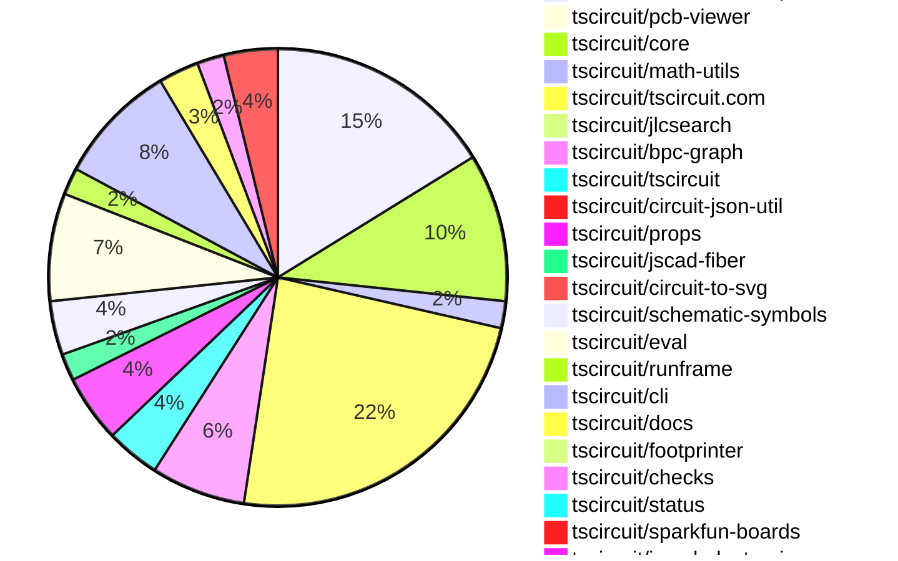
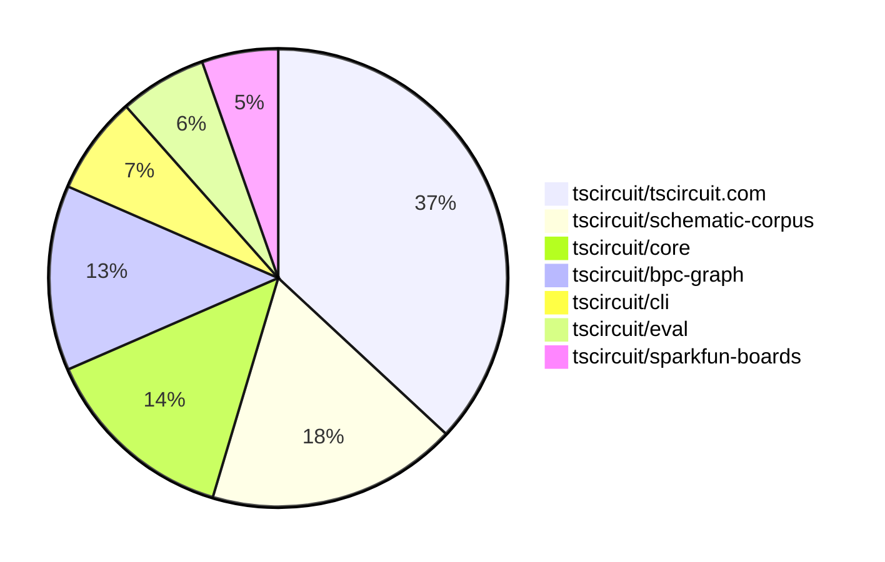

# contribution-tracker

[contributions.tscircuit.com](https://contributions.tscircuit.com) ・ [tscircuit.com](https://tscircuit.com) ・ [Contribution Overviews](./contribution-overviews/) ・ [Changelogs](./changelogs/)

Generates weekly contribution overviews for tscircuit contributors. Check out all
the [contribution overviews here](./contribution-overviews/)
You can find AI-generated monthly changelogs in the [changelogs directory](./changelogs/).

- All PRs in the tscircuit org are scanned/summarized via an LLM
- The LLM classifies each Diff/PR as into a set of attributes for scoring
- All the PRs, summaries, and classifications are organized into charts and tables for [the website](https://contributions.tscircuit.com)

> Want to run locally? See the [Development Section](#development)

The current week is shown below. There are 3 major sections:

- [Contributor Overview](#contributor-overview)
- [PRs by Repository](#prs-by-repository)
- [PRs by Contributor](#changes-by-contributor)

## Current Week

<!-- START_CURRENT_WEEK -->

# Contribution Overview 2025-07-09

## PRs by Repository



## Contributor Overview

| Contributor | 🐳 Major | 🐙 Minor | 🐌 Tiny | ⭐ | Issues Created | Discussion Contributions |
|-------------|---------|---------|---------|-----|----------------|--------------------------|
| [seveibar](#seveibar) | 9 | 1 | 42 | 👑 | 0 | 0🔹 0🔶 0💎 |
| [ArnavK-09](#ArnavK-09) | 3 | 4 | 5 | ⭐⭐ | 0 | 0🔹 0🔶 0💎 |
| [imrishabh18](#imrishabh18) | 0 | 2 | 12 | ⭐⭐ | 0 | 0🔹 0🔶 0💎 |
| [Abse2001](#Abse2001) | 0 | 2 | 8 | ⭐⭐ | 0 | 0🔹 0🔶 0💎 |
| [techmannih](#techmannih) | 2 | 0 | 5 | ⭐⭐ | 0 | 0🔹 0🔶 0💎 |
| [ShiboSoftwareDev](#ShiboSoftwareDev) | 2 | 0 | 2 | ⭐⭐ | 0 | 0🔹 0🔶 0💎 |
| [MustafaMulla29](#MustafaMulla29) | 0 | 0 | 9 | ⭐ | 0 | 0🔹 0🔶 0💎 |
| [tscircuitbot](#tscircuitbot) | 0 | 0 | 3 |  | 0 | 0🔹 0🔶 0💎 |
| [abimaelmartell](#abimaelmartell) | 0 | 0 | 1 |  | 0 | 0🔹 0🔶 0💎 |
| [nuraci](#nuraci) | 0 | 0 | 0 |  | 0 | 0🔹 1🔶 0💎 |

### Discussion Contribution Legend

- 🔹 Normal Comments: Basic participation with minimal effort
- 🔶 Great Informative Comments: Thoughtful participation that adds value
- 💎 Incredible Comments: Exceptional participation with high-quality content

## Review Table

[reviews-received-hover]: ## "Number of reviews received for PRs for this contributor"
[approvals-received-hover]: ## "Number of approvals received for PRs this contributor authored"
[rejections-received-hover]: ## "Number of rejections received for PRs this contributor authored"
[prs-opened-hover]: ## "Number of PRs opened by this contributor"
[issues-created-hover]: ## "Number of issues created by this contributor"
[bountied-issues-hover]: ## "Number of issues this contributor created with a bounty"
[bountied-issue-$-hover]: ## "Total bounty amount placed on issues authored by this contributor"

| Contributor | Reviews Received | Approvals Received | Rejections Received | Approvals | Rejections | PRs Opened | PRs Merged | Issues Created | Bountied Issues | Bountied Issue $ |
|---|---|---|---|---|---|---|---|---|---|---|
| [techmannih](#techmannih) | 17 | 7 | 2 | 0 | 1 | 12 | 7 | 0 | 0 | 0 |
| [imrishabh18](#imrishabh18) | 14 | 11 | 0 | 4 | 2 | 20 | 15 | 0 | 0 | 0 |
| [seveibar](#seveibar) | 37 | 0 | 0 | 39 | 5 | 74 | 54 | 0 | 0 | 0 |
| [cursor[bot]](#cursor[bot]) | 0 | 0 | 0 | 0 | 0 | 0 | 0 | 0 | 0 | 0 |
| [ShiboSoftwareDev](#ShiboSoftwareDev) | 8 | 5 | 1 | 4 | 0 | 7 | 4 | 0 | 0 | 0 |
| [andrii-balitskyi](#andrii-balitskyi) | 5 | 3 | 1 | 0 | 0 | 6 | 3 | 0 | 0 | 0 |
| [MustafaMulla29](#MustafaMulla29) | 22 | 11 | 2 | 0 | 0 | 14 | 9 | 0 | 0 | 0 |
| [graphite-app[bot]](#graphite-app[bot]) | 0 | 0 | 0 | 0 | 0 | 0 | 0 | 0 | 0 | 0 |
| [abimaelmartell](#abimaelmartell) | 3 | 0 | 0 | 0 | 0 | 2 | 1 | 0 | 0 | 0 |
| [Abse2001](#Abse2001) | 10 | 7 | 0 | 9 | 0 | 10 | 10 | 0 | 0 | 0 |
| [ArnavK-09](#ArnavK-09) | 33 | 12 | 2 | 0 | 0 | 15 | 12 | 0 | 0 | 0 |
| [tscircuitbot](#tscircuitbot) | 1 | 0 | 0 | 0 | 0 | 22 | 3 | 0 | 0 | 0 |
| [nuraci](#nuraci) | 0 | 0 | 0 | 0 | 0 | 0 | 0 | 0 | 0 | 0 |

## Top 7 Repositories by Contribution Points



## Changes by Repository

### [tscircuit/schematic-corpus](https://github.com/tscircuit/schematic-corpus)

| PR # | Impact | Rating | Contributor | Description |
|------|--------|--------|-------------|-------------|
| [#70](https://github.com/tscircuit/schematic-corpus/pull/70) | 🐳 Major | ⭐⭐⭐ | techmannih | Adds a new design (design047) to enhance the autorouting algorithm by introducing a new circuit board layout. |
| [#72](https://github.com/tscircuit/schematic-corpus/pull/72) | 🐳 Major | ⭐⭐⭐ | techmannih | Adds a new design048 circuit to enhance the autorouting algorithm functionality. |

<details>
<summary>🐌 Tiny Contributions (15)</summary>

| PR # | Impact | Contributor | Description |
|------|--------|-------------|-------------|
| [#83](https://github.com/tscircuit/schematic-corpus/pull/83) | 🐌 Tiny | techmannih | Adds a new design (design055) to the schematic corpus, which includes a new circuit layout for improved autolayout functionality. |
| [#78](https://github.com/tscircuit/schematic-corpus/pull/78) | 🐌 Tiny | techmannih | Adds a new design (design053) to the schematic corpus, which includes a new circuit board layout for improved autolayout algorithm functionality. |
| [#76](https://github.com/tscircuit/schematic-corpus/pull/76) | 🐌 Tiny | techmannih | Adds a new design (design051) to the schematic corpus, which is intended to enhance the autorouting algorithm. |
| [#63](https://github.com/tscircuit/schematic-corpus/pull/63) | 🐌 Tiny | techmannih | Fixes incorrect pin connections in design019, ensuring proper netlabel connections for the autolayout algorithm. |
| [#64](https://github.com/tscircuit/schematic-corpus/pull/64) | 🐌 Tiny | seveibar | Add a script to copy SVG snapshots to the site build output directory during the site build process. |
| [#62](https://github.com/tscircuit/schematic-corpus/pull/62) | 🐌 Tiny | seveibar | Adds functionality to export BPC graphs without net labels, allowing for better handling of circuits that do not utilize net labels. |
| [#80](https://github.com/tscircuit/schematic-corpus/pull/80) | 🐌 Tiny | MustafaMulla29 | Removes the schPinStyle property from the design52 component, simplifying the design structure. |
| [#79](https://github.com/tscircuit/schematic-corpus/pull/79) | 🐌 Tiny | MustafaMulla29 | Adds a new design (design52) to the schematic corpus, which enhances the autorouting algorithm by providing a new circuit board design. |
| [#73](https://github.com/tscircuit/schematic-corpus/pull/73) | 🐌 Tiny | MustafaMulla29 | Adds a new design (design049) to the schematic corpus, which is intended to enhance the autorouting algorithms performance. |
| [#84](https://github.com/tscircuit/schematic-corpus/pull/84) | 🐌 Tiny | Abse2001 | Adds a new design (design056) to the schematic corpus, which includes manual edits for component placements to enhance the autolayout algorithm. |
| [#82](https://github.com/tscircuit/schematic-corpus/pull/82) | 🐌 Tiny | Abse2001 | Removes schPinStyle usage from multiple designs, ensuring consistent pin styling across the circuit designs. |
| [#81](https://github.com/tscircuit/schematic-corpus/pull/81) | 🐌 Tiny | Abse2001 | Fixes the issue where the code owner is not requested for review by changing the CODEOWNERS file to include all subdirectories under designs. |
| [#77](https://github.com/tscircuit/schematic-corpus/pull/77) | 🐌 Tiny | Abse2001 | Adds a new design (design054) to the schematic corpus, which includes a new circuit board layout with specific component placements to enhance the autolayout algorithm. |
| [#75](https://github.com/tscircuit/schematic-corpus/pull/75) | 🐌 Tiny | Abse2001 | Adds a new design (design050) to the schematic corpus, which includes a resistor, capacitor, and net labels for improved autorouting functionality. |
| [#71](https://github.com/tscircuit/schematic-corpus/pull/71) | 🐌 Tiny | Abse2001 | Adds a CODEOWNERS file to define code ownership for schematic-corpus designs. |

</details>

### [tscircuit/pcb-viewer](https://github.com/tscircuit/pcb-viewer)


<details>
<summary>🐌 Tiny Contributions (1)</summary>

| PR # | Impact | Contributor | Description |
|------|--------|-------------|-------------|
| [#347](https://github.com/tscircuit/pcb-viewer/pull/347) | 🐌 Tiny | techmannih | Updates the circuit-to-svg dependency to version 0.0.166 in package.json. |

</details>

### [tscircuit/core](https://github.com/tscircuit/core)

| PR # | Impact | Rating | Contributor | Description |
|------|--------|--------|-------------|-------------|
| [#1045](https://github.com/tscircuit/core/pull/1045) | 🐳 Major | ⭐⭐⭐ | seveibar | Adds elbow routing functionality for schematic traces, allowing for more flexible routing before falling back to autorouting when obstacles are encountered. |
| [#1059](https://github.com/tscircuit/core/pull/1059) | 🐳 Major | ⭐⭐⭐ | ShiboSoftwareDev | Introduces new SchematicTable, SchematicRow, and SchematicCell components, allowing for structured schematic representation with text children support. |
| [#1050](https://github.com/tscircuit/core/pull/1050) | 🐙 Minor | ⭐⭐ | imrishabh18 | Fixes runtime error caused by incorrect import of circuit-to-svg, preventing tests from passing after updating tscircuit with the latest core. |

<details>
<summary>🐌 Tiny Contributions (8)</summary>

| PR # | Impact | Contributor | Description |
|------|--------|-------------|-------------|
| [#1060](https://github.com/tscircuit/core/pull/1060) | 🐌 Tiny | seveibar | Defaults schematic_port.is_connected to false and updates it when traces are inserted, along with adding tests for this behavior. |
| [#1056](https://github.com/tscircuit/core/pull/1056) | 🐌 Tiny | seveibar | Updates React and related dependencies to version 19.1.0 to address downstream issues with the new react-reconciler. |
| [#1054](https://github.com/tscircuit/core/pull/1054) | 🐌 Tiny | seveibar | Updates the circuit-json dependency to version 0.0.219 to prevent accidental installation of zod v4. |
| [#1053](https://github.com/tscircuit/core/pull/1053) | 🐌 Tiny | seveibar | Removes support for layoutlayoutBuilder in PrimitiveComponent and Group components, transitioning to manual edits for PCB placements and trace hints. |
| [#1052](https://github.com/tscircuit/core/pull/1052) | 🐌 Tiny | seveibar | Fixes layout generation for schematic groups by introducing layout variants that handle pins without not_connected status, improving the adaptability of the layout process. |
| [#1047](https://github.com/tscircuit/core/pull/1047) | 🐌 Tiny | seveibar | Stops the layout of net labels in the BPC graph and introduces a system for writing debug graphics, while ensuring debug graphics are not written during CI. |
| [#1058](https://github.com/tscircuit/core/pull/1058) | 🐌 Tiny | MustafaMulla29 | Adds a new prop pcbPinLabels to allow different pin labeling for PCB and schematic representations of components. |
| [#1057](https://github.com/tscircuit/core/pull/1057) | 🐌 Tiny | MustafaMulla29 | Updates the dependency version of tscircuitprops to include the newly exported property pcbPinLabels. |

</details>

### [tscircuit/math-utils](https://github.com/tscircuit/math-utils)

| PR # | Impact | Rating | Contributor | Description |
|------|--------|--------|-------------|-------------|
| [#13](https://github.com/tscircuit/math-utils/pull/13) | 🐳 Major | ⭐⭐⭐ | seveibar | Adds a new helper function to check for segment-rectangle intersections and cleans up the lockfile by removing the bun.lockb file and adding a bunfig.toml to disable lockfile saving. |

<details>
<summary>🐌 Tiny Contributions (1)</summary>

| PR # | Impact | Contributor | Description |
|------|--------|-------------|-------------|
| [#12](https://github.com/tscircuit/math-utils/pull/12) | 🐌 Tiny | seveibar | Removes the lockfile for bun and introduces a new bunfig.toml configuration file that disables lockfile saving. |

</details>

### [tscircuit/tscircuit.com](https://github.com/tscircuit/tscircuit.com)

| PR # | Impact | Rating | Contributor | Description |
|------|--------|--------|-------------|-------------|
| [#1454](https://github.com/tscircuit/tscircuit.com/pull/1454) | 🐳 Major | ⭐⭐⭐ | seveibar | Adds a capabilities column with expandable text to the datasheet page, shows PDF URLs first, and displays a processing placeholder when the datasheet lacks information. |
| [#1450](https://github.com/tscircuit/tscircuit.com/pull/1450) | 🐳 Major | ⭐⭐⭐ | seveibar | Adds a new landing page for datasheets and implements case-insensitive querying for datasheet retrieval. |
| [#1449](https://github.com/tscircuit/tscircuit.com/pull/1449) | 🐳 Major | ⭐⭐⭐ | seveibar | Adds a new API route datasheetslist, fetches datasheets by chip name with getDatasheetByChipName, and introduces hooks to fetch or create datasheets on demand, displaying chip datasheet info at datasheets:chipName. |
| [#1439](https://github.com/tscircuit/tscircuit.com/pull/1439) | 🐳 Major | ⭐⭐⭐ | ArnavK-09 | Fixes the handling of 404 errors for package views by returning a custom HTML response when a package is not found. |
| [#1436](https://github.com/tscircuit/tscircuit.com/pull/1436) | 🐳 Major | ⭐⭐⭐ | ArnavK-09 | Adds support for line navigation in the CodeEditor and GlobalFindReplace components, allowing users to navigate directly to specific lines in files. |
| [#1408](https://github.com/tscircuit/tscircuit.com/pull/1408) | 🐳 Major | ⭐⭐⭐ | ArnavK-09 | Adds a new import dialog for components from Runframe, allowing users to select and import components directly into the code editor. |
| [#1457](https://github.com/tscircuit/tscircuit.com/pull/1457) | 🐙 Minor | ⭐⭐ | imrishabh18 | Fixes the prefetch request issue caused by improper URL handling in the PrefetchPageLink component, ensuring that only valid paths trigger prefetching. |
| [#1458](https://github.com/tscircuit/tscircuit.com/pull/1458) | 🐙 Minor | ⭐⭐ | ArnavK-09 | Updates button styles for Download and Code buttons to enhance visual consistency and user experience. |
| [#1442](https://github.com/tscircuit/tscircuit.com/pull/1442) | 🐙 Minor | ⭐⭐ | ArnavK-09 | Changes the redirection behavior in CmdKMenu to navigate to the package view instead of the editor directly when a package is selected. |
| [#1438](https://github.com/tscircuit/tscircuit.com/pull/1438) | 🐙 Minor | ⭐⭐ | ArnavK-09 | Fixes the issue where the RunFrame component would rerender unnecessarily on mobile devices, improving user experience and developer experience. |
| [#1434](https://github.com/tscircuit/tscircuit.com/pull/1434) | 🐙 Minor | ⭐⭐ | ArnavK-09 | Adds conditional rendering for package type and visibility options based on the owners GitHub username, allowing the owner to change the package type and visibility settings directly in the UI. |

<details>
<summary>🐌 Tiny Contributions (14)</summary>

| PR # | Impact | Contributor | Description |
|------|--------|-------------|-------------|
| [#1455](https://github.com/tscircuit/tscircuit.com/pull/1455) | 🐌 Tiny | seveibar | Adds a link for downloading the datasheet JSON for a specific chip. |
| [#1451](https://github.com/tscircuit/tscircuit.com/pull/1451) | 🐌 Tiny | seveibar | Adds Datasheets links to the standard header and landing page header for easier access to datasheets. |
| [#1452](https://github.com/tscircuit/tscircuit.com/pull/1452) | 🐌 Tiny | seveibar | Fixes the URL for fetching the datasheet list from the correct registry path. |
| [#1447](https://github.com/tscircuit/tscircuit.com/pull/1447) | 🐌 Tiny | seveibar | Adds a new endpoint datasheetslist to the fake API, allowing users to filter datasheets by chip_name and retrieve all datasheets using the is_popular flag. |
| [#1456](https://github.com/tscircuit/tscircuit.com/pull/1456) | 🐌 Tiny | imrishabh18 | Removes the refetching of the account balance every minute, which may reduce unnecessary network requests and improve performance. |
| [#1444](https://github.com/tscircuit/tscircuit.com/pull/1444) | 🐌 Tiny | imrishabh18 | Limits the number of latest packages displayed on the dashboard to 10 results. |
| [#1445](https://github.com/tscircuit/tscircuit.com/pull/1445) | 🐌 Tiny | imrishabh18 | Fixes log message display by handling the message property in log objects, ensuring that log messages are shown correctly. |
| [#1427](https://github.com/tscircuit/tscircuit.com/pull/1427) | 🐌 Tiny | imrishabh18 | Adds tscircuit as a new dependency in the project, enabling its functionalities for future development. |
| [#1425](https://github.com/tscircuit/tscircuit.com/pull/1425) | 🐌 Tiny | imrishabh18 | Corrects the toast message displayed when requesting an AI review from An AI review has been generated. to An AI review has been requested. |
| [#1459](https://github.com/tscircuit/tscircuit.com/pull/1459) | 🐌 Tiny | ArnavK-09 | Updates the datasheets search page layout and functionality, enhancing user interaction with improved search capabilities and loadingerror states. |
| [#1441](https://github.com/tscircuit/tscircuit.com/pull/1441) | 🐌 Tiny | ArnavK-09 | Updates the PackageCard component to conditionally load images based on the default view specified, defaulting to a 3D view if the specified view is not available. |
| [#1440](https://github.com/tscircuit/tscircuit.com/pull/1440) | 🐌 Tiny | ArnavK-09 | Fixes issue where package metadata was coming back as undefined in the API response. |
| [#1437](https://github.com/tscircuit/tscircuit.com/pull/1437) | 🐌 Tiny | ArnavK-09 | Fixes the local trending page by ensuring it correctly filters and sorts packages based on their star count, and makes minor adjustments to the EditorNav component. |
| [#1435](https://github.com/tscircuit/tscircuit.com/pull/1435) | 🐌 Tiny | ArnavK-09 | Changes the base API URL reference from snippets to packages across multiple components and hooks in the codebase. |

</details>

### [tscircuit/jlcsearch](https://github.com/tscircuit/jlcsearch)

| PR # | Impact | Rating | Contributor | Description |
|------|--------|--------|-------------|-------------|
| [#63](https://github.com/tscircuit/jlcsearch/pull/63) | 🐳 Major | ⭐⭐⭐ | seveibar | Adds a new page and API route for buck-boost converters, including a derived table and updated database types, along with tests for the new functionality. |

### [tscircuit/bpc-graph](https://github.com/tscircuit/bpc-graph)

| PR # | Impact | Rating | Contributor | Description |
|------|--------|--------|-------------|-------------|
| [#55](https://github.com/tscircuit/bpc-graph/pull/55) | 🐳 Major | ⭐⭐⭐ | seveibar | Adds functionality to handle layout variants for schematic graphs, allowing for better adaptation of floating boxes with mutable pin offsets. |
| [#54](https://github.com/tscircuit/bpc-graph/pull/54) | 🐳 Major | ⭐⭐⭐ | seveibar | Adds a new interactive schematic layout page that allows users to visualize the layout process of circuits, including graph partitioning, corpus matching, net adaptation, and final layout merging. |
| [#51](https://github.com/tscircuit/bpc-graph/pull/51) | 🐳 Major | ⭐⭐⭐ | seveibar | Fixes incorrect partitioning by implementing a depth-first search (DFS) algorithm that prioritizes processing the smallest nets first. |
| [#52](https://github.com/tscircuit/bpc-graph/pull/52) | 🐙 Minor | ⭐⭐ | seveibar | Fixes reproduction issue in schematic rendering by utilizing the correct corpus without net labels. |

<details>
<summary>🐌 Tiny Contributions (3)</summary>

| PR # | Impact | Contributor | Description |
|------|--------|-------------|-------------|
| [#57](https://github.com/tscircuit/bpc-graph/pull/57) | 🐌 Tiny | seveibar | Updates the package.json dependencies and modifies a test file by removing a prop from a component. |
| [#56](https://github.com/tscircuit/bpc-graph/pull/56) | 🐌 Tiny | seveibar | Clarifies layoutSchematicGraphVariants output by renaming result to fixedGraph for better code readability and understanding. |
| [#53](https://github.com/tscircuit/bpc-graph/pull/53) | 🐌 Tiny | seveibar | Sets the graphics title in the getGraphicsForBpcGraph function when a title is provided in the options. |

</details>

### [tscircuit/tscircuit](https://github.com/tscircuit/tscircuit)


<details>
<summary>🐌 Tiny Contributions (4)</summary>

| PR # | Impact | Contributor | Description |
|------|--------|-------------|-------------|
| [#701](https://github.com/tscircuit/tscircuit/pull/701) | 🐌 Tiny | seveibar | Adds a new smoke test to verify the installation and functionality of the CLI tool in a temporary environment. |
| [#700](https://github.com/tscircuit/tscircuit/pull/700) | 🐌 Tiny | seveibar | Updates dependency versions in package.json to ensure all core dependencies are included and correctly pinned, preventing overrides. |
| [#699](https://github.com/tscircuit/tscircuit/pull/699) | 🐌 Tiny | imrishabh18 | Updates the footprinter dependency to version 0.0.193 in package.json |
| [#698](https://github.com/tscircuit/tscircuit/pull/698) | 🐌 Tiny | imrishabh18 | Fix errors on test due to stale lock file. |

</details>

### [tscircuit/circuit-json-util](https://github.com/tscircuit/circuit-json-util)


<details>
<summary>🐌 Tiny Contributions (1)</summary>

| PR # | Impact | Contributor | Description |
|------|--------|-------------|-------------|
| [#38](https://github.com/tscircuit/circuit-json-util/pull/38) | 🐌 Tiny | seveibar | Exposes the subtree helper in the public API for easier access and usage by developers. |

</details>

### [tscircuit/props](https://github.com/tscircuit/props)


<details>
<summary>🐌 Tiny Contributions (5)</summary>

| PR # | Impact | Contributor | Description |
|------|--------|-------------|-------------|
| [#320](https://github.com/tscircuit/props/pull/320) | 🐌 Tiny | seveibar | Removes lockfiles and the dependency on tscircuitlayout from the project. |
| [#319](https://github.com/tscircuit/props/pull/319) | 🐌 Tiny | seveibar | Removes support for the layout property in SubcircuitGroupProps and related components, impacting how layout configurations are handled in the library. |
| [#324](https://github.com/tscircuit/props/pull/324) | 🐌 Tiny | ShiboSoftwareDev | Adds a new optional text property to the SchematicCellProps interface, allowing users to specify text content for schematic cells. |
| [#318](https://github.com/tscircuit/props/pull/318) | 🐌 Tiny | MustafaMulla29 | Adds the pcbPinLabels prop to components, enabling users to specify labels for PCB pins, enhancing the clarity of schematic representations. |
| [#317](https://github.com/tscircuit/props/pull/317) | 🐌 Tiny | abimaelmartell | Allows chip components to specify connections using either pin numbers or labels, enhancing flexibility in component configuration. |

</details>

### [tscircuit/jscad-fiber](https://github.com/tscircuit/jscad-fiber)


<details>
<summary>🐌 Tiny Contributions (2)</summary>

| PR # | Impact | Contributor | Description |
|------|--------|-------------|-------------|
| [#110](https://github.com/tscircuit/jscad-fiber/pull/110) | 🐌 Tiny | seveibar | Changes the CI workflow to use bun instead of npm for formatting and updates the dev dependency lucide-react to a newer version. |
| [#109](https://github.com/tscircuit/jscad-fiber/pull/109) | 🐌 Tiny | seveibar | Adds react-reconciler as a peer dependency and updates its version in the package.json file. |

</details>

### [tscircuit/circuit-to-svg](https://github.com/tscircuit/circuit-to-svg)


<details>
<summary>🐌 Tiny Contributions (1)</summary>

| PR # | Impact | Contributor | Description |
|------|--------|-------------|-------------|
| [#281](https://github.com/tscircuit/circuit-to-svg/pull/281) | 🐌 Tiny | seveibar | Adds an invisible rectangle for hover effects on connected ports and updates the bun-match-svg dependency. |

</details>

### [tscircuit/schematic-symbols](https://github.com/tscircuit/schematic-symbols)

| PR # | Impact | Rating | Contributor | Description |
|------|--------|--------|-------------|-------------|
| [#320](https://github.com/tscircuit/schematic-symbols/pull/320) | 🐙 Minor | ⭐⭐ | Abse2001 | Fixes the positioning of the REF text to always appear above the VAL text in bipolar transistor symbols. |
| [#318](https://github.com/tscircuit/schematic-symbols/pull/318) | 🐙 Minor | ⭐⭐ | Abse2001 | Introduces new schematic symbols for NPN and PNP transistors in various orientations (right, left, up, down). |

<details>
<summary>🐌 Tiny Contributions (2)</summary>

| PR # | Impact | Contributor | Description |
|------|--------|-------------|-------------|
| [#319](https://github.com/tscircuit/schematic-symbols/pull/319) | 🐌 Tiny | seveibar | Documents the pin numbering direction in the README, specifying that pins should be numbered from 1 upward following the symbols direction, and for polarized devices, from positive to negative. |
| [#321](https://github.com/tscircuit/schematic-symbols/pull/321) | 🐌 Tiny | Abse2001 | Introduces new variants of the Avalanche Diode schematic symbol for different orientations (right, left, up, down). |

</details>

### [tscircuit/eval](https://github.com/tscircuit/eval)


<details>
<summary>🐌 Tiny Contributions (8)</summary>

| PR # | Impact | Contributor | Description |
|------|--------|-------------|-------------|
| [#679](https://github.com/tscircuit/eval/pull/679) | 🐌 Tiny | seveibar | Adds additional debug logging in the entrypoint to assist in debugging user components and their rendering. |
| [#678](https://github.com/tscircuit/eval/pull/678) | 🐌 Tiny | seveibar | Adds detailed debugging information to the CircuitRunner and related components, improving traceability during execution. |
| [#675](https://github.com/tscircuit/eval/pull/675) | 🐌 Tiny | seveibar | Fixes the example3 test by bundling dependencies for the web worker and avoiding network dependency issues. |
| [#673](https://github.com/tscircuit/eval/pull/673) | 🐌 Tiny | seveibar | Updates the versions of the tscircuitcore and circuit-json dependencies in package.json. |
| [#670](https://github.com/tscircuit/eval/pull/670) | 🐌 Tiny | seveibar | Updates the core version of the tscircuitcore package and modifies the dependency management script to synchronize dependencies with the core package. |
| [#684](https://github.com/tscircuit/eval/pull/684) | 🐌 Tiny | tscircuitbot | Updates the tscircuitcore dependency from version 0.0.558 to 0.0.560 in package.json. |
| [#677](https://github.com/tscircuit/eval/pull/677) | 🐌 Tiny | tscircuitbot | Updates the tscircuitcore package to version 0.0.558 and updates related dependencies to their latest versions. |
| [#662](https://github.com/tscircuit/eval/pull/662) | 🐌 Tiny | tscircuitbot | Automated update of tscircuitcore to v0.0.553, which includes dependency updates without introducing new functionality. |

</details>

### [tscircuit/runframe](https://github.com/tscircuit/runframe)


<details>
<summary>🐌 Tiny Contributions (2)</summary>

| PR # | Impact | Contributor | Description |
|------|--------|-------------|-------------|
| [#871](https://github.com/tscircuit/runframe/pull/871) | 🐌 Tiny | seveibar | Adds a GitHub Actions workflow for continuous branch release and modifies package.json to adjust build scripts and dependencies. |
| [#869](https://github.com/tscircuit/runframe/pull/869) | 🐌 Tiny | seveibar | Updates the jscad-fiber dependency to version 0.0.80 in package.json |

</details>

### [tscircuit/cli](https://github.com/tscircuit/cli)


<details>
<summary>🐌 Tiny Contributions (9)</summary>

| PR # | Impact | Contributor | Description |
|------|--------|-------------|-------------|
| [#271](https://github.com/tscircuit/cli/pull/271) | 🐌 Tiny | seveibar | Adds a smoketest Dockerfile, modifies the circuit JSON generation to handle both default and named exports, and adds a script for smoketesting. |
| [#270](https://github.com/tscircuit/cli/pull/270) | 🐌 Tiny | seveibar | Replaces the use of eval for importing tsx files with dynamic import, enhancing security and performance. |
| [#267](https://github.com/tscircuit/cli/pull/267) | 🐌 Tiny | seveibar | Adds a debug environment variable for the tsci build process in the smoke-init-test workflow. |
| [#266](https://github.com/tscircuit/cli/pull/266) | 🐌 Tiny | seveibar | Adds zod as a peer dependency at version 3 in package.json |
| [#265](https://github.com/tscircuit/cli/pull/265) | 🐌 Tiny | seveibar | Adds a GitHub Actions workflow to validate the tsci init command through smoke testing. |
| [#264](https://github.com/tscircuit/cli/pull/264) | 🐌 Tiny | seveibar | Updates the version of tscircuit and other dependencies in the project, ensuring compatibility and access to the latest features and fixes. |
| [#263](https://github.com/tscircuit/cli/pull/263) | 🐌 Tiny | seveibar | Adds debug logging for the fsMap object in the generateCircuitJson function, allowing developers to view its contents during execution. |
| [#262](https://github.com/tscircuit/cli/pull/262) | 🐌 Tiny | imrishabh18 | Add -y--yes option to tsci init to allow users to skip prompts and use default values during project initialization. |
| [#272](https://github.com/tscircuit/cli/pull/272) | 🐌 Tiny | MustafaMulla29 | Updates the tscircuitprops dependency version from 0.0.244 to 0.0.257 in package.json. |

</details>

### [tscircuit/docs](https://github.com/tscircuit/docs)


<details>
<summary>🐌 Tiny Contributions (3)</summary>

| PR # | Impact | Contributor | Description |
|------|--------|-------------|-------------|
| [#99](https://github.com/tscircuit/docs/pull/99) | 🐌 Tiny | seveibar | Adds documentation for using the tscircuitapi SDK to fetch datasheets. |
| [#98](https://github.com/tscircuit/docs/pull/98) | 🐌 Tiny | seveibar | Documents the usage and options for the tsci init command, providing users with clear instructions on initializing a new TSCircuit project. |
| [#97](https://github.com/tscircuit/docs/pull/97) | 🐌 Tiny | seveibar | Removes the Publishing Modules documentation page from the repository. |

</details>

### [tscircuit/footprinter](https://github.com/tscircuit/footprinter)


<details>
<summary>🐌 Tiny Contributions (1)</summary>

| PR # | Impact | Contributor | Description |
|------|--------|-------------|-------------|
| [#319](https://github.com/tscircuit/footprinter/pull/319) | 🐌 Tiny | imrishabh18 | Adds support for custom pad sizes for the 0603 footprint, including a regression test for the new functionality and clarification on numeric string handling. |

</details>

### [tscircuit/checks](https://github.com/tscircuit/checks)


<details>
<summary>🐌 Tiny Contributions (2)</summary>

| PR # | Impact | Contributor | Description |
|------|--------|-------------|-------------|
| [#57](https://github.com/tscircuit/checks/pull/57) | 🐌 Tiny | imrishabh18 | Removes the checkTraceSpacing method which checks for minimum spacing between PCB traces, along with its associated tests and documentation. |
| [#55](https://github.com/tscircuit/checks/pull/55) | 🐌 Tiny | imrishabh18 | Adds a DRC check to ensure that two PCB traces maintain a minimum specified distance between them. |

</details>

### [tscircuit/status](https://github.com/tscircuit/status)


<details>
<summary>🐌 Tiny Contributions (1)</summary>

| PR # | Impact | Contributor | Description |
|------|--------|-------------|-------------|
| [#46](https://github.com/tscircuit/status/pull/46) | 🐌 Tiny | imrishabh18 | Adds a health check for the tscircuit package to ensure its proper installation and functionality by creating a temporary project, installing the package, and building a circuit. |

</details>

### [tscircuit/sparkfun-boards](https://github.com/tscircuit/sparkfun-boards)

| PR # | Impact | Rating | Contributor | Description |
|------|--------|--------|-------------|-------------|
| [#64](https://github.com/tscircuit/sparkfun-boards/pull/64) | 🐳 Major | ⭐⭐⭐ | ShiboSoftwareDev | Introduces a new circuit board for the SparkFun ESLOV to Qwiic Bridge, including its schematic and footprint definitions. |

<details>
<summary>🐌 Tiny Contributions (3)</summary>

| PR # | Impact | Contributor | Description |
|------|--------|-------------|-------------|
| [#62](https://github.com/tscircuit/sparkfun-boards/pull/62) | 🐌 Tiny | MustafaMulla29 | Updates the dependency version of tscircuitprops to 0.0.257, which likely includes changes related to the pcbPinLabels prop. |
| [#56](https://github.com/tscircuit/sparkfun-boards/pull/56) | 🐌 Tiny | MustafaMulla29 | No description provided |
| [#55](https://github.com/tscircuit/sparkfun-boards/pull/55) | 🐌 Tiny | Abse2001 | Updates the username for the SparkFun Transceiver Breakout MAX3232 in the CODEOWNERS file. |

</details>

### [tscircuit/jscad-electronics](https://github.com/tscircuit/jscad-electronics)


<details>
<summary>🐌 Tiny Contributions (1)</summary>

| PR # | Impact | Contributor | Description |
|------|--------|-------------|-------------|
| [#99](https://github.com/tscircuit/jscad-electronics/pull/99) | 🐌 Tiny | ShiboSoftwareDev | Introduces a new VSSOP component and associated examples for 3D modeling in the jscad-electronics library. |

</details>

## Changes by Contributor

### [techmannih](https://github.com/techmannih)

| PRs # | Impact | Rating | Description |
|------|--------|--------|-------------|
| [#70](https://github.com/tscircuit/schematic-corpus/pull/70) | 🐳 Major | ⭐⭐⭐ | Adds a new design (design047) to enhance the autorouting algorithm by introducing a new circuit board layout. |
| [#72](https://github.com/tscircuit/schematic-corpus/pull/72) | 🐳 Major | ⭐⭐⭐ | Adds a new design048 circuit to enhance the autorouting algorithm functionality. |

<details>
<summary>🐌 Tiny Contributions (5)</summary>

| PR # | Impact | Description |
|------|--------|-------------|
| [#347](https://github.com/tscircuit/pcb-viewer/pull/347) | 🐌 Tiny | Updates the circuit-to-svg dependency to version 0.0.166 in package.json. |
| [#83](https://github.com/tscircuit/schematic-corpus/pull/83) | 🐌 Tiny | Adds a new design (design055) to the schematic corpus, which includes a new circuit layout for improved autolayout functionality. |
| [#78](https://github.com/tscircuit/schematic-corpus/pull/78) | 🐌 Tiny | Adds a new design (design053) to the schematic corpus, which includes a new circuit board layout for improved autolayout algorithm functionality. |
| [#76](https://github.com/tscircuit/schematic-corpus/pull/76) | 🐌 Tiny | Adds a new design (design051) to the schematic corpus, which is intended to enhance the autorouting algorithm. |
| [#63](https://github.com/tscircuit/schematic-corpus/pull/63) | 🐌 Tiny | Fixes incorrect pin connections in design019, ensuring proper netlabel connections for the autolayout algorithm. |

</details>

### [seveibar](https://github.com/seveibar)

| PRs # | Impact | Rating | Description |
|------|--------|--------|-------------|
| [#1045](https://github.com/tscircuit/core/pull/1045) | 🐳 Major | ⭐⭐⭐ | Adds elbow routing functionality for schematic traces, allowing for more flexible routing before falling back to autorouting when obstacles are encountered. |
| [#13](https://github.com/tscircuit/math-utils/pull/13) | 🐳 Major | ⭐⭐⭐ | Adds a new helper function to check for segment-rectangle intersections and cleans up the lockfile by removing the bun.lockb file and adding a bunfig.toml to disable lockfile saving. |
| [#1454](https://github.com/tscircuit/tscircuit.com/pull/1454) | 🐳 Major | ⭐⭐⭐ | Adds a capabilities column with expandable text to the datasheet page, shows PDF URLs first, and displays a processing placeholder when the datasheet lacks information. |
| [#1450](https://github.com/tscircuit/tscircuit.com/pull/1450) | 🐳 Major | ⭐⭐⭐ | Adds a new landing page for datasheets and implements case-insensitive querying for datasheet retrieval. |
| [#1449](https://github.com/tscircuit/tscircuit.com/pull/1449) | 🐳 Major | ⭐⭐⭐ | Adds a new API route datasheetslist, fetches datasheets by chip name with getDatasheetByChipName, and introduces hooks to fetch or create datasheets on demand, displaying chip datasheet info at datasheets:chipName. |
| [#63](https://github.com/tscircuit/jlcsearch/pull/63) | 🐳 Major | ⭐⭐⭐ | Adds a new page and API route for buck-boost converters, including a derived table and updated database types, along with tests for the new functionality. |
| [#55](https://github.com/tscircuit/bpc-graph/pull/55) | 🐳 Major | ⭐⭐⭐ | Adds functionality to handle layout variants for schematic graphs, allowing for better adaptation of floating boxes with mutable pin offsets. |
| [#54](https://github.com/tscircuit/bpc-graph/pull/54) | 🐳 Major | ⭐⭐⭐ | Adds a new interactive schematic layout page that allows users to visualize the layout process of circuits, including graph partitioning, corpus matching, net adaptation, and final layout merging. |
| [#51](https://github.com/tscircuit/bpc-graph/pull/51) | 🐳 Major | ⭐⭐⭐ | Fixes incorrect partitioning by implementing a depth-first search (DFS) algorithm that prioritizes processing the smallest nets first. |
| [#52](https://github.com/tscircuit/bpc-graph/pull/52) | 🐙 Minor | ⭐⭐ | Fixes reproduction issue in schematic rendering by utilizing the correct corpus without net labels. |

<details>
<summary>🐌 Tiny Contributions (42)</summary>

| PR # | Impact | Description |
|------|--------|-------------|
| [#701](https://github.com/tscircuit/tscircuit/pull/701) | 🐌 Tiny | Adds a new smoke test to verify the installation and functionality of the CLI tool in a temporary environment. |
| [#700](https://github.com/tscircuit/tscircuit/pull/700) | 🐌 Tiny | Updates dependency versions in package.json to ensure all core dependencies are included and correctly pinned, preventing overrides. |
| [#38](https://github.com/tscircuit/circuit-json-util/pull/38) | 🐌 Tiny | Exposes the subtree helper in the public API for easier access and usage by developers. |
| [#320](https://github.com/tscircuit/props/pull/320) | 🐌 Tiny | Removes lockfiles and the dependency on tscircuitlayout from the project. |
| [#319](https://github.com/tscircuit/props/pull/319) | 🐌 Tiny | Removes support for the layout property in SubcircuitGroupProps and related components, impacting how layout configurations are handled in the library. |
| [#1060](https://github.com/tscircuit/core/pull/1060) | 🐌 Tiny | Defaults schematic_port.is_connected to false and updates it when traces are inserted, along with adding tests for this behavior. |
| [#1056](https://github.com/tscircuit/core/pull/1056) | 🐌 Tiny | Updates React and related dependencies to version 19.1.0 to address downstream issues with the new react-reconciler. |
| [#1054](https://github.com/tscircuit/core/pull/1054) | 🐌 Tiny | Updates the circuit-json dependency to version 0.0.219 to prevent accidental installation of zod v4. |
| [#1053](https://github.com/tscircuit/core/pull/1053) | 🐌 Tiny | Removes support for layoutlayoutBuilder in PrimitiveComponent and Group components, transitioning to manual edits for PCB placements and trace hints. |
| [#1052](https://github.com/tscircuit/core/pull/1052) | 🐌 Tiny | Fixes layout generation for schematic groups by introducing layout variants that handle pins without not_connected status, improving the adaptability of the layout process. |
| [#1047](https://github.com/tscircuit/core/pull/1047) | 🐌 Tiny | Stops the layout of net labels in the BPC graph and introduces a system for writing debug graphics, while ensuring debug graphics are not written during CI. |
| [#110](https://github.com/tscircuit/jscad-fiber/pull/110) | 🐌 Tiny | Changes the CI workflow to use bun instead of npm for formatting and updates the dev dependency lucide-react to a newer version. |
| [#109](https://github.com/tscircuit/jscad-fiber/pull/109) | 🐌 Tiny | Adds react-reconciler as a peer dependency and updates its version in the package.json file. |
| [#281](https://github.com/tscircuit/circuit-to-svg/pull/281) | 🐌 Tiny | Adds an invisible rectangle for hover effects on connected ports and updates the bun-match-svg dependency. |
| [#319](https://github.com/tscircuit/schematic-symbols/pull/319) | 🐌 Tiny | Documents the pin numbering direction in the README, specifying that pins should be numbered from 1 upward following the symbols direction, and for polarized devices, from positive to negative. |
| [#12](https://github.com/tscircuit/math-utils/pull/12) | 🐌 Tiny | Removes the lockfile for bun and introduces a new bunfig.toml configuration file that disables lockfile saving. |
| [#1455](https://github.com/tscircuit/tscircuit.com/pull/1455) | 🐌 Tiny | Adds a link for downloading the datasheet JSON for a specific chip. |
| [#1451](https://github.com/tscircuit/tscircuit.com/pull/1451) | 🐌 Tiny | Adds Datasheets links to the standard header and landing page header for easier access to datasheets. |
| [#1452](https://github.com/tscircuit/tscircuit.com/pull/1452) | 🐌 Tiny | Fixes the URL for fetching the datasheet list from the correct registry path. |
| [#1447](https://github.com/tscircuit/tscircuit.com/pull/1447) | 🐌 Tiny | Adds a new endpoint datasheetslist to the fake API, allowing users to filter datasheets by chip_name and retrieve all datasheets using the is_popular flag. |
| [#679](https://github.com/tscircuit/eval/pull/679) | 🐌 Tiny | Adds additional debug logging in the entrypoint to assist in debugging user components and their rendering. |
| [#678](https://github.com/tscircuit/eval/pull/678) | 🐌 Tiny | Adds detailed debugging information to the CircuitRunner and related components, improving traceability during execution. |
| [#675](https://github.com/tscircuit/eval/pull/675) | 🐌 Tiny | Fixes the example3 test by bundling dependencies for the web worker and avoiding network dependency issues. |
| [#673](https://github.com/tscircuit/eval/pull/673) | 🐌 Tiny | Updates the versions of the tscircuitcore and circuit-json dependencies in package.json. |
| [#670](https://github.com/tscircuit/eval/pull/670) | 🐌 Tiny | Updates the core version of the tscircuitcore package and modifies the dependency management script to synchronize dependencies with the core package. |
| [#871](https://github.com/tscircuit/runframe/pull/871) | 🐌 Tiny | Adds a GitHub Actions workflow for continuous branch release and modifies package.json to adjust build scripts and dependencies. |
| [#869](https://github.com/tscircuit/runframe/pull/869) | 🐌 Tiny | Updates the jscad-fiber dependency to version 0.0.80 in package.json |
| [#271](https://github.com/tscircuit/cli/pull/271) | 🐌 Tiny | Adds a smoketest Dockerfile, modifies the circuit JSON generation to handle both default and named exports, and adds a script for smoketesting. |
| [#270](https://github.com/tscircuit/cli/pull/270) | 🐌 Tiny | Replaces the use of eval for importing tsx files with dynamic import, enhancing security and performance. |
| [#267](https://github.com/tscircuit/cli/pull/267) | 🐌 Tiny | Adds a debug environment variable for the tsci build process in the smoke-init-test workflow. |
| [#266](https://github.com/tscircuit/cli/pull/266) | 🐌 Tiny | Adds zod as a peer dependency at version 3 in package.json |
| [#265](https://github.com/tscircuit/cli/pull/265) | 🐌 Tiny | Adds a GitHub Actions workflow to validate the tsci init command through smoke testing. |
| [#264](https://github.com/tscircuit/cli/pull/264) | 🐌 Tiny | Updates the version of tscircuit and other dependencies in the project, ensuring compatibility and access to the latest features and fixes. |
| [#263](https://github.com/tscircuit/cli/pull/263) | 🐌 Tiny | Adds debug logging for the fsMap object in the generateCircuitJson function, allowing developers to view its contents during execution. |
| [#99](https://github.com/tscircuit/docs/pull/99) | 🐌 Tiny | Adds documentation for using the tscircuitapi SDK to fetch datasheets. |
| [#98](https://github.com/tscircuit/docs/pull/98) | 🐌 Tiny | Documents the usage and options for the tsci init command, providing users with clear instructions on initializing a new TSCircuit project. |
| [#97](https://github.com/tscircuit/docs/pull/97) | 🐌 Tiny | Removes the Publishing Modules documentation page from the repository. |
| [#57](https://github.com/tscircuit/bpc-graph/pull/57) | 🐌 Tiny | Updates the package.json dependencies and modifies a test file by removing a prop from a component. |
| [#56](https://github.com/tscircuit/bpc-graph/pull/56) | 🐌 Tiny | Clarifies layoutSchematicGraphVariants output by renaming result to fixedGraph for better code readability and understanding. |
| [#53](https://github.com/tscircuit/bpc-graph/pull/53) | 🐌 Tiny | Sets the graphics title in the getGraphicsForBpcGraph function when a title is provided in the options. |
| [#64](https://github.com/tscircuit/schematic-corpus/pull/64) | 🐌 Tiny | Add a script to copy SVG snapshots to the site build output directory during the site build process. |
| [#62](https://github.com/tscircuit/schematic-corpus/pull/62) | 🐌 Tiny | Adds functionality to export BPC graphs without net labels, allowing for better handling of circuits that do not utilize net labels. |

</details>

### [imrishabh18](https://github.com/imrishabh18)

| PRs # | Impact | Rating | Description |
|------|--------|--------|-------------|
| [#1050](https://github.com/tscircuit/core/pull/1050) | 🐙 Minor | ⭐⭐ | Fixes runtime error caused by incorrect import of circuit-to-svg, preventing tests from passing after updating tscircuit with the latest core. |
| [#1457](https://github.com/tscircuit/tscircuit.com/pull/1457) | 🐙 Minor | ⭐⭐ | Fixes the prefetch request issue caused by improper URL handling in the PrefetchPageLink component, ensuring that only valid paths trigger prefetching. |

<details>
<summary>🐌 Tiny Contributions (12)</summary>

| PR # | Impact | Description |
|------|--------|-------------|
| [#699](https://github.com/tscircuit/tscircuit/pull/699) | 🐌 Tiny | Updates the footprinter dependency to version 0.0.193 in package.json |
| [#698](https://github.com/tscircuit/tscircuit/pull/698) | 🐌 Tiny | Fix errors on test due to stale lock file. |
| [#319](https://github.com/tscircuit/footprinter/pull/319) | 🐌 Tiny | Adds support for custom pad sizes for the 0603 footprint, including a regression test for the new functionality and clarification on numeric string handling. |
| [#57](https://github.com/tscircuit/checks/pull/57) | 🐌 Tiny | Removes the checkTraceSpacing method which checks for minimum spacing between PCB traces, along with its associated tests and documentation. |
| [#55](https://github.com/tscircuit/checks/pull/55) | 🐌 Tiny | Adds a DRC check to ensure that two PCB traces maintain a minimum specified distance between them. |
| [#1456](https://github.com/tscircuit/tscircuit.com/pull/1456) | 🐌 Tiny | Removes the refetching of the account balance every minute, which may reduce unnecessary network requests and improve performance. |
| [#1444](https://github.com/tscircuit/tscircuit.com/pull/1444) | 🐌 Tiny | Limits the number of latest packages displayed on the dashboard to 10 results. |
| [#1445](https://github.com/tscircuit/tscircuit.com/pull/1445) | 🐌 Tiny | Fixes log message display by handling the message property in log objects, ensuring that log messages are shown correctly. |
| [#1427](https://github.com/tscircuit/tscircuit.com/pull/1427) | 🐌 Tiny | Adds tscircuit as a new dependency in the project, enabling its functionalities for future development. |
| [#1425](https://github.com/tscircuit/tscircuit.com/pull/1425) | 🐌 Tiny | Corrects the toast message displayed when requesting an AI review from An AI review has been generated. to An AI review has been requested. |
| [#46](https://github.com/tscircuit/status/pull/46) | 🐌 Tiny | Adds a health check for the tscircuit package to ensure its proper installation and functionality by creating a temporary project, installing the package, and building a circuit. |
| [#262](https://github.com/tscircuit/cli/pull/262) | 🐌 Tiny | Add -y--yes option to tsci init to allow users to skip prompts and use default values during project initialization. |

</details>

### [ShiboSoftwareDev](https://github.com/ShiboSoftwareDev)

| PRs # | Impact | Rating | Description |
|------|--------|--------|-------------|
| [#1059](https://github.com/tscircuit/core/pull/1059) | 🐳 Major | ⭐⭐⭐ | Introduces new SchematicTable, SchematicRow, and SchematicCell components, allowing for structured schematic representation with text children support. |
| [#64](https://github.com/tscircuit/sparkfun-boards/pull/64) | 🐳 Major | ⭐⭐⭐ | Introduces a new circuit board for the SparkFun ESLOV to Qwiic Bridge, including its schematic and footprint definitions. |

<details>
<summary>🐌 Tiny Contributions (2)</summary>

| PR # | Impact | Description |
|------|--------|-------------|
| [#324](https://github.com/tscircuit/props/pull/324) | 🐌 Tiny | Adds a new optional text property to the SchematicCellProps interface, allowing users to specify text content for schematic cells. |
| [#99](https://github.com/tscircuit/jscad-electronics/pull/99) | 🐌 Tiny | Introduces a new VSSOP component and associated examples for 3D modeling in the jscad-electronics library. |

</details>

### [MustafaMulla29](https://github.com/MustafaMulla29)


<details>
<summary>🐌 Tiny Contributions (9)</summary>

| PR # | Impact | Description |
|------|--------|-------------|
| [#318](https://github.com/tscircuit/props/pull/318) | 🐌 Tiny | Adds the pcbPinLabels prop to components, enabling users to specify labels for PCB pins, enhancing the clarity of schematic representations. |
| [#1058](https://github.com/tscircuit/core/pull/1058) | 🐌 Tiny | Adds a new prop pcbPinLabels to allow different pin labeling for PCB and schematic representations of components. |
| [#1057](https://github.com/tscircuit/core/pull/1057) | 🐌 Tiny | Updates the dependency version of tscircuitprops to include the newly exported property pcbPinLabels. |
| [#272](https://github.com/tscircuit/cli/pull/272) | 🐌 Tiny | Updates the tscircuitprops dependency version from 0.0.244 to 0.0.257 in package.json. |
| [#62](https://github.com/tscircuit/sparkfun-boards/pull/62) | 🐌 Tiny | Updates the dependency version of tscircuitprops to 0.0.257, which likely includes changes related to the pcbPinLabels prop. |
| [#56](https://github.com/tscircuit/sparkfun-boards/pull/56) | 🐌 Tiny | No description provided |
| [#80](https://github.com/tscircuit/schematic-corpus/pull/80) | 🐌 Tiny | Removes the schPinStyle property from the design52 component, simplifying the design structure. |
| [#79](https://github.com/tscircuit/schematic-corpus/pull/79) | 🐌 Tiny | Adds a new design (design52) to the schematic corpus, which enhances the autorouting algorithm by providing a new circuit board design. |
| [#73](https://github.com/tscircuit/schematic-corpus/pull/73) | 🐌 Tiny | Adds a new design (design049) to the schematic corpus, which is intended to enhance the autorouting algorithms performance. |

</details>

### [abimaelmartell](https://github.com/abimaelmartell)


<details>
<summary>🐌 Tiny Contributions (1)</summary>

| PR # | Impact | Description |
|------|--------|-------------|
| [#317](https://github.com/tscircuit/props/pull/317) | 🐌 Tiny | Allows chip components to specify connections using either pin numbers or labels, enhancing flexibility in component configuration. |

</details>

### [Abse2001](https://github.com/Abse2001)

| PRs # | Impact | Rating | Description |
|------|--------|--------|-------------|
| [#320](https://github.com/tscircuit/schematic-symbols/pull/320) | 🐙 Minor | ⭐⭐ | Fixes the positioning of the REF text to always appear above the VAL text in bipolar transistor symbols. |
| [#318](https://github.com/tscircuit/schematic-symbols/pull/318) | 🐙 Minor | ⭐⭐ | Introduces new schematic symbols for NPN and PNP transistors in various orientations (right, left, up, down). |

<details>
<summary>🐌 Tiny Contributions (8)</summary>

| PR # | Impact | Description |
|------|--------|-------------|
| [#321](https://github.com/tscircuit/schematic-symbols/pull/321) | 🐌 Tiny | Introduces new variants of the Avalanche Diode schematic symbol for different orientations (right, left, up, down). |
| [#55](https://github.com/tscircuit/sparkfun-boards/pull/55) | 🐌 Tiny | Updates the username for the SparkFun Transceiver Breakout MAX3232 in the CODEOWNERS file. |
| [#84](https://github.com/tscircuit/schematic-corpus/pull/84) | 🐌 Tiny | Adds a new design (design056) to the schematic corpus, which includes manual edits for component placements to enhance the autolayout algorithm. |
| [#82](https://github.com/tscircuit/schematic-corpus/pull/82) | 🐌 Tiny | Removes schPinStyle usage from multiple designs, ensuring consistent pin styling across the circuit designs. |
| [#81](https://github.com/tscircuit/schematic-corpus/pull/81) | 🐌 Tiny | Fixes the issue where the code owner is not requested for review by changing the CODEOWNERS file to include all subdirectories under designs. |
| [#77](https://github.com/tscircuit/schematic-corpus/pull/77) | 🐌 Tiny | Adds a new design (design054) to the schematic corpus, which includes a new circuit board layout with specific component placements to enhance the autolayout algorithm. |
| [#75](https://github.com/tscircuit/schematic-corpus/pull/75) | 🐌 Tiny | Adds a new design (design050) to the schematic corpus, which includes a resistor, capacitor, and net labels for improved autorouting functionality. |
| [#71](https://github.com/tscircuit/schematic-corpus/pull/71) | 🐌 Tiny | Adds a CODEOWNERS file to define code ownership for schematic-corpus designs. |

</details>

### [ArnavK-09](https://github.com/ArnavK-09)

| PRs # | Impact | Rating | Description |
|------|--------|--------|-------------|
| [#1439](https://github.com/tscircuit/tscircuit.com/pull/1439) | 🐳 Major | ⭐⭐⭐ | Fixes the handling of 404 errors for package views by returning a custom HTML response when a package is not found. |
| [#1436](https://github.com/tscircuit/tscircuit.com/pull/1436) | 🐳 Major | ⭐⭐⭐ | Adds support for line navigation in the CodeEditor and GlobalFindReplace components, allowing users to navigate directly to specific lines in files. |
| [#1408](https://github.com/tscircuit/tscircuit.com/pull/1408) | 🐳 Major | ⭐⭐⭐ | Adds a new import dialog for components from Runframe, allowing users to select and import components directly into the code editor. |
| [#1458](https://github.com/tscircuit/tscircuit.com/pull/1458) | 🐙 Minor | ⭐⭐ | Updates button styles for Download and Code buttons to enhance visual consistency and user experience. |
| [#1442](https://github.com/tscircuit/tscircuit.com/pull/1442) | 🐙 Minor | ⭐⭐ | Changes the redirection behavior in CmdKMenu to navigate to the package view instead of the editor directly when a package is selected. |
| [#1438](https://github.com/tscircuit/tscircuit.com/pull/1438) | 🐙 Minor | ⭐⭐ | Fixes the issue where the RunFrame component would rerender unnecessarily on mobile devices, improving user experience and developer experience. |
| [#1434](https://github.com/tscircuit/tscircuit.com/pull/1434) | 🐙 Minor | ⭐⭐ | Adds conditional rendering for package type and visibility options based on the owners GitHub username, allowing the owner to change the package type and visibility settings directly in the UI. |

<details>
<summary>🐌 Tiny Contributions (5)</summary>

| PR # | Impact | Description |
|------|--------|-------------|
| [#1459](https://github.com/tscircuit/tscircuit.com/pull/1459) | 🐌 Tiny | Updates the datasheets search page layout and functionality, enhancing user interaction with improved search capabilities and loadingerror states. |
| [#1441](https://github.com/tscircuit/tscircuit.com/pull/1441) | 🐌 Tiny | Updates the PackageCard component to conditionally load images based on the default view specified, defaulting to a 3D view if the specified view is not available. |
| [#1440](https://github.com/tscircuit/tscircuit.com/pull/1440) | 🐌 Tiny | Fixes issue where package metadata was coming back as undefined in the API response. |
| [#1437](https://github.com/tscircuit/tscircuit.com/pull/1437) | 🐌 Tiny | Fixes the local trending page by ensuring it correctly filters and sorts packages based on their star count, and makes minor adjustments to the EditorNav component. |
| [#1435](https://github.com/tscircuit/tscircuit.com/pull/1435) | 🐌 Tiny | Changes the base API URL reference from snippets to packages across multiple components and hooks in the codebase. |

</details>

### [tscircuitbot](https://github.com/tscircuitbot)


<details>
<summary>🐌 Tiny Contributions (3)</summary>

| PR # | Impact | Description |
|------|--------|-------------|
| [#684](https://github.com/tscircuit/eval/pull/684) | 🐌 Tiny | Updates the tscircuitcore dependency from version 0.0.558 to 0.0.560 in package.json. |
| [#677](https://github.com/tscircuit/eval/pull/677) | 🐌 Tiny | Updates the tscircuitcore package to version 0.0.558 and updates related dependencies to their latest versions. |
| [#662](https://github.com/tscircuit/eval/pull/662) | 🐌 Tiny | Automated update of tscircuitcore to v0.0.553, which includes dependency updates without introducing new functionality. |

</details>

## Repository Owners

| Repository | Codeowners |
|------------|------------|
| [footprinter](https://github.com/tscircuit/footprinter/blob/main/.github/CODEOWNERS) | [techmannih](https://github.com/techmannih) |
| [tscircuit.com](https://github.com/tscircuit/tscircuit.com/blob/main/.github/CODEOWNERS) | [imrishabh18](https://github.com/imrishabh18), [seveibar](https://github.com/seveibar) |
| [cli](https://github.com/tscircuit/cli/blob/main/.github/CODEOWNERS) | [imrishabh18](https://github.com/imrishabh18), [seveibar](https://github.com/seveibar) |
| [schematic-symbols](https://github.com/tscircuit/schematic-symbols/blob/main/.github/CODEOWNERS) | [seveibar](https://github.com/seveibar) |

## Repos by Owner

| User | Repo |
|------|------|
| [techmannih](https://github.com/techmannih) | [footprinter](https://github.com/tscircuit/footprinter/blob/main/.github/CODEOWNERS) |
| [imrishabh18](https://github.com/imrishabh18) | [tscircuit.com](https://github.com/tscircuit/tscircuit.com/blob/main/.github/CODEOWNERS) |
|  | [cli](https://github.com/tscircuit/cli/blob/main/.github/CODEOWNERS) |
| [seveibar](https://github.com/seveibar) | [schematic-symbols](https://github.com/tscircuit/schematic-symbols/blob/main/.github/CODEOWNERS) |
|  | [tscircuit.com](https://github.com/tscircuit/tscircuit.com/blob/main/.github/CODEOWNERS) |
|  | [cli](https://github.com/tscircuit/cli/blob/main/.github/CODEOWNERS) |


<!-- END_CURRENT_WEEK -->


## Development

### Prerequisites

- [Bun](https://bun.sh/) runtime
- `.env` file with required API keys:
  ```
  GITHUB_TOKEN=your_github_token
  OPENAI_API_KEY=your_openai_api_key
  DISCORD_TOKEN=your_discord_token (optional, for Discord integration)
  SLACK_BOT_TOKEN=your_slack_token (optional, for Slack integration)
  ```

### Available Scripts

#### Core Generation Scripts

- `bun run generate:weekly` - Generate current week's contribution overview
- `bun run generate:monthly` - Generate current month's contribution overview
- `bun run generate:changelog` - Generate monthly changelog from PRs

#### Analysis & Testing

- `bun run analyze-pr` - Analyze a single PR (interactive prompt)
- `bun run test:github` - Test GitHub API integration

#### Notifications & Sync

- `bun run notifications:issues` - Send notifications for new issues
- `bun run notifications:pr` - Send notifications for new PRs
- `bun run sync:discord` - Sync contributor roles with Discord

#### Data Export

- `bun run export:sponsorship` - Generate sponsorship data CSV

#### Development

- `bun run dev` - Start development server for web UI
- `bun run build` - Build for production
- `bun run format` - Format code with Biome

### Usage Examples

```bash
# Generate this week's contribution overview
bun run generate:weekly

# Generate current month's overview
bun run generate:monthly

# Analyze a specific PR
bun run analyze-pr

# Test your GitHub token setup
bun run test:github
```
