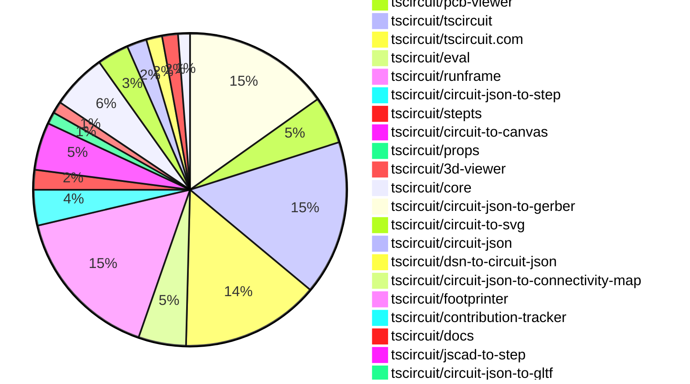
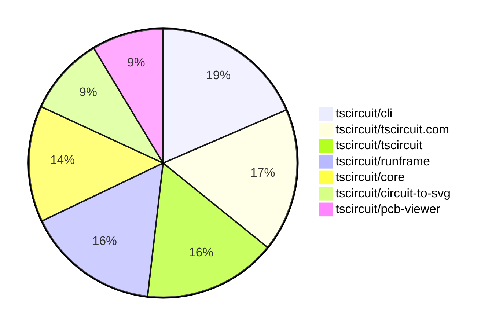

# contribution-tracker

[contributions.tscircuit.com](https://contributions.tscircuit.com) ・ [tscircuit.com](https://tscircuit.com) ・ [Contribution Overviews](./contribution-overviews/) ・ [Changelogs](./changelogs/)

Generates weekly contribution overviews for tscircuit contributors. Check out all
the [contribution overviews here](./contribution-overviews/)
You can find AI-generated monthly changelogs in the [changelogs directory](./changelogs/).

- All PRs in the tscircuit org are scanned/summarized via an LLM
- The LLM classifies each Diff/PR as into a set of attributes for scoring
- All the PRs, summaries, and classifications are organized into charts and tables for [the website](https://contributions.tscircuit.com)

> Want to run locally? See the [Development Section](#development)

The current week is shown below. There are 4 major sections:

- [Contributor Overview](#contributor-overview)
- [PRs by Repository](#prs-by-repository)
- [PRs by Contributor](#changes-by-contributor)
- [Scoring & Sponsorship System](#scoring--sponsorship-system)

## Current Week

<!-- START_CURRENT_WEEK -->

# Contribution Overview 2025-12-10

The current week is shown below. There are 4 major sections:

- [Contributor Overview](#contributor-overview)
- [PRs by Repository](#prs-by-repository)
- [PRs by Contributor](#changes-by-contributor)
- [Scoring & Sponsorship System](#scoring--sponsorship-system)

## PRs by Repository



## Contributor Overview

| Contributor | 🐳 Major | 🐙 Minor | 🐌 Tiny | ⭐ | Score | Discussion Contributions |
|-------------|---------|---------|---------|-----|----------------|--------------------------|
| [seveibar](#seveibar) | 6 | 5 | 10 | ⭐⭐⭐ | 45 | 0🔹 0🔶 0💎 |
| [techmannih](#techmannih) | 3 | 5 | 1 | ⭐⭐ | 28 | 0🔹 0🔶 0💎 |
| [MustafaMulla29](#MustafaMulla29) | 2 | 4 | 12 | ⭐⭐ | 28 | 0🔹 0🔶 0💎 |
| [ArnavK-09](#ArnavK-09) | 2 | 4 | 5 | ⭐⭐ | 21.5 | 0🔹 0🔶 0💎 |
| [imrishabh18](#imrishabh18) | 3 | 2 | 2 | ⭐⭐ | 19 | 0🔹 0🔶 0💎 |
| [Asymtode712](#Asymtode712) | 3 | 3 | 0 | ⭐⭐ | 18 | 0🔹 0🔶 0💎 |
| [Abse2001](#Abse2001) | 0 | 8 | 1 | ⭐⭐ | 17.5 | 0🔹 0🔶 0💎 |
| [ShiboSoftwareDev](#ShiboSoftwareDev) | 1 | 4 | 3 | ⭐⭐ | 17 | 0🔹 0🔶 0💎 |
| [tscircuitbot](#tscircuitbot) | 0 | 0 | 150 | ⭐⭐ | 15 | 0🔹 0🔶 0💎 |
| [0hmX](#0hmX) | 2 | 0 | 1 | ⭐ | 9 | 0🔹 0🔶 0💎 |
| [Ayushjhawar8](#Ayushjhawar8) | 0 | 2 | 2 | ⭐ | 7 | 0🔹 0🔶 0💎 |
| [rushabhcodes](#rushabhcodes) | 0 | 1 | 0 | ⭐ | 6 | 0🔹 0🔶 0💎 |
| [nailoo](#nailoo) | 0 | 2 | 1 | ⭐ | 5 | 0🔹 0🔶 0💎 |
| [Devesh36](#Devesh36) | 0 | 0 | 2 |  | 2 | 0🔹 0🔶 0💎 |
| [shehaban](#shehaban) | 0 | 0 | 1 |  | 1 | 0🔹 0🔶 0💎 |

> Note: AI evaluates PRs and assigns 1-3 star ratings automatically. 4 and 5 star ratings require manual staff review.

### Discussion Contribution Legend

- 🔹 Normal Comments: Basic participation with minimal effort
- 🔶 Great Informative Comments: Thoughtful participation that adds value
- 💎 Incredible Comments: Exceptional participation with high-quality content

## Review Table

[reviews-received-hover]: ## "Number of reviews received for PRs for this contributor"
[approvals-received-hover]: ## "Number of approvals received for PRs this contributor authored"
[rejections-received-hover]: ## "Number of rejections received for PRs this contributor authored"
[prs-opened-hover]: ## "Number of PRs opened by this contributor"
[issues-created-hover]: ## "Number of issues created by this contributor"
[bountied-issues-hover]: ## "Number of issues this contributor created with a bounty"
[bountied-issue-$-hover]: ## "Total bounty amount placed on issues authored by this contributor"

| Contributor | Reviews Received | Approvals Received | Rejections Received | Approvals | Rejections | PRs Opened | PRs Merged | Score | Issues Created | Bountied Issues | Bountied Issue $ |
|---|---|---|---|---|---|---|---|---|---|---|---|
| [rushabhcodes](#rushabhcodes) | 23 | 3 | 5 | 1 | 0 | 11 | 1 | 6 | 0 | 0 | 0 |
| [ShiboSoftwareDev](#ShiboSoftwareDev) | 14 | 11 | 0 | 1 | 0 | 11 | 8 | 17 | 0 | 0 | 0 |
| [Ayushjhawar8](#Ayushjhawar8) | 16 | 5 | 2 | 0 | 0 | 6 | 4 | 7 | 0 | 0 | 0 |
| [imrishabh18](#imrishabh18) | 1 | 1 | 0 | 10 | 9 | 8 | 7 | 19 | 0 | 0 | 0 |
| [Devesh36](#Devesh36) | 8 | 3 | 3 | 0 | 0 | 6 | 2 | 2 | 0 | 0 | 0 |
| [tscircuitbot](#tscircuitbot) | 3 | 0 | 0 | 0 | 0 | 202 | 150 | 15 | 0 | 0 | 0 |
| [Abse2001](#Abse2001) | 11 | 9 | 0 | 1 | 0 | 11 | 9 | 17.5 | 0 | 0 | 0 |
| [seveibar](#seveibar) | 9 | 1 | 0 | 51 | 9 | 42 | 21 | 45 | 0 | 0 | 0 |
| [techmannih](#techmannih) | 16 | 10 | 3 | 3 | 0 | 15 | 9 | 28 | 0 | 0 | 0 |
| [Quanta-Naut](#Quanta-Naut) | 6 | 1 | 3 | 0 | 0 | 1 | 0 | 0 | 0 | 0 | 0 |
| [Asymtode712](#Asymtode712) | 7 | 6 | 0 | 0 | 0 | 6 | 6 | 18 | 0 | 0 | 0 |
| [shehaban](#shehaban) | 2 | 2 | 0 | 0 | 0 | 1 | 1 | 1 | 0 | 0 | 0 |
| [Sahil-Gupta584](#Sahil-Gupta584) | 3 | 0 | 1 | 0 | 0 | 1 | 0 | 0 | 0 | 0 | 0 |
| [0hmX](#0hmX) | 12 | 2 | 0 | 0 | 0 | 13 | 3 | 9 | 0 | 0 | 0 |
| [ArnavK-09](#ArnavK-09) | 7 | 6 | 0 | 1 | 0 | 12 | 11 | 21.5 | 0 | 0 | 0 |
| [RaghavArora14](#RaghavArora14) | 0 | 0 | 0 | 0 | 0 | 1 | 0 | 0 | 0 | 0 | 0 |
| [pxlpal](#pxlpal) | 1 | 1 | 0 | 0 | 0 | 1 | 0 | 0 | 0 | 0 | 0 |
| [MustafaMulla29](#MustafaMulla29) | 9 | 5 | 1 | 1 | 0 | 26 | 18 | 28 | 0 | 0 | 0 |
| [nailoo](#nailoo) | 4 | 3 | 0 | 0 | 0 | 3 | 3 | 5 | 0 | 0 | 0 |
| [Copilot](#Copilot) | 0 | 0 | 0 | 0 | 0 | 1 | 0 | 0 | 0 | 0 | 0 |
| [lamb356](#lamb356) | 1 | 0 | 0 | 0 | 0 | 2 | 0 | 0 | 0 | 0 | 0 |

## Top 7 Repositories by Contribution Points



## Scoring & Sponsorship System

### Overview

PRs are analyzed by AI and assigned a **star rating (1-3 stars)**. 4 and 5 star ratings can only be manually assigned by staff. Weekly scores use `2^(starRating - 1)` per PR (capped at 12 PRs per rating), plus review/discussion points.

### Weekly Score → Star String

| Score Range | Star String | Count Value |
|------------|-------------|-------------|
| 0-3 | (empty) | 0 stars |
| 4-10 | ⭐ | 1 star |
| 11-30 | ⭐⭐ | 2 stars |
| 31-50 | ⭐⭐⭐ | 3 stars |
| 51-75 | 👑 | 1 crown |
| 76-100 | 👑👑 | 2 crowns |
| 101+ | 👑👑👑 | 3 crowns |

> Crowns count as 3 stars for sponsorship.

### Monthly Sponsorship Calculation

The sponsorship system calculates monthly payments based on your **weekly star counts** over the complete weeks in that month (typically 4-5 weeks, Wednesday-Tuesday format).

**Step 1: Collect Weekly Stars**
- All complete weeks in the month are analyzed
- Each week's star string is converted to a numeric count (⭐ = 1 star, ⭐⭐⭐ = 3 stars)
- Example: `[2, 2, 2, 1, 0]` means 2 stars in week 1, 2 stars in week 2, etc.

**Step 2: Calculate Metrics**
- **Median stars**: The median value of all weekly star counts
- **Min stars**: The minimum weekly star count
- **Max stars**: The maximum weekly star count
- **High score**: The maximum raw weekly score (0-100+ range from the scoring table) from any week in the month

**Step 3: Determine Base Amount**
The sponsorship amount is calculated based on these metrics (checked in order):

| Condition | Base Amount |
|-----------|-------------|
| `minStarCount >= 3` | **$700** |
| `medianStars >= 3` | **$550** |
| `medianStars >= 2.5` | **$400** |
| `medianStars >= 2` | **$250** |
| `medianStars >= 1.5` | **$120** |
| `medianStars >= 1` | **$75** |
| `maxStarCount >= 2` | **$45** |
| `maxStarCount >= 1` | **$30** |
| `highScore >= 3` (and all stars = 0) | **$10** |

| Maintainer Level | Monthly Bonus |
|------------------|---------------|
| Level 1 | **$200** |
| Level 2 | **$350** |
| Level 3 | **$500** |
| Level 4 | **$850** |
| Level 5 | **$1300** |
| Level 6 | **$2000** |

**Final Amount** = Base Amount + Maintainer Bonus

## Changes by Repository

### [tscircuit/schematic-viewer](https://github.com/tscircuit/schematic-viewer)

| PR # | Impact | Rating | Contributor | Description |
|------|--------|--------|-------------|-------------|
| [#152](https://github.com/tscircuit/schematic-viewer/pull/152) | 🐙 Minor | ⭐⭐ | Ayushjhawar8 | Fixes type errors in SpicePlot, ViewMenu, and useChangeSchematicTracesForMovedComponents components by ensuring proper type assertions and handling. |

### [tscircuit/cli](https://github.com/tscircuit/cli)

| PR # | Impact | Rating | Contributor | Description |
|------|--------|--------|-------------|-------------|
| [#1337](https://github.com/tscircuit/cli/pull/1337) | 🐳 Major | ⭐⭐⭐ | ArnavK-09 | Adds enhanced feedback for logged-in users and fetches account details for the current user, improving the user experience in the authentication process. |
| [#1334](https://github.com/tscircuit/cli/pull/1334) | 🐳 Major | ⭐⭐⭐ | imrishabh18 | Adds a new command tsci auth setup-npmrc to configure the global .npmrc file with authentication for tscircuit private packages, and sets the token after user login. |
| [#1309](https://github.com/tscircuit/cli/pull/1309) | 🐙 Minor | ⭐⭐ | Ayushjhawar8 | Adds validation for package names in the pushSnippet function to ensure compliance with naming rules before publishing. |
| [#1327](https://github.com/tscircuit/cli/pull/1327) | 🐙 Minor | ⭐⭐ | imrishabh18 | Removes the upload of transitive dependencies to the file server for local packages, streamlining the dependency management process. |

<details>
<summary>🐌 Tiny Contributions (33)</summary>

| PR # | Impact | Contributor | Description |
|------|--------|-------------|-------------|
| [#1323](https://github.com/tscircuit/cli/pull/1323) | 🐌 Tiny | Ayushjhawar8 | Adds caching for node_modules in CI workflows to improve build performance by reducing installation time. |
| [#1321](https://github.com/tscircuit/cli/pull/1321) | 🐌 Tiny | Ayushjhawar8 | Increases test timeout from 20s to 30s, implements retry logic for failed tests (up to 3 attempts), and adjusts workflow timeouts in GitHub Actions. |
| [#1356](https://github.com/tscircuit/cli/pull/1356) | 🐌 Tiny | tscircuitbot | Automated package update |
| [#1355](https://github.com/tscircuit/cli/pull/1355) | 🐌 Tiny | tscircuitbot | Updates the tscircuitrunframe package from version 0.0.1388 to 0.0.1389 |
| [#1353](https://github.com/tscircuit/cli/pull/1353) | 🐌 Tiny | tscircuitbot | Updates the tscircuitrunframe package from version 0.0.1387 to 0.0.1388 |
| [#1352](https://github.com/tscircuit/cli/pull/1352) | 🐌 Tiny | tscircuitbot | Automated package update |
| [#1351](https://github.com/tscircuit/cli/pull/1351) | 🐌 Tiny | tscircuitbot | Updates the tscircuitrunframe package to version 0.0.1387 in the package.json file. |
| [#1350](https://github.com/tscircuit/cli/pull/1350) | 🐌 Tiny | tscircuitbot | Automated package update |
| [#1349](https://github.com/tscircuit/cli/pull/1349) | 🐌 Tiny | tscircuitbot | Updates the tscircuitrunframe package to version 0.0.1386 |
| [#1348](https://github.com/tscircuit/cli/pull/1348) | 🐌 Tiny | tscircuitbot | Automated package update |
| [#1347](https://github.com/tscircuit/cli/pull/1347) | 🐌 Tiny | tscircuitbot | Updates the tscircuitrunframe package from version 0.0.1384 to 0.0.1385 |
| [#1346](https://github.com/tscircuit/cli/pull/1346) | 🐌 Tiny | tscircuitbot | Automated package update |
| [#1345](https://github.com/tscircuit/cli/pull/1345) | 🐌 Tiny | tscircuitbot | Updates the tscircuitrunframe package from version 0.0.1383 to 0.0.1384 |
| [#1344](https://github.com/tscircuit/cli/pull/1344) | 🐌 Tiny | tscircuitbot | Automated package update |
| [#1340](https://github.com/tscircuit/cli/pull/1340) | 🐌 Tiny | tscircuitbot | Automated package update |
| [#1339](https://github.com/tscircuit/cli/pull/1339) | 🐌 Tiny | tscircuitbot | Updates the tscircuitrunframe package from version 0.0.1382 to 0.0.1383 |
| [#1338](https://github.com/tscircuit/cli/pull/1338) | 🐌 Tiny | tscircuitbot | Automated package update |
| [#1336](https://github.com/tscircuit/cli/pull/1336) | 🐌 Tiny | tscircuitbot | Automated package update |
| [#1325](https://github.com/tscircuit/cli/pull/1325) | 🐌 Tiny | tscircuitbot | Updates the tscircuitrunframe package from version 0.0.1380 to 0.0.1381 |
| [#1329](https://github.com/tscircuit/cli/pull/1329) | 🐌 Tiny | tscircuitbot | Updates the tscircuitrunframe package from version 0.0.1381 to 0.0.1382 |
| [#1324](https://github.com/tscircuit/cli/pull/1324) | 🐌 Tiny | tscircuitbot | Updates the tscircuitrunframe package version from 0.0.1378 to 0.0.1380 in package.json |
| [#1318](https://github.com/tscircuit/cli/pull/1318) | 🐌 Tiny | tscircuitbot | Updates the tscircuitrunframe package from version 0.0.1376 to 0.0.1377 |
| [#1316](https://github.com/tscircuit/cli/pull/1316) | 🐌 Tiny | tscircuitbot | Updates the tscircuitrunframe package from version 0.0.1375 to 0.0.1376 |
| [#1312](https://github.com/tscircuit/cli/pull/1312) | 🐌 Tiny | tscircuitbot | Updates the tscircuitrunframe package from version 0.0.1373 to 0.0.1374 |
| [#1320](https://github.com/tscircuit/cli/pull/1320) | 🐌 Tiny | tscircuitbot | Updates the tscircuitrunframe package from version 0.0.1377 to 0.0.1378 |
| [#1314](https://github.com/tscircuit/cli/pull/1314) | 🐌 Tiny | tscircuitbot | Updates the tscircuitrunframe package from version 0.0.1374 to 0.0.1375 |
| [#1310](https://github.com/tscircuit/cli/pull/1310) | 🐌 Tiny | tscircuitbot | Automated package update |
| [#1304](https://github.com/tscircuit/cli/pull/1304) | 🐌 Tiny | tscircuitbot | Updates the tscircuitrunframe package from version 0.0.1370 to 0.0.1371 |
| [#1335](https://github.com/tscircuit/cli/pull/1335) | 🐌 Tiny | seveibar | Fixes the package version output step in the GitHub Actions workflow to avoid shell parsing issues by using Node.js to write the version directly to GITHUB_OUTPUT. |
| [#1333](https://github.com/tscircuit/cli/pull/1333) | 🐌 Tiny | seveibar | Adjusts the release workflow to filter by branch name instead of runtime conditions, aligns version bump branches under version-bumps, includes the bumped version number in the generated PR title and branch name, and updates the workflow tooling to the latest create-pull-request action version. |
| [#1343](https://github.com/tscircuit/cli/pull/1343) | 🐌 Tiny | MustafaMulla29 | Adds .step to the set of recognized binary file extensions in the DevServer. |
| [#1306](https://github.com/tscircuit/cli/pull/1306) | 🐌 Tiny | MustafaMulla29 | Updates the version of the circuit-json-to-gltf dependency from 0.0.51 to 0.0.56 in package.json |
| [#1328](https://github.com/tscircuit/cli/pull/1328) | 🐌 Tiny | imrishabh18 | Updates the package version from 0.1.612 to 0.1.623 in package.json |

</details>

### [tscircuit/pcb-viewer](https://github.com/tscircuit/pcb-viewer)

| PR # | Impact | Rating | Contributor | Description |
|------|--------|--------|-------------|-------------|
| [#542](https://github.com/tscircuit/pcb-viewer/pull/542) | 🐳 Major | ⭐⭐⭐ | techmannih | Adds functionality for anchor positioning of groups in relation to nested groups, allowing for better hover detection and offset display in PCB layouts. |
| [#539](https://github.com/tscircuit/pcb-viewer/pull/539) | 🐳 Major | ⭐⭐⭐ | techmannih | Adds anchor positioning for groups relative to other groups and boards, allowing for better visual alignment and offset representation in PCB layouts. |
| [#543](https://github.com/tscircuit/pcb-viewer/pull/543) | 🐙 Minor | ⭐⭐ | Abse2001 | added new example all-features and fixed and moved old examples to folder 2025 also fixed few issues in group and board anchor offset |
| [#537](https://github.com/tscircuit/pcb-viewer/pull/537) | 🐙 Minor | ⭐⭐ | Abse2001 | This PR adds a unified Anchor Offset Overlay system for boards and groups, allowing board-anchored components to display accurate xy offsets with screen-space markers and labels, while refactoring group overlays for improved detection and UI integration. |
| [#535](https://github.com/tscircuit/pcb-viewer/pull/535) | 🐙 Minor | ⭐⭐ | Abse2001 | This update simplifies how group anchor offsets are calculated, corrects component width and height handling, cleans up anchor detection logic, and removes unused files and imports. |

<details>
<summary>🐌 Tiny Contributions (7)</summary>

| PR # | Impact | Contributor | Description |
|------|--------|-------------|-------------|
| [#546](https://github.com/tscircuit/pcb-viewer/pull/546) | 🐌 Tiny | tscircuitbot | Automated package update |
| [#545](https://github.com/tscircuit/pcb-viewer/pull/545) | 🐌 Tiny | tscircuitbot | Automated package update |
| [#544](https://github.com/tscircuit/pcb-viewer/pull/544) | 🐌 Tiny | tscircuitbot | Automated package update |
| [#540](https://github.com/tscircuit/pcb-viewer/pull/540) | 🐌 Tiny | tscircuitbot | Automated package update |
| [#538](https://github.com/tscircuit/pcb-viewer/pull/538) | 🐌 Tiny | tscircuitbot | Automated package update |
| [#536](https://github.com/tscircuit/pcb-viewer/pull/536) | 🐌 Tiny | tscircuitbot | Automated package update |
| [#541](https://github.com/tscircuit/pcb-viewer/pull/541) | 🐌 Tiny | techmannih | Fixes the rendering of group center markers to display a crossplus sign instead of a circle for better visual distinction. |

</details>

### [tscircuit/tscircuit](https://github.com/tscircuit/tscircuit)


<details>
<summary>🐌 Tiny Contributions (39)</summary>

| PR # | Impact | Contributor | Description |
|------|--------|-------------|-------------|
| [#1645](https://github.com/tscircuit/tscircuit/pull/1645) | 🐌 Tiny | tscircuitbot | Automated package update |
| [#1644](https://github.com/tscircuit/tscircuit/pull/1644) | 🐌 Tiny | tscircuitbot | Automated package update |
| [#1643](https://github.com/tscircuit/tscircuit/pull/1643) | 🐌 Tiny | tscircuitbot | Automated package update |
| [#1642](https://github.com/tscircuit/tscircuit/pull/1642) | 🐌 Tiny | tscircuitbot | Automated package update |
| [#1641](https://github.com/tscircuit/tscircuit/pull/1641) | 🐌 Tiny | tscircuitbot | Automated package update |
| [#1640](https://github.com/tscircuit/tscircuit/pull/1640) | 🐌 Tiny | tscircuitbot | Automated package update |
| [#1639](https://github.com/tscircuit/tscircuit/pull/1639) | 🐌 Tiny | tscircuitbot | Automated package update |
| [#1638](https://github.com/tscircuit/tscircuit/pull/1638) | 🐌 Tiny | tscircuitbot | Updates the tscircuitcli package from version 0.1.635 to 0.1.636 and the tscircuitrunframe package from version 0.0.1385 to 0.0.1386 in package.json |
| [#1637](https://github.com/tscircuit/tscircuit/pull/1637) | 🐌 Tiny | tscircuitbot | Automated package update |
| [#1636](https://github.com/tscircuit/tscircuit/pull/1636) | 🐌 Tiny | tscircuitbot | Updates the tscircuitcli package from version 0.1.634 to 0.1.635 |
| [#1635](https://github.com/tscircuit/tscircuit/pull/1635) | 🐌 Tiny | tscircuitbot | Automated package update |
| [#1634](https://github.com/tscircuit/tscircuit/pull/1634) | 🐌 Tiny | tscircuitbot | Automated package update |
| [#1632](https://github.com/tscircuit/tscircuit/pull/1632) | 🐌 Tiny | tscircuitbot | Automated package update |
| [#1631](https://github.com/tscircuit/tscircuit/pull/1631) | 🐌 Tiny | tscircuitbot | Automated package update |
| [#1630](https://github.com/tscircuit/tscircuit/pull/1630) | 🐌 Tiny | tscircuitbot | Updates the tscircuitcli package to version 0.1.633 in package.json |
| [#1629](https://github.com/tscircuit/tscircuit/pull/1629) | 🐌 Tiny | tscircuitbot | Automated package update |
| [#1628](https://github.com/tscircuit/tscircuit/pull/1628) | 🐌 Tiny | tscircuitbot | Automated package update |
| [#1627](https://github.com/tscircuit/tscircuit/pull/1627) | 🐌 Tiny | tscircuitbot | Automated package update |
| [#1626](https://github.com/tscircuit/tscircuit/pull/1626) | 🐌 Tiny | tscircuitbot | Automated package update |
| [#1625](https://github.com/tscircuit/tscircuit/pull/1625) | 🐌 Tiny | tscircuitbot | Automated package update |
| [#1624](https://github.com/tscircuit/tscircuit/pull/1624) | 🐌 Tiny | tscircuitbot | Automated package update |
| [#1620](https://github.com/tscircuit/tscircuit/pull/1620) | 🐌 Tiny | tscircuitbot | Automated package update |
| [#1621](https://github.com/tscircuit/tscircuit/pull/1621) | 🐌 Tiny | tscircuitbot | Automated package update |
| [#1623](https://github.com/tscircuit/tscircuit/pull/1623) | 🐌 Tiny | tscircuitbot | Automated package update |
| [#1622](https://github.com/tscircuit/tscircuit/pull/1622) | 🐌 Tiny | tscircuitbot | Automated package update |
| [#1611](https://github.com/tscircuit/tscircuit/pull/1611) | 🐌 Tiny | tscircuitbot | Automated package update |
| [#1617](https://github.com/tscircuit/tscircuit/pull/1617) | 🐌 Tiny | tscircuitbot | Automated package update |
| [#1615](https://github.com/tscircuit/tscircuit/pull/1615) | 🐌 Tiny | tscircuitbot | Automated package update |
| [#1613](https://github.com/tscircuit/tscircuit/pull/1613) | 🐌 Tiny | tscircuitbot | Automated package update |
| [#1614](https://github.com/tscircuit/tscircuit/pull/1614) | 🐌 Tiny | tscircuitbot | Automated package update |
| [#1618](https://github.com/tscircuit/tscircuit/pull/1618) | 🐌 Tiny | tscircuitbot | Automated package update |
| [#1616](https://github.com/tscircuit/tscircuit/pull/1616) | 🐌 Tiny | tscircuitbot | Automated package update |
| [#1612](https://github.com/tscircuit/tscircuit/pull/1612) | 🐌 Tiny | tscircuitbot | Automated package update |
| [#1610](https://github.com/tscircuit/tscircuit/pull/1610) | 🐌 Tiny | tscircuitbot | Automated package update |
| [#1609](https://github.com/tscircuit/tscircuit/pull/1609) | 🐌 Tiny | tscircuitbot | Updates the version of several dependencies in the package.json file, including tscircuitcli, tscircuitcore, tscircuiteval, tscircuitprops, and tscircuitrunframe. |
| [#1608](https://github.com/tscircuit/tscircuit/pull/1608) | 🐌 Tiny | tscircuitbot | Automated package update |
| [#1607](https://github.com/tscircuit/tscircuit/pull/1607) | 🐌 Tiny | tscircuitbot | Updates the tscircuitcli package to version 0.1.618 in package.json |
| [#1606](https://github.com/tscircuit/tscircuit/pull/1606) | 🐌 Tiny | tscircuitbot | Automated package update |
| [#1605](https://github.com/tscircuit/tscircuit/pull/1605) | 🐌 Tiny | tscircuitbot | Updates the tscircuitcli package from version 0.1.616 to 0.1.617 and updates the tscircuitrunframe package from version 0.0.1370 to 0.0.1371, while downgrading the calculate-packing package from version 0.0.68 to 0.0.66. |

</details>

### [tscircuit/tscircuit.com](https://github.com/tscircuit/tscircuit.com)

| PR # | Impact | Rating | Contributor | Description |
|------|--------|--------|-------------|-------------|
| [#2204](https://github.com/tscircuit/tscircuit.com/pull/2204) | 🐳 Major | ⭐⭐⭐ | ArnavK-09 | Adds a new error handling component for displaying loading errors with detailed messages and navigation options. |
| [#2206](https://github.com/tscircuit/tscircuit.com/pull/2206) | 🐙 Minor | ⭐⭐ | ArnavK-09 | Adds functionality to retrieve an account by its account_id in the API, enhancing the account retrieval process. |
| [#2186](https://github.com/tscircuit/tscircuit.com/pull/2186) | 🐙 Minor | ⭐⭐ | ArnavK-09 | Fixes the login link redirection to the organization login page when a user is not authenticated. |
| [#2190](https://github.com/tscircuit/tscircuit.com/pull/2190) | 🐙 Minor | ⭐⭐ | ArnavK-09 | Modifies the organization sign-in hook to conditionally append a query parameter for Google authentication when using a fake API. |
| [#2201](https://github.com/tscircuit/tscircuit.com/pull/2201) | 🐙 Minor | ⭐⭐ | rushabhcodes | Fixes execution error by correctly handling the loading state when no package_id is present and no local files are available in the useFileManagement hook. |

<details>
<summary>🐌 Tiny Contributions (30)</summary>

| PR # | Impact | Contributor | Description |
|------|--------|-------------|-------------|
| [#2216](https://github.com/tscircuit/tscircuit.com/pull/2216) | 🐌 Tiny | tscircuitbot | Updates the tscircuitrunframe package to version 0.0.1389 in package.json |
| [#2215](https://github.com/tscircuit/tscircuit.com/pull/2215) | 🐌 Tiny | tscircuitbot | Updates the tscircuitrunframe package from version 0.0.1387 to 0.0.1388 |
| [#2214](https://github.com/tscircuit/tscircuit.com/pull/2214) | 🐌 Tiny | tscircuitbot | Updates the tscircuitrunframe package from version 0.0.1386 to 0.0.1387 |
| [#2213](https://github.com/tscircuit/tscircuit.com/pull/2213) | 🐌 Tiny | tscircuitbot | Automated package update |
| [#2211](https://github.com/tscircuit/tscircuit.com/pull/2211) | 🐌 Tiny | tscircuitbot | Automated package update |
| [#2209](https://github.com/tscircuit/tscircuit.com/pull/2209) | 🐌 Tiny | tscircuitbot | Updates the tscircuitrunframe package from version 0.0.1383 to 0.0.1384 |
| [#2208](https://github.com/tscircuit/tscircuit.com/pull/2208) | 🐌 Tiny | tscircuitbot | Updates the tscircuitrunframe package version from 0.0.1382 to 0.0.1383 in package.json |
| [#2199](https://github.com/tscircuit/tscircuit.com/pull/2199) | 🐌 Tiny | tscircuitbot | Automated package update |
| [#2202](https://github.com/tscircuit/tscircuit.com/pull/2202) | 🐌 Tiny | tscircuitbot | Automated package update |
| [#2198](https://github.com/tscircuit/tscircuit.com/pull/2198) | 🐌 Tiny | tscircuitbot | Updates the tscircuitrunframe package to version 0.0.1380 |
| [#2181](https://github.com/tscircuit/tscircuit.com/pull/2181) | 🐌 Tiny | tscircuitbot | Updates the tscircuiteval package from version 0.0.532 to 0.0.533 |
| [#2185](https://github.com/tscircuit/tscircuit.com/pull/2185) | 🐌 Tiny | tscircuitbot | Updates the tscircuitrunframe package from version 0.0.1375 to 0.0.1376 |
| [#2193](https://github.com/tscircuit/tscircuit.com/pull/2193) | 🐌 Tiny | tscircuitbot | Automated package update |
| [#2194](https://github.com/tscircuit/tscircuit.com/pull/2194) | 🐌 Tiny | tscircuitbot | Updates the tscircuiteval package from version 0.0.535 to 0.0.537 |
| [#2182](https://github.com/tscircuit/tscircuit.com/pull/2182) | 🐌 Tiny | tscircuitbot | Updates the tscircuitrunframe package from version 0.0.1373 to 0.0.1374 |
| [#2192](https://github.com/tscircuit/tscircuit.com/pull/2192) | 🐌 Tiny | tscircuitbot | Updates the tscircuiteval package from version 0.0.534 to 0.0.535 |
| [#2183](https://github.com/tscircuit/tscircuit.com/pull/2183) | 🐌 Tiny | tscircuitbot | Updates the tscircuiteval package from version 0.0.533 to 0.0.534 |
| [#2197](https://github.com/tscircuit/tscircuit.com/pull/2197) | 🐌 Tiny | tscircuitbot | Automated package update to version 0.0.161 |
| [#2195](https://github.com/tscircuit/tscircuit.com/pull/2195) | 🐌 Tiny | tscircuitbot | Updates the tscircuitrunframe package from version 0.0.1377 to 0.0.1378 |
| [#2184](https://github.com/tscircuit/tscircuit.com/pull/2184) | 🐌 Tiny | tscircuitbot | Updates the tscircuitrunframe package from version 0.0.1374 to 0.0.1375 |
| [#2196](https://github.com/tscircuit/tscircuit.com/pull/2196) | 🐌 Tiny | tscircuitbot | Updates the tscircuitrunframe package to version 0.0.1379 in package.json |
| [#2179](https://github.com/tscircuit/tscircuit.com/pull/2179) | 🐌 Tiny | tscircuitbot | Updates the tscircuitrunframe package to version 0.0.1373 |
| [#2178](https://github.com/tscircuit/tscircuit.com/pull/2178) | 🐌 Tiny | tscircuitbot | Updates the tscircuitrunframe package from version 0.0.1371 to 0.0.1372 |
| [#2177](https://github.com/tscircuit/tscircuit.com/pull/2177) | 🐌 Tiny | tscircuitbot | Automated package update |
| [#2176](https://github.com/tscircuit/tscircuit.com/pull/2176) | 🐌 Tiny | tscircuitbot | Automated package update |
| [#2205](https://github.com/tscircuit/tscircuit.com/pull/2205) | 🐌 Tiny | ArnavK-09 | Fixes overflow issue with buttons in the invitations section of the organization settings page. |
| [#2188](https://github.com/tscircuit/tscircuit.com/pull/2188) | 🐌 Tiny | ArnavK-09 | Fixes the visibility of the save button based on the package management permissions of the user. |
| [#2189](https://github.com/tscircuit/tscircuit.com/pull/2189) | 🐌 Tiny | ArnavK-09 | Fixes layout and styling issues in the OrganizationHeader component, ensuring proper alignment and spacing of elements. |
| [#2187](https://github.com/tscircuit/tscircuit.com/pull/2187) | 🐌 Tiny | ArnavK-09 | Changes the minimum character requirement for organization handles and display names from 5 to 3 characters in the API and frontend validation. |
| [#2175](https://github.com/tscircuit/tscircuit.com/pull/2175) | 🐌 Tiny | Devesh36 | Fixes horizontal overflow in the Usercode Logs section by allowing long log messages to wrap naturally instead of breaking the layout. |

</details>

### [tscircuit/eval](https://github.com/tscircuit/eval)


<details>
<summary>🐌 Tiny Contributions (12)</summary>

| PR # | Impact | Contributor | Description |
|------|--------|-------------|-------------|
| [#1688](https://github.com/tscircuit/eval/pull/1688) | 🐌 Tiny | tscircuitbot | Automated package update |
| [#1687](https://github.com/tscircuit/eval/pull/1687) | 🐌 Tiny | tscircuitbot | Updates the version of the tscircuitcore package from 0.0.912 to 0.0.913 in package.json |
| [#1699](https://github.com/tscircuit/eval/pull/1699) | 🐌 Tiny | tscircuitbot | Updates the package version from 0.0.535 to 0.0.536 in package.json |
| [#1701](https://github.com/tscircuit/eval/pull/1701) | 🐌 Tiny | tscircuitbot | Automated package update |
| [#1700](https://github.com/tscircuit/eval/pull/1700) | 🐌 Tiny | tscircuitbot | Automated package update |
| [#1692](https://github.com/tscircuit/eval/pull/1692) | 🐌 Tiny | tscircuitbot | Updates package dependencies to their latest versions in package.json |
| [#1698](https://github.com/tscircuit/eval/pull/1698) | 🐌 Tiny | tscircuitbot | Updates the version of the tscircuitcore package from 0.0.916 to 0.0.917 in package.json |
| [#1696](https://github.com/tscircuit/eval/pull/1696) | 🐌 Tiny | tscircuitbot | Automated package update |
| [#1695](https://github.com/tscircuit/eval/pull/1695) | 🐌 Tiny | tscircuitbot | Automated package update |
| [#1693](https://github.com/tscircuit/eval/pull/1693) | 🐌 Tiny | tscircuitbot | Automated package update |
| [#1685](https://github.com/tscircuit/eval/pull/1685) | 🐌 Tiny | tscircuitbot | Automated package update |
| [#1684](https://github.com/tscircuit/eval/pull/1684) | 🐌 Tiny | tscircuitbot | Automated package update |

</details>

### [tscircuit/runframe](https://github.com/tscircuit/runframe)


<details>
<summary>🐌 Tiny Contributions (39)</summary>

| PR # | Impact | Contributor | Description |
|------|--------|-------------|-------------|
| [#2094](https://github.com/tscircuit/runframe/pull/2094) | 🐌 Tiny | tscircuitbot | Automated package update |
| [#2093](https://github.com/tscircuit/runframe/pull/2093) | 🐌 Tiny | tscircuitbot | Updates the tscircuitpcb-viewer package to version 1.11.286 |
| [#2092](https://github.com/tscircuit/runframe/pull/2092) | 🐌 Tiny | tscircuitbot | Automated package update |
| [#2091](https://github.com/tscircuit/runframe/pull/2091) | 🐌 Tiny | tscircuitbot | Updates the tscircuitpcb-viewer package from version 1.11.284 to 1.11.285 |
| [#2090](https://github.com/tscircuit/runframe/pull/2090) | 🐌 Tiny | tscircuitbot | Automated package update |
| [#2089](https://github.com/tscircuit/runframe/pull/2089) | 🐌 Tiny | tscircuitbot | Updates the tscircuitpcb-viewer package from version 1.11.283 to 1.11.284 |
| [#2088](https://github.com/tscircuit/runframe/pull/2088) | 🐌 Tiny | tscircuitbot | Automated package update |
| [#2085](https://github.com/tscircuit/runframe/pull/2085) | 🐌 Tiny | tscircuitbot | Automated package update |
| [#2083](https://github.com/tscircuit/runframe/pull/2083) | 🐌 Tiny | tscircuitbot | Automated package update |
| [#2080](https://github.com/tscircuit/runframe/pull/2080) | 🐌 Tiny | tscircuitbot | Automated package update |
| [#2076](https://github.com/tscircuit/runframe/pull/2076) | 🐌 Tiny | tscircuitbot | Updates the tscircuitpcb-viewer package from version 1.11.282 to 1.11.283 |
| [#2072](https://github.com/tscircuit/runframe/pull/2072) | 🐌 Tiny | tscircuitbot | Updates the tscircuitpcb-viewer package from version 1.11.281 to 1.11.282 |
| [#2070](https://github.com/tscircuit/runframe/pull/2070) | 🐌 Tiny | tscircuitbot | Updates the tscircuit3d-viewer package to version 0.0.472 in package.json |
| [#2073](https://github.com/tscircuit/runframe/pull/2073) | 🐌 Tiny | tscircuitbot | Automated package update |
| [#2077](https://github.com/tscircuit/runframe/pull/2077) | 🐌 Tiny | tscircuitbot | Automated package update |
| [#2071](https://github.com/tscircuit/runframe/pull/2071) | 🐌 Tiny | tscircuitbot | Automated package update |
| [#2068](https://github.com/tscircuit/runframe/pull/2068) | 🐌 Tiny | tscircuitbot | Updates the tscircuitpcb-viewer package from version 1.11.280 to 1.11.281 |
| [#2058](https://github.com/tscircuit/runframe/pull/2058) | 🐌 Tiny | tscircuitbot | Updates the tscircuiteval package from version 0.0.532 to 0.0.533 |
| [#2059](https://github.com/tscircuit/runframe/pull/2059) | 🐌 Tiny | tscircuitbot | Automated package update |
| [#2066](https://github.com/tscircuit/runframe/pull/2066) | 🐌 Tiny | tscircuitbot | Updates the tscircuiteval package from version 0.0.535 to 0.0.537 |
| [#2063](https://github.com/tscircuit/runframe/pull/2063) | 🐌 Tiny | tscircuitbot | Automated package update |
| [#2069](https://github.com/tscircuit/runframe/pull/2069) | 🐌 Tiny | tscircuitbot | Updates the package version from 0.0.1378 to 0.0.1379 in package.json |
| [#2062](https://github.com/tscircuit/runframe/pull/2062) | 🐌 Tiny | tscircuitbot | Updates the tscircuit3d-viewer package from version 0.0.470 to 0.0.471 |
| [#2067](https://github.com/tscircuit/runframe/pull/2067) | 🐌 Tiny | tscircuitbot | Automated package update |
| [#2060](https://github.com/tscircuit/runframe/pull/2060) | 🐌 Tiny | tscircuitbot | Updates the tscircuiteval package from version 0.0.533 to 0.0.534 |
| [#2061](https://github.com/tscircuit/runframe/pull/2061) | 🐌 Tiny | tscircuitbot | Automated package update |
| [#2065](https://github.com/tscircuit/runframe/pull/2065) | 🐌 Tiny | tscircuitbot | Automated package update |
| [#2064](https://github.com/tscircuit/runframe/pull/2064) | 🐌 Tiny | tscircuitbot | Updates the tscircuiteval package to version 0.0.535 in package.json |
| [#2057](https://github.com/tscircuit/runframe/pull/2057) | 🐌 Tiny | tscircuitbot | Automated package update |
| [#2056](https://github.com/tscircuit/runframe/pull/2056) | 🐌 Tiny | tscircuitbot | Updates the circuit-json-to-gerber package from version 0.0.44 to 0.0.46 in package.json |
| [#2055](https://github.com/tscircuit/runframe/pull/2055) | 🐌 Tiny | tscircuitbot | Automated package update |
| [#2054](https://github.com/tscircuit/runframe/pull/2054) | 🐌 Tiny | tscircuitbot | Updates the tscircuiteval package to version 0.0.532 in the package.json file. |
| [#2053](https://github.com/tscircuit/runframe/pull/2053) | 🐌 Tiny | tscircuitbot | Updates the tscircuit3d-viewer package from version 0.0.469 to 0.0.470 |
| [#2052](https://github.com/tscircuit/runframe/pull/2052) | 🐌 Tiny | tscircuitbot | Automated package update |
| [#2087](https://github.com/tscircuit/runframe/pull/2087) | 🐌 Tiny | MustafaMulla29 | Updates the version of the circuit-json-to-step dependency from 0.0.5 to 0.0.6 in package.json |
| [#2084](https://github.com/tscircuit/runframe/pull/2084) | 🐌 Tiny | MustafaMulla29 | Updates the stepts dependency from version 0.0.1 to 0.0.2 in package.json |
| [#2082](https://github.com/tscircuit/runframe/pull/2082) | 🐌 Tiny | MustafaMulla29 | Updates the version of the circuit-json-to-step dependency from 0.0.4 to 0.0.5 in package.json |
| [#2079](https://github.com/tscircuit/runframe/pull/2079) | 🐌 Tiny | MustafaMulla29 | Updates the version of the circuit-json-to-step dependency from 0.0.2 to 0.0.4 in package.json |
| [#2051](https://github.com/tscircuit/runframe/pull/2051) | 🐌 Tiny | MustafaMulla29 | Updates the version of circuit-json-to-gltf from 0.0.53 to 0.0.56 in package.json |

</details>

### [tscircuit/circuit-json-to-step](https://github.com/tscircuit/circuit-json-to-step)

| PR # | Impact | Rating | Contributor | Description |
|------|--------|--------|-------------|-------------|
| [#27](https://github.com/tscircuit/circuit-json-to-step/pull/27) | 🐙 Minor | ⭐⭐ | MustafaMulla29 | Fixes unnecessary mesh generation calls when exporting STEP files, preventing Failed to generate component meshes errors by checking for unhandled components before invoking mesh generation. |
| [#22](https://github.com/tscircuit/circuit-json-to-step/pull/22) | 🐙 Minor | ⭐⭐ | MustafaMulla29 | Adds a test-only loader for local STEP files and removes Node-only imports from the library, allowing for better compatibility with browser environments. |
| [#16](https://github.com/tscircuit/circuit-json-to-step/pull/16) | 🐙 Minor | ⭐⭐ | MustafaMulla29 | Excludes cad_components with model_step_url from mesh generation to prevent stack overflow errors during browser fetch. |

<details>
<summary>🐌 Tiny Contributions (6)</summary>

| PR # | Impact | Contributor | Description |
|------|--------|-------------|-------------|
| [#28](https://github.com/tscircuit/circuit-json-to-step/pull/28) | 🐌 Tiny | tscircuitbot | Automated package update |
| [#23](https://github.com/tscircuit/circuit-json-to-step/pull/23) | 🐌 Tiny | tscircuitbot | Automated package update |
| [#20](https://github.com/tscircuit/circuit-json-to-step/pull/20) | 🐌 Tiny | tscircuitbot | Updates the package version from 0.0.1 to 0.0.3 in package.json |
| [#24](https://github.com/tscircuit/circuit-json-to-step/pull/24) | 🐌 Tiny | MustafaMulla29 | Updates the version of the stepts dependency from 0.0.1 to 0.0.2 in package.json |
| [#18](https://github.com/tscircuit/circuit-json-to-step/pull/18) | 🐌 Tiny | MustafaMulla29 | Adds GitHub workflows for format checking, testing, and publishing to npm. |
| [#19](https://github.com/tscircuit/circuit-json-to-step/pull/19) | 🐌 Tiny | MustafaMulla29 | Fixes the png-matcher for continuous integration and adds TypeScript types for the occt-import-js module. |

</details>

### [tscircuit/stepts](https://github.com/tscircuit/stepts)

| PR # | Impact | Rating | Contributor | Description |
|------|--------|--------|-------------|-------------|
| [#12](https://github.com/tscircuit/stepts/pull/12) | 🐳 Major | ⭐⭐⭐ | MustafaMulla29 | Adds support for parsing ELLIPSE, CONICAL_SURFACE, and SPHERICAL_SURFACE STEP entities, and fixes handling of null values in Product parsing. |

<details>
<summary>🐌 Tiny Contributions (4)</summary>

| PR # | Impact | Contributor | Description |
|------|--------|-------------|-------------|
| [#15](https://github.com/tscircuit/stepts/pull/15) | 🐌 Tiny | tscircuitbot | Updates the package version from 0.0.1 to 0.0.2 in package.json |
| [#11](https://github.com/tscircuit/stepts/pull/11) | 🐌 Tiny | seveibar | This pull request introduces a new test script for KiCad models and adds test assets, specifically a STEP file. The script automates the process of checking for STEP files in the specified directory and validates them using the parseRepository function. It also includes functionality to clone the KiCad 3D models repository if the directory does not exist. |
| [#14](https://github.com/tscircuit/stepts/pull/14) | 🐌 Tiny | MustafaMulla29 | Updates the bun.lock file to resolve issues encountered during npm publish. |
| [#13](https://github.com/tscircuit/stepts/pull/13) | 🐌 Tiny | MustafaMulla29 | Adds a GitHub Actions workflow for publishing packages to npm using pver upon pushing to the main branch. |

</details>

### [tscircuit/circuit-to-canvas](https://github.com/tscircuit/circuit-to-canvas)

| PR # | Impact | Rating | Contributor | Description |
|------|--------|--------|-------------|-------------|
| [#6](https://github.com/tscircuit/circuit-to-canvas/pull/6) | 🐙 Minor | ⭐⭐ | Abse2001 | This PR adds full canvas-based rendering support for pcb_copper_text, including knockout mode, mirroring, padding, and alignment handling. |
| [#13](https://github.com/tscircuit/circuit-to-canvas/pull/13) | 🐙 Minor | ⭐⭐ | techmannih | Adds support for rendering PcbNoteRect elements in the canvas drawing context. |
| [#7](https://github.com/tscircuit/circuit-to-canvas/pull/7) | 🐙 Minor | ⭐⭐ | techmannih | Adds support for rendering PCB fabrication note text in the canvas drawing. |
| [#8](https://github.com/tscircuit/circuit-to-canvas/pull/8) | 🐙 Minor | ⭐⭐ | techmannih | Adds support for rendering PCB fabrication note rectangles in the canvas drawing context. |
| [#9](https://github.com/tscircuit/circuit-to-canvas/pull/9) | 🐙 Minor | ⭐⭐ | techmannih | Adds support for rendering PCB fabrication note paths in the canvas drawing context. |

<details>
<summary>🐌 Tiny Contributions (7)</summary>

| PR # | Impact | Contributor | Description |
|------|--------|-------------|-------------|
| [#17](https://github.com/tscircuit/circuit-to-canvas/pull/17) | 🐌 Tiny | tscircuitbot | Updates the package version from 0.0.4 to 0.0.5 in package.json |
| [#4](https://github.com/tscircuit/circuit-to-canvas/pull/4) | 🐌 Tiny | tscircuitbot | Automated package update |
| [#16](https://github.com/tscircuit/circuit-to-canvas/pull/16) | 🐌 Tiny | tscircuitbot | Automated package update |
| [#2](https://github.com/tscircuit/circuit-to-canvas/pull/2) | 🐌 Tiny | tscircuitbot | Updates the package version from 0.0.1 to 0.0.2 in package.json |
| [#15](https://github.com/tscircuit/circuit-to-canvas/pull/15) | 🐌 Tiny | Abse2001 | Removes the package.lock.json file from the repository, which may affect dependency resolution and project reproducibility. |
| [#3](https://github.com/tscircuit/circuit-to-canvas/pull/3) | 🐌 Tiny | seveibar | Documents which PCB drawing features from circuit-to-svg are implemented in circuit-to-canvas, helping track implementation progress. |
| [#1](https://github.com/tscircuit/circuit-to-canvas/pull/1) | 🐌 Tiny | seveibar | Fixes type errors in the codebase and reformats code for consistency and readability. |

</details>

### [tscircuit/props](https://github.com/tscircuit/props)

| PR # | Impact | Rating | Contributor | Description |
|------|--------|--------|-------------|-------------|
| [#530](https://github.com/tscircuit/props/pull/530) | 🐙 Minor | ⭐⭐ | Abse2001 | Adds missing properties knockout and mirrored to the copper text components props definition. |
| [#529](https://github.com/tscircuit/props/pull/529) | 🐙 Minor | ⭐⭐ | seveibar | Adds anchorAlignment prop to board and panel components, marking boardAnchorAlignment as preferring the new anchorAlignment prop, and expands tests and documentation accordingly. |

<details>
<summary>🐌 Tiny Contributions (1)</summary>

| PR # | Impact | Contributor | Description |
|------|--------|-------------|-------------|
| [#528](https://github.com/tscircuit/props/pull/528) | 🐌 Tiny | ShiboSoftwareDev | Adds edge margin properties (edgePadding, edgePaddingLeft, edgePaddingRight, edgePaddingTop, edgePaddingBottom) to the PanelProps interface for customizing panel margins. |

</details>

### [tscircuit/3d-viewer](https://github.com/tscircuit/3d-viewer)

| PR # | Impact | Rating | Contributor | Description |
|------|--------|--------|-------------|-------------|
| [#617](https://github.com/tscircuit/3d-viewer/pull/617) | 🐙 Minor | ⭐⭐ | Abse2001 | Add support for rendering pcb_copper_text elements in the 3D PCB viewer, implement knockout text feature, fix text mirroring logic, and improve text clarity by increasing texture resolution. |
| [#621](https://github.com/tscircuit/3d-viewer/pull/621) | 🐙 Minor | ⭐⭐ | techmannih | Adds support for rendering PCB note lines in the silkscreen texture generation process, including customizable stroke width, color, and dashed line options. |
| [#619](https://github.com/tscircuit/3d-viewer/pull/619) | 🐙 Minor | ⭐⭐ | ShiboSoftwareDev | Adds support for visualizing the outlines of individual boards within a pcb_panel, improving clarity in board placement and shape, and ensures correct property inheritance from boards. |

### [tscircuit/core](https://github.com/tscircuit/core)

| PR # | Impact | Rating | Contributor | Description |
|------|--------|--------|-------------|-------------|
| [#1751](https://github.com/tscircuit/core/pull/1751) | 🐳 Major | ⭐⭐⭐ | seveibar | Adds positioning metadata position_mode for packed and relative components, ensuring that positioned_relative_to_ fields are not written when packing PCB components and extending tests for relative metadata. |
| [#1742](https://github.com/tscircuit/core/pull/1742) | 🐳 Major | ⭐⭐⭐ | seveibar | Fixes issues with interconnect not routing and adds tests for future interconnect features. |
| [#1741](https://github.com/tscircuit/core/pull/1741) | 🐳 Major | ⭐⭐⭐ | seveibar | Adds support for source_component_internal_connection to enable 0-ohm jumper behavior for interconnects with standard footprints. |
| [#1763](https://github.com/tscircuit/core/pull/1763) | 🐳 Major | ⭐⭐⭐ | Asymtode712 | Fixes SVG bounds calculation by including voltage probe label text in the circuit-to-svg rendering process. |
| [#1734](https://github.com/tscircuit/core/pull/1734) | 🐙 Minor | ⭐⭐ | Abse2001 | Adds lifecycle events for packing operations, including error reporting and metadata emission for better debugging and UI integration. |
| [#1758](https://github.com/tscircuit/core/pull/1758) | 🐙 Minor | ⭐⭐ | seveibar | Emit a new solver:started event with solver names, params, and component context for packing and autorouting, and expose a SOLVERS export that maps solver constructor names to their classes. |
| [#1743](https://github.com/tscircuit/core/pull/1743) | 🐙 Minor | ⭐⭐ | seveibar | Ensures single-layer boards utilize the assignable via autorouting solver, aligning with laser_prefab behavior and removing the explicit laser_prefab preset from the single-layer interconnect bridge test. |
| [#1756](https://github.com/tscircuit/core/pull/1756) | 🐙 Minor | ⭐⭐ | Asymtode712 | Implements automatic label alignment selection for voltage probes in schematic diagrams to prevent labels from overlapping with components, text, and other circuit elements. |
| [#1738](https://github.com/tscircuit/core/pull/1738) | 🐙 Minor | ⭐⭐ | Asymtode712 | Adds voltage and frequency display to voltage source schematic symbols. |
| [#1757](https://github.com/tscircuit/core/pull/1757) | 🐙 Minor | ⭐⭐ | ShiboSoftwareDev | Adds support for explicit PCB positioning of groups using pcbXpcbY, allowing groups to position themselves relative to a parent PCB group or the PCB board, with display offsets stored for groups. |
| [#1740](https://github.com/tscircuit/core/pull/1740) | 🐙 Minor | ⭐⭐ | ShiboSoftwareDev | Adds configurable edge padding properties to panel components, allowing for flexible control over the space between auto-arranged boards and the panels edges, while preserving a default 5mm margin if no padding props are supplied. |
| [#1736](https://github.com/tscircuit/core/pull/1736) | 🐙 Minor | ⭐⭐ | ShiboSoftwareDev | Refactors the panel packing feature to support dynamic grid layouts and custom board outlines, enhancing the handling of boards of varying sizes. |

<details>
<summary>🐌 Tiny Contributions (2)</summary>

| PR # | Impact | Contributor | Description |
|------|--------|-------------|-------------|
| [#1753](https://github.com/tscircuit/core/pull/1753) | 🐌 Tiny | seveibar | Updates the calculate-packing dependency from version 0.0.66 to 0.0.68 in package.json |
| [#1746](https://github.com/tscircuit/core/pull/1746) | 🐌 Tiny | seveibar | Adds placeholder tests for failing position_mode and anchor offsets implementation, and updates circuit to SVG for correct future drawing of anchor offsets. |

</details>

### [tscircuit/circuit-json-to-gerber](https://github.com/tscircuit/circuit-json-to-gerber)

| PR # | Impact | Rating | Contributor | Description |
|------|--------|--------|-------------|-------------|
| [#74](https://github.com/tscircuit/circuit-json-to-gerber/pull/74) | 🐙 Minor | ⭐⭐ | Abse2001 | Adds full Gerber support for pcb_copper_text, including aperture config, vector text rendering, rotation, mirroring, and anchor alignment, with knockout mode support for proper copper cutout text. |

### [tscircuit/circuit-to-svg](https://github.com/tscircuit/circuit-to-svg)

| PR # | Impact | Rating | Contributor | Description |
|------|--------|--------|-------------|-------------|
| [#450](https://github.com/tscircuit/circuit-to-svg/pull/450) | 🐳 Major | ⭐⭐⭐ | techmannih | Adds support for positioning PCB components relative to the PCB board in SVG generation. |
| [#447](https://github.com/tscircuit/circuit-to-svg/pull/447) | 🐳 Major | ⭐⭐⭐ | seveibar | Updates circuit-json to the latest version, renders anchor offset indicators for components positioned relative to a PCB board, and adds a PCB test for board-relative offsets and display overrides. |
| [#455](https://github.com/tscircuit/circuit-to-svg/pull/455) | 🐳 Major | ⭐⭐⭐ | Asymtode712 | Fixes voltage probe label text overflow outside the calculated SVG bounds by updating bounds calculation to include label dimensions and alignment. |
| [#451](https://github.com/tscircuit/circuit-to-svg/pull/451) | 🐳 Major | ⭐⭐⭐ | Asymtode712 | Adds support for rendering voltage probes with labels at any of 9 anchor positions, adjusts arrow angles and text anchor points based on label alignment, and includes a comprehensive snapshot test for all alignment options. |
| [#449](https://github.com/tscircuit/circuit-to-svg/pull/449) | 🐳 Major | ⭐⭐⭐ | ShiboSoftwareDev | Adds support for visualizing anchor offsets for pcb_group elements that are positioned relative to another pcb_group, extending functionality previously limited to pcb_component elements. |

<details>
<summary>🐌 Tiny Contributions (3)</summary>

| PR # | Impact | Contributor | Description |
|------|--------|-------------|-------------|
| [#448](https://github.com/tscircuit/circuit-to-svg/pull/448) | 🐌 Tiny | seveibar | Fixes the position_mode from relative to relative_to_group_anchor in PCB components and adds type definitions for better type safety. |
| [#453](https://github.com/tscircuit/circuit-to-svg/pull/453) | 🐌 Tiny | ShiboSoftwareDev | Removes the use of any type in tests for anchor offsets, replacing it with a specific type to prevent regressions. |
| [#452](https://github.com/tscircuit/circuit-to-svg/pull/452) | 🐌 Tiny | ShiboSoftwareDev | Adds tests for visualizing anchor offsets between PCB components and groups, and between PCB groups and boards. |

</details>

### [tscircuit/circuit-json](https://github.com/tscircuit/circuit-json)

| PR # | Impact | Rating | Contributor | Description |
|------|--------|--------|-------------|-------------|
| [#372](https://github.com/tscircuit/circuit-json/pull/372) | 🐳 Major | ⭐⭐⭐ | seveibar | Moves display offset metadata into PCB models and introduces position mode metadata on pcb_group, enhancing the structure and functionality of PCB components and groups. |
| [#371](https://github.com/tscircuit/circuit-json/pull/371) | 🐙 Minor | ⭐⭐ | seveibar | Add optional display_x_offset and display_y_offset metadata to source components to document how these offsets should be displayed to mirror user input |
| [#370](https://github.com/tscircuit/circuit-json/pull/370) | 🐙 Minor | ⭐⭐ | seveibar | Adds support for board-relative positioning of PCB components by introducing a new field positioned_relative_to_pcb_board_id in the PCB component definition and updating tests accordingly. |
| [#373](https://github.com/tscircuit/circuit-json/pull/373) | 🐙 Minor | ⭐⭐ | Asymtode712 | Adds a label_side field to the SchematicVoltageProbe interface to allow voltage probe labels to be positioned on either side of the arrow, preventing overlaps. |

<details>
<summary>🐌 Tiny Contributions (1)</summary>

| PR # | Impact | Contributor | Description |
|------|--------|-------------|-------------|
| [#369](https://github.com/tscircuit/circuit-json/pull/369) | 🐌 Tiny | seveibar | Adds an optional subcircuit_id to source_component_internal_connection types, documents the new field in README and source component overview, and expands internal connection test to cover subcircuit_id parsing. |

</details>

### [tscircuit/dsn-to-circuit-json](https://github.com/tscircuit/dsn-to-circuit-json)

| PR # | Impact | Rating | Contributor | Description |
|------|--------|--------|-------------|-------------|
| [#15](https://github.com/tscircuit/dsn-to-circuit-json/pull/15) | 🐳 Major | ⭐⭐⭐ | seveibar | This pull request introduces a significant refactor of the codebase, particularly focusing on setting up the solver architecture for PCB stitching. It includes the addition of new solver classes, updates to existing modules, and changes to the project structure to accommodate these enhancements. The changes aim to improve the modularity and maintainability of the code, making it easier to implement future features related to circuit design and PCB layout. |
| [#14](https://github.com/tscircuit/dsn-to-circuit-json/pull/14) | 🐳 Major | ⭐⭐⭐ | imrishabh18 | Refactors file names and updates the pipeline solver to include SMT pads and plated holes for better visualization in the circuit design. |
| [#12](https://github.com/tscircuit/dsn-to-circuit-json/pull/12) | 🐳 Major | ⭐⭐⭐ | imrishabh18 | This pull request adds an example for the interconnect board and removes the previously used circuit JSON. The changes include modifications to the SesToCircuitJsonConverter class, where the originalCircuitJson option is removed from the constructor and related functions. Additionally, the PcbTraceCombineStage class has been deleted, which was responsible for combining PCB traces. This simplifies the conversion process and focuses on the new example provided. |

<details>
<summary>🐌 Tiny Contributions (1)</summary>

| PR # | Impact | Contributor | Description |
|------|--------|-------------|-------------|
| [#13](https://github.com/tscircuit/dsn-to-circuit-json/pull/13) | 🐌 Tiny | imrishabh18 | This pull request addresses issues with the parsing of SMT pads in the DSN files by the DSNTS library, correcting the vertical pad definitions. Additionally, it enhances the documentation by adding a comprehensive README file that outlines the usage, installation, and architecture of the project. |

</details>

### [tscircuit/circuit-json-to-connectivity-map](https://github.com/tscircuit/circuit-json-to-connectivity-map)


<details>
<summary>🐌 Tiny Contributions (1)</summary>

| PR # | Impact | Contributor | Description |
|------|--------|-------------|-------------|
| [#12](https://github.com/tscircuit/circuit-json-to-connectivity-map/pull/12) | 🐌 Tiny | seveibar | Removes the lockfile and adds support for source_component_internal_connection in the connectivity map. |

</details>

### [tscircuit/footprinter](https://github.com/tscircuit/footprinter)


<details>
<summary>🐌 Tiny Contributions (1)</summary>

| PR # | Impact | Contributor | Description |
|------|--------|-------------|-------------|
| [#440](https://github.com/tscircuit/footprinter/pull/440) | 🐌 Tiny | shehaban | Adds SOT-343-4 footprint definition with 4 pads. |

</details>

### [tscircuit/contribution-tracker](https://github.com/tscircuit/contribution-tracker)

| PR # | Impact | Rating | Contributor | Description |
|------|--------|--------|-------------|-------------|
| [#279](https://github.com/tscircuit/contribution-tracker/pull/279) | 🐙 Minor | ⭐⭐ | ArnavK-09 | Adds functionality to post a comment on a pull request after its analysis is completed |

<details>
<summary>🐌 Tiny Contributions (1)</summary>

| PR # | Impact | Contributor | Description |
|------|--------|-------------|-------------|
| [#281](https://github.com/tscircuit/contribution-tracker/pull/281) | 🐌 Tiny | ArnavK-09 | Adds a scrollable section for staff contributors in the ContributorOverview component, improving usability when many contributors are present. |

</details>

### [tscircuit/docs](https://github.com/tscircuit/docs)

| PR # | Impact | Rating | Contributor | Description |
|------|--------|--------|-------------|-------------|
| [#385](https://github.com/tscircuit/docs/pull/385) | 🐙 Minor | ⭐⭐ | nailoo | Fixes rendering issue in 3D view by adding a board tag to the Net component. |
| [#384](https://github.com/tscircuit/docs/pull/384) | 🐙 Minor | ⭐⭐ | nailoo | Fixes rendering issue by adding a board tag to the Capacitor component for 3D view. |

<details>
<summary>🐌 Tiny Contributions (2)</summary>

| PR # | Impact | Contributor | Description |
|------|--------|-------------|-------------|
| [#382](https://github.com/tscircuit/docs/pull/382) | 🐌 Tiny | Devesh36 | Fixes a typo in the resistor documentation by correcting critial to critical. |
| [#380](https://github.com/tscircuit/docs/pull/380) | 🐌 Tiny | nailoo | Fixes rendering issue by adding a board tag to the diode component for 3D view. |

</details>

### [tscircuit/jscad-to-step](https://github.com/tscircuit/jscad-to-step)

| PR # | Impact | Rating | Contributor | Description |
|------|--------|--------|-------------|-------------|
| [#2](https://github.com/tscircuit/jscad-to-step/pull/2) | 🐳 Major | ⭐⭐⭐ | MustafaMulla29 | Adds a new function to convert jscad-planner operations to STEP format, along with a test for rendering a cube and necessary dependencies for testing. |

### [tscircuit/circuit-json-to-gltf](https://github.com/tscircuit/circuit-json-to-gltf)

| PR # | Impact | Rating | Contributor | Description |
|------|--------|--------|-------------|-------------|
| [#102](https://github.com/tscircuit/circuit-json-to-gltf/pull/102) | 🐙 Minor | ⭐⭐ | MustafaMulla29 | Fixes GLB export failure in browser due to undefined initWasm when resvgresvg-wasm is externalized in RunFrame. |

### [tscircuit/dsnts](https://github.com/tscircuit/dsnts)

| PR # | Impact | Rating | Contributor | Description |
|------|--------|--------|-------------|-------------|
| [#11](https://github.com/tscircuit/dsnts/pull/11) | 🐙 Minor | ⭐⭐ | imrishabh18 | Fixes the parsing of pin coordinates in the DSN format, ensuring that the pin number is correctly interpreted as the x coordinate. |

### [tscircuit/tscircuit-autorouter](https://github.com/tscircuit/tscircuit-autorouter)

| PR # | Impact | Rating | Contributor | Description |
|------|--------|--------|-------------|-------------|
| [#405](https://github.com/tscircuit/tscircuit-autorouter/pull/405) | 🐳 Major | ⭐⭐⭐ | 0hmX | Adds an interactive high-density node debugger that allows users to visualize capacity and probability of failure (Pf) for nodes, enhancing debugging capabilities. |
| [#393](https://github.com/tscircuit/tscircuit-autorouter/pull/393) | 🐳 Major | ⭐⭐⭐ | 0hmX | Fixes false obstacle rejection in autorouting by linking Minimum Spanning Tree sub-routes to their parent net identifiers, ensuring valid paths are recognized as connections. |

<details>
<summary>🐌 Tiny Contributions (1)</summary>

| PR # | Impact | Contributor | Description |
|------|--------|-------------|-------------|
| [#412](https://github.com/tscircuit/tscircuit-autorouter/pull/412) | 🐌 Tiny | 0hmX | This pull request introduces a new bug report fixture for the autorouter, specifically addressing bug report ID 05597cc6-6f0b-4c1c-9e00-40fcc9b884ce. It includes a JSON file containing detailed information about the bug, including the autorouting parameters and obstacles. Additionally, a corresponding TypeScript fixture is provided to facilitate testing and debugging of the autorouting pipeline. |

</details>

## Changes by Contributor

### [Ayushjhawar8](https://github.com/Ayushjhawar8)

| PRs # | Impact | Rating | Description |
|------|--------|--------|-------------|
| [#152](https://github.com/tscircuit/schematic-viewer/pull/152) | 🐙 Minor | ⭐⭐ | Fixes type errors in SpicePlot, ViewMenu, and useChangeSchematicTracesForMovedComponents components by ensuring proper type assertions and handling. |
| [#1309](https://github.com/tscircuit/cli/pull/1309) | 🐙 Minor | ⭐⭐ | Adds validation for package names in the pushSnippet function to ensure compliance with naming rules before publishing. |

<details>
<summary>🐌 Tiny Contributions (2)</summary>

| PR # | Impact | Description |
|------|--------|-------------|
| [#1323](https://github.com/tscircuit/cli/pull/1323) | 🐌 Tiny | Adds caching for node_modules in CI workflows to improve build performance by reducing installation time. |
| [#1321](https://github.com/tscircuit/cli/pull/1321) | 🐌 Tiny | Increases test timeout from 20s to 30s, implements retry logic for failed tests (up to 3 attempts), and adjusts workflow timeouts in GitHub Actions. |

</details>

### [tscircuitbot](https://github.com/tscircuitbot)


<details>
<summary>🐌 Tiny Contributions (150)</summary>

| PR # | Impact | Description |
|------|--------|-------------|
| [#546](https://github.com/tscircuit/pcb-viewer/pull/546) | 🐌 Tiny | Automated package update |
| [#545](https://github.com/tscircuit/pcb-viewer/pull/545) | 🐌 Tiny | Automated package update |
| [#544](https://github.com/tscircuit/pcb-viewer/pull/544) | 🐌 Tiny | Automated package update |
| [#540](https://github.com/tscircuit/pcb-viewer/pull/540) | 🐌 Tiny | Automated package update |
| [#538](https://github.com/tscircuit/pcb-viewer/pull/538) | 🐌 Tiny | Automated package update |
| [#536](https://github.com/tscircuit/pcb-viewer/pull/536) | 🐌 Tiny | Automated package update |
| [#1645](https://github.com/tscircuit/tscircuit/pull/1645) | 🐌 Tiny | Automated package update |
| [#1644](https://github.com/tscircuit/tscircuit/pull/1644) | 🐌 Tiny | Automated package update |
| [#1643](https://github.com/tscircuit/tscircuit/pull/1643) | 🐌 Tiny | Automated package update |
| [#1642](https://github.com/tscircuit/tscircuit/pull/1642) | 🐌 Tiny | Automated package update |
| [#1641](https://github.com/tscircuit/tscircuit/pull/1641) | 🐌 Tiny | Automated package update |
| [#1640](https://github.com/tscircuit/tscircuit/pull/1640) | 🐌 Tiny | Automated package update |
| [#1639](https://github.com/tscircuit/tscircuit/pull/1639) | 🐌 Tiny | Automated package update |
| [#1638](https://github.com/tscircuit/tscircuit/pull/1638) | 🐌 Tiny | Updates the tscircuitcli package from version 0.1.635 to 0.1.636 and the tscircuitrunframe package from version 0.0.1385 to 0.0.1386 in package.json |
| [#1637](https://github.com/tscircuit/tscircuit/pull/1637) | 🐌 Tiny | Automated package update |
| [#1636](https://github.com/tscircuit/tscircuit/pull/1636) | 🐌 Tiny | Updates the tscircuitcli package from version 0.1.634 to 0.1.635 |
| [#1635](https://github.com/tscircuit/tscircuit/pull/1635) | 🐌 Tiny | Automated package update |
| [#1634](https://github.com/tscircuit/tscircuit/pull/1634) | 🐌 Tiny | Automated package update |
| [#1632](https://github.com/tscircuit/tscircuit/pull/1632) | 🐌 Tiny | Automated package update |
| [#1631](https://github.com/tscircuit/tscircuit/pull/1631) | 🐌 Tiny | Automated package update |
| [#1630](https://github.com/tscircuit/tscircuit/pull/1630) | 🐌 Tiny | Updates the tscircuitcli package to version 0.1.633 in package.json |
| [#1629](https://github.com/tscircuit/tscircuit/pull/1629) | 🐌 Tiny | Automated package update |
| [#1628](https://github.com/tscircuit/tscircuit/pull/1628) | 🐌 Tiny | Automated package update |
| [#1627](https://github.com/tscircuit/tscircuit/pull/1627) | 🐌 Tiny | Automated package update |
| [#1626](https://github.com/tscircuit/tscircuit/pull/1626) | 🐌 Tiny | Automated package update |
| [#1625](https://github.com/tscircuit/tscircuit/pull/1625) | 🐌 Tiny | Automated package update |
| [#1624](https://github.com/tscircuit/tscircuit/pull/1624) | 🐌 Tiny | Automated package update |
| [#1620](https://github.com/tscircuit/tscircuit/pull/1620) | 🐌 Tiny | Automated package update |
| [#1621](https://github.com/tscircuit/tscircuit/pull/1621) | 🐌 Tiny | Automated package update |
| [#1623](https://github.com/tscircuit/tscircuit/pull/1623) | 🐌 Tiny | Automated package update |
| [#1622](https://github.com/tscircuit/tscircuit/pull/1622) | 🐌 Tiny | Automated package update |
| [#1611](https://github.com/tscircuit/tscircuit/pull/1611) | 🐌 Tiny | Automated package update |
| [#1617](https://github.com/tscircuit/tscircuit/pull/1617) | 🐌 Tiny | Automated package update |
| [#1615](https://github.com/tscircuit/tscircuit/pull/1615) | 🐌 Tiny | Automated package update |
| [#1613](https://github.com/tscircuit/tscircuit/pull/1613) | 🐌 Tiny | Automated package update |
| [#1614](https://github.com/tscircuit/tscircuit/pull/1614) | 🐌 Tiny | Automated package update |
| [#1618](https://github.com/tscircuit/tscircuit/pull/1618) | 🐌 Tiny | Automated package update |
| [#1616](https://github.com/tscircuit/tscircuit/pull/1616) | 🐌 Tiny | Automated package update |
| [#1612](https://github.com/tscircuit/tscircuit/pull/1612) | 🐌 Tiny | Automated package update |
| [#1610](https://github.com/tscircuit/tscircuit/pull/1610) | 🐌 Tiny | Automated package update |
| [#1609](https://github.com/tscircuit/tscircuit/pull/1609) | 🐌 Tiny | Updates the version of several dependencies in the package.json file, including tscircuitcli, tscircuitcore, tscircuiteval, tscircuitprops, and tscircuitrunframe. |
| [#1608](https://github.com/tscircuit/tscircuit/pull/1608) | 🐌 Tiny | Automated package update |
| [#1607](https://github.com/tscircuit/tscircuit/pull/1607) | 🐌 Tiny | Updates the tscircuitcli package to version 0.1.618 in package.json |
| [#1606](https://github.com/tscircuit/tscircuit/pull/1606) | 🐌 Tiny | Automated package update |
| [#1605](https://github.com/tscircuit/tscircuit/pull/1605) | 🐌 Tiny | Updates the tscircuitcli package from version 0.1.616 to 0.1.617 and updates the tscircuitrunframe package from version 0.0.1370 to 0.0.1371, while downgrading the calculate-packing package from version 0.0.68 to 0.0.66. |
| [#2216](https://github.com/tscircuit/tscircuit.com/pull/2216) | 🐌 Tiny | Updates the tscircuitrunframe package to version 0.0.1389 in package.json |
| [#2215](https://github.com/tscircuit/tscircuit.com/pull/2215) | 🐌 Tiny | Updates the tscircuitrunframe package from version 0.0.1387 to 0.0.1388 |
| [#2214](https://github.com/tscircuit/tscircuit.com/pull/2214) | 🐌 Tiny | Updates the tscircuitrunframe package from version 0.0.1386 to 0.0.1387 |
| [#2213](https://github.com/tscircuit/tscircuit.com/pull/2213) | 🐌 Tiny | Automated package update |
| [#2211](https://github.com/tscircuit/tscircuit.com/pull/2211) | 🐌 Tiny | Automated package update |
| [#2209](https://github.com/tscircuit/tscircuit.com/pull/2209) | 🐌 Tiny | Updates the tscircuitrunframe package from version 0.0.1383 to 0.0.1384 |
| [#2208](https://github.com/tscircuit/tscircuit.com/pull/2208) | 🐌 Tiny | Updates the tscircuitrunframe package version from 0.0.1382 to 0.0.1383 in package.json |
| [#2199](https://github.com/tscircuit/tscircuit.com/pull/2199) | 🐌 Tiny | Automated package update |
| [#2202](https://github.com/tscircuit/tscircuit.com/pull/2202) | 🐌 Tiny | Automated package update |
| [#2198](https://github.com/tscircuit/tscircuit.com/pull/2198) | 🐌 Tiny | Updates the tscircuitrunframe package to version 0.0.1380 |
| [#2181](https://github.com/tscircuit/tscircuit.com/pull/2181) | 🐌 Tiny | Updates the tscircuiteval package from version 0.0.532 to 0.0.533 |
| [#2185](https://github.com/tscircuit/tscircuit.com/pull/2185) | 🐌 Tiny | Updates the tscircuitrunframe package from version 0.0.1375 to 0.0.1376 |
| [#2193](https://github.com/tscircuit/tscircuit.com/pull/2193) | 🐌 Tiny | Automated package update |
| [#2194](https://github.com/tscircuit/tscircuit.com/pull/2194) | 🐌 Tiny | Updates the tscircuiteval package from version 0.0.535 to 0.0.537 |
| [#2182](https://github.com/tscircuit/tscircuit.com/pull/2182) | 🐌 Tiny | Updates the tscircuitrunframe package from version 0.0.1373 to 0.0.1374 |
| [#2192](https://github.com/tscircuit/tscircuit.com/pull/2192) | 🐌 Tiny | Updates the tscircuiteval package from version 0.0.534 to 0.0.535 |
| [#2183](https://github.com/tscircuit/tscircuit.com/pull/2183) | 🐌 Tiny | Updates the tscircuiteval package from version 0.0.533 to 0.0.534 |
| [#2197](https://github.com/tscircuit/tscircuit.com/pull/2197) | 🐌 Tiny | Automated package update to version 0.0.161 |
| [#2195](https://github.com/tscircuit/tscircuit.com/pull/2195) | 🐌 Tiny | Updates the tscircuitrunframe package from version 0.0.1377 to 0.0.1378 |
| [#2184](https://github.com/tscircuit/tscircuit.com/pull/2184) | 🐌 Tiny | Updates the tscircuitrunframe package from version 0.0.1374 to 0.0.1375 |
| [#2196](https://github.com/tscircuit/tscircuit.com/pull/2196) | 🐌 Tiny | Updates the tscircuitrunframe package to version 0.0.1379 in package.json |
| [#2179](https://github.com/tscircuit/tscircuit.com/pull/2179) | 🐌 Tiny | Updates the tscircuitrunframe package to version 0.0.1373 |
| [#2178](https://github.com/tscircuit/tscircuit.com/pull/2178) | 🐌 Tiny | Updates the tscircuitrunframe package from version 0.0.1371 to 0.0.1372 |
| [#2177](https://github.com/tscircuit/tscircuit.com/pull/2177) | 🐌 Tiny | Automated package update |
| [#2176](https://github.com/tscircuit/tscircuit.com/pull/2176) | 🐌 Tiny | Automated package update |
| [#1688](https://github.com/tscircuit/eval/pull/1688) | 🐌 Tiny | Automated package update |
| [#1687](https://github.com/tscircuit/eval/pull/1687) | 🐌 Tiny | Updates the version of the tscircuitcore package from 0.0.912 to 0.0.913 in package.json |
| [#1699](https://github.com/tscircuit/eval/pull/1699) | 🐌 Tiny | Updates the package version from 0.0.535 to 0.0.536 in package.json |
| [#1701](https://github.com/tscircuit/eval/pull/1701) | 🐌 Tiny | Automated package update |
| [#1700](https://github.com/tscircuit/eval/pull/1700) | 🐌 Tiny | Automated package update |
| [#1692](https://github.com/tscircuit/eval/pull/1692) | 🐌 Tiny | Updates package dependencies to their latest versions in package.json |
| [#1698](https://github.com/tscircuit/eval/pull/1698) | 🐌 Tiny | Updates the version of the tscircuitcore package from 0.0.916 to 0.0.917 in package.json |
| [#1696](https://github.com/tscircuit/eval/pull/1696) | 🐌 Tiny | Automated package update |
| [#1695](https://github.com/tscircuit/eval/pull/1695) | 🐌 Tiny | Automated package update |
| [#1693](https://github.com/tscircuit/eval/pull/1693) | 🐌 Tiny | Automated package update |
| [#1685](https://github.com/tscircuit/eval/pull/1685) | 🐌 Tiny | Automated package update |
| [#1684](https://github.com/tscircuit/eval/pull/1684) | 🐌 Tiny | Automated package update |
| [#2094](https://github.com/tscircuit/runframe/pull/2094) | 🐌 Tiny | Automated package update |
| [#2093](https://github.com/tscircuit/runframe/pull/2093) | 🐌 Tiny | Updates the tscircuitpcb-viewer package to version 1.11.286 |
| [#2092](https://github.com/tscircuit/runframe/pull/2092) | 🐌 Tiny | Automated package update |
| [#2091](https://github.com/tscircuit/runframe/pull/2091) | 🐌 Tiny | Updates the tscircuitpcb-viewer package from version 1.11.284 to 1.11.285 |
| [#2090](https://github.com/tscircuit/runframe/pull/2090) | 🐌 Tiny | Automated package update |
| [#2089](https://github.com/tscircuit/runframe/pull/2089) | 🐌 Tiny | Updates the tscircuitpcb-viewer package from version 1.11.283 to 1.11.284 |
| [#2088](https://github.com/tscircuit/runframe/pull/2088) | 🐌 Tiny | Automated package update |
| [#2085](https://github.com/tscircuit/runframe/pull/2085) | 🐌 Tiny | Automated package update |
| [#2083](https://github.com/tscircuit/runframe/pull/2083) | 🐌 Tiny | Automated package update |
| [#2080](https://github.com/tscircuit/runframe/pull/2080) | 🐌 Tiny | Automated package update |
| [#2076](https://github.com/tscircuit/runframe/pull/2076) | 🐌 Tiny | Updates the tscircuitpcb-viewer package from version 1.11.282 to 1.11.283 |
| [#2072](https://github.com/tscircuit/runframe/pull/2072) | 🐌 Tiny | Updates the tscircuitpcb-viewer package from version 1.11.281 to 1.11.282 |
| [#2070](https://github.com/tscircuit/runframe/pull/2070) | 🐌 Tiny | Updates the tscircuit3d-viewer package to version 0.0.472 in package.json |
| [#2073](https://github.com/tscircuit/runframe/pull/2073) | 🐌 Tiny | Automated package update |
| [#2077](https://github.com/tscircuit/runframe/pull/2077) | 🐌 Tiny | Automated package update |
| [#2071](https://github.com/tscircuit/runframe/pull/2071) | 🐌 Tiny | Automated package update |
| [#2068](https://github.com/tscircuit/runframe/pull/2068) | 🐌 Tiny | Updates the tscircuitpcb-viewer package from version 1.11.280 to 1.11.281 |
| [#2058](https://github.com/tscircuit/runframe/pull/2058) | 🐌 Tiny | Updates the tscircuiteval package from version 0.0.532 to 0.0.533 |
| [#2059](https://github.com/tscircuit/runframe/pull/2059) | 🐌 Tiny | Automated package update |
| [#2066](https://github.com/tscircuit/runframe/pull/2066) | 🐌 Tiny | Updates the tscircuiteval package from version 0.0.535 to 0.0.537 |
| [#2063](https://github.com/tscircuit/runframe/pull/2063) | 🐌 Tiny | Automated package update |
| [#2069](https://github.com/tscircuit/runframe/pull/2069) | 🐌 Tiny | Updates the package version from 0.0.1378 to 0.0.1379 in package.json |
| [#2062](https://github.com/tscircuit/runframe/pull/2062) | 🐌 Tiny | Updates the tscircuit3d-viewer package from version 0.0.470 to 0.0.471 |
| [#2067](https://github.com/tscircuit/runframe/pull/2067) | 🐌 Tiny | Automated package update |
| [#2060](https://github.com/tscircuit/runframe/pull/2060) | 🐌 Tiny | Updates the tscircuiteval package from version 0.0.533 to 0.0.534 |
| [#2061](https://github.com/tscircuit/runframe/pull/2061) | 🐌 Tiny | Automated package update |
| [#2065](https://github.com/tscircuit/runframe/pull/2065) | 🐌 Tiny | Automated package update |
| [#2064](https://github.com/tscircuit/runframe/pull/2064) | 🐌 Tiny | Updates the tscircuiteval package to version 0.0.535 in package.json |
| [#2057](https://github.com/tscircuit/runframe/pull/2057) | 🐌 Tiny | Automated package update |
| [#2056](https://github.com/tscircuit/runframe/pull/2056) | 🐌 Tiny | Updates the circuit-json-to-gerber package from version 0.0.44 to 0.0.46 in package.json |
| [#2055](https://github.com/tscircuit/runframe/pull/2055) | 🐌 Tiny | Automated package update |
| [#2054](https://github.com/tscircuit/runframe/pull/2054) | 🐌 Tiny | Updates the tscircuiteval package to version 0.0.532 in the package.json file. |
| [#2053](https://github.com/tscircuit/runframe/pull/2053) | 🐌 Tiny | Updates the tscircuit3d-viewer package from version 0.0.469 to 0.0.470 |
| [#2052](https://github.com/tscircuit/runframe/pull/2052) | 🐌 Tiny | Automated package update |
| [#1356](https://github.com/tscircuit/cli/pull/1356) | 🐌 Tiny | Automated package update |
| [#1355](https://github.com/tscircuit/cli/pull/1355) | 🐌 Tiny | Updates the tscircuitrunframe package from version 0.0.1388 to 0.0.1389 |
| [#1353](https://github.com/tscircuit/cli/pull/1353) | 🐌 Tiny | Updates the tscircuitrunframe package from version 0.0.1387 to 0.0.1388 |
| [#1352](https://github.com/tscircuit/cli/pull/1352) | 🐌 Tiny | Automated package update |
| [#1351](https://github.com/tscircuit/cli/pull/1351) | 🐌 Tiny | Updates the tscircuitrunframe package to version 0.0.1387 in the package.json file. |
| [#1350](https://github.com/tscircuit/cli/pull/1350) | 🐌 Tiny | Automated package update |
| [#1349](https://github.com/tscircuit/cli/pull/1349) | 🐌 Tiny | Updates the tscircuitrunframe package to version 0.0.1386 |
| [#1348](https://github.com/tscircuit/cli/pull/1348) | 🐌 Tiny | Automated package update |
| [#1347](https://github.com/tscircuit/cli/pull/1347) | 🐌 Tiny | Updates the tscircuitrunframe package from version 0.0.1384 to 0.0.1385 |
| [#1346](https://github.com/tscircuit/cli/pull/1346) | 🐌 Tiny | Automated package update |
| [#1345](https://github.com/tscircuit/cli/pull/1345) | 🐌 Tiny | Updates the tscircuitrunframe package from version 0.0.1383 to 0.0.1384 |
| [#1344](https://github.com/tscircuit/cli/pull/1344) | 🐌 Tiny | Automated package update |
| [#1340](https://github.com/tscircuit/cli/pull/1340) | 🐌 Tiny | Automated package update |
| [#1339](https://github.com/tscircuit/cli/pull/1339) | 🐌 Tiny | Updates the tscircuitrunframe package from version 0.0.1382 to 0.0.1383 |
| [#1338](https://github.com/tscircuit/cli/pull/1338) | 🐌 Tiny | Automated package update |
| [#1336](https://github.com/tscircuit/cli/pull/1336) | 🐌 Tiny | Automated package update |
| [#1325](https://github.com/tscircuit/cli/pull/1325) | 🐌 Tiny | Updates the tscircuitrunframe package from version 0.0.1380 to 0.0.1381 |
| [#1329](https://github.com/tscircuit/cli/pull/1329) | 🐌 Tiny | Updates the tscircuitrunframe package from version 0.0.1381 to 0.0.1382 |
| [#1324](https://github.com/tscircuit/cli/pull/1324) | 🐌 Tiny | Updates the tscircuitrunframe package version from 0.0.1378 to 0.0.1380 in package.json |
| [#1318](https://github.com/tscircuit/cli/pull/1318) | 🐌 Tiny | Updates the tscircuitrunframe package from version 0.0.1376 to 0.0.1377 |
| [#1316](https://github.com/tscircuit/cli/pull/1316) | 🐌 Tiny | Updates the tscircuitrunframe package from version 0.0.1375 to 0.0.1376 |
| [#1312](https://github.com/tscircuit/cli/pull/1312) | 🐌 Tiny | Updates the tscircuitrunframe package from version 0.0.1373 to 0.0.1374 |
| [#1320](https://github.com/tscircuit/cli/pull/1320) | 🐌 Tiny | Updates the tscircuitrunframe package from version 0.0.1377 to 0.0.1378 |
| [#1314](https://github.com/tscircuit/cli/pull/1314) | 🐌 Tiny | Updates the tscircuitrunframe package from version 0.0.1374 to 0.0.1375 |
| [#1310](https://github.com/tscircuit/cli/pull/1310) | 🐌 Tiny | Automated package update |
| [#1304](https://github.com/tscircuit/cli/pull/1304) | 🐌 Tiny | Updates the tscircuitrunframe package from version 0.0.1370 to 0.0.1371 |
| [#28](https://github.com/tscircuit/circuit-json-to-step/pull/28) | 🐌 Tiny | Automated package update |
| [#23](https://github.com/tscircuit/circuit-json-to-step/pull/23) | 🐌 Tiny | Automated package update |
| [#20](https://github.com/tscircuit/circuit-json-to-step/pull/20) | 🐌 Tiny | Updates the package version from 0.0.1 to 0.0.3 in package.json |
| [#15](https://github.com/tscircuit/stepts/pull/15) | 🐌 Tiny | Updates the package version from 0.0.1 to 0.0.2 in package.json |
| [#17](https://github.com/tscircuit/circuit-to-canvas/pull/17) | 🐌 Tiny | Updates the package version from 0.0.4 to 0.0.5 in package.json |
| [#4](https://github.com/tscircuit/circuit-to-canvas/pull/4) | 🐌 Tiny | Automated package update |
| [#16](https://github.com/tscircuit/circuit-to-canvas/pull/16) | 🐌 Tiny | Automated package update |
| [#2](https://github.com/tscircuit/circuit-to-canvas/pull/2) | 🐌 Tiny | Updates the package version from 0.0.1 to 0.0.2 in package.json |

</details>

### [Abse2001](https://github.com/Abse2001)

| PRs # | Impact | Rating | Description |
|------|--------|--------|-------------|
| [#543](https://github.com/tscircuit/pcb-viewer/pull/543) | 🐙 Minor | ⭐⭐ | added new example all-features and fixed and moved old examples to folder 2025 also fixed few issues in group and board anchor offset |
| [#537](https://github.com/tscircuit/pcb-viewer/pull/537) | 🐙 Minor | ⭐⭐ | This PR adds a unified Anchor Offset Overlay system for boards and groups, allowing board-anchored components to display accurate xy offsets with screen-space markers and labels, while refactoring group overlays for improved detection and UI integration. |
| [#535](https://github.com/tscircuit/pcb-viewer/pull/535) | 🐙 Minor | ⭐⭐ | This update simplifies how group anchor offsets are calculated, corrects component width and height handling, cleans up anchor detection logic, and removes unused files and imports. |
| [#530](https://github.com/tscircuit/props/pull/530) | 🐙 Minor | ⭐⭐ | Adds missing properties knockout and mirrored to the copper text components props definition. |
| [#617](https://github.com/tscircuit/3d-viewer/pull/617) | 🐙 Minor | ⭐⭐ | Add support for rendering pcb_copper_text elements in the 3D PCB viewer, implement knockout text feature, fix text mirroring logic, and improve text clarity by increasing texture resolution. |
| [#1734](https://github.com/tscircuit/core/pull/1734) | 🐙 Minor | ⭐⭐ | Adds lifecycle events for packing operations, including error reporting and metadata emission for better debugging and UI integration. |
| [#74](https://github.com/tscircuit/circuit-json-to-gerber/pull/74) | 🐙 Minor | ⭐⭐ | Adds full Gerber support for pcb_copper_text, including aperture config, vector text rendering, rotation, mirroring, and anchor alignment, with knockout mode support for proper copper cutout text. |
| [#6](https://github.com/tscircuit/circuit-to-canvas/pull/6) | 🐙 Minor | ⭐⭐ | This PR adds full canvas-based rendering support for pcb_copper_text, including knockout mode, mirroring, padding, and alignment handling. |

<details>
<summary>🐌 Tiny Contributions (1)</summary>

| PR # | Impact | Description |
|------|--------|-------------|
| [#15](https://github.com/tscircuit/circuit-to-canvas/pull/15) | 🐌 Tiny | Removes the package.lock.json file from the repository, which may affect dependency resolution and project reproducibility. |

</details>

### [techmannih](https://github.com/techmannih)

| PRs # | Impact | Rating | Description |
|------|--------|--------|-------------|
| [#542](https://github.com/tscircuit/pcb-viewer/pull/542) | 🐳 Major | ⭐⭐⭐ | Adds functionality for anchor positioning of groups in relation to nested groups, allowing for better hover detection and offset display in PCB layouts. |
| [#539](https://github.com/tscircuit/pcb-viewer/pull/539) | 🐳 Major | ⭐⭐⭐ | Adds anchor positioning for groups relative to other groups and boards, allowing for better visual alignment and offset representation in PCB layouts. |
| [#450](https://github.com/tscircuit/circuit-to-svg/pull/450) | 🐳 Major | ⭐⭐⭐ | Adds support for positioning PCB components relative to the PCB board in SVG generation. |
| [#621](https://github.com/tscircuit/3d-viewer/pull/621) | 🐙 Minor | ⭐⭐ | Adds support for rendering PCB note lines in the silkscreen texture generation process, including customizable stroke width, color, and dashed line options. |
| [#13](https://github.com/tscircuit/circuit-to-canvas/pull/13) | 🐙 Minor | ⭐⭐ | Adds support for rendering PcbNoteRect elements in the canvas drawing context. |
| [#7](https://github.com/tscircuit/circuit-to-canvas/pull/7) | 🐙 Minor | ⭐⭐ | Adds support for rendering PCB fabrication note text in the canvas drawing. |
| [#8](https://github.com/tscircuit/circuit-to-canvas/pull/8) | 🐙 Minor | ⭐⭐ | Adds support for rendering PCB fabrication note rectangles in the canvas drawing context. |
| [#9](https://github.com/tscircuit/circuit-to-canvas/pull/9) | 🐙 Minor | ⭐⭐ | Adds support for rendering PCB fabrication note paths in the canvas drawing context. |

<details>
<summary>🐌 Tiny Contributions (1)</summary>

| PR # | Impact | Description |
|------|--------|-------------|
| [#541](https://github.com/tscircuit/pcb-viewer/pull/541) | 🐌 Tiny | Fixes the rendering of group center markers to display a crossplus sign instead of a circle for better visual distinction. |

</details>

### [seveibar](https://github.com/seveibar)

| PRs # | Impact | Rating | Description |
|------|--------|--------|-------------|
| [#372](https://github.com/tscircuit/circuit-json/pull/372) | 🐳 Major | ⭐⭐⭐ | Moves display offset metadata into PCB models and introduces position mode metadata on pcb_group, enhancing the structure and functionality of PCB components and groups. |
| [#1751](https://github.com/tscircuit/core/pull/1751) | 🐳 Major | ⭐⭐⭐ | Adds positioning metadata position_mode for packed and relative components, ensuring that positioned_relative_to_ fields are not written when packing PCB components and extending tests for relative metadata. |
| [#1742](https://github.com/tscircuit/core/pull/1742) | 🐳 Major | ⭐⭐⭐ | Fixes issues with interconnect not routing and adds tests for future interconnect features. |
| [#1741](https://github.com/tscircuit/core/pull/1741) | 🐳 Major | ⭐⭐⭐ | Adds support for source_component_internal_connection to enable 0-ohm jumper behavior for interconnects with standard footprints. |
| [#447](https://github.com/tscircuit/circuit-to-svg/pull/447) | 🐳 Major | ⭐⭐⭐ | Updates circuit-json to the latest version, renders anchor offset indicators for components positioned relative to a PCB board, and adds a PCB test for board-relative offsets and display overrides. |
| [#15](https://github.com/tscircuit/dsn-to-circuit-json/pull/15) | 🐳 Major | ⭐⭐⭐ | This pull request introduces a significant refactor of the codebase, particularly focusing on setting up the solver architecture for PCB stitching. It includes the addition of new solver classes, updates to existing modules, and changes to the project structure to accommodate these enhancements. The changes aim to improve the modularity and maintainability of the code, making it easier to implement future features related to circuit design and PCB layout. |
| [#371](https://github.com/tscircuit/circuit-json/pull/371) | 🐙 Minor | ⭐⭐ | Add optional display_x_offset and display_y_offset metadata to source components to document how these offsets should be displayed to mirror user input |
| [#370](https://github.com/tscircuit/circuit-json/pull/370) | 🐙 Minor | ⭐⭐ | Adds support for board-relative positioning of PCB components by introducing a new field positioned_relative_to_pcb_board_id in the PCB component definition and updating tests accordingly. |
| [#529](https://github.com/tscircuit/props/pull/529) | 🐙 Minor | ⭐⭐ | Adds anchorAlignment prop to board and panel components, marking boardAnchorAlignment as preferring the new anchorAlignment prop, and expands tests and documentation accordingly. |
| [#1758](https://github.com/tscircuit/core/pull/1758) | 🐙 Minor | ⭐⭐ | Emit a new solver:started event with solver names, params, and component context for packing and autorouting, and expose a SOLVERS export that maps solver constructor names to their classes. |
| [#1743](https://github.com/tscircuit/core/pull/1743) | 🐙 Minor | ⭐⭐ | Ensures single-layer boards utilize the assignable via autorouting solver, aligning with laser_prefab behavior and removing the explicit laser_prefab preset from the single-layer interconnect bridge test. |

<details>
<summary>🐌 Tiny Contributions (10)</summary>

| PR # | Impact | Description |
|------|--------|-------------|
| [#369](https://github.com/tscircuit/circuit-json/pull/369) | 🐌 Tiny | Adds an optional subcircuit_id to source_component_internal_connection types, documents the new field in README and source component overview, and expands internal connection test to cover subcircuit_id parsing. |
| [#1753](https://github.com/tscircuit/core/pull/1753) | 🐌 Tiny | Updates the calculate-packing dependency from version 0.0.66 to 0.0.68 in package.json |
| [#1746](https://github.com/tscircuit/core/pull/1746) | 🐌 Tiny | Adds placeholder tests for failing position_mode and anchor offsets implementation, and updates circuit to SVG for correct future drawing of anchor offsets. |
| [#448](https://github.com/tscircuit/circuit-to-svg/pull/448) | 🐌 Tiny | Fixes the position_mode from relative to relative_to_group_anchor in PCB components and adds type definitions for better type safety. |
| [#12](https://github.com/tscircuit/circuit-json-to-connectivity-map/pull/12) | 🐌 Tiny | Removes the lockfile and adds support for source_component_internal_connection in the connectivity map. |
| [#1335](https://github.com/tscircuit/cli/pull/1335) | 🐌 Tiny | Fixes the package version output step in the GitHub Actions workflow to avoid shell parsing issues by using Node.js to write the version directly to GITHUB_OUTPUT. |
| [#1333](https://github.com/tscircuit/cli/pull/1333) | 🐌 Tiny | Adjusts the release workflow to filter by branch name instead of runtime conditions, aligns version bump branches under version-bumps, includes the bumped version number in the generated PR title and branch name, and updates the workflow tooling to the latest create-pull-request action version. |
| [#11](https://github.com/tscircuit/stepts/pull/11) | 🐌 Tiny | This pull request introduces a new test script for KiCad models and adds test assets, specifically a STEP file. The script automates the process of checking for STEP files in the specified directory and validates them using the parseRepository function. It also includes functionality to clone the KiCad 3D models repository if the directory does not exist. |
| [#3](https://github.com/tscircuit/circuit-to-canvas/pull/3) | 🐌 Tiny | Documents which PCB drawing features from circuit-to-svg are implemented in circuit-to-canvas, helping track implementation progress. |
| [#1](https://github.com/tscircuit/circuit-to-canvas/pull/1) | 🐌 Tiny | Fixes type errors in the codebase and reformats code for consistency and readability. |

</details>

### [Asymtode712](https://github.com/Asymtode712)

| PRs # | Impact | Rating | Description |
|------|--------|--------|-------------|
| [#1763](https://github.com/tscircuit/core/pull/1763) | 🐳 Major | ⭐⭐⭐ | Fixes SVG bounds calculation by including voltage probe label text in the circuit-to-svg rendering process. |
| [#455](https://github.com/tscircuit/circuit-to-svg/pull/455) | 🐳 Major | ⭐⭐⭐ | Fixes voltage probe label text overflow outside the calculated SVG bounds by updating bounds calculation to include label dimensions and alignment. |
| [#451](https://github.com/tscircuit/circuit-to-svg/pull/451) | 🐳 Major | ⭐⭐⭐ | Adds support for rendering voltage probes with labels at any of 9 anchor positions, adjusts arrow angles and text anchor points based on label alignment, and includes a comprehensive snapshot test for all alignment options. |
| [#373](https://github.com/tscircuit/circuit-json/pull/373) | 🐙 Minor | ⭐⭐ | Adds a label_side field to the SchematicVoltageProbe interface to allow voltage probe labels to be positioned on either side of the arrow, preventing overlaps. |
| [#1756](https://github.com/tscircuit/core/pull/1756) | 🐙 Minor | ⭐⭐ | Implements automatic label alignment selection for voltage probes in schematic diagrams to prevent labels from overlapping with components, text, and other circuit elements. |
| [#1738](https://github.com/tscircuit/core/pull/1738) | 🐙 Minor | ⭐⭐ | Adds voltage and frequency display to voltage source schematic symbols. |

### [ShiboSoftwareDev](https://github.com/ShiboSoftwareDev)

| PRs # | Impact | Rating | Description |
|------|--------|--------|-------------|
| [#449](https://github.com/tscircuit/circuit-to-svg/pull/449) | 🐳 Major | ⭐⭐⭐ | Adds support for visualizing anchor offsets for pcb_group elements that are positioned relative to another pcb_group, extending functionality previously limited to pcb_component elements. |
| [#619](https://github.com/tscircuit/3d-viewer/pull/619) | 🐙 Minor | ⭐⭐ | Adds support for visualizing the outlines of individual boards within a pcb_panel, improving clarity in board placement and shape, and ensures correct property inheritance from boards. |
| [#1757](https://github.com/tscircuit/core/pull/1757) | 🐙 Minor | ⭐⭐ | Adds support for explicit PCB positioning of groups using pcbXpcbY, allowing groups to position themselves relative to a parent PCB group or the PCB board, with display offsets stored for groups. |
| [#1740](https://github.com/tscircuit/core/pull/1740) | 🐙 Minor | ⭐⭐ | Adds configurable edge padding properties to panel components, allowing for flexible control over the space between auto-arranged boards and the panels edges, while preserving a default 5mm margin if no padding props are supplied. |
| [#1736](https://github.com/tscircuit/core/pull/1736) | 🐙 Minor | ⭐⭐ | Refactors the panel packing feature to support dynamic grid layouts and custom board outlines, enhancing the handling of boards of varying sizes. |

<details>
<summary>🐌 Tiny Contributions (3)</summary>

| PR # | Impact | Description |
|------|--------|-------------|
| [#528](https://github.com/tscircuit/props/pull/528) | 🐌 Tiny | Adds edge margin properties (edgePadding, edgePaddingLeft, edgePaddingRight, edgePaddingTop, edgePaddingBottom) to the PanelProps interface for customizing panel margins. |
| [#453](https://github.com/tscircuit/circuit-to-svg/pull/453) | 🐌 Tiny | Removes the use of any type in tests for anchor offsets, replacing it with a specific type to prevent regressions. |
| [#452](https://github.com/tscircuit/circuit-to-svg/pull/452) | 🐌 Tiny | Adds tests for visualizing anchor offsets between PCB components and groups, and between PCB groups and boards. |

</details>

### [shehaban](https://github.com/shehaban)


<details>
<summary>🐌 Tiny Contributions (1)</summary>

| PR # | Impact | Description |
|------|--------|-------------|
| [#440](https://github.com/tscircuit/footprinter/pull/440) | 🐌 Tiny | Adds SOT-343-4 footprint definition with 4 pads. |

</details>

### [ArnavK-09](https://github.com/ArnavK-09)

| PRs # | Impact | Rating | Description |
|------|--------|--------|-------------|
| [#2204](https://github.com/tscircuit/tscircuit.com/pull/2204) | 🐳 Major | ⭐⭐⭐ | Adds a new error handling component for displaying loading errors with detailed messages and navigation options. |
| [#1337](https://github.com/tscircuit/cli/pull/1337) | 🐳 Major | ⭐⭐⭐ | Adds enhanced feedback for logged-in users and fetches account details for the current user, improving the user experience in the authentication process. |
| [#279](https://github.com/tscircuit/contribution-tracker/pull/279) | 🐙 Minor | ⭐⭐ | Adds functionality to post a comment on a pull request after its analysis is completed |
| [#2206](https://github.com/tscircuit/tscircuit.com/pull/2206) | 🐙 Minor | ⭐⭐ | Adds functionality to retrieve an account by its account_id in the API, enhancing the account retrieval process. |
| [#2186](https://github.com/tscircuit/tscircuit.com/pull/2186) | 🐙 Minor | ⭐⭐ | Fixes the login link redirection to the organization login page when a user is not authenticated. |
| [#2190](https://github.com/tscircuit/tscircuit.com/pull/2190) | 🐙 Minor | ⭐⭐ | Modifies the organization sign-in hook to conditionally append a query parameter for Google authentication when using a fake API. |

<details>
<summary>🐌 Tiny Contributions (5)</summary>

| PR # | Impact | Description |
|------|--------|-------------|
| [#281](https://github.com/tscircuit/contribution-tracker/pull/281) | 🐌 Tiny | Adds a scrollable section for staff contributors in the ContributorOverview component, improving usability when many contributors are present. |
| [#2205](https://github.com/tscircuit/tscircuit.com/pull/2205) | 🐌 Tiny | Fixes overflow issue with buttons in the invitations section of the organization settings page. |
| [#2188](https://github.com/tscircuit/tscircuit.com/pull/2188) | 🐌 Tiny | Fixes the visibility of the save button based on the package management permissions of the user. |
| [#2189](https://github.com/tscircuit/tscircuit.com/pull/2189) | 🐌 Tiny | Fixes layout and styling issues in the OrganizationHeader component, ensuring proper alignment and spacing of elements. |
| [#2187](https://github.com/tscircuit/tscircuit.com/pull/2187) | 🐌 Tiny | Changes the minimum character requirement for organization handles and display names from 5 to 3 characters in the API and frontend validation. |

</details>

### [rushabhcodes](https://github.com/rushabhcodes)

| PRs # | Impact | Rating | Description |
|------|--------|--------|-------------|
| [#2201](https://github.com/tscircuit/tscircuit.com/pull/2201) | 🐙 Minor | ⭐⭐ | Fixes execution error by correctly handling the loading state when no package_id is present and no local files are available in the useFileManagement hook. |

### [Devesh36](https://github.com/Devesh36)


<details>
<summary>🐌 Tiny Contributions (2)</summary>

| PR # | Impact | Description |
|------|--------|-------------|
| [#2175](https://github.com/tscircuit/tscircuit.com/pull/2175) | 🐌 Tiny | Fixes horizontal overflow in the Usercode Logs section by allowing long log messages to wrap naturally instead of breaking the layout. |
| [#382](https://github.com/tscircuit/docs/pull/382) | 🐌 Tiny | Fixes a typo in the resistor documentation by correcting critial to critical. |

</details>

### [MustafaMulla29](https://github.com/MustafaMulla29)

| PRs # | Impact | Rating | Description |
|------|--------|--------|-------------|
| [#12](https://github.com/tscircuit/stepts/pull/12) | 🐳 Major | ⭐⭐⭐ | Adds support for parsing ELLIPSE, CONICAL_SURFACE, and SPHERICAL_SURFACE STEP entities, and fixes handling of null values in Product parsing. |
| [#2](https://github.com/tscircuit/jscad-to-step/pull/2) | 🐳 Major | ⭐⭐⭐ | Adds a new function to convert jscad-planner operations to STEP format, along with a test for rendering a cube and necessary dependencies for testing. |
| [#102](https://github.com/tscircuit/circuit-json-to-gltf/pull/102) | 🐙 Minor | ⭐⭐ | Fixes GLB export failure in browser due to undefined initWasm when resvgresvg-wasm is externalized in RunFrame. |
| [#27](https://github.com/tscircuit/circuit-json-to-step/pull/27) | 🐙 Minor | ⭐⭐ | Fixes unnecessary mesh generation calls when exporting STEP files, preventing Failed to generate component meshes errors by checking for unhandled components before invoking mesh generation. |
| [#22](https://github.com/tscircuit/circuit-json-to-step/pull/22) | 🐙 Minor | ⭐⭐ | Adds a test-only loader for local STEP files and removes Node-only imports from the library, allowing for better compatibility with browser environments. |
| [#16](https://github.com/tscircuit/circuit-json-to-step/pull/16) | 🐙 Minor | ⭐⭐ | Excludes cad_components with model_step_url from mesh generation to prevent stack overflow errors during browser fetch. |

<details>
<summary>🐌 Tiny Contributions (12)</summary>

| PR # | Impact | Description |
|------|--------|-------------|
| [#2087](https://github.com/tscircuit/runframe/pull/2087) | 🐌 Tiny | Updates the version of the circuit-json-to-step dependency from 0.0.5 to 0.0.6 in package.json |
| [#2084](https://github.com/tscircuit/runframe/pull/2084) | 🐌 Tiny | Updates the stepts dependency from version 0.0.1 to 0.0.2 in package.json |
| [#2082](https://github.com/tscircuit/runframe/pull/2082) | 🐌 Tiny | Updates the version of the circuit-json-to-step dependency from 0.0.4 to 0.0.5 in package.json |
| [#2079](https://github.com/tscircuit/runframe/pull/2079) | 🐌 Tiny | Updates the version of the circuit-json-to-step dependency from 0.0.2 to 0.0.4 in package.json |
| [#2051](https://github.com/tscircuit/runframe/pull/2051) | 🐌 Tiny | Updates the version of circuit-json-to-gltf from 0.0.53 to 0.0.56 in package.json |
| [#1343](https://github.com/tscircuit/cli/pull/1343) | 🐌 Tiny | Adds .step to the set of recognized binary file extensions in the DevServer. |
| [#1306](https://github.com/tscircuit/cli/pull/1306) | 🐌 Tiny | Updates the version of the circuit-json-to-gltf dependency from 0.0.51 to 0.0.56 in package.json |
| [#24](https://github.com/tscircuit/circuit-json-to-step/pull/24) | 🐌 Tiny | Updates the version of the stepts dependency from 0.0.1 to 0.0.2 in package.json |
| [#18](https://github.com/tscircuit/circuit-json-to-step/pull/18) | 🐌 Tiny | Adds GitHub workflows for format checking, testing, and publishing to npm. |
| [#19](https://github.com/tscircuit/circuit-json-to-step/pull/19) | 🐌 Tiny | Fixes the png-matcher for continuous integration and adds TypeScript types for the occt-import-js module. |
| [#14](https://github.com/tscircuit/stepts/pull/14) | 🐌 Tiny | Updates the bun.lock file to resolve issues encountered during npm publish. |
| [#13](https://github.com/tscircuit/stepts/pull/13) | 🐌 Tiny | Adds a GitHub Actions workflow for publishing packages to npm using pver upon pushing to the main branch. |

</details>

### [imrishabh18](https://github.com/imrishabh18)

| PRs # | Impact | Rating | Description |
|------|--------|--------|-------------|
| [#1334](https://github.com/tscircuit/cli/pull/1334) | 🐳 Major | ⭐⭐⭐ | Adds a new command tsci auth setup-npmrc to configure the global .npmrc file with authentication for tscircuit private packages, and sets the token after user login. |
| [#14](https://github.com/tscircuit/dsn-to-circuit-json/pull/14) | 🐳 Major | ⭐⭐⭐ | Refactors file names and updates the pipeline solver to include SMT pads and plated holes for better visualization in the circuit design. |
| [#12](https://github.com/tscircuit/dsn-to-circuit-json/pull/12) | 🐳 Major | ⭐⭐⭐ | This pull request adds an example for the interconnect board and removes the previously used circuit JSON. The changes include modifications to the SesToCircuitJsonConverter class, where the originalCircuitJson option is removed from the constructor and related functions. Additionally, the PcbTraceCombineStage class has been deleted, which was responsible for combining PCB traces. This simplifies the conversion process and focuses on the new example provided. |
| [#1327](https://github.com/tscircuit/cli/pull/1327) | 🐙 Minor | ⭐⭐ | Removes the upload of transitive dependencies to the file server for local packages, streamlining the dependency management process. |
| [#11](https://github.com/tscircuit/dsnts/pull/11) | 🐙 Minor | ⭐⭐ | Fixes the parsing of pin coordinates in the DSN format, ensuring that the pin number is correctly interpreted as the x coordinate. |

<details>
<summary>🐌 Tiny Contributions (2)</summary>

| PR # | Impact | Description |
|------|--------|-------------|
| [#1328](https://github.com/tscircuit/cli/pull/1328) | 🐌 Tiny | Updates the package version from 0.1.612 to 0.1.623 in package.json |
| [#13](https://github.com/tscircuit/dsn-to-circuit-json/pull/13) | 🐌 Tiny | This pull request addresses issues with the parsing of SMT pads in the DSN files by the DSNTS library, correcting the vertical pad definitions. Additionally, it enhances the documentation by adding a comprehensive README file that outlines the usage, installation, and architecture of the project. |

</details>

### [nailoo](https://github.com/nailoo)

| PRs # | Impact | Rating | Description |
|------|--------|--------|-------------|
| [#385](https://github.com/tscircuit/docs/pull/385) | 🐙 Minor | ⭐⭐ | Fixes rendering issue in 3D view by adding a board tag to the Net component. |
| [#384](https://github.com/tscircuit/docs/pull/384) | 🐙 Minor | ⭐⭐ | Fixes rendering issue by adding a board tag to the Capacitor component for 3D view. |

<details>
<summary>🐌 Tiny Contributions (1)</summary>

| PR # | Impact | Description |
|------|--------|-------------|
| [#380](https://github.com/tscircuit/docs/pull/380) | 🐌 Tiny | Fixes rendering issue by adding a board tag to the diode component for 3D view. |

</details>

### [0hmX](https://github.com/0hmX)

| PRs # | Impact | Rating | Description |
|------|--------|--------|-------------|
| [#405](https://github.com/tscircuit/tscircuit-autorouter/pull/405) | 🐳 Major | ⭐⭐⭐ | Adds an interactive high-density node debugger that allows users to visualize capacity and probability of failure (Pf) for nodes, enhancing debugging capabilities. |
| [#393](https://github.com/tscircuit/tscircuit-autorouter/pull/393) | 🐳 Major | ⭐⭐⭐ | Fixes false obstacle rejection in autorouting by linking Minimum Spanning Tree sub-routes to their parent net identifiers, ensuring valid paths are recognized as connections. |

<details>
<summary>🐌 Tiny Contributions (1)</summary>

| PR # | Impact | Description |
|------|--------|-------------|
| [#412](https://github.com/tscircuit/tscircuit-autorouter/pull/412) | 🐌 Tiny | This pull request introduces a new bug report fixture for the autorouter, specifically addressing bug report ID 05597cc6-6f0b-4c1c-9e00-40fcc9b884ce. It includes a JSON file containing detailed information about the bug, including the autorouting parameters and obstacles. Additionally, a corresponding TypeScript fixture is provided to facilitate testing and debugging of the autorouting pipeline. |

</details>

## Repository Owners

| Repository | Codeowners |
|------------|------------|
| [builder](https://github.com/tscircuit/builder/blob/main/.github/CODEOWNERS) | [seveibar](https://github.com/seveibar)
| [pcb-viewer](https://github.com/tscircuit/pcb-viewer/blob/main/.github/CODEOWNERS) | [seveibar](https://github.com/seveibar), [ShiboSoftwareDev](https://github.com/ShiboSoftwareDev)
| [footprints-old](https://github.com/tscircuit/footprints-old/blob/main/.github/CODEOWNERS) | [seveibar](https://github.com/seveibar)
| [footprinter](https://github.com/tscircuit/footprinter/blob/main/.github/CODEOWNERS) | [seveibar](https://github.com/seveibar), [techmannih](https://github.com/techmannih)
| [3d-viewer](https://github.com/tscircuit/3d-viewer/blob/main/.github/CODEOWNERS) | [ShiboSoftwareDev](https://github.com/ShiboSoftwareDev)
| [winterspec](https://github.com/tscircuit/winterspec/blob/main/.github/CODEOWNERS) | [seveibar](https://github.com/seveibar), [ShiboSoftwareDev](https://github.com/ShiboSoftwareDev)
| [jscad-electronics](https://github.com/tscircuit/jscad-electronics/blob/main/.github/CODEOWNERS) | [seveibar](https://github.com/seveibar), [techmannih](https://github.com/techmannih), [ShiboSoftwareDev](https://github.com/ShiboSoftwareDev), [anas-sarkez](https://github.com/anas-sarkez)
| [circuit-to-svg](https://github.com/tscircuit/circuit-to-svg/blob/main/.github/CODEOWNERS) | [imrishabh18](https://github.com/imrishabh18)
| [schematic-symbols](https://github.com/tscircuit/schematic-symbols/blob/main/.github/CODEOWNERS) | [seveibar](https://github.com/seveibar), [imrishabh18](https://github.com/imrishabh18), [techmannih](https://github.com/techmannih)
| [circuit-json-to-gerber](https://github.com/tscircuit/circuit-json-to-gerber/blob/main/.github/CODEOWNERS) | [seveibar](https://github.com/seveibar), [ShiboSoftwareDev](https://github.com/ShiboSoftwareDev)
| [tscircuit.com](https://github.com/tscircuit/tscircuit.com/blob/main/.github/CODEOWNERS) | [seveibar](https://github.com/seveibar), [imrishabh18](https://github.com/imrishabh18)
| [issue-roulette](https://github.com/tscircuit/issue-roulette/blob/main/.github/CODEOWNERS) | [Anshgrover23](https://github.com/Anshgrover23)
| [sparkfun-boards](https://github.com/tscircuit/sparkfun-boards/blob/main/.github/CODEOWNERS) | [ShiboSoftwareDev](https://github.com/ShiboSoftwareDev), [Abse2001](https://github.com/Abse2001), [MustafaMulla29](https://github.com/MustafaMulla29), [Anshgrover23](https://github.com/Anshgrover23), [techmannih](https://github.com/techmannih)
| [schematic-corpus](https://github.com/tscircuit/schematic-corpus/blob/main/.github/CODEOWNERS) | [Abse2001](https://github.com/Abse2001)
| [copper-pour-solver](https://github.com/tscircuit/copper-pour-solver/blob/main/.github/CODEOWNERS) | [seveibar](https://github.com/seveibar), [ShiboSoftwareDev](https://github.com/ShiboSoftwareDev)
| [common](https://github.com/tscircuit/common/blob/main/.github/CODEOWNERS) | [seveibar](https://github.com/seveibar), [Abse2001](https://github.com/Abse2001)

## Repositories by Owner

| User | Repo |
|------|------|
| [seveibar](https://github.com/seveibar) | [builder](https://github.com/tscircuit/builder/blob/main/.github/CODEOWNERS) |
|  | [pcb-viewer](https://github.com/tscircuit/pcb-viewer/blob/main/.github/CODEOWNERS) |
|  | [footprints-old](https://github.com/tscircuit/footprints-old/blob/main/.github/CODEOWNERS) |
|  | [footprinter](https://github.com/tscircuit/footprinter/blob/main/.github/CODEOWNERS) |
|  | [winterspec](https://github.com/tscircuit/winterspec/blob/main/.github/CODEOWNERS) |
|  | [jscad-electronics](https://github.com/tscircuit/jscad-electronics/blob/main/.github/CODEOWNERS) |
|  | [schematic-symbols](https://github.com/tscircuit/schematic-symbols/blob/main/.github/CODEOWNERS) |
|  | [circuit-json-to-gerber](https://github.com/tscircuit/circuit-json-to-gerber/blob/main/.github/CODEOWNERS) |
|  | [tscircuit.com](https://github.com/tscircuit/tscircuit.com/blob/main/.github/CODEOWNERS) |
|  | [copper-pour-solver](https://github.com/tscircuit/copper-pour-solver/blob/main/.github/CODEOWNERS) |
|  | [common](https://github.com/tscircuit/common/blob/main/.github/CODEOWNERS) |
| [ShiboSoftwareDev](https://github.com/ShiboSoftwareDev) | [pcb-viewer](https://github.com/tscircuit/pcb-viewer/blob/main/.github/CODEOWNERS) |
|  | [3d-viewer](https://github.com/tscircuit/3d-viewer/blob/main/.github/CODEOWNERS) |
|  | [winterspec](https://github.com/tscircuit/winterspec/blob/main/.github/CODEOWNERS) |
|  | [jscad-electronics](https://github.com/tscircuit/jscad-electronics/blob/main/.github/CODEOWNERS) |
|  | [circuit-json-to-gerber](https://github.com/tscircuit/circuit-json-to-gerber/blob/main/.github/CODEOWNERS) |
|  | [sparkfun-boards](https://github.com/tscircuit/sparkfun-boards/blob/main/.github/CODEOWNERS) |
|  | [copper-pour-solver](https://github.com/tscircuit/copper-pour-solver/blob/main/.github/CODEOWNERS) |
| [techmannih](https://github.com/techmannih) | [footprinter](https://github.com/tscircuit/footprinter/blob/main/.github/CODEOWNERS) |
|  | [jscad-electronics](https://github.com/tscircuit/jscad-electronics/blob/main/.github/CODEOWNERS) |
|  | [schematic-symbols](https://github.com/tscircuit/schematic-symbols/blob/main/.github/CODEOWNERS) |
|  | [sparkfun-boards](https://github.com/tscircuit/sparkfun-boards/blob/main/.github/CODEOWNERS) |
| [anas-sarkez](https://github.com/anas-sarkez) | [jscad-electronics](https://github.com/tscircuit/jscad-electronics/blob/main/.github/CODEOWNERS) |
| [imrishabh18](https://github.com/imrishabh18) | [circuit-to-svg](https://github.com/tscircuit/circuit-to-svg/blob/main/.github/CODEOWNERS) |
|  | [schematic-symbols](https://github.com/tscircuit/schematic-symbols/blob/main/.github/CODEOWNERS) |
|  | [tscircuit.com](https://github.com/tscircuit/tscircuit.com/blob/main/.github/CODEOWNERS) |
| [Anshgrover23](https://github.com/Anshgrover23) | [issue-roulette](https://github.com/tscircuit/issue-roulette/blob/main/.github/CODEOWNERS) |
|  | [sparkfun-boards](https://github.com/tscircuit/sparkfun-boards/blob/main/.github/CODEOWNERS) |
| [Abse2001](https://github.com/Abse2001) | [sparkfun-boards](https://github.com/tscircuit/sparkfun-boards/blob/main/.github/CODEOWNERS) |
|  | [schematic-corpus](https://github.com/tscircuit/schematic-corpus/blob/main/.github/CODEOWNERS) |
|  | [common](https://github.com/tscircuit/common/blob/main/.github/CODEOWNERS) |
| [MustafaMulla29](https://github.com/MustafaMulla29) | [sparkfun-boards](https://github.com/tscircuit/sparkfun-boards/blob/main/.github/CODEOWNERS) |


<!-- END_CURRENT_WEEK -->


## Development

### Prerequisites

- [Bun](https://bun.sh/) runtime
- `.env` file with required API keys:
  ```
  GITHUB_TOKEN=your_github_token
  OPENAI_API_KEY=your_openai_api_key
  DISCORD_TOKEN=your_discord_token (optional, for Discord integration)
  SLACK_BOT_TOKEN=your_slack_token (optional, for Slack integration)
  ```

### Available Scripts

#### Core Generation Scripts

- `bun run generate:weekly` - Generate current week's contribution overview
- `bun run generate:monthly` - Generate current month's contribution overview
- `bun run generate:changelog` - Generate monthly changelog from PRs

#### Analysis & Testing

- `bun run analyze-pr` - Analyze a single PR (interactive prompt)
- `bun run test:github` - Test GitHub API integration

#### Notifications & Sync

- `bun run notifications:issues` - Send notifications for new issues
- `bun run notifications:pr` - Send notifications for new PRs
- `bun run sync:discord` - Sync contributor roles with Discord

#### Data Export

- `bun run export:sponsorship` - Generate sponsorship data CSV

#### Development

- `bun run dev` - Start development server for web UI
- `bun run build` - Build for production
- `bun run format` - Format code with Biome

### Usage Examples

```bash
# Generate this week's contribution overview
bun run generate:weekly

# Generate current month's overview
bun run generate:monthly

# Analyze a specific PR
bun run analyze-pr

# Test your GitHub token setup
bun run test:github
```
