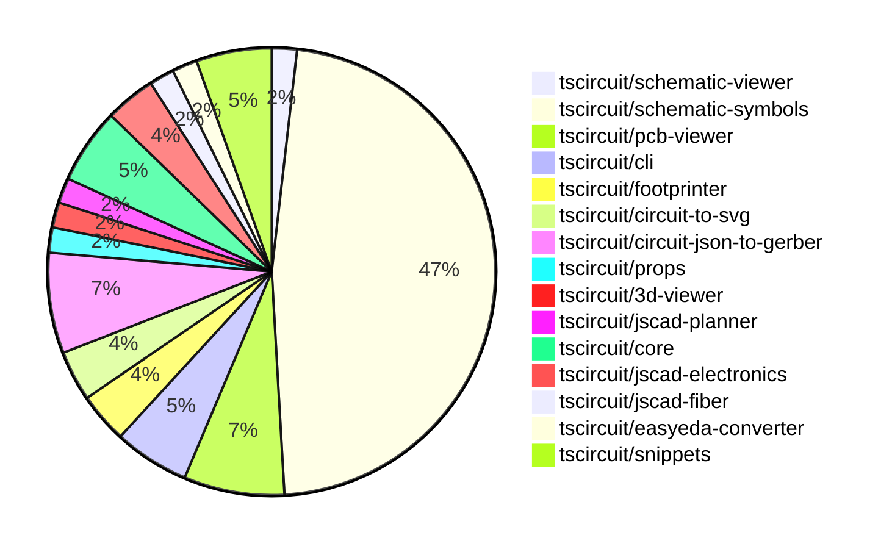

# contribution-tracker

Generates weekly contribution overviews for tscircuit contributors. Check out all
the [contribution overviews here](./contribution-overviews/)

* All PRs in the tscircuit org are scanned/summarized via Claude Haiku
* Claude classifies each Diff/PR as a Major, Minor or Tiny contribution
* All the PRs, summaries, and classifications are organized into charts and tables

The current week is shown below. There are 3 major sections:

* [Contributor Overview](#contributor-overview)
* [PRs by Repository](#prs-by-repository)
* [PRs by Contributor](#changes-by-contributor)

## Current Week

<!-- START_CURRENT_WEEK -->

# Contribution Overview 2024-09-28

## PRs by Repository

## Contributor Overview

| Contributor | 🐳 Major | 🐙 Minor | 🐌 Tiny |
|-------------|-------|-------|-------|
| DhairyaMajmudar | 1 | 0 | 0 |
| Abse2001 | 1 | 3 | 0 |
| anas-sarkez | 7 | 3 | 0 |
| ShiboSoftwareDev | 3 | 3 | 0 |
| seveibar | 9 | 1 | 0 |
| andrii-balitskyi | 1 | 0 | 0 |
| imrishabh18 | 2 | 4 | 1 |
| abhijitxy | 1 | 0 | 0 |
| bhavyajain511 | 1 | 0 | 0 |
| bbland1 | 2 | 0 | 0 |
| programmersoham | 1 | 0 | 0 |
| 0xkafkaa | 1 | 0 | 0 |
| Timer00 | 4 | 3 | 0 |
| Complexlity | 1 | 0 | 2 |

## Changes by Repository

### [tscircuit/schematic-viewer](https://github.com/tscircuit/schematic-viewer)

| PR # | Impact | Contributor | Description |
|------|--------|-------------|-------------|
| [#64](https://github.com/tscircuit/schematic-viewer/pull/64) | 🐳 Major | DhairyaMajmudar | Replaced the types in core.ts files with those exported from the `circuit-json` package. |

### [tscircuit/schematic-symbols](https://github.com/tscircuit/schematic-symbols)

| PR # | Impact | Contributor | Description |
|------|--------|-------------|-------------|
| [#21](https://github.com/tscircuit/schematic-symbols/pull/21) | 🐳 Major | Abse2001 | Added new push button symbols (horizontal and vertical) with the title of the symbols set to absolute positioning to avoid layout shift. |
| [#85](https://github.com/tscircuit/schematic-symbols/pull/85) | 🐳 Major | anas-sarkez | Added a new tunnel diode component. |
| [#82](https://github.com/tscircuit/schematic-symbols/pull/82) | 🐳 Major | anas-sarkez | Added an avalanche diode symbol and its JSON definition. |
| [#80](https://github.com/tscircuit/schematic-symbols/pull/80) | 🐳 Major | anas-sarkez | Added a new varactor diode component. |
| [#75](https://github.com/tscircuit/schematic-symbols/pull/75) | 🐳 Major | anas-sarkez | Added a Schottky diode symbol including paths, texts, and reference blocks. |
| [#72](https://github.com/tscircuit/schematic-symbols/pull/72) | 🐳 Major | seveibar | Introduces a new photodiode symbol, makes the `bun run generate` command interactive, and fixes issue #61. |
| [#106](https://github.com/tscircuit/schematic-symbols/pull/106) | 🐳 Major | imrishabh18 | Add support for the "Q" command in the SVG path parsing, which represents a quadratic Bézier curve. |
| [#113](https://github.com/tscircuit/schematic-symbols/pull/113) | 🐳 Major | bhavyajain511 | Introduce a new symbol "var_meter" to the project. |
| [#108](https://github.com/tscircuit/schematic-symbols/pull/108) | 🐳 Major | bbland1 | Add SVG and TypeScript files for the silicon controlled rectifier symbol. |
| [#109](https://github.com/tscircuit/schematic-symbols/pull/109) | 🐳 Major | bbland1 | Created SVG and TypeScript definition for Triac symbol |
| [#107](https://github.com/tscircuit/schematic-symbols/pull/107) | 🐳 Major | programmersoham | Added SVG files for npn bipolar transistor, pnp bipolar transistor, and phototransistor symbols. |
| [#91](https://github.com/tscircuit/schematic-symbols/pull/91) | 🐳 Major | 0xkafkaa | Create a new power factor meter symbol |
| [#77](https://github.com/tscircuit/schematic-symbols/pull/77) | 🐳 Major | Timer00 | Introduce a new dc_ammeter symbol |
| [#94](https://github.com/tscircuit/schematic-symbols/pull/94) | 🐳 Major | Timer00 | Introduce a new component, an AC voltmeter, with various paths, texts, and reference blocks. |
| [#89](https://github.com/tscircuit/schematic-symbols/pull/89) | 🐳 Major | Timer00 | Introduce type guards for drawing types, including Path, Text, Circle, and Box primitives, as well as more complex types like Ports, Symbols, and SVG data. |
| [#74](https://github.com/tscircuit/schematic-symbols/pull/74) | 🐳 Major | Timer00 | Introduce a new DC voltmeter component with SVG and JSON definitions. |
| [#23](https://github.com/tscircuit/schematic-symbols/pull/23) | 🐙 Minor | Abse2001 | Fixed the position of the reference and value labels so they always grow away from the symbols. |
| [#81](https://github.com/tscircuit/schematic-symbols/pull/81) | 🐙 Minor | anas-sarkez | Added a new SVG symbol for a zener diode. |
| [#98](https://github.com/tscircuit/schematic-symbols/pull/98) | 🐙 Minor | seveibar | Modify the `vercel-build` script to run the `build` script before running the `build.ts` script |
| [#86](https://github.com/tscircuit/schematic-symbols/pull/86) | 🐙 Minor | imrishabh18 | Added reference points for the ports of the box resistor symbol |
| [#73](https://github.com/tscircuit/schematic-symbols/pull/73) | 🐙 Minor | imrishabh18 | Fix the lockfile to prevent it from being frozen |
| [#22](https://github.com/tscircuit/schematic-symbols/pull/22) | 🐙 Minor | imrishabh18 | Added port reference blocks for the capacitor symbol in the `core` for the trace. |
| [#105](https://github.com/tscircuit/schematic-symbols/pull/105) | 🐙 Minor | Timer00 | Commit and push any changes before publishing to npm |
| [#103](https://github.com/tscircuit/schematic-symbols/pull/103) | 🐙 Minor | Timer00 | Update the lockfile to fix the `npm publish` command. |
| [#76](https://github.com/tscircuit/schematic-symbols/pull/76) | 🐙 Minor | Timer00 | Add a new step for formatting code before building the symbols. |
| [#104](https://github.com/tscircuit/schematic-symbols/pull/104) | 🐌 Tiny | imrishabh18 | Removes the `package-lock.json` file from the repository. |

### [tscircuit/pcb-viewer](https://github.com/tscircuit/pcb-viewer)

| PR # | Impact | Contributor | Description |
|------|--------|-------------|-------------|
| [#67](https://github.com/tscircuit/pcb-viewer/pull/67) | 🐳 Major | anas-sarkez | The pull request ensures that the `hotHey` hook only works when the window is active. |
| [#61](https://github.com/tscircuit/pcb-viewer/pull/61) | 🐳 Major | anas-sarkez | Added hotkeys for all layers |
| [#69](https://github.com/tscircuit/pcb-viewer/pull/69) | 🐙 Minor | Abse2001 | Increased the `zIndex` of the `ElementOverlayBox` component to ensure it is displayed above the traces. |
| [#65](https://github.com/tscircuit/pcb-viewer/pull/65) | 🐙 Minor | anas-sarkez | Replace the deprecated imports from `circuit-json` with the new types. |

### [tscircuit/cli](https://github.com/tscircuit/cli)

| PR # | Impact | Contributor | Description |
|------|--------|-------------|-------------|
| [#222](https://github.com/tscircuit/cli/pull/222) | 🐙 Minor | Abse2001 | Updated the `pcb_viewer` library to version `1.10.8` which fixed the via hover and resistor example issues. |
| [#213](https://github.com/tscircuit/cli/pull/213) | 🐙 Minor | ShiboSoftwareDev | Fixed the z-index of the popover content to ensure it appears above the rest of the content. |
| [#212](https://github.com/tscircuit/cli/pull/212) | 🐙 Minor | ShiboSoftwareDev | Fixed filepath bug in the codebase. |

### [tscircuit/footprinter](https://github.com/tscircuit/footprinter)

| PR # | Impact | Contributor | Description |
|------|--------|-------------|-------------|
| [#49](https://github.com/tscircuit/footprinter/pull/49) | 🐳 Major | anas-sarkez | Implement _silkscreenpins for dip components |
| [#47](https://github.com/tscircuit/footprinter/pull/47) | 🐳 Major | seveibar | Create axial footprint, add circuitJson |

### [tscircuit/circuit-to-svg](https://github.com/tscircuit/circuit-to-svg)

| PR # | Impact | Contributor | Description |
|------|--------|-------------|-------------|
| [#81](https://github.com/tscircuit/circuit-to-svg/pull/81) | 🐳 Major | imrishabh18 | Introduces a new feature to create schematic diagrams in the KiCAD style |
| [#80](https://github.com/tscircuit/circuit-to-svg/pull/80) | 🐙 Minor | anas-sarkez | Removed regular expressions for cleaning text in SVG object creation functions |

### [tscircuit/circuit-json-to-gerber](https://github.com/tscircuit/circuit-json-to-gerber)

| PR # | Impact | Contributor | Description |
|------|--------|-------------|-------------|
| [#14](https://github.com/tscircuit/circuit-json-to-gerber/pull/14) | 🐳 Major | ShiboSoftwareDev | The pull request adds support for displaying PCB vias in the copper layer of the generated Gerber files. |
| [#11](https://github.com/tscircuit/circuit-json-to-gerber/pull/11) | 🐳 Major | ShiboSoftwareDev | Implemented `pcb_hole` support in Excellon drill and soldermask, and updated the repository to use `circuit-json` instead of `@tscircuit/soup`. |
| [#9](https://github.com/tscircuit/circuit-json-to-gerber/pull/9) | 🐳 Major | ShiboSoftwareDev | Fixed gerber units to work with jlcpcb and pcbway |
| [#13](https://github.com/tscircuit/circuit-json-to-gerber/pull/13) | 🐙 Minor | ShiboSoftwareDev | Introduce a change to the `pcb_plated_hole` element to have copper/soldermask fill instead of an outline. |

### [tscircuit/props](https://github.com/tscircuit/props)

| PR # | Impact | Contributor | Description |
|------|--------|-------------|-------------|
| [#55](https://github.com/tscircuit/props/pull/55) | 🐳 Major | seveibar | Add new interface to define schematic port arrangement with sizes, sides, and pin counts. |

### [tscircuit/3d-viewer](https://github.com/tscircuit/3d-viewer)

| PR # | Impact | Contributor | Description |
|------|--------|-------------|-------------|
| [#23](https://github.com/tscircuit/3d-viewer/pull/23) | 🐳 Major | seveibar | Improve README, add support for 3D components generated by footprint |

### [tscircuit/jscad-planner](https://github.com/tscircuit/jscad-planner)

| PR # | Impact | Contributor | Description |
|------|--------|-------------|-------------|
| [#3](https://github.com/tscircuit/jscad-planner/pull/3) | 🐳 Major | seveibar | Implement the cuboid and polygon operations in the JSCAD library. |

### [tscircuit/core](https://github.com/tscircuit/core)

| PR # | Impact | Contributor | Description |
|------|--------|-------------|-------------|
| [#132](https://github.com/tscircuit/core/pull/132) | 🐳 Major | seveibar | Introduce a new `cad_component` for each component with a footprint |
| [#130](https://github.com/tscircuit/core/pull/130) | 🐳 Major | seveibar | Add errors when there's a missing footprint |
| [#133](https://github.com/tscircuit/core/pull/133) | 🐙 Minor | imrishabh18 | Fix the design of the Chip component by updating the imports and removing unused code. |

### [tscircuit/jscad-electronics](https://github.com/tscircuit/jscad-electronics)

| PR # | Impact | Contributor | Description |
|------|--------|-------------|-------------|
| [#46](https://github.com/tscircuit/jscad-electronics/pull/46) | 🐳 Major | seveibar | Add build system and checkpoint axis flipping |
| [#45](https://github.com/tscircuit/jscad-electronics/pull/45) | 🐳 Major | abhijitxy | Fix the position of the BGA component to not be on the side. |

### [tscircuit/jscad-fiber](https://github.com/tscircuit/jscad-fiber)

| PR # | Impact | Contributor | Description |
|------|--------|-------------|-------------|
| [#78](https://github.com/tscircuit/jscad-fiber/pull/78) | 🐳 Major | seveibar | Fix grid orientation with z-axis up and convert from npm to bun |

### [tscircuit/easyeda-converter](https://github.com/tscircuit/easyeda-converter)

| PR # | Impact | Contributor | Description |
|------|--------|-------------|-------------|
| [#43](https://github.com/tscircuit/easyeda-converter/pull/43) | 🐳 Major | andrii-balitskyi | Expose the 'convert' CLI command functionality under a separate function |

### [tscircuit/snippets](https://github.com/tscircuit/snippets)

| PR # | Impact | Contributor | Description |
|------|--------|-------------|-------------|
| [#9](https://github.com/tscircuit/snippets/pull/9) | 🐳 Major | Complexlity | Adds a new dropdown menu to the header of the application. |
| [#6](https://github.com/tscircuit/snippets/pull/6) | 🐌 Tiny | Complexlity | Remove the `package-lock.json` file, leaving only the `bun.lockb` file. |
| [#4](https://github.com/tscircuit/snippets/pull/4) | 🐌 Tiny | Complexlity | Updates the favicon to the same one used on tscircuits sites. |

## Changes by Contributor

### [DhairyaMajmudar](https://github.com/DhairyaMajmudar)

| PR # | Impact | Description |
|------|--------|-------------|
| [#64](https://github.com/tscircuit/schematic-viewer/pull/64) | 🐳 Major | Replaced the types in core.ts files with those exported from the `circuit-json` package. |

### [Abse2001](https://github.com/Abse2001)

| PR # | Impact | Description |
|------|--------|-------------|
| [#21](https://github.com/tscircuit/schematic-symbols/pull/21) | 🐳 Major | Added new push button symbols (horizontal and vertical) with the title of the symbols set to absolute positioning to avoid layout shift. |
| [#69](https://github.com/tscircuit/pcb-viewer/pull/69) | 🐙 Minor | Increased the `zIndex` of the `ElementOverlayBox` component to ensure it is displayed above the traces. |
| [#222](https://github.com/tscircuit/cli/pull/222) | 🐙 Minor | Updated the `pcb_viewer` library to version `1.10.8` which fixed the via hover and resistor example issues. |
| [#23](https://github.com/tscircuit/schematic-symbols/pull/23) | 🐙 Minor | Fixed the position of the reference and value labels so they always grow away from the symbols. |

### [anas-sarkez](https://github.com/anas-sarkez)

| PR # | Impact | Description |
|------|--------|-------------|
| [#67](https://github.com/tscircuit/pcb-viewer/pull/67) | 🐳 Major | The pull request ensures that the `hotHey` hook only works when the window is active. |
| [#61](https://github.com/tscircuit/pcb-viewer/pull/61) | 🐳 Major | Added hotkeys for all layers |
| [#49](https://github.com/tscircuit/footprinter/pull/49) | 🐳 Major | Implement _silkscreenpins for dip components |
| [#85](https://github.com/tscircuit/schematic-symbols/pull/85) | 🐳 Major | Added a new tunnel diode component. |
| [#82](https://github.com/tscircuit/schematic-symbols/pull/82) | 🐳 Major | Added an avalanche diode symbol and its JSON definition. |
| [#80](https://github.com/tscircuit/schematic-symbols/pull/80) | 🐳 Major | Added a new varactor diode component. |
| [#75](https://github.com/tscircuit/schematic-symbols/pull/75) | 🐳 Major | Added a Schottky diode symbol including paths, texts, and reference blocks. |
| [#65](https://github.com/tscircuit/pcb-viewer/pull/65) | 🐙 Minor | Replace the deprecated imports from `circuit-json` with the new types. |
| [#80](https://github.com/tscircuit/circuit-to-svg/pull/80) | 🐙 Minor | Removed regular expressions for cleaning text in SVG object creation functions |
| [#81](https://github.com/tscircuit/schematic-symbols/pull/81) | 🐙 Minor | Added a new SVG symbol for a zener diode. |

### [ShiboSoftwareDev](https://github.com/ShiboSoftwareDev)

| PR # | Impact | Description |
|------|--------|-------------|
| [#14](https://github.com/tscircuit/circuit-json-to-gerber/pull/14) | 🐳 Major | The pull request adds support for displaying PCB vias in the copper layer of the generated Gerber files. |
| [#11](https://github.com/tscircuit/circuit-json-to-gerber/pull/11) | 🐳 Major | Implemented `pcb_hole` support in Excellon drill and soldermask, and updated the repository to use `circuit-json` instead of `@tscircuit/soup`. |
| [#9](https://github.com/tscircuit/circuit-json-to-gerber/pull/9) | 🐳 Major | Fixed gerber units to work with jlcpcb and pcbway |
| [#213](https://github.com/tscircuit/cli/pull/213) | 🐙 Minor | Fixed the z-index of the popover content to ensure it appears above the rest of the content. |
| [#212](https://github.com/tscircuit/cli/pull/212) | 🐙 Minor | Fixed filepath bug in the codebase. |
| [#13](https://github.com/tscircuit/circuit-json-to-gerber/pull/13) | 🐙 Minor | Introduce a change to the `pcb_plated_hole` element to have copper/soldermask fill instead of an outline. |

### [seveibar](https://github.com/seveibar)

| PR # | Impact | Description |
|------|--------|-------------|
| [#55](https://github.com/tscircuit/props/pull/55) | 🐳 Major | Add new interface to define schematic port arrangement with sizes, sides, and pin counts. |
| [#47](https://github.com/tscircuit/footprinter/pull/47) | 🐳 Major | Create axial footprint, add circuitJson |
| [#23](https://github.com/tscircuit/3d-viewer/pull/23) | 🐳 Major | Improve README, add support for 3D components generated by footprint |
| [#3](https://github.com/tscircuit/jscad-planner/pull/3) | 🐳 Major | Implement the cuboid and polygon operations in the JSCAD library. |
| [#132](https://github.com/tscircuit/core/pull/132) | 🐳 Major | Introduce a new `cad_component` for each component with a footprint |
| [#130](https://github.com/tscircuit/core/pull/130) | 🐳 Major | Add errors when there's a missing footprint |
| [#46](https://github.com/tscircuit/jscad-electronics/pull/46) | 🐳 Major | Add build system and checkpoint axis flipping |
| [#78](https://github.com/tscircuit/jscad-fiber/pull/78) | 🐳 Major | Fix grid orientation with z-axis up and convert from npm to bun |
| [#72](https://github.com/tscircuit/schematic-symbols/pull/72) | 🐳 Major | Introduces a new photodiode symbol, makes the `bun run generate` command interactive, and fixes issue #61. |
| [#98](https://github.com/tscircuit/schematic-symbols/pull/98) | 🐙 Minor | Modify the `vercel-build` script to run the `build` script before running the `build.ts` script |

### [andrii-balitskyi](https://github.com/andrii-balitskyi)

| PR # | Impact | Description |
|------|--------|-------------|
| [#43](https://github.com/tscircuit/easyeda-converter/pull/43) | 🐳 Major | Expose the 'convert' CLI command functionality under a separate function |

### [imrishabh18](https://github.com/imrishabh18)

| PR # | Impact | Description |
|------|--------|-------------|
| [#81](https://github.com/tscircuit/circuit-to-svg/pull/81) | 🐳 Major | Introduces a new feature to create schematic diagrams in the KiCAD style |
| [#106](https://github.com/tscircuit/schematic-symbols/pull/106) | 🐳 Major | Add support for the "Q" command in the SVG path parsing, which represents a quadratic Bézier curve. |
| [#133](https://github.com/tscircuit/core/pull/133) | 🐙 Minor | Fix the design of the Chip component by updating the imports and removing unused code. |
| [#86](https://github.com/tscircuit/schematic-symbols/pull/86) | 🐙 Minor | Added reference points for the ports of the box resistor symbol |
| [#73](https://github.com/tscircuit/schematic-symbols/pull/73) | 🐙 Minor | Fix the lockfile to prevent it from being frozen |
| [#22](https://github.com/tscircuit/schematic-symbols/pull/22) | 🐙 Minor | Added port reference blocks for the capacitor symbol in the `core` for the trace. |
| [#104](https://github.com/tscircuit/schematic-symbols/pull/104) | 🐌 Tiny | Removes the `package-lock.json` file from the repository. |

### [abhijitxy](https://github.com/abhijitxy)

| PR # | Impact | Description |
|------|--------|-------------|
| [#45](https://github.com/tscircuit/jscad-electronics/pull/45) | 🐳 Major | Fix the position of the BGA component to not be on the side. |

### [bhavyajain511](https://github.com/bhavyajain511)

| PR # | Impact | Description |
|------|--------|-------------|
| [#113](https://github.com/tscircuit/schematic-symbols/pull/113) | 🐳 Major | Introduce a new symbol "var_meter" to the project. |

### [bbland1](https://github.com/bbland1)

| PR # | Impact | Description |
|------|--------|-------------|
| [#108](https://github.com/tscircuit/schematic-symbols/pull/108) | 🐳 Major | Add SVG and TypeScript files for the silicon controlled rectifier symbol. |
| [#109](https://github.com/tscircuit/schematic-symbols/pull/109) | 🐳 Major | Created SVG and TypeScript definition for Triac symbol |

### [programmersoham](https://github.com/programmersoham)

| PR # | Impact | Description |
|------|--------|-------------|
| [#107](https://github.com/tscircuit/schematic-symbols/pull/107) | 🐳 Major | Added SVG files for npn bipolar transistor, pnp bipolar transistor, and phototransistor symbols. |

### [0xkafkaa](https://github.com/0xkafkaa)

| PR # | Impact | Description |
|------|--------|-------------|
| [#91](https://github.com/tscircuit/schematic-symbols/pull/91) | 🐳 Major | Create a new power factor meter symbol |

### [Timer00](https://github.com/Timer00)

| PR # | Impact | Description |
|------|--------|-------------|
| [#77](https://github.com/tscircuit/schematic-symbols/pull/77) | 🐳 Major | Introduce a new dc_ammeter symbol |
| [#94](https://github.com/tscircuit/schematic-symbols/pull/94) | 🐳 Major | Introduce a new component, an AC voltmeter, with various paths, texts, and reference blocks. |
| [#89](https://github.com/tscircuit/schematic-symbols/pull/89) | 🐳 Major | Introduce type guards for drawing types, including Path, Text, Circle, and Box primitives, as well as more complex types like Ports, Symbols, and SVG data. |
| [#74](https://github.com/tscircuit/schematic-symbols/pull/74) | 🐳 Major | Introduce a new DC voltmeter component with SVG and JSON definitions. |
| [#105](https://github.com/tscircuit/schematic-symbols/pull/105) | 🐙 Minor | Commit and push any changes before publishing to npm |
| [#103](https://github.com/tscircuit/schematic-symbols/pull/103) | 🐙 Minor | Update the lockfile to fix the `npm publish` command. |
| [#76](https://github.com/tscircuit/schematic-symbols/pull/76) | 🐙 Minor | Add a new step for formatting code before building the symbols. |

### [Complexlity](https://github.com/Complexlity)

| PR # | Impact | Description |
|------|--------|-------------|
| [#9](https://github.com/tscircuit/snippets/pull/9) | 🐳 Major | Adds a new dropdown menu to the header of the application. |
| [#6](https://github.com/tscircuit/snippets/pull/6) | 🐌 Tiny | Remove the `package-lock.json` file, leaving only the `bun.lockb` file. |
| [#4](https://github.com/tscircuit/snippets/pull/4) | 🐌 Tiny | Updates the favicon to the same one used on tscircuits sites. |

<!-- END_CURRENT_WEEK -->
