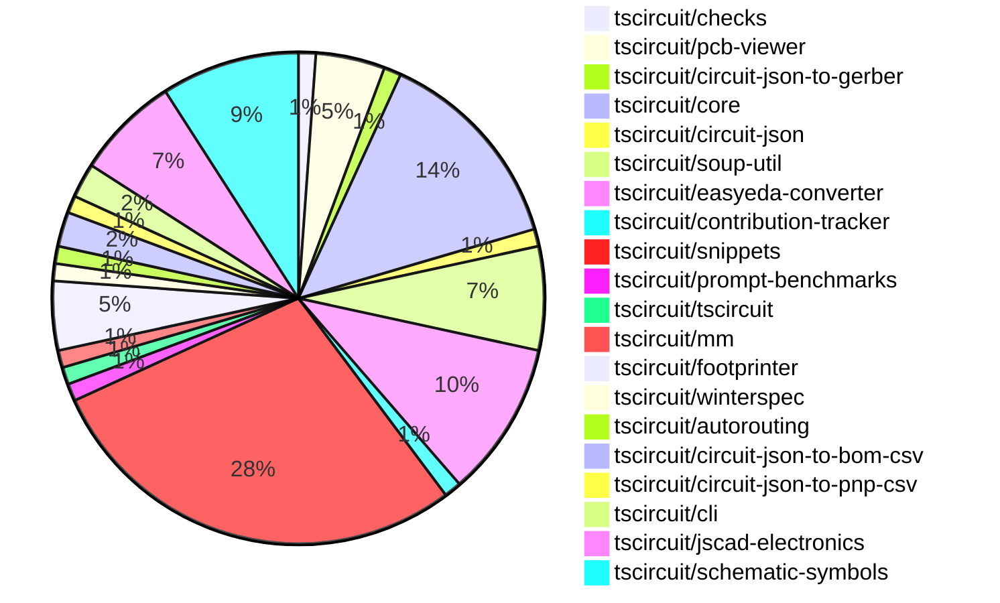

# contribution-tracker

Generates weekly contribution overviews for tscircuit contributors. Check out all
the [contribution overviews here](./contribution-overviews/)

* All PRs in the tscircuit org are scanned/summarized via Claude Haiku
* Claude classifies each Diff/PR as a Major, Minor or Tiny contribution
* All the PRs, summaries, and classifications are organized into charts and tables

The current week is shown below. There are 3 major sections:

* [Contributor Overview](#contributor-overview)
* [PRs by Repository](#prs-by-repository)
* [PRs by Contributor](#changes-by-contributor)

## Current Week

<!-- START_CURRENT_WEEK -->

# Contribution Overview 2024-10-09

## PRs by Repository

## Contributor Overview

| Contributor | 🐳 Major | 🐙 Minor | 🐌 Tiny | ⭐ |
|-------------|-------|-------|-------|-------|
| [seveibar](#seveibar) | 15 | 29 | 1 | 👑👑👑 |
| [imrishabh18](#imrishabh18) | 1 | 11 | 2 | ⭐⭐ |
| [andrii-balitskyi](#andrii-balitskyi) | 4 | 2 | 0 | ⭐⭐ |
| [anas-sarkez](#anas-sarkez) | 3 | 2 | 0 | ⭐⭐ |
| [mrudulpatil18](#mrudulpatil18) | 1 | 4 | 0 | ⭐⭐ |
| [ShiboSoftwareDev](#ShiboSoftwareDev) | 0 | 1 | 2 | ⭐ |
| [ni9999](#ni9999) | 0 | 2 | 0 | ⭐ |
| [aman1376](#aman1376) | 0 | 2 | 0 | ⭐ |
| [MandeepPaul](#MandeepPaul) | 1 | 0 | 0 | ⭐ |
| [qalbun-salim](#qalbun-salim) | 0 | 1 | 0 |  |
| [bbland1](#bbland1) | 0 | 1 | 0 |  |
| [anugcodes](#anugcodes) | 0 | 1 | 0 |  |
| [0SlowPoke0](#0SlowPoke0) | 0 | 1 | 0 |  |
| [Abse2001](#Abse2001) | 0 | 1 | 0 |  |

## Changes by Repository

### [tscircuit/checks](https://github.com/tscircuit/checks)

| PR # | Impact | Contributor | Description |
|------|--------|-------------|-------------|
| [#17](https://github.com/tscircuit/checks/pull/17) | 🐙 Minor | ShiboSoftwareDev | Refactored the code to use the "circuit-json" library instead of the deprecated "@tscircuit/soup" library. |

### [tscircuit/pcb-viewer](https://github.com/tscircuit/pcb-viewer)

| PR # | Impact | Contributor | Description |
|------|--------|-------------|-------------|
| [#71](https://github.com/tscircuit/pcb-viewer/pull/71) | 🐳 Major | seveibar | Reverts the previous change that converted children rendering to the core, as it broke the PCB viewer bounds computation. |
| [#74](https://github.com/tscircuit/pcb-viewer/pull/74) | 🐙 Minor | imrishabh18 | Refactor/remove builder |
| [#73](https://github.com/tscircuit/pcb-viewer/pull/73) | 🐙 Minor | imrishabh18 | Refactor the PCBViewer component by removing the builder and using the useRenderedCircuit hook from @tscircuit/core |
| [#75](https://github.com/tscircuit/pcb-viewer/pull/75) | 🐌 Tiny | ShiboSoftwareDev | Added a CODEOWNERS file to specify the owners of the repository. |

### [tscircuit/circuit-json-to-gerber](https://github.com/tscircuit/circuit-json-to-gerber)

| PR # | Impact | Contributor | Description |
|------|--------|-------------|-------------|
| [#20](https://github.com/tscircuit/circuit-json-to-gerber/pull/20) | 🐌 Tiny | ShiboSoftwareDev | Added a CODEOWNERS file to specify code reviewers for the repository. |

### [tscircuit/core](https://github.com/tscircuit/core)

| PR # | Impact | Contributor | Description |
|------|--------|-------------|-------------|
| [#169](https://github.com/tscircuit/core/pull/169) | 🐳 Major | imrishabh18 | Adds new components PowerSource and NetAlias to the project. |
| [#157](https://github.com/tscircuit/core/pull/157) | 🐳 Major | seveibar | Introduces a new utility function `createUseComponent` that generates a React component with dynamic port connections. |
| [#170](https://github.com/tscircuit/core/pull/170) | 🐙 Minor | imrishabh18 | Adds schX and schY properties to the Diode, Led, and NetAlias components, allowing the components to be positioned on the schematic. |
| [#155](https://github.com/tscircuit/core/pull/155) | 🐙 Minor | imrishabh18 | Add aliases "left" and "right" to the ports of Capacitor and Resistor components. |
| [#153](https://github.com/tscircuit/core/pull/153) | 🐙 Minor | imrishabh18 | Added new SilkscreenCircle and SilkscreenRect components to the library. |
| [#151](https://github.com/tscircuit/core/pull/151) | 🐙 Minor | imrishabh18 | Add a new `Via` component to the project |
| [#166](https://github.com/tscircuit/core/pull/166) | 🐙 Minor | seveibar | Updates the version of the `@tscircuit/footprinter` dependency to `^0.0.71`. |
| [#165](https://github.com/tscircuit/core/pull/165) | 🐙 Minor | seveibar | Fixes a bug where the trace layer was not correctly set for explicitly defined SMT pads. |
| [#163](https://github.com/tscircuit/core/pull/163) | 🐙 Minor | seveibar | Fixes the rotation of parts based on their layer and updates the corresponding code in the `NormalComponent` class. |
| [#161](https://github.com/tscircuit/core/pull/161) | 🐙 Minor | seveibar | Add support for `cadModel.positionOffset` feature to adjust the position of the CAD model. |
| [#159](https://github.com/tscircuit/core/pull/159) | 🐙 Minor | seveibar | Adds support for creating `pcb_hole` component from soup |
| [#158](https://github.com/tscircuit/core/pull/158) | 🐙 Minor | seveibar | Exports the `createUseComponent` function from the `hooks/create-use-component` module. |

### [tscircuit/circuit-json](https://github.com/tscircuit/circuit-json)

| PR # | Impact | Contributor | Description |
|------|--------|-------------|-------------|
| [#58](https://github.com/tscircuit/circuit-json/pull/58) | 🐙 Minor | imrishabh18 | Adds an optional `display_value` property to the `SourceComponentBase` type. |

### [tscircuit/soup-util](https://github.com/tscircuit/soup-util)

| PR # | Impact | Contributor | Description |
|------|--------|-------------|-------------|
| [#23](https://github.com/tscircuit/soup-util/pull/23) | 🐙 Minor | imrishabh18 | Fix the type error in the `find-bounds-and-center.ts` file by adding a type assertion to the `elm` variable in the `flatMap` function. |
| [#22](https://github.com/tscircuit/soup-util/pull/22) | 🐙 Minor | imrishabh18 | Reverts the export of the "find-bounds-and-center" function from the library. |
| [#21](https://github.com/tscircuit/soup-util/pull/21) | 🐙 Minor | imrishabh18 | Exports the `find-bounds-and-center` function from the library. |
| [#20](https://github.com/tscircuit/soup-util/pull/20) | 🐙 Minor | imrishabh18 | Port the `findBoundsAndCenter` function from the `builder` repo to the current repo. |
| [#19](https://github.com/tscircuit/soup-util/pull/19) | 🐌 Tiny | imrishabh18 | Updates the lock file to ensure dependencies are consistent across environments. |
| [#18](https://github.com/tscircuit/soup-util/pull/18) | 🐌 Tiny | imrishabh18 | Update the `circuit-json` dependency to the latest version `0.0.85`. |

### [tscircuit/easyeda-converter](https://github.com/tscircuit/easyeda-converter)

| PR # | Impact | Contributor | Description |
|------|--------|-------------|-------------|
| [#60](https://github.com/tscircuit/easyeda-converter/pull/60) | 🐳 Major | seveibar | New footprint generation mechanism and support for `<hole />` component in the TSX generation. |
| [#59](https://github.com/tscircuit/easyeda-converter/pull/59) | 🐳 Major | seveibar | Fix PCB hole creation and add snapshot testing for the project. |
| [#66](https://github.com/tscircuit/easyeda-converter/pull/66) | 🐙 Minor | seveibar | Adds a new prop `supplierPartNumbers` to the `soupTypescriptComponentTemplate` component. |
| [#64](https://github.com/tscircuit/easyeda-converter/pull/64) | 🐙 Minor | seveibar | Adds support for parsing and handling "PT" shape type in the SingleLetterShapeSchema. |
| [#62](https://github.com/tscircuit/easyeda-converter/pull/62) | 🐙 Minor | seveibar | Fix pcb_component offset and add checks for large dimensions in test |
| [#61](https://github.com/tscircuit/easyeda-converter/pull/61) | 🐙 Minor | seveibar | Removes the flip of the y-axis in the PCB element transformation. |
| [#56](https://github.com/tscircuit/easyeda-converter/pull/56) | 🐙 Minor | seveibar | Adds a benchmark script to test the `convertEasyEdaJsonToVariousFormats` function and write the results to a file. |
| [#49](https://github.com/tscircuit/easyeda-converter/pull/49) | 🐙 Minor | andrii-balitskyi | Allows string and number values for the `number` and `pinNumber` props in the `PadSchema` and `PinShapeOutputSchema` schemas. |
| [#54](https://github.com/tscircuit/easyeda-converter/pull/54) | 🐌 Tiny | seveibar | Replaced the import statement for `createUseComponent` from `tscircuit` to `@tscircuit/core`. |

### [tscircuit/contribution-tracker](https://github.com/tscircuit/contribution-tracker)

| PR # | Impact | Contributor | Description |
|------|--------|-------------|-------------|
| [#4](https://github.com/tscircuit/contribution-tracker/pull/4) | 🐳 Major | seveibar | Adds nicknames, star system, and better sorting to the project. |

### [tscircuit/snippets](https://github.com/tscircuit/snippets)

| PR # | Impact | Contributor | Description |
|------|--------|-------------|-------------|
| [#73](https://github.com/tscircuit/snippets/pull/73) | 🐳 Major | seveibar | Adds functionality to download fabrication files for the circuit, including Gerber, Pick and Place CSV, and Bill of Materials CSV files. |
| [#62](https://github.com/tscircuit/snippets/pull/62) | 🐳 Major | seveibar | The pull request introduces a fix for recursive importing and adds a new snippet for a square waveform using the A555Timer component. |
| [#61](https://github.com/tscircuit/snippets/pull/61) | 🐳 Major | seveibar | Adds a feature to delete a code snippet and tests for the delete functionality. |
| [#56](https://github.com/tscircuit/snippets/pull/56) | 🐳 Major | seveibar | The pull request introduces Playwright for visual regression testing, adds support for updating snapshots, and includes various other fixes and improvements. |
| [#54](https://github.com/tscircuit/snippets/pull/54) | 🐳 Major | seveibar | Introduces a new dialog component for importing code snippets. |
| [#53](https://github.com/tscircuit/snippets/pull/53) | 🐳 Major | seveibar |  |
| [#52](https://github.com/tscircuit/snippets/pull/52) | 🐳 Major | seveibar | Adds support for anonymous user editing, improves the code editor and AI page for empty states, and fixes a bug with the code editor not being scrollable. |
| [#50](https://github.com/tscircuit/snippets/pull/50) | 🐳 Major | seveibar | Refactors for explicit runs and fixes importing. |
| [#48](https://github.com/tscircuit/snippets/pull/48) | 🐳 Major | seveibar | Introduces the "Runner" feature and fixes a bug where the dashboard always loads from a hardcoded URL. |
| [#68](https://github.com/tscircuit/snippets/pull/68) | 🐳 Major | andrii-balitskyi |  |
| [#78](https://github.com/tscircuit/snippets/pull/78) | 🐳 Major | andrii-balitskyi | Add a "Submit Order" button to the editor nav bar and a dialog to handle the order submission process. |
| [#69](https://github.com/tscircuit/snippets/pull/69) | 🐳 Major | andrii-balitskyi | Introduces a new page `/orders/{order_id}` to view the details of a specific order. |
| [#46](https://github.com/tscircuit/snippets/pull/46) | 🐳 Major | andrii-balitskyi | Initial implementation of ordering API and UI, including database resources and methods for orders and order files, as well as new endpoints and pages for managing orders. |
| [#77](https://github.com/tscircuit/snippets/pull/77) | 🐳 Major | mrudulpatil18 | Adds a search component to the header that allows users to search for code snippets and displays the results in a dropdown. |
| [#74](https://github.com/tscircuit/snippets/pull/74) | 🐙 Minor | seveibar | Updates dependencies and fixes issues with downloading fabrication files |
| [#67](https://github.com/tscircuit/snippets/pull/67) | 🐙 Minor | seveibar | Fixes an issue with importing modules on the first run of the application. |
| [#66](https://github.com/tscircuit/snippets/pull/66) | 🐙 Minor | seveibar | Updates the core package to version 0.0.116 to fix a bun dependency issue and a routing issue. |
| [#65](https://github.com/tscircuit/snippets/pull/65) | 🐙 Minor | seveibar | Footprinter Fixes, Import Caching for runtime imports |
| [#63](https://github.com/tscircuit/snippets/pull/63) | 🐙 Minor | seveibar | Update easyeda dependency to version 0.0.48 to fix issue importing diode |
| [#58](https://github.com/tscircuit/snippets/pull/58) | 🐙 Minor | seveibar | Fix an issue with early hook return in the AI page test |
| [#57](https://github.com/tscircuit/snippets/pull/57) | 🐙 Minor | seveibar | Add rename functionality for code snippets. |
| [#51](https://github.com/tscircuit/snippets/pull/51) | 🐙 Minor | seveibar | Fix code editor scrolling overflow and support exporting hooks |
| [#45](https://github.com/tscircuit/snippets/pull/45) | 🐙 Minor | seveibar | The pull request adds the ability to save the TypeScript definition (DTS) content to the database along with the code snippet. |
| [#43](https://github.com/tscircuit/snippets/pull/43) | 🐙 Minor | mrudulpatil18 | Persist the visibility of onboarding tips in the global store and update the LandingHero component to use the global store for managing the visibility. |
| [#49](https://github.com/tscircuit/snippets/pull/49) | 🐙 Minor | Abse2001 | Implemented a download function for the circuitJson download button. |

### [tscircuit/prompt-benchmarks](https://github.com/tscircuit/prompt-benchmarks)

| PR # | Impact | Contributor | Description |
|------|--------|-------------|-------------|
| [#3](https://github.com/tscircuit/prompt-benchmarks/pull/3) | 🐳 Major | seveibar | Adds a new function `safeCompileDts` that allows for safe compilation of TypeScript code and retrieval of the generated declaration file (`.d.ts`). |

### [tscircuit/tscircuit](https://github.com/tscircuit/tscircuit)

| PR # | Impact | Contributor | Description |
|------|--------|-------------|-------------|
| [#465](https://github.com/tscircuit/tscircuit/pull/465) | 🐙 Minor | seveibar | Requires bun to use tscircuit and use bun as the CLI runtime |

### [tscircuit/mm](https://github.com/tscircuit/mm)

| PR # | Impact | Contributor | Description |
|------|--------|-------------|-------------|
| [#5](https://github.com/tscircuit/mm/pull/5) | 🐙 Minor | seveibar | Add `mil2mm` function to convert mil to mm |

### [tscircuit/footprinter](https://github.com/tscircuit/footprinter)

| PR # | Impact | Contributor | Description |
|------|--------|-------------|-------------|
| [#63](https://github.com/tscircuit/footprinter/pull/63) | 🐙 Minor | seveibar | Remove bun as a dependency to reduce the bundle size |
| [#61](https://github.com/tscircuit/footprinter/pull/61) | 🐙 Minor | seveibar | Adds error handling for invalid footprint function strings in the footprinter library. |
| [#60](https://github.com/tscircuit/footprinter/pull/60) | 🐙 Minor | bbland1 | Adds types for parameters returned using .json() in the Footprinter API. |
| [#62](https://github.com/tscircuit/footprinter/pull/62) | 🐙 Minor | anas-sarkez | Modified and fixed the default value of qfp according to datasheet |

### [tscircuit/winterspec](https://github.com/tscircuit/winterspec)

| PR # | Impact | Contributor | Description |
|------|--------|-------------|-------------|
| [#12](https://github.com/tscircuit/winterspec/pull/12) | 🐙 Minor | seveibar | Fix Routes Directory Loading issue |

### [tscircuit/autorouting](https://github.com/tscircuit/autorouting)

| PR # | Impact | Contributor | Description |
|------|--------|-------------|-------------|
| [#81](https://github.com/tscircuit/autorouting/pull/81) | 🐙 Minor | seveibar | Updates the types used for `AnySoupElement` and `PcbFabricationNoteText` to use `AnyCircuitElement` and `PcbFabricationNoteText` from the `circuit-json` package instead. |

### [tscircuit/circuit-json-to-bom-csv](https://github.com/tscircuit/circuit-json-to-bom-csv)

| PR # | Impact | Contributor | Description |
|------|--------|-------------|-------------|
| [#3](https://github.com/tscircuit/circuit-json-to-bom-csv/pull/3) | 🐙 Minor | seveibar | Updates the `convertBomRowsToCsv` function to include all column headers in the generated CSV, and fixes the column name for "JLCPCB Part #". |
| [#2](https://github.com/tscircuit/circuit-json-to-bom-csv/pull/2) | 🐙 Minor | seveibar | Adds support for null source components, initializes a test directory, and adds a test for bom conversion with real sample data. |

### [tscircuit/circuit-json-to-pnp-csv](https://github.com/tscircuit/circuit-json-to-pnp-csv)

| PR # | Impact | Contributor | Description |
|------|--------|-------------|-------------|
| [#2](https://github.com/tscircuit/circuit-json-to-pnp-csv/pull/2) | 🐙 Minor | seveibar | Fixes the designator logic and adds a test for the nine key keyboard |

### [tscircuit/cli](https://github.com/tscircuit/cli)

| PR # | Impact | Contributor | Description |
|------|--------|-------------|-------------|
| [#210](https://github.com/tscircuit/cli/pull/210) | 🐙 Minor | andrii-balitskyi | Adds a new `gen jlcpcb <jlcpcbPartNumberOrUrl>` command to the CLI, allowing users to generate JLCPCB-specific files. |
| [#217](https://github.com/tscircuit/cli/pull/217) | 🐙 Minor | qalbun-salim | Add a new command to export a Plug n Play CSV file from an example file. |

### [tscircuit/jscad-electronics](https://github.com/tscircuit/jscad-electronics)

| PR # | Impact | Contributor | Description |
|------|--------|-------------|-------------|
| [#68](https://github.com/tscircuit/jscad-electronics/pull/68) | 🐳 Major | anas-sarkez | Implementing a 3D component for a USB-C female port |
| [#67](https://github.com/tscircuit/jscad-electronics/pull/67) | 🐳 Major | anas-sarkez | Implementing a USB-A female connector component |
| [#65](https://github.com/tscircuit/jscad-electronics/pull/65) | 🐳 Major | anas-sarkez | Refactor QFP component to support customizable pitch, lead width, and body dimensions. Add QFP 128 3D footprint. |
| [#64](https://github.com/tscircuit/jscad-electronics/pull/64) | 🐙 Minor | anas-sarkez | Added a new example for a 16-pin wide DIP footprint and fixed the length of the DIP model. |
| [#66](https://github.com/tscircuit/jscad-electronics/pull/66) | 🐙 Minor | ni9999 | Added a new component, `AxialCapacitor`, which allows users to render an axial capacitor in either a vertical or horizontal orientation. |
| [#59](https://github.com/tscircuit/jscad-electronics/pull/59) | 🐙 Minor | ni9999 | Adds an implementation of an Axial LED component to the project. |

### [tscircuit/schematic-symbols](https://github.com/tscircuit/schematic-symbols)

| PR # | Impact | Contributor | Description |
|------|--------|-------------|-------------|
| [#169](https://github.com/tscircuit/schematic-symbols/pull/169) | 🐳 Major | MandeepPaul | Introduces a new JSON file for a "Mushroom Head Normally Open Momentary" component. |
| [#168](https://github.com/tscircuit/schematic-symbols/pull/168) | 🐙 Minor | aman1376 | Adds a new n-channel MOSFET transistor symbol to the project. |
| [#158](https://github.com/tscircuit/schematic-symbols/pull/158) | 🐙 Minor | aman1376 | Adds a new SPST switch symbol. |
| [#166](https://github.com/tscircuit/schematic-symbols/pull/166) | 🐙 Minor | mrudulpatil18 | Added a count of unique symbols and a GitHub stars badge to the schematic symbols page. |
| [#161](https://github.com/tscircuit/schematic-symbols/pull/161) | 🐙 Minor | mrudulpatil18 | Added the PNP bipolar transistor symbol and supporting files. |
| [#156](https://github.com/tscircuit/schematic-symbols/pull/156) | 🐙 Minor | mrudulpatil18 | Adds an NPN bipolar transistor symbol with SVG and JSON files. |
| [#160](https://github.com/tscircuit/schematic-symbols/pull/160) | 🐙 Minor | anugcodes | Added an SPDT (Single-Pole Double-Throw) switch symbol. |
| [#157](https://github.com/tscircuit/schematic-symbols/pull/157) | 🐙 Minor | 0SlowPoke0 | Adds a new SVG symbol for a "filled diode" |

## Changes by Contributor

### [ShiboSoftwareDev](https://github.com/ShiboSoftwareDev)

| PR # | Impact | Description |
|------|--------|-------------|
| [#17](https://github.com/tscircuit/checks/pull/17) | 🐙 Minor | Refactored the code to use the "circuit-json" library instead of the deprecated "@tscircuit/soup" library. |
| [#75](https://github.com/tscircuit/pcb-viewer/pull/75) | 🐌 Tiny | Added a CODEOWNERS file to specify the owners of the repository. |
| [#20](https://github.com/tscircuit/circuit-json-to-gerber/pull/20) | 🐌 Tiny | Added a CODEOWNERS file to specify code reviewers for the repository. |

### [imrishabh18](https://github.com/imrishabh18)

| PR # | Impact | Description |
|------|--------|-------------|
| [#169](https://github.com/tscircuit/core/pull/169) | 🐳 Major | Adds new components PowerSource and NetAlias to the project. |
| [#74](https://github.com/tscircuit/pcb-viewer/pull/74) | 🐙 Minor | Refactor/remove builder |
| [#73](https://github.com/tscircuit/pcb-viewer/pull/73) | 🐙 Minor | Refactor the PCBViewer component by removing the builder and using the useRenderedCircuit hook from @tscircuit/core |
| [#58](https://github.com/tscircuit/circuit-json/pull/58) | 🐙 Minor | Adds an optional `display_value` property to the `SourceComponentBase` type. |
| [#23](https://github.com/tscircuit/soup-util/pull/23) | 🐙 Minor | Fix the type error in the `find-bounds-and-center.ts` file by adding a type assertion to the `elm` variable in the `flatMap` function. |
| [#22](https://github.com/tscircuit/soup-util/pull/22) | 🐙 Minor | Reverts the export of the "find-bounds-and-center" function from the library. |
| [#21](https://github.com/tscircuit/soup-util/pull/21) | 🐙 Minor | Exports the `find-bounds-and-center` function from the library. |
| [#20](https://github.com/tscircuit/soup-util/pull/20) | 🐙 Minor | Port the `findBoundsAndCenter` function from the `builder` repo to the current repo. |
| [#170](https://github.com/tscircuit/core/pull/170) | 🐙 Minor | Adds schX and schY properties to the Diode, Led, and NetAlias components, allowing the components to be positioned on the schematic. |
| [#155](https://github.com/tscircuit/core/pull/155) | 🐙 Minor | Add aliases "left" and "right" to the ports of Capacitor and Resistor components. |
| [#153](https://github.com/tscircuit/core/pull/153) | 🐙 Minor | Added new SilkscreenCircle and SilkscreenRect components to the library. |
| [#151](https://github.com/tscircuit/core/pull/151) | 🐙 Minor | Add a new `Via` component to the project |
| [#19](https://github.com/tscircuit/soup-util/pull/19) | 🐌 Tiny | Updates the lock file to ensure dependencies are consistent across environments. |
| [#18](https://github.com/tscircuit/soup-util/pull/18) | 🐌 Tiny | Update the `circuit-json` dependency to the latest version `0.0.85`. |

### [seveibar](https://github.com/seveibar)

| PR # | Impact | Description |
|------|--------|-------------|
| [#71](https://github.com/tscircuit/pcb-viewer/pull/71) | 🐳 Major | Reverts the previous change that converted children rendering to the core, as it broke the PCB viewer bounds computation. |
| [#60](https://github.com/tscircuit/easyeda-converter/pull/60) | 🐳 Major | New footprint generation mechanism and support for `<hole />` component in the TSX generation. |
| [#59](https://github.com/tscircuit/easyeda-converter/pull/59) | 🐳 Major | Fix PCB hole creation and add snapshot testing for the project. |
| [#157](https://github.com/tscircuit/core/pull/157) | 🐳 Major | Introduces a new utility function `createUseComponent` that generates a React component with dynamic port connections. |
| [#4](https://github.com/tscircuit/contribution-tracker/pull/4) | 🐳 Major | Adds nicknames, star system, and better sorting to the project. |
| [#73](https://github.com/tscircuit/snippets/pull/73) | 🐳 Major | Adds functionality to download fabrication files for the circuit, including Gerber, Pick and Place CSV, and Bill of Materials CSV files. |
| [#62](https://github.com/tscircuit/snippets/pull/62) | 🐳 Major | The pull request introduces a fix for recursive importing and adds a new snippet for a square waveform using the A555Timer component. |
| [#61](https://github.com/tscircuit/snippets/pull/61) | 🐳 Major | Adds a feature to delete a code snippet and tests for the delete functionality. |
| [#56](https://github.com/tscircuit/snippets/pull/56) | 🐳 Major | The pull request introduces Playwright for visual regression testing, adds support for updating snapshots, and includes various other fixes and improvements. |
| [#54](https://github.com/tscircuit/snippets/pull/54) | 🐳 Major | Introduces a new dialog component for importing code snippets. |
| [#53](https://github.com/tscircuit/snippets/pull/53) | 🐳 Major |  |
| [#52](https://github.com/tscircuit/snippets/pull/52) | 🐳 Major | Adds support for anonymous user editing, improves the code editor and AI page for empty states, and fixes a bug with the code editor not being scrollable. |
| [#50](https://github.com/tscircuit/snippets/pull/50) | 🐳 Major | Refactors for explicit runs and fixes importing. |
| [#48](https://github.com/tscircuit/snippets/pull/48) | 🐳 Major | Introduces the "Runner" feature and fixes a bug where the dashboard always loads from a hardcoded URL. |
| [#3](https://github.com/tscircuit/prompt-benchmarks/pull/3) | 🐳 Major | Adds a new function `safeCompileDts` that allows for safe compilation of TypeScript code and retrieval of the generated declaration file (`.d.ts`). |
| [#465](https://github.com/tscircuit/tscircuit/pull/465) | 🐙 Minor | Requires bun to use tscircuit and use bun as the CLI runtime |
| [#5](https://github.com/tscircuit/mm/pull/5) | 🐙 Minor | Add `mil2mm` function to convert mil to mm |
| [#63](https://github.com/tscircuit/footprinter/pull/63) | 🐙 Minor | Remove bun as a dependency to reduce the bundle size |
| [#61](https://github.com/tscircuit/footprinter/pull/61) | 🐙 Minor | Adds error handling for invalid footprint function strings in the footprinter library. |
| [#66](https://github.com/tscircuit/easyeda-converter/pull/66) | 🐙 Minor | Adds a new prop `supplierPartNumbers` to the `soupTypescriptComponentTemplate` component. |
| [#64](https://github.com/tscircuit/easyeda-converter/pull/64) | 🐙 Minor | Adds support for parsing and handling "PT" shape type in the SingleLetterShapeSchema. |
| [#62](https://github.com/tscircuit/easyeda-converter/pull/62) | 🐙 Minor | Fix pcb_component offset and add checks for large dimensions in test |
| [#61](https://github.com/tscircuit/easyeda-converter/pull/61) | 🐙 Minor | Removes the flip of the y-axis in the PCB element transformation. |
| [#56](https://github.com/tscircuit/easyeda-converter/pull/56) | 🐙 Minor | Adds a benchmark script to test the `convertEasyEdaJsonToVariousFormats` function and write the results to a file. |
| [#12](https://github.com/tscircuit/winterspec/pull/12) | 🐙 Minor | Fix Routes Directory Loading issue |
| [#166](https://github.com/tscircuit/core/pull/166) | 🐙 Minor | Updates the version of the `@tscircuit/footprinter` dependency to `^0.0.71`. |
| [#165](https://github.com/tscircuit/core/pull/165) | 🐙 Minor | Fixes a bug where the trace layer was not correctly set for explicitly defined SMT pads. |
| [#163](https://github.com/tscircuit/core/pull/163) | 🐙 Minor | Fixes the rotation of parts based on their layer and updates the corresponding code in the `NormalComponent` class. |
| [#161](https://github.com/tscircuit/core/pull/161) | 🐙 Minor | Add support for `cadModel.positionOffset` feature to adjust the position of the CAD model. |
| [#159](https://github.com/tscircuit/core/pull/159) | 🐙 Minor | Adds support for creating `pcb_hole` component from soup |
| [#158](https://github.com/tscircuit/core/pull/158) | 🐙 Minor | Exports the `createUseComponent` function from the `hooks/create-use-component` module. |
| [#81](https://github.com/tscircuit/autorouting/pull/81) | 🐙 Minor | Updates the types used for `AnySoupElement` and `PcbFabricationNoteText` to use `AnyCircuitElement` and `PcbFabricationNoteText` from the `circuit-json` package instead. |
| [#3](https://github.com/tscircuit/circuit-json-to-bom-csv/pull/3) | 🐙 Minor | Updates the `convertBomRowsToCsv` function to include all column headers in the generated CSV, and fixes the column name for "JLCPCB Part #". |
| [#2](https://github.com/tscircuit/circuit-json-to-bom-csv/pull/2) | 🐙 Minor | Adds support for null source components, initializes a test directory, and adds a test for bom conversion with real sample data. |
| [#2](https://github.com/tscircuit/circuit-json-to-pnp-csv/pull/2) | 🐙 Minor | Fixes the designator logic and adds a test for the nine key keyboard |
| [#74](https://github.com/tscircuit/snippets/pull/74) | 🐙 Minor | Updates dependencies and fixes issues with downloading fabrication files |
| [#67](https://github.com/tscircuit/snippets/pull/67) | 🐙 Minor | Fixes an issue with importing modules on the first run of the application. |
| [#66](https://github.com/tscircuit/snippets/pull/66) | 🐙 Minor | Updates the core package to version 0.0.116 to fix a bun dependency issue and a routing issue. |
| [#65](https://github.com/tscircuit/snippets/pull/65) | 🐙 Minor | Footprinter Fixes, Import Caching for runtime imports |
| [#63](https://github.com/tscircuit/snippets/pull/63) | 🐙 Minor | Update easyeda dependency to version 0.0.48 to fix issue importing diode |
| [#58](https://github.com/tscircuit/snippets/pull/58) | 🐙 Minor | Fix an issue with early hook return in the AI page test |
| [#57](https://github.com/tscircuit/snippets/pull/57) | 🐙 Minor | Add rename functionality for code snippets. |
| [#51](https://github.com/tscircuit/snippets/pull/51) | 🐙 Minor | Fix code editor scrolling overflow and support exporting hooks |
| [#45](https://github.com/tscircuit/snippets/pull/45) | 🐙 Minor | The pull request adds the ability to save the TypeScript definition (DTS) content to the database along with the code snippet. |
| [#54](https://github.com/tscircuit/easyeda-converter/pull/54) | 🐌 Tiny | Replaced the import statement for `createUseComponent` from `tscircuit` to `@tscircuit/core`. |

### [andrii-balitskyi](https://github.com/andrii-balitskyi)

| PR # | Impact | Description |
|------|--------|-------------|
| [#68](https://github.com/tscircuit/snippets/pull/68) | 🐳 Major |  |
| [#78](https://github.com/tscircuit/snippets/pull/78) | 🐳 Major | Add a "Submit Order" button to the editor nav bar and a dialog to handle the order submission process. |
| [#69](https://github.com/tscircuit/snippets/pull/69) | 🐳 Major | Introduces a new page `/orders/{order_id}` to view the details of a specific order. |
| [#46](https://github.com/tscircuit/snippets/pull/46) | 🐳 Major | Initial implementation of ordering API and UI, including database resources and methods for orders and order files, as well as new endpoints and pages for managing orders. |
| [#210](https://github.com/tscircuit/cli/pull/210) | 🐙 Minor | Adds a new `gen jlcpcb <jlcpcbPartNumberOrUrl>` command to the CLI, allowing users to generate JLCPCB-specific files. |
| [#49](https://github.com/tscircuit/easyeda-converter/pull/49) | 🐙 Minor | Allows string and number values for the `number` and `pinNumber` props in the `PadSchema` and `PinShapeOutputSchema` schemas. |

### [qalbun-salim](https://github.com/qalbun-salim)

| PR # | Impact | Description |
|------|--------|-------------|
| [#217](https://github.com/tscircuit/cli/pull/217) | 🐙 Minor | Add a new command to export a Plug n Play CSV file from an example file. |

### [bbland1](https://github.com/bbland1)

| PR # | Impact | Description |
|------|--------|-------------|
| [#60](https://github.com/tscircuit/footprinter/pull/60) | 🐙 Minor | Adds types for parameters returned using .json() in the Footprinter API. |

### [anas-sarkez](https://github.com/anas-sarkez)

| PR # | Impact | Description |
|------|--------|-------------|
| [#68](https://github.com/tscircuit/jscad-electronics/pull/68) | 🐳 Major | Implementing a 3D component for a USB-C female port |
| [#67](https://github.com/tscircuit/jscad-electronics/pull/67) | 🐳 Major | Implementing a USB-A female connector component |
| [#65](https://github.com/tscircuit/jscad-electronics/pull/65) | 🐳 Major | Refactor QFP component to support customizable pitch, lead width, and body dimensions. Add QFP 128 3D footprint. |
| [#62](https://github.com/tscircuit/footprinter/pull/62) | 🐙 Minor | Modified and fixed the default value of qfp according to datasheet |
| [#64](https://github.com/tscircuit/jscad-electronics/pull/64) | 🐙 Minor | Added a new example for a 16-pin wide DIP footprint and fixed the length of the DIP model. |

### [ni9999](https://github.com/ni9999)

| PR # | Impact | Description |
|------|--------|-------------|
| [#66](https://github.com/tscircuit/jscad-electronics/pull/66) | 🐙 Minor | Added a new component, `AxialCapacitor`, which allows users to render an axial capacitor in either a vertical or horizontal orientation. |
| [#59](https://github.com/tscircuit/jscad-electronics/pull/59) | 🐙 Minor | Adds an implementation of an Axial LED component to the project. |

### [aman1376](https://github.com/aman1376)

| PR # | Impact | Description |
|------|--------|-------------|
| [#168](https://github.com/tscircuit/schematic-symbols/pull/168) | 🐙 Minor | Adds a new n-channel MOSFET transistor symbol to the project. |
| [#158](https://github.com/tscircuit/schematic-symbols/pull/158) | 🐙 Minor | Adds a new SPST switch symbol. |

### [MandeepPaul](https://github.com/MandeepPaul)

| PR # | Impact | Description |
|------|--------|-------------|
| [#169](https://github.com/tscircuit/schematic-symbols/pull/169) | 🐳 Major | Introduces a new JSON file for a "Mushroom Head Normally Open Momentary" component. |

### [mrudulpatil18](https://github.com/mrudulpatil18)

| PR # | Impact | Description |
|------|--------|-------------|
| [#77](https://github.com/tscircuit/snippets/pull/77) | 🐳 Major | Adds a search component to the header that allows users to search for code snippets and displays the results in a dropdown. |
| [#166](https://github.com/tscircuit/schematic-symbols/pull/166) | 🐙 Minor | Added a count of unique symbols and a GitHub stars badge to the schematic symbols page. |
| [#161](https://github.com/tscircuit/schematic-symbols/pull/161) | 🐙 Minor | Added the PNP bipolar transistor symbol and supporting files. |
| [#156](https://github.com/tscircuit/schematic-symbols/pull/156) | 🐙 Minor | Adds an NPN bipolar transistor symbol with SVG and JSON files. |
| [#43](https://github.com/tscircuit/snippets/pull/43) | 🐙 Minor | Persist the visibility of onboarding tips in the global store and update the LandingHero component to use the global store for managing the visibility. |

### [anugcodes](https://github.com/anugcodes)

| PR # | Impact | Description |
|------|--------|-------------|
| [#160](https://github.com/tscircuit/schematic-symbols/pull/160) | 🐙 Minor | Added an SPDT (Single-Pole Double-Throw) switch symbol. |

### [0SlowPoke0](https://github.com/0SlowPoke0)

| PR # | Impact | Description |
|------|--------|-------------|
| [#157](https://github.com/tscircuit/schematic-symbols/pull/157) | 🐙 Minor | Adds a new SVG symbol for a "filled diode" |

### [Abse2001](https://github.com/Abse2001)

| PR # | Impact | Description |
|------|--------|-------------|
| [#49](https://github.com/tscircuit/snippets/pull/49) | 🐙 Minor | Implemented a download function for the circuitJson download button. |

<!-- END_CURRENT_WEEK -->
