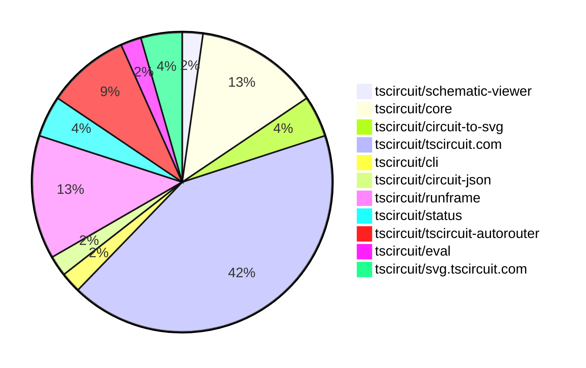

# contribution-tracker

Generates weekly contribution overviews for tscircuit contributors. Check out all
the [contribution overviews here](./contribution-overviews/)

* All PRs in the tscircuit org are scanned/summarized via Claude Haiku
* Claude classifies each Diff/PR as a Major, Minor or Tiny contribution
* All the PRs, summaries, and classifications are organized into charts and tables

The current week is shown below. There are 3 major sections:

* [Contributor Overview](#contributor-overview)
* [PRs by Repository](#prs-by-repository)
* [PRs by Contributor](#changes-by-contributor)

## Current Week

<!-- START_CURRENT_WEEK -->

# Contribution Overview 2025-04-30

## PRs by Repository

## Contributor Overview

| Contributor | 🐳 Major | 🐙 Minor | 🐌 Tiny | ⭐ | Issues Created | Discussion Contributions |
|-------------|---------|---------|---------|-----|----------------|--------------------------|
| [seveibar](#seveibar) | 3 | 5 | 1 | ⭐⭐⭐ | 25 | 0🔹 0🔶 0💎 |
| [imrishabh18](#imrishabh18) | 0 | 11 | 3 | ⭐⭐⭐ | 4 | 0🔹 0🔶 0💎 |
| [ShiboSoftwareDev](#ShiboSoftwareDev) | 0 | 6 | 1 | ⭐⭐ | 6 | 0🔹 0🔶 0💎 |
| [ArnavK-09](#ArnavK-09) | 0 | 4 | 1 | ⭐⭐ | 5 | 0🔹 0🔶 0💎 |
| [Abse2001](#Abse2001) | 1 | 1 | 0 | ⭐ | 0 | 0🔹 0🔶 0💎 |
| [techmannih](#techmannih) | 1 | 0 | 0 | ⭐ | 0 | 0🔹 0🔶 0💎 |
| [mohan-bee](#mohan-bee) | 0 | 2 | 0 | ⭐ | 3 | 0🔹 0🔶 0💎 |
| [ricohageman](#ricohageman) | 1 | 0 | 0 | ⭐ | 0 | 0🔹 0🔶 0💎 |
| [krushnarout](#krushnarout) | 0 | 1 | 0 |  | 0 | 0🔹 0🔶 0💎 |

### Discussion Contribution Legend

- 🔹 Participating: Basic participation with minimal effort
- 🔶 Very Active: Thoughtful participation that adds value
- 💎 Extremely Active: Exceptional participation with high-quality content

## Review Table

[reviews-received-hover]: ## "Number of reviews received for PRs for this contributor"
[approvals-received-hover]: ## "Number of approvals received for PRs this contributor authored"
[rejections-received-hover]: ## "Number of rejections received for PRs this contributor authored"
[prs-opened-hover]: ## "Number of PRs opened by this contributor"
[issues-created-hover]: ## "Number of issues created by this contributor"
[bountied-issues-hover]: ## "Number of issues this contributor created with a bounty"
[bountied-issue-$-hover]: ## "Total bounty amount placed on issues authored by this contributor"

| Contributor | Reviews Received | Approvals Received | Rejections Received | Approvals | Rejections | PRs Opened | PRs Merged | Issues Created | Bountied Issues | Bountied Issue $ |
|---|---|---|---|---|---|---|---|---|---|---|
| [mohan-bee](#mohan-bee) | 8 | 5 | 2 | 0 | 0 | 5 | 2 | 3 | 0 | 0 |
| [Anshgrover23](#Anshgrover23) | 1 | 0 | 1 | 1 | 2 | 1 | 0 | 1 | 0 | 0 |
| [MustafaMulla29](#MustafaMulla29) | 3 | 0 | 2 | 0 | 0 | 4 | 0 | 2 | 1 | 5 |
| [imrishabh18](#imrishabh18) | 2 | 1 | 0 | 4 | 3 | 14 | 14 | 4 | 2 | 25 |
| [seveibar](#seveibar) | 0 | 0 | 0 | 20 | 4 | 12 | 10 | 25 | 18 | 412 |
| [ShiboSoftwareDev](#ShiboSoftwareDev) | 29 | 10 | 2 | 0 | 0 | 16 | 9 | 6 | 3 | 95 |
| [krushnarout](#krushnarout) | 6 | 2 | 0 | 0 | 0 | 2 | 1 | 0 | 0 | 0 |
| [ArnavK-09](#ArnavK-09) | 12 | 5 | 2 | 1 | 1 | 9 | 5 | 5 | 1 | 20 |
| [techmannih](#techmannih) | 2 | 1 | 1 | 0 | 0 | 4 | 1 | 0 | 0 | 0 |
| [Abse2001](#Abse2001) | 4 | 2 | 0 | 0 | 0 | 2 | 2 | 0 | 0 | 0 |
| [graphite-app[bot]](#graphite-app[bot]) | 0 | 0 | 0 | 0 | 0 | 0 | 0 | 0 | 0 | 0 |
| [dhvll](#dhvll) | 0 | 0 | 0 | 0 | 0 | 2 | 0 | 0 | 0 | 0 |
| [tscircuitbot](#tscircuitbot) | 0 | 0 | 0 | 0 | 0 | 10 | 0 | 0 | 0 | 0 |
| [ricohageman](#ricohageman) | 0 | 0 | 0 | 0 | 0 | 1 | 1 | 0 | 0 | 0 |

## Changes by Repository

### [tscircuit/schematic-viewer](https://github.com/tscircuit/schematic-viewer)

| PR # | Impact | Contributor | Description | Milestone Aligned |
|------|--------|-------------|-------------|-------------------|
| [#86](https://github.com/tscircuit/schematic-viewer/pull/86) | 🐙 Minor | ShiboSoftwareDev | Adds transparent background for customization in the SchematicViewer component. | ✅ |

### [tscircuit/core](https://github.com/tscircuit/core)

| PR # | Impact | Contributor | Description | Milestone Aligned |
|------|--------|-------------|-------------|-------------------|
| [#773](https://github.com/tscircuit/core/pull/773) | 🐙 Minor | ShiboSoftwareDev | Fix double schematic trace | ✅ |
| [#770](https://github.com/tscircuit/core/pull/770) | 🟣 | ShiboSoftwareDev | Removed the build step from the typecheck workflow, making it faster to run. | ✅ |
| [#775](https://github.com/tscircuit/core/pull/775) | 🐳 Major | Abse2001 | Adds solder paste objects for each SMT pad and plated hole in the PCB design. | ✅ |
| [#769](https://github.com/tscircuit/core/pull/769) | 🐙 Minor | ShiboSoftwareDev | Introduced a smoke test to verify the generated distribution after building the project. | ✅ |
| [#766](https://github.com/tscircuit/core/pull/766) | 🐙 Minor | ShiboSoftwareDev | Fixed double schematic traces | ✅ |
| [#768](https://github.com/tscircuit/core/pull/768) | 🐙 Minor | imrishabh18 | Revert a previous change that fixed double schematic traces. | ❌ |

### [tscircuit/circuit-to-svg](https://github.com/tscircuit/circuit-to-svg)

| PR # | Impact | Contributor | Description | Milestone Aligned |
|------|--------|-------------|-------------|-------------------|
| [#203](https://github.com/tscircuit/circuit-to-svg/pull/203) | 🐙 Minor | ShiboSoftwareDev | Override any schematic color | ✅ |
| [#205](https://github.com/tscircuit/circuit-to-svg/pull/205) | 🐌 Tiny | ShiboSoftwareDev | Exports the ColorMap type from the utils/colors module. | ✅ |

### [tscircuit/tscircuit.com](https://github.com/tscircuit/tscircuit.com)

| PR # | Impact | Contributor | Description | Milestone Aligned |
|------|--------|-------------|-------------|-------------------|
| [#985](https://github.com/tscircuit/tscircuit.com/pull/985) | 🐙 Minor | ShiboSoftwareDev | Fixed the rendering of double boards in the PCB viewer. | ✅ |
| [#1013](https://github.com/tscircuit/tscircuit.com/pull/1013) | 🐙 Minor | imrishabh18 | Switches the Stripe checkout base URL from the test environment to the production environment. | ✅ |
| [#1001](https://github.com/tscircuit/tscircuit.com/pull/1001) | 🐙 Minor | imrishabh18 | Updates the "@tscircuit/runframe" dependency to version 0.0.388 | ✅ |
| [#1000](https://github.com/tscircuit/tscircuit.com/pull/1000) | 🐙 Minor | imrishabh18 |  | ❌ |
| [#995](https://github.com/tscircuit/tscircuit.com/pull/995) | 🐙 Minor | imrishabh18 | Refactor the build-status component to simplify the rendering logic. | ✅ |
| [#993](https://github.com/tscircuit/tscircuit.com/pull/993) | 🐙 Minor | imrishabh18 | Adds a new test case to check if the `circuit_json_build_error` field is returned correctly when it exists. | ❌ |
| [#1011](https://github.com/tscircuit/tscircuit.com/pull/1011) | 🐙 Minor | ArnavK-09 | Add a copy button to the important files view component to allow users to copy the content of the active file. | ❌ |
| [#1003](https://github.com/tscircuit/tscircuit.com/pull/1003) | 🐙 Minor | ArnavK-09 | Update the tooltip text and preserve the scroll position when updating the editor content. | ✅ |
| [#1005](https://github.com/tscircuit/tscircuit.com/pull/1005) | 🐙 Minor | ArnavK-09 | The change modifies the `onEditClicked` handler to accept an optional `file_path` parameter and include it in the navigation URL, allowing for more precise editing of specific files within the package. | ❌ |
| [#1004](https://github.com/tscircuit/tscircuit.com/pull/1004) | 🐙 Minor | ArnavK-09 | The PR refactors the `CodeAndPreview` component to extract the logic for handling package visibility changes into a separate function to improve code maintainability and reduce redundancy. | ❌ |
| [#999](https://github.com/tscircuit/tscircuit.com/pull/999) | 🐙 Minor | seveibar | Remove the "Edit Package" button with the "BETA" label from the dropdown menu. | ✅ |
| [#996](https://github.com/tscircuit/tscircuit.com/pull/996) | 🐙 Minor | seveibar | Update the `/editor` route to point to the `PackageEditorPage` and add a new `/legacy-editor` route to the `EditorPage`. | ✅ |
| [#1012](https://github.com/tscircuit/tscircuit.com/pull/1012) | 🐌 Tiny | imrishabh18 | Upgrade the `@tscircuit/runframe` package to version `0.0.391`. | ✅ |
| [#1008](https://github.com/tscircuit/tscircuit.com/pull/1008) | 🐌 Tiny | imrishabh18 | Update the `@tscircuit/runframe` dependency to version `0.0.390`. | ✅ |
| [#1002](https://github.com/tscircuit/tscircuit.com/pull/1002) | 🐌 Tiny | imrishabh18 | Update the `@tscircuit/runframe` dependency to version `0.0.389`. | ✅ |
| [#1010](https://github.com/tscircuit/tscircuit.com/pull/1010) | 🐌 Tiny | ArnavK-09 | Removed the unused `hasUnrunChanges` prop from the `EditorNav` component. | ✅ |
| [#998](https://github.com/tscircuit/tscircuit.com/pull/998) | 🟣 | seveibar | Upgrade Vite and disable Terser | ❌ |
| [#987](https://github.com/tscircuit/tscircuit.com/pull/987) | 🐙 Minor | mohan-bee | Added a tooltip in fork and star buttons if the user is not logged in. | ❌ |
| [#997](https://github.com/tscircuit/tscircuit.com/pull/997) | 🐌 Tiny | seveibar | Removes the "$50" text from the order button. | ✅ |

### [tscircuit/cli](https://github.com/tscircuit/cli)

| PR # | Impact | Contributor | Description | Milestone Aligned |
|------|--------|-------------|-------------|-------------------|
| [#185](https://github.com/tscircuit/cli/pull/185) | 🟣 | ShiboSoftwareDev | The pull request introduces a new function `addPackage` that handles the installation of a tscircuit component package, including handling different package name formats, ensuring the `.npmrc` file is configured, and using the appropriate package manager. It also adds event handling for `INSTALL_PACKAGE` events, triggering the `handleInstallPackage` function to install the package. | ❌ |

### [tscircuit/circuit-json](https://github.com/tscircuit/circuit-json)

| PR # | Impact | Contributor | Description | Milestone Aligned |
|------|--------|-------------|-------------|-------------------|
| [#173](https://github.com/tscircuit/circuit-json/pull/173) | 🐳 Major | techmannih | Adds support for pill, oval, and rotated rectangular solder paste shapes in the `pcb_solder_paste` type. | ✅ |

### [tscircuit/runframe](https://github.com/tscircuit/runframe)

| PR # | Impact | Contributor | Description | Milestone Aligned |
|------|--------|-------------|-------------|-------------------|
| [#516](https://github.com/tscircuit/runframe/pull/516) | 🐙 Minor | Abse2001 | Fix some errors not shown in the error tab and add support for multiple errors in the [nextJS] style. | ❌ |
| [#535](https://github.com/tscircuit/runframe/pull/535) | 🐙 Minor | imrishabh18 | Add a failing message on the order dialog when there is an error fetching the quotes. | ✅ |
| [#533](https://github.com/tscircuit/runframe/pull/533) | 🐙 Minor | imrishabh18 | Show error message when there is an error in the response. | ✅ |
| [#532](https://github.com/tscircuit/runframe/pull/532) | 🐙 Minor | imrishabh18 | Removes the shipping option from the order dialog | ❌ |
| [#530](https://github.com/tscircuit/runframe/pull/530) | 🐙 Minor | imrishabh18 | Update the previous `total_cost` to the new field `total_cost_without_shipping` | ✅ |
| [#523](https://github.com/tscircuit/runframe/pull/523) | 🐙 Minor | mohan-bee | Use a globally stored tip in PreviewEmptyState to prevent re-renders from changing content | ✅ |

### [tscircuit/status](https://github.com/tscircuit/status)

| PR # | Impact | Contributor | Description | Milestone Aligned |
|------|--------|-------------|-------------|-------------------|
| [#20](https://github.com/tscircuit/status/pull/20) | 🐙 Minor | imrishabh18 | Add status check for compile.tscircuit.com | ✅ |
| [#24](https://github.com/tscircuit/status/pull/24) | 🐙 Minor | krushnarout | Adds health checks for SVG, PNG, and browser preview services. | ✅ |

### [tscircuit/tscircuit-autorouter](https://github.com/tscircuit/tscircuit-autorouter)

| PR # | Impact | Contributor | Description | Milestone Aligned |
|------|--------|-------------|-------------|-------------------|
| [#109](https://github.com/tscircuit/tscircuit-autorouter/pull/109) | 🐳 Major | seveibar | Capacity Pathing split into 2 stages, integrate new HD PolyLine, ledmatrix4 working again, add failing case for new HD Polyline, % time spent per stage. Add stats for pathingOptimizer. Display stats in autorouting debugger. | ✅ |
| [#108](https://github.com/tscircuit/tscircuit-autorouter/pull/108) | 🐳 Major | seveibar | Introduce a new MultiHead Polyline Solver with better/faster initial via possibilities generation. | ✅ |
| [#106](https://github.com/tscircuit/tscircuit-autorouter/pull/106) | 🐳 Major | seveibar | Adds a new component, "ViaPossibilitiesDebugger", that visualizes the via possibilities for a given "NodeWithPortPoints". | ✅ |
| [#107](https://github.com/tscircuit/tscircuit-autorouter/pull/107) | 🐳 Major | ricohageman | The pull request optimizes the pathing solver by reusing the nodeEdgeMap, reducing the runtime of the keyboard5 use case from 8.39s to 3.72s (-55%). | ✅ |

### [tscircuit/eval](https://github.com/tscircuit/eval)

| PR # | Impact | Contributor | Description | Milestone Aligned |
|------|--------|-------------|-------------|-------------------|
| [#259](https://github.com/tscircuit/eval/pull/259) | 🐙 Minor | seveibar | Fix the `build:runner` script to bundle the `@tscircuit/parts-engine` dependency. | ✅ |

### [tscircuit/svg.tscircuit.com](https://github.com/tscircuit/svg.tscircuit.com)

| PR # | Impact | Contributor | Description | Milestone Aligned |
|------|--------|-------------|-------------|-------------------|
| [#168](https://github.com/tscircuit/svg.tscircuit.com/pull/168) | 🐙 Minor | seveibar | Add build, format and format:check scripts | ✅ |
| [#167](https://github.com/tscircuit/svg.tscircuit.com/pull/167) | 🐙 Minor | seveibar | This pull request makes tests run on CI, updates the core and eval libraries, and adds some new GitHub Actions workflows. | ✅ |

## Changes by Contributor

### [ShiboSoftwareDev](https://github.com/ShiboSoftwareDev)

| PR # | Impact | Description | Milestone Aligned |
|------|--------|-------------|-------------------|
| [#86](https://github.com/tscircuit/schematic-viewer/pull/86) | 🐙 Minor | Adds transparent background for customization in the SchematicViewer component. | ✅ |
| [#773](https://github.com/tscircuit/core/pull/773) | 🐙 Minor | Fix double schematic trace | ✅ |
| [#770](https://github.com/tscircuit/core/pull/770) | 🟣 | Removed the build step from the typecheck workflow, making it faster to run. | ✅ |
| [#769](https://github.com/tscircuit/core/pull/769) | 🐙 Minor | Introduced a smoke test to verify the generated distribution after building the project. | ✅ |
| [#766](https://github.com/tscircuit/core/pull/766) | 🐙 Minor | Fixed double schematic traces | ✅ |
| [#203](https://github.com/tscircuit/circuit-to-svg/pull/203) | 🐙 Minor | Override any schematic color | ✅ |
| [#985](https://github.com/tscircuit/tscircuit.com/pull/985) | 🐙 Minor | Fixed the rendering of double boards in the PCB viewer. | ✅ |
| [#205](https://github.com/tscircuit/circuit-to-svg/pull/205) | 🐌 Tiny | Exports the ColorMap type from the utils/colors module. | ✅ |
| [#185](https://github.com/tscircuit/cli/pull/185) | 🟣 | The pull request introduces a new function `addPackage` that handles the installation of a tscircuit component package, including handling different package name formats, ensuring the `.npmrc` file is configured, and using the appropriate package manager. It also adds event handling for `INSTALL_PACKAGE` events, triggering the `handleInstallPackage` function to install the package. | ❌ |

### [techmannih](https://github.com/techmannih)

| PR # | Impact | Description | Milestone Aligned |
|------|--------|-------------|-------------------|
| [#173](https://github.com/tscircuit/circuit-json/pull/173) | 🐳 Major | Adds support for pill, oval, and rotated rectangular solder paste shapes in the `pcb_solder_paste` type. | ✅ |

### [Abse2001](https://github.com/Abse2001)

| PR # | Impact | Description | Milestone Aligned |
|------|--------|-------------|-------------------|
| [#775](https://github.com/tscircuit/core/pull/775) | 🐳 Major | Adds solder paste objects for each SMT pad and plated hole in the PCB design. | ✅ |
| [#516](https://github.com/tscircuit/runframe/pull/516) | 🐙 Minor | Fix some errors not shown in the error tab and add support for multiple errors in the [nextJS] style. | ❌ |

### [imrishabh18](https://github.com/imrishabh18)

| PR # | Impact | Description | Milestone Aligned |
|------|--------|-------------|-------------------|
| [#768](https://github.com/tscircuit/core/pull/768) | 🐙 Minor | Revert a previous change that fixed double schematic traces. | ❌ |
| [#1013](https://github.com/tscircuit/tscircuit.com/pull/1013) | 🐙 Minor | Switches the Stripe checkout base URL from the test environment to the production environment. | ✅ |
| [#1001](https://github.com/tscircuit/tscircuit.com/pull/1001) | 🐙 Minor | Updates the "@tscircuit/runframe" dependency to version 0.0.388 | ✅ |
| [#1000](https://github.com/tscircuit/tscircuit.com/pull/1000) | 🐙 Minor |  | ❌ |
| [#995](https://github.com/tscircuit/tscircuit.com/pull/995) | 🐙 Minor | Refactor the build-status component to simplify the rendering logic. | ✅ |
| [#993](https://github.com/tscircuit/tscircuit.com/pull/993) | 🐙 Minor | Adds a new test case to check if the `circuit_json_build_error` field is returned correctly when it exists. | ❌ |
| [#20](https://github.com/tscircuit/status/pull/20) | 🐙 Minor | Add status check for compile.tscircuit.com | ✅ |
| [#535](https://github.com/tscircuit/runframe/pull/535) | 🐙 Minor | Add a failing message on the order dialog when there is an error fetching the quotes. | ✅ |
| [#533](https://github.com/tscircuit/runframe/pull/533) | 🐙 Minor | Show error message when there is an error in the response. | ✅ |
| [#532](https://github.com/tscircuit/runframe/pull/532) | 🐙 Minor | Removes the shipping option from the order dialog | ❌ |
| [#530](https://github.com/tscircuit/runframe/pull/530) | 🐙 Minor | Update the previous `total_cost` to the new field `total_cost_without_shipping` | ✅ |
| [#1012](https://github.com/tscircuit/tscircuit.com/pull/1012) | 🐌 Tiny | Upgrade the `@tscircuit/runframe` package to version `0.0.391`. | ✅ |
| [#1008](https://github.com/tscircuit/tscircuit.com/pull/1008) | 🐌 Tiny | Update the `@tscircuit/runframe` dependency to version `0.0.390`. | ✅ |
| [#1002](https://github.com/tscircuit/tscircuit.com/pull/1002) | 🐌 Tiny | Update the `@tscircuit/runframe` dependency to version `0.0.389`. | ✅ |

### [ArnavK-09](https://github.com/ArnavK-09)

| PR # | Impact | Description | Milestone Aligned |
|------|--------|-------------|-------------------|
| [#1011](https://github.com/tscircuit/tscircuit.com/pull/1011) | 🐙 Minor | Add a copy button to the important files view component to allow users to copy the content of the active file. | ❌ |
| [#1003](https://github.com/tscircuit/tscircuit.com/pull/1003) | 🐙 Minor | Update the tooltip text and preserve the scroll position when updating the editor content. | ✅ |
| [#1005](https://github.com/tscircuit/tscircuit.com/pull/1005) | 🐙 Minor | The change modifies the `onEditClicked` handler to accept an optional `file_path` parameter and include it in the navigation URL, allowing for more precise editing of specific files within the package. | ❌ |
| [#1004](https://github.com/tscircuit/tscircuit.com/pull/1004) | 🐙 Minor | The PR refactors the `CodeAndPreview` component to extract the logic for handling package visibility changes into a separate function to improve code maintainability and reduce redundancy. | ❌ |
| [#1010](https://github.com/tscircuit/tscircuit.com/pull/1010) | 🐌 Tiny | Removed the unused `hasUnrunChanges` prop from the `EditorNav` component. | ✅ |

### [seveibar](https://github.com/seveibar)

| PR # | Impact | Description | Milestone Aligned |
|------|--------|-------------|-------------------|
| [#999](https://github.com/tscircuit/tscircuit.com/pull/999) | 🐙 Minor | Remove the "Edit Package" button with the "BETA" label from the dropdown menu. | ✅ |
| [#998](https://github.com/tscircuit/tscircuit.com/pull/998) | 🟣 | Upgrade Vite and disable Terser | ❌ |
| [#109](https://github.com/tscircuit/tscircuit-autorouter/pull/109) | 🐳 Major | Capacity Pathing split into 2 stages, integrate new HD PolyLine, ledmatrix4 working again, add failing case for new HD Polyline, % time spent per stage. Add stats for pathingOptimizer. Display stats in autorouting debugger. | ✅ |
| [#108](https://github.com/tscircuit/tscircuit-autorouter/pull/108) | 🐳 Major | Introduce a new MultiHead Polyline Solver with better/faster initial via possibilities generation. | ✅ |
| [#106](https://github.com/tscircuit/tscircuit-autorouter/pull/106) | 🐳 Major | Adds a new component, "ViaPossibilitiesDebugger", that visualizes the via possibilities for a given "NodeWithPortPoints". | ✅ |
| [#996](https://github.com/tscircuit/tscircuit.com/pull/996) | 🐙 Minor | Update the `/editor` route to point to the `PackageEditorPage` and add a new `/legacy-editor` route to the `EditorPage`. | ✅ |
| [#259](https://github.com/tscircuit/eval/pull/259) | 🐙 Minor | Fix the `build:runner` script to bundle the `@tscircuit/parts-engine` dependency. | ✅ |
| [#168](https://github.com/tscircuit/svg.tscircuit.com/pull/168) | 🐙 Minor | Add build, format and format:check scripts | ✅ |
| [#167](https://github.com/tscircuit/svg.tscircuit.com/pull/167) | 🐙 Minor | This pull request makes tests run on CI, updates the core and eval libraries, and adds some new GitHub Actions workflows. | ✅ |
| [#997](https://github.com/tscircuit/tscircuit.com/pull/997) | 🐌 Tiny | Removes the "$50" text from the order button. | ✅ |

### [mohan-bee](https://github.com/mohan-bee)

| PR # | Impact | Description | Milestone Aligned |
|------|--------|-------------|-------------------|
| [#987](https://github.com/tscircuit/tscircuit.com/pull/987) | 🐙 Minor | Added a tooltip in fork and star buttons if the user is not logged in. | ❌ |
| [#523](https://github.com/tscircuit/runframe/pull/523) | 🐙 Minor | Use a globally stored tip in PreviewEmptyState to prevent re-renders from changing content | ✅ |

### [krushnarout](https://github.com/krushnarout)

| PR # | Impact | Description | Milestone Aligned |
|------|--------|-------------|-------------------|
| [#24](https://github.com/tscircuit/status/pull/24) | 🐙 Minor | Adds health checks for SVG, PNG, and browser preview services. | ✅ |

### [ricohageman](https://github.com/ricohageman)

| PR # | Impact | Description | Milestone Aligned |
|------|--------|-------------|-------------------|
| [#107](https://github.com/tscircuit/tscircuit-autorouter/pull/107) | 🐳 Major | The pull request optimizes the pathing solver by reusing the nodeEdgeMap, reducing the runtime of the keyboard5 use case from 8.39s to 3.72s (-55%). | ✅ |

<!-- END_CURRENT_WEEK -->
