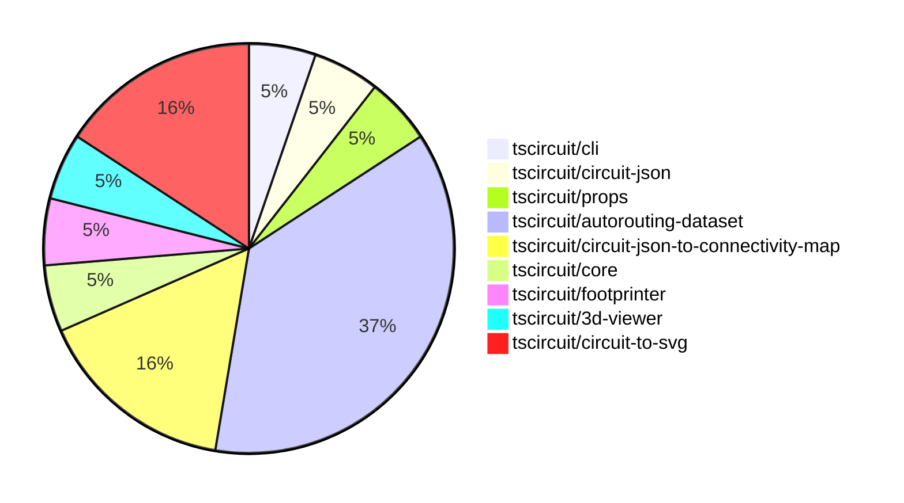

# contribution-tracker

Generates weekly contribution overviews for tscircuit contributors. Check out all
the [contribution overviews here](./contribution-overviews/)

* All PRs in the tscircuit org are scanned/summarized via Claude Haiku
* Claude classifies each Diff/PR as a Major, Minor or Tiny contribution
* All the PRs, summaries, and classifications are organized into charts and tables

The current week is shown below. There are 3 major sections:

* [Contributor Overview](#contributor-overview)
* [PRs by Repository](#prs-by-repository)
* [PRs by Contributor](#changes-by-contributor)

## Current Week

<!-- START_CURRENT_WEEK -->

# Contribution Overview 2024-09-14

## PRs by Repository

## Contributor Overview

| Contributor | 🐳 Major | 🐙 Minor | 🐌 Tiny |
|-------------|-------|-------|-------|
| seveibar | 10 | 3 | 0 |
| anas-sarkez | 0 | 1 | 0 |
| ShiboSoftwareDev | 2 | 0 | 0 |
| imrishabh18 | 1 | 1 | 0 |

## Changes by Repository

### [tscircuit/cli](https://github.com/tscircuit/cli)

| PR # | Impact | Contributor | Description |
|------|--------|-------------|-------------|
| [#179](https://github.com/tscircuit/cli/pull/179) | 🐳 Major | seveibar | Improve the macrokeypad routing by updating the manual trace hints and adding support for dark mode styling in the frontend. |

### [tscircuit/circuit-json](https://github.com/tscircuit/circuit-json)

| PR # | Impact | Contributor | Description |
|------|--------|-------------|-------------|
| [#46](https://github.com/tscircuit/circuit-json/pull/46) | 🐳 Major | seveibar | Updating naming conventions, switching to bun for build and installation, and renaming `AnySoupElement` to `AnyCircuitElement`. |

### [tscircuit/props](https://github.com/tscircuit/props)

| PR # | Impact | Contributor | Description |
|------|--------|-------------|-------------|
| [#50](https://github.com/tscircuit/props/pull/50) | 🟣 | seveibar | Add key as an optional parameter for trace props |

### [tscircuit/autorouting-dataset](https://github.com/tscircuit/autorouting-dataset)

| PR # | Impact | Contributor | Description |
|------|--------|-------------|-------------|
| [#73](https://github.com/tscircuit/autorouting-dataset/pull/73) | 🐳 Major | seveibar | Introduce GitHub Action Benchmarks to automatically run and publish benchmark results for various algorithms. |
| [#72](https://github.com/tscircuit/autorouting-dataset/pull/72) | 🐳 Major | seveibar | Implement a preprocessing step in the GeneralizedAstar algorithm to adjust the start and end points of a connection based on previous iterations, and add a postprocessing step to update the PcbConnectivityMap with the solved trace. |
| [#71](https://github.com/tscircuit/autorouting-dataset/pull/71) | 🐳 Major | seveibar | The pull request introduces a feature to compute goal boxes for both targets, find optimal starting and ending points, and load them into the input. It also includes a snapshot example to fix. |
| [#67](https://github.com/tscircuit/autorouting-dataset/pull/67) | 🐳 Major | seveibar | Adds an SVG snapshot for the keyboard sample 7 against the multilayer autorouter, preparing for the route to neighbor strategy. |
| [#69](https://github.com/tscircuit/autorouting-dataset/pull/69) | 🐳 Major | seveibar | Introduce alternative goal box functions for handling connections with multiple possible goal boxes. |
| [#66](https://github.com/tscircuit/autorouting-dataset/pull/66) | 🐳 Major | seveibar | Adds vias for PCB trace routes in the solution soup. |
| [#74](https://github.com/tscircuit/autorouting-dataset/pull/74) | 🐙 Minor | seveibar | Fix a dependency issue that was breaking the build for the "bun-build-infgrid" workflow. |

### [tscircuit/circuit-json-to-connectivity-map](https://github.com/tscircuit/circuit-json-to-connectivity-map)

| PR # | Impact | Contributor | Description |
|------|--------|-------------|-------------|
| [#4](https://github.com/tscircuit/circuit-json-to-connectivity-map/pull/4) | 🐳 Major | seveibar | Adds support for adding new connections to an existing connectivity map. |
| [#3](https://github.com/tscircuit/circuit-json-to-connectivity-map/pull/3) | 🐳 Major | seveibar | Introduce a feature to create a PCB Connectivity Map, which can be used to determine how traces and ports are physically connected on a PCB. |
| [#5](https://github.com/tscircuit/circuit-json-to-connectivity-map/pull/5) | 🐙 Minor | seveibar | Add support for initializing the PcbConnectivityMap with an empty circuit JSON. |

### [tscircuit/core](https://github.com/tscircuit/core)

| PR # | Impact | Contributor | Description |
|------|--------|-------------|-------------|
| [#86](https://github.com/tscircuit/core/pull/86) | 🐙 Minor | seveibar | Upgrade the `@tscircuit/infgrid-ijump-astar` dependency from version `0.0.16` to `0.0.17`. |

### [tscircuit/footprinter](https://github.com/tscircuit/footprinter)

| PR # | Impact | Contributor | Description |
|------|--------|-------------|-------------|
| [#37](https://github.com/tscircuit/footprinter/pull/37) | 🐙 Minor | anas-sarkez | Updated the `circuit-to-svg` dependency and the corresponding package.json file. |

### [tscircuit/3d-viewer](https://github.com/tscircuit/3d-viewer)

| PR # | Impact | Contributor | Description |
|------|--------|-------------|-------------|
| [#17](https://github.com/tscircuit/3d-viewer/pull/17) | 🐳 Major | ShiboSoftwareDev | Implemented board outline feature. |

### [tscircuit/circuit-to-svg](https://github.com/tscircuit/circuit-to-svg)

| PR # | Impact | Contributor | Description |
|------|--------|-------------|-------------|
| [#69](https://github.com/tscircuit/circuit-to-svg/pull/69) | 🐳 Major | ShiboSoftwareDev | Implemented colored fabrication note path/text. |
| [#70](https://github.com/tscircuit/circuit-to-svg/pull/70) | 🐳 Major | imrishabh18 | Introduce a new feature to create SVG objects from PCB vias. |
| [#71](https://github.com/tscircuit/circuit-to-svg/pull/71) | 🐙 Minor | imrishabh18 | Update deprecated name `AnySoupElement` to `AnyCircuitElement` in the code. |

## Changes by Contributor

### [seveibar](https://github.com/seveibar)

| PR # | Impact | Description |
|------|--------|-------------|
| [#179](https://github.com/tscircuit/cli/pull/179) | 🐳 Major | Improve the macrokeypad routing by updating the manual trace hints and adding support for dark mode styling in the frontend. |
| [#46](https://github.com/tscircuit/circuit-json/pull/46) | 🐳 Major | Updating naming conventions, switching to bun for build and installation, and renaming `AnySoupElement` to `AnyCircuitElement`. |
| [#50](https://github.com/tscircuit/props/pull/50) | 🟣 | Add key as an optional parameter for trace props |
| [#73](https://github.com/tscircuit/autorouting-dataset/pull/73) | 🐳 Major | Introduce GitHub Action Benchmarks to automatically run and publish benchmark results for various algorithms. |
| [#72](https://github.com/tscircuit/autorouting-dataset/pull/72) | 🐳 Major | Implement a preprocessing step in the GeneralizedAstar algorithm to adjust the start and end points of a connection based on previous iterations, and add a postprocessing step to update the PcbConnectivityMap with the solved trace. |
| [#71](https://github.com/tscircuit/autorouting-dataset/pull/71) | 🐳 Major | The pull request introduces a feature to compute goal boxes for both targets, find optimal starting and ending points, and load them into the input. It also includes a snapshot example to fix. |
| [#67](https://github.com/tscircuit/autorouting-dataset/pull/67) | 🐳 Major | Adds an SVG snapshot for the keyboard sample 7 against the multilayer autorouter, preparing for the route to neighbor strategy. |
| [#69](https://github.com/tscircuit/autorouting-dataset/pull/69) | 🐳 Major | Introduce alternative goal box functions for handling connections with multiple possible goal boxes. |
| [#66](https://github.com/tscircuit/autorouting-dataset/pull/66) | 🐳 Major | Adds vias for PCB trace routes in the solution soup. |
| [#4](https://github.com/tscircuit/circuit-json-to-connectivity-map/pull/4) | 🐳 Major | Adds support for adding new connections to an existing connectivity map. |
| [#3](https://github.com/tscircuit/circuit-json-to-connectivity-map/pull/3) | 🐳 Major | Introduce a feature to create a PCB Connectivity Map, which can be used to determine how traces and ports are physically connected on a PCB. |
| [#86](https://github.com/tscircuit/core/pull/86) | 🐙 Minor | Upgrade the `@tscircuit/infgrid-ijump-astar` dependency from version `0.0.16` to `0.0.17`. |
| [#74](https://github.com/tscircuit/autorouting-dataset/pull/74) | 🐙 Minor | Fix a dependency issue that was breaking the build for the "bun-build-infgrid" workflow. |
| [#5](https://github.com/tscircuit/circuit-json-to-connectivity-map/pull/5) | 🐙 Minor | Add support for initializing the PcbConnectivityMap with an empty circuit JSON. |

### [anas-sarkez](https://github.com/anas-sarkez)

| PR # | Impact | Description |
|------|--------|-------------|
| [#37](https://github.com/tscircuit/footprinter/pull/37) | 🐙 Minor | Updated the `circuit-to-svg` dependency and the corresponding package.json file. |

### [ShiboSoftwareDev](https://github.com/ShiboSoftwareDev)

| PR # | Impact | Description |
|------|--------|-------------|
| [#17](https://github.com/tscircuit/3d-viewer/pull/17) | 🐳 Major | Implemented board outline feature. |
| [#69](https://github.com/tscircuit/circuit-to-svg/pull/69) | 🐳 Major | Implemented colored fabrication note path/text. |

### [imrishabh18](https://github.com/imrishabh18)

| PR # | Impact | Description |
|------|--------|-------------|
| [#70](https://github.com/tscircuit/circuit-to-svg/pull/70) | 🐳 Major | Introduce a new feature to create SVG objects from PCB vias. |
| [#71](https://github.com/tscircuit/circuit-to-svg/pull/71) | 🐙 Minor | Update deprecated name `AnySoupElement` to `AnyCircuitElement` in the code. |

<!-- END_CURRENT_WEEK -->
