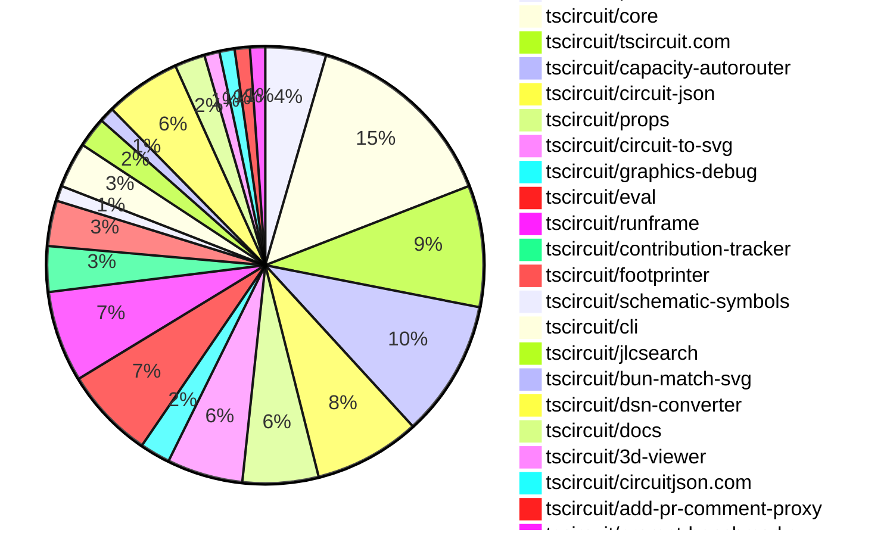

# contribution-tracker

Generates weekly contribution overviews for tscircuit contributors. Check out all
the [contribution overviews here](./contribution-overviews/)

* All PRs in the tscircuit org are scanned/summarized via Claude Haiku
* Claude classifies each Diff/PR as a Major, Minor or Tiny contribution
* All the PRs, summaries, and classifications are organized into charts and tables

The current week is shown below. There are 3 major sections:

* [Contributor Overview](#contributor-overview)
* [PRs by Repository](#prs-by-repository)
* [PRs by Contributor](#changes-by-contributor)

## Current Week

<!-- START_CURRENT_WEEK -->

# Contribution Overview 2025-02-26

## PRs by Repository

## Contributor Overview

| Contributor | 🐳 Major | 🐙 Minor | 🐌 Tiny | ⭐ | Issues Created |
|-------------|---------|---------|---------|-----|----------------|
| [seveibar](#seveibar) | 10 | 25 | 5 | 👑👑👑 | 48 |
| [techmannih](#techmannih) | 2 | 9 | 1 | ⭐⭐ | 13 |
| [imrishabh18](#imrishabh18) | 0 | 8 | 4 | ⭐⭐ | 11 |
| [Abse2001](#Abse2001) | 2 | 1 | 0 | ⭐⭐ | 4 |
| [ArnavK-09](#ArnavK-09) | 0 | 4 | 1 | ⭐ | 4 |
| [kom-senapati](#kom-senapati) | 0 | 4 | 0 | ⭐ | 0 |
| [MustafaMulla29](#MustafaMulla29) | 1 | 2 | 0 | ⭐ | 2 |
| [ShiboSoftwareDev](#ShiboSoftwareDev) | 0 | 1 | 0 | ⭐ | 16 |
| [Ayushjhawar8](#Ayushjhawar8) | 1 | 1 | 0 | ⭐ | 1 |
| [Anshgrover23](#Anshgrover23) | 0 | 2 | 1 | ⭐ | 5 |
| [rohitbhure65](#rohitbhure65) | 0 | 1 | 0 |  | 0 |
| [krushnarout](#krushnarout) | 0 | 1 | 0 |  | 1 |

## Review Table

[reviews-received-hover]: ## "Number of reviews received for PRs for this contributor"
[approvals-received-hover]: ## "Number of approvals received for PRs this contributor authored"
[rejections-received-hover]: ## "Number of rejections received for PRs this contributor authored"
[prs-opened-hover]: ## "Number of PRs opened by this contributor"
[issues-created-hover]: ## "Number of issues created by this contributor"
[bountied-issues-hover]: ## "Number of issues this contributor created with a bounty"
[bountied-issue-$-hover]: ## "Total bounty amount placed on issues authored by this contributor"

| Contributor | Reviews Received | Approvals Received | Rejections Received | Approvals | Rejections | PRs Opened | PRs Merged | Issues Created | Bountied Issues | Bountied Issue $ |
|---|---|---|---|---|---|---|---|---|---|---|
| [seveibar](#seveibar) | 2 | 1 | 0 | 30 | 14 | 47 | 42 | 48 | 34 | 500 |
| [Abse2001](#Abse2001) | 2 | 2 | 0 | 2 | 1 | 3 | 3 | 4 | 3 | 37 |
| [MustafaMulla29](#MustafaMulla29) | 12 | 4 | 7 | 0 | 0 | 7 | 3 | 2 | 0 | 0 |
| [ShiboSoftwareDev](#ShiboSoftwareDev) | 7 | 2 | 0 | 4 | 2 | 5 | 1 | 16 | 7 | 187 |
| [techmannih](#techmannih) | 30 | 17 | 7 | 2 | 6 | 23 | 12 | 13 | 4 | 18 |
| [Anshgrover23](#Anshgrover23) | 9 | 3 | 5 | 3 | 1 | 8 | 3 | 5 | 1 | 5 |
| [kom-senapati](#kom-senapati) | 23 | 7 | 2 | 0 | 0 | 6 | 4 | 0 | 0 | 0 |
| [imrishabh18](#imrishabh18) | 2 | 1 | 0 | 7 | 3 | 13 | 12 | 11 | 3 | 33 |
| [rohitbhure65](#rohitbhure65) | 2 | 2 | 0 | 0 | 0 | 1 | 1 | 0 | 0 | 0 |
| [Ayushjhawar8](#Ayushjhawar8) | 5 | 2 | 0 | 0 | 0 | 4 | 2 | 1 | 0 | 0 |
| [Rishikesh63](#Rishikesh63) | 0 | 0 | 0 | 0 | 0 | 1 | 0 | 0 | 0 | 0 |
| [krushnarout](#krushnarout) | 6 | 1 | 1 | 0 | 0 | 3 | 1 | 1 | 0 | 0 |
| [ArnavK-09](#ArnavK-09) | 6 | 5 | 0 | 3 | 1 | 6 | 5 | 4 | 0 | 0 |
| [kanakOS01](#kanakOS01) | 1 | 0 | 1 | 0 | 0 | 1 | 0 | 0 | 0 | 0 |
| [yashksaini-coder](#yashksaini-coder) | 0 | 0 | 0 | 0 | 0 | 1 | 0 | 0 | 0 | 0 |
| [Saurabhsing21](#Saurabhsing21) | 10 | 4 | 5 | 0 | 0 | 3 | 0 | 0 | 0 | 0 |
| [PatanSharuKhan](#PatanSharuKhan) | 0 | 0 | 0 | 0 | 0 | 1 | 0 | 0 | 0 | 0 |

## Changes by Repository

### [tscircuit/pcb-viewer](https://github.com/tscircuit/pcb-viewer)

| PR # | Impact | Contributor | Description |
|------|--------|-------------|-------------|
| [#176](https://github.com/tscircuit/pcb-viewer/pull/176) | 🐳 Major | seveibar | The pull request allows Debug Objects to be passed into the PCB Viewer, which enables autorouting animations, and also fixes the "d" key not working. |
| [#179](https://github.com/tscircuit/pcb-viewer/pull/179) | 🐳 Major | Abse2001 | This pull request adds support for multiple silkscreen layers, including "top_silkscreen" and "bottom_silkscreen", in the PCB drawing library. |
| [#183](https://github.com/tscircuit/pcb-viewer/pull/183) | 🐌 Tiny | seveibar | Removes `preventDefault()` to prevent issues with "d" key not working in code editors. |
| [#177](https://github.com/tscircuit/pcb-viewer/pull/177) | 🐌 Tiny | seveibar | Added a TypeScript type checking workflow for the repository using Bun and GitHub Actions. |

### [tscircuit/core](https://github.com/tscircuit/core)

| PR # | Impact | Contributor | Description |
|------|--------|-------------|-------------|
| [#681](https://github.com/tscircuit/core/pull/681) | 🐳 Major | seveibar | Introduces a new event type "autorouting:error" to handle autorouting errors and emit events with more detailed information about the error. |
| [#675](https://github.com/tscircuit/core/pull/675) | 🐳 Major | seveibar | Add project metadata to output and make Capacity Autorouter the default autorouter |
| [#667](https://github.com/tscircuit/core/pull/667) | 🐳 Major | seveibar | Allow the user to supply a custom autorouting algorithm function to the `Group` component. |
| [#656](https://github.com/tscircuit/core/pull/656) | 🐳 Major | seveibar | Integrate Capacity Autorouter |
| [#679](https://github.com/tscircuit/core/pull/679) | 🐳 Major | Abse2001 | Modified `is-route-outside-board.ts` to support checking if a trace route is outside the board outline. |
| [#682](https://github.com/tscircuit/core/pull/682) | 🐙 Minor | seveibar | Increase the time limit for the autorouter solver to execute without progress |
| [#674](https://github.com/tscircuit/core/pull/674) | 🐙 Minor | seveibar | Upgrade the `circuit-json` dependency to version 0.0.149, which does not have a backwards-incompatible change. |
| [#670](https://github.com/tscircuit/core/pull/670) | 🐙 Minor | seveibar | Update the version of the `@tscircuit/capacity-autorouter` dependency to `^0.0.13`. |
| [#669](https://github.com/tscircuit/core/pull/669) | 🐙 Minor | seveibar | The pull request adds more traceable connection names when converting Circuit JSON to Simple Route JSON. |
| [#666](https://github.com/tscircuit/core/pull/666) | 🐙 Minor | seveibar | Exports the `GenericLocalAutorouter` interface from the `utils/autorouting` module. |
| [#657](https://github.com/tscircuit/core/pull/657) | 🐙 Minor | seveibar | Add support for autorouting:progress and renderComplete events |
| [#653](https://github.com/tscircuit/core/pull/653) | 🐙 Minor | MustafaMulla29 | Exports `SimpleRouteJson` utility from the library. |
| [#678](https://github.com/tscircuit/core/pull/678) | 🐌 Tiny | Anshgrover23 | Add a test that confirms that source_project_metadata is added to circuit JSON output |

### [tscircuit/tscircuit.com](https://github.com/tscircuit/tscircuit.com)

| PR # | Impact | Contributor | Description |
|------|--------|-------------|-------------|
| [#702](https://github.com/tscircuit/tscircuit.com/pull/702) | 🐳 Major | seveibar | Remove legacy tsx runner, replace with RunFrame, everything uses WebWorkers |
| [#704](https://github.com/tscircuit/tscircuit.com/pull/704) | 🐙 Minor | seveibar | Update the `@tscircuit/runframe` dependency to version `^0.0.217` to enable debugging of the schematic viewer, which was previously broken on several production circuits. |
| [#707](https://github.com/tscircuit/tscircuit.com/pull/707) | 🐌 Tiny | seveibar | Update the version of the `@tscircuit/runframe` package from `0.0.217` to `0.0.220`. |
| [#705](https://github.com/tscircuit/tscircuit.com/pull/705) | 🟣 | seveibar | Update the PCB Viewer package version in the project |
| [#708](https://github.com/tscircuit/tscircuit.com/pull/708) | 🐙 Minor | kom-senapati | Ensures the `isStarred` state in the `ViewSnippetHeader` component is updated when the `snippet` prop changes. |
| [#700](https://github.com/tscircuit/tscircuit.com/pull/700) | 🐙 Minor | imrishabh18 | Update the create fake snippet endpoint |
| [#696](https://github.com/tscircuit/tscircuit.com/pull/696) | 🐙 Minor | krushnarout | Fixes the blinking LED board template by replacing the deprecated `A555Timer` component with the new `useNE555P` component. |
| [#699](https://github.com/tscircuit/tscircuit.com/pull/699) | 🐌 Tiny | imrishabh18 | Add a fake `package_files/` endpoint for testing purposes. |

### [tscircuit/capacity-autorouter](https://github.com/tscircuit/capacity-autorouter)

| PR # | Impact | Contributor | Description |
|------|--------|-------------|-------------|
| [#28](https://github.com/tscircuit/capacity-autorouter/pull/28) | 🐳 Major | seveibar | Add example with core bug routing |
| [#25](https://github.com/tscircuit/capacity-autorouter/pull/25) | 🐳 Major | seveibar | Rewrites the output function and switches to pipeline definition for better stitching |
| [#23](https://github.com/tscircuit/capacity-autorouter/pull/23) | 🐳 Major | seveibar | The pull request introduces changes to the `CapacityMeshSolver` class, which include grouping routes by `pcb_trace_id`, processing and merging these routes, and adding vias when the layer changes. |
| [#20](https://github.com/tscircuit/capacity-autorouter/pull/20) | 🐳 Major | seveibar | The pull request adds a JSON file with details about circuit board obstacles, their locations, sizes, and connectivity. |
| [#29](https://github.com/tscircuit/capacity-autorouter/pull/29) | 🐙 Minor | seveibar | Fixes a bug in the layer choice for random operations on segments. |
| [#27](https://github.com/tscircuit/capacity-autorouter/pull/27) | 🐙 Minor | seveibar | Fix accidental SRJ mutation in the CapacityMeshSolver and improve the CapacityMeshPipelineDebugger to handle circular references in the JSON data. |
| [#24](https://github.com/tscircuit/capacity-autorouter/pull/24) | 🐙 Minor | seveibar | Fix SimpleRouteJson output and add svg tests for making sure they don't break |
| [#21](https://github.com/tscircuit/capacity-autorouter/pull/21) | 🐙 Minor | seveibar | Make connection names unique to fix segment point crossing issues |
| [#22](https://github.com/tscircuit/capacity-autorouter/pull/22) | 🐙 Minor | seveibar | Fix layers and add connection name to output PCB traces |

### [tscircuit/circuit-json](https://github.com/tscircuit/circuit-json)

| PR # | Impact | Contributor | Description |
|------|--------|-------------|-------------|
| [#158](https://github.com/tscircuit/circuit-json/pull/158) | 🐙 Minor | seveibar | Fix source project metadata exports |
| [#157](https://github.com/tscircuit/circuit-json/pull/157) | 🐙 Minor | seveibar | Remove stroke width from silkscreen text |
| [#152](https://github.com/tscircuit/circuit-json/pull/152) | 🐙 Minor | Abse2001 | Reverts the addition of rotation in schematic component. |
| [#141](https://github.com/tscircuit/circuit-json/pull/141) | 🐙 Minor | kom-senapati | Adds a new `source_project_metadata` component to the project. |
| [#150](https://github.com/tscircuit/circuit-json/pull/150) | 🐙 Minor | techmannih | Add support for stroke-width for silkscreen text |
| [#151](https://github.com/tscircuit/circuit-json/pull/151) | 🐙 Minor | techmannih | Add rotation in schematic component |
| [#145](https://github.com/tscircuit/circuit-json/pull/145) | 🐙 Minor | rohitbhure65 | Adds support for the `kohm` unit in resistance parsing. |

### [tscircuit/props](https://github.com/tscircuit/props)

| PR # | Impact | Contributor | Description |
|------|--------|-------------|-------------|
| [#189](https://github.com/tscircuit/props/pull/189) | 🐳 Major | techmannih | Adds support for a new type of plated hole with a rectangular pad and a circular hole. |
| [#194](https://github.com/tscircuit/props/pull/194) | 🐳 Major | Ayushjhawar8 | Introduce a new generic type `ChipProps<PinLabel extends string | number>` that allows the use of custom pin labels instead of just strings or numbers. |
| [#195](https://github.com/tscircuit/props/pull/195) | 🐙 Minor | seveibar | Give pushbutton the same props as chip |
| [#191](https://github.com/tscircuit/props/pull/191) | 🐙 Minor | seveibar | Adds an `algorithmFn` property to the `AutorouterProp` type to allow creating custom autorouting functions inside the `autorouter` prop. |
| [#190](https://github.com/tscircuit/props/pull/190) | 🐙 Minor | Anshgrover23 | Add missing component types such as silkscreen. |

### [tscircuit/circuit-to-svg](https://github.com/tscircuit/circuit-to-svg)

| PR # | Impact | Contributor | Description |
|------|--------|-------------|-------------|
| [#189](https://github.com/tscircuit/circuit-to-svg/pull/189) | 🐳 Major | techmannih | Add support for rectangular plated holes with circular holes |
| [#184](https://github.com/tscircuit/circuit-to-svg/pull/184) | 🐙 Minor | seveibar | Fixes the silkscreen text style by updating the CSS styles for the silkscreen elements. |
| [#187](https://github.com/tscircuit/circuit-to-svg/pull/187) | 🐙 Minor | techmannih | Add support for `stroke_width` for all silkscreen elements |
| [#186](https://github.com/tscircuit/circuit-to-svg/pull/186) | 🐙 Minor | techmannih | Fixes an issue where the bottom layer was not drawn below the top layer. |
| [#179](https://github.com/tscircuit/circuit-to-svg/pull/179) | 🐙 Minor | Ayushjhawar8 | Fix silkscreen text rotation |

### [tscircuit/graphics-debug](https://github.com/tscircuit/graphics-debug)

| PR # | Impact | Contributor | Description |
|------|--------|-------------|-------------|
| [#30](https://github.com/tscircuit/graphics-debug/pull/30) | 🐙 Minor | seveibar | Add a custom matcher for testing GraphicsObjects using Bun's test framework. |
| [#31](https://github.com/tscircuit/graphics-debug/pull/31) | 🐌 Tiny | seveibar | Formats and adds a `disableLabels` option to the example code. |

### [tscircuit/eval](https://github.com/tscircuit/eval)

| PR # | Impact | Contributor | Description |
|------|--------|-------------|-------------|
| [#129](https://github.com/tscircuit/eval/pull/129) | 🐙 Minor | seveibar | Allow supplying `evalVersion` in the `WebWorkerConfiguration` interface. |
| [#128](https://github.com/tscircuit/eval/pull/128) | 🐙 Minor | seveibar | Add Playwright tests and a browser test server to the project. |
| [#127](https://github.com/tscircuit/eval/pull/127) | 🐙 Minor | seveibar | Fix default blob URL for CircuitWebWorker |
| [#126](https://github.com/tscircuit/eval/pull/126) | 🟣 | seveibar | Improve event types for event listening and fix `removeListener` functionality. |
| [#125](https://github.com/tscircuit/eval/pull/125) | 🐙 Minor | seveibar | Update the versions of @tscircuit/core and circuit-json dependencies, and add @tscircuit/core, circuit-json, and jscad-fiber as peer dependencies. |
| [#131](https://github.com/tscircuit/eval/pull/131) | 🐙 Minor | ArnavK-09 | Improve eval errors for undefined imports |

### [tscircuit/runframe](https://github.com/tscircuit/runframe)

| PR # | Impact | Contributor | Description |
|------|--------|-------------|-------------|
| [#302](https://github.com/tscircuit/runframe/pull/302) | 🐙 Minor | seveibar | Update the version of the "@tscircuit/pcb-viewer" dependency from 1.11.56 to 1.11.60. |
| [#298](https://github.com/tscircuit/runframe/pull/298) | 🐙 Minor | seveibar | Add fallback render for error boundaries in the CircuitJsonPreview component. |
| [#294](https://github.com/tscircuit/runframe/pull/294) | 🐙 Minor | seveibar | Adds autorouting graphics to the RunFrame component and updates the CircuitJsonPreview component to display the autorouting graphics. |
| [#281](https://github.com/tscircuit/runframe/pull/281) | 🐙 Minor | imrishabh18 | Update pushbutton footprint in 3d-viewer package. |
| [#296](https://github.com/tscircuit/runframe/pull/296) | 🐌 Tiny | seveibar | Disable auto focus and focus on hover for the PCB viewer. |
| [#282](https://github.com/tscircuit/runframe/pull/282) | 🐌 Tiny | imrishabh18 | Update the GitHub Actions workflow to use the correct version of the `oven-sh/setup-bun` action and the latest version of the `actions/setup-node` action. |

### [tscircuit/contribution-tracker](https://github.com/tscircuit/contribution-tracker)

| PR # | Impact | Contributor | Description |
|------|--------|-------------|-------------|
| [#68](https://github.com/tscircuit/contribution-tracker/pull/68) | 🐙 Minor | kom-senapati | Adds a loading state to the contributors data fetching process. |
| [#79](https://github.com/tscircuit/contribution-tracker/pull/79) | 🐙 Minor | kom-senapati | Add tooltips to contribution icons and stats |
| [#92](https://github.com/tscircuit/contribution-tracker/pull/92) | 🐙 Minor | ArnavK-09 | Updated the schedule for the Discord roles sync workflow to run every Wednesday instead of every Monday. |

### [tscircuit/footprinter](https://github.com/tscircuit/footprinter)

| PR # | Impact | Contributor | Description |
|------|--------|-------------|-------------|
| [#225](https://github.com/tscircuit/footprinter/pull/225) | 🐙 Minor | techmannih | Add a new footprint for the SOD110 package |
| [#221](https://github.com/tscircuit/footprinter/pull/221) | 🐙 Minor | techmannih | Adds a new footprint for the JST connector |
| [#228](https://github.com/tscircuit/footprinter/pull/228) | 🐙 Minor | techmannih | Adds a new footprint for the TO-92S component. |

### [tscircuit/schematic-symbols](https://github.com/tscircuit/schematic-symbols)

| PR # | Impact | Contributor | Description |
|------|--------|-------------|-------------|
| [#254](https://github.com/tscircuit/schematic-symbols/pull/254) | 🐙 Minor | techmannih | Add all orientation for SPDT and SPST switches |

### [tscircuit/cli](https://github.com/tscircuit/cli)

| PR # | Impact | Contributor | Description |
|------|--------|-------------|-------------|
| [#102](https://github.com/tscircuit/cli/pull/102) | 🐙 Minor | techmannih | Set up continuous branch release with pkg-pr-new |
| [#100](https://github.com/tscircuit/cli/pull/100) | 🐙 Minor | ArnavK-09 | Fix the check for CLI update to use the patched version instead of the package version. |
| [#98](https://github.com/tscircuit/cli/pull/98) | 🐙 Minor | ArnavK-09 | Adds a check for updates to the tsci CLI on initialization and prompts the user to update if a newer version is available. |

### [tscircuit/jlcsearch](https://github.com/tscircuit/jlcsearch)

| PR # | Impact | Contributor | Description |
|------|--------|-------------|-------------|
| [#38](https://github.com/tscircuit/jlcsearch/pull/38) | 🐌 Tiny | techmannih | Updating the version of the "@tscircuit/footprinter" dependency in the package.json file. |
| [#37](https://github.com/tscircuit/jlcsearch/pull/37) | 🐌 Tiny | ArnavK-09 | Bump actions versions in the CI workflow |

### [tscircuit/bun-match-svg](https://github.com/tscircuit/bun-match-svg)

| PR # | Impact | Contributor | Description |
|------|--------|-------------|-------------|
| [#10](https://github.com/tscircuit/bun-match-svg/pull/10) | 🐙 Minor | Anshgrover23 | Fix an issue where existing files were being overwritten |

### [tscircuit/dsn-converter](https://github.com/tscircuit/dsn-converter)

| PR # | Impact | Contributor | Description |
|------|--------|-------------|-------------|
| [#100](https://github.com/tscircuit/dsn-converter/pull/100) | 🐙 Minor | imrishabh18 | Fixes the handling of rotated rectangular pads in the process-components-and-pads.ts file. |
| [#99](https://github.com/tscircuit/dsn-converter/pull/99) | 🐙 Minor | imrishabh18 | Reverts the "feat support rotation" change introduced in tscircuit/dsn-converter#91. |
| [#98](https://github.com/tscircuit/dsn-converter/pull/98) | 🐙 Minor | imrishabh18 | Reverts the changes made in tscircuit/dsn-converter#92, which improved the smoothie board parsing and added an isolated test for the next issue. |
| [#97](https://github.com/tscircuit/dsn-converter/pull/97) | 🐙 Minor | imrishabh18 | Revert the fix for missing padstack for rotated_rect pads |
| [#94](https://github.com/tscircuit/dsn-converter/pull/94) | 🐙 Minor | imrishabh18 | Fixes missing padstack for rotated rectangular pads |

### [tscircuit/docs](https://github.com/tscircuit/docs)

| PR # | Impact | Contributor | Description |
|------|--------|-------------|-------------|
| [#20](https://github.com/tscircuit/docs/pull/20) | 🐙 Minor | imrishabh18 | Improve the documentation for the LED matrix tutorial by adding more details, including a schematic for the Pico microcontroller and the LED matrix, and adding images of the LED matrix board and the web interface. |
| [#18](https://github.com/tscircuit/docs/pull/18) | 🐌 Tiny | imrishabh18 | Adds a new documentation page for building a 3x5 LED matrix controlled by a Raspberry Pi Pico using tscircuit. |

### [tscircuit/3d-viewer](https://github.com/tscircuit/3d-viewer)

| PR # | Impact | Contributor | Description |
|------|--------|-------------|-------------|
| [#196](https://github.com/tscircuit/3d-viewer/pull/196) | 🐌 Tiny | imrishabh18 | Update the version of the "jscad-electronics" package |

### [tscircuit/circuitjson.com](https://github.com/tscircuit/circuitjson.com)

| PR # | Impact | Contributor | Description |
|------|--------|-------------|-------------|
| [#12](https://github.com/tscircuit/circuitjson.com/pull/12) | 🐳 Major | MustafaMulla29 | Added support for uploading SimpleRouteJson and converting it to CircuitJson. |

### [tscircuit/add-pr-comment-proxy](https://github.com/tscircuit/add-pr-comment-proxy)

| PR # | Impact | Contributor | Description |
|------|--------|-------------|-------------|
| [#9](https://github.com/tscircuit/add-pr-comment-proxy/pull/9) | 🐙 Minor | MustafaMulla29 | The change fixes a bug in the existing comment handling by checking for an existing comment and updating it instead of creating a new one. |

### [tscircuit/prompt-benchmarks](https://github.com/tscircuit/prompt-benchmarks)

| PR # | Impact | Contributor | Description |
|------|--------|-------------|-------------|
| [#47](https://github.com/tscircuit/prompt-benchmarks/pull/47) | 🐙 Minor | ShiboSoftwareDev | The pull request adds a new function `getPrimarySourceCodeFromVfs` to retrieve the primary source code from the Virtual File System (VFS) and updates the `askAiWithPreviousAttempts` and `runAiWithErrorCorrection` functions to use this new function. |

## Changes by Contributor

### [seveibar](https://github.com/seveibar)

| PR # | Impact | Description |
|------|--------|-------------|
| [#176](https://github.com/tscircuit/pcb-viewer/pull/176) | 🐳 Major | The pull request allows Debug Objects to be passed into the PCB Viewer, which enables autorouting animations, and also fixes the "d" key not working. |
| [#681](https://github.com/tscircuit/core/pull/681) | 🐳 Major | Introduces a new event type "autorouting:error" to handle autorouting errors and emit events with more detailed information about the error. |
| [#675](https://github.com/tscircuit/core/pull/675) | 🐳 Major | Add project metadata to output and make Capacity Autorouter the default autorouter |
| [#667](https://github.com/tscircuit/core/pull/667) | 🐳 Major | Allow the user to supply a custom autorouting algorithm function to the `Group` component. |
| [#656](https://github.com/tscircuit/core/pull/656) | 🐳 Major | Integrate Capacity Autorouter |
| [#702](https://github.com/tscircuit/tscircuit.com/pull/702) | 🐳 Major | Remove legacy tsx runner, replace with RunFrame, everything uses WebWorkers |
| [#28](https://github.com/tscircuit/capacity-autorouter/pull/28) | 🐳 Major | Add example with core bug routing |
| [#25](https://github.com/tscircuit/capacity-autorouter/pull/25) | 🐳 Major | Rewrites the output function and switches to pipeline definition for better stitching |
| [#23](https://github.com/tscircuit/capacity-autorouter/pull/23) | 🐳 Major | The pull request introduces changes to the `CapacityMeshSolver` class, which include grouping routes by `pcb_trace_id`, processing and merging these routes, and adding vias when the layer changes. |
| [#20](https://github.com/tscircuit/capacity-autorouter/pull/20) | 🐳 Major | The pull request adds a JSON file with details about circuit board obstacles, their locations, sizes, and connectivity. |
| [#158](https://github.com/tscircuit/circuit-json/pull/158) | 🐙 Minor | Fix source project metadata exports |
| [#157](https://github.com/tscircuit/circuit-json/pull/157) | 🐙 Minor | Remove stroke width from silkscreen text |
| [#195](https://github.com/tscircuit/props/pull/195) | 🐙 Minor | Give pushbutton the same props as chip |
| [#191](https://github.com/tscircuit/props/pull/191) | 🐙 Minor | Adds an `algorithmFn` property to the `AutorouterProp` type to allow creating custom autorouting functions inside the `autorouter` prop. |
| [#682](https://github.com/tscircuit/core/pull/682) | 🐙 Minor | Increase the time limit for the autorouter solver to execute without progress |
| [#674](https://github.com/tscircuit/core/pull/674) | 🐙 Minor | Upgrade the `circuit-json` dependency to version 0.0.149, which does not have a backwards-incompatible change. |
| [#670](https://github.com/tscircuit/core/pull/670) | 🐙 Minor | Update the version of the `@tscircuit/capacity-autorouter` dependency to `^0.0.13`. |
| [#669](https://github.com/tscircuit/core/pull/669) | 🐙 Minor | The pull request adds more traceable connection names when converting Circuit JSON to Simple Route JSON. |
| [#666](https://github.com/tscircuit/core/pull/666) | 🐙 Minor | Exports the `GenericLocalAutorouter` interface from the `utils/autorouting` module. |
| [#657](https://github.com/tscircuit/core/pull/657) | 🐙 Minor | Add support for autorouting:progress and renderComplete events |
| [#184](https://github.com/tscircuit/circuit-to-svg/pull/184) | 🐙 Minor | Fixes the silkscreen text style by updating the CSS styles for the silkscreen elements. |
| [#704](https://github.com/tscircuit/tscircuit.com/pull/704) | 🐙 Minor | Update the `@tscircuit/runframe` dependency to version `^0.0.217` to enable debugging of the schematic viewer, which was previously broken on several production circuits. |
| [#30](https://github.com/tscircuit/graphics-debug/pull/30) | 🐙 Minor | Add a custom matcher for testing GraphicsObjects using Bun's test framework. |
| [#129](https://github.com/tscircuit/eval/pull/129) | 🐙 Minor | Allow supplying `evalVersion` in the `WebWorkerConfiguration` interface. |
| [#128](https://github.com/tscircuit/eval/pull/128) | 🐙 Minor | Add Playwright tests and a browser test server to the project. |
| [#127](https://github.com/tscircuit/eval/pull/127) | 🐙 Minor | Fix default blob URL for CircuitWebWorker |
| [#302](https://github.com/tscircuit/runframe/pull/302) | 🐙 Minor | Update the version of the "@tscircuit/pcb-viewer" dependency from 1.11.56 to 1.11.60. |
| [#298](https://github.com/tscircuit/runframe/pull/298) | 🐙 Minor | Add fallback render for error boundaries in the CircuitJsonPreview component. |
| [#294](https://github.com/tscircuit/runframe/pull/294) | 🐙 Minor | Adds autorouting graphics to the RunFrame component and updates the CircuitJsonPreview component to display the autorouting graphics. |
| [#29](https://github.com/tscircuit/capacity-autorouter/pull/29) | 🐙 Minor | Fixes a bug in the layer choice for random operations on segments. |
| [#27](https://github.com/tscircuit/capacity-autorouter/pull/27) | 🐙 Minor | Fix accidental SRJ mutation in the CapacityMeshSolver and improve the CapacityMeshPipelineDebugger to handle circular references in the JSON data. |
| [#24](https://github.com/tscircuit/capacity-autorouter/pull/24) | 🐙 Minor | Fix SimpleRouteJson output and add svg tests for making sure they don't break |
| [#21](https://github.com/tscircuit/capacity-autorouter/pull/21) | 🐙 Minor | Make connection names unique to fix segment point crossing issues |
| [#183](https://github.com/tscircuit/pcb-viewer/pull/183) | 🐌 Tiny | Removes `preventDefault()` to prevent issues with "d" key not working in code editors. |
| [#177](https://github.com/tscircuit/pcb-viewer/pull/177) | 🐌 Tiny | Added a TypeScript type checking workflow for the repository using Bun and GitHub Actions. |
| [#707](https://github.com/tscircuit/tscircuit.com/pull/707) | 🐌 Tiny | Update the version of the `@tscircuit/runframe` package from `0.0.217` to `0.0.220`. |
| [#705](https://github.com/tscircuit/tscircuit.com/pull/705) | 🟣 | Update the PCB Viewer package version in the project |
| [#31](https://github.com/tscircuit/graphics-debug/pull/31) | 🐌 Tiny | Formats and adds a `disableLabels` option to the example code. |
| [#126](https://github.com/tscircuit/eval/pull/126) | 🟣 | Improve event types for event listening and fix `removeListener` functionality. |
| [#125](https://github.com/tscircuit/eval/pull/125) | 🐙 Minor | Update the versions of @tscircuit/core and circuit-json dependencies, and add @tscircuit/core, circuit-json, and jscad-fiber as peer dependencies. |
| [#22](https://github.com/tscircuit/capacity-autorouter/pull/22) | 🐙 Minor | Fix layers and add connection name to output PCB traces |
| [#296](https://github.com/tscircuit/runframe/pull/296) | 🐌 Tiny | Disable auto focus and focus on hover for the PCB viewer. |

### [Abse2001](https://github.com/Abse2001)

| PR # | Impact | Description |
|------|--------|-------------|
| [#179](https://github.com/tscircuit/pcb-viewer/pull/179) | 🐳 Major | This pull request adds support for multiple silkscreen layers, including "top_silkscreen" and "bottom_silkscreen", in the PCB drawing library. |
| [#679](https://github.com/tscircuit/core/pull/679) | 🐳 Major | Modified `is-route-outside-board.ts` to support checking if a trace route is outside the board outline. |
| [#152](https://github.com/tscircuit/circuit-json/pull/152) | 🐙 Minor | Reverts the addition of rotation in schematic component. |

### [kom-senapati](https://github.com/kom-senapati)

| PR # | Impact | Description |
|------|--------|-------------|
| [#141](https://github.com/tscircuit/circuit-json/pull/141) | 🐙 Minor | Adds a new `source_project_metadata` component to the project. |
| [#68](https://github.com/tscircuit/contribution-tracker/pull/68) | 🐙 Minor | Adds a loading state to the contributors data fetching process. |
| [#79](https://github.com/tscircuit/contribution-tracker/pull/79) | 🐙 Minor | Add tooltips to contribution icons and stats |
| [#708](https://github.com/tscircuit/tscircuit.com/pull/708) | 🐙 Minor | Ensures the `isStarred` state in the `ViewSnippetHeader` component is updated when the `snippet` prop changes. |

### [techmannih](https://github.com/techmannih)

| PR # | Impact | Description |
|------|--------|-------------|
| [#189](https://github.com/tscircuit/props/pull/189) | 🐳 Major | Adds support for a new type of plated hole with a rectangular pad and a circular hole. |
| [#189](https://github.com/tscircuit/circuit-to-svg/pull/189) | 🐳 Major | Add support for rectangular plated holes with circular holes |
| [#150](https://github.com/tscircuit/circuit-json/pull/150) | 🐙 Minor | Add support for stroke-width for silkscreen text |
| [#151](https://github.com/tscircuit/circuit-json/pull/151) | 🐙 Minor | Add rotation in schematic component |
| [#225](https://github.com/tscircuit/footprinter/pull/225) | 🐙 Minor | Add a new footprint for the SOD110 package |
| [#221](https://github.com/tscircuit/footprinter/pull/221) | 🐙 Minor | Adds a new footprint for the JST connector |
| [#228](https://github.com/tscircuit/footprinter/pull/228) | 🐙 Minor | Adds a new footprint for the TO-92S component. |
| [#187](https://github.com/tscircuit/circuit-to-svg/pull/187) | 🐙 Minor | Add support for `stroke_width` for all silkscreen elements |
| [#186](https://github.com/tscircuit/circuit-to-svg/pull/186) | 🐙 Minor | Fixes an issue where the bottom layer was not drawn below the top layer. |
| [#254](https://github.com/tscircuit/schematic-symbols/pull/254) | 🐙 Minor | Add all orientation for SPDT and SPST switches |
| [#102](https://github.com/tscircuit/cli/pull/102) | 🐙 Minor | Set up continuous branch release with pkg-pr-new |
| [#38](https://github.com/tscircuit/jlcsearch/pull/38) | 🐌 Tiny | Updating the version of the "@tscircuit/footprinter" dependency in the package.json file. |

### [rohitbhure65](https://github.com/rohitbhure65)

| PR # | Impact | Description |
|------|--------|-------------|
| [#145](https://github.com/tscircuit/circuit-json/pull/145) | 🐙 Minor | Adds support for the `kohm` unit in resistance parsing. |

### [Ayushjhawar8](https://github.com/Ayushjhawar8)

| PR # | Impact | Description |
|------|--------|-------------|
| [#194](https://github.com/tscircuit/props/pull/194) | 🐳 Major | Introduce a new generic type `ChipProps<PinLabel extends string | number>` that allows the use of custom pin labels instead of just strings or numbers. |
| [#179](https://github.com/tscircuit/circuit-to-svg/pull/179) | 🐙 Minor | Fix silkscreen text rotation |

### [Anshgrover23](https://github.com/Anshgrover23)

| PR # | Impact | Description |
|------|--------|-------------|
| [#190](https://github.com/tscircuit/props/pull/190) | 🐙 Minor | Add missing component types such as silkscreen. |
| [#10](https://github.com/tscircuit/bun-match-svg/pull/10) | 🐙 Minor | Fix an issue where existing files were being overwritten |
| [#678](https://github.com/tscircuit/core/pull/678) | 🐌 Tiny | Add a test that confirms that source_project_metadata is added to circuit JSON output |

### [imrishabh18](https://github.com/imrishabh18)

| PR # | Impact | Description |
|------|--------|-------------|
| [#100](https://github.com/tscircuit/dsn-converter/pull/100) | 🐙 Minor | Fixes the handling of rotated rectangular pads in the process-components-and-pads.ts file. |
| [#99](https://github.com/tscircuit/dsn-converter/pull/99) | 🐙 Minor | Reverts the "feat support rotation" change introduced in tscircuit/dsn-converter#91. |
| [#98](https://github.com/tscircuit/dsn-converter/pull/98) | 🐙 Minor | Reverts the changes made in tscircuit/dsn-converter#92, which improved the smoothie board parsing and added an isolated test for the next issue. |
| [#97](https://github.com/tscircuit/dsn-converter/pull/97) | 🐙 Minor | Revert the fix for missing padstack for rotated_rect pads |
| [#94](https://github.com/tscircuit/dsn-converter/pull/94) | 🐙 Minor | Fixes missing padstack for rotated rectangular pads |
| [#700](https://github.com/tscircuit/tscircuit.com/pull/700) | 🐙 Minor | Update the create fake snippet endpoint |
| [#281](https://github.com/tscircuit/runframe/pull/281) | 🐙 Minor | Update pushbutton footprint in 3d-viewer package. |
| [#20](https://github.com/tscircuit/docs/pull/20) | 🐙 Minor | Improve the documentation for the LED matrix tutorial by adding more details, including a schematic for the Pico microcontroller and the LED matrix, and adding images of the LED matrix board and the web interface. |
| [#196](https://github.com/tscircuit/3d-viewer/pull/196) | 🐌 Tiny | Update the version of the "jscad-electronics" package |
| [#699](https://github.com/tscircuit/tscircuit.com/pull/699) | 🐌 Tiny | Add a fake `package_files/` endpoint for testing purposes. |
| [#282](https://github.com/tscircuit/runframe/pull/282) | 🐌 Tiny | Update the GitHub Actions workflow to use the correct version of the `oven-sh/setup-bun` action and the latest version of the `actions/setup-node` action. |
| [#18](https://github.com/tscircuit/docs/pull/18) | 🐌 Tiny | Adds a new documentation page for building a 3x5 LED matrix controlled by a Raspberry Pi Pico using tscircuit. |

### [MustafaMulla29](https://github.com/MustafaMulla29)

| PR # | Impact | Description |
|------|--------|-------------|
| [#12](https://github.com/tscircuit/circuitjson.com/pull/12) | 🐳 Major | Added support for uploading SimpleRouteJson and converting it to CircuitJson. |
| [#653](https://github.com/tscircuit/core/pull/653) | 🐙 Minor | Exports `SimpleRouteJson` utility from the library. |
| [#9](https://github.com/tscircuit/add-pr-comment-proxy/pull/9) | 🐙 Minor | The change fixes a bug in the existing comment handling by checking for an existing comment and updating it instead of creating a new one. |

### [ArnavK-09](https://github.com/ArnavK-09)

| PR # | Impact | Description |
|------|--------|-------------|
| [#92](https://github.com/tscircuit/contribution-tracker/pull/92) | 🐙 Minor | Updated the schedule for the Discord roles sync workflow to run every Wednesday instead of every Monday. |
| [#131](https://github.com/tscircuit/eval/pull/131) | 🐙 Minor | Improve eval errors for undefined imports |
| [#100](https://github.com/tscircuit/cli/pull/100) | 🐙 Minor | Fix the check for CLI update to use the patched version instead of the package version. |
| [#98](https://github.com/tscircuit/cli/pull/98) | 🐙 Minor | Adds a check for updates to the tsci CLI on initialization and prompts the user to update if a newer version is available. |
| [#37](https://github.com/tscircuit/jlcsearch/pull/37) | 🐌 Tiny | Bump actions versions in the CI workflow |

### [krushnarout](https://github.com/krushnarout)

| PR # | Impact | Description |
|------|--------|-------------|
| [#696](https://github.com/tscircuit/tscircuit.com/pull/696) | 🐙 Minor | Fixes the blinking LED board template by replacing the deprecated `A555Timer` component with the new `useNE555P` component. |

### [ShiboSoftwareDev](https://github.com/ShiboSoftwareDev)

| PR # | Impact | Description |
|------|--------|-------------|
| [#47](https://github.com/tscircuit/prompt-benchmarks/pull/47) | 🐙 Minor | The pull request adds a new function `getPrimarySourceCodeFromVfs` to retrieve the primary source code from the Virtual File System (VFS) and updates the `askAiWithPreviousAttempts` and `runAiWithErrorCorrection` functions to use this new function. |

<!-- END_CURRENT_WEEK -->
